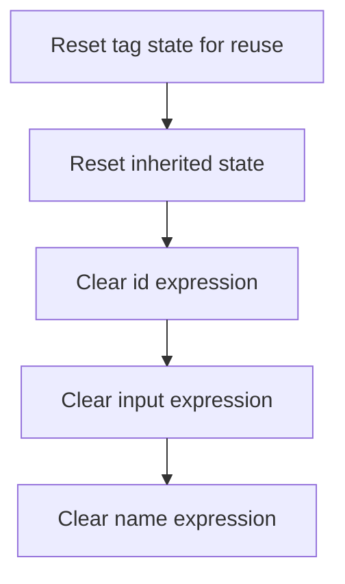

This document describes how image tag instances are prepared for reuse by clearing all references to their expression fields. This ensures that no stale data is retained, supporting safe reuse and proper garbage collection. The main steps are resetting the tag state, clearing resource tag expressions, and clearing image tag expressions.

# Resetting image tag state

<SwmSnippet path="/el/src/main/java/org/apache/strutsel/taglib/html/ELImgTag.java" line="1023">

---

In <SwmToken path="el/src/main/java/org/apache/strutsel/taglib/html/ELImgTag.java" pos="1023:5:5" line-data="    public void release() {">`release`</SwmToken>, we start by calling <SwmToken path="el/src/main/java/org/apache/strutsel/taglib/html/ELImgTag.java" pos="1024:1:5" line-data="        super.release();">`super.release()`</SwmToken> to trigger any cleanup logic from the parent class. After this, we move to ELResourceTag.release to clear out expression fields inherited or composed from <SwmToken path="el/src/main/java/org/apache/strutsel/taglib/bean/ELResourceTag.java" pos="38:4:4" line-data="public class ELResourceTag extends ResourceTag {">`ELResourceTag`</SwmToken>, making sure all references are dropped for garbage collection.

```java
    public void release() {
        super.release();
```

---

</SwmSnippet>

## Clearing resource tag expressions



<SwmSnippet path="/el/src/main/java/org/apache/strutsel/taglib/bean/ELResourceTag.java" line="108">

---

In <SwmToken path="el/src/main/java/org/apache/strutsel/taglib/bean/ELResourceTag.java" pos="108:5:5" line-data="    public void release() {">`release`</SwmToken>, we call <SwmToken path="el/src/main/java/org/apache/strutsel/taglib/bean/ELResourceTag.java" pos="109:1:5" line-data="        super.release();">`super.release()`</SwmToken> for inherited cleanup, then use setters to null out <SwmToken path="el/src/main/java/org/apache/strutsel/taglib/bean/ELResourceTag.java" pos="85:9:9" line-data="    public void setIdExpr(String idExpr) {">`idExpr`</SwmToken>, <SwmToken path="el/src/main/java/org/apache/strutsel/taglib/bean/ELResourceTag.java" pos="93:9:9" line-data="    public void setInputExpr(String inputExpr) {">`inputExpr`</SwmToken>, and <SwmToken path="el/src/main/java/org/apache/strutsel/taglib/html/ELImgTag.java" pos="784:9:9" line-data="    public void setNameExpr(String nameExpr) {">`nameExpr`</SwmToken>. This drops references for garbage collection and keeps the object ready for reuse.

```java
    public void release() {
        super.release();
        setIdExpr(null);
```

---

</SwmSnippet>

<SwmSnippet path="/el/src/main/java/org/apache/strutsel/taglib/bean/ELResourceTag.java" line="85">

---

<SwmToken path="el/src/main/java/org/apache/strutsel/taglib/bean/ELResourceTag.java" pos="85:5:5" line-data="    public void setIdExpr(String idExpr) {">`setIdExpr`</SwmToken> just assigns the provided string to <SwmToken path="el/src/main/java/org/apache/strutsel/taglib/bean/ELResourceTag.java" pos="85:9:9" line-data="    public void setIdExpr(String idExpr) {">`idExpr`</SwmToken>. No checks, no extra logic—just a plain setter.

```java
    public void setIdExpr(String idExpr) {
        this.idExpr = idExpr;
    }
```

---

</SwmSnippet>

<SwmSnippet path="/el/src/main/java/org/apache/strutsel/taglib/bean/ELResourceTag.java" line="111">

---

Back in ELResourceTag.release, after clearing <SwmToken path="el/src/main/java/org/apache/strutsel/taglib/bean/ELResourceTag.java" pos="85:9:9" line-data="    public void setIdExpr(String idExpr) {">`idExpr`</SwmToken>, we call <SwmToken path="el/src/main/java/org/apache/strutsel/taglib/bean/ELResourceTag.java" pos="111:1:1" line-data="        setInputExpr(null);">`setInputExpr`</SwmToken>(null) to drop any reference held by <SwmToken path="el/src/main/java/org/apache/strutsel/taglib/bean/ELResourceTag.java" pos="93:9:9" line-data="    public void setInputExpr(String inputExpr) {">`inputExpr`</SwmToken>. This keeps the cleanup consistent across all expression fields.

```java
        setInputExpr(null);
```

---

</SwmSnippet>

<SwmSnippet path="/el/src/main/java/org/apache/strutsel/taglib/bean/ELResourceTag.java" line="93">

---

<SwmToken path="el/src/main/java/org/apache/strutsel/taglib/bean/ELResourceTag.java" pos="93:5:5" line-data="    public void setInputExpr(String inputExpr) {">`setInputExpr`</SwmToken> just assigns the input string to <SwmToken path="el/src/main/java/org/apache/strutsel/taglib/bean/ELResourceTag.java" pos="93:9:9" line-data="    public void setInputExpr(String inputExpr) {">`inputExpr`</SwmToken>. No validation, no processing—just a plain setter.

```java
    public void setInputExpr(String inputExpr) {
        this.inputExpr = inputExpr;
    }
```

---

</SwmSnippet>

<SwmSnippet path="/el/src/main/java/org/apache/strutsel/taglib/bean/ELResourceTag.java" line="112">

---

After <SwmToken path="el/src/main/java/org/apache/strutsel/taglib/bean/ELResourceTag.java" pos="93:5:5" line-data="    public void setInputExpr(String inputExpr) {">`setInputExpr`</SwmToken>, we call <SwmToken path="el/src/main/java/org/apache/strutsel/taglib/bean/ELResourceTag.java" pos="112:1:1" line-data="        setNameExpr(null);">`setNameExpr`</SwmToken>(null) in ELResourceTag.release to finish clearing all expression fields. This wraps up the resource tag cleanup.

```java
        setNameExpr(null);
    }
```

---

</SwmSnippet>

<SwmSnippet path="/el/src/main/java/org/apache/strutsel/taglib/bean/ELResourceTag.java" line="101">

---

<SwmToken path="el/src/main/java/org/apache/strutsel/taglib/bean/ELResourceTag.java" pos="101:5:5" line-data="    public void setNameExpr(String nameExpr) {">`setNameExpr`</SwmToken> just assigns the input string to <SwmToken path="el/src/main/java/org/apache/strutsel/taglib/bean/ELResourceTag.java" pos="101:9:9" line-data="    public void setNameExpr(String nameExpr) {">`nameExpr`</SwmToken>. No validation, no processing—just a plain setter.

```java
    public void setNameExpr(String nameExpr) {
        this.nameExpr = nameExpr;
    }
```

---

</SwmSnippet>

## Clearing image tag expressions

<SwmSnippet path="/el/src/main/java/org/apache/strutsel/taglib/html/ELImgTag.java" line="1025">

---

After finishing ELResourceTag.release, ELImgTag.release continues by calling <SwmToken path="el/src/main/java/org/apache/strutsel/taglib/html/ELImgTag.java" pos="1025:1:1" line-data="        setActionExpr(null);">`setActionExpr`</SwmToken>(null) to clear the action expression reference. This is part of systematically dropping all expression fields.

```java
        setActionExpr(null);
```

---

</SwmSnippet>

<SwmSnippet path="/el/src/main/java/org/apache/strutsel/taglib/html/ELImgTag.java" line="672">

---

<SwmToken path="el/src/main/java/org/apache/strutsel/taglib/html/ELImgTag.java" pos="672:5:5" line-data="    public void setActionExpr(String actionExpr) {">`setActionExpr`</SwmToken> just assigns the input string to <SwmToken path="el/src/main/java/org/apache/strutsel/taglib/html/ELImgTag.java" pos="672:9:9" line-data="    public void setActionExpr(String actionExpr) {">`actionExpr`</SwmToken>. No validation, no processing—just a plain setter.

```java
    public void setActionExpr(String actionExpr) {
        this.actionExpr = actionExpr;
    }
```

---

</SwmSnippet>

<SwmSnippet path="/el/src/main/java/org/apache/strutsel/taglib/html/ELImgTag.java" line="1026">

---

After <SwmToken path="el/src/main/java/org/apache/strutsel/taglib/html/ELImgTag.java" pos="672:5:5" line-data="    public void setActionExpr(String actionExpr) {">`setActionExpr`</SwmToken>, ELImgTag.release calls <SwmToken path="el/src/main/java/org/apache/strutsel/taglib/html/ELImgTag.java" pos="1026:1:1" line-data="        setModuleExpr(null);">`setModuleExpr`</SwmToken>(null) to clear the module expression reference. Just working through the list of fields to drop all references.

```java
        setModuleExpr(null);
```

---

</SwmSnippet>

<SwmSnippet path="/el/src/main/java/org/apache/strutsel/taglib/html/ELImgTag.java" line="680">

---

<SwmToken path="el/src/main/java/org/apache/strutsel/taglib/html/ELImgTag.java" pos="680:5:5" line-data="    public void setModuleExpr(String moduleExpr) {">`setModuleExpr`</SwmToken> just assigns the input string to <SwmToken path="el/src/main/java/org/apache/strutsel/taglib/html/ELImgTag.java" pos="680:9:9" line-data="    public void setModuleExpr(String moduleExpr) {">`moduleExpr`</SwmToken>. No validation, no processing—just a plain setter.

```java
    public void setModuleExpr(String moduleExpr) {
        this.moduleExpr = moduleExpr;
    }
```

---

</SwmSnippet>

<SwmSnippet path="/el/src/main/java/org/apache/strutsel/taglib/html/ELImgTag.java" line="1027">

---

After <SwmToken path="el/src/main/java/org/apache/strutsel/taglib/html/ELImgTag.java" pos="680:5:5" line-data="    public void setModuleExpr(String moduleExpr) {">`setModuleExpr`</SwmToken>, ELImgTag.release calls <SwmToken path="el/src/main/java/org/apache/strutsel/taglib/html/ELImgTag.java" pos="1027:1:1" line-data="        setAlignExpr(null);">`setAlignExpr`</SwmToken>(null) to clear the align expression reference. Just working through the list of fields to drop all references.

```java
        setAlignExpr(null);
```

---

</SwmSnippet>

<SwmSnippet path="/el/src/main/java/org/apache/strutsel/taglib/html/ELImgTag.java" line="688">

---

<SwmToken path="el/src/main/java/org/apache/strutsel/taglib/html/ELImgTag.java" pos="688:5:5" line-data="    public void setAlignExpr(String alignExpr) {">`setAlignExpr`</SwmToken> just assigns the input string to <SwmToken path="el/src/main/java/org/apache/strutsel/taglib/html/ELImgTag.java" pos="688:9:9" line-data="    public void setAlignExpr(String alignExpr) {">`alignExpr`</SwmToken>. No validation, no processing—just a plain setter.

```java
    public void setAlignExpr(String alignExpr) {
        this.alignExpr = alignExpr;
    }
```

---

</SwmSnippet>

<SwmSnippet path="/el/src/main/java/org/apache/strutsel/taglib/html/ELImgTag.java" line="1028">

---

After <SwmToken path="el/src/main/java/org/apache/strutsel/taglib/html/ELImgTag.java" pos="688:5:5" line-data="    public void setAlignExpr(String alignExpr) {">`setAlignExpr`</SwmToken>, ELImgTag.release calls <SwmToken path="el/src/main/java/org/apache/strutsel/taglib/html/ELImgTag.java" pos="1028:1:1" line-data="        setAltExpr(null);">`setAltExpr`</SwmToken>(null) to clear the alt expression reference. Just working through the list of fields to drop all references.

```java
        setAltExpr(null);
```

---

</SwmSnippet>

<SwmSnippet path="/el/src/main/java/org/apache/strutsel/taglib/html/ELImgTag.java" line="696">

---

<SwmToken path="el/src/main/java/org/apache/strutsel/taglib/html/ELImgTag.java" pos="696:5:5" line-data="    public void setAltExpr(String altExpr) {">`setAltExpr`</SwmToken> just assigns the input string to <SwmToken path="el/src/main/java/org/apache/strutsel/taglib/html/ELImgTag.java" pos="696:9:9" line-data="    public void setAltExpr(String altExpr) {">`altExpr`</SwmToken>. No validation, no processing—just a plain setter.

```java
    public void setAltExpr(String altExpr) {
        this.altExpr = altExpr;
    }
```

---

</SwmSnippet>

<SwmSnippet path="/el/src/main/java/org/apache/strutsel/taglib/html/ELImgTag.java" line="1029">

---

After <SwmToken path="el/src/main/java/org/apache/strutsel/taglib/html/ELImgTag.java" pos="696:5:5" line-data="    public void setAltExpr(String altExpr) {">`setAltExpr`</SwmToken>, ELImgTag.release calls <SwmToken path="el/src/main/java/org/apache/strutsel/taglib/html/ELImgTag.java" pos="1029:1:1" line-data="        setAltKeyExpr(null);">`setAltKeyExpr`</SwmToken>(null) to clear the alt key expression reference. Just working through the list of fields to drop all references.

```java
        setAltKeyExpr(null);
```

---

</SwmSnippet>

<SwmSnippet path="/el/src/main/java/org/apache/strutsel/taglib/html/ELImgTag.java" line="704">

---

<SwmToken path="el/src/main/java/org/apache/strutsel/taglib/html/ELImgTag.java" pos="704:5:5" line-data="    public void setAltKeyExpr(String altKeyExpr) {">`setAltKeyExpr`</SwmToken> just assigns the input string to <SwmToken path="el/src/main/java/org/apache/strutsel/taglib/html/ELImgTag.java" pos="704:9:9" line-data="    public void setAltKeyExpr(String altKeyExpr) {">`altKeyExpr`</SwmToken>. No validation, no processing—just a plain setter.

```java
    public void setAltKeyExpr(String altKeyExpr) {
        this.altKeyExpr = altKeyExpr;
    }
```

---

</SwmSnippet>

<SwmSnippet path="/el/src/main/java/org/apache/strutsel/taglib/html/ELImgTag.java" line="1030">

---

After <SwmToken path="el/src/main/java/org/apache/strutsel/taglib/html/ELImgTag.java" pos="704:5:5" line-data="    public void setAltKeyExpr(String altKeyExpr) {">`setAltKeyExpr`</SwmToken>, ELImgTag.release calls <SwmToken path="el/src/main/java/org/apache/strutsel/taglib/html/ELImgTag.java" pos="1030:1:1" line-data="        setBorderExpr(null);">`setBorderExpr`</SwmToken>(null) to clear the border expression reference. Just working through the list of fields to drop all references.

```java
        setBorderExpr(null);
```

---

</SwmSnippet>

<SwmSnippet path="/el/src/main/java/org/apache/strutsel/taglib/html/ELImgTag.java" line="712">

---

<SwmToken path="el/src/main/java/org/apache/strutsel/taglib/html/ELImgTag.java" pos="712:5:5" line-data="    public void setBorderExpr(String borderExpr) {">`setBorderExpr`</SwmToken> just assigns the input string to <SwmToken path="el/src/main/java/org/apache/strutsel/taglib/html/ELImgTag.java" pos="712:9:9" line-data="    public void setBorderExpr(String borderExpr) {">`borderExpr`</SwmToken>. No validation, no processing—just a plain setter.

```java
    public void setBorderExpr(String borderExpr) {
        this.borderExpr = borderExpr;
    }
```

---

</SwmSnippet>

<SwmSnippet path="/el/src/main/java/org/apache/strutsel/taglib/html/ELImgTag.java" line="1031">

---

After <SwmToken path="el/src/main/java/org/apache/strutsel/taglib/html/ELImgTag.java" pos="712:5:5" line-data="    public void setBorderExpr(String borderExpr) {">`setBorderExpr`</SwmToken>, ELImgTag.release calls <SwmToken path="el/src/main/java/org/apache/strutsel/taglib/html/ELImgTag.java" pos="1031:1:1" line-data="        setBundleExpr(null);">`setBundleExpr`</SwmToken>(null) to clear the bundle expression reference. Just working through the list of fields to drop all references.

```java
        setBundleExpr(null);
```

---

</SwmSnippet>

<SwmSnippet path="/el/src/main/java/org/apache/strutsel/taglib/html/ELImgTag.java" line="720">

---

<SwmToken path="el/src/main/java/org/apache/strutsel/taglib/html/ELImgTag.java" pos="720:5:5" line-data="    public void setBundleExpr(String bundleExpr) {">`setBundleExpr`</SwmToken> just assigns the input string to <SwmToken path="el/src/main/java/org/apache/strutsel/taglib/html/ELImgTag.java" pos="720:9:9" line-data="    public void setBundleExpr(String bundleExpr) {">`bundleExpr`</SwmToken>. No validation, no processing—just a plain setter.

```java
    public void setBundleExpr(String bundleExpr) {
        this.bundleExpr = bundleExpr;
    }
```

---

</SwmSnippet>

<SwmSnippet path="/el/src/main/java/org/apache/strutsel/taglib/html/ELImgTag.java" line="1032">

---

After <SwmToken path="el/src/main/java/org/apache/strutsel/taglib/html/ELImgTag.java" pos="720:5:5" line-data="    public void setBundleExpr(String bundleExpr) {">`setBundleExpr`</SwmToken>, ELImgTag.release calls <SwmToken path="el/src/main/java/org/apache/strutsel/taglib/html/ELImgTag.java" pos="1032:1:1" line-data="        setDirExpr(null);">`setDirExpr`</SwmToken>(null) to clear the dir expression reference. Just working through the list of fields to drop all references.

```java
        setDirExpr(null);
```

---

</SwmSnippet>

<SwmSnippet path="/el/src/main/java/org/apache/strutsel/taglib/html/ELImgTag.java" line="728">

---

<SwmToken path="el/src/main/java/org/apache/strutsel/taglib/html/ELImgTag.java" pos="728:5:5" line-data="    public void setDirExpr(String dirExpr) {">`setDirExpr`</SwmToken> just assigns the input string to <SwmToken path="el/src/main/java/org/apache/strutsel/taglib/html/ELImgTag.java" pos="728:9:9" line-data="    public void setDirExpr(String dirExpr) {">`dirExpr`</SwmToken>. No validation, no processing—just a plain setter.

```java
    public void setDirExpr(String dirExpr) {
        this.dirExpr = dirExpr;
    }
```

---

</SwmSnippet>

<SwmSnippet path="/el/src/main/java/org/apache/strutsel/taglib/html/ELImgTag.java" line="1033">

---

After <SwmToken path="el/src/main/java/org/apache/strutsel/taglib/html/ELImgTag.java" pos="728:5:5" line-data="    public void setDirExpr(String dirExpr) {">`setDirExpr`</SwmToken>, ELImgTag.release calls <SwmToken path="el/src/main/java/org/apache/strutsel/taglib/html/ELImgTag.java" pos="1033:1:1" line-data="        setHeightExpr(null);">`setHeightExpr`</SwmToken>(null) to clear the height expression reference. Just working through the list of fields to drop all references.

```java
        setHeightExpr(null);
```

---

</SwmSnippet>

<SwmSnippet path="/el/src/main/java/org/apache/strutsel/taglib/html/ELImgTag.java" line="736">

---

<SwmToken path="el/src/main/java/org/apache/strutsel/taglib/html/ELImgTag.java" pos="736:5:5" line-data="    public void setHeightExpr(String heightExpr) {">`setHeightExpr`</SwmToken> just assigns the input string to <SwmToken path="el/src/main/java/org/apache/strutsel/taglib/html/ELImgTag.java" pos="736:9:9" line-data="    public void setHeightExpr(String heightExpr) {">`heightExpr`</SwmToken>. No validation, no processing—just a plain setter.

```java
    public void setHeightExpr(String heightExpr) {
        this.heightExpr = heightExpr;
    }
```

---

</SwmSnippet>

<SwmSnippet path="/el/src/main/java/org/apache/strutsel/taglib/html/ELImgTag.java" line="1034">

---

After <SwmToken path="el/src/main/java/org/apache/strutsel/taglib/html/ELImgTag.java" pos="736:5:5" line-data="    public void setHeightExpr(String heightExpr) {">`setHeightExpr`</SwmToken>, ELImgTag.release calls <SwmToken path="el/src/main/java/org/apache/strutsel/taglib/html/ELImgTag.java" pos="1034:1:1" line-data="        setHspaceExpr(null);">`setHspaceExpr`</SwmToken>(null) to clear the hspace expression reference. Just working through the list of fields to drop all references.

```java
        setHspaceExpr(null);
```

---

</SwmSnippet>

<SwmSnippet path="/el/src/main/java/org/apache/strutsel/taglib/html/ELImgTag.java" line="744">

---

<SwmToken path="el/src/main/java/org/apache/strutsel/taglib/html/ELImgTag.java" pos="744:5:5" line-data="    public void setHspaceExpr(String hspaceExpr) {">`setHspaceExpr`</SwmToken> just assigns the input string to <SwmToken path="el/src/main/java/org/apache/strutsel/taglib/html/ELImgTag.java" pos="744:9:9" line-data="    public void setHspaceExpr(String hspaceExpr) {">`hspaceExpr`</SwmToken>. No validation, no processing—just a plain setter.

```java
    public void setHspaceExpr(String hspaceExpr) {
        this.hspaceExpr = hspaceExpr;
    }
```

---

</SwmSnippet>

<SwmSnippet path="/el/src/main/java/org/apache/strutsel/taglib/html/ELImgTag.java" line="1035">

---

After <SwmToken path="el/src/main/java/org/apache/strutsel/taglib/html/ELImgTag.java" pos="744:5:5" line-data="    public void setHspaceExpr(String hspaceExpr) {">`setHspaceExpr`</SwmToken>, ELImgTag.release calls <SwmToken path="el/src/main/java/org/apache/strutsel/taglib/html/ELImgTag.java" pos="1035:1:1" line-data="        setImageNameExpr(null);">`setImageNameExpr`</SwmToken>(null) to clear the image name expression reference. Just working through the list of fields to drop all references.

```java
        setImageNameExpr(null);
```

---

</SwmSnippet>

<SwmSnippet path="/el/src/main/java/org/apache/strutsel/taglib/html/ELImgTag.java" line="752">

---

<SwmToken path="el/src/main/java/org/apache/strutsel/taglib/html/ELImgTag.java" pos="752:5:5" line-data="    public void setImageNameExpr(String imageNameExpr) {">`setImageNameExpr`</SwmToken> just assigns the input string to <SwmToken path="el/src/main/java/org/apache/strutsel/taglib/html/ELImgTag.java" pos="752:9:9" line-data="    public void setImageNameExpr(String imageNameExpr) {">`imageNameExpr`</SwmToken>. No validation, no processing—just a plain setter.

```java
    public void setImageNameExpr(String imageNameExpr) {
        this.imageNameExpr = imageNameExpr;
    }
```

---

</SwmSnippet>

<SwmSnippet path="/el/src/main/java/org/apache/strutsel/taglib/html/ELImgTag.java" line="1036">

---

After <SwmToken path="el/src/main/java/org/apache/strutsel/taglib/html/ELImgTag.java" pos="752:5:5" line-data="    public void setImageNameExpr(String imageNameExpr) {">`setImageNameExpr`</SwmToken>, ELImgTag.release calls <SwmToken path="el/src/main/java/org/apache/strutsel/taglib/html/ELImgTag.java" pos="1036:1:1" line-data="        setIsmapExpr(null);">`setIsmapExpr`</SwmToken>(null) to clear the ismap expression reference. Just working through the list of fields to drop all references.

```java
        setIsmapExpr(null);
```

---

</SwmSnippet>

<SwmSnippet path="/el/src/main/java/org/apache/strutsel/taglib/html/ELImgTag.java" line="760">

---

<SwmToken path="el/src/main/java/org/apache/strutsel/taglib/html/ELImgTag.java" pos="760:5:5" line-data="    public void setIsmapExpr(String ismapExpr) {">`setIsmapExpr`</SwmToken> just assigns the input string to <SwmToken path="el/src/main/java/org/apache/strutsel/taglib/html/ELImgTag.java" pos="760:9:9" line-data="    public void setIsmapExpr(String ismapExpr) {">`ismapExpr`</SwmToken>. No validation, no processing—just a plain setter.

```java
    public void setIsmapExpr(String ismapExpr) {
        this.ismapExpr = ismapExpr;
    }
```

---

</SwmSnippet>

<SwmSnippet path="/el/src/main/java/org/apache/strutsel/taglib/html/ELImgTag.java" line="1037">

---

After <SwmToken path="el/src/main/java/org/apache/strutsel/taglib/html/ELImgTag.java" pos="760:5:5" line-data="    public void setIsmapExpr(String ismapExpr) {">`setIsmapExpr`</SwmToken>, ELImgTag.release calls <SwmToken path="el/src/main/java/org/apache/strutsel/taglib/html/ELImgTag.java" pos="1037:1:1" line-data="        setLangExpr(null);">`setLangExpr`</SwmToken>(null) to clear the lang expression reference. Just working through the list of fields to drop all references.

```java
        setLangExpr(null);
```

---

</SwmSnippet>

<SwmSnippet path="/el/src/main/java/org/apache/strutsel/taglib/html/ELImgTag.java" line="768">

---

<SwmToken path="el/src/main/java/org/apache/strutsel/taglib/html/ELImgTag.java" pos="768:5:5" line-data="    public void setLangExpr(String langExpr) {">`setLangExpr`</SwmToken> just assigns the input string to <SwmToken path="el/src/main/java/org/apache/strutsel/taglib/html/ELImgTag.java" pos="768:9:9" line-data="    public void setLangExpr(String langExpr) {">`langExpr`</SwmToken>. No validation, no processing—just a plain setter.

```java
    public void setLangExpr(String langExpr) {
        this.langExpr = langExpr;
    }
```

---

</SwmSnippet>

<SwmSnippet path="/el/src/main/java/org/apache/strutsel/taglib/html/ELImgTag.java" line="1038">

---

After <SwmToken path="el/src/main/java/org/apache/strutsel/taglib/html/ELImgTag.java" pos="768:5:5" line-data="    public void setLangExpr(String langExpr) {">`setLangExpr`</SwmToken>, ELImgTag.release calls <SwmToken path="el/src/main/java/org/apache/strutsel/taglib/html/ELImgTag.java" pos="1038:1:1" line-data="        setLocaleExpr(null);">`setLocaleExpr`</SwmToken>(null) to clear the locale expression reference. Just working through the list of fields to drop all references.

```java
        setLocaleExpr(null);
```

---

</SwmSnippet>

<SwmSnippet path="/el/src/main/java/org/apache/strutsel/taglib/html/ELImgTag.java" line="776">

---

<SwmToken path="el/src/main/java/org/apache/strutsel/taglib/html/ELImgTag.java" pos="776:5:5" line-data="    public void setLocaleExpr(String localeExpr) {">`setLocaleExpr`</SwmToken> just assigns the input string to <SwmToken path="el/src/main/java/org/apache/strutsel/taglib/html/ELImgTag.java" pos="776:9:9" line-data="    public void setLocaleExpr(String localeExpr) {">`localeExpr`</SwmToken>. No validation, no processing—just a plain setter.

```java
    public void setLocaleExpr(String localeExpr) {
        this.localeExpr = localeExpr;
    }
```

---

</SwmSnippet>

<SwmSnippet path="/el/src/main/java/org/apache/strutsel/taglib/html/ELImgTag.java" line="1039">

---

After <SwmToken path="el/src/main/java/org/apache/strutsel/taglib/html/ELImgTag.java" pos="776:5:5" line-data="    public void setLocaleExpr(String localeExpr) {">`setLocaleExpr`</SwmToken>, ELImgTag.release calls <SwmToken path="el/src/main/java/org/apache/strutsel/taglib/html/ELImgTag.java" pos="1039:1:1" line-data="        setNameExpr(null);">`setNameExpr`</SwmToken>(null) to clear the name expression reference. Just working through the list of fields to drop all references.

```java
        setNameExpr(null);
```

---

</SwmSnippet>

<SwmSnippet path="/el/src/main/java/org/apache/strutsel/taglib/html/ELImgTag.java" line="784">

---

<SwmToken path="el/src/main/java/org/apache/strutsel/taglib/html/ELImgTag.java" pos="784:5:5" line-data="    public void setNameExpr(String nameExpr) {">`setNameExpr`</SwmToken> just assigns the input string to <SwmToken path="el/src/main/java/org/apache/strutsel/taglib/html/ELImgTag.java" pos="784:9:9" line-data="    public void setNameExpr(String nameExpr) {">`nameExpr`</SwmToken>. No validation, no processing—just a plain setter.

```java
    public void setNameExpr(String nameExpr) {
        this.nameExpr = nameExpr;
    }
```

---

</SwmSnippet>

<SwmSnippet path="/el/src/main/java/org/apache/strutsel/taglib/html/ELImgTag.java" line="1040">

---

Back in ELImgTag.release, after clearing <SwmToken path="el/src/main/java/org/apache/strutsel/taglib/html/ELImgTag.java" pos="784:9:9" line-data="    public void setNameExpr(String nameExpr) {">`nameExpr`</SwmToken>, we call <SwmToken path="el/src/main/java/org/apache/strutsel/taglib/html/ELImgTag.java" pos="1040:1:1" line-data="        setOnclickExpr(null);">`setOnclickExpr`</SwmToken>(null) to drop any reference to the onclick expression. This keeps the tag instance clean for reuse and avoids leaking old event handler expressions.

```java
        setOnclickExpr(null);
```

---

</SwmSnippet>

<SwmSnippet path="/el/src/main/java/org/apache/strutsel/taglib/html/ELImgTag.java" line="792">

---

SetOnclickExpr just assigns the input string to <SwmToken path="el/src/main/java/org/apache/strutsel/taglib/html/ELImgTag.java" pos="792:9:9" line-data="    public void setOnclickExpr(String onclickExpr) {">`onclickExpr`</SwmToken>. No checks, no extra logic—just a plain setter.

```java
    public void setOnclickExpr(String onclickExpr) {
        this.onclickExpr = onclickExpr;
    }
```

---

</SwmSnippet>

<SwmSnippet path="/el/src/main/java/org/apache/strutsel/taglib/html/ELImgTag.java" line="1041">

---

After <SwmToken path="el/src/main/java/org/apache/strutsel/taglib/html/ELImgTag.java" pos="792:5:5" line-data="    public void setOnclickExpr(String onclickExpr) {">`setOnclickExpr`</SwmToken>, ELImgTag.release calls <SwmToken path="el/src/main/java/org/apache/strutsel/taglib/html/ELImgTag.java" pos="1041:1:1" line-data="        setOndblclickExpr(null);">`setOndblclickExpr`</SwmToken>(null) to clear any double-click handler expression. This keeps the tag instance from holding onto old event handler references.

```java
        setOndblclickExpr(null);
```

---

</SwmSnippet>

<SwmSnippet path="/el/src/main/java/org/apache/strutsel/taglib/html/ELImgTag.java" line="800">

---

SetOndblclickExpr just assigns the input string to <SwmToken path="el/src/main/java/org/apache/strutsel/taglib/html/ELImgTag.java" pos="800:9:9" line-data="    public void setOndblclickExpr(String ondblclickExpr) {">`ondblclickExpr`</SwmToken>. No validation, no processing—just a plain setter.

```java
    public void setOndblclickExpr(String ondblclickExpr) {
        this.ondblclickExpr = ondblclickExpr;
    }
```

---

</SwmSnippet>

<SwmSnippet path="/el/src/main/java/org/apache/strutsel/taglib/html/ELImgTag.java" line="1042">

---

After <SwmToken path="el/src/main/java/org/apache/strutsel/taglib/html/ELImgTag.java" pos="800:5:5" line-data="    public void setOndblclickExpr(String ondblclickExpr) {">`setOndblclickExpr`</SwmToken>, ELImgTag.release calls <SwmToken path="el/src/main/java/org/apache/strutsel/taglib/html/ELImgTag.java" pos="1042:1:1" line-data="        setOnkeydownExpr(null);">`setOnkeydownExpr`</SwmToken>(null) to clear any keydown handler expression. This avoids leaking old event handler state between uses.

```java
        setOnkeydownExpr(null);
```

---

</SwmSnippet>

<SwmSnippet path="/el/src/main/java/org/apache/strutsel/taglib/html/ELImgTag.java" line="808">

---

SetOnkeydownExpr just assigns the input string to <SwmToken path="el/src/main/java/org/apache/strutsel/taglib/html/ELImgTag.java" pos="808:9:9" line-data="    public void setOnkeydownExpr(String onkeydownExpr) {">`onkeydownExpr`</SwmToken>. No checks, no extra logic—just a plain setter.

```java
    public void setOnkeydownExpr(String onkeydownExpr) {
        this.onkeydownExpr = onkeydownExpr;
    }
```

---

</SwmSnippet>

<SwmSnippet path="/el/src/main/java/org/apache/strutsel/taglib/html/ELImgTag.java" line="1043">

---

After <SwmToken path="el/src/main/java/org/apache/strutsel/taglib/html/ELImgTag.java" pos="808:5:5" line-data="    public void setOnkeydownExpr(String onkeydownExpr) {">`setOnkeydownExpr`</SwmToken>, ELImgTag.release calls <SwmToken path="el/src/main/java/org/apache/strutsel/taglib/html/ELImgTag.java" pos="1043:1:1" line-data="        setOnkeypressExpr(null);">`setOnkeypressExpr`</SwmToken>(null) to clear any keypress handler expression. This keeps the tag instance from leaking old event handler state.

```java
        setOnkeypressExpr(null);
```

---

</SwmSnippet>

<SwmSnippet path="/el/src/main/java/org/apache/strutsel/taglib/html/ELImgTag.java" line="816">

---

SetOnkeypressExpr just assigns the input string to <SwmToken path="el/src/main/java/org/apache/strutsel/taglib/html/ELImgTag.java" pos="816:9:9" line-data="    public void setOnkeypressExpr(String onkeypressExpr) {">`onkeypressExpr`</SwmToken>. No checks, no extra logic—just a plain setter.

```java
    public void setOnkeypressExpr(String onkeypressExpr) {
        this.onkeypressExpr = onkeypressExpr;
    }
```

---

</SwmSnippet>

<SwmSnippet path="/el/src/main/java/org/apache/strutsel/taglib/html/ELImgTag.java" line="1044">

---

After <SwmToken path="el/src/main/java/org/apache/strutsel/taglib/html/ELImgTag.java" pos="816:5:5" line-data="    public void setOnkeypressExpr(String onkeypressExpr) {">`setOnkeypressExpr`</SwmToken>, ELImgTag.release calls <SwmToken path="el/src/main/java/org/apache/strutsel/taglib/html/ELImgTag.java" pos="1044:1:1" line-data="        setOnkeyupExpr(null);">`setOnkeyupExpr`</SwmToken>(null) to clear any keyup handler expression. This keeps the tag instance from leaking old event handler state.

```java
        setOnkeyupExpr(null);
```

---

</SwmSnippet>

<SwmSnippet path="/el/src/main/java/org/apache/strutsel/taglib/html/ELImgTag.java" line="824">

---

SetOnkeyupExpr just assigns the input string to <SwmToken path="el/src/main/java/org/apache/strutsel/taglib/html/ELImgTag.java" pos="824:9:9" line-data="    public void setOnkeyupExpr(String onkeyupExpr) {">`onkeyupExpr`</SwmToken>. No checks, no extra logic—just a plain setter.

```java
    public void setOnkeyupExpr(String onkeyupExpr) {
        this.onkeyupExpr = onkeyupExpr;
    }
```

---

</SwmSnippet>

<SwmSnippet path="/el/src/main/java/org/apache/strutsel/taglib/html/ELImgTag.java" line="1045">

---

After <SwmToken path="el/src/main/java/org/apache/strutsel/taglib/html/ELImgTag.java" pos="824:5:5" line-data="    public void setOnkeyupExpr(String onkeyupExpr) {">`setOnkeyupExpr`</SwmToken>, ELImgTag.release calls <SwmToken path="el/src/main/java/org/apache/strutsel/taglib/html/ELImgTag.java" pos="1045:1:1" line-data="        setOnmousedownExpr(null);">`setOnmousedownExpr`</SwmToken>(null) to clear any mousedown handler expression. This keeps the tag instance from leaking old event handler state.

```java
        setOnmousedownExpr(null);
```

---

</SwmSnippet>

<SwmSnippet path="/el/src/main/java/org/apache/strutsel/taglib/html/ELImgTag.java" line="832">

---

SetOnmousedownExpr just assigns the input string to <SwmToken path="el/src/main/java/org/apache/strutsel/taglib/html/ELImgTag.java" pos="832:9:9" line-data="    public void setOnmousedownExpr(String onmousedownExpr) {">`onmousedownExpr`</SwmToken>. No checks, no extra logic—just a plain setter.

```java
    public void setOnmousedownExpr(String onmousedownExpr) {
        this.onmousedownExpr = onmousedownExpr;
    }
```

---

</SwmSnippet>

<SwmSnippet path="/el/src/main/java/org/apache/strutsel/taglib/html/ELImgTag.java" line="1046">

---

After <SwmToken path="el/src/main/java/org/apache/strutsel/taglib/html/ELImgTag.java" pos="832:5:5" line-data="    public void setOnmousedownExpr(String onmousedownExpr) {">`setOnmousedownExpr`</SwmToken>, ELImgTag.release calls <SwmToken path="el/src/main/java/org/apache/strutsel/taglib/html/ELImgTag.java" pos="1046:1:1" line-data="        setOnmousemoveExpr(null);">`setOnmousemoveExpr`</SwmToken>(null) to clear any mousemove handler expression. This keeps the tag instance from leaking old event handler state.

```java
        setOnmousemoveExpr(null);
```

---

</SwmSnippet>

<SwmSnippet path="/el/src/main/java/org/apache/strutsel/taglib/html/ELImgTag.java" line="840">

---

SetOnmousemoveExpr just assigns the input string to <SwmToken path="el/src/main/java/org/apache/strutsel/taglib/html/ELImgTag.java" pos="840:9:9" line-data="    public void setOnmousemoveExpr(String onmousemoveExpr) {">`onmousemoveExpr`</SwmToken>. No checks, no extra logic—just a plain setter.

```java
    public void setOnmousemoveExpr(String onmousemoveExpr) {
        this.onmousemoveExpr = onmousemoveExpr;
    }
```

---

</SwmSnippet>

<SwmSnippet path="/el/src/main/java/org/apache/strutsel/taglib/html/ELImgTag.java" line="1047">

---

After <SwmToken path="el/src/main/java/org/apache/strutsel/taglib/html/ELImgTag.java" pos="840:5:5" line-data="    public void setOnmousemoveExpr(String onmousemoveExpr) {">`setOnmousemoveExpr`</SwmToken>, ELImgTag.release calls <SwmToken path="el/src/main/java/org/apache/strutsel/taglib/html/ELImgTag.java" pos="1047:1:1" line-data="        setOnmouseoutExpr(null);">`setOnmouseoutExpr`</SwmToken>(null) to clear any mouseout handler expression. This keeps the tag instance from leaking old event handler state.

```java
        setOnmouseoutExpr(null);
```

---

</SwmSnippet>

<SwmSnippet path="/el/src/main/java/org/apache/strutsel/taglib/html/ELImgTag.java" line="848">

---

SetOnmouseoutExpr just assigns the input string to <SwmToken path="el/src/main/java/org/apache/strutsel/taglib/html/ELImgTag.java" pos="848:9:9" line-data="    public void setOnmouseoutExpr(String onmouseoutExpr) {">`onmouseoutExpr`</SwmToken>. No checks, no extra logic—just a plain setter.

```java
    public void setOnmouseoutExpr(String onmouseoutExpr) {
        this.onmouseoutExpr = onmouseoutExpr;
    }
```

---

</SwmSnippet>

<SwmSnippet path="/el/src/main/java/org/apache/strutsel/taglib/html/ELImgTag.java" line="1048">

---

After <SwmToken path="el/src/main/java/org/apache/strutsel/taglib/html/ELImgTag.java" pos="848:5:5" line-data="    public void setOnmouseoutExpr(String onmouseoutExpr) {">`setOnmouseoutExpr`</SwmToken>, ELImgTag.release calls <SwmToken path="el/src/main/java/org/apache/strutsel/taglib/html/ELImgTag.java" pos="1048:1:1" line-data="        setOnmouseoverExpr(null);">`setOnmouseoverExpr`</SwmToken>(null) to clear any mouseover handler expression. This keeps the tag instance from leaking old event handler state.

```java
        setOnmouseoverExpr(null);
```

---

</SwmSnippet>

<SwmSnippet path="/el/src/main/java/org/apache/strutsel/taglib/html/ELImgTag.java" line="856">

---

SetOnmouseoverExpr just assigns the input string to <SwmToken path="el/src/main/java/org/apache/strutsel/taglib/html/ELImgTag.java" pos="856:9:9" line-data="    public void setOnmouseoverExpr(String onmouseoverExpr) {">`onmouseoverExpr`</SwmToken>. No checks, no extra logic—just a plain setter.

```java
    public void setOnmouseoverExpr(String onmouseoverExpr) {
        this.onmouseoverExpr = onmouseoverExpr;
    }
```

---

</SwmSnippet>

<SwmSnippet path="/el/src/main/java/org/apache/strutsel/taglib/html/ELImgTag.java" line="1049">

---

After <SwmToken path="el/src/main/java/org/apache/strutsel/taglib/html/ELImgTag.java" pos="856:5:5" line-data="    public void setOnmouseoverExpr(String onmouseoverExpr) {">`setOnmouseoverExpr`</SwmToken>, ELImgTag.release calls <SwmToken path="el/src/main/java/org/apache/strutsel/taglib/html/ELImgTag.java" pos="1049:1:1" line-data="        setOnmouseupExpr(null);">`setOnmouseupExpr`</SwmToken>(null) to clear any mouseup handler expression. This keeps the tag instance from leaking old event handler state.

```java
        setOnmouseupExpr(null);
```

---

</SwmSnippet>

<SwmSnippet path="/el/src/main/java/org/apache/strutsel/taglib/html/ELImgTag.java" line="864">

---

SetOnmouseupExpr just assigns the input string to <SwmToken path="el/src/main/java/org/apache/strutsel/taglib/html/ELImgTag.java" pos="864:9:9" line-data="    public void setOnmouseupExpr(String onmouseupExpr) {">`onmouseupExpr`</SwmToken>. No checks, no extra logic—just a plain setter.

```java
    public void setOnmouseupExpr(String onmouseupExpr) {
        this.onmouseupExpr = onmouseupExpr;
    }
```

---

</SwmSnippet>

<SwmSnippet path="/el/src/main/java/org/apache/strutsel/taglib/html/ELImgTag.java" line="1050">

---

After <SwmToken path="el/src/main/java/org/apache/strutsel/taglib/html/ELImgTag.java" pos="864:5:5" line-data="    public void setOnmouseupExpr(String onmouseupExpr) {">`setOnmouseupExpr`</SwmToken>, ELImgTag.release calls <SwmToken path="el/src/main/java/org/apache/strutsel/taglib/html/ELImgTag.java" pos="1050:1:1" line-data="        setPageExpr(null);">`setPageExpr`</SwmToken>(null) to clear any page expression reference. This keeps the tag instance from leaking old navigation or resource state.

```java
        setPageExpr(null);
```

---

</SwmSnippet>

<SwmSnippet path="/el/src/main/java/org/apache/strutsel/taglib/html/ELImgTag.java" line="880">

---

SetPageExpr just assigns the input string to <SwmToken path="el/src/main/java/org/apache/strutsel/taglib/html/ELImgTag.java" pos="880:9:9" line-data="    public void setPageExpr(String pageExpr) {">`pageExpr`</SwmToken>. No checks, no extra logic—just a plain setter.

```java
    public void setPageExpr(String pageExpr) {
        this.pageExpr = pageExpr;
    }
```

---

</SwmSnippet>

<SwmSnippet path="/el/src/main/java/org/apache/strutsel/taglib/html/ELImgTag.java" line="1051">

---

After <SwmToken path="el/src/main/java/org/apache/strutsel/taglib/html/ELImgTag.java" pos="880:5:5" line-data="    public void setPageExpr(String pageExpr) {">`setPageExpr`</SwmToken>, ELImgTag.release calls <SwmToken path="el/src/main/java/org/apache/strutsel/taglib/html/ELImgTag.java" pos="1051:1:1" line-data="        setPageKeyExpr(null);">`setPageKeyExpr`</SwmToken>(null) to clear any page key expression reference. This keeps the tag instance from leaking old resource state.

```java
        setPageKeyExpr(null);
```

---

</SwmSnippet>

<SwmSnippet path="/el/src/main/java/org/apache/strutsel/taglib/html/ELImgTag.java" line="888">

---

SetPageKeyExpr just assigns the input string to <SwmToken path="el/src/main/java/org/apache/strutsel/taglib/html/ELImgTag.java" pos="888:9:9" line-data="    public void setPageKeyExpr(String pageKeyExpr) {">`pageKeyExpr`</SwmToken>. No checks, no extra logic—just a plain setter.

```java
    public void setPageKeyExpr(String pageKeyExpr) {
        this.pageKeyExpr = pageKeyExpr;
    }
```

---

</SwmSnippet>

<SwmSnippet path="/el/src/main/java/org/apache/strutsel/taglib/html/ELImgTag.java" line="1052">

---

After <SwmToken path="el/src/main/java/org/apache/strutsel/taglib/html/ELImgTag.java" pos="888:5:5" line-data="    public void setPageKeyExpr(String pageKeyExpr) {">`setPageKeyExpr`</SwmToken>, ELImgTag.release calls <SwmToken path="el/src/main/java/org/apache/strutsel/taglib/html/ELImgTag.java" pos="1052:1:1" line-data="        setParamIdExpr(null);">`setParamIdExpr`</SwmToken>(null) to clear any parameter ID expression reference. This keeps the tag instance from leaking old parameter state.

```java
        setParamIdExpr(null);
```

---

</SwmSnippet>

<SwmSnippet path="/el/src/main/java/org/apache/strutsel/taglib/html/ELImgTag.java" line="872">

---

SetParamIdExpr just assigns the input string to <SwmToken path="el/src/main/java/org/apache/strutsel/taglib/html/ELImgTag.java" pos="872:9:9" line-data="    public void setParamIdExpr(String paramIdExpr) {">`paramIdExpr`</SwmToken>. No checks, no extra logic—just a plain setter.

```java
    public void setParamIdExpr(String paramIdExpr) {
        this.paramIdExpr = paramIdExpr;
    }
```

---

</SwmSnippet>

<SwmSnippet path="/el/src/main/java/org/apache/strutsel/taglib/html/ELImgTag.java" line="1053">

---

After <SwmToken path="el/src/main/java/org/apache/strutsel/taglib/html/ELImgTag.java" pos="872:5:5" line-data="    public void setParamIdExpr(String paramIdExpr) {">`setParamIdExpr`</SwmToken>, ELImgTag.release calls <SwmToken path="el/src/main/java/org/apache/strutsel/taglib/html/ELImgTag.java" pos="1053:1:1" line-data="        setParamNameExpr(null);">`setParamNameExpr`</SwmToken>(null) to clear any parameter name expression reference. This keeps the tag instance from leaking old parameter state.

```java
        setParamNameExpr(null);
```

---

</SwmSnippet>

<SwmSnippet path="/el/src/main/java/org/apache/strutsel/taglib/html/ELImgTag.java" line="896">

---

SetParamNameExpr just assigns the input string to <SwmToken path="el/src/main/java/org/apache/strutsel/taglib/html/ELImgTag.java" pos="896:9:9" line-data="    public void setParamNameExpr(String paramNameExpr) {">`paramNameExpr`</SwmToken>. No checks, no extra logic—just a plain setter.

```java
    public void setParamNameExpr(String paramNameExpr) {
        this.paramNameExpr = paramNameExpr;
    }
```

---

</SwmSnippet>

<SwmSnippet path="/el/src/main/java/org/apache/strutsel/taglib/html/ELImgTag.java" line="1054">

---

After <SwmToken path="el/src/main/java/org/apache/strutsel/taglib/html/ELImgTag.java" pos="896:5:5" line-data="    public void setParamNameExpr(String paramNameExpr) {">`setParamNameExpr`</SwmToken>, ELImgTag.release calls <SwmToken path="el/src/main/java/org/apache/strutsel/taglib/html/ELImgTag.java" pos="1054:1:1" line-data="        setParamPropertyExpr(null);">`setParamPropertyExpr`</SwmToken>(null) to clear any parameter property expression reference. This keeps the tag instance from leaking old parameter state.

```java
        setParamPropertyExpr(null);
```

---

</SwmSnippet>

<SwmSnippet path="/el/src/main/java/org/apache/strutsel/taglib/html/ELImgTag.java" line="904">

---

SetParamPropertyExpr just assigns the input string to <SwmToken path="el/src/main/java/org/apache/strutsel/taglib/html/ELImgTag.java" pos="904:9:9" line-data="    public void setParamPropertyExpr(String paramPropertyExpr) {">`paramPropertyExpr`</SwmToken>. No checks, no extra logic—just a plain setter.

```java
    public void setParamPropertyExpr(String paramPropertyExpr) {
        this.paramPropertyExpr = paramPropertyExpr;
    }
```

---

</SwmSnippet>

<SwmSnippet path="/el/src/main/java/org/apache/strutsel/taglib/html/ELImgTag.java" line="1055">

---

After <SwmToken path="el/src/main/java/org/apache/strutsel/taglib/html/ELImgTag.java" pos="904:5:5" line-data="    public void setParamPropertyExpr(String paramPropertyExpr) {">`setParamPropertyExpr`</SwmToken>, ELImgTag.release calls <SwmToken path="el/src/main/java/org/apache/strutsel/taglib/html/ELImgTag.java" pos="1055:1:1" line-data="        setParamScopeExpr(null);">`setParamScopeExpr`</SwmToken>(null) to clear any parameter scope expression reference. This keeps the tag instance from leaking old parameter state.

```java
        setParamScopeExpr(null);
```

---

</SwmSnippet>

<SwmSnippet path="/el/src/main/java/org/apache/strutsel/taglib/html/ELImgTag.java" line="912">

---

SetParamScopeExpr just assigns the input string to <SwmToken path="el/src/main/java/org/apache/strutsel/taglib/html/ELImgTag.java" pos="912:9:9" line-data="    public void setParamScopeExpr(String paramScopeExpr) {">`paramScopeExpr`</SwmToken>. No checks, no extra logic—just a plain setter.

```java
    public void setParamScopeExpr(String paramScopeExpr) {
        this.paramScopeExpr = paramScopeExpr;
    }
```

---

</SwmSnippet>

<SwmSnippet path="/el/src/main/java/org/apache/strutsel/taglib/html/ELImgTag.java" line="1056">

---

After <SwmToken path="el/src/main/java/org/apache/strutsel/taglib/html/ELImgTag.java" pos="912:5:5" line-data="    public void setParamScopeExpr(String paramScopeExpr) {">`setParamScopeExpr`</SwmToken>, ELImgTag.release calls <SwmToken path="el/src/main/java/org/apache/strutsel/taglib/html/ELImgTag.java" pos="1056:1:1" line-data="        setPropertyExpr(null);">`setPropertyExpr`</SwmToken>(null) to clear any property expression reference. This keeps the tag instance from leaking old property state.

```java
        setPropertyExpr(null);
```

---

</SwmSnippet>

<SwmSnippet path="/el/src/main/java/org/apache/strutsel/taglib/html/ELImgTag.java" line="920">

---

SetPropertyExpr just assigns the input string to <SwmToken path="el/src/main/java/org/apache/strutsel/taglib/html/ELImgTag.java" pos="920:9:9" line-data="    public void setPropertyExpr(String propertyExpr) {">`propertyExpr`</SwmToken>. No checks, no extra logic—just a plain setter.

```java
    public void setPropertyExpr(String propertyExpr) {
        this.propertyExpr = propertyExpr;
    }
```

---

</SwmSnippet>

<SwmSnippet path="/el/src/main/java/org/apache/strutsel/taglib/html/ELImgTag.java" line="1057">

---

After <SwmToken path="el/src/main/java/org/apache/strutsel/taglib/html/ELImgTag.java" pos="920:5:5" line-data="    public void setPropertyExpr(String propertyExpr) {">`setPropertyExpr`</SwmToken>, ELImgTag.release calls <SwmToken path="el/src/main/java/org/apache/strutsel/taglib/html/ELImgTag.java" pos="1057:1:1" line-data="        setScopeExpr(null);">`setScopeExpr`</SwmToken>(null) to clear any scope expression reference. This keeps the tag instance from leaking old scope state.

```java
        setScopeExpr(null);
```

---

</SwmSnippet>

<SwmSnippet path="/el/src/main/java/org/apache/strutsel/taglib/html/ELImgTag.java" line="928">

---

SetScopeExpr just assigns the input string to <SwmToken path="el/src/main/java/org/apache/strutsel/taglib/html/ELImgTag.java" pos="928:9:9" line-data="    public void setScopeExpr(String scopeExpr) {">`scopeExpr`</SwmToken>. No checks, no extra logic—just a plain setter.

```java
    public void setScopeExpr(String scopeExpr) {
        this.scopeExpr = scopeExpr;
    }
```

---

</SwmSnippet>

<SwmSnippet path="/el/src/main/java/org/apache/strutsel/taglib/html/ELImgTag.java" line="1058">

---

After <SwmToken path="el/src/main/java/org/apache/strutsel/taglib/html/ELImgTag.java" pos="928:5:5" line-data="    public void setScopeExpr(String scopeExpr) {">`setScopeExpr`</SwmToken>, ELImgTag.release calls <SwmToken path="el/src/main/java/org/apache/strutsel/taglib/html/ELImgTag.java" pos="1058:1:1" line-data="        setSrcExpr(null);">`setSrcExpr`</SwmToken>(null) to clear any image source expression reference. This keeps the tag instance from leaking old image state.

```java
        setSrcExpr(null);
```

---

</SwmSnippet>

<SwmSnippet path="/el/src/main/java/org/apache/strutsel/taglib/html/ELImgTag.java" line="936">

---

SetSrcExpr just assigns the input string to <SwmToken path="el/src/main/java/org/apache/strutsel/taglib/html/ELImgTag.java" pos="936:9:9" line-data="    public void setSrcExpr(String srcExpr) {">`srcExpr`</SwmToken>. No checks, no extra logic—just a plain setter.

```java
    public void setSrcExpr(String srcExpr) {
        this.srcExpr = srcExpr;
    }
```

---

</SwmSnippet>

<SwmSnippet path="/el/src/main/java/org/apache/strutsel/taglib/html/ELImgTag.java" line="1059">

---

After <SwmToken path="el/src/main/java/org/apache/strutsel/taglib/html/ELImgTag.java" pos="936:5:5" line-data="    public void setSrcExpr(String srcExpr) {">`setSrcExpr`</SwmToken>, ELImgTag.release calls <SwmToken path="el/src/main/java/org/apache/strutsel/taglib/html/ELImgTag.java" pos="1059:1:1" line-data="        setSrcKeyExpr(null);">`setSrcKeyExpr`</SwmToken>(null) to clear any image source key expression reference. This keeps the tag instance from leaking old image state.

```java
        setSrcKeyExpr(null);
```

---

</SwmSnippet>

<SwmSnippet path="/el/src/main/java/org/apache/strutsel/taglib/html/ELImgTag.java" line="944">

---

SetSrcKeyExpr just assigns the input string to <SwmToken path="el/src/main/java/org/apache/strutsel/taglib/html/ELImgTag.java" pos="944:9:9" line-data="    public void setSrcKeyExpr(String srcKeyExpr) {">`srcKeyExpr`</SwmToken>. No checks, no extra logic—just a plain setter.

```java
    public void setSrcKeyExpr(String srcKeyExpr) {
        this.srcKeyExpr = srcKeyExpr;
    }
```

---

</SwmSnippet>

<SwmSnippet path="/el/src/main/java/org/apache/strutsel/taglib/html/ELImgTag.java" line="1060">

---

Back in ELImgTag.release, after clearing <SwmToken path="el/src/main/java/org/apache/strutsel/taglib/html/ELImgTag.java" pos="944:9:9" line-data="    public void setSrcKeyExpr(String srcKeyExpr) {">`srcKeyExpr`</SwmToken>, we call <SwmToken path="el/src/main/java/org/apache/strutsel/taglib/html/ELImgTag.java" pos="1060:1:1" line-data="        setStyleExpr(null);">`setStyleExpr`</SwmToken>(null) to make sure any style expression reference is dropped. This prevents old style data from sticking around if the tag is reused.

```java
        setStyleExpr(null);
```

---

</SwmSnippet>

<SwmSnippet path="/el/src/main/java/org/apache/strutsel/taglib/html/ELImgTag.java" line="952">

---

SetStyleExpr just assigns the input string to the <SwmToken path="el/src/main/java/org/apache/strutsel/taglib/html/ELImgTag.java" pos="952:9:9" line-data="    public void setStyleExpr(String styleExpr) {">`styleExpr`</SwmToken> field. No validation, no extra logic—just a plain setter.

```java
    public void setStyleExpr(String styleExpr) {
        this.styleExpr = styleExpr;
    }
```

---

</SwmSnippet>

<SwmSnippet path="/el/src/main/java/org/apache/strutsel/taglib/html/ELImgTag.java" line="1061">

---

After returning from ELImgTag.setStyleExpr, ELImgTag.release calls <SwmToken path="el/src/main/java/org/apache/strutsel/taglib/html/ELImgTag.java" pos="1061:1:1" line-data="        setStyleClassExpr(null);">`setStyleClassExpr`</SwmToken>(null) to clear any leftover CSS class expression. This avoids leaking old style class data between uses.

```java
        setStyleClassExpr(null);
```

---

</SwmSnippet>

<SwmSnippet path="/el/src/main/java/org/apache/strutsel/taglib/html/ELImgTag.java" line="960">

---

SetStyleClassExpr just assigns the input string to the <SwmToken path="el/src/main/java/org/apache/strutsel/taglib/html/ELImgTag.java" pos="960:9:9" line-data="    public void setStyleClassExpr(String styleClassExpr) {">`styleClassExpr`</SwmToken> field. No validation, no extra logic—just a plain setter.

```java
    public void setStyleClassExpr(String styleClassExpr) {
        this.styleClassExpr = styleClassExpr;
    }
```

---

</SwmSnippet>

<SwmSnippet path="/el/src/main/java/org/apache/strutsel/taglib/html/ELImgTag.java" line="1062">

---

After returning from ELImgTag.setStyleClassExpr, ELImgTag.release calls <SwmToken path="el/src/main/java/org/apache/strutsel/taglib/html/ELImgTag.java" pos="1062:1:1" line-data="        setStyleIdExpr(null);">`setStyleIdExpr`</SwmToken>(null) to clear any style ID expression reference. This prevents old style IDs from leaking into future tag uses.

```java
        setStyleIdExpr(null);
```

---

</SwmSnippet>

<SwmSnippet path="/el/src/main/java/org/apache/strutsel/taglib/html/ELImgTag.java" line="968">

---

SetStyleIdExpr just assigns the input string to the <SwmToken path="el/src/main/java/org/apache/strutsel/taglib/html/ELImgTag.java" pos="968:9:9" line-data="    public void setStyleIdExpr(String styleIdExpr) {">`styleIdExpr`</SwmToken> field. No validation, no extra logic—just a plain setter.

```java
    public void setStyleIdExpr(String styleIdExpr) {
        this.styleIdExpr = styleIdExpr;
    }
```

---

</SwmSnippet>

<SwmSnippet path="/el/src/main/java/org/apache/strutsel/taglib/html/ELImgTag.java" line="1063">

---

After returning from ELImgTag.setStyleIdExpr, ELImgTag.release calls <SwmToken path="el/src/main/java/org/apache/strutsel/taglib/html/ELImgTag.java" pos="1063:1:1" line-data="        setTitleExpr(null);">`setTitleExpr`</SwmToken>(null) to clear any title expression reference. This prevents old tooltip text from leaking into future tag uses.

```java
        setTitleExpr(null);
```

---

</SwmSnippet>

<SwmSnippet path="/el/src/main/java/org/apache/strutsel/taglib/html/ELImgTag.java" line="976">

---

SetTitleExpr just assigns the input string to the <SwmToken path="el/src/main/java/org/apache/strutsel/taglib/html/ELImgTag.java" pos="976:9:9" line-data="    public void setTitleExpr(String titleExpr) {">`titleExpr`</SwmToken> field. No validation, no extra logic—just a plain setter.

```java
    public void setTitleExpr(String titleExpr) {
        this.titleExpr = titleExpr;
    }
```

---

</SwmSnippet>

<SwmSnippet path="/el/src/main/java/org/apache/strutsel/taglib/html/ELImgTag.java" line="1064">

---

After returning from ELImgTag.setTitleExpr, ELImgTag.release calls <SwmToken path="el/src/main/java/org/apache/strutsel/taglib/html/ELImgTag.java" pos="1064:1:1" line-data="        setTitleKeyExpr(null);">`setTitleKeyExpr`</SwmToken>(null) to clear any title key expression reference. This prevents old resource keys from leaking into future tag uses.

```java
        setTitleKeyExpr(null);
```

---

</SwmSnippet>

<SwmSnippet path="/el/src/main/java/org/apache/strutsel/taglib/html/ELImgTag.java" line="984">

---

SetTitleKeyExpr just assigns the input string to the <SwmToken path="el/src/main/java/org/apache/strutsel/taglib/html/ELImgTag.java" pos="984:9:9" line-data="    public void setTitleKeyExpr(String titleKeyExpr) {">`titleKeyExpr`</SwmToken> field. No validation, no extra logic—just a plain setter.

```java
    public void setTitleKeyExpr(String titleKeyExpr) {
        this.titleKeyExpr = titleKeyExpr;
    }
```

---

</SwmSnippet>

<SwmSnippet path="/el/src/main/java/org/apache/strutsel/taglib/html/ELImgTag.java" line="1065">

---

After returning from ELImgTag.setTitleKeyExpr, ELImgTag.release calls <SwmToken path="el/src/main/java/org/apache/strutsel/taglib/html/ELImgTag.java" pos="1065:1:1" line-data="        setUseLocalEncodingExpr(null);">`setUseLocalEncodingExpr`</SwmToken>(null) to clear any local encoding expression reference. This prevents old encoding settings from leaking into future tag uses.

```java
        setUseLocalEncodingExpr(null);
```

---

</SwmSnippet>

<SwmSnippet path="/el/src/main/java/org/apache/strutsel/taglib/html/ELImgTag.java" line="992">

---

SetUseLocalEncodingExpr just assigns the input string to the <SwmToken path="el/src/main/java/org/apache/strutsel/taglib/html/ELImgTag.java" pos="992:9:9" line-data="    public void setUseLocalEncodingExpr(String useLocalEncodingExpr) {">`useLocalEncodingExpr`</SwmToken> field. No validation, no extra logic—just a plain setter.

```java
    public void setUseLocalEncodingExpr(String useLocalEncodingExpr) {
        this.useLocalEncodingExpr = useLocalEncodingExpr;
    }
```

---

</SwmSnippet>

<SwmSnippet path="/el/src/main/java/org/apache/strutsel/taglib/html/ELImgTag.java" line="1066">

---

After returning from ELImgTag.setUseLocalEncodingExpr, ELImgTag.release calls <SwmToken path="el/src/main/java/org/apache/strutsel/taglib/html/ELImgTag.java" pos="1066:1:1" line-data="        setUsemapExpr(null);">`setUsemapExpr`</SwmToken>(null) to clear any usemap expression reference. This prevents old image map associations from leaking into future tag uses.

```java
        setUsemapExpr(null);
```

---

</SwmSnippet>

<SwmSnippet path="/el/src/main/java/org/apache/strutsel/taglib/html/ELImgTag.java" line="1000">

---

SetUsemapExpr just assigns the input string to the <SwmToken path="el/src/main/java/org/apache/strutsel/taglib/html/ELImgTag.java" pos="1000:9:9" line-data="    public void setUsemapExpr(String usemapExpr) {">`usemapExpr`</SwmToken> field. No validation, no extra logic—just a plain setter.

```java
    public void setUsemapExpr(String usemapExpr) {
        this.usemapExpr = usemapExpr;
    }
```

---

</SwmSnippet>

<SwmSnippet path="/el/src/main/java/org/apache/strutsel/taglib/html/ELImgTag.java" line="1067">

---

After returning from ELImgTag.setUsemapExpr, ELImgTag.release calls <SwmToken path="el/src/main/java/org/apache/strutsel/taglib/html/ELImgTag.java" pos="1067:1:1" line-data="        setVspaceExpr(null);">`setVspaceExpr`</SwmToken>(null) to clear any vspace expression reference. This prevents old vertical spacing from leaking into future tag uses.

```java
        setVspaceExpr(null);
```

---

</SwmSnippet>

<SwmSnippet path="/el/src/main/java/org/apache/strutsel/taglib/html/ELImgTag.java" line="1008">

---

SetVspaceExpr just assigns the input string to the <SwmToken path="el/src/main/java/org/apache/strutsel/taglib/html/ELImgTag.java" pos="1008:9:9" line-data="    public void setVspaceExpr(String vspaceExpr) {">`vspaceExpr`</SwmToken> field. No validation, no extra logic—just a plain setter.

```java
    public void setVspaceExpr(String vspaceExpr) {
        this.vspaceExpr = vspaceExpr;
    }
```

---

</SwmSnippet>

<SwmSnippet path="/el/src/main/java/org/apache/strutsel/taglib/html/ELImgTag.java" line="1068">

---

After returning from ELImgTag.setVspaceExpr, ELImgTag.release calls <SwmToken path="el/src/main/java/org/apache/strutsel/taglib/html/ELImgTag.java" pos="1068:1:1" line-data="        setWidthExpr(null);">`setWidthExpr`</SwmToken>(null) as the final cleanup step. This drops any reference to the width expression, making sure the tag doesn't leak old width values between uses.

```java
        setWidthExpr(null);
    }
```

---

</SwmSnippet>

<SwmSnippet path="/el/src/main/java/org/apache/strutsel/taglib/html/ELImgTag.java" line="1016">

---

SetWidthExpr just assigns the input string to the <SwmToken path="el/src/main/java/org/apache/strutsel/taglib/html/ELImgTag.java" pos="1016:9:9" line-data="    public void setWidthExpr(String widthExpr) {">`widthExpr`</SwmToken> field. No validation, no extra logic—just a plain setter.

```java
    public void setWidthExpr(String widthExpr) {
        this.widthExpr = widthExpr;
    }
```

---

</SwmSnippet>

&nbsp;

*This is an auto-generated document by Swimm 🌊 and has not yet been verified by a human*

<SwmMeta version="3.0.0" repo-id="Z2l0aHViJTNBJTNBc3RydXRzMSUzQSUzQVN3aW1tLURlbW8=" repo-name="struts1"><sup>Powered by [Swimm](https://app.swimm.io/)</sup></SwmMeta>
