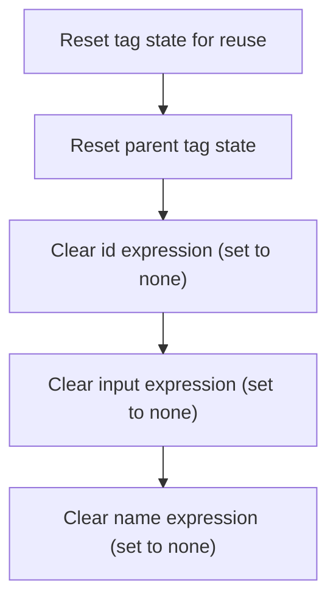

This document describes how the password tag is reset for reuse. As part of tag lifecycle management, all expressions and properties are cleared so that no data from previous uses persists. The process ensures the tag is ready for the next use.

# Resetting Password Tag State

<SwmSnippet path="/el/src/main/java/org/apache/strutsel/taglib/html/ELPasswordTag.java" line="899">

---

In <SwmToken path="el/src/main/java/org/apache/strutsel/taglib/html/ELPasswordTag.java" pos="899:5:5" line-data="    public void release() {">`release`</SwmToken>, we start by calling <SwmToken path="el/src/main/java/org/apache/strutsel/taglib/html/ELPasswordTag.java" pos="900:1:5" line-data="        super.release();">`super.release()`</SwmToken> to make sure any cleanup logic from the parent class runs first. This sets up the base state before we clear out the fields in this class. Next, we need to call ELResourceTag.release to continue the cleanup chain for inherited properties.

```java
    public void release() {
        super.release();
```

---

</SwmSnippet>

## Clearing Resource Tag Expressions



<SwmSnippet path="/el/src/main/java/org/apache/strutsel/taglib/bean/ELResourceTag.java" line="108">

---

In <SwmToken path="el/src/main/java/org/apache/strutsel/taglib/bean/ELResourceTag.java" pos="108:5:5" line-data="    public void release() {">`release`</SwmToken>, we call the superclass's release method, then start clearing out the expression fields specific to this tag. We call <SwmToken path="el/src/main/java/org/apache/strutsel/taglib/bean/ELResourceTag.java" pos="110:1:1" line-data="        setIdExpr(null);">`setIdExpr`</SwmToken>(null) first to reset the id expression. Next, we need to call <SwmToken path="el/src/main/java/org/apache/strutsel/taglib/bean/ELResourceTag.java" pos="93:5:5" line-data="    public void setInputExpr(String inputExpr) {">`setInputExpr`</SwmToken>(null) to continue clearing out the tag's state.

```java
    public void release() {
        super.release();
        setIdExpr(null);
```

---

</SwmSnippet>

<SwmSnippet path="/el/src/main/java/org/apache/strutsel/taglib/bean/ELResourceTag.java" line="85">

---

<SwmToken path="el/src/main/java/org/apache/strutsel/taglib/bean/ELResourceTag.java" pos="85:5:5" line-data="    public void setIdExpr(String idExpr) {">`setIdExpr`</SwmToken> just assigns the given value to the <SwmToken path="el/src/main/java/org/apache/strutsel/taglib/bean/ELResourceTag.java" pos="85:9:9" line-data="    public void setIdExpr(String idExpr) {">`idExpr`</SwmToken> field. No extra logic, just a plain setter. Next, we call <SwmToken path="el/src/main/java/org/apache/strutsel/taglib/bean/ELResourceTag.java" pos="93:5:5" line-data="    public void setInputExpr(String inputExpr) {">`setInputExpr`</SwmToken>(null) to clear the next field.

```java
    public void setIdExpr(String idExpr) {
        this.idExpr = idExpr;
    }
```

---

</SwmSnippet>

<SwmSnippet path="/el/src/main/java/org/apache/strutsel/taglib/bean/ELResourceTag.java" line="111">

---

Back in <SwmToken path="el/src/main/java/org/apache/strutsel/taglib/html/ELPasswordTag.java" pos="899:5:5" line-data="    public void release() {">`release`</SwmToken>, after clearing <SwmToken path="el/src/main/java/org/apache/strutsel/taglib/bean/ELResourceTag.java" pos="85:9:9" line-data="    public void setIdExpr(String idExpr) {">`idExpr`</SwmToken>, we immediately call <SwmToken path="el/src/main/java/org/apache/strutsel/taglib/bean/ELResourceTag.java" pos="111:1:1" line-data="        setInputExpr(null);">`setInputExpr`</SwmToken>(null) to clear the input expression. This keeps the cleanup consistent for all expression fields. Next, <SwmToken path="el/src/main/java/org/apache/strutsel/taglib/html/ELPasswordTag.java" pos="692:5:5" line-data="    public void setNameExpr(String nameExpr) {">`setNameExpr`</SwmToken>(null) is called to finish clearing the tag's state.

```java
        setInputExpr(null);
```

---

</SwmSnippet>

<SwmSnippet path="/el/src/main/java/org/apache/strutsel/taglib/bean/ELResourceTag.java" line="93">

---

<SwmToken path="el/src/main/java/org/apache/strutsel/taglib/bean/ELResourceTag.java" pos="93:5:5" line-data="    public void setInputExpr(String inputExpr) {">`setInputExpr`</SwmToken> just sets the <SwmToken path="el/src/main/java/org/apache/strutsel/taglib/bean/ELResourceTag.java" pos="93:9:9" line-data="    public void setInputExpr(String inputExpr) {">`inputExpr`</SwmToken> field to the given value. No extra logic. Next, <SwmToken path="el/src/main/java/org/apache/strutsel/taglib/html/ELPasswordTag.java" pos="692:5:5" line-data="    public void setNameExpr(String nameExpr) {">`setNameExpr`</SwmToken>(null) is called to clear the last expression field for this tag.

```java
    public void setInputExpr(String inputExpr) {
        this.inputExpr = inputExpr;
    }
```

---

</SwmSnippet>

<SwmSnippet path="/el/src/main/java/org/apache/strutsel/taglib/bean/ELResourceTag.java" line="112">

---

Back in <SwmToken path="el/src/main/java/org/apache/strutsel/taglib/html/ELPasswordTag.java" pos="899:5:5" line-data="    public void release() {">`release`</SwmToken>, after clearing <SwmToken path="el/src/main/java/org/apache/strutsel/taglib/bean/ELResourceTag.java" pos="93:9:9" line-data="    public void setInputExpr(String inputExpr) {">`inputExpr`</SwmToken>, we finish by calling <SwmToken path="el/src/main/java/org/apache/strutsel/taglib/bean/ELResourceTag.java" pos="112:1:1" line-data="        setNameExpr(null);">`setNameExpr`</SwmToken>(null) to clear the last expression field. This completes the cleanup for this tag's state.

```java
        setNameExpr(null);
    }
```

---

</SwmSnippet>

<SwmSnippet path="/el/src/main/java/org/apache/strutsel/taglib/bean/ELResourceTag.java" line="101">

---

<SwmToken path="el/src/main/java/org/apache/strutsel/taglib/bean/ELResourceTag.java" pos="101:5:5" line-data="    public void setNameExpr(String nameExpr) {">`setNameExpr`</SwmToken> just sets the <SwmToken path="el/src/main/java/org/apache/strutsel/taglib/bean/ELResourceTag.java" pos="101:9:9" line-data="    public void setNameExpr(String nameExpr) {">`nameExpr`</SwmToken> field to the given value. No extra logic, just a plain setter.

```java
    public void setNameExpr(String nameExpr) {
        this.nameExpr = nameExpr;
    }
```

---

</SwmSnippet>

## Resetting Password Field Expressions

<SwmSnippet path="/el/src/main/java/org/apache/strutsel/taglib/html/ELPasswordTag.java" line="901">

---

Back in `ELPasswordTag.release`, after finishing the superclass cleanup, we start clearing all the expression fields for this tag. First up is <SwmToken path="el/src/main/java/org/apache/strutsel/taglib/html/ELPasswordTag.java" pos="901:1:1" line-data="        setAccesskeyExpr(null);">`setAccesskeyExpr`</SwmToken>(null), which resets the access key expression.

```java
        setAccesskeyExpr(null);
```

---

</SwmSnippet>

<SwmSnippet path="/el/src/main/java/org/apache/strutsel/taglib/html/ELPasswordTag.java" line="588">

---

<SwmToken path="el/src/main/java/org/apache/strutsel/taglib/html/ELPasswordTag.java" pos="588:5:5" line-data="    public void setAccesskeyExpr(String accessKeyExpr) {">`setAccesskeyExpr`</SwmToken> just sets the <SwmToken path="el/src/main/java/org/apache/strutsel/taglib/html/ELPasswordTag.java" pos="588:9:9" line-data="    public void setAccesskeyExpr(String accessKeyExpr) {">`accessKeyExpr`</SwmToken> field to the given value. No extra logic, just a plain setter.

```java
    public void setAccesskeyExpr(String accessKeyExpr) {
        this.accessKeyExpr = accessKeyExpr;
    }
```

---

</SwmSnippet>

<SwmSnippet path="/el/src/main/java/org/apache/strutsel/taglib/html/ELPasswordTag.java" line="902">

---

Back in `ELPasswordTag.release`, after clearing accesskeyExpr, we call <SwmToken path="el/src/main/java/org/apache/strutsel/taglib/html/ELPasswordTag.java" pos="902:1:1" line-data="        setAltExpr(null);">`setAltExpr`</SwmToken>(null) to reset the alt expression. This keeps the cleanup consistent for all expression fields.

```java
        setAltExpr(null);
```

---

</SwmSnippet>

<SwmSnippet path="/el/src/main/java/org/apache/strutsel/taglib/html/ELPasswordTag.java" line="596">

---

<SwmToken path="el/src/main/java/org/apache/strutsel/taglib/html/ELPasswordTag.java" pos="596:5:5" line-data="    public void setAltExpr(String altExpr) {">`setAltExpr`</SwmToken> just sets the <SwmToken path="el/src/main/java/org/apache/strutsel/taglib/html/ELPasswordTag.java" pos="596:9:9" line-data="    public void setAltExpr(String altExpr) {">`altExpr`</SwmToken> field to the given value. No extra logic, just a plain setter.

```java
    public void setAltExpr(String altExpr) {
        this.altExpr = altExpr;
    }
```

---

</SwmSnippet>

<SwmSnippet path="/el/src/main/java/org/apache/strutsel/taglib/html/ELPasswordTag.java" line="903">

---

Back in `ELPasswordTag.release`, after clearing <SwmToken path="el/src/main/java/org/apache/strutsel/taglib/html/ELPasswordTag.java" pos="596:9:9" line-data="    public void setAltExpr(String altExpr) {">`altExpr`</SwmToken>, we call <SwmToken path="el/src/main/java/org/apache/strutsel/taglib/html/ELPasswordTag.java" pos="903:1:1" line-data="        setAltKeyExpr(null);">`setAltKeyExpr`</SwmToken>(null) to reset the alt key expression. This keeps the cleanup consistent for all expression fields.

```java
        setAltKeyExpr(null);
```

---

</SwmSnippet>

<SwmSnippet path="/el/src/main/java/org/apache/strutsel/taglib/html/ELPasswordTag.java" line="604">

---

<SwmToken path="el/src/main/java/org/apache/strutsel/taglib/html/ELPasswordTag.java" pos="604:5:5" line-data="    public void setAltKeyExpr(String altKeyExpr) {">`setAltKeyExpr`</SwmToken> just sets the <SwmToken path="el/src/main/java/org/apache/strutsel/taglib/html/ELPasswordTag.java" pos="604:9:9" line-data="    public void setAltKeyExpr(String altKeyExpr) {">`altKeyExpr`</SwmToken> field to the given value. No extra logic, just a plain setter.

```java
    public void setAltKeyExpr(String altKeyExpr) {
        this.altKeyExpr = altKeyExpr;
    }
```

---

</SwmSnippet>

<SwmSnippet path="/el/src/main/java/org/apache/strutsel/taglib/html/ELPasswordTag.java" line="904">

---

Back in `ELPasswordTag.release`, after clearing <SwmToken path="el/src/main/java/org/apache/strutsel/taglib/html/ELPasswordTag.java" pos="604:9:9" line-data="    public void setAltKeyExpr(String altKeyExpr) {">`altKeyExpr`</SwmToken>, we call <SwmToken path="el/src/main/java/org/apache/strutsel/taglib/html/ELPasswordTag.java" pos="904:1:1" line-data="        setBundleExpr(null);">`setBundleExpr`</SwmToken>(null) to reset the bundle expression. This keeps the cleanup consistent for all expression fields.

```java
        setBundleExpr(null);
```

---

</SwmSnippet>

<SwmSnippet path="/el/src/main/java/org/apache/strutsel/taglib/html/ELPasswordTag.java" line="612">

---

<SwmToken path="el/src/main/java/org/apache/strutsel/taglib/html/ELPasswordTag.java" pos="612:5:5" line-data="    public void setBundleExpr(String bundleExpr) {">`setBundleExpr`</SwmToken> just sets the <SwmToken path="el/src/main/java/org/apache/strutsel/taglib/html/ELPasswordTag.java" pos="612:9:9" line-data="    public void setBundleExpr(String bundleExpr) {">`bundleExpr`</SwmToken> field to the given value. No extra logic, just a plain setter.

```java
    public void setBundleExpr(String bundleExpr) {
        this.bundleExpr = bundleExpr;
    }
```

---

</SwmSnippet>

<SwmSnippet path="/el/src/main/java/org/apache/strutsel/taglib/html/ELPasswordTag.java" line="905">

---

Back in `ELPasswordTag.release`, after clearing <SwmToken path="el/src/main/java/org/apache/strutsel/taglib/html/ELPasswordTag.java" pos="612:9:9" line-data="    public void setBundleExpr(String bundleExpr) {">`bundleExpr`</SwmToken>, we call <SwmToken path="el/src/main/java/org/apache/strutsel/taglib/html/ELPasswordTag.java" pos="905:1:1" line-data="        setDirExpr(null);">`setDirExpr`</SwmToken>(null) to reset the dir expression. This keeps the cleanup consistent for all expression fields.

```java
        setDirExpr(null);
```

---

</SwmSnippet>

<SwmSnippet path="/el/src/main/java/org/apache/strutsel/taglib/html/ELPasswordTag.java" line="620">

---

<SwmToken path="el/src/main/java/org/apache/strutsel/taglib/html/ELPasswordTag.java" pos="620:5:5" line-data="    public void setDirExpr(String dirExpr) {">`setDirExpr`</SwmToken> just sets the <SwmToken path="el/src/main/java/org/apache/strutsel/taglib/html/ELPasswordTag.java" pos="620:9:9" line-data="    public void setDirExpr(String dirExpr) {">`dirExpr`</SwmToken> field to the given value. No extra logic, just a plain setter.

```java
    public void setDirExpr(String dirExpr) {
        this.dirExpr = dirExpr;
    }
```

---

</SwmSnippet>

<SwmSnippet path="/el/src/main/java/org/apache/strutsel/taglib/html/ELPasswordTag.java" line="906">

---

Back in `ELPasswordTag.release`, after clearing <SwmToken path="el/src/main/java/org/apache/strutsel/taglib/html/ELPasswordTag.java" pos="620:9:9" line-data="    public void setDirExpr(String dirExpr) {">`dirExpr`</SwmToken>, we call <SwmToken path="el/src/main/java/org/apache/strutsel/taglib/html/ELPasswordTag.java" pos="906:1:1" line-data="        setDisabledExpr(null);">`setDisabledExpr`</SwmToken>(null) to reset the disabled expression. This keeps the cleanup consistent for all expression fields.

```java
        setDisabledExpr(null);
```

---

</SwmSnippet>

<SwmSnippet path="/el/src/main/java/org/apache/strutsel/taglib/html/ELPasswordTag.java" line="628">

---

<SwmToken path="el/src/main/java/org/apache/strutsel/taglib/html/ELPasswordTag.java" pos="628:5:5" line-data="    public void setDisabledExpr(String disabledExpr) {">`setDisabledExpr`</SwmToken> just sets the <SwmToken path="el/src/main/java/org/apache/strutsel/taglib/html/ELPasswordTag.java" pos="628:9:9" line-data="    public void setDisabledExpr(String disabledExpr) {">`disabledExpr`</SwmToken> field to the given value. No extra logic, just a plain setter.

```java
    public void setDisabledExpr(String disabledExpr) {
        this.disabledExpr = disabledExpr;
    }
```

---

</SwmSnippet>

<SwmSnippet path="/el/src/main/java/org/apache/strutsel/taglib/html/ELPasswordTag.java" line="907">

---

Back in `ELPasswordTag.release`, after clearing <SwmToken path="el/src/main/java/org/apache/strutsel/taglib/html/ELPasswordTag.java" pos="628:9:9" line-data="    public void setDisabledExpr(String disabledExpr) {">`disabledExpr`</SwmToken>, we call <SwmToken path="el/src/main/java/org/apache/strutsel/taglib/html/ELPasswordTag.java" pos="907:1:1" line-data="        setErrorKeyExpr(null);">`setErrorKeyExpr`</SwmToken>(null) to reset the error key expression. This keeps the cleanup consistent for all expression fields.

```java
        setErrorKeyExpr(null);
```

---

</SwmSnippet>

<SwmSnippet path="/el/src/main/java/org/apache/strutsel/taglib/html/ELPasswordTag.java" line="636">

---

<SwmToken path="el/src/main/java/org/apache/strutsel/taglib/html/ELPasswordTag.java" pos="636:5:5" line-data="    public void setErrorKeyExpr(String errorKeyExpr) {">`setErrorKeyExpr`</SwmToken> just sets the <SwmToken path="el/src/main/java/org/apache/strutsel/taglib/html/ELPasswordTag.java" pos="636:9:9" line-data="    public void setErrorKeyExpr(String errorKeyExpr) {">`errorKeyExpr`</SwmToken> field to the given value. No extra logic, just a plain setter.

```java
    public void setErrorKeyExpr(String errorKeyExpr) {
        this.errorKeyExpr = errorKeyExpr;
    }
```

---

</SwmSnippet>

<SwmSnippet path="/el/src/main/java/org/apache/strutsel/taglib/html/ELPasswordTag.java" line="908">

---

Back in `ELPasswordTag.release`, after clearing <SwmToken path="el/src/main/java/org/apache/strutsel/taglib/html/ELPasswordTag.java" pos="636:9:9" line-data="    public void setErrorKeyExpr(String errorKeyExpr) {">`errorKeyExpr`</SwmToken>, we call <SwmToken path="el/src/main/java/org/apache/strutsel/taglib/html/ELPasswordTag.java" pos="908:1:1" line-data="        setErrorStyleExpr(null);">`setErrorStyleExpr`</SwmToken>(null) to reset the error style expression. This keeps the cleanup consistent for all expression fields.

```java
        setErrorStyleExpr(null);
```

---

</SwmSnippet>

<SwmSnippet path="/el/src/main/java/org/apache/strutsel/taglib/html/ELPasswordTag.java" line="644">

---

<SwmToken path="el/src/main/java/org/apache/strutsel/taglib/html/ELPasswordTag.java" pos="644:5:5" line-data="    public void setErrorStyleExpr(String errorStyleExpr) {">`setErrorStyleExpr`</SwmToken> just sets the <SwmToken path="el/src/main/java/org/apache/strutsel/taglib/html/ELPasswordTag.java" pos="644:9:9" line-data="    public void setErrorStyleExpr(String errorStyleExpr) {">`errorStyleExpr`</SwmToken> field to the given value. No extra logic, just a plain setter.

```java
    public void setErrorStyleExpr(String errorStyleExpr) {
        this.errorStyleExpr = errorStyleExpr;
    }
```

---

</SwmSnippet>

<SwmSnippet path="/el/src/main/java/org/apache/strutsel/taglib/html/ELPasswordTag.java" line="909">

---

Back in `ELPasswordTag.release`, after clearing <SwmToken path="el/src/main/java/org/apache/strutsel/taglib/html/ELPasswordTag.java" pos="644:9:9" line-data="    public void setErrorStyleExpr(String errorStyleExpr) {">`errorStyleExpr`</SwmToken>, we call <SwmToken path="el/src/main/java/org/apache/strutsel/taglib/html/ELPasswordTag.java" pos="909:1:1" line-data="        setErrorStyleClassExpr(null);">`setErrorStyleClassExpr`</SwmToken>(null) to reset the error style class expression. This keeps the cleanup consistent for all expression fields.

```java
        setErrorStyleClassExpr(null);
```

---

</SwmSnippet>

<SwmSnippet path="/el/src/main/java/org/apache/strutsel/taglib/html/ELPasswordTag.java" line="652">

---

<SwmToken path="el/src/main/java/org/apache/strutsel/taglib/html/ELPasswordTag.java" pos="652:5:5" line-data="    public void setErrorStyleClassExpr(String errorStyleClassExpr) {">`setErrorStyleClassExpr`</SwmToken> just sets the <SwmToken path="el/src/main/java/org/apache/strutsel/taglib/html/ELPasswordTag.java" pos="652:9:9" line-data="    public void setErrorStyleClassExpr(String errorStyleClassExpr) {">`errorStyleClassExpr`</SwmToken> field to the given value. No extra logic, just a plain setter.

```java
    public void setErrorStyleClassExpr(String errorStyleClassExpr) {
        this.errorStyleClassExpr = errorStyleClassExpr;
    }
```

---

</SwmSnippet>

<SwmSnippet path="/el/src/main/java/org/apache/strutsel/taglib/html/ELPasswordTag.java" line="910">

---

Back in `ELPasswordTag.release`, after clearing <SwmToken path="el/src/main/java/org/apache/strutsel/taglib/html/ELPasswordTag.java" pos="652:9:9" line-data="    public void setErrorStyleClassExpr(String errorStyleClassExpr) {">`errorStyleClassExpr`</SwmToken>, we call <SwmToken path="el/src/main/java/org/apache/strutsel/taglib/html/ELPasswordTag.java" pos="910:1:1" line-data="        setErrorStyleIdExpr(null);">`setErrorStyleIdExpr`</SwmToken>(null) to reset the error style id expression. This keeps the cleanup consistent for all expression fields.

```java
        setErrorStyleIdExpr(null);
```

---

</SwmSnippet>

<SwmSnippet path="/el/src/main/java/org/apache/strutsel/taglib/html/ELPasswordTag.java" line="660">

---

<SwmToken path="el/src/main/java/org/apache/strutsel/taglib/html/ELPasswordTag.java" pos="660:5:5" line-data="    public void setErrorStyleIdExpr(String errorStyleIdExpr) {">`setErrorStyleIdExpr`</SwmToken> just sets the <SwmToken path="el/src/main/java/org/apache/strutsel/taglib/html/ELPasswordTag.java" pos="660:9:9" line-data="    public void setErrorStyleIdExpr(String errorStyleIdExpr) {">`errorStyleIdExpr`</SwmToken> field to the given value. No extra logic, just a plain setter.

```java
    public void setErrorStyleIdExpr(String errorStyleIdExpr) {
        this.errorStyleIdExpr = errorStyleIdExpr;
    }
```

---

</SwmSnippet>

<SwmSnippet path="/el/src/main/java/org/apache/strutsel/taglib/html/ELPasswordTag.java" line="911">

---

Back in `ELPasswordTag.release`, after clearing <SwmToken path="el/src/main/java/org/apache/strutsel/taglib/html/ELPasswordTag.java" pos="660:9:9" line-data="    public void setErrorStyleIdExpr(String errorStyleIdExpr) {">`errorStyleIdExpr`</SwmToken>, we call <SwmToken path="el/src/main/java/org/apache/strutsel/taglib/html/ELPasswordTag.java" pos="911:1:1" line-data="        setIndexedExpr(null);">`setIndexedExpr`</SwmToken>(null) to reset the indexed expression. This keeps the cleanup consistent for all expression fields.

```java
        setIndexedExpr(null);
```

---

</SwmSnippet>

<SwmSnippet path="/el/src/main/java/org/apache/strutsel/taglib/html/ELPasswordTag.java" line="668">

---

<SwmToken path="el/src/main/java/org/apache/strutsel/taglib/html/ELPasswordTag.java" pos="668:5:5" line-data="    public void setIndexedExpr(String indexedExpr) {">`setIndexedExpr`</SwmToken> just sets the <SwmToken path="el/src/main/java/org/apache/strutsel/taglib/html/ELPasswordTag.java" pos="668:9:9" line-data="    public void setIndexedExpr(String indexedExpr) {">`indexedExpr`</SwmToken> field to the given value. No extra logic, just a plain setter.

```java
    public void setIndexedExpr(String indexedExpr) {
        this.indexedExpr = indexedExpr;
    }
```

---

</SwmSnippet>

<SwmSnippet path="/el/src/main/java/org/apache/strutsel/taglib/html/ELPasswordTag.java" line="912">

---

Back in `ELPasswordTag.release`, after clearing <SwmToken path="el/src/main/java/org/apache/strutsel/taglib/html/ELPasswordTag.java" pos="668:9:9" line-data="    public void setIndexedExpr(String indexedExpr) {">`indexedExpr`</SwmToken>, we call <SwmToken path="el/src/main/java/org/apache/strutsel/taglib/html/ELPasswordTag.java" pos="912:1:1" line-data="        setLangExpr(null);">`setLangExpr`</SwmToken>(null) to reset the lang expression. This keeps the cleanup consistent for all expression fields.

```java
        setLangExpr(null);
```

---

</SwmSnippet>

<SwmSnippet path="/el/src/main/java/org/apache/strutsel/taglib/html/ELPasswordTag.java" line="676">

---

<SwmToken path="el/src/main/java/org/apache/strutsel/taglib/html/ELPasswordTag.java" pos="676:5:5" line-data="    public void setLangExpr(String langExpr) {">`setLangExpr`</SwmToken> just sets the <SwmToken path="el/src/main/java/org/apache/strutsel/taglib/html/ELPasswordTag.java" pos="676:9:9" line-data="    public void setLangExpr(String langExpr) {">`langExpr`</SwmToken> field to the given value. No extra logic, just a plain setter.

```java
    public void setLangExpr(String langExpr) {
        this.langExpr = langExpr;
    }
```

---

</SwmSnippet>

<SwmSnippet path="/el/src/main/java/org/apache/strutsel/taglib/html/ELPasswordTag.java" line="913">

---

Back in `ELPasswordTag.release`, after clearing <SwmToken path="el/src/main/java/org/apache/strutsel/taglib/html/ELPasswordTag.java" pos="676:9:9" line-data="    public void setLangExpr(String langExpr) {">`langExpr`</SwmToken>, we call <SwmToken path="el/src/main/java/org/apache/strutsel/taglib/html/ELPasswordTag.java" pos="913:1:1" line-data="        setMaxlengthExpr(null);">`setMaxlengthExpr`</SwmToken>(null) to reset the maxlength expression. This keeps the cleanup consistent for all expression fields.

```java
        setMaxlengthExpr(null);
```

---

</SwmSnippet>

<SwmSnippet path="/el/src/main/java/org/apache/strutsel/taglib/html/ELPasswordTag.java" line="684">

---

<SwmToken path="el/src/main/java/org/apache/strutsel/taglib/html/ELPasswordTag.java" pos="684:5:5" line-data="    public void setMaxlengthExpr(String maxlengthExpr) {">`setMaxlengthExpr`</SwmToken> just sets the <SwmToken path="el/src/main/java/org/apache/strutsel/taglib/html/ELPasswordTag.java" pos="684:9:9" line-data="    public void setMaxlengthExpr(String maxlengthExpr) {">`maxlengthExpr`</SwmToken> field to the given value. No extra logic, just a plain setter.

```java
    public void setMaxlengthExpr(String maxlengthExpr) {
        this.maxlengthExpr = maxlengthExpr;
    }
```

---

</SwmSnippet>

<SwmSnippet path="/el/src/main/java/org/apache/strutsel/taglib/html/ELPasswordTag.java" line="914">

---

Back in `ELPasswordTag.release`, after clearing <SwmToken path="el/src/main/java/org/apache/strutsel/taglib/html/ELPasswordTag.java" pos="684:9:9" line-data="    public void setMaxlengthExpr(String maxlengthExpr) {">`maxlengthExpr`</SwmToken>, we call <SwmToken path="el/src/main/java/org/apache/strutsel/taglib/html/ELPasswordTag.java" pos="914:1:1" line-data="        setNameExpr(null);">`setNameExpr`</SwmToken>(null) to reset the name expression. This keeps the cleanup consistent for all expression fields.

```java
        setNameExpr(null);
```

---

</SwmSnippet>

<SwmSnippet path="/el/src/main/java/org/apache/strutsel/taglib/html/ELPasswordTag.java" line="692">

---

<SwmToken path="el/src/main/java/org/apache/strutsel/taglib/html/ELPasswordTag.java" pos="692:5:5" line-data="    public void setNameExpr(String nameExpr) {">`setNameExpr`</SwmToken> just sets the <SwmToken path="el/src/main/java/org/apache/strutsel/taglib/html/ELPasswordTag.java" pos="692:9:9" line-data="    public void setNameExpr(String nameExpr) {">`nameExpr`</SwmToken> field to the given value. No extra logic, just a plain setter.

```java
    public void setNameExpr(String nameExpr) {
        this.nameExpr = nameExpr;
    }
```

---

</SwmSnippet>

<SwmSnippet path="/el/src/main/java/org/apache/strutsel/taglib/html/ELPasswordTag.java" line="915">

---

Back in `ELPasswordTag.release`, after clearing <SwmToken path="el/src/main/java/org/apache/strutsel/taglib/html/ELPasswordTag.java" pos="692:9:9" line-data="    public void setNameExpr(String nameExpr) {">`nameExpr`</SwmToken>, we call <SwmToken path="el/src/main/java/org/apache/strutsel/taglib/html/ELPasswordTag.java" pos="915:1:1" line-data="        setOnblurExpr(null);">`setOnblurExpr`</SwmToken>(null) to reset the onblur expression. This keeps the cleanup consistent for all expression fields.

```java
        setOnblurExpr(null);
```

---

</SwmSnippet>

<SwmSnippet path="/el/src/main/java/org/apache/strutsel/taglib/html/ELPasswordTag.java" line="700">

---

<SwmToken path="el/src/main/java/org/apache/strutsel/taglib/html/ELPasswordTag.java" pos="700:5:5" line-data="    public void setOnblurExpr(String onblurExpr) {">`setOnblurExpr`</SwmToken> just sets the <SwmToken path="el/src/main/java/org/apache/strutsel/taglib/html/ELPasswordTag.java" pos="700:9:9" line-data="    public void setOnblurExpr(String onblurExpr) {">`onblurExpr`</SwmToken> field to the given value. No extra logic, just a plain setter.

```java
    public void setOnblurExpr(String onblurExpr) {
        this.onblurExpr = onblurExpr;
    }
```

---

</SwmSnippet>

<SwmSnippet path="/el/src/main/java/org/apache/strutsel/taglib/html/ELPasswordTag.java" line="916">

---

Back in ELPasswordTag.release, after clearing <SwmToken path="el/src/main/java/org/apache/strutsel/taglib/html/ELPasswordTag.java" pos="700:9:9" line-data="    public void setOnblurExpr(String onblurExpr) {">`onblurExpr`</SwmToken>, we call <SwmToken path="el/src/main/java/org/apache/strutsel/taglib/html/ELPasswordTag.java" pos="916:1:1" line-data="        setOnchangeExpr(null);">`setOnchangeExpr`</SwmToken>(null) to make sure the onchange event handler is also reset. This prevents any leftover JavaScript from previous tag usage from leaking into the next render.

```java
        setOnchangeExpr(null);
```

---

</SwmSnippet>

<SwmSnippet path="/el/src/main/java/org/apache/strutsel/taglib/html/ELPasswordTag.java" line="708">

---

SetOnchangeExpr just sets the <SwmToken path="el/src/main/java/org/apache/strutsel/taglib/html/ELPasswordTag.java" pos="708:9:9" line-data="    public void setOnchangeExpr(String onchangeExpr) {">`onchangeExpr`</SwmToken> field. No extra logic—it's a plain setter.

```java
    public void setOnchangeExpr(String onchangeExpr) {
        this.onchangeExpr = onchangeExpr;
    }
```

---

</SwmSnippet>

<SwmSnippet path="/el/src/main/java/org/apache/strutsel/taglib/html/ELPasswordTag.java" line="917">

---

Back in ELPasswordTag.release, after clearing <SwmToken path="el/src/main/java/org/apache/strutsel/taglib/html/ELPasswordTag.java" pos="708:9:9" line-data="    public void setOnchangeExpr(String onchangeExpr) {">`onchangeExpr`</SwmToken>, we call <SwmToken path="el/src/main/java/org/apache/strutsel/taglib/html/ELPasswordTag.java" pos="917:1:1" line-data="        setOnclickExpr(null);">`setOnclickExpr`</SwmToken>(null) to clear any JavaScript handler for the onclick event. This keeps the tag's state clean between uses.

```java
        setOnclickExpr(null);
```

---

</SwmSnippet>

<SwmSnippet path="/el/src/main/java/org/apache/strutsel/taglib/html/ELPasswordTag.java" line="716">

---

SetOnclickExpr just sets the <SwmToken path="el/src/main/java/org/apache/strutsel/taglib/html/ELPasswordTag.java" pos="716:9:9" line-data="    public void setOnclickExpr(String onclickExpr) {">`onclickExpr`</SwmToken> field. It's a plain setter—no extra logic.

```java
    public void setOnclickExpr(String onclickExpr) {
        this.onclickExpr = onclickExpr;
    }
```

---

</SwmSnippet>

<SwmSnippet path="/el/src/main/java/org/apache/strutsel/taglib/html/ELPasswordTag.java" line="918">

---

Back in ELPasswordTag.release, after clearing <SwmToken path="el/src/main/java/org/apache/strutsel/taglib/html/ELPasswordTag.java" pos="716:9:9" line-data="    public void setOnclickExpr(String onclickExpr) {">`onclickExpr`</SwmToken>, we call <SwmToken path="el/src/main/java/org/apache/strutsel/taglib/html/ELPasswordTag.java" pos="918:1:1" line-data="        setOndblclickExpr(null);">`setOndblclickExpr`</SwmToken>(null) to clear any double-click handler. This avoids leftover event logic from previous tag usage.

```java
        setOndblclickExpr(null);
```

---

</SwmSnippet>

<SwmSnippet path="/el/src/main/java/org/apache/strutsel/taglib/html/ELPasswordTag.java" line="724">

---

SetOndblclickExpr just sets the <SwmToken path="el/src/main/java/org/apache/strutsel/taglib/html/ELPasswordTag.java" pos="724:9:9" line-data="    public void setOndblclickExpr(String ondblclickExpr) {">`ondblclickExpr`</SwmToken> field. It's a plain setter—no extra logic.

```java
    public void setOndblclickExpr(String ondblclickExpr) {
        this.ondblclickExpr = ondblclickExpr;
    }
```

---

</SwmSnippet>

<SwmSnippet path="/el/src/main/java/org/apache/strutsel/taglib/html/ELPasswordTag.java" line="919">

---

Back in ELPasswordTag.release, after clearing <SwmToken path="el/src/main/java/org/apache/strutsel/taglib/html/ELPasswordTag.java" pos="724:9:9" line-data="    public void setOndblclickExpr(String ondblclickExpr) {">`ondblclickExpr`</SwmToken>, we call <SwmToken path="el/src/main/java/org/apache/strutsel/taglib/html/ELPasswordTag.java" pos="919:1:1" line-data="        setOnfocusExpr(null);">`setOnfocusExpr`</SwmToken>(null) to clear any focus handler. This keeps the tag's event state isolated between uses.

```java
        setOnfocusExpr(null);
```

---

</SwmSnippet>

<SwmSnippet path="/el/src/main/java/org/apache/strutsel/taglib/html/ELPasswordTag.java" line="732">

---

SetOnfocusExpr just sets the <SwmToken path="el/src/main/java/org/apache/strutsel/taglib/html/ELPasswordTag.java" pos="732:9:9" line-data="    public void setOnfocusExpr(String onfocusExpr) {">`onfocusExpr`</SwmToken> field. It's a plain setter—no extra logic.

```java
    public void setOnfocusExpr(String onfocusExpr) {
        this.onfocusExpr = onfocusExpr;
    }
```

---

</SwmSnippet>

<SwmSnippet path="/el/src/main/java/org/apache/strutsel/taglib/html/ELPasswordTag.java" line="920">

---

Back in ELPasswordTag.release, after clearing <SwmToken path="el/src/main/java/org/apache/strutsel/taglib/html/ELPasswordTag.java" pos="732:9:9" line-data="    public void setOnfocusExpr(String onfocusExpr) {">`onfocusExpr`</SwmToken>, we call <SwmToken path="el/src/main/java/org/apache/strutsel/taglib/html/ELPasswordTag.java" pos="920:1:1" line-data="        setOnkeydownExpr(null);">`setOnkeydownExpr`</SwmToken>(null) to clear any keydown handler. This prevents old keyboard event logic from sticking around.

```java
        setOnkeydownExpr(null);
```

---

</SwmSnippet>

<SwmSnippet path="/el/src/main/java/org/apache/strutsel/taglib/html/ELPasswordTag.java" line="740">

---

SetOnkeydownExpr just sets the <SwmToken path="el/src/main/java/org/apache/strutsel/taglib/html/ELPasswordTag.java" pos="740:9:9" line-data="    public void setOnkeydownExpr(String onkeydownExpr) {">`onkeydownExpr`</SwmToken> field. It's a plain setter—no extra logic.

```java
    public void setOnkeydownExpr(String onkeydownExpr) {
        this.onkeydownExpr = onkeydownExpr;
    }
```

---

</SwmSnippet>

<SwmSnippet path="/el/src/main/java/org/apache/strutsel/taglib/html/ELPasswordTag.java" line="921">

---

Back in ELPasswordTag.release, after clearing <SwmToken path="el/src/main/java/org/apache/strutsel/taglib/html/ELPasswordTag.java" pos="740:9:9" line-data="    public void setOnkeydownExpr(String onkeydownExpr) {">`onkeydownExpr`</SwmToken>, we call <SwmToken path="el/src/main/java/org/apache/strutsel/taglib/html/ELPasswordTag.java" pos="921:1:1" line-data="        setOnkeypressExpr(null);">`setOnkeypressExpr`</SwmToken>(null) to clear any keypress handler. This avoids leftover keypress logic from previous tag usage.

```java
        setOnkeypressExpr(null);
```

---

</SwmSnippet>

<SwmSnippet path="/el/src/main/java/org/apache/strutsel/taglib/html/ELPasswordTag.java" line="748">

---

SetOnkeypressExpr just sets the <SwmToken path="el/src/main/java/org/apache/strutsel/taglib/html/ELPasswordTag.java" pos="748:9:9" line-data="    public void setOnkeypressExpr(String onkeypressExpr) {">`onkeypressExpr`</SwmToken> field. It's a plain setter—no extra logic.

```java
    public void setOnkeypressExpr(String onkeypressExpr) {
        this.onkeypressExpr = onkeypressExpr;
    }
```

---

</SwmSnippet>

<SwmSnippet path="/el/src/main/java/org/apache/strutsel/taglib/html/ELPasswordTag.java" line="922">

---

Back in ELPasswordTag.release, after clearing <SwmToken path="el/src/main/java/org/apache/strutsel/taglib/html/ELPasswordTag.java" pos="748:9:9" line-data="    public void setOnkeypressExpr(String onkeypressExpr) {">`onkeypressExpr`</SwmToken>, we call <SwmToken path="el/src/main/java/org/apache/strutsel/taglib/html/ELPasswordTag.java" pos="922:1:1" line-data="        setOnkeyupExpr(null);">`setOnkeyupExpr`</SwmToken>(null) to clear any keyup handler. This keeps the tag's event state clean between uses.

```java
        setOnkeyupExpr(null);
```

---

</SwmSnippet>

<SwmSnippet path="/el/src/main/java/org/apache/strutsel/taglib/html/ELPasswordTag.java" line="756">

---

SetOnkeyupExpr just sets the <SwmToken path="el/src/main/java/org/apache/strutsel/taglib/html/ELPasswordTag.java" pos="756:9:9" line-data="    public void setOnkeyupExpr(String onkeyupExpr) {">`onkeyupExpr`</SwmToken> field. It's a plain setter—no extra logic.

```java
    public void setOnkeyupExpr(String onkeyupExpr) {
        this.onkeyupExpr = onkeyupExpr;
    }
```

---

</SwmSnippet>

<SwmSnippet path="/el/src/main/java/org/apache/strutsel/taglib/html/ELPasswordTag.java" line="923">

---

Back in ELPasswordTag.release, after clearing <SwmToken path="el/src/main/java/org/apache/strutsel/taglib/html/ELPasswordTag.java" pos="756:9:9" line-data="    public void setOnkeyupExpr(String onkeyupExpr) {">`onkeyupExpr`</SwmToken>, we call <SwmToken path="el/src/main/java/org/apache/strutsel/taglib/html/ELPasswordTag.java" pos="923:1:1" line-data="        setOnmousedownExpr(null);">`setOnmousedownExpr`</SwmToken>(null) to clear any mousedown handler. This avoids leftover mouse event logic from previous tag usage.

```java
        setOnmousedownExpr(null);
```

---

</SwmSnippet>

<SwmSnippet path="/el/src/main/java/org/apache/strutsel/taglib/html/ELPasswordTag.java" line="764">

---

SetOnmousedownExpr just sets the <SwmToken path="el/src/main/java/org/apache/strutsel/taglib/html/ELPasswordTag.java" pos="764:9:9" line-data="    public void setOnmousedownExpr(String onmousedownExpr) {">`onmousedownExpr`</SwmToken> field. It's a plain setter—no extra logic.

```java
    public void setOnmousedownExpr(String onmousedownExpr) {
        this.onmousedownExpr = onmousedownExpr;
    }
```

---

</SwmSnippet>

<SwmSnippet path="/el/src/main/java/org/apache/strutsel/taglib/html/ELPasswordTag.java" line="924">

---

Back in ELPasswordTag.release, after clearing <SwmToken path="el/src/main/java/org/apache/strutsel/taglib/html/ELPasswordTag.java" pos="764:9:9" line-data="    public void setOnmousedownExpr(String onmousedownExpr) {">`onmousedownExpr`</SwmToken>, we call <SwmToken path="el/src/main/java/org/apache/strutsel/taglib/html/ELPasswordTag.java" pos="924:1:1" line-data="        setOnmousemoveExpr(null);">`setOnmousemoveExpr`</SwmToken>(null) to clear any mousemove handler. This keeps the tag's event state clean between uses.

```java
        setOnmousemoveExpr(null);
```

---

</SwmSnippet>

<SwmSnippet path="/el/src/main/java/org/apache/strutsel/taglib/html/ELPasswordTag.java" line="772">

---

SetOnmousemoveExpr just sets the <SwmToken path="el/src/main/java/org/apache/strutsel/taglib/html/ELPasswordTag.java" pos="772:9:9" line-data="    public void setOnmousemoveExpr(String onmousemoveExpr) {">`onmousemoveExpr`</SwmToken> field. It's a plain setter—no extra logic.

```java
    public void setOnmousemoveExpr(String onmousemoveExpr) {
        this.onmousemoveExpr = onmousemoveExpr;
    }
```

---

</SwmSnippet>

<SwmSnippet path="/el/src/main/java/org/apache/strutsel/taglib/html/ELPasswordTag.java" line="925">

---

Back in ELPasswordTag.release, after clearing <SwmToken path="el/src/main/java/org/apache/strutsel/taglib/html/ELPasswordTag.java" pos="772:9:9" line-data="    public void setOnmousemoveExpr(String onmousemoveExpr) {">`onmousemoveExpr`</SwmToken>, we call <SwmToken path="el/src/main/java/org/apache/strutsel/taglib/html/ELPasswordTag.java" pos="925:1:1" line-data="        setOnmouseoutExpr(null);">`setOnmouseoutExpr`</SwmToken>(null) to clear any mouseout handler. This avoids leftover mouse event logic from previous tag usage.

```java
        setOnmouseoutExpr(null);
```

---

</SwmSnippet>

<SwmSnippet path="/el/src/main/java/org/apache/strutsel/taglib/html/ELPasswordTag.java" line="780">

---

SetOnmouseoutExpr just sets the <SwmToken path="el/src/main/java/org/apache/strutsel/taglib/html/ELPasswordTag.java" pos="780:9:9" line-data="    public void setOnmouseoutExpr(String onmouseoutExpr) {">`onmouseoutExpr`</SwmToken> field. It's a plain setter—no extra logic.

```java
    public void setOnmouseoutExpr(String onmouseoutExpr) {
        this.onmouseoutExpr = onmouseoutExpr;
    }
```

---

</SwmSnippet>

<SwmSnippet path="/el/src/main/java/org/apache/strutsel/taglib/html/ELPasswordTag.java" line="926">

---

Back in ELPasswordTag.release, after clearing <SwmToken path="el/src/main/java/org/apache/strutsel/taglib/html/ELPasswordTag.java" pos="780:9:9" line-data="    public void setOnmouseoutExpr(String onmouseoutExpr) {">`onmouseoutExpr`</SwmToken>, we call <SwmToken path="el/src/main/java/org/apache/strutsel/taglib/html/ELPasswordTag.java" pos="926:1:1" line-data="        setOnmouseoverExpr(null);">`setOnmouseoverExpr`</SwmToken>(null) to clear any mouseover handler. This keeps the tag's event state clean between uses.

```java
        setOnmouseoverExpr(null);
```

---

</SwmSnippet>

<SwmSnippet path="/el/src/main/java/org/apache/strutsel/taglib/html/ELPasswordTag.java" line="788">

---

SetOnmouseoverExpr just sets the <SwmToken path="el/src/main/java/org/apache/strutsel/taglib/html/ELPasswordTag.java" pos="788:9:9" line-data="    public void setOnmouseoverExpr(String onmouseoverExpr) {">`onmouseoverExpr`</SwmToken> field. It's a plain setter—no extra logic.

```java
    public void setOnmouseoverExpr(String onmouseoverExpr) {
        this.onmouseoverExpr = onmouseoverExpr;
    }
```

---

</SwmSnippet>

<SwmSnippet path="/el/src/main/java/org/apache/strutsel/taglib/html/ELPasswordTag.java" line="927">

---

Back in ELPasswordTag.release, after clearing <SwmToken path="el/src/main/java/org/apache/strutsel/taglib/html/ELPasswordTag.java" pos="788:9:9" line-data="    public void setOnmouseoverExpr(String onmouseoverExpr) {">`onmouseoverExpr`</SwmToken>, we call <SwmToken path="el/src/main/java/org/apache/strutsel/taglib/html/ELPasswordTag.java" pos="927:1:1" line-data="        setOnmouseupExpr(null);">`setOnmouseupExpr`</SwmToken>(null) to clear any mouseup handler. This avoids leftover mouse event logic from previous tag usage.

```java
        setOnmouseupExpr(null);
```

---

</SwmSnippet>

<SwmSnippet path="/el/src/main/java/org/apache/strutsel/taglib/html/ELPasswordTag.java" line="796">

---

SetOnmouseupExpr just sets the <SwmToken path="el/src/main/java/org/apache/strutsel/taglib/html/ELPasswordTag.java" pos="796:9:9" line-data="    public void setOnmouseupExpr(String onmouseupExpr) {">`onmouseupExpr`</SwmToken> field. It's a plain setter—no extra logic.

```java
    public void setOnmouseupExpr(String onmouseupExpr) {
        this.onmouseupExpr = onmouseupExpr;
    }
```

---

</SwmSnippet>

<SwmSnippet path="/el/src/main/java/org/apache/strutsel/taglib/html/ELPasswordTag.java" line="928">

---

Back in ELPasswordTag.release, after clearing <SwmToken path="el/src/main/java/org/apache/strutsel/taglib/html/ELPasswordTag.java" pos="796:9:9" line-data="    public void setOnmouseupExpr(String onmouseupExpr) {">`onmouseupExpr`</SwmToken>, we call <SwmToken path="el/src/main/java/org/apache/strutsel/taglib/html/ELPasswordTag.java" pos="928:1:1" line-data="        setOnselectExpr(null);">`setOnselectExpr`</SwmToken>(null) to clear any select handler. This keeps the tag's event state clean between uses.

```java
        setOnselectExpr(null);
```

---

</SwmSnippet>

<SwmSnippet path="/el/src/main/java/org/apache/strutsel/taglib/html/ELPasswordTag.java" line="804">

---

SetOnselectExpr just sets the <SwmToken path="el/src/main/java/org/apache/strutsel/taglib/html/ELPasswordTag.java" pos="804:9:9" line-data="    public void setOnselectExpr(String onselectExpr) {">`onselectExpr`</SwmToken> field. It's a plain setter—no extra logic.

```java
    public void setOnselectExpr(String onselectExpr) {
        this.onselectExpr = onselectExpr;
    }
```

---

</SwmSnippet>

<SwmSnippet path="/el/src/main/java/org/apache/strutsel/taglib/html/ELPasswordTag.java" line="929">

---

Back in ELPasswordTag.release, after clearing <SwmToken path="el/src/main/java/org/apache/strutsel/taglib/html/ELPasswordTag.java" pos="804:9:9" line-data="    public void setOnselectExpr(String onselectExpr) {">`onselectExpr`</SwmToken>, we call <SwmToken path="el/src/main/java/org/apache/strutsel/taglib/html/ELPasswordTag.java" pos="929:1:1" line-data="        setPropertyExpr(null);">`setPropertyExpr`</SwmToken>(null) to clear any property expression. This avoids leftover property values from previous tag usage.

```java
        setPropertyExpr(null);
```

---

</SwmSnippet>

<SwmSnippet path="/el/src/main/java/org/apache/strutsel/taglib/html/ELPasswordTag.java" line="812">

---

SetPropertyExpr just sets the <SwmToken path="el/src/main/java/org/apache/strutsel/taglib/html/ELPasswordTag.java" pos="812:9:9" line-data="    public void setPropertyExpr(String propertyExpr) {">`propertyExpr`</SwmToken> field. It's a plain setter—no extra logic.

```java
    public void setPropertyExpr(String propertyExpr) {
        this.propertyExpr = propertyExpr;
    }
```

---

</SwmSnippet>

<SwmSnippet path="/el/src/main/java/org/apache/strutsel/taglib/html/ELPasswordTag.java" line="930">

---

Back in ELPasswordTag.release, after clearing <SwmToken path="el/src/main/java/org/apache/strutsel/taglib/html/ELPasswordTag.java" pos="812:9:9" line-data="    public void setPropertyExpr(String propertyExpr) {">`propertyExpr`</SwmToken>, we call <SwmToken path="el/src/main/java/org/apache/strutsel/taglib/html/ELPasswordTag.java" pos="930:1:1" line-data="        setReadonlyExpr(null);">`setReadonlyExpr`</SwmToken>(null) to clear any readonly expression. This keeps the tag's state clean between uses.

```java
        setReadonlyExpr(null);
```

---

</SwmSnippet>

<SwmSnippet path="/el/src/main/java/org/apache/strutsel/taglib/html/ELPasswordTag.java" line="820">

---

SetReadonlyExpr just sets the <SwmToken path="el/src/main/java/org/apache/strutsel/taglib/html/ELPasswordTag.java" pos="820:9:9" line-data="    public void setReadonlyExpr(String readonlyExpr) {">`readonlyExpr`</SwmToken> field. It's a plain setter—no extra logic.

```java
    public void setReadonlyExpr(String readonlyExpr) {
        this.readonlyExpr = readonlyExpr;
    }
```

---

</SwmSnippet>

<SwmSnippet path="/el/src/main/java/org/apache/strutsel/taglib/html/ELPasswordTag.java" line="931">

---

Back in ELPasswordTag.release, after clearing <SwmToken path="el/src/main/java/org/apache/strutsel/taglib/html/ELPasswordTag.java" pos="820:9:9" line-data="    public void setReadonlyExpr(String readonlyExpr) {">`readonlyExpr`</SwmToken>, we call <SwmToken path="el/src/main/java/org/apache/strutsel/taglib/html/ELPasswordTag.java" pos="931:1:1" line-data="        setRedisplayExpr(null);">`setRedisplayExpr`</SwmToken>(null) to clear any redisplay expression. This avoids leftover redisplay state from previous tag usage.

```java
        setRedisplayExpr(null);
```

---

</SwmSnippet>

<SwmSnippet path="/el/src/main/java/org/apache/strutsel/taglib/html/ELPasswordTag.java" line="828">

---

SetRedisplayExpr just sets the <SwmToken path="el/src/main/java/org/apache/strutsel/taglib/html/ELPasswordTag.java" pos="828:9:9" line-data="    public void setRedisplayExpr(String redisplayExpr) {">`redisplayExpr`</SwmToken> field. It's a plain setter—no extra logic.

```java
    public void setRedisplayExpr(String redisplayExpr) {
        this.redisplayExpr = redisplayExpr;
    }
```

---

</SwmSnippet>

<SwmSnippet path="/el/src/main/java/org/apache/strutsel/taglib/html/ELPasswordTag.java" line="932">

---

Back in ELPasswordTag.release, after clearing <SwmToken path="el/src/main/java/org/apache/strutsel/taglib/html/ELPasswordTag.java" pos="828:9:9" line-data="    public void setRedisplayExpr(String redisplayExpr) {">`redisplayExpr`</SwmToken>, we call <SwmToken path="el/src/main/java/org/apache/strutsel/taglib/html/ELPasswordTag.java" pos="932:1:1" line-data="        setStyleExpr(null);">`setStyleExpr`</SwmToken>(null) to clear any style expression. This keeps the tag's style state clean between uses.

```java
        setStyleExpr(null);
```

---

</SwmSnippet>

<SwmSnippet path="/el/src/main/java/org/apache/strutsel/taglib/html/ELPasswordTag.java" line="836">

---

SetStyleExpr just sets the <SwmToken path="el/src/main/java/org/apache/strutsel/taglib/html/ELPasswordTag.java" pos="836:9:9" line-data="    public void setStyleExpr(String styleExpr) {">`styleExpr`</SwmToken> field. It's a plain setter—no extra logic.

```java
    public void setStyleExpr(String styleExpr) {
        this.styleExpr = styleExpr;
    }
```

---

</SwmSnippet>

<SwmSnippet path="/el/src/main/java/org/apache/strutsel/taglib/html/ELPasswordTag.java" line="933">

---

Back in ELPasswordTag.release, after clearing <SwmToken path="el/src/main/java/org/apache/strutsel/taglib/html/ELPasswordTag.java" pos="836:9:9" line-data="    public void setStyleExpr(String styleExpr) {">`styleExpr`</SwmToken>, we call <SwmToken path="el/src/main/java/org/apache/strutsel/taglib/html/ELPasswordTag.java" pos="933:1:1" line-data="        setStyleClassExpr(null);">`setStyleClassExpr`</SwmToken>(null) to clear any style class expression. This avoids leftover CSS class state from previous tag usage.

```java
        setStyleClassExpr(null);
```

---

</SwmSnippet>

<SwmSnippet path="/el/src/main/java/org/apache/strutsel/taglib/html/ELPasswordTag.java" line="844">

---

SetStyleClassExpr just sets the <SwmToken path="el/src/main/java/org/apache/strutsel/taglib/html/ELPasswordTag.java" pos="844:9:9" line-data="    public void setStyleClassExpr(String styleClassExpr) {">`styleClassExpr`</SwmToken> field. It's a plain setter—no extra logic.

```java
    public void setStyleClassExpr(String styleClassExpr) {
        this.styleClassExpr = styleClassExpr;
    }
```

---

</SwmSnippet>

<SwmSnippet path="/el/src/main/java/org/apache/strutsel/taglib/html/ELPasswordTag.java" line="934">

---

Back in ELPasswordTag.release, after clearing <SwmToken path="el/src/main/java/org/apache/strutsel/taglib/html/ELPasswordTag.java" pos="844:9:9" line-data="    public void setStyleClassExpr(String styleClassExpr) {">`styleClassExpr`</SwmToken>, we call <SwmToken path="el/src/main/java/org/apache/strutsel/taglib/html/ELPasswordTag.java" pos="934:1:1" line-data="        setStyleIdExpr(null);">`setStyleIdExpr`</SwmToken>(null) to clear any style id expression. This keeps the tag's CSS id state clean between uses.

```java
        setStyleIdExpr(null);
```

---

</SwmSnippet>

<SwmSnippet path="/el/src/main/java/org/apache/strutsel/taglib/html/ELPasswordTag.java" line="852">

---

SetStyleIdExpr just sets the <SwmToken path="el/src/main/java/org/apache/strutsel/taglib/html/ELPasswordTag.java" pos="852:9:9" line-data="    public void setStyleIdExpr(String styleIdExpr) {">`styleIdExpr`</SwmToken> field. It's a plain setter—no extra logic.

```java
    public void setStyleIdExpr(String styleIdExpr) {
        this.styleIdExpr = styleIdExpr;
    }
```

---

</SwmSnippet>

<SwmSnippet path="/el/src/main/java/org/apache/strutsel/taglib/html/ELPasswordTag.java" line="935">

---

Back in ELPasswordTag.release, after clearing <SwmToken path="el/src/main/java/org/apache/strutsel/taglib/html/ELPasswordTag.java" pos="852:9:9" line-data="    public void setStyleIdExpr(String styleIdExpr) {">`styleIdExpr`</SwmToken>, we call <SwmToken path="el/src/main/java/org/apache/strutsel/taglib/html/ELPasswordTag.java" pos="935:1:1" line-data="        setSizeExpr(null);">`setSizeExpr`</SwmToken>(null) to clear any size expression. This avoids leftover input size state from previous tag usage.

```java
        setSizeExpr(null);
```

---

</SwmSnippet>

<SwmSnippet path="/el/src/main/java/org/apache/strutsel/taglib/html/ELPasswordTag.java" line="860">

---

SetSizeExpr just sets the <SwmToken path="el/src/main/java/org/apache/strutsel/taglib/html/ELPasswordTag.java" pos="860:9:9" line-data="    public void setSizeExpr(String sizeExpr) {">`sizeExpr`</SwmToken> field. It's a plain setter—no extra logic.

```java
    public void setSizeExpr(String sizeExpr) {
        this.sizeExpr = sizeExpr;
    }
```

---

</SwmSnippet>

<SwmSnippet path="/el/src/main/java/org/apache/strutsel/taglib/html/ELPasswordTag.java" line="936">

---

Back in ELPasswordTag.release, after clearing <SwmToken path="el/src/main/java/org/apache/strutsel/taglib/html/ELPasswordTag.java" pos="860:9:9" line-data="    public void setSizeExpr(String sizeExpr) {">`sizeExpr`</SwmToken>, we call <SwmToken path="el/src/main/java/org/apache/strutsel/taglib/html/ELPasswordTag.java" pos="936:1:1" line-data="        setTabindexExpr(null);">`setTabindexExpr`</SwmToken>(null) to make sure the tab order for the password field doesn't carry over from previous uses. This keeps the tag's accessibility state isolated.

```java
        setTabindexExpr(null);
```

---

</SwmSnippet>

<SwmSnippet path="/el/src/main/java/org/apache/strutsel/taglib/html/ELPasswordTag.java" line="868">

---

SetTabindexExpr just assigns the provided value to the <SwmToken path="el/src/main/java/org/apache/strutsel/taglib/html/ELPasswordTag.java" pos="868:9:9" line-data="    public void setTabindexExpr(String tabindexExpr) {">`tabindexExpr`</SwmToken> field. No validation, no transformation—it's a plain setter. This keeps the tag's state clean and avoids leftover tab order from previous uses.

```java
    public void setTabindexExpr(String tabindexExpr) {
        this.tabindexExpr = tabindexExpr;
    }
```

---

</SwmSnippet>

<SwmSnippet path="/el/src/main/java/org/apache/strutsel/taglib/html/ELPasswordTag.java" line="937">

---

Back in ELPasswordTag.release, after clearing <SwmToken path="el/src/main/java/org/apache/strutsel/taglib/html/ELPasswordTag.java" pos="868:9:9" line-data="    public void setTabindexExpr(String tabindexExpr) {">`tabindexExpr`</SwmToken>, we call <SwmToken path="el/src/main/java/org/apache/strutsel/taglib/html/ELPasswordTag.java" pos="937:1:1" line-data="        setTitleExpr(null);">`setTitleExpr`</SwmToken>(null) so any tooltip text for the password field is reset. This avoids showing outdated tooltips when the tag is reused.

```java
        setTitleExpr(null);
```

---

</SwmSnippet>

<SwmSnippet path="/el/src/main/java/org/apache/strutsel/taglib/html/ELPasswordTag.java" line="876">

---

SetTitleExpr just assigns the given value to the <SwmToken path="el/src/main/java/org/apache/strutsel/taglib/html/ELPasswordTag.java" pos="876:9:9" line-data="    public void setTitleExpr(String titleExpr) {">`titleExpr`</SwmToken> field. No extra logic—it's a plain setter. This ensures the tag doesn't carry over old tooltip text between uses.

```java
    public void setTitleExpr(String titleExpr) {
        this.titleExpr = titleExpr;
    }
```

---

</SwmSnippet>

<SwmSnippet path="/el/src/main/java/org/apache/strutsel/taglib/html/ELPasswordTag.java" line="938">

---

Back in ELPasswordTag.release, after clearing <SwmToken path="el/src/main/java/org/apache/strutsel/taglib/html/ELPasswordTag.java" pos="876:9:9" line-data="    public void setTitleExpr(String titleExpr) {">`titleExpr`</SwmToken>, we call <SwmToken path="el/src/main/java/org/apache/strutsel/taglib/html/ELPasswordTag.java" pos="938:1:1" line-data="        setTitleKeyExpr(null);">`setTitleKeyExpr`</SwmToken>(null) to make sure any resource key for localized tooltips is reset. This prevents the tag from referencing stale keys between uses.

```java
        setTitleKeyExpr(null);
```

---

</SwmSnippet>

<SwmSnippet path="/el/src/main/java/org/apache/strutsel/taglib/html/ELPasswordTag.java" line="884">

---

SetTitleKeyExpr just assigns the provided value to the <SwmToken path="el/src/main/java/org/apache/strutsel/taglib/html/ELPasswordTag.java" pos="884:9:9" line-data="    public void setTitleKeyExpr(String titleKeyExpr) {">`titleKeyExpr`</SwmToken> field. No extra logic—it's a plain setter. This keeps the tag from referencing stale resource keys between uses.

```java
    public void setTitleKeyExpr(String titleKeyExpr) {
        this.titleKeyExpr = titleKeyExpr;
    }
```

---

</SwmSnippet>

<SwmSnippet path="/el/src/main/java/org/apache/strutsel/taglib/html/ELPasswordTag.java" line="939">

---

Back in ELPasswordTag.release, after clearing <SwmToken path="el/src/main/java/org/apache/strutsel/taglib/html/ELPasswordTag.java" pos="884:9:9" line-data="    public void setTitleKeyExpr(String titleKeyExpr) {">`titleKeyExpr`</SwmToken>, we call <SwmToken path="el/src/main/java/org/apache/strutsel/taglib/html/ELPasswordTag.java" pos="939:1:1" line-data="        setValueExpr(null);">`setValueExpr`</SwmToken>(null) to make sure the input field doesn't show any leftover values from previous tag usage. This wraps up the cleanup for all expression fields.

```java
        setValueExpr(null);
    }
```

---

</SwmSnippet>

<SwmSnippet path="/el/src/main/java/org/apache/strutsel/taglib/html/ELPasswordTag.java" line="892">

---

SetValueExpr just assigns the provided value to the <SwmToken path="el/src/main/java/org/apache/strutsel/taglib/html/ELPasswordTag.java" pos="892:9:9" line-data="    public void setValueExpr(String valueExpr) {">`valueExpr`</SwmToken> field. No extra logic—it's a plain setter. This keeps the input field from showing leftover values when the tag is reused.

```java
    public void setValueExpr(String valueExpr) {
        this.valueExpr = valueExpr;
    }
```

---

</SwmSnippet>

&nbsp;

*This is an auto-generated document by Swimm 🌊 and has not yet been verified by a human*

<SwmMeta version="3.0.0" repo-id="Z2l0aHViJTNBJTNBc3RydXRzMSUzQSUzQVN3aW1tLURlbW8=" repo-name="struts1"><sup>Powered by [Swimm](https://app.swimm.io/)</sup></SwmMeta>
