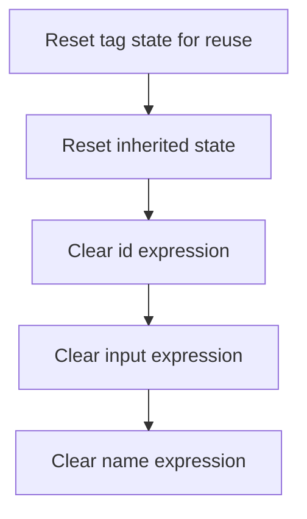

This document explains how select tags are reset for reuse. All inherited and tag-specific expression fields are cleared, ensuring each tag instance starts fresh and does not retain previous state.

# Resetting Select Tag State

<SwmSnippet path="/el/src/main/java/org/apache/strutsel/taglib/html/ELSelectTag.java" line="813">

---

In <SwmToken path="el/src/main/java/org/apache/strutsel/taglib/html/ELSelectTag.java" pos="813:5:5" line-data="    public void release() {">`release`</SwmToken>, we start by calling the superclass's release method to make sure any inherited cleanup runs first. After that, we move on to clearing out expression fields specific to this tag, which means we need to call the next release method in the hierarchy (<SwmToken path="el/src/main/java/org/apache/strutsel/taglib/bean/ELResourceTag.java" pos="38:4:4" line-data="public class ELResourceTag extends ResourceTag {">`ELResourceTag`</SwmToken>) to keep the cleanup chain intact.

```java
    public void release() {
        super.release();
```

---

</SwmSnippet>

## Clearing Resource Tag Expressions



<SwmSnippet path="/el/src/main/java/org/apache/strutsel/taglib/bean/ELResourceTag.java" line="108">

---

In <SwmToken path="el/src/main/java/org/apache/strutsel/taglib/bean/ELResourceTag.java" pos="108:5:5" line-data="    public void release() {">`release`</SwmToken>, after calling the superclass's cleanup, we clear out the <SwmToken path="el/src/main/java/org/apache/strutsel/taglib/bean/ELResourceTag.java" pos="85:9:9" line-data="    public void setIdExpr(String idExpr) {">`idExpr`</SwmToken> field by calling <SwmToken path="el/src/main/java/org/apache/strutsel/taglib/bean/ELResourceTag.java" pos="110:1:1" line-data="        setIdExpr(null);">`setIdExpr`</SwmToken>(null). This is the start of resetting all expression fields tied to this tag, and we continue with the other setters next.

```java
    public void release() {
        super.release();
        setIdExpr(null);
```

---

</SwmSnippet>

<SwmSnippet path="/el/src/main/java/org/apache/strutsel/taglib/bean/ELResourceTag.java" line="85">

---

<SwmToken path="el/src/main/java/org/apache/strutsel/taglib/bean/ELResourceTag.java" pos="85:5:5" line-data="    public void setIdExpr(String idExpr) {">`setIdExpr`</SwmToken> just assigns the given value to the <SwmToken path="el/src/main/java/org/apache/strutsel/taglib/bean/ELResourceTag.java" pos="85:9:9" line-data="    public void setIdExpr(String idExpr) {">`idExpr`</SwmToken> field. No extra logic, just a plain setter.

```java
    public void setIdExpr(String idExpr) {
        this.idExpr = idExpr;
    }
```

---

</SwmSnippet>

<SwmSnippet path="/el/src/main/java/org/apache/strutsel/taglib/bean/ELResourceTag.java" line="111">

---

Back in <SwmToken path="el/src/main/java/org/apache/strutsel/taglib/html/ELSelectTag.java" pos="813:5:5" line-data="    public void release() {">`release`</SwmToken>, after clearing <SwmToken path="el/src/main/java/org/apache/strutsel/taglib/bean/ELResourceTag.java" pos="85:9:9" line-data="    public void setIdExpr(String idExpr) {">`idExpr`</SwmToken>, we immediately call <SwmToken path="el/src/main/java/org/apache/strutsel/taglib/bean/ELResourceTag.java" pos="111:1:1" line-data="        setInputExpr(null);">`setInputExpr`</SwmToken>(null) to wipe out the <SwmToken path="el/src/main/java/org/apache/strutsel/taglib/bean/ELResourceTag.java" pos="93:9:9" line-data="    public void setInputExpr(String inputExpr) {">`inputExpr`</SwmToken> field as well. This keeps the cleanup thorough and consistent.

```java
        setInputExpr(null);
```

---

</SwmSnippet>

<SwmSnippet path="/el/src/main/java/org/apache/strutsel/taglib/bean/ELResourceTag.java" line="93">

---

<SwmToken path="el/src/main/java/org/apache/strutsel/taglib/bean/ELResourceTag.java" pos="93:5:5" line-data="    public void setInputExpr(String inputExpr) {">`setInputExpr`</SwmToken> just sets the <SwmToken path="el/src/main/java/org/apache/strutsel/taglib/bean/ELResourceTag.java" pos="93:9:9" line-data="    public void setInputExpr(String inputExpr) {">`inputExpr`</SwmToken> field to the given value. No extra logic.

```java
    public void setInputExpr(String inputExpr) {
        this.inputExpr = inputExpr;
    }
```

---

</SwmSnippet>

<SwmSnippet path="/el/src/main/java/org/apache/strutsel/taglib/bean/ELResourceTag.java" line="112">

---

Back in <SwmToken path="el/src/main/java/org/apache/strutsel/taglib/html/ELSelectTag.java" pos="813:5:5" line-data="    public void release() {">`release`</SwmToken>, after clearing <SwmToken path="el/src/main/java/org/apache/strutsel/taglib/bean/ELResourceTag.java" pos="93:9:9" line-data="    public void setInputExpr(String inputExpr) {">`inputExpr`</SwmToken>, we finish up by calling <SwmToken path="el/src/main/java/org/apache/strutsel/taglib/bean/ELResourceTag.java" pos="112:1:1" line-data="        setNameExpr(null);">`setNameExpr`</SwmToken>(null) to clear the last expression field. This completes the cleanup for this tag.

```java
        setNameExpr(null);
    }
```

---

</SwmSnippet>

<SwmSnippet path="/el/src/main/java/org/apache/strutsel/taglib/bean/ELResourceTag.java" line="101">

---

<SwmToken path="el/src/main/java/org/apache/strutsel/taglib/bean/ELResourceTag.java" pos="101:5:5" line-data="    public void setNameExpr(String nameExpr) {">`setNameExpr`</SwmToken> just sets the <SwmToken path="el/src/main/java/org/apache/strutsel/taglib/bean/ELResourceTag.java" pos="101:9:9" line-data="    public void setNameExpr(String nameExpr) {">`nameExpr`</SwmToken> field to the given value. No extra logic.

```java
    public void setNameExpr(String nameExpr) {
        this.nameExpr = nameExpr;
    }
```

---

</SwmSnippet>

## Nulling Select Tag Expressions

<SwmSnippet path="/el/src/main/java/org/apache/strutsel/taglib/html/ELSelectTag.java" line="815">

---

Back in <SwmToken path="el/src/main/java/org/apache/strutsel/taglib/html/ELSelectTag.java" pos="813:5:5" line-data="    public void release() {">`release`</SwmToken>, after cleaning up the resource tag fields, we start clearing the select tag's own expression fields, beginning with <SwmToken path="el/src/main/java/org/apache/strutsel/taglib/html/ELSelectTag.java" pos="815:1:1" line-data="        setAltExpr(null);">`setAltExpr`</SwmToken>(null). This keeps the tag ready for reuse.

```java
        setAltExpr(null);
```

---

</SwmSnippet>

<SwmSnippet path="/el/src/main/java/org/apache/strutsel/taglib/html/ELSelectTag.java" line="534">

---

<SwmToken path="el/src/main/java/org/apache/strutsel/taglib/html/ELSelectTag.java" pos="534:5:5" line-data="    public void setAltExpr(String altExpr) {">`setAltExpr`</SwmToken> just sets the <SwmToken path="el/src/main/java/org/apache/strutsel/taglib/html/ELSelectTag.java" pos="534:9:9" line-data="    public void setAltExpr(String altExpr) {">`altExpr`</SwmToken> field to the given value. No extra logic.

```java
    public void setAltExpr(String altExpr) {
        this.altExpr = altExpr;
    }
```

---

</SwmSnippet>

<SwmSnippet path="/el/src/main/java/org/apache/strutsel/taglib/html/ELSelectTag.java" line="816">

---

Back in <SwmToken path="el/src/main/java/org/apache/strutsel/taglib/html/ELSelectTag.java" pos="813:5:5" line-data="    public void release() {">`release`</SwmToken>, after clearing <SwmToken path="el/src/main/java/org/apache/strutsel/taglib/html/ELSelectTag.java" pos="534:9:9" line-data="    public void setAltExpr(String altExpr) {">`altExpr`</SwmToken>, we move on to <SwmToken path="el/src/main/java/org/apache/strutsel/taglib/html/ELSelectTag.java" pos="816:1:1" line-data="        setAltKeyExpr(null);">`setAltKeyExpr`</SwmToken>(null) to clear the <SwmToken path="el/src/main/java/org/apache/strutsel/taglib/html/ELSelectTag.java" pos="542:9:9" line-data="    public void setAltKeyExpr(String altKeyExpr) {">`altKeyExpr`</SwmToken> field. This keeps the cleanup consistent.

```java
        setAltKeyExpr(null);
```

---

</SwmSnippet>

<SwmSnippet path="/el/src/main/java/org/apache/strutsel/taglib/html/ELSelectTag.java" line="542">

---

<SwmToken path="el/src/main/java/org/apache/strutsel/taglib/html/ELSelectTag.java" pos="542:5:5" line-data="    public void setAltKeyExpr(String altKeyExpr) {">`setAltKeyExpr`</SwmToken> just sets the <SwmToken path="el/src/main/java/org/apache/strutsel/taglib/html/ELSelectTag.java" pos="542:9:9" line-data="    public void setAltKeyExpr(String altKeyExpr) {">`altKeyExpr`</SwmToken> field to the given value. No extra logic.

```java
    public void setAltKeyExpr(String altKeyExpr) {
        this.altKeyExpr = altKeyExpr;
    }
```

---

</SwmSnippet>

<SwmSnippet path="/el/src/main/java/org/apache/strutsel/taglib/html/ELSelectTag.java" line="817">

---

Back in <SwmToken path="el/src/main/java/org/apache/strutsel/taglib/html/ELSelectTag.java" pos="813:5:5" line-data="    public void release() {">`release`</SwmToken>, after clearing <SwmToken path="el/src/main/java/org/apache/strutsel/taglib/html/ELSelectTag.java" pos="542:9:9" line-data="    public void setAltKeyExpr(String altKeyExpr) {">`altKeyExpr`</SwmToken>, we call <SwmToken path="el/src/main/java/org/apache/strutsel/taglib/html/ELSelectTag.java" pos="817:1:1" line-data="        setBundleExpr(null);">`setBundleExpr`</SwmToken>(null) to clear the <SwmToken path="el/src/main/java/org/apache/strutsel/taglib/html/ELSelectTag.java" pos="550:9:9" line-data="    public void setBundleExpr(String bundleExpr) {">`bundleExpr`</SwmToken> field. This is part of the systematic cleanup of all expression fields.

```java
        setBundleExpr(null);
```

---

</SwmSnippet>

<SwmSnippet path="/el/src/main/java/org/apache/strutsel/taglib/html/ELSelectTag.java" line="550">

---

<SwmToken path="el/src/main/java/org/apache/strutsel/taglib/html/ELSelectTag.java" pos="550:5:5" line-data="    public void setBundleExpr(String bundleExpr) {">`setBundleExpr`</SwmToken> just sets the <SwmToken path="el/src/main/java/org/apache/strutsel/taglib/html/ELSelectTag.java" pos="550:9:9" line-data="    public void setBundleExpr(String bundleExpr) {">`bundleExpr`</SwmToken> field to the given value. No extra logic.

```java
    public void setBundleExpr(String bundleExpr) {
        this.bundleExpr = bundleExpr;
    }
```

---

</SwmSnippet>

<SwmSnippet path="/el/src/main/java/org/apache/strutsel/taglib/html/ELSelectTag.java" line="818">

---

Back in <SwmToken path="el/src/main/java/org/apache/strutsel/taglib/html/ELSelectTag.java" pos="813:5:5" line-data="    public void release() {">`release`</SwmToken>, after clearing <SwmToken path="el/src/main/java/org/apache/strutsel/taglib/html/ELSelectTag.java" pos="550:9:9" line-data="    public void setBundleExpr(String bundleExpr) {">`bundleExpr`</SwmToken>, we call <SwmToken path="el/src/main/java/org/apache/strutsel/taglib/html/ELSelectTag.java" pos="818:1:1" line-data="        setDirExpr(null);">`setDirExpr`</SwmToken>(null) to clear the <SwmToken path="el/src/main/java/org/apache/strutsel/taglib/html/ELSelectTag.java" pos="558:9:9" line-data="    public void setDirExpr(String dirExpr) {">`dirExpr`</SwmToken> field. This keeps the cleanup thorough.

```java
        setDirExpr(null);
```

---

</SwmSnippet>

<SwmSnippet path="/el/src/main/java/org/apache/strutsel/taglib/html/ELSelectTag.java" line="558">

---

<SwmToken path="el/src/main/java/org/apache/strutsel/taglib/html/ELSelectTag.java" pos="558:5:5" line-data="    public void setDirExpr(String dirExpr) {">`setDirExpr`</SwmToken> just sets the <SwmToken path="el/src/main/java/org/apache/strutsel/taglib/html/ELSelectTag.java" pos="558:9:9" line-data="    public void setDirExpr(String dirExpr) {">`dirExpr`</SwmToken> field to the given value. No extra logic.

```java
    public void setDirExpr(String dirExpr) {
        this.dirExpr = dirExpr;
    }
```

---

</SwmSnippet>

<SwmSnippet path="/el/src/main/java/org/apache/strutsel/taglib/html/ELSelectTag.java" line="819">

---

Back in <SwmToken path="el/src/main/java/org/apache/strutsel/taglib/html/ELSelectTag.java" pos="813:5:5" line-data="    public void release() {">`release`</SwmToken>, after clearing <SwmToken path="el/src/main/java/org/apache/strutsel/taglib/html/ELSelectTag.java" pos="558:9:9" line-data="    public void setDirExpr(String dirExpr) {">`dirExpr`</SwmToken>, we call <SwmToken path="el/src/main/java/org/apache/strutsel/taglib/html/ELSelectTag.java" pos="819:1:1" line-data="        setDisabledExpr(null);">`setDisabledExpr`</SwmToken>(null) to clear the <SwmToken path="el/src/main/java/org/apache/strutsel/taglib/html/ELSelectTag.java" pos="566:9:9" line-data="    public void setDisabledExpr(String disabledExpr) {">`disabledExpr`</SwmToken> field. This continues the cleanup process.

```java
        setDisabledExpr(null);
```

---

</SwmSnippet>

<SwmSnippet path="/el/src/main/java/org/apache/strutsel/taglib/html/ELSelectTag.java" line="566">

---

<SwmToken path="el/src/main/java/org/apache/strutsel/taglib/html/ELSelectTag.java" pos="566:5:5" line-data="    public void setDisabledExpr(String disabledExpr) {">`setDisabledExpr`</SwmToken> just sets the <SwmToken path="el/src/main/java/org/apache/strutsel/taglib/html/ELSelectTag.java" pos="566:9:9" line-data="    public void setDisabledExpr(String disabledExpr) {">`disabledExpr`</SwmToken> field to the given value. No extra logic.

```java
    public void setDisabledExpr(String disabledExpr) {
        this.disabledExpr = disabledExpr;
    }
```

---

</SwmSnippet>

<SwmSnippet path="/el/src/main/java/org/apache/strutsel/taglib/html/ELSelectTag.java" line="820">

---

Back in ELSelectTag.release, right after <SwmToken path="el/src/main/java/org/apache/strutsel/taglib/html/ELSelectTag.java" pos="566:5:5" line-data="    public void setDisabledExpr(String disabledExpr) {">`setDisabledExpr`</SwmToken>, we call <SwmToken path="el/src/main/java/org/apache/strutsel/taglib/html/ELSelectTag.java" pos="820:1:1" line-data="        setErrorKeyExpr(null);">`setErrorKeyExpr`</SwmToken>(null) to make sure any error key expression from a previous tag usage doesn't stick around. This keeps the tag's error handling clean for each use.

```java
        setErrorKeyExpr(null);
```

---

</SwmSnippet>

<SwmSnippet path="/el/src/main/java/org/apache/strutsel/taglib/html/ELSelectTag.java" line="574">

---

SetErrorKeyExpr just sets the <SwmToken path="el/src/main/java/org/apache/strutsel/taglib/html/ELSelectTag.java" pos="574:9:9" line-data="    public void setErrorKeyExpr(String errorKeyExpr) {">`errorKeyExpr`</SwmToken> field to whatever value you pass in. Here, it's used to clear out any leftover error key expression so the tag doesn't accidentally reuse old state.

```java
    public void setErrorKeyExpr(String errorKeyExpr) {
        this.errorKeyExpr = errorKeyExpr;
    }
```

---

</SwmSnippet>

<SwmSnippet path="/el/src/main/java/org/apache/strutsel/taglib/html/ELSelectTag.java" line="821">

---

Back in ELSelectTag.release, after clearing <SwmToken path="el/src/main/java/org/apache/strutsel/taglib/html/ELSelectTag.java" pos="574:9:9" line-data="    public void setErrorKeyExpr(String errorKeyExpr) {">`errorKeyExpr`</SwmToken>, we immediately call <SwmToken path="el/src/main/java/org/apache/strutsel/taglib/html/ELSelectTag.java" pos="821:1:1" line-data="        setErrorStyleExpr(null);">`setErrorStyleExpr`</SwmToken>(null) to reset any custom error styling. This prevents old error styles from leaking into the next tag usage.

```java
        setErrorStyleExpr(null);
```

---

</SwmSnippet>

<SwmSnippet path="/el/src/main/java/org/apache/strutsel/taglib/html/ELSelectTag.java" line="582">

---

SetErrorStyleExpr just sets the <SwmToken path="el/src/main/java/org/apache/strutsel/taglib/html/ELSelectTag.java" pos="582:9:9" line-data="    public void setErrorStyleExpr(String errorStyleExpr) {">`errorStyleExpr`</SwmToken> field. Here, it's used to make sure any error style expression from a previous use is wiped out before the tag is reused.

```java
    public void setErrorStyleExpr(String errorStyleExpr) {
        this.errorStyleExpr = errorStyleExpr;
    }
```

---

</SwmSnippet>

<SwmSnippet path="/el/src/main/java/org/apache/strutsel/taglib/html/ELSelectTag.java" line="822">

---

Back in ELSelectTag.release, after <SwmToken path="el/src/main/java/org/apache/strutsel/taglib/html/ELSelectTag.java" pos="582:5:5" line-data="    public void setErrorStyleExpr(String errorStyleExpr) {">`setErrorStyleExpr`</SwmToken>(null), we call <SwmToken path="el/src/main/java/org/apache/strutsel/taglib/html/ELSelectTag.java" pos="822:1:1" line-data="        setErrorStyleClassExpr(null);">`setErrorStyleClassExpr`</SwmToken>(null) to clear out any leftover error style class. This keeps the tag's CSS class state isolated between uses.

```java
        setErrorStyleClassExpr(null);
```

---

</SwmSnippet>

<SwmSnippet path="/el/src/main/java/org/apache/strutsel/taglib/html/ELSelectTag.java" line="590">

---

SetErrorStyleClassExpr just sets the <SwmToken path="el/src/main/java/org/apache/strutsel/taglib/html/ELSelectTag.java" pos="590:9:9" line-data="    public void setErrorStyleClassExpr(String errorStyleClassExpr) {">`errorStyleClassExpr`</SwmToken> field. Here, it's called to make sure any previous error style class doesn't stick around when the tag is reused.

```java
    public void setErrorStyleClassExpr(String errorStyleClassExpr) {
        this.errorStyleClassExpr = errorStyleClassExpr;
    }
```

---

</SwmSnippet>

<SwmSnippet path="/el/src/main/java/org/apache/strutsel/taglib/html/ELSelectTag.java" line="823">

---

Back in ELSelectTag.release, after <SwmToken path="el/src/main/java/org/apache/strutsel/taglib/html/ELSelectTag.java" pos="590:5:5" line-data="    public void setErrorStyleClassExpr(String errorStyleClassExpr) {">`setErrorStyleClassExpr`</SwmToken>(null), we call <SwmToken path="el/src/main/java/org/apache/strutsel/taglib/html/ELSelectTag.java" pos="823:1:1" line-data="        setErrorStyleIdExpr(null);">`setErrorStyleIdExpr`</SwmToken>(null) to make sure any previous error style ID is wiped out. This avoids accidental ID reuse in the rendered HTML.

```java
        setErrorStyleIdExpr(null);
```

---

</SwmSnippet>

<SwmSnippet path="/el/src/main/java/org/apache/strutsel/taglib/html/ELSelectTag.java" line="598">

---

SetErrorStyleIdExpr just sets the <SwmToken path="el/src/main/java/org/apache/strutsel/taglib/html/ELSelectTag.java" pos="598:9:9" line-data="    public void setErrorStyleIdExpr(String errorStyleIdExpr) {">`errorStyleIdExpr`</SwmToken> field. Here, it's called to make sure any previous error style ID is cleared out before the tag is reused.

```java
    public void setErrorStyleIdExpr(String errorStyleIdExpr) {
        this.errorStyleIdExpr = errorStyleIdExpr;
    }
```

---

</SwmSnippet>

<SwmSnippet path="/el/src/main/java/org/apache/strutsel/taglib/html/ELSelectTag.java" line="824">

---

Back in ELSelectTag.release, after <SwmToken path="el/src/main/java/org/apache/strutsel/taglib/html/ELSelectTag.java" pos="598:5:5" line-data="    public void setErrorStyleIdExpr(String errorStyleIdExpr) {">`setErrorStyleIdExpr`</SwmToken>(null), we call <SwmToken path="el/src/main/java/org/apache/strutsel/taglib/html/ELSelectTag.java" pos="824:1:1" line-data="        setIndexedExpr(null);">`setIndexedExpr`</SwmToken>(null) to clear any leftover indexed expression. This keeps the tag's index handling clean for each use, especially in dynamic lists.

```java
        setIndexedExpr(null);
```

---

</SwmSnippet>

<SwmSnippet path="/el/src/main/java/org/apache/strutsel/taglib/html/ELSelectTag.java" line="606">

---

SetIndexedExpr just sets the <SwmToken path="el/src/main/java/org/apache/strutsel/taglib/html/ELSelectTag.java" pos="606:9:9" line-data="    public void setIndexedExpr(String indexedExpr) {">`indexedExpr`</SwmToken> field. Here, it's called to make sure any previous indexed expression is wiped before the tag is reused.

```java
    public void setIndexedExpr(String indexedExpr) {
        this.indexedExpr = indexedExpr;
    }
```

---

</SwmSnippet>

<SwmSnippet path="/el/src/main/java/org/apache/strutsel/taglib/html/ELSelectTag.java" line="825">

---

Back in ELSelectTag.release, after <SwmToken path="el/src/main/java/org/apache/strutsel/taglib/html/ELSelectTag.java" pos="606:5:5" line-data="    public void setIndexedExpr(String indexedExpr) {">`setIndexedExpr`</SwmToken>(null), we call <SwmToken path="el/src/main/java/org/apache/strutsel/taglib/html/ELSelectTag.java" pos="825:1:1" line-data="        setLangExpr(null);">`setLangExpr`</SwmToken>(null) to clear any language expression. This prevents language settings from leaking between tag usages.

```java
        setLangExpr(null);
```

---

</SwmSnippet>

<SwmSnippet path="/el/src/main/java/org/apache/strutsel/taglib/html/ELSelectTag.java" line="614">

---

SetLangExpr just sets the <SwmToken path="el/src/main/java/org/apache/strutsel/taglib/html/ELSelectTag.java" pos="614:9:9" line-data="    public void setLangExpr(String langExpr) {">`langExpr`</SwmToken> field. Here, it's called to clear out any previous language expression before the tag is reused.

```java
    public void setLangExpr(String langExpr) {
        this.langExpr = langExpr;
    }
```

---

</SwmSnippet>

<SwmSnippet path="/el/src/main/java/org/apache/strutsel/taglib/html/ELSelectTag.java" line="826">

---

Back in ELSelectTag.release, after <SwmToken path="el/src/main/java/org/apache/strutsel/taglib/html/ELSelectTag.java" pos="614:5:5" line-data="    public void setLangExpr(String langExpr) {">`setLangExpr`</SwmToken>(null), we call <SwmToken path="el/src/main/java/org/apache/strutsel/taglib/html/ELSelectTag.java" pos="826:1:1" line-data="        setMultipleExpr(null);">`setMultipleExpr`</SwmToken>(null) to clear any previous 'multiple' attribute expression. This keeps the select tag's multi-select state from carrying over.

```java
        setMultipleExpr(null);
```

---

</SwmSnippet>

<SwmSnippet path="/el/src/main/java/org/apache/strutsel/taglib/html/ELSelectTag.java" line="622">

---

SetMultipleExpr just sets the <SwmToken path="el/src/main/java/org/apache/strutsel/taglib/html/ELSelectTag.java" pos="622:9:9" line-data="    public void setMultipleExpr(String multipleExpr) {">`multipleExpr`</SwmToken> field. Here, it's called to clear out any previous 'multiple' attribute expression before the tag is reused.

```java
    public void setMultipleExpr(String multipleExpr) {
        this.multipleExpr = multipleExpr;
    }
```

---

</SwmSnippet>

<SwmSnippet path="/el/src/main/java/org/apache/strutsel/taglib/html/ELSelectTag.java" line="827">

---

Back in ELSelectTag.release, after <SwmToken path="el/src/main/java/org/apache/strutsel/taglib/html/ELSelectTag.java" pos="622:5:5" line-data="    public void setMultipleExpr(String multipleExpr) {">`setMultipleExpr`</SwmToken>(null), we call <SwmToken path="el/src/main/java/org/apache/strutsel/taglib/html/ELSelectTag.java" pos="827:1:1" line-data="        setNameExpr(null);">`setNameExpr`</SwmToken>(null) to clear any previous name expression. This prevents the tag from accidentally reusing a name from a prior usage.

```java
        setNameExpr(null);
```

---

</SwmSnippet>

<SwmSnippet path="/el/src/main/java/org/apache/strutsel/taglib/html/ELSelectTag.java" line="630">

---

SetNameExpr just sets the <SwmToken path="el/src/main/java/org/apache/strutsel/taglib/html/ELSelectTag.java" pos="630:9:9" line-data="    public void setNameExpr(String nameExpr) {">`nameExpr`</SwmToken> field. Here, it's called to clear out any previous 'name' attribute expression before the tag is reused.

```java
    public void setNameExpr(String nameExpr) {
        this.nameExpr = nameExpr;
    }
```

---

</SwmSnippet>

<SwmSnippet path="/el/src/main/java/org/apache/strutsel/taglib/html/ELSelectTag.java" line="828">

---

Back in ELSelectTag.release, after <SwmToken path="el/src/main/java/org/apache/strutsel/taglib/html/ELSelectTag.java" pos="630:5:5" line-data="    public void setNameExpr(String nameExpr) {">`setNameExpr`</SwmToken>(null), we call <SwmToken path="el/src/main/java/org/apache/strutsel/taglib/html/ELSelectTag.java" pos="828:1:1" line-data="        setOnblurExpr(null);">`setOnblurExpr`</SwmToken>(null) to clear any onblur event handler expression. This keeps JavaScript event handling from leaking between tag instances.

```java
        setOnblurExpr(null);
```

---

</SwmSnippet>

<SwmSnippet path="/el/src/main/java/org/apache/strutsel/taglib/html/ELSelectTag.java" line="638">

---

SetOnblurExpr just sets the <SwmToken path="el/src/main/java/org/apache/strutsel/taglib/html/ELSelectTag.java" pos="638:9:9" line-data="    public void setOnblurExpr(String onblurExpr) {">`onblurExpr`</SwmToken> field. Here, it's called to clear out any previous onblur event handler expression before the tag is reused.

```java
    public void setOnblurExpr(String onblurExpr) {
        this.onblurExpr = onblurExpr;
    }
```

---

</SwmSnippet>

<SwmSnippet path="/el/src/main/java/org/apache/strutsel/taglib/html/ELSelectTag.java" line="829">

---

Back in ELSelectTag.release, after <SwmToken path="el/src/main/java/org/apache/strutsel/taglib/html/ELSelectTag.java" pos="638:5:5" line-data="    public void setOnblurExpr(String onblurExpr) {">`setOnblurExpr`</SwmToken>(null), we call <SwmToken path="el/src/main/java/org/apache/strutsel/taglib/html/ELSelectTag.java" pos="829:1:1" line-data="        setOnchangeExpr(null);">`setOnchangeExpr`</SwmToken>(null) to clear any onchange event handler expression. This keeps the tag's JavaScript state isolated for each use.

```java
        setOnchangeExpr(null);
```

---

</SwmSnippet>

<SwmSnippet path="/el/src/main/java/org/apache/strutsel/taglib/html/ELSelectTag.java" line="646">

---

SetOnchangeExpr just sets the <SwmToken path="el/src/main/java/org/apache/strutsel/taglib/html/ELSelectTag.java" pos="646:9:9" line-data="    public void setOnchangeExpr(String onchangeExpr) {">`onchangeExpr`</SwmToken> field. Here, it's called to clear out any previous onchange event handler expression before the tag is reused.

```java
    public void setOnchangeExpr(String onchangeExpr) {
        this.onchangeExpr = onchangeExpr;
    }
```

---

</SwmSnippet>

<SwmSnippet path="/el/src/main/java/org/apache/strutsel/taglib/html/ELSelectTag.java" line="830">

---

Back in ELSelectTag.release, right after <SwmToken path="el/src/main/java/org/apache/strutsel/taglib/html/ELSelectTag.java" pos="646:5:5" line-data="    public void setOnchangeExpr(String onchangeExpr) {">`setOnchangeExpr`</SwmToken>(null), we call <SwmToken path="el/src/main/java/org/apache/strutsel/taglib/html/ELSelectTag.java" pos="830:1:1" line-data="        setOnclickExpr(null);">`setOnclickExpr`</SwmToken>(null) to clear any leftover onclick event handler. This keeps the tag's JavaScript state isolated between uses and avoids accidental reuse of old event handlers.

```java
        setOnclickExpr(null);
```

---

</SwmSnippet>

<SwmSnippet path="/el/src/main/java/org/apache/strutsel/taglib/html/ELSelectTag.java" line="654">

---

SetOnclickExpr just assigns the given string to the <SwmToken path="el/src/main/java/org/apache/strutsel/taglib/html/ELSelectTag.java" pos="654:9:9" line-data="    public void setOnclickExpr(String onclickExpr) {">`onclickExpr`</SwmToken> field. It's a plain setter, nothing fancy or unexpected.

```java
    public void setOnclickExpr(String onclickExpr) {
        this.onclickExpr = onclickExpr;
    }
```

---

</SwmSnippet>

<SwmSnippet path="/el/src/main/java/org/apache/strutsel/taglib/html/ELSelectTag.java" line="831">

---

Back in ELSelectTag.release, right after <SwmToken path="el/src/main/java/org/apache/strutsel/taglib/html/ELSelectTag.java" pos="654:5:5" line-data="    public void setOnclickExpr(String onclickExpr) {">`setOnclickExpr`</SwmToken>(null), we call <SwmToken path="el/src/main/java/org/apache/strutsel/taglib/html/ELSelectTag.java" pos="831:1:1" line-data="        setOndblclickExpr(null);">`setOndblclickExpr`</SwmToken>(null) to clear any leftover ondblclick event handler. This keeps the tag's event handling clean and avoids reusing old handlers.

```java
        setOndblclickExpr(null);
```

---

</SwmSnippet>

<SwmSnippet path="/el/src/main/java/org/apache/strutsel/taglib/html/ELSelectTag.java" line="662">

---

SetOndblclickExpr just assigns the given string to the <SwmToken path="el/src/main/java/org/apache/strutsel/taglib/html/ELSelectTag.java" pos="662:9:9" line-data="    public void setOndblclickExpr(String ondblclickExpr) {">`ondblclickExpr`</SwmToken> field. It's a standard setter, nothing else going on.

```java
    public void setOndblclickExpr(String ondblclickExpr) {
        this.ondblclickExpr = ondblclickExpr;
    }
```

---

</SwmSnippet>

<SwmSnippet path="/el/src/main/java/org/apache/strutsel/taglib/html/ELSelectTag.java" line="832">

---

Back in ELSelectTag.release, right after <SwmToken path="el/src/main/java/org/apache/strutsel/taglib/html/ELSelectTag.java" pos="662:5:5" line-data="    public void setOndblclickExpr(String ondblclickExpr) {">`setOndblclickExpr`</SwmToken>(null), we call <SwmToken path="el/src/main/java/org/apache/strutsel/taglib/html/ELSelectTag.java" pos="832:1:1" line-data="        setOnfocusExpr(null);">`setOnfocusExpr`</SwmToken>(null) to clear any leftover onfocus event handler. This keeps the tag's event state clean between uses.

```java
        setOnfocusExpr(null);
```

---

</SwmSnippet>

<SwmSnippet path="/el/src/main/java/org/apache/strutsel/taglib/html/ELSelectTag.java" line="670">

---

SetOnfocusExpr just assigns the given string to the <SwmToken path="el/src/main/java/org/apache/strutsel/taglib/html/ELSelectTag.java" pos="670:9:9" line-data="    public void setOnfocusExpr(String onfocusExpr) {">`onfocusExpr`</SwmToken> field. It's a plain setter, nothing else.

```java
    public void setOnfocusExpr(String onfocusExpr) {
        this.onfocusExpr = onfocusExpr;
    }
```

---

</SwmSnippet>

<SwmSnippet path="/el/src/main/java/org/apache/strutsel/taglib/html/ELSelectTag.java" line="833">

---

Back in ELSelectTag.release, right after <SwmToken path="el/src/main/java/org/apache/strutsel/taglib/html/ELSelectTag.java" pos="670:5:5" line-data="    public void setOnfocusExpr(String onfocusExpr) {">`setOnfocusExpr`</SwmToken>(null), we call <SwmToken path="el/src/main/java/org/apache/strutsel/taglib/html/ELSelectTag.java" pos="833:1:1" line-data="        setOnkeydownExpr(null);">`setOnkeydownExpr`</SwmToken>(null) to clear any leftover onkeydown event handler. This keeps the tag's event state clean between uses.

```java
        setOnkeydownExpr(null);
```

---

</SwmSnippet>

<SwmSnippet path="/el/src/main/java/org/apache/strutsel/taglib/html/ELSelectTag.java" line="678">

---

SetOnkeydownExpr just assigns the given string to the <SwmToken path="el/src/main/java/org/apache/strutsel/taglib/html/ELSelectTag.java" pos="678:9:9" line-data="    public void setOnkeydownExpr(String onkeydownExpr) {">`onkeydownExpr`</SwmToken> field. It's a plain setter, nothing else.

```java
    public void setOnkeydownExpr(String onkeydownExpr) {
        this.onkeydownExpr = onkeydownExpr;
    }
```

---

</SwmSnippet>

<SwmSnippet path="/el/src/main/java/org/apache/strutsel/taglib/html/ELSelectTag.java" line="834">

---

Back in ELSelectTag.release, right after <SwmToken path="el/src/main/java/org/apache/strutsel/taglib/html/ELSelectTag.java" pos="678:5:5" line-data="    public void setOnkeydownExpr(String onkeydownExpr) {">`setOnkeydownExpr`</SwmToken>(null), we call <SwmToken path="el/src/main/java/org/apache/strutsel/taglib/html/ELSelectTag.java" pos="834:1:1" line-data="        setOnkeypressExpr(null);">`setOnkeypressExpr`</SwmToken>(null) to clear any leftover onkeypress event handler. This keeps the tag's event state clean between uses.

```java
        setOnkeypressExpr(null);
```

---

</SwmSnippet>

<SwmSnippet path="/el/src/main/java/org/apache/strutsel/taglib/html/ELSelectTag.java" line="686">

---

SetOnkeypressExpr just assigns the given string to the <SwmToken path="el/src/main/java/org/apache/strutsel/taglib/html/ELSelectTag.java" pos="686:9:9" line-data="    public void setOnkeypressExpr(String onkeypressExpr) {">`onkeypressExpr`</SwmToken> field. It's a plain setter, nothing else.

```java
    public void setOnkeypressExpr(String onkeypressExpr) {
        this.onkeypressExpr = onkeypressExpr;
    }
```

---

</SwmSnippet>

<SwmSnippet path="/el/src/main/java/org/apache/strutsel/taglib/html/ELSelectTag.java" line="835">

---

Back in ELSelectTag.release, right after <SwmToken path="el/src/main/java/org/apache/strutsel/taglib/html/ELSelectTag.java" pos="686:5:5" line-data="    public void setOnkeypressExpr(String onkeypressExpr) {">`setOnkeypressExpr`</SwmToken>(null), we call <SwmToken path="el/src/main/java/org/apache/strutsel/taglib/html/ELSelectTag.java" pos="835:1:1" line-data="        setOnkeyupExpr(null);">`setOnkeyupExpr`</SwmToken>(null) to clear any leftover onkeyup event handler. This keeps the tag's event state clean between uses.

```java
        setOnkeyupExpr(null);
```

---

</SwmSnippet>

<SwmSnippet path="/el/src/main/java/org/apache/strutsel/taglib/html/ELSelectTag.java" line="694">

---

SetOnkeyupExpr just assigns the given string to the <SwmToken path="el/src/main/java/org/apache/strutsel/taglib/html/ELSelectTag.java" pos="694:9:9" line-data="    public void setOnkeyupExpr(String onkeyupExpr) {">`onkeyupExpr`</SwmToken> field. It's a plain setter, nothing else.

```java
    public void setOnkeyupExpr(String onkeyupExpr) {
        this.onkeyupExpr = onkeyupExpr;
    }
```

---

</SwmSnippet>

<SwmSnippet path="/el/src/main/java/org/apache/strutsel/taglib/html/ELSelectTag.java" line="836">

---

Back in ELSelectTag.release, right after <SwmToken path="el/src/main/java/org/apache/strutsel/taglib/html/ELSelectTag.java" pos="694:5:5" line-data="    public void setOnkeyupExpr(String onkeyupExpr) {">`setOnkeyupExpr`</SwmToken>(null), we call <SwmToken path="el/src/main/java/org/apache/strutsel/taglib/html/ELSelectTag.java" pos="836:1:1" line-data="        setOnmousedownExpr(null);">`setOnmousedownExpr`</SwmToken>(null) to clear any leftover onmousedown event handler. This keeps the tag's event state clean between uses.

```java
        setOnmousedownExpr(null);
```

---

</SwmSnippet>

<SwmSnippet path="/el/src/main/java/org/apache/strutsel/taglib/html/ELSelectTag.java" line="702">

---

SetOnmousedownExpr just assigns the given string to the <SwmToken path="el/src/main/java/org/apache/strutsel/taglib/html/ELSelectTag.java" pos="702:9:9" line-data="    public void setOnmousedownExpr(String onmousedownExpr) {">`onmousedownExpr`</SwmToken> field. It's a plain setter, nothing else.

```java
    public void setOnmousedownExpr(String onmousedownExpr) {
        this.onmousedownExpr = onmousedownExpr;
    }
```

---

</SwmSnippet>

<SwmSnippet path="/el/src/main/java/org/apache/strutsel/taglib/html/ELSelectTag.java" line="837">

---

Back in ELSelectTag.release, right after <SwmToken path="el/src/main/java/org/apache/strutsel/taglib/html/ELSelectTag.java" pos="702:5:5" line-data="    public void setOnmousedownExpr(String onmousedownExpr) {">`setOnmousedownExpr`</SwmToken>(null), we call <SwmToken path="el/src/main/java/org/apache/strutsel/taglib/html/ELSelectTag.java" pos="837:1:1" line-data="        setOnmousemoveExpr(null);">`setOnmousemoveExpr`</SwmToken>(null) to clear any leftover onmousemove event handler. This keeps the tag's event state clean between uses.

```java
        setOnmousemoveExpr(null);
```

---

</SwmSnippet>

<SwmSnippet path="/el/src/main/java/org/apache/strutsel/taglib/html/ELSelectTag.java" line="710">

---

SetOnmousemoveExpr just assigns the given string to the <SwmToken path="el/src/main/java/org/apache/strutsel/taglib/html/ELSelectTag.java" pos="710:9:9" line-data="    public void setOnmousemoveExpr(String onmousemoveExpr) {">`onmousemoveExpr`</SwmToken> field. It's a plain setter, nothing else.

```java
    public void setOnmousemoveExpr(String onmousemoveExpr) {
        this.onmousemoveExpr = onmousemoveExpr;
    }
```

---

</SwmSnippet>

<SwmSnippet path="/el/src/main/java/org/apache/strutsel/taglib/html/ELSelectTag.java" line="838">

---

Back in ELSelectTag.release, right after <SwmToken path="el/src/main/java/org/apache/strutsel/taglib/html/ELSelectTag.java" pos="710:5:5" line-data="    public void setOnmousemoveExpr(String onmousemoveExpr) {">`setOnmousemoveExpr`</SwmToken>(null), we call <SwmToken path="el/src/main/java/org/apache/strutsel/taglib/html/ELSelectTag.java" pos="838:1:1" line-data="        setOnmouseoutExpr(null);">`setOnmouseoutExpr`</SwmToken>(null) to clear any leftover onmouseout event handler. This keeps the tag's event state clean between uses.

```java
        setOnmouseoutExpr(null);
```

---

</SwmSnippet>

<SwmSnippet path="/el/src/main/java/org/apache/strutsel/taglib/html/ELSelectTag.java" line="718">

---

SetOnmouseoutExpr just assigns the given string to the <SwmToken path="el/src/main/java/org/apache/strutsel/taglib/html/ELSelectTag.java" pos="718:9:9" line-data="    public void setOnmouseoutExpr(String onmouseoutExpr) {">`onmouseoutExpr`</SwmToken> field. It's a plain setter, nothing else.

```java
    public void setOnmouseoutExpr(String onmouseoutExpr) {
        this.onmouseoutExpr = onmouseoutExpr;
    }
```

---

</SwmSnippet>

<SwmSnippet path="/el/src/main/java/org/apache/strutsel/taglib/html/ELSelectTag.java" line="839">

---

Back in ELSelectTag.release, right after <SwmToken path="el/src/main/java/org/apache/strutsel/taglib/html/ELSelectTag.java" pos="718:5:5" line-data="    public void setOnmouseoutExpr(String onmouseoutExpr) {">`setOnmouseoutExpr`</SwmToken>(null), we call <SwmToken path="el/src/main/java/org/apache/strutsel/taglib/html/ELSelectTag.java" pos="839:1:1" line-data="        setOnmouseoverExpr(null);">`setOnmouseoverExpr`</SwmToken>(null) to clear any leftover onmouseover event handler. This keeps the tag's event state clean between uses.

```java
        setOnmouseoverExpr(null);
```

---

</SwmSnippet>

<SwmSnippet path="/el/src/main/java/org/apache/strutsel/taglib/html/ELSelectTag.java" line="726">

---

SetOnmouseoverExpr just assigns the given string to the <SwmToken path="el/src/main/java/org/apache/strutsel/taglib/html/ELSelectTag.java" pos="726:9:9" line-data="    public void setOnmouseoverExpr(String onmouseoverExpr) {">`onmouseoverExpr`</SwmToken> field. It's a plain setter, nothing else.

```java
    public void setOnmouseoverExpr(String onmouseoverExpr) {
        this.onmouseoverExpr = onmouseoverExpr;
    }
```

---

</SwmSnippet>

<SwmSnippet path="/el/src/main/java/org/apache/strutsel/taglib/html/ELSelectTag.java" line="840">

---

Right after returning from ELSelectTag.setOnmouseoverExpr, ELSelectTag.release calls <SwmToken path="el/src/main/java/org/apache/strutsel/taglib/html/ELSelectTag.java" pos="840:1:1" line-data="        setOnmouseupExpr(null);">`setOnmouseupExpr`</SwmToken>(null) to clear any leftover onmouseup event handler. This keeps the tag's event handler state clean and avoids reusing old handlers when the tag is reused.

```java
        setOnmouseupExpr(null);
```

---

</SwmSnippet>

<SwmSnippet path="/el/src/main/java/org/apache/strutsel/taglib/html/ELSelectTag.java" line="734">

---

SetOnmouseupExpr just assigns the input string to the <SwmToken path="el/src/main/java/org/apache/strutsel/taglib/html/ELSelectTag.java" pos="734:9:9" line-data="    public void setOnmouseupExpr(String onmouseupExpr) {">`onmouseupExpr`</SwmToken> field. It's a plain setter, no validation or extra logic—just making sure the event handler doesn't stick around between tag uses.

```java
    public void setOnmouseupExpr(String onmouseupExpr) {
        this.onmouseupExpr = onmouseupExpr;
    }
```

---

</SwmSnippet>

<SwmSnippet path="/el/src/main/java/org/apache/strutsel/taglib/html/ELSelectTag.java" line="841">

---

After returning from ELSelectTag.setOnmouseupExpr, ELSelectTag.release immediately calls <SwmToken path="el/src/main/java/org/apache/strutsel/taglib/html/ELSelectTag.java" pos="841:1:1" line-data="        setPropertyExpr(null);">`setPropertyExpr`</SwmToken>(null) to clear any property expression. This prevents property state from leaking between tag instances.

```java
        setPropertyExpr(null);
```

---

</SwmSnippet>

<SwmSnippet path="/el/src/main/java/org/apache/strutsel/taglib/html/ELSelectTag.java" line="742">

---

SetPropertyExpr just assigns the input string to the <SwmToken path="el/src/main/java/org/apache/strutsel/taglib/html/ELSelectTag.java" pos="742:9:9" line-data="    public void setPropertyExpr(String propertyExpr) {">`propertyExpr`</SwmToken> field. It's a standard setter, no validation or extra logic—just making sure the property expression doesn't stick around between tag uses.

```java
    public void setPropertyExpr(String propertyExpr) {
        this.propertyExpr = propertyExpr;
    }
```

---

</SwmSnippet>

<SwmSnippet path="/el/src/main/java/org/apache/strutsel/taglib/html/ELSelectTag.java" line="842">

---

After returning from ELSelectTag.setPropertyExpr, ELSelectTag.release calls <SwmToken path="el/src/main/java/org/apache/strutsel/taglib/html/ELSelectTag.java" pos="842:1:1" line-data="        setSizeExpr(null);">`setSizeExpr`</SwmToken>(null) to clear any size expression. This keeps the tag's size attribute from persisting across uses.

```java
        setSizeExpr(null);
```

---

</SwmSnippet>

<SwmSnippet path="/el/src/main/java/org/apache/strutsel/taglib/html/ELSelectTag.java" line="750">

---

SetSizeExpr just assigns the input string to the <SwmToken path="el/src/main/java/org/apache/strutsel/taglib/html/ELSelectTag.java" pos="750:9:9" line-data="    public void setSizeExpr(String sizeExpr) {">`sizeExpr`</SwmToken> field. It's a plain setter, no validation or extra logic—just making sure the size expression doesn't stick around between tag uses.

```java
    public void setSizeExpr(String sizeExpr) {
        this.sizeExpr = sizeExpr;
    }
```

---

</SwmSnippet>

<SwmSnippet path="/el/src/main/java/org/apache/strutsel/taglib/html/ELSelectTag.java" line="843">

---

After returning from ELSelectTag.setSizeExpr, ELSelectTag.release calls <SwmToken path="el/src/main/java/org/apache/strutsel/taglib/html/ELSelectTag.java" pos="843:1:1" line-data="        setStyleExpr(null);">`setStyleExpr`</SwmToken>(null) to clear any style expression. This makes sure the tag doesn't accidentally reuse a style from a previous usage.

```java
        setStyleExpr(null);
```

---

</SwmSnippet>

<SwmSnippet path="/el/src/main/java/org/apache/strutsel/taglib/html/ELSelectTag.java" line="758">

---

SetStyleExpr just assigns the input string to the <SwmToken path="el/src/main/java/org/apache/strutsel/taglib/html/ELSelectTag.java" pos="758:9:9" line-data="    public void setStyleExpr(String styleExpr) {">`styleExpr`</SwmToken> field. It's a plain setter, no validation or extra logic—just making sure the style expression doesn't stick around between tag uses.

```java
    public void setStyleExpr(String styleExpr) {
        this.styleExpr = styleExpr;
    }
```

---

</SwmSnippet>

<SwmSnippet path="/el/src/main/java/org/apache/strutsel/taglib/html/ELSelectTag.java" line="844">

---

After returning from ELSelectTag.setStyleExpr, ELSelectTag.release calls <SwmToken path="el/src/main/java/org/apache/strutsel/taglib/html/ELSelectTag.java" pos="844:1:1" line-data="        setStyleClassExpr(null);">`setStyleClassExpr`</SwmToken>(null) to clear any style class expression. This keeps the tag's CSS class state from leaking between uses.

```java
        setStyleClassExpr(null);
```

---

</SwmSnippet>

<SwmSnippet path="/el/src/main/java/org/apache/strutsel/taglib/html/ELSelectTag.java" line="766">

---

SetStyleClassExpr just assigns the input string to the <SwmToken path="el/src/main/java/org/apache/strutsel/taglib/html/ELSelectTag.java" pos="766:9:9" line-data="    public void setStyleClassExpr(String styleClassExpr) {">`styleClassExpr`</SwmToken> field. It's a plain setter, no validation or extra logic—just making sure the style class expression doesn't stick around between tag uses.

```java
    public void setStyleClassExpr(String styleClassExpr) {
        this.styleClassExpr = styleClassExpr;
    }
```

---

</SwmSnippet>

<SwmSnippet path="/el/src/main/java/org/apache/strutsel/taglib/html/ELSelectTag.java" line="845">

---

After returning from ELSelectTag.setStyleClassExpr, ELSelectTag.release calls <SwmToken path="el/src/main/java/org/apache/strutsel/taglib/html/ELSelectTag.java" pos="845:1:1" line-data="        setStyleIdExpr(null);">`setStyleIdExpr`</SwmToken>(null) to clear any style ID expression. This prevents accidental reuse of IDs in the rendered HTML.

```java
        setStyleIdExpr(null);
```

---

</SwmSnippet>

<SwmSnippet path="/el/src/main/java/org/apache/strutsel/taglib/html/ELSelectTag.java" line="774">

---

SetStyleIdExpr just assigns the input string to the <SwmToken path="el/src/main/java/org/apache/strutsel/taglib/html/ELSelectTag.java" pos="774:9:9" line-data="    public void setStyleIdExpr(String styleIdExpr) {">`styleIdExpr`</SwmToken> field. It's a plain setter, no validation or extra logic—just making sure the style ID expression doesn't stick around between tag uses.

```java
    public void setStyleIdExpr(String styleIdExpr) {
        this.styleIdExpr = styleIdExpr;
    }
```

---

</SwmSnippet>

<SwmSnippet path="/el/src/main/java/org/apache/strutsel/taglib/html/ELSelectTag.java" line="846">

---

After returning from ELSelectTag.setStyleIdExpr, ELSelectTag.release calls <SwmToken path="el/src/main/java/org/apache/strutsel/taglib/html/ELSelectTag.java" pos="846:1:1" line-data="        setTabindexExpr(null);">`setTabindexExpr`</SwmToken>(null) to clear any tabindex expression. This keeps the tab order state from persisting between tag uses.

```java
        setTabindexExpr(null);
```

---

</SwmSnippet>

<SwmSnippet path="/el/src/main/java/org/apache/strutsel/taglib/html/ELSelectTag.java" line="782">

---

SetTabindexExpr just assigns the input string to the <SwmToken path="el/src/main/java/org/apache/strutsel/taglib/html/ELSelectTag.java" pos="782:9:9" line-data="    public void setTabindexExpr(String tabindexExpr) {">`tabindexExpr`</SwmToken> field. It's a plain setter, no validation or extra logic—just making sure the tabindex expression doesn't stick around between tag uses.

```java
    public void setTabindexExpr(String tabindexExpr) {
        this.tabindexExpr = tabindexExpr;
    }
```

---

</SwmSnippet>

<SwmSnippet path="/el/src/main/java/org/apache/strutsel/taglib/html/ELSelectTag.java" line="847">

---

After returning from ELSelectTag.setTabindexExpr, ELSelectTag.release calls <SwmToken path="el/src/main/java/org/apache/strutsel/taglib/html/ELSelectTag.java" pos="847:1:1" line-data="        setTitleExpr(null);">`setTitleExpr`</SwmToken>(null) to clear any title expression. This avoids reusing a title from a previous tag instance.

```java
        setTitleExpr(null);
```

---

</SwmSnippet>

<SwmSnippet path="/el/src/main/java/org/apache/strutsel/taglib/html/ELSelectTag.java" line="790">

---

SetTitleExpr just assigns the input string to the <SwmToken path="el/src/main/java/org/apache/strutsel/taglib/html/ELSelectTag.java" pos="790:9:9" line-data="    public void setTitleExpr(String titleExpr) {">`titleExpr`</SwmToken> field. It's a plain setter, no validation or extra logic—just making sure the title expression doesn't stick around between tag uses.

```java
    public void setTitleExpr(String titleExpr) {
        this.titleExpr = titleExpr;
    }
```

---

</SwmSnippet>

<SwmSnippet path="/el/src/main/java/org/apache/strutsel/taglib/html/ELSelectTag.java" line="848">

---

After returning from ELSelectTag.setTitleExpr, ELSelectTag.release calls <SwmToken path="el/src/main/java/org/apache/strutsel/taglib/html/ELSelectTag.java" pos="848:1:1" line-data="        setTitleKeyExpr(null);">`setTitleKeyExpr`</SwmToken>(null) to clear any title key expression. This keeps the tag's title key state isolated for each use.

```java
        setTitleKeyExpr(null);
```

---

</SwmSnippet>

<SwmSnippet path="/el/src/main/java/org/apache/strutsel/taglib/html/ELSelectTag.java" line="798">

---

SetTitleKeyExpr just assigns the input string to the <SwmToken path="el/src/main/java/org/apache/strutsel/taglib/html/ELSelectTag.java" pos="798:9:9" line-data="    public void setTitleKeyExpr(String titleKeyExpr) {">`titleKeyExpr`</SwmToken> field. It's a plain setter, no validation or extra logic—just making sure the title key expression doesn't stick around between tag uses.

```java
    public void setTitleKeyExpr(String titleKeyExpr) {
        this.titleKeyExpr = titleKeyExpr;
    }
```

---

</SwmSnippet>

<SwmSnippet path="/el/src/main/java/org/apache/strutsel/taglib/html/ELSelectTag.java" line="849">

---

After returning from ELSelectTag.setTitleKeyExpr, ELSelectTag.release finishes up by calling <SwmToken path="el/src/main/java/org/apache/strutsel/taglib/html/ELSelectTag.java" pos="849:1:1" line-data="        setValueExpr(null);">`setValueExpr`</SwmToken>(null). This clears out any value expression, making sure the tag is fully reset and doesn't leak state or references when reused.

```java
        setValueExpr(null);
    }
```

---

</SwmSnippet>

<SwmSnippet path="/el/src/main/java/org/apache/strutsel/taglib/html/ELSelectTag.java" line="806">

---

SetValueExpr just assigns the input string to the <SwmToken path="el/src/main/java/org/apache/strutsel/taglib/html/ELSelectTag.java" pos="806:9:9" line-data="    public void setValueExpr(String valueExpr) {">`valueExpr`</SwmToken> field. It's a plain setter, no validation or extra logic—just making sure the value expression doesn't stick around between tag uses.

```java
    public void setValueExpr(String valueExpr) {
        this.valueExpr = valueExpr;
    }
```

---

</SwmSnippet>

&nbsp;

*This is an auto-generated document by Swimm 🌊 and has not yet been verified by a human*

<SwmMeta version="3.0.0" repo-id="Z2l0aHViJTNBJTNBc3RydXRzMSUzQSUzQVN3aW1tLURlbW8=" repo-name="struts1"><sup>Powered by [Swimm](https://app.swimm.io/)</sup></SwmMeta>
