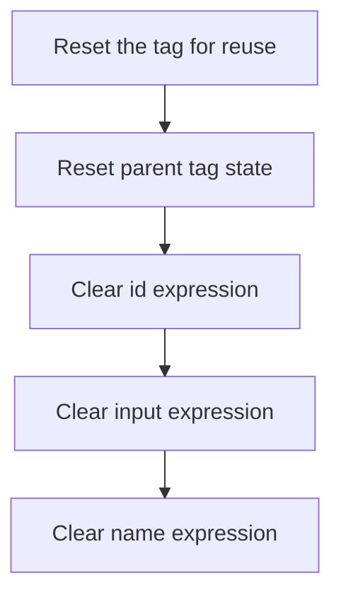

This document explains how tag instances are reset for reuse. The process begins with parent cleanup and continues by clearing all expression fields, ensuring the tag is ready for the next use.

# Resetting <SwmToken path="el/src/main/java/org/apache/strutsel/taglib/html/ELRadioTag.java" pos="37:4:4" line-data="public class ELRadioTag extends RadioTag {">`ELRadioTag`</SwmToken> State

<SwmSnippet path="/el/src/main/java/org/apache/strutsel/taglib/html/ELRadioTag.java" line="811">

---

In <SwmToken path="el/src/main/java/org/apache/strutsel/taglib/html/ELRadioTag.java" pos="811:5:5" line-data="    public void release() {">`release`</SwmToken>, we start by calling <SwmToken path="el/src/main/java/org/apache/strutsel/taglib/html/ELRadioTag.java" pos="812:1:5" line-data="        super.release();">`super.release()`</SwmToken> to make sure any cleanup from the parent class happens first. After that, we move on to clearing expression-related fields, which means we need to call ELResourceTag.release next to handle its own cleanup before continuing with the rest of the reset logic.

```java
    public void release() {
        super.release();
```

---

</SwmSnippet>

## Clearing <SwmToken path="el/src/main/java/org/apache/strutsel/taglib/bean/ELResourceTag.java" pos="38:4:4" line-data="public class ELResourceTag extends ResourceTag {">`ELResourceTag`</SwmToken> Expressions



<SwmSnippet path="/el/src/main/java/org/apache/strutsel/taglib/bean/ELResourceTag.java" line="108">

---

In <SwmToken path="el/src/main/java/org/apache/strutsel/taglib/bean/ELResourceTag.java" pos="108:5:5" line-data="    public void release() {">`release`</SwmToken>, we call the superclass's release first, then clear out the <SwmToken path="el/src/main/java/org/apache/strutsel/taglib/bean/ELResourceTag.java" pos="85:9:9" line-data="    public void setIdExpr(String idExpr) {">`idExpr`</SwmToken> field using its setter. This is the start of resetting all internal expression fields, and we need to call the next setter to continue clearing the object's state.

```java
    public void release() {
        super.release();
        setIdExpr(null);
```

---

</SwmSnippet>

<SwmSnippet path="/el/src/main/java/org/apache/strutsel/taglib/bean/ELResourceTag.java" line="85">

---

<SwmToken path="el/src/main/java/org/apache/strutsel/taglib/bean/ELResourceTag.java" pos="85:5:5" line-data="    public void setIdExpr(String idExpr) {">`setIdExpr`</SwmToken> just assigns the input string to the <SwmToken path="el/src/main/java/org/apache/strutsel/taglib/bean/ELResourceTag.java" pos="85:9:9" line-data="    public void setIdExpr(String idExpr) {">`idExpr`</SwmToken> field. No extra logic, just a plain setter.

```java
    public void setIdExpr(String idExpr) {
        this.idExpr = idExpr;
    }
```

---

</SwmSnippet>

<SwmSnippet path="/el/src/main/java/org/apache/strutsel/taglib/bean/ELResourceTag.java" line="111">

---

We just returned from <SwmToken path="el/src/main/java/org/apache/strutsel/taglib/bean/ELResourceTag.java" pos="85:5:5" line-data="    public void setIdExpr(String idExpr) {">`setIdExpr`</SwmToken>, and now we're clearing <SwmToken path="el/src/main/java/org/apache/strutsel/taglib/bean/ELResourceTag.java" pos="93:9:9" line-data="    public void setInputExpr(String inputExpr) {">`inputExpr`</SwmToken> by calling <SwmToken path="el/src/main/java/org/apache/strutsel/taglib/bean/ELResourceTag.java" pos="111:1:4" line-data="        setInputExpr(null);">`setInputExpr(null)`</SwmToken>. This keeps the object's state clean for reuse.

```java
        setInputExpr(null);
```

---

</SwmSnippet>

<SwmSnippet path="/el/src/main/java/org/apache/strutsel/taglib/bean/ELResourceTag.java" line="93">

---

<SwmToken path="el/src/main/java/org/apache/strutsel/taglib/bean/ELResourceTag.java" pos="93:5:5" line-data="    public void setInputExpr(String inputExpr) {">`setInputExpr`</SwmToken> just assigns the input string to <SwmToken path="el/src/main/java/org/apache/strutsel/taglib/bean/ELResourceTag.java" pos="93:9:9" line-data="    public void setInputExpr(String inputExpr) {">`inputExpr`</SwmToken>. No extra logic, just a plain setter.

```java
    public void setInputExpr(String inputExpr) {
        this.inputExpr = inputExpr;
    }
```

---

</SwmSnippet>

<SwmSnippet path="/el/src/main/java/org/apache/strutsel/taglib/bean/ELResourceTag.java" line="112">

---

We just returned from <SwmToken path="el/src/main/java/org/apache/strutsel/taglib/bean/ELResourceTag.java" pos="93:5:5" line-data="    public void setInputExpr(String inputExpr) {">`setInputExpr`</SwmToken>, and now we're clearing <SwmToken path="el/src/main/java/org/apache/strutsel/taglib/html/ELRadioTag.java" pos="636:9:9" line-data="    public void setNameExpr(String nameExpr) {">`nameExpr`</SwmToken> by calling <SwmToken path="el/src/main/java/org/apache/strutsel/taglib/bean/ELResourceTag.java" pos="112:1:4" line-data="        setNameExpr(null);">`setNameExpr(null)`</SwmToken>. This finishes the cleanup for <SwmToken path="el/src/main/java/org/apache/strutsel/taglib/bean/ELResourceTag.java" pos="38:4:4" line-data="public class ELResourceTag extends ResourceTag {">`ELResourceTag`</SwmToken>.

```java
        setNameExpr(null);
    }
```

---

</SwmSnippet>

<SwmSnippet path="/el/src/main/java/org/apache/strutsel/taglib/bean/ELResourceTag.java" line="101">

---

<SwmToken path="el/src/main/java/org/apache/strutsel/taglib/bean/ELResourceTag.java" pos="101:5:5" line-data="    public void setNameExpr(String nameExpr) {">`setNameExpr`</SwmToken> just assigns the input string to <SwmToken path="el/src/main/java/org/apache/strutsel/taglib/bean/ELResourceTag.java" pos="101:9:9" line-data="    public void setNameExpr(String nameExpr) {">`nameExpr`</SwmToken>. No extra logic, just a plain setter.

```java
    public void setNameExpr(String nameExpr) {
        this.nameExpr = nameExpr;
    }
```

---

</SwmSnippet>

## Resetting <SwmToken path="el/src/main/java/org/apache/strutsel/taglib/html/ELRadioTag.java" pos="37:4:4" line-data="public class ELRadioTag extends RadioTag {">`ELRadioTag`</SwmToken> Expression Fields

<SwmSnippet path="/el/src/main/java/org/apache/strutsel/taglib/html/ELRadioTag.java" line="813">

---

We just returned from ELResourceTag.release, and now ELRadioTag.release continues by clearing accesskeyExpr. This is part of resetting all expression-related fields.

```java
        setAccesskeyExpr(null);
```

---

</SwmSnippet>

<SwmSnippet path="/el/src/main/java/org/apache/strutsel/taglib/html/ELRadioTag.java" line="532">

---

<SwmToken path="el/src/main/java/org/apache/strutsel/taglib/html/ELRadioTag.java" pos="532:5:5" line-data="    public void setAccesskeyExpr(String accessKeyExpr) {">`setAccesskeyExpr`</SwmToken> just assigns the input string to <SwmToken path="el/src/main/java/org/apache/strutsel/taglib/html/ELRadioTag.java" pos="532:9:9" line-data="    public void setAccesskeyExpr(String accessKeyExpr) {">`accessKeyExpr`</SwmToken>. No extra logic, just a plain setter.

```java
    public void setAccesskeyExpr(String accessKeyExpr) {
        this.accessKeyExpr = accessKeyExpr;
    }
```

---

</SwmSnippet>

<SwmSnippet path="/el/src/main/java/org/apache/strutsel/taglib/html/ELRadioTag.java" line="814">

---

We just returned from <SwmToken path="el/src/main/java/org/apache/strutsel/taglib/html/ELRadioTag.java" pos="532:5:5" line-data="    public void setAccesskeyExpr(String accessKeyExpr) {">`setAccesskeyExpr`</SwmToken>, and now ELRadioTag.release continues by clearing <SwmToken path="el/src/main/java/org/apache/strutsel/taglib/html/ELRadioTag.java" pos="540:9:9" line-data="    public void setAltExpr(String altExpr) {">`altExpr`</SwmToken>. This keeps the object's state clean for reuse.

```java
        setAltExpr(null);
```

---

</SwmSnippet>

<SwmSnippet path="/el/src/main/java/org/apache/strutsel/taglib/html/ELRadioTag.java" line="540">

---

<SwmToken path="el/src/main/java/org/apache/strutsel/taglib/html/ELRadioTag.java" pos="540:5:5" line-data="    public void setAltExpr(String altExpr) {">`setAltExpr`</SwmToken> just assigns the input string to <SwmToken path="el/src/main/java/org/apache/strutsel/taglib/html/ELRadioTag.java" pos="540:9:9" line-data="    public void setAltExpr(String altExpr) {">`altExpr`</SwmToken>. No extra logic, just a plain setter.

```java
    public void setAltExpr(String altExpr) {
        this.altExpr = altExpr;
    }
```

---

</SwmSnippet>

<SwmSnippet path="/el/src/main/java/org/apache/strutsel/taglib/html/ELRadioTag.java" line="815">

---

We just returned from <SwmToken path="el/src/main/java/org/apache/strutsel/taglib/html/ELRadioTag.java" pos="540:5:5" line-data="    public void setAltExpr(String altExpr) {">`setAltExpr`</SwmToken>, and now ELRadioTag.release continues by clearing <SwmToken path="el/src/main/java/org/apache/strutsel/taglib/html/ELRadioTag.java" pos="548:9:9" line-data="    public void setAltKeyExpr(String altKeyExpr) {">`altKeyExpr`</SwmToken>. This keeps the object's state clean for reuse.

```java
        setAltKeyExpr(null);
```

---

</SwmSnippet>

<SwmSnippet path="/el/src/main/java/org/apache/strutsel/taglib/html/ELRadioTag.java" line="548">

---

<SwmToken path="el/src/main/java/org/apache/strutsel/taglib/html/ELRadioTag.java" pos="548:5:5" line-data="    public void setAltKeyExpr(String altKeyExpr) {">`setAltKeyExpr`</SwmToken> just assigns the input string to <SwmToken path="el/src/main/java/org/apache/strutsel/taglib/html/ELRadioTag.java" pos="548:9:9" line-data="    public void setAltKeyExpr(String altKeyExpr) {">`altKeyExpr`</SwmToken>. No extra logic, just a plain setter.

```java
    public void setAltKeyExpr(String altKeyExpr) {
        this.altKeyExpr = altKeyExpr;
    }
```

---

</SwmSnippet>

<SwmSnippet path="/el/src/main/java/org/apache/strutsel/taglib/html/ELRadioTag.java" line="816">

---

We just returned from <SwmToken path="el/src/main/java/org/apache/strutsel/taglib/html/ELRadioTag.java" pos="548:5:5" line-data="    public void setAltKeyExpr(String altKeyExpr) {">`setAltKeyExpr`</SwmToken>, and now ELRadioTag.release continues by clearing <SwmToken path="el/src/main/java/org/apache/strutsel/taglib/html/ELRadioTag.java" pos="556:9:9" line-data="    public void setBundleExpr(String bundleExpr) {">`bundleExpr`</SwmToken>. This keeps the object's state clean for reuse.

```java
        setBundleExpr(null);
```

---

</SwmSnippet>

<SwmSnippet path="/el/src/main/java/org/apache/strutsel/taglib/html/ELRadioTag.java" line="556">

---

<SwmToken path="el/src/main/java/org/apache/strutsel/taglib/html/ELRadioTag.java" pos="556:5:5" line-data="    public void setBundleExpr(String bundleExpr) {">`setBundleExpr`</SwmToken> just assigns the input string to <SwmToken path="el/src/main/java/org/apache/strutsel/taglib/html/ELRadioTag.java" pos="556:9:9" line-data="    public void setBundleExpr(String bundleExpr) {">`bundleExpr`</SwmToken>. No extra logic, just a plain setter.

```java
    public void setBundleExpr(String bundleExpr) {
        this.bundleExpr = bundleExpr;
    }
```

---

</SwmSnippet>

<SwmSnippet path="/el/src/main/java/org/apache/strutsel/taglib/html/ELRadioTag.java" line="817">

---

We just returned from <SwmToken path="el/src/main/java/org/apache/strutsel/taglib/html/ELRadioTag.java" pos="556:5:5" line-data="    public void setBundleExpr(String bundleExpr) {">`setBundleExpr`</SwmToken>, and now ELRadioTag.release continues by clearing <SwmToken path="el/src/main/java/org/apache/strutsel/taglib/html/ELRadioTag.java" pos="564:9:9" line-data="    public void setDirExpr(String dirExpr) {">`dirExpr`</SwmToken>. This keeps the object's state clean for reuse.

```java
        setDirExpr(null);
```

---

</SwmSnippet>

<SwmSnippet path="/el/src/main/java/org/apache/strutsel/taglib/html/ELRadioTag.java" line="564">

---

<SwmToken path="el/src/main/java/org/apache/strutsel/taglib/html/ELRadioTag.java" pos="564:5:5" line-data="    public void setDirExpr(String dirExpr) {">`setDirExpr`</SwmToken> just assigns the input string to <SwmToken path="el/src/main/java/org/apache/strutsel/taglib/html/ELRadioTag.java" pos="564:9:9" line-data="    public void setDirExpr(String dirExpr) {">`dirExpr`</SwmToken>. No extra logic, just a plain setter.

```java
    public void setDirExpr(String dirExpr) {
        this.dirExpr = dirExpr;
    }
```

---

</SwmSnippet>

<SwmSnippet path="/el/src/main/java/org/apache/strutsel/taglib/html/ELRadioTag.java" line="818">

---

We just returned from <SwmToken path="el/src/main/java/org/apache/strutsel/taglib/html/ELRadioTag.java" pos="564:5:5" line-data="    public void setDirExpr(String dirExpr) {">`setDirExpr`</SwmToken>, and now ELRadioTag.release continues by clearing <SwmToken path="el/src/main/java/org/apache/strutsel/taglib/html/ELRadioTag.java" pos="572:9:9" line-data="    public void setDisabledExpr(String disabledExpr) {">`disabledExpr`</SwmToken>. This keeps the object's state clean for reuse.

```java
        setDisabledExpr(null);
```

---

</SwmSnippet>

<SwmSnippet path="/el/src/main/java/org/apache/strutsel/taglib/html/ELRadioTag.java" line="572">

---

<SwmToken path="el/src/main/java/org/apache/strutsel/taglib/html/ELRadioTag.java" pos="572:5:5" line-data="    public void setDisabledExpr(String disabledExpr) {">`setDisabledExpr`</SwmToken> just assigns the input string to <SwmToken path="el/src/main/java/org/apache/strutsel/taglib/html/ELRadioTag.java" pos="572:9:9" line-data="    public void setDisabledExpr(String disabledExpr) {">`disabledExpr`</SwmToken>. No extra logic, just a plain setter.

```java
    public void setDisabledExpr(String disabledExpr) {
        this.disabledExpr = disabledExpr;
    }
```

---

</SwmSnippet>

<SwmSnippet path="/el/src/main/java/org/apache/strutsel/taglib/html/ELRadioTag.java" line="819">

---

We just returned from <SwmToken path="el/src/main/java/org/apache/strutsel/taglib/html/ELRadioTag.java" pos="572:5:5" line-data="    public void setDisabledExpr(String disabledExpr) {">`setDisabledExpr`</SwmToken>, and now ELRadioTag.release continues by clearing <SwmToken path="el/src/main/java/org/apache/strutsel/taglib/html/ELRadioTag.java" pos="580:9:9" line-data="    public void setErrorKeyExpr(String errorKeyExpr) {">`errorKeyExpr`</SwmToken>. This keeps the object's state clean for reuse.

```java
        setErrorKeyExpr(null);
```

---

</SwmSnippet>

<SwmSnippet path="/el/src/main/java/org/apache/strutsel/taglib/html/ELRadioTag.java" line="580">

---

<SwmToken path="el/src/main/java/org/apache/strutsel/taglib/html/ELRadioTag.java" pos="580:5:5" line-data="    public void setErrorKeyExpr(String errorKeyExpr) {">`setErrorKeyExpr`</SwmToken> just assigns the input string to <SwmToken path="el/src/main/java/org/apache/strutsel/taglib/html/ELRadioTag.java" pos="580:9:9" line-data="    public void setErrorKeyExpr(String errorKeyExpr) {">`errorKeyExpr`</SwmToken>. No extra logic, just a plain setter.

```java
    public void setErrorKeyExpr(String errorKeyExpr) {
        this.errorKeyExpr = errorKeyExpr;
    }
```

---

</SwmSnippet>

<SwmSnippet path="/el/src/main/java/org/apache/strutsel/taglib/html/ELRadioTag.java" line="820">

---

We just returned from <SwmToken path="el/src/main/java/org/apache/strutsel/taglib/html/ELRadioTag.java" pos="580:5:5" line-data="    public void setErrorKeyExpr(String errorKeyExpr) {">`setErrorKeyExpr`</SwmToken>, and now ELRadioTag.release continues by clearing <SwmToken path="el/src/main/java/org/apache/strutsel/taglib/html/ELRadioTag.java" pos="588:9:9" line-data="    public void setErrorStyleExpr(String errorStyleExpr) {">`errorStyleExpr`</SwmToken>. This keeps the object's state clean for reuse.

```java
        setErrorStyleExpr(null);
```

---

</SwmSnippet>

<SwmSnippet path="/el/src/main/java/org/apache/strutsel/taglib/html/ELRadioTag.java" line="588">

---

<SwmToken path="el/src/main/java/org/apache/strutsel/taglib/html/ELRadioTag.java" pos="588:5:5" line-data="    public void setErrorStyleExpr(String errorStyleExpr) {">`setErrorStyleExpr`</SwmToken> just assigns the input string to <SwmToken path="el/src/main/java/org/apache/strutsel/taglib/html/ELRadioTag.java" pos="588:9:9" line-data="    public void setErrorStyleExpr(String errorStyleExpr) {">`errorStyleExpr`</SwmToken>. No extra logic, just a plain setter.

```java
    public void setErrorStyleExpr(String errorStyleExpr) {
        this.errorStyleExpr = errorStyleExpr;
    }
```

---

</SwmSnippet>

<SwmSnippet path="/el/src/main/java/org/apache/strutsel/taglib/html/ELRadioTag.java" line="821">

---

We just returned from <SwmToken path="el/src/main/java/org/apache/strutsel/taglib/html/ELRadioTag.java" pos="588:5:5" line-data="    public void setErrorStyleExpr(String errorStyleExpr) {">`setErrorStyleExpr`</SwmToken>, and now ELRadioTag.release continues by clearing <SwmToken path="el/src/main/java/org/apache/strutsel/taglib/html/ELRadioTag.java" pos="596:9:9" line-data="    public void setErrorStyleClassExpr(String errorStyleClassExpr) {">`errorStyleClassExpr`</SwmToken>. This keeps the object's state clean for reuse.

```java
        setErrorStyleClassExpr(null);
```

---

</SwmSnippet>

<SwmSnippet path="/el/src/main/java/org/apache/strutsel/taglib/html/ELRadioTag.java" line="596">

---

<SwmToken path="el/src/main/java/org/apache/strutsel/taglib/html/ELRadioTag.java" pos="596:5:5" line-data="    public void setErrorStyleClassExpr(String errorStyleClassExpr) {">`setErrorStyleClassExpr`</SwmToken> just assigns the input string to <SwmToken path="el/src/main/java/org/apache/strutsel/taglib/html/ELRadioTag.java" pos="596:9:9" line-data="    public void setErrorStyleClassExpr(String errorStyleClassExpr) {">`errorStyleClassExpr`</SwmToken>. No extra logic, just a plain setter.

```java
    public void setErrorStyleClassExpr(String errorStyleClassExpr) {
        this.errorStyleClassExpr = errorStyleClassExpr;
    }
```

---

</SwmSnippet>

<SwmSnippet path="/el/src/main/java/org/apache/strutsel/taglib/html/ELRadioTag.java" line="822">

---

We just returned from <SwmToken path="el/src/main/java/org/apache/strutsel/taglib/html/ELRadioTag.java" pos="596:5:5" line-data="    public void setErrorStyleClassExpr(String errorStyleClassExpr) {">`setErrorStyleClassExpr`</SwmToken>, and now ELRadioTag.release continues by clearing <SwmToken path="el/src/main/java/org/apache/strutsel/taglib/html/ELRadioTag.java" pos="604:9:9" line-data="    public void setErrorStyleIdExpr(String errorStyleIdExpr) {">`errorStyleIdExpr`</SwmToken>. This keeps the object's state clean for reuse.

```java
        setErrorStyleIdExpr(null);
```

---

</SwmSnippet>

<SwmSnippet path="/el/src/main/java/org/apache/strutsel/taglib/html/ELRadioTag.java" line="604">

---

<SwmToken path="el/src/main/java/org/apache/strutsel/taglib/html/ELRadioTag.java" pos="604:5:5" line-data="    public void setErrorStyleIdExpr(String errorStyleIdExpr) {">`setErrorStyleIdExpr`</SwmToken> just assigns the input string to <SwmToken path="el/src/main/java/org/apache/strutsel/taglib/html/ELRadioTag.java" pos="604:9:9" line-data="    public void setErrorStyleIdExpr(String errorStyleIdExpr) {">`errorStyleIdExpr`</SwmToken>. No extra logic, just a plain setter.

```java
    public void setErrorStyleIdExpr(String errorStyleIdExpr) {
        this.errorStyleIdExpr = errorStyleIdExpr;
    }
```

---

</SwmSnippet>

<SwmSnippet path="/el/src/main/java/org/apache/strutsel/taglib/html/ELRadioTag.java" line="823">

---

We just returned from <SwmToken path="el/src/main/java/org/apache/strutsel/taglib/html/ELRadioTag.java" pos="604:5:5" line-data="    public void setErrorStyleIdExpr(String errorStyleIdExpr) {">`setErrorStyleIdExpr`</SwmToken>, and now ELRadioTag.release continues by clearing <SwmToken path="el/src/main/java/org/apache/strutsel/taglib/html/ELRadioTag.java" pos="612:9:9" line-data="    public void setIdNameExpr(String idNameExpr) {">`idNameExpr`</SwmToken>. This keeps the object's state clean for reuse.

```java
        setIdNameExpr(null);
```

---

</SwmSnippet>

<SwmSnippet path="/el/src/main/java/org/apache/strutsel/taglib/html/ELRadioTag.java" line="612">

---

<SwmToken path="el/src/main/java/org/apache/strutsel/taglib/html/ELRadioTag.java" pos="612:5:5" line-data="    public void setIdNameExpr(String idNameExpr) {">`setIdNameExpr`</SwmToken> just assigns the input string to <SwmToken path="el/src/main/java/org/apache/strutsel/taglib/html/ELRadioTag.java" pos="612:9:9" line-data="    public void setIdNameExpr(String idNameExpr) {">`idNameExpr`</SwmToken>. No extra logic, just a plain setter.

```java
    public void setIdNameExpr(String idNameExpr) {
        this.idNameExpr = idNameExpr;
    }
```

---

</SwmSnippet>

<SwmSnippet path="/el/src/main/java/org/apache/strutsel/taglib/html/ELRadioTag.java" line="824">

---

We just returned from <SwmToken path="el/src/main/java/org/apache/strutsel/taglib/html/ELRadioTag.java" pos="612:5:5" line-data="    public void setIdNameExpr(String idNameExpr) {">`setIdNameExpr`</SwmToken>, and now ELRadioTag.release continues by clearing <SwmToken path="el/src/main/java/org/apache/strutsel/taglib/html/ELRadioTag.java" pos="620:9:9" line-data="    public void setIndexedExpr(String indexedExpr) {">`indexedExpr`</SwmToken>. This keeps the object's state clean for reuse.

```java
        setIndexedExpr(null);
```

---

</SwmSnippet>

<SwmSnippet path="/el/src/main/java/org/apache/strutsel/taglib/html/ELRadioTag.java" line="620">

---

<SwmToken path="el/src/main/java/org/apache/strutsel/taglib/html/ELRadioTag.java" pos="620:5:5" line-data="    public void setIndexedExpr(String indexedExpr) {">`setIndexedExpr`</SwmToken> just assigns the input string to <SwmToken path="el/src/main/java/org/apache/strutsel/taglib/html/ELRadioTag.java" pos="620:9:9" line-data="    public void setIndexedExpr(String indexedExpr) {">`indexedExpr`</SwmToken>. No extra logic, just a plain setter.

```java
    public void setIndexedExpr(String indexedExpr) {
        this.indexedExpr = indexedExpr;
    }
```

---

</SwmSnippet>

<SwmSnippet path="/el/src/main/java/org/apache/strutsel/taglib/html/ELRadioTag.java" line="825">

---

We just returned from <SwmToken path="el/src/main/java/org/apache/strutsel/taglib/html/ELRadioTag.java" pos="620:5:5" line-data="    public void setIndexedExpr(String indexedExpr) {">`setIndexedExpr`</SwmToken>, and now ELRadioTag.release continues by clearing <SwmToken path="el/src/main/java/org/apache/strutsel/taglib/html/ELRadioTag.java" pos="628:9:9" line-data="    public void setLangExpr(String langExpr) {">`langExpr`</SwmToken>. This keeps the object's state clean for reuse.

```java
        setLangExpr(null);
```

---

</SwmSnippet>

<SwmSnippet path="/el/src/main/java/org/apache/strutsel/taglib/html/ELRadioTag.java" line="628">

---

<SwmToken path="el/src/main/java/org/apache/strutsel/taglib/html/ELRadioTag.java" pos="628:5:5" line-data="    public void setLangExpr(String langExpr) {">`setLangExpr`</SwmToken> just assigns the input string to <SwmToken path="el/src/main/java/org/apache/strutsel/taglib/html/ELRadioTag.java" pos="628:9:9" line-data="    public void setLangExpr(String langExpr) {">`langExpr`</SwmToken>. No extra logic, just a plain setter.

```java
    public void setLangExpr(String langExpr) {
        this.langExpr = langExpr;
    }
```

---

</SwmSnippet>

<SwmSnippet path="/el/src/main/java/org/apache/strutsel/taglib/html/ELRadioTag.java" line="826">

---

We just returned from <SwmToken path="el/src/main/java/org/apache/strutsel/taglib/html/ELRadioTag.java" pos="628:5:5" line-data="    public void setLangExpr(String langExpr) {">`setLangExpr`</SwmToken>, and now ELRadioTag.release continues by clearing <SwmToken path="el/src/main/java/org/apache/strutsel/taglib/html/ELRadioTag.java" pos="636:9:9" line-data="    public void setNameExpr(String nameExpr) {">`nameExpr`</SwmToken>. This keeps the object's state clean for reuse.

```java
        setNameExpr(null);
```

---

</SwmSnippet>

<SwmSnippet path="/el/src/main/java/org/apache/strutsel/taglib/html/ELRadioTag.java" line="636">

---

<SwmToken path="el/src/main/java/org/apache/strutsel/taglib/html/ELRadioTag.java" pos="636:5:5" line-data="    public void setNameExpr(String nameExpr) {">`setNameExpr`</SwmToken> just assigns the input string to <SwmToken path="el/src/main/java/org/apache/strutsel/taglib/html/ELRadioTag.java" pos="636:9:9" line-data="    public void setNameExpr(String nameExpr) {">`nameExpr`</SwmToken>. No extra logic, just a plain setter.

```java
    public void setNameExpr(String nameExpr) {
        this.nameExpr = nameExpr;
    }
```

---

</SwmSnippet>

<SwmSnippet path="/el/src/main/java/org/apache/strutsel/taglib/html/ELRadioTag.java" line="827">

---

We just returned from <SwmToken path="el/src/main/java/org/apache/strutsel/taglib/html/ELRadioTag.java" pos="636:5:5" line-data="    public void setNameExpr(String nameExpr) {">`setNameExpr`</SwmToken>, and now ELRadioTag.release continues by clearing <SwmToken path="el/src/main/java/org/apache/strutsel/taglib/html/ELRadioTag.java" pos="644:9:9" line-data="    public void setOnblurExpr(String onblurExpr) {">`onblurExpr`</SwmToken>. This keeps the object's state clean for reuse.

```java
        setOnblurExpr(null);
```

---

</SwmSnippet>

<SwmSnippet path="/el/src/main/java/org/apache/strutsel/taglib/html/ELRadioTag.java" line="644">

---

<SwmToken path="el/src/main/java/org/apache/strutsel/taglib/html/ELRadioTag.java" pos="644:5:5" line-data="    public void setOnblurExpr(String onblurExpr) {">`setOnblurExpr`</SwmToken> just assigns the input string to <SwmToken path="el/src/main/java/org/apache/strutsel/taglib/html/ELRadioTag.java" pos="644:9:9" line-data="    public void setOnblurExpr(String onblurExpr) {">`onblurExpr`</SwmToken>. No extra logic, just a plain setter.

```java
    public void setOnblurExpr(String onblurExpr) {
        this.onblurExpr = onblurExpr;
    }
```

---

</SwmSnippet>

<SwmSnippet path="/el/src/main/java/org/apache/strutsel/taglib/html/ELRadioTag.java" line="828">

---

We just returned from ELRadioTag.setOnblurExpr, and now ELRadioTag.release is clearing <SwmToken path="el/src/main/java/org/apache/strutsel/taglib/html/ELRadioTag.java" pos="652:9:9" line-data="    public void setOnchangeExpr(String onchangeExpr) {">`onchangeExpr`</SwmToken> by calling <SwmToken path="el/src/main/java/org/apache/strutsel/taglib/html/ELRadioTag.java" pos="828:1:1" line-data="        setOnchangeExpr(null);">`setOnchangeExpr`</SwmToken>(null). This wipes out any leftover onchange handler so the tag doesn't keep old event logic around.

```java
        setOnchangeExpr(null);
```

---

</SwmSnippet>

<SwmSnippet path="/el/src/main/java/org/apache/strutsel/taglib/html/ELRadioTag.java" line="652">

---

SetOnchangeExpr just assigns the input string to the <SwmToken path="el/src/main/java/org/apache/strutsel/taglib/html/ELRadioTag.java" pos="652:9:9" line-data="    public void setOnchangeExpr(String onchangeExpr) {">`onchangeExpr`</SwmToken> field. No extra logic, just a plain setter.

```java
    public void setOnchangeExpr(String onchangeExpr) {
        this.onchangeExpr = onchangeExpr;
    }
```

---

</SwmSnippet>

<SwmSnippet path="/el/src/main/java/org/apache/strutsel/taglib/html/ELRadioTag.java" line="829">

---

We just returned from ELRadioTag.setOnchangeExpr, and now ELRadioTag.release is clearing <SwmToken path="el/src/main/java/org/apache/strutsel/taglib/html/ELRadioTag.java" pos="660:9:9" line-data="    public void setOnclickExpr(String onclickExpr) {">`onclickExpr`</SwmToken> by calling <SwmToken path="el/src/main/java/org/apache/strutsel/taglib/html/ELRadioTag.java" pos="829:1:1" line-data="        setOnclickExpr(null);">`setOnclickExpr`</SwmToken>(null). This makes sure any previous click handler is removed, so the tag doesn't accidentally fire old JavaScript.

```java
        setOnclickExpr(null);
```

---

</SwmSnippet>

<SwmSnippet path="/el/src/main/java/org/apache/strutsel/taglib/html/ELRadioTag.java" line="660">

---

SetOnclickExpr just assigns the input string to the <SwmToken path="el/src/main/java/org/apache/strutsel/taglib/html/ELRadioTag.java" pos="660:9:9" line-data="    public void setOnclickExpr(String onclickExpr) {">`onclickExpr`</SwmToken> field. No extra logic, just a plain setter.

```java
    public void setOnclickExpr(String onclickExpr) {
        this.onclickExpr = onclickExpr;
    }
```

---

</SwmSnippet>

<SwmSnippet path="/el/src/main/java/org/apache/strutsel/taglib/html/ELRadioTag.java" line="830">

---

We just returned from ELRadioTag.setOnclickExpr, and now ELRadioTag.release is clearing <SwmToken path="el/src/main/java/org/apache/strutsel/taglib/html/ELRadioTag.java" pos="668:9:9" line-data="    public void setOndblclickExpr(String ondblclickExpr) {">`ondblclickExpr`</SwmToken> by calling <SwmToken path="el/src/main/java/org/apache/strutsel/taglib/html/ELRadioTag.java" pos="830:1:1" line-data="        setOndblclickExpr(null);">`setOndblclickExpr`</SwmToken>(null). This ensures any double-click handler is reset, so the tag doesn't keep old event logic.

```java
        setOndblclickExpr(null);
```

---

</SwmSnippet>

<SwmSnippet path="/el/src/main/java/org/apache/strutsel/taglib/html/ELRadioTag.java" line="668">

---

SetOndblclickExpr just assigns the input string to the <SwmToken path="el/src/main/java/org/apache/strutsel/taglib/html/ELRadioTag.java" pos="668:9:9" line-data="    public void setOndblclickExpr(String ondblclickExpr) {">`ondblclickExpr`</SwmToken> field. No extra logic, just a plain setter.

```java
    public void setOndblclickExpr(String ondblclickExpr) {
        this.ondblclickExpr = ondblclickExpr;
    }
```

---

</SwmSnippet>

<SwmSnippet path="/el/src/main/java/org/apache/strutsel/taglib/html/ELRadioTag.java" line="831">

---

We just returned from ELRadioTag.setOndblclickExpr, and now ELRadioTag.release is clearing <SwmToken path="el/src/main/java/org/apache/strutsel/taglib/html/ELRadioTag.java" pos="676:9:9" line-data="    public void setOnfocusExpr(String onfocusExpr) {">`onfocusExpr`</SwmToken> by calling <SwmToken path="el/src/main/java/org/apache/strutsel/taglib/html/ELRadioTag.java" pos="831:1:1" line-data="        setOnfocusExpr(null);">`setOnfocusExpr`</SwmToken>(null). This removes any previous focus handler, so the tag doesn't keep old focus logic.

```java
        setOnfocusExpr(null);
```

---

</SwmSnippet>

<SwmSnippet path="/el/src/main/java/org/apache/strutsel/taglib/html/ELRadioTag.java" line="676">

---

SetOnfocusExpr just assigns the input string to the <SwmToken path="el/src/main/java/org/apache/strutsel/taglib/html/ELRadioTag.java" pos="676:9:9" line-data="    public void setOnfocusExpr(String onfocusExpr) {">`onfocusExpr`</SwmToken> field. No extra logic, just a plain setter.

```java
    public void setOnfocusExpr(String onfocusExpr) {
        this.onfocusExpr = onfocusExpr;
    }
```

---

</SwmSnippet>

<SwmSnippet path="/el/src/main/java/org/apache/strutsel/taglib/html/ELRadioTag.java" line="832">

---

We just returned from ELRadioTag.setOnfocusExpr, and now ELRadioTag.release is clearing <SwmToken path="el/src/main/java/org/apache/strutsel/taglib/html/ELRadioTag.java" pos="684:9:9" line-data="    public void setOnkeydownExpr(String onkeydownExpr) {">`onkeydownExpr`</SwmToken> by calling <SwmToken path="el/src/main/java/org/apache/strutsel/taglib/html/ELRadioTag.java" pos="832:1:1" line-data="        setOnkeydownExpr(null);">`setOnkeydownExpr`</SwmToken>(null). This makes sure any previous keydown handler is removed, so the tag doesn't keep old keyboard logic.

```java
        setOnkeydownExpr(null);
```

---

</SwmSnippet>

<SwmSnippet path="/el/src/main/java/org/apache/strutsel/taglib/html/ELRadioTag.java" line="684">

---

SetOnkeydownExpr just assigns the input string to the <SwmToken path="el/src/main/java/org/apache/strutsel/taglib/html/ELRadioTag.java" pos="684:9:9" line-data="    public void setOnkeydownExpr(String onkeydownExpr) {">`onkeydownExpr`</SwmToken> field. No extra logic, just a plain setter.

```java
    public void setOnkeydownExpr(String onkeydownExpr) {
        this.onkeydownExpr = onkeydownExpr;
    }
```

---

</SwmSnippet>

<SwmSnippet path="/el/src/main/java/org/apache/strutsel/taglib/html/ELRadioTag.java" line="833">

---

We just returned from ELRadioTag.setOnkeydownExpr, and now ELRadioTag.release is clearing <SwmToken path="el/src/main/java/org/apache/strutsel/taglib/html/ELRadioTag.java" pos="692:9:9" line-data="    public void setOnkeypressExpr(String onkeypressExpr) {">`onkeypressExpr`</SwmToken> by calling <SwmToken path="el/src/main/java/org/apache/strutsel/taglib/html/ELRadioTag.java" pos="833:1:1" line-data="        setOnkeypressExpr(null);">`setOnkeypressExpr`</SwmToken>(null). This clears any previous keypress handler, so the tag doesn't keep old keyboard event logic.

```java
        setOnkeypressExpr(null);
```

---

</SwmSnippet>

<SwmSnippet path="/el/src/main/java/org/apache/strutsel/taglib/html/ELRadioTag.java" line="692">

---

SetOnkeypressExpr just assigns the input string to the <SwmToken path="el/src/main/java/org/apache/strutsel/taglib/html/ELRadioTag.java" pos="692:9:9" line-data="    public void setOnkeypressExpr(String onkeypressExpr) {">`onkeypressExpr`</SwmToken> field. No extra logic, just a plain setter.

```java
    public void setOnkeypressExpr(String onkeypressExpr) {
        this.onkeypressExpr = onkeypressExpr;
    }
```

---

</SwmSnippet>

<SwmSnippet path="/el/src/main/java/org/apache/strutsel/taglib/html/ELRadioTag.java" line="834">

---

We just returned from ELRadioTag.setOnkeypressExpr, and now ELRadioTag.release is clearing <SwmToken path="el/src/main/java/org/apache/strutsel/taglib/html/ELRadioTag.java" pos="700:9:9" line-data="    public void setOnkeyupExpr(String onkeyupExpr) {">`onkeyupExpr`</SwmToken> by calling <SwmToken path="el/src/main/java/org/apache/strutsel/taglib/html/ELRadioTag.java" pos="834:1:1" line-data="        setOnkeyupExpr(null);">`setOnkeyupExpr`</SwmToken>(null). This removes any previous keyup handler, so the tag doesn't keep old keyboard logic.

```java
        setOnkeyupExpr(null);
```

---

</SwmSnippet>

<SwmSnippet path="/el/src/main/java/org/apache/strutsel/taglib/html/ELRadioTag.java" line="700">

---

SetOnkeyupExpr just assigns the input string to the <SwmToken path="el/src/main/java/org/apache/strutsel/taglib/html/ELRadioTag.java" pos="700:9:9" line-data="    public void setOnkeyupExpr(String onkeyupExpr) {">`onkeyupExpr`</SwmToken> field. No extra logic, just a plain setter.

```java
    public void setOnkeyupExpr(String onkeyupExpr) {
        this.onkeyupExpr = onkeyupExpr;
    }
```

---

</SwmSnippet>

<SwmSnippet path="/el/src/main/java/org/apache/strutsel/taglib/html/ELRadioTag.java" line="835">

---

We just returned from ELRadioTag.setOnkeyupExpr, and now ELRadioTag.release is clearing <SwmToken path="el/src/main/java/org/apache/strutsel/taglib/html/ELRadioTag.java" pos="708:9:9" line-data="    public void setOnmousedownExpr(String onmousedownExpr) {">`onmousedownExpr`</SwmToken> by calling <SwmToken path="el/src/main/java/org/apache/strutsel/taglib/html/ELRadioTag.java" pos="835:1:1" line-data="        setOnmousedownExpr(null);">`setOnmousedownExpr`</SwmToken>(null). This wipes out any previous mousedown handler, so the tag doesn't keep old mouse event logic.

```java
        setOnmousedownExpr(null);
```

---

</SwmSnippet>

<SwmSnippet path="/el/src/main/java/org/apache/strutsel/taglib/html/ELRadioTag.java" line="708">

---

SetOnmousedownExpr just assigns the input string to the <SwmToken path="el/src/main/java/org/apache/strutsel/taglib/html/ELRadioTag.java" pos="708:9:9" line-data="    public void setOnmousedownExpr(String onmousedownExpr) {">`onmousedownExpr`</SwmToken> field. No extra logic, just a plain setter.

```java
    public void setOnmousedownExpr(String onmousedownExpr) {
        this.onmousedownExpr = onmousedownExpr;
    }
```

---

</SwmSnippet>

<SwmSnippet path="/el/src/main/java/org/apache/strutsel/taglib/html/ELRadioTag.java" line="836">

---

We just returned from ELRadioTag.setOnmousedownExpr, and now ELRadioTag.release is clearing <SwmToken path="el/src/main/java/org/apache/strutsel/taglib/html/ELRadioTag.java" pos="716:9:9" line-data="    public void setOnmousemoveExpr(String onmousemoveExpr) {">`onmousemoveExpr`</SwmToken> by calling <SwmToken path="el/src/main/java/org/apache/strutsel/taglib/html/ELRadioTag.java" pos="836:1:1" line-data="        setOnmousemoveExpr(null);">`setOnmousemoveExpr`</SwmToken>(null). This clears any previous mousemove handler, so the tag doesn't keep old mouse event logic.

```java
        setOnmousemoveExpr(null);
```

---

</SwmSnippet>

<SwmSnippet path="/el/src/main/java/org/apache/strutsel/taglib/html/ELRadioTag.java" line="716">

---

SetOnmousemoveExpr just assigns the input string to the <SwmToken path="el/src/main/java/org/apache/strutsel/taglib/html/ELRadioTag.java" pos="716:9:9" line-data="    public void setOnmousemoveExpr(String onmousemoveExpr) {">`onmousemoveExpr`</SwmToken> field. No extra logic, just a plain setter.

```java
    public void setOnmousemoveExpr(String onmousemoveExpr) {
        this.onmousemoveExpr = onmousemoveExpr;
    }
```

---

</SwmSnippet>

<SwmSnippet path="/el/src/main/java/org/apache/strutsel/taglib/html/ELRadioTag.java" line="837">

---

We just returned from ELRadioTag.setOnmousemoveExpr, and now ELRadioTag.release is clearing <SwmToken path="el/src/main/java/org/apache/strutsel/taglib/html/ELRadioTag.java" pos="724:9:9" line-data="    public void setOnmouseoutExpr(String onmouseoutExpr) {">`onmouseoutExpr`</SwmToken> by calling <SwmToken path="el/src/main/java/org/apache/strutsel/taglib/html/ELRadioTag.java" pos="837:1:1" line-data="        setOnmouseoutExpr(null);">`setOnmouseoutExpr`</SwmToken>(null). This removes any previous mouseout handler, so the tag doesn't keep old mouse event logic.

```java
        setOnmouseoutExpr(null);
```

---

</SwmSnippet>

<SwmSnippet path="/el/src/main/java/org/apache/strutsel/taglib/html/ELRadioTag.java" line="724">

---

SetOnmouseoutExpr just assigns the input string to the <SwmToken path="el/src/main/java/org/apache/strutsel/taglib/html/ELRadioTag.java" pos="724:9:9" line-data="    public void setOnmouseoutExpr(String onmouseoutExpr) {">`onmouseoutExpr`</SwmToken> field. No extra logic, just a plain setter.

```java
    public void setOnmouseoutExpr(String onmouseoutExpr) {
        this.onmouseoutExpr = onmouseoutExpr;
    }
```

---

</SwmSnippet>

<SwmSnippet path="/el/src/main/java/org/apache/strutsel/taglib/html/ELRadioTag.java" line="838">

---

We just returned from ELRadioTag.setOnmouseoutExpr, and now ELRadioTag.release is clearing <SwmToken path="el/src/main/java/org/apache/strutsel/taglib/html/ELRadioTag.java" pos="732:9:9" line-data="    public void setOnmouseoverExpr(String onmouseoverExpr) {">`onmouseoverExpr`</SwmToken> by calling <SwmToken path="el/src/main/java/org/apache/strutsel/taglib/html/ELRadioTag.java" pos="838:1:1" line-data="        setOnmouseoverExpr(null);">`setOnmouseoverExpr`</SwmToken>(null). This clears any previous mouseover handler, so the tag doesn't keep old mouse event logic.

```java
        setOnmouseoverExpr(null);
```

---

</SwmSnippet>

<SwmSnippet path="/el/src/main/java/org/apache/strutsel/taglib/html/ELRadioTag.java" line="732">

---

SetOnmouseoverExpr just assigns the input string to the <SwmToken path="el/src/main/java/org/apache/strutsel/taglib/html/ELRadioTag.java" pos="732:9:9" line-data="    public void setOnmouseoverExpr(String onmouseoverExpr) {">`onmouseoverExpr`</SwmToken> field. No extra logic, just a plain setter.

```java
    public void setOnmouseoverExpr(String onmouseoverExpr) {
        this.onmouseoverExpr = onmouseoverExpr;
    }
```

---

</SwmSnippet>

<SwmSnippet path="/el/src/main/java/org/apache/strutsel/taglib/html/ELRadioTag.java" line="839">

---

We just returned from ELRadioTag.setOnmouseoverExpr, and now ELRadioTag.release is clearing <SwmToken path="el/src/main/java/org/apache/strutsel/taglib/html/ELRadioTag.java" pos="740:9:9" line-data="    public void setOnmouseupExpr(String onmouseupExpr) {">`onmouseupExpr`</SwmToken> by calling <SwmToken path="el/src/main/java/org/apache/strutsel/taglib/html/ELRadioTag.java" pos="839:1:1" line-data="        setOnmouseupExpr(null);">`setOnmouseupExpr`</SwmToken>(null). This removes any previous mouseup handler, so the tag doesn't keep old mouse event logic.

```java
        setOnmouseupExpr(null);
```

---

</SwmSnippet>

<SwmSnippet path="/el/src/main/java/org/apache/strutsel/taglib/html/ELRadioTag.java" line="740">

---

SetOnmouseupExpr just assigns the input string to the <SwmToken path="el/src/main/java/org/apache/strutsel/taglib/html/ELRadioTag.java" pos="740:9:9" line-data="    public void setOnmouseupExpr(String onmouseupExpr) {">`onmouseupExpr`</SwmToken> field. No extra logic, just a plain setter.

```java
    public void setOnmouseupExpr(String onmouseupExpr) {
        this.onmouseupExpr = onmouseupExpr;
    }
```

---

</SwmSnippet>

<SwmSnippet path="/el/src/main/java/org/apache/strutsel/taglib/html/ELRadioTag.java" line="840">

---

We just returned from ELRadioTag.setOnmouseupExpr, and now ELRadioTag.release is clearing <SwmToken path="el/src/main/java/org/apache/strutsel/taglib/html/ELRadioTag.java" pos="748:9:9" line-data="    public void setPropertyExpr(String propertyExpr) {">`propertyExpr`</SwmToken> by calling <SwmToken path="el/src/main/java/org/apache/strutsel/taglib/html/ELRadioTag.java" pos="840:1:1" line-data="        setPropertyExpr(null);">`setPropertyExpr`</SwmToken>(null). This makes sure any previous property binding is removed, so the tag doesn't keep old references.

```java
        setPropertyExpr(null);
```

---

</SwmSnippet>

<SwmSnippet path="/el/src/main/java/org/apache/strutsel/taglib/html/ELRadioTag.java" line="748">

---

SetPropertyExpr just assigns the input string to the <SwmToken path="el/src/main/java/org/apache/strutsel/taglib/html/ELRadioTag.java" pos="748:9:9" line-data="    public void setPropertyExpr(String propertyExpr) {">`propertyExpr`</SwmToken> field. No extra logic, just a plain setter.

```java
    public void setPropertyExpr(String propertyExpr) {
        this.propertyExpr = propertyExpr;
    }
```

---

</SwmSnippet>

<SwmSnippet path="/el/src/main/java/org/apache/strutsel/taglib/html/ELRadioTag.java" line="841">

---

We just returned from ELRadioTag.setPropertyExpr, and now ELRadioTag.release is clearing <SwmToken path="el/src/main/java/org/apache/strutsel/taglib/html/ELRadioTag.java" pos="756:9:9" line-data="    public void setStyleExpr(String styleExpr) {">`styleExpr`</SwmToken> by calling <SwmToken path="el/src/main/java/org/apache/strutsel/taglib/html/ELRadioTag.java" pos="841:1:1" line-data="        setStyleExpr(null);">`setStyleExpr`</SwmToken>(null). This removes any previous style, so the tag doesn't keep old CSS inline.

```java
        setStyleExpr(null);
```

---

</SwmSnippet>

<SwmSnippet path="/el/src/main/java/org/apache/strutsel/taglib/html/ELRadioTag.java" line="756">

---

SetStyleExpr just assigns the input string to the <SwmToken path="el/src/main/java/org/apache/strutsel/taglib/html/ELRadioTag.java" pos="756:9:9" line-data="    public void setStyleExpr(String styleExpr) {">`styleExpr`</SwmToken> field. No extra logic, just a plain setter.

```java
    public void setStyleExpr(String styleExpr) {
        this.styleExpr = styleExpr;
    }
```

---

</SwmSnippet>

<SwmSnippet path="/el/src/main/java/org/apache/strutsel/taglib/html/ELRadioTag.java" line="842">

---

We just returned from ELRadioTag.setStyleExpr, and now ELRadioTag.release is clearing <SwmToken path="el/src/main/java/org/apache/strutsel/taglib/html/ELRadioTag.java" pos="764:9:9" line-data="    public void setStyleClassExpr(String styleClassExpr) {">`styleClassExpr`</SwmToken> by calling <SwmToken path="el/src/main/java/org/apache/strutsel/taglib/html/ELRadioTag.java" pos="842:1:1" line-data="        setStyleClassExpr(null);">`setStyleClassExpr`</SwmToken>(null). This wipes out any previous CSS class, so the tag doesn't keep old styling.

```java
        setStyleClassExpr(null);
```

---

</SwmSnippet>

<SwmSnippet path="/el/src/main/java/org/apache/strutsel/taglib/html/ELRadioTag.java" line="764">

---

SetStyleClassExpr just assigns the input string to the <SwmToken path="el/src/main/java/org/apache/strutsel/taglib/html/ELRadioTag.java" pos="764:9:9" line-data="    public void setStyleClassExpr(String styleClassExpr) {">`styleClassExpr`</SwmToken> field. No extra logic, just a plain setter.

```java
    public void setStyleClassExpr(String styleClassExpr) {
        this.styleClassExpr = styleClassExpr;
    }
```

---

</SwmSnippet>

<SwmSnippet path="/el/src/main/java/org/apache/strutsel/taglib/html/ELRadioTag.java" line="843">

---

We just returned from ELRadioTag.setStyleClassExpr, and now ELRadioTag.release is clearing <SwmToken path="el/src/main/java/org/apache/strutsel/taglib/html/ELRadioTag.java" pos="772:9:9" line-data="    public void setStyleIdExpr(String styleIdExpr) {">`styleIdExpr`</SwmToken> by calling <SwmToken path="el/src/main/java/org/apache/strutsel/taglib/html/ELRadioTag.java" pos="843:1:1" line-data="        setStyleIdExpr(null);">`setStyleIdExpr`</SwmToken>(null). This removes any previous element ID, so the tag doesn't keep old IDs.

```java
        setStyleIdExpr(null);
```

---

</SwmSnippet>

<SwmSnippet path="/el/src/main/java/org/apache/strutsel/taglib/html/ELRadioTag.java" line="772">

---

SetStyleIdExpr just assigns the input string to the <SwmToken path="el/src/main/java/org/apache/strutsel/taglib/html/ELRadioTag.java" pos="772:9:9" line-data="    public void setStyleIdExpr(String styleIdExpr) {">`styleIdExpr`</SwmToken> field. No extra logic, just a plain setter.

```java
    public void setStyleIdExpr(String styleIdExpr) {
        this.styleIdExpr = styleIdExpr;
    }
```

---

</SwmSnippet>

<SwmSnippet path="/el/src/main/java/org/apache/strutsel/taglib/html/ELRadioTag.java" line="844">

---

We just returned from ELRadioTag.setStyleIdExpr, and now ELRadioTag.release is clearing <SwmToken path="el/src/main/java/org/apache/strutsel/taglib/html/ELRadioTag.java" pos="780:9:9" line-data="    public void setTabindexExpr(String tabindexExpr) {">`tabindexExpr`</SwmToken> by calling <SwmToken path="el/src/main/java/org/apache/strutsel/taglib/html/ELRadioTag.java" pos="844:1:1" line-data="        setTabindexExpr(null);">`setTabindexExpr`</SwmToken>(null). This clears any previous tab index, so the tag doesn't keep old navigation order.

```java
        setTabindexExpr(null);
```

---

</SwmSnippet>

<SwmSnippet path="/el/src/main/java/org/apache/strutsel/taglib/html/ELRadioTag.java" line="780">

---

SetTabindexExpr just assigns the input string to the <SwmToken path="el/src/main/java/org/apache/strutsel/taglib/html/ELRadioTag.java" pos="780:9:9" line-data="    public void setTabindexExpr(String tabindexExpr) {">`tabindexExpr`</SwmToken> field. No extra logic, just a plain setter.

```java
    public void setTabindexExpr(String tabindexExpr) {
        this.tabindexExpr = tabindexExpr;
    }
```

---

</SwmSnippet>

<SwmSnippet path="/el/src/main/java/org/apache/strutsel/taglib/html/ELRadioTag.java" line="845">

---

We just returned from ELRadioTag.setTabindexExpr, and now ELRadioTag.release is clearing <SwmToken path="el/src/main/java/org/apache/strutsel/taglib/html/ELRadioTag.java" pos="788:9:9" line-data="    public void setTitleExpr(String titleExpr) {">`titleExpr`</SwmToken> by calling <SwmToken path="el/src/main/java/org/apache/strutsel/taglib/html/ELRadioTag.java" pos="845:1:1" line-data="        setTitleExpr(null);">`setTitleExpr`</SwmToken>(null). This removes any previous title, so the tag doesn't keep old tooltip or accessibility text.

```java
        setTitleExpr(null);
```

---

</SwmSnippet>

<SwmSnippet path="/el/src/main/java/org/apache/strutsel/taglib/html/ELRadioTag.java" line="788">

---

SetTitleExpr just assigns the input string to the <SwmToken path="el/src/main/java/org/apache/strutsel/taglib/html/ELRadioTag.java" pos="788:9:9" line-data="    public void setTitleExpr(String titleExpr) {">`titleExpr`</SwmToken> field. No extra logic, just a plain setter.

```java
    public void setTitleExpr(String titleExpr) {
        this.titleExpr = titleExpr;
    }
```

---

</SwmSnippet>

<SwmSnippet path="/el/src/main/java/org/apache/strutsel/taglib/html/ELRadioTag.java" line="846">

---

We just returned from ELRadioTag.setTitleExpr, and now ELRadioTag.release is clearing <SwmToken path="el/src/main/java/org/apache/strutsel/taglib/html/ELRadioTag.java" pos="796:9:9" line-data="    public void setTitleKeyExpr(String titleKeyExpr) {">`titleKeyExpr`</SwmToken> by calling <SwmToken path="el/src/main/java/org/apache/strutsel/taglib/html/ELRadioTag.java" pos="846:1:1" line-data="        setTitleKeyExpr(null);">`setTitleKeyExpr`</SwmToken>(null). This wipes out any previous resource key, so the tag doesn't keep old localization keys.

```java
        setTitleKeyExpr(null);
```

---

</SwmSnippet>

<SwmSnippet path="/el/src/main/java/org/apache/strutsel/taglib/html/ELRadioTag.java" line="796">

---

SetTitleKeyExpr just assigns the input string to the <SwmToken path="el/src/main/java/org/apache/strutsel/taglib/html/ELRadioTag.java" pos="796:9:9" line-data="    public void setTitleKeyExpr(String titleKeyExpr) {">`titleKeyExpr`</SwmToken> field. No extra logic, just a plain setter.

```java
    public void setTitleKeyExpr(String titleKeyExpr) {
        this.titleKeyExpr = titleKeyExpr;
    }
```

---

</SwmSnippet>

<SwmSnippet path="/el/src/main/java/org/apache/strutsel/taglib/html/ELRadioTag.java" line="847">

---

We just returned from ELRadioTag.setTitleKeyExpr, and ELRadioTag.release is finishing up by clearing <SwmToken path="el/src/main/java/org/apache/strutsel/taglib/html/ELRadioTag.java" pos="804:9:9" line-data="    public void setValueExpr(String valueExpr) {">`valueExpr`</SwmToken> with <SwmToken path="el/src/main/java/org/apache/strutsel/taglib/html/ELRadioTag.java" pos="847:1:1" line-data="        setValueExpr(null);">`setValueExpr`</SwmToken>(null). This is the last expression field, so the tag is fully reset and ready for reuse.

```java
        setValueExpr(null);
    }
```

---

</SwmSnippet>

<SwmSnippet path="/el/src/main/java/org/apache/strutsel/taglib/html/ELRadioTag.java" line="804">

---

SetValueExpr just assigns the input string to the <SwmToken path="el/src/main/java/org/apache/strutsel/taglib/html/ELRadioTag.java" pos="804:9:9" line-data="    public void setValueExpr(String valueExpr) {">`valueExpr`</SwmToken> field. No extra logic, just a plain setter.

```java
    public void setValueExpr(String valueExpr) {
        this.valueExpr = valueExpr;
    }
```

---

</SwmSnippet>

&nbsp;

*This is an auto-generated document by Swimm 🌊 and has not yet been verified by a human*

<SwmMeta version="3.0.0" repo-id="Z2l0aHViJTNBJTNBc3RydXRzMSUzQSUzQVN3aW1tLURlbW8=" repo-name="struts1"><sup>Powered by [Swimm](https://app.swimm.io/)</sup></SwmMeta>
