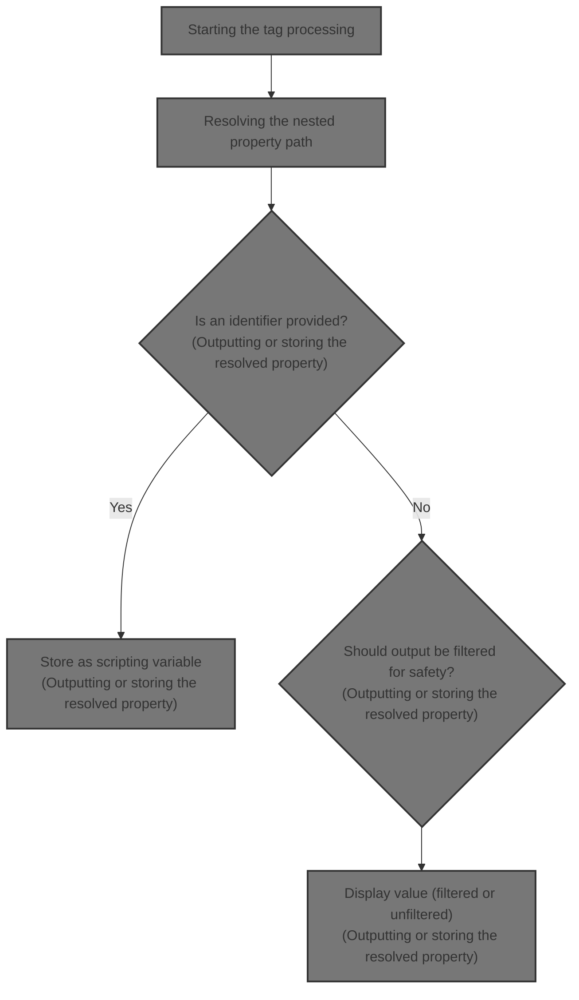
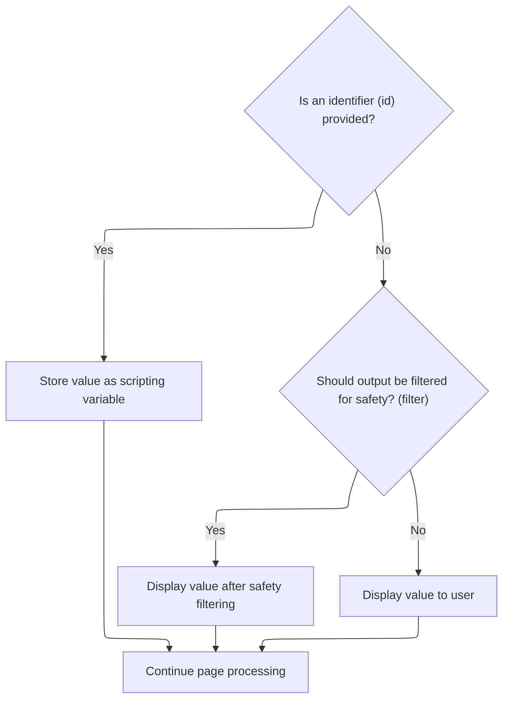

This document explains how property paths for nested data structures are resolved and either stored or displayed in web pages. This enables dynamic data binding and flexible referencing of nested properties in forms and views.



# Starting the tag processing

<SwmSnippet path="/taglib/src/main/java/org/apache/struts/taglib/nested/NestedWriteNestingTag.java" line="105">

---

In <SwmToken path="taglib/src/main/java/org/apache/struts/taglib/nested/NestedWriteNestingTag.java" pos="105:5:5" line-data="    public int doStartTag() throws JspException {">`doStartTag`</SwmToken>, we grab the original property and immediately adjust it for the current nesting context using <SwmToken path="taglib/src/main/java/org/apache/struts/taglib/nested/NestedWriteNestingTag.java" pos="112:1:1" line-data="            NestedPropertyHelper.getAdjustedProperty(request, property);">`NestedPropertyHelper`</SwmToken>. This is needed because nested tags can change the property path, and we need the adjusted path before doing anything else. The next step is to call <SwmToken path="taglib/src/main/java/org/apache/struts/taglib/nested/NestedWriteNestingTag.java" pos="112:1:1" line-data="            NestedPropertyHelper.getAdjustedProperty(request, property);">`NestedPropertyHelper`</SwmToken> to get this adjusted property path.

```java
    public int doStartTag() throws JspException {
        // set the original property
        originalProperty = property;

        HttpServletRequest request =
            (HttpServletRequest) pageContext.getRequest();
        String nesting =
            NestedPropertyHelper.getAdjustedProperty(request, property);

```

---

</SwmSnippet>

## Resolving the nested property path

<SwmSnippet path="/taglib/src/main/java/org/apache/struts/taglib/nested/NestedPropertyHelper.java" line="121">

---

<SwmToken path="taglib/src/main/java/org/apache/struts/taglib/nested/NestedPropertyHelper.java" pos="121:9:9" line-data="    public static final String getAdjustedProperty(HttpServletRequest request,">`getAdjustedProperty`</SwmToken> pulls the current parent property from the request and combines it with the given property. This sets up the correct context for nested property resolution, which is why we call into the relative property calculation next.

```java
    public static final String getAdjustedProperty(HttpServletRequest request,
        String property) {
        // get the old one if any
        String parent = getCurrentProperty(request);

        return calculateRelativeProperty(property, parent);
    }
```

---

</SwmSnippet>

## Calculating the effective property path

```mermaid
%%{init: {"flowchart": {"defaultRenderer": "elk"}} }%%
flowchart TD
    node0["Start: Normalize property and parent to empty if null"]
    click node0 openCode "taglib/src/main/java/org/apache/struts/taglib/nested/NestedPropertyHelper.java:234:240"
    node0 --> node2{"Is property a special parent reference (./ or this/)?"}
    click node2 openCode "taglib/src/main/java/org/apache/struts/taglib/nested/NestedPropertyHelper.java:244:246"
    node2 -->|"Yes"| node3["Return parent property path"]
    click node3 openCode "taglib/src/main/java/org/apache/struts/taglib/nested/NestedPropertyHelper.java:245:246"
    node2 -->|"No"| node4{"Does reference path start from root ('/')?"}
    click node4 openCode "taglib/src/main/java/org/apache/struts/taglib/nested/NestedPropertyHelper.java:264:267"
    node4 -->|"Yes"| node5["Return property from root"]
    click node5 openCode "taglib/src/main/java/org/apache/struts/taglib/nested/NestedPropertyHelper.java:266:267"
    node4 -->|"No"| node6{"Does reference path require returning from root?"}
    click node6 openCode "taglib/src/main/java/org/apache/struts/taglib/nested/NestedPropertyHelper.java:276:279"
    node6 -->|"Yes"| node5
    node6 -->|"No"| node7["Build new property path"]
    click node7 openCode "taglib/src/main/java/org/apache/struts/taglib/nested/NestedPropertyHelper.java:281:288"
    subgraph loop1["For each required parent token"]
      node7 --> node8["Append parent token to result"]
      click node8 openCode "taglib/src/main/java/org/apache/struts/taglib/nested/NestedPropertyHelper.java:285:287"
      node8 --> node9["Append property name"]
      click node9 openCode "taglib/src/main/java/org/apache/struts/taglib/nested/NestedPropertyHelper.java:290:290"
    end
    node9 --> node10{"Does result end with a dot?"}
    click node10 openCode "taglib/src/main/java/org/apache/struts/taglib/nested/NestedPropertyHelper.java:293:295"
    node10 -->|"Yes"| node11["Return result without trailing dot"]
    click node11 openCode "taglib/src/main/java/org/apache/struts/taglib/nested/NestedPropertyHelper.java:294:295"
    node10 -->|"No"| node12["Return constructed property path"]
    click node12 openCode "taglib/src/main/java/org/apache/struts/taglib/nested/NestedPropertyHelper.java:296:297"
classDef HeadingStyle fill:#777777,stroke:#333,stroke-width:2px;

%% Swimm:
%% %%{init: {"flowchart": {"defaultRenderer": "elk"}} }%%
%% flowchart TD
%%     node0["Start: Normalize property and parent to empty if null"]
%%     click node0 openCode "<SwmPath>[taglib/…/nested/NestedPropertyHelper.java](taglib/src/main/java/org/apache/struts/taglib/nested/NestedPropertyHelper.java)</SwmPath>:234:240"
%%     node0 --> node2{"Is property a special parent reference (./ or this/)?"}
%%     click node2 openCode "<SwmPath>[taglib/…/nested/NestedPropertyHelper.java](taglib/src/main/java/org/apache/struts/taglib/nested/NestedPropertyHelper.java)</SwmPath>:244:246"
%%     node2 -->|"Yes"| node3["Return parent property path"]
%%     click node3 openCode "<SwmPath>[taglib/…/nested/NestedPropertyHelper.java](taglib/src/main/java/org/apache/struts/taglib/nested/NestedPropertyHelper.java)</SwmPath>:245:246"
%%     node2 -->|"No"| node4{"Does reference path start from root ('/')?"}
%%     click node4 openCode "<SwmPath>[taglib/…/nested/NestedPropertyHelper.java](taglib/src/main/java/org/apache/struts/taglib/nested/NestedPropertyHelper.java)</SwmPath>:264:267"
%%     node4 -->|"Yes"| node5["Return property from root"]
%%     click node5 openCode "<SwmPath>[taglib/…/nested/NestedPropertyHelper.java](taglib/src/main/java/org/apache/struts/taglib/nested/NestedPropertyHelper.java)</SwmPath>:266:267"
%%     node4 -->|"No"| node6{"Does reference path require returning from root?"}
%%     click node6 openCode "<SwmPath>[taglib/…/nested/NestedPropertyHelper.java](taglib/src/main/java/org/apache/struts/taglib/nested/NestedPropertyHelper.java)</SwmPath>:276:279"
%%     node6 -->|"Yes"| node5
%%     node6 -->|"No"| node7["Build new property path"]
%%     click node7 openCode "<SwmPath>[taglib/…/nested/NestedPropertyHelper.java](taglib/src/main/java/org/apache/struts/taglib/nested/NestedPropertyHelper.java)</SwmPath>:281:288"
%%     subgraph loop1["For each required parent token"]
%%       node7 --> node8["Append parent token to result"]
%%       click node8 openCode "<SwmPath>[taglib/…/nested/NestedPropertyHelper.java](taglib/src/main/java/org/apache/struts/taglib/nested/NestedPropertyHelper.java)</SwmPath>:285:287"
%%       node8 --> node9["Append property name"]
%%       click node9 openCode "<SwmPath>[taglib/…/nested/NestedPropertyHelper.java](taglib/src/main/java/org/apache/struts/taglib/nested/NestedPropertyHelper.java)</SwmPath>:290:290"
%%     end
%%     node9 --> node10{"Does result end with a dot?"}
%%     click node10 openCode "<SwmPath>[taglib/…/nested/NestedPropertyHelper.java](taglib/src/main/java/org/apache/struts/taglib/nested/NestedPropertyHelper.java)</SwmPath>:293:295"
%%     node10 -->|"Yes"| node11["Return result without trailing dot"]
%%     click node11 openCode "<SwmPath>[taglib/…/nested/NestedPropertyHelper.java](taglib/src/main/java/org/apache/struts/taglib/nested/NestedPropertyHelper.java)</SwmPath>:294:295"
%%     node10 -->|"No"| node12["Return constructed property path"]
%%     click node12 openCode "<SwmPath>[taglib/…/nested/NestedPropertyHelper.java](taglib/src/main/java/org/apache/struts/taglib/nested/NestedPropertyHelper.java)</SwmPath>:296:297"
%% classDef HeadingStyle fill:#777777,stroke:#333,stroke-width:2px;
```



<SwmSnippet path="/taglib/src/main/java/org/apache/struts/taglib/nested/NestedPropertyHelper.java" line="232">

---

In <SwmToken path="taglib/src/main/java/org/apache/struts/taglib/nested/NestedPropertyHelper.java" pos="232:7:7" line-data="    private static String calculateRelativeProperty(String property,">`calculateRelativeProperty`</SwmToken>, we handle the actual logic for combining parent and property paths. The function normalizes inputs, handles special cases like './' and 'this/', splits the property into stepping and name, and then merges or returns the right path using both '.' and '/' as delimiters. This is where the mixed delimiter logic and all the edge cases are resolved.

```java
    private static String calculateRelativeProperty(String property,
        String parent) {
        if (parent == null) {
            parent = "";
        }

        if (property == null) {
            property = "";
        }

        /* Special case... reference my parent's nested property.
        Otherwise impossible for things like indexed properties */
        if ("./".equals(property) || "this/".equals(property)) {
            return parent;
        }

        /* remove the stepping from the property */
        String stepping;

        /* isolate a parent reference */
        if (property.endsWith("/")) {
            stepping = property;
            property = "";
        } else {
            stepping = property.substring(0, property.lastIndexOf('/') + 1);

            /* isolate the property */
            property =
                property.substring(property.lastIndexOf('/') + 1,
                    property.length());
        }

        if (stepping.startsWith("/")) {
            /* return from root */
            return property;
        } else {
            /* tokenize the nested property */
            StringTokenizer proT = new StringTokenizer(parent, ".");
            int propCount = proT.countTokens();

            /* tokenize the stepping */
            StringTokenizer strT = new StringTokenizer(stepping, "/");
            int count = strT.countTokens();

            if (count >= propCount) {
                /* return from root */
                return property;
            } else {
                /* append the tokens up to the token difference */
                count = propCount - count;

                StringBuffer result = new StringBuffer();

                for (int i = 0; i < count; i++) {
                    result.append(proT.nextToken());
                    result.append('.');
                }
```

---

</SwmSnippet>

<SwmSnippet path="/taglib/src/main/java/org/apache/struts/taglib/nested/NestedPropertyHelper.java" line="290">

---

Finally, the function returns the combined property path, making sure to strip any trailing dot. This value is what the tag will use to reference the nested data structure.

```java
                result.append(property);

                /* parent reference will have a dot on the end. Leave it off */
                if (result.charAt(result.length() - 1) == '.') {
                    return result.substring(0, result.length() - 1);
                } else {
                    return result.toString();
                }
            }
        }
    }
```

---

</SwmSnippet>

## Outputting or storing the resolved property



<SwmSnippet path="/taglib/src/main/java/org/apache/struts/taglib/nested/NestedWriteNestingTag.java" line="114">

---

Back in <SwmToken path="taglib/src/main/java/org/apache/struts/taglib/nested/NestedWriteNestingTag.java" pos="105:5:5" line-data="    public int doStartTag() throws JspException {">`doStartTag`</SwmToken>, we use the resolved property path from <SwmToken path="taglib/src/main/java/org/apache/struts/taglib/nested/NestedWriteNestingTag.java" pos="112:1:1" line-data="            NestedPropertyHelper.getAdjustedProperty(request, property);">`NestedPropertyHelper`</SwmToken>. If there's an 'id', we stash it in the page context for later use; otherwise, we write it out, optionally filtering it. This wraps up the tag's main job.

```java
        if (id != null) {
            // use it as a scripting variable instead
            pageContext.setAttribute(id, nesting);
        } else {
            /* write output, filtering if required */
            if (this.filter) {
                TagUtils.getInstance().write(pageContext,
                    TagUtils.getInstance().filter(nesting));
            } else {
                TagUtils.getInstance().write(pageContext, nesting);
            }
        }

        /* continue with page processing */
        return (SKIP_BODY);
    }
```

---

</SwmSnippet>

&nbsp;

*This is an auto-generated document by Swimm 🌊 and has not yet been verified by a human*

<SwmMeta version="3.0.0" repo-id="Z2l0aHViJTNBJTNBc3RydXRzMSUzQSUzQVN3aW1tLURlbW8=" repo-name="struts1"><sup>Powered by [Swimm](https://app.swimm.io/)</sup></SwmMeta>
