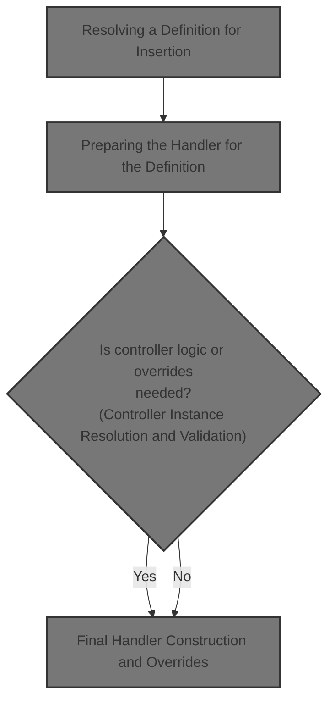
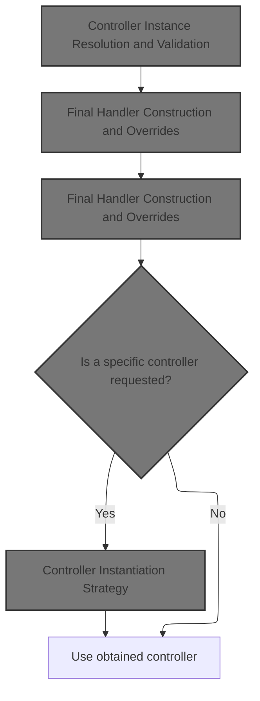
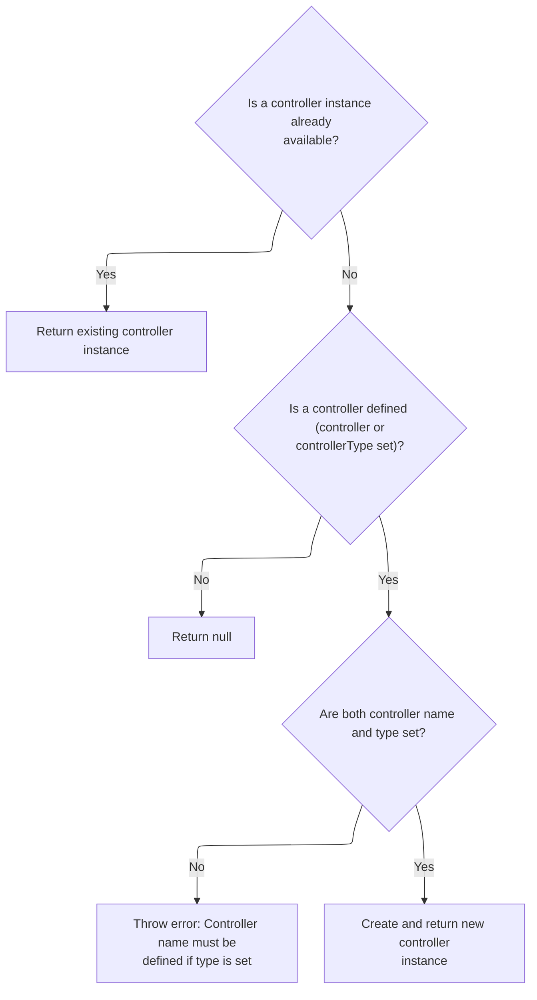
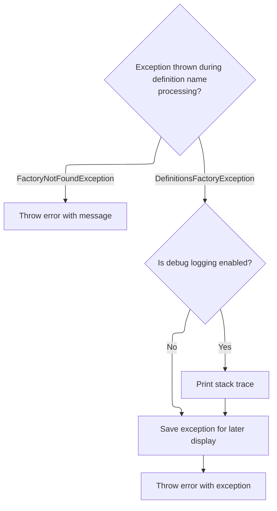

This document explains how a named component definition is resolved and prepared for insertion into the UI. The flow receives a definition name and optional overrides, resolves the definition, and prepares a handler that incorporates any specified role, template, or controller logic.



# Resolving a Definition for Insertion

<SwmSnippet path="/tiles/src/main/java/org/apache/struts/tiles/taglib/InsertTag.java" line="557">

---

In <SwmToken path="tiles/src/main/java/org/apache/struts/tiles/taglib/InsertTag.java" pos="557:5:5" line-data="    protected TagHandler processDefinitionName(String name)">`processDefinitionName`</SwmToken>, we start by looking up a Tiles definition using the provided name, the current HTTP request, and the servlet context. This step delegates to <SwmToken path="tiles/src/main/java/org/apache/struts/tiles/taglib/InsertTag.java" pos="562:1:1" line-data="                TilesUtil.getDefinition(">`TilesUtil`</SwmToken>, which needs both the request and context to resolve the correct definition, considering possible overrides or scoping. The next call to ServletActionContext is needed to access the servlet context from the page context, which is required for the <SwmToken path="tiles/src/main/java/org/apache/struts/tiles/taglib/InsertTag.java" pos="562:1:1" line-data="                TilesUtil.getDefinition(">`TilesUtil`</SwmToken> lookup.

```java
    protected TagHandler processDefinitionName(String name)
        throws JspException {

        try {
            ComponentDefinition definition =
                TilesUtil.getDefinition(
                    name,
                    (HttpServletRequest) pageContext.getRequest(),
```

---

</SwmSnippet>

<SwmSnippet path="/tiles/src/main/java/org/apache/struts/tiles/taglib/InsertTag.java" line="562">

---

Back in InsertTag.processDefinitionName, after getting the servlet context, we call <SwmToken path="tiles/src/main/java/org/apache/struts/tiles/taglib/InsertTag.java" pos="562:1:3" line-data="                TilesUtil.getDefinition(">`TilesUtil.getDefinition`</SwmToken> to actually fetch the <SwmToken path="tiles/src/main/java/org/apache/struts/tiles/taglib/InsertTag.java" pos="561:1:1" line-data="            ComponentDefinition definition =">`ComponentDefinition`</SwmToken>. This is the central lookup that determines what template and attributes will be used for the tag. If the definition isn't found, the function can't continue.

```java
                TilesUtil.getDefinition(
                    name,
                    (HttpServletRequest) pageContext.getRequest(),
                    pageContext.getServletContext());

```

---

</SwmSnippet>

<SwmSnippet path="/tiles/src/main/java/org/apache/struts/tiles/TilesUtil.java" line="196">

---

GetDefinition fetches the <SwmToken path="tiles/src/main/java/org/apache/struts/tiles/TilesUtil.java" pos="159:5:5" line-data="    public static DefinitionsFactory getDefinitionsFactory(">`DefinitionsFactory`</SwmToken> using the request and servlet context, then uses it to resolve the <SwmToken path="tiles/src/main/java/org/apache/struts/tiles/TilesUtil.java" pos="196:5:5" line-data="    public static ComponentDefinition getDefinition(">`ComponentDefinition`</SwmToken>. It assumes the request is always an <SwmToken path="tiles/src/main/java/org/apache/struts/tiles/TilesUtil.java" pos="205:2:2" line-data="                (HttpServletRequest) request,">`HttpServletRequest`</SwmToken>, which isn't clear from the signature. If the factory isn't found, it throws an exception, enforcing the requirement that the factory must be available in the context.

```java
    public static ComponentDefinition getDefinition(
        String definitionName,
        ServletRequest request,
        ServletContext servletContext)
        throws FactoryNotFoundException, DefinitionsFactoryException {

        try {
            return getDefinitionsFactory(request, servletContext).getDefinition(
                definitionName,
                (HttpServletRequest) request,
                servletContext);

        } catch (NullPointerException ex) { // Factory not found in context
            throw new FactoryNotFoundException("Can't get definitions factory from context.");
        }
    }
```

---

</SwmSnippet>

<SwmSnippet path="/tiles/src/main/java/org/apache/struts/tiles/taglib/InsertTag.java" line="567">

---

Back in InsertTag.processDefinitionName, after getting the definition from <SwmToken path="tiles/src/main/java/org/apache/struts/tiles/taglib/InsertTag.java" pos="562:1:1" line-data="                TilesUtil.getDefinition(">`TilesUtil`</SwmToken>, we check if it's null and throw if missing. If found, we immediately pass it to <SwmToken path="tiles/src/main/java/org/apache/struts/tiles/taglib/InsertTag.java" pos="571:3:3" line-data="            return processDefinition(definition);">`processDefinition`</SwmToken>, which handles the actual tag processing using the resolved definition.

```java
            if (definition == null) { // is it possible ?
                throw new NoSuchDefinitionException();
            }

            return processDefinition(definition);

        } catch (NoSuchDefinitionException ex) {
            throw new JspException(
                "Error -  Tag Insert : Can't get definition '"
                    + definitionName
                    + "'. Check if this name exist in definitions factory.", ex);

```

---

</SwmSnippet>

## Preparing the Handler for the Definition



<SwmSnippet path="/tiles/src/main/java/org/apache/struts/tiles/taglib/InsertTag.java" line="604">

---

In <SwmToken path="tiles/src/main/java/org/apache/struts/tiles/taglib/InsertTag.java" pos="604:5:5" line-data="    protected TagHandler processDefinition(ComponentDefinition definition)">`processDefinition`</SwmToken>, we set up local copies of role and page, defaulting to values from the definition if not provided. We then get or create the controller from the definition, which is needed for any controller logic tied to the definition.

```java
    protected TagHandler processDefinition(ComponentDefinition definition)
        throws JspException {
        // Declare local variable in order to not change Tag attribute values.
        String role = this.role;
        String page = this.page;
        Controller controller = null;

        try {
            controller = definition.getOrCreateController();

```

---

</SwmSnippet>

### Controller Instance Resolution and Validation



<SwmSnippet path="/tiles/src/main/java/org/apache/struts/tiles/ComponentDefinition.java" line="439">

---

GetOrCreateController checks if a controller instance already exists and returns it if so. If not, it validates the configuration, ensuring <SwmToken path="tiles/src/main/java/org/apache/struts/tiles/ComponentDefinition.java" pos="446:12:12" line-data="        if (controller == null &amp;&amp; controllerType == null) {">`controllerType`</SwmToken> isn't set without a controller name, then creates and caches the controller instance. If neither is set, it returns null, meaning no controller is used for this definition.

```java
    public Controller getOrCreateController() throws InstantiationException {

        if (controllerInstance != null) {
            return controllerInstance;
        }

        // Do we define a controller ?
        if (controller == null && controllerType == null) {
            return null;
        }

        // check parameters
        if (controllerType != null && controller == null) {
            throw new InstantiationException("Controller name should be defined if controllerType is set");
        }

        controllerInstance = createController(controller, controllerType);

        return controllerInstance;
    }
```

---

</SwmSnippet>

### Controller Instantiation Strategy

```mermaid
%%{init: {"flowchart": {"defaultRenderer": "elk"}} }%%
flowchart TD
    node1["Request to create controller (name,
type)"] --> node2{"Is controller type specified?"}
    click node1 openCode "tiles/src/main/java/org/apache/struts/tiles/ComponentDefinition.java:481:490"
    node2 -->|"No"| node3["Try to create controller from class name"]
    click node2 openCode "tiles/src/main/java/org/apache/struts/tiles/ComponentDefinition.java:490:491"
    node3 -->|"Success"| node7["Return controller"]
    click node3 openCode "tiles/src/main/java/org/apache/struts/tiles/ComponentDefinition.java:492:493"
    node3 -->|"Failure"| node5["Create URL controller"]
    click node5 openCode "tiles/src/main/java/org/apache/struts/tiles/ComponentDefinition.java:495:496"
    node5 --> node7
    node2 -->|"Yes"| node6{"Controller type is 'url'?"}
    click node6 openCode "tiles/src/main/java/org/apache/struts/tiles/ComponentDefinition.java:498:499"
    node6 -->|"Yes"| node5
    node6 -->|"No"| node8{"Controller type is 'classname'?"}
    click node8 openCode "tiles/src/main/java/org/apache/struts/tiles/ComponentDefinition.java:501:502"
    node8 -->|"Yes"| node3
    node8 -->|"No"| node7
    node7["Return controller"]
    click node7 openCode "tiles/src/main/java/org/apache/struts/tiles/ComponentDefinition.java:505:506"

classDef HeadingStyle fill:#777777,stroke:#333,stroke-width:2px;

%% Swimm:
%% %%{init: {"flowchart": {"defaultRenderer": "elk"}} }%%
%% flowchart TD
%%     node1["Request to create controller (name,
%% type)"] --> node2{"Is controller type specified?"}
%%     click node1 openCode "<SwmPath>[tiles/…/tiles/ComponentDefinition.java](tiles/src/main/java/org/apache/struts/tiles/ComponentDefinition.java)</SwmPath>:481:490"
%%     node2 -->|"No"| node3["Try to create controller from class name"]
%%     click node2 openCode "<SwmPath>[tiles/…/tiles/ComponentDefinition.java](tiles/src/main/java/org/apache/struts/tiles/ComponentDefinition.java)</SwmPath>:490:491"
%%     node3 -->|"Success"| node7["Return controller"]
%%     click node3 openCode "<SwmPath>[tiles/…/tiles/ComponentDefinition.java](tiles/src/main/java/org/apache/struts/tiles/ComponentDefinition.java)</SwmPath>:492:493"
%%     node3 -->|"Failure"| node5["Create URL controller"]
%%     click node5 openCode "<SwmPath>[tiles/…/tiles/ComponentDefinition.java](tiles/src/main/java/org/apache/struts/tiles/ComponentDefinition.java)</SwmPath>:495:496"
%%     node5 --> node7
%%     node2 -->|"Yes"| node6{"Controller type is 'url'?"}
%%     click node6 openCode "<SwmPath>[tiles/…/tiles/ComponentDefinition.java](tiles/src/main/java/org/apache/struts/tiles/ComponentDefinition.java)</SwmPath>:498:499"
%%     node6 -->|"Yes"| node5
%%     node6 -->|"No"| node8{"Controller type is 'classname'?"}
%%     click node8 openCode "<SwmPath>[tiles/…/tiles/ComponentDefinition.java](tiles/src/main/java/org/apache/struts/tiles/ComponentDefinition.java)</SwmPath>:501:502"
%%     node8 -->|"Yes"| node3
%%     node8 -->|"No"| node7
%%     node7["Return controller"]
%%     click node7 openCode "<SwmPath>[tiles/…/tiles/ComponentDefinition.java](tiles/src/main/java/org/apache/struts/tiles/ComponentDefinition.java)</SwmPath>:505:506"
%% 
%% classDef HeadingStyle fill:#777777,stroke:#333,stroke-width:2px;
```



<SwmSnippet path="/tiles/src/main/java/org/apache/struts/tiles/ComponentDefinition.java" line="481">

---

CreateController decides how to instantiate a Controller based on the <SwmToken path="tiles/src/main/java/org/apache/struts/tiles/ComponentDefinition.java" pos="481:16:16" line-data="    public static Controller createController(String name, String controllerType)">`controllerType`</SwmToken>. If it's null, it tries to treat the name as a class; if that fails, it uses a URL-based controller. If <SwmToken path="tiles/src/main/java/org/apache/struts/tiles/ComponentDefinition.java" pos="481:16:16" line-data="    public static Controller createController(String name, String controllerType)">`controllerType`</SwmToken> is set, it branches on 'url' or 'classname', handling each accordingly. This lets definitions specify controllers in multiple ways.

```java
    public static Controller createController(String name, String controllerType)
        throws InstantiationException {

        if (log.isDebugEnabled()) {
            log.debug("Create controller name=" + name + ", type=" + controllerType);
        }

        Controller controller = null;

        if (controllerType == null) { // first try as a classname
            try {
                return createControllerFromClassname(name);

            } catch (InstantiationException ex) { // ok, try something else
                controller = new UrlController(name);
            }

        } else if ("url".equalsIgnoreCase(controllerType)) {
            controller = new UrlController(name);

        } else if ("classname".equalsIgnoreCase(controllerType)) {
            controller = createControllerFromClassname(name);
        }

        return controller;
    }
```

---

</SwmSnippet>

### Controller Class Loading

See <SwmLink doc-title="Dynamic Controller and Form Instantiation">[Dynamic Controller and Form Instantiation](/.swm/dynamic-controller-and-form-instantiation.nfsd64rx.sw.md)</SwmLink>

### Final Handler Construction and Overrides

```mermaid
%%{init: {"flowchart": {"defaultRenderer": "elk"}} }%%
flowchart TD
    node1["Start processing definition"] --> node2{"Is a specific role provided?"}
    click node1 openCode "tiles/src/main/java/org/apache/struts/tiles/taglib/InsertTag.java:614:614"
    node2 -->|"No"| node3["Set role from definition"]
    click node2 openCode "tiles/src/main/java/org/apache/struts/tiles/taglib/InsertTag.java:615:617"
    node2 -->|"Yes"| node4["Use provided role"]
    click node3 openCode "tiles/src/main/java/org/apache/struts/tiles/taglib/InsertTag.java:616:616"
    click node4 openCode "tiles/src/main/java/org/apache/struts/tiles/taglib/InsertTag.java:615:617"
    node3 --> node5{"Is a specific template provided?"}
    node4 --> node5
    node5 -->|"No"| node6["Set template from definition"]
    click node5 openCode "tiles/src/main/java/org/apache/struts/tiles/taglib/InsertTag.java:619:621"
    node5 -->|"Yes"| node7["Use provided template"]
    click node6 openCode "tiles/src/main/java/org/apache/struts/tiles/taglib/InsertTag.java:620:620"
    click node7 openCode "tiles/src/main/java/org/apache/struts/tiles/taglib/InsertTag.java:619:621"
    node6 --> node8{"Is a controller override provided?"}
    node7 --> node8
    node8 -->|"Yes"| node9["Create controller from override"]
    click node8 openCode "tiles/src/main/java/org/apache/struts/tiles/taglib/InsertTag.java:623:628"
    node8 -->|"No"| node10["Controller remains as is"]
    click node9 openCode "tiles/src/main/java/org/apache/struts/tiles/taglib/InsertTag.java:624:627"
    click node10 openCode "tiles/src/main/java/org/apache/struts/tiles/taglib/InsertTag.java:623:628"
    node9 --> node11["Create and return InsertHandler for
component insertion"]
    node10 --> node11
    click node11 openCode "tiles/src/main/java/org/apache/struts/tiles/taglib/InsertTag.java:631:635"
classDef HeadingStyle fill:#777777,stroke:#333,stroke-width:2px;

%% Swimm:
%% %%{init: {"flowchart": {"defaultRenderer": "elk"}} }%%
%% flowchart TD
%%     node1["Start processing definition"] --> node2{"Is a specific role provided?"}
%%     click node1 openCode "<SwmPath>[tiles/…/taglib/InsertTag.java](tiles/src/main/java/org/apache/struts/tiles/taglib/InsertTag.java)</SwmPath>:614:614"
%%     node2 -->|"No"| node3["Set role from definition"]
%%     click node2 openCode "<SwmPath>[tiles/…/taglib/InsertTag.java](tiles/src/main/java/org/apache/struts/tiles/taglib/InsertTag.java)</SwmPath>:615:617"
%%     node2 -->|"Yes"| node4["Use provided role"]
%%     click node3 openCode "<SwmPath>[tiles/…/taglib/InsertTag.java](tiles/src/main/java/org/apache/struts/tiles/taglib/InsertTag.java)</SwmPath>:616:616"
%%     click node4 openCode "<SwmPath>[tiles/…/taglib/InsertTag.java](tiles/src/main/java/org/apache/struts/tiles/taglib/InsertTag.java)</SwmPath>:615:617"
%%     node3 --> node5{"Is a specific template provided?"}
%%     node4 --> node5
%%     node5 -->|"No"| node6["Set template from definition"]
%%     click node5 openCode "<SwmPath>[tiles/…/taglib/InsertTag.java](tiles/src/main/java/org/apache/struts/tiles/taglib/InsertTag.java)</SwmPath>:619:621"
%%     node5 -->|"Yes"| node7["Use provided template"]
%%     click node6 openCode "<SwmPath>[tiles/…/taglib/InsertTag.java](tiles/src/main/java/org/apache/struts/tiles/taglib/InsertTag.java)</SwmPath>:620:620"
%%     click node7 openCode "<SwmPath>[tiles/…/taglib/InsertTag.java](tiles/src/main/java/org/apache/struts/tiles/taglib/InsertTag.java)</SwmPath>:619:621"
%%     node6 --> node8{"Is a controller override provided?"}
%%     node7 --> node8
%%     node8 -->|"Yes"| node9["Create controller from override"]
%%     click node8 openCode "<SwmPath>[tiles/…/taglib/InsertTag.java](tiles/src/main/java/org/apache/struts/tiles/taglib/InsertTag.java)</SwmPath>:623:628"
%%     node8 -->|"No"| node10["Controller remains as is"]
%%     click node9 openCode "<SwmPath>[tiles/…/taglib/InsertTag.java](tiles/src/main/java/org/apache/struts/tiles/taglib/InsertTag.java)</SwmPath>:624:627"
%%     click node10 openCode "<SwmPath>[tiles/…/taglib/InsertTag.java](tiles/src/main/java/org/apache/struts/tiles/taglib/InsertTag.java)</SwmPath>:623:628"
%%     node9 --> node11["Create and return <SwmToken path="tiles/src/main/java/org/apache/struts/tiles/taglib/InsertTag.java" pos="631:5:5" line-data="            return new InsertHandler(">`InsertHandler`</SwmToken> for
%% component insertion"]
%%     node10 --> node11
%%     click node11 openCode "<SwmPath>[tiles/…/taglib/InsertTag.java](tiles/src/main/java/org/apache/struts/tiles/taglib/InsertTag.java)</SwmPath>:631:635"
%% classDef HeadingStyle fill:#777777,stroke:#333,stroke-width:2px;
```



<SwmSnippet path="/tiles/src/main/java/org/apache/struts/tiles/taglib/InsertTag.java" line="614">

---

Back in InsertTag.processDefinition, after getting the controller, we override role and page from the definition if not set on the tag. If <SwmToken path="tiles/src/main/java/org/apache/struts/tiles/taglib/InsertTag.java" pos="623:4:4" line-data="            if (controllerName != null) {">`controllerName`</SwmToken> is provided, we create a new controller, replacing the one from the definition. Finally, we return a new <SwmToken path="tiles/src/main/java/org/apache/struts/tiles/taglib/InsertTag.java" pos="631:5:5" line-data="            return new InsertHandler(">`InsertHandler`</SwmToken> with all the resolved values, ready to handle the tag logic.

```java
            // Overload definition with tag's template and role.
            if (role == null) {
                role = definition.getRole();
            }

            if (page == null) {
                page = definition.getTemplate();
            }

            if (controllerName != null) {
                controller =
                    ComponentDefinition.createController(
                        controllerName,
                        controllerType);
            }

            // Can check if page is set
            return new InsertHandler(
                definition.getAttributes(),
                page,
                role,
                controller);

```

---

</SwmSnippet>

<SwmSnippet path="/tiles/src/main/java/org/apache/struts/tiles/taglib/InsertTag.java" line="637">

---

Finally, in InsertTag.processDefinition, if controller creation fails, we catch the <SwmToken path="tiles/src/main/java/org/apache/struts/tiles/taglib/InsertTag.java" pos="637:6:6" line-data="        } catch (InstantiationException ex) {">`InstantiationException`</SwmToken> and wrap it in a <SwmToken path="tiles/src/main/java/org/apache/struts/tiles/taglib/InsertTag.java" pos="638:5:5" line-data="            throw new JspException(ex);">`JspException`</SwmToken>. This ensures any setup errors are surfaced as JSP errors.

```java
        } catch (InstantiationException ex) {
            throw new JspException(ex);
        }
    }
```

---

</SwmSnippet>

## Error Handling During Definition Resolution



<SwmSnippet path="/tiles/src/main/java/org/apache/struts/tiles/taglib/InsertTag.java" line="579">

---

Back in InsertTag.processDefinitionName, after calling <SwmToken path="tiles/src/main/java/org/apache/struts/tiles/taglib/InsertTag.java" pos="571:3:3" line-data="            return processDefinition(definition);">`processDefinition`</SwmToken>, we handle any exceptions that occurred during definition resolution or handler setup. Specific exceptions are wrapped as <SwmToken path="tiles/src/main/java/org/apache/struts/tiles/taglib/InsertTag.java" pos="580:5:5" line-data="            throw new JspException(ex.getMessage(), ex);">`JspException`</SwmToken>, and <SwmToken path="tiles/src/main/java/org/apache/struts/tiles/taglib/InsertTag.java" pos="582:6:6" line-data="        } catch (DefinitionsFactoryException ex) {">`DefinitionsFactoryException`</SwmToken> is also logged and stored in the page context for error reporting.

```java
        } catch (FactoryNotFoundException ex) {
            throw new JspException(ex.getMessage(), ex);

        } catch (DefinitionsFactoryException ex) {
            if (log.isDebugEnabled()) {
                ex.printStackTrace();
            }

            // Save exception to be able to show it later
            pageContext.setAttribute(
                Globals.EXCEPTION_KEY,
                ex,
                PageContext.REQUEST_SCOPE);
            throw new JspException(ex);
        }
    }
```

---

</SwmSnippet>

&nbsp;

*This is an auto-generated document by Swimm 🌊 and has not yet been verified by a human*

<SwmMeta version="3.0.0" repo-id="Z2l0aHViJTNBJTNBc3RydXRzMSUzQSUzQVN3aW1tLURlbW8=" repo-name="struts1"><sup>Powered by [Swimm](https://app.swimm.io/)</sup></SwmMeta>
