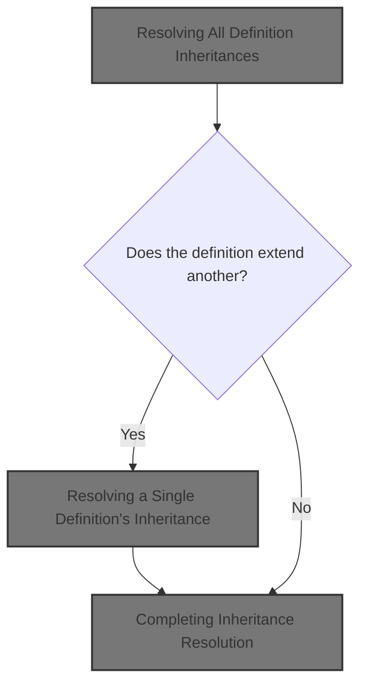
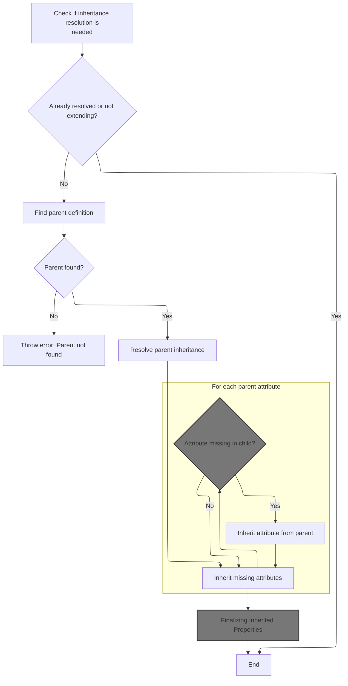
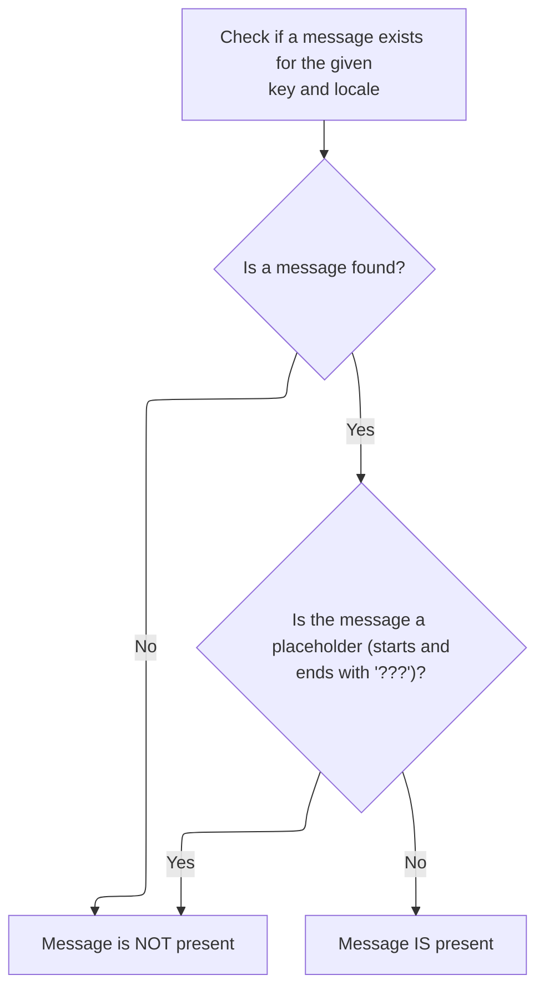
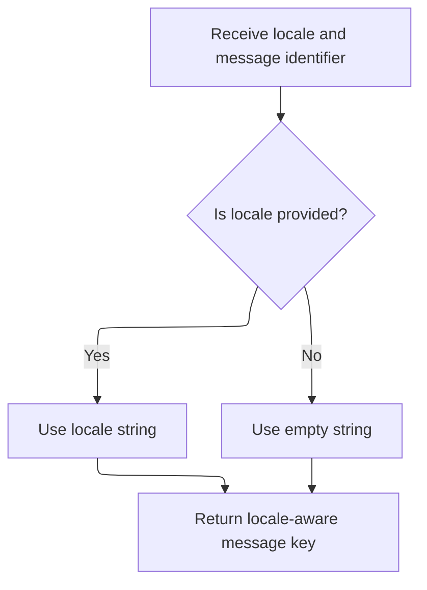
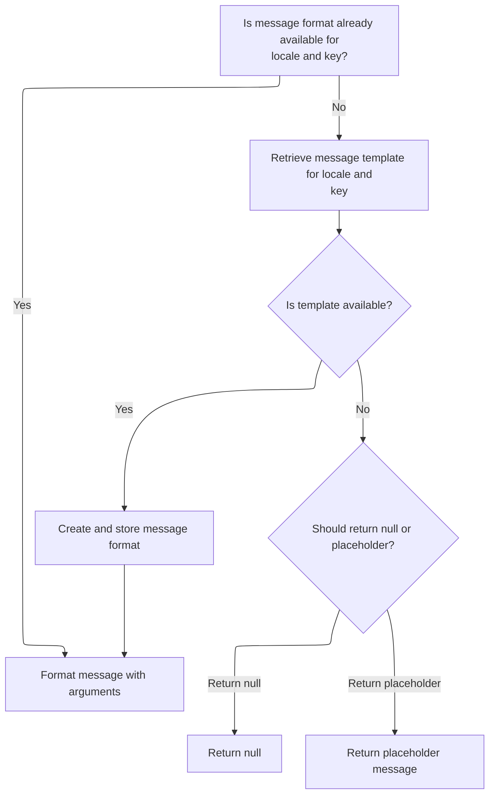
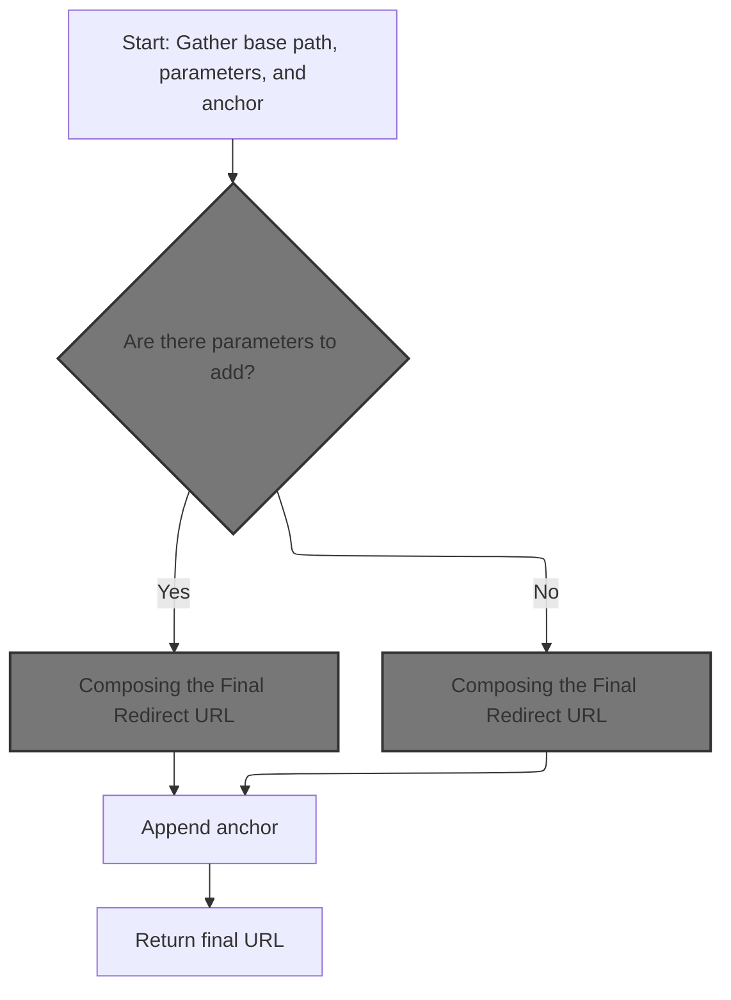
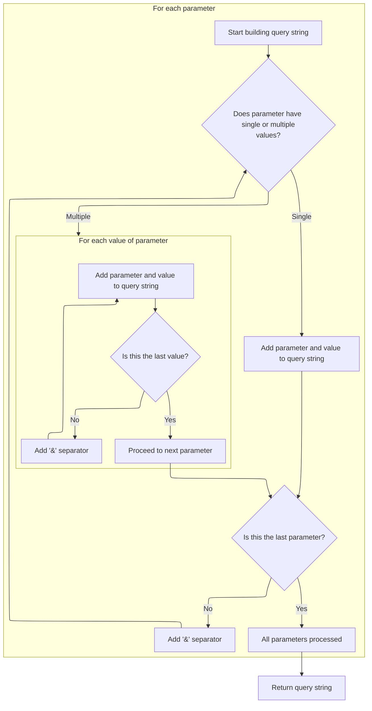
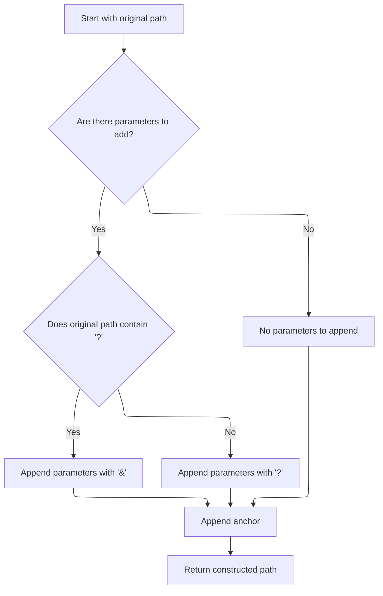
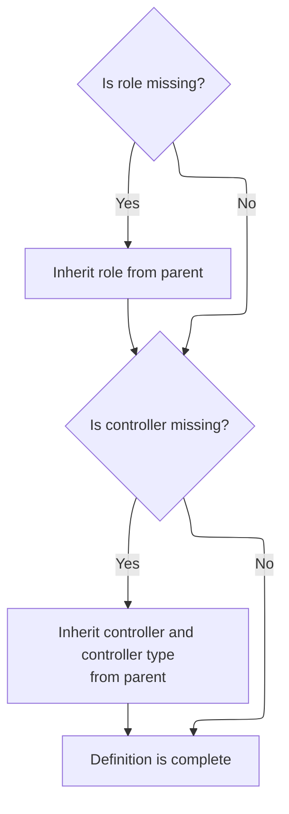

This document describes how the system prepares definitions by resolving inheritance relationships. The flow takes a set of definitions, identifies those that inherit from others, and ensures each one is complete by merging missing attributes, paths, roles, and controllers from their parents. The result is a set of fully resolved definitions, ready for use in rendering views and managing configuration.



# Where is this flow used?

This flow is used multiple times in the codebase as represented in the following diagram:

```mermaid
graph TD;
      6cfe58163bf9b407d68d9dfb8f6a815cf27f1d96d96b43304c3e34f2518c518e(tiles/…/tiles/DefinitionsFactory.java::DefinitionsFactory.DefinitionsFactory) --> 8e0bde401cfdd714ad7948f5187bc6d4f0f9f6d2bdc6f2deaa0f4bf7bbf85497(tiles/…/xmlDefinition/XmlDefinitionsSet.java::XmlDefinitionsSet.resolveInheritances)

c4bf75c9f95bd4da5e48b350e1cf60ec10a6a8b217b7f202a083ec0f6ab346fe(tiles/…/xmlDefinition/I18nFactorySet.java::I18nFactorySet.createDefaultFactory) --> 8e0bde401cfdd714ad7948f5187bc6d4f0f9f6d2bdc6f2deaa0f4bf7bbf85497(tiles/…/xmlDefinition/XmlDefinitionsSet.java::XmlDefinitionsSet.resolveInheritances)

124b12269f22ea1c1cc40a515eb4f3057c2d0670c8f4c40566880bc930bb8f93(tiles/…/xmlDefinition/I18nFactorySet.java::I18nFactorySet.initFactory) --> c4bf75c9f95bd4da5e48b350e1cf60ec10a6a8b217b7f202a083ec0f6ab346fe(tiles/…/xmlDefinition/I18nFactorySet.java::I18nFactorySet.createDefaultFactory)

a22fe784c1b4058cbeb1bcd2b0bef3a69206b3cab2bb9ebe027294ba13657bf9(tiles/…/xmlDefinition/I18nFactorySet.java::I18nFactorySet.createFactory) --> 8e0bde401cfdd714ad7948f5187bc6d4f0f9f6d2bdc6f2deaa0f4bf7bbf85497(tiles/…/xmlDefinition/XmlDefinitionsSet.java::XmlDefinitionsSet.resolveInheritances)


classDef mainFlowStyle color:#000000,fill:#7CB9F4
classDef rootsStyle color:#000000,fill:#00FFF4
classDef Style1 color:#000000,fill:#00FFAA
classDef Style2 color:#000000,fill:#FFFF00
classDef Style3 color:#000000,fill:#AA7CB9

%% Swimm:
%% graph TD;
%%       6cfe58163bf9b407d68d9dfb8f6a815cf27f1d96d96b43304c3e34f2518c518e(<SwmPath>[tiles/…/tiles/DefinitionsFactory.java](tiles/src/main/java/org/apache/struts/tiles/DefinitionsFactory.java)</SwmPath>::DefinitionsFactory.DefinitionsFactory) --> 8e0bde401cfdd714ad7948f5187bc6d4f0f9f6d2bdc6f2deaa0f4bf7bbf85497(<SwmPath>[tiles/…/xmlDefinition/XmlDefinitionsSet.java](tiles/src/main/java/org/apache/struts/tiles/xmlDefinition/XmlDefinitionsSet.java)</SwmPath>::XmlDefinitionsSet.resolveInheritances)
%% 
%% c4bf75c9f95bd4da5e48b350e1cf60ec10a6a8b217b7f202a083ec0f6ab346fe(<SwmPath>[tiles/…/xmlDefinition/I18nFactorySet.java](tiles/src/main/java/org/apache/struts/tiles/xmlDefinition/I18nFactorySet.java)</SwmPath>::I18nFactorySet.createDefaultFactory) --> 8e0bde401cfdd714ad7948f5187bc6d4f0f9f6d2bdc6f2deaa0f4bf7bbf85497(<SwmPath>[tiles/…/xmlDefinition/XmlDefinitionsSet.java](tiles/src/main/java/org/apache/struts/tiles/xmlDefinition/XmlDefinitionsSet.java)</SwmPath>::XmlDefinitionsSet.resolveInheritances)
%% 
%% 124b12269f22ea1c1cc40a515eb4f3057c2d0670c8f4c40566880bc930bb8f93(<SwmPath>[tiles/…/xmlDefinition/I18nFactorySet.java](tiles/src/main/java/org/apache/struts/tiles/xmlDefinition/I18nFactorySet.java)</SwmPath>::I18nFactorySet.initFactory) --> c4bf75c9f95bd4da5e48b350e1cf60ec10a6a8b217b7f202a083ec0f6ab346fe(<SwmPath>[tiles/…/xmlDefinition/I18nFactorySet.java](tiles/src/main/java/org/apache/struts/tiles/xmlDefinition/I18nFactorySet.java)</SwmPath>::I18nFactorySet.createDefaultFactory)
%% 
%% a22fe784c1b4058cbeb1bcd2b0bef3a69206b3cab2bb9ebe027294ba13657bf9(<SwmPath>[tiles/…/xmlDefinition/I18nFactorySet.java](tiles/src/main/java/org/apache/struts/tiles/xmlDefinition/I18nFactorySet.java)</SwmPath>::I18nFactorySet.createFactory) --> 8e0bde401cfdd714ad7948f5187bc6d4f0f9f6d2bdc6f2deaa0f4bf7bbf85497(<SwmPath>[tiles/…/xmlDefinition/XmlDefinitionsSet.java](tiles/src/main/java/org/apache/struts/tiles/xmlDefinition/XmlDefinitionsSet.java)</SwmPath>::XmlDefinitionsSet.resolveInheritances)
%% 
%% 
%% classDef mainFlowStyle color:#000000,fill:#7CB9F4
%% classDef rootsStyle color:#000000,fill:#00FFF4
%% classDef Style1 color:#000000,fill:#00FFAA
%% classDef Style2 color:#000000,fill:#FFFF00
%% classDef Style3 color:#000000,fill:#AA7CB9
```



# Resolving All Definition Inheritances

<SwmSnippet path="/tiles/src/main/java/org/apache/struts/tiles/xmlDefinition/XmlDefinitionsSet.java" line="75">

---

<SwmToken path="tiles/src/main/java/org/apache/struts/tiles/xmlDefinition/XmlDefinitionsSet.java" pos="75:5:5" line-data="  public void resolveInheritances() throws NoSuchDefinitionException">`resolveInheritances`</SwmToken> loops through every definition and triggers inheritance resolution on each one. We need to call into <SwmToken path="tiles/src/main/java/org/apache/struts/tiles/xmlDefinition/XmlDefinitionsSet.java" pos="81:1:1" line-data="      XmlDefinition definition = (XmlDefinition)i.next();">`XmlDefinition`</SwmToken> next because that's where the actual logic for resolving a single definition's inheritance lives.

```java
  public void resolveInheritances() throws NoSuchDefinitionException
    {
      // Walk through all definitions and resolve individual inheritance
    Iterator i = definitions.values().iterator();
    while( i.hasNext() )
      {
      XmlDefinition definition = (XmlDefinition)i.next();
      definition.resolveInheritance( this );
      }  // end loop
    }
```

---

</SwmSnippet>

# Resolving a Single Definition's Inheritance



<SwmSnippet path="/tiles/src/main/java/org/apache/struts/tiles/xmlDefinition/XmlDefinition.java" line="115">

---

In <SwmToken path="tiles/src/main/java/org/apache/struts/tiles/xmlDefinition/XmlDefinition.java" pos="115:5:5" line-data="  public void resolveInheritance( XmlDefinitionsSet definitionsSet )">`resolveInheritance`</SwmToken>, we check if the definition needs processing, resolve the parent first, and then start merging attributes from the parent. We need to call MessagesMap.keySet next because we iterate over the parent's attributes, which could be backed by a <SwmToken path="faces/src/main/java/org/apache/struts/faces/util/MessagesMap.java" pos="41:4:4" line-data="public class MessagesMap implements Map {">`MessagesMap`</SwmToken> implementation.

```java
  public void resolveInheritance( XmlDefinitionsSet definitionsSet )
    throws NoSuchDefinitionException
    {
      // Already done, or not needed ?
    if( isVisited || !isExtending() )
      return;

    if(log.isDebugEnabled())
      log.debug( "Resolve definition for child name='" + getName()
              + "' extends='" + getExtends() + "'.");

      // Set as visited to avoid endless recurisvity.
    setIsVisited( true );

      // Resolve parent before itself.
    XmlDefinition parent = definitionsSet.getDefinition( getExtends() );
    if( parent == null )
      { // error
      String msg = "Error while resolving definition inheritance: child '"
                           + getName() +    "' can't find its ancestor '"
                           + getExtends() +
                           "'. Please check your description file.";
      log.error( msg );
        // to do : find better exception
      throw new NoSuchDefinitionException( msg );
      }

    parent.resolveInheritance( definitionsSet );

      // Iterate on each parent's attribute and add it if not defined in child.
    Iterator parentAttributes = parent.getAttributes().keySet().iterator();
```

---

</SwmSnippet>

<SwmSnippet path="/faces/src/main/java/org/apache/struts/faces/util/MessagesMap.java" line="211">

---

<SwmToken path="faces/src/main/java/org/apache/struts/faces/util/MessagesMap.java" pos="211:5:5" line-data="    public Set keySet() {">`keySet`</SwmToken> just throws <SwmToken path="faces/src/main/java/org/apache/struts/faces/util/MessagesMap.java" pos="213:5:5" line-data="        throw new UnsupportedOperationException();">`UnsupportedOperationException`</SwmToken>, so if the parent's attributes are backed by this <SwmToken path="faces/src/main/java/org/apache/struts/faces/util/MessagesMap.java" pos="41:4:4" line-data="public class MessagesMap implements Map {">`MessagesMap`</SwmToken>, trying to get the keys will fail. There's no real key set here—this is a stub.

```java
    public Set keySet() {

        throw new UnsupportedOperationException();

    }
```

---

</SwmSnippet>

<SwmSnippet path="/tiles/src/main/java/org/apache/struts/tiles/xmlDefinition/XmlDefinition.java" line="146">

---

Back in `XmlDefinition.resolveInheritance`, after trying to get the parent's attribute keys (which might fail if it's a <SwmToken path="faces/src/main/java/org/apache/struts/faces/util/MessagesMap.java" pos="41:4:4" line-data="public class MessagesMap implements Map {">`MessagesMap`</SwmToken>), we copy any missing attributes from parent to child. We need to call MessagesMap.keySet again if the parent's attributes are a <SwmToken path="faces/src/main/java/org/apache/struts/faces/util/MessagesMap.java" pos="41:4:4" line-data="public class MessagesMap implements Map {">`MessagesMap`</SwmToken>, but that's not always supported.

```java
    while( parentAttributes.hasNext() )
      {
      String name = (String)parentAttributes.next();
      if( !getAttributes().containsKey(name) )
        putAttribute( name, parent.getAttribute(name) );
      }
```

---

</SwmSnippet>

## Checking for Message Key Presence

<SwmSnippet path="/faces/src/main/java/org/apache/struts/faces/util/MessagesMap.java" line="107">

---

<SwmToken path="faces/src/main/java/org/apache/struts/faces/util/MessagesMap.java" pos="107:5:5" line-data="    public boolean containsKey(Object key) {">`containsKey`</SwmToken> checks if a message key exists for a given locale by converting the key to a string and calling <SwmToken path="faces/src/main/java/org/apache/struts/faces/util/MessagesMap.java" pos="112:4:6" line-data="            return (messages.isPresent(locale, key.toString()));">`messages.isPresent`</SwmToken>. We need to call MessageResources.isPresent next because that's where the actual presence check happens.

```java
    public boolean containsKey(Object key) {

        if (key == null) {
            return (false);
        } else {
            return (messages.isPresent(locale, key.toString()));
        }

    }
```

---

</SwmSnippet>

## Detecting Missing Messages



<SwmSnippet path="/core/src/main/java/org/apache/struts/util/MessageResources.java" line="397">

---

<SwmToken path="core/src/main/java/org/apache/struts/util/MessageResources.java" pos="397:5:5" line-data="    public boolean isPresent(Locale locale, String key) {">`isPresent`</SwmToken> checks if a message exists by calling <SwmToken path="core/src/main/java/org/apache/struts/util/MessageResources.java" pos="398:7:7" line-data="        String message = getMessage(locale, key);">`getMessage`</SwmToken> and looking for the '???' marker around missing keys. We need to call <SwmToken path="core/src/main/java/org/apache/struts/util/MessageResources.java" pos="398:7:7" line-data="        String message = getMessage(locale, key);">`getMessage`</SwmToken> next to actually fetch the message for the locale and key.

```java
    public boolean isPresent(Locale locale, String key) {
        String message = getMessage(locale, key);

        if (message == null) {
            return false;
        } else if (message.startsWith("???") && message.endsWith("???")) {
            return false; // FIXME - Only valid for default implementation
        } else {
            return true;
        }
    }
```

---

</SwmSnippet>

## Fetching a Message with Arguments

<SwmSnippet path="/core/src/main/java/org/apache/struts/util/MessageResources.java" line="207">

---

<SwmToken path="core/src/main/java/org/apache/struts/util/MessageResources.java" pos="207:5:17" line-data="    public String getMessage(String key, Object[] args) {">`getMessage(String key, Object[] args)`</SwmToken> just delegates to the main <SwmToken path="core/src/main/java/org/apache/struts/util/MessageResources.java" pos="207:5:5" line-data="    public String getMessage(String key, Object[] args) {">`getMessage`</SwmToken> method with a null locale. We need to call the next overload to handle locale-specific logic.

```java
    public String getMessage(String key, Object[] args) {
        return this.getMessage((Locale) null, key, args);
    }
```

---

</SwmSnippet>

## Fetching a Message with One Argument

<SwmSnippet path="/core/src/main/java/org/apache/struts/util/MessageResources.java" line="324">

---

<SwmToken path="core/src/main/java/org/apache/struts/util/MessageResources.java" pos="324:5:20" line-data="    public String getMessage(Locale locale, String key, Object arg0) {">`getMessage(Locale locale, String key, Object arg0)`</SwmToken> wraps the argument in an array and calls the main <SwmToken path="core/src/main/java/org/apache/struts/util/MessageResources.java" pos="324:5:5" line-data="    public String getMessage(Locale locale, String key, Object arg0) {">`getMessage`</SwmToken> method. This keeps argument handling consistent.

```java
    public String getMessage(Locale locale, String key, Object arg0) {
        return this.getMessage(locale, key, new Object[] { arg0 });
    }
```

---

</SwmSnippet>

## Formatting the Message with Arguments

<SwmSnippet path="/core/src/main/java/org/apache/struts/util/MessageResources.java" line="286">

---

In <SwmToken path="core/src/main/java/org/apache/struts/util/MessageResources.java" pos="286:5:22" line-data="    public String getMessage(Locale locale, String key, Object[] args) {">`getMessage(Locale locale, String key, Object[] args)`</SwmToken>, we prep for formatting by building a cache key using <SwmToken path="core/src/main/java/org/apache/struts/util/MessageResources.java" pos="293:7:7" line-data="        String formatKey = messageKey(locale, key);">`messageKey`</SwmToken>. We need to call <SwmToken path="core/src/main/java/org/apache/struts/util/MessageResources.java" pos="293:7:7" line-data="        String formatKey = messageKey(locale, key);">`messageKey`</SwmToken> next to generate a unique key for the cache.

```java
    public String getMessage(Locale locale, String key, Object[] args) {
        // Cache MessageFormat instances as they are accessed
        if (locale == null) {
            locale = defaultLocale;
        }

        MessageFormat format = null;
        String formatKey = messageKey(locale, key);

```

---

</SwmSnippet>

### Building a Locale-Specific Message Key



<SwmSnippet path="/core/src/main/java/org/apache/struts/util/MessageResources.java" line="460">

---

<SwmToken path="core/src/main/java/org/apache/struts/util/MessageResources.java" pos="460:5:5" line-data="    protected String messageKey(Locale locale, String key) {">`messageKey`</SwmToken> builds a unique string by combining the locale key and the message key. We need to call <SwmToken path="core/src/main/java/org/apache/struts/util/MessageResources.java" pos="461:4:4" line-data="        return (localeKey(locale) + &quot;.&quot; + key);">`localeKey`</SwmToken> next to get the locale part of the key.

```java
    protected String messageKey(Locale locale, String key) {
        return (localeKey(locale) + "." + key);
    }
```

---

</SwmSnippet>

<SwmSnippet path="/core/src/main/java/org/apache/struts/util/MessageResources.java" line="449">

---

<SwmToken path="core/src/main/java/org/apache/struts/util/MessageResources.java" pos="449:5:5" line-data="    protected String localeKey(Locale locale) {">`localeKey`</SwmToken> turns the Locale into a string (or empty string if null) so it can be used as part of a cache or lookup key. No surprises here.

```java
    protected String localeKey(Locale locale) {
        return (locale == null) ? "" : locale.toString();
    }
```

---

</SwmSnippet>

### Formatting and Returning the Message



<SwmSnippet path="/core/src/main/java/org/apache/struts/util/MessageResources.java" line="295">

---

Back in <SwmToken path="core/src/main/java/org/apache/struts/util/MessageResources.java" pos="299:7:7" line-data="                String formatString = getMessage(locale, key);">`getMessage`</SwmToken>, after building the cache key, we fetch or create the <SwmToken path="core/src/main/java/org/apache/struts/util/MessageResources.java" pos="296:6:6" line-data="            format = (MessageFormat) formats.get(formatKey);">`MessageFormat`</SwmToken>, handle missing formats, and finally format the message with the provided arguments.

```java
        synchronized (formats) {
            format = (MessageFormat) formats.get(formatKey);

            if (format == null) {
                String formatString = getMessage(locale, key);

                if (formatString == null) {
                    return returnNull ? null : ("???" + formatKey + "???");
                }

                format = new MessageFormat(escape(formatString));
                format.setLocale(locale);
                formats.put(formatKey, format);
            }
        }

        return format.format(args);
    }
```

---

</SwmSnippet>

## Finalizing Inherited Properties

<SwmSnippet path="/tiles/src/main/java/org/apache/struts/tiles/xmlDefinition/XmlDefinition.java" line="152">

---

Back in `XmlDefinition.resolveInheritance`, after handling attributes, we fill in missing path and role from the parent. We need to call <SwmToken path="core/src/main/java/org/apache/struts/action/ActionRedirect.java" pos="343:6:6" line-data="        result.append(&quot;ActionRedirect [&quot;);">`ActionRedirect`</SwmToken> next to fetch the parent's path if it's an <SwmToken path="core/src/main/java/org/apache/struts/action/ActionRedirect.java" pos="343:6:6" line-data="        result.append(&quot;ActionRedirect [&quot;);">`ActionRedirect`</SwmToken>.

```java
      // Set path and role if not setted
    if( path == null )
      setPath( parent.getPath() );
```

---

</SwmSnippet>

## Building the Redirect Path



<SwmSnippet path="/core/src/main/java/org/apache/struts/action/ActionRedirect.java" line="230">

---

In <SwmToken path="core/src/main/java/org/apache/struts/action/ActionRedirect.java" pos="230:5:5" line-data="    public String getPath() {">`getPath`</SwmToken>, we start by grabbing the original path (before parameters or anchors) using <SwmToken path="core/src/main/java/org/apache/struts/action/ActionRedirect.java" pos="232:7:7" line-data="        String originalPath = getOriginalPath();">`getOriginalPath`</SwmToken>. We need to call <SwmToken path="core/src/main/java/org/apache/struts/action/ActionRedirect.java" pos="232:7:7" line-data="        String originalPath = getOriginalPath();">`getOriginalPath`</SwmToken> next to get the base for the final URL.

```java
    public String getPath() {
        // get the original path and the parameter string that was formed
        String originalPath = getOriginalPath();
```

---

</SwmSnippet>

<SwmSnippet path="/core/src/main/java/org/apache/struts/action/ActionRedirect.java" line="220">

---

<SwmToken path="core/src/main/java/org/apache/struts/action/ActionRedirect.java" pos="220:5:5" line-data="    public String getOriginalPath() {">`getOriginalPath`</SwmToken> just calls the superclass's <SwmToken path="core/src/main/java/org/apache/struts/action/ActionRedirect.java" pos="221:5:5" line-data="        return super.getPath();">`getPath`</SwmToken>. Next, we need to call <SwmToken path="core/src/main/java/org/apache/struts/action/ActionRedirect.java" pos="233:7:7" line-data="        String parameterString = getParameterString();">`getParameterString`</SwmToken> to add query parameters to the path.

```java
    public String getOriginalPath() {
        return super.getPath();
    }
```

---

</SwmSnippet>

<SwmSnippet path="/core/src/main/java/org/apache/struts/action/ActionRedirect.java" line="233">

---

Back in <SwmToken path="tiles/src/main/java/org/apache/struts/tiles/xmlDefinition/XmlDefinition.java" pos="154:6:6" line-data="      setPath( parent.getPath() );">`getPath`</SwmToken>, after getting the original path, we build the parameter string with <SwmToken path="core/src/main/java/org/apache/struts/action/ActionRedirect.java" pos="233:7:7" line-data="        String parameterString = getParameterString();">`getParameterString`</SwmToken>. We need to call it next to append any query parameters to the URL.

```java
        String parameterString = getParameterString();
```

---

</SwmSnippet>

### Serializing Redirect Parameters



<SwmSnippet path="/core/src/main/java/org/apache/struts/action/ActionRedirect.java" line="295">

---

In <SwmToken path="core/src/main/java/org/apache/struts/action/ActionRedirect.java" pos="295:5:5" line-data="    public String getParameterString() {">`getParameterString`</SwmToken>, we serialize all parameters into a query string, handling both single and multiple values per key. This prepares the string for appending to the path.

```java
    public String getParameterString() {
        StringBuffer strParam = new StringBuffer(DEFAULT_BUFFER_SIZE);

        // loop through all parameters
        Iterator iterator = parameterValues.keySet().iterator();

        while (iterator.hasNext()) {
            // get the parameter name
            String paramName = (String) iterator.next();

            // get the value for this parameter
            Object value = parameterValues.get(paramName);

            if (value instanceof String) {
                // just one value for this param
                strParam.append(paramName).append("=").append(value);
            } else if (value instanceof String[]) {
                // loop through all values for this param
                String[] values = (String[]) value;

                for (int i = 0; i < values.length; i++) {
                    strParam.append(paramName).append("=").append(values[i]);

                    if (i < (values.length - 1)) {
                        strParam.append("&");
                    }
                }
            }

            if (iterator.hasNext()) {
                strParam.append("&");
            }
        }
```

---

</SwmSnippet>

<SwmSnippet path="/core/src/main/java/org/apache/struts/action/ActionRedirect.java" line="329">

---

We finish <SwmToken path="core/src/main/java/org/apache/struts/action/ActionRedirect.java" pos="233:7:7" line-data="        String parameterString = getParameterString();">`getParameterString`</SwmToken> by returning the built query string. Next, we need to call <SwmToken path="core/src/main/java/org/apache/struts/action/ActionRedirect.java" pos="234:7:7" line-data="        String anchorString = getAnchorString();">`getAnchorString`</SwmToken> to handle any URL fragment.

```java
        return strParam.toString();
    }
```

---

</SwmSnippet>

### Stringifying the Redirect

<SwmSnippet path="/core/src/main/java/org/apache/struts/action/ActionRedirect.java" line="340">

---

In <SwmToken path="core/src/main/java/org/apache/struts/action/ActionRedirect.java" pos="340:5:5" line-data="    public String toString() {">`toString`</SwmToken>, we start building a readable summary of the <SwmToken path="core/src/main/java/org/apache/struts/action/ActionRedirect.java" pos="343:6:6" line-data="        result.append(&quot;ActionRedirect [&quot;);">`ActionRedirect`</SwmToken>, including the original path. We need to call <SwmToken path="core/src/main/java/org/apache/struts/action/ActionRedirect.java" pos="233:7:7" line-data="        String parameterString = getParameterString();">`getParameterString`</SwmToken> next to add the parameters to the output.

```java
    public String toString() {
        StringBuffer result = new StringBuffer(DEFAULT_BUFFER_SIZE);

        result.append("ActionRedirect [");
        result.append("originalPath=").append(getOriginalPath()).append(";");
```

---

</SwmSnippet>

<SwmSnippet path="/core/src/main/java/org/apache/struts/action/ActionRedirect.java" line="345">

---

Back in <SwmToken path="faces/src/main/java/org/apache/struts/faces/util/MessagesMap.java" pos="112:13:13" line-data="            return (messages.isPresent(locale, key.toString()));">`toString`</SwmToken>, after adding the parameter string, we append the anchor string next for completeness.

```java
        result.append("parameterString=").append(getParameterString()).append("]");
```

---

</SwmSnippet>

<SwmSnippet path="/core/src/main/java/org/apache/struts/action/ActionRedirect.java" line="346">

---

Back in <SwmToken path="core/src/main/java/org/apache/struts/action/ActionRedirect.java" pos="348:5:5" line-data="        return result.toString();">`toString`</SwmToken>, after adding the anchor string, we return the full string representation of the redirect. This gives a complete view for logs or debugging.

```java
        result.append("anchorString=").append(getAnchorString()).append("]");

        return result.toString();
    }
```

---

</SwmSnippet>

### Composing the Final Redirect URL



<SwmSnippet path="/core/src/main/java/org/apache/struts/action/ActionRedirect.java" line="234">

---

Back in <SwmToken path="tiles/src/main/java/org/apache/struts/tiles/xmlDefinition/XmlDefinition.java" pos="154:6:6" line-data="      setPath( parent.getPath() );">`getPath`</SwmToken>, after building the parameter and anchor strings, we assemble the final URL, handling separators and fragments, and return it as a string.

```java
        String anchorString = getAnchorString();

        StringBuffer result = new StringBuffer(originalPath);

        if ((parameterString != null) && (parameterString.length() > 0)) {
            // the parameter separator we're going to use
            String paramSeparator = "?";

            // true if we need to use a parameter separator after originalPath
            boolean needsParamSeparator = true;

            // does the original path already have a "?"?
            int paramStartIndex = originalPath.indexOf("?");

            if (paramStartIndex > 0) {
                // did the path end with "?"?
                needsParamSeparator = (paramStartIndex != (originalPath.length()
                    - 1));

                if (needsParamSeparator) {
                    paramSeparator = "&";
                }
            }

            if (needsParamSeparator) {
                result.append(paramSeparator);
            }

            result.append(parameterString);
        }

        // append anchor string (or blank if none was set)
        result.append(anchorString);


        return result.toString();
    }
```

---

</SwmSnippet>

## Completing Inheritance Resolution



<SwmSnippet path="/tiles/src/main/java/org/apache/struts/tiles/xmlDefinition/XmlDefinition.java" line="155">

---

Back in `XmlDefinition.resolveInheritance`, after handling path and role, we fill in any missing controller properties from the parent. This wraps up the inheritance logic for the definition.

```java
    if( role == null )
      setRole( parent.getRole() );
    if( controller==null )
      {
      setController( parent.getController());
      setControllerType( parent.getControllerType());
      }
    }
```

---

</SwmSnippet>

&nbsp;

*This is an auto-generated document by Swimm 🌊 and has not yet been verified by a human*

<SwmMeta version="3.0.0" repo-id="Z2l0aHViJTNBJTNBc3RydXRzMSUzQSUzQVN3aW1tLURlbW8=" repo-name="struts1"><sup>Powered by [Swimm](https://app.swimm.io/)</sup></SwmMeta>
