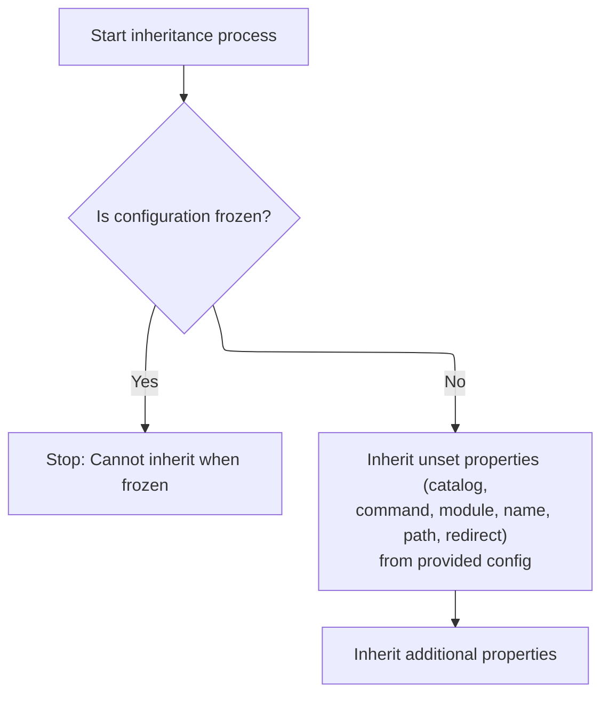

This document describes how forward inheritance is resolved, allowing a forward configuration to inherit properties from another forward. The process checks both <SwmToken path="core/src/main/java/org/apache/struts/config/ForwardConfig.java" pos="438:23:25" line-data="            // (because if we are, that means we&#39;re an action-level forward">`action-level`</SwmToken> and global forwards, ensures there are no inheritance cycles, and copies properties while preserving local overrides.

# Resolving Forward Inheritance and Preventing Cycles

<SwmSnippet path="/core/src/main/java/org/apache/struts/config/ForwardConfig.java" line="417">

---

In <SwmToken path="core/src/main/java/org/apache/struts/config/ForwardConfig.java" pos="417:5:5" line-data="    public void processExtends(ModuleConfig moduleConfig,">`processExtends`</SwmToken>, we're figuring out which <SwmToken path="core/src/main/java/org/apache/struts/config/ForwardConfig.java" pos="428:1:1" line-data="            ForwardConfig baseConfig = null;">`ForwardConfig`</SwmToken> (if any) this forward extends, looking first in <SwmToken path="core/src/main/java/org/apache/struts/config/ForwardConfig.java" pos="438:23:25" line-data="            // (because if we are, that means we&#39;re an action-level forward">`action-level`</SwmToken> forwards, then global ones. Before copying anything, we call <SwmToken path="core/src/main/java/org/apache/struts/config/ForwardConfig.java" pos="459:4:4" line-data="            if (checkCircularInheritance(moduleConfig, actionConfig)) {">`checkCircularInheritance`</SwmToken> to make sure we don't get stuck in a loop if someone accidentally set up a cycle in the config.

```java
    public void processExtends(ModuleConfig moduleConfig,
        ActionConfig actionConfig)
        throws ClassNotFoundException, IllegalAccessException,
            InstantiationException, InvocationTargetException {
        if (configured) {
            throw new IllegalStateException("Configuration is frozen");
        }

        String ancestorName = getExtends();

        if ((!extensionProcessed) && (ancestorName != null)) {
            ForwardConfig baseConfig = null;

            // We only check the action config if we're not a global forward
            boolean checkActionConfig =
                (this != moduleConfig.findForwardConfig(getName()));

            // ... and the action config was provided
            checkActionConfig &= (actionConfig != null);

            // ... and we're not extending a config with the same name
            // (because if we are, that means we're an action-level forward
            //  extending a global forward).
            checkActionConfig &= !ancestorName.equals(getName());

            // We first check in the action config's forwards
            if (checkActionConfig) {
                baseConfig = actionConfig.findForwardConfig(ancestorName);
            }

            // Then check the global forwards
            if (baseConfig == null) {
                baseConfig = moduleConfig.findForwardConfig(ancestorName);
            }

            if (baseConfig == null) {
                throw new NullPointerException("Unable to find " + "forward '"
                    + ancestorName + "' to extend.");
            }

            // Check for circular inheritance and make sure the base config's
            //  own extends have been processed already
            if (checkCircularInheritance(moduleConfig, actionConfig)) {
                throw new IllegalArgumentException(
                    "Circular inheritance detected for forward " + getName());
            }

```

---

</SwmSnippet>

<SwmSnippet path="/core/src/main/java/org/apache/struts/config/ForwardConfig.java" line="266">

---

<SwmToken path="core/src/main/java/org/apache/struts/config/ForwardConfig.java" pos="266:5:5" line-data="    protected boolean checkCircularInheritance(ModuleConfig moduleConfig,">`checkCircularInheritance`</SwmToken> walks up the inheritance chain, switching between <SwmToken path="core/src/main/java/org/apache/struts/config/ForwardConfig.java" pos="438:23:25" line-data="            // (because if we are, that means we&#39;re an action-level forward">`action-level`</SwmToken> and global forwards as needed, and checks if any ancestor is the same object as the current config. If it finds itself, that's a cycle, and it bails out.

```java
    protected boolean checkCircularInheritance(ModuleConfig moduleConfig,
        ActionConfig actionConfig) {
        String ancestorName = getExtends();

        if (ancestorName == null) {
            return false;
        }

        // Find our ancestor
        ForwardConfig ancestor = null;

        // First check the action config
        if (actionConfig != null) {
            ancestor = actionConfig.findForwardConfig(ancestorName);

            // If we found *this*, set ancestor to null to check for a global def
            if (ancestor == this) {
                ancestor = null;
            }
        }

        // Then check the global forwards
        if (ancestor == null) {
            ancestor = moduleConfig.findForwardConfig(ancestorName);

            if (ancestor != null) {
                // If the ancestor is a global forward, set actionConfig
                //  to null so further searches are only done among
                //  global forwards.
                actionConfig = null;
            }
        }

        while (ancestor != null) {
            // Check if an ancestor is extending *this*
            if (ancestor == this) {
                return true;
            }

            // Get our ancestor's ancestor
            ancestorName = ancestor.getExtends();

            // check against ancestors extending same named ancestors
            if (ancestor.getName().equals(ancestorName)) {
                // If the ancestor is extending a config with the same name
                //  make sure we look for its ancestor in the global forwards.
                //  If we're already at that level, we return false.
                if (actionConfig == null) {
                    return false;
                } else {
                    // Set actionConfig = null to force us to look for global
                    //  forwards
                    actionConfig = null;
                }
            }

            ancestor = null;

            // First check the action config
            if (actionConfig != null) {
                ancestor = actionConfig.findForwardConfig(ancestorName);
            }

            // Then check the global forwards
            if (ancestor == null) {
                ancestor = moduleConfig.findForwardConfig(ancestorName);

                if (ancestor != null) {
                    // Limit further checks to moduleConfig.
                    actionConfig = null;
                }
            }
        }
```

---

</SwmSnippet>

<SwmSnippet path="/core/src/main/java/org/apache/struts/config/ForwardConfig.java" line="464">

---

Back in <SwmToken path="core/src/main/java/org/apache/struts/config/ForwardConfig.java" pos="465:3:3" line-data="                baseConfig.processExtends(moduleConfig, actionConfig);">`processExtends`</SwmToken>, after making sure there's no cycle, we make sure the base config's own inheritance is processed (recursively if needed), then copy its values into the current config using <SwmToken path="core/src/main/java/org/apache/struts/config/ForwardConfig.java" pos="469:1:1" line-data="            inheritFrom(baseConfig);">`inheritFrom`</SwmToken>.

```java
            if (!baseConfig.isExtensionProcessed()) {
                baseConfig.processExtends(moduleConfig, actionConfig);
            }

            // copy values from the base config
            inheritFrom(baseConfig);
        }

```

---

</SwmSnippet>

## Copying Forward Properties from Ancestor



<SwmSnippet path="/core/src/main/java/org/apache/struts/config/ForwardConfig.java" line="370">

---

In <SwmToken path="core/src/main/java/org/apache/struts/config/ForwardConfig.java" pos="370:5:5" line-data="    public void inheritFrom(ForwardConfig config)">`inheritFrom`</SwmToken>, we check if the config is frozen, then start copying properties from the ancestor only if they're not already set. First up is the catalog, which we set if it's missing.

```java
    public void inheritFrom(ForwardConfig config)
        throws ClassNotFoundException, IllegalAccessException,
            InstantiationException, InvocationTargetException {
        if (configured) {
            throw new IllegalStateException("Configuration is frozen");
        }

        // Inherit values that have not been overridden
        if (getCatalog() == null) {
            setCatalog(config.getCatalog());
        }

```

---

</SwmSnippet>

<SwmSnippet path="/core/src/main/java/org/apache/struts/config/ForwardConfig.java" line="246">

---

<SwmToken path="core/src/main/java/org/apache/struts/config/ForwardConfig.java" pos="246:5:5" line-data="    public void setCatalog(String catalog) {">`setCatalog`</SwmToken> just assigns the catalog value, but only if the config isn't frozen. If it is, it throws, so you can't change it after freezing.

```java
    public void setCatalog(String catalog) {
        if (configured) {
            throw new IllegalStateException("Configuration is frozen");
        }

        this.catalog = catalog;
    }
```

---

</SwmSnippet>

<SwmSnippet path="/core/src/main/java/org/apache/struts/config/ForwardConfig.java" line="382">

---

Back in <SwmToken path="core/src/main/java/org/apache/struts/config/ForwardConfig.java" pos="370:5:5" line-data="    public void inheritFrom(ForwardConfig config)">`inheritFrom`</SwmToken>, after setting the catalog, we check if the command is missing and set it from the ancestor if needed. This keeps local overrides intact.

```java
        if (getCommand() == null) {
            setCommand(config.getCommand());
        }

```

---

</SwmSnippet>

<SwmSnippet path="/core/src/main/java/org/apache/struts/config/ForwardConfig.java" line="234">

---

<SwmToken path="core/src/main/java/org/apache/struts/config/ForwardConfig.java" pos="234:5:5" line-data="    public void setCommand(String command) {">`setCommand`</SwmToken> assigns the command value, but only if the config isn't frozen. Otherwise, it throws.

```java
    public void setCommand(String command) {
        if (configured) {
            throw new IllegalStateException("Configuration is frozen");
        }

        this.command = command;
    }
```

---

</SwmSnippet>

<SwmSnippet path="/core/src/main/java/org/apache/struts/config/ForwardConfig.java" line="386">

---

Back in <SwmToken path="core/src/main/java/org/apache/struts/config/ForwardConfig.java" pos="370:5:5" line-data="    public void inheritFrom(ForwardConfig config)">`inheritFrom`</SwmToken>, after the command, we check if the module is missing and set it from the ancestor if needed. Again, this keeps explicit settings intact.

```java
        if (getModule() == null) {
            setModule(config.getModule());
        }

```

---

</SwmSnippet>

<SwmSnippet path="/core/src/main/java/org/apache/struts/config/ForwardConfig.java" line="390">

---

Back in <SwmToken path="core/src/main/java/org/apache/struts/config/ForwardConfig.java" pos="370:5:5" line-data="    public void inheritFrom(ForwardConfig config)">`inheritFrom`</SwmToken>, after the module, we check if the name is missing and set it from the ancestor if needed. This keeps any local name override.

```java
        if (getName() == null) {
            setName(config.getName());
        }

```

---

</SwmSnippet>

<SwmSnippet path="/core/src/main/java/org/apache/struts/config/ForwardConfig.java" line="186">

---

<SwmToken path="core/src/main/java/org/apache/struts/config/ForwardConfig.java" pos="186:5:5" line-data="    public void setName(String name) {">`setName`</SwmToken> sets the name, but only if the config isn't frozen. Otherwise, it throws.

```java
    public void setName(String name) {
        if (configured) {
            throw new IllegalStateException("Configuration is frozen");
        }

        this.name = name;
    }
```

---

</SwmSnippet>

<SwmSnippet path="/core/src/main/java/org/apache/struts/config/ForwardConfig.java" line="394">

---

Back in <SwmToken path="core/src/main/java/org/apache/struts/config/ForwardConfig.java" pos="370:5:5" line-data="    public void inheritFrom(ForwardConfig config)">`inheritFrom`</SwmToken>, after the name, we check if the path is missing and set it from the ancestor if needed. This keeps any local path override.

```java
        if (getPath() == null) {
            setPath(config.getPath());
        }

```

---

</SwmSnippet>

<SwmSnippet path="/core/src/main/java/org/apache/struts/config/ForwardConfig.java" line="198">

---

<SwmToken path="core/src/main/java/org/apache/struts/config/ForwardConfig.java" pos="198:5:5" line-data="    public void setPath(String path) {">`setPath`</SwmToken> sets the path, but only if the config isn't frozen. Otherwise, it throws.

```java
    public void setPath(String path) {
        if (configured) {
            throw new IllegalStateException("Configuration is frozen");
        }

        this.path = path;
    }
```

---

</SwmSnippet>

<SwmSnippet path="/core/src/main/java/org/apache/struts/config/ForwardConfig.java" line="398">

---

Back in <SwmToken path="core/src/main/java/org/apache/struts/config/ForwardConfig.java" pos="370:5:5" line-data="    public void inheritFrom(ForwardConfig config)">`inheritFrom`</SwmToken>, after the path, we check if the redirect flag is false and set it from the ancestor if needed. This way, a local redirect=true always wins.

```java
        if (!getRedirect()) {
            setRedirect(config.getRedirect());
        }

```

---

</SwmSnippet>

<SwmSnippet path="/core/src/main/java/org/apache/struts/config/ForwardConfig.java" line="402">

---

Back in <SwmToken path="core/src/main/java/org/apache/struts/config/ForwardConfig.java" pos="370:5:5" line-data="    public void inheritFrom(ForwardConfig config)">`inheritFrom`</SwmToken>, after all the explicit property checks, we call <SwmToken path="core/src/main/java/org/apache/struts/config/ForwardConfig.java" pos="402:1:1" line-data="        inheritProperties(config);">`inheritProperties`</SwmToken> to handle any extra properties not covered above. This covers stuff from the superclass or extensions.

```java
        inheritProperties(config);
    }
```

---

</SwmSnippet>

## Finalizing Forward Extension Processing

<SwmSnippet path="/core/src/main/java/org/apache/struts/config/ForwardConfig.java" line="472">

---

Back in <SwmToken path="core/src/main/java/org/apache/struts/config/ForwardConfig.java" pos="417:5:5" line-data="    public void processExtends(ModuleConfig moduleConfig,">`processExtends`</SwmToken>, after inheriting all the properties, we mark this config as having processed its extension so we don't do it again.

```java
        extensionProcessed = true;
    }
```

---

</SwmSnippet>

&nbsp;

*This is an auto-generated document by Swimm 🌊 and has not yet been verified by a human*

<SwmMeta version="3.0.0" repo-id="Z2l0aHViJTNBJTNBc3RydXRzMSUzQSUzQVN3aW1tLURlbW8=" repo-name="struts1"><sup>Powered by [Swimm](https://app.swimm.io/)</sup></SwmMeta>
