This document describes how property paths are resolved for nested data binding and validation. By combining the input property with the current parent property, the system ensures accurate references within complex forms, producing a resolved property path for further processing.

# Where is this flow used?

This flow is used multiple times in the codebase as represented in the following diagram:

(Note - these are only some of the entry points of this flow)

```mermaid
graph TD;
      2a2f9513cbb02a07a418db6710bfd4000d7fe6d6588bf97ea3d57de50a8872e6(taglib/…/logic/NestedIterateTag.java::NestedIterateTag.doStartTag) --> b19d992fdd880149cdcce47b903a13c2e50663f2dd3b95cd63794022ff0cd409(taglib/…/nested/NestedPropertyHelper.java::NestedPropertyHelper.setNestedProperties)

2a2f9513cbb02a07a418db6710bfd4000d7fe6d6588bf97ea3d57de50a8872e6(taglib/…/logic/NestedIterateTag.java::NestedIterateTag.doStartTag) --> 577cd8d0b4648ce702b6e860ceb39ce500241d645348e12c9c3535d95c2b9a7b(taglib/…/nested/NestedPropertyHelper.java::NestedPropertyHelper.getAdjustedProperty)

b19d992fdd880149cdcce47b903a13c2e50663f2dd3b95cd63794022ff0cd409(taglib/…/nested/NestedPropertyHelper.java::NestedPropertyHelper.setNestedProperties) --> 577cd8d0b4648ce702b6e860ceb39ce500241d645348e12c9c3535d95c2b9a7b(taglib/…/nested/NestedPropertyHelper.java::NestedPropertyHelper.getAdjustedProperty)

2b2b21443b50fff2d167e05f9a396a8acffed93630620f6578e0d575ee4d457c(taglib/…/html/NestedOptionsTag.java::NestedOptionsTag.doStartTag) --> b19d992fdd880149cdcce47b903a13c2e50663f2dd3b95cd63794022ff0cd409(taglib/…/nested/NestedPropertyHelper.java::NestedPropertyHelper.setNestedProperties)

2b2b21443b50fff2d167e05f9a396a8acffed93630620f6578e0d575ee4d457c(taglib/…/html/NestedOptionsTag.java::NestedOptionsTag.doStartTag) --> 577cd8d0b4648ce702b6e860ceb39ce500241d645348e12c9c3535d95c2b9a7b(taglib/…/nested/NestedPropertyHelper.java::NestedPropertyHelper.getAdjustedProperty)

d100e787fbcc913ff09826fc31239fa750b41271b1662484f359847451b6d56b(taglib/…/html/NestedCheckboxTag.java::NestedCheckboxTag.doStartTag) --> b19d992fdd880149cdcce47b903a13c2e50663f2dd3b95cd63794022ff0cd409(taglib/…/nested/NestedPropertyHelper.java::NestedPropertyHelper.setNestedProperties)

da873aa218d9ebc7b71444dfe0ba6428ae7b0047f8d6ecce30de52cfd29c276a(taglib/…/html/NestedErrorsTag.java::NestedErrorsTag.doStartTag) --> b19d992fdd880149cdcce47b903a13c2e50663f2dd3b95cd63794022ff0cd409(taglib/…/nested/NestedPropertyHelper.java::NestedPropertyHelper.setNestedProperties)

bf0f0f5250c147b47b1bd98d548aaa7050617b448b699c046f0579ef8d2af1e6(taglib/…/html/NestedFileTag.java::NestedFileTag.doStartTag) --> b19d992fdd880149cdcce47b903a13c2e50663f2dd3b95cd63794022ff0cd409(taglib/…/nested/NestedPropertyHelper.java::NestedPropertyHelper.setNestedProperties)


classDef mainFlowStyle color:#000000,fill:#7CB9F4
classDef rootsStyle color:#000000,fill:#00FFF4
classDef Style1 color:#000000,fill:#00FFAA
classDef Style2 color:#000000,fill:#FFFF00
classDef Style3 color:#000000,fill:#AA7CB9

%% Swimm:
%% graph TD;
%%       2a2f9513cbb02a07a418db6710bfd4000d7fe6d6588bf97ea3d57de50a8872e6(<SwmPath>[taglib/…/logic/NestedIterateTag.java](taglib/src/main/java/org/apache/struts/taglib/nested/logic/NestedIterateTag.java)</SwmPath>::NestedIterateTag.doStartTag) --> b19d992fdd880149cdcce47b903a13c2e50663f2dd3b95cd63794022ff0cd409(<SwmPath>[taglib/…/nested/NestedPropertyHelper.java](taglib/src/main/java/org/apache/struts/taglib/nested/NestedPropertyHelper.java)</SwmPath>::NestedPropertyHelper.setNestedProperties)
%% 
%% 2a2f9513cbb02a07a418db6710bfd4000d7fe6d6588bf97ea3d57de50a8872e6(<SwmPath>[taglib/…/logic/NestedIterateTag.java](taglib/src/main/java/org/apache/struts/taglib/nested/logic/NestedIterateTag.java)</SwmPath>::NestedIterateTag.doStartTag) --> 577cd8d0b4648ce702b6e860ceb39ce500241d645348e12c9c3535d95c2b9a7b(<SwmPath>[taglib/…/nested/NestedPropertyHelper.java](taglib/src/main/java/org/apache/struts/taglib/nested/NestedPropertyHelper.java)</SwmPath>::NestedPropertyHelper.getAdjustedProperty)
%% 
%% b19d992fdd880149cdcce47b903a13c2e50663f2dd3b95cd63794022ff0cd409(<SwmPath>[taglib/…/nested/NestedPropertyHelper.java](taglib/src/main/java/org/apache/struts/taglib/nested/NestedPropertyHelper.java)</SwmPath>::NestedPropertyHelper.setNestedProperties) --> 577cd8d0b4648ce702b6e860ceb39ce500241d645348e12c9c3535d95c2b9a7b(<SwmPath>[taglib/…/nested/NestedPropertyHelper.java](taglib/src/main/java/org/apache/struts/taglib/nested/NestedPropertyHelper.java)</SwmPath>::NestedPropertyHelper.getAdjustedProperty)
%% 
%% 2b2b21443b50fff2d167e05f9a396a8acffed93630620f6578e0d575ee4d457c(<SwmPath>[taglib/…/html/NestedOptionsTag.java](taglib/src/main/java/org/apache/struts/taglib/nested/html/NestedOptionsTag.java)</SwmPath>::NestedOptionsTag.doStartTag) --> b19d992fdd880149cdcce47b903a13c2e50663f2dd3b95cd63794022ff0cd409(<SwmPath>[taglib/…/nested/NestedPropertyHelper.java](taglib/src/main/java/org/apache/struts/taglib/nested/NestedPropertyHelper.java)</SwmPath>::NestedPropertyHelper.setNestedProperties)
%% 
%% 2b2b21443b50fff2d167e05f9a396a8acffed93630620f6578e0d575ee4d457c(<SwmPath>[taglib/…/html/NestedOptionsTag.java](taglib/src/main/java/org/apache/struts/taglib/nested/html/NestedOptionsTag.java)</SwmPath>::NestedOptionsTag.doStartTag) --> 577cd8d0b4648ce702b6e860ceb39ce500241d645348e12c9c3535d95c2b9a7b(<SwmPath>[taglib/…/nested/NestedPropertyHelper.java](taglib/src/main/java/org/apache/struts/taglib/nested/NestedPropertyHelper.java)</SwmPath>::NestedPropertyHelper.getAdjustedProperty)
%% 
%% d100e787fbcc913ff09826fc31239fa750b41271b1662484f359847451b6d56b(<SwmPath>[taglib/…/html/NestedCheckboxTag.java](taglib/src/main/java/org/apache/struts/taglib/nested/html/NestedCheckboxTag.java)</SwmPath>::NestedCheckboxTag.doStartTag) --> b19d992fdd880149cdcce47b903a13c2e50663f2dd3b95cd63794022ff0cd409(<SwmPath>[taglib/…/nested/NestedPropertyHelper.java](taglib/src/main/java/org/apache/struts/taglib/nested/NestedPropertyHelper.java)</SwmPath>::NestedPropertyHelper.setNestedProperties)
%% 
%% da873aa218d9ebc7b71444dfe0ba6428ae7b0047f8d6ecce30de52cfd29c276a(<SwmPath>[taglib/…/html/NestedErrorsTag.java](taglib/src/main/java/org/apache/struts/taglib/nested/html/NestedErrorsTag.java)</SwmPath>::NestedErrorsTag.doStartTag) --> b19d992fdd880149cdcce47b903a13c2e50663f2dd3b95cd63794022ff0cd409(<SwmPath>[taglib/…/nested/NestedPropertyHelper.java](taglib/src/main/java/org/apache/struts/taglib/nested/NestedPropertyHelper.java)</SwmPath>::NestedPropertyHelper.setNestedProperties)
%% 
%% bf0f0f5250c147b47b1bd98d548aaa7050617b448b699c046f0579ef8d2af1e6(<SwmPath>[taglib/…/html/NestedFileTag.java](taglib/src/main/java/org/apache/struts/taglib/nested/html/NestedFileTag.java)</SwmPath>::NestedFileTag.doStartTag) --> b19d992fdd880149cdcce47b903a13c2e50663f2dd3b95cd63794022ff0cd409(<SwmPath>[taglib/…/nested/NestedPropertyHelper.java](taglib/src/main/java/org/apache/struts/taglib/nested/NestedPropertyHelper.java)</SwmPath>::NestedPropertyHelper.setNestedProperties)
%% 
%% 
%% classDef mainFlowStyle color:#000000,fill:#7CB9F4
%% classDef rootsStyle color:#000000,fill:#00FFF4
%% classDef Style1 color:#000000,fill:#00FFAA
%% classDef Style2 color:#000000,fill:#FFFF00
%% classDef Style3 color:#000000,fill:#AA7CB9
```

# Resolving the Effective Property Path

<SwmSnippet path="/taglib/src/main/java/org/apache/struts/taglib/nested/NestedPropertyHelper.java" line="121">

---

<SwmToken path="taglib/src/main/java/org/apache/struts/taglib/nested/NestedPropertyHelper.java" pos="121:9:9" line-data="    public static final String getAdjustedProperty(HttpServletRequest request,">`getAdjustedProperty`</SwmToken> grabs the current parent property from the request and passes both the input property and parent to <SwmToken path="taglib/src/main/java/org/apache/struts/taglib/nested/NestedPropertyHelper.java" pos="126:3:3" line-data="        return calculateRelativeProperty(property, parent);">`calculateRelativeProperty`</SwmToken>. This offloads the path resolution logic, so this method just coordinates the pieces.

```java
    public static final String getAdjustedProperty(HttpServletRequest request,
        String property) {
        // get the old one if any
        String parent = getCurrentProperty(request);

        return calculateRelativeProperty(property, parent);
    }
```

---

</SwmSnippet>

# Calculating the Relative Property Path

<SwmSnippet path="/taglib/src/main/java/org/apache/struts/taglib/nested/NestedPropertyHelper.java" line="232">

---

In <SwmToken path="taglib/src/main/java/org/apache/struts/taglib/nested/NestedPropertyHelper.java" pos="232:7:7" line-data="    private static String calculateRelativeProperty(String property,">`calculateRelativeProperty`</SwmToken>, we handle special property strings like './' and 'this/' to just return the parent, split the property into stepping and name, and handle absolute paths. The rest of the logic tokenizes and reconstructs the property path based on how many steps up the hierarchy are needed. This sets up the property string for further processing, like validation or binding.

```java
    private static String calculateRelativeProperty(String property,
        String parent) {
        if (parent == null) {
            parent = "";
        }

        if (property == null) {
            property = "";
        }

        /* Special case... reference my parent's nested property.
        Otherwise impossible for things like indexed properties */
        if ("./".equals(property) || "this/".equals(property)) {
            return parent;
        }

        /* remove the stepping from the property */
        String stepping;

        /* isolate a parent reference */
        if (property.endsWith("/")) {
            stepping = property;
            property = "";
        } else {
            stepping = property.substring(0, property.lastIndexOf('/') + 1);

            /* isolate the property */
            property =
                property.substring(property.lastIndexOf('/') + 1,
                    property.length());
        }

        if (stepping.startsWith("/")) {
            /* return from root */
            return property;
        } else {
            /* tokenize the nested property */
            StringTokenizer proT = new StringTokenizer(parent, ".");
            int propCount = proT.countTokens();

            /* tokenize the stepping */
            StringTokenizer strT = new StringTokenizer(stepping, "/");
            int count = strT.countTokens();

            if (count >= propCount) {
                /* return from root */
                return property;
            } else {
                /* append the tokens up to the token difference */
                count = propCount - count;

                StringBuffer result = new StringBuffer();

                for (int i = 0; i < count; i++) {
                    result.append(proT.nextToken());
                    result.append('.');
                }

```

---

</SwmSnippet>

## Tokenizing the Next Input

```mermaid
%%{init: {"flowchart": {"defaultRenderer": "elk"}} }%%
flowchart TD
  node1["Start scanning input"]
  click node1 openCode "core/src/main/java/org/apache/struts/validator/validwhen/ValidWhenLexer.java:75:78"
  subgraph loop1["Scan input for next token"]
    node1 --> node2{"What is the next character?"}
    click node2 openCode "core/src/main/java/org/apache/struts/validator/validwhen/ValidWhenLexer.java:84:159"
    node2 -->|"Whitespace"| node3["Skipping Whitespace"]
    
    node3 --> node20{"Is token to be skipped?"}
    click node20 openCode "core/src/main/java/org/apache/struts/validator/validwhen/ValidWhenLexer.java:181:182"
    node2 -->|"Digit or '-'"| node4["Parsing Numeric Literals"]
    
    node4 --> node20
    node2 -->|"Quote"| node5["Parsing String Literals"]
    
    node5 --> node20
    node2 -->|"'['"| node6["Parsing Left Bracket"]
    
    node6 --> node20
    node2 -->|"']'"| node7["Parsing Right Bracket"]
    
    node7 --> node20
    node2 -->|"'('"| node8["Parsing Left Parenthesis"]
    
    node8 --> node20
    node2 -->|"')'"| node9["Matching Right Parenthesis"]
    
    node9 --> node20
    node2 -->|"'*'"| node10["Matching the 'this' Keyword"]
    
    node10 --> node20
    node2 -->|"'.', '_', 'a'-'z'"| node11["Matching Identifiers"]
    
    node11 --> node20
    node2 -->|"'='"| node12["Matching Equality Operators"]
    
    node12 --> node20
    node2 -->|"'!'"| node13["Matching Inequality Operators"]
    
    node13 --> node20
    node2 -->|"'<='"| node14["Matching Less-Than-Or-Equal Operators"]
    
    node14 --> node20
    node2 -->|"'>='"| node15["Matching Greater-Than-Or-Equal Operators"]
    
    node15 --> node20
    node2 -->|"'<'"| node16["Matching Less-Than Operators"]
    
    node16 --> node20
    node2 -->|"'>'"| node17["Matching Greater-Than Operators"]
    
    node17 --> node20
    node2 -->|"EOF"| node18["Return EOF token"]
    click node18 openCode "core/src/main/java/org/apache/struts/validator/validwhen/ValidWhenLexer.java:177:178"
    node18 --> node21["Return token"]
    click node21 openCode "core/src/main/java/org/apache/struts/validator/validwhen/ValidWhenLexer.java:185:185"
    node2 -->|"Other"| node19["Error: Unknown character"]
    click node19 openCode "core/src/main/java/org/apache/struts/validator/validwhen/ValidWhenLexer.java:178:180"
    node19 --> node22["Throw error"]
    click node22 openCode "core/src/main/java/org/apache/struts/validator/validwhen/ValidWhenLexer.java:188:190"
    node20 -->|"Yes"| node2
    node20 -->|"No"| node21
  end
classDef HeadingStyle fill:#777777,stroke:#333,stroke-width:2px;
click node3 goToHeading "Skipping Whitespace"
node3:::HeadingStyle
click node4 goToHeading "Parsing Numeric Literals"
node4:::HeadingStyle
click node5 goToHeading "Parsing String Literals"
node5:::HeadingStyle
click node6 goToHeading "Parsing Left Bracket"
node6:::HeadingStyle
click node7 goToHeading "Parsing Right Bracket"
node7:::HeadingStyle
click node8 goToHeading "Parsing Left Parenthesis"
node8:::HeadingStyle
click node9 goToHeading "Matching Right Parenthesis"
node9:::HeadingStyle
click node10 goToHeading "Matching the 'this' Keyword"
node10:::HeadingStyle
click node11 goToHeading "Matching Identifiers"
node11:::HeadingStyle
click node12 goToHeading "Matching Equality Operators"
node12:::HeadingStyle
click node13 goToHeading "Matching Inequality Operators"
node13:::HeadingStyle
click node14 goToHeading "Matching Less-Than-Or-Equal Operators"
node14:::HeadingStyle
click node15 goToHeading "Matching Greater-Than-Or-Equal Operators"
node15:::HeadingStyle
click node16 goToHeading "Matching Less-Than Operators"
node16:::HeadingStyle
click node17 goToHeading "Matching Greater-Than Operators"
node17:::HeadingStyle

%% Swimm:
%% %%{init: {"flowchart": {"defaultRenderer": "elk"}} }%%
%% flowchart TD
%%   node1["Start scanning input"]
%%   click node1 openCode "<SwmPath>[core/…/validwhen/ValidWhenLexer.java](core/src/main/java/org/apache/struts/validator/validwhen/ValidWhenLexer.java)</SwmPath>:75:78"
%%   subgraph loop1["Scan input for next token"]
%%     node1 --> node2{"What is the next character?"}
%%     click node2 openCode "<SwmPath>[core/…/validwhen/ValidWhenLexer.java](core/src/main/java/org/apache/struts/validator/validwhen/ValidWhenLexer.java)</SwmPath>:84:159"
%%     node2 -->|"Whitespace"| node3["Skipping Whitespace"]
%%     
%%     node3 --> node20{"Is token to be skipped?"}
%%     click node20 openCode "<SwmPath>[core/…/validwhen/ValidWhenLexer.java](core/src/main/java/org/apache/struts/validator/validwhen/ValidWhenLexer.java)</SwmPath>:181:182"
%%     node2 -->|"Digit or '-'"| node4["Parsing Numeric Literals"]
%%     
%%     node4 --> node20
%%     node2 -->|"Quote"| node5["Parsing String Literals"]
%%     
%%     node5 --> node20
%%     node2 -->|"'['"| node6["Parsing Left Bracket"]
%%     
%%     node6 --> node20
%%     node2 -->|"']'"| node7["Parsing Right Bracket"]
%%     
%%     node7 --> node20
%%     node2 -->|"'('"| node8["Parsing Left Parenthesis"]
%%     
%%     node8 --> node20
%%     node2 -->|"')'"| node9["Matching Right Parenthesis"]
%%     
%%     node9 --> node20
%%     node2 -->|"'*'"| node10["Matching the 'this' Keyword"]
%%     
%%     node10 --> node20
%%     node2 -->|"'.', '_', 'a'-'z'"| node11["Matching Identifiers"]
%%     
%%     node11 --> node20
%%     node2 -->|"'='"| node12["Matching Equality Operators"]
%%     
%%     node12 --> node20
%%     node2 -->|"'!'"| node13["Matching Inequality Operators"]
%%     
%%     node13 --> node20
%%     node2 -->|"'<='"| node14["Matching Less-Than-Or-Equal Operators"]
%%     
%%     node14 --> node20
%%     node2 -->|"'>='"| node15["Matching Greater-Than-Or-Equal Operators"]
%%     
%%     node15 --> node20
%%     node2 -->|"'<'"| node16["Matching Less-Than Operators"]
%%     
%%     node16 --> node20
%%     node2 -->|"'>'"| node17["Matching Greater-Than Operators"]
%%     
%%     node17 --> node20
%%     node2 -->|"EOF"| node18["Return EOF token"]
%%     click node18 openCode "<SwmPath>[core/…/validwhen/ValidWhenLexer.java](core/src/main/java/org/apache/struts/validator/validwhen/ValidWhenLexer.java)</SwmPath>:177:178"
%%     node18 --> node21["Return token"]
%%     click node21 openCode "<SwmPath>[core/…/validwhen/ValidWhenLexer.java](core/src/main/java/org/apache/struts/validator/validwhen/ValidWhenLexer.java)</SwmPath>:185:185"
%%     node2 -->|"Other"| node19["Error: Unknown character"]
%%     click node19 openCode "<SwmPath>[core/…/validwhen/ValidWhenLexer.java](core/src/main/java/org/apache/struts/validator/validwhen/ValidWhenLexer.java)</SwmPath>:178:180"
%%     node19 --> node22["Throw error"]
%%     click node22 openCode "<SwmPath>[core/…/validwhen/ValidWhenLexer.java](core/src/main/java/org/apache/struts/validator/validwhen/ValidWhenLexer.java)</SwmPath>:188:190"
%%     node20 -->|"Yes"| node2
%%     node20 -->|"No"| node21
%%   end
%% classDef HeadingStyle fill:#777777,stroke:#333,stroke-width:2px;
%% click node3 goToHeading "Skipping Whitespace"
%% node3:::HeadingStyle
%% click node4 goToHeading "Parsing Numeric Literals"
%% node4:::HeadingStyle
%% click node5 goToHeading "Parsing String Literals"
%% node5:::HeadingStyle
%% click node6 goToHeading "Parsing Left Bracket"
%% node6:::HeadingStyle
%% click node7 goToHeading "Parsing Right Bracket"
%% node7:::HeadingStyle
%% click node8 goToHeading "Parsing Left Parenthesis"
%% node8:::HeadingStyle
%% click node9 goToHeading "Matching Right Parenthesis"
%% node9:::HeadingStyle
%% click node10 goToHeading "Matching the 'this' Keyword"
%% node10:::HeadingStyle
%% click node11 goToHeading "Matching Identifiers"
%% node11:::HeadingStyle
%% click node12 goToHeading "Matching Equality Operators"
%% node12:::HeadingStyle
%% click node13 goToHeading "Matching Inequality Operators"
%% node13:::HeadingStyle
%% click node14 goToHeading "Matching Less-Than-Or-Equal Operators"
%% node14:::HeadingStyle
%% click node15 goToHeading "Matching Greater-Than-Or-Equal Operators"
%% node15:::HeadingStyle
%% click node16 goToHeading "Matching Less-Than Operators"
%% node16:::HeadingStyle
%% click node17 goToHeading "Matching Greater-Than Operators"
%% node17:::HeadingStyle
```

<SwmSnippet path="/core/src/main/java/org/apache/struts/validator/validwhen/ValidWhenLexer.java" line="75">

---

In <SwmToken path="core/src/main/java/org/apache/struts/validator/validwhen/ValidWhenLexer.java" pos="75:4:4" line-data="public Token nextToken() throws TokenStreamException {">`nextToken`</SwmToken>, the lexer loops through the input, checks the next character, and dispatches to the right method (like <SwmToken path="core/src/main/java/org/apache/struts/validator/validwhen/ValidWhenLexer.java" pos="87:1:1" line-data="					mWS(true);">`mWS`</SwmToken> for whitespace). This is the main entry for breaking the input into tokens, and each branch sets up the next tokenization step.

```java
public Token nextToken() throws TokenStreamException {
	Token theRetToken=null;
tryAgain:
	for (;;) {
		Token _token = null;
		int _ttype = Token.INVALID_TYPE;
		resetText();
		try {   // for char stream error handling
			try {   // for lexical error handling
				switch ( LA(1)) {
				case '\t':  case '\n':  case '\r':  case ' ':
				{
					mWS(true);
					theRetToken=_returnToken;
					break;
				}
				case '-':  case '0':  case '1':  case '2':
				case '3':  case '4':  case '5':  case '6':
```

---

</SwmSnippet>

### Skipping Whitespace

See <SwmLink doc-title="Whitespace Matching and Handling Flow">[Whitespace Matching and Handling Flow](/.swm/whitespace-matching-and-handling-flow.b6pppkyk.sw.md)</SwmLink>

### Handling Numeric Literals

<SwmSnippet path="/core/src/main/java/org/apache/struts/validator/validwhen/ValidWhenLexer.java" line="93">

---

We just returned from handling whitespace in `ValidWhenLexer.nextToken`, and now the code checks for digits or '-' to call <SwmToken path="core/src/main/java/org/apache/struts/validator/validwhen/ValidWhenLexer.java" pos="95:1:1" line-data="					mDECIMAL_LITERAL(true);">`mDECIMAL_LITERAL`</SwmToken>. This step is where the lexer starts processing numeric tokens, which are common in validation rules.

```java
				case '7':  case '8':  case '9':
				{
					mDECIMAL_LITERAL(true);
					theRetToken=_returnToken;
					break;
				}
```

---

</SwmSnippet>

### Parsing Numeric Literals

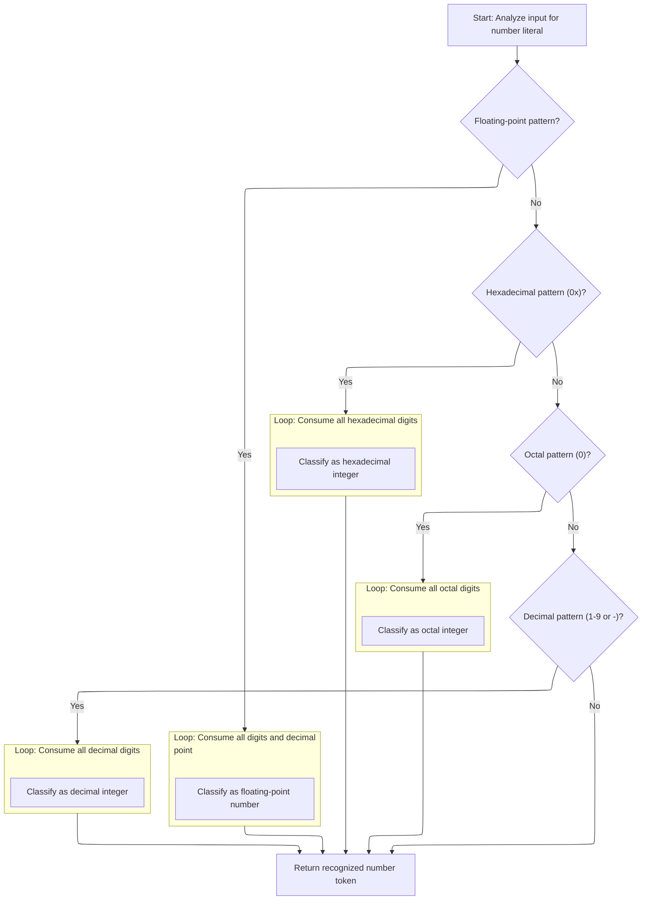

<SwmSnippet path="/core/src/main/java/org/apache/struts/validator/validwhen/ValidWhenLexer.java" line="250">

---

In <SwmToken path="core/src/main/java/org/apache/struts/validator/validwhen/ValidWhenLexer.java" pos="250:7:7" line-data="	public final void mDECIMAL_LITERAL(boolean _createToken) throws RecognitionException, CharStreamException, TokenStreamException {">`mDECIMAL_LITERAL`</SwmToken>, the lexer checks the input for decimal numbers (with or without fractions), hex (0x...), and octal (0...). It uses lookahead and token sets to figure out which format to match, so it can tokenize any number format used in validation rules.

```java
	public final void mDECIMAL_LITERAL(boolean _createToken) throws RecognitionException, CharStreamException, TokenStreamException {
		int _ttype; Token _token=null; int _begin=text.length();
		_ttype = DECIMAL_LITERAL;
		int _saveIndex;
		
		boolean synPredMatched24 = false;
		if (((_tokenSet_0.member(LA(1))) && (_tokenSet_1.member(LA(2))))) {
			int _m24 = mark();
			synPredMatched24 = true;
			inputState.guessing++;
			try {
				{
				{
				switch ( LA(1)) {
				case '-':
				{
					match('-');
					break;
				}
				case '0':  case '1':  case '2':  case '3':
				case '4':  case '5':  case '6':  case '7':
				case '8':  case '9':
				{
					break;
				}
				default:
				{
					throw new NoViableAltForCharException((char)LA(1), getFilename(), getLine(), getColumn());
				}
				}
				}
				{
				int _cnt22=0;
				_loop22:
				do {
					if (((LA(1) >= '0' && LA(1) <= '9'))) {
						matchRange('0','9');
					}
					else {
						if ( _cnt22>=1 ) { break _loop22; } else {throw new NoViableAltForCharException((char)LA(1), getFilename(), getLine(), getColumn());}
					}
					
					_cnt22++;
				} while (true);
```

---

</SwmSnippet>

<SwmSnippet path="/core/src/main/java/org/apache/struts/validator/validwhen/ValidWhenLexer.java" line="296">

---

After matching the digits, the lexer looks for a '.' to confirm it's parsing a decimal with a fractional part. This is the transition from integer to floating-point parsing.

```java
				match('.');
				}
				}
			}
			catch (RecognitionException pe) {
				synPredMatched24 = false;
			}
			rewind(_m24);
inputState.guessing--;
		}
		if ( synPredMatched24 ) {
			{
			{
			switch ( LA(1)) {
			case '-':
			{
				match('-');
				break;
			}
			case '0':  case '1':  case '2':  case '3':
			case '4':  case '5':  case '6':  case '7':
			case '8':  case '9':
			{
				break;
			}
			default:
			{
				throw new NoViableAltForCharException((char)LA(1), getFilename(), getLine(), getColumn());
			}
			}
			}
			{
			int _cnt28=0;
			_loop28:
			do {
				if (((LA(1) >= '0' && LA(1) <= '9'))) {
					matchRange('0','9');
				}
				else {
					if ( _cnt28>=1 ) { break _loop28; } else {throw new NoViableAltForCharException((char)LA(1), getFilename(), getLine(), getColumn());}
				}
				
				_cnt28++;
			} while (true);
```

---

</SwmSnippet>

<SwmSnippet path="/core/src/main/java/org/apache/struts/validator/validwhen/ValidWhenLexer.java" line="342">

---

After matching the '.', the lexer loops to ensure there's at least one digit after the decimal point, finalizing the floating-point literal before moving on to check for other number formats.

```java
			match('.');
			}
			{
			int _cnt31=0;
			_loop31:
			do {
				if (((LA(1) >= '0' && LA(1) <= '9'))) {
					matchRange('0','9');
				}
				else {
					if ( _cnt31>=1 ) { break _loop31; } else {throw new NoViableAltForCharException((char)LA(1), getFilename(), getLine(), getColumn());}
				}
				
				_cnt31++;
			} while (true);
```

---

</SwmSnippet>

<SwmSnippet path="/core/src/main/java/org/apache/struts/validator/validwhen/ValidWhenLexer.java" line="361">

---

After handling decimals, the lexer checks for a '0x' prefix to see if the input is a hexadecimal literal. If so, it matches the hex digits; otherwise, it falls through to check for octal or decimal formats.

```java
			boolean synPredMatched38 = false;
			if (((LA(1)=='0') && (LA(2)=='x'))) {
				int _m38 = mark();
				synPredMatched38 = true;
				inputState.guessing++;
				try {
					{
					match('0');
					match('x');
					}
				}
				catch (RecognitionException pe) {
					synPredMatched38 = false;
				}
				rewind(_m38);
inputState.guessing--;
			}
			if ( synPredMatched38 ) {
				{
				match('0');
				match('x');
				{
				int _cnt41=0;
				_loop41:
				do {
					switch ( LA(1)) {
					case '0':  case '1':  case '2':  case '3':
					case '4':  case '5':  case '6':  case '7':
					case '8':  case '9':
					{
						matchRange('0','9');
						break;
					}
					case 'a':  case 'b':  case 'c':  case 'd':
					case 'e':  case 'f':
					{
						matchRange('a','f');
						break;
					}
					default:
					{
						if ( _cnt41>=1 ) { break _loop41; } else {throw new NoViableAltForCharException((char)LA(1), getFilename(), getLine(), getColumn());}
					}
					}
					_cnt41++;
				} while (true);
```

---

</SwmSnippet>

<SwmSnippet path="/core/src/main/java/org/apache/struts/validator/validwhen/ValidWhenLexer.java" line="409">

---

After matching a valid hex literal, the lexer sets the token type to <SwmToken path="core/src/main/java/org/apache/struts/validator/validwhen/ValidWhenLexer.java" pos="410:5:5" line-data="					_ttype = HEX_INT_LITERAL;">`HEX_INT_LITERAL`</SwmToken>. If it's not hex, it checks for octal (leading '0') or falls through to decimal integer parsing.

```java
				if ( inputState.guessing==0 ) {
					_ttype = HEX_INT_LITERAL;
				}
			}
			else {
				boolean synPredMatched33 = false;
				if (((LA(1)=='0') && (true))) {
					int _m33 = mark();
					synPredMatched33 = true;
					inputState.guessing++;
					try {
						{
						match('0');
						}
					}
					catch (RecognitionException pe) {
						synPredMatched33 = false;
					}
					rewind(_m33);
inputState.guessing--;
				}
				if ( synPredMatched33 ) {
					{
					match('0');
					{
					_loop36:
					do {
						if (((LA(1) >= '0' && LA(1) <= '7'))) {
							matchRange('0','7');
						}
						else {
							break _loop36;
						}
						
					} while (true);
```

---

</SwmSnippet>

<SwmSnippet path="/core/src/main/java/org/apache/struts/validator/validwhen/ValidWhenLexer.java" line="446">

---

After hex, the lexer checks for a single '0' to see if it's an octal literal. If not, it falls through to handle regular decimal integers. This keeps the number parsing logic complete before passing control to the next matcher.

```java
					if ( inputState.guessing==0 ) {
						_ttype = OCTAL_INT_LITERAL;
					}
				}
				else if ((_tokenSet_2.member(LA(1))) && (true)) {
					{
					{
					switch ( LA(1)) {
					case '-':
					{
						match('-');
						break;
					}
					case '1':  case '2':  case '3':  case '4':
					case '5':  case '6':  case '7':  case '8':
					case '9':
					{
						break;
					}
```

---

</SwmSnippet>

<SwmSnippet path="/core/src/main/java/org/apache/struts/validator/validwhen/ValidWhenLexer.java" line="465">

---

After returning from ActionConfigMatcher, the lexer in <SwmToken path="core/src/main/java/org/apache/struts/validator/validwhen/ValidWhenLexer.java" pos="95:1:1" line-data="					mDECIMAL_LITERAL(true);">`mDECIMAL_LITERAL`</SwmToken> expects a decimal integer (starting with 1-9) if the input wasn't octal or hex. This ensures only valid decimal numbers are tokenized here.

```java
					default:
					{
						throw new NoViableAltForCharException((char)LA(1), getFilename(), getLine(), getColumn());
					}
					}
					}
					{
					matchRange('1','9');
					}
					{
					_loop46:
					do {
						if (((LA(1) >= '0' && LA(1) <= '9'))) {
							matchRange('0','9');
						}
						else {
							break _loop46;
						}
						
					} while (true);
```

---

</SwmSnippet>

<SwmSnippet path="/core/src/main/java/org/apache/struts/validator/validwhen/ValidWhenLexer.java" line="487">

---

After all the number parsing logic, <SwmToken path="core/src/main/java/org/apache/struts/validator/validwhen/ValidWhenLexer.java" pos="95:1:1" line-data="					mDECIMAL_LITERAL(true);">`mDECIMAL_LITERAL`</SwmToken> creates and returns a token for the matched number, with the right type set. This token is then used by the parser for further validation expression processing.

```java
					if ( inputState.guessing==0 ) {
						_ttype = DEC_INT_LITERAL;
					}
				}
				else {
					throw new NoViableAltForCharException((char)LA(1), getFilename(), getLine(), getColumn());
				}
				}}
				if ( _createToken && _token==null && _ttype!=Token.SKIP ) {
					_token = makeToken(_ttype);
					_token.setText(new String(text.getBuffer(), _begin, text.length()-_begin));
				}
				_returnToken = _token;
			}
```

---

</SwmSnippet>

### Handling String Literals

<SwmSnippet path="/core/src/main/java/org/apache/struts/validator/validwhen/ValidWhenLexer.java" line="99">

---

We just returned from parsing numbers in `ValidWhenLexer.nextToken`, and now the code checks for quotes to call <SwmToken path="core/src/main/java/org/apache/struts/validator/validwhen/ValidWhenLexer.java" pos="101:1:1" line-data="					mSTRING_LITERAL(true);">`mSTRING_LITERAL`</SwmToken>. This is where the lexer processes string tokens, which are also common in validation rules.

```java
				case '"':  case '\'':
				{
					mSTRING_LITERAL(true);
					theRetToken=_returnToken;
					break;
				}
```

---

</SwmSnippet>

### Parsing String Literals

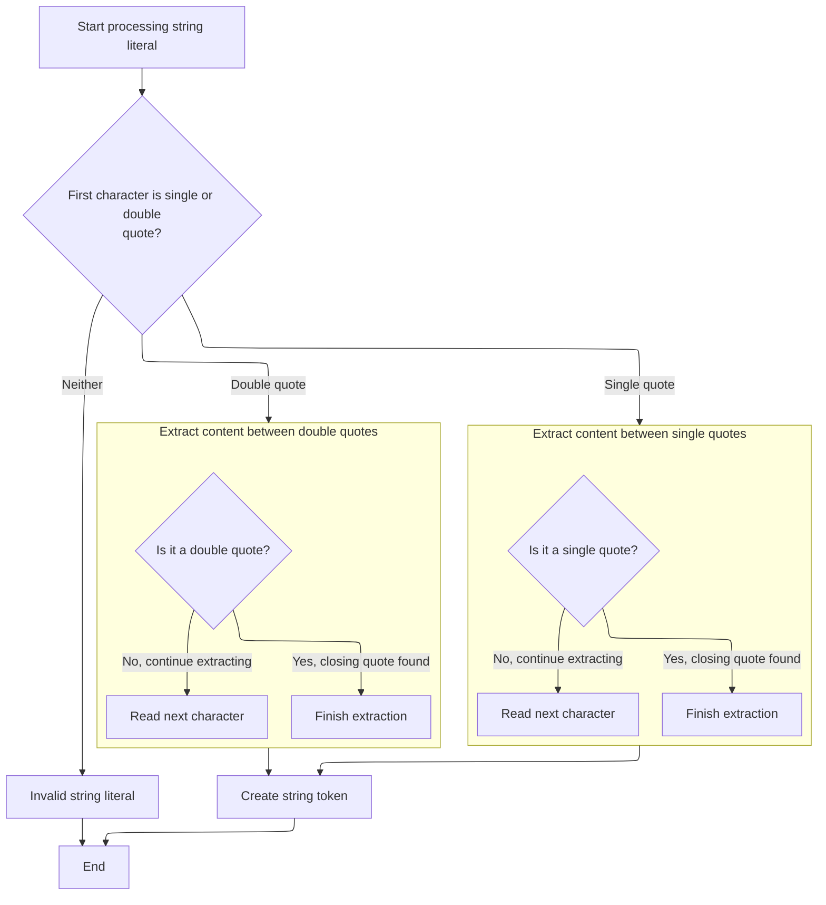

<SwmSnippet path="/core/src/main/java/org/apache/struts/validator/validwhen/ValidWhenLexer.java" line="502">

---

In <SwmToken path="core/src/main/java/org/apache/struts/validator/validwhen/ValidWhenLexer.java" pos="502:7:7" line-data="	public final void mSTRING_LITERAL(boolean _createToken) throws RecognitionException, CharStreamException, TokenStreamException {">`mSTRING_LITERAL`</SwmToken>, the lexer checks if the input starts with a single or double quote, then loops through the allowed characters (using token sets) until it finds the closing quote. This ensures only valid string contents are tokenized.

```java
	public final void mSTRING_LITERAL(boolean _createToken) throws RecognitionException, CharStreamException, TokenStreamException {
		int _ttype; Token _token=null; int _begin=text.length();
		_ttype = STRING_LITERAL;
		int _saveIndex;
		
		switch ( LA(1)) {
		case '\'':
		{
			{
			match('\'');
			{
			int _cnt50=0;
			_loop50:
			do {
				if ((_tokenSet_3.member(LA(1)))) {
					matchNot('\'');
				}
				else {
					if ( _cnt50>=1 ) { break _loop50; } else {throw new NoViableAltForCharException((char)LA(1), getFilename(), getLine(), getColumn());}
				}
				
				_cnt50++;
			} while (true);
```

---

</SwmSnippet>

<SwmSnippet path="/core/src/main/java/org/apache/struts/validator/validwhen/ValidWhenLexer.java" line="526">

---

After matching the opening quote, the lexer loops through the allowed characters (using the token set for single or double quotes) until it finds the closing quote. This ensures only valid string contents are accepted before moving on.

```java
			match('\'');
			}
			break;
		}
		case '"':
		{
			{
			match('\"');
			{
			int _cnt53=0;
			_loop53:
			do {
				if ((_tokenSet_4.member(LA(1)))) {
					matchNot('\"');
				}
				else {
					if ( _cnt53>=1 ) { break _loop53; } else {throw new NoViableAltForCharException((char)LA(1), getFilename(), getLine(), getColumn());}
				}
				
				_cnt53++;
			} while (true);
```

---

</SwmSnippet>

<SwmSnippet path="/core/src/main/java/org/apache/struts/validator/validwhen/ValidWhenLexer.java" line="548">

---

After looping through the string, the lexer checks for the closing quote. If it's not found, or the input isn't at a quote, it throws an exception. This prevents invalid or unterminated strings from being accepted before passing control to the next matcher.

```java
			match('\"');
			}
			break;
		}
		default:
		{
			throw new NoViableAltForCharException((char)LA(1), getFilename(), getLine(), getColumn());
		}
		}
```

---

</SwmSnippet>

<SwmSnippet path="/core/src/main/java/org/apache/struts/validator/validwhen/ValidWhenLexer.java" line="557">

---

After returning from ActionConfigMatcher, the lexer in <SwmToken path="core/src/main/java/org/apache/struts/validator/validwhen/ValidWhenLexer.java" pos="101:1:1" line-data="					mSTRING_LITERAL(true);">`mSTRING_LITERAL`</SwmToken> creates and returns a token for the matched string if everything checks out. This token is then available for the parser to use in validation expressions.

```java
		if ( _createToken && _token==null && _ttype!=Token.SKIP ) {
			_token = makeToken(_ttype);
			_token.setText(new String(text.getBuffer(), _begin, text.length()-_begin));
		}
		_returnToken = _token;
	}
```

---

</SwmSnippet>

### Handling Bracket Tokens

<SwmSnippet path="/core/src/main/java/org/apache/struts/validator/validwhen/ValidWhenLexer.java" line="105">

---

We just returned from parsing string literals in `ValidWhenLexer.nextToken`, and now the code checks for '\[' to call <SwmToken path="core/src/main/java/org/apache/struts/validator/validwhen/ValidWhenLexer.java" pos="107:1:1" line-data="					mLBRACKET(true);">`mLBRACKET`</SwmToken>. This is where the lexer handles bracket tokens, which are important for grouping or indexing in expressions.

```java
				case '[':
				{
					mLBRACKET(true);
					theRetToken=_returnToken;
					break;
				}
```

---

</SwmSnippet>

### Parsing Left Bracket

```mermaid
%%{init: {"flowchart": {"defaultRenderer": "elk"}} }%%
flowchart TD
    node1[Recognize '[' character in input] --> node2{"Create token? (_createToken && no token
exists && not SKIP)"}
    click node1 openCode "core/src/main/java/org/apache/struts/validator/validwhen/ValidWhenLexer.java:569:569"
    node2 -->|"Yes"| node3[Create token for '[' and set its text]
    click node2 openCode "core/src/main/java/org/apache/struts/validator/validwhen/ValidWhenLexer.java:570:573"
    node2 -->|"No"| node4["Proceed without creating token"]
    click node4 openCode "core/src/main/java/org/apache/struts/validator/validwhen/ValidWhenLexer.java:570:573"
    node3 --> node5["Return token (or null)"]
    click node3 openCode "core/src/main/java/org/apache/struts/validator/validwhen/ValidWhenLexer.java:571:573"
    node4 --> node5
    click node5 openCode "core/src/main/java/org/apache/struts/validator/validwhen/ValidWhenLexer.java:574:575"

classDef HeadingStyle fill:#777777,stroke:#333,stroke-width:2px;

%% Swimm:
%% %%{init: {"flowchart": {"defaultRenderer": "elk"}} }%%
%% flowchart TD
%%     node1[Recognize '[' character in input] --> node2{"Create token? (<SwmToken path="core/src/main/java/org/apache/struts/validator/validwhen/ValidWhenLexer.java" pos="250:11:11" line-data="	public final void mDECIMAL_LITERAL(boolean _createToken) throws RecognitionException, CharStreamException, TokenStreamException {">`_createToken`</SwmToken> && no token
%% exists && not SKIP)"}
%%     click node1 openCode "<SwmPath>[core/…/validwhen/ValidWhenLexer.java](core/src/main/java/org/apache/struts/validator/validwhen/ValidWhenLexer.java)</SwmPath>:569:569"
%%     node2 -->|"Yes"| node3[Create token for '[' and set its text]
%%     click node2 openCode "<SwmPath>[core/…/validwhen/ValidWhenLexer.java](core/src/main/java/org/apache/struts/validator/validwhen/ValidWhenLexer.java)</SwmPath>:570:573"
%%     node2 -->|"No"| node4["Proceed without creating token"]
%%     click node4 openCode "<SwmPath>[core/…/validwhen/ValidWhenLexer.java](core/src/main/java/org/apache/struts/validator/validwhen/ValidWhenLexer.java)</SwmPath>:570:573"
%%     node3 --> node5["Return token (or null)"]
%%     click node3 openCode "<SwmPath>[core/…/validwhen/ValidWhenLexer.java](core/src/main/java/org/apache/struts/validator/validwhen/ValidWhenLexer.java)</SwmPath>:571:573"
%%     node4 --> node5
%%     click node5 openCode "<SwmPath>[core/…/validwhen/ValidWhenLexer.java](core/src/main/java/org/apache/struts/validator/validwhen/ValidWhenLexer.java)</SwmPath>:574:575"
%% 
%% classDef HeadingStyle fill:#777777,stroke:#333,stroke-width:2px;
```

<SwmSnippet path="/core/src/main/java/org/apache/struts/validator/validwhen/ValidWhenLexer.java" line="564">

---

In <SwmToken path="core/src/main/java/org/apache/struts/validator/validwhen/ValidWhenLexer.java" pos="564:7:7" line-data="	public final void mLBRACKET(boolean _createToken) throws RecognitionException, CharStreamException, TokenStreamException {">`mLBRACKET`</SwmToken>, the lexer matches the '\[' character and sets up the token. This is a direct mapping so the parser can recognize the start of a bracketed section before passing control to the next matcher.

```java
	public final void mLBRACKET(boolean _createToken) throws RecognitionException, CharStreamException, TokenStreamException {
		int _ttype; Token _token=null; int _begin=text.length();
		_ttype = LBRACKET;
		int _saveIndex;
		
		match('[');
```

---

</SwmSnippet>

<SwmSnippet path="/core/src/main/java/org/apache/struts/validator/validwhen/ValidWhenLexer.java" line="570">

---

After returning from ActionConfigMatcher, the lexer in <SwmToken path="core/src/main/java/org/apache/struts/validator/validwhen/ValidWhenLexer.java" pos="107:1:1" line-data="					mLBRACKET(true);">`mLBRACKET`</SwmToken> creates and returns a token for the left bracket if matched. This token is then available for the parser to process grouping or array access.

```java
		if ( _createToken && _token==null && _ttype!=Token.SKIP ) {
			_token = makeToken(_ttype);
			_token.setText(new String(text.getBuffer(), _begin, text.length()-_begin));
		}
		_returnToken = _token;
	}
```

---

</SwmSnippet>

### Handling Right Bracket Tokens

<SwmSnippet path="/core/src/main/java/org/apache/struts/validator/validwhen/ValidWhenLexer.java" line="111">

---

We just returned from parsing a left bracket in `ValidWhenLexer.nextToken`, and now the code checks for '\]' to call <SwmToken path="core/src/main/java/org/apache/struts/validator/validwhen/ValidWhenLexer.java" pos="113:1:1" line-data="					mRBRACKET(true);">`mRBRACKET`</SwmToken>. This is where the lexer handles right bracket tokens, closing bracketed sections in the input.

```java
				case ']':
				{
					mRBRACKET(true);
					theRetToken=_returnToken;
					break;
				}
```

---

</SwmSnippet>

### Parsing Right Bracket

<SwmSnippet path="/core/src/main/java/org/apache/struts/validator/validwhen/ValidWhenLexer.java" line="577">

---

In <SwmToken path="core/src/main/java/org/apache/struts/validator/validwhen/ValidWhenLexer.java" pos="577:7:7" line-data="	public final void mRBRACKET(boolean _createToken) throws RecognitionException, CharStreamException, TokenStreamException {">`mRBRACKET`</SwmToken>, the lexer matches the '\]' character and sets up the token. This is a direct mapping so the parser can recognize the end of a bracketed section before passing control to the next matcher.

```java
	public final void mRBRACKET(boolean _createToken) throws RecognitionException, CharStreamException, TokenStreamException {
		int _ttype; Token _token=null; int _begin=text.length();
		_ttype = RBRACKET;
		int _saveIndex;
		
		match(']');
```

---

</SwmSnippet>

<SwmSnippet path="/core/src/main/java/org/apache/struts/validator/validwhen/ValidWhenLexer.java" line="583">

---

After returning from ActionConfigMatcher, the lexer in <SwmToken path="core/src/main/java/org/apache/struts/validator/validwhen/ValidWhenLexer.java" pos="113:1:1" line-data="					mRBRACKET(true);">`mRBRACKET`</SwmToken> creates and returns a token for the right bracket if matched. This token is then available for the parser to process the end of grouping or array access.

```java
		if ( _createToken && _token==null && _ttype!=Token.SKIP ) {
			_token = makeToken(_ttype);
			_token.setText(new String(text.getBuffer(), _begin, text.length()-_begin));
		}
		_returnToken = _token;
	}
```

---

</SwmSnippet>

### Handling Parenthesis Tokens

<SwmSnippet path="/core/src/main/java/org/apache/struts/validator/validwhen/ValidWhenLexer.java" line="117">

---

We just returned from parsing a right bracket in `ValidWhenLexer.nextToken`, and now the code checks for '(' to call <SwmToken path="core/src/main/java/org/apache/struts/validator/validwhen/ValidWhenLexer.java" pos="119:1:1" line-data="					mLPAREN(true);">`mLPAREN`</SwmToken>. This is where the lexer handles left parenthesis tokens, which are used for grouping in expressions.

```java
				case '(':
				{
					mLPAREN(true);
					theRetToken=_returnToken;
					break;
				}
```

---

</SwmSnippet>

### Parsing Left Parenthesis

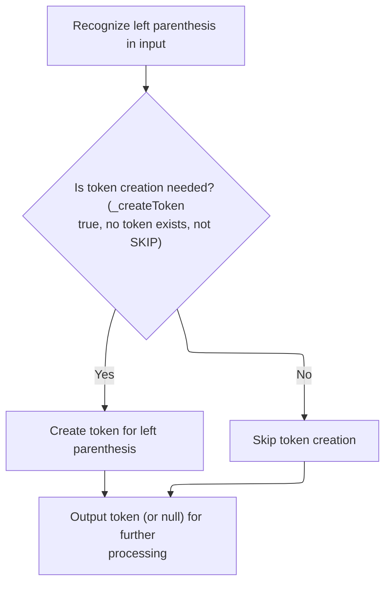

<SwmSnippet path="/core/src/main/java/org/apache/struts/validator/validwhen/ValidWhenLexer.java" line="590">

---

In <SwmToken path="core/src/main/java/org/apache/struts/validator/validwhen/ValidWhenLexer.java" pos="590:7:7" line-data="	public final void mLPAREN(boolean _createToken) throws RecognitionException, CharStreamException, TokenStreamException {">`mLPAREN`</SwmToken>, the lexer matches the '(' character and sets up the token. This is a direct mapping so the parser can recognize the start of a grouped expression before passing control to the next matcher.

```java
	public final void mLPAREN(boolean _createToken) throws RecognitionException, CharStreamException, TokenStreamException {
		int _ttype; Token _token=null; int _begin=text.length();
		_ttype = LPAREN;
		int _saveIndex;
		
		match('(');
```

---

</SwmSnippet>

<SwmSnippet path="/core/src/main/java/org/apache/struts/validator/validwhen/ValidWhenLexer.java" line="596">

---

After returning from ActionConfigMatcher, the lexer in <SwmToken path="core/src/main/java/org/apache/struts/validator/validwhen/ValidWhenLexer.java" pos="119:1:1" line-data="					mLPAREN(true);">`mLPAREN`</SwmToken> creates and returns a token for the left parenthesis if matched. This token is then available for the parser to process the start of a grouped expression.

```java
		if ( _createToken && _token==null && _ttype!=Token.SKIP ) {
			_token = makeToken(_ttype);
			_token.setText(new String(text.getBuffer(), _begin, text.length()-_begin));
		}
		_returnToken = _token;
	}
```

---

</SwmSnippet>

### Processing Right Parenthesis Tokens

<SwmSnippet path="/core/src/main/java/org/apache/struts/validator/validwhen/ValidWhenLexer.java" line="123">

---

Here, after returning from `ValidWhenLexer.mLPAREN`, the code checks for ')' and calls `ValidWhenLexer.mRPAREN`. This step is needed so the lexer can recognize the end of a grouped expression and return the right token for the parser to process next.

```java
				case ')':
				{
					mRPAREN(true);
					theRetToken=_returnToken;
					break;
				}
```

---

</SwmSnippet>

### Matching Right Parenthesis

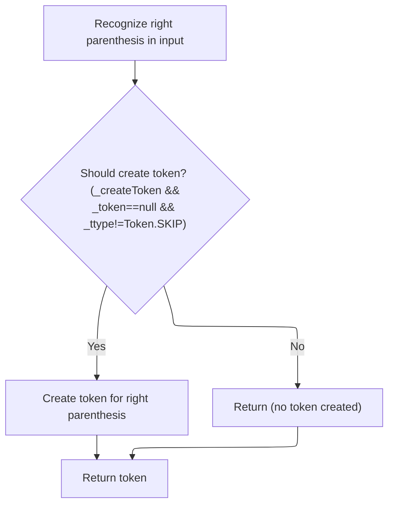

<SwmSnippet path="/core/src/main/java/org/apache/struts/validator/validwhen/ValidWhenLexer.java" line="603">

---

In <SwmToken path="core/src/main/java/org/apache/struts/validator/validwhen/ValidWhenLexer.java" pos="603:7:7" line-data="	public final void mRPAREN(boolean _createToken) throws RecognitionException, CharStreamException, TokenStreamException {">`mRPAREN`</SwmToken>, the lexer matches the ')' character and sets up the token type. This is needed so the parser can recognize the end of a parenthesis group and move on to the next part of the expression.

```java
	public final void mRPAREN(boolean _createToken) throws RecognitionException, CharStreamException, TokenStreamException {
		int _ttype; Token _token=null; int _begin=text.length();
		_ttype = RPAREN;
		int _saveIndex;
		
		match(')');
```

---

</SwmSnippet>

<SwmSnippet path="/core/src/main/java/org/apache/struts/validator/validwhen/ValidWhenLexer.java" line="609">

---

After returning from `ActionConfigMatcher`, the end of `ValidWhenLexer.mRPAREN` checks if a token should be created and not skipped, then sets the token text. This ensures the right parenthesis token is available for the parser.

```java
		if ( _createToken && _token==null && _ttype!=Token.SKIP ) {
			_token = makeToken(_ttype);
			_token.setText(new String(text.getBuffer(), _begin, text.length()-_begin));
		}
		_returnToken = _token;
	}
```

---

</SwmSnippet>

### Processing Special Keyword Tokens

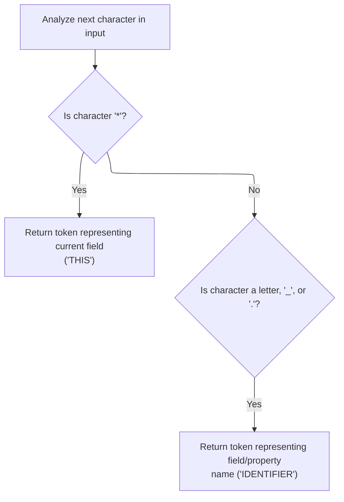

<SwmSnippet path="/core/src/main/java/org/apache/struts/validator/validwhen/ValidWhenLexer.java" line="129">

---

After returning from `ValidWhenLexer.mRPAREN`, the code checks for '\*' and calls `ValidWhenLexer.mTHIS`. This is needed to handle the 'this' keyword in validation expressions, so the lexer can tokenize it for the parser.

```java
				case '*':
				{
					mTHIS(true);
					theRetToken=_returnToken;
					break;
				}
				case '.':  case '_':  case 'a':  case 'b':
				case 'c':  case 'd':  case 'e':  case 'f':
				case 'g':  case 'h':  case 'i':  case 'j':
				case 'k':  case 'l':  case 'm':  case 'n':
				case 'o':  case 'p':  case 'q':  case 'r':
				case 's':  case 't':  case 'u':  case 'v':
```

---

</SwmSnippet>

### Matching the 'this' Keyword

<SwmSnippet path="/core/src/main/java/org/apache/struts/validator/validwhen/ValidWhenLexer.java" line="616">

---

In <SwmToken path="core/src/main/java/org/apache/struts/validator/validwhen/ValidWhenLexer.java" pos="616:7:7" line-data="	public final void mTHIS(boolean _createToken) throws RecognitionException, CharStreamException, TokenStreamException {">`mTHIS`</SwmToken>, the lexer matches the exact string '*this*' and sets the token type. This is needed so the parser can recognize the 'this' keyword and process it in validation expressions.

```java
	public final void mTHIS(boolean _createToken) throws RecognitionException, CharStreamException, TokenStreamException {
		int _ttype; Token _token=null; int _begin=text.length();
		_ttype = THIS;
		int _saveIndex;
		
		match("*this*");
```

---

</SwmSnippet>

<SwmSnippet path="/core/src/main/java/org/apache/struts/validator/validwhen/ValidWhenLexer.java" line="622">

---

After returning from `ActionConfigMatcher`, the end of `ValidWhenLexer.mTHIS` checks if a token should be created and not skipped, then sets the token text. This makes sure the 'this' keyword token is ready for the parser.

```java
		if ( _createToken && _token==null && _ttype!=Token.SKIP ) {
			_token = makeToken(_ttype);
			_token.setText(new String(text.getBuffer(), _begin, text.length()-_begin));
		}
		_returnToken = _token;
	}
```

---

</SwmSnippet>

### Processing Identifier Tokens

<SwmSnippet path="/core/src/main/java/org/apache/struts/validator/validwhen/ValidWhenLexer.java" line="141">

---

After returning from `ValidWhenLexer.mTHIS`, the code checks for alphabetic characters and calls `ValidWhenLexer.mIDENTIFIER`. This is needed to handle variable names and references in validation rules, so the lexer can tokenize them for the parser.

```java
				case 'w':  case 'x':  case 'y':  case 'z':
				{
					mIDENTIFIER(true);
					theRetToken=_returnToken;
					break;
				}
```

---

</SwmSnippet>

### Matching Identifiers

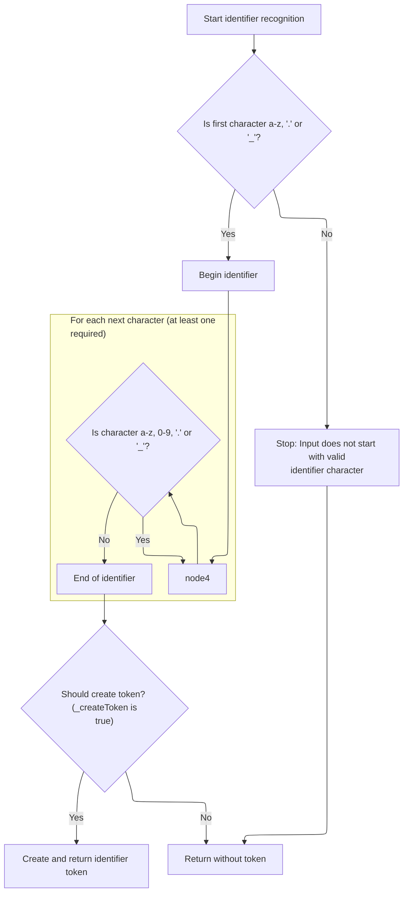

<SwmSnippet path="/core/src/main/java/org/apache/struts/validator/validwhen/ValidWhenLexer.java" line="629">

---

In <SwmToken path="core/src/main/java/org/apache/struts/validator/validwhen/ValidWhenLexer.java" pos="629:7:7" line-data="	public final void mIDENTIFIER(boolean _createToken) throws RecognitionException, CharStreamException, TokenStreamException {">`mIDENTIFIER`</SwmToken>, the lexer matches alphabetic characters, dots, underscores, and numbers for variable names and property paths. This is needed so the parser can handle identifiers in validation expressions.

```java
	public final void mIDENTIFIER(boolean _createToken) throws RecognitionException, CharStreamException, TokenStreamException {
		int _ttype; Token _token=null; int _begin=text.length();
		_ttype = IDENTIFIER;
		int _saveIndex;
		
		{
		switch ( LA(1)) {
		case 'a':  case 'b':  case 'c':  case 'd':
		case 'e':  case 'f':  case 'g':  case 'h':
		case 'i':  case 'j':  case 'k':  case 'l':
		case 'm':  case 'n':  case 'o':  case 'p':
		case 'q':  case 'r':  case 's':  case 't':
		case 'u':  case 'v':  case 'w':  case 'x':
		case 'y':  case 'z':
		{
			matchRange('a','z');
			break;
		}
		case '.':
		{
			match('.');
			break;
		}
		case '_':
		{
			match('_');
			break;
		}
		default:
		{
			throw new NoViableAltForCharException((char)LA(1), getFilename(), getLine(), getColumn());
		}
		}
		}
		{
		int _cnt62=0;
		_loop62:
		do {
			switch ( LA(1)) {
			case 'a':  case 'b':  case 'c':  case 'd':
			case 'e':  case 'f':  case 'g':  case 'h':
			case 'i':  case 'j':  case 'k':  case 'l':
			case 'm':  case 'n':  case 'o':  case 'p':
			case 'q':  case 'r':  case 's':  case 't':
			case 'u':  case 'v':  case 'w':  case 'x':
			case 'y':  case 'z':
			{
				matchRange('a','z');
				break;
			}
			case '0':  case '1':  case '2':  case '3':
			case '4':  case '5':  case '6':  case '7':
			case '8':  case '9':
			{
				matchRange('0','9');
				break;
			}
			case '.':
			{
				match('.');
				break;
			}
			case '_':
			{
				match('_');
				break;
			}
			default:
			{
				if ( _cnt62>=1 ) { break _loop62; } else {throw new NoViableAltForCharException((char)LA(1), getFilename(), getLine(), getColumn());}
			}
			}
			_cnt62++;
		} while (true);
		}
```

---

</SwmSnippet>

<SwmSnippet path="/core/src/main/java/org/apache/struts/validator/validwhen/ValidWhenLexer.java" line="704">

---

After returning from `ActionConfigMatcher`, the end of `ValidWhenLexer.mIDENTIFIER` checks if a token should be created and not skipped, then sets the token text. This makes sure the identifier token is ready for the parser.

```java
		if ( _createToken && _token==null && _ttype!=Token.SKIP ) {
			_token = makeToken(_ttype);
			_token.setText(new String(text.getBuffer(), _begin, text.length()-_begin));
		}
		_returnToken = _token;
	}
```

---

</SwmSnippet>

### Processing Equality Tokens

<SwmSnippet path="/core/src/main/java/org/apache/struts/validator/validwhen/ValidWhenLexer.java" line="147">

---

After returning from `ValidWhenLexer.mIDENTIFIER`, the code checks for '=' and calls `ValidWhenLexer.mEQUALSIGN`. This is needed to handle comparison operations in validation rules, so the lexer can tokenize them for the parser.

```java
				case '=':
				{
					mEQUALSIGN(true);
					theRetToken=_returnToken;
					break;
				}
```

---

</SwmSnippet>

### Matching Equality Operators

<SwmSnippet path="/core/src/main/java/org/apache/struts/validator/validwhen/ValidWhenLexer.java" line="711">

---

In <SwmToken path="core/src/main/java/org/apache/struts/validator/validwhen/ValidWhenLexer.java" pos="711:7:7" line-data="	public final void mEQUALSIGN(boolean _createToken) throws RecognitionException, CharStreamException, TokenStreamException {">`mEQUALSIGN`</SwmToken>, the lexer matches '==' and sets the token type. This is needed so the parser can recognize equality operators in validation expressions.

```java
	public final void mEQUALSIGN(boolean _createToken) throws RecognitionException, CharStreamException, TokenStreamException {
		int _ttype; Token _token=null; int _begin=text.length();
		_ttype = EQUALSIGN;
		int _saveIndex;
		
		match('=');
		match('=');
```

---

</SwmSnippet>

<SwmSnippet path="/core/src/main/java/org/apache/struts/validator/validwhen/ValidWhenLexer.java" line="718">

---

After returning from `ActionConfigMatcher`, the end of `ValidWhenLexer.mEQUALSIGN` checks if a token should be created and not skipped, then sets the token text. This makes sure the equality operator token is ready for the parser.

```java
		if ( _createToken && _token==null && _ttype!=Token.SKIP ) {
			_token = makeToken(_ttype);
			_token.setText(new String(text.getBuffer(), _begin, text.length()-_begin));
		}
		_returnToken = _token;
	}
```

---

</SwmSnippet>

### Processing Inequality Tokens

<SwmSnippet path="/core/src/main/java/org/apache/struts/validator/validwhen/ValidWhenLexer.java" line="153">

---

After returning from `ValidWhenLexer.mEQUALSIGN`, the code checks for '!' and calls `ValidWhenLexer.mNOTEQUALSIGN`. This is needed to handle inequality operations in validation rules, so the lexer can tokenize them for the parser.

```java
				case '!':
				{
					mNOTEQUALSIGN(true);
					theRetToken=_returnToken;
					break;
				}
```

---

</SwmSnippet>

### Matching Inequality Operators

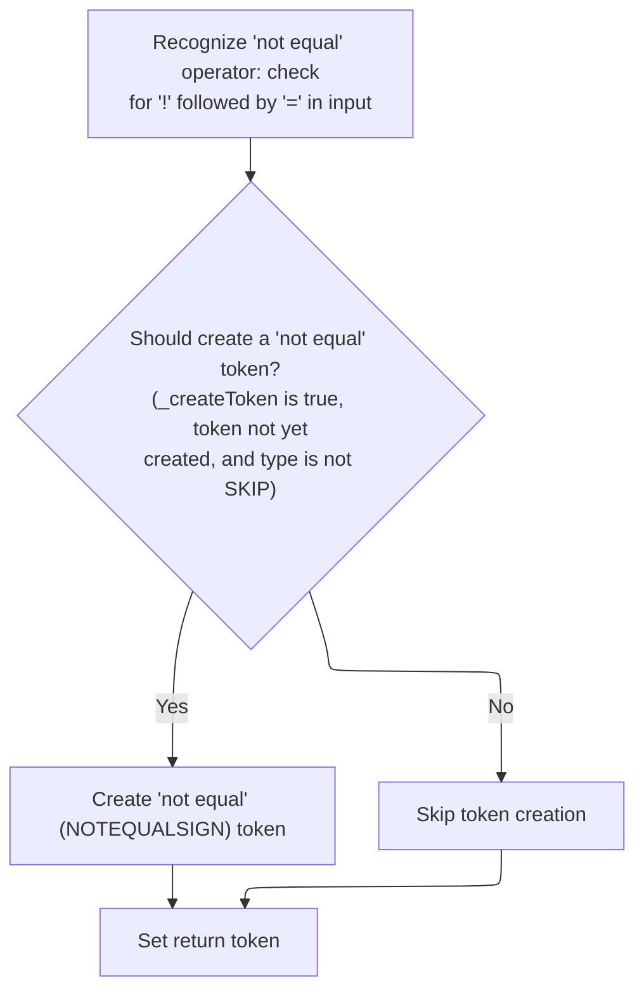

<SwmSnippet path="/core/src/main/java/org/apache/struts/validator/validwhen/ValidWhenLexer.java" line="725">

---

In <SwmToken path="core/src/main/java/org/apache/struts/validator/validwhen/ValidWhenLexer.java" pos="725:7:7" line-data="	public final void mNOTEQUALSIGN(boolean _createToken) throws RecognitionException, CharStreamException, TokenStreamException {">`mNOTEQUALSIGN`</SwmToken>, the lexer matches '!=' and sets the token type. This is needed so the parser can recognize inequality operators in validation expressions.

```java
	public final void mNOTEQUALSIGN(boolean _createToken) throws RecognitionException, CharStreamException, TokenStreamException {
		int _ttype; Token _token=null; int _begin=text.length();
		_ttype = NOTEQUALSIGN;
		int _saveIndex;
		
		match('!');
		match('=');
```

---

</SwmSnippet>

<SwmSnippet path="/core/src/main/java/org/apache/struts/validator/validwhen/ValidWhenLexer.java" line="732">

---

After returning from `ActionConfigMatcher`, the end of `ValidWhenLexer.mNOTEQUALSIGN` checks if a token should be created and not skipped, then sets the token text. This makes sure the inequality operator token is ready for the parser.

```java
		if ( _createToken && _token==null && _ttype!=Token.SKIP ) {
			_token = makeToken(_ttype);
			_token.setText(new String(text.getBuffer(), _begin, text.length()-_begin));
		}
		_returnToken = _token;
	}
```

---

</SwmSnippet>

### Processing Less-Than-Or-Equal Tokens

<SwmSnippet path="/core/src/main/java/org/apache/struts/validator/validwhen/ValidWhenLexer.java" line="159">

---

After returning from `ValidWhenLexer.mNOTEQUALSIGN`, the code checks for '<=' and calls `ValidWhenLexer.mLESSEQUALSIGN`. This is needed to handle less-than-or-equal operations in validation rules, so the lexer can tokenize them for the parser.

```java
				default:
					if ((LA(1)=='<') && (LA(2)=='=')) {
						mLESSEQUALSIGN(true);
```

---

</SwmSnippet>

### Matching Less-Than-Or-Equal Operators

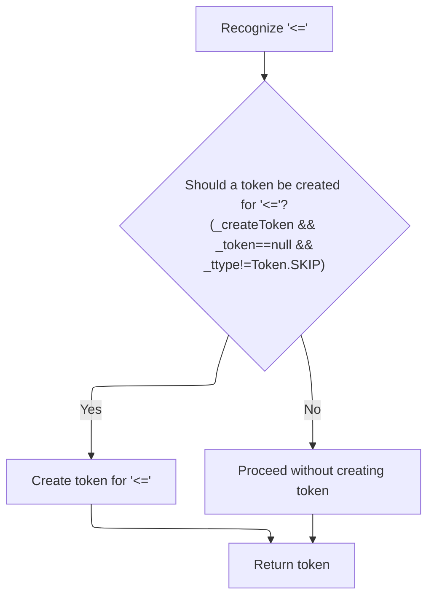

<SwmSnippet path="/core/src/main/java/org/apache/struts/validator/validwhen/ValidWhenLexer.java" line="765">

---

In <SwmToken path="core/src/main/java/org/apache/struts/validator/validwhen/ValidWhenLexer.java" pos="765:7:7" line-data="	public final void mLESSEQUALSIGN(boolean _createToken) throws RecognitionException, CharStreamException, TokenStreamException {">`mLESSEQUALSIGN`</SwmToken>, the lexer matches '<=' and sets the token type. This is needed so the parser can recognize less-than-or-equal operators in validation expressions.

```java
	public final void mLESSEQUALSIGN(boolean _createToken) throws RecognitionException, CharStreamException, TokenStreamException {
		int _ttype; Token _token=null; int _begin=text.length();
		_ttype = LESSEQUALSIGN;
		int _saveIndex;
		
		match('<');
		match('=');
```

---

</SwmSnippet>

<SwmSnippet path="/core/src/main/java/org/apache/struts/validator/validwhen/ValidWhenLexer.java" line="772">

---

After returning from `ActionConfigMatcher`, the end of `ValidWhenLexer.mLESSEQUALSIGN` checks if a token should be created and not skipped, then sets the token text. This makes sure the less-than-or-equal operator token is ready for the parser.

```java
		if ( _createToken && _token==null && _ttype!=Token.SKIP ) {
			_token = makeToken(_ttype);
			_token.setText(new String(text.getBuffer(), _begin, text.length()-_begin));
		}
		_returnToken = _token;
	}
```

---

</SwmSnippet>

### Processing Greater-Than-Or-Equal Tokens

<SwmSnippet path="/core/src/main/java/org/apache/struts/validator/validwhen/ValidWhenLexer.java" line="162">

---

After returning from `ValidWhenLexer.mLESSEQUALSIGN`, the code checks for '>=' and calls `ValidWhenLexer.mGREATEREQUALSIGN`. This is needed to handle greater-than-or-equal operations in validation rules, so the lexer can tokenize them for the parser.

```java
						theRetToken=_returnToken;
					}
					else if ((LA(1)=='>') && (LA(2)=='=')) {
						mGREATEREQUALSIGN(true);
```

---

</SwmSnippet>

### Matching Greater-Than-Or-Equal Operators

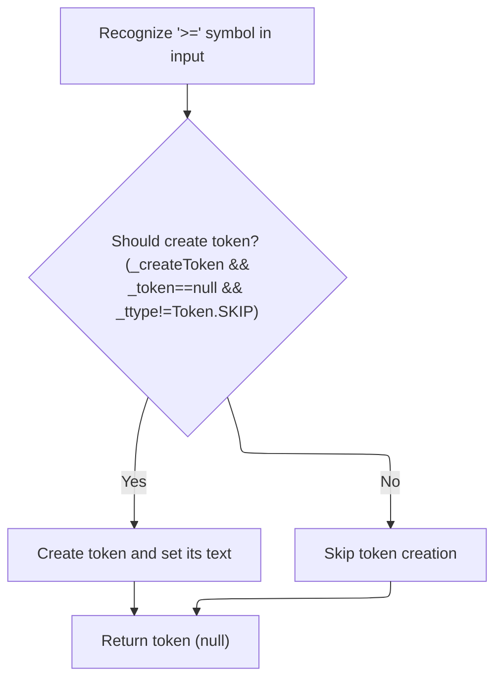

<SwmSnippet path="/core/src/main/java/org/apache/struts/validator/validwhen/ValidWhenLexer.java" line="779">

---

In <SwmToken path="core/src/main/java/org/apache/struts/validator/validwhen/ValidWhenLexer.java" pos="779:7:7" line-data="	public final void mGREATEREQUALSIGN(boolean _createToken) throws RecognitionException, CharStreamException, TokenStreamException {">`mGREATEREQUALSIGN`</SwmToken>, the lexer matches '>=' and sets the token type. This is needed so the parser can recognize greater-than-or-equal operators in validation expressions.

```java
	public final void mGREATEREQUALSIGN(boolean _createToken) throws RecognitionException, CharStreamException, TokenStreamException {
		int _ttype; Token _token=null; int _begin=text.length();
		_ttype = GREATEREQUALSIGN;
		int _saveIndex;
		
		match('>');
		match('=');
```

---

</SwmSnippet>

<SwmSnippet path="/core/src/main/java/org/apache/struts/validator/validwhen/ValidWhenLexer.java" line="786">

---

After returning from `ActionConfigMatcher`, the end of `ValidWhenLexer.mGREATEREQUALSIGN` checks if a token should be created and not skipped, then sets the token text. This makes sure the greater-than-or-equal operator token is ready for the parser.

```java
		if ( _createToken && _token==null && _ttype!=Token.SKIP ) {
			_token = makeToken(_ttype);
			_token.setText(new String(text.getBuffer(), _begin, text.length()-_begin));
		}
		_returnToken = _token;
	}
```

---

</SwmSnippet>

### Processing Less-Than Tokens

<SwmSnippet path="/core/src/main/java/org/apache/struts/validator/validwhen/ValidWhenLexer.java" line="166">

---

After returning from `ValidWhenLexer.mGREATEREQUALSIGN`, the code checks for '<' and calls `ValidWhenLexer.mLESSTHANSIGN`. This is needed to handle less-than operations in validation rules, so the lexer can tokenize them for the parser.

```java
						theRetToken=_returnToken;
					}
					else if ((LA(1)=='<') && (true)) {
						mLESSTHANSIGN(true);
```

---

</SwmSnippet>

### Matching Less-Than Operators

<SwmSnippet path="/core/src/main/java/org/apache/struts/validator/validwhen/ValidWhenLexer.java" line="739">

---

In <SwmToken path="core/src/main/java/org/apache/struts/validator/validwhen/ValidWhenLexer.java" pos="739:7:7" line-data="	public final void mLESSTHANSIGN(boolean _createToken) throws RecognitionException, CharStreamException, TokenStreamException {">`mLESSTHANSIGN`</SwmToken>, the lexer matches '<' and sets the token type. This is needed so the parser can recognize less-than operators in validation expressions.

```java
	public final void mLESSTHANSIGN(boolean _createToken) throws RecognitionException, CharStreamException, TokenStreamException {
		int _ttype; Token _token=null; int _begin=text.length();
		_ttype = LESSTHANSIGN;
		int _saveIndex;
		
		match('<');
```

---

</SwmSnippet>

<SwmSnippet path="/core/src/main/java/org/apache/struts/validator/validwhen/ValidWhenLexer.java" line="745">

---

After returning from `ActionConfigMatcher`, the end of `ValidWhenLexer.mLESSTHANSIGN` checks if a token should be created and not skipped, then sets the token text. This makes sure the less-than operator token is ready for the parser.

```java
		if ( _createToken && _token==null && _ttype!=Token.SKIP ) {
			_token = makeToken(_ttype);
			_token.setText(new String(text.getBuffer(), _begin, text.length()-_begin));
		}
		_returnToken = _token;
	}
```

---

</SwmSnippet>

### Handling Greater-Than and End-of-Input Tokens

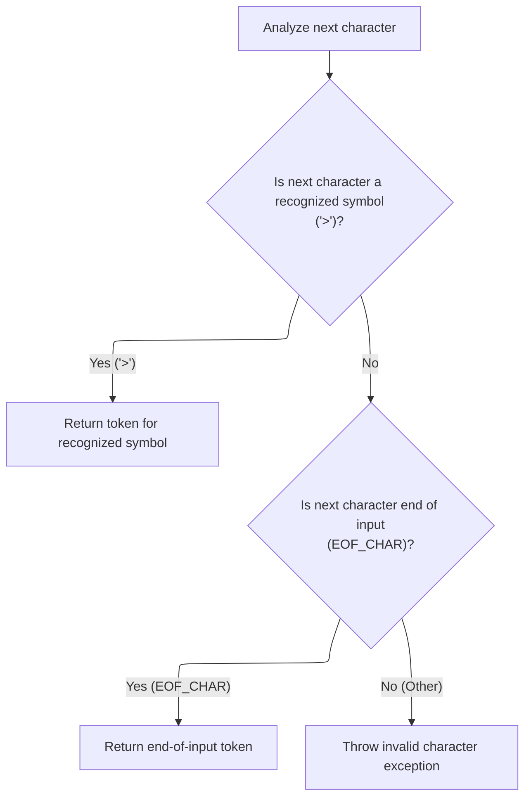

<SwmSnippet path="/core/src/main/java/org/apache/struts/validator/validwhen/ValidWhenLexer.java" line="170">

---

After handling '<', the code in `ValidWhenLexer.nextToken` checks for '>' to call <SwmToken path="core/src/main/java/org/apache/struts/validator/validwhen/ValidWhenLexer.java" pos="173:1:1" line-data="						mGREATERTHANSIGN(true);">`mGREATERTHANSIGN`</SwmToken>, or for EOF to wrap up tokenization. If neither, it throws if the input doesn't match any expected token. This keeps the lexer moving through all possible comparison operators and input endings.

```java
						theRetToken=_returnToken;
					}
					else if ((LA(1)=='>') && (true)) {
						mGREATERTHANSIGN(true);
						theRetToken=_returnToken;
					}
				else {
					if (LA(1)==EOF_CHAR) {uponEOF(); _returnToken = makeToken(Token.EOF_TYPE);}
				else {throw new NoViableAltForCharException((char)LA(1), getFilename(), getLine(), getColumn());}
				}
				}
```

---

</SwmSnippet>

### Matching Greater-Than Operators

<SwmSnippet path="/core/src/main/java/org/apache/struts/validator/validwhen/ValidWhenLexer.java" line="752">

---

In <SwmToken path="core/src/main/java/org/apache/struts/validator/validwhen/ValidWhenLexer.java" pos="752:7:7" line-data="	public final void mGREATERTHANSIGN(boolean _createToken) throws RecognitionException, CharStreamException, TokenStreamException {">`mGREATERTHANSIGN`</SwmToken>, the code matches the '>' character and sets up the token type. After matching, it calls into ActionConfigMatcher to check if the matched text should be treated as a literal or reserved word, which is part of the token classification process.

```java
	public final void mGREATERTHANSIGN(boolean _createToken) throws RecognitionException, CharStreamException, TokenStreamException {
		int _ttype; Token _token=null; int _begin=text.length();
		_ttype = GREATERTHANSIGN;
		int _saveIndex;
		
		match('>');
```

---

</SwmSnippet>

<SwmSnippet path="/core/src/main/java/org/apache/struts/validator/validwhen/ValidWhenLexer.java" line="758">

---

After returning from ActionConfigMatcher, the end of <SwmToken path="core/src/main/java/org/apache/struts/validator/validwhen/ValidWhenLexer.java" pos="173:1:1" line-data="						mGREATERTHANSIGN(true);">`mGREATERTHANSIGN`</SwmToken> checks if a token should be created and not skipped, then sets the token text. This ensures the greater-than operator token is available for the parser.

```java
		if ( _createToken && _token==null && _ttype!=Token.SKIP ) {
			_token = makeToken(_ttype);
			_token.setText(new String(text.getBuffer(), _begin, text.length()-_begin));
		}
		_returnToken = _token;
	}
```

---

</SwmSnippet>

### Finalizing and Returning Tokens

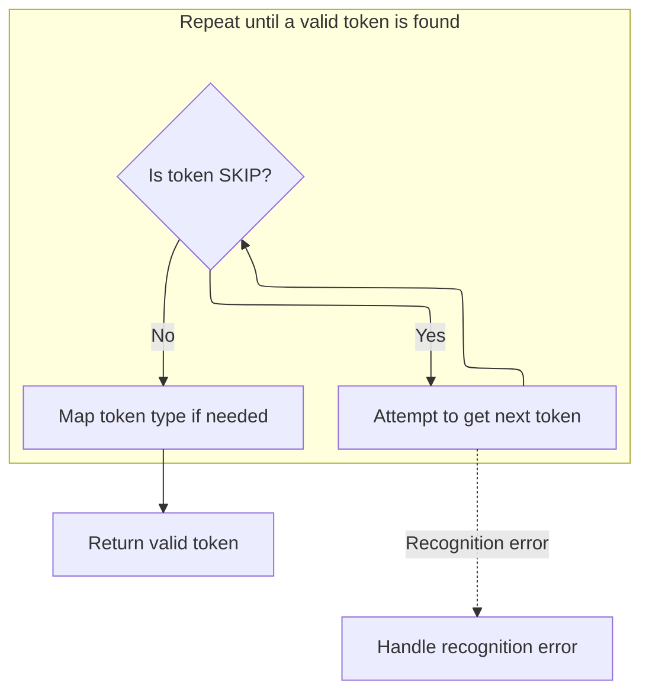

<SwmSnippet path="/core/src/main/java/org/apache/struts/validator/validwhen/ValidWhenLexer.java" line="181">

---

After returning from <SwmToken path="core/src/main/java/org/apache/struts/validator/validwhen/ValidWhenLexer.java" pos="173:1:1" line-data="						mGREATERTHANSIGN(true);">`mGREATERTHANSIGN`</SwmToken>, `ValidWhenLexer.nextToken` finalizes the token, checks for reserved words with <SwmToken path="core/src/main/java/org/apache/struts/validator/validwhen/ValidWhenLexer.java" pos="183:5:5" line-data="				_ttype = testLiteralsTable(_ttype);">`testLiteralsTable`</SwmToken>, and returns the token. If the token is SKIP, it loops again. This wraps up tokenization for the current input and hands off to the parser. The next step involves resolving dynamic property values in JSF components, which is handled in `CommandLinkComponent.getType`.

```java
				if ( _returnToken==null ) continue tryAgain; // found SKIP token
				_ttype = _returnToken.getType();
				_ttype = testLiteralsTable(_ttype);
				_returnToken.setType(_ttype);
				return _returnToken;
			}
			catch (RecognitionException e) {
				throw new TokenStreamRecognitionException(e);
			}
		}
```

---

</SwmSnippet>

<SwmSnippet path="/faces/src/main/java/org/apache/struts/faces/component/CommandLinkComponent.java" line="434">

---

<SwmToken path="faces/src/main/java/org/apache/struts/faces/component/CommandLinkComponent.java" pos="434:5:5" line-data="    public String getType() {">`getType`</SwmToken> first tries to resolve the 'type' property dynamically using JSF's <SwmToken path="faces/src/main/java/org/apache/struts/faces/component/CommandLinkComponent.java" pos="435:1:1" line-data="        ValueBinding vb = getValueBinding(&quot;type&quot;);">`ValueBinding`</SwmToken>. If no binding is present, it falls back to the local 'type' variable. This lets the component support both static and dynamic values for the 'type' property.

```java
    public String getType() {
        ValueBinding vb = getValueBinding("type");
        if (vb != null) {
            return (String) vb.getValue(getFacesContext());
        } else {
            return type;
        }
    }
```

---

</SwmSnippet>

<SwmSnippet path="/core/src/main/java/org/apache/struts/validator/validwhen/ValidWhenLexer.java" line="191">

---

After returning from `CommandLinkComponent.getType`, the end of `ValidWhenLexer.nextToken` wraps up by catching and converting IO and recognition exceptions into token stream exceptions. This standardizes error handling for the parser.

```java
		catch (CharStreamException cse) {
			if ( cse instanceof CharStreamIOException ) {
				throw new TokenStreamIOException(((CharStreamIOException)cse).io);
			}
			else {
				throw new TokenStreamException(cse.getMessage());
			}
		}
	}
}
```

---

</SwmSnippet>

## Building the Final Property Path

<SwmSnippet path="/taglib/src/main/java/org/apache/struts/taglib/nested/NestedPropertyHelper.java" line="290">

---

After returning from `ValidWhenLexer.nextToken`, `NestedPropertyHelper.calculateRelativeProperty` finishes by appending the property to the parent path, handling delimiter differences and removing any trailing dot. This builds the final property path for use in binding or validation.

```java
                result.append(property);

                /* parent reference will have a dot on the end. Leave it off */
                if (result.charAt(result.length() - 1) == '.') {
                    return result.substring(0, result.length() - 1);
                } else {
                    return result.toString();
                }
            }
        }
    }
```

---

</SwmSnippet>

&nbsp;

*This is an auto-generated document by Swimm 🌊 and has not yet been verified by a human*

<SwmMeta version="3.0.0" repo-id="Z2l0aHViJTNBJTNBc3RydXRzMSUzQSUzQVN3aW1tLURlbW8=" repo-name="struts1"><sup>Powered by [Swimm](https://app.swimm.io/)</sup></SwmMeta>
