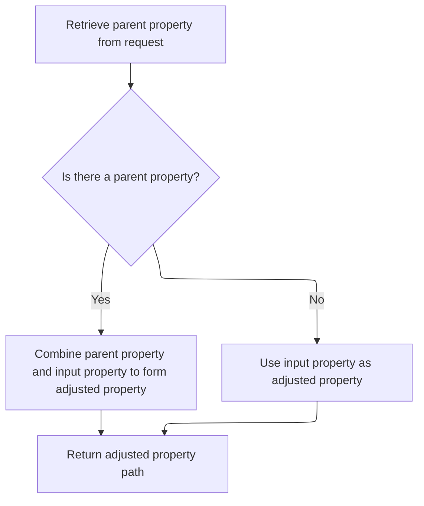

This document explains how tag attributes are resolved to ensure accurate data binding in web forms and links, even when working with nested data structures. The flow determines the correct bean and property references based on the tag's context, supporting complex object graphs in web applications.

# Resolving Nested Link Tag Attributes

```mermaid
%%{init: {"flowchart": {"defaultRenderer": "elk"}} }%%
flowchart TD
    node1["Start tag processing"] --> node2{"Is a bean name provided?"}
    click node1 openCode "taglib/src/main/java/org/apache/struts/taglib/nested/html/NestedLinkTag.java:51:52"
    node2 -->|"Yes"| node3["Use provided bean name (currentName = provided name)"]
    click node2 openCode "taglib/src/main/java/org/apache/struts/taglib/nested/html/NestedLinkTag.java:66:72"
    node2 -->|"No"| node4["Derive bean name from request context (currentName = derived)"]
    click node3 openCode "taglib/src/main/java/org/apache/struts/taglib/nested/html/NestedLinkTag.java:71:72"
    click node4 openCode "taglib/src/main/java/org/apache/struts/taglib/nested/html/NestedLinkTag.java:73:74"
    node3 --> node5["Set bean name for tag"]
    node4 --> node5
    click node5 openCode "taglib/src/main/java/org/apache/struts/taglib/nested/html/NestedLinkTag.java:77:77"
    node5 --> node6{"Is property present and name not provided? (origProperty, !hasName)"}
    click node6 openCode "taglib/src/main/java/org/apache/struts/taglib/nested/html/NestedLinkTag.java:80:83"
    node6 -->|"Yes"| node7["Set property for tag (adjusted property)"]
    node6 -->|"No"| node8
    click node7 openCode "taglib/src/main/java/org/apache/struts/taglib/nested/html/NestedLinkTag.java:81:83"
    node7 --> node8
    node8{"Is param property present? (origParamProperty)"} -->|"Yes"| node9["Set bean name to null, set param name and adjusted param property"]
    node8 -->|"No"| node10
    click node8 openCode "taglib/src/main/java/org/apache/struts/taglib/nested/html/NestedLinkTag.java:86:91"
    click node9 openCode "taglib/src/main/java/org/apache/struts/taglib/nested/html/NestedLinkTag.java:87:90"
    node9 --> node10
    node10["Delegate to parent tag processing"]
    click node10 openCode "taglib/src/main/java/org/apache/struts/taglib/nested/html/NestedLinkTag.java:94:94"

classDef HeadingStyle fill:#777777,stroke:#333,stroke-width:2px;

%% Swimm:
%% %%{init: {"flowchart": {"defaultRenderer": "elk"}} }%%
%% flowchart TD
%%     node1["Start tag processing"] --> node2{"Is a bean name provided?"}
%%     click node1 openCode "<SwmPath>[taglib/…/html/NestedLinkTag.java](taglib/src/main/java/org/apache/struts/taglib/nested/html/NestedLinkTag.java)</SwmPath>:51:52"
%%     node2 -->|"Yes"| node3["Use provided bean name (<SwmToken path="taglib/src/main/java/org/apache/struts/taglib/nested/html/NestedLinkTag.java" pos="68:3:3" line-data="        String currentName;">`currentName`</SwmToken> = provided name)"]
%%     click node2 openCode "<SwmPath>[taglib/…/html/NestedLinkTag.java](taglib/src/main/java/org/apache/struts/taglib/nested/html/NestedLinkTag.java)</SwmPath>:66:72"
%%     node2 -->|"No"| node4["Derive bean name from request context (<SwmToken path="taglib/src/main/java/org/apache/struts/taglib/nested/html/NestedLinkTag.java" pos="68:3:3" line-data="        String currentName;">`currentName`</SwmToken> = derived)"]
%%     click node3 openCode "<SwmPath>[taglib/…/html/NestedLinkTag.java](taglib/src/main/java/org/apache/struts/taglib/nested/html/NestedLinkTag.java)</SwmPath>:71:72"
%%     click node4 openCode "<SwmPath>[taglib/…/html/NestedLinkTag.java](taglib/src/main/java/org/apache/struts/taglib/nested/html/NestedLinkTag.java)</SwmPath>:73:74"
%%     node3 --> node5["Set bean name for tag"]
%%     node4 --> node5
%%     click node5 openCode "<SwmPath>[taglib/…/html/NestedLinkTag.java](taglib/src/main/java/org/apache/struts/taglib/nested/html/NestedLinkTag.java)</SwmPath>:77:77"
%%     node5 --> node6{"Is property present and name not provided? (<SwmToken path="taglib/src/main/java/org/apache/struts/taglib/nested/html/NestedLinkTag.java" pos="53:1:1" line-data="        origProperty = super.getProperty();">`origProperty`</SwmToken>, !<SwmToken path="taglib/src/main/java/org/apache/struts/taglib/nested/html/NestedLinkTag.java" pos="66:3:3" line-data="        boolean hasName =">`hasName`</SwmToken>)"}
%%     click node6 openCode "<SwmPath>[taglib/…/html/NestedLinkTag.java](taglib/src/main/java/org/apache/struts/taglib/nested/html/NestedLinkTag.java)</SwmPath>:80:83"
%%     node6 -->|"Yes"| node7["Set property for tag (adjusted property)"]
%%     node6 -->|"No"| node8
%%     click node7 openCode "<SwmPath>[taglib/…/html/NestedLinkTag.java](taglib/src/main/java/org/apache/struts/taglib/nested/html/NestedLinkTag.java)</SwmPath>:81:83"
%%     node7 --> node8
%%     node8{"Is param property present? (<SwmToken path="taglib/src/main/java/org/apache/struts/taglib/nested/html/NestedLinkTag.java" pos="54:1:1" line-data="        origParamProperty = super.getParamProperty();">`origParamProperty`</SwmToken>)"} -->|"Yes"| node9["Set bean name to null, set param name and adjusted param property"]
%%     node8 -->|"No"| node10
%%     click node8 openCode "<SwmPath>[taglib/…/html/NestedLinkTag.java](taglib/src/main/java/org/apache/struts/taglib/nested/html/NestedLinkTag.java)</SwmPath>:86:91"
%%     click node9 openCode "<SwmPath>[taglib/…/html/NestedLinkTag.java](taglib/src/main/java/org/apache/struts/taglib/nested/html/NestedLinkTag.java)</SwmPath>:87:90"
%%     node9 --> node10
%%     node10["Delegate to parent tag processing"]
%%     click node10 openCode "<SwmPath>[taglib/…/html/NestedLinkTag.java](taglib/src/main/java/org/apache/struts/taglib/nested/html/NestedLinkTag.java)</SwmPath>:94:94"
%% 
%% classDef HeadingStyle fill:#777777,stroke:#333,stroke-width:2px;
```



<SwmSnippet path="/taglib/src/main/java/org/apache/struts/taglib/nested/html/NestedLinkTag.java" line="51">

---

<SwmToken path="taglib/src/main/java/org/apache/struts/taglib/nested/html/NestedLinkTag.java" pos="51:5:5" line-data="    public int doStartTag() throws JspException {">`doStartTag`</SwmToken> kicks off by figuring out which bean and property the tag should reference, based on the current request and tag context. It checks if 'name', 'property', or 'paramProperty' are set, and uses <SwmToken path="taglib/src/main/java/org/apache/struts/taglib/nested/html/NestedLinkTag.java" pos="73:5:5" line-data="            currentName = NestedPropertyHelper.getCurrentName(request, this);">`NestedPropertyHelper`</SwmToken> to resolve or adjust them as needed. This lets the tag work correctly even when beans are nested, so the right values are always targeted. We call <SwmToken path="taglib/src/main/java/org/apache/struts/taglib/nested/html/NestedLinkTag.java" pos="73:5:5" line-data="            currentName = NestedPropertyHelper.getCurrentName(request, this);">`NestedPropertyHelper`</SwmToken> next to handle the property adjustments, since that's where the logic for resolving nested paths lives.

```java
    public int doStartTag() throws JspException {
        origName = super.getName();
        origProperty = super.getProperty();
        origParamProperty = super.getParamProperty();

        /* decide the incoming options. Always two there are */
        boolean doProperty =
            ((origProperty != null) && (origProperty.length() > 0));
        boolean doParam =
            ((origParamProperty != null) && (origParamProperty.length() > 0));

        // request
        HttpServletRequest request =
            (HttpServletRequest) pageContext.getRequest();

        boolean hasName =
            ((getName() != null) && (getName().trim().length() > 0));
        String currentName;

        if (hasName) {
            currentName = getName();
        } else {
            currentName = NestedPropertyHelper.getCurrentName(request, this);
        }

        // set the bean name
        super.setName(currentName);

        // set property details
        if (doProperty && !hasName) {
            super.setProperty(NestedPropertyHelper.getAdjustedProperty(
                    request, origProperty));
        }

        // do the param property details
        if (doParam) {
            super.setName(null);
            super.setParamName(currentName);
            super.setParamProperty(NestedPropertyHelper.getAdjustedProperty(
                    request, origParamProperty));
        }

        /* do the tag */
        return super.doStartTag();
    }
```

---

</SwmSnippet>

# Calculating Relative Property Paths



<SwmSnippet path="/taglib/src/main/java/org/apache/struts/taglib/nested/NestedPropertyHelper.java" line="121">

---

<SwmToken path="taglib/src/main/java/org/apache/struts/taglib/nested/NestedPropertyHelper.java" pos="121:9:9" line-data="    public static final String getAdjustedProperty(HttpServletRequest request,">`getAdjustedProperty`</SwmToken> takes the current request and property, grabs the parent property, and then calls <SwmToken path="taglib/src/main/java/org/apache/struts/taglib/nested/NestedPropertyHelper.java" pos="126:3:3" line-data="        return calculateRelativeProperty(property, parent);">`calculateRelativeProperty`</SwmToken> to figure out the right path. This is needed so the tag can reference the correct property in a nested bean setup, instead of just using whatever was passed in.

```java
    public static final String getAdjustedProperty(HttpServletRequest request,
        String property) {
        // get the old one if any
        String parent = getCurrentProperty(request);

        return calculateRelativeProperty(property, parent);
    }
```

---

</SwmSnippet>

# Resolving Property Path Hierarchy

```mermaid
%%{init: {"flowchart": {"defaultRenderer": "elk"}} }%%
flowchart TD
    node1["Given property and parent paths"] --> node2{"Is property './' or 'this/'?"}
    click node1 openCode "taglib/src/main/java/org/apache/struts/taglib/nested/NestedPropertyHelper.java:232:246"
    node2 -->|"Yes"| node3["Return parent path"]
    click node2 openCode "taglib/src/main/java/org/apache/struts/taglib/nested/NestedPropertyHelper.java:244:246"
    node2 -->|"No"| node4{"Does stepping start with '/'?"}
    click node3 openCode "taglib/src/main/java/org/apache/struts/taglib/nested/NestedPropertyHelper.java:245:246"
    node4 -->|"Yes"| node5["Return property from root"]
    click node4 openCode "taglib/src/main/java/org/apache/struts/taglib/nested/NestedPropertyHelper.java:264:267"
    node4 -->|"No"| node6{"Is stepping depth >= parent depth?"}
    click node5 openCode "taglib/src/main/java/org/apache/struts/taglib/nested/NestedPropertyHelper.java:266:267"
    node6 -->|"Yes"| node7["Return property from root"]
    click node6 openCode "taglib/src/main/java/org/apache/struts/taglib/nested/NestedPropertyHelper.java:276:278"
    node6 -->|"No"| node8["Build property path from parent"]
    click node7 openCode "taglib/src/main/java/org/apache/struts/taglib/nested/NestedPropertyHelper.java:278:279"
    
    subgraph loop1["For each required token in parent path"]
      node8 --> node10["Append token to result"]
      click node10 openCode "taglib/src/main/java/org/apache/struts/taglib/nested/NestedPropertyHelper.java:285:288"
      node10 --> node11["Append property to result"]
      click node11 openCode "taglib/src/main/java/org/apache/struts/taglib/nested/NestedPropertyHelper.java:290:290"
      node11 --> node12{"Does result end with '.'?"}
      click node12 openCode "taglib/src/main/java/org/apache/struts/taglib/nested/NestedPropertyHelper.java:293:294"
      node12 -->|"Yes"| node13["Return result without trailing dot"]
      click node13 openCode "taglib/src/main/java/org/apache/struts/taglib/nested/NestedPropertyHelper.java:294:295"
      node12 -->|"No"| node14["Return result"]
      click node14 openCode "taglib/src/main/java/org/apache/struts/taglib/nested/NestedPropertyHelper.java:296:297"
    end
classDef HeadingStyle fill:#777777,stroke:#333,stroke-width:2px;

%% Swimm:
%% %%{init: {"flowchart": {"defaultRenderer": "elk"}} }%%
%% flowchart TD
%%     node1["Given property and parent paths"] --> node2{"Is property './' or 'this/'?"}
%%     click node1 openCode "<SwmPath>[taglib/…/nested/NestedPropertyHelper.java](taglib/src/main/java/org/apache/struts/taglib/nested/NestedPropertyHelper.java)</SwmPath>:232:246"
%%     node2 -->|"Yes"| node3["Return parent path"]
%%     click node2 openCode "<SwmPath>[taglib/…/nested/NestedPropertyHelper.java](taglib/src/main/java/org/apache/struts/taglib/nested/NestedPropertyHelper.java)</SwmPath>:244:246"
%%     node2 -->|"No"| node4{"Does stepping start with '/'?"}
%%     click node3 openCode "<SwmPath>[taglib/…/nested/NestedPropertyHelper.java](taglib/src/main/java/org/apache/struts/taglib/nested/NestedPropertyHelper.java)</SwmPath>:245:246"
%%     node4 -->|"Yes"| node5["Return property from root"]
%%     click node4 openCode "<SwmPath>[taglib/…/nested/NestedPropertyHelper.java](taglib/src/main/java/org/apache/struts/taglib/nested/NestedPropertyHelper.java)</SwmPath>:264:267"
%%     node4 -->|"No"| node6{"Is stepping depth >= parent depth?"}
%%     click node5 openCode "<SwmPath>[taglib/…/nested/NestedPropertyHelper.java](taglib/src/main/java/org/apache/struts/taglib/nested/NestedPropertyHelper.java)</SwmPath>:266:267"
%%     node6 -->|"Yes"| node7["Return property from root"]
%%     click node6 openCode "<SwmPath>[taglib/…/nested/NestedPropertyHelper.java](taglib/src/main/java/org/apache/struts/taglib/nested/NestedPropertyHelper.java)</SwmPath>:276:278"
%%     node6 -->|"No"| node8["Build property path from parent"]
%%     click node7 openCode "<SwmPath>[taglib/…/nested/NestedPropertyHelper.java](taglib/src/main/java/org/apache/struts/taglib/nested/NestedPropertyHelper.java)</SwmPath>:278:279"
%%     
%%     subgraph loop1["For each required token in parent path"]
%%       node8 --> node10["Append token to result"]
%%       click node10 openCode "<SwmPath>[taglib/…/nested/NestedPropertyHelper.java](taglib/src/main/java/org/apache/struts/taglib/nested/NestedPropertyHelper.java)</SwmPath>:285:288"
%%       node10 --> node11["Append property to result"]
%%       click node11 openCode "<SwmPath>[taglib/…/nested/NestedPropertyHelper.java](taglib/src/main/java/org/apache/struts/taglib/nested/NestedPropertyHelper.java)</SwmPath>:290:290"
%%       node11 --> node12{"Does result end with '.'?"}
%%       click node12 openCode "<SwmPath>[taglib/…/nested/NestedPropertyHelper.java](taglib/src/main/java/org/apache/struts/taglib/nested/NestedPropertyHelper.java)</SwmPath>:293:294"
%%       node12 -->|"Yes"| node13["Return result without trailing dot"]
%%       click node13 openCode "<SwmPath>[taglib/…/nested/NestedPropertyHelper.java](taglib/src/main/java/org/apache/struts/taglib/nested/NestedPropertyHelper.java)</SwmPath>:294:295"
%%       node12 -->|"No"| node14["Return result"]
%%       click node14 openCode "<SwmPath>[taglib/…/nested/NestedPropertyHelper.java](taglib/src/main/java/org/apache/struts/taglib/nested/NestedPropertyHelper.java)</SwmPath>:296:297"
%%     end
%% classDef HeadingStyle fill:#777777,stroke:#333,stroke-width:2px;
```



<SwmSnippet path="/taglib/src/main/java/org/apache/struts/taglib/nested/NestedPropertyHelper.java" line="232">

---

In <SwmToken path="taglib/src/main/java/org/apache/struts/taglib/nested/NestedPropertyHelper.java" pos="232:7:7" line-data="    private static String calculateRelativeProperty(String property,">`calculateRelativeProperty`</SwmToken>, we handle special property values like './' and 'this/' to reference the parent directly. The function splits the property into stepping and property parts, checks for absolute paths, and then figures out how many levels to move up in the parent hierarchy before appending the property. This lets the tag resolve the correct property path for any nesting situation.

```java
    private static String calculateRelativeProperty(String property,
        String parent) {
        if (parent == null) {
            parent = "";
        }

        if (property == null) {
            property = "";
        }

        /* Special case... reference my parent's nested property.
        Otherwise impossible for things like indexed properties */
        if ("./".equals(property) || "this/".equals(property)) {
            return parent;
        }

        /* remove the stepping from the property */
        String stepping;

        /* isolate a parent reference */
        if (property.endsWith("/")) {
            stepping = property;
            property = "";
        } else {
            stepping = property.substring(0, property.lastIndexOf('/') + 1);

            /* isolate the property */
            property =
                property.substring(property.lastIndexOf('/') + 1,
                    property.length());
        }

        if (stepping.startsWith("/")) {
            /* return from root */
            return property;
        } else {
            /* tokenize the nested property */
            StringTokenizer proT = new StringTokenizer(parent, ".");
            int propCount = proT.countTokens();

            /* tokenize the stepping */
            StringTokenizer strT = new StringTokenizer(stepping, "/");
            int count = strT.countTokens();

            if (count >= propCount) {
                /* return from root */
                return property;
            } else {
                /* append the tokens up to the token difference */
                count = propCount - count;

                StringBuffer result = new StringBuffer();

                for (int i = 0; i < count; i++) {
                    result.append(proT.nextToken());
                    result.append('.');
                }
```

---

</SwmSnippet>

<SwmSnippet path="/taglib/src/main/java/org/apache/struts/taglib/nested/NestedPropertyHelper.java" line="290">

---

Finally, the function returns a property path that's either root-relative or adjusted for the current nesting. It combines parent and stepping tokens, removes any trailing dot, and ensures the tag references the right bean property for the current context.

```java
                result.append(property);

                /* parent reference will have a dot on the end. Leave it off */
                if (result.charAt(result.length() - 1) == '.') {
                    return result.substring(0, result.length() - 1);
                } else {
                    return result.toString();
                }
            }
        }
    }
```

---

</SwmSnippet>

&nbsp;

*This is an auto-generated document by Swimm 🌊 and has not yet been verified by a human*

<SwmMeta version="3.0.0" repo-id="Z2l0aHViJTNBJTNBc3RydXRzMSUzQSUzQVN3aW1tLURlbW8=" repo-name="struts1"><sup>Powered by [Swimm](https://app.swimm.io/)</sup></SwmMeta>
