This document describes how the system determines which method should handle an incoming request by examining possible method keys and the parameters present in the HTTP request. The process supports both standard and multipart form submissions, enabling dynamic action dispatching based on user interactions.

# Parsing and Resolving the Event Method Name

<SwmSnippet path="/extras/src/main/java/org/apache/struts/actions/EventDispatchAction.java" line="131">

---

In <SwmToken path="extras/src/main/java/org/apache/struts/actions/EventDispatchAction.java" pos="131:5:5" line-data="    protected String getMethodName(ActionMapping mapping, ActionForm form,">`getMethodName`</SwmToken>, we're splitting the 'parameter' string by commas to process each method key or key=value pair. The code loops through each token, checks for '=' to handle aliases, and looks for a matching request parameter (including the '.x' suffix for image buttons). If nothing matches, it falls back to a default. Next, we need to call the lexer (<SwmToken path="core/src/main/java/org/apache/struts/validator/validwhen/ValidWhenLexer.java" pos="1:25:25" line-data="// $ANTLR 2.7.7 (20060906): &quot;ValidWhenParser.g&quot; -&gt; &quot;ValidWhenLexer.java&quot;$">`ValidWhenLexer`</SwmToken>) to tokenize and validate any expressions or values that might be embedded in the parameters

```java
    protected String getMethodName(ActionMapping mapping, ActionForm form,
            HttpServletRequest request, HttpServletResponse response,
            String parameter) throws Exception {

        StringTokenizer st = new StringTokenizer(parameter, ",");
        String defaultMethodName = null;

        while (st.hasMoreTokens()) {
            String methodKey = st.nextToken().trim();
```

---

</SwmSnippet>

## Lexical Analysis: Fetching the Next Token

```mermaid
%%{init: {"flowchart": {"defaultRenderer": "elk"}} }%%
flowchart TD
  node1["Start tokenization"]
  click node1 openCode "core/src/main/java/org/apache/struts/validator/validwhen/ValidWhenLexer.java:75:78"
  subgraph loop1["Repeat until a valid token is found or
end of input"]
    node2{"What is the next character?"}
    click node2 openCode "core/src/main/java/org/apache/struts/validator/validwhen/ValidWhenLexer.java:84:85"
    node2 -->|"Whitespace"| node3["Whitespace Token Handling"]
    
    node3 --> node24{"Is token to be skipped?"}
    node2 -->|"Digit or '-'"| node4["Numeric Literal Recognition"]
    
    node4 --> node24
    node2 -->|"Quote"| node5["String Literal Recognition"]
    
    node5 --> node24
    node2 -->|"'['"| node6["Left Bracket Recognition"]
    
    node6 --> node24
    node2 -->|"']'"| node7["Right Bracket Recognition"]
    
    node7 --> node24
    node2 -->|"'('"| node8["Left Parenthesis Recognition"]
    
    node8 --> node24
    node2 -->|"')'"| node9["Right Parenthesis Recognition"]
    
    node9 --> node24
    node2 -->|"'*'"| node10["Current Field Reference Recognition"]
    
    node10 --> node24
    node2 -->|"Identifier"| node11["Field or Variable Name Recognition"]
    
    node11 --> node24
    node2 -->|"'='"| node12["Equality Operator Recognition"]
    
    node12 --> node24
    node2 -->|"'!'"| node13["Inequality Operator Recognition"]
    
    node13 --> node24
    node2 -->|"Other"| node14{"Is it '<='?"}
    click node14 openCode "core/src/main/java/org/apache/struts/validator/validwhen/ValidWhenLexer.java:159:161"
    node14 -->|"Yes"| node15["Less-Than-or-Equal Operator Recognition"]
    
    node15 --> node24
    node14 -->|"No"| node16{"Is it '>='?"}
    click node16 openCode "core/src/main/java/org/apache/struts/validator/validwhen/ValidWhenLexer.java:164:165"
    node16 -->|"Yes"| node17["Greater-Than-or-Equal Operator Recognition"]
    
    node17 --> node24
    node16 -->|"No"| node18{"Is it '<'?"}
    click node18 openCode "core/src/main/java/org/apache/struts/validator/validwhen/ValidWhenLexer.java:168:169"
    node18 -->|"Yes"| node19["Less-Than Operator Recognition"]
    
    node19 --> node24
    node18 -->|"No"| node20{"Is it '>'?"}
    click node20 openCode "core/src/main/java/org/apache/struts/validator/validwhen/ValidWhenLexer.java:172:173"
    node20 -->|"Yes"| node21["Greater-Than Operator Recognition"]
    
    node21 --> node24
    node20 -->|"No"| node22{"Is it end of input?"}
    click node22 openCode "core/src/main/java/org/apache/struts/validator/validwhen/ValidWhenLexer.java:177:177"
    node22 -->|"Yes"| node23["Return EOF token"]
    click node23 openCode "core/src/main/java/org/apache/struts/validator/validwhen/ValidWhenLexer.java:177:185"
    node22 -->|"No"| node25["Throw error"]
    click node25 openCode "core/src/main/java/org/apache/struts/validator/validwhen/ValidWhenLexer.java:178:180"
    node24{"Is token to be skipped?"}
    click node24 openCode "core/src/main/java/org/apache/struts/validator/validwhen/ValidWhenLexer.java:181:181"
    node24 -->|"Yes"| node2
    node24 -->|"No"| node26["Return token"]
    click node26 openCode "core/src/main/java/org/apache/struts/validator/validwhen/ValidWhenLexer.java:182:185"
  end
classDef HeadingStyle fill:#777777,stroke:#333,stroke-width:2px;
click node3 goToHeading "Whitespace Token Handling"
node3:::HeadingStyle
click node4 goToHeading "Numeric Literal Recognition"
node4:::HeadingStyle
click node5 goToHeading "String Literal Recognition"
node5:::HeadingStyle
click node6 goToHeading "Left Bracket Recognition"
node6:::HeadingStyle
click node7 goToHeading "Right Bracket Recognition"
node7:::HeadingStyle
click node8 goToHeading "Left Parenthesis Recognition"
node8:::HeadingStyle
click node9 goToHeading "Right Parenthesis Recognition"
node9:::HeadingStyle
click node10 goToHeading "Current Field Reference Recognition"
node10:::HeadingStyle
click node11 goToHeading "Field or Variable Name Recognition"
node11:::HeadingStyle
click node12 goToHeading "Equality Operator Recognition"
node12:::HeadingStyle
click node13 goToHeading "Inequality Operator Recognition"
node13:::HeadingStyle
click node15 goToHeading "Less-Than-or-Equal Operator Recognition"
node15:::HeadingStyle
click node17 goToHeading "Greater-Than-or-Equal Operator Recognition"
node17:::HeadingStyle
click node19 goToHeading "Less-Than Operator Recognition"
node19:::HeadingStyle
click node21 goToHeading "Greater-Than Operator Recognition"
node21:::HeadingStyle

%% Swimm:
%% %%{init: {"flowchart": {"defaultRenderer": "elk"}} }%%
%% flowchart TD
%%   node1["Start tokenization"]
%%   click node1 openCode "<SwmPath>[core/…/validwhen/ValidWhenLexer.java](core/src/main/java/org/apache/struts/validator/validwhen/ValidWhenLexer.java)</SwmPath>:75:78"
%%   subgraph loop1["Repeat until a valid token is found or
%% end of input"]
%%     node2{"What is the next character?"}
%%     click node2 openCode "<SwmPath>[core/…/validwhen/ValidWhenLexer.java](core/src/main/java/org/apache/struts/validator/validwhen/ValidWhenLexer.java)</SwmPath>:84:85"
%%     node2 -->|"Whitespace"| node3["Whitespace Token Handling"]
%%     
%%     node3 --> node24{"Is token to be skipped?"}
%%     node2 -->|"Digit or '-'"| node4["Numeric Literal Recognition"]
%%     
%%     node4 --> node24
%%     node2 -->|"Quote"| node5["String Literal Recognition"]
%%     
%%     node5 --> node24
%%     node2 -->|"'['"| node6["Left Bracket Recognition"]
%%     
%%     node6 --> node24
%%     node2 -->|"']'"| node7["Right Bracket Recognition"]
%%     
%%     node7 --> node24
%%     node2 -->|"'('"| node8["Left Parenthesis Recognition"]
%%     
%%     node8 --> node24
%%     node2 -->|"')'"| node9["Right Parenthesis Recognition"]
%%     
%%     node9 --> node24
%%     node2 -->|"'*'"| node10["Current Field Reference Recognition"]
%%     
%%     node10 --> node24
%%     node2 -->|"Identifier"| node11["Field or Variable Name Recognition"]
%%     
%%     node11 --> node24
%%     node2 -->|"'='"| node12["Equality Operator Recognition"]
%%     
%%     node12 --> node24
%%     node2 -->|"'!'"| node13["Inequality Operator Recognition"]
%%     
%%     node13 --> node24
%%     node2 -->|"Other"| node14{"Is it '<='?"}
%%     click node14 openCode "<SwmPath>[core/…/validwhen/ValidWhenLexer.java](core/src/main/java/org/apache/struts/validator/validwhen/ValidWhenLexer.java)</SwmPath>:159:161"
%%     node14 -->|"Yes"| node15["Less-Than-or-Equal Operator Recognition"]
%%     
%%     node15 --> node24
%%     node14 -->|"No"| node16{"Is it '>='?"}
%%     click node16 openCode "<SwmPath>[core/…/validwhen/ValidWhenLexer.java](core/src/main/java/org/apache/struts/validator/validwhen/ValidWhenLexer.java)</SwmPath>:164:165"
%%     node16 -->|"Yes"| node17["Greater-Than-or-Equal Operator Recognition"]
%%     
%%     node17 --> node24
%%     node16 -->|"No"| node18{"Is it '<'?"}
%%     click node18 openCode "<SwmPath>[core/…/validwhen/ValidWhenLexer.java](core/src/main/java/org/apache/struts/validator/validwhen/ValidWhenLexer.java)</SwmPath>:168:169"
%%     node18 -->|"Yes"| node19["Less-Than Operator Recognition"]
%%     
%%     node19 --> node24
%%     node18 -->|"No"| node20{"Is it '>'?"}
%%     click node20 openCode "<SwmPath>[core/…/validwhen/ValidWhenLexer.java](core/src/main/java/org/apache/struts/validator/validwhen/ValidWhenLexer.java)</SwmPath>:172:173"
%%     node20 -->|"Yes"| node21["Greater-Than Operator Recognition"]
%%     
%%     node21 --> node24
%%     node20 -->|"No"| node22{"Is it end of input?"}
%%     click node22 openCode "<SwmPath>[core/…/validwhen/ValidWhenLexer.java](core/src/main/java/org/apache/struts/validator/validwhen/ValidWhenLexer.java)</SwmPath>:177:177"
%%     node22 -->|"Yes"| node23["Return EOF token"]
%%     click node23 openCode "<SwmPath>[core/…/validwhen/ValidWhenLexer.java](core/src/main/java/org/apache/struts/validator/validwhen/ValidWhenLexer.java)</SwmPath>:177:185"
%%     node22 -->|"No"| node25["Throw error"]
%%     click node25 openCode "<SwmPath>[core/…/validwhen/ValidWhenLexer.java](core/src/main/java/org/apache/struts/validator/validwhen/ValidWhenLexer.java)</SwmPath>:178:180"
%%     node24{"Is token to be skipped?"}
%%     click node24 openCode "<SwmPath>[core/…/validwhen/ValidWhenLexer.java](core/src/main/java/org/apache/struts/validator/validwhen/ValidWhenLexer.java)</SwmPath>:181:181"
%%     node24 -->|"Yes"| node2
%%     node24 -->|"No"| node26["Return token"]
%%     click node26 openCode "<SwmPath>[core/…/validwhen/ValidWhenLexer.java](core/src/main/java/org/apache/struts/validator/validwhen/ValidWhenLexer.java)</SwmPath>:182:185"
%%   end
%% classDef HeadingStyle fill:#777777,stroke:#333,stroke-width:2px;
%% click node3 goToHeading "Whitespace Token Handling"
%% node3:::HeadingStyle
%% click node4 goToHeading "Numeric Literal Recognition"
%% node4:::HeadingStyle
%% click node5 goToHeading "String Literal Recognition"
%% node5:::HeadingStyle
%% click node6 goToHeading "Left Bracket Recognition"
%% node6:::HeadingStyle
%% click node7 goToHeading "Right Bracket Recognition"
%% node7:::HeadingStyle
%% click node8 goToHeading "Left Parenthesis Recognition"
%% node8:::HeadingStyle
%% click node9 goToHeading "Right Parenthesis Recognition"
%% node9:::HeadingStyle
%% click node10 goToHeading "Current Field Reference Recognition"
%% node10:::HeadingStyle
%% click node11 goToHeading "Field or Variable Name Recognition"
%% node11:::HeadingStyle
%% click node12 goToHeading "Equality Operator Recognition"
%% node12:::HeadingStyle
%% click node13 goToHeading "Inequality Operator Recognition"
%% node13:::HeadingStyle
%% click node15 goToHeading "Less-Than-or-Equal Operator Recognition"
%% node15:::HeadingStyle
%% click node17 goToHeading "Greater-Than-or-Equal Operator Recognition"
%% node17:::HeadingStyle
%% click node19 goToHeading "Less-Than Operator Recognition"
%% node19:::HeadingStyle
%% click node21 goToHeading "Greater-Than Operator Recognition"
%% node21:::HeadingStyle
```

<SwmSnippet path="/core/src/main/java/org/apache/struts/validator/validwhen/ValidWhenLexer.java" line="75">

---

In <SwmToken path="core/src/main/java/org/apache/struts/validator/validwhen/ValidWhenLexer.java" pos="75:4:4" line-data="public Token nextToken() throws TokenStreamException {">`nextToken`</SwmToken>, the lexer loops, checking the next character to decide which tokenization method to call (like whitespace, numbers, etc). This setup ensures each input character is routed to the right handler. We need to keep calling this function to step through the input and break it into tokens for further validation.

```java
public Token nextToken() throws TokenStreamException {
	Token theRetToken=null;
tryAgain:
	for (;;) {
		Token _token = null;
		int _ttype = Token.INVALID_TYPE;
		resetText();
		try {   // for char stream error handling
			try {   // for lexical error handling
				switch ( LA(1)) {
				case '\t':  case '\n':  case '\r':  case ' ':
				{
					mWS(true);
					theRetToken=_returnToken;
					break;
				}
				case '-':  case '0':  case '1':  case '2':
				case '3':  case '4':  case '5':  case '6':
```

---

</SwmSnippet>

### Whitespace Token Handling

See <SwmLink doc-title="Configuration Path Matching and Variable Substitution">[Configuration Path Matching and Variable Substitution](/.swm/configuration-path-matching-and-variable-substitution.9x4i9evi.sw.md)</SwmLink>

### Handling Numeric Token Detection

<SwmSnippet path="/core/src/main/java/org/apache/struts/validator/validwhen/ValidWhenLexer.java" line="93">

---

Back in <SwmToken path="extras/src/main/java/org/apache/struts/actions/EventDispatchAction.java" pos="139:9:9" line-data="            String methodKey = st.nextToken().trim();">`nextToken`</SwmToken>, after handling whitespace, the lexer checks if the next character is a digit or a minus sign, and if so, calls <SwmToken path="core/src/main/java/org/apache/struts/validator/validwhen/ValidWhenLexer.java" pos="95:1:1" line-data="					mDECIMAL_LITERAL(true);">`mDECIMAL_LITERAL`</SwmToken> to process numeric tokens. We keep calling <SwmToken path="extras/src/main/java/org/apache/struts/actions/EventDispatchAction.java" pos="139:9:9" line-data="            String methodKey = st.nextToken().trim();">`nextToken`</SwmToken> to move through the input and tokenize each segment for validation.

```java
				case '7':  case '8':  case '9':
				{
					mDECIMAL_LITERAL(true);
					theRetToken=_returnToken;
					break;
				}
```

---

</SwmSnippet>

### Numeric Literal Recognition

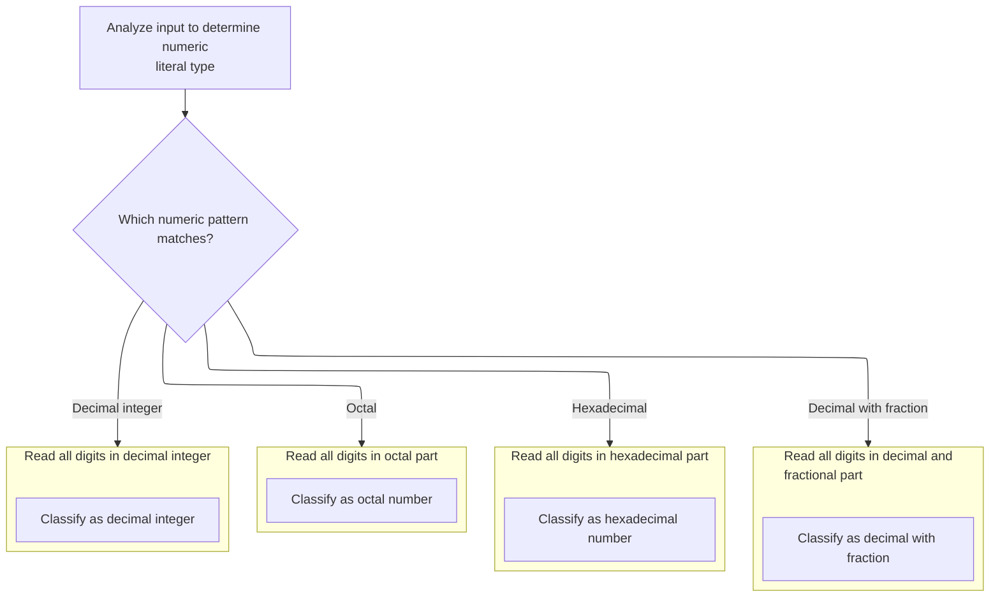

<SwmSnippet path="/core/src/main/java/org/apache/struts/validator/validwhen/ValidWhenLexer.java" line="250">

---

In <SwmToken path="core/src/main/java/org/apache/struts/validator/validwhen/ValidWhenLexer.java" pos="250:7:7" line-data="	public final void mDECIMAL_LITERAL(boolean _createToken) throws RecognitionException, CharStreamException, TokenStreamException {">`mDECIMAL_LITERAL`</SwmToken>, the lexer uses lookahead and backtracking to figure out if the input is a decimal, hex, octal, or integer literal. It matches the right pattern and sets the token type accordingly, so all valid number formats in validation rules are handled.

```java
	public final void mDECIMAL_LITERAL(boolean _createToken) throws RecognitionException, CharStreamException, TokenStreamException {
		int _ttype; Token _token=null; int _begin=text.length();
		_ttype = DECIMAL_LITERAL;
		int _saveIndex;
		
		boolean synPredMatched24 = false;
		if (((_tokenSet_0.member(LA(1))) && (_tokenSet_1.member(LA(2))))) {
			int _m24 = mark();
			synPredMatched24 = true;
			inputState.guessing++;
			try {
				{
				{
				switch ( LA(1)) {
				case '-':
				{
					match('-');
					break;
				}
				case '0':  case '1':  case '2':  case '3':
				case '4':  case '5':  case '6':  case '7':
				case '8':  case '9':
				{
					break;
				}
				default:
				{
					throw new NoViableAltForCharException((char)LA(1), getFilename(), getLine(), getColumn());
				}
				}
				}
				{
				int _cnt22=0;
				_loop22:
				do {
					if (((LA(1) >= '0' && LA(1) <= '9'))) {
						matchRange('0','9');
					}
					else {
						if ( _cnt22>=1 ) { break _loop22; } else {throw new NoViableAltForCharException((char)LA(1), getFilename(), getLine(), getColumn());}
					}
					
					_cnt22++;
				} while (true);
```

---

</SwmSnippet>

<SwmSnippet path="/core/src/main/java/org/apache/struts/validator/validwhen/ValidWhenLexer.java" line="296">

---

Here, after matching the initial digits, the lexer checks for a decimal point and matches it. This step is what distinguishes a decimal literal from an integer, so the token type can be set properly before moving on to the next part of the number.

```java
				match('.');
				}
				}
			}
			catch (RecognitionException pe) {
				synPredMatched24 = false;
			}
			rewind(_m24);
inputState.guessing--;
		}
		if ( synPredMatched24 ) {
			{
			{
			switch ( LA(1)) {
			case '-':
			{
				match('-');
				break;
			}
			case '0':  case '1':  case '2':  case '3':
			case '4':  case '5':  case '6':  case '7':
			case '8':  case '9':
			{
				break;
			}
			default:
			{
				throw new NoViableAltForCharException((char)LA(1), getFilename(), getLine(), getColumn());
			}
			}
			}
			{
			int _cnt28=0;
			_loop28:
			do {
				if (((LA(1) >= '0' && LA(1) <= '9'))) {
					matchRange('0','9');
				}
				else {
					if ( _cnt28>=1 ) { break _loop28; } else {throw new NoViableAltForCharException((char)LA(1), getFilename(), getLine(), getColumn());}
				}
				
				_cnt28++;
			} while (true);
```

---

</SwmSnippet>

<SwmSnippet path="/core/src/main/java/org/apache/struts/validator/validwhen/ValidWhenLexer.java" line="342">

---

Next, the lexer loops to match one or more digits after the decimal point, making sure the decimal is valid and not just a stray dot. This keeps the tokenization strict and avoids malformed numbers.

```java
			match('.');
			}
			{
			int _cnt31=0;
			_loop31:
			do {
				if (((LA(1) >= '0' && LA(1) <= '9'))) {
					matchRange('0','9');
				}
				else {
					if ( _cnt31>=1 ) { break _loop31; } else {throw new NoViableAltForCharException((char)LA(1), getFilename(), getLine(), getColumn());}
				}
				
				_cnt31++;
			} while (true);
```

---

</SwmSnippet>

<SwmSnippet path="/core/src/main/java/org/apache/struts/validator/validwhen/ValidWhenLexer.java" line="361">

---

Here, the lexer uses another lookahead and backtracking block to check if the next part of the input is a hex ('0x') or octal ('0...') literal. This ensures the right token type is set before moving on.

```java
			boolean synPredMatched38 = false;
			if (((LA(1)=='0') && (LA(2)=='x'))) {
				int _m38 = mark();
				synPredMatched38 = true;
				inputState.guessing++;
				try {
					{
					match('0');
					match('x');
					}
				}
				catch (RecognitionException pe) {
					synPredMatched38 = false;
				}
				rewind(_m38);
inputState.guessing--;
			}
			if ( synPredMatched38 ) {
				{
				match('0');
				match('x');
				{
				int _cnt41=0;
				_loop41:
				do {
					switch ( LA(1)) {
					case '0':  case '1':  case '2':  case '3':
					case '4':  case '5':  case '6':  case '7':
					case '8':  case '9':
					{
						matchRange('0','9');
						break;
					}
					case 'a':  case 'b':  case 'c':  case 'd':
					case 'e':  case 'f':
					{
						matchRange('a','f');
						break;
					}
					default:
					{
						if ( _cnt41>=1 ) { break _loop41; } else {throw new NoViableAltForCharException((char)LA(1), getFilename(), getLine(), getColumn());}
					}
					}
					_cnt41++;
				} while (true);
```

---

</SwmSnippet>

<SwmSnippet path="/core/src/main/java/org/apache/struts/validator/validwhen/ValidWhenLexer.java" line="409">

---

Here, after matching '0x' and a sequence of hex digits, the lexer sets the token type to <SwmToken path="core/src/main/java/org/apache/struts/validator/validwhen/ValidWhenLexer.java" pos="410:5:5" line-data="					_ttype = HEX_INT_LITERAL;">`HEX_INT_LITERAL`</SwmToken>. If it doesn't match, it checks for octal or decimal patterns next.

```java
				if ( inputState.guessing==0 ) {
					_ttype = HEX_INT_LITERAL;
				}
			}
			else {
				boolean synPredMatched33 = false;
				if (((LA(1)=='0') && (true))) {
					int _m33 = mark();
					synPredMatched33 = true;
					inputState.guessing++;
					try {
						{
						match('0');
						}
					}
					catch (RecognitionException pe) {
						synPredMatched33 = false;
					}
					rewind(_m33);
inputState.guessing--;
				}
				if ( synPredMatched33 ) {
					{
					match('0');
					{
					_loop36:
					do {
						if (((LA(1) >= '0' && LA(1) <= '7'))) {
							matchRange('0','7');
						}
						else {
							break _loop36;
						}
						
					} while (true);
```

---

</SwmSnippet>

<SwmSnippet path="/core/src/main/java/org/apache/struts/validator/validwhen/ValidWhenLexer.java" line="446">

---

Here, the lexer checks if the input is an octal number (starts with '0' and is followed by digits 0-7). If not, it falls through to check for regular decimal integers. Next, we call ActionConfigMatcher to map the parsed token to the right action configuration.

```java
					if ( inputState.guessing==0 ) {
						_ttype = OCTAL_INT_LITERAL;
					}
				}
				else if ((_tokenSet_2.member(LA(1))) && (true)) {
					{
					{
					switch ( LA(1)) {
					case '-':
					{
						match('-');
						break;
					}
					case '1':  case '2':  case '3':  case '4':
					case '5':  case '6':  case '7':  case '8':
					case '9':
					{
						break;
					}
```

---

</SwmSnippet>

<SwmSnippet path="/core/src/main/java/org/apache/struts/validator/validwhen/ValidWhenLexer.java" line="465">

---

Back in <SwmToken path="core/src/main/java/org/apache/struts/validator/validwhen/ValidWhenLexer.java" pos="95:1:1" line-data="					mDECIMAL_LITERAL(true);">`mDECIMAL_LITERAL`</SwmToken>, after ActionConfigMatcher, the lexer sets the token type to <SwmToken path="core/src/main/java/org/apache/struts/validator/validwhen/ValidWhenLexer.java" pos="488:5:5" line-data="						_ttype = DEC_INT_LITERAL;">`DEC_INT_LITERAL`</SwmToken> if the input matches a standard integer pattern. If not, it throws an exception, enforcing strict input validation.

```java
					default:
					{
						throw new NoViableAltForCharException((char)LA(1), getFilename(), getLine(), getColumn());
					}
					}
					}
					{
					matchRange('1','9');
					}
					{
					_loop46:
					do {
						if (((LA(1) >= '0' && LA(1) <= '9'))) {
							matchRange('0','9');
						}
						else {
							break _loop46;
						}
						
					} while (true);
```

---

</SwmSnippet>

<SwmSnippet path="/core/src/main/java/org/apache/struts/validator/validwhen/ValidWhenLexer.java" line="487">

---

Finally, <SwmToken path="core/src/main/java/org/apache/struts/validator/validwhen/ValidWhenLexer.java" pos="95:1:1" line-data="					mDECIMAL_LITERAL(true);">`mDECIMAL_LITERAL`</SwmToken> creates and returns a token for the matched number type (decimal, hex, octal, or integer), using the repository's token sets and types. This token is then used by the rest of the lexer/parser logic.

```java
					if ( inputState.guessing==0 ) {
						_ttype = DEC_INT_LITERAL;
					}
				}
				else {
					throw new NoViableAltForCharException((char)LA(1), getFilename(), getLine(), getColumn());
				}
				}}
				if ( _createToken && _token==null && _ttype!=Token.SKIP ) {
					_token = makeToken(_ttype);
					_token.setText(new String(text.getBuffer(), _begin, text.length()-_begin));
				}
				_returnToken = _token;
			}
```

---

</SwmSnippet>

### String Literal Token Detection

<SwmSnippet path="/core/src/main/java/org/apache/struts/validator/validwhen/ValidWhenLexer.java" line="99">

---

Back in <SwmToken path="extras/src/main/java/org/apache/struts/actions/EventDispatchAction.java" pos="139:9:9" line-data="            String methodKey = st.nextToken().trim();">`nextToken`</SwmToken>, after handling numbers, the lexer checks for quote characters and calls <SwmToken path="core/src/main/java/org/apache/struts/validator/validwhen/ValidWhenLexer.java" pos="101:1:1" line-data="					mSTRING_LITERAL(true);">`mSTRING_LITERAL`</SwmToken> to process string tokens. This keeps the tokenization moving through all possible input types.

```java
				case '"':  case '\'':
				{
					mSTRING_LITERAL(true);
					theRetToken=_returnToken;
					break;
				}
```

---

</SwmSnippet>

### String Literal Recognition

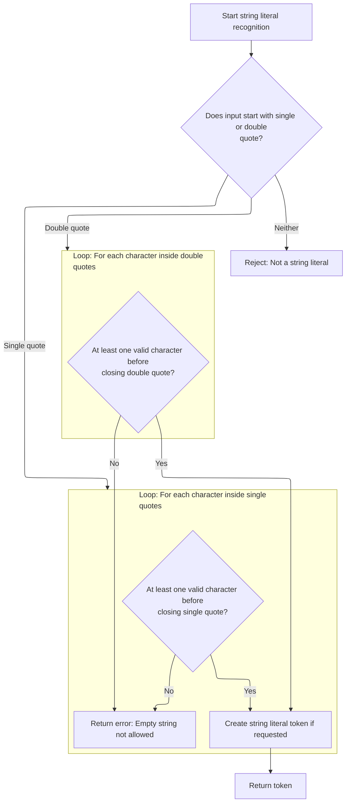

<SwmSnippet path="/core/src/main/java/org/apache/struts/validator/validwhen/ValidWhenLexer.java" line="502">

---

In <SwmToken path="core/src/main/java/org/apache/struts/validator/validwhen/ValidWhenLexer.java" pos="502:7:7" line-data="	public final void mSTRING_LITERAL(boolean _createToken) throws RecognitionException, CharStreamException, TokenStreamException {">`mSTRING_LITERAL`</SwmToken>, the lexer checks if the string starts with a single or double quote, then matches the opening quote, consumes valid characters (using the right token set), and matches the closing quote. This ensures only valid, properly closed string literals are accepted.

```java
	public final void mSTRING_LITERAL(boolean _createToken) throws RecognitionException, CharStreamException, TokenStreamException {
		int _ttype; Token _token=null; int _begin=text.length();
		_ttype = STRING_LITERAL;
		int _saveIndex;
		
		switch ( LA(1)) {
		case '\'':
		{
			{
			match('\'');
			{
			int _cnt50=0;
			_loop50:
			do {
				if ((_tokenSet_3.member(LA(1)))) {
					matchNot('\'');
				}
				else {
					if ( _cnt50>=1 ) { break _loop50; } else {throw new NoViableAltForCharException((char)LA(1), getFilename(), getLine(), getColumn());}
				}
				
				_cnt50++;
			} while (true);
```

---

</SwmSnippet>

<SwmSnippet path="/core/src/main/java/org/apache/struts/validator/validwhen/ValidWhenLexer.java" line="526">

---

Here, after matching the valid characters inside the quotes, the lexer matches the closing quote (single or double). This finalizes the string token and prepares for the next input segment.

```java
			match('\'');
			}
			break;
		}
		case '"':
		{
			{
			match('\"');
			{
			int _cnt53=0;
			_loop53:
			do {
				if ((_tokenSet_4.member(LA(1)))) {
					matchNot('\"');
				}
				else {
					if ( _cnt53>=1 ) { break _loop53; } else {throw new NoViableAltForCharException((char)LA(1), getFilename(), getLine(), getColumn());}
				}
				
				_cnt53++;
			} while (true);
```

---

</SwmSnippet>

<SwmSnippet path="/core/src/main/java/org/apache/struts/validator/validwhen/ValidWhenLexer.java" line="548">

---

Here, the lexer throws an exception if the string literal isn't properly closed. This strictness ensures only valid tokens are passed to the next stage. Next, we call ActionConfigMatcher to map the parsed string token to the right action configuration.

```java
			match('\"');
			}
			break;
		}
		default:
		{
			throw new NoViableAltForCharException((char)LA(1), getFilename(), getLine(), getColumn());
		}
		}
```

---

</SwmSnippet>

<SwmSnippet path="/core/src/main/java/org/apache/struts/validator/validwhen/ValidWhenLexer.java" line="557">

---

Back in <SwmToken path="core/src/main/java/org/apache/struts/validator/validwhen/ValidWhenLexer.java" pos="101:1:1" line-data="					mSTRING_LITERAL(true);">`mSTRING_LITERAL`</SwmToken>, after ActionConfigMatcher, the lexer creates the token, sets its text, and returns it. This token is now ready for the parser or validator to use.

```java
		if ( _createToken && _token==null && _ttype!=Token.SKIP ) {
			_token = makeToken(_ttype);
			_token.setText(new String(text.getBuffer(), _begin, text.length()-_begin));
		}
		_returnToken = _token;
	}
```

---

</SwmSnippet>

### Bracket Token Detection

<SwmSnippet path="/core/src/main/java/org/apache/struts/validator/validwhen/ValidWhenLexer.java" line="105">

---

Back in <SwmToken path="extras/src/main/java/org/apache/struts/actions/EventDispatchAction.java" pos="139:9:9" line-data="            String methodKey = st.nextToken().trim();">`nextToken`</SwmToken>, after handling strings, the lexer checks for '\[' and calls <SwmToken path="core/src/main/java/org/apache/struts/validator/validwhen/ValidWhenLexer.java" pos="107:1:1" line-data="					mLBRACKET(true);">`mLBRACKET`</SwmToken> to process left bracket tokens. This keeps the tokenization moving through all possible input types.

```java
				case '[':
				{
					mLBRACKET(true);
					theRetToken=_returnToken;
					break;
				}
```

---

</SwmSnippet>

### Left Bracket Recognition

<SwmSnippet path="/core/src/main/java/org/apache/struts/validator/validwhen/ValidWhenLexer.java" line="564">

---

In <SwmToken path="core/src/main/java/org/apache/struts/validator/validwhen/ValidWhenLexer.java" pos="564:7:7" line-data="	public final void mLBRACKET(boolean _createToken) throws RecognitionException, CharStreamException, TokenStreamException {">`mLBRACKET`</SwmToken>, the lexer matches the '\[' character and creates a token for it. This is needed so the parser can recognize and process bracketed expressions. Next, we call ActionConfigMatcher to map the bracket token to the right action configuration.

```java
	public final void mLBRACKET(boolean _createToken) throws RecognitionException, CharStreamException, TokenStreamException {
		int _ttype; Token _token=null; int _begin=text.length();
		_ttype = LBRACKET;
		int _saveIndex;
		
		match('[');
```

---

</SwmSnippet>

<SwmSnippet path="/core/src/main/java/org/apache/struts/validator/validwhen/ValidWhenLexer.java" line="570">

---

Back in <SwmToken path="core/src/main/java/org/apache/struts/validator/validwhen/ValidWhenLexer.java" pos="107:1:1" line-data="					mLBRACKET(true);">`mLBRACKET`</SwmToken>, after ActionConfigMatcher, the lexer creates the token, sets its text, and returns it. This token is now ready for the parser or validator to use.

```java
		if ( _createToken && _token==null && _ttype!=Token.SKIP ) {
			_token = makeToken(_ttype);
			_token.setText(new String(text.getBuffer(), _begin, text.length()-_begin));
		}
		_returnToken = _token;
	}
```

---

</SwmSnippet>

### Right Bracket Token Detection

<SwmSnippet path="/core/src/main/java/org/apache/struts/validator/validwhen/ValidWhenLexer.java" line="111">

---

Back in <SwmToken path="extras/src/main/java/org/apache/struts/actions/EventDispatchAction.java" pos="139:9:9" line-data="            String methodKey = st.nextToken().trim();">`nextToken`</SwmToken>, after handling left brackets, the lexer checks for '\]' and calls <SwmToken path="core/src/main/java/org/apache/struts/validator/validwhen/ValidWhenLexer.java" pos="113:1:1" line-data="					mRBRACKET(true);">`mRBRACKET`</SwmToken> to process right bracket tokens. This keeps the tokenization moving through all possible input types.

```java
				case ']':
				{
					mRBRACKET(true);
					theRetToken=_returnToken;
					break;
				}
```

---

</SwmSnippet>

### Right Bracket Recognition

```mermaid
%%{init: {"flowchart": {"defaultRenderer": "elk"}} }%%
flowchart TD
  node1["Recognize right bracket ('"]') in input]
  click node1 openCode "core/src/main/java/org/apache/struts/validator/validwhen/ValidWhenLexer.java:582:582"
  node1 --> node2{"Should create token? (_createToken is
true, no token exists, and type is not
SKIP)"}
  click node2 openCode "core/src/main/java/org/apache/struts/validator/validwhen/ValidWhenLexer.java:583:583"
  node2 -->|"Yes"| node3["Create token for right bracket"]
  click node3 openCode "core/src/main/java/org/apache/struts/validator/validwhen/ValidWhenLexer.java:584:585"
  node2 -->|"No"| node4["Skip token creation"]
  click node4 openCode "core/src/main/java/org/apache/struts/validator/validwhen/ValidWhenLexer.java:586:586"
  node3 --> node5["Return token (or null)"]
  node4 --> node5
  click node5 openCode "core/src/main/java/org/apache/struts/validator/validwhen/ValidWhenLexer.java:587:588"

classDef HeadingStyle fill:#777777,stroke:#333,stroke-width:2px;

%% Swimm:
%% %%{init: {"flowchart": {"defaultRenderer": "elk"}} }%%
%% flowchart TD
%%   node1["Recognize right bracket ('"]') in input]
%%   click node1 openCode "<SwmPath>[core/…/validwhen/ValidWhenLexer.java](core/src/main/java/org/apache/struts/validator/validwhen/ValidWhenLexer.java)</SwmPath>:582:582"
%%   node1 --> node2{"Should create token? (<SwmToken path="core/src/main/java/org/apache/struts/validator/validwhen/ValidWhenLexer.java" pos="250:11:11" line-data="	public final void mDECIMAL_LITERAL(boolean _createToken) throws RecognitionException, CharStreamException, TokenStreamException {">`_createToken`</SwmToken> is
%% true, no token exists, and type is not
%% SKIP)"}
%%   click node2 openCode "<SwmPath>[core/…/validwhen/ValidWhenLexer.java](core/src/main/java/org/apache/struts/validator/validwhen/ValidWhenLexer.java)</SwmPath>:583:583"
%%   node2 -->|"Yes"| node3["Create token for right bracket"]
%%   click node3 openCode "<SwmPath>[core/…/validwhen/ValidWhenLexer.java](core/src/main/java/org/apache/struts/validator/validwhen/ValidWhenLexer.java)</SwmPath>:584:585"
%%   node2 -->|"No"| node4["Skip token creation"]
%%   click node4 openCode "<SwmPath>[core/…/validwhen/ValidWhenLexer.java](core/src/main/java/org/apache/struts/validator/validwhen/ValidWhenLexer.java)</SwmPath>:586:586"
%%   node3 --> node5["Return token (or null)"]
%%   node4 --> node5
%%   click node5 openCode "<SwmPath>[core/…/validwhen/ValidWhenLexer.java](core/src/main/java/org/apache/struts/validator/validwhen/ValidWhenLexer.java)</SwmPath>:587:588"
%% 
%% classDef HeadingStyle fill:#777777,stroke:#333,stroke-width:2px;
```

<SwmSnippet path="/core/src/main/java/org/apache/struts/validator/validwhen/ValidWhenLexer.java" line="577">

---

In <SwmToken path="core/src/main/java/org/apache/struts/validator/validwhen/ValidWhenLexer.java" pos="577:7:7" line-data="	public final void mRBRACKET(boolean _createToken) throws RecognitionException, CharStreamException, TokenStreamException {">`mRBRACKET`</SwmToken>, the lexer matches the '\]' character and creates a token for it. This is needed so the parser can recognize and process bracketed expressions. Next, we call ActionConfigMatcher to map the bracket token to the right action configuration.

```java
	public final void mRBRACKET(boolean _createToken) throws RecognitionException, CharStreamException, TokenStreamException {
		int _ttype; Token _token=null; int _begin=text.length();
		_ttype = RBRACKET;
		int _saveIndex;
		
		match(']');
```

---

</SwmSnippet>

<SwmSnippet path="/core/src/main/java/org/apache/struts/validator/validwhen/ValidWhenLexer.java" line="583">

---

Back in <SwmToken path="core/src/main/java/org/apache/struts/validator/validwhen/ValidWhenLexer.java" pos="113:1:1" line-data="					mRBRACKET(true);">`mRBRACKET`</SwmToken>, after ActionConfigMatcher, the lexer creates the token, sets its text, and returns it. This token is now ready for the parser or validator to use.

```java
		if ( _createToken && _token==null && _ttype!=Token.SKIP ) {
			_token = makeToken(_ttype);
			_token.setText(new String(text.getBuffer(), _begin, text.length()-_begin));
		}
		_returnToken = _token;
	}
```

---

</SwmSnippet>

### Left Parenthesis Token Detection

<SwmSnippet path="/core/src/main/java/org/apache/struts/validator/validwhen/ValidWhenLexer.java" line="117">

---

Back in <SwmToken path="extras/src/main/java/org/apache/struts/actions/EventDispatchAction.java" pos="139:9:9" line-data="            String methodKey = st.nextToken().trim();">`nextToken`</SwmToken>, after handling brackets, the lexer checks for '(' and calls <SwmToken path="core/src/main/java/org/apache/struts/validator/validwhen/ValidWhenLexer.java" pos="119:1:1" line-data="					mLPAREN(true);">`mLPAREN`</SwmToken> to process left parenthesis tokens. This keeps the tokenization moving through all possible input types.

```java
				case '(':
				{
					mLPAREN(true);
					theRetToken=_returnToken;
					break;
				}
```

---

</SwmSnippet>

### Left Parenthesis Recognition

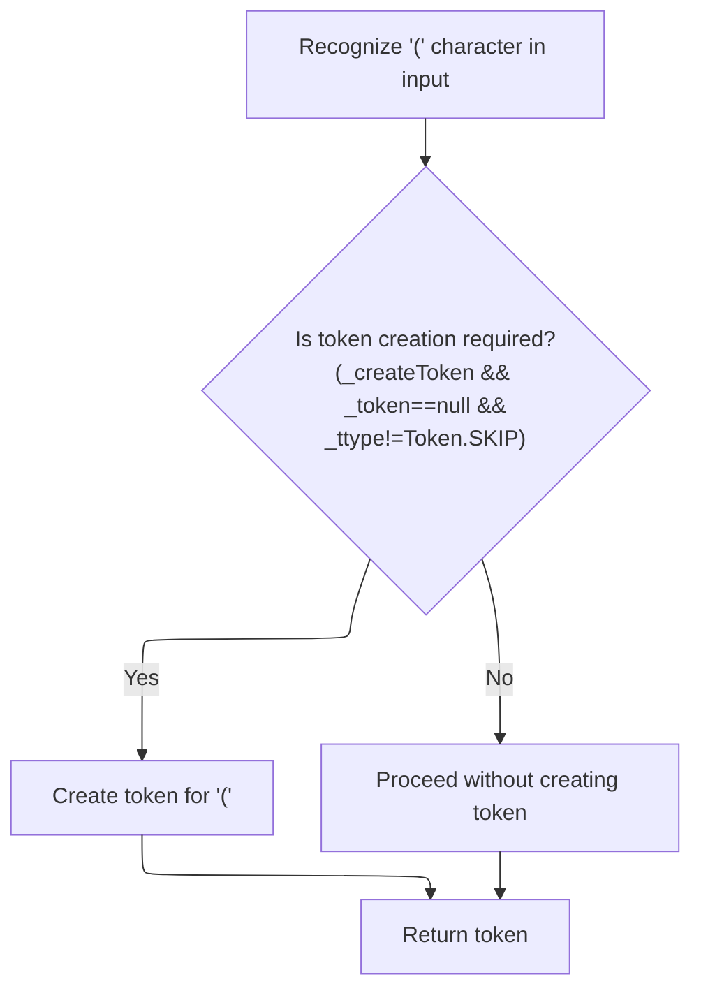

<SwmSnippet path="/core/src/main/java/org/apache/struts/validator/validwhen/ValidWhenLexer.java" line="590">

---

In <SwmToken path="core/src/main/java/org/apache/struts/validator/validwhen/ValidWhenLexer.java" pos="590:7:7" line-data="	public final void mLPAREN(boolean _createToken) throws RecognitionException, CharStreamException, TokenStreamException {">`mLPAREN`</SwmToken>, the lexer matches the '(' character and creates a token for it. This is needed so the parser can recognize and process parenthesized expressions. Next, we call ActionConfigMatcher to map the parenthesis token to the right action configuration.

```java
	public final void mLPAREN(boolean _createToken) throws RecognitionException, CharStreamException, TokenStreamException {
		int _ttype; Token _token=null; int _begin=text.length();
		_ttype = LPAREN;
		int _saveIndex;
		
		match('(');
```

---

</SwmSnippet>

<SwmSnippet path="/core/src/main/java/org/apache/struts/validator/validwhen/ValidWhenLexer.java" line="596">

---

Back in <SwmToken path="core/src/main/java/org/apache/struts/validator/validwhen/ValidWhenLexer.java" pos="119:1:1" line-data="					mLPAREN(true);">`mLPAREN`</SwmToken>, after ActionConfigMatcher, the lexer creates the token, sets its text, and returns it. This token is now ready for the parser or validator to use.

```java
		if ( _createToken && _token==null && _ttype!=Token.SKIP ) {
			_token = makeToken(_ttype);
			_token.setText(new String(text.getBuffer(), _begin, text.length()-_begin));
		}
		_returnToken = _token;
	}
```

---

</SwmSnippet>

### Right Parenthesis Token Detection

<SwmSnippet path="/core/src/main/java/org/apache/struts/validator/validwhen/ValidWhenLexer.java" line="123">

---

Back in <SwmToken path="extras/src/main/java/org/apache/struts/actions/EventDispatchAction.java" pos="139:9:9" line-data="            String methodKey = st.nextToken().trim();">`nextToken`</SwmToken>, after handling left parentheses, the lexer checks for ')' and calls <SwmToken path="core/src/main/java/org/apache/struts/validator/validwhen/ValidWhenLexer.java" pos="125:1:1" line-data="					mRPAREN(true);">`mRPAREN`</SwmToken> to process right parenthesis tokens. This keeps the tokenization moving through all possible input types.

```java
				case ')':
				{
					mRPAREN(true);
					theRetToken=_returnToken;
					break;
				}
```

---

</SwmSnippet>

### Right Parenthesis Recognition

<SwmSnippet path="/core/src/main/java/org/apache/struts/validator/validwhen/ValidWhenLexer.java" line="603">

---

In <SwmToken path="core/src/main/java/org/apache/struts/validator/validwhen/ValidWhenLexer.java" pos="603:7:7" line-data="	public final void mRPAREN(boolean _createToken) throws RecognitionException, CharStreamException, TokenStreamException {">`mRPAREN`</SwmToken>, the lexer matches the ')' character and sets up the token type. This is where we recognize the end of a parenthesized group in the input. After this, we need to call ActionConfigMatcher so the parser can map this token to the correct action configuration, keeping the parsing context in sync with the application's configuration.

```java
	public final void mRPAREN(boolean _createToken) throws RecognitionException, CharStreamException, TokenStreamException {
		int _ttype; Token _token=null; int _begin=text.length();
		_ttype = RPAREN;
		int _saveIndex;
		
		match(')');
```

---

</SwmSnippet>

<SwmSnippet path="/core/src/main/java/org/apache/struts/validator/validwhen/ValidWhenLexer.java" line="609">

---

After returning from ActionConfigMatcher, <SwmToken path="core/src/main/java/org/apache/struts/validator/validwhen/ValidWhenLexer.java" pos="125:1:1" line-data="					mRPAREN(true);">`mRPAREN`</SwmToken> finalizes the token creation for the right parenthesis. This means the token is now linked to the correct action configuration, so the parser can handle it properly in the next steps.

```java
		if ( _createToken && _token==null && _ttype!=Token.SKIP ) {
			_token = makeToken(_ttype);
			_token.setText(new String(text.getBuffer(), _begin, text.length()-_begin));
		}
		_returnToken = _token;
	}
```

---

</SwmSnippet>

### Wildcard Token Detection

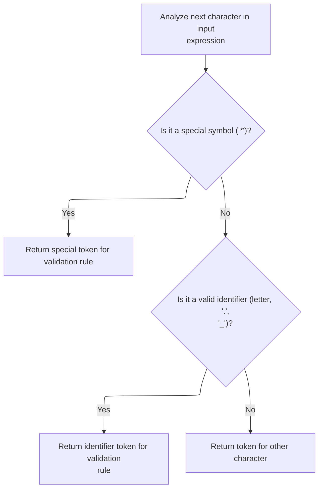

<SwmSnippet path="/core/src/main/java/org/apache/struts/validator/validwhen/ValidWhenLexer.java" line="129">

---

After handling the right parenthesis in <SwmToken path="extras/src/main/java/org/apache/struts/actions/EventDispatchAction.java" pos="139:9:9" line-data="            String methodKey = st.nextToken().trim();">`nextToken`</SwmToken>, the lexer checks for a '\*' character and calls <SwmToken path="core/src/main/java/org/apache/struts/validator/validwhen/ValidWhenLexer.java" pos="131:1:1" line-data="					mTHIS(true);">`mTHIS`</SwmToken> if found. This is how we detect the special '*this*' token, and we keep calling the lexer to process the next segment of input.

```java
				case '*':
				{
					mTHIS(true);
					theRetToken=_returnToken;
					break;
				}
				case '.':  case '_':  case 'a':  case 'b':
				case 'c':  case 'd':  case 'e':  case 'f':
				case 'g':  case 'h':  case 'i':  case 'j':
				case 'k':  case 'l':  case 'm':  case 'n':
				case 'o':  case 'p':  case 'q':  case 'r':
				case 's':  case 't':  case 'u':  case 'v':
```

---

</SwmSnippet>

### Current Field Reference Recognition

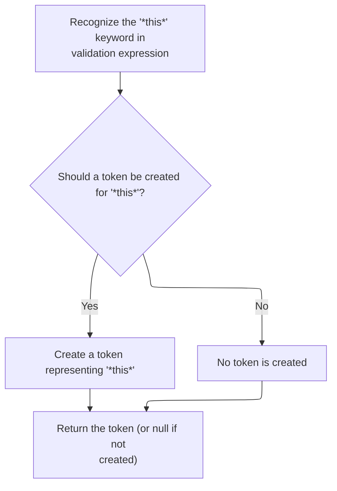

<SwmSnippet path="/core/src/main/java/org/apache/struts/validator/validwhen/ValidWhenLexer.java" line="616">

---

In <SwmToken path="core/src/main/java/org/apache/struts/validator/validwhen/ValidWhenLexer.java" pos="616:7:7" line-data="	public final void mTHIS(boolean _createToken) throws RecognitionException, CharStreamException, TokenStreamException {">`mTHIS`</SwmToken>, the lexer matches the literal '*this*' and sets up the token type. This lets the parser know we're referring to the current field. We call ActionConfigMatcher next so the token is mapped to the right action configuration, keeping the validation context accurate.

```java
	public final void mTHIS(boolean _createToken) throws RecognitionException, CharStreamException, TokenStreamException {
		int _ttype; Token _token=null; int _begin=text.length();
		_ttype = THIS;
		int _saveIndex;
		
		match("*this*");
```

---

</SwmSnippet>

<SwmSnippet path="/core/src/main/java/org/apache/struts/validator/validwhen/ValidWhenLexer.java" line="622">

---

After ActionConfigMatcher, <SwmToken path="core/src/main/java/org/apache/struts/validator/validwhen/ValidWhenLexer.java" pos="131:1:1" line-data="					mTHIS(true);">`mTHIS`</SwmToken> finalizes the token for '*this*', linking it to the current action configuration. This way, the parser can handle field-specific validation logic correctly.

```java
		if ( _createToken && _token==null && _ttype!=Token.SKIP ) {
			_token = makeToken(_ttype);
			_token.setText(new String(text.getBuffer(), _begin, text.length()-_begin));
		}
		_returnToken = _token;
	}
```

---

</SwmSnippet>

### Identifier Token Detection

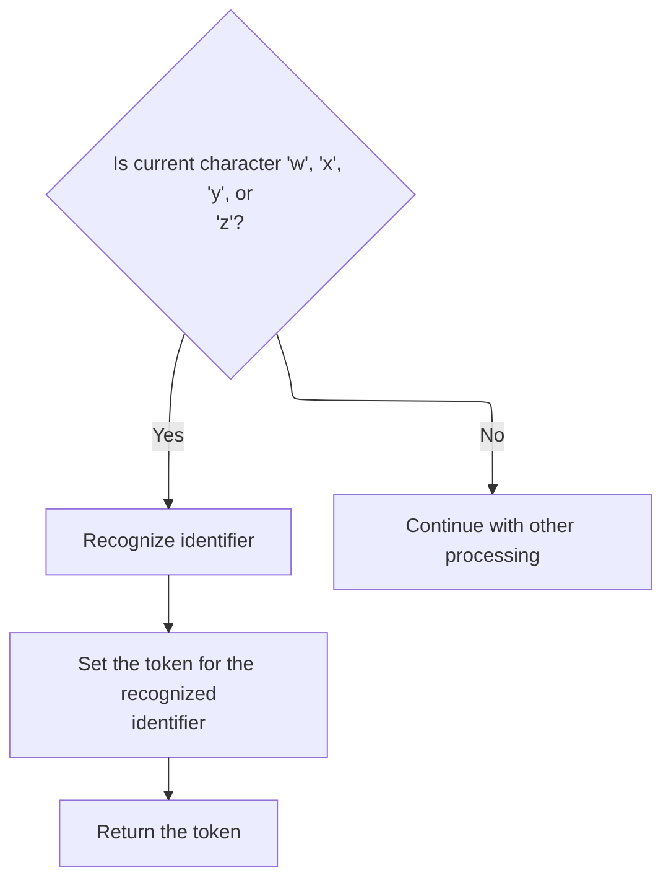

<SwmSnippet path="/core/src/main/java/org/apache/struts/validator/validwhen/ValidWhenLexer.java" line="141">

---

After handling '*this*', <SwmToken path="extras/src/main/java/org/apache/struts/actions/EventDispatchAction.java" pos="139:9:9" line-data="            String methodKey = st.nextToken().trim();">`nextToken`</SwmToken> checks for identifiers (like field names or variables) and calls <SwmToken path="core/src/main/java/org/apache/struts/validator/validwhen/ValidWhenLexer.java" pos="143:1:1" line-data="					mIDENTIFIER(true);">`mIDENTIFIER`</SwmToken> if found. We keep calling the lexer to process the next segment, so all parts of the input are tokenized for validation.

```java
				case 'w':  case 'x':  case 'y':  case 'z':
				{
					mIDENTIFIER(true);
					theRetToken=_returnToken;
					break;
				}
```

---

</SwmSnippet>

### Field or Variable Name Recognition

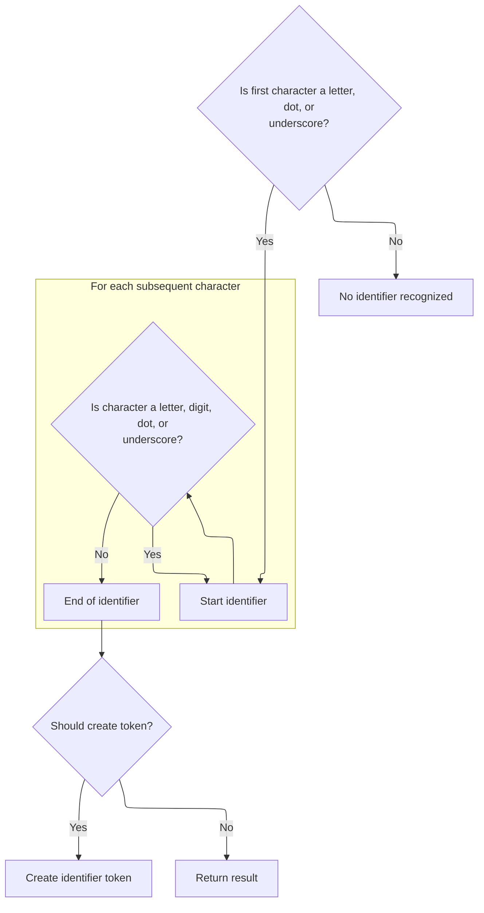

<SwmSnippet path="/core/src/main/java/org/apache/struts/validator/validwhen/ValidWhenLexer.java" line="629">

---

In <SwmToken path="core/src/main/java/org/apache/struts/validator/validwhen/ValidWhenLexer.java" pos="629:7:7" line-data="	public final void mIDENTIFIER(boolean _createToken) throws RecognitionException, CharStreamException, TokenStreamException {">`mIDENTIFIER`</SwmToken>, the lexer matches sequences of letters, digits, underscores, or dots to recognize field or variable names. We call ActionConfigMatcher next so the token is mapped to the right action configuration, letting the parser resolve references in the validation logic.

```java
	public final void mIDENTIFIER(boolean _createToken) throws RecognitionException, CharStreamException, TokenStreamException {
		int _ttype; Token _token=null; int _begin=text.length();
		_ttype = IDENTIFIER;
		int _saveIndex;
		
		{
		switch ( LA(1)) {
		case 'a':  case 'b':  case 'c':  case 'd':
		case 'e':  case 'f':  case 'g':  case 'h':
		case 'i':  case 'j':  case 'k':  case 'l':
		case 'm':  case 'n':  case 'o':  case 'p':
		case 'q':  case 'r':  case 's':  case 't':
		case 'u':  case 'v':  case 'w':  case 'x':
		case 'y':  case 'z':
		{
			matchRange('a','z');
			break;
		}
		case '.':
		{
			match('.');
			break;
		}
		case '_':
		{
			match('_');
			break;
		}
		default:
		{
			throw new NoViableAltForCharException((char)LA(1), getFilename(), getLine(), getColumn());
		}
		}
		}
		{
		int _cnt62=0;
		_loop62:
		do {
			switch ( LA(1)) {
			case 'a':  case 'b':  case 'c':  case 'd':
			case 'e':  case 'f':  case 'g':  case 'h':
			case 'i':  case 'j':  case 'k':  case 'l':
			case 'm':  case 'n':  case 'o':  case 'p':
			case 'q':  case 'r':  case 's':  case 't':
			case 'u':  case 'v':  case 'w':  case 'x':
			case 'y':  case 'z':
			{
				matchRange('a','z');
				break;
			}
			case '0':  case '1':  case '2':  case '3':
			case '4':  case '5':  case '6':  case '7':
			case '8':  case '9':
			{
				matchRange('0','9');
				break;
			}
			case '.':
			{
				match('.');
				break;
			}
			case '_':
			{
				match('_');
				break;
			}
			default:
			{
				if ( _cnt62>=1 ) { break _loop62; } else {throw new NoViableAltForCharException((char)LA(1), getFilename(), getLine(), getColumn());}
			}
			}
			_cnt62++;
		} while (true);
		}
```

---

</SwmSnippet>

<SwmSnippet path="/core/src/main/java/org/apache/struts/validator/validwhen/ValidWhenLexer.java" line="704">

---

After ActionConfigMatcher, <SwmToken path="core/src/main/java/org/apache/struts/validator/validwhen/ValidWhenLexer.java" pos="143:1:1" line-data="					mIDENTIFIER(true);">`mIDENTIFIER`</SwmToken> finalizes the token for the field or variable name, linking it to the right action configuration. This lets the parser resolve references in the validation logic.

```java
		if ( _createToken && _token==null && _ttype!=Token.SKIP ) {
			_token = makeToken(_ttype);
			_token.setText(new String(text.getBuffer(), _begin, text.length()-_begin));
		}
		_returnToken = _token;
	}
```

---

</SwmSnippet>

### Equality Operator Token Detection

<SwmSnippet path="/core/src/main/java/org/apache/struts/validator/validwhen/ValidWhenLexer.java" line="147">

---

After handling identifiers, <SwmToken path="extras/src/main/java/org/apache/struts/actions/EventDispatchAction.java" pos="139:9:9" line-data="            String methodKey = st.nextToken().trim();">`nextToken`</SwmToken> checks for '=' and calls <SwmToken path="core/src/main/java/org/apache/struts/validator/validwhen/ValidWhenLexer.java" pos="149:1:1" line-data="					mEQUALSIGN(true);">`mEQUALSIGN`</SwmToken> if found. This is how we detect the '==' operator for equality checks, and we keep calling the lexer to process the next segment.

```java
				case '=':
				{
					mEQUALSIGN(true);
					theRetToken=_returnToken;
					break;
				}
```

---

</SwmSnippet>

### Equality Operator Recognition

<SwmSnippet path="/core/src/main/java/org/apache/struts/validator/validwhen/ValidWhenLexer.java" line="711">

---

In <SwmToken path="core/src/main/java/org/apache/struts/validator/validwhen/ValidWhenLexer.java" pos="711:7:7" line-data="	public final void mEQUALSIGN(boolean _createToken) throws RecognitionException, CharStreamException, TokenStreamException {">`mEQUALSIGN`</SwmToken>, the lexer matches two '=' characters to recognize the equality operator. We call ActionConfigMatcher next so the token is mapped to the right action configuration, letting the parser handle equality checks in validation rules.

```java
	public final void mEQUALSIGN(boolean _createToken) throws RecognitionException, CharStreamException, TokenStreamException {
		int _ttype; Token _token=null; int _begin=text.length();
		_ttype = EQUALSIGN;
		int _saveIndex;
		
		match('=');
		match('=');
```

---

</SwmSnippet>

<SwmSnippet path="/core/src/main/java/org/apache/struts/validator/validwhen/ValidWhenLexer.java" line="718">

---

After ActionConfigMatcher, <SwmToken path="core/src/main/java/org/apache/struts/validator/validwhen/ValidWhenLexer.java" pos="149:1:1" line-data="					mEQUALSIGN(true);">`mEQUALSIGN`</SwmToken> finalizes the token for the equality operator, linking it to the right action configuration. This lets the parser handle equality checks in validation rules.

```java
		if ( _createToken && _token==null && _ttype!=Token.SKIP ) {
			_token = makeToken(_ttype);
			_token.setText(new String(text.getBuffer(), _begin, text.length()-_begin));
		}
		_returnToken = _token;
	}
```

---

</SwmSnippet>

### Inequality Operator Token Detection

<SwmSnippet path="/core/src/main/java/org/apache/struts/validator/validwhen/ValidWhenLexer.java" line="153">

---

After handling '=', <SwmToken path="extras/src/main/java/org/apache/struts/actions/EventDispatchAction.java" pos="139:9:9" line-data="            String methodKey = st.nextToken().trim();">`nextToken`</SwmToken> checks for '!' and calls <SwmToken path="core/src/main/java/org/apache/struts/validator/validwhen/ValidWhenLexer.java" pos="155:1:1" line-data="					mNOTEQUALSIGN(true);">`mNOTEQUALSIGN`</SwmToken> if found. This is how we detect the '!=' operator for inequality checks, and we keep calling the lexer to process the next segment.

```java
				case '!':
				{
					mNOTEQUALSIGN(true);
					theRetToken=_returnToken;
					break;
				}
```

---

</SwmSnippet>

### Inequality Operator Recognition

<SwmSnippet path="/core/src/main/java/org/apache/struts/validator/validwhen/ValidWhenLexer.java" line="725">

---

In <SwmToken path="core/src/main/java/org/apache/struts/validator/validwhen/ValidWhenLexer.java" pos="725:7:7" line-data="	public final void mNOTEQUALSIGN(boolean _createToken) throws RecognitionException, CharStreamException, TokenStreamException {">`mNOTEQUALSIGN`</SwmToken>, the lexer matches '!' followed by '=' to recognize the inequality operator. We call ActionConfigMatcher next so the token is mapped to the right action configuration, letting the parser handle inequality checks in validation rules.

```java
	public final void mNOTEQUALSIGN(boolean _createToken) throws RecognitionException, CharStreamException, TokenStreamException {
		int _ttype; Token _token=null; int _begin=text.length();
		_ttype = NOTEQUALSIGN;
		int _saveIndex;
		
		match('!');
		match('=');
```

---

</SwmSnippet>

<SwmSnippet path="/core/src/main/java/org/apache/struts/validator/validwhen/ValidWhenLexer.java" line="732">

---

After ActionConfigMatcher, <SwmToken path="core/src/main/java/org/apache/struts/validator/validwhen/ValidWhenLexer.java" pos="155:1:1" line-data="					mNOTEQUALSIGN(true);">`mNOTEQUALSIGN`</SwmToken> finalizes the token for the inequality operator, linking it to the right action configuration. This lets the parser handle inequality checks in validation rules.

```java
		if ( _createToken && _token==null && _ttype!=Token.SKIP ) {
			_token = makeToken(_ttype);
			_token.setText(new String(text.getBuffer(), _begin, text.length()-_begin));
		}
		_returnToken = _token;
	}
```

---

</SwmSnippet>

### Less-Than-or-Equal Operator Token Detection

<SwmSnippet path="/core/src/main/java/org/apache/struts/validator/validwhen/ValidWhenLexer.java" line="159">

---

After handling '!=', <SwmToken path="extras/src/main/java/org/apache/struts/actions/EventDispatchAction.java" pos="139:9:9" line-data="            String methodKey = st.nextToken().trim();">`nextToken`</SwmToken> checks for '<=' and calls <SwmToken path="core/src/main/java/org/apache/struts/validator/validwhen/ValidWhenLexer.java" pos="161:1:1" line-data="						mLESSEQUALSIGN(true);">`mLESSEQUALSIGN`</SwmToken> if found. This is how we detect the '<=' operator for less-than-or-equal checks, and we keep calling the lexer to process the next segment.

```java
				default:
					if ((LA(1)=='<') && (LA(2)=='=')) {
						mLESSEQUALSIGN(true);
```

---

</SwmSnippet>

### Less-Than-or-Equal Operator Recognition

<SwmSnippet path="/core/src/main/java/org/apache/struts/validator/validwhen/ValidWhenLexer.java" line="765">

---

In <SwmToken path="core/src/main/java/org/apache/struts/validator/validwhen/ValidWhenLexer.java" pos="765:7:7" line-data="	public final void mLESSEQUALSIGN(boolean _createToken) throws RecognitionException, CharStreamException, TokenStreamException {">`mLESSEQUALSIGN`</SwmToken>, the lexer matches '<' followed by '=' to recognize the less-than-or-equal operator. We call ActionConfigMatcher next so the token is mapped to the right action configuration, letting the parser handle these checks in validation rules.

```java
	public final void mLESSEQUALSIGN(boolean _createToken) throws RecognitionException, CharStreamException, TokenStreamException {
		int _ttype; Token _token=null; int _begin=text.length();
		_ttype = LESSEQUALSIGN;
		int _saveIndex;
		
		match('<');
		match('=');
```

---

</SwmSnippet>

<SwmSnippet path="/core/src/main/java/org/apache/struts/validator/validwhen/ValidWhenLexer.java" line="772">

---

After ActionConfigMatcher, <SwmToken path="core/src/main/java/org/apache/struts/validator/validwhen/ValidWhenLexer.java" pos="161:1:1" line-data="						mLESSEQUALSIGN(true);">`mLESSEQUALSIGN`</SwmToken> finalizes the token for the less-than-or-equal operator, linking it to the right action configuration. This lets the parser handle these checks in validation rules.

```java
		if ( _createToken && _token==null && _ttype!=Token.SKIP ) {
			_token = makeToken(_ttype);
			_token.setText(new String(text.getBuffer(), _begin, text.length()-_begin));
		}
		_returnToken = _token;
	}
```

---

</SwmSnippet>

### Greater-Than-or-Equal Operator Token Detection

<SwmSnippet path="/core/src/main/java/org/apache/struts/validator/validwhen/ValidWhenLexer.java" line="162">

---

After handling '<=', <SwmToken path="extras/src/main/java/org/apache/struts/actions/EventDispatchAction.java" pos="139:9:9" line-data="            String methodKey = st.nextToken().trim();">`nextToken`</SwmToken> checks for '>=' and calls <SwmToken path="core/src/main/java/org/apache/struts/validator/validwhen/ValidWhenLexer.java" pos="165:1:1" line-data="						mGREATEREQUALSIGN(true);">`mGREATEREQUALSIGN`</SwmToken> if found. This is how we detect the '>=' operator for greater-than-or-equal checks, and we keep calling the lexer to process the next segment.

```java
						theRetToken=_returnToken;
					}
					else if ((LA(1)=='>') && (LA(2)=='=')) {
						mGREATEREQUALSIGN(true);
```

---

</SwmSnippet>

### Greater-Than-or-Equal Operator Recognition

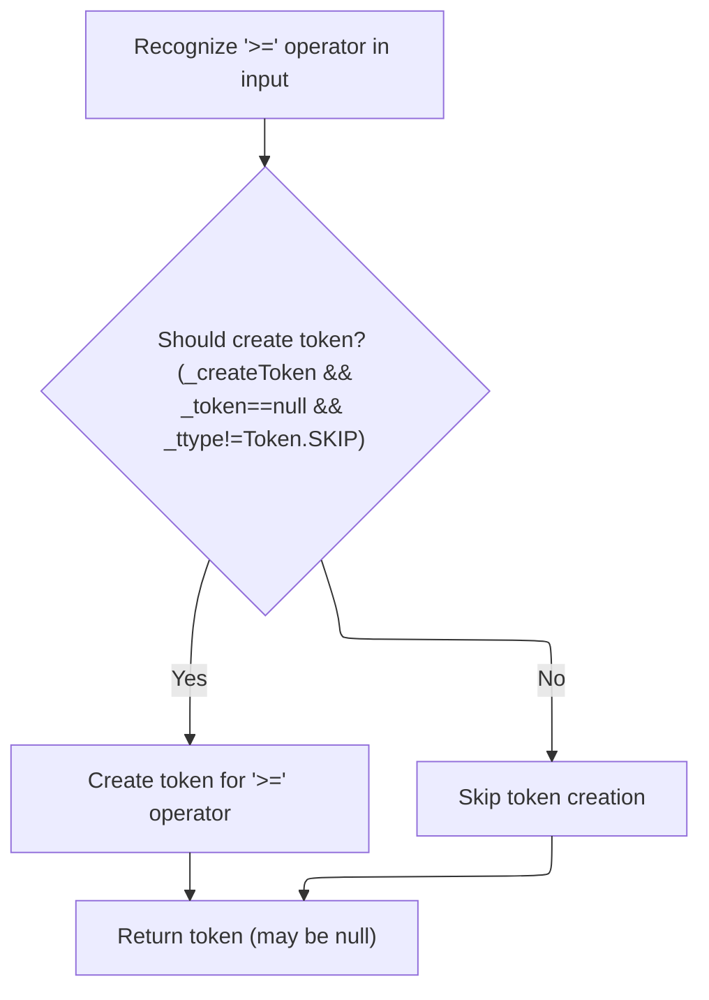

<SwmSnippet path="/core/src/main/java/org/apache/struts/validator/validwhen/ValidWhenLexer.java" line="779">

---

In <SwmToken path="core/src/main/java/org/apache/struts/validator/validwhen/ValidWhenLexer.java" pos="779:7:7" line-data="	public final void mGREATEREQUALSIGN(boolean _createToken) throws RecognitionException, CharStreamException, TokenStreamException {">`mGREATEREQUALSIGN`</SwmToken>, the lexer matches '>' followed by '=' to recognize the greater-than-or-equal operator. We call ActionConfigMatcher next so the token is mapped to the right action configuration, letting the parser handle these checks in validation rules.

```java
	public final void mGREATEREQUALSIGN(boolean _createToken) throws RecognitionException, CharStreamException, TokenStreamException {
		int _ttype; Token _token=null; int _begin=text.length();
		_ttype = GREATEREQUALSIGN;
		int _saveIndex;
		
		match('>');
		match('=');
```

---

</SwmSnippet>

<SwmSnippet path="/core/src/main/java/org/apache/struts/validator/validwhen/ValidWhenLexer.java" line="786">

---

After ActionConfigMatcher, <SwmToken path="core/src/main/java/org/apache/struts/validator/validwhen/ValidWhenLexer.java" pos="165:1:1" line-data="						mGREATEREQUALSIGN(true);">`mGREATEREQUALSIGN`</SwmToken> finalizes the token for the greater-than-or-equal operator, linking it to the right action configuration. This lets the parser handle these checks in validation rules.

```java
		if ( _createToken && _token==null && _ttype!=Token.SKIP ) {
			_token = makeToken(_ttype);
			_token.setText(new String(text.getBuffer(), _begin, text.length()-_begin));
		}
		_returnToken = _token;
	}
```

---

</SwmSnippet>

### Less-Than and Greater-Than Token Detection

<SwmSnippet path="/core/src/main/java/org/apache/struts/validator/validwhen/ValidWhenLexer.java" line="166">

---

After handling '>=', <SwmToken path="extras/src/main/java/org/apache/struts/actions/EventDispatchAction.java" pos="139:9:9" line-data="            String methodKey = st.nextToken().trim();">`nextToken`</SwmToken> checks for '<' and '>' and calls <SwmToken path="core/src/main/java/org/apache/struts/validator/validwhen/ValidWhenLexer.java" pos="169:1:1" line-data="						mLESSTHANSIGN(true);">`mLESSTHANSIGN`</SwmToken> or <SwmToken path="core/src/main/java/org/apache/struts/validator/validwhen/ValidWhenLexer.java" pos="173:1:1" line-data="						mGREATERTHANSIGN(true);">`mGREATERTHANSIGN`</SwmToken> as needed. This is how we detect the less-than and greater-than operators, and we keep calling the lexer to process the next segment.

```java
						theRetToken=_returnToken;
					}
					else if ((LA(1)=='<') && (true)) {
						mLESSTHANSIGN(true);
```

---

</SwmSnippet>

### Less-Than Operator Recognition

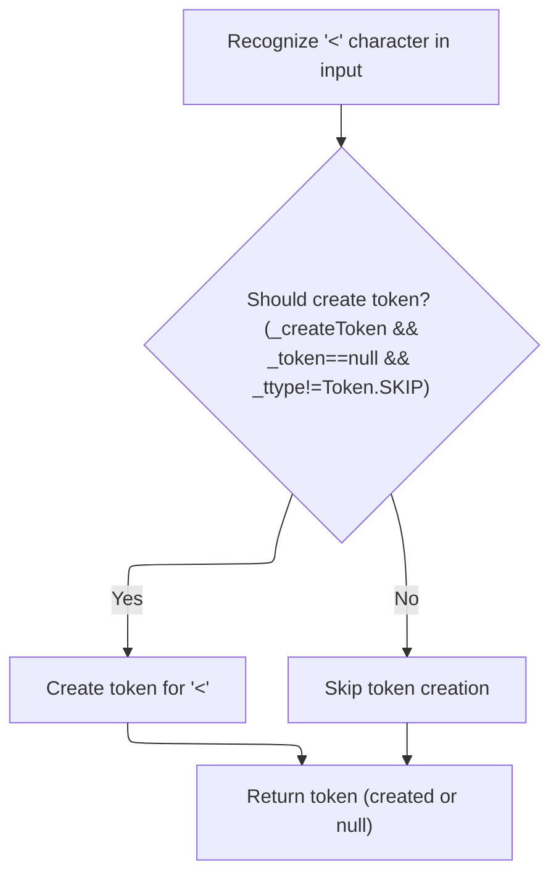

<SwmSnippet path="/core/src/main/java/org/apache/struts/validator/validwhen/ValidWhenLexer.java" line="739">

---

In <SwmToken path="core/src/main/java/org/apache/struts/validator/validwhen/ValidWhenLexer.java" pos="739:7:7" line-data="	public final void mLESSTHANSIGN(boolean _createToken) throws RecognitionException, CharStreamException, TokenStreamException {">`mLESSTHANSIGN`</SwmToken>, the lexer matches a single '<' to recognize the less-than operator. We call ActionConfigMatcher next so the token is mapped to the right action configuration, letting the parser handle less-than checks in validation rules.

```java
	public final void mLESSTHANSIGN(boolean _createToken) throws RecognitionException, CharStreamException, TokenStreamException {
		int _ttype; Token _token=null; int _begin=text.length();
		_ttype = LESSTHANSIGN;
		int _saveIndex;
		
		match('<');
```

---

</SwmSnippet>

<SwmSnippet path="/core/src/main/java/org/apache/struts/validator/validwhen/ValidWhenLexer.java" line="745">

---

After ActionConfigMatcher, <SwmToken path="core/src/main/java/org/apache/struts/validator/validwhen/ValidWhenLexer.java" pos="169:1:1" line-data="						mLESSTHANSIGN(true);">`mLESSTHANSIGN`</SwmToken> finalizes the token for the less-than operator, linking it to the right action configuration. This lets the parser handle less-than checks in validation rules.

```java
		if ( _createToken && _token==null && _ttype!=Token.SKIP ) {
			_token = makeToken(_ttype);
			_token.setText(new String(text.getBuffer(), _begin, text.length()-_begin));
		}
		_returnToken = _token;
	}
```

---

</SwmSnippet>

### Greater-Than Operator Token Detection

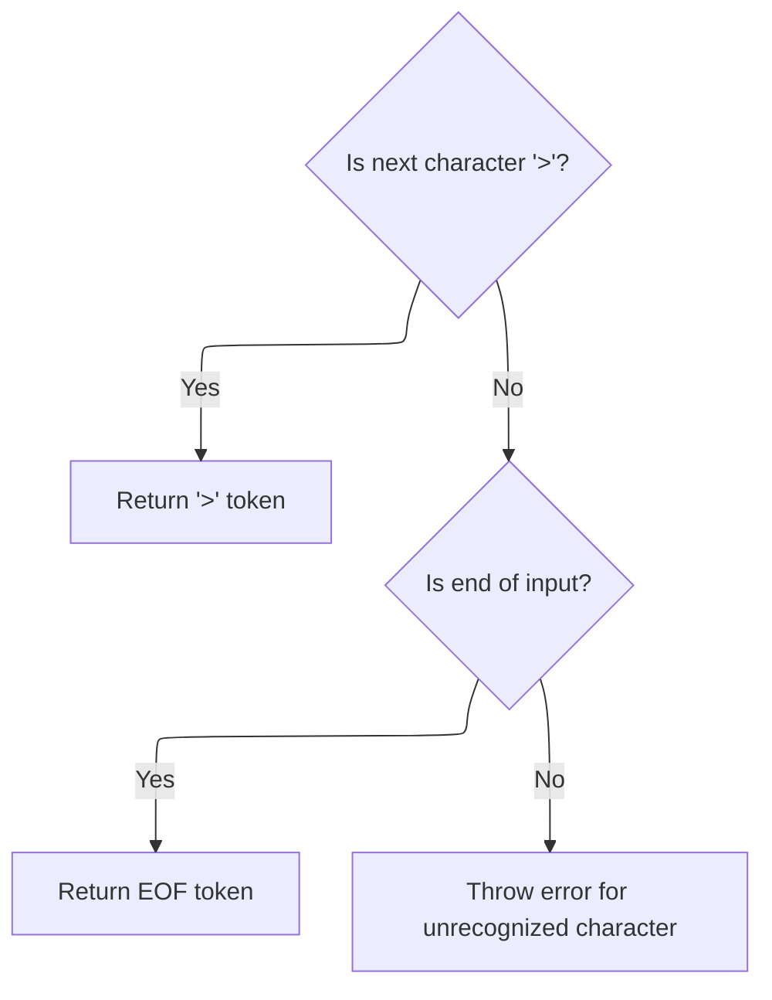

<SwmSnippet path="/core/src/main/java/org/apache/struts/validator/validwhen/ValidWhenLexer.java" line="170">

---

After handling '<', <SwmToken path="extras/src/main/java/org/apache/struts/actions/EventDispatchAction.java" pos="139:9:9" line-data="            String methodKey = st.nextToken().trim();">`nextToken`</SwmToken> checks for '>' and calls <SwmToken path="core/src/main/java/org/apache/struts/validator/validwhen/ValidWhenLexer.java" pos="173:1:1" line-data="						mGREATERTHANSIGN(true);">`mGREATERTHANSIGN`</SwmToken> if found. This is how we detect the greater-than operator, and we keep calling the lexer to process the next segment.

```java
						theRetToken=_returnToken;
					}
					else if ((LA(1)=='>') && (true)) {
						mGREATERTHANSIGN(true);
						theRetToken=_returnToken;
					}
				else {
					if (LA(1)==EOF_CHAR) {uponEOF(); _returnToken = makeToken(Token.EOF_TYPE);}
				else {throw new NoViableAltForCharException((char)LA(1), getFilename(), getLine(), getColumn());}
				}
				}
```

---

</SwmSnippet>

### Greater-Than Operator Recognition

<SwmSnippet path="/core/src/main/java/org/apache/struts/validator/validwhen/ValidWhenLexer.java" line="752">

---

In <SwmToken path="core/src/main/java/org/apache/struts/validator/validwhen/ValidWhenLexer.java" pos="752:7:7" line-data="	public final void mGREATERTHANSIGN(boolean _createToken) throws RecognitionException, CharStreamException, TokenStreamException {">`mGREATERTHANSIGN`</SwmToken>, we're matching the '>' character and setting up the token type for the greater-than operator. After this, we need to call ActionConfigMatcher so the token is mapped to the right action configuration, letting the parser handle greater-than checks in validation rules.

```java
	public final void mGREATERTHANSIGN(boolean _createToken) throws RecognitionException, CharStreamException, TokenStreamException {
		int _ttype; Token _token=null; int _begin=text.length();
		_ttype = GREATERTHANSIGN;
		int _saveIndex;
		
		match('>');
```

---

</SwmSnippet>

<SwmSnippet path="/core/src/main/java/org/apache/struts/validator/validwhen/ValidWhenLexer.java" line="758">

---

After coming back from ActionConfigMatcher, <SwmToken path="core/src/main/java/org/apache/struts/validator/validwhen/ValidWhenLexer.java" pos="173:1:1" line-data="						mGREATERTHANSIGN(true);">`mGREATERTHANSIGN`</SwmToken> finalizes the token creation for the greater-than operator and sets its text. Now the token is linked to the right action configuration, so the parser can process it correctly.

```java
		if ( _createToken && _token==null && _ttype!=Token.SKIP ) {
			_token = makeToken(_ttype);
			_token.setText(new String(text.getBuffer(), _begin, text.length()-_begin));
		}
		_returnToken = _token;
	}
```

---

</SwmSnippet>

### Finalizing Token and Returning to Parser

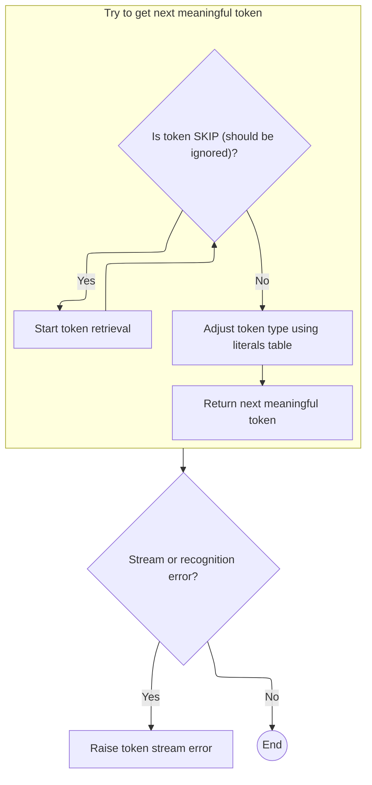

<SwmSnippet path="/core/src/main/java/org/apache/struts/validator/validwhen/ValidWhenLexer.java" line="181">

---

Back in <SwmToken path="extras/src/main/java/org/apache/struts/actions/EventDispatchAction.java" pos="139:9:9" line-data="            String methodKey = st.nextToken().trim();">`nextToken`</SwmToken>, after handling the token from <SwmToken path="core/src/main/java/org/apache/struts/validator/validwhen/ValidWhenLexer.java" pos="173:1:1" line-data="						mGREATERTHANSIGN(true);">`mGREATERTHANSIGN`</SwmToken>, we check for SKIP tokens, update the token type with <SwmToken path="core/src/main/java/org/apache/struts/validator/validwhen/ValidWhenLexer.java" pos="183:5:5" line-data="				_ttype = testLiteralsTable(_ttype);">`testLiteralsTable`</SwmToken>, and return the token. Next, we call <SwmToken path="faces/src/main/java/org/apache/struts/faces/component/CommandLinkComponent.java" pos="37:4:4" line-data="public class CommandLinkComponent extends UICommand {">`CommandLinkComponent`</SwmToken> to resolve dynamic properties like 'type' that might affect how the token is used in the JSF context.

```java
				if ( _returnToken==null ) continue tryAgain; // found SKIP token
				_ttype = _returnToken.getType();
				_ttype = testLiteralsTable(_ttype);
				_returnToken.setType(_ttype);
				return _returnToken;
			}
			catch (RecognitionException e) {
				throw new TokenStreamRecognitionException(e);
			}
		}
```

---

</SwmSnippet>

<SwmSnippet path="/faces/src/main/java/org/apache/struts/faces/component/CommandLinkComponent.java" line="434">

---

<SwmToken path="faces/src/main/java/org/apache/struts/faces/component/CommandLinkComponent.java" pos="434:5:5" line-data="    public String getType() {">`getType`</SwmToken> first checks if there's a <SwmToken path="faces/src/main/java/org/apache/struts/faces/component/CommandLinkComponent.java" pos="435:1:1" line-data="        ValueBinding vb = getValueBinding(&quot;type&quot;);">`ValueBinding`</SwmToken> for 'type' so it can resolve the value dynamically using the current <SwmToken path="faces/src/main/java/org/apache/struts/faces/component/CommandLinkComponent.java" pos="26:8:8" line-data="import javax.faces.context.FacesContext;">`FacesContext`</SwmToken>. If not, it just returns the local 'type' variable. This way, the property can be either static or dynamic depending on how the component is used.

```java
    public String getType() {
        ValueBinding vb = getValueBinding("type");
        if (vb != null) {
            return (String) vb.getValue(getFacesContext());
        } else {
            return type;
        }
    }
```

---

</SwmSnippet>

<SwmSnippet path="/core/src/main/java/org/apache/struts/validator/validwhen/ValidWhenLexer.java" line="191">

---

After resolving the type in <SwmToken path="faces/src/main/java/org/apache/struts/faces/component/CommandLinkComponent.java" pos="37:4:4" line-data="public class CommandLinkComponent extends UICommand {">`CommandLinkComponent`</SwmToken>, the lexer in <SwmToken path="extras/src/main/java/org/apache/struts/actions/EventDispatchAction.java" pos="139:9:9" line-data="            String methodKey = st.nextToken().trim();">`nextToken`</SwmToken> handles any CharStream or <SwmToken path="core/src/main/java/org/apache/struts/validator/validwhen/ValidWhenLexer.java" pos="48:4:4" line-data="import antlr.TokenStream;">`TokenStream`</SwmToken> exceptions that might come up during tokenization. This keeps the flow robust, especially if dynamic properties affect the input stream.

```java
		catch (CharStreamException cse) {
			if ( cse instanceof CharStreamIOException ) {
				throw new TokenStreamIOException(((CharStreamIOException)cse).io);
			}
			else {
				throw new TokenStreamException(cse.getMessage());
			}
		}
	}
}
```

---

</SwmSnippet>

## Final Method Name Resolution

```mermaid
%%{init: {"flowchart": {"defaultRenderer": "elk"}} }%%
flowchart TD
    node1["Start: Determine method to dispatch"] --> node2{"Is method key an alias (contains '=')?"}
    click node1 openCode "extras/src/main/java/org/apache/struts/actions/EventDispatchAction.java:140:164"
    node2 -->|"Yes"| node3["Extract method name from alias"]
    click node2 openCode "extras/src/main/java/org/apache/struts/actions/EventDispatchAction.java:144:148"
    node2 -->|"No"| node4["Use method key as method name"]
    click node3 openCode "extras/src/main/java/org/apache/struts/actions/EventDispatchAction.java:146:147"
    click node4 openCode "extras/src/main/java/org/apache/struts/actions/EventDispatchAction.java:140:141"
    node3 --> node5{"Is method key the default?"}
    node4 --> node5
    click node5 openCode "extras/src/main/java/org/apache/struts/actions/EventDispatchAction.java:151:153"
    node5 -->|"Yes"| node6["Set as default method name"]
    node5 -->|"No"| node7{"Does request have parameter for method
key or image suffix (.x)?"}
    click node6 openCode "extras/src/main/java/org/apache/struts/actions/EventDispatchAction.java:152:153"
    node6 --> node7
    node7 -->|"Yes"| node8["Return method name"]
    click node7 openCode "extras/src/main/java/org/apache/struts/actions/EventDispatchAction.java:157:160"
    click node8 openCode "extras/src/main/java/org/apache/struts/actions/EventDispatchAction.java:159:160"
    node7 -->|"No"| node9["Return default method name"]
    click node9 openCode "extras/src/main/java/org/apache/struts/actions/EventDispatchAction.java:163:164"

classDef HeadingStyle fill:#777777,stroke:#333,stroke-width:2px;

%% Swimm:
%% %%{init: {"flowchart": {"defaultRenderer": "elk"}} }%%
%% flowchart TD
%%     node1["Start: Determine method to dispatch"] --> node2{"Is method key an alias (contains '=')?"}
%%     click node1 openCode "<SwmPath>[extras/…/actions/EventDispatchAction.java](extras/src/main/java/org/apache/struts/actions/EventDispatchAction.java)</SwmPath>:140:164"
%%     node2 -->|"Yes"| node3["Extract method name from alias"]
%%     click node2 openCode "<SwmPath>[extras/…/actions/EventDispatchAction.java](extras/src/main/java/org/apache/struts/actions/EventDispatchAction.java)</SwmPath>:144:148"
%%     node2 -->|"No"| node4["Use method key as method name"]
%%     click node3 openCode "<SwmPath>[extras/…/actions/EventDispatchAction.java](extras/src/main/java/org/apache/struts/actions/EventDispatchAction.java)</SwmPath>:146:147"
%%     click node4 openCode "<SwmPath>[extras/…/actions/EventDispatchAction.java](extras/src/main/java/org/apache/struts/actions/EventDispatchAction.java)</SwmPath>:140:141"
%%     node3 --> node5{"Is method key the default?"}
%%     node4 --> node5
%%     click node5 openCode "<SwmPath>[extras/…/actions/EventDispatchAction.java](extras/src/main/java/org/apache/struts/actions/EventDispatchAction.java)</SwmPath>:151:153"
%%     node5 -->|"Yes"| node6["Set as default method name"]
%%     node5 -->|"No"| node7{"Does request have parameter for method
%% key or image suffix (.x)?"}
%%     click node6 openCode "<SwmPath>[extras/…/actions/EventDispatchAction.java](extras/src/main/java/org/apache/struts/actions/EventDispatchAction.java)</SwmPath>:152:153"
%%     node6 --> node7
%%     node7 -->|"Yes"| node8["Return method name"]
%%     click node7 openCode "<SwmPath>[extras/…/actions/EventDispatchAction.java](extras/src/main/java/org/apache/struts/actions/EventDispatchAction.java)</SwmPath>:157:160"
%%     click node8 openCode "<SwmPath>[extras/…/actions/EventDispatchAction.java](extras/src/main/java/org/apache/struts/actions/EventDispatchAction.java)</SwmPath>:159:160"
%%     node7 -->|"No"| node9["Return default method name"]
%%     click node9 openCode "<SwmPath>[extras/…/actions/EventDispatchAction.java](extras/src/main/java/org/apache/struts/actions/EventDispatchAction.java)</SwmPath>:163:164"
%% 
%% classDef HeadingStyle fill:#777777,stroke:#333,stroke-width:2px;
```

<SwmSnippet path="/extras/src/main/java/org/apache/struts/actions/EventDispatchAction.java" line="140">

---

After tokenizing and checking each method key and alias in <SwmToken path="extras/src/main/java/org/apache/struts/actions/EventDispatchAction.java" pos="131:5:5" line-data="    protected String getMethodName(ActionMapping mapping, ActionForm form,">`getMethodName`</SwmToken>, we look for matching parameters in the request, including image button suffixes. If nothing matches, we return the default. Next, we call <SwmToken path="core/src/main/java/org/apache/struts/upload/MultipartRequestWrapper.java" pos="38:4:4" line-data="public class MultipartRequestWrapper extends HttpServletRequestWrapper {">`MultipartRequestWrapper`</SwmToken> to handle cases where parameters might come from multipart form data, not just standard requests.

```java
            String methodName = methodKey;

            // The key can either be a direct method name or an alias
            // to a method as indicated by a "key=value" signature
            int equals = methodKey.indexOf('=');
            if (equals > -1) {
                methodName = methodKey.substring(equals + 1).trim();
                methodKey = methodKey.substring(0, equals).trim();
            }

            // Set the default if it passes by
            if (methodKey.equals(DEFAULT_METHOD_KEY)) {
                defaultMethodName = methodName;
            }

            // If the method key exists as a standalone parameter or with
            // the image suffixes (.x/.y), the method name has been found.
            if ((request.getParameter(methodKey) != null)
                  || (request.getParameter(methodKey + ".x") != null)) {
                return methodName;
            }
        }

        return defaultMethodName;
    }
```

---

</SwmSnippet>

# Parameter Lookup in Multipart Requests

<SwmSnippet path="/core/src/main/java/org/apache/struts/upload/MultipartRequestWrapper.java" line="75">

---

In <SwmToken path="core/src/main/java/org/apache/struts/upload/MultipartRequestWrapper.java" pos="75:5:5" line-data="    public String getParameter(String name) {">`getParameter`</SwmToken>, we first try to get the parameter from the underlying request. If it's not there, we check our own parameters map and return the first value if present. Next, we call <SwmToken path="core/src/main/java/org/apache/struts/chain/contexts/ServletActionContext.java" pos="39:4:4" line-data="public class ServletActionContext extends WebActionContext {">`ServletActionContext`</SwmToken> to get the actual <SwmToken path="extras/src/main/java/org/apache/struts/actions/EventDispatchAction.java" pos="132:1:1" line-data="            HttpServletRequest request, HttpServletResponse response,">`HttpServletRequest`</SwmToken> for cases where the parameter isn't in the wrapper.

```java
    public String getParameter(String name) {
        String value = getRequest().getParameter(name);

```

---

</SwmSnippet>

## Accessing the Underlying Servlet Request

<SwmSnippet path="/core/src/main/java/org/apache/struts/chain/contexts/ServletActionContext.java" line="94">

---

<SwmToken path="core/src/main/java/org/apache/struts/chain/contexts/ServletActionContext.java" pos="94:5:5" line-data="    public HttpServletRequest getRequest() {">`getRequest`</SwmToken> just delegates to <SwmToken path="core/src/main/java/org/apache/struts/chain/contexts/ServletActionContext.java" pos="95:3:5" line-data="        return servletWebContext().getRequest();">`servletWebContext()`</SwmToken><SwmToken path="core/src/main/java/org/apache/struts/chain/contexts/ServletActionContext.java" pos="95:6:9" line-data="        return servletWebContext().getRequest();">`.getRequest()`</SwmToken> to grab the real <SwmToken path="core/src/main/java/org/apache/struts/chain/contexts/ServletActionContext.java" pos="94:3:3" line-data="    public HttpServletRequest getRequest() {">`HttpServletRequest`</SwmToken>. Next, we call <SwmToken path="core/src/main/java/org/apache/struts/chain/contexts/ServletActionContext.java" pos="95:3:3" line-data="        return servletWebContext().getRequest();">`servletWebContext`</SwmToken> to get the actual context instance holding the request.

```java
    public HttpServletRequest getRequest() {
        return servletWebContext().getRequest();
    }
```

---

</SwmSnippet>

<SwmSnippet path="/core/src/main/java/org/apache/struts/chain/contexts/ServletActionContext.java" line="67">

---

<SwmToken path="core/src/main/java/org/apache/struts/chain/contexts/ServletActionContext.java" pos="67:5:5" line-data="    protected ServletWebContext servletWebContext() {">`servletWebContext`</SwmToken> just casts <SwmToken path="core/src/main/java/org/apache/struts/chain/contexts/ServletActionContext.java" pos="68:9:11" line-data="        return (ServletWebContext) this.getBaseContext();">`getBaseContext()`</SwmToken> to <SwmToken path="core/src/main/java/org/apache/struts/chain/contexts/ServletActionContext.java" pos="67:3:3" line-data="    protected ServletWebContext servletWebContext() {">`ServletWebContext`</SwmToken>. There's no type check, so if the context isn't set up right, you'll get a ClassCastException. This is standard for context hierarchies in Java.

```java
    protected ServletWebContext servletWebContext() {
        return (ServletWebContext) this.getBaseContext();
    }
```

---

</SwmSnippet>

## Fallback Parameter Retrieval

<SwmSnippet path="/core/src/main/java/org/apache/struts/upload/MultipartRequestWrapper.java" line="78">

---

After getting back from <SwmToken path="core/src/main/java/org/apache/struts/chain/contexts/ServletActionContext.java" pos="39:4:4" line-data="public class ServletActionContext extends WebActionContext {">`ServletActionContext`</SwmToken>, <SwmToken path="extras/src/main/java/org/apache/struts/actions/EventDispatchAction.java" pos="157:7:7" line-data="            if ((request.getParameter(methodKey) != null)">`getParameter`</SwmToken> checks the parameters map for a String array if the request didn't have the value. If it finds one, it returns the first element. This fallback handles both single and multi-valued parameters from multipart forms.

```java
        if (value == null) {
            String[] mValue = (String[]) parameters.get(name);

            if ((mValue != null) && (mValue.length > 0)) {
                value = mValue[0];
            }
        }

        return value;
    }
```

---

</SwmSnippet>

&nbsp;

*This is an auto-generated document by Swimm 🌊 and has not yet been verified by a human*

<SwmMeta version="3.0.0" repo-id="Z2l0aHViJTNBJTNBc3RydXRzMSUzQSUzQVN3aW1tLURlbW8=" repo-name="struts1"><sup>Powered by [Swimm](https://app.swimm.io/)</sup></SwmMeta>
