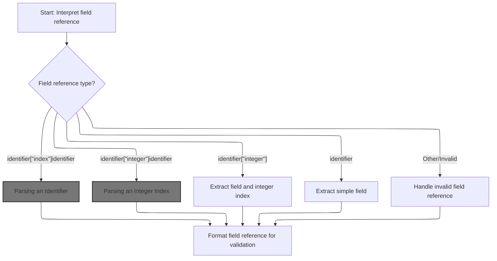
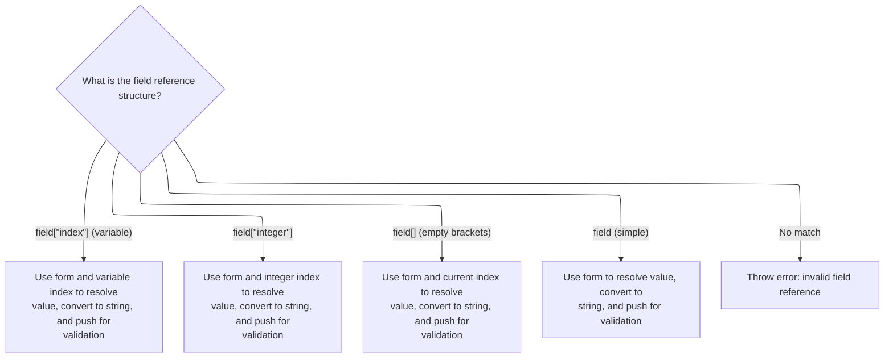
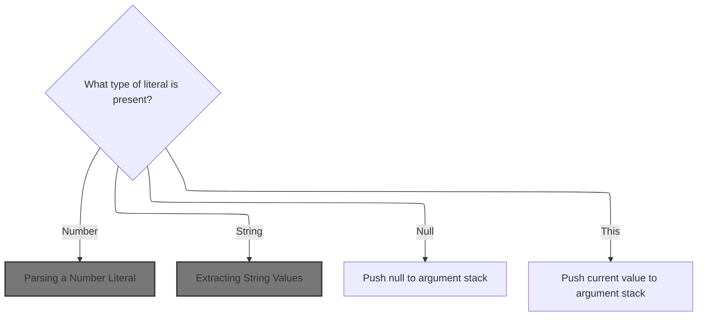
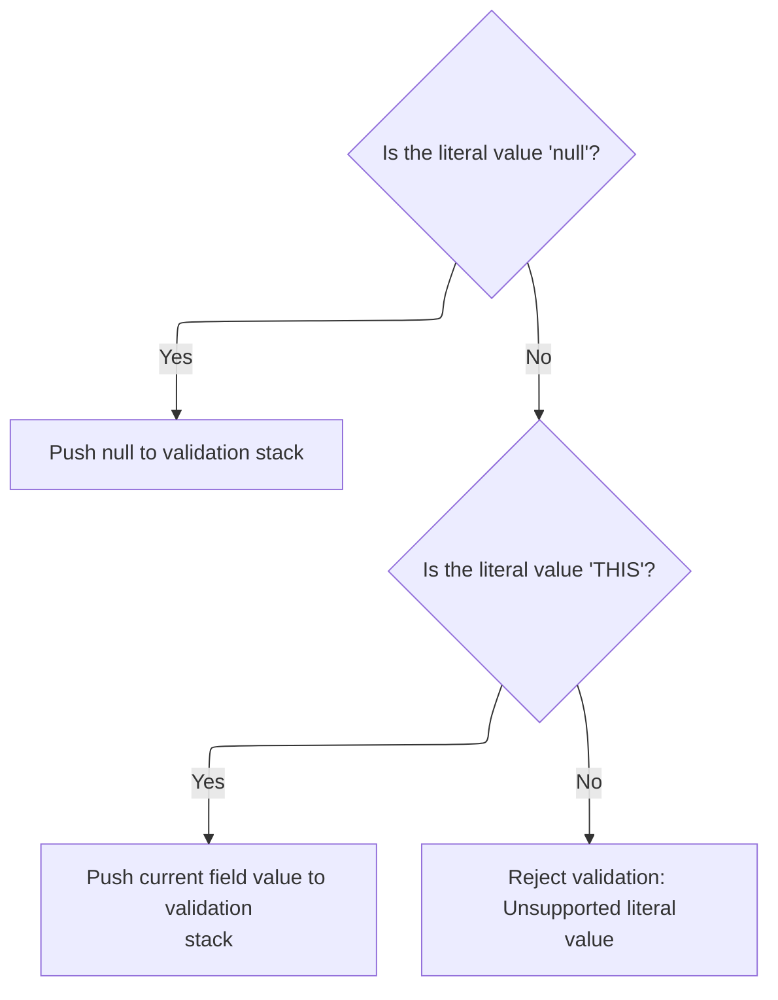

This document describes how value expressions are interpreted and resolved for use in form validation and message rendering. Value expressions may reference other form fields or use literal values such as numbers, strings, null, or special keywords. The flow determines the type of expression, resolves the value, and provides it for validation or dynamic messaging.

# Parsing a Value Expression

<SwmSnippet path="/core/src/main/java/org/apache/struts/validator/validwhen/ValidWhenParser.java" line="379">

---

In <SwmToken path="core/src/main/java/org/apache/struts/validator/validwhen/ValidWhenParser.java" pos="379:7:7" line-data="	public final void value() throws RecognitionException, TokenStreamException {">`value`</SwmToken>, the parser checks if the next token is an IDENTIFIER. If so, it calls field() to parse a field reference, which lets the expression refer to another form field. This is how the parser supports dynamic validation rules based on other fields.

```java
	public final void value() throws RecognitionException, TokenStreamException {
		
		
		switch ( LA(1)) {
		case IDENTIFIER:
		{
			field();
			break;
		}
		case DECIMAL_LITERAL:
		case DEC_INT_LITERAL:
		case HEX_INT_LITERAL:
		case OCTAL_INT_LITERAL:
		case STRING_LITERAL:
		case LITERAL_null:
```

---

</SwmSnippet>

## Parsing a Field Reference



<SwmSnippet path="/core/src/main/java/org/apache/struts/validator/validwhen/ValidWhenParser.java" line="288">

---

In <SwmToken path="core/src/main/java/org/apache/struts/validator/validwhen/ValidWhenParser.java" pos="288:7:7" line-data="	public final void field() throws RecognitionException, TokenStreamException {">`field`</SwmToken>, the parser inspects the next few tokens to decide which field reference pattern is present. It calls identifier() first because every valid field reference starts with an identifier, and the following tokens determine the exact structure.

```java
	public final void field() throws RecognitionException, TokenStreamException {
		
		
		if ((LA(1)==IDENTIFIER) && (LA(2)==LBRACKET) && (LA(3)==RBRACKET) && (LA(4)==IDENTIFIER)) {
			identifier();
```

---

</SwmSnippet>

### Parsing an Identifier

<SwmSnippet path="/core/src/main/java/org/apache/struts/validator/validwhen/ValidWhenParser.java" line="279">

---

In <SwmToken path="core/src/main/java/org/apache/struts/validator/validwhen/ValidWhenParser.java" pos="279:7:7" line-data="	public final void identifier() throws RecognitionException, TokenStreamException {">`identifier`</SwmToken>, the parser matches an IDENTIFIER token and pushes its text onto <SwmToken path="core/src/main/java/org/apache/struts/validator/validwhen/ValidWhenParser.java" pos="209:1:1" line-data="		argStack.push(new BigDecimal(d.getText()));">`argStack`</SwmToken>. This sets up the stack for later steps that build field references or expressions.

```java
	public final void identifier() throws RecognitionException, TokenStreamException {
		
		Token  str = null;
		
		str = LT(1);
		match(IDENTIFIER);
```

---

</SwmSnippet>

<SwmSnippet path="/core/src/main/java/org/apache/struts/validator/validwhen/ValidWhenParser.java" line="285">

---

Back in ValidWhenParser.identifier, after pushing the identifier text to <SwmToken path="core/src/main/java/org/apache/struts/validator/validwhen/ValidWhenParser.java" pos="285:1:1" line-data="		argStack.push(str.getText());">`argStack`</SwmToken>, the flow can move to message rendering, where the parsed identifier might be used as a message key or argument.

```java
		argStack.push(str.getText());
	}
```

---

</SwmSnippet>

### Resolving a Localized Message

```mermaid
%%{init: {"flowchart": {"defaultRenderer": "elk"}} }%%
flowchart TD
  node1{"Is custom bundle specified?"}
  click node1 openCode "faces/src/main/java/org/apache/struts/faces/renderer/MessageRenderer.java:79:82"
  node1 -->|"Yes"| node2["Use custom bundle"]
  click node2 openCode "faces/src/main/java/org/apache/struts/faces/renderer/MessageRenderer.java:79:80"
  node1 -->|"No"| node3["Use default bundle"]
  click node3 openCode "faces/src/main/java/org/apache/struts/faces/renderer/MessageRenderer.java:81:82"
  node2 --> node4{"Is message key provided?"}
  node3 --> node4
  click node4 openCode "faces/src/main/java/org/apache/struts/faces/renderer/MessageRenderer.java:91:94"
  node4 -->|"Yes"| node5["Use provided key"]
  click node5 openCode "faces/src/main/java/org/apache/struts/faces/renderer/MessageRenderer.java:91:92"
  node4 -->|"No"| node6["Use component value as key"]
  click node6 openCode "faces/src/main/java/org/apache/struts/faces/renderer/MessageRenderer.java:93:94"
  node5 --> node7
  node6 --> node7
  subgraph loop1["For each child component"]
    node7["Collect substitution parameters"]
    click node7 openCode "faces/src/main/java/org/apache/struts/faces/renderer/MessageRenderer.java:104:111"
    node7 --> node8{"Is child a parameter?"}
    click node8 openCode "faces/src/main/java/org/apache/struts/faces/renderer/MessageRenderer.java:107:108"
    node8 -->|"Yes"| node9["Add parameter to list"]
    click node9 openCode "faces/src/main/java/org/apache/struts/faces/renderer/MessageRenderer.java:110:110"
    node8 -->|"No"| node7
  end
  node7 --> node10["Retrieve localized message"]
  click node10 openCode "faces/src/main/java/org/apache/struts/faces/renderer/MessageRenderer.java:115:116"
  node10 --> node11{"Filter message?"}
  click node11 openCode "faces/src/main/java/org/apache/struts/faces/renderer/MessageRenderer.java:117:120"
  node11 -->|"Yes"| node12["Return filtered message"]
  click node12 openCode "faces/src/main/java/org/apache/struts/faces/renderer/MessageRenderer.java:122:122"
  node11 -->|"No"| node13["Return message as is"]
  click node13 openCode "faces/src/main/java/org/apache/struts/faces/renderer/MessageRenderer.java:124:124"

classDef HeadingStyle fill:#777777,stroke:#333,stroke-width:2px;

%% Swimm:
%% %%{init: {"flowchart": {"defaultRenderer": "elk"}} }%%
%% flowchart TD
%%   node1{"Is custom bundle specified?"}
%%   click node1 openCode "<SwmPath>[faces/…/renderer/MessageRenderer.java](faces/src/main/java/org/apache/struts/faces/renderer/MessageRenderer.java)</SwmPath>:79:82"
%%   node1 -->|"Yes"| node2["Use custom bundle"]
%%   click node2 openCode "<SwmPath>[faces/…/renderer/MessageRenderer.java](faces/src/main/java/org/apache/struts/faces/renderer/MessageRenderer.java)</SwmPath>:79:80"
%%   node1 -->|"No"| node3["Use default bundle"]
%%   click node3 openCode "<SwmPath>[faces/…/renderer/MessageRenderer.java](faces/src/main/java/org/apache/struts/faces/renderer/MessageRenderer.java)</SwmPath>:81:82"
%%   node2 --> node4{"Is message key provided?"}
%%   node3 --> node4
%%   click node4 openCode "<SwmPath>[faces/…/renderer/MessageRenderer.java](faces/src/main/java/org/apache/struts/faces/renderer/MessageRenderer.java)</SwmPath>:91:94"
%%   node4 -->|"Yes"| node5["Use provided key"]
%%   click node5 openCode "<SwmPath>[faces/…/renderer/MessageRenderer.java](faces/src/main/java/org/apache/struts/faces/renderer/MessageRenderer.java)</SwmPath>:91:92"
%%   node4 -->|"No"| node6["Use component value as key"]
%%   click node6 openCode "<SwmPath>[faces/…/renderer/MessageRenderer.java](faces/src/main/java/org/apache/struts/faces/renderer/MessageRenderer.java)</SwmPath>:93:94"
%%   node5 --> node7
%%   node6 --> node7
%%   subgraph loop1["For each child component"]
%%     node7["Collect substitution parameters"]
%%     click node7 openCode "<SwmPath>[faces/…/renderer/MessageRenderer.java](faces/src/main/java/org/apache/struts/faces/renderer/MessageRenderer.java)</SwmPath>:104:111"
%%     node7 --> node8{"Is child a parameter?"}
%%     click node8 openCode "<SwmPath>[faces/…/renderer/MessageRenderer.java](faces/src/main/java/org/apache/struts/faces/renderer/MessageRenderer.java)</SwmPath>:107:108"
%%     node8 -->|"Yes"| node9["Add parameter to list"]
%%     click node9 openCode "<SwmPath>[faces/…/renderer/MessageRenderer.java](faces/src/main/java/org/apache/struts/faces/renderer/MessageRenderer.java)</SwmPath>:110:110"
%%     node8 -->|"No"| node7
%%   end
%%   node7 --> node10["Retrieve localized message"]
%%   click node10 openCode "<SwmPath>[faces/…/renderer/MessageRenderer.java](faces/src/main/java/org/apache/struts/faces/renderer/MessageRenderer.java)</SwmPath>:115:116"
%%   node10 --> node11{"Filter message?"}
%%   click node11 openCode "<SwmPath>[faces/…/renderer/MessageRenderer.java](faces/src/main/java/org/apache/struts/faces/renderer/MessageRenderer.java)</SwmPath>:117:120"
%%   node11 -->|"Yes"| node12["Return filtered message"]
%%   click node12 openCode "<SwmPath>[faces/…/renderer/MessageRenderer.java](faces/src/main/java/org/apache/struts/faces/renderer/MessageRenderer.java)</SwmPath>:122:122"
%%   node11 -->|"No"| node13["Return message as is"]
%%   click node13 openCode "<SwmPath>[faces/…/renderer/MessageRenderer.java](faces/src/main/java/org/apache/struts/faces/renderer/MessageRenderer.java)</SwmPath>:124:124"
%% 
%% classDef HeadingStyle fill:#777777,stroke:#333,stroke-width:2px;
```



<SwmSnippet path="/faces/src/main/java/org/apache/struts/faces/renderer/MessageRenderer.java" line="76">

---

In <SwmToken path="faces/src/main/java/org/apache/struts/faces/renderer/MessageRenderer.java" pos="76:5:5" line-data="    protected String getText(FacesContext context, UIComponent component) {">`getText`</SwmToken>, the function looks up the message resource bundle, figures out the message key (from the 'key' attribute or the component's value), and collects substitution arguments from child <SwmToken path="faces/src/main/java/org/apache/struts/faces/renderer/MessageRenderer.java" pos="107:10:10" line-data="            if (!(kid instanceof UIParameter)) {">`UIParameter`</SwmToken> components. This setup allows for dynamic, localized messages.

```java
    protected String getText(FacesContext context, UIComponent component) {

        // Look up the MessageResources bundle to be used
        String bundle = (String) component.getAttributes().get("bundle");
        if (bundle == null) {
            bundle = Globals.MESSAGES_KEY;
        }
        MessageResources resources = (MessageResources)
            context.getExternalContext().getApplicationMap().get(bundle);
        if (resources == null) { // FIXME - i18n
            throw new IllegalArgumentException("MessageResources bundle " +
                                               bundle + " not found");
        }

        // Look up the message key to be used
        Object value = component.getAttributes().get("key");
        if (value == null) {
            value = ((ValueHolder) component).getValue();
        }
        if (value == null) { // FIXME - i18n
            throw new NullPointerException("Component '" +
                                           component.getClientId(context) +
                                           "' has no current value");
        }
        String key = value.toString();

        // Build the substitution arguments list
        ArrayList list = new ArrayList();
        Iterator kids = component.getChildren().iterator();
        while (kids.hasNext()) {
            UIComponent kid = (UIComponent) kids.next();
            if (!(kid instanceof UIParameter)) {
                continue;
            }
            list.add(((UIParameter) kid).getValue());
        }
```

---

</SwmSnippet>

<SwmSnippet path="/faces/src/main/java/org/apache/struts/faces/renderer/MessageRenderer.java" line="112">

---

Here, the function fetches the localized message string using the key and arguments, then returns it—optionally filtered for safe HTML output if the 'filter' attribute is set.

```java
        Object args[] = list.toArray(new Object[list.size()]);

        // Look up the requested message
        String text = resources.getMessage(context.getViewRoot().getLocale(),
                                           key, args);
        Boolean filter = (Boolean) component.getAttributes().get("filter");
        if (filter == null) {
            filter = Boolean.FALSE;
        }
        if (filter.booleanValue()) {
            return (ResponseUtils.filter(text));
        } else {
            return (text);
        }

    }
```

---

</SwmSnippet>

### Matching Brackets After Field Name

<SwmSnippet path="/core/src/main/java/org/apache/struts/validator/validwhen/ValidWhenParser.java" line="293">

---

Back in ValidWhenParser.field, after parsing an identifier, the parser matches LBRACKET and RBRACKET to handle field references with empty brackets, signaling an indexed field.

```java
			match(LBRACKET);
			match(RBRACKET);
```

---

</SwmSnippet>

<SwmSnippet path="/core/src/main/java/org/apache/struts/validator/validwhen/ValidWhenParser.java" line="295">

---

Next in ValidWhenParser.field, after matching brackets, the parser expects another identifier, which lets it handle nested or related field references.

```java
			identifier();
			
```

---

</SwmSnippet>

<SwmSnippet path="/core/src/main/java/org/apache/struts/validator/validwhen/ValidWhenParser.java" line="297">

---

Here, ValidWhenParser.field pops two items from <SwmToken path="core/src/main/java/org/apache/struts/validator/validwhen/ValidWhenParser.java" pos="297:7:7" line-data="			Object i2 = argStack.pop();">`argStack`</SwmToken>, builds a field reference string with the current index, and pushes the resolved value using <SwmToken path="core/src/main/java/org/apache/struts/validator/validwhen/ValidWhenParser.java" pos="299:5:5" line-data="			argStack.push(ValidatorUtils.getValueAsString(form, i1 + &quot;[&quot; + index + &quot;]&quot; + i2));">`ValidatorUtils`</SwmToken>. This ties the parsed tokens to actual form data.

```java
			Object i2 = argStack.pop();
			Object i1 = argStack.pop();
			argStack.push(ValidatorUtils.getValueAsString(form, i1 + "[" + index + "]" + i2));
		}
```

---

</SwmSnippet>

<SwmSnippet path="/core/src/main/java/org/apache/struts/validator/validwhen/ValidWhenParser.java" line="301">

---

Next in ValidWhenParser.field, the parser checks for another field reference pattern and calls identifier() again, supporting more complex or nested field references.

```java
		else if ((LA(1)==IDENTIFIER) && (LA(2)==LBRACKET) && ((LA(3) >= DEC_INT_LITERAL && LA(3) <= OCTAL_INT_LITERAL)) && (LA(4)==RBRACKET) && (LA(5)==IDENTIFIER)) {
			identifier();
```

---

</SwmSnippet>

<SwmSnippet path="/core/src/main/java/org/apache/struts/validator/validwhen/ValidWhenParser.java" line="303">

---

Back in ValidWhenParser.field, after parsing another identifier, the parser matches LBRACKET to handle indexed field access, prepping for an integer index.

```java
			match(LBRACKET);
```

---

</SwmSnippet>

<SwmSnippet path="/core/src/main/java/org/apache/struts/validator/validwhen/ValidWhenParser.java" line="304">

---

Next in ValidWhenParser.field, after matching LBRACKET, the parser calls integer() to get the index for the field reference.

```java
			integer();
```

---

</SwmSnippet>

### Parsing an Integer Index

See <SwmLink doc-title="Parsing and Processing Integer Literals in Validation">[Parsing and Processing Integer Literals in Validation](/.swm/parsing-and-processing-integer-literals-in-validation.imyhqxr3.sw.md)</SwmLink>

### Matching Closing Bracket



<SwmSnippet path="/core/src/main/java/org/apache/struts/validator/validwhen/ValidWhenParser.java" line="305">

---

Back in ValidWhenParser.field, after parsing the integer index, the parser matches RBRACKET to close the indexed field reference.

```java
			match(RBRACKET);
```

---

</SwmSnippet>

<SwmSnippet path="/core/src/main/java/org/apache/struts/validator/validwhen/ValidWhenParser.java" line="306">

---

Next in ValidWhenParser.field, after closing the bracket, the parser expects another identifier, enabling references like array\[index\]field.

```java
			identifier();
			
```

---

</SwmSnippet>

<SwmSnippet path="/core/src/main/java/org/apache/struts/validator/validwhen/ValidWhenParser.java" line="308">

---

Here, ValidWhenParser.field pops three items from <SwmToken path="core/src/main/java/org/apache/struts/validator/validwhen/ValidWhenParser.java" pos="308:7:7" line-data="			Object i5 = argStack.pop();">`argStack`</SwmToken>, builds a field reference string with multiple identifiers and indices, and pushes the resolved value using <SwmToken path="core/src/main/java/org/apache/struts/validator/validwhen/ValidWhenParser.java" pos="311:5:5" line-data="			argStack.push(ValidatorUtils.getValueAsString(form, i3 + &quot;[&quot; + i4 + &quot;]&quot; + i5));">`ValidatorUtils`</SwmToken>.

```java
			Object i5 = argStack.pop();
			Object i4 = argStack.pop();
			Object i3 = argStack.pop();
			argStack.push(ValidatorUtils.getValueAsString(form, i3 + "[" + i4 + "]" + i5));
		}
```

---

</SwmSnippet>

<SwmSnippet path="/core/src/main/java/org/apache/struts/validator/validwhen/ValidWhenParser.java" line="313">

---

Next in ValidWhenParser.field, the parser checks for another field reference pattern and calls identifier() again, supporting even more complex or chained field references.

```java
		else if ((LA(1)==IDENTIFIER) && (LA(2)==LBRACKET) && ((LA(3) >= DEC_INT_LITERAL && LA(3) <= OCTAL_INT_LITERAL)) && (LA(4)==RBRACKET) && (_tokenSet_0.member(LA(5)))) {
			identifier();
```

---

</SwmSnippet>

<SwmSnippet path="/core/src/main/java/org/apache/struts/validator/validwhen/ValidWhenParser.java" line="315">

---

Back in ValidWhenParser.field, after parsing another identifier, the parser matches LBRACKET to handle another indexed field access.

```java
			match(LBRACKET);
```

---

</SwmSnippet>

<SwmSnippet path="/core/src/main/java/org/apache/struts/validator/validwhen/ValidWhenParser.java" line="316">

---

Next in ValidWhenParser.field, after matching LBRACKET, the parser calls integer() to get the index for the field reference.

```java
			integer();
```

---

</SwmSnippet>

<SwmSnippet path="/core/src/main/java/org/apache/struts/validator/validwhen/ValidWhenParser.java" line="317">

---

Back in ValidWhenParser.field, after parsing the integer index, the parser matches RBRACKET to close the indexed field reference.

```java
			match(RBRACKET);
			
```

---

</SwmSnippet>

<SwmSnippet path="/core/src/main/java/org/apache/struts/validator/validwhen/ValidWhenParser.java" line="319">

---

Here, ValidWhenParser.field pops two items from <SwmToken path="core/src/main/java/org/apache/struts/validator/validwhen/ValidWhenParser.java" pos="319:7:7" line-data="			Object i7 = argStack.pop();">`argStack`</SwmToken>, builds a field reference string with an identifier and index, and pushes the resolved value using <SwmToken path="core/src/main/java/org/apache/struts/validator/validwhen/ValidWhenParser.java" pos="321:5:5" line-data="			argStack.push(ValidatorUtils.getValueAsString(form, i6 + &quot;[&quot; + i7 + &quot;]&quot;));">`ValidatorUtils`</SwmToken>.

```java
			Object i7 = argStack.pop();
			Object i6 = argStack.pop();
			argStack.push(ValidatorUtils.getValueAsString(form, i6 + "[" + i7 + "]"));
		}
```

---

</SwmSnippet>

<SwmSnippet path="/core/src/main/java/org/apache/struts/validator/validwhen/ValidWhenParser.java" line="323">

---

Next in ValidWhenParser.field, the parser checks for another field reference pattern and calls identifier() again, supporting even more complex or chained field references.

```java
		else if ((LA(1)==IDENTIFIER) && (LA(2)==LBRACKET) && (LA(3)==RBRACKET) && (_tokenSet_0.member(LA(4)))) {
			identifier();
```

---

</SwmSnippet>

<SwmSnippet path="/core/src/main/java/org/apache/struts/validator/validwhen/ValidWhenParser.java" line="325">

---

Back in ValidWhenParser.field, after parsing another identifier, the parser matches LBRACKET and RBRACKET to handle another indexed field reference.

```java
			match(LBRACKET);
			match(RBRACKET);
			
```

---

</SwmSnippet>

<SwmSnippet path="/core/src/main/java/org/apache/struts/validator/validwhen/ValidWhenParser.java" line="328">

---

Here, ValidWhenParser.field pops one item from <SwmToken path="core/src/main/java/org/apache/struts/validator/validwhen/ValidWhenParser.java" pos="328:7:7" line-data="			Object i8 = argStack.pop();">`argStack`</SwmToken>, builds a field reference string with an identifier and index, and pushes the resolved value using <SwmToken path="core/src/main/java/org/apache/struts/validator/validwhen/ValidWhenParser.java" pos="329:5:5" line-data="			argStack.push(ValidatorUtils.getValueAsString(form, i8 + &quot;[&quot; + index + &quot;]&quot;));">`ValidatorUtils`</SwmToken>.

```java
			Object i8 = argStack.pop();
			argStack.push(ValidatorUtils.getValueAsString(form, i8 + "[" + index + "]"));
		}
```

---

</SwmSnippet>

<SwmSnippet path="/core/src/main/java/org/apache/struts/validator/validwhen/ValidWhenParser.java" line="331">

---

Next in ValidWhenParser.field, the parser checks for another field reference pattern and calls identifier() again, supporting even more complex or chained field references.

```java
		else if ((LA(1)==IDENTIFIER) && (_tokenSet_0.member(LA(2)))) {
			identifier();
			
```

---

</SwmSnippet>

<SwmSnippet path="/core/src/main/java/org/apache/struts/validator/validwhen/ValidWhenParser.java" line="334">

---

Finally in ValidWhenParser.field, if only a single identifier is present, the parser pops it from <SwmToken path="core/src/main/java/org/apache/struts/validator/validwhen/ValidWhenParser.java" pos="334:7:7" line-data="			Object i9 = argStack.pop();">`argStack`</SwmToken> and resolves it to a value using <SwmToken path="core/src/main/java/org/apache/struts/validator/validwhen/ValidWhenParser.java" pos="335:5:5" line-data="			argStack.push(ValidatorUtils.getValueAsString(form, (String)i9));">`ValidatorUtils`</SwmToken>. If no patterns match, it throws an exception.

```java
			Object i9 = argStack.pop();
			argStack.push(ValidatorUtils.getValueAsString(form, (String)i9));
		}
		else {
			throw new NoViableAltException(LT(1), getFilename());
		}
		
	}
```

---

</SwmSnippet>

## Handling Literal Values

<SwmSnippet path="/core/src/main/java/org/apache/struts/validator/validwhen/ValidWhenParser.java" line="394">

---

Back in ValidWhenParser.value, if the token isn't an IDENTIFIER, the parser calls literal() to handle constant values like numbers or strings.

```java
		case THIS:
		{
			literal();
			break;
		}
		default:
		{
			throw new NoViableAltException(LT(1), getFilename());
		}
		}
	}
```

---

</SwmSnippet>

# Parsing a Literal



<SwmSnippet path="/core/src/main/java/org/apache/struts/validator/validwhen/ValidWhenParser.java" line="343">

---

In literal, the parser checks if the next token is a numeric literal and calls number() to parse it if so.

```java
	public final void literal() throws RecognitionException, TokenStreamException {
		
		
		switch ( LA(1)) {
		case DECIMAL_LITERAL:
		case DEC_INT_LITERAL:
		case HEX_INT_LITERAL:
		case OCTAL_INT_LITERAL:
		{
			number();
			break;
		}
```

---

</SwmSnippet>

## Parsing a Number Literal

<SwmSnippet path="/core/src/main/java/org/apache/struts/validator/validwhen/ValidWhenParser.java" line="247">

---

In number, the parser checks if the token is a decimal literal and calls decimal() to handle floating-point numbers.

```java
	public final void number() throws RecognitionException, TokenStreamException {
		
		
		switch ( LA(1)) {
		case DECIMAL_LITERAL:
		{
			decimal();
			break;
		}
		case DEC_INT_LITERAL:
		case HEX_INT_LITERAL:
```

---

</SwmSnippet>

### Parsing a Decimal Number

<SwmSnippet path="/core/src/main/java/org/apache/struts/validator/validwhen/ValidWhenParser.java" line="203">

---

In decimal, the parser matches a <SwmToken path="core/src/main/java/org/apache/struts/validator/validwhen/ValidWhenParser.java" pos="208:3:3" line-data="		match(DECIMAL_LITERAL);">`DECIMAL_LITERAL`</SwmToken> token and pushes its text onto <SwmToken path="core/src/main/java/org/apache/struts/validator/validwhen/ValidWhenParser.java" pos="209:1:1" line-data="		argStack.push(new BigDecimal(d.getText()));">`argStack`</SwmToken> for later use.

```java
	public final void decimal() throws RecognitionException, TokenStreamException {
		
		Token  d = null;
		
		d = LT(1);
		match(DECIMAL_LITERAL);
```

---

</SwmSnippet>

<SwmSnippet path="/core/src/main/java/org/apache/struts/validator/validwhen/ValidWhenParser.java" line="209">

---

Here, after ValidWhenParser.decimal pushes the parsed decimal value onto <SwmToken path="core/src/main/java/org/apache/struts/validator/validwhen/ValidWhenParser.java" pos="209:1:1" line-data="		argStack.push(new BigDecimal(d.getText()));">`argStack`</SwmToken>, we return from ActionConfigMatcher and move to <SwmToken path="faces/src/main/java/org/apache/struts/faces/renderer/MessageRenderer.java" pos="47:4:4" line-data="public class MessageRenderer extends WriteRenderer {">`MessageRenderer`</SwmToken>. This lets us use the parsed value for rendering messages, like showing validation errors or feedback to the user.

```java
		argStack.push(new BigDecimal(d.getText()));
	}
```

---

</SwmSnippet>

### Handling Integer Literals

<SwmSnippet path="/core/src/main/java/org/apache/struts/validator/validwhen/ValidWhenParser.java" line="258">

---

Next, after returning from ValidWhenParser.decimal, ValidWhenParser.number checks for integer literals and calls integer() to parse them, so we can handle both decimal and integer values in validation expressions.

```java
		case OCTAL_INT_LITERAL:
		{
			integer();
			break;
		}
		default:
		{
			throw new NoViableAltException(LT(1), getFilename());
		}
		}
	}
```

---

</SwmSnippet>

## Handling String Literals

<SwmSnippet path="/core/src/main/java/org/apache/struts/validator/validwhen/ValidWhenParser.java" line="355">

---

Next, after ValidWhenParser.number, ValidWhenParser.literal checks for string literals and calls string() to parse them, letting us use constant string values in validation rules.

```java
		case STRING_LITERAL:
		{
			string();
			break;
		}
```

---

</SwmSnippet>

## Extracting String Values

<SwmSnippet path="/core/src/main/java/org/apache/struts/validator/validwhen/ValidWhenParser.java" line="270">

---

In ValidWhenParser.string, we match the <SwmToken path="core/src/main/java/org/apache/struts/validator/validwhen/ValidWhenParser.java" pos="275:3:3" line-data="		match(STRING_LITERAL);">`STRING_LITERAL`</SwmToken> token and extract its text. Then we call ActionConfigMatcher to check how this value fits into the action configuration, which can influence validation logic.

```java
	public final void string() throws RecognitionException, TokenStreamException {
		
		Token  str = null;
		
		str = LT(1);
		match(STRING_LITERAL);
```

---

</SwmSnippet>

<SwmSnippet path="/core/src/main/java/org/apache/struts/validator/validwhen/ValidWhenParser.java" line="276">

---

Here, after ValidWhenParser.string pushes the parsed string onto <SwmToken path="core/src/main/java/org/apache/struts/validator/validwhen/ValidWhenParser.java" pos="276:1:1" line-data="		argStack.push(str.getText().substring(1, str.getText().length()-1));">`argStack`</SwmToken>, we return from ActionConfigMatcher and move to <SwmToken path="faces/src/main/java/org/apache/struts/faces/renderer/MessageRenderer.java" pos="47:4:4" line-data="public class MessageRenderer extends WriteRenderer {">`MessageRenderer`</SwmToken>. This lets us use the string value for rendering messages, like showing validation errors or feedback to the user.

```java
		argStack.push(str.getText().substring(1, str.getText().length()-1));
	}
```

---

</SwmSnippet>

## Handling Special Literals



<SwmSnippet path="/core/src/main/java/org/apache/struts/validator/validwhen/ValidWhenParser.java" line="360">

---

Here, after ValidWhenParser.literal pushes null or value onto <SwmToken path="core/src/main/java/org/apache/struts/validator/validwhen/ValidWhenParser.java" pos="363:1:1" line-data="			argStack.push(null);">`argStack`</SwmToken>, we call ActionConfigMatcher to check how these special values fit into the action configuration, which can influence validation logic.

```java
		case LITERAL_null:
		{
			match(LITERAL_null);
			argStack.push(null);
			break;
		}
		case THIS:
		{
			match(THIS);
			argStack.push(value);
			break;
		}
		default:
		{
			throw new NoViableAltException(LT(1), getFilename());
		}
		}
	}
```

---

</SwmSnippet>

&nbsp;

*This is an auto-generated document by Swimm 🌊 and has not yet been verified by a human*

<SwmMeta version="3.0.0" repo-id="Z2l0aHViJTNBJTNBc3RydXRzMSUzQSUzQVN3aW1tLURlbW8=" repo-name="struts1"><sup>Powered by [Swimm](https://app.swimm.io/)</sup></SwmMeta>
