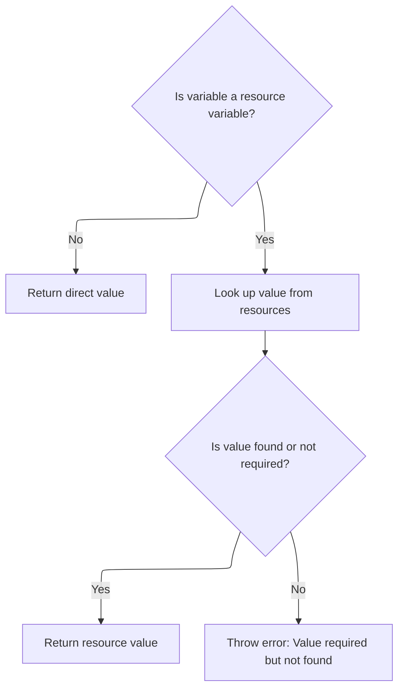
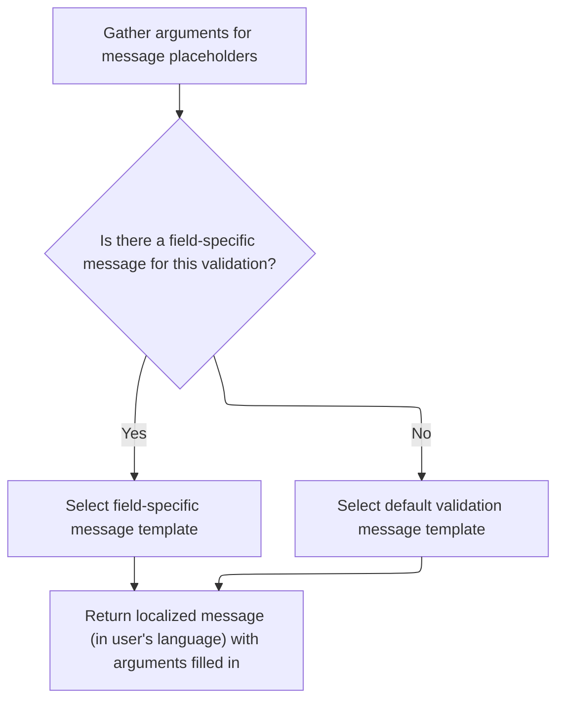

This document explains how variable values are resolved, supporting both direct assignment and dynamic lookup from resource bundles using the user's locale. This enables flexible and localized configuration throughout the application.

# Where is this flow used?

This flow is used multiple times in the codebase as represented in the following diagram:

```mermaid
graph TD;
      3a5d1a11b492e841e6633649897013229893b8a457b055aff736964aabe8ca30(apps/…/validator/CustomValidator.java::CustomValidator.validateTwoFields) --> dfba8cf200d2aa8abc6516e024830574f58f99853774b1a26d8913873d00a9ac(core/…/validator/Resources.java::Resources.getVarValue)

22114997d330b17bf5d42b98ec3618aea845af6ecd007ade0ea39bf7e079af65(core/…/validator/FieldChecks.java::FieldChecks.validateRequiredIf) --> dfba8cf200d2aa8abc6516e024830574f58f99853774b1a26d8913873d00a9ac(core/…/validator/Resources.java::Resources.getVarValue)

28b4cc4072bfb039614fc3464030b23c7a2618d7f6d4cfec51da91c2c1ebad36(faces/…/taglib/JavascriptValidatorTag.java::JavascriptValidatorTag.createDynamicJavascript) --> dfba8cf200d2aa8abc6516e024830574f58f99853774b1a26d8913873d00a9ac(core/…/validator/Resources.java::Resources.getVarValue)

de8991bead9bdfbdfd33ba23fdb3255e20874a62139c81593769ba8af6022f36(faces/…/taglib/JavascriptValidatorTag.java::JavascriptValidatorTag.renderJavascript) --> 28b4cc4072bfb039614fc3464030b23c7a2618d7f6d4cfec51da91c2c1ebad36(faces/…/taglib/JavascriptValidatorTag.java::JavascriptValidatorTag.createDynamicJavascript)

23572e7becf92791caf5edf74db07746e576720d54887a076de50b58bfddfb08(faces/…/taglib/JavascriptValidatorTag.java::JavascriptValidatorTag.doStartTag) --> de8991bead9bdfbdfd33ba23fdb3255e20874a62139c81593769ba8af6022f36(faces/…/taglib/JavascriptValidatorTag.java::JavascriptValidatorTag.renderJavascript)


classDef mainFlowStyle color:#000000,fill:#7CB9F4
classDef rootsStyle color:#000000,fill:#00FFF4
classDef Style1 color:#000000,fill:#00FFAA
classDef Style2 color:#000000,fill:#FFFF00
classDef Style3 color:#000000,fill:#AA7CB9

%% Swimm:
%% graph TD;
%%       3a5d1a11b492e841e6633649897013229893b8a457b055aff736964aabe8ca30(<SwmPath>[apps/…/validator/CustomValidator.java](apps/cookbook/src/main/java/examples/validator/CustomValidator.java)</SwmPath>::CustomValidator.validateTwoFields) --> dfba8cf200d2aa8abc6516e024830574f58f99853774b1a26d8913873d00a9ac(<SwmPath>[core/…/validator/Resources.java](core/src/main/java/org/apache/struts/validator/Resources.java)</SwmPath>::Resources.getVarValue)
%% 
%% 22114997d330b17bf5d42b98ec3618aea845af6ecd007ade0ea39bf7e079af65(<SwmPath>[core/…/validator/FieldChecks.java](core/src/main/java/org/apache/struts/validator/FieldChecks.java)</SwmPath>::FieldChecks.validateRequiredIf) --> dfba8cf200d2aa8abc6516e024830574f58f99853774b1a26d8913873d00a9ac(<SwmPath>[core/…/validator/Resources.java](core/src/main/java/org/apache/struts/validator/Resources.java)</SwmPath>::Resources.getVarValue)
%% 
%% 28b4cc4072bfb039614fc3464030b23c7a2618d7f6d4cfec51da91c2c1ebad36(<SwmPath>[faces/…/taglib/JavascriptValidatorTag.java](faces/src/main/java/org/apache/struts/faces/taglib/JavascriptValidatorTag.java)</SwmPath>::JavascriptValidatorTag.createDynamicJavascript) --> dfba8cf200d2aa8abc6516e024830574f58f99853774b1a26d8913873d00a9ac(<SwmPath>[core/…/validator/Resources.java](core/src/main/java/org/apache/struts/validator/Resources.java)</SwmPath>::Resources.getVarValue)
%% 
%% de8991bead9bdfbdfd33ba23fdb3255e20874a62139c81593769ba8af6022f36(<SwmPath>[faces/…/taglib/JavascriptValidatorTag.java](faces/src/main/java/org/apache/struts/faces/taglib/JavascriptValidatorTag.java)</SwmPath>::JavascriptValidatorTag.renderJavascript) --> 28b4cc4072bfb039614fc3464030b23c7a2618d7f6d4cfec51da91c2c1ebad36(<SwmPath>[faces/…/taglib/JavascriptValidatorTag.java](faces/src/main/java/org/apache/struts/faces/taglib/JavascriptValidatorTag.java)</SwmPath>::JavascriptValidatorTag.createDynamicJavascript)
%% 
%% 23572e7becf92791caf5edf74db07746e576720d54887a076de50b58bfddfb08(<SwmPath>[faces/…/taglib/JavascriptValidatorTag.java](faces/src/main/java/org/apache/struts/faces/taglib/JavascriptValidatorTag.java)</SwmPath>::JavascriptValidatorTag.doStartTag) --> de8991bead9bdfbdfd33ba23fdb3255e20874a62139c81593769ba8af6022f36(<SwmPath>[faces/…/taglib/JavascriptValidatorTag.java](faces/src/main/java/org/apache/struts/faces/taglib/JavascriptValidatorTag.java)</SwmPath>::JavascriptValidatorTag.renderJavascript)
%% 
%% 
%% classDef mainFlowStyle color:#000000,fill:#7CB9F4
%% classDef rootsStyle color:#000000,fill:#00FFF4
%% classDef Style1 color:#000000,fill:#00FFAA
%% classDef Style2 color:#000000,fill:#FFFF00
%% classDef Style3 color:#000000,fill:#AA7CB9
```



# Resolving Variable Values from Resource Bundles



<SwmSnippet path="/core/src/main/java/org/apache/struts/validator/Resources.java" line="190">

---

In <SwmToken path="core/src/main/java/org/apache/struts/validator/Resources.java" pos="190:7:7" line-data="    public static String getVarValue(Var var, ServletContext application,">`getVarValue`</SwmToken>, we check if the variable is a resource. If it is, we need to fetch the message resources so we can resolve the variable's value from the appropriate bundle. Otherwise, we just return the direct value.

```java
    public static String getVarValue(Var var, ServletContext application,
        HttpServletRequest request, boolean required) {
        String varName = var.getName();
        String varValue = var.getValue();

        // Non-resource variable
        if (!var.isResource()) {
            return varValue;
        }

        // Get the message resources
        String bundle = var.getBundle();
        MessageResources messages =
            getMessageResources(application, request, bundle);

```

---

</SwmSnippet>

<SwmSnippet path="/core/src/main/java/org/apache/struts/validator/Resources.java" line="117">

---

<SwmToken path="core/src/main/java/org/apache/struts/validator/Resources.java" pos="117:7:7" line-data="    public static MessageResources getMessageResources(">`getMessageResources`</SwmToken> tries to find the message resources using the bundle key, first in the request, then in the application scope with the module prefix, and finally globally. If none are found, it throws an exception. This lets us support both module-specific and global resource bundles.

```java
    public static MessageResources getMessageResources(
        ServletContext application, HttpServletRequest request, String bundle) {
        if (bundle == null) {
            bundle = Globals.MESSAGES_KEY;
        }

        MessageResources resources =
            (MessageResources) request.getAttribute(bundle);

        if (resources == null) {
            ModuleConfig moduleConfig =
                ModuleUtils.getInstance().getModuleConfig(request, application);

            resources =
                (MessageResources) application.getAttribute(bundle
                    + moduleConfig.getPrefix());
        }

        if (resources == null) {
            resources = (MessageResources) application.getAttribute(bundle);
        }

        if (resources == null) {
            throw new NullPointerException(
                "No message resources found for bundle: " + bundle);
        }

        return resources;
    }
```

---

</SwmSnippet>

<SwmSnippet path="/core/src/main/java/org/apache/struts/validator/Resources.java" line="205">

---

Back in <SwmToken path="core/src/main/java/org/apache/struts/validator/Resources.java" pos="190:7:7" line-data="    public static String getVarValue(Var var, ServletContext application,">`getVarValue`</SwmToken>, after getting the message resources, we use the user's locale to fetch the actual value for the variable key. If it's not found and required, we throw an exception. Otherwise, we return the resolved value.

```java
        // Retrieve variable's value from message resources
        Locale locale = RequestUtils.getUserLocale(request, null);
        String value = messages.getMessage(locale, varValue, null);

        // Not found in message resources
        if ((value == null) && required) {
            throw new IllegalArgumentException(sysmsgs.getMessage(
                    "variable.resource.notfound", varName, varValue, bundle));
        }

        if (log.isDebugEnabled()) {
            log.debug("Var=[" + varName + "], " + "bundle=[" + bundle + "], "
                + "key=[" + varValue + "], " + "value=[" + value + "]");
        }

        return value;
    }
```

---

</SwmSnippet>

# Building Localized Messages with Arguments



<SwmSnippet path="/core/src/main/java/org/apache/struts/validator/Resources.java" line="265">

---

In <SwmToken path="core/src/main/java/org/apache/struts/validator/Resources.java" pos="265:7:7" line-data="    public static String getMessage(MessageResources messages, Locale locale,">`getMessage`</SwmToken>, we grab the arguments for the message using <SwmToken path="core/src/main/java/org/apache/struts/validator/Resources.java" pos="267:9:9" line-data="        String[] args = getArgs(va.getName(), messages, locale, field);">`getArgs`</SwmToken> so we can format the message with the right values for the field and action.

```java
    public static String getMessage(MessageResources messages, Locale locale,
        ValidatorAction va, Field field) {
        String[] args = getArgs(va.getName(), messages, locale, field);
```

---

</SwmSnippet>

<SwmSnippet path="/core/src/main/java/org/apache/struts/validator/Resources.java" line="420">

---

<SwmToken path="core/src/main/java/org/apache/struts/validator/Resources.java" pos="420:9:9" line-data="    public static String[] getArgs(String actionName,">`getArgs`</SwmToken> builds an array of up to 4 arguments for the message, checking each one to see if it's a resource (and resolving it) or just a direct value. Only the first four are considered.

```java
    public static String[] getArgs(String actionName,
        MessageResources messages, Locale locale, Field field) {
        String[] argMessages = new String[4];

        Arg[] args =
            new Arg[] {
                field.getArg(actionName, 0), field.getArg(actionName, 1),
                field.getArg(actionName, 2), field.getArg(actionName, 3)
            };

        for (int i = 0; i < args.length; i++) {
            if (args[i] == null) {
                continue;
            }

            if (args[i].isResource()) {
                argMessages[i] = getMessage(messages, locale, args[i].getKey());
            } else {
                argMessages[i] = args[i].getKey();
            }
        }
```

---

</SwmSnippet>

<SwmSnippet path="/core/src/main/java/org/apache/struts/validator/Resources.java" line="268">

---

After getting the arguments from <SwmToken path="core/src/main/java/org/apache/struts/validator/Resources.java" pos="267:9:9" line-data="        String[] args = getArgs(va.getName(), messages, locale, field);">`getArgs`</SwmToken>, <SwmToken path="core/src/main/java/org/apache/struts/validator/Resources.java" pos="272:5:5" line-data="        return messages.getMessage(locale, msg, args);">`getMessage`</SwmToken> picks the right message key (from the field or action), then uses the arguments to format the localized message before returning it.

```java
        String msg =
            (field.getMsg(va.getName()) != null) ? field.getMsg(va.getName())
                                                 : va.getMsg();

        return messages.getMessage(locale, msg, args);
    }
```

---

</SwmSnippet>

&nbsp;

*This is an auto-generated document by Swimm 🌊 and has not yet been verified by a human*

<SwmMeta version="3.0.0" repo-id="Z2l0aHViJTNBJTNBc3RydXRzMSUzQSUzQVN3aW1tLURlbW8=" repo-name="struts1"><sup>Powered by [Swimm](https://app.swimm.io/)</sup></SwmMeta>
