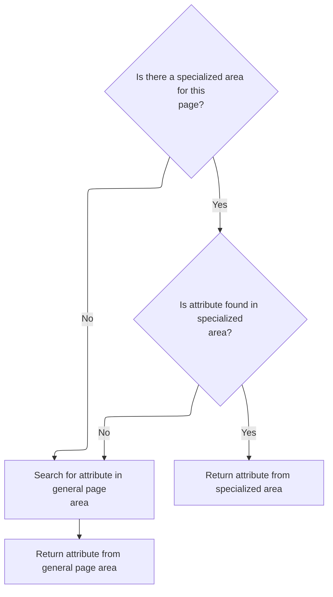

This document describes how a bean is retrieved by name, supporting both custom component contexts and standard JSP scopes. The flow determines whether to search across all contexts or within a specified scope, enabling flexible access to data for dynamic page rendering and component reuse.

# Resolving a Bean by Name and Scope

<SwmSnippet path="/tiles/src/main/java/org/apache/struts/tiles/taglib/util/TagUtils.java" line="127">

---

In <SwmToken path="tiles/src/main/java/org/apache/struts/tiles/taglib/util/TagUtils.java" pos="127:7:7" line-data="    public static Object retrieveBean(String beanName, String scopeName, PageContext pageContext)">`retrieveBean`</SwmToken>, we check if <SwmToken path="tiles/src/main/java/org/apache/struts/tiles/taglib/util/TagUtils.java" pos="127:16:16" line-data="    public static Object retrieveBean(String beanName, String scopeName, PageContext pageContext)">`scopeName`</SwmToken> is null to decide whether to do a layered attribute lookup (via <SwmToken path="tiles/src/main/java/org/apache/struts/tiles/taglib/util/TagUtils.java" pos="131:3:3" line-data="            return findAttribute(beanName, pageContext);">`findAttribute`</SwmToken>) or a scoped one. If <SwmToken path="tiles/src/main/java/org/apache/struts/tiles/taglib/util/TagUtils.java" pos="127:16:16" line-data="    public static Object retrieveBean(String beanName, String scopeName, PageContext pageContext)">`scopeName`</SwmToken> is null, we call <SwmToken path="tiles/src/main/java/org/apache/struts/tiles/taglib/util/TagUtils.java" pos="131:3:3" line-data="            return findAttribute(beanName, pageContext);">`findAttribute`</SwmToken> to search both the custom <SwmToken path="tiles/src/main/java/org/apache/struts/tiles/taglib/util/TagUtils.java" pos="149:1:1" line-data="        ComponentContext compContext = ComponentContext.getContext(pageContext.getRequest());">`ComponentContext`</SwmToken> and the standard JSP scopes, covering cases where the bean could be set in either.

```java
    public static Object retrieveBean(String beanName, String scopeName, PageContext pageContext)
        throws JspException {

        if (scopeName == null) {
            return findAttribute(beanName, pageContext);
        }

```

---

</SwmSnippet>

## Layered Attribute Lookup Across Contexts



<SwmSnippet path="/tiles/src/main/java/org/apache/struts/tiles/taglib/util/TagUtils.java" line="148">

---

In <SwmToken path="tiles/src/main/java/org/apache/struts/tiles/taglib/util/TagUtils.java" pos="148:7:7" line-data="    public static Object findAttribute(String beanName, PageContext pageContext) {">`findAttribute`</SwmToken>, we start by grabbing the <SwmToken path="tiles/src/main/java/org/apache/struts/tiles/taglib/util/TagUtils.java" pos="149:1:1" line-data="        ComponentContext compContext = ComponentContext.getContext(pageContext.getRequest());">`ComponentContext`</SwmToken> from the request. This lets us check for the attribute in a Tiles-specific scope before falling back to the usual JSP scopes. Calling <SwmToken path="tiles/src/main/java/org/apache/struts/tiles/taglib/util/TagUtils.java" pos="149:9:9" line-data="        ComponentContext compContext = ComponentContext.getContext(pageContext.getRequest());">`getContext`</SwmToken> is what gives us access to that extra layer.

```java
    public static Object findAttribute(String beanName, PageContext pageContext) {
        ComponentContext compContext = ComponentContext.getContext(pageContext.getRequest());
```

---

</SwmSnippet>

<SwmSnippet path="/tiles/src/main/java/org/apache/struts/tiles/taglib/util/TagUtils.java" line="149">

---

Back in <SwmToken path="tiles/src/main/java/org/apache/struts/tiles/taglib/util/TagUtils.java" pos="131:3:3" line-data="            return findAttribute(beanName, pageContext);">`findAttribute`</SwmToken>, after getting the request, we call <SwmToken path="tiles/src/main/java/org/apache/struts/tiles/taglib/util/TagUtils.java" pos="149:7:9" line-data="        ComponentContext compContext = ComponentContext.getContext(pageContext.getRequest());">`ComponentContext.getContext`</SwmToken> to see if there's a Tiles-specific context for this request. This is where component-scoped attributes live, so we need to check here before anything else.

```java
        ComponentContext compContext = ComponentContext.getContext(pageContext.getRequest());

```

---

</SwmSnippet>

<SwmSnippet path="/tiles/src/main/java/org/apache/struts/tiles/ComponentContext.java" line="187">

---

<SwmToken path="tiles/src/main/java/org/apache/struts/tiles/ComponentContext.java" pos="187:7:7" line-data="    static public ComponentContext getContext(ServletRequest request) {">`getContext`</SwmToken> checks for a JSP exception attribute first—if it's there, we bail and return null to avoid using a broken context. Otherwise, we just pull the <SwmToken path="tiles/src/main/java/org/apache/struts/tiles/ComponentContext.java" pos="187:5:5" line-data="    static public ComponentContext getContext(ServletRequest request) {">`ComponentContext`</SwmToken> from the request attributes.

```java
    static public ComponentContext getContext(ServletRequest request) {
       if (request.getAttribute("javax.servlet.jsp.jspException") != null) {
           return null;
        }        return (ComponentContext) request.getAttribute(
            ComponentConstants.COMPONENT_CONTEXT);
    }
```

---

</SwmSnippet>

<SwmSnippet path="/tiles/src/main/java/org/apache/struts/tiles/taglib/util/TagUtils.java" line="151">

---

Just returned from <SwmToken path="tiles/src/main/java/org/apache/struts/tiles/taglib/util/TagUtils.java" pos="149:7:9" line-data="        ComponentContext compContext = ComponentContext.getContext(pageContext.getRequest());">`ComponentContext.getContext`</SwmToken>—if we got a context, we try to find the attribute there. If it's not found, or the context was null, we fall back to searching all the standard JSP scopes in <SwmToken path="tiles/src/main/java/org/apache/struts/tiles/taglib/util/TagUtils.java" pos="127:19:19" line-data="    public static Object retrieveBean(String beanName, String scopeName, PageContext pageContext)">`PageContext`</SwmToken>. This order means component-scoped values take priority if present.

```java
        if (compContext != null) {
            Object attribute = compContext.findAttribute(beanName, pageContext);
            if (attribute != null) {
                return attribute;
            }
        }

        // Search in pageContext scopes
        return pageContext.findAttribute(beanName);
    }
```

---

</SwmSnippet>

## Handling Explicit Scope for Bean Lookup

<SwmSnippet path="/tiles/src/main/java/org/apache/struts/tiles/taglib/util/TagUtils.java" line="134">

---

Just returned from <SwmToken path="tiles/src/main/java/org/apache/struts/tiles/taglib/util/TagUtils.java" pos="131:3:3" line-data="            return findAttribute(beanName, pageContext);">`findAttribute`</SwmToken> in <SwmToken path="tiles/src/main/java/org/apache/struts/tiles/taglib/util/TagUtils.java" pos="127:7:7" line-data="    public static Object retrieveBean(String beanName, String scopeName, PageContext pageContext)">`retrieveBean`</SwmToken>. Now we need to convert the scope name to an integer constant using <SwmToken path="tiles/src/main/java/org/apache/struts/tiles/taglib/util/TagUtils.java" pos="135:7:7" line-data="        int scope = getScope(scopeName, PageContext.PAGE_SCOPE);">`getScope`</SwmToken>, since the JSP API works with ints for scope, not strings.

```java
        // Default value doesn't matter because we have already check it
        int scope = getScope(scopeName, PageContext.PAGE_SCOPE);

```

---

</SwmSnippet>

<SwmSnippet path="/tiles/src/main/java/org/apache/struts/tiles/taglib/util/TagUtils.java" line="78">

---

<SwmToken path="tiles/src/main/java/org/apache/struts/tiles/taglib/util/TagUtils.java" pos="78:7:7" line-data="    public static int getScope(String scopeName, int defaultValue) throws JspException {">`getScope`</SwmToken> checks if the scope name matches 'component', 'template', or 'tile' (case-insensitive), and maps all of them to the same Tiles scope constant. If it's something else, it falls back to another <SwmToken path="tiles/src/main/java/org/apache/struts/tiles/taglib/util/TagUtils.java" pos="78:7:7" line-data="    public static int getScope(String scopeName, int defaultValue) throws JspException {">`getScope`</SwmToken> method. Null just returns the default.

```java
    public static int getScope(String scopeName, int defaultValue) throws JspException {
        if (scopeName == null) {
            return defaultValue;
        }

        if (scopeName.equalsIgnoreCase("component")) {
            return ComponentConstants.COMPONENT_SCOPE;

        } else if (scopeName.equalsIgnoreCase("template")) {
            return ComponentConstants.COMPONENT_SCOPE;

        } else if (scopeName.equalsIgnoreCase("tile")) {
            return ComponentConstants.COMPONENT_SCOPE;

        } else {
            return getScope(scopeName);
        }
    }
```

---

</SwmSnippet>

<SwmSnippet path="/tiles/src/main/java/org/apache/struts/tiles/taglib/util/TagUtils.java" line="137">

---

Just returned from <SwmToken path="tiles/src/main/java/org/apache/struts/tiles/taglib/util/TagUtils.java" pos="78:7:7" line-data="    public static int getScope(String scopeName, int defaultValue) throws JspException {">`getScope`</SwmToken> in <SwmToken path="tiles/src/main/java/org/apache/struts/tiles/taglib/util/TagUtils.java" pos="127:7:7" line-data="    public static Object retrieveBean(String beanName, String scopeName, PageContext pageContext)">`retrieveBean`</SwmToken>. Now we call <SwmToken path="tiles/src/main/java/org/apache/struts/tiles/taglib/util/TagUtils.java" pos="137:6:6" line-data="        //return pageContext.getAttribute( beanName, scope );">`getAttribute`</SwmToken>, which knows how to fetch the bean from either the Tiles context or the standard JSP scopes, depending on the scope value.

```java
        //return pageContext.getAttribute( beanName, scope );
        return getAttribute(beanName, scope, pageContext);
    }
```

---

</SwmSnippet>

# Fetching the Attribute from the Right Scope

<SwmSnippet path="/tiles/src/main/java/org/apache/struts/tiles/taglib/util/TagUtils.java" line="170">

---

In <SwmToken path="tiles/src/main/java/org/apache/struts/tiles/taglib/util/TagUtils.java" pos="170:7:7" line-data="    public static Object getAttribute(String beanName, int scope, PageContext pageContext) {">`getAttribute`</SwmToken>, if the scope is <SwmToken path="tiles/src/main/java/org/apache/struts/tiles/taglib/util/TagUtils.java" pos="171:10:10" line-data="        if (scope == ComponentConstants.COMPONENT_SCOPE) {">`COMPONENT_SCOPE`</SwmToken>, we grab the <SwmToken path="tiles/src/main/java/org/apache/struts/tiles/taglib/util/TagUtils.java" pos="172:1:1" line-data="            ComponentContext compContext = ComponentContext.getContext(pageContext.getRequest());">`ComponentContext`</SwmToken> from the request and fetch the attribute there. This is how Tiles supports its own scope, separate from the JSP ones.

```java
    public static Object getAttribute(String beanName, int scope, PageContext pageContext) {
        if (scope == ComponentConstants.COMPONENT_SCOPE) {
            ComponentContext compContext = ComponentContext.getContext(pageContext.getRequest());
```

---

</SwmSnippet>

<SwmSnippet path="/tiles/src/main/java/org/apache/struts/tiles/taglib/util/TagUtils.java" line="172">

---

Just returned from getting the request in <SwmToken path="tiles/src/main/java/org/apache/struts/tiles/taglib/util/TagUtils.java" pos="173:5:5" line-data="            return compContext.getAttribute(beanName);">`getAttribute`</SwmToken>. If the scope is <SwmToken path="tiles/src/main/java/org/apache/struts/tiles/taglib/util/TagUtils.java" pos="84:5:5" line-data="            return ComponentConstants.COMPONENT_SCOPE;">`COMPONENT_SCOPE`</SwmToken>, we call <SwmToken path="tiles/src/main/java/org/apache/struts/tiles/taglib/util/TagUtils.java" pos="172:9:9" line-data="            ComponentContext compContext = ComponentContext.getContext(pageContext.getRequest());">`getContext`</SwmToken> to fetch the <SwmToken path="tiles/src/main/java/org/apache/struts/tiles/taglib/util/TagUtils.java" pos="172:1:1" line-data="            ComponentContext compContext = ComponentContext.getContext(pageContext.getRequest());">`ComponentContext`</SwmToken> and get the attribute there. If it's any other scope, we just use <SwmToken path="tiles/src/main/java/org/apache/struts/tiles/taglib/util/TagUtils.java" pos="175:3:5" line-data="        return pageContext.getAttribute(beanName, scope);">`pageContext.getAttribute`</SwmToken>. No fallback to JSP scopes if the Tiles context is missing.

```java
            ComponentContext compContext = ComponentContext.getContext(pageContext.getRequest());
            return compContext.getAttribute(beanName);
        }
        return pageContext.getAttribute(beanName, scope);
    }
```

---

</SwmSnippet>

&nbsp;

*This is an auto-generated document by Swimm 🌊 and has not yet been verified by a human*

<SwmMeta version="3.0.0" repo-id="Z2l0aHViJTNBJTNBc3RydXRzMSUzQSUzQVN3aW1tLURlbW8=" repo-name="struts1"><sup>Powered by [Swimm](https://app.swimm.io/)</sup></SwmMeta>
