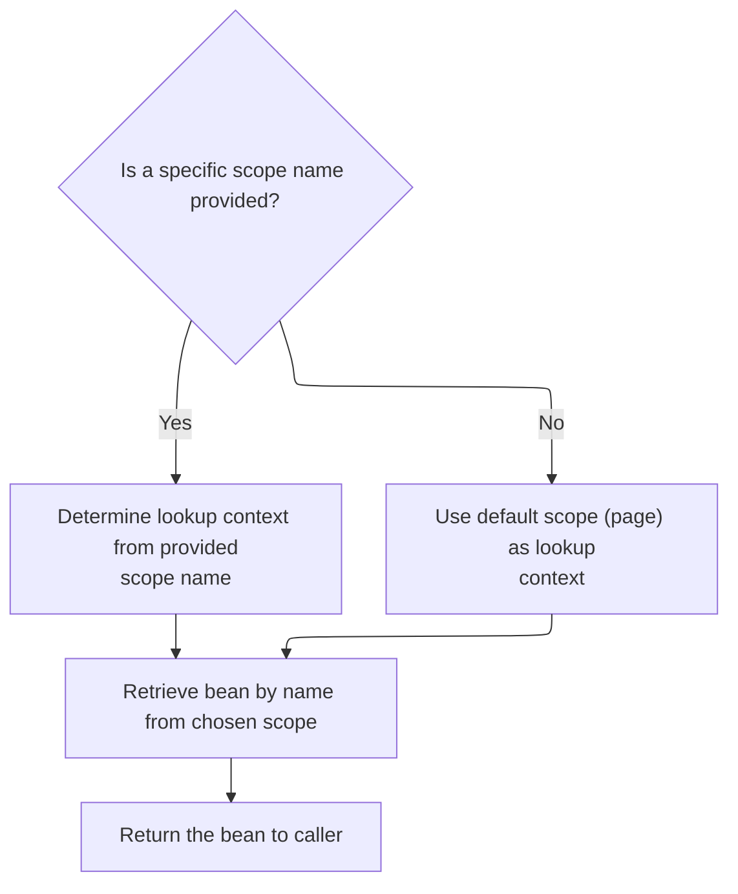

This document describes how a value is retrieved from a bean, with the option to extract a specific property, using a given name and scope. This enables dynamic data retrieval for flexible configuration and rendering in the templating system.

# Extracting the Bean Value

<SwmSnippet path="/tiles/src/main/java/org/apache/struts/tiles/taglib/PutTag.java" line="384">

---

In <SwmToken path="tiles/src/main/java/org/apache/struts/tiles/taglib/PutTag.java" pos="384:5:5" line-data="    protected void getRealValueFromBean() throws JspException {">`getRealValueFromBean`</SwmToken>, we're starting the process of looking up a bean by name and scope using <SwmToken path="tiles/src/main/java/org/apache/struts/tiles/taglib/PutTag.java" pos="386:7:7" line-data="            Object bean = TagUtils.retrieveBean(beanName, beanScope, pageContext);">`TagUtils`</SwmToken>. This is where we hand off to <SwmToken path="tiles/src/main/java/org/apache/struts/tiles/taglib/PutTag.java" pos="386:7:7" line-data="            Object bean = TagUtils.retrieveBean(beanName, beanScope, pageContext);">`TagUtils`</SwmToken> to abstract away the details of where and how the bean is stored, so we don't have to duplicate that logic here.

```java
    protected void getRealValueFromBean() throws JspException {
        try {
            Object bean = TagUtils.retrieveBean(beanName, beanScope, pageContext);
```

---

</SwmSnippet>

## Locating the Bean in Context

<SwmSnippet path="/tiles/src/main/java/org/apache/struts/tiles/taglib/util/TagUtils.java" line="127">

---

In <SwmToken path="tiles/src/main/java/org/apache/struts/tiles/taglib/util/TagUtils.java" pos="127:7:7" line-data="    public static Object retrieveBean(String beanName, String scopeName, PageContext pageContext)">`retrieveBean`</SwmToken>, we check if a scope is specified. If not, we search all scopes for the bean using <SwmToken path="tiles/src/main/java/org/apache/struts/tiles/taglib/util/TagUtils.java" pos="131:3:3" line-data="            return findAttribute(beanName, pageContext);">`findAttribute`</SwmToken>. If a scope is given, we need to resolve it to a scope constant, so we call <SwmToken path="tiles/src/main/java/org/apache/struts/tiles/taglib/util/TagUtils.java" pos="78:7:7" line-data="    public static int getScope(String scopeName, int defaultValue) throws JspException {">`getScope`</SwmToken> next.

```java
    public static Object retrieveBean(String beanName, String scopeName, PageContext pageContext)
        throws JspException {

        if (scopeName == null) {
            return findAttribute(beanName, pageContext);
        }

```

---

</SwmSnippet>

### Searching All Scopes for the Bean

See <SwmLink doc-title="Attribute Lookup Flow">[Attribute Lookup Flow](/.swm/attribute-lookup-flow.5oqmm42l.sw.md)</SwmLink>

### Resolving Scope Constants



<SwmSnippet path="/tiles/src/main/java/org/apache/struts/tiles/taglib/util/TagUtils.java" line="134">

---

Back in <SwmToken path="tiles/src/main/java/org/apache/struts/tiles/taglib/PutTag.java" pos="386:9:9" line-data="            Object bean = TagUtils.retrieveBean(beanName, beanScope, pageContext);">`retrieveBean`</SwmToken>, after checking for a null scope, we convert the scope name to a constant using <SwmToken path="tiles/src/main/java/org/apache/struts/tiles/taglib/util/TagUtils.java" pos="135:7:7" line-data="        int scope = getScope(scopeName, PageContext.PAGE_SCOPE);">`getScope`</SwmToken>. This lets us use the correct scope value for attribute lookup.

```java
        // Default value doesn't matter because we have already check it
        int scope = getScope(scopeName, PageContext.PAGE_SCOPE);

```

---

</SwmSnippet>

<SwmSnippet path="/tiles/src/main/java/org/apache/struts/tiles/taglib/util/TagUtils.java" line="78">

---

<SwmToken path="tiles/src/main/java/org/apache/struts/tiles/taglib/util/TagUtils.java" pos="78:7:7" line-data="    public static int getScope(String scopeName, int defaultValue) throws JspException {">`getScope`</SwmToken> handles mapping scope names to constants. It treats 'component', 'template', and 'tile' as the same scope, which is specific to this repo. If the name doesn't match, it delegates to another <SwmToken path="tiles/src/main/java/org/apache/struts/tiles/taglib/util/TagUtils.java" pos="78:7:7" line-data="    public static int getScope(String scopeName, int defaultValue) throws JspException {">`getScope`</SwmToken> method. Null <SwmToken path="tiles/src/main/java/org/apache/struts/tiles/taglib/util/TagUtils.java" pos="78:11:11" line-data="    public static int getScope(String scopeName, int defaultValue) throws JspException {">`scopeName`</SwmToken> just returns the default.

```java
    public static int getScope(String scopeName, int defaultValue) throws JspException {
        if (scopeName == null) {
            return defaultValue;
        }

        if (scopeName.equalsIgnoreCase("component")) {
            return ComponentConstants.COMPONENT_SCOPE;

        } else if (scopeName.equalsIgnoreCase("template")) {
            return ComponentConstants.COMPONENT_SCOPE;

        } else if (scopeName.equalsIgnoreCase("tile")) {
            return ComponentConstants.COMPONENT_SCOPE;

        } else {
            return getScope(scopeName);
        }
    }
```

---

</SwmSnippet>

<SwmSnippet path="/tiles/src/main/java/org/apache/struts/tiles/taglib/util/TagUtils.java" line="137">

---

Back in <SwmToken path="tiles/src/main/java/org/apache/struts/tiles/taglib/PutTag.java" pos="386:9:9" line-data="            Object bean = TagUtils.retrieveBean(beanName, beanScope, pageContext);">`retrieveBean`</SwmToken>, with the scope constant ready, we call <SwmToken path="tiles/src/main/java/org/apache/struts/tiles/taglib/util/TagUtils.java" pos="137:6:6" line-data="        //return pageContext.getAttribute( beanName, scope );">`getAttribute`</SwmToken> to actually fetch the bean from the right context.

```java
        //return pageContext.getAttribute( beanName, scope );
        return getAttribute(beanName, scope, pageContext);
    }
```

---

</SwmSnippet>

## Fetching the Attribute by Scope

<SwmSnippet path="/tiles/src/main/java/org/apache/struts/tiles/taglib/util/TagUtils.java" line="170">

---

In <SwmToken path="tiles/src/main/java/org/apache/struts/tiles/taglib/util/TagUtils.java" pos="170:7:7" line-data="    public static Object getAttribute(String beanName, int scope, PageContext pageContext) {">`getAttribute`</SwmToken>, if the scope is <SwmToken path="tiles/src/main/java/org/apache/struts/tiles/taglib/util/TagUtils.java" pos="171:10:10" line-data="        if (scope == ComponentConstants.COMPONENT_SCOPE) {">`COMPONENT_SCOPE`</SwmToken>, we grab the <SwmToken path="tiles/src/main/java/org/apache/struts/tiles/taglib/util/TagUtils.java" pos="172:1:1" line-data="            ComponentContext compContext = ComponentContext.getContext(pageContext.getRequest());">`ComponentContext`</SwmToken> from the request and fetch the attribute from there. Otherwise, we just use the standard <SwmToken path="tiles/src/main/java/org/apache/struts/tiles/taglib/util/TagUtils.java" pos="170:19:19" line-data="    public static Object getAttribute(String beanName, int scope, PageContext pageContext) {">`PageContext`</SwmToken>. This branching is key for supporting Tiles-specific scopes.

```java
    public static Object getAttribute(String beanName, int scope, PageContext pageContext) {
        if (scope == ComponentConstants.COMPONENT_SCOPE) {
            ComponentContext compContext = ComponentContext.getContext(pageContext.getRequest());
```

---

</SwmSnippet>

<SwmSnippet path="/tiles/src/main/java/org/apache/struts/tiles/taglib/util/TagUtils.java" line="172">

---

Still in <SwmToken path="tiles/src/main/java/org/apache/struts/tiles/taglib/util/TagUtils.java" pos="173:5:5" line-data="            return compContext.getAttribute(beanName);">`getAttribute`</SwmToken>, if we're in <SwmToken path="tiles/src/main/java/org/apache/struts/tiles/taglib/util/TagUtils.java" pos="84:5:5" line-data="            return ComponentConstants.COMPONENT_SCOPE;">`COMPONENT_SCOPE`</SwmToken>, we call into <SwmToken path="tiles/src/main/java/org/apache/struts/tiles/taglib/util/TagUtils.java" pos="172:1:1" line-data="            ComponentContext compContext = ComponentContext.getContext(pageContext.getRequest());">`ComponentContext`</SwmToken> to get the attribute. Otherwise, we just return the attribute from the <SwmToken path="tiles/src/main/java/org/apache/struts/tiles/taglib/util/TagUtils.java" pos="127:19:19" line-data="    public static Object retrieveBean(String beanName, String scopeName, PageContext pageContext)">`PageContext`</SwmToken>. This is where the actual value is pulled from the right place.

```java
            ComponentContext compContext = ComponentContext.getContext(pageContext.getRequest());
            return compContext.getAttribute(beanName);
        }
        return pageContext.getAttribute(beanName, scope);
    }
```

---

</SwmSnippet>

## Extracting the Property from the Bean

<SwmSnippet path="/tiles/src/main/java/org/apache/struts/tiles/taglib/PutTag.java" line="387">

---

Back in <SwmToken path="tiles/src/main/java/org/apache/struts/tiles/taglib/PutTag.java" pos="384:5:5" line-data="    protected void getRealValueFromBean() throws JspException {">`getRealValueFromBean`</SwmToken>, after retrieving the bean, we either extract the specified property using <SwmToken path="tiles/src/main/java/org/apache/struts/tiles/taglib/PutTag.java" pos="388:5:5" line-data="                realValue = PropertyUtils.getProperty(bean, beanProperty);">`PropertyUtils`</SwmToken> or just assign the bean itself if no property is given. Any errors here are wrapped and rethrown as <SwmToken path="tiles/src/main/java/org/apache/struts/tiles/taglib/PutTag.java" pos="394:5:5" line-data="            throw new JspException(">`JspException`</SwmToken> for clear error reporting.

```java
            if (bean != null && beanProperty != null) {
                realValue = PropertyUtils.getProperty(bean, beanProperty);
            } else {
                realValue = bean; // value can be null
            }

        } catch (NoSuchMethodException ex) {
            throw new JspException(
                "Error - component.PutAttributeTag : Error while retrieving value from bean '"
                    + beanName
                    + "' with property '"
                    + beanProperty
                    + "' in scope '"
                    + beanScope
                    + "'. (exception : "
                    + ex.getMessage(), ex);

        } catch (InvocationTargetException ex) {
            throw new JspException(
                "Error - component.PutAttributeTag : Error while retrieving value from bean '"
                    + beanName
                    + "' with property '"
                    + beanProperty
                    + "' in scope '"
                    + beanScope
                    + "'. (exception : "
                    + ex.getMessage(), ex);

        } catch (IllegalAccessException ex) {
            throw new JspException(
                "Error - component.PutAttributeTag : Error while retrieving value from bean '"
                    + beanName
                    + "' with property '"
                    + beanProperty
                    + "' in scope '"
                    + beanScope
                    + "'. (exception : "
                    + ex.getMessage(), ex);
        }
    }
```

---

</SwmSnippet>

&nbsp;

*This is an auto-generated document by Swimm 🌊 and has not yet been verified by a human*

<SwmMeta version="3.0.0" repo-id="Z2l0aHViJTNBJTNBc3RydXRzMSUzQSUzQVN3aW1tLURlbW8=" repo-name="struts1"><sup>Powered by [Swimm](https://app.swimm.io/)</sup></SwmMeta>
