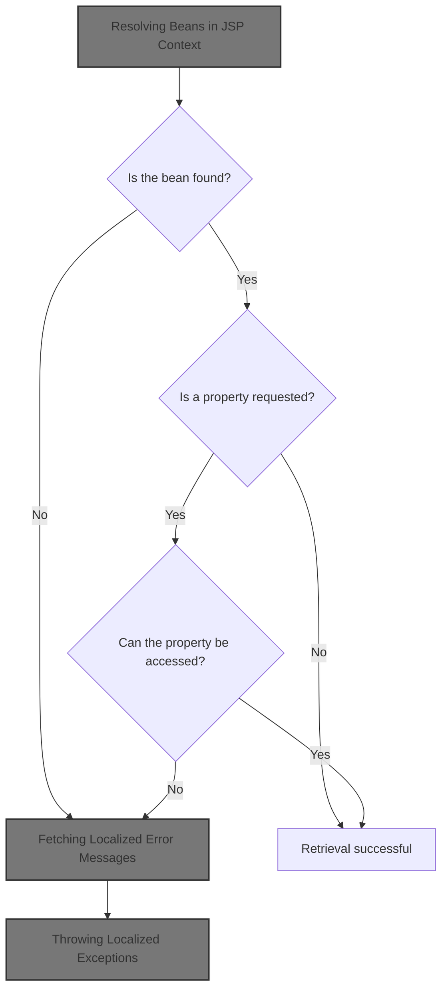
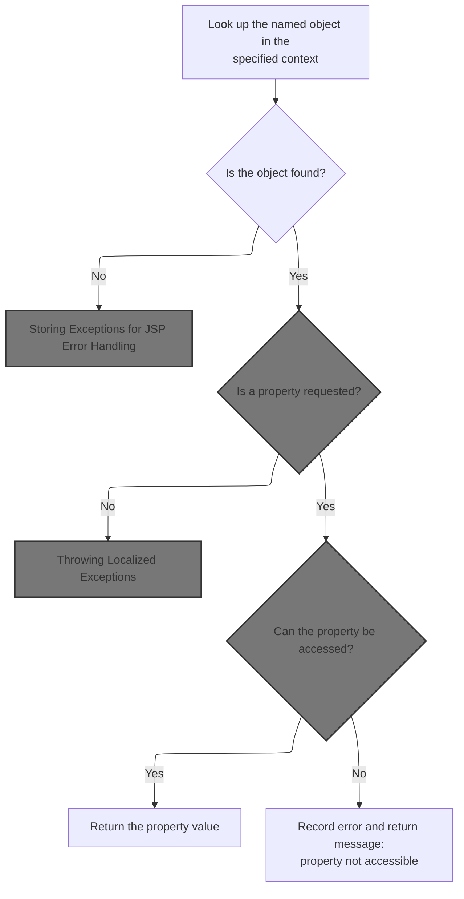
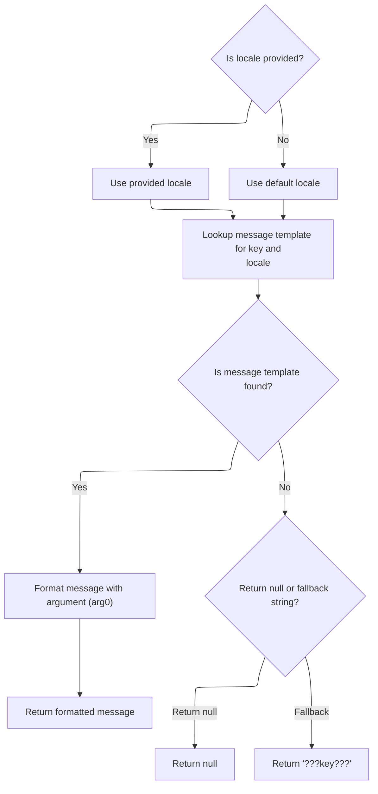
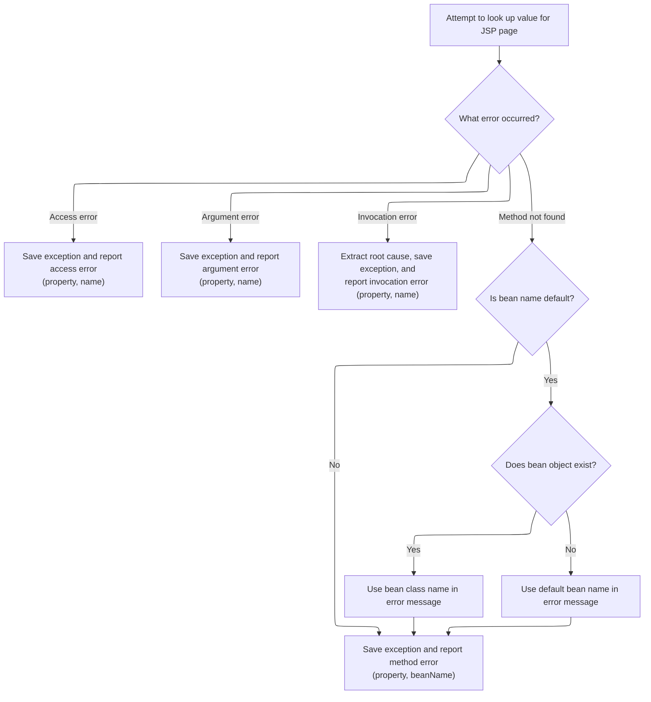

This document describes how a named object (bean) and its property can be retrieved from the JSP context to support dynamic content rendering. The flow returns the bean or property value if found, or provides a localized error message if not.



# Resolving Beans in JSP Context



<SwmSnippet path="/taglib/src/main/java/org/apache/struts/taglib/TagUtils.java" line="897">

---

In <SwmToken path="taglib/src/main/java/org/apache/struts/taglib/TagUtils.java" pos="897:5:5" line-data="    public Object lookup(PageContext pageContext, String name, String property,">`lookup`</SwmToken>, we try to find a bean in the given JSP context. If it's missing, we prepare to throw a <SwmToken path="taglib/src/main/java/org/apache/struts/taglib/TagUtils.java" pos="898:8:8" line-data="        String scope) throws JspException {">`JspException`</SwmToken> with a localized error message, which is why we need to fetch the message from <SwmToken path="taglib/src/main/java/org/apache/struts/taglib/TagUtils.java" pos="34:10:10" line-data="import org.apache.struts.util.MessageResources;">`MessageResources`</SwmToken> next.

```java
    public Object lookup(PageContext pageContext, String name, String property,
        String scope) throws JspException {
        // Look up the requested bean, and return if requested
        Object bean = lookup(pageContext, name, scope);

        if (bean == null) {
            JspException e = null;

            if (scope == null) {
                e = new JspException(messages.getMessage("lookup.bean.any", name));
            } else {
```

---

</SwmSnippet>

## Fetching Localized Error Messages

<SwmSnippet path="/core/src/main/java/org/apache/struts/util/MessageResources.java" line="218">

---

<SwmToken path="core/src/main/java/org/apache/struts/util/MessageResources.java" pos="218:5:15" line-data="    public String getMessage(String key, Object arg0) {">`getMessage(String key, Object arg0)`</SwmToken> just forwards the call to the overload that takes a Locale, so we can handle localization and argument substitution in one place.

```java
    public String getMessage(String key, Object arg0) {
        return this.getMessage((Locale) null, key, arg0);
    }
```

---

</SwmSnippet>

## Preparing Message Formatting Arguments



<SwmSnippet path="/core/src/main/java/org/apache/struts/util/MessageResources.java" line="324">

---

<SwmToken path="core/src/main/java/org/apache/struts/util/MessageResources.java" pos="324:5:20" line-data="    public String getMessage(Locale locale, String key, Object arg0) {">`getMessage(Locale locale, String key, Object arg0)`</SwmToken> just wraps the argument in an array and passes it to the main formatting method, so all message formatting goes through the same logic.

```java
    public String getMessage(Locale locale, String key, Object arg0) {
        return this.getMessage(locale, key, new Object[] { arg0 });
    }
```

---

</SwmSnippet>

<SwmSnippet path="/core/src/main/java/org/apache/struts/util/MessageResources.java" line="286">

---

<SwmToken path="core/src/main/java/org/apache/struts/util/MessageResources.java" pos="286:5:22" line-data="    public String getMessage(Locale locale, String key, Object[] args) {">`getMessage(Locale locale, String key, Object[] args)`</SwmToken> handles the actual message formatting. It caches <SwmToken path="core/src/main/java/org/apache/struts/util/MessageResources.java" pos="287:5:5" line-data="        // Cache MessageFormat instances as they are accessed">`MessageFormat`</SwmToken> objects for performance, falls back to a default locale if needed, returns a placeholder if the message is missing, and escapes the format string before formatting. No checks on argument validity—just assumes they're right.

```java
    public String getMessage(Locale locale, String key, Object[] args) {
        // Cache MessageFormat instances as they are accessed
        if (locale == null) {
            locale = defaultLocale;
        }

        MessageFormat format = null;
        String formatKey = messageKey(locale, key);

        synchronized (formats) {
            format = (MessageFormat) formats.get(formatKey);

            if (format == null) {
                String formatString = getMessage(locale, key);

                if (formatString == null) {
                    return returnNull ? null : ("???" + formatKey + "???");
                }

                format = new MessageFormat(escape(formatString));
                format.setLocale(locale);
                formats.put(formatKey, format);
            }
        }

        return format.format(args);
    }
```

---

</SwmSnippet>

## Throwing Localized Exceptions

<SwmSnippet path="/taglib/src/main/java/org/apache/struts/taglib/TagUtils.java" line="908">

---

Back in `TagUtils.lookup`, after getting the localized error message, we throw a <SwmToken path="taglib/src/main/java/org/apache/struts/taglib/TagUtils.java" pos="908:7:7" line-data="                e = new JspException(messages.getMessage(&quot;lookup.bean&quot;, name,">`JspException`</SwmToken> with it so the error is clear and user-friendly.

```java
                e = new JspException(messages.getMessage("lookup.bean", name,
                            scope));
            }

```

---

</SwmSnippet>

<SwmSnippet path="/taglib/src/main/java/org/apache/struts/taglib/TagUtils.java" line="912">

---

Back in `TagUtils.lookup`, after preparing the exception, we save it in the page context so error handlers or JSP error pages can access it.

```java
            saveException(pageContext, e);
            throw e;
        }

        if (property == null) {
            return bean;
        }

        // Locate and return the specified property
        try {
            return PropertyUtils.getProperty(bean, property);
        } catch (IllegalAccessException e) {
            saveException(pageContext, e);
```

---

</SwmSnippet>

## Storing Exceptions for JSP Error Handling

<SwmSnippet path="/taglib/src/main/java/org/apache/struts/taglib/TagUtils.java" line="1170">

---

<SwmToken path="taglib/src/main/java/org/apache/struts/taglib/TagUtils.java" pos="1170:5:5" line-data="    public void saveException(PageContext pageContext, Throwable exception) {">`saveException`</SwmToken> puts the exception into the page context under a standard key, always in <SwmToken path="taglib/src/main/java/org/apache/struts/taglib/TagUtils.java" pos="1172:3:3" line-data="            PageContext.REQUEST_SCOPE);">`REQUEST_SCOPE`</SwmToken>, so error pages can pick it up. The actual <SwmToken path="taglib/src/main/java/org/apache/struts/taglib/TagUtils.java" pos="1171:3:3" line-data="        pageContext.setAttribute(Globals.EXCEPTION_KEY, exception,">`setAttribute`</SwmToken> call is handled by a utility method next.

```java
    public void saveException(PageContext pageContext, Throwable exception) {
        pageContext.setAttribute(Globals.EXCEPTION_KEY, exception,
            PageContext.REQUEST_SCOPE);
    }
```

---

</SwmSnippet>

<SwmSnippet path="/tiles/src/main/java/org/apache/struts/tiles/taglib/util/TagUtils.java" line="290">

---

<SwmToken path="tiles/src/main/java/org/apache/struts/tiles/taglib/util/TagUtils.java" pos="290:7:7" line-data="    public static void setAttribute(PageContext pageContext, String name, Object beanValue)">`setAttribute`</SwmToken> just wraps <SwmToken path="tiles/src/main/java/org/apache/struts/tiles/taglib/util/TagUtils.java" pos="292:1:3" line-data="        pageContext.setAttribute(name, beanValue, PageContext.REQUEST_SCOPE);">`pageContext.setAttribute`</SwmToken>, always using <SwmToken path="tiles/src/main/java/org/apache/struts/tiles/taglib/util/TagUtils.java" pos="292:13:13" line-data="        pageContext.setAttribute(name, beanValue, PageContext.REQUEST_SCOPE);">`REQUEST_SCOPE`</SwmToken>. No checks, no extra logic—just sets the attribute where error handlers expect it.

```java
    public static void setAttribute(PageContext pageContext, String name, Object beanValue)
        throws JspException {
        pageContext.setAttribute(name, beanValue, PageContext.REQUEST_SCOPE);
    }
```

---

</SwmSnippet>

## Throwing Exceptions After Saving



<SwmSnippet path="/taglib/src/main/java/org/apache/struts/taglib/TagUtils.java" line="925">

---

Back in `TagUtils.lookup`, after saving the exception, we throw a new <SwmToken path="taglib/src/main/java/org/apache/struts/taglib/TagUtils.java" pos="925:5:5" line-data="            throw new JspException(messages.getMessage(&quot;lookup.access&quot;,">`JspException`</SwmToken> with a localized message so the error is both recorded and reported.

```java
            throw new JspException(messages.getMessage("lookup.access",
                    property, name), e);
        } catch (IllegalArgumentException e) {
```

---

</SwmSnippet>

<SwmSnippet path="/taglib/src/main/java/org/apache/struts/taglib/TagUtils.java" line="928">

---

Back in `TagUtils.lookup`, after another error (like <SwmToken path="taglib/src/main/java/org/apache/struts/taglib/TagUtils.java" pos="927:6:6" line-data="        } catch (IllegalArgumentException e) {">`IllegalArgumentException`</SwmToken>), we save the exception again so error handlers can access the latest error.

```java
            saveException(pageContext, e);
```

---

</SwmSnippet>

<SwmSnippet path="/taglib/src/main/java/org/apache/struts/taglib/TagUtils.java" line="929">

---

Back in `TagUtils.lookup`, after saving the exception, we fetch another localized message for this specific error type and throw it, so the error output is clear and targeted.

```java
            throw new JspException(messages.getMessage("lookup.argument",
                    property, name), e);
        } catch (InvocationTargetException e) {
```

---

</SwmSnippet>

<SwmSnippet path="/taglib/src/main/java/org/apache/struts/taglib/TagUtils.java" line="932">

---

Back in `TagUtils.lookup`, after catching <SwmToken path="taglib/src/main/java/org/apache/struts/taglib/TagUtils.java" pos="931:6:6" line-data="        } catch (InvocationTargetException e) {">`InvocationTargetException`</SwmToken>, we save the real cause (target exception) so error handlers get the actual error, not just the wrapper.

```java
            Throwable t = e.getTargetException();

            if (t == null) {
                t = e;
            }

            saveException(pageContext, t);
```

---

</SwmSnippet>

<SwmSnippet path="/taglib/src/main/java/org/apache/struts/taglib/TagUtils.java" line="939">

---

Back in `TagUtils.lookup`, after saving the target exception, we fetch a message specific to target errors and throw it, so the error is clear about what failed.

```java
            throw new JspException(messages.getMessage("lookup.target",
                    property, name), e);
        } catch (NoSuchMethodException e) {
```

---

</SwmSnippet>

<SwmSnippet path="/taglib/src/main/java/org/apache/struts/taglib/TagUtils.java" line="942">

---

Back in `TagUtils.lookup`, after catching <SwmToken path="taglib/src/main/java/org/apache/struts/taglib/TagUtils.java" pos="941:6:6" line-data="        } catch (NoSuchMethodException e) {">`NoSuchMethodException`</SwmToken>, we save it so error handlers know exactly what method was missing.

```java
            saveException(pageContext, e);

```

---

</SwmSnippet>

<SwmSnippet path="/taglib/src/main/java/org/apache/struts/taglib/TagUtils.java" line="944">

---

Back in `TagUtils.lookup`, after saving the exception, we check if the bean name is generic (<SwmToken path="taglib/src/main/java/org/apache/struts/taglib/TagUtils.java" pos="949:4:6" line-data="            if (Constants.BEAN_KEY.equals(name)) {">`Constants.BEAN_KEY`</SwmToken>). If so, we include the bean's class name in the error message for better debugging, then throw the localized exception.

```java
            String beanName = name;

            // Name defaults to Contants.BEAN_KEY if no name is specified by
            // an input tag. Thus lookup the bean under the key and use
            // its class name for the exception message.
            if (Constants.BEAN_KEY.equals(name)) {
                Object obj = pageContext.findAttribute(Constants.BEAN_KEY);

                if (obj != null) {
                    beanName = obj.getClass().getName();
                }
            }

            throw new JspException(messages.getMessage("lookup.method",
                    property, beanName), e);
        }
    }
```

---

</SwmSnippet>

&nbsp;

*This is an auto-generated document by Swimm 🌊 and has not yet been verified by a human*

<SwmMeta version="3.0.0" repo-id="Z2l0aHViJTNBJTNBc3RydXRzMSUzQSUzQVN3aW1tLURlbW8=" repo-name="struts1"><sup>Powered by [Swimm](https://app.swimm.io/)</sup></SwmMeta>
