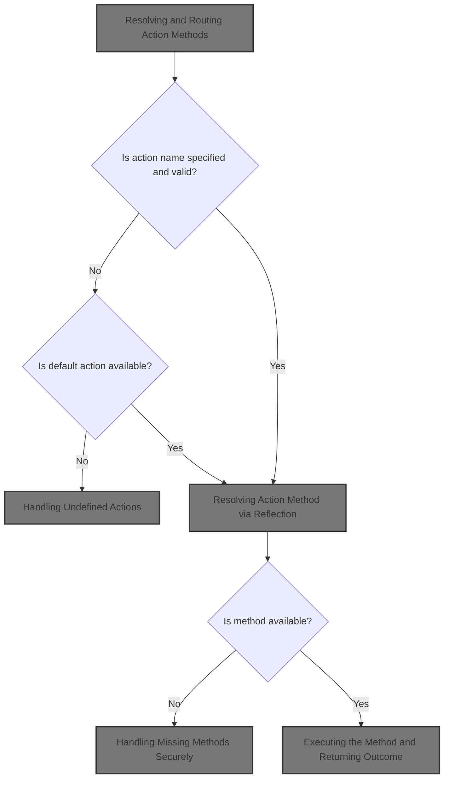
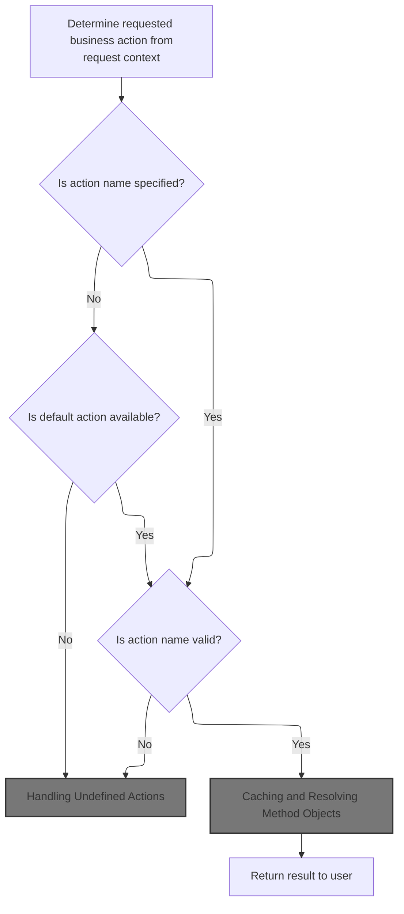
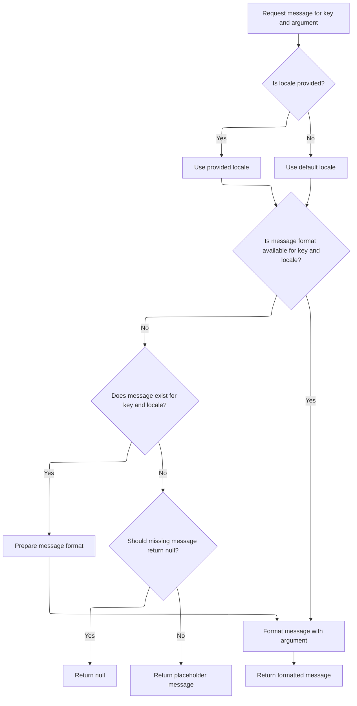
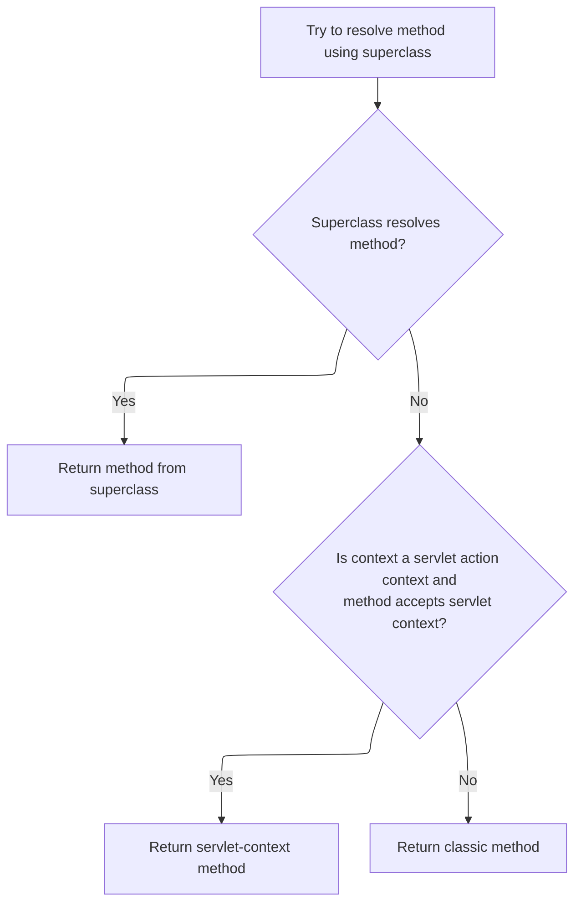
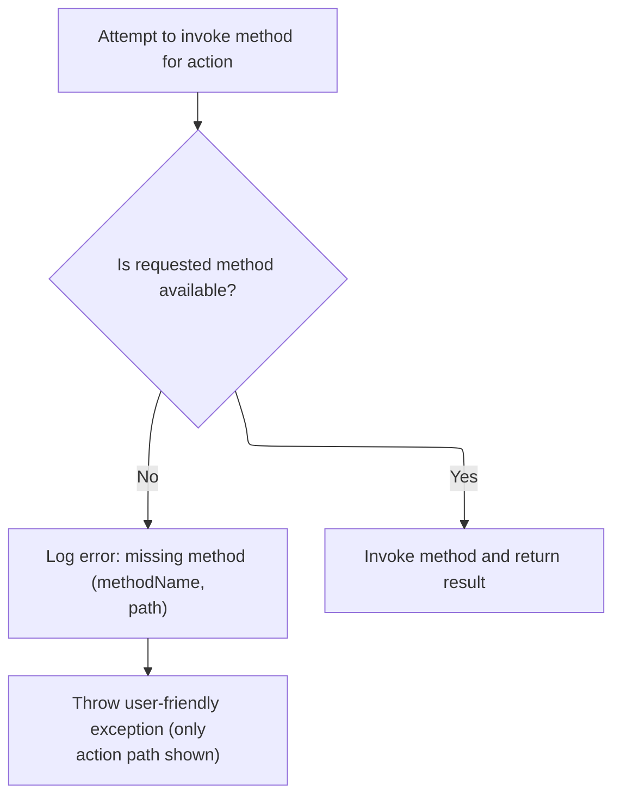
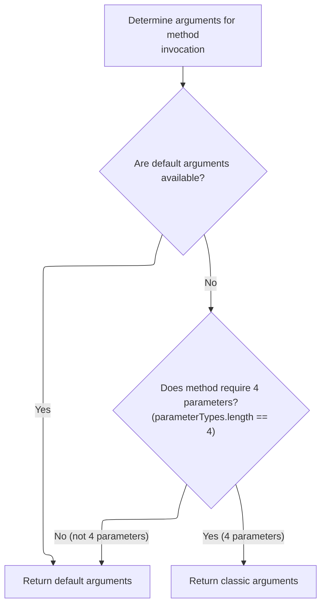

This document describes how requests are routed to the correct business action method and how the outcome is returned. When a request is received, the flow determines which action to perform, resolves the appropriate method, and executes it. If the action is missing or undefined, a localized error message is returned.



# Resolving and Routing Action Methods



<SwmSnippet path="/core/src/main/java/org/apache/struts/dispatcher/AbstractDispatcher.java" line="115">

---

In <SwmToken path="core/src/main/java/org/apache/struts/dispatcher/AbstractDispatcher.java" pos="115:5:5" line-data="    public Object dispatch(ActionContext context) throws Exception {">`dispatch`</SwmToken>, we try to get the method name from the context, fallback to a default if needed, and if there's still nothing, we call <SwmToken path="core/src/main/java/org/apache/struts/dispatcher/AbstractDispatcher.java" pos="125:3:3" line-data="            return unspecified(context);">`unspecified`</SwmToken> to handle cases where the action isn't defined. This avoids running random or missing actions.

```java
    public Object dispatch(ActionContext context) throws Exception {
        // Resolve the method name; fallback to default if necessary
        String methodName = resolveMethodName(context);
        if ((methodName == null) || "".equals(methodName)) {
            methodName = getDefaultMethodName();
        }

        // Ensure there is a specified method name to invoke.
        // This may be null if the user hacks the query string.
        if (methodName == null) {
            return unspecified(context);
        }

```

---

</SwmSnippet>

## Handling Undefined Actions

<SwmSnippet path="/core/src/main/java/org/apache/struts/dispatcher/AbstractDispatcher.java" line="313">

---

In <SwmToken path="core/src/main/java/org/apache/struts/dispatcher/AbstractDispatcher.java" pos="313:5:5" line-data="    protected Object unspecified(ActionContext context) throws Exception {">`unspecified`</SwmToken>, we grab a localized error message using the action path and a constant key. This message is logged and used for the exception, so users and logs get clear info about what action was missing.

```java
    protected Object unspecified(ActionContext context) throws Exception {
        ActionConfig config = context.getActionConfig();
        String msg = messages.getMessage(MSG_KEY_UNSPECIFIED, config.getPath());
        log.error(msg);
```

---

</SwmSnippet>

### Retrieving Localized Error Messages

<SwmSnippet path="/core/src/main/java/org/apache/struts/util/MessageResources.java" line="218">

---

<SwmToken path="core/src/main/java/org/apache/struts/util/MessageResources.java" pos="218:5:5" line-data="    public String getMessage(String key, Object arg0) {">`getMessage`</SwmToken> here just calls the overload with null Locale, so we always get a message using the default language if none is specified.

```java
    public String getMessage(String key, Object arg0) {
        return this.getMessage((Locale) null, key, arg0);
    }
```

---

</SwmSnippet>

### Formatting Localized Messages



<SwmSnippet path="/core/src/main/java/org/apache/struts/util/MessageResources.java" line="324">

---

<SwmToken path="core/src/main/java/org/apache/struts/util/MessageResources.java" pos="324:5:5" line-data="    public String getMessage(Locale locale, String key, Object arg0) {">`getMessage`</SwmToken> here wraps the argument in an array and passes it to the next overload, so we can format messages with multiple parameters if needed.

```java
    public String getMessage(Locale locale, String key, Object arg0) {
        return this.getMessage(locale, key, new Object[] { arg0 });
    }
```

---

</SwmSnippet>

<SwmSnippet path="/core/src/main/java/org/apache/struts/util/MessageResources.java" line="286">

---

<SwmToken path="core/src/main/java/org/apache/struts/util/MessageResources.java" pos="286:5:5" line-data="    public String getMessage(Locale locale, String key, Object[] args) {">`getMessage`</SwmToken> here handles locale fallback, caches <SwmToken path="core/src/main/java/org/apache/struts/util/MessageResources.java" pos="287:5:5" line-data="        // Cache MessageFormat instances as they are accessed">`MessageFormat`</SwmToken> objects for speed, escapes format strings, and returns either a formatted message or a placeholder if the key is missing.

```java
    public String getMessage(Locale locale, String key, Object[] args) {
        // Cache MessageFormat instances as they are accessed
        if (locale == null) {
            locale = defaultLocale;
        }

        MessageFormat format = null;
        String formatKey = messageKey(locale, key);

        synchronized (formats) {
            format = (MessageFormat) formats.get(formatKey);

            if (format == null) {
                String formatString = getMessage(locale, key);

                if (formatString == null) {
                    return returnNull ? null : ("???" + formatKey + "???");
                }

                format = new MessageFormat(escape(formatString));
                format.setLocale(locale);
                formats.put(formatKey, format);
            }
        }

        return format.format(args);
    }
```

---

</SwmSnippet>

### Throwing Localized Exceptions

<SwmSnippet path="/core/src/main/java/org/apache/struts/dispatcher/AbstractDispatcher.java" line="317">

---

Back in <SwmToken path="core/src/main/java/org/apache/struts/dispatcher/AbstractDispatcher.java" pos="125:3:3" line-data="            return unspecified(context);">`unspecified`</SwmToken>, after getting the localized message, we log it and throw an <SwmToken path="core/src/main/java/org/apache/struts/dispatcher/AbstractDispatcher.java" pos="317:5:5" line-data="        throw new IllegalStateException(msg);">`IllegalStateException`</SwmToken>. This stops the flow for undefined actions and gives clear info in logs and errors.

```java
        throw new IllegalStateException(msg);
    }
```

---

</SwmSnippet>

## Resolving Action Method via Reflection

<SwmSnippet path="/core/src/main/java/org/apache/struts/dispatcher/AbstractDispatcher.java" line="128">

---

Back in <SwmToken path="core/src/main/java/org/apache/struts/dispatcher/AbstractDispatcher.java" pos="128:13:13" line-data="        // Identify the method object to dispatch">`dispatch`</SwmToken>, after handling unspecified cases, we use reflection to get the Method object for the resolved name. This lets us dynamically call the right action method.

```java
        // Identify the method object to dispatch
        Method method;
        try {
            method = getMethod(context, methodName);
```

---

</SwmSnippet>

## Caching and Resolving Method Objects

<SwmSnippet path="/core/src/main/java/org/apache/struts/dispatcher/AbstractDispatcher.java" line="203">

---

<SwmToken path="core/src/main/java/org/apache/struts/dispatcher/AbstractDispatcher.java" pos="203:7:7" line-data="    protected final Method getMethod(ActionContext context, String methodName) throws NoSuchMethodException {">`getMethod`</SwmToken> checks the cache for a Method object using the class and method name. If it's not cached, it calls <SwmToken path="core/src/main/java/org/apache/struts/dispatcher/AbstractDispatcher.java" pos="215:5:5" line-data="                method = resolveMethod(context, methodName);">`resolveMethod`</SwmToken> to find it and then stores it for next time.

```java
    protected final Method getMethod(ActionContext context, String methodName) throws NoSuchMethodException {
        synchronized (methods) {
            // Key the method based on the class-method combination
            StringBuffer keyBuf = new StringBuffer(100);
            keyBuf.append(context.getAction().getClass().getName());
            keyBuf.append(":");
            keyBuf.append(methodName);
            String key = keyBuf.toString();

            Method method = (Method) methods.get(key);

            if (method == null) {
                method = resolveMethod(context, methodName);
                methods.put(key, method);
            }

            return method;
        }
    }
```

---

</SwmSnippet>

## Delegating Method Resolution

<SwmSnippet path="/core/src/main/java/org/apache/struts/dispatcher/AbstractDispatcher.java" line="288">

---

<SwmToken path="core/src/main/java/org/apache/struts/dispatcher/AbstractDispatcher.java" pos="288:3:3" line-data="    Method resolveMethod(ActionContext context, String methodName) throws NoSuchMethodException {">`resolveMethod`</SwmToken> just hands off the resolution to the <SwmToken path="core/src/main/java/org/apache/struts/dispatcher/AbstractDispatcher.java" pos="289:3:3" line-data="        return methodResolver.resolveMethod(context, methodName);">`methodResolver`</SwmToken>, so we can support different strategies for finding the right method depending on context.

```java
    Method resolveMethod(ActionContext context, String methodName) throws NoSuchMethodException {
        return methodResolver.resolveMethod(context, methodName);
    }
```

---

</SwmSnippet>

## Multi-Strategy Method Lookup



<SwmSnippet path="/core/src/main/java/org/apache/struts/dispatcher/servlet/ServletMethodResolver.java" line="110">

---

In <SwmToken path="core/src/main/java/org/apache/struts/dispatcher/servlet/ServletMethodResolver.java" pos="110:5:5" line-data="    public Method resolveMethod(ActionContext context, String methodName) throws NoSuchMethodException {">`resolveMethod`</SwmToken>, we first try the superclass, then check for methods that accept <SwmToken path="core/src/main/java/org/apache/struts/dispatcher/servlet/ServletMethodResolver.java" pos="67:6:6" line-data="                return buildClassicArguments((ServletActionContext) context);">`ServletActionContext`</SwmToken>, and finally fall back to classic argument resolution. This covers different action method signatures.

```java
    public Method resolveMethod(ActionContext context, String methodName) throws NoSuchMethodException {
        // First try to resolve anything the superclass supports
        try {
            return super.resolveMethod(context, methodName);
        } catch (NoSuchMethodException e) {
            // continue
        }

```

---

</SwmSnippet>

<SwmSnippet path="/core/src/main/java/org/apache/struts/dispatcher/servlet/ServletMethodResolver.java" line="118">

---

After returning from <SwmToken path="core/src/main/java/org/apache/struts/dispatcher/AbstractDispatcher.java" pos="215:5:5" line-data="                method = resolveMethod(context, methodName);">`resolveMethod`</SwmToken>, we check if the context is a <SwmToken path="core/src/main/java/org/apache/struts/dispatcher/servlet/ServletMethodResolver.java" pos="119:8:8" line-data="        if (context instanceof ServletActionContext) {">`ServletActionContext`</SwmToken> and try to find a method with that parameter. This is how servlet-specific actions are handled.

```java
        // Can the method accept the servlet action context?
        if (context instanceof ServletActionContext) {
            try {
                Class actionClass = context.getAction().getClass();
                return actionClass.getMethod(methodName, new Class[] { ServletActionContext.class });
            } catch (NoSuchMethodException e) {
                // continue
            }
        }

```

---

</SwmSnippet>

<SwmSnippet path="/core/src/main/java/org/apache/struts/dispatcher/servlet/ServletMethodResolver.java" line="128">

---

After checking for servlet-specific methods, we fall back to <SwmToken path="core/src/main/java/org/apache/struts/dispatcher/servlet/ServletMethodResolver.java" pos="129:3:3" line-data="        return resolveClassicMethod(context, methodName);">`resolveClassicMethod`</SwmToken> to handle legacy action signatures. This keeps compatibility with older action classes.

```java
        // Lastly, try the classical argument listing
        return resolveClassicMethod(context, methodName);
    }
```

---

</SwmSnippet>

<SwmSnippet path="/core/src/main/java/org/apache/struts/dispatcher/servlet/ServletMethodResolver.java" line="105">

---

<SwmToken path="core/src/main/java/org/apache/struts/dispatcher/servlet/ServletMethodResolver.java" pos="105:7:7" line-data="    protected final Method resolveClassicMethod(ActionContext context, String methodName) throws NoSuchMethodException {">`resolveClassicMethod`</SwmToken> uses <SwmToken path="core/src/main/java/org/apache/struts/dispatcher/servlet/ServletMethodResolver.java" pos="107:10:10" line-data="        return actionClass.getMethod(methodName, CLASSIC_EXECUTE_SIGNATURE);">`CLASSIC_EXECUTE_SIGNATURE`</SwmToken> to find the method by name and expected parameter types. This is how classic action methods are resolved with reflection.

```java
    protected final Method resolveClassicMethod(ActionContext context, String methodName) throws NoSuchMethodException {
        Class actionClass = context.getAction().getClass();
        return actionClass.getMethod(methodName, CLASSIC_EXECUTE_SIGNATURE);
    }
```

---

</SwmSnippet>

## Handling Missing Methods Securely



<SwmSnippet path="/core/src/main/java/org/apache/struts/dispatcher/AbstractDispatcher.java" line="132">

---

After getting the method, if it's missing, we log the error with the method name but use <SwmToken path="core/src/main/java/org/apache/struts/dispatcher/AbstractDispatcher.java" pos="26:10:10" line-data="import org.apache.struts.util.MessageResources;">`MessageResources`</SwmToken> to create a sanitized user-facing message. This avoids exposing method names and prevents XSS issues.

```java
        } catch (NoSuchMethodException e) {
            // The log message reveals the offending method name...
            String path = context.getActionConfig().getPath();
            String message = messages.getMessage(MSG_KEY_MISSING_METHOD_LOG, path, methodName);
            log.error(message, e);

```

---

</SwmSnippet>

<SwmSnippet path="/core/src/main/java/org/apache/struts/dispatcher/AbstractDispatcher.java" line="138">

---

After getting the sanitized message from <SwmToken path="core/src/main/java/org/apache/struts/dispatcher/AbstractDispatcher.java" pos="26:10:10" line-data="import org.apache.struts.util.MessageResources;">`MessageResources`</SwmToken>, we throw a new <SwmToken path="core/src/main/java/org/apache/struts/dispatcher/AbstractDispatcher.java" pos="141:1:1" line-data="            NoSuchMethodException e2 = new NoSuchMethodException(userMsg);">`NoSuchMethodException`</SwmToken> with that message and set the original as the cause. This keeps debugging info for devs but hides details from users.

```java
            // ...but the exception thrown does not
            // See r383718 (XSS vulnerability)
            String userMsg = messages.getMessage(MSG_KEY_MISSING_METHOD, path);
            NoSuchMethodException e2 = new NoSuchMethodException(userMsg);
            e2.initCause(e);
            throw e2;
        }

```

---

</SwmSnippet>

<SwmSnippet path="/core/src/main/java/org/apache/struts/dispatcher/AbstractDispatcher.java" line="146">

---

After handling errors and resolving the method, we call <SwmToken path="core/src/main/java/org/apache/struts/dispatcher/AbstractDispatcher.java" pos="147:3:3" line-data="        return dispatchMethod(context, method, methodName);">`dispatchMethod`</SwmToken> to actually invoke it and return the result. This is where the action logic runs.

```java
        // Invoke the named method and return its result
        return dispatchMethod(context, method, methodName);
    }
```

---

</SwmSnippet>

# Preparing Method Invocation

<SwmSnippet path="/core/src/main/java/org/apache/struts/dispatcher/AbstractDispatcher.java" line="160">

---

In <SwmToken path="core/src/main/java/org/apache/struts/dispatcher/AbstractDispatcher.java" pos="160:7:7" line-data="    protected final Object dispatchMethod(ActionContext context, Method method, String name) throws Exception {">`dispatchMethod`</SwmToken>, we grab the action, path, and build the arguments for the method. This sets up everything needed for the actual invocation.

```java
    protected final Object dispatchMethod(ActionContext context, Method method, String name) throws Exception {
        Action target = context.getAction();
        String path = context.getActionConfig().getPath();
        Object[] args = buildMethodArguments(context, method);
```

---

</SwmSnippet>

## Building Arguments for Action Methods

<SwmSnippet path="/core/src/main/java/org/apache/struts/dispatcher/AbstractDispatcher.java" line="107">

---

<SwmToken path="core/src/main/java/org/apache/struts/dispatcher/AbstractDispatcher.java" pos="107:5:5" line-data="    Object[] buildMethodArguments(ActionContext context, Method method) {">`buildMethodArguments`</SwmToken> hands off argument building to the <SwmToken path="core/src/main/java/org/apache/struts/dispatcher/AbstractDispatcher.java" pos="108:9:9" line-data="        Object[] args = methodResolver.buildArguments(context, method);">`methodResolver`</SwmToken>, so we can support different method signatures and context types.

```java
    Object[] buildMethodArguments(ActionContext context, Method method) {
        Object[] args = methodResolver.buildArguments(context, method);
```

---

</SwmSnippet>

### Resolver Logic for Method Arguments



<SwmSnippet path="/core/src/main/java/org/apache/struts/dispatcher/servlet/ServletMethodResolver.java" line="61">

---

<SwmToken path="core/src/main/java/org/apache/struts/dispatcher/servlet/ServletMethodResolver.java" pos="61:7:7" line-data="    public Object[] buildArguments(ActionContext context, Method method) {">`buildArguments`</SwmToken> checks if the method has 4 parameters and, if so, calls <SwmToken path="core/src/main/java/org/apache/struts/dispatcher/servlet/ServletMethodResolver.java" pos="67:3:3" line-data="                return buildClassicArguments((ServletActionContext) context);">`buildClassicArguments`</SwmToken> with a cast context. Otherwise, it uses the superclass or returns what it got.

```java
    public Object[] buildArguments(ActionContext context, Method method) {
        Object[] args = super.buildArguments(context, method);
        if (args == null) {
            Class[] parameterTypes = method.getParameterTypes();
            switch (parameterTypes.length) {
            case 4:
                return buildClassicArguments((ServletActionContext) context);
            default:
                break;
            }
        }
        return args;
    }
```

---

</SwmSnippet>

### Building Classic Action Arguments

See <SwmLink doc-title="Preparing Action Method Parameters">[Preparing Action Method Parameters](/.swm/preparing-action-method-parameters.4w2cbx9c.sw.md)</SwmLink>

### Validating Built Arguments

<SwmSnippet path="/core/src/main/java/org/apache/struts/dispatcher/AbstractDispatcher.java" line="109">

---

Back in <SwmToken path="core/src/main/java/org/apache/struts/dispatcher/AbstractDispatcher.java" pos="107:5:5" line-data="    Object[] buildMethodArguments(ActionContext context, Method method) {">`buildMethodArguments`</SwmToken>, if the resolver returns null, we throw an exception with the method signature. This catches unsupported methods right away.

```java
        if (args == null) {
            throw new IllegalStateException("Unsupported method signature: " + method.toString());
        }
        return args;
    }
```

---

</SwmSnippet>

## Invoking the Action Method

<SwmSnippet path="/core/src/main/java/org/apache/struts/dispatcher/AbstractDispatcher.java" line="164">

---

Back in <SwmToken path="core/src/main/java/org/apache/struts/dispatcher/AbstractDispatcher.java" pos="147:3:3" line-data="        return dispatchMethod(context, method, methodName);">`dispatchMethod`</SwmToken>, after building arguments, we call <SwmToken path="core/src/main/java/org/apache/struts/dispatcher/AbstractDispatcher.java" pos="164:3:3" line-data="        return invoke(target, method, args, path);">`invoke`</SwmToken> to run the method and return its result. This is where the action logic actually executes.

```java
        return invoke(target, method, args, path);
    }
```

---

</SwmSnippet>

# Executing the Method and Returning Outcome

<SwmSnippet path="/core/src/main/java/org/apache/struts/dispatcher/AbstractDispatcher.java" line="234">

---

In <SwmToken path="core/src/main/java/org/apache/struts/dispatcher/AbstractDispatcher.java" pos="234:7:7" line-data="    protected final Object invoke(Object target, Method method, Object[] args, String path) throws Exception {">`invoke`</SwmToken>, we use reflection to call the method on the target with the built arguments. The result is captured for return.

```java
    protected final Object invoke(Object target, Method method, Object[] args, String path) throws Exception {
        try {
            Object retval = method.invoke(target, args);
```

---

</SwmSnippet>

<SwmSnippet path="/faces/src/main/java/org/apache/struts/faces/taglib/CommandLinkTag.java" line="356">

---

<SwmToken path="faces/src/main/java/org/apache/struts/faces/taglib/CommandLinkTag.java" pos="356:5:5" line-data="    public Object invoke(FacesContext context, Object params[]) {">`invoke`</SwmToken> in <SwmToken path="faces/src/main/java/org/apache/struts/faces/taglib/CommandLinkTag.java" pos="39:4:4" line-data="public class CommandLinkTag extends AbstractFacesTag {">`CommandLinkTag`</SwmToken> just returns <SwmToken path="faces/src/main/java/org/apache/struts/faces/taglib/CommandLinkTag.java" pos="357:4:6" line-data="        return (this.outcome);">`this.outcome`</SwmToken> and ignores the context and params. The result is fixed by the object's state, not the inputs.

```java
    public Object invoke(FacesContext context, Object params[]) {
        return (this.outcome);
    }
```

---

</SwmSnippet>

<SwmSnippet path="/core/src/main/java/org/apache/struts/dispatcher/AbstractDispatcher.java" line="237">

---

Back in AbstractDispatcher.invoke, after running the action method, we check for void returns, then handle exceptions. If there's an error, we call MessageResources.getMessage to fetch a localized error message for logging and exception text. This keeps error output consistent and localizable, instead of hardcoding strings.

```java
            if (method.getReturnType() == void.class) {
                retval = void.class;
            }
            return retval;
        } catch (IllegalAccessException e) {
            String message = messages.getMessage(MSG_KEY_DISPATCH_ERROR, path);
            log.error(message + ":" + method.getName(), e);
            throw e;
        } catch (InvocationTargetException e) {
            // Rethrow the target exception if possible so that the
            // exception handling machinery can deal with it
            Throwable t = e.getTargetException();
            if (t instanceof Exception) {
                throw (Exception) t;
            } else {
                String message = messages.getMessage(MSG_KEY_DISPATCH_ERROR, path);
                log.error(message + ":" + method.getName(), e);
                throw new Exception(t);
            }
        }
    }
```

---

</SwmSnippet>

&nbsp;

*This is an auto-generated document by Swimm 🌊 and has not yet been verified by a human*

<SwmMeta version="3.0.0" repo-id="Z2l0aHViJTNBJTNBc3RydXRzMSUzQSUzQVN3aW1tLURlbW8=" repo-name="struts1"><sup>Powered by [Swimm](https://app.swimm.io/)</sup></SwmMeta>
