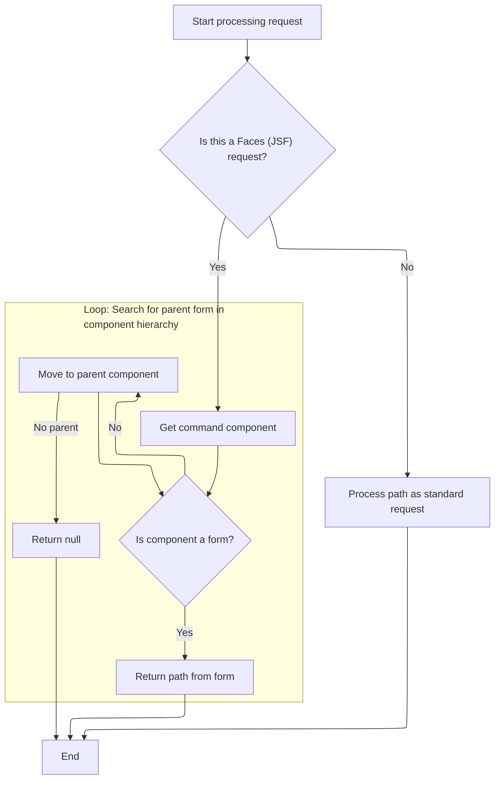

This document describes how HTTP requests are routed based on their origin. The flow determines whether a request comes from a standard client or a JSF client, then processes the path accordingly to ensure it is routed to the correct handler. The input is an HTTP request, and the output is the processed path used for routing.

# Routing Requests Based on Faces Context



<SwmSnippet path="/faces/src/main/java/org/apache/struts/faces/application/FacesTilesRequestProcessor.java" line="335">

---

In `FacesTilesRequestProcessor.processPath`, we first check if the request is tied to a JSF <SwmToken path="faces/src/main/java/org/apache/struts/faces/application/FacesTilesRequestProcessor.java" pos="340:1:1" line-data="        ActionEvent event = (ActionEvent)">`ActionEvent`</SwmToken>. If not, we just hand off to the standard Struts path processing by calling the superclass. This split is what lets us handle Faces and <SwmToken path="faces/src/main/java/org/apache/struts/faces/application/FacesTilesRequestProcessor.java" pos="343:5:7" line-data="        // Handle non-Faces requests in the usual way">`non-Faces`</SwmToken> requests differently without cluttering the main logic.

```java
    protected String processPath(HttpServletRequest request,
                                 HttpServletResponse response)
        throws IOException {

        // Are we processing a Faces request?
        ActionEvent event = (ActionEvent)
            request.getAttribute(Constants.ACTION_EVENT_KEY);

        // Handle non-Faces requests in the usual way
        if (event == null) {
            if (log.isTraceEnabled()) {
                log.trace("Performing standard processPath() processing");
            }
            return (super.processPath(request, response));
        }

```

---

</SwmSnippet>

<SwmSnippet path="/core/src/main/java/org/apache/struts/action/RequestProcessor.java" line="739">

---

`RequestProcessor.processPath` handles extracting and validating the path from the request, using framework-specific attributes and conventions. It checks for included paths, validates the module prefix, strips extensions, and ensures the path is in a format Struts can use. If anything's off, it logs and rejects the request.

```java
    protected String processPath(HttpServletRequest request,
        HttpServletResponse response)
        throws IOException {
        String path;

        // Set per request the original path for postback forms
        if (request.getAttribute(Globals.ORIGINAL_URI_KEY) == null) {
            request.setAttribute(Globals.ORIGINAL_URI_KEY, request.getServletPath());
        }

        // For prefix matching, match on the path info (if any)
        path = (String) request.getAttribute(INCLUDE_PATH_INFO);

        if (path == null) {
            path = request.getPathInfo();
        }

        if ((path != null) && (path.length() > 0)) {
            return (path);
        }

        // For extension matching, strip the module prefix and extension
        path = (String) request.getAttribute(INCLUDE_SERVLET_PATH);

        if (path == null) {
            path = request.getServletPath();
        }

        String prefix = moduleConfig.getPrefix();

        if (!path.startsWith(prefix)) {
            String msg = getInternal().getMessage("processPath");

            log.error(msg + " " + request.getRequestURI());
            response.sendError(HttpServletResponse.SC_BAD_REQUEST, msg);

            return null;
        }

        path = path.substring(prefix.length());

        int slash = path.lastIndexOf("/");
        int period = path.lastIndexOf(".");

        if ((period >= 0) && (period > slash)) {
            path = path.substring(0, period);
        }

        return (path);
    }
```

---

</SwmSnippet>

<SwmSnippet path="/faces/src/main/java/org/apache/struts/faces/application/FacesTilesRequestProcessor.java" line="351">

---

Back in `FacesTilesRequestProcessor.processPath`, after handling the standard path logic, we deal with Faces requests by walking up the <SwmToken path="faces/src/main/java/org/apache/struts/faces/application/FacesTilesRequestProcessor.java" pos="352:1:1" line-data="        UIComponent component = event.getComponent();">`UIComponent`</SwmToken> tree from the event to find a <SwmToken path="faces/src/main/java/org/apache/struts/faces/application/FacesTilesRequestProcessor.java" pos="357:10:10" line-data="        while (!(component instanceof FormComponent)) {">`FormComponent`</SwmToken>. If we don't find one, we log a warning and bail out, since Struts can't process a JSF action without a form context.

```java
        // Calculate the path from the form name
        UIComponent component = event.getComponent();
        if (log.isTraceEnabled()) {
            log.trace("Locating form parent for command component " +
                      event.getComponent());
        }
        while (!(component instanceof FormComponent)) {
            component = component.getParent();
            if (component == null) {
                log.warn("Command component was not nested in a Struts form!");
                return (null);
            }
        }
```

---

</SwmSnippet>

&nbsp;

*This is an auto-generated document by Swimm 🌊 and has not yet been verified by a human*

<SwmMeta version="3.0.0" repo-id="Z2l0aHViJTNBJTNBc3RydXRzMSUzQSUzQVN3aW1tLURlbW8=" repo-name="struts1"><sup>Powered by [Swimm](https://app.swimm.io/)</sup></SwmMeta>
