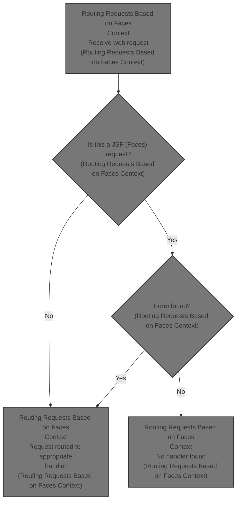
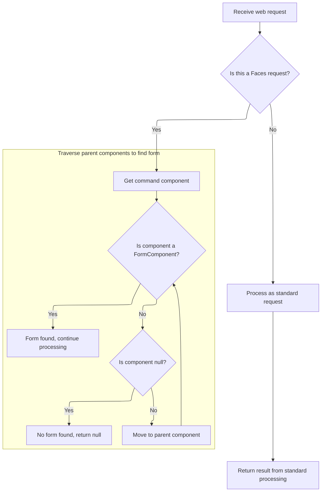

This document describes how web requests are routed based on whether they originate from a standard web interaction or a JavaServer Faces (JSF) context. Actions from JSF requests are linked to their forms, while standard requests are processed as usual. If a JSF request cannot be matched to a form, no action path is returned.



# Routing Requests Based on Faces Context



<SwmSnippet path="/faces/src/main/java/org/apache/struts/faces/application/FacesRequestProcessor.java" line="321">

---

<SwmToken path="faces/src/main/java/org/apache/struts/faces/application/FacesRequestProcessor.java" pos="321:5:5" line-data="    protected String processPath(HttpServletRequest request,">`processPath`</SwmToken> decides if the request is coming from a JSF (Faces) context by checking for an <SwmToken path="faces/src/main/java/org/apache/struts/faces/application/FacesRequestProcessor.java" pos="326:1:1" line-data="        ActionEvent event = (ActionEvent)">`ActionEvent`</SwmToken> in the request. If it's not a Faces request, it just calls the superclass method. If it is, it climbs up the <SwmToken path="faces/src/main/java/org/apache/struts/faces/application/FacesRequestProcessor.java" pos="338:1:1" line-data="        UIComponent component = event.getComponent();">`UIComponent`</SwmToken> tree from the event's component to find the nearest <SwmToken path="faces/src/main/java/org/apache/struts/faces/application/FacesRequestProcessor.java" pos="343:10:10" line-data="        while (!(component instanceof FormComponent)) {">`FormComponent`</SwmToken>, since that's where the action path lives. If it can't find a <SwmToken path="faces/src/main/java/org/apache/struts/faces/application/FacesRequestProcessor.java" pos="343:10:10" line-data="        while (!(component instanceof FormComponent)) {">`FormComponent`</SwmToken>, it logs a warning and bails out. This is how it separates Faces and <SwmToken path="faces/src/main/java/org/apache/struts/faces/application/FacesRequestProcessor.java" pos="329:5:7" line-data="        // Handle non-Faces requests in the usual way">`non-Faces`</SwmToken> handling and ensures actions are tied to forms.

```java
    protected String processPath(HttpServletRequest request,
                                 HttpServletResponse response)
        throws IOException {

        // Are we processing a Faces request?
        ActionEvent event = (ActionEvent)
            request.getAttribute(Constants.ACTION_EVENT_KEY);

        // Handle non-Faces requests in the usual way
        if (event == null) {
            if (log.isTraceEnabled()) {
                log.trace("Performing standard processPath() processing");
            }
            return (super.processPath(request, response));
        }

        // Calculate the path from the form name
        UIComponent component = event.getComponent();
        if (log.isTraceEnabled()) {
            log.trace("Locating form parent for command component " +
                      event.getComponent());
        }
        while (!(component instanceof FormComponent)) {
            component = component.getParent();
            if (component == null) {
                log.warn("Command component was not nested in a Struts form!");
                return (null);
            }
        }
```

---

</SwmSnippet>

&nbsp;

*This is an auto-generated document by Swimm 🌊 and has not yet been verified by a human*

<SwmMeta version="3.0.0" repo-id="Z2l0aHViJTNBJTNBc3RydXRzMSUzQSUzQVN3aW1tLURlbW8=" repo-name="struts1"><sup>Powered by [Swimm](https://app.swimm.io/)</sup></SwmMeta>
