This document explains how incoming HTTP requests are routed to either Struts or JSF for rendering, depending on the URI mapping. The flow receives an HTTP request and determines the appropriate rendering engine, ensuring the correct resource is displayed or an error message is returned if the resource cannot be found.

# Routing Requests and Struts/JSF Decision

<SwmSnippet path="/faces/src/main/java/org/apache/struts/faces/application/FacesRequestProcessor.java" line="99">

---

In <SwmToken path="faces/src/main/java/org/apache/struts/faces/application/FacesRequestProcessor.java" pos="99:5:5" line-data="    protected void doForward(String uri,">`doForward`</SwmToken>, after clearing out any existing <SwmToken path="faces/src/main/java/org/apache/struts/faces/application/FacesRequestProcessor.java" pos="108:9:9" line-data="        // Remove the current ActionEvent (if any)">`ActionEvent`</SwmToken> state from the request (Struts-specific cleanup), the code checks if the URI matches a Struts mapping using <SwmToken path="faces/src/main/java/org/apache/struts/faces/application/FacesRequestProcessor.java" pos="112:4:4" line-data="        if (isStrutsRequest(uri)) {">`isStrutsRequest`</SwmToken>. This check decides if the flow should stay in Struts-land (and forward/include) or switch to JSF rendering. The call to <SwmToken path="faces/src/main/java/org/apache/struts/faces/application/FacesRequestProcessor.java" pos="112:4:4" line-data="        if (isStrutsRequest(uri)) {">`isStrutsRequest`</SwmToken> is what splits the logic between the two frameworks.

```java
    protected void doForward(String uri,
                             HttpServletRequest request,
                             HttpServletResponse response)
        throws IOException, ServletException {

        if (log.isDebugEnabled()) {
            log.debug("doForward(" + uri + ")");
        }

        // Remove the current ActionEvent (if any)
        request.removeAttribute(Constants.ACTION_EVENT_KEY);

        // Process a Struts controller request normally
        if (isStrutsRequest(uri)) {
```

---

</SwmSnippet>

<SwmSnippet path="/faces/src/main/java/org/apache/struts/faces/application/FacesRequestProcessor.java" line="449">

---

<SwmToken path="faces/src/main/java/org/apache/struts/faces/application/FacesRequestProcessor.java" pos="449:5:5" line-data="    private boolean isStrutsRequest(String uri) {">`isStrutsRequest`</SwmToken> strips off any query parameters from the URI, grabs the Struts mapping pattern from the servlet context, and checks if the URI matches either an extension or path mapping. This is how it decides if the request should be handled by Struts.

```java
    private boolean isStrutsRequest(String uri) {

        int question = uri.indexOf("?");
        if (question >= 0) {
            uri = uri.substring(0, question);
        }
        String mapping = (String)
            servlet.getServletContext().getAttribute(Globals.SERVLET_KEY);
        if (mapping == null) {
            return (false);
        } else if (mapping.startsWith("*.")) {
            return (uri.endsWith(mapping.substring(1)));
        } else if (mapping.endsWith("/*")) {
            return (uri.startsWith(mapping.substring(0, mapping.length() - 2)));
        } else {
            return (false);
        }

    }
```

---

</SwmSnippet>

<SwmSnippet path="/faces/src/main/java/org/apache/struts/faces/application/FacesRequestProcessor.java" line="113">

---

Back in `FacesRequestProcessor.doForward`, after checking if it's a Struts request, the code decides between including or forwarding the URI using the superclass (<SwmToken path="faces/src/main/java/org/apache/struts/faces/application/FacesRequestProcessor.java" pos="45:10:10" line-data="import org.apache.struts.action.RequestProcessor;">`RequestProcessor`</SwmToken>). If the response is already committed, it uses <SwmToken path="faces/src/main/java/org/apache/struts/faces/application/FacesRequestProcessor.java" pos="115:9:9" line-data="                    log.trace(&quot;  super.doInclude(&quot; + uri + &quot;)&quot;);">`doInclude`</SwmToken>; otherwise, it uses <SwmToken path="faces/src/main/java/org/apache/struts/faces/application/FacesRequestProcessor.java" pos="120:9:9" line-data="                    log.trace(&quot;  super.doForward(&quot; + uri + &quot;)&quot;);">`doForward`</SwmToken>. This hands off the actual dispatch to the core Struts logic.

```java
            if (response.isCommitted()) {
                if (log.isTraceEnabled()) {
                    log.trace("  super.doInclude(" + uri + ")");
                }
                super.doInclude(uri, request, response);
            } else {
                if (log.isTraceEnabled()) {
                    log.trace("  super.doForward(" + uri + ")");
                }
```

---

</SwmSnippet>

## Including Resources via Dispatcher

<SwmSnippet path="/core/src/main/java/org/apache/struts/action/RequestProcessor.java" line="1098">

---

In <SwmToken path="core/src/main/java/org/apache/struts/action/RequestProcessor.java" pos="1098:5:5" line-data="    protected void doInclude(String uri, HttpServletRequest request,">`doInclude`</SwmToken>, the code tries to get a dispatcher for the URI. If it can't, it uses <SwmToken path="core/src/main/java/org/apache/struts/action/RequestProcessor.java" pos="1105:1:5" line-data="                getInternal().getMessage(&quot;requestDispatcher&quot;, uri));">`getInternal().getMessage`</SwmToken> to fetch a localized error message before sending an error response. That's why the next step is to look up the message resource.

```java
    protected void doInclude(String uri, HttpServletRequest request,
        HttpServletResponse response)
        throws IOException, ServletException {
        RequestDispatcher rd = getServletContext().getRequestDispatcher(uri);

        if (rd == null) {
            response.sendError(HttpServletResponse.SC_INTERNAL_SERVER_ERROR,
                getInternal().getMessage("requestDispatcher", uri));

            return;
        }

```

---

</SwmSnippet>

### Localized Message Lookup and Fallback

```mermaid
%%{init: {"flowchart": {"defaultRenderer": "elk"}} }%%
flowchart TD
    node1["Request message for locale and key"]
    click node1 openCode "core/src/main/java/org/apache/struts/util/PropertyMessageResources.java:227:282"
    node1 --> node2{"Is message found for requested locale
or its hierarchy?"}
    click node2 openCode "core/src/main/java/org/apache/struts/util/PropertyMessageResources.java:238:241"
    node2 -->|"Yes"| node3["Return message"]
    click node3 openCode "core/src/main/java/org/apache/struts/util/PropertyMessageResources.java:240:241"
    node2 -->|"No"| node4{"Mode type?"}
    click node4 openCode "core/src/main/java/org/apache/struts/util/PropertyMessageResources.java:244:265"
    node4 -->|"JSTL"| node5{"Is message found in default
properties?"}
    click node5 openCode "core/src/main/java/org/apache/struts/util/PropertyMessageResources.java:271:274"
    node5 -->|"Yes"| node3
    node5 -->|"No"| node6{"Return null or placeholder?"}
    click node6 openCode "core/src/main/java/org/apache/struts/util/PropertyMessageResources.java:277:281"
    node6 -->|"Null"| node7["Return null"]
    click node7 openCode "core/src/main/java/org/apache/struts/util/PropertyMessageResources.java:278:279"
    node6 -->|"Placeholder"| node8["Return placeholder"]
    click node8 openCode "core/src/main/java/org/apache/struts/util/PropertyMessageResources.java:280:281"
    node4 -->|"Resource Bundle"| node9{"Is message found for default locale or
its hierarchy?"}
    click node9 openCode "core/src/main/java/org/apache/struts/util/PropertyMessageResources.java:253:267"
    node9 -->|"Yes"| node3
    node9 -->|"No"| node5
    node4 -->|"Default"| node10{"Is message found for default locale or
its hierarchy?"}
    click node10 openCode "core/src/main/java/org/apache/struts/util/PropertyMessageResources.java:260:267"
    node10 -->|"Yes"| node3
    node10 -->|"No"| node5
classDef HeadingStyle fill:#777777,stroke:#333,stroke-width:2px;

%% Swimm:
%% %%{init: {"flowchart": {"defaultRenderer": "elk"}} }%%
%% flowchart TD
%%     node1["Request message for locale and key"]
%%     click node1 openCode "<SwmPath>[core/…/util/PropertyMessageResources.java](core/src/main/java/org/apache/struts/util/PropertyMessageResources.java)</SwmPath>:227:282"
%%     node1 --> node2{"Is message found for requested locale
%% or its hierarchy?"}
%%     click node2 openCode "<SwmPath>[core/…/util/PropertyMessageResources.java](core/src/main/java/org/apache/struts/util/PropertyMessageResources.java)</SwmPath>:238:241"
%%     node2 -->|"Yes"| node3["Return message"]
%%     click node3 openCode "<SwmPath>[core/…/util/PropertyMessageResources.java](core/src/main/java/org/apache/struts/util/PropertyMessageResources.java)</SwmPath>:240:241"
%%     node2 -->|"No"| node4{"Mode type?"}
%%     click node4 openCode "<SwmPath>[core/…/util/PropertyMessageResources.java](core/src/main/java/org/apache/struts/util/PropertyMessageResources.java)</SwmPath>:244:265"
%%     node4 -->|"JSTL"| node5{"Is message found in default
%% properties?"}
%%     click node5 openCode "<SwmPath>[core/…/util/PropertyMessageResources.java](core/src/main/java/org/apache/struts/util/PropertyMessageResources.java)</SwmPath>:271:274"
%%     node5 -->|"Yes"| node3
%%     node5 -->|"No"| node6{"Return null or placeholder?"}
%%     click node6 openCode "<SwmPath>[core/…/util/PropertyMessageResources.java](core/src/main/java/org/apache/struts/util/PropertyMessageResources.java)</SwmPath>:277:281"
%%     node6 -->|"Null"| node7["Return null"]
%%     click node7 openCode "<SwmPath>[core/…/util/PropertyMessageResources.java](core/src/main/java/org/apache/struts/util/PropertyMessageResources.java)</SwmPath>:278:279"
%%     node6 -->|"Placeholder"| node8["Return placeholder"]
%%     click node8 openCode "<SwmPath>[core/…/util/PropertyMessageResources.java](core/src/main/java/org/apache/struts/util/PropertyMessageResources.java)</SwmPath>:280:281"
%%     node4 -->|"Resource Bundle"| node9{"Is message found for default locale or
%% its hierarchy?"}
%%     click node9 openCode "<SwmPath>[core/…/util/PropertyMessageResources.java](core/src/main/java/org/apache/struts/util/PropertyMessageResources.java)</SwmPath>:253:267"
%%     node9 -->|"Yes"| node3
%%     node9 -->|"No"| node5
%%     node4 -->|"Default"| node10{"Is message found for default locale or
%% its hierarchy?"}
%%     click node10 openCode "<SwmPath>[core/…/util/PropertyMessageResources.java](core/src/main/java/org/apache/struts/util/PropertyMessageResources.java)</SwmPath>:260:267"
%%     node10 -->|"Yes"| node3
%%     node10 -->|"No"| node5
%% classDef HeadingStyle fill:#777777,stroke:#333,stroke-width:2px;
```



<SwmSnippet path="/core/src/main/java/org/apache/struts/util/PropertyMessageResources.java" line="227">

---

<SwmToken path="core/src/main/java/org/apache/struts/util/PropertyMessageResources.java" pos="227:5:5" line-data="    public String getMessage(Locale locale, String key) {">`getMessage`</SwmToken> looks up a localized message for the given key and locale, trying different fallbacks if the message isn't found. It calls <SwmToken path="core/src/main/java/org/apache/struts/util/PropertyMessageResources.java" pos="238:5:5" line-data="        message = findMessage(locale, key, originalKey);">`findMessage`</SwmToken> to do the actual search, including locale fallback logic.

```java
    public String getMessage(Locale locale, String key) {
        if (log.isDebugEnabled()) {
            log.debug("getMessage(" + locale + "," + key + ")");
        }

        // Initialize variables we will require
        String localeKey = localeKey(locale);
        String originalKey = messageKey(localeKey, key);
        String message = null;

        // Search the specified Locale
        message = findMessage(locale, key, originalKey);
        if (message != null) {
            return message;
        }

        // JSTL Compatibility - JSTL doesn't use the default locale
        if (mode == MODE_JSTL) {

           // do nothing (i.e. don't use default Locale)

        // PropertyResourcesBundle - searches through the hierarchy
        // for the default Locale (e.g. first en_US then en)
        } else if (mode == MODE_RESOURCE_BUNDLE) {

            if (!defaultLocale.equals(locale)) {
                message = findMessage(defaultLocale, key, originalKey);
            }

        // Default (backwards) Compatibility - just searches the
        // specified Locale (e.g. just en_US)
        } else {

            if (!defaultLocale.equals(locale)) {
                localeKey = localeKey(defaultLocale);
                message = findMessage(localeKey, key, originalKey);
            }

        }
        if (message != null) {
            return message;
        }

        // Find the message in the default properties file
        message = findMessage("", key, originalKey);
        if (message != null) {
            return message;
        }

        // Return an appropriate error indication
        if (returnNull) {
            return (null);
        } else {
            return ("???" + messageKey(locale, key) + "???");
        }
    }
```

---

</SwmSnippet>

<SwmSnippet path="/core/src/main/java/org/apache/struts/util/PropertyMessageResources.java" line="393">

---

<SwmToken path="core/src/main/java/org/apache/struts/util/PropertyMessageResources.java" pos="393:5:5" line-data="    private String findMessage(Locale locale, String key, String originalKey) {">`findMessage`</SwmToken> keeps trying less specific locale keys by chopping off parts after underscores, so if a message isn't found for something like 'en_US_POSIX', it'll try <SwmToken path="core/src/main/java/org/apache/struts/util/PropertyMessageResources.java" pos="249:19:19" line-data="        // for the default Locale (e.g. first en_US then en)">`en_US`</SwmToken>, then 'en', and so on. This way, it falls back to more general messages if needed.

```java
    private String findMessage(Locale locale, String key, String originalKey) {

        // Initialize variables we will require
        String localeKey = localeKey(locale);
        String messageKey = null;
        String message = null;
        int underscore = 0;

        // Loop from specific to general Locales looking for this message
        while (true) {
            message = findMessage(localeKey, key, originalKey);
            if (message != null) {
                break;
            }

            // Strip trailing modifiers to try a more general locale key
            underscore = localeKey.lastIndexOf("_");

            if (underscore < 0) {
                break;
            }

            localeKey = localeKey.substring(0, underscore);
        }
```

---

</SwmSnippet>

### Including the Resource or Sending Error

<SwmSnippet path="/core/src/main/java/org/apache/struts/action/RequestProcessor.java" line="1110">

---

After getting the error message (if needed), `RequestProcessor.doInclude` either sends the error or, if the dispatcher is valid, just includes the resource into the response.

```java
        rd.include(request, response);
    }
```

---

</SwmSnippet>

## JSF View Handling Fallback

```mermaid
%%{init: {"flowchart": {"defaultRenderer": "elk"}} }%%
flowchart TD
    node1["Start request forwarding"] --> node2{"Is there an existing FacesContext?"}
    click node1 openCode "faces/src/main/java/org/apache/struts/faces/application/FacesRequestProcessor.java:122:124"
    node2 -->|"Yes"| node3["Create new view for requested page (uri)"]
    click node2 openCode "faces/src/main/java/org/apache/struts/faces/application/FacesRequestProcessor.java:133:134"
    node2 -->|"No"| node4["Create FacesContext for request"]
    click node4 openCode "faces/src/main/java/org/apache/struts/faces/application/FacesRequestProcessor.java:134:143"
    node4 --> node3
    node3 --> node5["Render view for requested page (uri)"]
    click node3 openCode "faces/src/main/java/org/apache/struts/faces/application/FacesRequestProcessor.java:145:150"
    click node5 openCode "faces/src/main/java/org/apache/struts/faces/application/FacesRequestProcessor.java:153:158"
    node5 --> node6{"Was FacesContext created?"}
    click node6 openCode "faces/src/main/java/org/apache/struts/faces/application/FacesRequestProcessor.java:159:164"
    node6 -->|"Yes"| node7["Release FacesContext"]
    click node7 openCode "faces/src/main/java/org/apache/struts/faces/application/FacesRequestProcessor.java:163:164"
    node6 -->|"No"| node8["Rendering completed"]
    click node8 openCode "faces/src/main/java/org/apache/struts/faces/application/FacesRequestProcessor.java:166:168"
    node7 --> node9["End"]
    node8 --> node9
    click node9 openCode "faces/src/main/java/org/apache/struts/faces/application/FacesRequestProcessor.java:171:171"
classDef HeadingStyle fill:#777777,stroke:#333,stroke-width:2px;

%% Swimm:
%% %%{init: {"flowchart": {"defaultRenderer": "elk"}} }%%
%% flowchart TD
%%     node1["Start request forwarding"] --> node2{"Is there an existing <SwmToken path="faces/src/main/java/org/apache/struts/faces/application/FacesRequestProcessor.java" pos="127:7:7" line-data="        // Create a FacesContext for this request if necessary">`FacesContext`</SwmToken>?"}
%%     click node1 openCode "<SwmPath>[faces/…/application/FacesRequestProcessor.java](faces/src/main/java/org/apache/struts/faces/application/FacesRequestProcessor.java)</SwmPath>:122:124"
%%     node2 -->|"Yes"| node3["Create new view for requested page (uri)"]
%%     click node2 openCode "<SwmPath>[faces/…/application/FacesRequestProcessor.java](faces/src/main/java/org/apache/struts/faces/application/FacesRequestProcessor.java)</SwmPath>:133:134"
%%     node2 -->|"No"| node4["Create <SwmToken path="faces/src/main/java/org/apache/struts/faces/application/FacesRequestProcessor.java" pos="127:7:7" line-data="        // Create a FacesContext for this request if necessary">`FacesContext`</SwmToken> for request"]
%%     click node4 openCode "<SwmPath>[faces/…/application/FacesRequestProcessor.java](faces/src/main/java/org/apache/struts/faces/application/FacesRequestProcessor.java)</SwmPath>:134:143"
%%     node4 --> node3
%%     node3 --> node5["Render view for requested page (uri)"]
%%     click node3 openCode "<SwmPath>[faces/…/application/FacesRequestProcessor.java](faces/src/main/java/org/apache/struts/faces/application/FacesRequestProcessor.java)</SwmPath>:145:150"
%%     click node5 openCode "<SwmPath>[faces/…/application/FacesRequestProcessor.java](faces/src/main/java/org/apache/struts/faces/application/FacesRequestProcessor.java)</SwmPath>:153:158"
%%     node5 --> node6{"Was <SwmToken path="faces/src/main/java/org/apache/struts/faces/application/FacesRequestProcessor.java" pos="127:7:7" line-data="        // Create a FacesContext for this request if necessary">`FacesContext`</SwmToken> created?"}
%%     click node6 openCode "<SwmPath>[faces/…/application/FacesRequestProcessor.java](faces/src/main/java/org/apache/struts/faces/application/FacesRequestProcessor.java)</SwmPath>:159:164"
%%     node6 -->|"Yes"| node7["Release <SwmToken path="faces/src/main/java/org/apache/struts/faces/application/FacesRequestProcessor.java" pos="127:7:7" line-data="        // Create a FacesContext for this request if necessary">`FacesContext`</SwmToken>"]
%%     click node7 openCode "<SwmPath>[faces/…/application/FacesRequestProcessor.java](faces/src/main/java/org/apache/struts/faces/application/FacesRequestProcessor.java)</SwmPath>:163:164"
%%     node6 -->|"No"| node8["Rendering completed"]
%%     click node8 openCode "<SwmPath>[faces/…/application/FacesRequestProcessor.java](faces/src/main/java/org/apache/struts/faces/application/FacesRequestProcessor.java)</SwmPath>:166:168"
%%     node7 --> node9["End"]
%%     node8 --> node9
%%     click node9 openCode "<SwmPath>[faces/…/application/FacesRequestProcessor.java](faces/src/main/java/org/apache/struts/faces/application/FacesRequestProcessor.java)</SwmPath>:171:171"
%% classDef HeadingStyle fill:#777777,stroke:#333,stroke-width:2px;
```



<SwmSnippet path="/faces/src/main/java/org/apache/struts/faces/application/FacesRequestProcessor.java" line="122">

---

After coming back from `RequestProcessor.doInclude` in `FacesRequestProcessor.doForward`, if the URI still needs further processing (like Tiles layouts), the code hands off to <SwmToken path="tiles2/src/main/java/org/apache/struts/tiles2/TilesRequestProcessor.java" pos="59:4:4" line-data="public class TilesRequestProcessor extends RequestProcessor {">`TilesRequestProcessor`</SwmToken> for more advanced view handling. This keeps Struts and Tiles logic separated.

```java
                super.doForward(uri, request, response);
            }
            return;
        }

```

---

</SwmSnippet>

<SwmSnippet path="/tiles2/src/main/java/org/apache/struts/tiles2/TilesRequestProcessor.java" line="148">

---

<SwmToken path="tiles2/src/main/java/org/apache/struts/tiles2/TilesRequestProcessor.java" pos="148:5:5" line-data="    protected void doForward(">`doForward`</SwmToken> in <SwmToken path="tiles2/src/main/java/org/apache/struts/tiles2/TilesRequestProcessor.java" pos="59:4:4" line-data="public class TilesRequestProcessor extends RequestProcessor {">`TilesRequestProcessor`</SwmToken> checks if the response is committed. If so, it includes the resource; if not, it calls the superclass's <SwmToken path="tiles2/src/main/java/org/apache/struts/tiles2/TilesRequestProcessor.java" pos="148:5:5" line-data="    protected void doForward(">`doForward`</SwmToken> to handle the actual forward. This keeps Tiles logic compatible with core Struts processing.

```java
    protected void doForward(
        String uri,
        HttpServletRequest request,
        HttpServletResponse response)
        throws IOException, ServletException {

        if (response.isCommitted()) {
            this.doInclude(uri, request, response);

        } else {
            super.doForward(uri, request, response);
        }
    }
```

---

</SwmSnippet>

<SwmSnippet path="/faces/src/main/java/org/apache/struts/faces/application/FacesRequestProcessor.java" line="127">

---

After returning from <SwmToken path="tiles2/src/main/java/org/apache/struts/tiles2/TilesRequestProcessor.java" pos="59:4:4" line-data="public class TilesRequestProcessor extends RequestProcessor {">`TilesRequestProcessor`</SwmToken> in `FacesRequestProcessor.doForward`, if the URI isn't a Struts request, the code sets up a JSF <SwmToken path="faces/src/main/java/org/apache/struts/faces/application/FacesRequestProcessor.java" pos="127:7:7" line-data="        // Create a FacesContext for this request if necessary">`FacesContext`</SwmToken>, creates a new view root, and runs the JSF render lifecycle. This is how the function supports both Struts and JSF flows in one place.

```java
        // Create a FacesContext for this request if necessary
        LifecycleFactory lf = (LifecycleFactory)
            FactoryFinder.getFactory(FactoryFinder.LIFECYCLE_FACTORY);
        Lifecycle lifecycle = 
            lf.getLifecycle(getLifecycleId());
        boolean created = false;
        FacesContext context = FacesContext.getCurrentInstance();
        if (context == null) {
            if (log.isTraceEnabled()) {
                log.trace("  Creating new FacesContext for '" + uri + "'");
            }
            created = true;
            FacesContextFactory fcf = (FacesContextFactory)
                FactoryFinder.getFactory(FactoryFinder.FACES_CONTEXT_FACTORY);
            context = fcf.getFacesContext(servlet.getServletContext(),
                                          request, response, lifecycle);
        }

        // Create a new view root
        ViewHandler vh = context.getApplication().getViewHandler();
        if (log.isTraceEnabled()) {
            log.trace("  Creating new view for '" + uri + "'");
        }
        context.setViewRoot(vh.createView(context, uri));

        // Cause the view to be rendered
        if (log.isTraceEnabled()) {
            log.trace("  Rendering view for '" + uri + "'");
        }
        try {
            lifecycle.render(context);
        } finally {
            if (created) {
                if (log.isTraceEnabled()) {
                    log.trace("  Releasing context for '" + uri + "'");
                }
                context.release();
            } else {
                if (log.isTraceEnabled()) {
                    log.trace("  Rendering completed");
                }
            }
        }

    }
```

---

</SwmSnippet>

&nbsp;

*This is an auto-generated document by Swimm 🌊 and has not yet been verified by a human*

<SwmMeta version="3.0.0" repo-id="Z2l0aHViJTNBJTNBc3RydXRzMSUzQSUzQVN3aW1tLURlbW8=" repo-name="struts1"><sup>Powered by [Swimm](https://app.swimm.io/)</sup></SwmMeta>
