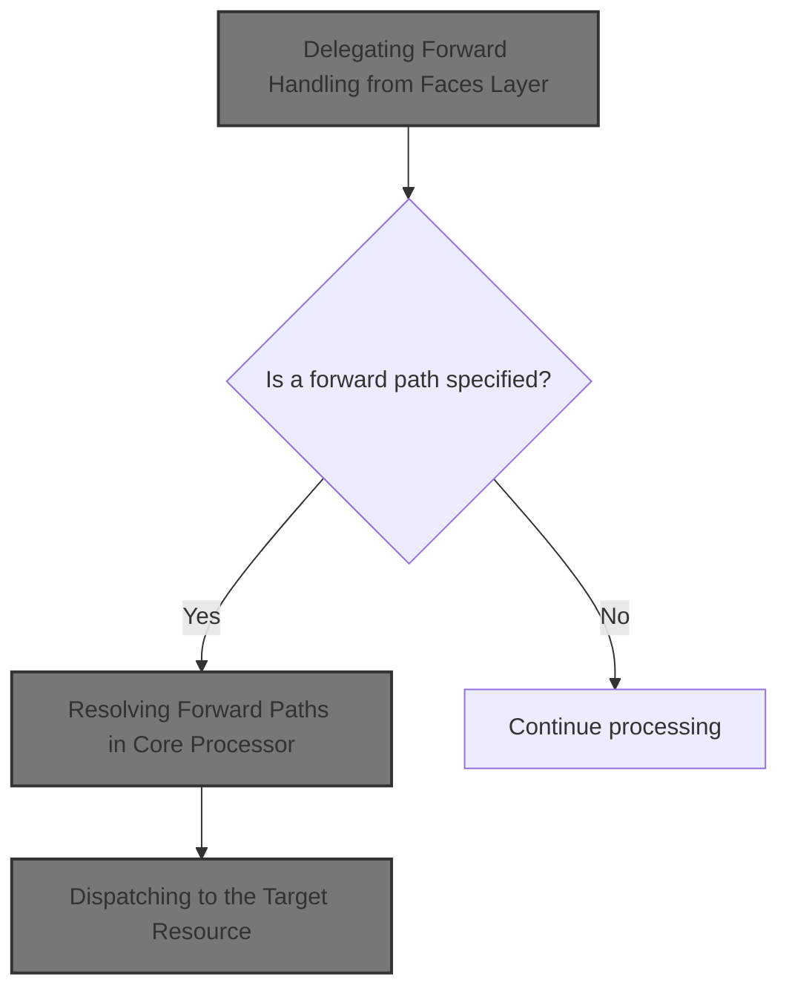
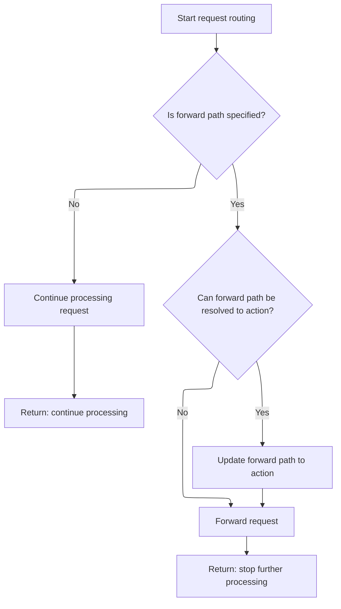
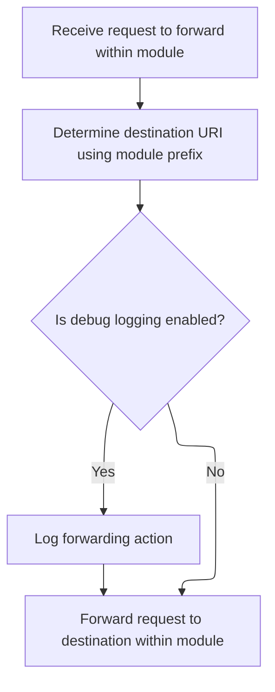

This document describes how requests are routed to their intended destinations within the application. The Faces layer delegates forwarding decisions to the core processor, which checks for a specified forward path and dispatches the request accordingly.



# Delegating Forward Handling from Faces Layer

```mermaid
%%{init: {"flowchart": {"defaultRenderer": "elk"}} }%%
flowchart TD
    node1{"Is trace logging enabled?"}
    click node1 openCode "faces/src/main/java/org/apache/struts/faces/application/FacesTilesRequestProcessor.java:274:276"
    node1 -->|"Yes"| node2["Log: Performing standard forward handling"]
    click node2 openCode "faces/src/main/java/org/apache/struts/faces/application/FacesTilesRequestProcessor.java:275:276"
    node1 -->|"No"| node3["Perform standard forward and get result"]
    click node3 openCode "faces/src/main/java/org/apache/struts/faces/application/FacesTilesRequestProcessor.java:277:278"
    node2 --> node3
    node3 --> node4{"Is debug logging enabled?"}
    click node4 openCode "faces/src/main/java/org/apache/struts/faces/application/FacesTilesRequestProcessor.java:279:281"
    node4 -->|"Yes"| node5["Log: Forward returned result"]
    click node5 openCode "faces/src/main/java/org/apache/struts/faces/application/FacesTilesRequestProcessor.java:280:281"
    node4 -->|"No"| node6["Return result"]
    click node6 openCode "faces/src/main/java/org/apache/struts/faces/application/FacesTilesRequestProcessor.java:282:282"
    node5 --> node6
classDef HeadingStyle fill:#777777,stroke:#333,stroke-width:2px;

%% Swimm:
%% %%{init: {"flowchart": {"defaultRenderer": "elk"}} }%%
%% flowchart TD
%%     node1{"Is trace logging enabled?"}
%%     click node1 openCode "<SwmPath>[faces/…/application/FacesTilesRequestProcessor.java](faces/src/main/java/org/apache/struts/faces/application/FacesTilesRequestProcessor.java)</SwmPath>:274:276"
%%     node1 -->|"Yes"| node2["Log: Performing standard forward handling"]
%%     click node2 openCode "<SwmPath>[faces/…/application/FacesTilesRequestProcessor.java](faces/src/main/java/org/apache/struts/faces/application/FacesTilesRequestProcessor.java)</SwmPath>:275:276"
%%     node1 -->|"No"| node3["Perform standard forward and get result"]
%%     click node3 openCode "<SwmPath>[faces/…/application/FacesTilesRequestProcessor.java](faces/src/main/java/org/apache/struts/faces/application/FacesTilesRequestProcessor.java)</SwmPath>:277:278"
%%     node2 --> node3
%%     node3 --> node4{"Is debug logging enabled?"}
%%     click node4 openCode "<SwmPath>[faces/…/application/FacesTilesRequestProcessor.java](faces/src/main/java/org/apache/struts/faces/application/FacesTilesRequestProcessor.java)</SwmPath>:279:281"
%%     node4 -->|"Yes"| node5["Log: Forward returned result"]
%%     click node5 openCode "<SwmPath>[faces/…/application/FacesTilesRequestProcessor.java](faces/src/main/java/org/apache/struts/faces/application/FacesTilesRequestProcessor.java)</SwmPath>:280:281"
%%     node4 -->|"No"| node6["Return result"]
%%     click node6 openCode "<SwmPath>[faces/…/application/FacesTilesRequestProcessor.java](faces/src/main/java/org/apache/struts/faces/application/FacesTilesRequestProcessor.java)</SwmPath>:282:282"
%%     node5 --> node6
%% classDef HeadingStyle fill:#777777,stroke:#333,stroke-width:2px;
```



<SwmSnippet path="/faces/src/main/java/org/apache/struts/faces/application/FacesTilesRequestProcessor.java" line="269">

---

<SwmToken path="faces/src/main/java/org/apache/struts/faces/application/FacesTilesRequestProcessor.java" pos="269:5:5" line-data="    protected boolean processForward(HttpServletRequest request,">`processForward`</SwmToken> in <SwmToken path="faces/src/main/java/org/apache/struts/faces/application/FacesTilesRequestProcessor.java" pos="64:4:4" line-data="public class FacesTilesRequestProcessor extends TilesRequestProcessor {">`FacesTilesRequestProcessor`</SwmToken> kicks off the forward handling by delegating to the base Struts <SwmToken path="faces/src/main/java/org/apache/struts/faces/application/FacesTilesRequestProcessor.java" pos="54:15:15" line-data=" * &lt;p&gt;Concrete implementation of &lt;code&gt;RequestProcessor&lt;/code&gt; that">`RequestProcessor`</SwmToken>. This means we're relying on the core logic for forwarding, and only adding some logging here. We call the core <SwmToken path="faces/src/main/java/org/apache/struts/faces/application/FacesTilesRequestProcessor.java" pos="54:15:15" line-data=" * &lt;p&gt;Concrete implementation of &lt;code&gt;RequestProcessor&lt;/code&gt; that">`RequestProcessor`</SwmToken> next because that's where the actual forward logic lives—this class doesn't override it.

```java
    protected boolean processForward(HttpServletRequest request,
                                     HttpServletResponse response,
                                     ActionMapping mapping)
        throws IOException, ServletException {

        if (log.isTraceEnabled()) {
            log.trace("Performing standard forward handling");
        }
        boolean result = super.processForward
            (request, response, mapping);
        if (log.isDebugEnabled()) {
            log.debug("Standard forward handling returned " + result);
        }
        return (result);

    }
```

---

</SwmSnippet>

# Resolving Forward Paths in Core Processor



<SwmSnippet path="/core/src/main/java/org/apache/struts/action/RequestProcessor.java" line="550">

---

<SwmToken path="core/src/main/java/org/apache/struts/action/RequestProcessor.java" pos="550:5:5" line-data="    protected boolean processForward(HttpServletRequest request,">`processForward`</SwmToken> in <SwmToken path="faces/src/main/java/org/apache/struts/faces/application/FacesTilesRequestProcessor.java" pos="54:15:15" line-data=" * &lt;p&gt;Concrete implementation of &lt;code&gt;RequestProcessor&lt;/code&gt; that">`RequestProcessor`</SwmToken> handles figuring out the actual path to forward to, including resolving any action aliases. If there's a valid forward path, it passes control to <SwmToken path="core/src/main/java/org/apache/struts/action/RequestProcessor.java" pos="566:1:1" line-data="        internalModuleRelativeForward(forward, request, response);">`internalModuleRelativeForward`</SwmToken>, which actually performs the forward. We need to call this next because that's where the path resolution and dispatching logic happens.

```java
    protected boolean processForward(HttpServletRequest request,
        HttpServletResponse response, ActionMapping mapping)
        throws IOException, ServletException {
        // Are we going to processing this request?
        String forward = mapping.getForward();

        if (forward == null) {
            return (true);
        }

        // If the forward can be unaliased into an action, then use the path of the action
        String actionIdPath = RequestUtils.actionIdURL(forward, this.moduleConfig, this.servlet);
        if (actionIdPath != null) {
            forward = actionIdPath;
        }

        internalModuleRelativeForward(forward, request, response);

        return (false);
    }
```

---

</SwmSnippet>

# Dispatching to the Target Resource



<SwmSnippet path="/core/src/main/java/org/apache/struts/action/RequestProcessor.java" line="1015">

---

<SwmToken path="core/src/main/java/org/apache/struts/action/RequestProcessor.java" pos="1015:5:5" line-data="    protected void internalModuleRelativeForward(String uri,">`internalModuleRelativeForward`</SwmToken> adds the module prefix to the URI and then hands off to <SwmToken path="core/src/main/java/org/apache/struts/action/RequestProcessor.java" pos="1027:1:1" line-data="        doForward(uri, request, response);">`doForward`</SwmToken>, which actually performs the servlet forward. We call <SwmToken path="core/src/main/java/org/apache/struts/action/RequestProcessor.java" pos="1027:1:1" line-data="        doForward(uri, request, response);">`doForward`</SwmToken> next because that's where the servlet context dispatch happens.

```java
    protected void internalModuleRelativeForward(String uri,
        HttpServletRequest request, HttpServletResponse response)
        throws IOException, ServletException {
        // Construct a request dispatcher for the specified path
        uri = moduleConfig.getPrefix() + uri;

        // Delegate the processing of this request
        // :FIXME: - exception handling?
        if (log.isDebugEnabled()) {
            log.debug(" Delegating via forward to '" + uri + "'");
        }

        doForward(uri, request, response);
    }
```

---

</SwmSnippet>

<SwmSnippet path="/core/src/main/java/org/apache/struts/action/RequestProcessor.java" line="1071">

---

<SwmToken path="core/src/main/java/org/apache/struts/action/RequestProcessor.java" pos="1071:5:5" line-data="    protected void doForward(String uri, HttpServletRequest request,">`doForward`</SwmToken> tries to get a <SwmToken path="core/src/main/java/org/apache/struts/action/RequestProcessor.java" pos="1074:1:1" line-data="        RequestDispatcher rd = getServletContext().getRequestDispatcher(uri);">`RequestDispatcher`</SwmToken> for the given URI and forwards the request. If the dispatcher is missing (bad URI), it sends a 500 error with a repository-specific message. The error message uses internalization, so its content depends on the repo's setup.

```java
    protected void doForward(String uri, HttpServletRequest request,
        HttpServletResponse response)
        throws IOException, ServletException {
        RequestDispatcher rd = getServletContext().getRequestDispatcher(uri);

        if (rd == null) {
            response.sendError(HttpServletResponse.SC_INTERNAL_SERVER_ERROR,
                getInternal().getMessage("requestDispatcher", uri));

            return;
        }

        rd.forward(request, response);
    }
```

---

</SwmSnippet>

&nbsp;

*This is an auto-generated document by Swimm 🌊 and has not yet been verified by a human*

<SwmMeta version="3.0.0" repo-id="Z2l0aHViJTNBJTNBc3RydXRzMSUzQSUzQVN3aW1tLURlbW8=" repo-name="struts1"><sup>Powered by [Swimm](https://app.swimm.io/)</sup></SwmMeta>
