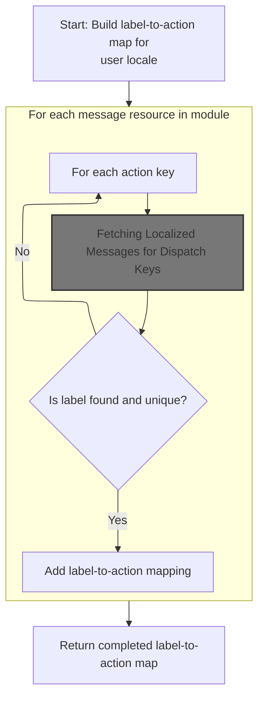
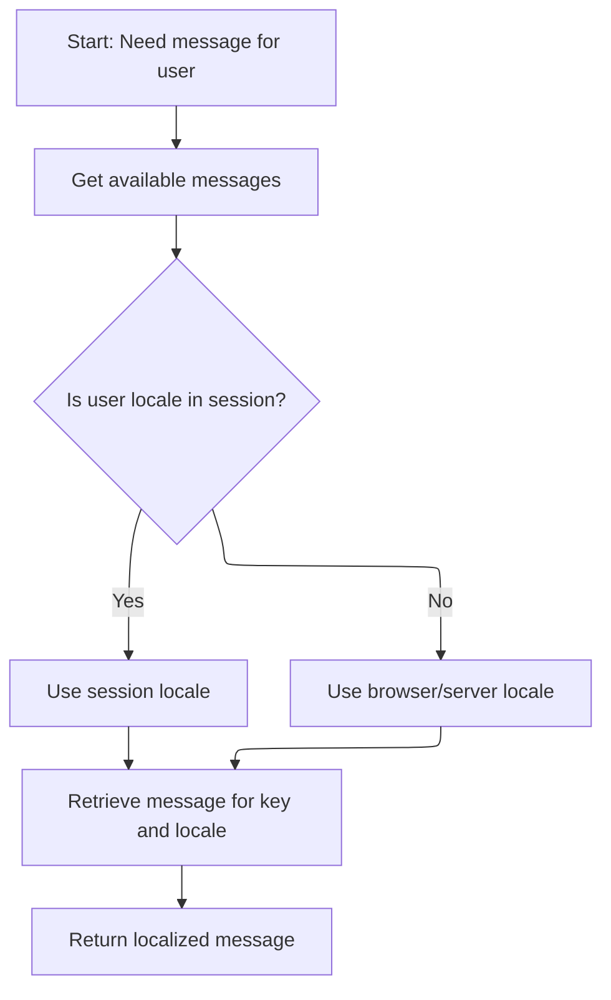
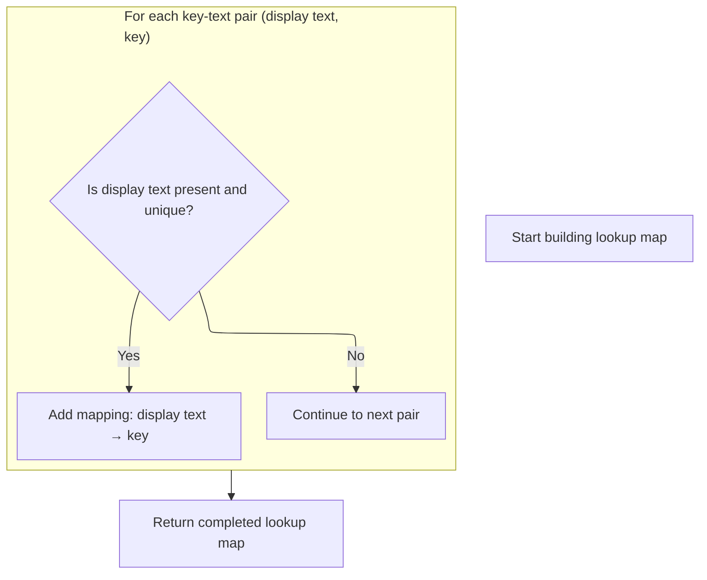
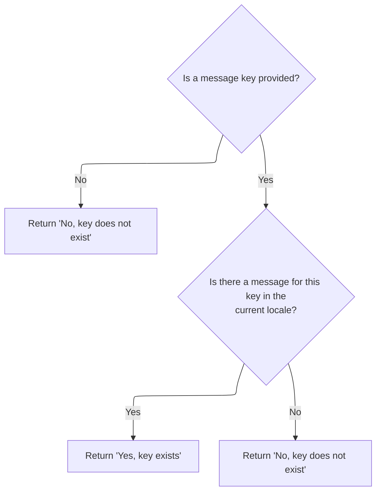
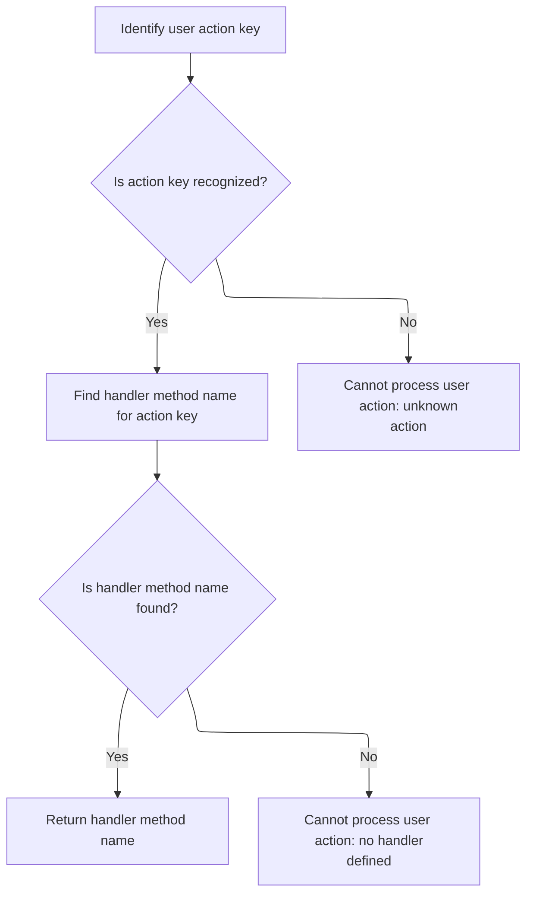

This document describes how the system determines which handler method should process a user's submitted action from a web form. The process supports both standard and multipart forms, and uses the user's locale to map user-facing labels to internal actions, enabling dynamic routing of user actions.

# Extracting the Dispatch Key from the Request

<SwmSnippet path="/extras/src/main/java/org/apache/struts/actions/LookupDispatchAction.java" line="261">

---

In <SwmToken path="extras/src/main/java/org/apache/struts/actions/LookupDispatchAction.java" pos="261:5:5" line-data="    protected String getMethodName(ActionMapping mapping, ActionForm form,">`getMethodName`</SwmToken>, we grab the dispatch key from the request parameters. If it's missing or empty, we bail early. Next, we need to check <SwmToken path="core/src/main/java/org/apache/struts/upload/MultipartRequestWrapper.java" pos="38:4:4" line-data="public class MultipartRequestWrapper extends HttpServletRequestWrapper {">`MultipartRequestWrapper`</SwmToken> because standard request handling doesn't cover <SwmToken path="core/src/main/java/org/apache/struts/util/RequestUtils.java" pos="349:4:8" line-data="     * &quot;multipart/form-data&quot; and the method is &quot;POST&quot;, the">`multipart/form-data`</SwmToken> (file uploads), so we might need to look there for the parameter.

```java
    protected String getMethodName(ActionMapping mapping, ActionForm form,
        HttpServletRequest request, HttpServletResponse response,
        String parameter) throws Exception {
        // Identify the method name to be dispatched to.
        // dispatchMethod() will call unspecified() if name is null
        String keyName = request.getParameter(parameter);

        if ((keyName == null) || (keyName.length() == 0)) {
            return null;
        }

```

---

</SwmSnippet>

## Resolving Parameters from Multipart Requests

<SwmSnippet path="/core/src/main/java/org/apache/struts/upload/MultipartRequestWrapper.java" line="75">

---

In <SwmToken path="core/src/main/java/org/apache/struts/upload/MultipartRequestWrapper.java" pos="75:5:5" line-data="    public String getParameter(String name) {">`getParameter`</SwmToken>, we first try to get the value from the wrapped request. If that's null (common with multipart forms), we check our internal parameters map. To do that, we need to call <SwmToken path="core/src/main/java/org/apache/struts/chain/contexts/ServletActionContext.java" pos="39:4:4" line-data="public class ServletActionContext extends WebActionContext {">`ServletActionContext`</SwmToken> to get the actual request object.

```java
    public String getParameter(String name) {
        String value = getRequest().getParameter(name);

```

---

</SwmSnippet>

### Accessing the Actual Servlet Request

<SwmSnippet path="/core/src/main/java/org/apache/struts/chain/contexts/ServletActionContext.java" line="94">

---

<SwmToken path="core/src/main/java/org/apache/struts/chain/contexts/ServletActionContext.java" pos="94:5:5" line-data="    public HttpServletRequest getRequest() {">`getRequest`</SwmToken> just pulls the actual <SwmToken path="core/src/main/java/org/apache/struts/chain/contexts/ServletActionContext.java" pos="94:3:3" line-data="    public HttpServletRequest getRequest() {">`HttpServletRequest`</SwmToken> from the <SwmToken path="core/src/main/java/org/apache/struts/chain/contexts/ServletActionContext.java" pos="67:3:3" line-data="    protected ServletWebContext servletWebContext() {">`ServletWebContext`</SwmToken>. We need this because multipart wrappers rely on the real servlet request for parameter access.

```java
    public HttpServletRequest getRequest() {
        return servletWebContext().getRequest();
    }
```

---

</SwmSnippet>

<SwmSnippet path="/core/src/main/java/org/apache/struts/chain/contexts/ServletActionContext.java" line="67">

---

<SwmToken path="core/src/main/java/org/apache/struts/chain/contexts/ServletActionContext.java" pos="67:5:5" line-data="    protected ServletWebContext servletWebContext() {">`servletWebContext`</SwmToken> just casts the base context to <SwmToken path="core/src/main/java/org/apache/struts/chain/contexts/ServletActionContext.java" pos="67:3:3" line-data="    protected ServletWebContext servletWebContext() {">`ServletWebContext`</SwmToken>. No checks—if it's not the right type, things break. This is how we get access to servlet-specific stuff.

```java
    protected ServletWebContext servletWebContext() {
        return (ServletWebContext) this.getBaseContext();
    }
```

---

</SwmSnippet>

### Fallback Parameter Resolution for Multipart Requests

<SwmSnippet path="/core/src/main/java/org/apache/struts/upload/MultipartRequestWrapper.java" line="78">

---

Back in `MultipartRequestWrapper.getParameter`, after checking the real request, we fall back to our internal map. If we find a String array, we just grab the first value—so multi-valued parameters get trimmed down to one. The map assumes everything is a String array, but that's not obvious from the function signature.

```java
        if (value == null) {
            String[] mValue = (String[]) parameters.get(name);

            if ((mValue != null) && (mValue.length > 0)) {
                value = mValue[0];
            }
        }

        return value;
    }
```

---

</SwmSnippet>

## Mapping the Dispatch Key to a Method Name

<SwmSnippet path="/extras/src/main/java/org/apache/struts/actions/LookupDispatchAction.java" line="272">

---

Back in `LookupDispatchAction.getMethodName`, after getting the key from <SwmToken path="core/src/main/java/org/apache/struts/upload/MultipartRequestWrapper.java" pos="38:4:4" line-data="public class MultipartRequestWrapper extends HttpServletRequestWrapper {">`MultipartRequestWrapper`</SwmToken>, we call <SwmToken path="extras/src/main/java/org/apache/struts/actions/LookupDispatchAction.java" pos="272:7:7" line-data="        String methodName = getLookupMapName(request, keyName, mapping);">`getLookupMapName`</SwmToken> to translate that key into the actual method name. This is where localization and mapping logic kick in.

```java
        String methodName = getLookupMapName(request, keyName, mapping);

        return methodName;
    }
```

---

</SwmSnippet>

# Translating Dispatch Keys Using Locale-Specific Maps

<SwmSnippet path="/extras/src/main/java/org/apache/struts/actions/LookupDispatchAction.java" line="208">

---

In <SwmToken path="extras/src/main/java/org/apache/struts/actions/LookupDispatchAction.java" pos="208:5:5" line-data="    protected String getLookupMapName(HttpServletRequest request,">`getLookupMapName`</SwmToken>, we grab the lookup map for the user's locale. If it's not there, we build it with <SwmToken path="extras/src/main/java/org/apache/struts/actions/LookupDispatchAction.java" pos="220:7:7" line-data="                lookupMap = this.initLookupMap(request, userLocale);">`initLookupMap`</SwmToken> and stash it in the <SwmToken path="extras/src/main/java/org/apache/struts/actions/LookupDispatchAction.java" pos="214:4:4" line-data="        synchronized (localeMap) {">`localeMap`</SwmToken> for next time.

```java
    protected String getLookupMapName(HttpServletRequest request,
        String keyName, ActionMapping mapping)
        throws ServletException {
        // Based on this request's Locale get the lookupMap
        Map lookupMap = null;

        synchronized (localeMap) {
            Locale userLocale = this.getLocale(request);

            lookupMap = (Map) this.localeMap.get(userLocale);

            if (lookupMap == null) {
                lookupMap = this.initLookupMap(request, userLocale);
                this.localeMap.put(userLocale, lookupMap);
            }
        }

```

---

</SwmSnippet>

## Building the Locale-Specific Lookup Map



<SwmSnippet path="/extras/src/main/java/org/apache/struts/actions/LookupDispatchAction.java" line="158">

---

In <SwmToken path="extras/src/main/java/org/apache/struts/actions/LookupDispatchAction.java" pos="158:5:5" line-data="    private Map initLookupMap(HttpServletRequest request, Locale userLocale) {">`initLookupMap`</SwmToken>, we loop through all module message resource configs to build the lookup map. To get the actual resources, we call <SwmToken path="extras/src/main/java/org/apache/struts/actions/LookupDispatchAction.java" pos="172:3:3" line-data="                this.getResources(request, mrc[i].getKey());">`getResources`</SwmToken> from Action.

```java
    private Map initLookupMap(HttpServletRequest request, Locale userLocale) {
        Map lookupMap = new HashMap();

        this.keyMethodMap = this.getKeyMethodMap();

        ModuleConfig moduleConfig =
            (ModuleConfig) request.getAttribute(Globals.MODULE_KEY);

        MessageResourcesConfig[] mrc =
            moduleConfig.findMessageResourcesConfigs();

        // Look through all module's MessageResources
        for (int i = 0; i < mrc.length; i++) {
            MessageResources resources =
                this.getResources(request, mrc[i].getKey());

```

---

</SwmSnippet>

### Fetching Module-Specific Message Resources

<SwmSnippet path="/core/src/main/java/org/apache/struts/action/Action.java" line="372">

---

<SwmToken path="core/src/main/java/org/apache/struts/action/Action.java" pos="372:5:5" line-data="    protected MessageResources getResources(HttpServletRequest request,">`getResources`</SwmToken> grabs the message resources for the current module. If the module config isn't found, we call <SwmToken path="core/src/main/java/org/apache/struts/action/Action.java" pos="377:1:1" line-data="            ModuleUtils.getInstance().getModuleConfig(request, context);">`ModuleUtils`</SwmToken> to get a fallback config and set it in the request.

```java
    protected MessageResources getResources(HttpServletRequest request,
        String key) {
        // Identify the current module
        ServletContext context = getServlet().getServletContext();
        ModuleConfig moduleConfig =
            ModuleUtils.getInstance().getModuleConfig(request, context);

        // Return the requested message resources instance
        return (MessageResources) context.getAttribute(key
            + moduleConfig.getPrefix());
    }
```

---

</SwmSnippet>

<SwmSnippet path="/core/src/main/java/org/apache/struts/util/ModuleUtils.java" line="130">

---

<SwmToken path="core/src/main/java/org/apache/struts/util/ModuleUtils.java" pos="130:5:5" line-data="    public ModuleConfig getModuleConfig(HttpServletRequest request,">`getModuleConfig`</SwmToken> tries to get the config from the request. If that's null, it falls back to the default (empty string) and sets it in the request for later use. This keeps resource lookups working even if the module isn't explicitly set.

```java
    public ModuleConfig getModuleConfig(HttpServletRequest request,
        ServletContext context) {
        ModuleConfig moduleConfig = this.getModuleConfig(request);

        if (moduleConfig == null) {
            moduleConfig = this.getModuleConfig("", context);
            request.setAttribute(Globals.MODULE_KEY, moduleConfig);
        }

        return moduleConfig;
    }
```

---

</SwmSnippet>

### Iterating Over Dispatch Keys for Resource Lookup

<SwmSnippet path="/extras/src/main/java/org/apache/struts/actions/LookupDispatchAction.java" line="174">

---

Back in <SwmToken path="extras/src/main/java/org/apache/struts/actions/LookupDispatchAction.java" pos="158:5:5" line-data="    private Map initLookupMap(HttpServletRequest request, Locale userLocale) {">`initLookupMap`</SwmToken>, after getting resources, we loop through dispatch keys. To check if a key exists, we call <SwmToken path="faces/src/main/java/org/apache/struts/faces/util/MessagesMap.java" pos="41:4:4" line-data="public class MessagesMap implements Map {">`MessagesMap`</SwmToken>, which might throw if <SwmToken path="extras/src/main/java/org/apache/struts/actions/LookupDispatchAction.java" pos="175:11:11" line-data="            Iterator iter = this.keyMethodMap.keySet().iterator();">`keySet`</SwmToken> isn't supported.

```java
            // Look for key in MessageResources
            Iterator iter = this.keyMethodMap.keySet().iterator();

```

---

</SwmSnippet>

<SwmSnippet path="/faces/src/main/java/org/apache/struts/faces/util/MessagesMap.java" line="211">

---

<SwmToken path="faces/src/main/java/org/apache/struts/faces/util/MessagesMap.java" pos="211:5:5" line-data="    public Set keySet() {">`keySet`</SwmToken> in <SwmToken path="faces/src/main/java/org/apache/struts/faces/util/MessagesMap.java" pos="41:4:4" line-data="public class MessagesMap implements Map {">`MessagesMap`</SwmToken> just throws <SwmToken path="faces/src/main/java/org/apache/struts/faces/util/MessagesMap.java" pos="213:5:5" line-data="        throw new UnsupportedOperationException();">`UnsupportedOperationException`</SwmToken>. If you try to iterate keys here, you're out of luck—it's not supported by design.

```java
    public Set keySet() {

        throw new UnsupportedOperationException();

    }
```

---

</SwmSnippet>

<SwmSnippet path="/extras/src/main/java/org/apache/struts/actions/LookupDispatchAction.java" line="177">

---

Back in <SwmToken path="extras/src/main/java/org/apache/struts/actions/LookupDispatchAction.java" pos="158:5:5" line-data="    private Map initLookupMap(HttpServletRequest request, Locale userLocale) {">`initLookupMap`</SwmToken>, after checking key presence, we call <SwmToken path="extras/src/main/java/org/apache/struts/actions/LookupDispatchAction.java" pos="179:9:9" line-data="                String text = resources.getMessage(userLocale, key);">`getMessage`</SwmToken> for each key to get the localized text. This is how we build the map for dispatching.

```java
            while (iter.hasNext()) {
                String key = (String) iter.next();
                String text = resources.getMessage(userLocale, key);

```

---

</SwmSnippet>

### Fetching Localized Messages for Dispatch Keys



<SwmSnippet path="/core/src/main/java/org/apache/struts/validator/Resources.java" line="249">

---

<SwmToken path="core/src/main/java/org/apache/struts/validator/Resources.java" pos="249:7:7" line-data="    public static String getMessage(HttpServletRequest request, String key) {">`getMessage`</SwmToken> in Resources grabs the message resources and then uses <SwmToken path="core/src/main/java/org/apache/struts/validator/Resources.java" pos="252:8:8" line-data="        return getMessage(messages, RequestUtils.getUserLocale(request, null),">`RequestUtils`</SwmToken> to figure out the user's locale. This way, we get the right localized message for each dispatch key.

```java
    public static String getMessage(HttpServletRequest request, String key) {
        MessageResources messages = getMessageResources(request);

        return getMessage(messages, RequestUtils.getUserLocale(request, null),
            key);
    }
```

---

</SwmSnippet>

<SwmSnippet path="/core/src/main/java/org/apache/struts/util/RequestUtils.java" line="299">

---

<SwmToken path="core/src/main/java/org/apache/struts/util/RequestUtils.java" pos="299:7:7" line-data="    public static Locale getUserLocale(HttpServletRequest request, String locale) {">`getUserLocale`</SwmToken> checks the session for a Locale using <SwmToken path="core/src/main/java/org/apache/struts/util/RequestUtils.java" pos="304:5:7" line-data="            locale = Globals.LOCALE_KEY;">`Globals.LOCALE_KEY`</SwmToken>. If it's not there, it falls back to the request's locale (usually from <SwmToken path="core/src/main/java/org/apache/struts/util/RequestUtils.java" pos="313:11:13" line-data="            // Returns Locale based on Accept-Language header or the server default">`Accept-Language`</SwmToken>). This keeps locale handling predictable.

```java
    public static Locale getUserLocale(HttpServletRequest request, String locale) {
        Locale userLocale = null;
        HttpSession session = request.getSession(false);

        if (locale == null) {
            locale = Globals.LOCALE_KEY;
        }

        // Only check session if sessions are enabled
        if (session != null) {
            userLocale = (Locale) session.getAttribute(locale);
        }

        if (userLocale == null) {
            // Returns Locale based on Accept-Language header or the server default
            userLocale = request.getLocale();
        }

        return userLocale;
    }
```

---

</SwmSnippet>

### Populating the Lookup Map with Localized Keys



<SwmSnippet path="/extras/src/main/java/org/apache/struts/actions/LookupDispatchAction.java" line="181">

---

Back in <SwmToken path="extras/src/main/java/org/apache/struts/actions/LookupDispatchAction.java" pos="158:5:5" line-data="    private Map initLookupMap(HttpServletRequest request, Locale userLocale) {">`initLookupMap`</SwmToken>, after getting the localized text, we add it to the lookup map if it's not already there. The map uses the text as the key, so user-facing strings drive dispatching.

```java
                // Found key and haven't added to Map yet, so add the text
                if ((text != null) && !lookupMap.containsKey(text)) {
                    lookupMap.put(text, key);
                }
            }
        }

        return lookupMap;
    }
```

---

</SwmSnippet>

## Checking for the Presence of Localized Keys



<SwmSnippet path="/faces/src/main/java/org/apache/struts/faces/util/MessagesMap.java" line="107">

---

<SwmToken path="faces/src/main/java/org/apache/struts/faces/util/MessagesMap.java" pos="107:5:5" line-data="    public boolean containsKey(Object key) {">`containsKey`</SwmToken> in <SwmToken path="faces/src/main/java/org/apache/struts/faces/util/MessagesMap.java" pos="41:4:4" line-data="public class MessagesMap implements Map {">`MessagesMap`</SwmToken> checks if the key is null, then calls <SwmToken path="faces/src/main/java/org/apache/struts/faces/util/MessagesMap.java" pos="112:6:6" line-data="            return (messages.isPresent(locale, key.toString()));">`isPresent`</SwmToken> on <SwmToken path="extras/src/main/java/org/apache/struts/actions/LookupDispatchAction.java" pos="169:13:13" line-data="        // Look through all module&#39;s MessageResources">`MessageResources`</SwmToken>. This filters out missing or placeholder messages.

```java
    public boolean containsKey(Object key) {

        if (key == null) {
            return (false);
        } else {
            return (messages.isPresent(locale, key.toString()));
        }

    }
```

---

</SwmSnippet>

<SwmSnippet path="/core/src/main/java/org/apache/struts/util/MessageResources.java" line="397">

---

<SwmToken path="core/src/main/java/org/apache/struts/util/MessageResources.java" pos="397:5:5" line-data="    public boolean isPresent(Locale locale, String key) {">`isPresent`</SwmToken> checks if the message exists and isn't a placeholder (starts and ends with ???). If it's missing or just a placeholder, we treat it as not present.

```java
    public boolean isPresent(Locale locale, String key) {
        String message = getMessage(locale, key);

        if (message == null) {
            return false;
        } else if (message.startsWith("???") && message.endsWith("???")) {
            return false; // FIXME - Only valid for default implementation
        } else {
            return true;
        }
    }
```

---

</SwmSnippet>

## Resolving the Method Name from the Lookup Map



<SwmSnippet path="/extras/src/main/java/org/apache/struts/actions/LookupDispatchAction.java" line="225">

---

Back in <SwmToken path="extras/src/main/java/org/apache/struts/actions/LookupDispatchAction.java" pos="208:5:5" line-data="    protected String getLookupMapName(HttpServletRequest request,">`getLookupMapName`</SwmToken>, after building the lookup map, we try to get the dispatch key and method name. If either is missing, we log an error and throw an exception—so the flow stops and the user sees an error.

```java
        // Find the key for the resource
        String key = (String) lookupMap.get(keyName);

        if (key == null) {
            String message =
                messages.getMessage("dispatch.resource", mapping.getPath());
            LOG.error(message + " '" + keyName + "'");
            throw new ServletException(message);
        }

        // Find the method name
        String methodName = (String) keyMethodMap.get(key);

        if (methodName == null) {
            String message =
                messages.getMessage("dispatch.lookup", mapping.getPath(), key);

            throw new ServletException(message);
        }

        return methodName;
    }
```

---

</SwmSnippet>

&nbsp;

*This is an auto-generated document by Swimm 🌊 and has not yet been verified by a human*

<SwmMeta version="3.0.0" repo-id="Z2l0aHViJTNBJTNBc3RydXRzMSUzQSUzQVN3aW1tLURlbW8=" repo-name="struts1"><sup>Powered by [Swimm](https://app.swimm.io/)</sup></SwmMeta>
