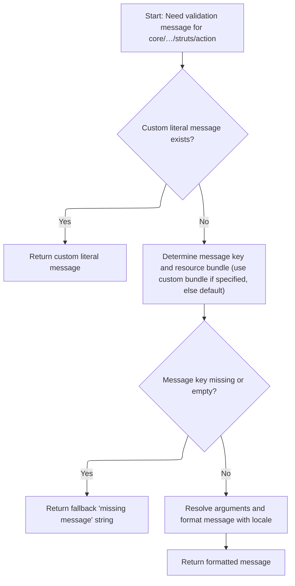

This document describes how user requests are routed to their intended destination. The flow validates the destination path, ensures messages are localized, and determines whether to forward, redirect, or include the request.

# Validating and Preparing Forward Path

<SwmSnippet path="/core/src/main/java/org/apache/struts/chain/commands/servlet/PerformForward.java" line="61">

---

In <SwmToken path="core/src/main/java/org/apache/struts/chain/commands/servlet/PerformForward.java" pos="61:5:5" line-data="    protected void perform(ActionContext context, ForwardConfig forwardConfig)">`perform`</SwmToken>, we grab the URI from <SwmToken path="core/src/main/java/org/apache/struts/chain/commands/servlet/PerformForward.java" pos="61:12:12" line-data="    protected void perform(ActionContext context, ForwardConfig forwardConfig)">`ForwardConfig`</SwmToken> and check if it's null. If it is, we throw an <SwmToken path="core/src/main/java/org/apache/struts/chain/commands/servlet/PerformForward.java" pos="70:5:5" line-data="            throw new IllegalArgumentException(resources.getMessage(&quot;forwardPathNull&quot;));">`IllegalArgumentException`</SwmToken> using a localized message from internal resources. This is why we need to call Resources next—to get the proper error message for the exception.

```java
    protected void perform(ActionContext context, ForwardConfig forwardConfig)
        throws Exception {
        ServletActionContext sacontext = (ServletActionContext) context;
        String uri = forwardConfig.getPath();

        if (uri == null) {
            ActionServlet servlet = sacontext.getActionServlet();
            MessageResources resources = servlet.getInternal();

            throw new IllegalArgumentException(resources.getMessage("forwardPathNull"));
        }

```

---

</SwmSnippet>

## Fetching and Formatting Localized Messages



<SwmSnippet path="/core/src/main/java/org/apache/struts/validator/Resources.java" line="286">

---

<SwmToken path="core/src/main/java/org/apache/struts/validator/Resources.java" pos="286:7:7" line-data="    public static String getMessage(ServletContext application,">`getMessage`</SwmToken> checks if the field has a custom message and whether it's a resource. If not, it returns the key directly. Otherwise, it figures out the key and bundle, loads resources if needed, and handles missing keys by returning a placeholder. It then grabs arguments, localizes them, and formats the final message.

```java
    public static String getMessage(ServletContext application,
        HttpServletRequest request, MessageResources defaultMessages,
        Locale locale, ValidatorAction va, Field field) {
        Msg msg = field.getMessage(va.getName());

        if ((msg != null) && !msg.isResource()) {
            return msg.getKey();
        }

        String msgKey = null;
        String msgBundle = null;
        MessageResources messages = defaultMessages;

        if (msg == null) {
            msgKey = va.getMsg();
        } else {
            msgKey = msg.getKey();
            msgBundle = msg.getBundle();

            if (msg.getBundle() != null) {
                messages =
                    getMessageResources(application, request, msg.getBundle());
            }
        }

        if ((msgKey == null) || (msgKey.length() == 0)) {
            return "??? " + va.getName() + "." + field.getProperty() + " ???";
        }

        // Get the arguments
        Arg[] args = field.getArgs(va.getName());
        String[] argValues =
            getArgValues(application, request, messages, locale, args);

        // Return the message
        return messages.getMessage(locale, msgKey, argValues);
    }
```

---

</SwmSnippet>

<SwmSnippet path="/core/src/main/java/org/apache/struts/validator/Resources.java" line="455">

---

<SwmToken path="core/src/main/java/org/apache/struts/validator/Resources.java" pos="455:9:9" line-data="    private static String[] getArgValues(ServletContext application,">`getArgValues`</SwmToken> loops through the Arg array, localizing each one if it's a resource, using either the default or a specified bundle. If it's not a resource, it just uses the key. If there are no args, it returns null right away.

```java
    private static String[] getArgValues(ServletContext application,
        HttpServletRequest request, MessageResources defaultMessages,
        Locale locale, Arg[] args) {
        if ((args == null) || (args.length == 0)) {
            return null;
        }

        String[] values = new String[args.length];

        for (int i = 0; i < args.length; i++) {
            if (args[i] != null) {
                if (args[i].isResource()) {
                    MessageResources messages = defaultMessages;

                    if (args[i].getBundle() != null) {
                        messages =
                            getMessageResources(application, request,
                                args[i].getBundle());
                    }

                    values[i] = messages.getMessage(locale, args[i].getKey());
                } else {
                    values[i] = args[i].getKey();
                }
            }
        }
```

---

</SwmSnippet>

## Resolving and Executing Forwarding Logic

```mermaid
%%{init: {"flowchart": {"defaultRenderer": "elk"}} }%%
flowchart TD
  node1["Start"] --> node2{"Is action path available?"}
  click node1 openCode "core/src/main/java/org/apache/struts/chain/commands/servlet/PerformForward.java:73:75"
  node2 -->|"Yes"| node3["Use action path for forward"]
  click node2 openCode "core/src/main/java/org/apache/struts/chain/commands/servlet/PerformForward.java:78:84"
  node2 -->|"No"| node4{"Is URI module-relative?"}
  click node3 openCode "core/src/main/java/org/apache/struts/chain/commands/servlet/PerformForward.java:80:84"
  node3 --> node4
  node4 -->|"Yes"| node5["Resolve module-relative path"]
  click node4 openCode "core/src/main/java/org/apache/struts/chain/commands/servlet/PerformForward.java:86:88"
  node4 -->|"No"| node6{"Is response committed and not redirect?"}
  click node5 openCode "core/src/main/java/org/apache/struts/chain/commands/servlet/PerformForward.java:87:88"
  node5 --> node6
  node4 -->|"No"| node6
  node6 -->|"Yes"| node7["Include request"]
  click node6 openCode "core/src/main/java/org/apache/struts/chain/commands/servlet/PerformForward.java:91:92"
  node6 -->|"No"| node8{"Is redirect?"}
  node7 --> node9["End"]
  node8 -->|"Yes"| node10["Redirect request"]
  click node8 openCode "core/src/main/java/org/apache/struts/chain/commands/servlet/PerformForward.java:93:94"
  node8 -->|"No"| node11["Forward request"]
  click node10 openCode "core/src/main/java/org/apache/struts/chain/commands/servlet/PerformForward.java:94:94"
  click node11 openCode "core/src/main/java/org/apache/struts/chain/commands/servlet/PerformForward.java:96:96"
  node10 --> node9
  node11 --> node9
  node9["End"]
classDef HeadingStyle fill:#777777,stroke:#333,stroke-width:2px;

%% Swimm:
%% %%{init: {"flowchart": {"defaultRenderer": "elk"}} }%%
%% flowchart TD
%%   node1["Start"] --> node2{"Is action path available?"}
%%   click node1 openCode "<SwmPath>[core/…/servlet/PerformForward.java](core/src/main/java/org/apache/struts/chain/commands/servlet/PerformForward.java)</SwmPath>:73:75"
%%   node2 -->|"Yes"| node3["Use action path for forward"]
%%   click node2 openCode "<SwmPath>[core/…/servlet/PerformForward.java](core/src/main/java/org/apache/struts/chain/commands/servlet/PerformForward.java)</SwmPath>:78:84"
%%   node2 -->|"No"| node4{"Is URI module-relative?"}
%%   click node3 openCode "<SwmPath>[core/…/servlet/PerformForward.java](core/src/main/java/org/apache/struts/chain/commands/servlet/PerformForward.java)</SwmPath>:80:84"
%%   node3 --> node4
%%   node4 -->|"Yes"| node5["Resolve module-relative path"]
%%   click node4 openCode "<SwmPath>[core/…/servlet/PerformForward.java](core/src/main/java/org/apache/struts/chain/commands/servlet/PerformForward.java)</SwmPath>:86:88"
%%   node4 -->|"No"| node6{"Is response committed and not redirect?"}
%%   click node5 openCode "<SwmPath>[core/…/servlet/PerformForward.java](core/src/main/java/org/apache/struts/chain/commands/servlet/PerformForward.java)</SwmPath>:87:88"
%%   node5 --> node6
%%   node4 -->|"No"| node6
%%   node6 -->|"Yes"| node7["Include request"]
%%   click node6 openCode "<SwmPath>[core/…/servlet/PerformForward.java](core/src/main/java/org/apache/struts/chain/commands/servlet/PerformForward.java)</SwmPath>:91:92"
%%   node6 -->|"No"| node8{"Is redirect?"}
%%   node7 --> node9["End"]
%%   node8 -->|"Yes"| node10["Redirect request"]
%%   click node8 openCode "<SwmPath>[core/…/servlet/PerformForward.java](core/src/main/java/org/apache/struts/chain/commands/servlet/PerformForward.java)</SwmPath>:93:94"
%%   node8 -->|"No"| node11["Forward request"]
%%   click node10 openCode "<SwmPath>[core/…/servlet/PerformForward.java](core/src/main/java/org/apache/struts/chain/commands/servlet/PerformForward.java)</SwmPath>:94:94"
%%   click node11 openCode "<SwmPath>[core/…/servlet/PerformForward.java](core/src/main/java/org/apache/struts/chain/commands/servlet/PerformForward.java)</SwmPath>:96:96"
%%   node10 --> node9
%%   node11 --> node9
%%   node9["End"]
%% classDef HeadingStyle fill:#777777,stroke:#333,stroke-width:2px;
```



<SwmSnippet path="/core/src/main/java/org/apache/struts/chain/commands/servlet/PerformForward.java" line="73">

---

Back in PerformForward.perform, after getting the message, we check if the forward path can be mapped to an action, resolve module-relative paths, and then decide how to handle the forward—include, redirect, or forward—based on response state and config. We call <SwmToken path="core/src/main/java/org/apache/struts/chain/commands/servlet/PerformForward.java" pos="96:1:1" line-data="            handleAsForward(uri, servletContext, request, response);">`handleAsForward`</SwmToken> if we need to forward internally.

```java
        HttpServletRequest request = sacontext.getRequest();
        ServletContext servletContext = sacontext.getContext();
        HttpServletResponse response = sacontext.getResponse();

        // If the forward can be unaliased into an action, then use the path of the action
        String actionIdPath = RequestUtils.actionIdURL(forwardConfig, sacontext.getRequest(), sacontext.getActionServlet());
        if (actionIdPath != null) {
            uri = actionIdPath;
            ForwardConfig actionIdForwardConfig = new ForwardConfig(forwardConfig);
            actionIdForwardConfig.setPath(actionIdPath);
            forwardConfig = actionIdForwardConfig;
        }

        if (uri.startsWith("/")) {
            uri = resolveModuleRelativePath(forwardConfig, servletContext, request);
        }


        if (response.isCommitted() && !forwardConfig.getRedirect()) {
            handleAsInclude(uri, servletContext, request, response);
        } else if (forwardConfig.getRedirect()) {
            handleAsRedirect(uri, request, response);
        } else {
            handleAsForward(uri, servletContext, request, response);
        }
    }
```

---

</SwmSnippet>

<SwmSnippet path="/core/src/main/java/org/apache/struts/chain/commands/servlet/PerformForward.java" line="106">

---

<SwmToken path="core/src/main/java/org/apache/struts/chain/commands/servlet/PerformForward.java" pos="106:5:5" line-data="    private void handleAsForward(String uri, ServletContext servletContext, HttpServletRequest request, HttpServletResponse response) throws ServletException, IOException {">`handleAsForward`</SwmToken> grabs a <SwmToken path="core/src/main/java/org/apache/struts/chain/commands/servlet/PerformForward.java" pos="107:1:1" line-data="        RequestDispatcher rd = servletContext.getRequestDispatcher(uri);">`RequestDispatcher`</SwmToken> for the URI and forwards the request and response. It assumes the URI is valid and doesn't check for null, so any issues bubble up from the servlet container.

```java
    private void handleAsForward(String uri, ServletContext servletContext, HttpServletRequest request, HttpServletResponse response) throws ServletException, IOException {
        RequestDispatcher rd = servletContext.getRequestDispatcher(uri);

        if (LOG.isDebugEnabled()) {
            LOG.debug("Forwarding to " + uri);
        }

        rd.forward(request, response);
    }
```

---

</SwmSnippet>

&nbsp;

*This is an auto-generated document by Swimm 🌊 and has not yet been verified by a human*

<SwmMeta version="3.0.0" repo-id="Z2l0aHViJTNBJTNBc3RydXRzMSUzQSUzQVN3aW1tLURlbW8=" repo-name="struts1"><sup>Powered by [Swimm](https://app.swimm.io/)</sup></SwmMeta>
