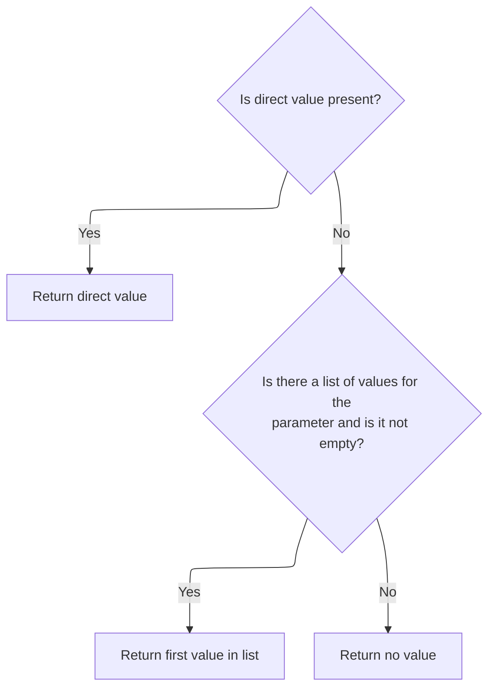
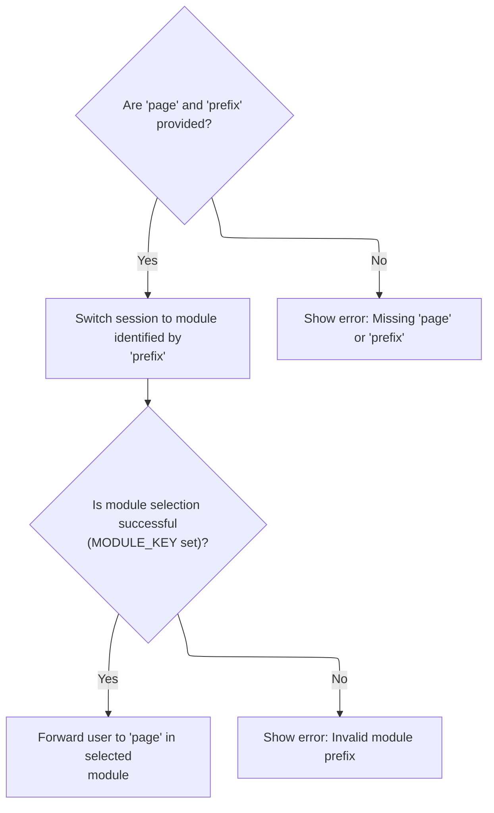

This document describes how users are routed to the correct module and page by extracting routing parameters from HTTP requests, including multipart form submissions. The flow ensures users are only routed when valid information is provided, otherwise an error is shown.

# Extracting Routing Parameters from the Request

<SwmSnippet path="/extras/src/main/java/org/apache/struts/actions/SwitchAction.java" line="83">

---

In <SwmToken path="extras/src/main/java/org/apache/struts/actions/SwitchAction.java" pos="83:5:5" line-data="    public ActionForward execute(ActionMapping mapping, ActionForm form,">`execute`</SwmToken>, we're grabbing 'page' and 'prefix' from the request to figure out where to send the user. If these aren't found, we need to check for multipart form data, so we call <SwmToken path="core/src/main/java/org/apache/struts/upload/MultipartRequestWrapper.java" pos="38:4:4" line-data="public class MultipartRequestWrapper extends HttpServletRequestWrapper {">`MultipartRequestWrapper`</SwmToken> next to handle cases where parameters might be embedded in a multipart request.

```java
    public ActionForward execute(ActionMapping mapping, ActionForm form,
        HttpServletRequest request, HttpServletResponse response)
        throws Exception {
        // Identify the request parameters controlling our actions
        String page = request.getParameter("page");
        String prefix = request.getParameter("prefix");

```

---

</SwmSnippet>

## Retrieving Parameters from Multipart Requests

<SwmSnippet path="/core/src/main/java/org/apache/struts/upload/MultipartRequestWrapper.java" line="75">

---

In <SwmToken path="core/src/main/java/org/apache/struts/upload/MultipartRequestWrapper.java" pos="75:5:5" line-data="    public String getParameter(String name) {">`getParameter`</SwmToken>, we're first checking the standard request for the parameter. If it's not there, we need to call <SwmToken path="core/src/main/java/org/apache/struts/chain/contexts/ServletActionContext.java" pos="39:4:4" line-data="public class ServletActionContext extends WebActionContext {">`ServletActionContext`</SwmToken> next to get the underlying request object, since multipart data might be handled differently and could require digging deeper.

```java
    public String getParameter(String name) {
        String value = getRequest().getParameter(name);

```

---

</SwmSnippet>

### Accessing the Underlying Servlet Request

<SwmSnippet path="/core/src/main/java/org/apache/struts/chain/contexts/ServletActionContext.java" line="94">

---

<SwmToken path="core/src/main/java/org/apache/struts/chain/contexts/ServletActionContext.java" pos="94:5:5" line-data="    public HttpServletRequest getRequest() {">`getRequest`</SwmToken> just grabs the actual servlet request from the current web context. This is needed so parameter retrieval works even if the request is wrapped or modified elsewhere.

```java
    public HttpServletRequest getRequest() {
        return servletWebContext().getRequest();
    }
```

---

</SwmSnippet>

<SwmSnippet path="/core/src/main/java/org/apache/struts/chain/contexts/ServletActionContext.java" line="67">

---

<SwmToken path="core/src/main/java/org/apache/struts/chain/contexts/ServletActionContext.java" pos="67:5:5" line-data="    protected ServletWebContext servletWebContext() {">`servletWebContext`</SwmToken> just casts the base context to <SwmToken path="core/src/main/java/org/apache/struts/chain/contexts/ServletActionContext.java" pos="67:3:3" line-data="    protected ServletWebContext servletWebContext() {">`ServletWebContext`</SwmToken> without checking. If the assumption fails, you'll get a ClassCastException, so this is only safe if the context is always set up correctly.

```java
    protected ServletWebContext servletWebContext() {
        return (ServletWebContext) this.getBaseContext();
    }
```

---

</SwmSnippet>

### Fallback to Local Parameter Map



<SwmSnippet path="/core/src/main/java/org/apache/struts/upload/MultipartRequestWrapper.java" line="78">

---

Back in <SwmToken path="extras/src/main/java/org/apache/struts/actions/SwitchAction.java" pos="87:9:9" line-data="        String page = request.getParameter(&quot;page&quot;);">`getParameter`</SwmToken>, after checking the servlet request (from <SwmToken path="core/src/main/java/org/apache/struts/chain/contexts/ServletActionContext.java" pos="39:4:4" line-data="public class ServletActionContext extends WebActionContext {">`ServletActionContext`</SwmToken>), if the parameter isn't found, we look in the local parameters map. This covers cases where multipart form data stores values differently, so both sources are checked before returning.

```java
        if (value == null) {
            String[] mValue = (String[]) parameters.get(name);

            if ((mValue != null) && (mValue.length > 0)) {
                value = mValue[0];
            }
        }

        return value;
    }
```

---

</SwmSnippet>

## Validating and Routing the Request



<SwmSnippet path="/extras/src/main/java/org/apache/struts/actions/SwitchAction.java" line="90">

---

Back in `SwitchAction.execute`, after getting parameters from <SwmToken path="core/src/main/java/org/apache/struts/upload/MultipartRequestWrapper.java" pos="38:4:4" line-data="public class MultipartRequestWrapper extends HttpServletRequestWrapper {">`MultipartRequestWrapper`</SwmToken>, we check if 'page' and 'prefix' are valid. If not, we throw an error. If they're good, we switch modules and forward to the requested page. This ensures only valid requests are processed.

```java
        if ((page == null) || (prefix == null)) {
            String message = messages.getMessage("switch.required");

            log.error(message);
            throw new ServletException(message);
        }

        // Switch to the requested module
        ModuleUtils.getInstance().selectModule(prefix, request,
            getServlet().getServletContext());

        if (request.getAttribute(Globals.MODULE_KEY) == null) {
            String message = messages.getMessage("switch.prefix", prefix);

            log.error(message);
            throw new ServletException(message);
        }

        // Forward control to the specified module-relative URI
        return (new ActionForward(page));
    }
```

---

</SwmSnippet>

&nbsp;

*This is an auto-generated document by Swimm 🌊 and has not yet been verified by a human*

<SwmMeta version="3.0.0" repo-id="Z2l0aHViJTNBJTNBc3RydXRzMSUzQSUzQVN3aW1tLURlbW8=" repo-name="struts1"><sup>Powered by [Swimm](https://app.swimm.io/)</sup></SwmMeta>
