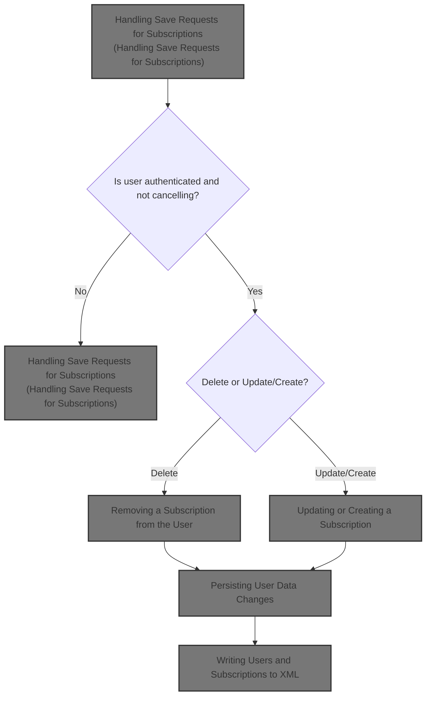
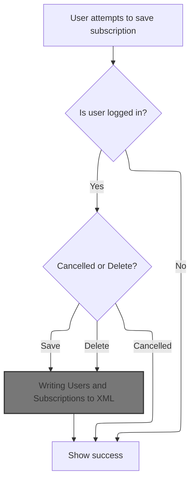
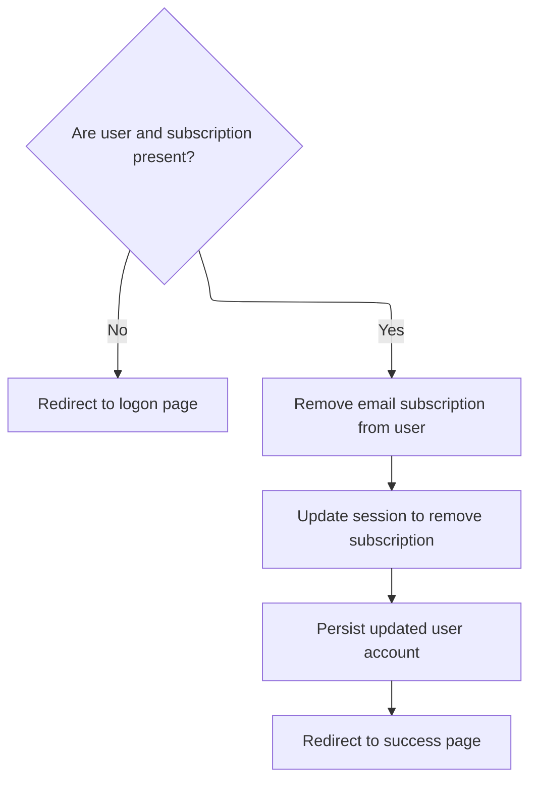
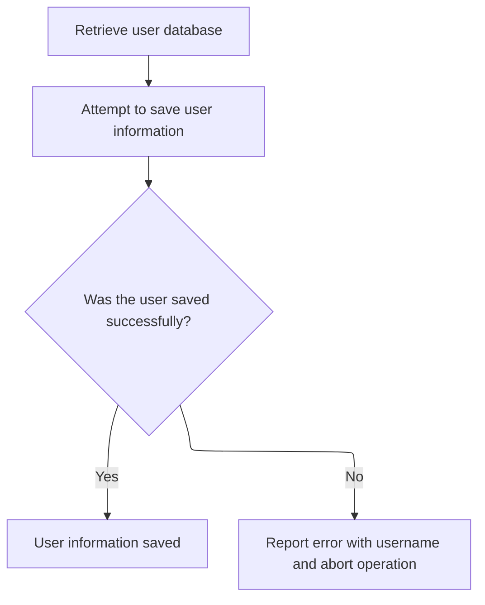
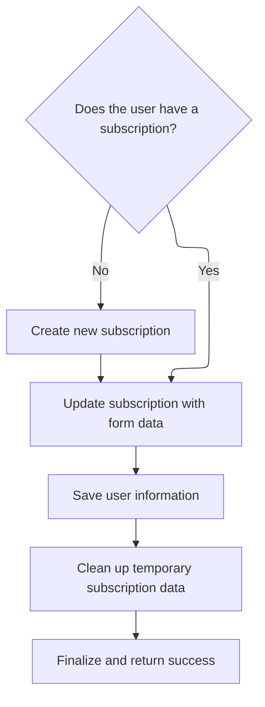

This document describes how user requests to create, update, or delete email subscriptions are handled. The system checks authentication, processes the requested action, and saves all changes to an XML database, providing feedback to the user.



# Handling Save Requests for Subscriptions



<SwmSnippet path="/apps/mailreader/src/main/java/org/apache/struts/apps/mailreader/actions/SubscriptionAction.java" line="302">

---

In <SwmToken path="apps/mailreader/src/main/java/org/apache/struts/apps/mailreader/actions/SubscriptionAction.java" pos="302:5:5" line-data="    public ActionForward Save(">`Save`</SwmToken>, we check for user authentication, handle cancellation, and then branch based on the action. If the action is DELETE, we immediately call <SwmToken path="apps/mailreader/src/main/java/org/apache/struts/apps/mailreader/actions/SubscriptionAction.java" pos="327:3:3" line-data="            return doRemoveSubscription(mapping, session, user, subscription);">`doRemoveSubscription`</SwmToken> to remove the subscription before doing anything else. This ensures that deletion is handled cleanly and doesn't mix with update logic.

```java
    public ActionForward Save(
            ActionMapping mapping,
            ActionForm form,
            HttpServletRequest request,
            HttpServletResponse response)
            throws Exception {

        final String method = Constants.SAVE;
        doLogProcess(mapping, method);

        User user = doGetUser(request);
        if (user == null) {
            return doFindLogon(mapping);
        }

        HttpSession session = request.getSession();
        if (isCancelled(request)) {
            doCancel(session, method, Constants.SUBSCRIPTION_KEY);
            return doFindSuccess(mapping);
        }

        String action = doGet(form, TASK);
        Subscription subscription = doGetSubscription(request);
        boolean isDelete = action.equals(Constants.DELETE);
        if (isDelete) {
            return doRemoveSubscription(mapping, session, user, subscription);
        }

```

---

</SwmSnippet>

## Removing a Subscription from the User



<SwmSnippet path="/apps/mailreader/src/main/java/org/apache/struts/apps/mailreader/actions/SubscriptionAction.java" line="178">

---

<SwmToken path="apps/mailreader/src/main/java/org/apache/struts/apps/mailreader/actions/SubscriptionAction.java" pos="178:5:5" line-data="    private ActionForward doRemoveSubscription(">`doRemoveSubscription`</SwmToken> handles the actual removal of the subscription from the user, cleans up the session, and then calls <SwmToken path="apps/mailreader/src/main/java/org/apache/struts/apps/mailreader/actions/SubscriptionAction.java" pos="204:1:1" line-data="        doSaveUser(user);">`doSaveUser`</SwmToken> to persist the changes. This keeps the user data consistent between memory and storage.

```java
    private ActionForward doRemoveSubscription(
            ActionMapping mapping,
            HttpSession session,
            User user,
            Subscription subscription)
            throws ServletException {

        final String method = Constants.DELETE;
        doLogProcess(mapping, method);

        if (log.isTraceEnabled()) {
            log.trace(
                    " Deleting subscription to mail server '"
                            + subscription.getHost()
                            + "' for user '"
                            + user.getUsername()
                            + "'");
        }

        boolean missingAttributes = ((user == null) || (subscription == null));
        if (missingAttributes) {
            return doFindLogon(mapping);
        }

        user.removeSubscription(subscription);
        session.removeAttribute(Constants.SUBSCRIPTION_KEY);
        doSaveUser(user);

        return doFindSuccess(mapping);
    }
```

---

</SwmSnippet>

## Persisting User Data Changes



<SwmSnippet path="/apps/mailreader/src/main/java/org/apache/struts/apps/mailreader/actions/BaseAction.java" line="405">

---

<SwmToken path="apps/mailreader/src/main/java/org/apache/struts/apps/mailreader/actions/BaseAction.java" pos="405:5:5" line-data="    protected void doSaveUser(User user) throws ServletException {">`doSaveUser`</SwmToken> grabs the user database and calls <SwmToken path="apps/mailreader/src/main/java/org/apache/struts/apps/mailreader/actions/BaseAction.java" pos="412:3:5" line-data="            database.save();">`save()`</SwmToken> on it. It doesn't pass the user explicitly, so the database is expected to know about all users and persist their current state. Any errors get logged and wrapped in a <SwmToken path="apps/mailreader/src/main/java/org/apache/struts/apps/mailreader/actions/BaseAction.java" pos="405:14:14" line-data="    protected void doSaveUser(User user) throws ServletException {">`ServletException`</SwmToken>.

```java
    protected void doSaveUser(User user) throws ServletException {

        final String LOG_DATABASE_SAVE_ERROR =
                " Unexpected error when saving User: ";

        try {
            UserDatabase database = doGetUserDatabase();
            database.save();
        } catch (Exception e) {
            String message = LOG_DATABASE_SAVE_ERROR + user.getUsername();
            log.error(message, e);
            throw new ServletException(message, e);
        }
    }
```

---

</SwmSnippet>

## Writing Users and Subscriptions to XML

<SwmSnippet path="/mailreader-dao/src/main/java/org/apache/struts/apps/mailreader/dao/impl/memory/MemoryUserDatabase.java" line="225">

---

In <SwmToken path="mailreader-dao/src/main/java/org/apache/struts/apps/mailreader/dao/impl/memory/MemoryUserDatabase.java" pos="225:5:5" line-data="    public void save() throws Exception {">`save`</SwmToken>, we open the output file, write the XML prolog and root tag, then dump all users and their subscriptions as XML by calling their <SwmToken path="apps/faces-example1/src/main/java/org/apache/struts/webapp/example/RegistrationBacking.java" pos="117:8:10" line-data="        forward(context, url.toString());">`toString()`</SwmToken> methods. The XML structure is fixed by hardcoded tags and indentation, so any format changes need code changes.

```java
    public void save() throws Exception {

        if (log.isDebugEnabled()) {
            log.debug("Saving database to '" + pathname + "'");
        }
        File fileNew = new File(pathnameNew);
        PrintWriter writer = null;

        try {

            // Configure our PrintWriter
            FileOutputStream fos = new FileOutputStream(fileNew);
            OutputStreamWriter osw = new OutputStreamWriter(fos);
            writer = new PrintWriter(osw);

            // Print the file prolog
            writer.println("<?xml version='1.0'?>");
            writer.println("<database>");

            // Print entries for each defined user and associated subscriptions
            User yusers[] = findUsers();
            for (int i = 0; i < yusers.length; i++) {
                writer.print("  ");
                writer.println(yusers[i]);
                Subscription subscriptions[] =
                    yusers[i].getSubscriptions();
                for (int j = 0; j < subscriptions.length; j++) {
                    writer.print("    ");
                    writer.println(subscriptions[j]);
                    writer.print("    ");
                    writer.println("</subscription>");
                }
                writer.print("  ");
                writer.println("</user>");
            }
```

---

</SwmSnippet>

<SwmSnippet path="/mailreader-dao/src/main/java/org/apache/struts/apps/mailreader/dao/impl/memory/MemoryUserDatabase.java" line="261">

---

After writing all the XML, we check for any writer errors. If something went wrong, we delete the new file and throw an exception to signal the failure.

```java
            // Print the file epilog
            writer.println("</database>");

            // Check for errors that occurred while printing
            if (writer.checkError()) {
                writer.close();
```

---

</SwmSnippet>

### Finalizing the Database File

<SwmSnippet path="/mailreader-dao/src/main/java/org/apache/struts/apps/mailreader/dao/impl/memory/MemoryUserDatabase.java" line="102">

---

In <SwmToken path="mailreader-dao/src/main/java/org/apache/struts/apps/mailreader/dao/impl/memory/MemoryUserDatabase.java" pos="102:5:5" line-data="    public void close() throws Exception {">`close`</SwmToken>, we call <SwmToken path="mailreader-dao/src/main/java/org/apache/struts/apps/mailreader/dao/impl/memory/MemoryUserDatabase.java" pos="104:1:3" line-data="        save();">`save()`</SwmToken> to flush any changes, then mark the database as closed. This makes sure everything is persisted before shutting down.

```java
    public void close() throws Exception {

        save();
```

---

</SwmSnippet>

<SwmSnippet path="/mailreader-dao/src/main/java/org/apache/struts/apps/mailreader/dao/impl/memory/MemoryUserDatabase.java" line="105">

---

Just got back from <SwmToken path="mailreader-dao/src/main/java/org/apache/struts/apps/mailreader/dao/impl/memory/MemoryUserDatabase.java" pos="102:5:5" line-data="    public void close() throws Exception {">`close`</SwmToken>—now we set <SwmToken path="mailreader-dao/src/main/java/org/apache/struts/apps/mailreader/dao/impl/memory/MemoryUserDatabase.java" pos="105:3:3" line-data="        this.open = false;">`open`</SwmToken> to false, so the database can't be used until it's opened again. This prevents accidental changes after closing.

```java
        this.open = false;

    }
```

---

</SwmSnippet>

### Handling Save Errors and Cleanup

```mermaid
%%{init: {"flowchart": {"defaultRenderer": "elk"}} }%%
flowchart TD
    node1["Start: Save user database safely"] --> node2["Write new database file (temporary)"]
    click node1 openCode "mailreader-dao/src/main/java/org/apache/struts/apps/mailreader/dao/impl/memory/MemoryUserDatabase.java:267:304"
    click node2 openCode "mailreader-dao/src/main/java/org/apache/struts/apps/mailreader/dao/impl/memory/MemoryUserDatabase.java:267:304"
    node2 --> node3{"Did write succeed?"}
    click node3 openCode "mailreader-dao/src/main/java/org/apache/struts/apps/mailreader/dao/impl/memory/MemoryUserDatabase.java:267:304"
    node3 -->|"No"| node4["Abort: Keep original database unchanged"]
    click node4 openCode "mailreader-dao/src/main/java/org/apache/struts/apps/mailreader/dao/impl/memory/MemoryUserDatabase.java:267:304"
    node3 -->|"Yes"| node5{"Is there an existing database file?"}
    click node5 openCode "mailreader-dao/src/main/java/org/apache/struts/apps/mailreader/dao/impl/memory/MemoryUserDatabase.java:288:294"
    node5 -->|"Yes"| node6["Backup original database file"]
    click node6 openCode "mailreader-dao/src/main/java/org/apache/struts/apps/mailreader/dao/impl/memory/MemoryUserDatabase.java:289:293"
    node5 -->|"No"| node7["No backup needed"]
    click node7 openCode "mailreader-dao/src/main/java/org/apache/struts/apps/mailreader/dao/impl/memory/MemoryUserDatabase.java:295:302"
    node6 --> node8["Replace original with new database file"]
    click node8 openCode "mailreader-dao/src/main/java/org/apache/struts/apps/mailreader/dao/impl/memory/MemoryUserDatabase.java:295:302"
    node7 --> node8
    node8 --> node9{"Did replacement succeed?"}
    click node9 openCode "mailreader-dao/src/main/java/org/apache/struts/apps/mailreader/dao/impl/memory/MemoryUserDatabase.java:295:302"
    node9 -->|"No"| node10["Restore backup and report failure"]
    click node10 openCode "mailreader-dao/src/main/java/org/apache/struts/apps/mailreader/dao/impl/memory/MemoryUserDatabase.java:296:301"
    node9 -->|"Yes"| node11["Finish: Database saved safely"]
    click node11 openCode "mailreader-dao/src/main/java/org/apache/struts/apps/mailreader/dao/impl/memory/MemoryUserDatabase.java:302:304"

classDef HeadingStyle fill:#777777,stroke:#333,stroke-width:2px;

%% Swimm:
%% %%{init: {"flowchart": {"defaultRenderer": "elk"}} }%%
%% flowchart TD
%%     node1["Start: Save user database safely"] --> node2["Write new database file (temporary)"]
%%     click node1 openCode "<SwmPath>[mailreader-dao/…/memory/MemoryUserDatabase.java](mailreader-dao/src/main/java/org/apache/struts/apps/mailreader/dao/impl/memory/MemoryUserDatabase.java)</SwmPath>:267:304"
%%     click node2 openCode "<SwmPath>[mailreader-dao/…/memory/MemoryUserDatabase.java](mailreader-dao/src/main/java/org/apache/struts/apps/mailreader/dao/impl/memory/MemoryUserDatabase.java)</SwmPath>:267:304"
%%     node2 --> node3{"Did write succeed?"}
%%     click node3 openCode "<SwmPath>[mailreader-dao/…/memory/MemoryUserDatabase.java](mailreader-dao/src/main/java/org/apache/struts/apps/mailreader/dao/impl/memory/MemoryUserDatabase.java)</SwmPath>:267:304"
%%     node3 -->|"No"| node4["Abort: Keep original database unchanged"]
%%     click node4 openCode "<SwmPath>[mailreader-dao/…/memory/MemoryUserDatabase.java](mailreader-dao/src/main/java/org/apache/struts/apps/mailreader/dao/impl/memory/MemoryUserDatabase.java)</SwmPath>:267:304"
%%     node3 -->|"Yes"| node5{"Is there an existing database file?"}
%%     click node5 openCode "<SwmPath>[mailreader-dao/…/memory/MemoryUserDatabase.java](mailreader-dao/src/main/java/org/apache/struts/apps/mailreader/dao/impl/memory/MemoryUserDatabase.java)</SwmPath>:288:294"
%%     node5 -->|"Yes"| node6["Backup original database file"]
%%     click node6 openCode "<SwmPath>[mailreader-dao/…/memory/MemoryUserDatabase.java](mailreader-dao/src/main/java/org/apache/struts/apps/mailreader/dao/impl/memory/MemoryUserDatabase.java)</SwmPath>:289:293"
%%     node5 -->|"No"| node7["No backup needed"]
%%     click node7 openCode "<SwmPath>[mailreader-dao/…/memory/MemoryUserDatabase.java](mailreader-dao/src/main/java/org/apache/struts/apps/mailreader/dao/impl/memory/MemoryUserDatabase.java)</SwmPath>:295:302"
%%     node6 --> node8["Replace original with new database file"]
%%     click node8 openCode "<SwmPath>[mailreader-dao/…/memory/MemoryUserDatabase.java](mailreader-dao/src/main/java/org/apache/struts/apps/mailreader/dao/impl/memory/MemoryUserDatabase.java)</SwmPath>:295:302"
%%     node7 --> node8
%%     node8 --> node9{"Did replacement succeed?"}
%%     click node9 openCode "<SwmPath>[mailreader-dao/…/memory/MemoryUserDatabase.java](mailreader-dao/src/main/java/org/apache/struts/apps/mailreader/dao/impl/memory/MemoryUserDatabase.java)</SwmPath>:295:302"
%%     node9 -->|"No"| node10["Restore backup and report failure"]
%%     click node10 openCode "<SwmPath>[mailreader-dao/…/memory/MemoryUserDatabase.java](mailreader-dao/src/main/java/org/apache/struts/apps/mailreader/dao/impl/memory/MemoryUserDatabase.java)</SwmPath>:296:301"
%%     node9 -->|"Yes"| node11["Finish: Database saved safely"]
%%     click node11 openCode "<SwmPath>[mailreader-dao/…/memory/MemoryUserDatabase.java](mailreader-dao/src/main/java/org/apache/struts/apps/mailreader/dao/impl/memory/MemoryUserDatabase.java)</SwmPath>:302:304"
%% 
%% classDef HeadingStyle fill:#777777,stroke:#333,stroke-width:2px;
```



<SwmSnippet path="/mailreader-dao/src/main/java/org/apache/struts/apps/mailreader/dao/impl/memory/MemoryUserDatabase.java" line="267">

---

Just returned from <SwmToken path="apps/mailreader/src/main/java/org/apache/struts/apps/mailreader/actions/BaseAction.java" pos="412:3:3" line-data="            database.save();">`save`</SwmToken>—if writing failed, we clean up by deleting the temp file and throwing an exception. Next, the flow can move to the registration backing logic to handle user-facing consequences.

```java
                fileNew.delete();
                throw new IOException
                    ("Saving database to '" + pathname + "'");
            }
```

---

</SwmSnippet>

<SwmSnippet path="/apps/faces-example1/src/main/java/org/apache/struts/webapp/example/RegistrationBacking.java" line="101">

---

<SwmToken path="apps/faces-example1/src/main/java/org/apache/struts/webapp/example/RegistrationBacking.java" pos="101:5:5" line-data="    public String delete() {">`delete`</SwmToken> builds a URL with delete parameters, grabs user and subscription from the context, and forwards the request. It always returns null since the forward handles the navigation.

```java
    public String delete() {

        if (log.isDebugEnabled()) {
            log.debug("delete()");
        }
        FacesContext context = FacesContext.getCurrentInstance();
        StringBuffer url = subscription(context);
        url.append("?action=Delete");
        url.append("&username=");
        User user = (User)
            context.getExternalContext().getSessionMap().get("user");
        url.append(user.getUsername());
        url.append("&host=");
        Subscription subscription = (Subscription)
            context.getExternalContext().getRequestMap().get("subscription");
        url.append(subscription.getHost());
        forward(context, url.toString());
        return (null);

    }
```

---

</SwmSnippet>

<SwmSnippet path="/mailreader-dao/src/main/java/org/apache/struts/apps/mailreader/dao/impl/memory/MemoryUserDatabase.java" line="271">

---

Just returned from <SwmToken path="mailreader-dao/src/main/java/org/apache/struts/apps/mailreader/dao/impl/memory/MemoryUserDatabase.java" pos="267:3:3" line-data="                fileNew.delete();">`delete`</SwmToken>—now we close the writer and clear the reference to avoid leaks. Next, the flow can continue with the database logic for final file operations.

```java
            writer.close();
            writer = null;

        } catch (IOException e) {

            if (writer != null) {
                writer.close();
            }
```

---

</SwmSnippet>

<SwmSnippet path="/mailreader-dao/src/main/java/org/apache/struts/apps/mailreader/dao/impl/memory/MemoryUserDatabase.java" line="279">

---

Just returned from the database logic—now we do the file renames to make the save atomic. If anything fails, we roll back to the backup. Once done, the flow can return to the registration logic for user feedback or next steps.

```java
            fileNew.delete();
            throw e;

        }


        // Perform the required renames to permanently save this file
        File fileOrig = new File(pathname);
        File fileOld = new File(pathnameOld);
        if (fileOrig.exists()) {
            fileOld.delete();
            if (!fileOrig.renameTo(fileOld)) {
                throw new IOException
                    ("Renaming '" + pathname + "' to '" + pathnameOld + "'");
            }
        }
        if (!fileNew.renameTo(fileOrig)) {
            if (fileOld.exists()) {
                fileOld.renameTo(fileOrig);
            }
            throw new IOException
                ("Renaming '" + pathnameNew + "' to '" + pathname + "'");
        }
        fileOld.delete();

    }
```

---

</SwmSnippet>

## Updating or Creating a Subscription



<SwmSnippet path="/apps/mailreader/src/main/java/org/apache/struts/apps/mailreader/actions/SubscriptionAction.java" line="330">

---

Just returned from <SwmToken path="apps/mailreader/src/main/java/org/apache/struts/apps/mailreader/actions/SubscriptionAction.java" pos="178:5:5" line-data="    private ActionForward doRemoveSubscription(">`doRemoveSubscription`</SwmToken>—if we're not deleting, we check if a subscription exists, create one if needed, populate it from the form, and then call <SwmToken path="apps/mailreader/src/main/java/org/apache/struts/apps/mailreader/actions/SubscriptionAction.java" pos="336:1:1" line-data="        doSaveUser(user);">`doSaveUser`</SwmToken> to persist everything.

```java
        if (subscription == null) {
            subscription = user.createSubscription(doGet(form, HOST));
            session.setAttribute(Constants.SUBSCRIPTION_KEY, subscription);
        }

        doPopulate(subscription, form);
        doSaveUser(user);
```

---

</SwmSnippet>

<SwmSnippet path="/apps/mailreader/src/main/java/org/apache/struts/apps/mailreader/actions/SubscriptionAction.java" line="337">

---

Just returned from <SwmToken path="apps/mailreader/src/main/java/org/apache/struts/apps/mailreader/actions/SubscriptionAction.java" pos="204:1:1" line-data="        doSaveUser(user);">`doSaveUser`</SwmToken>—now we clean up the session by removing the subscription key and return success. This keeps the session tidy after the operation.

```java
        session.removeAttribute(Constants.SUBSCRIPTION_KEY);

        return doFindSuccess(mapping);
    }
```

---

</SwmSnippet>

&nbsp;

*This is an auto-generated document by Swimm 🌊 and has not yet been verified by a human*

<SwmMeta version="3.0.0" repo-id="Z2l0aHViJTNBJTNBc3RydXRzMSUzQSUzQVN3aW1tLURlbW8=" repo-name="struts1"><sup>Powered by [Swimm](https://app.swimm.io/)</sup></SwmMeta>
