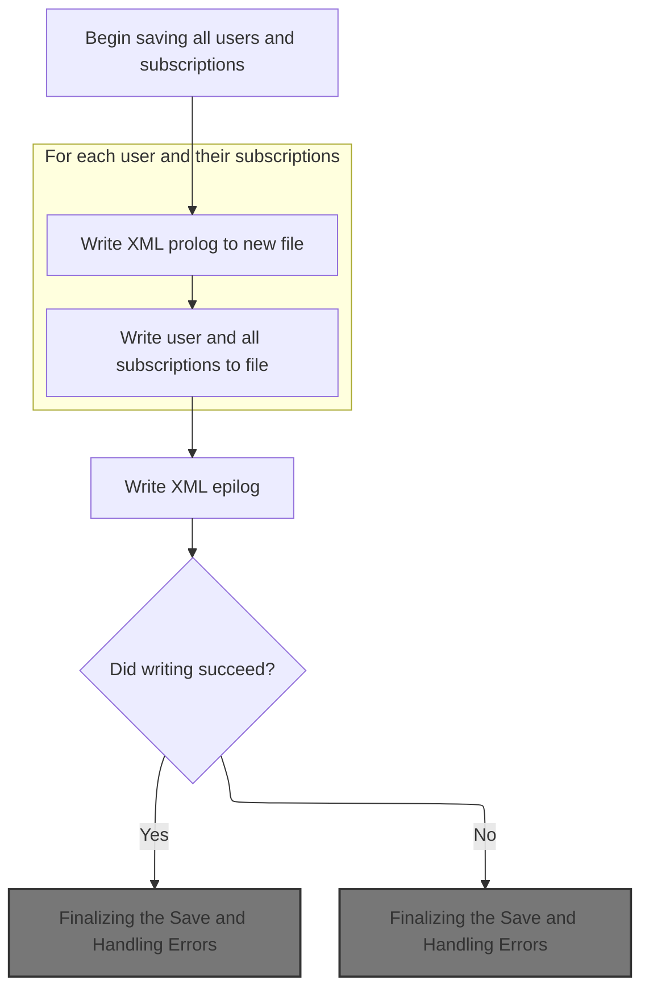
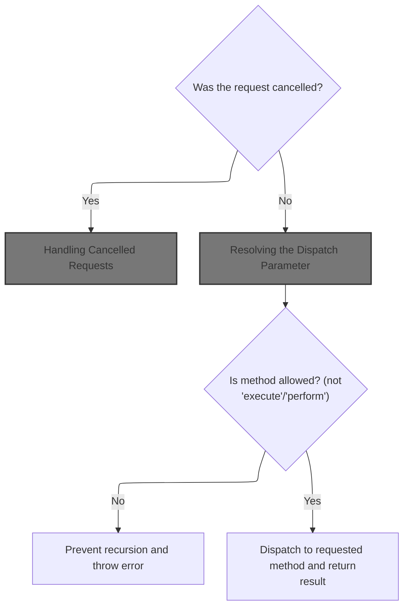
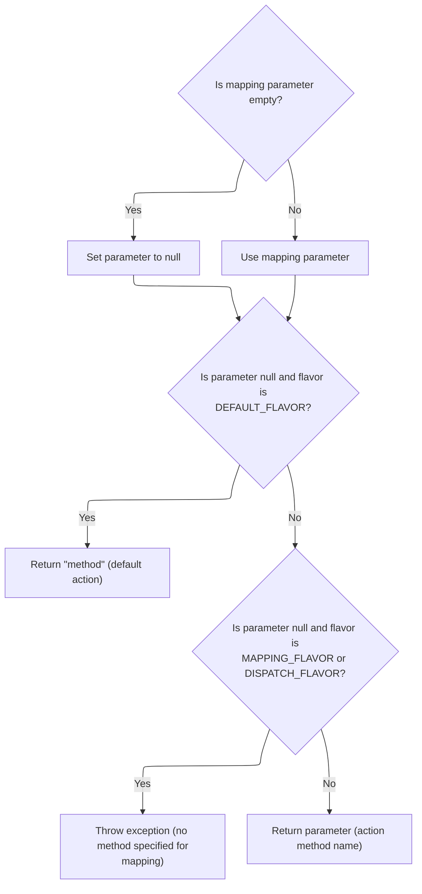
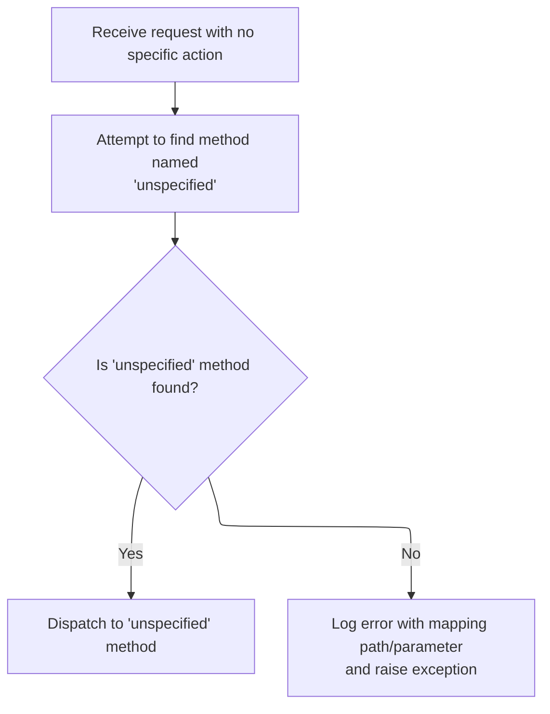
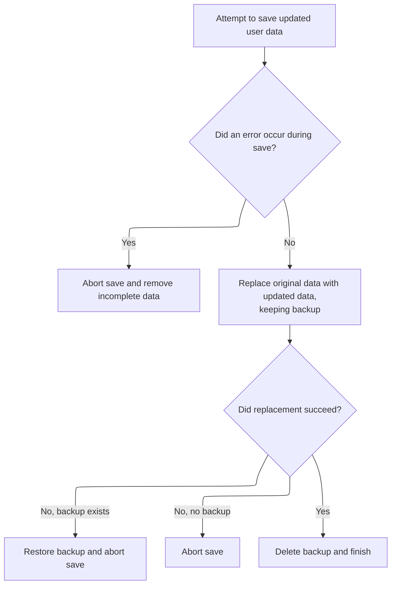

This document describes how the user database, including all users and their subscriptions, is saved to persistent storage as an XML file. The flow ensures that all changes to user data are reliably written and that the database remains consistent.

# Where is this flow used?

This flow is used multiple times in the codebase as represented in the following diagram:

(Note - these are only some of the entry points of this flow)

```mermaid
graph TD;
      dde35d78060f1afca84b5e9dedc002fc37669b07142e9d5a1f656107cc900aa0(core/…/action/ActionServlet.java::ActionServlet.doGet) --> 294cd284fa406b4fe4f160157c73b79eaa7835613a545efd883ce1f14dd1ca7e(core/…/action/ActionServlet.java::ActionServlet.process)

294cd284fa406b4fe4f160157c73b79eaa7835613a545efd883ce1f14dd1ca7e(core/…/action/ActionServlet.java::ActionServlet.process) --> 8021481ad2e61cbffbd4896e05edd9e89db84071d125277e9a801c0e7ae658c3(core/…/action/ActionServlet.java::ActionServlet.getRequestProcessor)

8021481ad2e61cbffbd4896e05edd9e89db84071d125277e9a801c0e7ae658c3(core/…/action/ActionServlet.java::ActionServlet.getRequestProcessor) --> b2f59f4493e68c30a2337ffecc4fad8d1689fba0a6112201541d9b6d2026e962(core/…/action/ActionServlet.java::ActionServlet.init)

b2f59f4493e68c30a2337ffecc4fad8d1689fba0a6112201541d9b6d2026e962(core/…/action/ActionServlet.java::ActionServlet.init) --> 2c8cfecda12ad35498f942d194e0d79f8600eded97c6acdc28b3d0510ec31f6b(core/…/action/ActionServlet.java::ActionServlet.initServlet)

b2f59f4493e68c30a2337ffecc4fad8d1689fba0a6112201541d9b6d2026e962(core/…/action/ActionServlet.java::ActionServlet.init) --> 65beff19e283dcc9f10a2d5b921efb59af07ff7f298d2ae532cae422039f99ba(core/…/action/ActionServlet.java::ActionServlet.initModulePlugIns)

b2f59f4493e68c30a2337ffecc4fad8d1689fba0a6112201541d9b6d2026e962(core/…/action/ActionServlet.java::ActionServlet.init) --> 3af3889eef203230d9271829c5b04c8d29c0768eb8f3f5b9695f3d0028fa4502(core/…/action/ActionServlet.java::ActionServlet.initChain)

b2f59f4493e68c30a2337ffecc4fad8d1689fba0a6112201541d9b6d2026e962(core/…/action/ActionServlet.java::ActionServlet.init) --> 610c8fe78f105cb8870b4b4b1b0c0f72d6b826e448837c139021e120632eb987(core/…/action/ActionServlet.java::ActionServlet.initModuleConfig)

2c8cfecda12ad35498f942d194e0d79f8600eded97c6acdc28b3d0510ec31f6b(core/…/action/ActionServlet.java::ActionServlet.initServlet) --> 4cdf8eb85fe3072b6df6cb29f60955d02a212410aec62cbb410cec93d06ed621(apps/…/memory/MemoryUserDatabase.java::MemoryUserDatabase.close)

2c8cfecda12ad35498f942d194e0d79f8600eded97c6acdc28b3d0510ec31f6b(core/…/action/ActionServlet.java::ActionServlet.initServlet) --> 52fa799f1bfb2861cd38c39c49af294fcfa8b0cbc4019565c4f5711b129f9361(tiles/…/xmlDefinition/XmlParser.java::XmlParser.parse)

4cdf8eb85fe3072b6df6cb29f60955d02a212410aec62cbb410cec93d06ed621(apps/…/memory/MemoryUserDatabase.java::MemoryUserDatabase.close) --> a2be4500d8d135e330f365f3f420f8a43d71b2a1cc1167178cb71ce5fe69cf31(apps/…/memory/MemoryUserDatabase.java::MemoryUserDatabase.save)

52fa799f1bfb2861cd38c39c49af294fcfa8b0cbc4019565c4f5711b129f9361(tiles/…/xmlDefinition/XmlParser.java::XmlParser.parse) --> 4cdf8eb85fe3072b6df6cb29f60955d02a212410aec62cbb410cec93d06ed621(apps/…/memory/MemoryUserDatabase.java::MemoryUserDatabase.close)

52fa799f1bfb2861cd38c39c49af294fcfa8b0cbc4019565c4f5711b129f9361(tiles/…/xmlDefinition/XmlParser.java::XmlParser.parse) --> 52fa799f1bfb2861cd38c39c49af294fcfa8b0cbc4019565c4f5711b129f9361(tiles/…/xmlDefinition/XmlParser.java::XmlParser.parse)

65beff19e283dcc9f10a2d5b921efb59af07ff7f298d2ae532cae422039f99ba(core/…/action/ActionServlet.java::ActionServlet.initModulePlugIns) --> b2f59f4493e68c30a2337ffecc4fad8d1689fba0a6112201541d9b6d2026e962(core/…/action/ActionServlet.java::ActionServlet.init)

3af3889eef203230d9271829c5b04c8d29c0768eb8f3f5b9695f3d0028fa4502(core/…/action/ActionServlet.java::ActionServlet.initChain) --> 52fa799f1bfb2861cd38c39c49af294fcfa8b0cbc4019565c4f5711b129f9361(tiles/…/xmlDefinition/XmlParser.java::XmlParser.parse)

610c8fe78f105cb8870b4b4b1b0c0f72d6b826e448837c139021e120632eb987(core/…/action/ActionServlet.java::ActionServlet.initModuleConfig) --> 150db3976b8039626b99b49a0033ea4fdc7f345e420acaa0123644cf6131b79b(core/…/action/ActionServlet.java::ActionServlet.parseModuleConfigFile)

150db3976b8039626b99b49a0033ea4fdc7f345e420acaa0123644cf6131b79b(core/…/action/ActionServlet.java::ActionServlet.parseModuleConfigFile) --> 52fa799f1bfb2861cd38c39c49af294fcfa8b0cbc4019565c4f5711b129f9361(tiles/…/xmlDefinition/XmlParser.java::XmlParser.parse)

ec52fb7c28a6afaae4fd5937965ca776c6c12441d8a10e0b92b387b05c5c5cf5(core/…/action/ActionServlet.java::ActionServlet.doPost) --> 294cd284fa406b4fe4f160157c73b79eaa7835613a545efd883ce1f14dd1ca7e(core/…/action/ActionServlet.java::ActionServlet.process)

f42b5fa1bea56d8ff671c6affb9d85867c0cd9c866b2e87d4e79e1160c4ffca1(tiles/…/tiles/RedeployableActionServlet.java::RedeployableActionServlet.getRequestProcessor) --> 8021481ad2e61cbffbd4896e05edd9e89db84071d125277e9a801c0e7ae658c3(core/…/action/ActionServlet.java::ActionServlet.getRequestProcessor)

dddf0d96694fd2e68165f2dd8b7e18080f18dd95805f51cb8f454b28c8cb9f2e(tiles/…/tiles/RedeployableActionServlet.java::RedeployableActionServlet.getRequestProcessor) --> 8021481ad2e61cbffbd4896e05edd9e89db84071d125277e9a801c0e7ae658c3(core/…/action/ActionServlet.java::ActionServlet.getRequestProcessor)

124b12269f22ea1c1cc40a515eb4f3057c2d0670c8f4c40566880bc930bb8f93(tiles/…/xmlDefinition/I18nFactorySet.java::I18nFactorySet.initFactory) --> c4bf75c9f95bd4da5e48b350e1cf60ec10a6a8b217b7f202a083ec0f6ab346fe(tiles/…/xmlDefinition/I18nFactorySet.java::I18nFactorySet.createDefaultFactory)

c4bf75c9f95bd4da5e48b350e1cf60ec10a6a8b217b7f202a083ec0f6ab346fe(tiles/…/xmlDefinition/I18nFactorySet.java::I18nFactorySet.createDefaultFactory) --> 357727d10060d5ca6793ed7552e1269b5d3c0a3fadd33a24371ca05b2f957eaa(tiles/…/xmlDefinition/I18nFactorySet.java::I18nFactorySet.parseXmlFiles)

357727d10060d5ca6793ed7552e1269b5d3c0a3fadd33a24371ca05b2f957eaa(tiles/…/xmlDefinition/I18nFactorySet.java::I18nFactorySet.parseXmlFiles) --> 5ebe85f460b23e354a34650d70452bd8886b2829641339c7c902a173b09b2195(tiles/…/xmlDefinition/I18nFactorySet.java::I18nFactorySet.parseXmlFile)

5ebe85f460b23e354a34650d70452bd8886b2829641339c7c902a173b09b2195(tiles/…/xmlDefinition/I18nFactorySet.java::I18nFactorySet.parseXmlFile) --> 52fa799f1bfb2861cd38c39c49af294fcfa8b0cbc4019565c4f5711b129f9361(tiles/…/xmlDefinition/XmlParser.java::XmlParser.parse)


classDef mainFlowStyle color:#000000,fill:#7CB9F4
classDef rootsStyle color:#000000,fill:#00FFF4
classDef Style1 color:#000000,fill:#00FFAA
classDef Style2 color:#000000,fill:#FFFF00
classDef Style3 color:#000000,fill:#AA7CB9

%% Swimm:
%% graph TD;
%%       dde35d78060f1afca84b5e9dedc002fc37669b07142e9d5a1f656107cc900aa0(<SwmPath>[core/…/action/ActionServlet.java](core/src/main/java/org/apache/struts/action/ActionServlet.java)</SwmPath>::ActionServlet.doGet) --> 294cd284fa406b4fe4f160157c73b79eaa7835613a545efd883ce1f14dd1ca7e(<SwmPath>[core/…/action/ActionServlet.java](core/src/main/java/org/apache/struts/action/ActionServlet.java)</SwmPath>::ActionServlet.process)
%% 
%% 294cd284fa406b4fe4f160157c73b79eaa7835613a545efd883ce1f14dd1ca7e(<SwmPath>[core/…/action/ActionServlet.java](core/src/main/java/org/apache/struts/action/ActionServlet.java)</SwmPath>::ActionServlet.process) --> 8021481ad2e61cbffbd4896e05edd9e89db84071d125277e9a801c0e7ae658c3(<SwmPath>[core/…/action/ActionServlet.java](core/src/main/java/org/apache/struts/action/ActionServlet.java)</SwmPath>::ActionServlet.getRequestProcessor)
%% 
%% 8021481ad2e61cbffbd4896e05edd9e89db84071d125277e9a801c0e7ae658c3(<SwmPath>[core/…/action/ActionServlet.java](core/src/main/java/org/apache/struts/action/ActionServlet.java)</SwmPath>::ActionServlet.getRequestProcessor) --> b2f59f4493e68c30a2337ffecc4fad8d1689fba0a6112201541d9b6d2026e962(<SwmPath>[core/…/action/ActionServlet.java](core/src/main/java/org/apache/struts/action/ActionServlet.java)</SwmPath>::ActionServlet.init)
%% 
%% b2f59f4493e68c30a2337ffecc4fad8d1689fba0a6112201541d9b6d2026e962(<SwmPath>[core/…/action/ActionServlet.java](core/src/main/java/org/apache/struts/action/ActionServlet.java)</SwmPath>::ActionServlet.init) --> 2c8cfecda12ad35498f942d194e0d79f8600eded97c6acdc28b3d0510ec31f6b(<SwmPath>[core/…/action/ActionServlet.java](core/src/main/java/org/apache/struts/action/ActionServlet.java)</SwmPath>::ActionServlet.initServlet)
%% 
%% b2f59f4493e68c30a2337ffecc4fad8d1689fba0a6112201541d9b6d2026e962(<SwmPath>[core/…/action/ActionServlet.java](core/src/main/java/org/apache/struts/action/ActionServlet.java)</SwmPath>::ActionServlet.init) --> 65beff19e283dcc9f10a2d5b921efb59af07ff7f298d2ae532cae422039f99ba(<SwmPath>[core/…/action/ActionServlet.java](core/src/main/java/org/apache/struts/action/ActionServlet.java)</SwmPath>::ActionServlet.initModulePlugIns)
%% 
%% b2f59f4493e68c30a2337ffecc4fad8d1689fba0a6112201541d9b6d2026e962(<SwmPath>[core/…/action/ActionServlet.java](core/src/main/java/org/apache/struts/action/ActionServlet.java)</SwmPath>::ActionServlet.init) --> 3af3889eef203230d9271829c5b04c8d29c0768eb8f3f5b9695f3d0028fa4502(<SwmPath>[core/…/action/ActionServlet.java](core/src/main/java/org/apache/struts/action/ActionServlet.java)</SwmPath>::ActionServlet.initChain)
%% 
%% b2f59f4493e68c30a2337ffecc4fad8d1689fba0a6112201541d9b6d2026e962(<SwmPath>[core/…/action/ActionServlet.java](core/src/main/java/org/apache/struts/action/ActionServlet.java)</SwmPath>::ActionServlet.init) --> 610c8fe78f105cb8870b4b4b1b0c0f72d6b826e448837c139021e120632eb987(<SwmPath>[core/…/action/ActionServlet.java](core/src/main/java/org/apache/struts/action/ActionServlet.java)</SwmPath>::ActionServlet.initModuleConfig)
%% 
%% 2c8cfecda12ad35498f942d194e0d79f8600eded97c6acdc28b3d0510ec31f6b(<SwmPath>[core/…/action/ActionServlet.java](core/src/main/java/org/apache/struts/action/ActionServlet.java)</SwmPath>::ActionServlet.initServlet) --> 4cdf8eb85fe3072b6df6cb29f60955d02a212410aec62cbb410cec93d06ed621(<SwmPath>[apps/…/memory/MemoryUserDatabase.java](apps/faces-example1/src/main/java/org/apache/struts/webapp/example/memory/MemoryUserDatabase.java)</SwmPath>::MemoryUserDatabase.close)
%% 
%% 2c8cfecda12ad35498f942d194e0d79f8600eded97c6acdc28b3d0510ec31f6b(<SwmPath>[core/…/action/ActionServlet.java](core/src/main/java/org/apache/struts/action/ActionServlet.java)</SwmPath>::ActionServlet.initServlet) --> 52fa799f1bfb2861cd38c39c49af294fcfa8b0cbc4019565c4f5711b129f9361(<SwmPath>[tiles/…/xmlDefinition/XmlParser.java](tiles/src/main/java/org/apache/struts/tiles/xmlDefinition/XmlParser.java)</SwmPath>::XmlParser.parse)
%% 
%% 4cdf8eb85fe3072b6df6cb29f60955d02a212410aec62cbb410cec93d06ed621(<SwmPath>[apps/…/memory/MemoryUserDatabase.java](apps/faces-example1/src/main/java/org/apache/struts/webapp/example/memory/MemoryUserDatabase.java)</SwmPath>::MemoryUserDatabase.close) --> a2be4500d8d135e330f365f3f420f8a43d71b2a1cc1167178cb71ce5fe69cf31(<SwmPath>[apps/…/memory/MemoryUserDatabase.java](apps/faces-example1/src/main/java/org/apache/struts/webapp/example/memory/MemoryUserDatabase.java)</SwmPath>::MemoryUserDatabase.save)
%% 
%% 52fa799f1bfb2861cd38c39c49af294fcfa8b0cbc4019565c4f5711b129f9361(<SwmPath>[tiles/…/xmlDefinition/XmlParser.java](tiles/src/main/java/org/apache/struts/tiles/xmlDefinition/XmlParser.java)</SwmPath>::XmlParser.parse) --> 4cdf8eb85fe3072b6df6cb29f60955d02a212410aec62cbb410cec93d06ed621(<SwmPath>[apps/…/memory/MemoryUserDatabase.java](apps/faces-example1/src/main/java/org/apache/struts/webapp/example/memory/MemoryUserDatabase.java)</SwmPath>::MemoryUserDatabase.close)
%% 
%% 52fa799f1bfb2861cd38c39c49af294fcfa8b0cbc4019565c4f5711b129f9361(<SwmPath>[tiles/…/xmlDefinition/XmlParser.java](tiles/src/main/java/org/apache/struts/tiles/xmlDefinition/XmlParser.java)</SwmPath>::XmlParser.parse) --> 52fa799f1bfb2861cd38c39c49af294fcfa8b0cbc4019565c4f5711b129f9361(<SwmPath>[tiles/…/xmlDefinition/XmlParser.java](tiles/src/main/java/org/apache/struts/tiles/xmlDefinition/XmlParser.java)</SwmPath>::XmlParser.parse)
%% 
%% 65beff19e283dcc9f10a2d5b921efb59af07ff7f298d2ae532cae422039f99ba(<SwmPath>[core/…/action/ActionServlet.java](core/src/main/java/org/apache/struts/action/ActionServlet.java)</SwmPath>::ActionServlet.initModulePlugIns) --> b2f59f4493e68c30a2337ffecc4fad8d1689fba0a6112201541d9b6d2026e962(<SwmPath>[core/…/action/ActionServlet.java](core/src/main/java/org/apache/struts/action/ActionServlet.java)</SwmPath>::ActionServlet.init)
%% 
%% 3af3889eef203230d9271829c5b04c8d29c0768eb8f3f5b9695f3d0028fa4502(<SwmPath>[core/…/action/ActionServlet.java](core/src/main/java/org/apache/struts/action/ActionServlet.java)</SwmPath>::ActionServlet.initChain) --> 52fa799f1bfb2861cd38c39c49af294fcfa8b0cbc4019565c4f5711b129f9361(<SwmPath>[tiles/…/xmlDefinition/XmlParser.java](tiles/src/main/java/org/apache/struts/tiles/xmlDefinition/XmlParser.java)</SwmPath>::XmlParser.parse)
%% 
%% 610c8fe78f105cb8870b4b4b1b0c0f72d6b826e448837c139021e120632eb987(<SwmPath>[core/…/action/ActionServlet.java](core/src/main/java/org/apache/struts/action/ActionServlet.java)</SwmPath>::ActionServlet.initModuleConfig) --> 150db3976b8039626b99b49a0033ea4fdc7f345e420acaa0123644cf6131b79b(<SwmPath>[core/…/action/ActionServlet.java](core/src/main/java/org/apache/struts/action/ActionServlet.java)</SwmPath>::ActionServlet.parseModuleConfigFile)
%% 
%% 150db3976b8039626b99b49a0033ea4fdc7f345e420acaa0123644cf6131b79b(<SwmPath>[core/…/action/ActionServlet.java](core/src/main/java/org/apache/struts/action/ActionServlet.java)</SwmPath>::ActionServlet.parseModuleConfigFile) --> 52fa799f1bfb2861cd38c39c49af294fcfa8b0cbc4019565c4f5711b129f9361(<SwmPath>[tiles/…/xmlDefinition/XmlParser.java](tiles/src/main/java/org/apache/struts/tiles/xmlDefinition/XmlParser.java)</SwmPath>::XmlParser.parse)
%% 
%% ec52fb7c28a6afaae4fd5937965ca776c6c12441d8a10e0b92b387b05c5c5cf5(<SwmPath>[core/…/action/ActionServlet.java](core/src/main/java/org/apache/struts/action/ActionServlet.java)</SwmPath>::ActionServlet.doPost) --> 294cd284fa406b4fe4f160157c73b79eaa7835613a545efd883ce1f14dd1ca7e(<SwmPath>[core/…/action/ActionServlet.java](core/src/main/java/org/apache/struts/action/ActionServlet.java)</SwmPath>::ActionServlet.process)
%% 
%% f42b5fa1bea56d8ff671c6affb9d85867c0cd9c866b2e87d4e79e1160c4ffca1(<SwmPath>[tiles/…/tiles/RedeployableActionServlet.java](tiles/src/main/java/org/apache/struts/tiles/RedeployableActionServlet.java)</SwmPath>::RedeployableActionServlet.getRequestProcessor) --> 8021481ad2e61cbffbd4896e05edd9e89db84071d125277e9a801c0e7ae658c3(<SwmPath>[core/…/action/ActionServlet.java](core/src/main/java/org/apache/struts/action/ActionServlet.java)</SwmPath>::ActionServlet.getRequestProcessor)
%% 
%% dddf0d96694fd2e68165f2dd8b7e18080f18dd95805f51cb8f454b28c8cb9f2e(<SwmPath>[tiles/…/tiles/RedeployableActionServlet.java](tiles/src/main/java/org/apache/struts/tiles/RedeployableActionServlet.java)</SwmPath>::RedeployableActionServlet.getRequestProcessor) --> 8021481ad2e61cbffbd4896e05edd9e89db84071d125277e9a801c0e7ae658c3(<SwmPath>[core/…/action/ActionServlet.java](core/src/main/java/org/apache/struts/action/ActionServlet.java)</SwmPath>::ActionServlet.getRequestProcessor)
%% 
%% 124b12269f22ea1c1cc40a515eb4f3057c2d0670c8f4c40566880bc930bb8f93(<SwmPath>[tiles/…/xmlDefinition/I18nFactorySet.java](tiles/src/main/java/org/apache/struts/tiles/xmlDefinition/I18nFactorySet.java)</SwmPath>::I18nFactorySet.initFactory) --> c4bf75c9f95bd4da5e48b350e1cf60ec10a6a8b217b7f202a083ec0f6ab346fe(<SwmPath>[tiles/…/xmlDefinition/I18nFactorySet.java](tiles/src/main/java/org/apache/struts/tiles/xmlDefinition/I18nFactorySet.java)</SwmPath>::I18nFactorySet.createDefaultFactory)
%% 
%% c4bf75c9f95bd4da5e48b350e1cf60ec10a6a8b217b7f202a083ec0f6ab346fe(<SwmPath>[tiles/…/xmlDefinition/I18nFactorySet.java](tiles/src/main/java/org/apache/struts/tiles/xmlDefinition/I18nFactorySet.java)</SwmPath>::I18nFactorySet.createDefaultFactory) --> 357727d10060d5ca6793ed7552e1269b5d3c0a3fadd33a24371ca05b2f957eaa(<SwmPath>[tiles/…/xmlDefinition/I18nFactorySet.java](tiles/src/main/java/org/apache/struts/tiles/xmlDefinition/I18nFactorySet.java)</SwmPath>::I18nFactorySet.parseXmlFiles)
%% 
%% 357727d10060d5ca6793ed7552e1269b5d3c0a3fadd33a24371ca05b2f957eaa(<SwmPath>[tiles/…/xmlDefinition/I18nFactorySet.java](tiles/src/main/java/org/apache/struts/tiles/xmlDefinition/I18nFactorySet.java)</SwmPath>::I18nFactorySet.parseXmlFiles) --> 5ebe85f460b23e354a34650d70452bd8886b2829641339c7c902a173b09b2195(<SwmPath>[tiles/…/xmlDefinition/I18nFactorySet.java](tiles/src/main/java/org/apache/struts/tiles/xmlDefinition/I18nFactorySet.java)</SwmPath>::I18nFactorySet.parseXmlFile)
%% 
%% 5ebe85f460b23e354a34650d70452bd8886b2829641339c7c902a173b09b2195(<SwmPath>[tiles/…/xmlDefinition/I18nFactorySet.java](tiles/src/main/java/org/apache/struts/tiles/xmlDefinition/I18nFactorySet.java)</SwmPath>::I18nFactorySet.parseXmlFile) --> 52fa799f1bfb2861cd38c39c49af294fcfa8b0cbc4019565c4f5711b129f9361(<SwmPath>[tiles/…/xmlDefinition/XmlParser.java](tiles/src/main/java/org/apache/struts/tiles/xmlDefinition/XmlParser.java)</SwmPath>::XmlParser.parse)
%% 
%% 
%% classDef mainFlowStyle color:#000000,fill:#7CB9F4
%% classDef rootsStyle color:#000000,fill:#00FFF4
%% classDef Style1 color:#000000,fill:#00FFAA
%% classDef Style2 color:#000000,fill:#FFFF00
%% classDef Style3 color:#000000,fill:#AA7CB9
```

# Saving the User Database to XML



<SwmSnippet path="/apps/faces-example1/src/main/java/org/apache/struts/webapp/example/memory/MemoryUserDatabase.java" line="257">

---

In <SwmToken path="apps/faces-example1/src/main/java/org/apache/struts/webapp/example/memory/MemoryUserDatabase.java" pos="257:5:5" line-data="    public void save() throws Exception {">`save`</SwmToken>, we start by opening a <SwmToken path="apps/faces-example1/src/main/java/org/apache/struts/webapp/example/memory/MemoryUserDatabase.java" pos="263:1:1" line-data="        PrintWriter writer = null;">`PrintWriter`</SwmToken> to a temp file, writing the XML prolog, database root, and looping through all users and their subscriptions to serialize them as XML. This sets up the data for the actual save operation.

```java
    public void save() throws Exception {

        if (log.isDebugEnabled()) {
            log.debug("Saving database to '" + pathname + "'");
        }
        File fileNew = new File(pathnameNew);
        PrintWriter writer = null;

        try {

            // Configure our PrintWriter
            FileOutputStream fos = new FileOutputStream(fileNew);
            OutputStreamWriter osw = new OutputStreamWriter(fos);
            writer = new PrintWriter(osw);

            // Print the file prolog
            writer.println("<?xml version='1.0'?>");
            writer.println("<database>");

            // Print entries for each defined user and associated subscriptions
            User users[] = findUsers();
            for (int i = 0; i < users.length; i++) {
                writer.print("  ");
                writer.println(users[i]);
                Subscription subscriptions[] =
                    users[i].getSubscriptions();
                for (int j = 0; j < subscriptions.length; j++) {
                    writer.print("    ");
                    writer.println(subscriptions[j]);
                    writer.print("    ");
                    writer.println("</subscription>");
                }
                writer.print("  ");
                writer.println("</user>");
            }
```

---

</SwmSnippet>

<SwmSnippet path="/apps/faces-example1/src/main/java/org/apache/struts/webapp/example/memory/MemoryUserDatabase.java" line="293">

---

Next, after writing the closing XML tag, we call <SwmToken path="apps/faces-example1/src/main/java/org/apache/struts/webapp/example/memory/MemoryUserDatabase.java" pos="297:4:8" line-data="            if (writer.checkError()) {">`writer.checkError()`</SwmToken> to catch any silent write failures that didn't throw exceptions. This is necessary because <SwmToken path="apps/faces-example1/src/main/java/org/apache/struts/webapp/example/memory/MemoryUserDatabase.java" pos="263:1:1" line-data="        PrintWriter writer = null;">`PrintWriter`</SwmToken> can suppress IOExceptions.

```java
            // Print the file epilog
            writer.println("</database>");

            // Check for errors that occurred while printing
            if (writer.checkError()) {
```

---

</SwmSnippet>

<SwmSnippet path="/core/src/main/java/org/apache/struts/util/ServletContextWriter.java" line="77">

---

<SwmToken path="core/src/main/java/org/apache/struts/util/ServletContextWriter.java" pos="77:5:5" line-data="    public boolean checkError() {">`checkError`</SwmToken> in <SwmToken path="core/src/main/java/org/apache/struts/util/ServletContextWriter.java" pos="38:4:4" line-data="public class ServletContextWriter extends PrintWriter {">`ServletContextWriter`</SwmToken> flushes the stream before checking the error flag, making sure any pending write errors are caught right before returning the status.

```java
    public boolean checkError() {
        flush();

        return (error);
    }
```

---

</SwmSnippet>

<SwmSnippet path="/apps/faces-example1/src/main/java/org/apache/struts/webapp/example/memory/MemoryUserDatabase.java" line="298">

---

Back in MemoryUserDatabase.save, after checking for write errors, we close the writer to release resources and ensure the file is finalized before any further action.

```java
                writer.close();
```

---

</SwmSnippet>

<SwmSnippet path="/apps/faces-example1/src/main/java/org/apache/struts/webapp/example/memory/MemoryUserDatabase.java" line="106">

---

<SwmToken path="apps/faces-example1/src/main/java/org/apache/struts/webapp/example/memory/MemoryUserDatabase.java" pos="106:5:5" line-data="    public void close() throws Exception {">`close`</SwmToken> calls <SwmToken path="apps/faces-example1/src/main/java/org/apache/struts/webapp/example/memory/MemoryUserDatabase.java" pos="108:1:1" line-data="        save();">`save`</SwmToken> to persist any <SwmToken path="apps/faces-example1/src/main/java/org/apache/struts/webapp/example/memory/MemoryUserDatabase.java" pos="45:23:25" line-data=" * &lt;p&gt;Concrete implementation of {@link UserDatabase} for an in-memory">`in-memory`</SwmToken> changes before the database is considered closed. This ensures no updates are lost.

```java
    public void close() throws Exception {

        save();

    }
```

---

</SwmSnippet>

<SwmSnippet path="/apps/faces-example1/src/main/java/org/apache/struts/webapp/example/memory/MemoryUserDatabase.java" line="299">

---

Back in MemoryUserDatabase.save, if <SwmToken path="apps/faces-example1/src/main/java/org/apache/struts/webapp/example/memory/MemoryUserDatabase.java" pos="297:6:6" line-data="            if (writer.checkError()) {">`checkError`</SwmToken> flagged a problem, we clean up by deleting the temp file and throwing an exception. Next, control returns to the caller, which is typically <SwmToken path="apps/faces-example1/src/main/java/org/apache/struts/webapp/example/RegistrationBacking.java" pos="36:4:4" line-data="public class RegistrationBacking extends AbstractBacking {">`RegistrationBacking`</SwmToken> or another component managing persistence.

```java
                fileNew.delete();
                throw new IOException
                    ("Saving database to '" + pathname + "'");
            }
```

---

</SwmSnippet>

## Preparing a Delete Request for a Subscription

<SwmSnippet path="/apps/faces-example1/src/main/java/org/apache/struts/webapp/example/RegistrationBacking.java" line="101">

---

In <SwmToken path="apps/faces-example1/src/main/java/org/apache/struts/webapp/example/RegistrationBacking.java" pos="101:5:5" line-data="    public String delete() {">`delete`</SwmToken>, we prep for a subscription deletion by building a URL with the action and <SwmToken path="apps/faces-example1/src/main/java/org/apache/struts/webapp/example/memory/MemoryUserDatabase.java" pos="197:5:7" line-data="                (&quot;database/user/subscription&quot;,">`user/subscription`</SwmToken> details, then forward the request. The actual delete logic happens elsewhere. The next step is to get the base URL from the <SwmToken path="apps/faces-example1/src/main/java/org/apache/struts/webapp/example/RegistrationBacking.java" pos="107:7:7" line-data="        StringBuffer url = subscription(context);">`subscription`</SwmToken> method.

```java
    public String delete() {

        if (log.isDebugEnabled()) {
            log.debug("delete()");
        }
        FacesContext context = FacesContext.getCurrentInstance();
        StringBuffer url = subscription(context);
```

---

</SwmSnippet>

### Building the Subscription Action URL

<SwmSnippet path="/apps/faces-example1/src/main/java/org/apache/struts/webapp/example/AbstractBacking.java" line="124">

---

<SwmToken path="apps/faces-example1/src/main/java/org/apache/struts/webapp/example/AbstractBacking.java" pos="124:5:5" line-data="    protected StringBuffer subscription(FacesContext context) {">`subscription`</SwmToken> just calls <SwmToken path="apps/faces-example1/src/main/java/org/apache/struts/webapp/example/AbstractBacking.java" pos="126:4:4" line-data="        return (action(context, &quot;/editSubscription&quot;));">`action`</SwmToken> with the <SwmToken path="apps/faces-example1/src/main/java/org/apache/struts/webapp/example/AbstractBacking.java" pos="126:10:11" line-data="        return (action(context, &quot;/editSubscription&quot;));">`/editSubscription`</SwmToken> path, returning a <SwmToken path="apps/faces-example1/src/main/java/org/apache/struts/webapp/example/AbstractBacking.java" pos="124:3:3" line-data="    protected StringBuffer subscription(FacesContext context) {">`StringBuffer`</SwmToken> for further URL construction. The next step is to build the actual action URL.

```java
    protected StringBuffer subscription(FacesContext context) {

        return (action(context, "/editSubscription"));

    }
```

---

</SwmSnippet>

<SwmSnippet path="/apps/faces-example1/src/main/java/org/apache/struts/webapp/example/AbstractBacking.java" line="47">

---

<SwmToken path="apps/faces-example1/src/main/java/org/apache/struts/webapp/example/AbstractBacking.java" pos="47:5:5" line-data="    protected StringBuffer action(FacesContext context, String action) {">`action`</SwmToken> appends '.do' to the given action path, following Struts' URL mapping convention. The result is a <SwmToken path="apps/faces-example1/src/main/java/org/apache/struts/webapp/example/AbstractBacking.java" pos="47:3:3" line-data="    protected StringBuffer action(FacesContext context, String action) {">`StringBuffer`</SwmToken> used for building the full request URL.

```java
    protected StringBuffer action(FacesContext context, String action) {

        // FIXME - assumes extension mapping for Struts
        StringBuffer sb = new StringBuffer(action);
        sb.append(".do");
        return (sb);

    }
```

---

</SwmSnippet>

### Completing and Forwarding the Delete Request

<SwmSnippet path="/apps/faces-example1/src/main/java/org/apache/struts/webapp/example/RegistrationBacking.java" line="108">

---

Back in RegistrationBacking.delete, after building the full URL with user and subscription info, we forward the request for actual processing. Returning null tells the framework we're done. Next, the forward method in <SwmToken path="apps/faces-example1/src/main/java/org/apache/struts/webapp/example/RegistrationBacking.java" pos="36:8:8" line-data="public class RegistrationBacking extends AbstractBacking {">`AbstractBacking`</SwmToken> handles the dispatch.

```java
        url.append("?action=Delete");
        url.append("&username=");
        User user = (User)
            context.getExternalContext().getSessionMap().get("user");
        url.append(user.getUsername());
        url.append("&host=");
        Subscription subscription = (Subscription)
            context.getExternalContext().getRequestMap().get("subscription");
        url.append(subscription.getHost());
        forward(context, url.toString());
        return (null);

    }
```

---

</SwmSnippet>

## Forwarding the Request to the Dispatcher

<SwmSnippet path="/apps/faces-example1/src/main/java/org/apache/struts/webapp/example/AbstractBacking.java" line="66">

---

<SwmToken path="apps/faces-example1/src/main/java/org/apache/struts/webapp/example/AbstractBacking.java" pos="66:5:5" line-data="    protected void forward(FacesContext context, String url) {">`forward`</SwmToken> sends the HTTP request to the specified URL using the <SwmToken path="apps/faces-example1/src/main/java/org/apache/struts/webapp/example/AbstractBacking.java" pos="66:7:7" line-data="    protected void forward(FacesContext context, String url) {">`FacesContext`</SwmToken>, then marks the response as complete. The next step is handled by the <SwmToken path="extras/src/main/java/org/apache/struts/actions/ActionDispatcher.java" pos="56:5:5" line-data=" *       protected ActionDispatcher dispatcher">`ActionDispatcher`</SwmToken>.

```java
    protected void forward(FacesContext context, String url) {

        try {
            context.getExternalContext().dispatch(url);
        } catch (IOException e) {
            throw new FacesException(e);
        } finally {
            context.responseComplete();
        }

    }
```

---

</SwmSnippet>

## Dispatching to the Action Handler

<SwmSnippet path="/extras/src/main/java/org/apache/struts/actions/ActionDispatcher.java" line="507">

---

In <SwmToken path="extras/src/main/java/org/apache/struts/actions/ActionDispatcher.java" pos="507:5:5" line-data="    public Object dispatch(ActionContext context) throws Exception {">`dispatch`</SwmToken>, we cast the context to <SwmToken path="extras/src/main/java/org/apache/struts/actions/ActionDispatcher.java" pos="508:1:1" line-data="        ServletActionContext servletContext = (ServletActionContext) context;">`ServletActionContext`</SwmToken> and call execute with the action mapping, form, and HTTP request/response. Next, we need to get the request object from <SwmToken path="extras/src/main/java/org/apache/struts/actions/ActionDispatcher.java" pos="508:1:1" line-data="        ServletActionContext servletContext = (ServletActionContext) context;">`ServletActionContext`</SwmToken>.

```java
    public Object dispatch(ActionContext context) throws Exception {
        ServletActionContext servletContext = (ServletActionContext) context;
        return execute((ActionMapping) context.getActionConfig(), context.getActionForm(),
            servletContext.getRequest(), servletContext.getResponse());
```

---

</SwmSnippet>

### Accessing the HTTP Request from the Action Context

<SwmSnippet path="/core/src/main/java/org/apache/struts/chain/contexts/ServletActionContext.java" line="94">

---

<SwmToken path="core/src/main/java/org/apache/struts/chain/contexts/ServletActionContext.java" pos="94:5:5" line-data="    public HttpServletRequest getRequest() {">`getRequest`</SwmToken> just passes through to <SwmToken path="core/src/main/java/org/apache/struts/chain/contexts/ServletActionContext.java" pos="95:3:3" line-data="        return servletWebContext().getRequest();">`servletWebContext`</SwmToken> to fetch the actual <SwmToken path="core/src/main/java/org/apache/struts/chain/contexts/ServletActionContext.java" pos="94:3:3" line-data="    public HttpServletRequest getRequest() {">`HttpServletRequest`</SwmToken>, keeping the context abstraction flexible for different environments.

```java
    public HttpServletRequest getRequest() {
        return servletWebContext().getRequest();
    }
```

---

</SwmSnippet>

<SwmSnippet path="/core/src/main/java/org/apache/struts/chain/contexts/ServletActionContext.java" line="67">

---

<SwmToken path="core/src/main/java/org/apache/struts/chain/contexts/ServletActionContext.java" pos="67:5:5" line-data="    protected ServletWebContext servletWebContext() {">`servletWebContext`</SwmToken> just grabs the base context and casts it to <SwmToken path="core/src/main/java/org/apache/struts/chain/contexts/ServletActionContext.java" pos="67:3:3" line-data="    protected ServletWebContext servletWebContext() {">`ServletWebContext`</SwmToken>. This is a direct cast, so it expects the context to always be of that type—no checks, no fallback. It's a common shortcut in Struts internals where the context type is tightly controlled.

```java
    protected ServletWebContext servletWebContext() {
        return (ServletWebContext) this.getBaseContext();
    }
```

---

</SwmSnippet>

### Passing Request and Response to the Action

<SwmSnippet path="/extras/src/main/java/org/apache/struts/actions/ActionDispatcher.java" line="509">

---

Back in ActionDispatcher.dispatch, after getting the request from <SwmToken path="extras/src/main/java/org/apache/struts/actions/ActionDispatcher.java" pos="508:1:1" line-data="        ServletActionContext servletContext = (ServletActionContext) context;">`ServletActionContext`</SwmToken>, we immediately grab the response the same way. Both are passed to execute so the action handler has direct access to the servlet request and response for processing.

```java
        return execute((ActionMapping) context.getActionConfig(), context.getActionForm(),
            servletContext.getRequest(), servletContext.getResponse());
```

---

</SwmSnippet>

<SwmSnippet path="/core/src/main/java/org/apache/struts/chain/contexts/ServletActionContext.java" line="103">

---

<SwmToken path="core/src/main/java/org/apache/struts/chain/contexts/ServletActionContext.java" pos="103:5:5" line-data="    public HttpServletResponse getResponse() {">`getResponse`</SwmToken> just calls <SwmToken path="core/src/main/java/org/apache/struts/chain/contexts/ServletActionContext.java" pos="104:3:5" line-data="        return servletWebContext().getResponse();">`servletWebContext()`</SwmToken><SwmToken path="core/src/main/java/org/apache/struts/chain/contexts/ServletActionContext.java" pos="104:6:9" line-data="        return servletWebContext().getResponse();">`.getResponse()`</SwmToken>, so it pulls the actual <SwmToken path="core/src/main/java/org/apache/struts/chain/contexts/ServletActionContext.java" pos="103:3:3" line-data="    public HttpServletResponse getResponse() {">`HttpServletResponse`</SwmToken> from the context. This keeps things modular—no direct field access, just delegation through the context abstraction.

```java
    public HttpServletResponse getResponse() {
        return servletWebContext().getResponse();
    }
```

---

</SwmSnippet>

<SwmSnippet path="/extras/src/main/java/org/apache/struts/actions/ActionDispatcher.java" line="509">

---

Back in ActionDispatcher.dispatch, after getting both request and response, we call execute with mapping, form, request, and response. This hands off everything needed for the action logic to run.

```java
        return execute((ActionMapping) context.getActionConfig(), context.getActionForm(),
            servletContext.getRequest(), servletContext.getResponse());
    }
```

---

</SwmSnippet>

## Selecting and Invoking the Action Method



<SwmSnippet path="/extras/src/main/java/org/apache/struts/actions/ActionDispatcher.java" line="197">

---

In execute, we first check if the request was cancelled. If so, we call cancelled() and return early if it gives us a forward. This short-circuits the rest of the action logic for cancelled requests.

```java
    public ActionForward execute(ActionMapping mapping, ActionForm form,
        HttpServletRequest request, HttpServletResponse response)
        throws Exception {
        // Process "cancelled"
        if (isCancelled(request)) {
            ActionForward af = cancelled(mapping, form, request, response);

            if (af != null) {
                return af;
            }
        }

```

---

</SwmSnippet>

### Handling Cancelled Requests

See <SwmLink doc-title="Handling Cancelled Actions">[Handling Cancelled Actions](/.swm/handling-cancelled-actions.lvyyzjv9.sw.md)</SwmLink>

### Determining the Action Method Name

<SwmSnippet path="/extras/src/main/java/org/apache/struts/actions/ActionDispatcher.java" line="209">

---

Back in execute, after handling cancellation, we call <SwmToken path="extras/src/main/java/org/apache/struts/actions/ActionDispatcher.java" pos="210:7:7" line-data="        String parameter = getParameter(mapping, form, request, response);">`getParameter`</SwmToken> to figure out which method name to use for dispatch. This is how the framework knows which action method to invoke for the request.

```java
        // Identify the request parameter containing the method name
        String parameter = getParameter(mapping, form, request, response);

```

---

</SwmSnippet>

### Resolving the Dispatch Parameter



<SwmSnippet path="/extras/src/main/java/org/apache/struts/actions/ActionDispatcher.java" line="435">

---

GetParameter checks the mapping parameter, normalizes empty strings to null, and then uses the 'flavor' field to decide what to do. If it's <SwmToken path="extras/src/main/java/org/apache/struts/actions/ActionDispatcher.java" pos="444:19:19" line-data="        if ((parameter == null) &amp;&amp; (flavor == DEFAULT_FLAVOR)) {">`DEFAULT_FLAVOR`</SwmToken> and missing, it returns "method". For other flavors, it logs an error and throws using a message from <SwmToken path="extras/src/main/java/org/apache/struts/actions/ActionDispatcher.java" pos="33:10:10" line-data="import org.apache.struts.util.MessageResources;">`MessageResources`</SwmToken>.

```java
    protected String getParameter(ActionMapping mapping, ActionForm form,
        HttpServletRequest request, HttpServletResponse response)
        throws Exception {
        String parameter = mapping.getParameter();

        if ("".equals(parameter)) {
            parameter = null;
        }

        if ((parameter == null) && (flavor == DEFAULT_FLAVOR)) {
            // use "method" for DEFAULT_FLAVOR if no parameter was provided
            return "method";
        }

        if ((parameter == null)
            && ((flavor == MAPPING_FLAVOR) || (flavor == DISPATCH_FLAVOR))) {
            String message =
                messages.getMessage("dispatch.handler", mapping.getPath());

            log.error(message);

            throw new ServletException(message);
        }

        return parameter;
    }
```

---

</SwmSnippet>

<SwmSnippet path="/core/src/main/java/org/apache/struts/util/MessageResources.java" line="218">

---

GetMessage grabs a formatted message string (with optional localization) for error reporting. It's used when <SwmToken path="extras/src/main/java/org/apache/struts/actions/ActionDispatcher.java" pos="210:7:7" line-data="        String parameter = getParameter(mapping, form, request, response);">`getParameter`</SwmToken> needs to log or throw an exception about missing dispatch parameters.

```java
    public String getMessage(String key, Object arg0) {
        return this.getMessage((Locale) null, key, arg0);
    }
```

---

</SwmSnippet>

### Extracting the Method Name from the Request

<SwmSnippet path="/extras/src/main/java/org/apache/struts/actions/ActionDispatcher.java" line="212">

---

Back in execute, after resolving the parameter, we call <SwmToken path="extras/src/main/java/org/apache/struts/actions/ActionDispatcher.java" pos="214:1:1" line-data="            getMethodName(mapping, form, request, response, parameter);">`getMethodName`</SwmToken> to pull the actual method name from the request or mapping. This is how the dispatcher figures out which method to invoke.

```java
        // Get the method's name. This could be overridden in subclasses.
        String name =
            getMethodName(mapping, form, request, response, parameter);

```

---

</SwmSnippet>

<SwmSnippet path="/extras/src/main/java/org/apache/struts/actions/ActionDispatcher.java" line="474">

---

GetMethodName checks the flavor—if it's <SwmToken path="extras/src/main/java/org/apache/struts/actions/ActionDispatcher.java" pos="478:8:8" line-data="        if (flavor == MAPPING_FLAVOR) {">`MAPPING_FLAVOR`</SwmToken>, it just returns the parameter. Otherwise, it fetches the method name from the request parameter, so the dispatcher can handle both static and dynamic method selection.

```java
    protected String getMethodName(ActionMapping mapping, ActionForm form,
        HttpServletRequest request, HttpServletResponse response,
        String parameter) throws Exception {
        // "Mapping" flavor, defaults to "method"
        if (flavor == MAPPING_FLAVOR) {
            return parameter;
        }

        // default behaviour
        return request.getParameter(parameter);
    }
```

---

</SwmSnippet>

<SwmSnippet path="/extras/src/main/java/org/apache/struts/actions/ActionDispatcher.java" line="216">

---

Back in execute, after getting the method name, we check if it's 'execute' or 'perform' to avoid recursion. If so, we log an error and throw, using a message from <SwmToken path="extras/src/main/java/org/apache/struts/actions/ActionDispatcher.java" pos="33:10:10" line-data="import org.apache.struts.util.MessageResources;">`MessageResources`</SwmToken>.

```java
        // Prevent recursive calls
        if ("execute".equals(name) || "perform".equals(name)) {
            String message =
                messages.getMessage("dispatch.recursive", mapping.getPath());

            log.error(message);
            throw new ServletException(message);
        }

```

---

</SwmSnippet>

<SwmSnippet path="/extras/src/main/java/org/apache/struts/actions/ActionDispatcher.java" line="225">

---

Back in execute, after all the checks and setup, we call <SwmToken path="extras/src/main/java/org/apache/struts/actions/ActionDispatcher.java" pos="226:3:3" line-data="        return dispatchMethod(mapping, form, request, response, name);">`dispatchMethod`</SwmToken> with the resolved method name. This is where the actual action logic gets run.

```java
        // Invoke the named method, and return the result
        return dispatchMethod(mapping, form, request, response, name);
    }
```

---

</SwmSnippet>

## Invoking the Target Action Method

<SwmSnippet path="/extras/src/main/java/org/apache/struts/actions/ActionDispatcher.java" line="313">

---

In <SwmToken path="extras/src/main/java/org/apache/struts/actions/ActionDispatcher.java" pos="313:5:5" line-data="    protected ActionForward dispatchMethod(ActionMapping mapping,">`dispatchMethod`</SwmToken>, we first check if the method name is null. If it is, we call unspecified to handle the case where no valid method was provided—usually as a fallback for bad or missing input.

```java
    protected ActionForward dispatchMethod(ActionMapping mapping,
        ActionForm form, HttpServletRequest request,
        HttpServletResponse response, String name)
        throws Exception {
        // Make sure we have a valid method name to call.
        // This may be null if the user hacks the query string.
        if (name == null) {
            return this.unspecified(mapping, form, request, response);
        }

```

---

</SwmSnippet>

### Handling Unspecified Actions



<SwmSnippet path="/extras/src/main/java/org/apache/struts/actions/ActionDispatcher.java" line="245">

---

In <SwmToken path="extras/src/main/java/org/apache/struts/actions/ActionDispatcher.java" pos="245:5:5" line-data="    protected ActionForward unspecified(ActionMapping mapping, ActionForm form,">`unspecified`</SwmToken>, we try to find a method called 'unspecified' using reflection. If it's there, we dispatch to it; if not, we prep to log and throw. This is the standard fallback for when no action method is specified in the request.

```java
    protected ActionForward unspecified(ActionMapping mapping, ActionForm form,
        HttpServletRequest request, HttpServletResponse response)
        throws Exception {
        // Identify if there is an "unspecified" method to be dispatched to
        String name = "unspecified";
        Method method = null;

        try {
            method = getMethod(name);
```

---

</SwmSnippet>

<SwmSnippet path="/extras/src/main/java/org/apache/struts/actions/ActionDispatcher.java" line="254">

---

After failing to find the 'unspecified' method, we grab a formatted error message from <SwmToken path="extras/src/main/java/org/apache/struts/actions/ActionDispatcher.java" pos="33:10:10" line-data="import org.apache.struts.util.MessageResources;">`MessageResources`</SwmToken> and log it. This sets up the exception that gets thrown for missing fallback handlers.

```java
        } catch (NoSuchMethodException e) {
            String message =
                messages.getMessage("dispatch.parameter", mapping.getPath(),
                    mapping.getParameter());
```

---

</SwmSnippet>

<SwmSnippet path="/extras/src/main/java/org/apache/struts/actions/ActionDispatcher.java" line="256">

---

Here we call MessageResources.getMessage to build the error string for logging and the exception. This keeps error reporting consistent and localizable across the framework.

```java
                messages.getMessage("dispatch.parameter", mapping.getPath(),
                    mapping.getParameter());

            log.error(message);

            throw new ServletException(message, e);
        }

```

---

</SwmSnippet>

<SwmSnippet path="/extras/src/main/java/org/apache/struts/actions/ActionDispatcher.java" line="264">

---

Finally, if the 'unspecified' method exists, we dispatch to it using <SwmToken path="extras/src/main/java/org/apache/struts/actions/ActionDispatcher.java" pos="264:3:3" line-data="        return dispatchMethod(mapping, form, request, response, name, method);">`dispatchMethod`</SwmToken>. If not, we've already logged and thrown, so nothing else happens. This wraps up the fallback logic for unspecified actions.

```java
        return dispatchMethod(mapping, form, request, response, name, method);
    }
```

---

</SwmSnippet>

### Resolving and Invoking the Target Method

<SwmSnippet path="/extras/src/main/java/org/apache/struts/actions/ActionDispatcher.java" line="323">

---

After returning from unspecified, <SwmToken path="extras/src/main/java/org/apache/struts/actions/ActionDispatcher.java" pos="226:3:3" line-data="        return dispatchMethod(mapping, form, request, response, name);">`dispatchMethod`</SwmToken> tries to resolve the actual method to call using <SwmToken path="extras/src/main/java/org/apache/struts/actions/ActionDispatcher.java" pos="327:5:5" line-data="            method = getMethod(name);">`getMethod`</SwmToken>. If it can't find the method, we prep for error handling.

```java
        // Identify the method object to be dispatched to
        Method method = null;

        try {
            method = getMethod(name);
```

---

</SwmSnippet>

<SwmSnippet path="/extras/src/main/java/org/apache/struts/actions/ActionDispatcher.java" line="328">

---

If <SwmToken path="extras/src/main/java/org/apache/struts/actions/ActionDispatcher.java" pos="253:5:5" line-data="            method = getMethod(name);">`getMethod`</SwmToken> fails, we grab a user-facing error message from <SwmToken path="extras/src/main/java/org/apache/struts/actions/ActionDispatcher.java" pos="33:10:10" line-data="import org.apache.struts.util.MessageResources;">`MessageResources`</SwmToken>. This message is used to build a new exception that explains the missing method in plain language.

```java
        } catch (NoSuchMethodException e) {
            String message =
                messages.getMessage("dispatch.method", mapping.getPath(), name);

            log.error(message, e);

```

---

</SwmSnippet>

<SwmSnippet path="/extras/src/main/java/org/apache/struts/actions/ActionDispatcher.java" line="334">

---

After building the user-facing exception, we throw it. If everything is fine, we dispatch to the resolved method using <SwmToken path="extras/src/main/java/org/apache/struts/actions/ActionDispatcher.java" pos="341:3:3" line-data="        return dispatchMethod(mapping, form, request, response, name, method);">`dispatchMethod`</SwmToken>, passing all the context needed for the action logic.

```java
            String userMsg =
                messages.getMessage("dispatch.method.user", mapping.getPath());
            NoSuchMethodException e2 = new NoSuchMethodException(userMsg);
            e2.initCause(e);
            throw e2;
        }

        return dispatchMethod(mapping, form, request, response, name, method);
    }
```

---

</SwmSnippet>

## Finalizing the Save and Handling Errors



<SwmSnippet path="/apps/faces-example1/src/main/java/org/apache/struts/webapp/example/memory/MemoryUserDatabase.java" line="303">

---

After returning from <SwmToken path="apps/faces-example1/src/main/java/org/apache/struts/webapp/example/RegistrationBacking.java" pos="36:4:4" line-data="public class RegistrationBacking extends AbstractBacking {">`RegistrationBacking`</SwmToken>, if an <SwmToken path="apps/faces-example1/src/main/java/org/apache/struts/webapp/example/memory/MemoryUserDatabase.java" pos="306:6:6" line-data="        } catch (IOException e) {">`IOException`</SwmToken> is caught during save, we close the writer if needed and delete the temp file. This prevents leaving behind incomplete or corrupted files.

```java
            writer.close();
            writer = null;

        } catch (IOException e) {

            if (writer != null) {
                writer.close();
            }
```

---

</SwmSnippet>

<SwmSnippet path="/apps/faces-example1/src/main/java/org/apache/struts/webapp/example/memory/MemoryUserDatabase.java" line="311">

---

After closing the writer, we handle the file renames: the original is backed up, the new file is moved into place, and any failures trigger a rollback. This keeps the user database consistent even if something goes wrong.

```java
            fileNew.delete();
            throw e;

        }


        // Perform the required renames to permanently save this file
        File fileOrig = new File(pathname);
        File fileOld = new File(pathnameOld);
        if (fileOrig.exists()) {
            fileOld.delete();
            if (!fileOrig.renameTo(fileOld)) {
                throw new IOException
                    ("Renaming '" + pathname + "' to '" + pathnameOld + "'");
            }
        }
        if (!fileNew.renameTo(fileOrig)) {
            if (fileOld.exists()) {
                fileOld.renameTo(fileOrig);
            }
            throw new IOException
                ("Renaming '" + pathnameNew + "' to '" + pathname + "'");
        }
        fileOld.delete();

    }
```

---

</SwmSnippet>

&nbsp;

*This is an auto-generated document by Swimm 🌊 and has not yet been verified by a human*

<SwmMeta version="3.0.0" repo-id="Z2l0aHViJTNBJTNBc3RydXRzMSUzQSUzQVN3aW1tLURlbW8=" repo-name="struts1"><sup>Powered by [Swimm](https://app.swimm.io/)</sup></SwmMeta>
