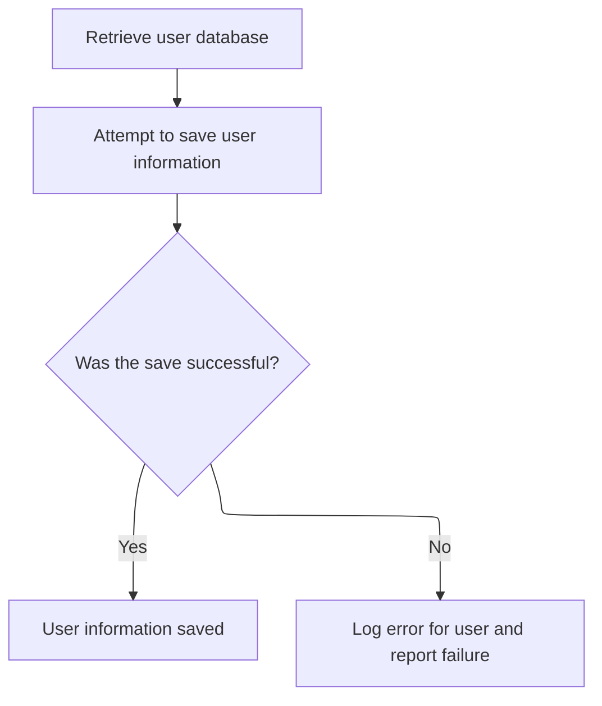

This document describes how user registration data is saved. When a user submits the registration form, the system checks for cancellation, validates the input, and either saves the user data or returns the user to the form if there are errors. If validation passes, the user data is securely persisted with safeguards for data integrity.

# Processing Registration Save Request

```mermaid
%%{init: {"flowchart": {"defaultRenderer": "elk"}} }%%
flowchart TD
    node1["Start registration process"] --> node2{"Was registration cancelled?"}
    click node1 openCode "apps/mailreader/src/main/java/org/apache/struts/apps/mailreader/actions/RegistrationAction.java:326:334"
    node2 -->|"Yes"| node3["Handle cancellation and return success"]
    click node2 openCode "apps/mailreader/src/main/java/org/apache/struts/apps/mailreader/actions/RegistrationAction.java:337:340"
    click node3 openCode "apps/mailreader/src/main/java/org/apache/struts/apps/mailreader/actions/RegistrationAction.java:338:339"
    node2 -->|"No"| node4["Validate token and input"]
    click node4 openCode "apps/mailreader/src/main/java/org/apache/struts/apps/mailreader/actions/RegistrationAction.java:343:344"
    node4 --> node5{"Are there validation errors?"}
    click node5 openCode "apps/mailreader/src/main/java/org/apache/struts/apps/mailreader/actions/RegistrationAction.java:345:347"
    node5 -->|"Yes"| node6["Return to input form with errors"]
    click node6 openCode "apps/mailreader/src/main/java/org/apache/struts/apps/mailreader/actions/RegistrationAction.java:346:347"
    node5 -->|"No"| node7{"Does user exist?"}
    click node7 openCode "apps/mailreader/src/main/java/org/apache/struts/apps/mailreader/actions/RegistrationAction.java:349:350"
    node7 -->|"No"| node8["Create new user"]
    click node8 openCode "apps/mailreader/src/main/java/org/apache/struts/apps/mailreader/actions/RegistrationAction.java:351:353"
    node8 --> node9{"Are there validation errors after creation?"}
    click node9 openCode "apps/mailreader/src/main/java/org/apache/struts/apps/mailreader/actions/RegistrationAction.java:352:354"
    node9 -->|"Yes"| node6
    node9 -->|"No"| node10["Populate user data"]
    click node10 openCode "apps/mailreader/src/main/java/org/apache/struts/apps/mailreader/actions/RegistrationAction.java:357:357"
    node7 -->|"Yes"| node10
    node10 --> node11["Save user"]
    click node11 openCode "apps/mailreader/src/main/java/org/apache/struts/apps/mailreader/actions/RegistrationAction.java:358:358"
    node11 --> node12["Return success"]
    click node12 openCode "apps/mailreader/src/main/java/org/apache/struts/apps/mailreader/actions/RegistrationAction.java:360:360"

classDef HeadingStyle fill:#777777,stroke:#333,stroke-width:2px;

%% Swimm:
%% %%{init: {"flowchart": {"defaultRenderer": "elk"}} }%%
%% flowchart TD
%%     node1["Start registration process"] --> node2{"Was registration cancelled?"}
%%     click node1 openCode "<SwmPath>[apps/…/actions/RegistrationAction.java](apps/mailreader/src/main/java/org/apache/struts/apps/mailreader/actions/RegistrationAction.java)</SwmPath>:326:334"
%%     node2 -->|"Yes"| node3["Handle cancellation and return success"]
%%     click node2 openCode "<SwmPath>[apps/…/actions/RegistrationAction.java](apps/mailreader/src/main/java/org/apache/struts/apps/mailreader/actions/RegistrationAction.java)</SwmPath>:337:340"
%%     click node3 openCode "<SwmPath>[apps/…/actions/RegistrationAction.java](apps/mailreader/src/main/java/org/apache/struts/apps/mailreader/actions/RegistrationAction.java)</SwmPath>:338:339"
%%     node2 -->|"No"| node4["Validate token and input"]
%%     click node4 openCode "<SwmPath>[apps/…/actions/RegistrationAction.java](apps/mailreader/src/main/java/org/apache/struts/apps/mailreader/actions/RegistrationAction.java)</SwmPath>:343:344"
%%     node4 --> node5{"Are there validation errors?"}
%%     click node5 openCode "<SwmPath>[apps/…/actions/RegistrationAction.java](apps/mailreader/src/main/java/org/apache/struts/apps/mailreader/actions/RegistrationAction.java)</SwmPath>:345:347"
%%     node5 -->|"Yes"| node6["Return to input form with errors"]
%%     click node6 openCode "<SwmPath>[apps/…/actions/RegistrationAction.java](apps/mailreader/src/main/java/org/apache/struts/apps/mailreader/actions/RegistrationAction.java)</SwmPath>:346:347"
%%     node5 -->|"No"| node7{"Does user exist?"}
%%     click node7 openCode "<SwmPath>[apps/…/actions/RegistrationAction.java](apps/mailreader/src/main/java/org/apache/struts/apps/mailreader/actions/RegistrationAction.java)</SwmPath>:349:350"
%%     node7 -->|"No"| node8["Create new user"]
%%     click node8 openCode "<SwmPath>[apps/…/actions/RegistrationAction.java](apps/mailreader/src/main/java/org/apache/struts/apps/mailreader/actions/RegistrationAction.java)</SwmPath>:351:353"
%%     node8 --> node9{"Are there validation errors after creation?"}
%%     click node9 openCode "<SwmPath>[apps/…/actions/RegistrationAction.java](apps/mailreader/src/main/java/org/apache/struts/apps/mailreader/actions/RegistrationAction.java)</SwmPath>:352:354"
%%     node9 -->|"Yes"| node6
%%     node9 -->|"No"| node10["Populate user data"]
%%     click node10 openCode "<SwmPath>[apps/…/actions/RegistrationAction.java](apps/mailreader/src/main/java/org/apache/struts/apps/mailreader/actions/RegistrationAction.java)</SwmPath>:357:357"
%%     node7 -->|"Yes"| node10
%%     node10 --> node11["Save user"]
%%     click node11 openCode "<SwmPath>[apps/…/actions/RegistrationAction.java](apps/mailreader/src/main/java/org/apache/struts/apps/mailreader/actions/RegistrationAction.java)</SwmPath>:358:358"
%%     node11 --> node12["Return success"]
%%     click node12 openCode "<SwmPath>[apps/…/actions/RegistrationAction.java](apps/mailreader/src/main/java/org/apache/struts/apps/mailreader/actions/RegistrationAction.java)</SwmPath>:360:360"
%% 
%% classDef HeadingStyle fill:#777777,stroke:#333,stroke-width:2px;
```



<SwmSnippet path="/apps/mailreader/src/main/java/org/apache/struts/apps/mailreader/actions/RegistrationAction.java" line="326">

---

<SwmToken path="apps/mailreader/src/main/java/org/apache/struts/apps/mailreader/actions/RegistrationAction.java" pos="326:5:5" line-data="    public ActionForward Save(">`Save`</SwmToken> kicks off the registration save process. It checks for cancellation, validates the token, handles errors, and ensures a user object is ready. Once the user is populated, it calls <SwmToken path="apps/mailreader/src/main/java/org/apache/struts/apps/mailreader/actions/RegistrationAction.java" pos="358:1:1" line-data="        doSaveUser(user);">`doSaveUser`</SwmToken> in <SwmToken path="apps/mailreader/src/main/java/org/apache/struts/apps/mailreader/actions/RegistrationAction.java" pos="49:10:10" line-data="public final class RegistrationAction extends BaseAction {">`BaseAction`</SwmToken> to persist the user data. We need to call <SwmToken path="apps/mailreader/src/main/java/org/apache/struts/apps/mailreader/actions/RegistrationAction.java" pos="49:10:10" line-data="public final class RegistrationAction extends BaseAction {">`BaseAction`</SwmToken> next because that's where the actual save logic is implemented.

```java
    public ActionForward Save(
            ActionMapping mapping,
            ActionForm form,
            HttpServletRequest request,
            HttpServletResponse response)
            throws Exception {

        final String method = Constants.SAVE;
        doLogProcess(mapping, method);

        HttpSession session = request.getSession();
        if (isCancelled(request)) {
            doCancel(session, method, Constants.SUBSCRIPTION_KEY);
            return doFindSuccess(mapping);
        }

        ActionMessages errors = new ActionMessages();
        doValidateToken(request, errors);

        if (!errors.isEmpty()) {
            return doInputForward(mapping, request, errors);
        }

        User user = doGetUser(session);
        if (user == null) {
            user = doCreateUser(form, request, errors);
            if (!errors.isEmpty()) {
                return doInputForward(mapping, request, errors);
            }
        }

        doPopulate(user, form);
        doSaveUser(user);

        return doFindSuccess(mapping);
    }
```

---

</SwmSnippet>

# Persisting User Data



<SwmSnippet path="/apps/mailreader/src/main/java/org/apache/struts/apps/mailreader/actions/BaseAction.java" line="405">

---

<SwmToken path="apps/mailreader/src/main/java/org/apache/struts/apps/mailreader/actions/BaseAction.java" pos="405:5:5" line-data="    protected void doSaveUser(User user) throws ServletException {">`doSaveUser`</SwmToken> handles persisting the user by calling the <SwmToken path="apps/mailreader/src/main/java/org/apache/struts/apps/mailreader/actions/BaseAction.java" pos="411:1:1" line-data="            UserDatabase database = doGetUserDatabase();">`UserDatabase`</SwmToken>'s save method. The user isn't passed directly; the database tracks which user to save internally. If something goes wrong, it logs the error with the username and throws a <SwmToken path="apps/mailreader/src/main/java/org/apache/struts/apps/mailreader/actions/BaseAction.java" pos="405:14:14" line-data="    protected void doSaveUser(User user) throws ServletException {">`ServletException`</SwmToken>. Next, we call <SwmToken path="mailreader-dao/src/main/java/org/apache/struts/apps/mailreader/dao/impl/memory/MemoryUserDatabase.java" pos="51:4:4" line-data="public class MemoryUserDatabase implements UserDatabase {">`MemoryUserDatabase`</SwmToken> to actually write the data.

```java
    protected void doSaveUser(User user) throws ServletException {

        final String LOG_DATABASE_SAVE_ERROR =
                " Unexpected error when saving User: ";

        try {
            UserDatabase database = doGetUserDatabase();
            database.save();
        } catch (Exception e) {
            String message = LOG_DATABASE_SAVE_ERROR + user.getUsername();
            log.error(message, e);
            throw new ServletException(message, e);
        }
    }
```

---

</SwmSnippet>

# Writing User Data to Storage

<SwmSnippet path="/mailreader-dao/src/main/java/org/apache/struts/apps/mailreader/dao/impl/memory/MemoryUserDatabase.java" line="225">

---

In <SwmToken path="mailreader-dao/src/main/java/org/apache/struts/apps/mailreader/dao/impl/memory/MemoryUserDatabase.java" pos="225:5:5" line-data="    public void save() throws Exception {">`save`</SwmToken>, user and subscription data are written to a new XML file. It grabs all users, prints each user and their subscriptions using their <SwmToken path="apps/faces-example1/src/main/java/org/apache/struts/webapp/example/RegistrationBacking.java" pos="117:8:10" line-data="        forward(context, url.toString());">`toString()`</SwmToken> methods, which output XML. This setup means serialization depends on those methods. Next, we finish writing and check for errors.

```java
    public void save() throws Exception {

        if (log.isDebugEnabled()) {
            log.debug("Saving database to '" + pathname + "'");
        }
        File fileNew = new File(pathnameNew);
        PrintWriter writer = null;

        try {

            // Configure our PrintWriter
            FileOutputStream fos = new FileOutputStream(fileNew);
            OutputStreamWriter osw = new OutputStreamWriter(fos);
            writer = new PrintWriter(osw);

            // Print the file prolog
            writer.println("<?xml version='1.0'?>");
            writer.println("<database>");

            // Print entries for each defined user and associated subscriptions
            User yusers[] = findUsers();
            for (int i = 0; i < yusers.length; i++) {
                writer.print("  ");
                writer.println(yusers[i]);
                Subscription subscriptions[] =
                    yusers[i].getSubscriptions();
                for (int j = 0; j < subscriptions.length; j++) {
                    writer.print("    ");
                    writer.println(subscriptions[j]);
                    writer.print("    ");
                    writer.println("</subscription>");
                }
                writer.print("  ");
                writer.println("</user>");
            }
```

---

</SwmSnippet>

<SwmSnippet path="/mailreader-dao/src/main/java/org/apache/struts/apps/mailreader/dao/impl/memory/MemoryUserDatabase.java" line="261">

---

After writing the XML, we check for errors. If any are found, the temporary file is deleted and an exception is thrown. Next, we call close to finalize the file state.

```java
            // Print the file epilog
            writer.println("</database>");

            // Check for errors that occurred while printing
            if (writer.checkError()) {
                writer.close();
```

---

</SwmSnippet>

## Finalizing Database State

<SwmSnippet path="/mailreader-dao/src/main/java/org/apache/struts/apps/mailreader/dao/impl/memory/MemoryUserDatabase.java" line="102">

---

In <SwmToken path="mailreader-dao/src/main/java/org/apache/struts/apps/mailreader/dao/impl/memory/MemoryUserDatabase.java" pos="102:5:5" line-data="    public void close() throws Exception {">`close`</SwmToken>, the database saves any changes and marks itself as closed. This wraps up the persistence step. Next, we handle the open state flag.

```java
    public void close() throws Exception {

        save();
```

---

</SwmSnippet>

<SwmSnippet path="/mailreader-dao/src/main/java/org/apache/struts/apps/mailreader/dao/impl/memory/MemoryUserDatabase.java" line="105">

---

We just returned from <SwmToken path="mailreader-dao/src/main/java/org/apache/struts/apps/mailreader/dao/impl/memory/MemoryUserDatabase.java" pos="102:5:5" line-data="    public void close() throws Exception {">`close`</SwmToken> in <SwmToken path="mailreader-dao/src/main/java/org/apache/struts/apps/mailreader/dao/impl/memory/MemoryUserDatabase.java" pos="51:4:4" line-data="public class MemoryUserDatabase implements UserDatabase {">`MemoryUserDatabase`</SwmToken>. Now, the open flag is set to false, locking down the database for further changes.

```java
        this.open = false;

    }
```

---

</SwmSnippet>

## Handling Save Errors and Cleanup

```mermaid
%%{init: {"flowchart": {"defaultRenderer": "elk"}} }%%
flowchart TD
    node1["Save user database to temporary new file (pathnameNew)"] --> node2{"Did save succeed?"}
    click node1 openCode "mailreader-dao/src/main/java/org/apache/struts/apps/mailreader/dao/impl/memory/MemoryUserDatabase.java:267:270"
    node2 -->|"No"| node3["Delete temporary file (pathnameNew) and abort save"]
    click node2 openCode "mailreader-dao/src/main/java/org/apache/struts/apps/mailreader/dao/impl/memory/MemoryUserDatabase.java:267:270"
    click node3 openCode "mailreader-dao/src/main/java/org/apache/struts/apps/mailreader/dao/impl/memory/MemoryUserDatabase.java:267:270"
    node2 -->|"Yes"| node4{"Does original database file (pathname) exist?"}
    click node4 openCode "mailreader-dao/src/main/java/org/apache/struts/apps/mailreader/dao/impl/memory/MemoryUserDatabase.java:288:294"
    node4 -->|"Yes"| node5["Delete previous backup file (pathnameOld)"]
    click node5 openCode "mailreader-dao/src/main/java/org/apache/struts/apps/mailreader/dao/impl/memory/MemoryUserDatabase.java:289:290"
    node5 --> node6{"Can original file be renamed to backup?"}
    click node6 openCode "mailreader-dao/src/main/java/org/apache/struts/apps/mailreader/dao/impl/memory/MemoryUserDatabase.java:290:293"
    node6 -->|"No"| node7["Abort save and report error"]
    click node7 openCode "mailreader-dao/src/main/java/org/apache/struts/apps/mailreader/dao/impl/memory/MemoryUserDatabase.java:291:292"
    node6 -->|"Yes"| node8["Rename temporary file to database file"]
    click node8 openCode "mailreader-dao/src/main/java/org/apache/struts/apps/mailreader/dao/impl/memory/MemoryUserDatabase.java:295:301"
    node4 -->|"No"| node8
    node8 --> node9{"Did rename succeed?"}
    click node9 openCode "mailreader-dao/src/main/java/org/apache/struts/apps/mailreader/dao/impl/memory/MemoryUserDatabase.java:295:301"
    node9 -->|"No"| node10["Restore backup (rename backup to original) and abort save"]
    click node10 openCode "mailreader-dao/src/main/java/org/apache/struts/apps/mailreader/dao/impl/memory/MemoryUserDatabase.java:297:298"
    node9 -->|"Yes"| node11["Delete backup file (pathnameOld)"]
    click node11 openCode "mailreader-dao/src/main/java/org/apache/struts/apps/mailreader/dao/impl/memory/MemoryUserDatabase.java:302:302"

classDef HeadingStyle fill:#777777,stroke:#333,stroke-width:2px;

%% Swimm:
%% %%{init: {"flowchart": {"defaultRenderer": "elk"}} }%%
%% flowchart TD
%%     node1["Save user database to temporary new file (<SwmToken path="mailreader-dao/src/main/java/org/apache/struts/apps/mailreader/dao/impl/memory/MemoryUserDatabase.java" pos="230:11:11" line-data="        File fileNew = new File(pathnameNew);">`pathnameNew`</SwmToken>)"] --> node2{"Did save succeed?"}
%%     click node1 openCode "<SwmPath>[mailreader-dao/…/memory/MemoryUserDatabase.java](mailreader-dao/src/main/java/org/apache/struts/apps/mailreader/dao/impl/memory/MemoryUserDatabase.java)</SwmPath>:267:270"
%%     node2 -->|"No"| node3["Delete temporary file (<SwmToken path="mailreader-dao/src/main/java/org/apache/struts/apps/mailreader/dao/impl/memory/MemoryUserDatabase.java" pos="230:11:11" line-data="        File fileNew = new File(pathnameNew);">`pathnameNew`</SwmToken>) and abort save"]
%%     click node2 openCode "<SwmPath>[mailreader-dao/…/memory/MemoryUserDatabase.java](mailreader-dao/src/main/java/org/apache/struts/apps/mailreader/dao/impl/memory/MemoryUserDatabase.java)</SwmPath>:267:270"
%%     click node3 openCode "<SwmPath>[mailreader-dao/…/memory/MemoryUserDatabase.java](mailreader-dao/src/main/java/org/apache/struts/apps/mailreader/dao/impl/memory/MemoryUserDatabase.java)</SwmPath>:267:270"
%%     node2 -->|"Yes"| node4{"Does original database file (pathname) exist?"}
%%     click node4 openCode "<SwmPath>[mailreader-dao/…/memory/MemoryUserDatabase.java](mailreader-dao/src/main/java/org/apache/struts/apps/mailreader/dao/impl/memory/MemoryUserDatabase.java)</SwmPath>:288:294"
%%     node4 -->|"Yes"| node5["Delete previous backup file (<SwmToken path="mailreader-dao/src/main/java/org/apache/struts/apps/mailreader/dao/impl/memory/MemoryUserDatabase.java" pos="287:11:11" line-data="        File fileOld = new File(pathnameOld);">`pathnameOld`</SwmToken>)"]
%%     click node5 openCode "<SwmPath>[mailreader-dao/…/memory/MemoryUserDatabase.java](mailreader-dao/src/main/java/org/apache/struts/apps/mailreader/dao/impl/memory/MemoryUserDatabase.java)</SwmPath>:289:290"
%%     node5 --> node6{"Can original file be renamed to backup?"}
%%     click node6 openCode "<SwmPath>[mailreader-dao/…/memory/MemoryUserDatabase.java](mailreader-dao/src/main/java/org/apache/struts/apps/mailreader/dao/impl/memory/MemoryUserDatabase.java)</SwmPath>:290:293"
%%     node6 -->|"No"| node7["Abort save and report error"]
%%     click node7 openCode "<SwmPath>[mailreader-dao/…/memory/MemoryUserDatabase.java](mailreader-dao/src/main/java/org/apache/struts/apps/mailreader/dao/impl/memory/MemoryUserDatabase.java)</SwmPath>:291:292"
%%     node6 -->|"Yes"| node8["Rename temporary file to database file"]
%%     click node8 openCode "<SwmPath>[mailreader-dao/…/memory/MemoryUserDatabase.java](mailreader-dao/src/main/java/org/apache/struts/apps/mailreader/dao/impl/memory/MemoryUserDatabase.java)</SwmPath>:295:301"
%%     node4 -->|"No"| node8
%%     node8 --> node9{"Did rename succeed?"}
%%     click node9 openCode "<SwmPath>[mailreader-dao/…/memory/MemoryUserDatabase.java](mailreader-dao/src/main/java/org/apache/struts/apps/mailreader/dao/impl/memory/MemoryUserDatabase.java)</SwmPath>:295:301"
%%     node9 -->|"No"| node10["Restore backup (rename backup to original) and abort save"]
%%     click node10 openCode "<SwmPath>[mailreader-dao/…/memory/MemoryUserDatabase.java](mailreader-dao/src/main/java/org/apache/struts/apps/mailreader/dao/impl/memory/MemoryUserDatabase.java)</SwmPath>:297:298"
%%     node9 -->|"Yes"| node11["Delete backup file (<SwmToken path="mailreader-dao/src/main/java/org/apache/struts/apps/mailreader/dao/impl/memory/MemoryUserDatabase.java" pos="287:11:11" line-data="        File fileOld = new File(pathnameOld);">`pathnameOld`</SwmToken>)"]
%%     click node11 openCode "<SwmPath>[mailreader-dao/…/memory/MemoryUserDatabase.java](mailreader-dao/src/main/java/org/apache/struts/apps/mailreader/dao/impl/memory/MemoryUserDatabase.java)</SwmPath>:302:302"
%% 
%% classDef HeadingStyle fill:#777777,stroke:#333,stroke-width:2px;
```



<SwmSnippet path="/mailreader-dao/src/main/java/org/apache/struts/apps/mailreader/dao/impl/memory/MemoryUserDatabase.java" line="267">

---

We just returned from MemoryUserDatabase.save. If writing failed, the file is deleted and an exception is thrown. Next, we move to <SwmToken path="apps/faces-example1/src/main/java/org/apache/struts/webapp/example/RegistrationBacking.java" pos="36:4:4" line-data="public class RegistrationBacking extends AbstractBacking {">`RegistrationBacking`</SwmToken> to handle user actions.

```java
                fileNew.delete();
                throw new IOException
                    ("Saving database to '" + pathname + "'");
            }
```

---

</SwmSnippet>

<SwmSnippet path="/apps/faces-example1/src/main/java/org/apache/struts/webapp/example/RegistrationBacking.java" line="101">

---

<SwmToken path="apps/faces-example1/src/main/java/org/apache/struts/webapp/example/RegistrationBacking.java" pos="101:5:5" line-data="    public String delete() {">`delete`</SwmToken> builds a URL for the delete action using user and subscription info from JSF context maps, then forwards the request. It always returns null since navigation isn't handled here. Next, we go back to <SwmToken path="mailreader-dao/src/main/java/org/apache/struts/apps/mailreader/dao/impl/memory/MemoryUserDatabase.java" pos="51:4:4" line-data="public class MemoryUserDatabase implements UserDatabase {">`MemoryUserDatabase`</SwmToken> for cleanup after the delete.

```java
    public String delete() {

        if (log.isDebugEnabled()) {
            log.debug("delete()");
        }
        FacesContext context = FacesContext.getCurrentInstance();
        StringBuffer url = subscription(context);
        url.append("?action=Delete");
        url.append("&username=");
        User user = (User)
            context.getExternalContext().getSessionMap().get("user");
        url.append(user.getUsername());
        url.append("&host=");
        Subscription subscription = (Subscription)
            context.getExternalContext().getRequestMap().get("subscription");
        url.append(subscription.getHost());
        forward(context, url.toString());
        return (null);

    }
```

---

</SwmSnippet>

<SwmSnippet path="/mailreader-dao/src/main/java/org/apache/struts/apps/mailreader/dao/impl/memory/MemoryUserDatabase.java" line="271">

---

We just returned from <SwmToken path="apps/faces-example1/src/main/java/org/apache/struts/webapp/example/RegistrationBacking.java" pos="36:4:4" line-data="public class RegistrationBacking extends AbstractBacking {">`RegistrationBacking`</SwmToken>. Now, the writer is closed and set to null to clean up resources. If there's an <SwmToken path="mailreader-dao/src/main/java/org/apache/struts/apps/mailreader/dao/impl/memory/MemoryUserDatabase.java" pos="274:6:6" line-data="        } catch (IOException e) {">`IOException`</SwmToken>, it's handled separately. Next, we wrap up the save logic in <SwmToken path="mailreader-dao/src/main/java/org/apache/struts/apps/mailreader/dao/impl/memory/MemoryUserDatabase.java" pos="51:4:4" line-data="public class MemoryUserDatabase implements UserDatabase {">`MemoryUserDatabase`</SwmToken>.

```java
            writer.close();
            writer = null;

        } catch (IOException e) {

            if (writer != null) {
                writer.close();
            }
```

---

</SwmSnippet>

<SwmSnippet path="/mailreader-dao/src/main/java/org/apache/struts/apps/mailreader/dao/impl/memory/MemoryUserDatabase.java" line="279">

---

We just returned from <SwmToken path="mailreader-dao/src/main/java/org/apache/struts/apps/mailreader/dao/impl/memory/MemoryUserDatabase.java" pos="51:4:4" line-data="public class MemoryUserDatabase implements UserDatabase {">`MemoryUserDatabase`</SwmToken>. The save logic finishes by renaming files to ensure atomic writes and prevent corruption. If renaming fails, it tries to restore from backup. Next, <SwmToken path="apps/faces-example1/src/main/java/org/apache/struts/webapp/example/RegistrationBacking.java" pos="36:4:4" line-data="public class RegistrationBacking extends AbstractBacking {">`RegistrationBacking`</SwmToken> can proceed knowing the data is safely stored.

```java
            fileNew.delete();
            throw e;

        }


        // Perform the required renames to permanently save this file
        File fileOrig = new File(pathname);
        File fileOld = new File(pathnameOld);
        if (fileOrig.exists()) {
            fileOld.delete();
            if (!fileOrig.renameTo(fileOld)) {
                throw new IOException
                    ("Renaming '" + pathname + "' to '" + pathnameOld + "'");
            }
        }
        if (!fileNew.renameTo(fileOrig)) {
            if (fileOld.exists()) {
                fileOld.renameTo(fileOrig);
            }
            throw new IOException
                ("Renaming '" + pathnameNew + "' to '" + pathname + "'");
        }
        fileOld.delete();

    }
```

---

</SwmSnippet>

&nbsp;

*This is an auto-generated document by Swimm 🌊 and has not yet been verified by a human*

<SwmMeta version="3.0.0" repo-id="Z2l0aHViJTNBJTNBc3RydXRzMSUzQSUzQVN3aW1tLURlbW8=" repo-name="struts1"><sup>Powered by [Swimm](https://app.swimm.io/)</sup></SwmMeta>
