This document describes how the system selects which method to execute in response to a user action. By analyzing mapping parameters and user submission data, the flow matches the appropriate method to invoke. If no match is found, a default method is used.

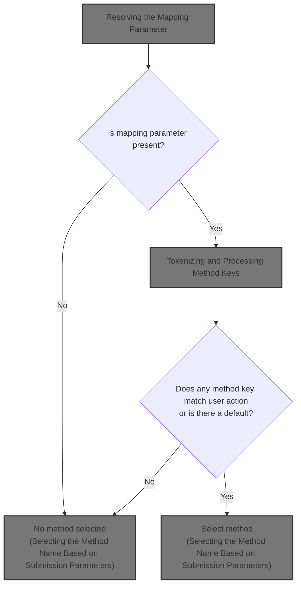
```mermaid
flowchart TD
  node1["Resolving the Mapping Parameter"]:::HeadingStyle
  click node1 goToHeading "Resolving the Mapping Parameter"
  node1 --> node2{"Is mapping parameter present?"}
  node2 -->|"No"| node3["No method selected
(Selecting the Method Name Based on Submission Parameters)"]:::HeadingStyle
  click node3 goToHeading "Selecting the Method Name Based on Submission Parameters"
  node2 -->|"Yes"| node4["Tokenizing and Processing Method Keys"]:::HeadingStyle
  click node4 goToHeading "Tokenizing and Processing Method Keys"
  node4 --> node5{"Does any method key match user action
or is there a default?"}
  node5 -->|"Yes"| node6["Select method
(Selecting the Method Name Based on Submission Parameters)"]:::HeadingStyle
  click node6 goToHeading "Selecting the Method Name Based on Submission Parameters"
  node5 -->|"No"| node3
classDef HeadingStyle fill:#777777,stroke:#333,stroke-width:2px;
```

# Parsing Method Keys from Mapping Parameter


```mermaid
%%{init: {"flowchart": {"defaultRenderer": "elk"}} }%%
flowchart TD
  node1["Resolving the Mapping Parameter"] --> node2{"Is mapping parameter present?"}
  
  node2 -->|"No"| node3["Return null"]
  click node2 openCode "core/src/main/java/org/apache/struts/dispatcher/AbstractEventMappingDispatcher.java:84:86"
  click node3 openCode "core/src/main/java/org/apache/struts/dispatcher/AbstractEventMappingDispatcher.java:85:86"
  node2 -->|"Yes"| node4["Iterate over method keys in mapping
parameter"]
  click node4 openCode "core/src/main/java/org/apache/struts/dispatcher/AbstractEventMappingDispatcher.java:88:92"
  subgraph loop1["For each method key in mapping parameter"]
    node4 --> node5{"Does method key match user action?"}
    click node5 openCode "core/src/main/java/org/apache/struts/dispatcher/AbstractEventMappingDispatcher.java:110:112"
    node5 -->|"Yes"| node6["Return matched method"]
    click node6 openCode "core/src/main/java/org/apache/struts/dispatcher/AbstractEventMappingDispatcher.java:111:112"
    node5 -->|"No"| node7{"Is method key the default?"}
    click node7 openCode "core/src/main/java/org/apache/struts/dispatcher/AbstractEventMappingDispatcher.java:105:107"
    node7 -->|"Yes"| node8["Set as default method"]
    click node8 openCode "core/src/main/java/org/apache/struts/dispatcher/AbstractEventMappingDispatcher.java:106:107"
    node7 -->|"No"| node4
    node8 --> node4
  end
  node4 -->|"No match found"| node9["Return default method"]
  click node9 openCode "core/src/main/java/org/apache/struts/dispatcher/AbstractEventMappingDispatcher.java:115:116"

classDef HeadingStyle fill:#777777,stroke:#333,stroke-width:2px;
click node1 goToHeading "Resolving the Mapping Parameter"
node1:::HeadingStyle

%% Swimm:
%% %%{init: {"flowchart": {"defaultRenderer": "elk"}} }%%
%% flowchart TD
%%   node1["Resolving the Mapping Parameter"] --> node2{"Is mapping parameter present?"}
%%   
%%   node2 -->|"No"| node3["Return null"]
%%   click node2 openCode "<SwmPath>[core/…/dispatcher/AbstractEventMappingDispatcher.java](core/src/main/java/org/apache/struts/dispatcher/AbstractEventMappingDispatcher.java)</SwmPath>:84:86"
%%   click node3 openCode "<SwmPath>[core/…/dispatcher/AbstractEventMappingDispatcher.java](core/src/main/java/org/apache/struts/dispatcher/AbstractEventMappingDispatcher.java)</SwmPath>:85:86"
%%   node2 -->|"Yes"| node4["Iterate over method keys in mapping
%% parameter"]
%%   click node4 openCode "<SwmPath>[core/…/dispatcher/AbstractEventMappingDispatcher.java](core/src/main/java/org/apache/struts/dispatcher/AbstractEventMappingDispatcher.java)</SwmPath>:88:92"
%%   subgraph loop1["For each method key in mapping parameter"]
%%     node4 --> node5{"Does method key match user action?"}
%%     click node5 openCode "<SwmPath>[core/…/dispatcher/AbstractEventMappingDispatcher.java](core/src/main/java/org/apache/struts/dispatcher/AbstractEventMappingDispatcher.java)</SwmPath>:110:112"
%%     node5 -->|"Yes"| node6["Return matched method"]
%%     click node6 openCode "<SwmPath>[core/…/dispatcher/AbstractEventMappingDispatcher.java](core/src/main/java/org/apache/struts/dispatcher/AbstractEventMappingDispatcher.java)</SwmPath>:111:112"
%%     node5 -->|"No"| node7{"Is method key the default?"}
%%     click node7 openCode "<SwmPath>[core/…/dispatcher/AbstractEventMappingDispatcher.java](core/src/main/java/org/apache/struts/dispatcher/AbstractEventMappingDispatcher.java)</SwmPath>:105:107"
%%     node7 -->|"Yes"| node8["Set as default method"]
%%     click node8 openCode "<SwmPath>[core/…/dispatcher/AbstractEventMappingDispatcher.java](core/src/main/java/org/apache/struts/dispatcher/AbstractEventMappingDispatcher.java)</SwmPath>:106:107"
%%     node7 -->|"No"| node4
%%     node8 --> node4
%%   end
%%   node4 -->|"No match found"| node9["Return default method"]
%%   click node9 openCode "<SwmPath>[core/…/dispatcher/AbstractEventMappingDispatcher.java](core/src/main/java/org/apache/struts/dispatcher/AbstractEventMappingDispatcher.java)</SwmPath>:115:116"
%% 
%% classDef HeadingStyle fill:#777777,stroke:#333,stroke-width:2px;
%% click node1 goToHeading "Resolving the Mapping Parameter"
%% node1:::HeadingStyle
```

<SwmSnippet path="/core/src/main/java/org/apache/struts/dispatcher/AbstractEventMappingDispatcher.java" line="81">

---

In <SwmToken path="core/src/main/java/org/apache/struts/dispatcher/AbstractEventMappingDispatcher.java" pos="81:7:7" line-data="    protected final String resolveMethodName(ActionContext context) {">`resolveMethodName`</SwmToken>, we grab the mapping parameter from the superclass, expecting it to be a <SwmToken path="core/src/main/java/org/apache/struts/dispatcher/AbstractEventMappingDispatcher.java" pos="88:11:13" line-data="        // Parse it as a comma-separated list">`comma-separated`</SwmToken> list of method keys or aliases. If it's missing, we bail out early. We need to call <SwmToken path="core/src/main/java/org/apache/struts/dispatcher/AbstractEventMappingDispatcher.java" pos="54:10:10" line-data="public abstract class AbstractEventMappingDispatcher extends AbstractMappingDispatcher {">`AbstractMappingDispatcher`</SwmToken> next because that's where the actual mapping parameter is resolved, so we can split and process it here.

```java
    protected final String resolveMethodName(ActionContext context) {
        // Obtain the mapping parameter
        String mappingParameter = super.resolveMethodName(context);
        if (mappingParameter == null) {
            return null;
        }

```

---

</SwmSnippet>

## Resolving the Mapping Parameter

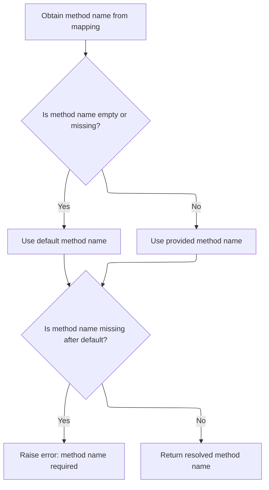
```mermaid
%%{init: {"flowchart": {"defaultRenderer": "elk"}} }%%
flowchart TD
    node1["Obtain method name from mapping"] --> node2{"Is method name empty or missing?"}
    click node1 openCode "core/src/main/java/org/apache/struts/dispatcher/AbstractMappingDispatcher.java:71:72"
    node2 -->|"Yes"| node3["Use default method name"]
    click node2 openCode "core/src/main/java/org/apache/struts/dispatcher/AbstractMappingDispatcher.java:73:80"
    node2 -->|"No"| node4["Use provided method name"]
    click node3 openCode "core/src/main/java/org/apache/struts/dispatcher/AbstractMappingDispatcher.java:79:80"
    click node4 openCode "core/src/main/java/org/apache/struts/dispatcher/AbstractMappingDispatcher.java:72:72"
    node3 --> node5{"Is method name missing after default?"}
    node4 --> node5
    node5 -->|"Yes"| node6["Raise error: method name required"]
    click node5 openCode "core/src/main/java/org/apache/struts/dispatcher/AbstractMappingDispatcher.java:83:87"
    click node6 openCode "core/src/main/java/org/apache/struts/dispatcher/AbstractMappingDispatcher.java:83:87"
    node5 -->|"No"| node7["Return resolved method name"]
    click node7 openCode "core/src/main/java/org/apache/struts/dispatcher/AbstractMappingDispatcher.java:89:90"

classDef HeadingStyle fill:#777777,stroke:#333,stroke-width:2px;

%% Swimm:
%% %%{init: {"flowchart": {"defaultRenderer": "elk"}} }%%
%% flowchart TD
%%     node1["Obtain method name from mapping"] --> node2{"Is method name empty or missing?"}
%%     click node1 openCode "<SwmPath>[core/…/dispatcher/AbstractMappingDispatcher.java](core/src/main/java/org/apache/struts/dispatcher/AbstractMappingDispatcher.java)</SwmPath>:71:72"
%%     node2 -->|"Yes"| node3["Use default method name"]
%%     click node2 openCode "<SwmPath>[core/…/dispatcher/AbstractMappingDispatcher.java](core/src/main/java/org/apache/struts/dispatcher/AbstractMappingDispatcher.java)</SwmPath>:73:80"
%%     node2 -->|"No"| node4["Use provided method name"]
%%     click node3 openCode "<SwmPath>[core/…/dispatcher/AbstractMappingDispatcher.java](core/src/main/java/org/apache/struts/dispatcher/AbstractMappingDispatcher.java)</SwmPath>:79:80"
%%     click node4 openCode "<SwmPath>[core/…/dispatcher/AbstractMappingDispatcher.java](core/src/main/java/org/apache/struts/dispatcher/AbstractMappingDispatcher.java)</SwmPath>:72:72"
%%     node3 --> node5{"Is method name missing after default?"}
%%     node4 --> node5
%%     node5 -->|"Yes"| node6["Raise error: method name required"]
%%     click node5 openCode "<SwmPath>[core/…/dispatcher/AbstractMappingDispatcher.java](core/src/main/java/org/apache/struts/dispatcher/AbstractMappingDispatcher.java)</SwmPath>:83:87"
%%     click node6 openCode "<SwmPath>[core/…/dispatcher/AbstractMappingDispatcher.java](core/src/main/java/org/apache/struts/dispatcher/AbstractMappingDispatcher.java)</SwmPath>:83:87"
%%     node5 -->|"No"| node7["Return resolved method name"]
%%     click node7 openCode "<SwmPath>[core/…/dispatcher/AbstractMappingDispatcher.java](core/src/main/java/org/apache/struts/dispatcher/AbstractMappingDispatcher.java)</SwmPath>:89:90"
%% 
%% classDef HeadingStyle fill:#777777,stroke:#333,stroke-width:2px;
```

<SwmSnippet path="/core/src/main/java/org/apache/struts/dispatcher/AbstractMappingDispatcher.java" line="69">

---

<SwmToken path="core/src/main/java/org/apache/struts/dispatcher/AbstractMappingDispatcher.java" pos="69:5:5" line-data="    protected String resolveMethodName(ActionContext context) {">`resolveMethodName`</SwmToken> checks the action mapping for a parameter, defaults it if missing, and throws if it's still null. We call <SwmToken path="core/src/main/java/org/apache/struts/util/MessageResources.java" pos="51:6:6" line-data="public abstract class MessageResources implements Serializable {">`MessageResources`</SwmToken> next to fetch a localized error message for logging when the parameter is missing.

```java
    protected String resolveMethodName(ActionContext context) {
        // Null out an empty string parameter
        ActionMapping mapping = (ActionMapping) context.getActionConfig();
        String parameter = mapping.getParameter();
        if ("".equals(parameter)) {
            parameter = null;
        }

        // Assign the default if the mapping did not provide a value
        if (parameter == null) {
            parameter = defaultMappingParameter;
        }

        // Parameter is required
        if (parameter == null) {
            String message = messages.getMessage(MSG_KEY_MISSING_MAPPING_PARAMETER, mapping.getPath());
            log.error(message);
            throw new IllegalStateException(message);
        }

        return parameter;
    }
```

---

</SwmSnippet>

## Fetching Localized Error Messages

<SwmSnippet path="/core/src/main/java/org/apache/struts/util/MessageResources.java" line="218">

---

<SwmToken path="core/src/main/java/org/apache/struts/util/MessageResources.java" pos="218:5:5" line-data="    public String getMessage(String key, Object arg0) {">`getMessage`</SwmToken> just forwards the call to another overload, letting us handle locale and argument formatting in a single spot. We call the next overload to actually do the formatting.

```java
    public String getMessage(String key, Object arg0) {
        return this.getMessage((Locale) null, key, arg0);
    }
```

---

</SwmSnippet>

## Formatting Messages with Locale and Arguments

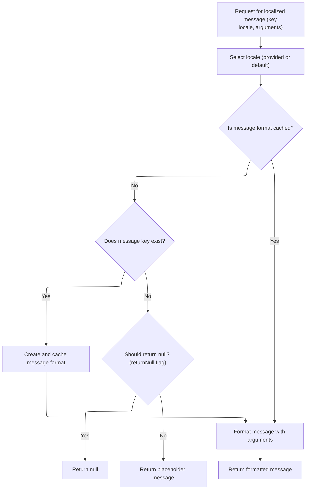
```mermaid
%%{init: {"flowchart": {"defaultRenderer": "elk"}} }%%
flowchart TD
  node1["Request for localized message (key,
locale, arguments)"] --> node2["Select locale (provided or default)"]
  click node1 openCode "core/src/main/java/org/apache/struts/util/MessageResources.java:324:326"
  click node2 openCode "core/src/main/java/org/apache/struts/util/MessageResources.java:288:290"
  node2 --> node3{"Is message format cached?"}
  click node3 openCode "core/src/main/java/org/apache/struts/util/MessageResources.java:292:297"
  node3 -->|"Yes"| node6["Format message with arguments"]
  click node6 openCode "core/src/main/java/org/apache/struts/util/MessageResources.java:311:312"
  node3 -->|"No"| node4{"Does message key exist?"}
  click node4 openCode "core/src/main/java/org/apache/struts/util/MessageResources.java:299:301"
  node4 -->|"Yes"| node5["Create and cache message format"]
  click node5 openCode "core/src/main/java/org/apache/struts/util/MessageResources.java:305:308"
  node5 --> node6
  node4 -->|"No"| node7{"Should return null? (returnNull flag)"}
  click node7 openCode "core/src/main/java/org/apache/struts/util/MessageResources.java:302:303"
  node7 -->|"Yes"| node8["Return null"]
  click node8 openCode "core/src/main/java/org/apache/struts/util/MessageResources.java:302:303"
  node7 -->|"No"| node9["Return placeholder message"]
  click node9 openCode "core/src/main/java/org/apache/struts/util/MessageResources.java:302:303"
  node6 --> node10["Return formatted message"]
  click node10 openCode "core/src/main/java/org/apache/struts/util/MessageResources.java:311:312"
classDef HeadingStyle fill:#777777,stroke:#333,stroke-width:2px;

%% Swimm:
%% %%{init: {"flowchart": {"defaultRenderer": "elk"}} }%%
%% flowchart TD
%%   node1["Request for localized message (key,
%% locale, arguments)"] --> node2["Select locale (provided or default)"]
%%   click node1 openCode "<SwmPath>[core/…/util/MessageResources.java](core/src/main/java/org/apache/struts/util/MessageResources.java)</SwmPath>:324:326"
%%   click node2 openCode "<SwmPath>[core/…/util/MessageResources.java](core/src/main/java/org/apache/struts/util/MessageResources.java)</SwmPath>:288:290"
%%   node2 --> node3{"Is message format cached?"}
%%   click node3 openCode "<SwmPath>[core/…/util/MessageResources.java](core/src/main/java/org/apache/struts/util/MessageResources.java)</SwmPath>:292:297"
%%   node3 -->|"Yes"| node6["Format message with arguments"]
%%   click node6 openCode "<SwmPath>[core/…/util/MessageResources.java](core/src/main/java/org/apache/struts/util/MessageResources.java)</SwmPath>:311:312"
%%   node3 -->|"No"| node4{"Does message key exist?"}
%%   click node4 openCode "<SwmPath>[core/…/util/MessageResources.java](core/src/main/java/org/apache/struts/util/MessageResources.java)</SwmPath>:299:301"
%%   node4 -->|"Yes"| node5["Create and cache message format"]
%%   click node5 openCode "<SwmPath>[core/…/util/MessageResources.java](core/src/main/java/org/apache/struts/util/MessageResources.java)</SwmPath>:305:308"
%%   node5 --> node6
%%   node4 -->|"No"| node7{"Should return null? (<SwmToken path="core/src/main/java/org/apache/struts/util/MessageResources.java" pos="302:3:3" line-data="                    return returnNull ? null : (&quot;???&quot; + formatKey + &quot;???&quot;);">`returnNull`</SwmToken> flag)"}
%%   click node7 openCode "<SwmPath>[core/…/util/MessageResources.java](core/src/main/java/org/apache/struts/util/MessageResources.java)</SwmPath>:302:303"
%%   node7 -->|"Yes"| node8["Return null"]
%%   click node8 openCode "<SwmPath>[core/…/util/MessageResources.java](core/src/main/java/org/apache/struts/util/MessageResources.java)</SwmPath>:302:303"
%%   node7 -->|"No"| node9["Return placeholder message"]
%%   click node9 openCode "<SwmPath>[core/…/util/MessageResources.java](core/src/main/java/org/apache/struts/util/MessageResources.java)</SwmPath>:302:303"
%%   node6 --> node10["Return formatted message"]
%%   click node10 openCode "<SwmPath>[core/…/util/MessageResources.java](core/src/main/java/org/apache/struts/util/MessageResources.java)</SwmPath>:311:312"
%% classDef HeadingStyle fill:#777777,stroke:#333,stroke-width:2px;
```

<SwmSnippet path="/core/src/main/java/org/apache/struts/util/MessageResources.java" line="324">

---

<SwmToken path="core/src/main/java/org/apache/struts/util/MessageResources.java" pos="324:5:5" line-data="    public String getMessage(Locale locale, String key, Object arg0) {">`getMessage`</SwmToken> here wraps the single argument in an array and passes it to the main formatting function. This lets us handle messages with multiple arguments using the same code.

```java
    public String getMessage(Locale locale, String key, Object arg0) {
        return this.getMessage(locale, key, new Object[] { arg0 });
    }
```

---

</SwmSnippet>

<SwmSnippet path="/core/src/main/java/org/apache/struts/util/MessageResources.java" line="286">

---

<SwmToken path="core/src/main/java/org/apache/struts/util/MessageResources.java" pos="286:5:5" line-data="    public String getMessage(Locale locale, String key, Object[] args) {">`getMessage`</SwmToken> grabs the locale (defaults if missing), checks the cache for a <SwmToken path="core/src/main/java/org/apache/struts/util/MessageResources.java" pos="287:5:5" line-data="        // Cache MessageFormat instances as they are accessed">`MessageFormat`</SwmToken>, and builds one if needed. It escapes the format string, handles missing messages with a placeholder, and formats the args. All this is wrapped in a synchronized block for thread safety.

```java
    public String getMessage(Locale locale, String key, Object[] args) {
        // Cache MessageFormat instances as they are accessed
        if (locale == null) {
            locale = defaultLocale;
        }

        MessageFormat format = null;
        String formatKey = messageKey(locale, key);

        synchronized (formats) {
            format = (MessageFormat) formats.get(formatKey);

            if (format == null) {
                String formatString = getMessage(locale, key);

                if (formatString == null) {
                    return returnNull ? null : ("???" + formatKey + "???");
                }

                format = new MessageFormat(escape(formatString));
                format.setLocale(locale);
                formats.put(formatKey, format);
            }
        }

        return format.format(args);
    }
```

---

</SwmSnippet>

## Tokenizing and Processing Method Keys

<SwmSnippet path="/core/src/main/java/org/apache/struts/dispatcher/AbstractEventMappingDispatcher.java" line="88">

---

Back in AbstractEventMappingDispatcher.resolveMethodName, after getting the mapping parameter from <SwmToken path="core/src/main/java/org/apache/struts/dispatcher/AbstractEventMappingDispatcher.java" pos="54:10:10" line-data="public abstract class AbstractEventMappingDispatcher extends AbstractMappingDispatcher {">`AbstractMappingDispatcher`</SwmToken>, we tokenize it by commas and start processing each method key or alias. Next, we need to call <SwmToken path="core/src/main/java/org/apache/struts/validator/validwhen/ValidWhenLexer.java" pos="1:25:25" line-data="// $ANTLR 2.7.7 (20060906): &quot;ValidWhenParser.g&quot; -&gt; &quot;ValidWhenLexer.java&quot;$">`ValidWhenLexer`</SwmToken> to handle parsing of more complex input formats if needed.

```java
        // Parse it as a comma-separated list
        StringTokenizer st = new StringTokenizer(mappingParameter, ",");
        String defaultMethodName = null;

        while (st.hasMoreTokens()) {
            String methodKey = st.nextToken().trim();
```

---

</SwmSnippet>

## Lexical Analysis of Input Tokens


```mermaid
%%{init: {"flowchart": {"defaultRenderer": "elk"}} }%%
flowchart TD
    node1["Start scanning input"]
    click node1 openCode "core/src/main/java/org/apache/struts/validator/validwhen/ValidWhenLexer.java:75:78"
    subgraph loop1["Scan input for next token"]
        node1a{"What is the next character?"}
        click node1a openCode "core/src/main/java/org/apache/struts/validator/validwhen/ValidWhenLexer.java:84:159"
        node1a -->|"Whitespace"| node2["Skipping Whitespace Tokens"]
        
        node2 -->|"Continue"| node1a
        node1a -->|"Digit or '-'"| node4["Parsing Numeric Literal Formats"]
        
        node1a -->|"Quote"| node6["Parsing Quoted String Literals"]
        
        node1a -->|"'['"| node8["Parsing Left Bracket Tokens"]
        
        node1a -->|"']'"| node10["Handling Right Bracket Parsing"]
        
        node1a -->|"'('"| node12["Handling Left Parenthesis Parsing"]
        
        node1a -->|"')'"| node14["Handling Right Parenthesis Parsing"]
        
        node1a -->|"'*'"| node16["Handling Special Identifier Parsing"]
        
        node1a -->|"'.', '_', 'a'-'z'"| node18["Handling Identifier Parsing"]
        
        node1a -->|"'='"| node20["Handling Equality Token Parsing"]
        
        node1a -->|"'!'"| node22["Handling Inequality Token Parsing"]
        
        node1a -->|"'<='"| node24["Handling Less-Than-Or-Equal Token Parsing"]
        
        node1a -->|"'>='"| node26["Matching Greater-Than-Or-Equal Tokens"]
        
        node1a -->|"'<'"| node28["Matching Less-Than Tokens"]
        
        node1a -->|"'>'"| node30["Matching Greater-Than Tokens"]
        
        node1a -->|"EOF"| node31["Return EOF token"]
        click node31 openCode "core/src/main/java/org/apache/struts/validator/validwhen/ValidWhenLexer.java:177:185"
        node4 --> node32{"Is token SKIP?"}
        click node32 openCode "core/src/main/java/org/apache/struts/validator/validwhen/ValidWhenLexer.java:181:181"
        node32 -->|"Yes"| node1a
        node32 -->|"No"| node33["Adjust token type and return"]
        click node33 openCode "core/src/main/java/org/apache/struts/validator/validwhen/ValidWhenLexer.java:182:185"
        node6 --> node32
        node8 --> node32
        node10 --> node32
        node12 --> node32
        node14 --> node32
        node16 --> node32
        node18 --> node32
        node20 --> node32
        node22 --> node32
        node24 --> node32
        node26 --> node32
        node28 --> node32
        node30 --> node32
    end
classDef HeadingStyle fill:#777777,stroke:#333,stroke-width:2px;
click node2 goToHeading "Skipping Whitespace Tokens"
node2:::HeadingStyle
click node4 goToHeading "Parsing Numeric Literal Formats"
node4:::HeadingStyle
click node6 goToHeading "Parsing Quoted String Literals"
node6:::HeadingStyle
click node8 goToHeading "Parsing Left Bracket Tokens"
node8:::HeadingStyle
click node10 goToHeading "Handling Right Bracket Parsing"
node10:::HeadingStyle
click node12 goToHeading "Handling Left Parenthesis Parsing"
node12:::HeadingStyle
click node14 goToHeading "Handling Right Parenthesis Parsing"
node14:::HeadingStyle
click node16 goToHeading "Handling Special Identifier Parsing"
node16:::HeadingStyle
click node18 goToHeading "Handling Identifier Parsing"
node18:::HeadingStyle
click node20 goToHeading "Handling Equality Token Parsing"
node20:::HeadingStyle
click node22 goToHeading "Handling Inequality Token Parsing"
node22:::HeadingStyle
click node24 goToHeading "Handling Less-Than-Or-Equal Token Parsing"
node24:::HeadingStyle
click node26 goToHeading "Matching Greater-Than-Or-Equal Tokens"
node26:::HeadingStyle
click node28 goToHeading "Matching Less-Than Tokens"
node28:::HeadingStyle
click node30 goToHeading "Matching Greater-Than Tokens"
node30:::HeadingStyle

%% Swimm:
%% %%{init: {"flowchart": {"defaultRenderer": "elk"}} }%%
%% flowchart TD
%%     node1["Start scanning input"]
%%     click node1 openCode "<SwmPath>[core/…/validwhen/ValidWhenLexer.java](core/src/main/java/org/apache/struts/validator/validwhen/ValidWhenLexer.java)</SwmPath>:75:78"
%%     subgraph loop1["Scan input for next token"]
%%         node1a{"What is the next character?"}
%%         click node1a openCode "<SwmPath>[core/…/validwhen/ValidWhenLexer.java](core/src/main/java/org/apache/struts/validator/validwhen/ValidWhenLexer.java)</SwmPath>:84:159"
%%         node1a -->|"Whitespace"| node2["Skipping Whitespace Tokens"]
%%         
%%         node2 -->|"Continue"| node1a
%%         node1a -->|"Digit or '-'"| node4["Parsing Numeric Literal Formats"]
%%         
%%         node1a -->|"Quote"| node6["Parsing Quoted String Literals"]
%%         
%%         node1a -->|"'['"| node8["Parsing Left Bracket Tokens"]
%%         
%%         node1a -->|"']'"| node10["Handling Right Bracket Parsing"]
%%         
%%         node1a -->|"'('"| node12["Handling Left Parenthesis Parsing"]
%%         
%%         node1a -->|"')'"| node14["Handling Right Parenthesis Parsing"]
%%         
%%         node1a -->|"'*'"| node16["Handling Special Identifier Parsing"]
%%         
%%         node1a -->|"'.', '_', 'a'-'z'"| node18["Handling Identifier Parsing"]
%%         
%%         node1a -->|"'='"| node20["Handling Equality Token Parsing"]
%%         
%%         node1a -->|"'!'"| node22["Handling Inequality Token Parsing"]
%%         
%%         node1a -->|"'<='"| node24["Handling Less-Than-Or-Equal Token Parsing"]
%%         
%%         node1a -->|"'>='"| node26["Matching Greater-Than-Or-Equal Tokens"]
%%         
%%         node1a -->|"'<'"| node28["Matching Less-Than Tokens"]
%%         
%%         node1a -->|"'>'"| node30["Matching Greater-Than Tokens"]
%%         
%%         node1a -->|"EOF"| node31["Return EOF token"]
%%         click node31 openCode "<SwmPath>[core/…/validwhen/ValidWhenLexer.java](core/src/main/java/org/apache/struts/validator/validwhen/ValidWhenLexer.java)</SwmPath>:177:185"
%%         node4 --> node32{"Is token SKIP?"}
%%         click node32 openCode "<SwmPath>[core/…/validwhen/ValidWhenLexer.java](core/src/main/java/org/apache/struts/validator/validwhen/ValidWhenLexer.java)</SwmPath>:181:181"
%%         node32 -->|"Yes"| node1a
%%         node32 -->|"No"| node33["Adjust token type and return"]
%%         click node33 openCode "<SwmPath>[core/…/validwhen/ValidWhenLexer.java](core/src/main/java/org/apache/struts/validator/validwhen/ValidWhenLexer.java)</SwmPath>:182:185"
%%         node6 --> node32
%%         node8 --> node32
%%         node10 --> node32
%%         node12 --> node32
%%         node14 --> node32
%%         node16 --> node32
%%         node18 --> node32
%%         node20 --> node32
%%         node22 --> node32
%%         node24 --> node32
%%         node26 --> node32
%%         node28 --> node32
%%         node30 --> node32
%%     end
%% classDef HeadingStyle fill:#777777,stroke:#333,stroke-width:2px;
%% click node2 goToHeading "Skipping Whitespace Tokens"
%% node2:::HeadingStyle
%% click node4 goToHeading "Parsing Numeric Literal Formats"
%% node4:::HeadingStyle
%% click node6 goToHeading "Parsing Quoted String Literals"
%% node6:::HeadingStyle
%% click node8 goToHeading "Parsing Left Bracket Tokens"
%% node8:::HeadingStyle
%% click node10 goToHeading "Handling Right Bracket Parsing"
%% node10:::HeadingStyle
%% click node12 goToHeading "Handling Left Parenthesis Parsing"
%% node12:::HeadingStyle
%% click node14 goToHeading "Handling Right Parenthesis Parsing"
%% node14:::HeadingStyle
%% click node16 goToHeading "Handling Special Identifier Parsing"
%% node16:::HeadingStyle
%% click node18 goToHeading "Handling Identifier Parsing"
%% node18:::HeadingStyle
%% click node20 goToHeading "Handling Equality Token Parsing"
%% node20:::HeadingStyle
%% click node22 goToHeading "Handling Inequality Token Parsing"
%% node22:::HeadingStyle
%% click node24 goToHeading "Handling Less-Than-Or-Equal Token Parsing"
%% node24:::HeadingStyle
%% click node26 goToHeading "Matching Greater-Than-Or-Equal Tokens"
%% node26:::HeadingStyle
%% click node28 goToHeading "Matching Less-Than Tokens"
%% node28:::HeadingStyle
%% click node30 goToHeading "Matching Greater-Than Tokens"
%% node30:::HeadingStyle
```

<SwmSnippet path="/core/src/main/java/org/apache/struts/validator/validwhen/ValidWhenLexer.java" line="75">

---

In <SwmToken path="core/src/main/java/org/apache/struts/validator/validwhen/ValidWhenLexer.java" pos="75:4:4" line-data="public Token nextToken() throws TokenStreamException {">`nextToken`</SwmToken>, we loop through the input and decide which token to match based on the next character. We start with whitespace handling, then move to numeric and other token types. We call <SwmToken path="core/src/main/java/org/apache/struts/validator/validwhen/ValidWhenLexer.java" pos="1:25:25" line-data="// $ANTLR 2.7.7 (20060906): &quot;ValidWhenParser.g&quot; -&gt; &quot;ValidWhenLexer.java&quot;$">`ValidWhenLexer`</SwmToken> again to keep parsing the next token in the stream.

```java
public Token nextToken() throws TokenStreamException {
	Token theRetToken=null;
tryAgain:
	for (;;) {
		Token _token = null;
		int _ttype = Token.INVALID_TYPE;
		resetText();
		try {   // for char stream error handling
			try {   // for lexical error handling
				switch ( LA(1)) {
				case '\t':  case '\n':  case '\r':  case ' ':
				{
					mWS(true);
					theRetToken=_returnToken;
					break;
				}
				case '-':  case '0':  case '1':  case '2':
				case '3':  case '4':  case '5':  case '6':
```

---

</SwmSnippet>

### Skipping Whitespace Tokens

See <SwmLink doc-title="Whitespace Handling and Configuration Matching">[Whitespace Handling and Configuration Matching](/.swm/whitespace-handling-and-configuration-matching.jp1zo57s.sw.md)</SwmLink>

### Matching Numeric Literals

<SwmSnippet path="/core/src/main/java/org/apache/struts/validator/validwhen/ValidWhenLexer.java" line="93">

---

Just returned from <SwmToken path="core/src/main/java/org/apache/struts/validator/validwhen/ValidWhenLexer.java" pos="1:25:25" line-data="// $ANTLR 2.7.7 (20060906): &quot;ValidWhenParser.g&quot; -&gt; &quot;ValidWhenLexer.java&quot;$">`ValidWhenLexer`</SwmToken>, now we're matching numeric literals. We call <SwmToken path="core/src/main/java/org/apache/struts/validator/validwhen/ValidWhenLexer.java" pos="95:1:1" line-data="					mDECIMAL_LITERAL(true);">`mDECIMAL_LITERAL`</SwmToken> for digit input, and keep parsing to handle all numeric formats.

```java
				case '7':  case '8':  case '9':
				{
					mDECIMAL_LITERAL(true);
					theRetToken=_returnToken;
					break;
				}
```

---

</SwmSnippet>

### Parsing Numeric Literal Formats

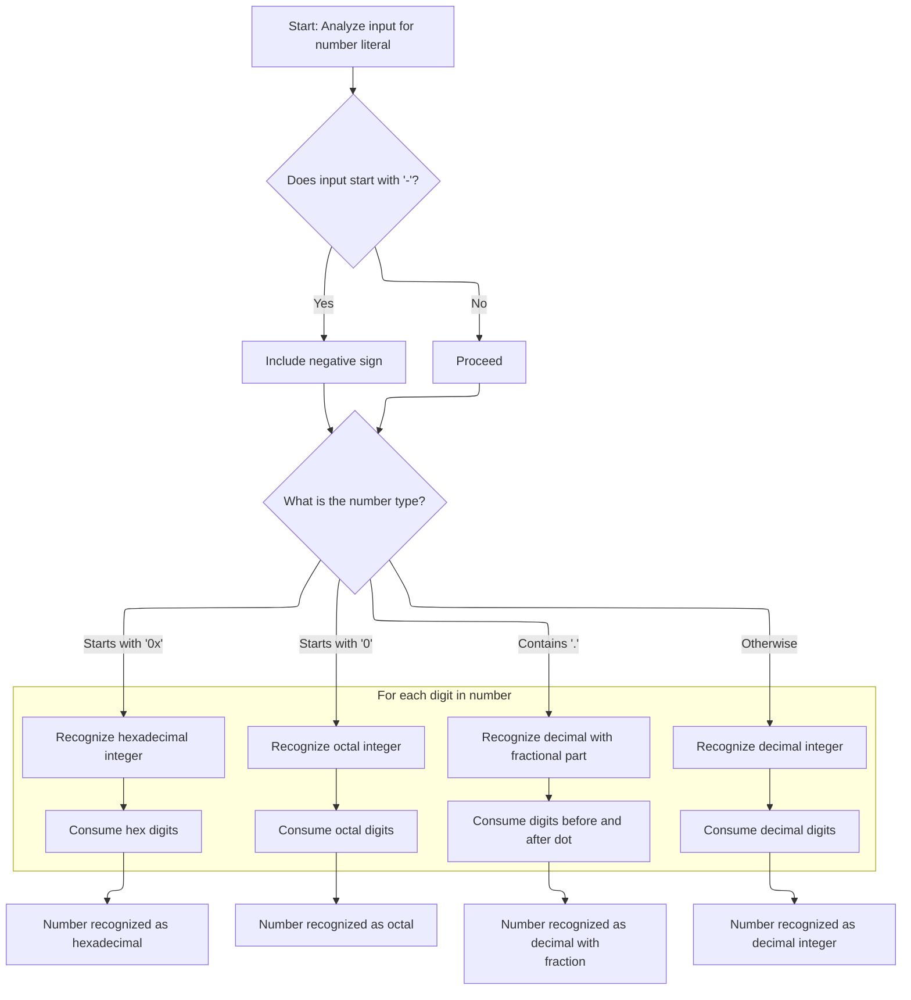
```mermaid
%%{init: {"flowchart": {"defaultRenderer": "elk"}} }%%
flowchart TD
  node1["Start: Analyze input for number literal"]
  click node1 openCode "core/src/main/java/org/apache/struts/validator/validwhen/ValidWhenLexer.java:250:251"
  node1 --> node2{"Does input start with '-'?"}
  click node2 openCode "core/src/main/java/org/apache/struts/validator/validwhen/ValidWhenLexer.java:264:268"
  node2 -->|"Yes"| node3["Include negative sign"]
  click node3 openCode "core/src/main/java/org/apache/struts/validator/validwhen/ValidWhenLexer.java:266:267"
  node2 -->|"No"| node4["Proceed"]
  click node4 openCode "core/src/main/java/org/apache/struts/validator/validwhen/ValidWhenLexer.java:269:273"
  node3 --> node5
  node4 --> node5
  node5{"What is the number type?"}
  click node5 openCode "core/src/main/java/org/apache/struts/validator/validwhen/ValidWhenLexer.java:255:256"
  node5 -->|"Starts with '0x'"| node6["Recognize hexadecimal integer"]
  click node6 openCode "core/src/main/java/org/apache/struts/validator/validwhen/ValidWhenLexer.java:362:411"
  node5 -->|"Starts with '0'"| node7["Recognize octal integer"]
  click node7 openCode "core/src/main/java/org/apache/struts/validator/validwhen/ValidWhenLexer.java:415:448"
  node5 -->|"Contains '.'"| node8["Recognize decimal with fractional part"]
  click node8 openCode "core/src/main/java/org/apache/struts/validator/validwhen/ValidWhenLexer.java:255:297"
  node5 -->|"Otherwise"| node9["Recognize decimal integer"]
  click node9 openCode "core/src/main/java/org/apache/struts/validator/validwhen/ValidWhenLexer.java:450:489"

  subgraph loop1["For each digit in number"]
    node6 --> node10["Consume hex digits"]
    click node10 openCode "core/src/main/java/org/apache/struts/validator/validwhen/ValidWhenLexer.java:383:406"
    node7 --> node11["Consume octal digits"]
    click node11 openCode "core/src/main/java/org/apache/struts/validator/validwhen/ValidWhenLexer.java:434:443"
    node8 --> node12["Consume digits before and after dot"]
    click node12 openCode "core/src/main/java/org/apache/struts/validator/validwhen/ValidWhenLexer.java:282:293"
    node9 --> node13["Consume decimal digits"]
    click node13 openCode "core/src/main/java/org/apache/struts/validator/validwhen/ValidWhenLexer.java:475:484"
  end
  node10 --> node14["Number recognized as hexadecimal"]
  click node14 openCode "core/src/main/java/org/apache/struts/validator/validwhen/ValidWhenLexer.java:410:411"
  node11 --> node15["Number recognized as octal"]
  click node15 openCode "core/src/main/java/org/apache/struts/validator/validwhen/ValidWhenLexer.java:447:448"
  node12 --> node16["Number recognized as decimal with
fraction"]
  click node16 openCode "core/src/main/java/org/apache/struts/validator/validwhen/ValidWhenLexer.java:296:297"
  node13 --> node17["Number recognized as decimal integer"]
  click node17 openCode "core/src/main/java/org/apache/struts/validator/validwhen/ValidWhenLexer.java:488:489"

classDef HeadingStyle fill:#777777,stroke:#333,stroke-width:2px;

%% Swimm:
%% %%{init: {"flowchart": {"defaultRenderer": "elk"}} }%%
%% flowchart TD
%%   node1["Start: Analyze input for number literal"]
%%   click node1 openCode "<SwmPath>[core/…/validwhen/ValidWhenLexer.java](core/src/main/java/org/apache/struts/validator/validwhen/ValidWhenLexer.java)</SwmPath>:250:251"
%%   node1 --> node2{"Does input start with '-'?"}
%%   click node2 openCode "<SwmPath>[core/…/validwhen/ValidWhenLexer.java](core/src/main/java/org/apache/struts/validator/validwhen/ValidWhenLexer.java)</SwmPath>:264:268"
%%   node2 -->|"Yes"| node3["Include negative sign"]
%%   click node3 openCode "<SwmPath>[core/…/validwhen/ValidWhenLexer.java](core/src/main/java/org/apache/struts/validator/validwhen/ValidWhenLexer.java)</SwmPath>:266:267"
%%   node2 -->|"No"| node4["Proceed"]
%%   click node4 openCode "<SwmPath>[core/…/validwhen/ValidWhenLexer.java](core/src/main/java/org/apache/struts/validator/validwhen/ValidWhenLexer.java)</SwmPath>:269:273"
%%   node3 --> node5
%%   node4 --> node5
%%   node5{"What is the number type?"}
%%   click node5 openCode "<SwmPath>[core/…/validwhen/ValidWhenLexer.java](core/src/main/java/org/apache/struts/validator/validwhen/ValidWhenLexer.java)</SwmPath>:255:256"
%%   node5 -->|"Starts with '0x'"| node6["Recognize hexadecimal integer"]
%%   click node6 openCode "<SwmPath>[core/…/validwhen/ValidWhenLexer.java](core/src/main/java/org/apache/struts/validator/validwhen/ValidWhenLexer.java)</SwmPath>:362:411"
%%   node5 -->|"Starts with '0'"| node7["Recognize octal integer"]
%%   click node7 openCode "<SwmPath>[core/…/validwhen/ValidWhenLexer.java](core/src/main/java/org/apache/struts/validator/validwhen/ValidWhenLexer.java)</SwmPath>:415:448"
%%   node5 -->|"Contains '.'"| node8["Recognize decimal with fractional part"]
%%   click node8 openCode "<SwmPath>[core/…/validwhen/ValidWhenLexer.java](core/src/main/java/org/apache/struts/validator/validwhen/ValidWhenLexer.java)</SwmPath>:255:297"
%%   node5 -->|"Otherwise"| node9["Recognize decimal integer"]
%%   click node9 openCode "<SwmPath>[core/…/validwhen/ValidWhenLexer.java](core/src/main/java/org/apache/struts/validator/validwhen/ValidWhenLexer.java)</SwmPath>:450:489"
%% 
%%   subgraph loop1["For each digit in number"]
%%     node6 --> node10["Consume hex digits"]
%%     click node10 openCode "<SwmPath>[core/…/validwhen/ValidWhenLexer.java](core/src/main/java/org/apache/struts/validator/validwhen/ValidWhenLexer.java)</SwmPath>:383:406"
%%     node7 --> node11["Consume octal digits"]
%%     click node11 openCode "<SwmPath>[core/…/validwhen/ValidWhenLexer.java](core/src/main/java/org/apache/struts/validator/validwhen/ValidWhenLexer.java)</SwmPath>:434:443"
%%     node8 --> node12["Consume digits before and after dot"]
%%     click node12 openCode "<SwmPath>[core/…/validwhen/ValidWhenLexer.java](core/src/main/java/org/apache/struts/validator/validwhen/ValidWhenLexer.java)</SwmPath>:282:293"
%%     node9 --> node13["Consume decimal digits"]
%%     click node13 openCode "<SwmPath>[core/…/validwhen/ValidWhenLexer.java](core/src/main/java/org/apache/struts/validator/validwhen/ValidWhenLexer.java)</SwmPath>:475:484"
%%   end
%%   node10 --> node14["Number recognized as hexadecimal"]
%%   click node14 openCode "<SwmPath>[core/…/validwhen/ValidWhenLexer.java](core/src/main/java/org/apache/struts/validator/validwhen/ValidWhenLexer.java)</SwmPath>:410:411"
%%   node11 --> node15["Number recognized as octal"]
%%   click node15 openCode "<SwmPath>[core/…/validwhen/ValidWhenLexer.java](core/src/main/java/org/apache/struts/validator/validwhen/ValidWhenLexer.java)</SwmPath>:447:448"
%%   node12 --> node16["Number recognized as decimal with
%% fraction"]
%%   click node16 openCode "<SwmPath>[core/…/validwhen/ValidWhenLexer.java](core/src/main/java/org/apache/struts/validator/validwhen/ValidWhenLexer.java)</SwmPath>:296:297"
%%   node13 --> node17["Number recognized as decimal integer"]
%%   click node17 openCode "<SwmPath>[core/…/validwhen/ValidWhenLexer.java](core/src/main/java/org/apache/struts/validator/validwhen/ValidWhenLexer.java)</SwmPath>:488:489"
%% 
%% classDef HeadingStyle fill:#777777,stroke:#333,stroke-width:2px;
```

<SwmSnippet path="/core/src/main/java/org/apache/struts/validator/validwhen/ValidWhenLexer.java" line="250">

---

In <SwmToken path="core/src/main/java/org/apache/struts/validator/validwhen/ValidWhenLexer.java" pos="250:7:7" line-data="	public final void mDECIMAL_LITERAL(boolean _createToken) throws RecognitionException, CharStreamException, TokenStreamException {">`mDECIMAL_LITERAL`</SwmToken>, we use lookahead and syntactic predicates to figure out which numeric format we're dealing with—could be decimal, hex, octal, or floating point. We mark and rewind input as needed, and use token sets to guide parsing.

```java
	public final void mDECIMAL_LITERAL(boolean _createToken) throws RecognitionException, CharStreamException, TokenStreamException {
		int _ttype; Token _token=null; int _begin=text.length();
		_ttype = DECIMAL_LITERAL;
		int _saveIndex;
		
		boolean synPredMatched24 = false;
		if (((_tokenSet_0.member(LA(1))) && (_tokenSet_1.member(LA(2))))) {
			int _m24 = mark();
			synPredMatched24 = true;
			inputState.guessing++;
			try {
				{
				{
				switch ( LA(1)) {
				case '-':
				{
					match('-');
					break;
				}
				case '0':  case '1':  case '2':  case '3':
				case '4':  case '5':  case '6':  case '7':
				case '8':  case '9':
				{
					break;
				}
				default:
				{
					throw new NoViableAltForCharException((char)LA(1), getFilename(), getLine(), getColumn());
				}
				}
				}
				{
				int _cnt22=0;
				_loop22:
				do {
					if (((LA(1) >= '0' && LA(1) <= '9'))) {
						matchRange('0','9');
					}
					else {
						if ( _cnt22>=1 ) { break _loop22; } else {throw new NoViableAltForCharException((char)LA(1), getFilename(), getLine(), getColumn());}
					}
					
					_cnt22++;
				} while (true);
```

---

</SwmSnippet>

<SwmSnippet path="/core/src/main/java/org/apache/struts/validator/validwhen/ValidWhenLexer.java" line="296">

---

Here we're matching digits before and after the decimal point for floating point literals. If the input doesn't fit, we move to check for hex or octal formats next.

```java
				match('.');
				}
				}
			}
			catch (RecognitionException pe) {
				synPredMatched24 = false;
			}
			rewind(_m24);
inputState.guessing--;
		}
		if ( synPredMatched24 ) {
			{
			{
			switch ( LA(1)) {
			case '-':
			{
				match('-');
				break;
			}
			case '0':  case '1':  case '2':  case '3':
			case '4':  case '5':  case '6':  case '7':
			case '8':  case '9':
			{
				break;
			}
			default:
			{
				throw new NoViableAltForCharException((char)LA(1), getFilename(), getLine(), getColumn());
			}
			}
			}
			{
			int _cnt28=0;
			_loop28:
			do {
				if (((LA(1) >= '0' && LA(1) <= '9'))) {
					matchRange('0','9');
				}
				else {
					if ( _cnt28>=1 ) { break _loop28; } else {throw new NoViableAltForCharException((char)LA(1), getFilename(), getLine(), getColumn());}
				}
				
				_cnt28++;
			} while (true);
```

---

</SwmSnippet>

<SwmSnippet path="/core/src/main/java/org/apache/struts/validator/validwhen/ValidWhenLexer.java" line="342">

---

Now we're looping to match digits after the decimal point, making sure the floating point literal is valid. If there's no digit, we throw an error and bail.

```java
			match('.');
			}
			{
			int _cnt31=0;
			_loop31:
			do {
				if (((LA(1) >= '0' && LA(1) <= '9'))) {
					matchRange('0','9');
				}
				else {
					if ( _cnt31>=1 ) { break _loop31; } else {throw new NoViableAltForCharException((char)LA(1), getFilename(), getLine(), getColumn());}
				}
				
				_cnt31++;
			} while (true);
```

---

</SwmSnippet>

<SwmSnippet path="/core/src/main/java/org/apache/struts/validator/validwhen/ValidWhenLexer.java" line="361">

---

Here we're marking and rewinding input to check for hex literals ('0x'), using lookahead and token sets to handle ambiguous input. If it matches, we parse hex; otherwise, we check for octal or decimal formats.

```java
			boolean synPredMatched38 = false;
			if (((LA(1)=='0') && (LA(2)=='x'))) {
				int _m38 = mark();
				synPredMatched38 = true;
				inputState.guessing++;
				try {
					{
					match('0');
					match('x');
					}
				}
				catch (RecognitionException pe) {
					synPredMatched38 = false;
				}
				rewind(_m38);
inputState.guessing--;
			}
			if ( synPredMatched38 ) {
				{
				match('0');
				match('x');
				{
				int _cnt41=0;
				_loop41:
				do {
					switch ( LA(1)) {
					case '0':  case '1':  case '2':  case '3':
					case '4':  case '5':  case '6':  case '7':
					case '8':  case '9':
					{
						matchRange('0','9');
						break;
					}
					case 'a':  case 'b':  case 'c':  case 'd':
					case 'e':  case 'f':
					{
						matchRange('a','f');
						break;
					}
					default:
					{
						if ( _cnt41>=1 ) { break _loop41; } else {throw new NoViableAltForCharException((char)LA(1), getFilename(), getLine(), getColumn());}
					}
					}
					_cnt41++;
				} while (true);
```

---

</SwmSnippet>

<SwmSnippet path="/core/src/main/java/org/apache/struts/validator/validwhen/ValidWhenLexer.java" line="409">

---

After hex parsing, we check for octal by matching '0' and looping through octal digits. If it's not octal, we move on to decimal integer parsing, setting the token type as we go.

```java
				if ( inputState.guessing==0 ) {
					_ttype = HEX_INT_LITERAL;
				}
			}
			else {
				boolean synPredMatched33 = false;
				if (((LA(1)=='0') && (true))) {
					int _m33 = mark();
					synPredMatched33 = true;
					inputState.guessing++;
					try {
						{
						match('0');
						}
					}
					catch (RecognitionException pe) {
						synPredMatched33 = false;
					}
					rewind(_m33);
inputState.guessing--;
				}
				if ( synPredMatched33 ) {
					{
					match('0');
					{
					_loop36:
					do {
						if (((LA(1) >= '0' && LA(1) <= '7'))) {
							matchRange('0','7');
						}
						else {
							break _loop36;
						}
						
					} while (true);
```

---

</SwmSnippet>

<SwmSnippet path="/core/src/main/java/org/apache/struts/validator/validwhen/ValidWhenLexer.java" line="446">

---

Here we're handling decimal integer parsing if the input isn't octal. We match digits 1-9 and loop through the rest. Next, we call ActionConfigMatcher to check for further configuration matching.

```java
					if ( inputState.guessing==0 ) {
						_ttype = OCTAL_INT_LITERAL;
					}
				}
				else if ((_tokenSet_2.member(LA(1))) && (true)) {
					{
					{
					switch ( LA(1)) {
					case '-':
					{
						match('-');
						break;
					}
					case '1':  case '2':  case '3':  case '4':
					case '5':  case '6':  case '7':  case '8':
					case '9':
					{
						break;
					}
```

---

</SwmSnippet>

<SwmSnippet path="/core/src/main/java/org/apache/struts/validator/validwhen/ValidWhenLexer.java" line="465">

---

Just returned from ActionConfigMatcher, now in <SwmToken path="core/src/main/java/org/apache/struts/validator/validwhen/ValidWhenLexer.java" pos="1:25:25" line-data="// $ANTLR 2.7.7 (20060906): &quot;ValidWhenParser.g&quot; -&gt; &quot;ValidWhenLexer.java&quot;$">`ValidWhenLexer`</SwmToken> we're matching decimal integer digits and looping through them. The matcher config can affect how we interpret these tokens for validation.

```java
					default:
					{
						throw new NoViableAltForCharException((char)LA(1), getFilename(), getLine(), getColumn());
					}
					}
					}
					{
					matchRange('1','9');
					}
					{
					_loop46:
					do {
						if (((LA(1) >= '0' && LA(1) <= '9'))) {
							matchRange('0','9');
						}
						else {
							break _loop46;
						}
						
					} while (true);
```

---

</SwmSnippet>

<SwmSnippet path="/core/src/main/java/org/apache/struts/validator/validwhen/ValidWhenLexer.java" line="487">

---

After parsing, we return a token of the matched type—could be decimal, hex, octal, or integer—depending on the input. If <SwmToken path="core/src/main/java/org/apache/struts/validator/validwhen/ValidWhenLexer.java" pos="495:5:5" line-data="				if ( _createToken &amp;&amp; _token==null &amp;&amp; _ttype!=Token.SKIP ) {">`_createToken`</SwmToken> is true, we build the token and set its text.

```java
					if ( inputState.guessing==0 ) {
						_ttype = DEC_INT_LITERAL;
					}
				}
				else {
					throw new NoViableAltForCharException((char)LA(1), getFilename(), getLine(), getColumn());
				}
				}}
				if ( _createToken && _token==null && _ttype!=Token.SKIP ) {
					_token = makeToken(_ttype);
					_token.setText(new String(text.getBuffer(), _begin, text.length()-_begin));
				}
				_returnToken = _token;
			}
```

---

</SwmSnippet>

### Matching String Literals

<SwmSnippet path="/core/src/main/java/org/apache/struts/validator/validwhen/ValidWhenLexer.java" line="99">

---

Just returned from <SwmToken path="core/src/main/java/org/apache/struts/validator/validwhen/ValidWhenLexer.java" pos="1:25:25" line-data="// $ANTLR 2.7.7 (20060906): &quot;ValidWhenParser.g&quot; -&gt; &quot;ValidWhenLexer.java&quot;$">`ValidWhenLexer`</SwmToken>, now we're matching string literals. We call <SwmToken path="core/src/main/java/org/apache/struts/validator/validwhen/ValidWhenLexer.java" pos="101:1:1" line-data="					mSTRING_LITERAL(true);">`mSTRING_LITERAL`</SwmToken> when we hit a quote, and keep parsing to handle quoted input.

```java
				case '"':  case '\'':
				{
					mSTRING_LITERAL(true);
					theRetToken=_returnToken;
					break;
				}
```

---

</SwmSnippet>

### Parsing Quoted String Literals

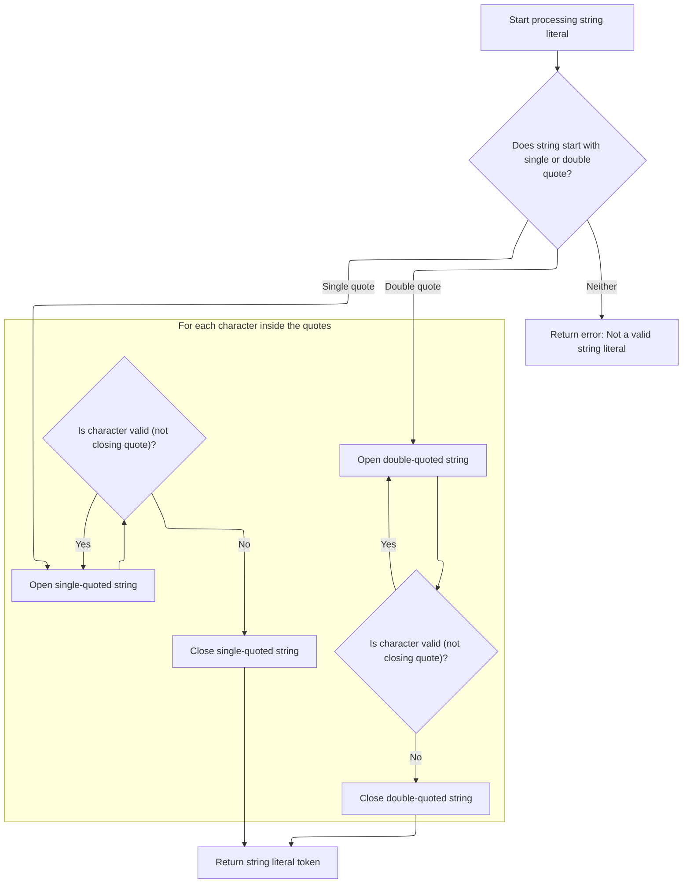
```mermaid
%%{init: {"flowchart": {"defaultRenderer": "elk"}} }%%
flowchart TD
  node1["Start processing string literal"]
  click node1 openCode "core/src/main/java/org/apache/struts/validator/validwhen/ValidWhenLexer.java:502:507"
  node1 --> node2{"Does string start with single or double
quote?"}
  click node2 openCode "core/src/main/java/org/apache/struts/validator/validwhen/ValidWhenLexer.java:507:507"
  node2 -->|"Single quote"| node3["Open single-quoted string"]
  click node3 openCode "core/src/main/java/org/apache/struts/validator/validwhen/ValidWhenLexer.java:508:528"
  node2 -->|"Double quote"| node4["Open double-quoted string"]
  click node4 openCode "core/src/main/java/org/apache/struts/validator/validwhen/ValidWhenLexer.java:530:550"
  node2 -->|"Neither"| node7["Return error: Not a valid string literal"]
  click node7 openCode "core/src/main/java/org/apache/struts/validator/validwhen/ValidWhenLexer.java:552:555"

  subgraph loop1["For each character inside the quotes"]
    node3 --> node5{"Is character valid (not closing quote)?"}
    click node5 openCode "core/src/main/java/org/apache/struts/validator/validwhen/ValidWhenLexer.java:513:524"
    node4 --> node6{"Is character valid (not closing quote)?"}
    click node6 openCode "core/src/main/java/org/apache/struts/validator/validwhen/ValidWhenLexer.java:535:546"
    node5 -->|"Yes"| node3
    node5 -->|"No"| node8["Close single-quoted string"]
    click node8 openCode "core/src/main/java/org/apache/struts/validator/validwhen/ValidWhenLexer.java:526:528"
    node6 -->|"Yes"| node4
    node6 -->|"No"| node9["Close double-quoted string"]
    click node9 openCode "core/src/main/java/org/apache/struts/validator/validwhen/ValidWhenLexer.java:548:550"
  end

  node8 --> node10["Return string literal token"]
  click node10 openCode "core/src/main/java/org/apache/struts/validator/validwhen/ValidWhenLexer.java:557:562"
  node9 --> node10
classDef HeadingStyle fill:#777777,stroke:#333,stroke-width:2px;

%% Swimm:
%% %%{init: {"flowchart": {"defaultRenderer": "elk"}} }%%
%% flowchart TD
%%   node1["Start processing string literal"]
%%   click node1 openCode "<SwmPath>[core/…/validwhen/ValidWhenLexer.java](core/src/main/java/org/apache/struts/validator/validwhen/ValidWhenLexer.java)</SwmPath>:502:507"
%%   node1 --> node2{"Does string start with single or double
%% quote?"}
%%   click node2 openCode "<SwmPath>[core/…/validwhen/ValidWhenLexer.java](core/src/main/java/org/apache/struts/validator/validwhen/ValidWhenLexer.java)</SwmPath>:507:507"
%%   node2 -->|"Single quote"| node3["Open single-quoted string"]
%%   click node3 openCode "<SwmPath>[core/…/validwhen/ValidWhenLexer.java](core/src/main/java/org/apache/struts/validator/validwhen/ValidWhenLexer.java)</SwmPath>:508:528"
%%   node2 -->|"Double quote"| node4["Open double-quoted string"]
%%   click node4 openCode "<SwmPath>[core/…/validwhen/ValidWhenLexer.java](core/src/main/java/org/apache/struts/validator/validwhen/ValidWhenLexer.java)</SwmPath>:530:550"
%%   node2 -->|"Neither"| node7["Return error: Not a valid string literal"]
%%   click node7 openCode "<SwmPath>[core/…/validwhen/ValidWhenLexer.java](core/src/main/java/org/apache/struts/validator/validwhen/ValidWhenLexer.java)</SwmPath>:552:555"
%% 
%%   subgraph loop1["For each character inside the quotes"]
%%     node3 --> node5{"Is character valid (not closing quote)?"}
%%     click node5 openCode "<SwmPath>[core/…/validwhen/ValidWhenLexer.java](core/src/main/java/org/apache/struts/validator/validwhen/ValidWhenLexer.java)</SwmPath>:513:524"
%%     node4 --> node6{"Is character valid (not closing quote)?"}
%%     click node6 openCode "<SwmPath>[core/…/validwhen/ValidWhenLexer.java](core/src/main/java/org/apache/struts/validator/validwhen/ValidWhenLexer.java)</SwmPath>:535:546"
%%     node5 -->|"Yes"| node3
%%     node5 -->|"No"| node8["Close single-quoted string"]
%%     click node8 openCode "<SwmPath>[core/…/validwhen/ValidWhenLexer.java](core/src/main/java/org/apache/struts/validator/validwhen/ValidWhenLexer.java)</SwmPath>:526:528"
%%     node6 -->|"Yes"| node4
%%     node6 -->|"No"| node9["Close double-quoted string"]
%%     click node9 openCode "<SwmPath>[core/…/validwhen/ValidWhenLexer.java](core/src/main/java/org/apache/struts/validator/validwhen/ValidWhenLexer.java)</SwmPath>:548:550"
%%   end
%% 
%%   node8 --> node10["Return string literal token"]
%%   click node10 openCode "<SwmPath>[core/…/validwhen/ValidWhenLexer.java](core/src/main/java/org/apache/struts/validator/validwhen/ValidWhenLexer.java)</SwmPath>:557:562"
%%   node9 --> node10
%% classDef HeadingStyle fill:#777777,stroke:#333,stroke-width:2px;
```

<SwmSnippet path="/core/src/main/java/org/apache/struts/validator/validwhen/ValidWhenLexer.java" line="502">

---

In <SwmToken path="core/src/main/java/org/apache/struts/validator/validwhen/ValidWhenLexer.java" pos="502:7:7" line-data="	public final void mSTRING_LITERAL(boolean _createToken) throws RecognitionException, CharStreamException, TokenStreamException {">`mSTRING_LITERAL`</SwmToken>, we match the opening quote, loop through valid characters using <SwmToken path="core/src/main/java/org/apache/struts/validator/validwhen/ValidWhenLexer.java" pos="516:5:5" line-data="				if ((_tokenSet_3.member(LA(1)))) {">`_tokenSet_3`</SwmToken> or <SwmToken path="core/src/main/java/org/apache/struts/validator/validwhen/ValidWhenLexer.java" pos="538:5:5" line-data="				if ((_tokenSet_4.member(LA(1)))) {">`_tokenSet_4`</SwmToken>, and match the closing quote. If the input isn't valid, we throw an error.

```java
	public final void mSTRING_LITERAL(boolean _createToken) throws RecognitionException, CharStreamException, TokenStreamException {
		int _ttype; Token _token=null; int _begin=text.length();
		_ttype = STRING_LITERAL;
		int _saveIndex;
		
		switch ( LA(1)) {
		case '\'':
		{
			{
			match('\'');
			{
			int _cnt50=0;
			_loop50:
			do {
				if ((_tokenSet_3.member(LA(1)))) {
					matchNot('\'');
				}
				else {
					if ( _cnt50>=1 ) { break _loop50; } else {throw new NoViableAltForCharException((char)LA(1), getFilename(), getLine(), getColumn());}
				}
				
				_cnt50++;
			} while (true);
```

---

</SwmSnippet>

<SwmSnippet path="/core/src/main/java/org/apache/struts/validator/validwhen/ValidWhenLexer.java" line="526">

---

Here we're looping through valid characters inside the quotes, using token sets to restrict what's allowed. If the closing quote is missing, we throw an error.

```java
			match('\'');
			}
			break;
		}
		case '"':
		{
			{
			match('\"');
			{
			int _cnt53=0;
			_loop53:
			do {
				if ((_tokenSet_4.member(LA(1)))) {
					matchNot('\"');
				}
				else {
					if ( _cnt53>=1 ) { break _loop53; } else {throw new NoViableAltForCharException((char)LA(1), getFilename(), getLine(), getColumn());}
				}
				
				_cnt53++;
			} while (true);
```

---

</SwmSnippet>

<SwmSnippet path="/core/src/main/java/org/apache/struts/validator/validwhen/ValidWhenLexer.java" line="548">

---

Here we assume we're at the start of a string literal, match the opening quote, parse the contents, and match the closing quote. Next, we call ActionConfigMatcher to check for further configuration matching.

```java
			match('\"');
			}
			break;
		}
		default:
		{
			throw new NoViableAltForCharException((char)LA(1), getFilename(), getLine(), getColumn());
		}
		}
```

---

</SwmSnippet>

<SwmSnippet path="/core/src/main/java/org/apache/struts/validator/validwhen/ValidWhenLexer.java" line="557">

---

Just returned from ActionConfigMatcher, now at the end of <SwmToken path="core/src/main/java/org/apache/struts/validator/validwhen/ValidWhenLexer.java" pos="101:1:1" line-data="					mSTRING_LITERAL(true);">`mSTRING_LITERAL`</SwmToken> we create the token if needed and return it. The matcher config can affect which string tokens are valid.

```java
		if ( _createToken && _token==null && _ttype!=Token.SKIP ) {
			_token = makeToken(_ttype);
			_token.setText(new String(text.getBuffer(), _begin, text.length()-_begin));
		}
		_returnToken = _token;
	}
```

---

</SwmSnippet>

### Matching Bracket Tokens

<SwmSnippet path="/core/src/main/java/org/apache/struts/validator/validwhen/ValidWhenLexer.java" line="105">

---

Just returned from <SwmToken path="core/src/main/java/org/apache/struts/validator/validwhen/ValidWhenLexer.java" pos="1:25:25" line-data="// $ANTLR 2.7.7 (20060906): &quot;ValidWhenParser.g&quot; -&gt; &quot;ValidWhenLexer.java&quot;$">`ValidWhenLexer`</SwmToken>, now we're matching bracket tokens. We call <SwmToken path="core/src/main/java/org/apache/struts/validator/validwhen/ValidWhenLexer.java" pos="107:1:1" line-data="					mLBRACKET(true);">`mLBRACKET`</SwmToken> for '\[', and keep parsing to handle bracketed input.

```java
				case '[':
				{
					mLBRACKET(true);
					theRetToken=_returnToken;
					break;
				}
```

---

</SwmSnippet>

### Parsing Left Bracket Tokens

<SwmSnippet path="/core/src/main/java/org/apache/struts/validator/validwhen/ValidWhenLexer.java" line="564">

---

In <SwmToken path="core/src/main/java/org/apache/struts/validator/validwhen/ValidWhenLexer.java" pos="564:7:7" line-data="	public final void mLBRACKET(boolean _createToken) throws RecognitionException, CharStreamException, TokenStreamException {">`mLBRACKET`</SwmToken>, we match the '\[' character and create a token for it. Next, we call ActionConfigMatcher to check for further configuration matching.

```java
	public final void mLBRACKET(boolean _createToken) throws RecognitionException, CharStreamException, TokenStreamException {
		int _ttype; Token _token=null; int _begin=text.length();
		_ttype = LBRACKET;
		int _saveIndex;
		
		match('[');
```

---

</SwmSnippet>

<SwmSnippet path="/core/src/main/java/org/apache/struts/validator/validwhen/ValidWhenLexer.java" line="570">

---

Just returned from ActionConfigMatcher, now at the end of <SwmToken path="core/src/main/java/org/apache/struts/validator/validwhen/ValidWhenLexer.java" pos="107:1:1" line-data="					mLBRACKET(true);">`mLBRACKET`</SwmToken> we create the token if needed and return it. The matcher config can affect which bracket tokens are valid.

```java
		if ( _createToken && _token==null && _ttype!=Token.SKIP ) {
			_token = makeToken(_ttype);
			_token.setText(new String(text.getBuffer(), _begin, text.length()-_begin));
		}
		_returnToken = _token;
	}
```

---

</SwmSnippet>

### Matching Right Bracket Tokens

<SwmSnippet path="/core/src/main/java/org/apache/struts/validator/validwhen/ValidWhenLexer.java" line="111">

---

Just returned from <SwmToken path="core/src/main/java/org/apache/struts/validator/validwhen/ValidWhenLexer.java" pos="1:25:25" line-data="// $ANTLR 2.7.7 (20060906): &quot;ValidWhenParser.g&quot; -&gt; &quot;ValidWhenLexer.java&quot;$">`ValidWhenLexer`</SwmToken>, now we're matching right bracket tokens. We call <SwmToken path="core/src/main/java/org/apache/struts/validator/validwhen/ValidWhenLexer.java" pos="113:1:1" line-data="					mRBRACKET(true);">`mRBRACKET`</SwmToken> for '\]', and keep parsing to handle bracketed input.

```java
				case ']':
				{
					mRBRACKET(true);
					theRetToken=_returnToken;
					break;
				}
```

---

</SwmSnippet>

### Handling Right Bracket Parsing

```mermaid
%%{init: {"flowchart": {"defaultRenderer": "elk"}} }%%
flowchart TD
  node1["#quot;Match right bracket '"]' in input"]
  click node1 openCode "core/src/main/java/org/apache/struts/validator/validwhen/ValidWhenLexer.java:582:582"
  node1 --> node2{"Create token? (_createToken &&
_token==null && _ttype!=Token.SKIP)"}
  click node2 openCode "core/src/main/java/org/apache/struts/validator/validwhen/ValidWhenLexer.java:583:583"
  node2 -->|"Yes"| node3["Create token and set its text"]
  click node3 openCode "core/src/main/java/org/apache/struts/validator/validwhen/ValidWhenLexer.java:584:585"
  node3 --> node4["Return token (created)"]
  click node4 openCode "core/src/main/java/org/apache/struts/validator/validwhen/ValidWhenLexer.java:587:588"
  node2 -->|"No"| node5["Return token (null or unchanged)"]
  click node5 openCode "core/src/main/java/org/apache/struts/validator/validwhen/ValidWhenLexer.java:587:588"
classDef HeadingStyle fill:#777777,stroke:#333,stroke-width:2px;

%% Swimm:
%% %%{init: {"flowchart": {"defaultRenderer": "elk"}} }%%
%% flowchart TD
%%   node1["#quot;Match right bracket '"]' in input"]
%%   click node1 openCode "<SwmPath>[core/…/validwhen/ValidWhenLexer.java](core/src/main/java/org/apache/struts/validator/validwhen/ValidWhenLexer.java)</SwmPath>:582:582"
%%   node1 --> node2{"Create token? (<SwmToken path="core/src/main/java/org/apache/struts/validator/validwhen/ValidWhenLexer.java" pos="250:11:11" line-data="	public final void mDECIMAL_LITERAL(boolean _createToken) throws RecognitionException, CharStreamException, TokenStreamException {">`_createToken`</SwmToken> &&
%% _token==null && _ttype!=<SwmToken path="core/src/main/java/org/apache/struts/validator/validwhen/ValidWhenLexer.java" pos="495:17:19" line-data="				if ( _createToken &amp;&amp; _token==null &amp;&amp; _ttype!=Token.SKIP ) {">`Token.SKIP`</SwmToken>)"}
%%   click node2 openCode "<SwmPath>[core/…/validwhen/ValidWhenLexer.java](core/src/main/java/org/apache/struts/validator/validwhen/ValidWhenLexer.java)</SwmPath>:583:583"
%%   node2 -->|"Yes"| node3["Create token and set its text"]
%%   click node3 openCode "<SwmPath>[core/…/validwhen/ValidWhenLexer.java](core/src/main/java/org/apache/struts/validator/validwhen/ValidWhenLexer.java)</SwmPath>:584:585"
%%   node3 --> node4["Return token (created)"]
%%   click node4 openCode "<SwmPath>[core/…/validwhen/ValidWhenLexer.java](core/src/main/java/org/apache/struts/validator/validwhen/ValidWhenLexer.java)</SwmPath>:587:588"
%%   node2 -->|"No"| node5["Return token (null or unchanged)"]
%%   click node5 openCode "<SwmPath>[core/…/validwhen/ValidWhenLexer.java](core/src/main/java/org/apache/struts/validator/validwhen/ValidWhenLexer.java)</SwmPath>:587:588"
%% classDef HeadingStyle fill:#777777,stroke:#333,stroke-width:2px;
```

<SwmSnippet path="/core/src/main/java/org/apache/struts/validator/validwhen/ValidWhenLexer.java" line="577">

---

In <SwmToken path="core/src/main/java/org/apache/struts/validator/validwhen/ValidWhenLexer.java" pos="577:7:7" line-data="	public final void mRBRACKET(boolean _createToken) throws RecognitionException, CharStreamException, TokenStreamException {">`mRBRACKET`</SwmToken>, we match the '\]' character and set up the token. We need to call ActionConfigMatcher next to check if this token is allowed by the current config, which can affect validation downstream.

```java
	public final void mRBRACKET(boolean _createToken) throws RecognitionException, CharStreamException, TokenStreamException {
		int _ttype; Token _token=null; int _begin=text.length();
		_ttype = RBRACKET;
		int _saveIndex;
		
		match(']');
```

---

</SwmSnippet>

<SwmSnippet path="/core/src/main/java/org/apache/struts/validator/validwhen/ValidWhenLexer.java" line="583">

---

Just returned from ActionConfigMatcher, now at the end of <SwmToken path="core/src/main/java/org/apache/struts/validator/validwhen/ValidWhenLexer.java" pos="113:1:1" line-data="					mRBRACKET(true);">`mRBRACKET`</SwmToken> we only create and return the token if it's not marked as SKIP. The matcher config can suppress token creation if needed.

```java
		if ( _createToken && _token==null && _ttype!=Token.SKIP ) {
			_token = makeToken(_ttype);
			_token.setText(new String(text.getBuffer(), _begin, text.length()-_begin));
		}
		_returnToken = _token;
	}
```

---

</SwmSnippet>

### Parsing Parenthesis Tokens

<SwmSnippet path="/core/src/main/java/org/apache/struts/validator/validwhen/ValidWhenLexer.java" line="117">

---

Just returned from <SwmToken path="core/src/main/java/org/apache/struts/validator/validwhen/ValidWhenLexer.java" pos="1:25:25" line-data="// $ANTLR 2.7.7 (20060906): &quot;ValidWhenParser.g&quot; -&gt; &quot;ValidWhenLexer.java&quot;$">`ValidWhenLexer`</SwmToken>, now we're checking for '(' and calling <SwmToken path="core/src/main/java/org/apache/struts/validator/validwhen/ValidWhenLexer.java" pos="119:1:1" line-data="					mLPAREN(true);">`mLPAREN`</SwmToken> to handle token creation. We need to call <SwmToken path="core/src/main/java/org/apache/struts/validator/validwhen/ValidWhenLexer.java" pos="1:25:25" line-data="// $ANTLR 2.7.7 (20060906): &quot;ValidWhenParser.g&quot; -&gt; &quot;ValidWhenLexer.java&quot;$">`ValidWhenLexer`</SwmToken> again to keep parsing the next token in the stream.

```java
				case '(':
				{
					mLPAREN(true);
					theRetToken=_returnToken;
					break;
				}
```

---

</SwmSnippet>

### Handling Left Parenthesis Parsing

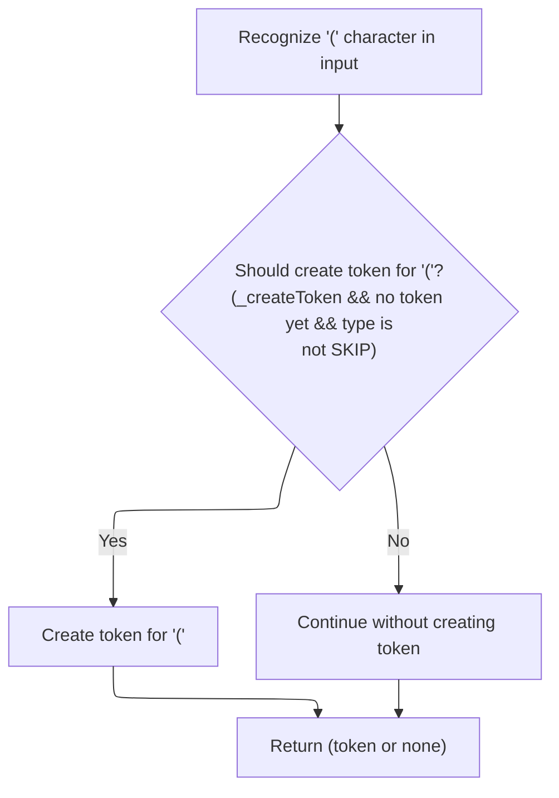
```mermaid
%%{init: {"flowchart": {"defaultRenderer": "elk"}} }%%
flowchart TD
  node1["Recognize '(' character in input"]
  click node1 openCode "core/src/main/java/org/apache/struts/validator/validwhen/ValidWhenLexer.java:595:595"
  node1 --> node2{"Should create token for '('?
(_createToken && no token yet && type is
not SKIP)"}
  click node2 openCode "core/src/main/java/org/apache/struts/validator/validwhen/ValidWhenLexer.java:596:599"
  node2 -->|"Yes"| node3["Create token for '('"]
  click node3 openCode "core/src/main/java/org/apache/struts/validator/validwhen/ValidWhenLexer.java:597:598"
  node2 -->|"No"| node4["Continue without creating token"]
  click node4 openCode "core/src/main/java/org/apache/struts/validator/validwhen/ValidWhenLexer.java:599:601"
  node3 --> node5["Return (token or none)"]
  node4 --> node5
  click node5 openCode "core/src/main/java/org/apache/struts/validator/validwhen/ValidWhenLexer.java:600:601"

classDef HeadingStyle fill:#777777,stroke:#333,stroke-width:2px;

%% Swimm:
%% %%{init: {"flowchart": {"defaultRenderer": "elk"}} }%%
%% flowchart TD
%%   node1["Recognize '(' character in input"]
%%   click node1 openCode "<SwmPath>[core/…/validwhen/ValidWhenLexer.java](core/src/main/java/org/apache/struts/validator/validwhen/ValidWhenLexer.java)</SwmPath>:595:595"
%%   node1 --> node2{"Should create token for '('?
%% (<SwmToken path="core/src/main/java/org/apache/struts/validator/validwhen/ValidWhenLexer.java" pos="250:11:11" line-data="	public final void mDECIMAL_LITERAL(boolean _createToken) throws RecognitionException, CharStreamException, TokenStreamException {">`_createToken`</SwmToken> && no token yet && type is
%% not SKIP)"}
%%   click node2 openCode "<SwmPath>[core/…/validwhen/ValidWhenLexer.java](core/src/main/java/org/apache/struts/validator/validwhen/ValidWhenLexer.java)</SwmPath>:596:599"
%%   node2 -->|"Yes"| node3["Create token for '('"]
%%   click node3 openCode "<SwmPath>[core/…/validwhen/ValidWhenLexer.java](core/src/main/java/org/apache/struts/validator/validwhen/ValidWhenLexer.java)</SwmPath>:597:598"
%%   node2 -->|"No"| node4["Continue without creating token"]
%%   click node4 openCode "<SwmPath>[core/…/validwhen/ValidWhenLexer.java](core/src/main/java/org/apache/struts/validator/validwhen/ValidWhenLexer.java)</SwmPath>:599:601"
%%   node3 --> node5["Return (token or none)"]
%%   node4 --> node5
%%   click node5 openCode "<SwmPath>[core/…/validwhen/ValidWhenLexer.java](core/src/main/java/org/apache/struts/validator/validwhen/ValidWhenLexer.java)</SwmPath>:600:601"
%% 
%% classDef HeadingStyle fill:#777777,stroke:#333,stroke-width:2px;
```

<SwmSnippet path="/core/src/main/java/org/apache/struts/validator/validwhen/ValidWhenLexer.java" line="590">

---

In <SwmToken path="core/src/main/java/org/apache/struts/validator/validwhen/ValidWhenLexer.java" pos="590:7:7" line-data="	public final void mLPAREN(boolean _createToken) throws RecognitionException, CharStreamException, TokenStreamException {">`mLPAREN`</SwmToken>, we match the '(' character and set up the token. We call ActionConfigMatcher next to check if this token is allowed by the current config, which can affect validation downstream.

```java
	public final void mLPAREN(boolean _createToken) throws RecognitionException, CharStreamException, TokenStreamException {
		int _ttype; Token _token=null; int _begin=text.length();
		_ttype = LPAREN;
		int _saveIndex;
		
		match('(');
```

---

</SwmSnippet>

<SwmSnippet path="/core/src/main/java/org/apache/struts/validator/validwhen/ValidWhenLexer.java" line="596">

---

Just returned from ActionConfigMatcher, now at the end of <SwmToken path="core/src/main/java/org/apache/struts/validator/validwhen/ValidWhenLexer.java" pos="119:1:1" line-data="					mLPAREN(true);">`mLPAREN`</SwmToken> we only create and return the token if it's not marked as SKIP. The matcher config can suppress token creation if needed.

```java
		if ( _createToken && _token==null && _ttype!=Token.SKIP ) {
			_token = makeToken(_ttype);
			_token.setText(new String(text.getBuffer(), _begin, text.length()-_begin));
		}
		_returnToken = _token;
	}
```

---

</SwmSnippet>

### Parsing Closing Parenthesis Tokens

<SwmSnippet path="/core/src/main/java/org/apache/struts/validator/validwhen/ValidWhenLexer.java" line="123">

---

Just returned from <SwmToken path="core/src/main/java/org/apache/struts/validator/validwhen/ValidWhenLexer.java" pos="1:25:25" line-data="// $ANTLR 2.7.7 (20060906): &quot;ValidWhenParser.g&quot; -&gt; &quot;ValidWhenLexer.java&quot;$">`ValidWhenLexer`</SwmToken>, now we're checking for ')' and calling <SwmToken path="core/src/main/java/org/apache/struts/validator/validwhen/ValidWhenLexer.java" pos="125:1:1" line-data="					mRPAREN(true);">`mRPAREN`</SwmToken> to handle token creation. We need to call <SwmToken path="core/src/main/java/org/apache/struts/validator/validwhen/ValidWhenLexer.java" pos="1:25:25" line-data="// $ANTLR 2.7.7 (20060906): &quot;ValidWhenParser.g&quot; -&gt; &quot;ValidWhenLexer.java&quot;$">`ValidWhenLexer`</SwmToken> again to keep parsing the next token in the stream.

```java
				case ')':
				{
					mRPAREN(true);
					theRetToken=_returnToken;
					break;
				}
```

---

</SwmSnippet>

### Handling Right Parenthesis Parsing

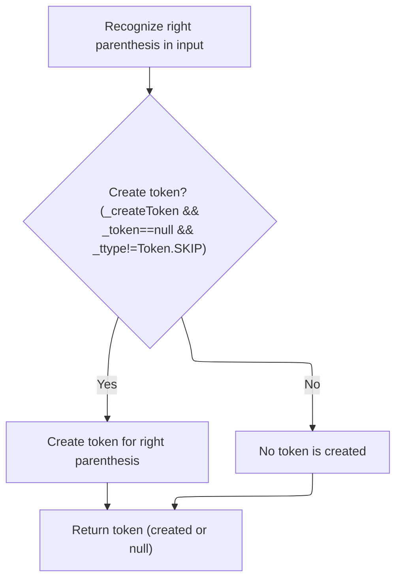
```mermaid
%%{init: {"flowchart": {"defaultRenderer": "elk"}} }%%
flowchart TD
    node1["Recognize right parenthesis in input"]
    click node1 openCode "core/src/main/java/org/apache/struts/validator/validwhen/ValidWhenLexer.java:608:608"
    node1 --> node2{"Create token? (_createToken &&
_token==null && _ttype!=Token.SKIP)"}
    click node2 openCode "core/src/main/java/org/apache/struts/validator/validwhen/ValidWhenLexer.java:609:609"
    node2 -->|"Yes"| node3["Create token for right parenthesis"]
    click node3 openCode "core/src/main/java/org/apache/struts/validator/validwhen/ValidWhenLexer.java:610:611"
    node2 -->|"No"| node4["No token is created"]
    click node4 openCode "core/src/main/java/org/apache/struts/validator/validwhen/ValidWhenLexer.java:609:609"
    node3 --> node5["Return token (created or null)"]
    node4 --> node5
    click node5 openCode "core/src/main/java/org/apache/struts/validator/validwhen/ValidWhenLexer.java:613:614"

classDef HeadingStyle fill:#777777,stroke:#333,stroke-width:2px;

%% Swimm:
%% %%{init: {"flowchart": {"defaultRenderer": "elk"}} }%%
%% flowchart TD
%%     node1["Recognize right parenthesis in input"]
%%     click node1 openCode "<SwmPath>[core/…/validwhen/ValidWhenLexer.java](core/src/main/java/org/apache/struts/validator/validwhen/ValidWhenLexer.java)</SwmPath>:608:608"
%%     node1 --> node2{"Create token? (<SwmToken path="core/src/main/java/org/apache/struts/validator/validwhen/ValidWhenLexer.java" pos="250:11:11" line-data="	public final void mDECIMAL_LITERAL(boolean _createToken) throws RecognitionException, CharStreamException, TokenStreamException {">`_createToken`</SwmToken> &&
%% _token==null && _ttype!=<SwmToken path="core/src/main/java/org/apache/struts/validator/validwhen/ValidWhenLexer.java" pos="495:17:19" line-data="				if ( _createToken &amp;&amp; _token==null &amp;&amp; _ttype!=Token.SKIP ) {">`Token.SKIP`</SwmToken>)"}
%%     click node2 openCode "<SwmPath>[core/…/validwhen/ValidWhenLexer.java](core/src/main/java/org/apache/struts/validator/validwhen/ValidWhenLexer.java)</SwmPath>:609:609"
%%     node2 -->|"Yes"| node3["Create token for right parenthesis"]
%%     click node3 openCode "<SwmPath>[core/…/validwhen/ValidWhenLexer.java](core/src/main/java/org/apache/struts/validator/validwhen/ValidWhenLexer.java)</SwmPath>:610:611"
%%     node2 -->|"No"| node4["No token is created"]
%%     click node4 openCode "<SwmPath>[core/…/validwhen/ValidWhenLexer.java](core/src/main/java/org/apache/struts/validator/validwhen/ValidWhenLexer.java)</SwmPath>:609:609"
%%     node3 --> node5["Return token (created or null)"]
%%     node4 --> node5
%%     click node5 openCode "<SwmPath>[core/…/validwhen/ValidWhenLexer.java](core/src/main/java/org/apache/struts/validator/validwhen/ValidWhenLexer.java)</SwmPath>:613:614"
%% 
%% classDef HeadingStyle fill:#777777,stroke:#333,stroke-width:2px;
```

<SwmSnippet path="/core/src/main/java/org/apache/struts/validator/validwhen/ValidWhenLexer.java" line="603">

---

In <SwmToken path="core/src/main/java/org/apache/struts/validator/validwhen/ValidWhenLexer.java" pos="603:7:7" line-data="	public final void mRPAREN(boolean _createToken) throws RecognitionException, CharStreamException, TokenStreamException {">`mRPAREN`</SwmToken>, we match the ')' character and set up the token. We call ActionConfigMatcher next to check if this token is allowed by the current config, which can affect validation downstream.

```java
	public final void mRPAREN(boolean _createToken) throws RecognitionException, CharStreamException, TokenStreamException {
		int _ttype; Token _token=null; int _begin=text.length();
		_ttype = RPAREN;
		int _saveIndex;
		
		match(')');
```

---

</SwmSnippet>

<SwmSnippet path="/core/src/main/java/org/apache/struts/validator/validwhen/ValidWhenLexer.java" line="609">

---

Just returned from ActionConfigMatcher, now at the end of <SwmToken path="core/src/main/java/org/apache/struts/validator/validwhen/ValidWhenLexer.java" pos="125:1:1" line-data="					mRPAREN(true);">`mRPAREN`</SwmToken> we only create and return the token if it's not marked as SKIP. The matcher config can suppress token creation if needed.

```java
		if ( _createToken && _token==null && _ttype!=Token.SKIP ) {
			_token = makeToken(_ttype);
			_token.setText(new String(text.getBuffer(), _begin, text.length()-_begin));
		}
		_returnToken = _token;
	}
```

---

</SwmSnippet>

### Parsing Special Identifiers

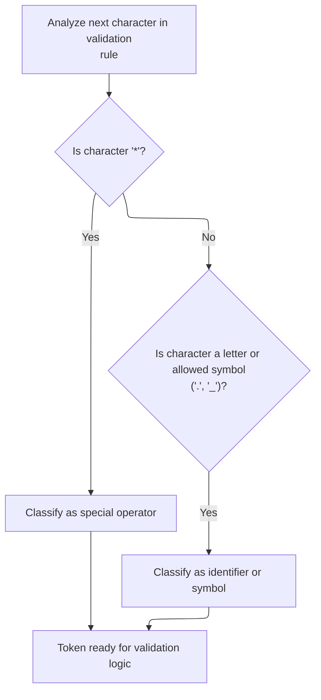
```mermaid
%%{init: {"flowchart": {"defaultRenderer": "elk"}} }%%
flowchart TD
    node1["Analyze next character in validation
rule"] --> node2{"Is character '*'?"}
    click node1 openCode "core/src/main/java/org/apache/struts/validator/validwhen/ValidWhenLexer.java:129:130"
    node2 -->|"Yes"| node3["Classify as special operator"]
    click node2 openCode "core/src/main/java/org/apache/struts/validator/validwhen/ValidWhenLexer.java:129:130"
    node2 -->|"No"| node4{"Is character a letter or allowed symbol
('.', '_')?"}
    click node3 openCode "core/src/main/java/org/apache/struts/validator/validwhen/ValidWhenLexer.java:131:133"
    node4 -->|"Yes"| node5["Classify as identifier or symbol"]
    click node4 openCode "core/src/main/java/org/apache/struts/validator/validwhen/ValidWhenLexer.java:135:140"
    node5 --> node6["Token ready for validation logic"]
    click node5 openCode "core/src/main/java/org/apache/struts/validator/validwhen/ValidWhenLexer.java:135:140"
    node3 --> node6
    click node6 openCode "core/src/main/java/org/apache/struts/validator/validwhen/ValidWhenLexer.java:133:140"
classDef HeadingStyle fill:#777777,stroke:#333,stroke-width:2px;

%% Swimm:
%% %%{init: {"flowchart": {"defaultRenderer": "elk"}} }%%
%% flowchart TD
%%     node1["Analyze next character in validation
%% rule"] --> node2{"Is character '*'?"}
%%     click node1 openCode "<SwmPath>[core/…/validwhen/ValidWhenLexer.java](core/src/main/java/org/apache/struts/validator/validwhen/ValidWhenLexer.java)</SwmPath>:129:130"
%%     node2 -->|"Yes"| node3["Classify as special operator"]
%%     click node2 openCode "<SwmPath>[core/…/validwhen/ValidWhenLexer.java](core/src/main/java/org/apache/struts/validator/validwhen/ValidWhenLexer.java)</SwmPath>:129:130"
%%     node2 -->|"No"| node4{"Is character a letter or allowed symbol
%% ('.', '_')?"}
%%     click node3 openCode "<SwmPath>[core/…/validwhen/ValidWhenLexer.java](core/src/main/java/org/apache/struts/validator/validwhen/ValidWhenLexer.java)</SwmPath>:131:133"
%%     node4 -->|"Yes"| node5["Classify as identifier or symbol"]
%%     click node4 openCode "<SwmPath>[core/…/validwhen/ValidWhenLexer.java](core/src/main/java/org/apache/struts/validator/validwhen/ValidWhenLexer.java)</SwmPath>:135:140"
%%     node5 --> node6["Token ready for validation logic"]
%%     click node5 openCode "<SwmPath>[core/…/validwhen/ValidWhenLexer.java](core/src/main/java/org/apache/struts/validator/validwhen/ValidWhenLexer.java)</SwmPath>:135:140"
%%     node3 --> node6
%%     click node6 openCode "<SwmPath>[core/…/validwhen/ValidWhenLexer.java](core/src/main/java/org/apache/struts/validator/validwhen/ValidWhenLexer.java)</SwmPath>:133:140"
%% classDef HeadingStyle fill:#777777,stroke:#333,stroke-width:2px;
```

<SwmSnippet path="/core/src/main/java/org/apache/struts/validator/validwhen/ValidWhenLexer.java" line="129">

---

Just returned from <SwmToken path="core/src/main/java/org/apache/struts/validator/validwhen/ValidWhenLexer.java" pos="1:25:25" line-data="// $ANTLR 2.7.7 (20060906): &quot;ValidWhenParser.g&quot; -&gt; &quot;ValidWhenLexer.java&quot;$">`ValidWhenLexer`</SwmToken>, now we're checking for '\*' and calling <SwmToken path="core/src/main/java/org/apache/struts/validator/validwhen/ValidWhenLexer.java" pos="131:1:1" line-data="					mTHIS(true);">`mTHIS`</SwmToken> to handle token creation. We need to call <SwmToken path="core/src/main/java/org/apache/struts/validator/validwhen/ValidWhenLexer.java" pos="1:25:25" line-data="// $ANTLR 2.7.7 (20060906): &quot;ValidWhenParser.g&quot; -&gt; &quot;ValidWhenLexer.java&quot;$">`ValidWhenLexer`</SwmToken> again to keep parsing the next token in the stream.

```java
				case '*':
				{
					mTHIS(true);
					theRetToken=_returnToken;
					break;
				}
				case '.':  case '_':  case 'a':  case 'b':
				case 'c':  case 'd':  case 'e':  case 'f':
				case 'g':  case 'h':  case 'i':  case 'j':
				case 'k':  case 'l':  case 'm':  case 'n':
				case 'o':  case 'p':  case 'q':  case 'r':
				case 's':  case 't':  case 'u':  case 'v':
```

---

</SwmSnippet>

### Handling Special Identifier Parsing

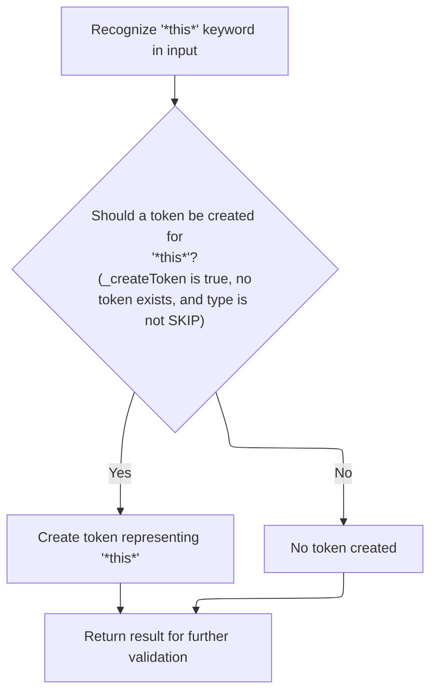
```mermaid
%%{init: {"flowchart": {"defaultRenderer": "elk"}} }%%
flowchart TD
    node1["Recognize '*this*' keyword in input"]
    click node1 openCode "core/src/main/java/org/apache/struts/validator/validwhen/ValidWhenLexer.java:621:621"
    node1 --> node2{"Should a token be created for
'*this*'?
(_createToken is true, no
token exists, and type is not SKIP)"}
    click node2 openCode "core/src/main/java/org/apache/struts/validator/validwhen/ValidWhenLexer.java:622:625"
    node2 -->|"Yes"| node3["Create token representing '*this*'"]
    click node3 openCode "core/src/main/java/org/apache/struts/validator/validwhen/ValidWhenLexer.java:623:624"
    node2 -->|"No"| node4["No token created"]
    click node4 openCode "core/src/main/java/org/apache/struts/validator/validwhen/ValidWhenLexer.java:625:625"
    node3 --> node5["Return result for further validation"]
    click node5 openCode "core/src/main/java/org/apache/struts/validator/validwhen/ValidWhenLexer.java:626:627"
    node4 --> node5
classDef HeadingStyle fill:#777777,stroke:#333,stroke-width:2px;

%% Swimm:
%% %%{init: {"flowchart": {"defaultRenderer": "elk"}} }%%
%% flowchart TD
%%     node1["Recognize '*this*' keyword in input"]
%%     click node1 openCode "<SwmPath>[core/…/validwhen/ValidWhenLexer.java](core/src/main/java/org/apache/struts/validator/validwhen/ValidWhenLexer.java)</SwmPath>:621:621"
%%     node1 --> node2{"Should a token be created for
%% '*this*'?
%% (<SwmToken path="core/src/main/java/org/apache/struts/validator/validwhen/ValidWhenLexer.java" pos="250:11:11" line-data="	public final void mDECIMAL_LITERAL(boolean _createToken) throws RecognitionException, CharStreamException, TokenStreamException {">`_createToken`</SwmToken> is true, no
%% token exists, and type is not SKIP)"}
%%     click node2 openCode "<SwmPath>[core/…/validwhen/ValidWhenLexer.java](core/src/main/java/org/apache/struts/validator/validwhen/ValidWhenLexer.java)</SwmPath>:622:625"
%%     node2 -->|"Yes"| node3["Create token representing '*this*'"]
%%     click node3 openCode "<SwmPath>[core/…/validwhen/ValidWhenLexer.java](core/src/main/java/org/apache/struts/validator/validwhen/ValidWhenLexer.java)</SwmPath>:623:624"
%%     node2 -->|"No"| node4["No token created"]
%%     click node4 openCode "<SwmPath>[core/…/validwhen/ValidWhenLexer.java](core/src/main/java/org/apache/struts/validator/validwhen/ValidWhenLexer.java)</SwmPath>:625:625"
%%     node3 --> node5["Return result for further validation"]
%%     click node5 openCode "<SwmPath>[core/…/validwhen/ValidWhenLexer.java](core/src/main/java/org/apache/struts/validator/validwhen/ValidWhenLexer.java)</SwmPath>:626:627"
%%     node4 --> node5
%% classDef HeadingStyle fill:#777777,stroke:#333,stroke-width:2px;
```

<SwmSnippet path="/core/src/main/java/org/apache/struts/validator/validwhen/ValidWhenLexer.java" line="616">

---

In <SwmToken path="core/src/main/java/org/apache/struts/validator/validwhen/ValidWhenLexer.java" pos="616:7:7" line-data="	public final void mTHIS(boolean _createToken) throws RecognitionException, CharStreamException, TokenStreamException {">`mTHIS`</SwmToken>, we match the '*this*' string and set up the token. We call ActionConfigMatcher next to check if this token is allowed by the current config, which can affect validation downstream.

```java
	public final void mTHIS(boolean _createToken) throws RecognitionException, CharStreamException, TokenStreamException {
		int _ttype; Token _token=null; int _begin=text.length();
		_ttype = THIS;
		int _saveIndex;
		
		match("*this*");
```

---

</SwmSnippet>

<SwmSnippet path="/core/src/main/java/org/apache/struts/validator/validwhen/ValidWhenLexer.java" line="622">

---

Just returned from ActionConfigMatcher, now at the end of <SwmToken path="core/src/main/java/org/apache/struts/validator/validwhen/ValidWhenLexer.java" pos="131:1:1" line-data="					mTHIS(true);">`mTHIS`</SwmToken> we only create and return the token if it's not marked as SKIP. The matcher config can suppress token creation if needed.

```java
		if ( _createToken && _token==null && _ttype!=Token.SKIP ) {
			_token = makeToken(_ttype);
			_token.setText(new String(text.getBuffer(), _begin, text.length()-_begin));
		}
		_returnToken = _token;
	}
```

---

</SwmSnippet>

### Parsing Identifiers

<SwmSnippet path="/core/src/main/java/org/apache/struts/validator/validwhen/ValidWhenLexer.java" line="141">

---

Just returned from <SwmToken path="core/src/main/java/org/apache/struts/validator/validwhen/ValidWhenLexer.java" pos="1:25:25" line-data="// $ANTLR 2.7.7 (20060906): &quot;ValidWhenParser.g&quot; -&gt; &quot;ValidWhenLexer.java&quot;$">`ValidWhenLexer`</SwmToken>, now we're checking for alphabetic characters and calling <SwmToken path="core/src/main/java/org/apache/struts/validator/validwhen/ValidWhenLexer.java" pos="143:1:1" line-data="					mIDENTIFIER(true);">`mIDENTIFIER`</SwmToken> to handle token creation. We need to call <SwmToken path="core/src/main/java/org/apache/struts/validator/validwhen/ValidWhenLexer.java" pos="1:25:25" line-data="// $ANTLR 2.7.7 (20060906): &quot;ValidWhenParser.g&quot; -&gt; &quot;ValidWhenLexer.java&quot;$">`ValidWhenLexer`</SwmToken> again to keep parsing the next token in the stream.

```java
				case 'w':  case 'x':  case 'y':  case 'z':
				{
					mIDENTIFIER(true);
					theRetToken=_returnToken;
					break;
				}
```

---

</SwmSnippet>

### Handling Identifier Parsing

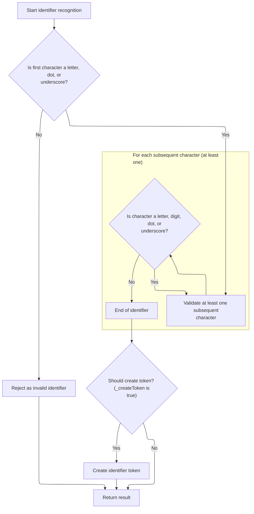
```mermaid
%%{init: {"flowchart": {"defaultRenderer": "elk"}} }%%
flowchart TD
  node1["Start identifier recognition"]
  click node1 openCode "core/src/main/java/org/apache/struts/validator/validwhen/ValidWhenLexer.java:629:630"
  node1 --> node2{"Is first character a letter, dot, or
underscore?"}
  click node2 openCode "core/src/main/java/org/apache/struts/validator/validwhen/ValidWhenLexer.java:635:642"
  node2 -->|"Yes"| node3["Validate at least one subsequent
character"]
  node2 -->|"No"| node6["Reject as invalid identifier"]
  click node6 openCode "core/src/main/java/org/apache/struts/validator/validwhen/ValidWhenLexer.java:658:660"
  subgraph loop1["For each subsequent character (at least
one)"]
    node3 --> node4{"Is character a letter, digit, dot, or
underscore?"}
    click node4 openCode "core/src/main/java/org/apache/struts/validator/validwhen/ValidWhenLexer.java:667:695"
    node4 -->|"Yes"| node3
    node4 -->|"No"| node5["End of identifier"]
    click node5 openCode "core/src/main/java/org/apache/struts/validator/validwhen/ValidWhenLexer.java:698:703"
  end
  node5 --> node7{"Should create token? (_createToken is
true)"}
  click node7 openCode "core/src/main/java/org/apache/struts/validator/validwhen/ValidWhenLexer.java:704:707"
  node7 -->|"Yes"| node8["Create identifier token"]
  click node8 openCode "core/src/main/java/org/apache/struts/validator/validwhen/ValidWhenLexer.java:705:706"
  node7 -->|"No"| node9["Return result"]
  click node9 openCode "core/src/main/java/org/apache/struts/validator/validwhen/ValidWhenLexer.java:708:709"
  node8 --> node9
  node6 --> node9

classDef HeadingStyle fill:#777777,stroke:#333,stroke-width:2px;

%% Swimm:
%% %%{init: {"flowchart": {"defaultRenderer": "elk"}} }%%
%% flowchart TD
%%   node1["Start identifier recognition"]
%%   click node1 openCode "<SwmPath>[core/…/validwhen/ValidWhenLexer.java](core/src/main/java/org/apache/struts/validator/validwhen/ValidWhenLexer.java)</SwmPath>:629:630"
%%   node1 --> node2{"Is first character a letter, dot, or
%% underscore?"}
%%   click node2 openCode "<SwmPath>[core/…/validwhen/ValidWhenLexer.java](core/src/main/java/org/apache/struts/validator/validwhen/ValidWhenLexer.java)</SwmPath>:635:642"
%%   node2 -->|"Yes"| node3["Validate at least one subsequent
%% character"]
%%   node2 -->|"No"| node6["Reject as invalid identifier"]
%%   click node6 openCode "<SwmPath>[core/…/validwhen/ValidWhenLexer.java](core/src/main/java/org/apache/struts/validator/validwhen/ValidWhenLexer.java)</SwmPath>:658:660"
%%   subgraph loop1["For each subsequent character (at least
%% one)"]
%%     node3 --> node4{"Is character a letter, digit, dot, or
%% underscore?"}
%%     click node4 openCode "<SwmPath>[core/…/validwhen/ValidWhenLexer.java](core/src/main/java/org/apache/struts/validator/validwhen/ValidWhenLexer.java)</SwmPath>:667:695"
%%     node4 -->|"Yes"| node3
%%     node4 -->|"No"| node5["End of identifier"]
%%     click node5 openCode "<SwmPath>[core/…/validwhen/ValidWhenLexer.java](core/src/main/java/org/apache/struts/validator/validwhen/ValidWhenLexer.java)</SwmPath>:698:703"
%%   end
%%   node5 --> node7{"Should create token? (<SwmToken path="core/src/main/java/org/apache/struts/validator/validwhen/ValidWhenLexer.java" pos="250:11:11" line-data="	public final void mDECIMAL_LITERAL(boolean _createToken) throws RecognitionException, CharStreamException, TokenStreamException {">`_createToken`</SwmToken> is
%% true)"}
%%   click node7 openCode "<SwmPath>[core/…/validwhen/ValidWhenLexer.java](core/src/main/java/org/apache/struts/validator/validwhen/ValidWhenLexer.java)</SwmPath>:704:707"
%%   node7 -->|"Yes"| node8["Create identifier token"]
%%   click node8 openCode "<SwmPath>[core/…/validwhen/ValidWhenLexer.java](core/src/main/java/org/apache/struts/validator/validwhen/ValidWhenLexer.java)</SwmPath>:705:706"
%%   node7 -->|"No"| node9["Return result"]
%%   click node9 openCode "<SwmPath>[core/…/validwhen/ValidWhenLexer.java](core/src/main/java/org/apache/struts/validator/validwhen/ValidWhenLexer.java)</SwmPath>:708:709"
%%   node8 --> node9
%%   node6 --> node9
%% 
%% classDef HeadingStyle fill:#777777,stroke:#333,stroke-width:2px;
```

<SwmSnippet path="/core/src/main/java/org/apache/struts/validator/validwhen/ValidWhenLexer.java" line="629">

---

In <SwmToken path="core/src/main/java/org/apache/struts/validator/validwhen/ValidWhenLexer.java" pos="629:7:7" line-data="	public final void mIDENTIFIER(boolean _createToken) throws RecognitionException, CharStreamException, TokenStreamException {">`mIDENTIFIER`</SwmToken>, we match sequences of letters, digits, '.', and '\_' to build identifier tokens. We call ActionConfigMatcher next to check if this token is allowed by the current config, which can affect validation downstream.

```java
	public final void mIDENTIFIER(boolean _createToken) throws RecognitionException, CharStreamException, TokenStreamException {
		int _ttype; Token _token=null; int _begin=text.length();
		_ttype = IDENTIFIER;
		int _saveIndex;
		
		{
		switch ( LA(1)) {
		case 'a':  case 'b':  case 'c':  case 'd':
		case 'e':  case 'f':  case 'g':  case 'h':
		case 'i':  case 'j':  case 'k':  case 'l':
		case 'm':  case 'n':  case 'o':  case 'p':
		case 'q':  case 'r':  case 's':  case 't':
		case 'u':  case 'v':  case 'w':  case 'x':
		case 'y':  case 'z':
		{
			matchRange('a','z');
			break;
		}
		case '.':
		{
			match('.');
			break;
		}
		case '_':
		{
			match('_');
			break;
		}
		default:
		{
			throw new NoViableAltForCharException((char)LA(1), getFilename(), getLine(), getColumn());
		}
		}
		}
		{
		int _cnt62=0;
		_loop62:
		do {
			switch ( LA(1)) {
			case 'a':  case 'b':  case 'c':  case 'd':
			case 'e':  case 'f':  case 'g':  case 'h':
			case 'i':  case 'j':  case 'k':  case 'l':
			case 'm':  case 'n':  case 'o':  case 'p':
			case 'q':  case 'r':  case 's':  case 't':
			case 'u':  case 'v':  case 'w':  case 'x':
			case 'y':  case 'z':
			{
				matchRange('a','z');
				break;
			}
			case '0':  case '1':  case '2':  case '3':
			case '4':  case '5':  case '6':  case '7':
			case '8':  case '9':
			{
				matchRange('0','9');
				break;
			}
			case '.':
			{
				match('.');
				break;
			}
			case '_':
			{
				match('_');
				break;
			}
			default:
			{
				if ( _cnt62>=1 ) { break _loop62; } else {throw new NoViableAltForCharException((char)LA(1), getFilename(), getLine(), getColumn());}
			}
			}
			_cnt62++;
		} while (true);
		}
```

---

</SwmSnippet>

<SwmSnippet path="/core/src/main/java/org/apache/struts/validator/validwhen/ValidWhenLexer.java" line="704">

---

Just returned from ActionConfigMatcher, now at the end of <SwmToken path="core/src/main/java/org/apache/struts/validator/validwhen/ValidWhenLexer.java" pos="143:1:1" line-data="					mIDENTIFIER(true);">`mIDENTIFIER`</SwmToken> we only create and return the token if it's not marked as SKIP. The matcher config can suppress token creation if needed.

```java
		if ( _createToken && _token==null && _ttype!=Token.SKIP ) {
			_token = makeToken(_ttype);
			_token.setText(new String(text.getBuffer(), _begin, text.length()-_begin));
		}
		_returnToken = _token;
	}
```

---

</SwmSnippet>

### Parsing Equality Tokens

<SwmSnippet path="/core/src/main/java/org/apache/struts/validator/validwhen/ValidWhenLexer.java" line="147">

---

Just returned from <SwmToken path="core/src/main/java/org/apache/struts/validator/validwhen/ValidWhenLexer.java" pos="1:25:25" line-data="// $ANTLR 2.7.7 (20060906): &quot;ValidWhenParser.g&quot; -&gt; &quot;ValidWhenLexer.java&quot;$">`ValidWhenLexer`</SwmToken>, now we're checking for '=' and calling <SwmToken path="core/src/main/java/org/apache/struts/validator/validwhen/ValidWhenLexer.java" pos="149:1:1" line-data="					mEQUALSIGN(true);">`mEQUALSIGN`</SwmToken> to handle token creation. We need to call <SwmToken path="core/src/main/java/org/apache/struts/validator/validwhen/ValidWhenLexer.java" pos="1:25:25" line-data="// $ANTLR 2.7.7 (20060906): &quot;ValidWhenParser.g&quot; -&gt; &quot;ValidWhenLexer.java&quot;$">`ValidWhenLexer`</SwmToken> again to keep parsing the next token in the stream.

```java
				case '=':
				{
					mEQUALSIGN(true);
					theRetToken=_returnToken;
					break;
				}
```

---

</SwmSnippet>

### Handling Equality Token Parsing

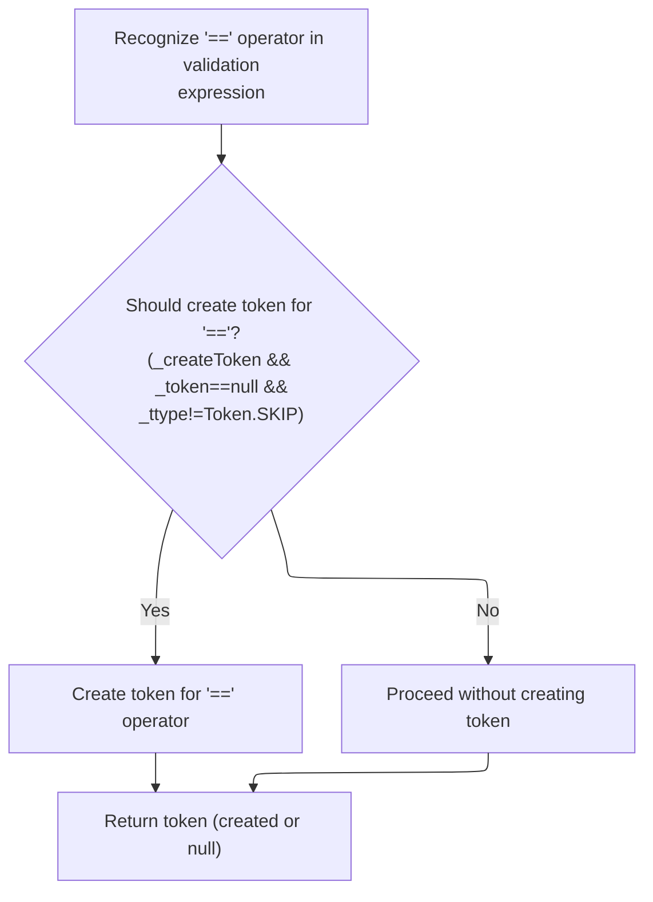
```mermaid
%%{init: {"flowchart": {"defaultRenderer": "elk"}} }%%
flowchart TD
    node1["Recognize '==' operator in validation
expression"]
    click node1 openCode "core/src/main/java/org/apache/struts/validator/validwhen/ValidWhenLexer.java:716:717"
    node1 --> node2{"Should create token for '=='?
(_createToken && _token==null &&
_ttype!=Token.SKIP)"}
    click node2 openCode "core/src/main/java/org/apache/struts/validator/validwhen/ValidWhenLexer.java:718:721"
    node2 -->|"Yes"| node3["Create token for '==' operator"]
    click node3 openCode "core/src/main/java/org/apache/struts/validator/validwhen/ValidWhenLexer.java:719:720"
    node2 -->|"No"| node4["Proceed without creating token"]
    click node4 openCode "core/src/main/java/org/apache/struts/validator/validwhen/ValidWhenLexer.java:718:721"
    node3 --> node5["Return token (created or null)"]
    click node5 openCode "core/src/main/java/org/apache/struts/validator/validwhen/ValidWhenLexer.java:722:723"
    node4 --> node5
classDef HeadingStyle fill:#777777,stroke:#333,stroke-width:2px;

%% Swimm:
%% %%{init: {"flowchart": {"defaultRenderer": "elk"}} }%%
%% flowchart TD
%%     node1["Recognize '==' operator in validation
%% expression"]
%%     click node1 openCode "<SwmPath>[core/…/validwhen/ValidWhenLexer.java](core/src/main/java/org/apache/struts/validator/validwhen/ValidWhenLexer.java)</SwmPath>:716:717"
%%     node1 --> node2{"Should create token for '=='?
%% (<SwmToken path="core/src/main/java/org/apache/struts/validator/validwhen/ValidWhenLexer.java" pos="250:11:11" line-data="	public final void mDECIMAL_LITERAL(boolean _createToken) throws RecognitionException, CharStreamException, TokenStreamException {">`_createToken`</SwmToken> && _token==null &&
%% _ttype!=<SwmToken path="core/src/main/java/org/apache/struts/validator/validwhen/ValidWhenLexer.java" pos="495:17:19" line-data="				if ( _createToken &amp;&amp; _token==null &amp;&amp; _ttype!=Token.SKIP ) {">`Token.SKIP`</SwmToken>)"}
%%     click node2 openCode "<SwmPath>[core/…/validwhen/ValidWhenLexer.java](core/src/main/java/org/apache/struts/validator/validwhen/ValidWhenLexer.java)</SwmPath>:718:721"
%%     node2 -->|"Yes"| node3["Create token for '==' operator"]
%%     click node3 openCode "<SwmPath>[core/…/validwhen/ValidWhenLexer.java](core/src/main/java/org/apache/struts/validator/validwhen/ValidWhenLexer.java)</SwmPath>:719:720"
%%     node2 -->|"No"| node4["Proceed without creating token"]
%%     click node4 openCode "<SwmPath>[core/…/validwhen/ValidWhenLexer.java](core/src/main/java/org/apache/struts/validator/validwhen/ValidWhenLexer.java)</SwmPath>:718:721"
%%     node3 --> node5["Return token (created or null)"]
%%     click node5 openCode "<SwmPath>[core/…/validwhen/ValidWhenLexer.java](core/src/main/java/org/apache/struts/validator/validwhen/ValidWhenLexer.java)</SwmPath>:722:723"
%%     node4 --> node5
%% classDef HeadingStyle fill:#777777,stroke:#333,stroke-width:2px;
```

<SwmSnippet path="/core/src/main/java/org/apache/struts/validator/validwhen/ValidWhenLexer.java" line="711">

---

In <SwmToken path="core/src/main/java/org/apache/struts/validator/validwhen/ValidWhenLexer.java" pos="711:7:7" line-data="	public final void mEQUALSIGN(boolean _createToken) throws RecognitionException, CharStreamException, TokenStreamException {">`mEQUALSIGN`</SwmToken>, we match '==' and set up the token. We call ActionConfigMatcher next to check if this token is allowed by the current config, which can affect validation downstream.

```java
	public final void mEQUALSIGN(boolean _createToken) throws RecognitionException, CharStreamException, TokenStreamException {
		int _ttype; Token _token=null; int _begin=text.length();
		_ttype = EQUALSIGN;
		int _saveIndex;
		
		match('=');
		match('=');
```

---

</SwmSnippet>

<SwmSnippet path="/core/src/main/java/org/apache/struts/validator/validwhen/ValidWhenLexer.java" line="718">

---

Just returned from ActionConfigMatcher, now at the end of <SwmToken path="core/src/main/java/org/apache/struts/validator/validwhen/ValidWhenLexer.java" pos="149:1:1" line-data="					mEQUALSIGN(true);">`mEQUALSIGN`</SwmToken> we only create and return the token if it's not marked as SKIP. The matcher config can suppress token creation if needed.

```java
		if ( _createToken && _token==null && _ttype!=Token.SKIP ) {
			_token = makeToken(_ttype);
			_token.setText(new String(text.getBuffer(), _begin, text.length()-_begin));
		}
		_returnToken = _token;
	}
```

---

</SwmSnippet>

### Parsing Inequality Tokens

<SwmSnippet path="/core/src/main/java/org/apache/struts/validator/validwhen/ValidWhenLexer.java" line="153">

---

Just returned from <SwmToken path="core/src/main/java/org/apache/struts/validator/validwhen/ValidWhenLexer.java" pos="1:25:25" line-data="// $ANTLR 2.7.7 (20060906): &quot;ValidWhenParser.g&quot; -&gt; &quot;ValidWhenLexer.java&quot;$">`ValidWhenLexer`</SwmToken>, now we're checking for '!' and calling <SwmToken path="core/src/main/java/org/apache/struts/validator/validwhen/ValidWhenLexer.java" pos="155:1:1" line-data="					mNOTEQUALSIGN(true);">`mNOTEQUALSIGN`</SwmToken> to handle token creation. We need to call <SwmToken path="core/src/main/java/org/apache/struts/validator/validwhen/ValidWhenLexer.java" pos="1:25:25" line-data="// $ANTLR 2.7.7 (20060906): &quot;ValidWhenParser.g&quot; -&gt; &quot;ValidWhenLexer.java&quot;$">`ValidWhenLexer`</SwmToken> again to keep parsing the next token in the stream.

```java
				case '!':
				{
					mNOTEQUALSIGN(true);
					theRetToken=_returnToken;
					break;
				}
```

---

</SwmSnippet>

### Handling Inequality Token Parsing

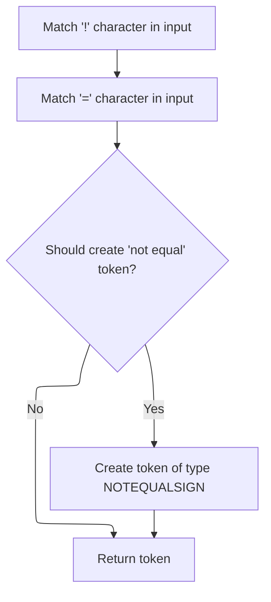
```mermaid
%%{init: {"flowchart": {"defaultRenderer": "elk"}} }%%
flowchart TD
  node1["Match '!' character in input"]
  click node1 openCode "core/src/main/java/org/apache/struts/validator/validwhen/ValidWhenLexer.java:730:730"
  node1 --> node2["Match '=' character in input"]
  click node2 openCode "core/src/main/java/org/apache/struts/validator/validwhen/ValidWhenLexer.java:731:731"
  node2 --> node3{"Should create 'not equal' token?"}
  click node3 openCode "core/src/main/java/org/apache/struts/validator/validwhen/ValidWhenLexer.java:732:732"
  node3 -->|"Yes"| node4["Create token of type NOTEQUALSIGN"]
  click node4 openCode "core/src/main/java/org/apache/struts/validator/validwhen/ValidWhenLexer.java:733:734"
  node4 --> node5["Return token"]
  click node5 openCode "core/src/main/java/org/apache/struts/validator/validwhen/ValidWhenLexer.java:736:736"
  node3 -->|"No"| node5
classDef HeadingStyle fill:#777777,stroke:#333,stroke-width:2px;

%% Swimm:
%% %%{init: {"flowchart": {"defaultRenderer": "elk"}} }%%
%% flowchart TD
%%   node1["Match '!' character in input"]
%%   click node1 openCode "<SwmPath>[core/…/validwhen/ValidWhenLexer.java](core/src/main/java/org/apache/struts/validator/validwhen/ValidWhenLexer.java)</SwmPath>:730:730"
%%   node1 --> node2["Match '=' character in input"]
%%   click node2 openCode "<SwmPath>[core/…/validwhen/ValidWhenLexer.java](core/src/main/java/org/apache/struts/validator/validwhen/ValidWhenLexer.java)</SwmPath>:731:731"
%%   node2 --> node3{"Should create 'not equal' token?"}
%%   click node3 openCode "<SwmPath>[core/…/validwhen/ValidWhenLexer.java](core/src/main/java/org/apache/struts/validator/validwhen/ValidWhenLexer.java)</SwmPath>:732:732"
%%   node3 -->|"Yes"| node4["Create token of type NOTEQUALSIGN"]
%%   click node4 openCode "<SwmPath>[core/…/validwhen/ValidWhenLexer.java](core/src/main/java/org/apache/struts/validator/validwhen/ValidWhenLexer.java)</SwmPath>:733:734"
%%   node4 --> node5["Return token"]
%%   click node5 openCode "<SwmPath>[core/…/validwhen/ValidWhenLexer.java](core/src/main/java/org/apache/struts/validator/validwhen/ValidWhenLexer.java)</SwmPath>:736:736"
%%   node3 -->|"No"| node5
%% classDef HeadingStyle fill:#777777,stroke:#333,stroke-width:2px;
```

<SwmSnippet path="/core/src/main/java/org/apache/struts/validator/validwhen/ValidWhenLexer.java" line="725">

---

In <SwmToken path="core/src/main/java/org/apache/struts/validator/validwhen/ValidWhenLexer.java" pos="725:7:7" line-data="	public final void mNOTEQUALSIGN(boolean _createToken) throws RecognitionException, CharStreamException, TokenStreamException {">`mNOTEQUALSIGN`</SwmToken>, we match '!=' and set up the token. We call ActionConfigMatcher next to check if this token is allowed by the current config, which can affect validation downstream.

```java
	public final void mNOTEQUALSIGN(boolean _createToken) throws RecognitionException, CharStreamException, TokenStreamException {
		int _ttype; Token _token=null; int _begin=text.length();
		_ttype = NOTEQUALSIGN;
		int _saveIndex;
		
		match('!');
		match('=');
```

---

</SwmSnippet>

<SwmSnippet path="/core/src/main/java/org/apache/struts/validator/validwhen/ValidWhenLexer.java" line="732">

---

Just returned from ActionConfigMatcher, now at the end of <SwmToken path="core/src/main/java/org/apache/struts/validator/validwhen/ValidWhenLexer.java" pos="155:1:1" line-data="					mNOTEQUALSIGN(true);">`mNOTEQUALSIGN`</SwmToken> we only create and return the token if it's not marked as SKIP. The matcher config can suppress token creation if needed.

```java
		if ( _createToken && _token==null && _ttype!=Token.SKIP ) {
			_token = makeToken(_ttype);
			_token.setText(new String(text.getBuffer(), _begin, text.length()-_begin));
		}
		_returnToken = _token;
	}
```

---

</SwmSnippet>

### Parsing Comparison Tokens

<SwmSnippet path="/core/src/main/java/org/apache/struts/validator/validwhen/ValidWhenLexer.java" line="159">

---

Just returned from <SwmToken path="core/src/main/java/org/apache/struts/validator/validwhen/ValidWhenLexer.java" pos="1:25:25" line-data="// $ANTLR 2.7.7 (20060906): &quot;ValidWhenParser.g&quot; -&gt; &quot;ValidWhenLexer.java&quot;$">`ValidWhenLexer`</SwmToken>, now we're checking for '<=' and '>=' and calling the respective function to handle token creation. We need to call <SwmToken path="core/src/main/java/org/apache/struts/validator/validwhen/ValidWhenLexer.java" pos="1:25:25" line-data="// $ANTLR 2.7.7 (20060906): &quot;ValidWhenParser.g&quot; -&gt; &quot;ValidWhenLexer.java&quot;$">`ValidWhenLexer`</SwmToken> again to keep parsing the next token in the stream.

```java
				default:
					if ((LA(1)=='<') && (LA(2)=='=')) {
						mLESSEQUALSIGN(true);
```

---

</SwmSnippet>

### Handling Less-Than-Or-Equal Token Parsing

<SwmSnippet path="/core/src/main/java/org/apache/struts/validator/validwhen/ValidWhenLexer.java" line="765">

---

In <SwmToken path="core/src/main/java/org/apache/struts/validator/validwhen/ValidWhenLexer.java" pos="765:7:7" line-data="	public final void mLESSEQUALSIGN(boolean _createToken) throws RecognitionException, CharStreamException, TokenStreamException {">`mLESSEQUALSIGN`</SwmToken>, we match '<=' and set up the token. We call ActionConfigMatcher next to check if this token is allowed by the current config, which can affect validation downstream.

```java
	public final void mLESSEQUALSIGN(boolean _createToken) throws RecognitionException, CharStreamException, TokenStreamException {
		int _ttype; Token _token=null; int _begin=text.length();
		_ttype = LESSEQUALSIGN;
		int _saveIndex;
		
		match('<');
		match('=');
```

---

</SwmSnippet>

<SwmSnippet path="/core/src/main/java/org/apache/struts/validator/validwhen/ValidWhenLexer.java" line="772">

---

Just returned from ActionConfigMatcher, now at the end of <SwmToken path="core/src/main/java/org/apache/struts/validator/validwhen/ValidWhenLexer.java" pos="161:1:1" line-data="						mLESSEQUALSIGN(true);">`mLESSEQUALSIGN`</SwmToken> we only create and return the token if it's not marked as SKIP. The matcher config can suppress token creation if needed.

```java
		if ( _createToken && _token==null && _ttype!=Token.SKIP ) {
			_token = makeToken(_ttype);
			_token.setText(new String(text.getBuffer(), _begin, text.length()-_begin));
		}
		_returnToken = _token;
	}
```

---

</SwmSnippet>

### Parsing Greater-Than-Or-Equal Tokens

<SwmSnippet path="/core/src/main/java/org/apache/struts/validator/validwhen/ValidWhenLexer.java" line="162">

---

Just returned from <SwmToken path="core/src/main/java/org/apache/struts/validator/validwhen/ValidWhenLexer.java" pos="1:25:25" line-data="// $ANTLR 2.7.7 (20060906): &quot;ValidWhenParser.g&quot; -&gt; &quot;ValidWhenLexer.java&quot;$">`ValidWhenLexer`</SwmToken>, now we're checking for '>=' and calling <SwmToken path="core/src/main/java/org/apache/struts/validator/validwhen/ValidWhenLexer.java" pos="165:1:1" line-data="						mGREATEREQUALSIGN(true);">`mGREATEREQUALSIGN`</SwmToken> to handle token creation. We need to call <SwmToken path="core/src/main/java/org/apache/struts/validator/validwhen/ValidWhenLexer.java" pos="1:25:25" line-data="// $ANTLR 2.7.7 (20060906): &quot;ValidWhenParser.g&quot; -&gt; &quot;ValidWhenLexer.java&quot;$">`ValidWhenLexer`</SwmToken> again to keep parsing the next token in the stream.

```java
						theRetToken=_returnToken;
					}
					else if ((LA(1)=='>') && (LA(2)=='=')) {
						mGREATEREQUALSIGN(true);
```

---

</SwmSnippet>

### Matching Greater-Than-Or-Equal Tokens

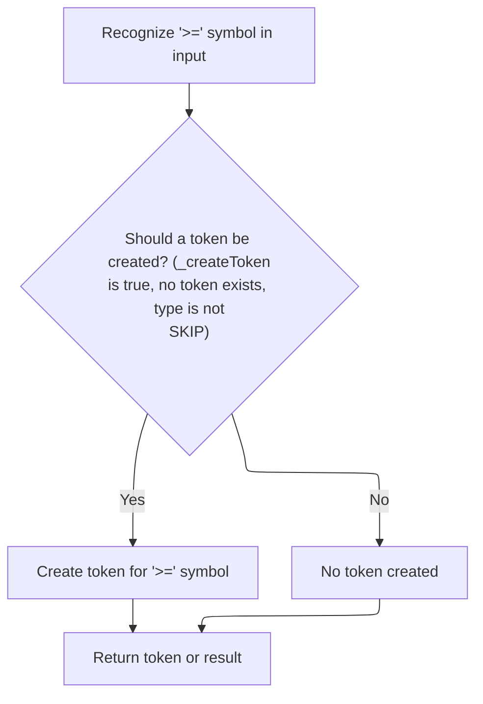
```mermaid
%%{init: {"flowchart": {"defaultRenderer": "elk"}} }%%
flowchart TD
    node1["Recognize '>=' symbol in input"]
    click node1 openCode "core/src/main/java/org/apache/struts/validator/validwhen/ValidWhenLexer.java:784:785"
    node1 --> node2{"Should a token be created? (_createToken
is true, no token exists, type is not
SKIP)"}
    click node2 openCode "core/src/main/java/org/apache/struts/validator/validwhen/ValidWhenLexer.java:786:789"
    node2 -->|"Yes"| node3["Create token for '>=' symbol"]
    click node3 openCode "core/src/main/java/org/apache/struts/validator/validwhen/ValidWhenLexer.java:787:788"
    node2 -->|"No"| node4["No token created"]
    click node4 openCode "core/src/main/java/org/apache/struts/validator/validwhen/ValidWhenLexer.java:786:789"
    node3 --> node5["Return token or result"]
    node4 --> node5
    click node5 openCode "core/src/main/java/org/apache/struts/validator/validwhen/ValidWhenLexer.java:790:791"

classDef HeadingStyle fill:#777777,stroke:#333,stroke-width:2px;

%% Swimm:
%% %%{init: {"flowchart": {"defaultRenderer": "elk"}} }%%
%% flowchart TD
%%     node1["Recognize '>=' symbol in input"]
%%     click node1 openCode "<SwmPath>[core/…/validwhen/ValidWhenLexer.java](core/src/main/java/org/apache/struts/validator/validwhen/ValidWhenLexer.java)</SwmPath>:784:785"
%%     node1 --> node2{"Should a token be created? (<SwmToken path="core/src/main/java/org/apache/struts/validator/validwhen/ValidWhenLexer.java" pos="250:11:11" line-data="	public final void mDECIMAL_LITERAL(boolean _createToken) throws RecognitionException, CharStreamException, TokenStreamException {">`_createToken`</SwmToken>
%% is true, no token exists, type is not
%% SKIP)"}
%%     click node2 openCode "<SwmPath>[core/…/validwhen/ValidWhenLexer.java](core/src/main/java/org/apache/struts/validator/validwhen/ValidWhenLexer.java)</SwmPath>:786:789"
%%     node2 -->|"Yes"| node3["Create token for '>=' symbol"]
%%     click node3 openCode "<SwmPath>[core/…/validwhen/ValidWhenLexer.java](core/src/main/java/org/apache/struts/validator/validwhen/ValidWhenLexer.java)</SwmPath>:787:788"
%%     node2 -->|"No"| node4["No token created"]
%%     click node4 openCode "<SwmPath>[core/…/validwhen/ValidWhenLexer.java](core/src/main/java/org/apache/struts/validator/validwhen/ValidWhenLexer.java)</SwmPath>:786:789"
%%     node3 --> node5["Return token or result"]
%%     node4 --> node5
%%     click node5 openCode "<SwmPath>[core/…/validwhen/ValidWhenLexer.java](core/src/main/java/org/apache/struts/validator/validwhen/ValidWhenLexer.java)</SwmPath>:790:791"
%% 
%% classDef HeadingStyle fill:#777777,stroke:#333,stroke-width:2px;
```

<SwmSnippet path="/core/src/main/java/org/apache/struts/validator/validwhen/ValidWhenLexer.java" line="779">

---

In <SwmToken path="core/src/main/java/org/apache/struts/validator/validwhen/ValidWhenLexer.java" pos="779:7:7" line-data="	public final void mGREATEREQUALSIGN(boolean _createToken) throws RecognitionException, CharStreamException, TokenStreamException {">`mGREATEREQUALSIGN`</SwmToken>, we're matching the '>=' sequence and prepping the token for it. We need to call ActionConfigMatcher next because the config can block or allow this token, affecting whether it's actually returned for validation.

```java
	public final void mGREATEREQUALSIGN(boolean _createToken) throws RecognitionException, CharStreamException, TokenStreamException {
		int _ttype; Token _token=null; int _begin=text.length();
		_ttype = GREATEREQUALSIGN;
		int _saveIndex;
		
		match('>');
		match('=');
```

---

</SwmSnippet>

<SwmSnippet path="/core/src/main/java/org/apache/struts/validator/validwhen/ValidWhenLexer.java" line="786">

---

Just returned from ActionConfigMatcher, now at the end of <SwmToken path="core/src/main/java/org/apache/struts/validator/validwhen/ValidWhenLexer.java" pos="165:1:1" line-data="						mGREATEREQUALSIGN(true);">`mGREATEREQUALSIGN`</SwmToken> we only build and return the token if it's not marked as SKIP. The matcher config can suppress token creation, so the token might not be passed on.

```java
		if ( _createToken && _token==null && _ttype!=Token.SKIP ) {
			_token = makeToken(_ttype);
			_token.setText(new String(text.getBuffer(), _begin, text.length()-_begin));
		}
		_returnToken = _token;
	}
```

---

</SwmSnippet>

### Switching to Less-Than Token Matching

<SwmSnippet path="/core/src/main/java/org/apache/struts/validator/validwhen/ValidWhenLexer.java" line="166">

---

Just returned from <SwmToken path="core/src/main/java/org/apache/struts/validator/validwhen/ValidWhenLexer.java" pos="165:1:1" line-data="						mGREATEREQUALSIGN(true);">`mGREATEREQUALSIGN`</SwmToken>, now in <SwmToken path="core/src/main/java/org/apache/struts/dispatcher/AbstractEventMappingDispatcher.java" pos="93:9:9" line-data="            String methodKey = st.nextToken().trim();">`nextToken`</SwmToken> we're checking for '<' and calling <SwmToken path="core/src/main/java/org/apache/struts/validator/validwhen/ValidWhenLexer.java" pos="169:1:1" line-data="						mLESSTHANSIGN(true);">`mLESSTHANSIGN`</SwmToken> to handle the next comparison token. This keeps the token stream moving through all possible operators.

```java
						theRetToken=_returnToken;
					}
					else if ((LA(1)=='<') && (true)) {
						mLESSTHANSIGN(true);
```

---

</SwmSnippet>

### Matching Less-Than Tokens

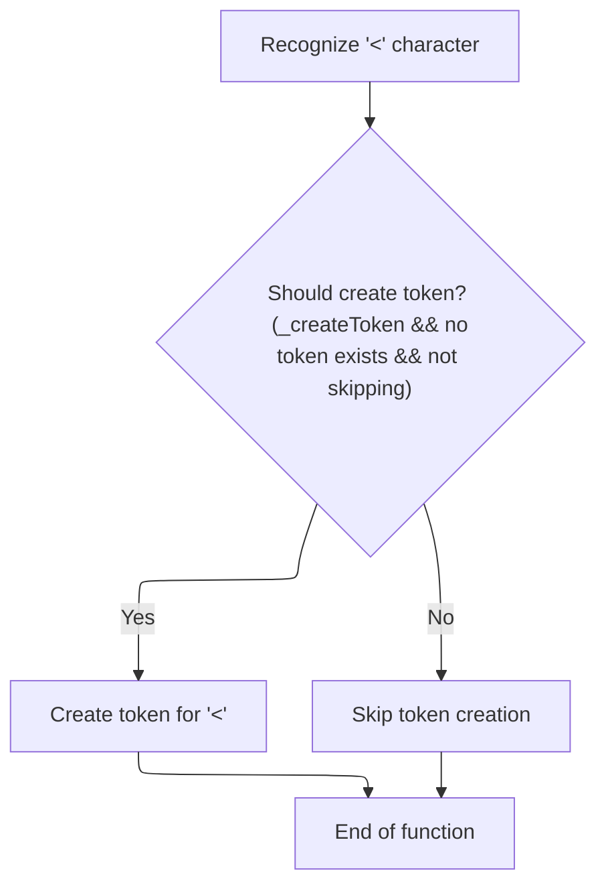
```mermaid
%%{init: {"flowchart": {"defaultRenderer": "elk"}} }%%
flowchart TD
  node1["Recognize '<' character"]
  click node1 openCode "core/src/main/java/org/apache/struts/validator/validwhen/ValidWhenLexer.java:744:744"
  node1 --> node2{"Should create token? (_createToken && no
token exists && not skipping)"}
  click node2 openCode "core/src/main/java/org/apache/struts/validator/validwhen/ValidWhenLexer.java:745:745"
  node2 -->|"Yes"| node3["Create token for '<'"]
  click node3 openCode "core/src/main/java/org/apache/struts/validator/validwhen/ValidWhenLexer.java:746:747"
  node2 -->|"No"| node4["Skip token creation"]
  click node4 openCode "core/src/main/java/org/apache/struts/validator/validwhen/ValidWhenLexer.java:745:748"
  node3 --> node5["Finish"]
  node4 --> node5
  node5["End of function"]
  click node5 openCode "core/src/main/java/org/apache/struts/validator/validwhen/ValidWhenLexer.java:749:750"

classDef HeadingStyle fill:#777777,stroke:#333,stroke-width:2px;

%% Swimm:
%% %%{init: {"flowchart": {"defaultRenderer": "elk"}} }%%
%% flowchart TD
%%   node1["Recognize '<' character"]
%%   click node1 openCode "<SwmPath>[core/…/validwhen/ValidWhenLexer.java](core/src/main/java/org/apache/struts/validator/validwhen/ValidWhenLexer.java)</SwmPath>:744:744"
%%   node1 --> node2{"Should create token? (<SwmToken path="core/src/main/java/org/apache/struts/validator/validwhen/ValidWhenLexer.java" pos="250:11:11" line-data="	public final void mDECIMAL_LITERAL(boolean _createToken) throws RecognitionException, CharStreamException, TokenStreamException {">`_createToken`</SwmToken> && no
%% token exists && not skipping)"}
%%   click node2 openCode "<SwmPath>[core/…/validwhen/ValidWhenLexer.java](core/src/main/java/org/apache/struts/validator/validwhen/ValidWhenLexer.java)</SwmPath>:745:745"
%%   node2 -->|"Yes"| node3["Create token for '<'"]
%%   click node3 openCode "<SwmPath>[core/…/validwhen/ValidWhenLexer.java](core/src/main/java/org/apache/struts/validator/validwhen/ValidWhenLexer.java)</SwmPath>:746:747"
%%   node2 -->|"No"| node4["Skip token creation"]
%%   click node4 openCode "<SwmPath>[core/…/validwhen/ValidWhenLexer.java](core/src/main/java/org/apache/struts/validator/validwhen/ValidWhenLexer.java)</SwmPath>:745:748"
%%   node3 --> node5["Finish"]
%%   node4 --> node5
%%   node5["End of function"]
%%   click node5 openCode "<SwmPath>[core/…/validwhen/ValidWhenLexer.java](core/src/main/java/org/apache/struts/validator/validwhen/ValidWhenLexer.java)</SwmPath>:749:750"
%% 
%% classDef HeadingStyle fill:#777777,stroke:#333,stroke-width:2px;
```

<SwmSnippet path="/core/src/main/java/org/apache/struts/validator/validwhen/ValidWhenLexer.java" line="739">

---

In <SwmToken path="core/src/main/java/org/apache/struts/validator/validwhen/ValidWhenLexer.java" pos="739:7:7" line-data="	public final void mLESSTHANSIGN(boolean _createToken) throws RecognitionException, CharStreamException, TokenStreamException {">`mLESSTHANSIGN`</SwmToken>, we're matching the '<' character and prepping the token. We call ActionConfigMatcher next because the config can block or allow this token, affecting whether it's actually returned.

```java
	public final void mLESSTHANSIGN(boolean _createToken) throws RecognitionException, CharStreamException, TokenStreamException {
		int _ttype; Token _token=null; int _begin=text.length();
		_ttype = LESSTHANSIGN;
		int _saveIndex;
		
		match('<');
```

---

</SwmSnippet>

<SwmSnippet path="/core/src/main/java/org/apache/struts/validator/validwhen/ValidWhenLexer.java" line="745">

---

Just returned from ActionConfigMatcher, now at the end of <SwmToken path="core/src/main/java/org/apache/struts/validator/validwhen/ValidWhenLexer.java" pos="169:1:1" line-data="						mLESSTHANSIGN(true);">`mLESSTHANSIGN`</SwmToken> we only build and return the token if it's not marked as SKIP. The matcher config can suppress token creation, so the token might not be passed on.

```java
		if ( _createToken && _token==null && _ttype!=Token.SKIP ) {
			_token = makeToken(_ttype);
			_token.setText(new String(text.getBuffer(), _begin, text.length()-_begin));
		}
		_returnToken = _token;
	}
```

---

</SwmSnippet>

### Switching to Greater-Than Token Matching

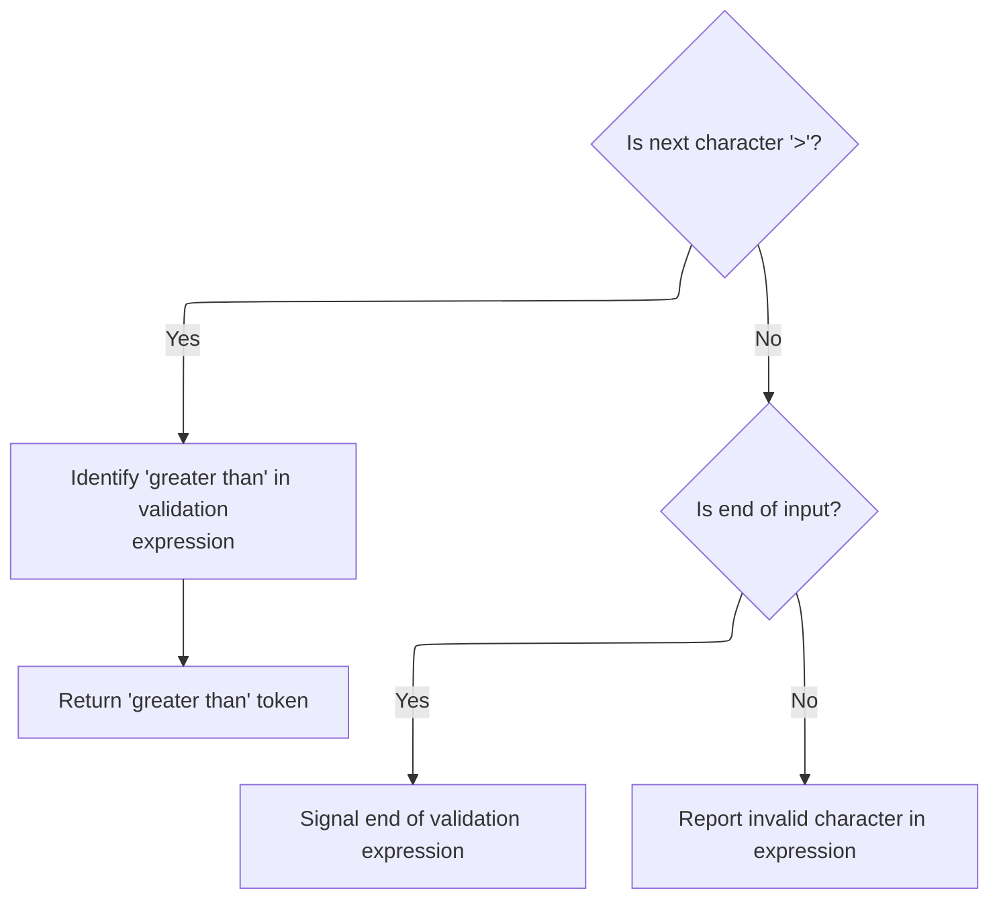
```mermaid
%%{init: {"flowchart": {"defaultRenderer": "elk"}} }%%
flowchart TD
  node1{"Is next character '>'?"}
  click node1 openCode "core/src/main/java/org/apache/struts/validator/validwhen/ValidWhenLexer.java:172:175"
  node1 -->|"Yes"| node2["Identify 'greater than' in validation
expression"]
  click node2 openCode "core/src/main/java/org/apache/struts/validator/validwhen/ValidWhenLexer.java:173:174"
  node2 --> node5["Return 'greater than' token"]
  click node5 openCode "core/src/main/java/org/apache/struts/validator/validwhen/ValidWhenLexer.java:174:175"
  node1 -->|"No"| node3{"Is end of input?"}
  click node3 openCode "core/src/main/java/org/apache/struts/validator/validwhen/ValidWhenLexer.java:176:178"
  node3 -->|"Yes"| node4["Signal end of validation expression"]
  click node4 openCode "core/src/main/java/org/apache/struts/validator/validwhen/ValidWhenLexer.java:177:178"
  node3 -->|"No"| node6["Report invalid character in expression"]
  click node6 openCode "core/src/main/java/org/apache/struts/validator/validwhen/ValidWhenLexer.java:178:179"

classDef HeadingStyle fill:#777777,stroke:#333,stroke-width:2px;

%% Swimm:
%% %%{init: {"flowchart": {"defaultRenderer": "elk"}} }%%
%% flowchart TD
%%   node1{"Is next character '>'?"}
%%   click node1 openCode "<SwmPath>[core/…/validwhen/ValidWhenLexer.java](core/src/main/java/org/apache/struts/validator/validwhen/ValidWhenLexer.java)</SwmPath>:172:175"
%%   node1 -->|"Yes"| node2["Identify 'greater than' in validation
%% expression"]
%%   click node2 openCode "<SwmPath>[core/…/validwhen/ValidWhenLexer.java](core/src/main/java/org/apache/struts/validator/validwhen/ValidWhenLexer.java)</SwmPath>:173:174"
%%   node2 --> node5["Return 'greater than' token"]
%%   click node5 openCode "<SwmPath>[core/…/validwhen/ValidWhenLexer.java](core/src/main/java/org/apache/struts/validator/validwhen/ValidWhenLexer.java)</SwmPath>:174:175"
%%   node1 -->|"No"| node3{"Is end of input?"}
%%   click node3 openCode "<SwmPath>[core/…/validwhen/ValidWhenLexer.java](core/src/main/java/org/apache/struts/validator/validwhen/ValidWhenLexer.java)</SwmPath>:176:178"
%%   node3 -->|"Yes"| node4["Signal end of validation expression"]
%%   click node4 openCode "<SwmPath>[core/…/validwhen/ValidWhenLexer.java](core/src/main/java/org/apache/struts/validator/validwhen/ValidWhenLexer.java)</SwmPath>:177:178"
%%   node3 -->|"No"| node6["Report invalid character in expression"]
%%   click node6 openCode "<SwmPath>[core/…/validwhen/ValidWhenLexer.java](core/src/main/java/org/apache/struts/validator/validwhen/ValidWhenLexer.java)</SwmPath>:178:179"
%% 
%% classDef HeadingStyle fill:#777777,stroke:#333,stroke-width:2px;
```

<SwmSnippet path="/core/src/main/java/org/apache/struts/validator/validwhen/ValidWhenLexer.java" line="170">

---

Just returned from <SwmToken path="core/src/main/java/org/apache/struts/validator/validwhen/ValidWhenLexer.java" pos="169:1:1" line-data="						mLESSTHANSIGN(true);">`mLESSTHANSIGN`</SwmToken>, now in <SwmToken path="core/src/main/java/org/apache/struts/dispatcher/AbstractEventMappingDispatcher.java" pos="93:9:9" line-data="            String methodKey = st.nextToken().trim();">`nextToken`</SwmToken> we're checking for '>' and calling <SwmToken path="core/src/main/java/org/apache/struts/validator/validwhen/ValidWhenLexer.java" pos="173:1:1" line-data="						mGREATERTHANSIGN(true);">`mGREATERTHANSIGN`</SwmToken> to handle the next comparison token. This keeps the token stream moving through all possible operators.

```java
						theRetToken=_returnToken;
					}
					else if ((LA(1)=='>') && (true)) {
						mGREATERTHANSIGN(true);
						theRetToken=_returnToken;
					}
				else {
					if (LA(1)==EOF_CHAR) {uponEOF(); _returnToken = makeToken(Token.EOF_TYPE);}
				else {throw new NoViableAltForCharException((char)LA(1), getFilename(), getLine(), getColumn());}
				}
				}
```

---

</SwmSnippet>

### Matching Greater-Than Tokens

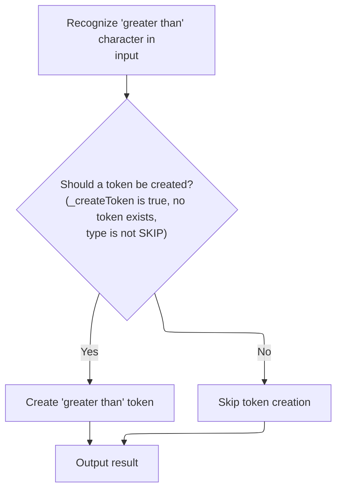
```mermaid
%%{init: {"flowchart": {"defaultRenderer": "elk"}} }%%
flowchart TD
    node1["Recognize 'greater than' character in
input"]
    click node1 openCode "core/src/main/java/org/apache/struts/validator/validwhen/ValidWhenLexer.java:757:757"
    node1 --> node2{"Should a token be created?
(_createToken is true, no token exists,
type is not SKIP)"}
    click node2 openCode "core/src/main/java/org/apache/struts/validator/validwhen/ValidWhenLexer.java:758:758"
    node2 -->|"Yes"| node3["Create 'greater than' token"]
    click node3 openCode "core/src/main/java/org/apache/struts/validator/validwhen/ValidWhenLexer.java:759:760"
    node2 -->|"No"| node4["Skip token creation"]
    click node4 openCode "core/src/main/java/org/apache/struts/validator/validwhen/ValidWhenLexer.java:761:761"
    node3 --> node5["Output result"]
    node4 --> node5
    click node5 openCode "core/src/main/java/org/apache/struts/validator/validwhen/ValidWhenLexer.java:762:763"
classDef HeadingStyle fill:#777777,stroke:#333,stroke-width:2px;

%% Swimm:
%% %%{init: {"flowchart": {"defaultRenderer": "elk"}} }%%
%% flowchart TD
%%     node1["Recognize 'greater than' character in
%% input"]
%%     click node1 openCode "<SwmPath>[core/…/validwhen/ValidWhenLexer.java](core/src/main/java/org/apache/struts/validator/validwhen/ValidWhenLexer.java)</SwmPath>:757:757"
%%     node1 --> node2{"Should a token be created?
%% (<SwmToken path="core/src/main/java/org/apache/struts/validator/validwhen/ValidWhenLexer.java" pos="250:11:11" line-data="	public final void mDECIMAL_LITERAL(boolean _createToken) throws RecognitionException, CharStreamException, TokenStreamException {">`_createToken`</SwmToken> is true, no token exists,
%% type is not SKIP)"}
%%     click node2 openCode "<SwmPath>[core/…/validwhen/ValidWhenLexer.java](core/src/main/java/org/apache/struts/validator/validwhen/ValidWhenLexer.java)</SwmPath>:758:758"
%%     node2 -->|"Yes"| node3["Create 'greater than' token"]
%%     click node3 openCode "<SwmPath>[core/…/validwhen/ValidWhenLexer.java](core/src/main/java/org/apache/struts/validator/validwhen/ValidWhenLexer.java)</SwmPath>:759:760"
%%     node2 -->|"No"| node4["Skip token creation"]
%%     click node4 openCode "<SwmPath>[core/…/validwhen/ValidWhenLexer.java](core/src/main/java/org/apache/struts/validator/validwhen/ValidWhenLexer.java)</SwmPath>:761:761"
%%     node3 --> node5["Output result"]
%%     node4 --> node5
%%     click node5 openCode "<SwmPath>[core/…/validwhen/ValidWhenLexer.java](core/src/main/java/org/apache/struts/validator/validwhen/ValidWhenLexer.java)</SwmPath>:762:763"
%% classDef HeadingStyle fill:#777777,stroke:#333,stroke-width:2px;
```

<SwmSnippet path="/core/src/main/java/org/apache/struts/validator/validwhen/ValidWhenLexer.java" line="752">

---

In <SwmToken path="core/src/main/java/org/apache/struts/validator/validwhen/ValidWhenLexer.java" pos="752:7:7" line-data="	public final void mGREATERTHANSIGN(boolean _createToken) throws RecognitionException, CharStreamException, TokenStreamException {">`mGREATERTHANSIGN`</SwmToken>, we're matching the '>' character and prepping the token. We call ActionConfigMatcher next because the config can block or allow this token, affecting whether it's actually returned.

```java
	public final void mGREATERTHANSIGN(boolean _createToken) throws RecognitionException, CharStreamException, TokenStreamException {
		int _ttype; Token _token=null; int _begin=text.length();
		_ttype = GREATERTHANSIGN;
		int _saveIndex;
		
		match('>');
```

---

</SwmSnippet>

<SwmSnippet path="/core/src/main/java/org/apache/struts/validator/validwhen/ValidWhenLexer.java" line="758">

---

Just returned from ActionConfigMatcher, now at the end of <SwmToken path="core/src/main/java/org/apache/struts/validator/validwhen/ValidWhenLexer.java" pos="173:1:1" line-data="						mGREATERTHANSIGN(true);">`mGREATERTHANSIGN`</SwmToken> we only build and return the token if it's not marked as SKIP. The matcher config can suppress token creation, so the token might not be passed on.

```java
		if ( _createToken && _token==null && _ttype!=Token.SKIP ) {
			_token = makeToken(_ttype);
			_token.setText(new String(text.getBuffer(), _begin, text.length()-_begin));
		}
		_returnToken = _token;
	}
```

---

</SwmSnippet>

### Finalizing Token and Handling Errors

<SwmSnippet path="/core/src/main/java/org/apache/struts/validator/validwhen/ValidWhenLexer.java" line="181">

---

Just returned from <SwmToken path="core/src/main/java/org/apache/struts/validator/validwhen/ValidWhenLexer.java" pos="173:1:1" line-data="						mGREATERTHANSIGN(true);">`mGREATERTHANSIGN`</SwmToken>, now in <SwmToken path="core/src/main/java/org/apache/struts/dispatcher/AbstractEventMappingDispatcher.java" pos="93:9:9" line-data="            String methodKey = st.nextToken().trim();">`nextToken`</SwmToken> we're finalizing the token, checking for SKIP, updating the type, and handling errors. Next, we call <SwmToken path="faces/src/main/java/org/apache/struts/faces/component/CommandLinkComponent.java" pos="37:4:4" line-data="public class CommandLinkComponent extends UICommand {">`CommandLinkComponent`</SwmToken> to use these tokens for dynamic UI or validation.

```java
				if ( _returnToken==null ) continue tryAgain; // found SKIP token
				_ttype = _returnToken.getType();
				_ttype = testLiteralsTable(_ttype);
				_returnToken.setType(_ttype);
				return _returnToken;
			}
			catch (RecognitionException e) {
				throw new TokenStreamRecognitionException(e);
			}
		}
```

---

</SwmSnippet>

<SwmSnippet path="/faces/src/main/java/org/apache/struts/faces/component/CommandLinkComponent.java" line="434">

---

<SwmToken path="faces/src/main/java/org/apache/struts/faces/component/CommandLinkComponent.java" pos="434:5:5" line-data="    public String getType() {">`getType`</SwmToken> first tries to resolve 'type' dynamically using <SwmToken path="faces/src/main/java/org/apache/struts/faces/component/CommandLinkComponent.java" pos="435:1:1" line-data="        ValueBinding vb = getValueBinding(&quot;type&quot;);">`ValueBinding`</SwmToken> from the <SwmToken path="faces/src/main/java/org/apache/struts/faces/component/CommandLinkComponent.java" pos="26:8:8" line-data="import javax.faces.context.FacesContext;">`FacesContext`</SwmToken>. If that's not set, it falls back to the local 'type' variable. This lets the component adapt its behavior at runtime based on JSF bindings.

```java
    public String getType() {
        ValueBinding vb = getValueBinding("type");
        if (vb != null) {
            return (String) vb.getValue(getFacesContext());
        } else {
            return type;
        }
    }
```

---

</SwmSnippet>

<SwmSnippet path="/core/src/main/java/org/apache/struts/validator/validwhen/ValidWhenLexer.java" line="191">

---

Just returned from <SwmToken path="faces/src/main/java/org/apache/struts/faces/component/CommandLinkComponent.java" pos="37:4:4" line-data="public class CommandLinkComponent extends UICommand {">`CommandLinkComponent`</SwmToken>, now at the end of <SwmToken path="core/src/main/java/org/apache/struts/dispatcher/AbstractEventMappingDispatcher.java" pos="93:9:9" line-data="            String methodKey = st.nextToken().trim();">`nextToken`</SwmToken> we're handling stream exceptions and making sure any IO or recognition errors are thrown properly. This keeps the token stream reliable for JSF components downstream.

```java
		catch (CharStreamException cse) {
			if ( cse instanceof CharStreamIOException ) {
				throw new TokenStreamIOException(((CharStreamIOException)cse).io);
			}
			else {
				throw new TokenStreamException(cse.getMessage());
			}
		}
	}
}
```

---

</SwmSnippet>

## Selecting the Method Name Based on Submission Parameters


```mermaid
%%{init: {"flowchart": {"defaultRenderer": "elk"}} }%%
flowchart TD
    node1["Start resolving method name"]
    click node1 openCode "core/src/main/java/org/apache/struts/dispatcher/AbstractEventMappingDispatcher.java:94:94"
    
    subgraph loop1["For each method key"]
        node1 --> node2{"Does method key contain '='?"}
        click node2 openCode "core/src/main/java/org/apache/struts/dispatcher/AbstractEventMappingDispatcher.java:98:99"
        node2 -->|"Yes"| node3["Extract method name from alias"]
        click node3 openCode "core/src/main/java/org/apache/struts/dispatcher/AbstractEventMappingDispatcher.java:100:101"
        node2 -->|"No"| node4["Use method key as method name"]
        click node4 openCode "core/src/main/java/org/apache/struts/dispatcher/AbstractEventMappingDispatcher.java:94:95"
        node3 --> node5{"Is method key the default?"}
        node4 --> node5
        click node5 openCode "core/src/main/java/org/apache/struts/dispatcher/AbstractEventMappingDispatcher.java:105:106"
        node5 -->|"Yes"| node6["Set as default method name"]
        click node6 openCode "core/src/main/java/org/apache/struts/dispatcher/AbstractEventMappingDispatcher.java:106:107"
        node5 -->|"No"| node7["Check if method key matches submission
parameter"]
        click node7 openCode "core/src/main/java/org/apache/struts/dispatcher/AbstractEventMappingDispatcher.java:110:111"
        node6 --> node7
        node7 --> node8{"Is there a match?"}
        click node8 openCode "core/src/main/java/org/apache/struts/dispatcher/AbstractEventMappingDispatcher.java:110:112"
        node8 -->|"Yes"| node9["Return method name"]
        click node9 openCode "core/src/main/java/org/apache/struts/dispatcher/AbstractEventMappingDispatcher.java:111:112"
        node8 -->|"No"| node10["Continue to next method key"]
    end
    node10 --> node11["Return default method name"]
    click node11 openCode "core/src/main/java/org/apache/struts/dispatcher/AbstractEventMappingDispatcher.java:115:116"

classDef HeadingStyle fill:#777777,stroke:#333,stroke-width:2px;

%% Swimm:
%% %%{init: {"flowchart": {"defaultRenderer": "elk"}} }%%
%% flowchart TD
%%     node1["Start resolving method name"]
%%     click node1 openCode "<SwmPath>[core/…/dispatcher/AbstractEventMappingDispatcher.java](core/src/main/java/org/apache/struts/dispatcher/AbstractEventMappingDispatcher.java)</SwmPath>:94:94"
%%     
%%     subgraph loop1["For each method key"]
%%         node1 --> node2{"Does method key contain '='?"}
%%         click node2 openCode "<SwmPath>[core/…/dispatcher/AbstractEventMappingDispatcher.java](core/src/main/java/org/apache/struts/dispatcher/AbstractEventMappingDispatcher.java)</SwmPath>:98:99"
%%         node2 -->|"Yes"| node3["Extract method name from alias"]
%%         click node3 openCode "<SwmPath>[core/…/dispatcher/AbstractEventMappingDispatcher.java](core/src/main/java/org/apache/struts/dispatcher/AbstractEventMappingDispatcher.java)</SwmPath>:100:101"
%%         node2 -->|"No"| node4["Use method key as method name"]
%%         click node4 openCode "<SwmPath>[core/…/dispatcher/AbstractEventMappingDispatcher.java](core/src/main/java/org/apache/struts/dispatcher/AbstractEventMappingDispatcher.java)</SwmPath>:94:95"
%%         node3 --> node5{"Is method key the default?"}
%%         node4 --> node5
%%         click node5 openCode "<SwmPath>[core/…/dispatcher/AbstractEventMappingDispatcher.java](core/src/main/java/org/apache/struts/dispatcher/AbstractEventMappingDispatcher.java)</SwmPath>:105:106"
%%         node5 -->|"Yes"| node6["Set as default method name"]
%%         click node6 openCode "<SwmPath>[core/…/dispatcher/AbstractEventMappingDispatcher.java](core/src/main/java/org/apache/struts/dispatcher/AbstractEventMappingDispatcher.java)</SwmPath>:106:107"
%%         node5 -->|"No"| node7["Check if method key matches submission
%% parameter"]
%%         click node7 openCode "<SwmPath>[core/…/dispatcher/AbstractEventMappingDispatcher.java](core/src/main/java/org/apache/struts/dispatcher/AbstractEventMappingDispatcher.java)</SwmPath>:110:111"
%%         node6 --> node7
%%         node7 --> node8{"Is there a match?"}
%%         click node8 openCode "<SwmPath>[core/…/dispatcher/AbstractEventMappingDispatcher.java](core/src/main/java/org/apache/struts/dispatcher/AbstractEventMappingDispatcher.java)</SwmPath>:110:112"
%%         node8 -->|"Yes"| node9["Return method name"]
%%         click node9 openCode "<SwmPath>[core/…/dispatcher/AbstractEventMappingDispatcher.java](core/src/main/java/org/apache/struts/dispatcher/AbstractEventMappingDispatcher.java)</SwmPath>:111:112"
%%         node8 -->|"No"| node10["Continue to next method key"]
%%     end
%%     node10 --> node11["Return default method name"]
%%     click node11 openCode "<SwmPath>[core/…/dispatcher/AbstractEventMappingDispatcher.java](core/src/main/java/org/apache/struts/dispatcher/AbstractEventMappingDispatcher.java)</SwmPath>:115:116"
%% 
%% classDef HeadingStyle fill:#777777,stroke:#333,stroke-width:2px;
```

<SwmSnippet path="/core/src/main/java/org/apache/struts/dispatcher/AbstractEventMappingDispatcher.java" line="94">

---

Just returned from <SwmToken path="core/src/main/java/org/apache/struts/validator/validwhen/ValidWhenLexer.java" pos="1:25:25" line-data="// $ANTLR 2.7.7 (20060906): &quot;ValidWhenParser.g&quot; -&gt; &quot;ValidWhenLexer.java&quot;$">`ValidWhenLexer`</SwmToken>, now at the end of <SwmToken path="core/src/main/java/org/apache/struts/dispatcher/AbstractEventMappingDispatcher.java" pos="81:7:7" line-data="    protected final String resolveMethodName(ActionContext context) {">`resolveMethodName`</SwmToken> we're looping through method keys and aliases, checking for matches in the submission parameters. If a match is found, we return the method name; otherwise, we use the default if set. This makes the dispatcher flexible for different form setups.

```java
            String methodName = methodKey;

            // The key can either be a direct method name or an alias
            // to a method as indicated by a "key=value" signature
            int equals = methodKey.indexOf('=');
            if (equals > -1) {
                methodName = methodKey.substring(equals + 1).trim();
                methodKey = methodKey.substring(0, equals).trim();
            }

            // Set the default if it passes by
            if (methodKey.equals(DEFAULT_METHOD_KEY)) {
                defaultMethodName = methodName;
            }

            // Is it a match?
            if (isSubmissionParameter(context, methodKey)) {
                return methodName;
            }
        }

        return defaultMethodName;
    }
```

---

</SwmSnippet>

&nbsp;

*This is an auto-generated document by Swimm 🌊 and has not yet been verified by a human*

<SwmMeta version="3.0.0" repo-id="Z2l0aHViJTNBJTNBc3RydXRzMSUzQSUzQVN3aW1tLURlbW8=" repo-name="struts1"><sup>Powered by [Swimm](https://app.swimm.io/)</sup></SwmMeta>
