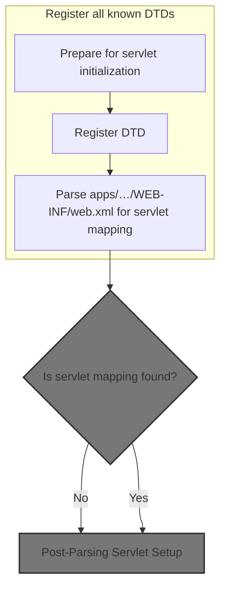
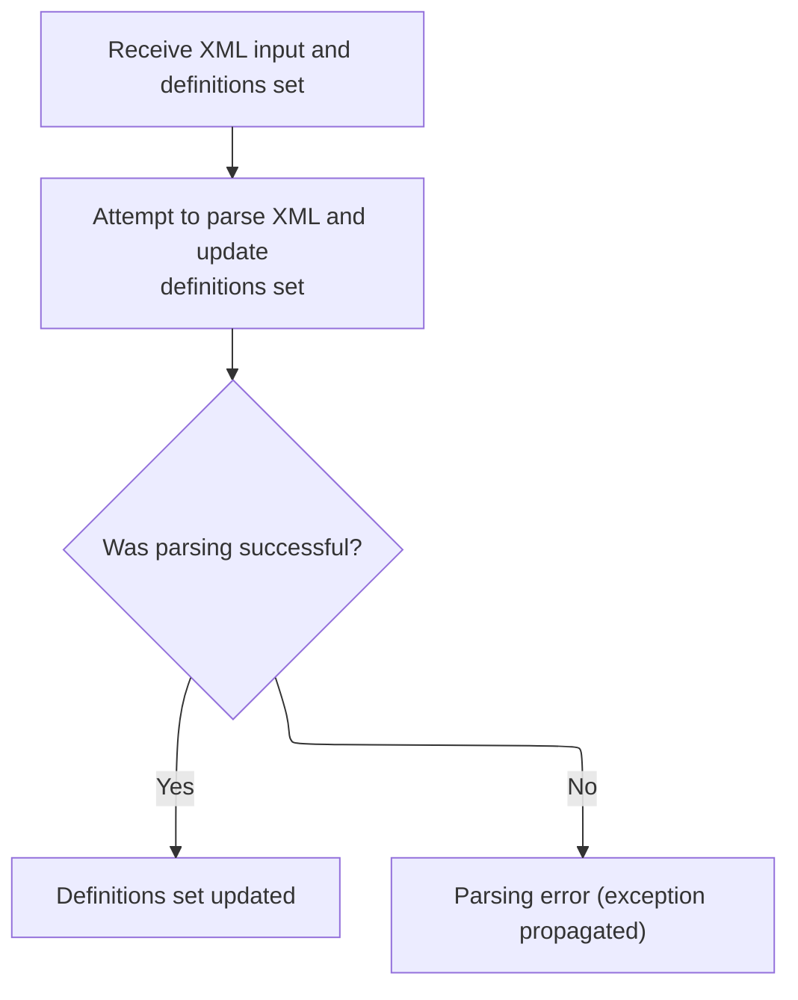

This document describes how the servlet environment is initialized, view composition is configured, and user data is prepared for use. The flow starts by reading configuration files to determine servlet mappings, then parses tile definitions for view setup, and finally serializes user data so it is available to the application.

# Bootstrapping Servlet Configuration



<SwmSnippet path="/core/src/main/java/org/apache/struts/action/ActionServlet.java" line="1797">

---

In <SwmToken path="core/src/main/java/org/apache/struts/action/ActionServlet.java" pos="1797:5:5" line-data="    protected void initServlet()">`initServlet`</SwmToken>, we're setting up Digester to parse <SwmPath>[apps/…/WEB-INF/web.xml](apps/blank/src/main/webapp/WEB-INF/web.xml)</SwmPath> and extract servlet mappings, and registering local <SwmToken path="core/src/main/java/org/apache/struts/action/ActionServlet.java" pos="1809:15:15" line-data="        // Register our local copy of the DTDs that we can find">`DTDs`</SwmToken> for faster and more reliable XML validation. Calling <SwmPath>[apps/…/example2/LoggedOff.java](apps/faces-example2/src/main/java/org/apache/struts/webapp/example2/LoggedOff.java)</SwmPath> next lets us handle user session state, which is needed before servlet mapping rules are applied.

```java
    protected void initServlet()
        throws ServletException {
        // Remember our servlet name
        this.servletName = getServletConfig().getServletName();

        // Prepare a Digester to scan the web application deployment descriptor
        Digester digester = new Digester();

        digester.push(this);
        digester.setNamespaceAware(true);
        digester.setValidating(false);

        // Register our local copy of the DTDs that we can find
        for (int i = 0; i < registrations.length; i += 2) {
            URL url = this.getClass().getResource(registrations[i + 1]);

            if (url != null) {
                digester.register(registrations[i], url.toString());
            }
        }

```

---

</SwmSnippet>

<SwmSnippet path="/core/src/main/java/org/apache/struts/action/ActionServlet.java" line="1818">

---

Back in ActionServlet.initServlet, after handling session state with <SwmPath>[apps/…/example2/LoggedOff.java](apps/faces-example2/src/main/java/org/apache/struts/webapp/example2/LoggedOff.java)</SwmPath>, we configure Digester to extract servlet mappings from <SwmPath>[apps/…/WEB-INF/web.xml](apps/blank/src/main/webapp/WEB-INF/web.xml)</SwmPath>. Next, we call <SwmPath>[tiles/…/xmlDefinition/XmlParser.java](tiles/src/main/java/org/apache/struts/tiles/xmlDefinition/XmlParser.java)</SwmPath> to parse tile definitions, which are needed for view composition.

```java
        // Configure the processing rules that we need
        digester.addCallMethod("web-app/servlet-mapping", "addServletMapping", 2);
        digester.addCallParam("web-app/servlet-mapping/servlet-name", 0);
        digester.addCallParam("web-app/servlet-mapping/url-pattern", 1);

        // Process the web application deployment descriptor
        if (log.isDebugEnabled()) {
            log.debug("Scanning web.xml for controller servlet mapping");
        }

        InputStream input =
            getServletContext().getResourceAsStream("/WEB-INF/web.xml");

        if (input == null) {
            log.error(internal.getMessage("configWebXml"));
            throw new ServletException(internal.getMessage("configWebXml"));
        }

        try {
            digester.parse(input);
```

---

</SwmSnippet>

## Parsing Tile Definitions



<SwmSnippet path="/tiles/src/main/java/org/apache/struts/tiles/xmlDefinition/XmlParser.java" line="275">

---

XmlParser.parse processes the tile definitions XML, pushing the definitions object onto the Digester stack and parsing the input stream. Next, we call <SwmToken path="apps/faces-example1/src/main/java/org/apache/struts/webapp/example/memory/MemoryUserDatabase.java" pos="53:6:6" line-data="public final class MemoryUserDatabase implements UserDatabase {">`MemoryUserDatabase`</SwmToken> to set up user data needed for the app.

```java
  public void parse( InputStream in, XmlDefinitionsSet definitions ) throws IOException, SAXException
  {
    try
    {
      // set first object in stack
    //digester.clear();
    digester.push(definitions);
      // parse
      digester.parse(in);
      in.close();
      }
  catch (SAXException e)
    {
      //throw new ServletException( "Error while parsing " + mappingConfig, e);
    throw e;
      }

  }
```

---

</SwmSnippet>

## Finalizing User Database State

<SwmSnippet path="/apps/faces-example1/src/main/java/org/apache/struts/webapp/example/memory/MemoryUserDatabase.java" line="106">

---

MemoryUserDatabase.close calls save to persist user data before finalizing. We call <SwmToken path="apps/faces-example1/src/main/java/org/apache/struts/webapp/example/memory/MemoryUserDatabase.java" pos="53:6:6" line-data="public final class MemoryUserDatabase implements UserDatabase {">`MemoryUserDatabase`</SwmToken> again to handle the actual save logic and user serialization.

```java
    public void close() throws Exception {

        save();

    }
```

---

</SwmSnippet>

## Serializing User Data

<SwmSnippet path="/apps/faces-example1/src/main/java/org/apache/struts/webapp/example/memory/MemoryUserDatabase.java" line="257">

---

In save, we prep the output file and write the XML prolog and database tag. Next, we call <SwmToken path="apps/faces-example1/src/main/java/org/apache/struts/webapp/example/memory/MemoryUserDatabase.java" pos="277:9:9" line-data="            User users[] = findUsers();">`findUsers`</SwmToken> to get the user list for serialization.

```java
    public void save() throws Exception {

        if (log.isDebugEnabled()) {
            log.debug("Saving database to '" + pathname + "'");
        }
        File fileNew = new File(pathnameNew);
        PrintWriter writer = null;

        try {

            // Configure our PrintWriter
            FileOutputStream fos = new FileOutputStream(fileNew);
            OutputStreamWriter osw = new OutputStreamWriter(fos);
            writer = new PrintWriter(osw);

            // Print the file prolog
            writer.println("<?xml version='1.0'?>");
            writer.println("<database>");

            // Print entries for each defined user and associated subscriptions
            User users[] = findUsers();
```

---

</SwmSnippet>

<SwmSnippet path="/apps/faces-example1/src/main/java/org/apache/struts/webapp/example/memory/MemoryUserDatabase.java" line="160">

---

FindUsers synchronizes on the users collection, converts it to an array, and returns all User objects. This ensures thread-safe access for serialization.

```java
    public User[] findUsers() {

        synchronized (users) {
            User results[] = new User[users.size()];
            return ((User[]) users.values().toArray(results));
        }

    }
```

---

</SwmSnippet>

<SwmSnippet path="/apps/faces-example1/src/main/java/org/apache/struts/webapp/example/memory/MemoryUserDatabase.java" line="278">

---

Back in MemoryUserDatabase.save, after getting the user array from <SwmToken path="apps/faces-example1/src/main/java/org/apache/struts/webapp/example/memory/MemoryUserDatabase.java" pos="160:7:7" line-data="    public User[] findUsers() {">`findUsers`</SwmToken>, we loop through each user and their subscriptions, writing them to the XML output.

```java
            for (int i = 0; i < users.length; i++) {
                writer.print("  ");
                writer.println(users[i]);
                Subscription subscriptions[] =
                    users[i].getSubscriptions();
                for (int j = 0; j < subscriptions.length; j++) {
                    writer.print("    ");
                    writer.println(subscriptions[j]);
                    writer.print("    ");
                    writer.println("</subscription>");
                }
                writer.print("  ");
                writer.println("</user>");
            }
```

---

</SwmSnippet>

<SwmSnippet path="/apps/faces-example1/src/main/java/org/apache/struts/webapp/example/memory/MemoryUserDatabase.java" line="293">

---

Finally, we write the closing database tag and check for writer errors. If there's an error, we clean up and throw an exception. Next, we handle cleanup and file renaming in <SwmToken path="apps/faces-example1/src/main/java/org/apache/struts/webapp/example/memory/MemoryUserDatabase.java" pos="53:6:6" line-data="public final class MemoryUserDatabase implements UserDatabase {">`MemoryUserDatabase`</SwmToken>.

```java
            // Print the file epilog
            writer.println("</database>");

            // Check for errors that occurred while printing
            if (writer.checkError()) {
                writer.close();
```

---

</SwmSnippet>

<SwmSnippet path="/apps/faces-example1/src/main/java/org/apache/struts/webapp/example/memory/MemoryUserDatabase.java" line="299">

---

Back in MemoryUserDatabase.save, if writing fails, we delete the new file and throw an exception. Next, RegistrationBacking handles any user registration cleanup needed.

```java
                fileNew.delete();
                throw new IOException
                    ("Saving database to '" + pathname + "'");
            }
```

---

</SwmSnippet>

### Cleaning Up User Registration

See <SwmLink doc-title="Deleting a subscription">[Deleting a subscription](/.swm/deleting-a-subscription.izc5n4kw.sw.md)</SwmLink>

### Completing User Data Serialization

```mermaid
%%{init: {"flowchart": {"defaultRenderer": "elk"}} }%%
flowchart TD
  node1["Write new user database file"]
  click node1 openCode "apps/faces-example1/src/main/java/org/apache/struts/webapp/example/memory/MemoryUserDatabase.java:303:310"
  node1 --> node2{"Error during write?"}
  click node2 openCode "apps/faces-example1/src/main/java/org/apache/struts/webapp/example/memory/MemoryUserDatabase.java:306:312"
  node2 -->|"Yes"| node3["Delete new file and rethrow error"]
  click node3 openCode "apps/faces-example1/src/main/java/org/apache/struts/webapp/example/memory/MemoryUserDatabase.java:311:312"
  node2 -->|"No"| node4{"Does original file exist?"}
  click node4 openCode "apps/faces-example1/src/main/java/org/apache/struts/webapp/example/memory/MemoryUserDatabase.java:320:326"
  node4 -->|"Yes"| node5["Delete backup file"]
  click node5 openCode "apps/faces-example1/src/main/java/org/apache/struts/webapp/example/memory/MemoryUserDatabase.java:321:322"
  node5 --> node6["Rename original file to backup"]
  click node6 openCode "apps/faces-example1/src/main/java/org/apache/struts/webapp/example/memory/MemoryUserDatabase.java:322:325"
  node6 --> node7{"Rename new file to original?"}
  click node7 openCode "apps/faces-example1/src/main/java/org/apache/struts/webapp/example/memory/MemoryUserDatabase.java:327:333"
  node7 -->|"Yes"| node8["Delete backup file"]
  click node8 openCode "apps/faces-example1/src/main/java/org/apache/struts/webapp/example/memory/MemoryUserDatabase.java:334:334"
  node7 -->|"No"| node9["Restore backup as original and throw
error"]
  click node9 openCode "apps/faces-example1/src/main/java/org/apache/struts/webapp/example/memory/MemoryUserDatabase.java:328:332"
  node4 -->|"No"| node7

classDef HeadingStyle fill:#777777,stroke:#333,stroke-width:2px;

%% Swimm:
%% %%{init: {"flowchart": {"defaultRenderer": "elk"}} }%%
%% flowchart TD
%%   node1["Write new user database file"]
%%   click node1 openCode "<SwmPath>[apps/…/memory/MemoryUserDatabase.java](apps/faces-example1/src/main/java/org/apache/struts/webapp/example/memory/MemoryUserDatabase.java)</SwmPath>:303:310"
%%   node1 --> node2{"Error during write?"}
%%   click node2 openCode "<SwmPath>[apps/…/memory/MemoryUserDatabase.java](apps/faces-example1/src/main/java/org/apache/struts/webapp/example/memory/MemoryUserDatabase.java)</SwmPath>:306:312"
%%   node2 -->|"Yes"| node3["Delete new file and rethrow error"]
%%   click node3 openCode "<SwmPath>[apps/…/memory/MemoryUserDatabase.java](apps/faces-example1/src/main/java/org/apache/struts/webapp/example/memory/MemoryUserDatabase.java)</SwmPath>:311:312"
%%   node2 -->|"No"| node4{"Does original file exist?"}
%%   click node4 openCode "<SwmPath>[apps/…/memory/MemoryUserDatabase.java](apps/faces-example1/src/main/java/org/apache/struts/webapp/example/memory/MemoryUserDatabase.java)</SwmPath>:320:326"
%%   node4 -->|"Yes"| node5["Delete backup file"]
%%   click node5 openCode "<SwmPath>[apps/…/memory/MemoryUserDatabase.java](apps/faces-example1/src/main/java/org/apache/struts/webapp/example/memory/MemoryUserDatabase.java)</SwmPath>:321:322"
%%   node5 --> node6["Rename original file to backup"]
%%   click node6 openCode "<SwmPath>[apps/…/memory/MemoryUserDatabase.java](apps/faces-example1/src/main/java/org/apache/struts/webapp/example/memory/MemoryUserDatabase.java)</SwmPath>:322:325"
%%   node6 --> node7{"Rename new file to original?"}
%%   click node7 openCode "<SwmPath>[apps/…/memory/MemoryUserDatabase.java](apps/faces-example1/src/main/java/org/apache/struts/webapp/example/memory/MemoryUserDatabase.java)</SwmPath>:327:333"
%%   node7 -->|"Yes"| node8["Delete backup file"]
%%   click node8 openCode "<SwmPath>[apps/…/memory/MemoryUserDatabase.java](apps/faces-example1/src/main/java/org/apache/struts/webapp/example/memory/MemoryUserDatabase.java)</SwmPath>:334:334"
%%   node7 -->|"No"| node9["Restore backup as original and throw
%% error"]
%%   click node9 openCode "<SwmPath>[apps/…/memory/MemoryUserDatabase.java](apps/faces-example1/src/main/java/org/apache/struts/webapp/example/memory/MemoryUserDatabase.java)</SwmPath>:328:332"
%%   node4 -->|"No"| node7
%% 
%% classDef HeadingStyle fill:#777777,stroke:#333,stroke-width:2px;
```



<SwmSnippet path="/apps/faces-example1/src/main/java/org/apache/struts/webapp/example/memory/MemoryUserDatabase.java" line="303">

---

Back from RegistrationBacking, we handle exceptions in MemoryUserDatabase.save by closing the writer and deleting the file if needed. Next, we finalize file renaming and cleanup in <SwmToken path="apps/faces-example1/src/main/java/org/apache/struts/webapp/example/memory/MemoryUserDatabase.java" pos="53:6:6" line-data="public final class MemoryUserDatabase implements UserDatabase {">`MemoryUserDatabase`</SwmToken>.

```java
            writer.close();
            writer = null;

        } catch (IOException e) {

            if (writer != null) {
                writer.close();
            }
```

---

</SwmSnippet>

<SwmSnippet path="/apps/faces-example1/src/main/java/org/apache/struts/webapp/example/memory/MemoryUserDatabase.java" line="311">

---

Back in MemoryUserDatabase.save, we rename files to finalize the database update and clean up old files. Next, RegistrationBacking can handle any post-save user registration logic.

```java
            fileNew.delete();
            throw e;

        }


        // Perform the required renames to permanently save this file
        File fileOrig = new File(pathname);
        File fileOld = new File(pathnameOld);
        if (fileOrig.exists()) {
            fileOld.delete();
            if (!fileOrig.renameTo(fileOld)) {
                throw new IOException
                    ("Renaming '" + pathname + "' to '" + pathnameOld + "'");
            }
        }
        if (!fileNew.renameTo(fileOrig)) {
            if (fileOld.exists()) {
                fileOld.renameTo(fileOrig);
            }
            throw new IOException
                ("Renaming '" + pathnameNew + "' to '" + pathname + "'");
        }
        fileOld.delete();

    }
```

---

</SwmSnippet>

## Post-Parsing Servlet Setup

<SwmSnippet path="/core/src/main/java/org/apache/struts/action/ActionServlet.java" line="1838">

---

Back in ActionServlet.initServlet, after parsing tile definitions, we handle exceptions and log servlet mapping info. Next, we call <SwmToken path="apps/faces-example1/src/main/java/org/apache/struts/webapp/example/memory/MemoryUserDatabase.java" pos="53:6:6" line-data="public final class MemoryUserDatabase implements UserDatabase {">`MemoryUserDatabase`</SwmToken> to set up user data for the servlet context.

```java
        } catch (IOException e) {
            log.error(internal.getMessage("configWebXml"), e);
            throw new ServletException(e);
        } catch (SAXException e) {
            log.error(internal.getMessage("configWebXml"), e);
            throw new ServletException(e);
        } finally {
            try {
                input.close();
            } catch (IOException e) {
                log.error(internal.getMessage("configWebXml"), e);
                throw new ServletException(e);
            }
        }

        // Record a servlet context attribute (if appropriate)
        if (log.isDebugEnabled()) {
            log.debug("Mapping for servlet '" + servletName + "' = '"
                + servletMapping + "'");
        }

```

---

</SwmSnippet>

<SwmSnippet path="/core/src/main/java/org/apache/struts/action/ActionServlet.java" line="1859">

---

Back in ActionServlet.initServlet, after initializing user data, we set the servlet mapping as a context attribute so other components can access it for integration.

```java
        if (servletMapping != null) {
            getServletContext().setAttribute(Globals.SERVLET_KEY, servletMapping);
        }
    }
```

---

</SwmSnippet>

&nbsp;

*This is an auto-generated document by Swimm 🌊 and has not yet been verified by a human*

<SwmMeta version="3.0.0" repo-id="Z2l0aHViJTNBJTNBc3RydXRzMSUzQSUzQVN3aW1tLURlbW8=" repo-name="struts1"><sup>Powered by [Swimm](https://app.swimm.io/)</sup></SwmMeta>
