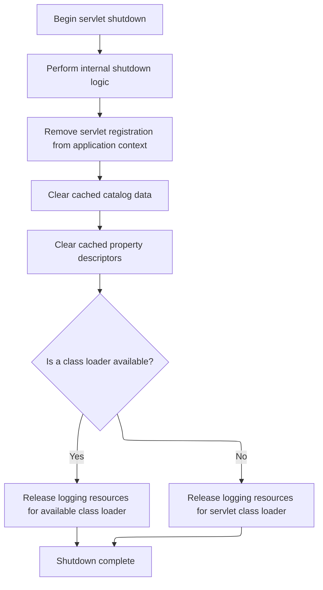

This document outlines the process for shutting down the servlet and ensuring all modules and plugins are properly cleaned up. When the servlet is destroyed, the system releases all resources, removes module configurations, and destroys plugins to maintain application stability and prevent resource leaks.

# Starting the Request Processor Teardown

<SwmSnippet path="/core/src/main/java/org/apache/struts/chain/ComposableRequestProcessor.java" line="129">

---

In <SwmToken path="core/src/main/java/org/apache/struts/chain/ComposableRequestProcessor.java" pos="129:5:5" line-data="    public void destroy() {">`destroy`</SwmToken>, we kick off the cleanup by calling the superclass's destroy method. This makes sure any teardown logic from higher up the chain runs before we handle our own cleanup. Next, we move to the servlet's destroy logic to continue the teardown process.

```java
    public void destroy() {
        super.destroy();
```

---

</SwmSnippet>

## Servlet-Level Cleanup Begins

<SwmSnippet path="/core/src/main/java/org/apache/struts/action/ActionServlet.java" line="294">

---

In <SwmToken path="core/src/main/java/org/apache/struts/action/ActionServlet.java" pos="294:5:5" line-data="    public void destroy() {">`destroy`</SwmToken>, the servlet logs that it's finalizing (if debug is enabled) and then calls <SwmToken path="core/src/main/java/org/apache/struts/action/ActionServlet.java" pos="299:1:1" line-data="        destroyModules();">`destroyModules`</SwmToken> to handle module-specific cleanup before moving on to other shutdown steps.

```java
    public void destroy() {
        if (log.isDebugEnabled()) {
            log.debug(internal.getMessage("finalizing"));
        }

        destroyModules();
```

---

</SwmSnippet>

### Collecting Module Attributes for Cleanup

```mermaid
%%{init: {"flowchart": {"defaultRenderer": "elk"}} }%%
flowchart TD
    node1["Start module cleanup"]
    click node1 openCode "core/src/main/java/org/apache/struts/action/ActionServlet.java:513:554"
    
    subgraph loop1["For each attribute in servlet context"]
        node1 --> node2{"Is attribute a module configuration?"}
        click node2 openCode "core/src/main/java/org/apache/struts/action/ActionServlet.java:517:529"
        node2 -->|"Yes"| node3{"Is there a processor for the module?"}
        click node3 openCode "core/src/main/java/org/apache/struts/action/ActionServlet.java:533:535"
        node3 -->|"Yes"| node4["Destroy processor"]
        click node4 openCode "core/src/main/java/org/apache/struts/action/ActionServlet.java:534:534"
        node3 -->|"No"| node5["Remove module attribute"]
        node4 --> node5["Remove module attribute"]
        click node5 openCode "core/src/main/java/org/apache/struts/action/ActionServlet.java:537:537"
        node5 --> node6{"Are there plugins for the module?"}
        click node6 openCode "core/src/main/java/org/apache/struts/action/ActionServlet.java:539:543"
        node6 -->|"Yes"| node7["Plugins found"]
        node6 -->|"No"| node2
        
        subgraph loop2["For each plugin in module, in reverse order"]
            node7 --> node8["Destroy plugin"]
            click node8 openCode "core/src/main/java/org/apache/struts/action/ActionServlet.java:547:547"
            node8 --> node9["Remove plugins attribute"]
            click node9 openCode "core/src/main/java/org/apache/struts/action/ActionServlet.java:550:551"
        end
        node9 --> node2
        node2 -->|"No"| node2
    end

classDef HeadingStyle fill:#777777,stroke:#333,stroke-width:2px;

%% Swimm:
%% %%{init: {"flowchart": {"defaultRenderer": "elk"}} }%%
%% flowchart TD
%%     node1["Start module cleanup"]
%%     click node1 openCode "<SwmPath>[core/…/action/ActionServlet.java](core/src/main/java/org/apache/struts/action/ActionServlet.java)</SwmPath>:513:554"
%%     
%%     subgraph loop1["For each attribute in servlet context"]
%%         node1 --> node2{"Is attribute a module configuration?"}
%%         click node2 openCode "<SwmPath>[core/…/action/ActionServlet.java](core/src/main/java/org/apache/struts/action/ActionServlet.java)</SwmPath>:517:529"
%%         node2 -->|"Yes"| node3{"Is there a processor for the module?"}
%%         click node3 openCode "<SwmPath>[core/…/action/ActionServlet.java](core/src/main/java/org/apache/struts/action/ActionServlet.java)</SwmPath>:533:535"
%%         node3 -->|"Yes"| node4["Destroy processor"]
%%         click node4 openCode "<SwmPath>[core/…/action/ActionServlet.java](core/src/main/java/org/apache/struts/action/ActionServlet.java)</SwmPath>:534:534"
%%         node3 -->|"No"| node5["Remove module attribute"]
%%         node4 --> node5["Remove module attribute"]
%%         click node5 openCode "<SwmPath>[core/…/action/ActionServlet.java](core/src/main/java/org/apache/struts/action/ActionServlet.java)</SwmPath>:537:537"
%%         node5 --> node6{"Are there plugins for the module?"}
%%         click node6 openCode "<SwmPath>[core/…/action/ActionServlet.java](core/src/main/java/org/apache/struts/action/ActionServlet.java)</SwmPath>:539:543"
%%         node6 -->|"Yes"| node7["Plugins found"]
%%         node6 -->|"No"| node2
%%         
%%         subgraph loop2["For each plugin in module, in reverse order"]
%%             node7 --> node8["Destroy plugin"]
%%             click node8 openCode "<SwmPath>[core/…/action/ActionServlet.java](core/src/main/java/org/apache/struts/action/ActionServlet.java)</SwmPath>:547:547"
%%             node8 --> node9["Remove plugins attribute"]
%%             click node9 openCode "<SwmPath>[core/…/action/ActionServlet.java](core/src/main/java/org/apache/struts/action/ActionServlet.java)</SwmPath>:550:551"
%%         end
%%         node9 --> node2
%%         node2 -->|"No"| node2
%%     end
%% 
%% classDef HeadingStyle fill:#777777,stroke:#333,stroke-width:2px;
```



<SwmSnippet path="/core/src/main/java/org/apache/struts/action/ActionServlet.java" line="513">

---

In <SwmToken path="core/src/main/java/org/apache/struts/action/ActionServlet.java" pos="513:5:5" line-data="    protected void destroyModules() {">`destroyModules`</SwmToken>, we gather all attribute names from the servlet context into a list so we can safely iterate and identify which ones are <SwmToken path="core/src/main/java/org/apache/struts/action/ActionServlet.java" pos="527:10:10" line-data="            if (!(value instanceof ModuleConfig)) {">`ModuleConfig`</SwmToken> instances for cleanup.

```java
    protected void destroyModules() {
        ArrayList values = new ArrayList();
        Enumeration names = getServletContext().getAttributeNames();

        while (names.hasMoreElements()) {
            values.add(names.nextElement());
        }
```

---

</SwmSnippet>

<SwmSnippet path="/core/src/main/java/org/apache/struts/action/ActionServlet.java" line="521">

---

Next, we loop through the collected attribute names, destroy any processors tied to <SwmToken path="core/src/main/java/org/apache/struts/action/ActionServlet.java" pos="527:10:10" line-data="            if (!(value instanceof ModuleConfig)) {">`ModuleConfig`</SwmToken> instances, remove those configs from the context, and then destroy and remove any plugins for each module, working backwards through the plugin list.

```java
        Iterator keys = values.iterator();

        while (keys.hasNext()) {
            String name = (String) keys.next();
            Object value = getServletContext().getAttribute(name);

            if (!(value instanceof ModuleConfig)) {
                continue;
            }

            ModuleConfig config = (ModuleConfig) value;

            if (this.getProcessorForModule(config) != null) {
                this.getProcessorForModule(config).destroy();
            }

            getServletContext().removeAttribute(name);

            PlugIn[] plugIns =
                (PlugIn[]) getServletContext().getAttribute(Globals.PLUG_INS_KEY
                    + config.getPrefix());

            if (plugIns != null) {
                for (int i = 0; i < plugIns.length; i++) {
                    int j = plugIns.length - (i + 1);

                    plugIns[j].destroy();
                }

                getServletContext().removeAttribute(Globals.PLUG_INS_KEY
                    + config.getPrefix());
            }
        }
    }
```

---

</SwmSnippet>

### Final Servlet Cleanup and Resource Release



<SwmSnippet path="/core/src/main/java/org/apache/struts/action/ActionServlet.java" line="300">

---

Back in `ActionServlet.destroy`, after module and plugin cleanup, we clear framework caches, remove the servlet reference from the context, and try to release logging resources to avoid memory leaks.

```java
        destroyInternal();
        getServletContext().removeAttribute(Globals.ACTION_SERVLET_KEY);

        CatalogFactory.clear();
        PropertyUtils.clearDescriptors();

        // Release our LogFactory and Log instances (if any)
        ClassLoader classLoader =
            Thread.currentThread().getContextClassLoader();

        if (classLoader == null) {
            classLoader = ActionServlet.class.getClassLoader();
        }

        try {
            LogFactory.release(classLoader);
        } catch (Throwable t) {
            ; // Servlet container doesn't have the latest version

            // of commons-logging-api.jar installed
            // :FIXME: Why is this dependent on the container's version of
            // commons-logging? Shouldn't this depend on the version packaged
            // with Struts?

            /*
              Reason: LogFactory.release(classLoader); was added as
              an attempt to investigate the OutOfMemory error reported on
              Bugzilla #14042. It was committed for version 1.136 by craigmcc
            */
        }
    }
```

---

</SwmSnippet>

## Final Processor Cleanup

<SwmSnippet path="/core/src/main/java/org/apache/struts/chain/ComposableRequestProcessor.java" line="131">

---

Finally, in `ComposableRequestProcessor.destroy`, after returning from the servlet's destroy, we null out our instance variables to make sure nothing is left hanging around for the garbage collector.

```java
        catalogFactory = null;
        catalog = null;
        command = null;
        actionContextClass = null;
        servletActionContextConstructor = null;
    }
```

---

</SwmSnippet>

&nbsp;

*This is an auto-generated document by Swimm 🌊 and has not yet been verified by a human*

<SwmMeta version="3.0.0" repo-id="Z2l0aHViJTNBJTNBc3RydXRzMSUzQSUzQVN3aW1tLURlbW8=" repo-name="struts1"><sup>Powered by [Swimm](https://app.swimm.io/)</sup></SwmMeta>
