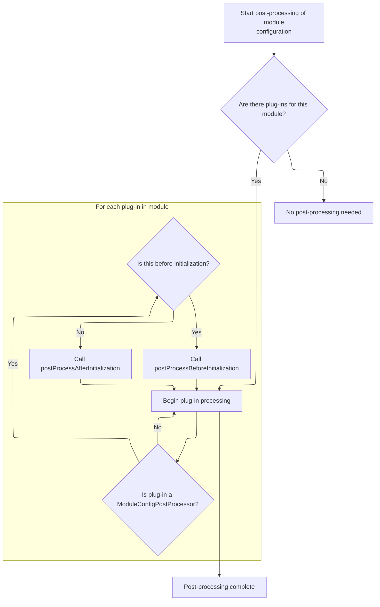

This document describes how message resources are set up for each module. The process starts with the module's configurations, allows plug-ins to make adjustments, and results in message resources being available for use throughout the application.

# Preparing Message Resource Configurations

<SwmSnippet path="/core/src/main/java/org/apache/struts/action/ActionServlet.java" line="1551">

---

In <SwmToken path="core/src/main/java/org/apache/struts/action/ActionServlet.java" pos="1551:5:5" line-data="    protected void initModuleMessageResources(ModuleConfig config)">`initModuleMessageResources`</SwmToken>, we're iterating over all message resource configs for the module, skipping any that don't specify both a factory and a parameter. Next, we call <SwmToken path="core/src/main/java/org/apache/struts/action/ActionServlet.java" pos="1561:1:1" line-data="            postProcessConfig(mrcs[i], config, true);">`postProcessConfig`</SwmToken> so any plug-ins can adjust or prepare the config before we proceed with factory setup.

```java
    protected void initModuleMessageResources(ModuleConfig config)
        throws ServletException {
        MessageResourcesConfig[] mrcs = config.findMessageResourcesConfigs();

        for (int i = 0; i < mrcs.length; i++) {
            if ((mrcs[i].getFactory() == null)
                || (mrcs[i].getParameter() == null)) {
                continue;
            }

            postProcessConfig(mrcs[i], config, true);
            if (log.isDebugEnabled()) {
                log.debug("Initializing module path '" + config.getPrefix()
                    + "' message resources from '" + mrcs[i].getParameter()
                    + "'");
            }

```

---

</SwmSnippet>

## Plug-In Preprocessing for Module Configs



<SwmSnippet path="/core/src/main/java/org/apache/struts/action/ActionServlet.java" line="1992">

---

In <SwmToken path="core/src/main/java/org/apache/struts/action/ActionServlet.java" pos="1992:5:5" line-data="    private void postProcessConfig(BaseConfig config, ModuleConfig moduleConfig, ">`postProcessConfig`</SwmToken>, we grab the plug-ins associated with the current module config. We need to call <SwmToken path="core/src/main/java/org/apache/struts/action/ActionServlet.java" pos="1994:9:9" line-data="        PlugIn[] plugIns = getModulePlugIns(moduleConfig);">`getModulePlugIns`</SwmToken> so we can check if any plug-ins want to process the config before or after initialization.

```java
    private void postProcessConfig(BaseConfig config, ModuleConfig moduleConfig, 
            boolean before) {
        PlugIn[] plugIns = getModulePlugIns(moduleConfig);
        if ((plugIns == null) || (plugIns.length == 0)) {
            return;
        }

```

---

</SwmSnippet>

<SwmSnippet path="/core/src/main/java/org/apache/struts/action/ActionServlet.java" line="1974">

---

<SwmToken path="core/src/main/java/org/apache/struts/action/ActionServlet.java" pos="1974:7:7" line-data="    private PlugIn[] getModulePlugIns(ModuleConfig moduleConfig) {">`getModulePlugIns`</SwmToken> builds a key from a global constant and the module prefix to fetch the plug-ins for that module from the servlet context. It expects either a <SwmToken path="core/src/main/java/org/apache/struts/action/ActionServlet.java" pos="1974:3:3" line-data="    private PlugIn[] getModulePlugIns(ModuleConfig moduleConfig) {">`PlugIn`</SwmToken> array or null, and returns null if the attribute isn't found.

```java
    private PlugIn[] getModulePlugIns(ModuleConfig moduleConfig) {
        try {
            String plugInKey = Globals.PLUG_INS_KEY + moduleConfig.getPrefix(); 
            return (PlugIn[]) getServletContext().getAttribute(plugInKey);
        } catch (NullPointerException e) {
            return null;
        }
    }
```

---

</SwmSnippet>

<SwmSnippet path="/core/src/main/java/org/apache/struts/action/ActionServlet.java" line="1999">

---

Back in <SwmToken path="core/src/main/java/org/apache/struts/action/ActionServlet.java" pos="1561:1:1" line-data="            postProcessConfig(mrcs[i], config, true);">`postProcessConfig`</SwmToken>, after getting the plug-ins, we loop through them and call the appropriate pre- or post-initialization hook if they implement <SwmToken path="core/src/main/java/org/apache/struts/action/ActionServlet.java" pos="2001:8:8" line-data="            if (plugIn instanceof ModuleConfigPostProcessor) {">`ModuleConfigPostProcessor`</SwmToken>. Plug-ins that don't implement this interface are ignored here.

```java
        for (int i = 0; i < plugIns.length; i++) {
            PlugIn plugIn = plugIns[i];
            if (plugIn instanceof ModuleConfigPostProcessor) {
                ModuleConfigPostProcessor p = (ModuleConfigPostProcessor) plugIn;
                if (before) {
                    p.postProcessBeforeInitialization(config, moduleConfig);
                } else {
                    p.postProcessAfterInitialization(config, moduleConfig);
                }
            }
        }
```

---

</SwmSnippet>

## Setting Up the Message Resource Factory

<SwmSnippet path="/core/src/main/java/org/apache/struts/action/ActionServlet.java" line="1568">

---

Back in <SwmToken path="core/src/main/java/org/apache/struts/action/ActionServlet.java" pos="1551:5:5" line-data="    protected void initModuleMessageResources(ModuleConfig config)">`initModuleMessageResources`</SwmToken>, after plug-in processing, we set the factory class for message resources. This step is needed before creating the factory object, so the correct implementation is used.

```java
            String factory = mrcs[i].getFactory();

            MessageResourcesFactory.setFactoryClass(factory);

```

---

</SwmSnippet>

<SwmSnippet path="/core/src/main/java/org/apache/struts/util/MessageResourcesFactory.java" line="150">

---

<SwmToken path="core/src/main/java/org/apache/struts/util/MessageResourcesFactory.java" pos="150:7:7" line-data="    public static void setFactoryClass(String factoryClass) {">`setFactoryClass`</SwmToken> updates the factory class and resets the cached clazz reference to null, making sure any old factory class data is cleared out.

```java
    public static void setFactoryClass(String factoryClass) {
        MessageResourcesFactory.factoryClass = factoryClass;
        MessageResourcesFactory.clazz = null;
    }
```

---

</SwmSnippet>

<SwmSnippet path="/core/src/main/java/org/apache/struts/action/ActionServlet.java" line="1572">

---

Back in <SwmToken path="core/src/main/java/org/apache/struts/action/ActionServlet.java" pos="1551:5:5" line-data="    protected void initModuleMessageResources(ModuleConfig config)">`initModuleMessageResources`</SwmToken>, after setting the factory class, we create the factory object. This object is responsible for producing the message resources using the chosen implementation.

```java
            MessageResourcesFactory factoryObject =
                MessageResourcesFactory.createFactory();

```

---

</SwmSnippet>

<SwmSnippet path="/core/src/main/java/org/apache/struts/action/ActionServlet.java" line="1575">

---

Finally, in <SwmToken path="core/src/main/java/org/apache/struts/action/ActionServlet.java" pos="1551:5:5" line-data="    protected void initModuleMessageResources(ModuleConfig config)">`initModuleMessageResources`</SwmToken>, after creating and configuring the message resources, we call <SwmToken path="core/src/main/java/org/apache/struts/action/ActionServlet.java" pos="1583:1:1" line-data="            postProcessConfig(mrcs[i], config, false);">`postProcessConfig`</SwmToken> again (this time with 'after' semantics) so plug-ins can do any final processing. Then we store the resources in the servlet context for use by the rest of the app.

```java
            factoryObject.setConfig(mrcs[i]);

            MessageResources resources =
                factoryObject.createResources(mrcs[i].getParameter());

            resources.setReturnNull(mrcs[i].getNull());
            resources.setEscape(mrcs[i].isEscape());

            postProcessConfig(mrcs[i], config, false);
            getServletContext().setAttribute(mrcs[i].getKey()
                + config.getPrefix(), resources);
        }
    }
```

---

</SwmSnippet>

&nbsp;

*This is an auto-generated document by Swimm 🌊 and has not yet been verified by a human*

<SwmMeta version="3.0.0" repo-id="Z2l0aHViJTNBJTNBc3RydXRzMSUzQSUzQVN3aW1tLURlbW8=" repo-name="struts1"><sup>Powered by [Swimm](https://app.swimm.io/)</sup></SwmMeta>
