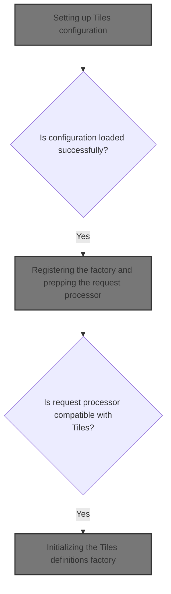
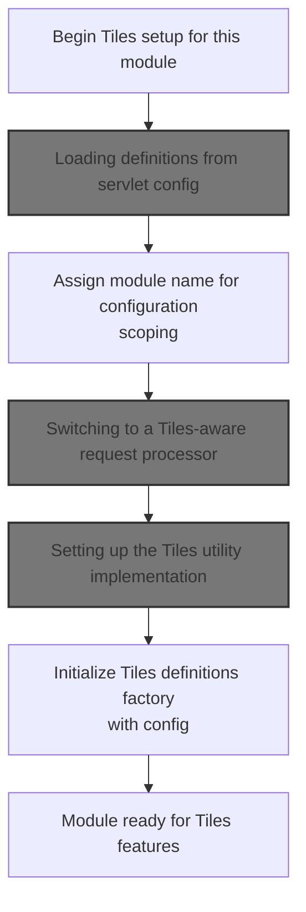
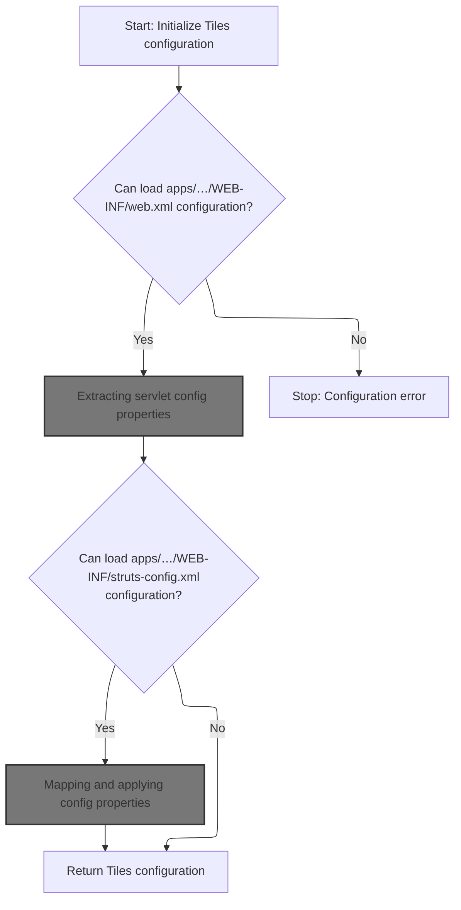
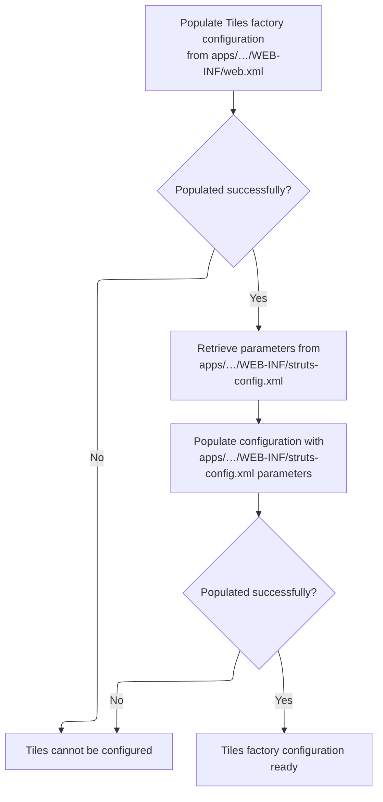
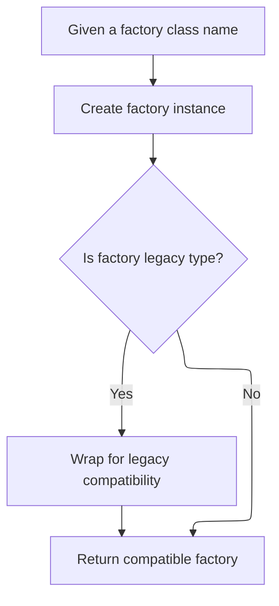

This document describes how a web application module is set up to use Tiles templating. Configuration is merged from multiple sources, the request processor and utility classes are prepared, and a definitions factory is created. The module is then ready to render views using Tiles definitions.



# Setting up Tiles configuration



<SwmSnippet path="/tiles/src/main/java/org/apache/struts/tiles/TilesPlugin.java" line="125">

---

In <SwmToken path="tiles/src/main/java/org/apache/struts/tiles/TilesPlugin.java" pos="125:5:5" line-data="    public void init(ActionServlet servlet, ModuleConfig moduleConfig)">`init`</SwmToken>, we start by creating the factory config using <SwmToken path="tiles/src/main/java/org/apache/struts/tiles/TilesPlugin.java" pos="130:1:1" line-data="            readFactoryConfig(servlet, moduleConfig);">`readFactoryConfig`</SwmToken>. This sets up the definitions needed for Tiles, so later steps can use a consistent setup.

```java
    public void init(ActionServlet servlet, ModuleConfig moduleConfig)
        throws ServletException {

        // Create factory config object
        DefinitionsFactoryConfig factoryConfig =
            readFactoryConfig(servlet, moduleConfig);

```

---

</SwmSnippet>

## Loading definitions from servlet config



<SwmSnippet path="/tiles/src/main/java/org/apache/struts/tiles/TilesPlugin.java" line="264">

---

In <SwmToken path="tiles/src/main/java/org/apache/struts/tiles/TilesPlugin.java" pos="264:5:5" line-data="    protected DefinitionsFactoryConfig readFactoryConfig(">`readFactoryConfig`</SwmToken>, we prep the factory config and then call <SwmToken path="tiles/src/main/java/org/apache/struts/tiles/TilesPlugin.java" pos="273:1:1" line-data="            DefinitionsUtil.populateDefinitionsFactoryConfig(">`DefinitionsUtil`</SwmToken> to fill it with settings from <SwmPath>[apps/…/WEB-INF/web.xml](apps/blank/src/main/webapp/WEB-INF/web.xml)</SwmPath>. This ensures the config reflects the servlet's deployment parameters.

```java
    protected DefinitionsFactoryConfig readFactoryConfig(
        ActionServlet servlet,
        ModuleConfig config)
        throws ServletException {

        // Create tiles definitions config object
        DefinitionsFactoryConfig factoryConfig = new DefinitionsFactoryConfig();
        // Get init parameters from web.xml files
        try {
            DefinitionsUtil.populateDefinitionsFactoryConfig(
                factoryConfig,
                servlet.getServletConfig());

```

---

</SwmSnippet>

### Extracting servlet config properties

<SwmSnippet path="/tiles/src/main/java/org/apache/struts/tiles/DefinitionsUtil.java" line="246">

---

<SwmToken path="tiles/src/main/java/org/apache/struts/tiles/DefinitionsUtil.java" pos="246:7:7" line-data="    public static void populateDefinitionsFactoryConfig(">`populateDefinitionsFactoryConfig`</SwmToken> grabs properties from the servlet config, wraps them in a map, and hands them off to <SwmToken path="tiles/src/main/java/org/apache/struts/tiles/DefinitionsUtil.java" pos="247:3:3" line-data="        DefinitionsFactoryConfig factoryConfig,">`factoryConfig`</SwmToken>. Next, we call <SwmToken path="tiles/src/main/java/org/apache/struts/tiles/DefinitionsUtil.java" pos="252:1:3" line-data="        factoryConfig.populate(properties);">`factoryConfig.populate`</SwmToken> to actually apply these properties, which lets us handle things like backward compatibility and property mapping.

```java
    public static void populateDefinitionsFactoryConfig(
        DefinitionsFactoryConfig factoryConfig,
        ServletConfig servletConfig)
        throws IllegalAccessException, InvocationTargetException {

        Map properties = new DefinitionsUtil.ServletPropertiesMap(servletConfig);
        factoryConfig.populate(properties);
    }
```

---

</SwmSnippet>

### Mapping and applying config properties

<SwmSnippet path="/tiles/src/main/java/org/apache/struts/tiles/DefinitionsFactoryConfig.java" line="260">

---

<SwmToken path="tiles/src/main/java/org/apache/struts/tiles/DefinitionsFactoryConfig.java" pos="260:5:5" line-data="    public void populate(Map properties)">`populate`</SwmToken> first remaps any old property names for compatibility, then uses <SwmToken path="tiles/src/main/java/org/apache/struts/tiles/DefinitionsFactoryConfig.java" pos="265:1:1" line-data="        BeanUtils.populate(this, properties);">`BeanUtils`</SwmToken> to set the config fields from the map. After this, we move on to <SwmToken path="tiles/src/main/java/org/apache/struts/tiles/TilesPlugin.java" pos="174:5:5" line-data="                    (TilesUtilStrutsImpl) RequestUtils">`RequestUtils`</SwmToken> to handle any further property population or conversion needed for requests.

```java
    public void populate(Map properties)
        throws IllegalAccessException, InvocationTargetException {

        // link old parameter names for backward compatibility
        linkOldPropertyNames(properties);
        BeanUtils.populate(this, properties);
    }
```

---

</SwmSnippet>

### Populating request-based properties

See <SwmLink doc-title="Transferring Request Parameters for Redirection">[Transferring Request Parameters for Redirection](/.swm/transferring-request-parameters-for-redirection.xk97hzcl.sw.md)</SwmLink>

### Adding parameters to redirects

See <SwmLink doc-title="Adding Parameters to Redirect URLs">[Adding Parameters to Redirect URLs](/.swm/adding-parameters-to-redirect-urls.vp71ywzv.sw.md)</SwmLink>

### Retrieving Struts plugin config properties



<SwmSnippet path="/tiles/src/main/java/org/apache/struts/tiles/TilesPlugin.java" line="277">

---

After coming back from <SwmToken path="tiles/src/main/java/org/apache/struts/tiles/TilesPlugin.java" pos="273:1:1" line-data="            DefinitionsUtil.populateDefinitionsFactoryConfig(">`DefinitionsUtil`</SwmToken>, we handle exceptions from the previous config population, then grab extra properties from <SwmPath>[apps/…/WEB-INF/struts-config.xml](apps/blank/src/main/webapp/WEB-INF/struts-config.xml)</SwmPath> using <SwmToken path="tiles/src/main/java/org/apache/struts/tiles/TilesPlugin.java" pos="290:7:7" line-data="            Map strutsProperties = findStrutsPlugInConfigProperties(servlet, config);">`findStrutsPlugInConfigProperties`</SwmToken>. This step ensures we merge settings from both config files in TilesPlugin.readFactoryConfig.

```java
        } catch (Exception ex) {
            if (log.isDebugEnabled()){
                log.debug("", ex);
            }
            ex.printStackTrace();
            UnavailableException e2 = new UnavailableException(
                "Can't populate DefinitionsFactoryConfig class from 'web.xml'");
            e2.initCause(ex);
            throw e2;
        }

        // Get init parameters from struts-config.xml
        try {
            Map strutsProperties = findStrutsPlugInConfigProperties(servlet, config);
```

---

</SwmSnippet>

<SwmSnippet path="/tiles/src/main/java/org/apache/struts/tiles/TilesPlugin.java" line="321">

---

FindStrutsPlugInConfigProperties just grabs properties from <SwmToken path="tiles/src/main/java/org/apache/struts/tiles/TilesPlugin.java" pos="326:3:3" line-data="        return currentPlugInConfigObject.getProperties();">`currentPlugInConfigObject`</SwmToken>, ignoring the servlet and config parameters. So, it doesn't actually use the inputs to find anything—just returns what's already stored.

```java
    protected Map findStrutsPlugInConfigProperties(
        ActionServlet servlet,
        ModuleConfig config)
        throws ServletException {

        return currentPlugInConfigObject.getProperties();
    }
```

---

</SwmSnippet>

<SwmSnippet path="/tiles/src/main/java/org/apache/struts/tiles/TilesPlugin.java" line="291">

---

After returning from <SwmToken path="tiles/src/main/java/org/apache/struts/tiles/TilesPlugin.java" pos="290:7:7" line-data="            Map strutsProperties = findStrutsPlugInConfigProperties(servlet, config);">`findStrutsPlugInConfigProperties`</SwmToken>, we call <SwmToken path="tiles/src/main/java/org/apache/struts/tiles/TilesPlugin.java" pos="291:1:3" line-data="            factoryConfig.populate(strutsProperties);">`factoryConfig.populate`</SwmToken> with the Struts properties. This lets TilesPlugin.readFactoryConfig layer in any extra or overriding settings from <SwmPath>[apps/…/WEB-INF/struts-config.xml](apps/blank/src/main/webapp/WEB-INF/struts-config.xml)</SwmPath>.

```java
            factoryConfig.populate(strutsProperties);

```

---

</SwmSnippet>

<SwmSnippet path="/tiles/src/main/java/org/apache/struts/tiles/TilesPlugin.java" line="293">

---

Here, after coming back from DefinitionsFactoryConfig.populate, we catch any exceptions that happened during config population. If something goes wrong, we log the error (if debug is on) and throw an <SwmToken path="tiles/src/main/java/org/apache/struts/tiles/TilesPlugin.java" pos="298:1:1" line-data="            UnavailableException e2 = new UnavailableException(">`UnavailableException`</SwmToken>, which stops the app from starting with a broken Tiles config. Finally, we return the <SwmToken path="tiles/src/main/java/org/apache/struts/tiles/TilesPlugin.java" pos="306:3:3" line-data="        return factoryConfig;">`factoryConfig`</SwmToken> if everything went fine.

```java
        } catch (Exception ex) {
            if (log.isDebugEnabled()) {
                log.debug("", ex);
            }

            UnavailableException e2 = new UnavailableException(
                "Can't populate DefinitionsFactoryConfig class from '"
                    + config.getPrefix()
                    + "/struts-config.xml'");
            e2.initCause(ex);
            throw e2;
        }

        return factoryConfig;
    }
```

---

</SwmSnippet>

## Registering the factory and prepping the request processor

<SwmSnippet path="/tiles/src/main/java/org/apache/struts/tiles/TilesPlugin.java" line="132">

---

Next, after returning from TilesPlugin.readFactoryConfig, we set the factory name using the module prefix so it's unique per module. Then, we call <SwmToken path="tiles/src/main/java/org/apache/struts/tiles/TilesPlugin.java" pos="137:3:3" line-data="        this.initRequestProcessorClass(moduleConfig);">`initRequestProcessorClass`</SwmToken> to make sure the request processor is swapped out for one that knows how to handle Tiles, which is needed for Tiles to actually work in requests.

```java
        // Set the module name in the config. This name will be used to compute
        // the name under which the factory is stored.
        factoryConfig.setFactoryName(moduleConfig.getPrefix());

        // Set RequestProcessor class
        this.initRequestProcessorClass(moduleConfig);

```

---

</SwmSnippet>

## Switching to a Tiles-aware request processor

```mermaid
%%{init: {"flowchart": {"defaultRenderer": "elk"}} }%%
flowchart TD
  node1["Start: Check configured request
processor class"] --> node2{"Does the configured processor class
exist?"}
  click node1 openCode "tiles/src/main/java/org/apache/struts/tiles/TilesPlugin.java:342:344"
  click node2 openCode "tiles/src/main/java/org/apache/struts/tiles/TilesPlugin.java:347:352"
  node2 -->|"No (invalid class name)"| node3["Fatal error: Invalid processor class
name (function throws)"]
  click node3 openCode "tiles/src/main/java/org/apache/struts/tiles/TilesPlugin.java:353:358"
  node2 -->|"Yes"| node4{"Is it a struts-chain processor?"}
  click node4 openCode "tiles/src/main/java/org/apache/struts/tiles/TilesPlugin.java:362:364"
  node4 -->|"Yes (ComposableRequestProcessor)"| node5["Keep current processor (function
returns)"]
  click node5 openCode "tiles/src/main/java/org/apache/struts/tiles/TilesPlugin.java:363:364"
  node4 -->|"No"| node6{"Is it the default or Tiles processor?"}
  click node6 openCode "tiles/src/main/java/org/apache/struts/tiles/TilesPlugin.java:368:372"
  node6 -->|"Yes (RequestProcessor or
TilesRequestProcessor)"| node7["Replace with Tiles processor (function
returns)"]
  click node7 openCode "tiles/src/main/java/org/apache/struts/tiles/TilesPlugin.java:371:372"
  node6 -->|"No"| node8{"Is processor compatible with Tiles?"}
  click node8 openCode "tiles/src/main/java/org/apache/struts/tiles/TilesPlugin.java:377:385"
  node8 -->|"No"| node9["Fatal error: Not compatible with Tiles
(function throws)"]
  click node9 openCode "tiles/src/main/java/org/apache/struts/tiles/TilesPlugin.java:379:385"
  node8 -->|"Yes"| node10["Function ends successfully"]
  click node10 openCode "tiles/src/main/java/org/apache/struts/tiles/TilesPlugin.java:386:386"
classDef HeadingStyle fill:#777777,stroke:#333,stroke-width:2px;

%% Swimm:
%% %%{init: {"flowchart": {"defaultRenderer": "elk"}} }%%
%% flowchart TD
%%   node1["Start: Check configured request
%% processor class"] --> node2{"Does the configured processor class
%% exist?"}
%%   click node1 openCode "<SwmPath>[tiles/…/tiles/TilesPlugin.java](tiles/src/main/java/org/apache/struts/tiles/TilesPlugin.java)</SwmPath>:342:344"
%%   click node2 openCode "<SwmPath>[tiles/…/tiles/TilesPlugin.java](tiles/src/main/java/org/apache/struts/tiles/TilesPlugin.java)</SwmPath>:347:352"
%%   node2 -->|"No (invalid class name)"| node3["Fatal error: Invalid processor class
%% name (function throws)"]
%%   click node3 openCode "<SwmPath>[tiles/…/tiles/TilesPlugin.java](tiles/src/main/java/org/apache/struts/tiles/TilesPlugin.java)</SwmPath>:353:358"
%%   node2 -->|"Yes"| node4{"Is it a <SwmToken path="tiles/src/main/java/org/apache/struts/tiles/TilesPlugin.java" pos="360:17:19" line-data="        // Check to see if request processor uses struts-chain.  If so,">`struts-chain`</SwmToken> processor?"}
%%   click node4 openCode "<SwmPath>[tiles/…/tiles/TilesPlugin.java](tiles/src/main/java/org/apache/struts/tiles/TilesPlugin.java)</SwmPath>:362:364"
%%   node4 -->|"Yes (<SwmToken path="tiles/src/main/java/org/apache/struts/tiles/TilesPlugin.java" pos="362:4:4" line-data="        if (ComposableRequestProcessor.class.isAssignableFrom(configProcessorClass)) {">`ComposableRequestProcessor`</SwmToken>)"| node5["Keep current processor (function
%% returns)"]
%%   click node5 openCode "<SwmPath>[tiles/…/tiles/TilesPlugin.java](tiles/src/main/java/org/apache/struts/tiles/TilesPlugin.java)</SwmPath>:363:364"
%%   node4 -->|"No"| node6{"Is it the default or Tiles processor?"}
%%   click node6 openCode "<SwmPath>[tiles/…/tiles/TilesPlugin.java](tiles/src/main/java/org/apache/struts/tiles/TilesPlugin.java)</SwmPath>:368:372"
%%   node6 -->|"Yes (<SwmToken path="tiles/src/main/java/org/apache/struts/tiles/TilesPlugin.java" pos="136:5:5" line-data="        // Set RequestProcessor class">`RequestProcessor`</SwmToken> or
%% <SwmToken path="tiles/src/main/java/org/apache/struts/tiles/TilesPlugin.java" pos="342:7:7" line-data="        String tilesProcessorClassname = TilesRequestProcessor.class.getName();">`TilesRequestProcessor`</SwmToken>)"| node7["Replace with Tiles processor (function
%% returns)"]
%%   click node7 openCode "<SwmPath>[tiles/…/tiles/TilesPlugin.java](tiles/src/main/java/org/apache/struts/tiles/TilesPlugin.java)</SwmPath>:371:372"
%%   node6 -->|"No"| node8{"Is processor compatible with Tiles?"}
%%   click node8 openCode "<SwmPath>[tiles/…/tiles/TilesPlugin.java](tiles/src/main/java/org/apache/struts/tiles/TilesPlugin.java)</SwmPath>:377:385"
%%   node8 -->|"No"| node9["Fatal error: Not compatible with Tiles
%% (function throws)"]
%%   click node9 openCode "<SwmPath>[tiles/…/tiles/TilesPlugin.java](tiles/src/main/java/org/apache/struts/tiles/TilesPlugin.java)</SwmPath>:379:385"
%%   node8 -->|"Yes"| node10["Function ends successfully"]
%%   click node10 openCode "<SwmPath>[tiles/…/tiles/TilesPlugin.java](tiles/src/main/java/org/apache/struts/tiles/TilesPlugin.java)</SwmPath>:386:386"
%% classDef HeadingStyle fill:#777777,stroke:#333,stroke-width:2px;
```



<SwmSnippet path="/tiles/src/main/java/org/apache/struts/tiles/TilesPlugin.java" line="339">

---

In <SwmToken path="tiles/src/main/java/org/apache/struts/tiles/TilesPlugin.java" pos="339:5:5" line-data="    protected void initRequestProcessorClass(ModuleConfig config)">`initRequestProcessorClass`</SwmToken>, we grab the current processor class from <SwmToken path="tiles/src/main/java/org/apache/struts/tiles/TilesPlugin.java" pos="343:1:1" line-data="        ControllerConfig ctrlConfig = config.getControllerConfig();">`ControllerConfig`</SwmToken> and check if it's already set to something custom or <SwmToken path="tiles/src/main/java/org/apache/struts/tiles/TilesPlugin.java" pos="360:17:19" line-data="        // Check to see if request processor uses struts-chain.  If so,">`struts-chain`</SwmToken>. If not, and it's still the default, we swap it out for the <SwmToken path="tiles/src/main/java/org/apache/struts/tiles/TilesPlugin.java" pos="342:7:7" line-data="        String tilesProcessorClassname = TilesRequestProcessor.class.getName();">`TilesRequestProcessor`</SwmToken> by calling <SwmToken path="tiles/src/main/java/org/apache/struts/tiles/TilesPlugin.java" pos="371:3:3" line-data="            ctrlConfig.setProcessorClass(tilesProcessorClassname);">`setProcessorClass`</SwmToken> on <SwmToken path="tiles/src/main/java/org/apache/struts/tiles/TilesPlugin.java" pos="343:1:1" line-data="        ControllerConfig ctrlConfig = config.getControllerConfig();">`ControllerConfig`</SwmToken>. This is what actually enables Tiles support for requests in this module.

```java
    protected void initRequestProcessorClass(ModuleConfig config)
        throws ServletException {

        String tilesProcessorClassname = TilesRequestProcessor.class.getName();
        ControllerConfig ctrlConfig = config.getControllerConfig();
        String configProcessorClassname = ctrlConfig.getProcessorClass();

        // Check if specified classname exist
        Class configProcessorClass;
        try {
            configProcessorClass =
                RequestUtils.applicationClass(configProcessorClassname);

        } catch (ClassNotFoundException ex) {
            log.fatal(
                "Can't set TilesRequestProcessor: bad class name '"
                    + configProcessorClassname
                    + "'.");
            throw new ServletException(ex);
        }

        // Check to see if request processor uses struts-chain.  If so,
        // no need to replace the request processor.
        if (ComposableRequestProcessor.class.isAssignableFrom(configProcessorClass)) {
            return;
        }

        // Check if it is the default request processor or Tiles one.
        // If true, replace by Tiles' one.
        if (configProcessorClassname.equals(RequestProcessor.class.getName())
            || configProcessorClassname.endsWith(tilesProcessorClassname)) {

            ctrlConfig.setProcessorClass(tilesProcessorClassname);
            return;
        }

```

---

</SwmSnippet>

<SwmSnippet path="/core/src/main/java/org/apache/struts/config/ControllerConfig.java" line="305">

---

SetProcessorClass checks if the config is frozen (via 'configured') before letting you change the processor class. If it's already locked, it throws an exception. This prevents changes after startup, so you can't mess with request processing once the app is running.

```java
    public void setProcessorClass(String processorClass) {
        if (configured) {
            throw new IllegalStateException("Configuration is frozen");
        }

        this.processorClass = processorClass;
    }
```

---

</SwmSnippet>

<SwmSnippet path="/tiles/src/main/java/org/apache/struts/tiles/TilesPlugin.java" line="375">

---

Back in TilesPlugin.initRequestProcessorClass, after setting the processor class in <SwmToken path="tiles/src/main/java/org/apache/struts/tiles/TilesPlugin.java" pos="343:1:1" line-data="        ControllerConfig ctrlConfig = config.getControllerConfig();">`ControllerConfig`</SwmToken>, we check if it's actually compatible with <SwmToken path="tiles/src/main/java/org/apache/struts/tiles/TilesPlugin.java" pos="376:7:7" line-data="        Class tilesProcessorClass = TilesRequestProcessor.class;">`TilesRequestProcessor`</SwmToken>. If not, we log a fatal error and throw a <SwmToken path="tiles/src/main/java/org/apache/struts/tiles/TilesPlugin.java" pos="384:5:5" line-data="            throw new ServletException(msg);">`ServletException`</SwmToken>, blocking the module from starting with an incompatible processor.

```java
        // Check if specified request processor is compatible with Tiles.
        Class tilesProcessorClass = TilesRequestProcessor.class;
        if (!tilesProcessorClass.isAssignableFrom(configProcessorClass)) {
            // Not compatible
            String msg =
                "TilesPlugin : Specified RequestProcessor not compatible with TilesRequestProcessor";
            if (log.isFatalEnabled()) {
                log.fatal(msg);
            }
            throw new ServletException(msg);
        }
    }
```

---

</SwmSnippet>

## Finalizing Tiles setup

<SwmSnippet path="/tiles/src/main/java/org/apache/struts/tiles/TilesPlugin.java" line="139">

---

After returning from TilesPlugin.initRequestProcessorClass in TilesPlugin.init, we call <SwmToken path="tiles/src/main/java/org/apache/struts/tiles/TilesPlugin.java" pos="139:3:3" line-data="        this.initTilesUtil();">`initTilesUtil`</SwmToken> to set up the utility classes Tiles needs. This step makes sure Tiles features are actually usable in the module.

```java
        this.initTilesUtil();

```

---

</SwmSnippet>

## Setting up the Tiles utility implementation

<SwmSnippet path="/tiles/src/main/java/org/apache/struts/tiles/TilesPlugin.java" line="151">

---

In <SwmToken path="tiles/src/main/java/org/apache/struts/tiles/TilesPlugin.java" pos="151:5:5" line-data="    private void initTilesUtil() throws ServletException {">`initTilesUtil`</SwmToken>, we check if a Tiles utility implementation is already set. If not, we pick the right implementation based on whether modules are used, and then call <SwmToken path="tiles/src/main/java/org/apache/struts/tiles/TilesPlugin.java" pos="166:1:3" line-data="                TilesUtil.setTilesUtil(new TilesUtilStrutsModulesImpl());">`TilesUtil.setTilesUtil`</SwmToken> to register it. This call makes sure the utility class is only set once, preventing conflicts if multiple plugins are loaded.

```java
    private void initTilesUtil() throws ServletException {

        if (TilesUtil.isTilesUtilImplSet()) {
            log.debug("Skipping re-init of Tiles Plugin. Values defined in the " +
                    "first initialized plugin take precedence.");
            return;
        }

        // Check if user has specified a TilesUtil implementation classname or not.
        // If no implementation is specified, check if user has specified one
        // shared single factory for all module, or one factory for each module.

        if (this.getTilesUtilImplClassname() == null) {

            if (isModuleAware()) {
                TilesUtil.setTilesUtil(new TilesUtilStrutsModulesImpl());
            } else {
                TilesUtil.setTilesUtil(new TilesUtilStrutsImpl());
            }

```

---

</SwmSnippet>

<SwmSnippet path="/tiles/src/main/java/org/apache/struts/tiles/TilesUtil.java" line="69">

---

<SwmToken path="tiles/src/main/java/org/apache/struts/tiles/TilesUtil.java" pos="69:7:7" line-data="    static public void setTilesUtil(TilesUtilImpl tilesUtil) {">`setTilesUtil`</SwmToken> only lets you set the Tiles utility implementation once. If it's already set, it just returns, so later calls don't override the instance. This avoids conflicts if multiple modules try to register their own utility.

```java
    static public void setTilesUtil(TilesUtilImpl tilesUtil) {
        if (implAlreadySet) {
            return;
        }
        tilesUtilImpl = tilesUtil;
        implAlreadySet = true;
    }
```

---

</SwmSnippet>

<SwmSnippet path="/tiles/src/main/java/org/apache/struts/tiles/TilesPlugin.java" line="171">

---

Back in TilesPlugin.initTilesUtil, if a classname is specified for the Tiles utility, we use <SwmToken path="tiles/src/main/java/org/apache/struts/tiles/TilesPlugin.java" pos="174:5:5" line-data="                    (TilesUtilStrutsImpl) RequestUtils">`RequestUtils`</SwmToken> to load and instantiate it dynamically. This lets users provide their own implementation if they want to override the default behavior. We need to call DynaActionFormClass.newInstance next because it handles the instantiation logic, including any special handling for dynamic forms or class loading.

```java
        } else { // A classname is specified for the tilesUtilImp, use it.
            try {
                TilesUtilStrutsImpl impl =
                    (TilesUtilStrutsImpl) RequestUtils
                        .applicationClass(getTilesUtilImplClassname())
                        .newInstance();
```

---

</SwmSnippet>

### Instantiating custom utility classes

See <SwmLink doc-title="Creating and Initializing Dynamic Forms">[Creating and Initializing Dynamic Forms](/.swm/creating-and-initializing-dynamic-forms.lzrzbdt6.sw.md)</SwmLink>

### Registering the Tiles utility instance

<SwmSnippet path="/tiles/src/main/java/org/apache/struts/tiles/TilesPlugin.java" line="177">

---

After coming back from DynaActionFormClass.newInstance, we call <SwmToken path="tiles/src/main/java/org/apache/struts/tiles/TilesPlugin.java" pos="177:1:3" line-data="                TilesUtil.setTilesUtil(impl);">`TilesUtil.setTilesUtil`</SwmToken>(impl) to register the utility instance. This step makes sure the module uses the right Tiles utility, and avoids conflicts if other plugins try to set their own. Without this, Tiles features wouldn't be reliably available.

```java
                TilesUtil.setTilesUtil(impl);

```

---

</SwmSnippet>

<SwmSnippet path="/tiles/src/main/java/org/apache/struts/tiles/TilesPlugin.java" line="179">

---

After returning from <SwmToken path="tiles/src/main/java/org/apache/struts/tiles/TilesPlugin.java" pos="166:1:3" line-data="                TilesUtil.setTilesUtil(new TilesUtilStrutsModulesImpl());">`TilesUtil.setTilesUtil`</SwmToken>, we handle any errors from setting the utility instance. If it's not compatible, we throw a <SwmToken path="tiles/src/main/java/org/apache/struts/tiles/TilesPlugin.java" pos="180:5:5" line-data="                throw new ServletException(">`ServletException`</SwmToken> to stop the module from loading with a broken Tiles setup. This keeps things safe and avoids runtime issues.

```java
            } catch (ClassCastException ex) {
                throw new ServletException(
                    "Can't set TilesUtil implementation to '"
                        + getTilesUtilImplClassname()
                        + "'. TilesUtil implementation should be a subclass of '"
                        + TilesUtilStrutsImpl.class.getName()
                        + "'", ex);

            } catch (Exception ex) {
                throw new ServletException(
                    "Can't set TilesUtil implementation.",
                    ex);
            }
        }

    }
```

---

</SwmSnippet>

## Initializing the Tiles definitions factory

<SwmSnippet path="/tiles/src/main/java/org/apache/struts/tiles/TilesPlugin.java" line="141">

---

Back in TilesPlugin.init, after finishing <SwmToken path="tiles/src/main/java/org/apache/struts/tiles/TilesPlugin.java" pos="139:3:3" line-data="        this.initTilesUtil();">`initTilesUtil`</SwmToken>, we call <SwmToken path="tiles/src/main/java/org/apache/struts/tiles/TilesPlugin.java" pos="141:3:3" line-data="        this.initDefinitionsFactory(servlet.getServletContext(), moduleConfig, factoryConfig);">`initDefinitionsFactory`</SwmToken> to set up the definitions logic. This step is needed so Tiles can assemble views using the definitions we've configured earlier.

```java
        this.initDefinitionsFactory(servlet.getServletContext(), moduleConfig, factoryConfig);
    }
```

---

</SwmSnippet>

# Checking and Creating the Definitions Factory

<SwmSnippet path="/tiles/src/main/java/org/apache/struts/tiles/TilesPlugin.java" line="203">

---

In <SwmToken path="tiles/src/main/java/org/apache/struts/tiles/TilesPlugin.java" pos="203:5:5" line-data="    private void initDefinitionsFactory(">`initDefinitionsFactory`</SwmToken>, we first check if a definitions factory is already registered for this module. If it is, we bail out with an exception to avoid conflicts. If not, we call <SwmToken path="tiles/src/main/java/org/apache/struts/tiles/TilesPlugin.java" pos="227:1:3" line-data="                TilesUtil.createDefinitionsFactory(">`TilesUtil.createDefinitionsFactory`</SwmToken> to actually build and register the factory for this module, which is the next step needed to wire up Tiles definitions.

```java
    private void initDefinitionsFactory(
        ServletContext servletContext,
        ModuleConfig moduleConfig,
        DefinitionsFactoryConfig factoryConfig)
        throws ServletException {

        // Check if a factory already exist for this module
        definitionFactory =
            ((TilesUtilStrutsImpl) TilesUtil.getTilesUtil()).getDefinitionsFactory(
                servletContext,
                moduleConfig);

        if (definitionFactory != null) {
            throw new UnavailableException(
                "Factory already exists for module '"
                    + moduleConfig.getPrefix()
                    + "' and cannot be redefined. " +
                    "The factory found is from module '"
                    + definitionFactory.getConfig().getFactoryName() + "'.");
        }

        // Create configurable factory
        try {
            definitionFactory =
                TilesUtil.createDefinitionsFactory(
                    servletContext,
                    factoryConfig);

```

---

</SwmSnippet>

## Delegating Factory Creation to the Implementation

<SwmSnippet path="/tiles/src/main/java/org/apache/struts/tiles/TilesUtil.java" line="178">

---

<SwmToken path="tiles/src/main/java/org/apache/struts/tiles/TilesUtil.java" pos="178:7:7" line-data="    public static DefinitionsFactory createDefinitionsFactory(">`createDefinitionsFactory`</SwmToken> just hands off to the current <SwmToken path="tiles/src/main/java/org/apache/struts/tiles/TilesPlugin.java" pos="153:4:4" line-data="        if (TilesUtil.isTilesUtilImplSet()) {">`TilesUtil`</SwmToken> implementation (<SwmToken path="tiles/src/main/java/org/apache/struts/tiles/TilesUtil.java" pos="182:3:3" line-data="        return tilesUtilImpl.createDefinitionsFactory(servletContext, factoryConfig);">`tilesUtilImpl`</SwmToken>) to do the real work. This lets the system swap out how factories are created without changing the main <SwmToken path="tiles/src/main/java/org/apache/struts/tiles/TilesPlugin.java" pos="153:4:4" line-data="        if (TilesUtil.isTilesUtilImplSet()) {">`TilesUtil`</SwmToken> class, so we can support different strategies or customizations.

```java
    public static DefinitionsFactory createDefinitionsFactory(
        ServletContext servletContext,
        DefinitionsFactoryConfig factoryConfig)
        throws DefinitionsFactoryException {
        return tilesUtilImpl.createDefinitionsFactory(servletContext, factoryConfig);
    }
```

---

</SwmSnippet>

## Building the definitions factory instance

<SwmSnippet path="/tiles/src/main/java/org/apache/struts/tiles/TilesUtilImpl.java" line="172">

---

In <SwmToken path="tiles/src/main/java/org/apache/struts/tiles/TilesUtilImpl.java" pos="172:5:5" line-data="    public DefinitionsFactory createDefinitionsFactory(">`createDefinitionsFactory`</SwmToken>, we start by creating a new <SwmToken path="tiles/src/main/java/org/apache/struts/tiles/TilesUtilImpl.java" pos="172:3:3" line-data="    public DefinitionsFactory createDefinitionsFactory(">`DefinitionsFactory`</SwmToken> instance using the classname from the config. This lets us plug in different factory implementations depending on how Tiles is set up for the module.

```java
    public DefinitionsFactory createDefinitionsFactory(
        ServletContext servletContext,
        DefinitionsFactoryConfig factoryConfig)
        throws DefinitionsFactoryException {

        // Create configurable factory
        DefinitionsFactory factory =
            createDefinitionFactoryInstance(factoryConfig.getFactoryClassname());

```

---

</SwmSnippet>

### Instantiating the factory class



<SwmSnippet path="/tiles/src/main/java/org/apache/struts/tiles/TilesUtilImpl.java" line="197">

---

In <SwmToken path="tiles/src/main/java/org/apache/struts/tiles/TilesUtilImpl.java" pos="197:5:5" line-data="    protected DefinitionsFactory createDefinitionFactoryInstance(String classname)">`createDefinitionFactoryInstance`</SwmToken>, we load the factory class by name and instantiate it. This is where user-supplied or custom factory implementations get hooked in, letting the system adapt to different needs.

```java
    protected DefinitionsFactory createDefinitionFactoryInstance(String classname)
        throws DefinitionsFactoryException {

        try {
            Class factoryClass = RequestUtils.applicationClass(classname);
            Object factory = factoryClass.newInstance();

```

---

</SwmSnippet>

<SwmSnippet path="/tiles/src/main/java/org/apache/struts/tiles/TilesUtilImpl.java" line="204">

---

Back in <SwmToken path="tiles/src/main/java/org/apache/struts/tiles/TilesUtilImpl.java" pos="179:1:1" line-data="            createDefinitionFactoryInstance(factoryConfig.getFactoryClassname());">`createDefinitionFactoryInstance`</SwmToken>, after instantiating the factory (possibly using DynaActionFormClass logic), we check if it's an old-style <SwmToken path="tiles/src/main/java/org/apache/struts/tiles/TilesUtilImpl.java" pos="206:8:8" line-data="            if (factory instanceof ComponentDefinitionsFactory) {">`ComponentDefinitionsFactory`</SwmToken> and wrap it if needed. This keeps older custom factories working. If the class doesn't match what's expected, we throw a clear exception to stop misconfiguration early.

```java
            // Backward compatibility : if factory classes implements old interface,
            // provide appropriate wrapper
            if (factory instanceof ComponentDefinitionsFactory) {
                factory =
                    new ComponentDefinitionsFactoryWrapper(
                        (ComponentDefinitionsFactory) factory);
            }
            return (DefinitionsFactory) factory;

        } catch (ClassCastException ex) { // Bad classname
            throw new DefinitionsFactoryException(
                "Error - createDefinitionsFactory : Factory class '"
                    + classname
                    + " must implement 'TilesDefinitionsFactory'.",
                ex);

        } catch (ClassNotFoundException ex) { // Bad classname
            throw new DefinitionsFactoryException(
                "Error - createDefinitionsFactory : Bad class name '"
                    + classname
                    + "'.",
                ex);

        } catch (InstantiationException ex) { // Bad constructor or error
            throw new DefinitionsFactoryException(ex);

        } catch (IllegalAccessException ex) {
            throw new DefinitionsFactoryException(ex);
        }
    }
```

---

</SwmSnippet>

### Initializing and exposing the definitions factory

<SwmSnippet path="/tiles/src/main/java/org/apache/struts/tiles/TilesUtilImpl.java" line="181">

---

After coming back from <SwmToken path="tiles/src/main/java/org/apache/struts/tiles/TilesUtilImpl.java" pos="179:1:1" line-data="            createDefinitionFactoryInstance(factoryConfig.getFactoryClassname());">`createDefinitionFactoryInstance`</SwmToken>, we call <SwmToken path="tiles/src/main/java/org/apache/struts/tiles/TilesUtilImpl.java" pos="181:1:3" line-data="        factory.init(factoryConfig, servletContext);">`factory.init`</SwmToken> to set up the factory with the config and servlet context. Then, <SwmToken path="tiles/src/main/java/org/apache/struts/tiles/TilesUtilImpl.java" pos="184:1:1" line-data="        makeDefinitionsFactoryAccessible(factory, servletContext);">`makeDefinitionsFactoryAccessible`</SwmToken> pushes the factory into the servlet context so JSP tags can use it. Finally, we return the factory instance for use elsewhere.

```java
        factory.init(factoryConfig, servletContext);

        // Make factory accessible from jsp tags (push it in appropriate context)
        makeDefinitionsFactoryAccessible(factory, servletContext);
        return factory;
    }
```

---

</SwmSnippet>

## Handling factory creation errors and logging success

<SwmSnippet path="/tiles/src/main/java/org/apache/struts/tiles/TilesPlugin.java" line="231">

---

After returning from <SwmToken path="tiles/src/main/java/org/apache/struts/tiles/TilesPlugin.java" pos="227:1:3" line-data="                TilesUtil.createDefinitionsFactory(">`TilesUtil.createDefinitionsFactory`</SwmToken>, we catch any exceptions from factory creation. If there's an error, we log it and throw a <SwmToken path="tiles/src/main/java/org/apache/struts/tiles/TilesPlugin.java" pos="237:5:5" line-data="            throw new ServletException(ex);">`ServletException`</SwmToken> to block the module from loading. If everything works, we log that the factory was loaded successfully.

```java
        } catch (DefinitionsFactoryException ex) {
            log.error(
                "Can't create Tiles definition factory for module '"
                    + moduleConfig.getPrefix()
                    + "'.");

            throw new ServletException(ex);
        }

        log.info(
            "Tiles definition factory loaded for module '"
                + moduleConfig.getPrefix()
                + "'.");
    }
```

---

</SwmSnippet>

&nbsp;

*This is an auto-generated document by Swimm 🌊 and has not yet been verified by a human*

<SwmMeta version="3.0.0" repo-id="Z2l0aHViJTNBJTNBc3RydXRzMSUzQSUzQVN3aW1tLURlbW8=" repo-name="struts1"><sup>Powered by [Swimm](https://app.swimm.io/)</sup></SwmMeta>
