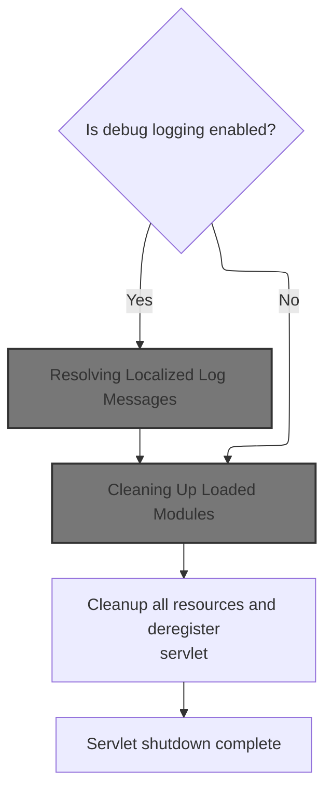
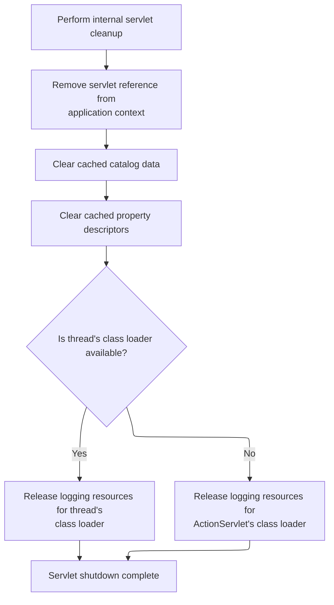

This document describes how the system performs a clean shutdown of the request processor and servlet. When the application is shutting down, all modules are cleaned up, resources are released, and references are removed to ensure a stable application lifecycle.

# Tearing Down the Request Processor

<SwmSnippet path="/core/src/main/java/org/apache/struts/chain/ComposableRequestProcessor.java" line="129">

---

In <SwmToken path="core/src/main/java/org/apache/struts/chain/ComposableRequestProcessor.java" pos="129:5:5" line-data="    public void destroy() {">`destroy`</SwmToken>, we start by delegating to the superclass's destroy method. This ensures all the shared servlet and framework cleanup logic runs before we handle any processor-specific teardown. Next, we need to call <SwmToken path="core/src/main/java/org/apache/struts/action/ActionServlet.java" pos="311:5:5" line-data="            classLoader = ActionServlet.class.getClassLoader();">`ActionServlet`</SwmToken>'s destroy to make sure the servlet-level resources are released.

```java
    public void destroy() {
        super.destroy();
```

---

</SwmSnippet>

## Servlet Cleanup and Logging



<SwmSnippet path="/core/src/main/java/org/apache/struts/action/ActionServlet.java" line="294">

---

In <SwmToken path="core/src/main/java/org/apache/struts/action/ActionServlet.java" pos="294:5:5" line-data="    public void destroy() {">`destroy`</SwmToken>, we check if debug logging is enabled and log a 'finalizing' message. The message is fetched using the internal message resources, which means we need to resolve the localized string next. That's why we call into <SwmToken path="core/src/main/java/org/apache/struts/config/ConfigHelper.java" pos="56:4:4" line-data="public class ConfigHelper implements ConfigHelperInterface {">`ConfigHelper`</SwmToken> to get the right message for the current locale.

```java
    public void destroy() {
        if (log.isDebugEnabled()) {
            log.debug(internal.getMessage("finalizing"));
        }

```

---

</SwmSnippet>

### Resolving Localized Log Messages

<SwmSnippet path="/core/src/main/java/org/apache/struts/config/ConfigHelper.java" line="496">

---

In <SwmToken path="core/src/main/java/org/apache/struts/config/ConfigHelper.java" pos="496:5:5" line-data="    public String getMessage(String key) {">`getMessage`</SwmToken>, we grab the message resources and then resolve the user's locale before fetching the message string. To do that, we call <SwmToken path="core/src/main/java/org/apache/struts/config/ConfigHelper.java" pos="503:7:9" line-data="        return resources.getMessage(RequestUtils.getUserLocale(request, null),">`RequestUtils.getUserLocale`</SwmToken>, which figures out which locale to use for the message lookup.

```java
    public String getMessage(String key) {
        MessageResources resources = getMessageResources();

        if (resources == null) {
            return null;
        }

        return resources.getMessage(RequestUtils.getUserLocale(request, null),
```

---

</SwmSnippet>

<SwmSnippet path="/core/src/main/java/org/apache/struts/util/RequestUtils.java" line="299">

---

<SwmToken path="core/src/main/java/org/apache/struts/util/RequestUtils.java" pos="299:7:7" line-data="    public static Locale getUserLocale(HttpServletRequest request, String locale) {">`getUserLocale`</SwmToken> checks the session for a Locale object using a configurable key, and if it's not there, falls back to the request's locale (from <SwmToken path="core/src/main/java/org/apache/struts/util/RequestUtils.java" pos="313:11:13" line-data="            // Returns Locale based on Accept-Language header or the server default">`Accept-Language`</SwmToken> or server default). This fallback logic ensures we always have a locale for message lookups, even if the session isn't set up.

```java
    public static Locale getUserLocale(HttpServletRequest request, String locale) {
        Locale userLocale = null;
        HttpSession session = request.getSession(false);

        if (locale == null) {
            locale = Globals.LOCALE_KEY;
        }

        // Only check session if sessions are enabled
        if (session != null) {
            userLocale = (Locale) session.getAttribute(locale);
        }

        if (userLocale == null) {
            // Returns Locale based on Accept-Language header or the server default
            userLocale = request.getLocale();
        }

        return userLocale;
    }
```

---

</SwmSnippet>

<SwmSnippet path="/core/src/main/java/org/apache/struts/config/ConfigHelper.java" line="503">

---

We just got back from <SwmToken path="core/src/main/java/org/apache/struts/config/ConfigHelper.java" pos="503:7:9" line-data="        return resources.getMessage(RequestUtils.getUserLocale(request, null),">`RequestUtils.getUserLocale`</SwmToken> in ConfigHelper.getMessage. Now, we call Resources.getMessage to actually fetch the localized string for the log, using the resolved locale and message key.

```java
        return resources.getMessage(RequestUtils.getUserLocale(request, null),
            key);
    }
```

---

</SwmSnippet>

<SwmSnippet path="/core/src/main/java/org/apache/struts/validator/Resources.java" line="249">

---

<SwmToken path="core/src/main/java/org/apache/struts/validator/Resources.java" pos="249:7:7" line-data="    public static String getMessage(HttpServletRequest request, String key) {">`getMessage`</SwmToken> in Resources grabs the message resources and resolves the locale (again, for safety), then fetches the message string. It calls <SwmToken path="core/src/main/java/org/apache/struts/validator/Resources.java" pos="252:8:10" line-data="        return getMessage(messages, RequestUtils.getUserLocale(request, null),">`RequestUtils.getUserLocale`</SwmToken> to make sure it uses the right locale for the lookup.

```java
    public static String getMessage(HttpServletRequest request, String key) {
        MessageResources messages = getMessageResources(request);

        return getMessage(messages, RequestUtils.getUserLocale(request, null),
            key);
    }
```

---

</SwmSnippet>

### Module Teardown

<SwmSnippet path="/core/src/main/java/org/apache/struts/action/ActionServlet.java" line="299">

---

We just finished logging the finalizing message (via ConfigHelper.getMessage). Now, ActionServlet.destroy moves on to <SwmToken path="core/src/main/java/org/apache/struts/action/ActionServlet.java" pos="299:1:1" line-data="        destroyModules();">`destroyModules`</SwmToken>, which handles cleanup for each loaded module.

```java
        destroyModules();
```

---

</SwmSnippet>

### Cleaning Up Loaded Modules

See <SwmLink doc-title="Module and Plugin Cleanup During Shutdown">[Module and Plugin Cleanup During Shutdown](/.swm/module-and-plugin-cleanup-during-shutdown.e7q3k7o3.sw.md)</SwmLink>

### Final Resource Release



<SwmSnippet path="/core/src/main/java/org/apache/struts/action/ActionServlet.java" line="300">

---

After returning from <SwmToken path="core/src/main/java/org/apache/struts/action/ActionServlet.java" pos="299:1:1" line-data="        destroyModules();">`destroyModules`</SwmToken> in ActionServlet.destroy, we finish up by clearing out internal resources, removing servlet context attributes, and releasing logging infrastructure. This is the last step to make sure nothing is left hanging after the servlet is destroyed.

```java
        destroyInternal();
        getServletContext().removeAttribute(Globals.ACTION_SERVLET_KEY);

        CatalogFactory.clear();
        PropertyUtils.clearDescriptors();

        // Release our LogFactory and Log instances (if any)
        ClassLoader classLoader =
            Thread.currentThread().getContextClassLoader();

        if (classLoader == null) {
            classLoader = ActionServlet.class.getClassLoader();
        }

        try {
            LogFactory.release(classLoader);
        } catch (Throwable t) {
            ; // Servlet container doesn't have the latest version

            // of commons-logging-api.jar installed
            // :FIXME: Why is this dependent on the container's version of
            // commons-logging? Shouldn't this depend on the version packaged
            // with Struts?

            /*
              Reason: LogFactory.release(classLoader); was added as
              an attempt to investigate the OutOfMemory error reported on
              Bugzilla #14042. It was committed for version 1.136 by craigmcc
            */
        }
    }
```

---

</SwmSnippet>

## Processor-Specific Cleanup

<SwmSnippet path="/core/src/main/java/org/apache/struts/chain/ComposableRequestProcessor.java" line="131">

---

After coming back from ActionServlet.destroy, ComposableRequestProcessor.destroy finishes by nulling out its internal references. This helps the GC clean up everything related to the processor instance.

```java
        catalogFactory = null;
        catalog = null;
        command = null;
        actionContextClass = null;
        servletActionContextConstructor = null;
    }
```

---

</SwmSnippet>

&nbsp;

*This is an auto-generated document by Swimm 🌊 and has not yet been verified by a human*

<SwmMeta version="3.0.0" repo-id="Z2l0aHViJTNBJTNBc3RydXRzMSUzQSUzQVN3aW1tLURlbW8=" repo-name="struts1"><sup>Powered by [Swimm](https://app.swimm.io/)</sup></SwmMeta>
