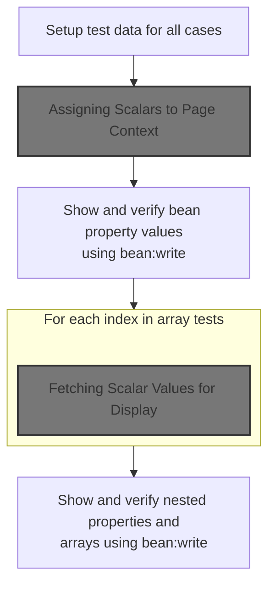
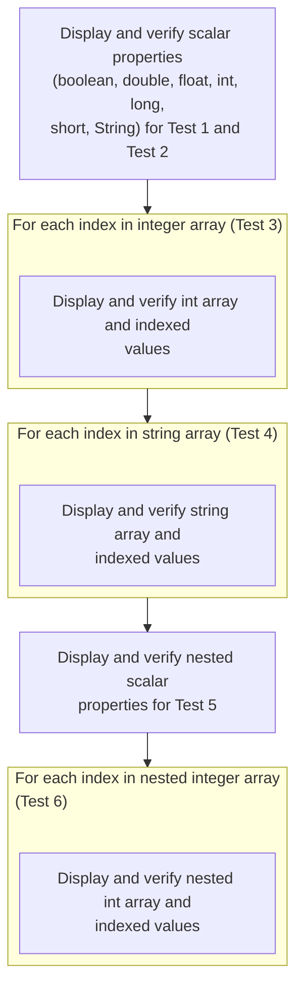

This document outlines the flow for testing the rendering of scalar values, arrays, and nested properties in a JSP page using bean:write. Test data is prepared and displayed in tables, allowing for a comparison between expected values and the output generated by bean:write.

# Setting Up Scalar Test Data



<SwmSnippet path="/apps/examples/src/main/webapp/exercise/bean-write.jsp" line="23">

---

In <SwmToken path="apps/examples/src/main/webapp/exercise/bean-write.jsp" pos="23:2:2" line-data="  &lt;body&gt;">`body`</SwmToken>, we're prepping the test data by putting a bunch of scalar values (Boolean, Double, Float, Integer, Long, Short, String) into the <SwmToken path="apps/examples/src/main/webapp/exercise/bean-write.jsp" pos="28:1:1" line-data="      pageContext.setAttribute(&quot;test1.boolean&quot;, new Boolean(true));">`pageContext`</SwmToken>. This is so we can later check if <bean:write> actually outputs them correctly. We call the next block to actually set these attributes, which is what the test relies on.

```java server pages
  <body>
    <div align="center">
      <h1>Test struts-bean:write Tag</h1>
    </div>
    <h3>Test 1 -- Scalar Variable Lookups</h3><%
      pageContext.setAttribute("test1.boolean", new Boolean(true));
      pageContext.setAttribute("test1.double", new Double(321.0));
      pageContext.setAttribute("test1.float", new Float((float) 123.0));
      pageContext.setAttribute("test1.int", new Integer(123));
      pageContext.setAttribute("test1.long", new Long(321));
      pageContext.setAttribute("test1.short", new Short((short) 987));
      pageContext.setAttribute("test1.string", "This is a string");
    %>
```

---

</SwmSnippet>

## Assigning Scalars to Page Context

<SwmSnippet path="/apps/examples/src/main/webapp/exercise/bean-write.jsp" line="27">

---

In `anonymous-26-46`, we're actually setting the scalar attributes in the <SwmToken path="apps/examples/src/main/webapp/exercise/bean-write.jsp" pos="28:1:1" line-data="      pageContext.setAttribute(&quot;test1.boolean&quot;, new Boolean(true));">`pageContext`</SwmToken>, each with a '<SwmToken path="apps/examples/src/main/webapp/exercise/bean-write.jsp" pos="28:6:6" line-data="      pageContext.setAttribute(&quot;test1.boolean&quot;, new Boolean(true));">`test1`</SwmToken>.' prefix. This is just organizing the test data. We need to call into PlugInConfigContextAdapter.setAttribute because that's the underlying method that actually stores these values in the context.

```java server pages
    <h3>Test 1 -- Scalar Variable Lookups</h3><%
      pageContext.setAttribute("test1.boolean", new Boolean(true));
      pageContext.setAttribute("test1.double", new Double(321.0));
      pageContext.setAttribute("test1.float", new Float((float) 123.0));
      pageContext.setAttribute("test1.int", new Integer(123));
      pageContext.setAttribute("test1.long", new Long(321));
      pageContext.setAttribute("test1.short", new Short((short) 987));
      pageContext.setAttribute("test1.string", "This is a string");
```

---

</SwmSnippet>

<SwmSnippet path="/tiles2/src/main/java/org/apache/struts/tiles2/util/PlugInConfigContextAdapter.java" line="202">

---

PlugInConfigContextAdapter.setAttribute just hands off the attribute and value to <SwmToken path="tiles2/src/main/java/org/apache/struts/tiles2/util/PlugInConfigContextAdapter.java" pos="203:1:3" line-data="        rootContext.setAttribute(string, object);">`rootContext.setAttribute`</SwmToken>. No extra logic, just straight delegation.

```java
    public void setAttribute(String string, Object object) {
        rootContext.setAttribute(string, object);
    }
```

---

</SwmSnippet>

<SwmSnippet path="/apps/examples/src/main/webapp/exercise/bean-write.jsp" line="35">

---

Back in `anonymous-26-46`, after returning from PlugInConfigContextAdapter.setAttribute, all the scalar test attributes are now set in the <SwmToken path="apps/examples/src/main/webapp/exercise/bean-write.jsp" pos="28:1:1" line-data="      pageContext.setAttribute(&quot;test1.boolean&quot;, new Boolean(true));">`pageContext`</SwmToken> and ready for the next steps.

```java server pages
    %>
```

---

</SwmSnippet>

## Rendering Scalar Test Table

<SwmSnippet path="/apps/examples/src/main/webapp/exercise/bean-write.jsp" line="36">

---

Back in <SwmToken path="apps/examples/src/main/webapp/exercise/bean-write.jsp" pos="23:2:2" line-data="  &lt;body&gt;">`body`</SwmToken>, now that the scalar attributes are set, we start rendering a table to display each value. We call anonymous-44-10 next to fetch and show the actual value for <SwmToken path="apps/examples/src/main/webapp/exercise/bean-write.jsp" pos="45:8:10" line-data="          &lt;%= pageContext.getAttribute(&quot;test1.boolean&quot;) %&gt;">`test1.boolean`</SwmToken> from the <SwmToken path="apps/examples/src/main/webapp/exercise/bean-write.jsp" pos="45:3:3" line-data="          &lt;%= pageContext.getAttribute(&quot;test1.boolean&quot;) %&gt;">`pageContext`</SwmToken>, which sets up the comparison for the test.

```java server pages
    <table border="1">
      <tr>
        <th>Data Type</th>
        <th>Correct Value</th>
        <th>Test Result</th>
      </tr>
      <tr>
        <td>boolean</td>
        <td>
          <%= pageContext.getAttribute("test1.boolean") %>
```

---

</SwmSnippet>

## Fetching Scalar Values for Display

<SwmSnippet path="/apps/examples/src/main/webapp/exercise/bean-write.jsp" line="45">

---

`anonymous-44-10` grabs the <SwmToken path="apps/examples/src/main/webapp/exercise/bean-write.jsp" pos="45:8:10" line-data="          &lt;%= pageContext.getAttribute(&quot;test1.boolean&quot;) %&gt;">`test1.boolean`</SwmToken> value from the <SwmToken path="apps/examples/src/main/webapp/exercise/bean-write.jsp" pos="45:3:3" line-data="          &lt;%= pageContext.getAttribute(&quot;test1.boolean&quot;) %&gt;">`pageContext`</SwmToken> and outputs it. To actually fetch the value, we call into ComponentContext.getAttribute, which does the lookup.

```java server pages
          <%= pageContext.getAttribute("test1.boolean") %>
```

---

</SwmSnippet>

<SwmSnippet path="/tiles/src/main/java/org/apache/struts/tiles/ComponentContext.java" line="112">

---

ComponentContext.getAttribute checks if the attributes map exists, and if so, returns the value for the given name. If not, it returns null. No magic, just a map lookup.

```java
    public Object getAttribute(String name) {
        if (attributes == null){
            return null;
        }

        return attributes.get(name);
    }
```

---

</SwmSnippet>

## Comparing Output with <bean:write>



<SwmSnippet path="/apps/examples/src/main/webapp/exercise/bean-write.jsp" line="46">

---

Back in <SwmToken path="apps/examples/src/main/webapp/exercise/bean-write.jsp" pos="23:2:2" line-data="  &lt;body&gt;">`body`</SwmToken>, after showing the raw boolean value, we use <bean:write> to output the same attribute. Next, we move to anonymous-53-10 to repeat this for the double value, keeping the test consistent across types.

```java server pages
        </td>
        <td>
          <bean:write name="test1.boolean" />
        </td>
      </tr>
      <tr>
        <td>double</td>
        <td>
          <%= pageContext.getAttribute("test1.double") %>
```

---

</SwmSnippet>

<SwmSnippet path="/apps/examples/src/main/webapp/exercise/bean-write.jsp" line="54">

---

`anonymous-53-10` fetches and outputs the <SwmToken path="apps/examples/src/main/webapp/exercise/bean-write.jsp" pos="54:8:10" line-data="          &lt;%= pageContext.getAttribute(&quot;test1.double&quot;) %&gt;">`test1.double`</SwmToken> value from the <SwmToken path="apps/examples/src/main/webapp/exercise/bean-write.jsp" pos="54:3:3" line-data="          &lt;%= pageContext.getAttribute(&quot;test1.double&quot;) %&gt;">`pageContext`</SwmToken>. We call ComponentContext.getAttribute to actually retrieve the value for display.

```java server pages
          <%= pageContext.getAttribute("test1.double") %>
```

---

</SwmSnippet>

<SwmSnippet path="/apps/examples/src/main/webapp/exercise/bean-write.jsp" line="55">

---

Back in <SwmToken path="apps/examples/src/main/webapp/exercise/bean-write.jsp" pos="23:2:2" line-data="  &lt;body&gt;">`body`</SwmToken>, after handling the double, we move on to the float value. We call anonymous-62-10 next to keep testing each scalar type in sequence.

```java server pages
        </td>
        <td>
          <bean:write name="test1.double" />
        </td>
      </tr>
      <tr>
        <td>float</td>
        <td>
          <%= pageContext.getAttribute("test1.float") %>
```

---

</SwmSnippet>

<SwmSnippet path="/apps/examples/src/main/webapp/exercise/bean-write.jsp" line="63">

---

`anonymous-62-10` outputs the <SwmToken path="apps/examples/src/main/webapp/exercise/bean-write.jsp" pos="63:8:10" line-data="          &lt;%= pageContext.getAttribute(&quot;test1.float&quot;) %&gt;">`test1.float`</SwmToken> value from the <SwmToken path="apps/examples/src/main/webapp/exercise/bean-write.jsp" pos="63:3:3" line-data="          &lt;%= pageContext.getAttribute(&quot;test1.float&quot;) %&gt;">`pageContext`</SwmToken>. We call ComponentContext.getAttribute to fetch the value for the table.

```java server pages
          <%= pageContext.getAttribute("test1.float") %>
```

---

</SwmSnippet>

<SwmSnippet path="/apps/examples/src/main/webapp/exercise/bean-write.jsp" line="64">

---

Back in <SwmToken path="apps/examples/src/main/webapp/exercise/bean-write.jsp" pos="23:2:2" line-data="  &lt;body&gt;">`body`</SwmToken>, after the float, we move to the int value. We call anonymous-71-10 next to keep the test sequence going.

```java server pages
        </td>
        <td>
          <bean:write name="test1.float" />
        </td>
      </tr>
      <tr>
        <td>int</td>
        <td>
          <%= pageContext.getAttribute("test1.int") %>
```

---

</SwmSnippet>

<SwmSnippet path="/apps/examples/src/main/webapp/exercise/bean-write.jsp" line="72">

---

`anonymous-71-10` outputs the <SwmToken path="apps/examples/src/main/webapp/exercise/bean-write.jsp" pos="72:8:10" line-data="          &lt;%= pageContext.getAttribute(&quot;test1.int&quot;) %&gt;">`test1.int`</SwmToken> value from the <SwmToken path="apps/examples/src/main/webapp/exercise/bean-write.jsp" pos="72:3:3" line-data="          &lt;%= pageContext.getAttribute(&quot;test1.int&quot;) %&gt;">`pageContext`</SwmToken>. We call ComponentContext.getAttribute to fetch the value for display.

```java server pages
          <%= pageContext.getAttribute("test1.int") %>
```

---

</SwmSnippet>

<SwmSnippet path="/apps/examples/src/main/webapp/exercise/bean-write.jsp" line="73">

---

Back in <SwmToken path="apps/examples/src/main/webapp/exercise/bean-write.jsp" pos="23:2:2" line-data="  &lt;body&gt;">`body`</SwmToken>, after int, we move to the long value. We call anonymous-80-10 next to keep the test sequence going.

```java server pages
        </td>
        <td>
          <bean:write name="test1.int" />
        </td>
      </tr>
      <tr>
        <td>long</td>
        <td>
          <%= pageContext.getAttribute("test1.long") %>
```

---

</SwmSnippet>

<SwmSnippet path="/apps/examples/src/main/webapp/exercise/bean-write.jsp" line="81">

---

`anonymous-80-10` outputs the <SwmToken path="apps/examples/src/main/webapp/exercise/bean-write.jsp" pos="81:8:10" line-data="          &lt;%= pageContext.getAttribute(&quot;test1.long&quot;) %&gt;">`test1.long`</SwmToken> value from the <SwmToken path="apps/examples/src/main/webapp/exercise/bean-write.jsp" pos="81:3:3" line-data="          &lt;%= pageContext.getAttribute(&quot;test1.long&quot;) %&gt;">`pageContext`</SwmToken>. We call ComponentContext.getAttribute to fetch the value for display.

```java server pages
          <%= pageContext.getAttribute("test1.long") %>
```

---

</SwmSnippet>

<SwmSnippet path="/apps/examples/src/main/webapp/exercise/bean-write.jsp" line="82">

---

Back in <SwmToken path="apps/examples/src/main/webapp/exercise/bean-write.jsp" pos="23:2:2" line-data="  &lt;body&gt;">`body`</SwmToken>, after long, we move to the short value. We call anonymous-89-10 next to keep the test sequence going.

```java server pages
        </td>
        <td>
          <bean:write name="test1.long" />
        </td>
      </tr>
      <tr>
        <td>short</td>
        <td>
          <%= pageContext.getAttribute("test1.short") %>
```

---

</SwmSnippet>

<SwmSnippet path="/apps/examples/src/main/webapp/exercise/bean-write.jsp" line="90">

---

`anonymous-89-10` outputs the <SwmToken path="apps/examples/src/main/webapp/exercise/bean-write.jsp" pos="90:8:10" line-data="          &lt;%= pageContext.getAttribute(&quot;test1.short&quot;) %&gt;">`test1.short`</SwmToken> value from the <SwmToken path="apps/examples/src/main/webapp/exercise/bean-write.jsp" pos="90:3:3" line-data="          &lt;%= pageContext.getAttribute(&quot;test1.short&quot;) %&gt;">`pageContext`</SwmToken>. We call ComponentContext.getAttribute to fetch the value for display.

```java server pages
          <%= pageContext.getAttribute("test1.short") %>
```

---

</SwmSnippet>

<SwmSnippet path="/apps/examples/src/main/webapp/exercise/bean-write.jsp" line="91">

---

Back in <SwmToken path="apps/examples/src/main/webapp/exercise/bean-write.jsp" pos="23:2:2" line-data="  &lt;body&gt;">`body`</SwmToken>, after short, we move to the String value. We call anonymous-98-10 next to keep the test sequence going.

```java server pages
        </td>
        <td>
          <bean:write name="test1.short" />
        </td>
      </tr>
      <tr>
        <td>String</td>
        <td>
          <%= pageContext.getAttribute("test1.string") %>
```

---

</SwmSnippet>

<SwmSnippet path="/apps/examples/src/main/webapp/exercise/bean-write.jsp" line="99">

---

`anonymous-98-10` outputs the <SwmToken path="apps/examples/src/main/webapp/exercise/bean-write.jsp" pos="99:8:10" line-data="          &lt;%= pageContext.getAttribute(&quot;test1.string&quot;) %&gt;">`test1.string`</SwmToken> value from the <SwmToken path="apps/examples/src/main/webapp/exercise/bean-write.jsp" pos="99:3:3" line-data="          &lt;%= pageContext.getAttribute(&quot;test1.string&quot;) %&gt;">`pageContext`</SwmToken>. We call ComponentContext.getAttribute to fetch the value for display.

```java server pages
          <%= pageContext.getAttribute("test1.string") %>
```

---

</SwmSnippet>

<SwmSnippet path="/apps/examples/src/main/webapp/exercise/bean-write.jsp" line="100">

---

Back in <SwmToken path="apps/examples/src/main/webapp/exercise/bean-write.jsp" pos="23:2:2" line-data="  &lt;body&gt;">`body`</SwmToken>, after finishing the scalar tests, we set up beans and start testing property lookups, including arrays and indexed properties. We call anonymous-184-11 next to kick off the loop for the integer array tests.

```java server pages
        </td>
        <td>
          <bean:write name="test1.string" />
        </td>
      </tr>
    </table>
    <h3>Test 2 -- Scalar Property Lookups</h3>
    <jsp:useBean id="test2" scope="page" class="org.apache.struts.webapp.exercise.TestBean" />
    <table border="1">
      <tr>
        <th>Data Type</th>
        <th>Correct Value</th>
        <th>Test Result</th>
      </tr>
      <tr>
        <td>boolean</td>
        <td>
          <jsp:getProperty name="test2" property="booleanProperty" />
        </td>
        <td>
          <bean:write name="test2" property="booleanProperty" />
        </td>
      </tr>
      <tr>
        <td>double</td>
        <td>
          <jsp:getProperty name="test2" property="doubleProperty" />
        </td>
        <td>
          <bean:write name="test2" property="doubleProperty" />
        </td>
      </tr>
      <tr>
        <td>float</td>
        <td>
          <jsp:getProperty name="test2" property="floatProperty" />
        </td>
        <td>
          <bean:write name="test2" property="floatProperty" />
        </td>
      </tr>
      <tr>
        <td>int</td>
        <td>
          <jsp:getProperty name="test2" property="intProperty" />
        </td>
        <td>
          <bean:write name="test2" property="intProperty" />
        </td>
      </tr>
      <tr>
        <td>long</td>
        <td>
          <jsp:getProperty name="test2" property="longProperty" />
        </td>
        <td>
          <bean:write name="test2" property="longProperty" />
        </td>
      </tr>
      <tr>
        <td>short</td>
        <td>
          <jsp:getProperty name="test2" property="shortProperty" />
        </td>
        <td>
          <bean:write name="test2" property="shortProperty" />
        </td>
      </tr>
      <tr>
        <td>String</td>
        <td>
          <jsp:getProperty name="test2" property="stringProperty" />
        </td>
        <td>
          <bean:write name="test2" property="stringProperty" />
        </td>
      </tr>
    </table>
    <h3>Test 3 - Integer Array And Indexed Lookups</h3>
    <jsp:useBean id="test3" scope="page" class="org.apache.struts.webapp.exercise.TestBean" />
    <table border="1">
      <tr>
        <th>Correct Value</th>
        <th>Array Result</th>
        <th>Indexed Result</th>
      </tr><% for (int index = 0; index < 5; index++) { %>
```

---

</SwmSnippet>

<SwmSnippet path="/apps/examples/src/main/webapp/exercise/bean-write.jsp" line="185">

---

`anonymous-184-11` starts a for loop that runs 5 times, setting up repeated table rows for each array element in the test.

```java server pages
      </tr><% for (int index = 0; index < 5; index++) { %>
```

---

</SwmSnippet>

<SwmSnippet path="/apps/examples/src/main/webapp/exercise/bean-write.jsp" line="186">

---

Back in <SwmToken path="apps/examples/src/main/webapp/exercise/bean-write.jsp" pos="23:2:2" line-data="  &lt;body&gt;">`body`</SwmToken>, after starting the loop, we move to anonymous-187-10 to output the expected value for the current index.

```java server pages
      <tr>
        <td>
          <%= index * 10 %>
```

---

</SwmSnippet>

<SwmSnippet path="/apps/examples/src/main/webapp/exercise/bean-write.jsp" line="188">

---

`anonymous-187-10` outputs index \* 10, which matches the expected value for each array element in the test.

```java server pages
          <%= index * 10 %>
```

---

</SwmSnippet>

<SwmSnippet path="/apps/examples/src/main/webapp/exercise/bean-write.jsp" line="189">

---

Back in <SwmToken path="apps/examples/src/main/webapp/exercise/bean-write.jsp" pos="23:2:2" line-data="  &lt;body&gt;">`body`</SwmToken>, after showing the expected value, we move to anonymous-195-11 to output the actual array and indexed results for this index.

```java server pages
        </td>
        <td>
          <bean:write name="test3" property='<%= "intArray[" + index + "]" %>' />
        </td>
        <td>
          <bean:write name="test3" property='<%= "intIndexed[" + index + "]" %>' />
        </td>
      </tr><% } %>
```

---

</SwmSnippet>

<SwmSnippet path="/apps/examples/src/main/webapp/exercise/bean-write.jsp" line="196">

---

`anonymous-195-11` closes out the current table row and loop iteration for the integer array test.

```java server pages
      </tr><% } %>
```

---

</SwmSnippet>

<SwmSnippet path="/apps/examples/src/main/webapp/exercise/bean-write.jsp" line="197">

---

Back in <SwmToken path="apps/examples/src/main/webapp/exercise/bean-write.jsp" pos="23:2:2" line-data="  &lt;body&gt;">`body`</SwmToken>, after finishing the integer array test, we move to anonymous-204-11 to start the string array test loop.

```java server pages
    </table>
    <h3>Test 4 - String Array And Indexed Lookups</h3>
    <jsp:useBean id="test4" scope="page" class="org.apache.struts.webapp.exercise.TestBean" />
    <table border="1">
      <tr>
        <th>Correct Value</th>
        <th>Array Result</th>
        <th>Indexed Result</th>
      </tr><% for (int index = 0; index < 5; index++) { %>
```

---

</SwmSnippet>

<SwmSnippet path="/apps/examples/src/main/webapp/exercise/bean-write.jsp" line="205">

---

`anonymous-204-11` starts another for loop, this time for the string array test, running 5 times to generate table rows.

```java server pages
      </tr><% for (int index = 0; index < 5; index++) { %>
```

---

</SwmSnippet>

<SwmSnippet path="/apps/examples/src/main/webapp/exercise/bean-write.jsp" line="206">

---

Back in <SwmToken path="apps/examples/src/main/webapp/exercise/bean-write.jsp" pos="23:2:2" line-data="  &lt;body&gt;">`body`</SwmToken>, after starting the string array loop, we move to anonymous-207-10 to output the expected string value for this index.

```java server pages
      <tr>
        <td>
          <%= "String " + index %>
```

---

</SwmSnippet>

<SwmSnippet path="/apps/examples/src/main/webapp/exercise/bean-write.jsp" line="208">

---

`anonymous-207-10` outputs 'String ' plus the current index, matching the expected value for each string array element.

```java server pages
          <%= "String " + index %>
```

---

</SwmSnippet>

<SwmSnippet path="/apps/examples/src/main/webapp/exercise/bean-write.jsp" line="209">

---

Back in <SwmToken path="apps/examples/src/main/webapp/exercise/bean-write.jsp" pos="23:2:2" line-data="  &lt;body&gt;">`body`</SwmToken>, after showing the expected string value, we move to anonymous-215-11 to output the actual array and indexed results for this index.

```java server pages
        </td>
        <td>
          <bean:write name="test4" property='<%= "stringArray[" + index + "]" %>' />
        </td>
        <td>
          <bean:write name="test4" property='<%= "stringIndexed[" + index + "]" %>' />
        </td>
      </tr><% } %>
```

---

</SwmSnippet>

<SwmSnippet path="/apps/examples/src/main/webapp/exercise/bean-write.jsp" line="216">

---

`anonymous-215-11` closes out the current table row and loop iteration for the string array test.

```java server pages
      </tr><% } %>
```

---

</SwmSnippet>

<SwmSnippet path="/apps/examples/src/main/webapp/exercise/bean-write.jsp" line="217">

---

Back in <SwmToken path="apps/examples/src/main/webapp/exercise/bean-write.jsp" pos="23:2:2" line-data="  &lt;body&gt;">`body`</SwmToken>, after the string array test, we move to anonymous-296-11 to start the nested property tests, which check if <bean:write> can handle dot notation.

```java server pages
    </table>
    <h3>Test 5 -- Nested Scalar Property Lookups</h3>
    <jsp:useBean id="test5" scope="page" class="org.apache.struts.webapp.exercise.TestBean" />
    <table border="1">
      <tr>
        <th>Data Type</th>
        <th>Correct Value</th>
        <th>Test Result</th>
      </tr>
      <tr>
        <td>boolean</td>
        <td>
          <jsp:getProperty name="test5" property="booleanProperty" />
        </td>
        <td>
          <bean:write name="test5" property="nested.booleanProperty" />
        </td>
      </tr>
      <tr>
        <td>double</td>
        <td>
          <jsp:getProperty name="test5" property="doubleProperty" />
        </td>
        <td>
          <bean:write name="test5" property="nested.doubleProperty" />
        </td>
      </tr>
      <tr>
        <td>float</td>
        <td>
          <jsp:getProperty name="test5" property="floatProperty" />
        </td>
        <td>
          <bean:write name="test5" property="nested.floatProperty" />
        </td>
      </tr>
      <tr>
        <td>int</td>
        <td>
          <jsp:getProperty name="test5" property="intProperty" />
        </td>
        <td>
          <bean:write name="test5" property="nested.intProperty" />
        </td>
      </tr>
      <tr>
        <td>long</td>
        <td>
          <jsp:getProperty name="test5" property="longProperty" />
        </td>
        <td>
          <bean:write name="test5" property="nested.longProperty" />
        </td>
      </tr>
      <tr>
        <td>short</td>
        <td>
          <jsp:getProperty name="test5" property="shortProperty" />
        </td>
        <td>
          <bean:write name="test5" property="nested.shortProperty" />
        </td>
      </tr>
      <tr>
        <td>String</td>
        <td>
          <jsp:getProperty name="test5" property="stringProperty" />
        </td>
        <td>
          <bean:write name="test5" property="nested.stringProperty" />
        </td>
      </tr>
    </table>
    <h3>Test 6 - Nested Integer Array And Indexed Lookups</h3>
    <jsp:useBean id="test6" scope="page" class="org.apache.struts.webapp.exercise.TestBean" />
    <table border="1">
      <tr>
        <th>Correct Value</th>
        <th>Array Result</th>
        <th>Indexed Result</th>
      </tr><% for (int index = 0; index < 5; index++) { %>
```

---

</SwmSnippet>

<SwmSnippet path="/apps/examples/src/main/webapp/exercise/bean-write.jsp" line="297">

---

`anonymous-296-11` starts a for loop for the nested integer array test, running 5 times to generate table rows.

```java server pages
      </tr><% for (int index = 0; index < 5; index++) { %>
```

---

</SwmSnippet>

<SwmSnippet path="/apps/examples/src/main/webapp/exercise/bean-write.jsp" line="298">

---

Back in <SwmToken path="apps/examples/src/main/webapp/exercise/bean-write.jsp" pos="23:2:2" line-data="  &lt;body&gt;">`body`</SwmToken>, after starting the nested array loop, we move to anonymous-299-10 to output the expected value for this index.

```java server pages
      <tr>
        <td>
          <%= index * 10 %>
```

---

</SwmSnippet>

<SwmSnippet path="/apps/examples/src/main/webapp/exercise/bean-write.jsp" line="300">

---

`anonymous-299-10` outputs index \* 10, matching the expected value for each nested array element in the test.

```java server pages
          <%= index * 10 %>
```

---

</SwmSnippet>

<SwmSnippet path="/apps/examples/src/main/webapp/exercise/bean-write.jsp" line="301">

---

Back in <SwmToken path="apps/examples/src/main/webapp/exercise/bean-write.jsp" pos="23:2:2" line-data="  &lt;body&gt;">`body`</SwmToken>, after outputting the expected value in anonymous-299-10, we use <bean:write> to display the actual values for both '<SwmToken path="apps/examples/src/main/webapp/exercise/bean-write.jsp" pos="303:18:20" line-data="          &lt;bean:write name=&quot;test6&quot; property=&#39;&lt;%= &quot;nested.intArray[&quot; + index + &quot;]&quot; %&gt;&#39; /&gt;">`nested.intArray`</SwmToken>\[index\]' and '<SwmToken path="apps/examples/src/main/webapp/exercise/bean-write.jsp" pos="306:18:20" line-data="          &lt;bean:write name=&quot;test6&quot; property=&#39;&lt;%= &quot;nested.intIndexed[&quot; + index + &quot;]&quot; %&gt;&#39; /&gt;">`nested.intIndexed`</SwmToken>\[index\]' from the bean. This checks if <bean:write> can handle nested and indexed properties, using dynamic property names to access each element. We need to call anonymous-307-11 next to close out the table row and loop, so the test covers all indices for both property types.

```java server pages
        </td>
        <td>
          <bean:write name="test6" property='<%= "nested.intArray[" + index + "]" %>' />
        </td>
        <td>
          <bean:write name="test6" property='<%= "nested.intIndexed[" + index + "]" %>' />
        </td>
      </tr><% } %>
```

---

</SwmSnippet>

<SwmSnippet path="/apps/examples/src/main/webapp/exercise/bean-write.jsp" line="308">

---

`anonymous-307-11` just closes the current table row and ends the loop for the nested property tests, making sure each index gets its own row in the output.

```java server pages
      </tr><% } %>
```

---

</SwmSnippet>

<SwmSnippet path="/apps/examples/src/main/webapp/exercise/bean-write.jsp" line="309">

---

Back in <SwmToken path="apps/examples/src/main/webapp/exercise/bean-write.jsp" pos="310:2:2" line-data="  &lt;/body&gt;">`body`</SwmToken>, after finishing the nested property tests in anonymous-307-11, we just close out the table and the HTML body. That's the end of the test output.

```java server pages
    </table>
  </body>
```

---

</SwmSnippet>

&nbsp;

*This is an auto-generated document by Swimm 🌊 and has not yet been verified by a human*

<SwmMeta version="3.0.0" repo-id="Z2l0aHViJTNBJTNBc3RydXRzMSUzQSUzQVN3aW1tLURlbW8=" repo-name="struts1"><sup>Powered by [Swimm](https://app.swimm.io/)</sup></SwmMeta>
