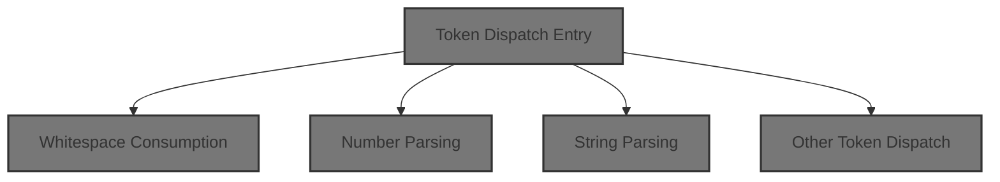
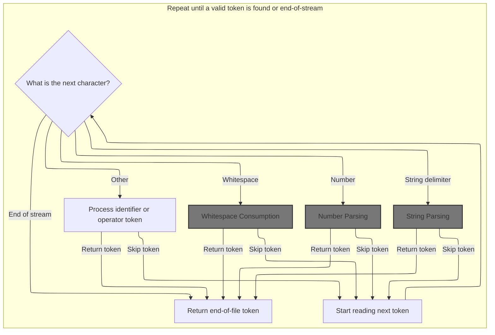
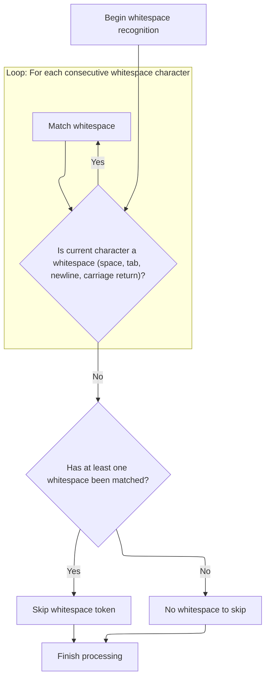
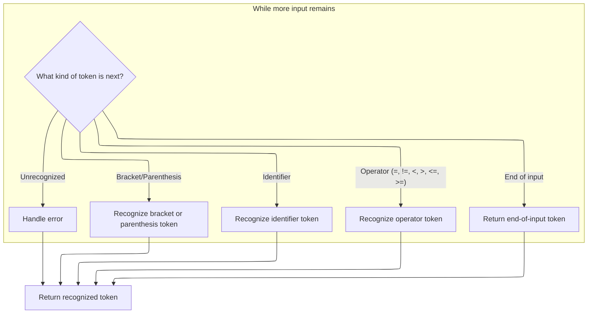

This document describes how a validation expression is broken down into individual tokens. Tokenization enables the system to interpret and process user-defined validation rules by converting a stream of characters into meaningful elements such as numbers, strings, identifiers, and operators.



# Where is this flow used?

This flow is used multiple times in the codebase as represented in the following diagram:

(Note - these are only some of the entry points of this flow)

```mermaid
graph TD;
      2a2f9513cbb02a07a418db6710bfd4000d7fe6d6588bf97ea3d57de50a8872e6(taglib/…/logic/NestedIterateTag.java::NestedIterateTag.doStartTag) --> b19d992fdd880149cdcce47b903a13c2e50663f2dd3b95cd63794022ff0cd409(taglib/…/nested/NestedPropertyHelper.java::NestedPropertyHelper.setNestedProperties)

2a2f9513cbb02a07a418db6710bfd4000d7fe6d6588bf97ea3d57de50a8872e6(taglib/…/logic/NestedIterateTag.java::NestedIterateTag.doStartTag) --> 577cd8d0b4648ce702b6e860ceb39ce500241d645348e12c9c3535d95c2b9a7b(taglib/…/nested/NestedPropertyHelper.java::NestedPropertyHelper.getAdjustedProperty)

b19d992fdd880149cdcce47b903a13c2e50663f2dd3b95cd63794022ff0cd409(taglib/…/nested/NestedPropertyHelper.java::NestedPropertyHelper.setNestedProperties) --> 577cd8d0b4648ce702b6e860ceb39ce500241d645348e12c9c3535d95c2b9a7b(taglib/…/nested/NestedPropertyHelper.java::NestedPropertyHelper.getAdjustedProperty)

577cd8d0b4648ce702b6e860ceb39ce500241d645348e12c9c3535d95c2b9a7b(taglib/…/nested/NestedPropertyHelper.java::NestedPropertyHelper.getAdjustedProperty) --> fbb7afed920e3a830ac08c7049b5c862bb260de328a35d7e793438ce064353ca(taglib/…/nested/NestedPropertyHelper.java::NestedPropertyHelper.calculateRelativeProperty)

fbb7afed920e3a830ac08c7049b5c862bb260de328a35d7e793438ce064353ca(taglib/…/nested/NestedPropertyHelper.java::NestedPropertyHelper.calculateRelativeProperty) --> 3f30bf537d7dc73652c0d273e504564165f608062343362feb8f138175431c8c(core/…/validwhen/ValidWhenLexer.java::ValidWhenLexer.nextToken)

2b2b21443b50fff2d167e05f9a396a8acffed93630620f6578e0d575ee4d457c(taglib/…/html/NestedOptionsTag.java::NestedOptionsTag.doStartTag) --> b19d992fdd880149cdcce47b903a13c2e50663f2dd3b95cd63794022ff0cd409(taglib/…/nested/NestedPropertyHelper.java::NestedPropertyHelper.setNestedProperties)

2b2b21443b50fff2d167e05f9a396a8acffed93630620f6578e0d575ee4d457c(taglib/…/html/NestedOptionsTag.java::NestedOptionsTag.doStartTag) --> 577cd8d0b4648ce702b6e860ceb39ce500241d645348e12c9c3535d95c2b9a7b(taglib/…/nested/NestedPropertyHelper.java::NestedPropertyHelper.getAdjustedProperty)

23572e7becf92791caf5edf74db07746e576720d54887a076de50b58bfddfb08(faces/…/taglib/JavascriptValidatorTag.java::JavascriptValidatorTag.doStartTag) --> de8991bead9bdfbdfd33ba23fdb3255e20874a62139c81593769ba8af6022f36(faces/…/taglib/JavascriptValidatorTag.java::JavascriptValidatorTag.renderJavascript)

de8991bead9bdfbdfd33ba23fdb3255e20874a62139c81593769ba8af6022f36(faces/…/taglib/JavascriptValidatorTag.java::JavascriptValidatorTag.renderJavascript) --> 28b4cc4072bfb039614fc3464030b23c7a2618d7f6d4cfec51da91c2c1ebad36(faces/…/taglib/JavascriptValidatorTag.java::JavascriptValidatorTag.createDynamicJavascript)

28b4cc4072bfb039614fc3464030b23c7a2618d7f6d4cfec51da91c2c1ebad36(faces/…/taglib/JavascriptValidatorTag.java::JavascriptValidatorTag.createDynamicJavascript) --> 70dee653b74e40f3b6f43205779b1a9b6ef581c1e0e2a867e85d3e9dd2d38c2f(faces/…/taglib/JavascriptValidatorTag.java::JavascriptValidatorTag.escapeQuotes)

70dee653b74e40f3b6f43205779b1a9b6ef581c1e0e2a867e85d3e9dd2d38c2f(faces/…/taglib/JavascriptValidatorTag.java::JavascriptValidatorTag.escapeQuotes) --> 3f30bf537d7dc73652c0d273e504564165f608062343362feb8f138175431c8c(core/…/validwhen/ValidWhenLexer.java::ValidWhenLexer.nextToken)

5f38c92c0089bc234ada4661f6795a68f5d36dce15cbbb313430c4d288d794dd(core/…/validator/FieldChecks.java::FieldChecks.validateUrl) --> 3f30bf537d7dc73652c0d273e504564165f608062343362feb8f138175431c8c(core/…/validwhen/ValidWhenLexer.java::ValidWhenLexer.nextToken)

d764121753f4241f575e3cdded1c26c88a62fa21ffcac7414d61ea635d42adc7(el/…/logic/ELMatchTag.java::ELMatchTag.condition) --> 618b6d2d8db222b09f8118b4c2e657b6ee4421e83e76faf46b7b2cfd6fd10196(taglib/…/logic/PresentTag.java::PresentTag.condition)

618b6d2d8db222b09f8118b4c2e657b6ee4421e83e76faf46b7b2cfd6fd10196(taglib/…/logic/PresentTag.java::PresentTag.condition) --> 3f30bf537d7dc73652c0d273e504564165f608062343362feb8f138175431c8c(core/…/validwhen/ValidWhenLexer.java::ValidWhenLexer.nextToken)


classDef mainFlowStyle color:#000000,fill:#7CB9F4
classDef rootsStyle color:#000000,fill:#00FFF4
classDef Style1 color:#000000,fill:#00FFAA
classDef Style2 color:#000000,fill:#FFFF00
classDef Style3 color:#000000,fill:#AA7CB9

%% Swimm:
%% graph TD;
%%       2a2f9513cbb02a07a418db6710bfd4000d7fe6d6588bf97ea3d57de50a8872e6(<SwmPath>[taglib/…/logic/NestedIterateTag.java](taglib/src/main/java/org/apache/struts/taglib/nested/logic/NestedIterateTag.java)</SwmPath>::NestedIterateTag.doStartTag) --> b19d992fdd880149cdcce47b903a13c2e50663f2dd3b95cd63794022ff0cd409(<SwmPath>[taglib/…/nested/NestedPropertyHelper.java](taglib/src/main/java/org/apache/struts/taglib/nested/NestedPropertyHelper.java)</SwmPath>::NestedPropertyHelper.setNestedProperties)
%% 
%% 2a2f9513cbb02a07a418db6710bfd4000d7fe6d6588bf97ea3d57de50a8872e6(<SwmPath>[taglib/…/logic/NestedIterateTag.java](taglib/src/main/java/org/apache/struts/taglib/nested/logic/NestedIterateTag.java)</SwmPath>::NestedIterateTag.doStartTag) --> 577cd8d0b4648ce702b6e860ceb39ce500241d645348e12c9c3535d95c2b9a7b(<SwmPath>[taglib/…/nested/NestedPropertyHelper.java](taglib/src/main/java/org/apache/struts/taglib/nested/NestedPropertyHelper.java)</SwmPath>::NestedPropertyHelper.getAdjustedProperty)
%% 
%% b19d992fdd880149cdcce47b903a13c2e50663f2dd3b95cd63794022ff0cd409(<SwmPath>[taglib/…/nested/NestedPropertyHelper.java](taglib/src/main/java/org/apache/struts/taglib/nested/NestedPropertyHelper.java)</SwmPath>::NestedPropertyHelper.setNestedProperties) --> 577cd8d0b4648ce702b6e860ceb39ce500241d645348e12c9c3535d95c2b9a7b(<SwmPath>[taglib/…/nested/NestedPropertyHelper.java](taglib/src/main/java/org/apache/struts/taglib/nested/NestedPropertyHelper.java)</SwmPath>::NestedPropertyHelper.getAdjustedProperty)
%% 
%% 577cd8d0b4648ce702b6e860ceb39ce500241d645348e12c9c3535d95c2b9a7b(<SwmPath>[taglib/…/nested/NestedPropertyHelper.java](taglib/src/main/java/org/apache/struts/taglib/nested/NestedPropertyHelper.java)</SwmPath>::NestedPropertyHelper.getAdjustedProperty) --> fbb7afed920e3a830ac08c7049b5c862bb260de328a35d7e793438ce064353ca(<SwmPath>[taglib/…/nested/NestedPropertyHelper.java](taglib/src/main/java/org/apache/struts/taglib/nested/NestedPropertyHelper.java)</SwmPath>::NestedPropertyHelper.calculateRelativeProperty)
%% 
%% fbb7afed920e3a830ac08c7049b5c862bb260de328a35d7e793438ce064353ca(<SwmPath>[taglib/…/nested/NestedPropertyHelper.java](taglib/src/main/java/org/apache/struts/taglib/nested/NestedPropertyHelper.java)</SwmPath>::NestedPropertyHelper.calculateRelativeProperty) --> 3f30bf537d7dc73652c0d273e504564165f608062343362feb8f138175431c8c(<SwmPath>[core/…/validwhen/ValidWhenLexer.java](core/src/main/java/org/apache/struts/validator/validwhen/ValidWhenLexer.java)</SwmPath>::ValidWhenLexer.nextToken)
%% 
%% 2b2b21443b50fff2d167e05f9a396a8acffed93630620f6578e0d575ee4d457c(<SwmPath>[taglib/…/html/NestedOptionsTag.java](taglib/src/main/java/org/apache/struts/taglib/nested/html/NestedOptionsTag.java)</SwmPath>::NestedOptionsTag.doStartTag) --> b19d992fdd880149cdcce47b903a13c2e50663f2dd3b95cd63794022ff0cd409(<SwmPath>[taglib/…/nested/NestedPropertyHelper.java](taglib/src/main/java/org/apache/struts/taglib/nested/NestedPropertyHelper.java)</SwmPath>::NestedPropertyHelper.setNestedProperties)
%% 
%% 2b2b21443b50fff2d167e05f9a396a8acffed93630620f6578e0d575ee4d457c(<SwmPath>[taglib/…/html/NestedOptionsTag.java](taglib/src/main/java/org/apache/struts/taglib/nested/html/NestedOptionsTag.java)</SwmPath>::NestedOptionsTag.doStartTag) --> 577cd8d0b4648ce702b6e860ceb39ce500241d645348e12c9c3535d95c2b9a7b(<SwmPath>[taglib/…/nested/NestedPropertyHelper.java](taglib/src/main/java/org/apache/struts/taglib/nested/NestedPropertyHelper.java)</SwmPath>::NestedPropertyHelper.getAdjustedProperty)
%% 
%% 23572e7becf92791caf5edf74db07746e576720d54887a076de50b58bfddfb08(<SwmPath>[faces/…/taglib/JavascriptValidatorTag.java](faces/src/main/java/org/apache/struts/faces/taglib/JavascriptValidatorTag.java)</SwmPath>::JavascriptValidatorTag.doStartTag) --> de8991bead9bdfbdfd33ba23fdb3255e20874a62139c81593769ba8af6022f36(<SwmPath>[faces/…/taglib/JavascriptValidatorTag.java](faces/src/main/java/org/apache/struts/faces/taglib/JavascriptValidatorTag.java)</SwmPath>::JavascriptValidatorTag.renderJavascript)
%% 
%% de8991bead9bdfbdfd33ba23fdb3255e20874a62139c81593769ba8af6022f36(<SwmPath>[faces/…/taglib/JavascriptValidatorTag.java](faces/src/main/java/org/apache/struts/faces/taglib/JavascriptValidatorTag.java)</SwmPath>::JavascriptValidatorTag.renderJavascript) --> 28b4cc4072bfb039614fc3464030b23c7a2618d7f6d4cfec51da91c2c1ebad36(<SwmPath>[faces/…/taglib/JavascriptValidatorTag.java](faces/src/main/java/org/apache/struts/faces/taglib/JavascriptValidatorTag.java)</SwmPath>::JavascriptValidatorTag.createDynamicJavascript)
%% 
%% 28b4cc4072bfb039614fc3464030b23c7a2618d7f6d4cfec51da91c2c1ebad36(<SwmPath>[faces/…/taglib/JavascriptValidatorTag.java](faces/src/main/java/org/apache/struts/faces/taglib/JavascriptValidatorTag.java)</SwmPath>::JavascriptValidatorTag.createDynamicJavascript) --> 70dee653b74e40f3b6f43205779b1a9b6ef581c1e0e2a867e85d3e9dd2d38c2f(<SwmPath>[faces/…/taglib/JavascriptValidatorTag.java](faces/src/main/java/org/apache/struts/faces/taglib/JavascriptValidatorTag.java)</SwmPath>::JavascriptValidatorTag.escapeQuotes)
%% 
%% 70dee653b74e40f3b6f43205779b1a9b6ef581c1e0e2a867e85d3e9dd2d38c2f(<SwmPath>[faces/…/taglib/JavascriptValidatorTag.java](faces/src/main/java/org/apache/struts/faces/taglib/JavascriptValidatorTag.java)</SwmPath>::JavascriptValidatorTag.escapeQuotes) --> 3f30bf537d7dc73652c0d273e504564165f608062343362feb8f138175431c8c(<SwmPath>[core/…/validwhen/ValidWhenLexer.java](core/src/main/java/org/apache/struts/validator/validwhen/ValidWhenLexer.java)</SwmPath>::ValidWhenLexer.nextToken)
%% 
%% 5f38c92c0089bc234ada4661f6795a68f5d36dce15cbbb313430c4d288d794dd(<SwmPath>[core/…/validator/FieldChecks.java](core/src/main/java/org/apache/struts/validator/FieldChecks.java)</SwmPath>::FieldChecks.validateUrl) --> 3f30bf537d7dc73652c0d273e504564165f608062343362feb8f138175431c8c(<SwmPath>[core/…/validwhen/ValidWhenLexer.java](core/src/main/java/org/apache/struts/validator/validwhen/ValidWhenLexer.java)</SwmPath>::ValidWhenLexer.nextToken)
%% 
%% d764121753f4241f575e3cdded1c26c88a62fa21ffcac7414d61ea635d42adc7(<SwmPath>[el/…/logic/ELMatchTag.java](el/src/main/java/org/apache/strutsel/taglib/logic/ELMatchTag.java)</SwmPath>::ELMatchTag.condition) --> 618b6d2d8db222b09f8118b4c2e657b6ee4421e83e76faf46b7b2cfd6fd10196(<SwmPath>[taglib/…/logic/PresentTag.java](taglib/src/main/java/org/apache/struts/taglib/logic/PresentTag.java)</SwmPath>::PresentTag.condition)
%% 
%% 618b6d2d8db222b09f8118b4c2e657b6ee4421e83e76faf46b7b2cfd6fd10196(<SwmPath>[taglib/…/logic/PresentTag.java](taglib/src/main/java/org/apache/struts/taglib/logic/PresentTag.java)</SwmPath>::PresentTag.condition) --> 3f30bf537d7dc73652c0d273e504564165f608062343362feb8f138175431c8c(<SwmPath>[core/…/validwhen/ValidWhenLexer.java](core/src/main/java/org/apache/struts/validator/validwhen/ValidWhenLexer.java)</SwmPath>::ValidWhenLexer.nextToken)
%% 
%% 
%% classDef mainFlowStyle color:#000000,fill:#7CB9F4
%% classDef rootsStyle color:#000000,fill:#00FFF4
%% classDef Style1 color:#000000,fill:#00FFAA
%% classDef Style2 color:#000000,fill:#FFFF00
%% classDef Style3 color:#000000,fill:#AA7CB9
```



# Token Dispatch Entry



<SwmSnippet path="/core/src/main/java/org/apache/struts/validator/validwhen/ValidWhenLexer.java" line="75">

---

In <SwmToken path="core/src/main/java/org/apache/struts/validator/validwhen/ValidWhenLexer.java" pos="75:4:4" line-data="public Token nextToken() throws TokenStreamException {">`nextToken`</SwmToken>, we start by checking the first character and immediately branch to whitespace handling if needed. Calling <SwmToken path="core/src/main/java/org/apache/struts/validator/validwhen/ValidWhenLexer.java" pos="87:1:1" line-data="					mWS(true);">`mWS`</SwmToken> here strips out whitespace before any other token logic runs, so the lexer doesn't emit unnecessary tokens for spaces, tabs, or newlines.

```java
public Token nextToken() throws TokenStreamException {
	Token theRetToken=null;
tryAgain:
	for (;;) {
		Token _token = null;
		int _ttype = Token.INVALID_TYPE;
		resetText();
		try {   // for char stream error handling
			try {   // for lexical error handling
				switch ( LA(1)) {
				case '\t':  case '\n':  case '\r':  case ' ':
				{
					mWS(true);
					theRetToken=_returnToken;
					break;
				}
				case '-':  case '0':  case '1':  case '2':
				case '3':  case '4':  case '5':  case '6':
```

---

</SwmSnippet>

## Whitespace Consumption



<SwmSnippet path="/core/src/main/java/org/apache/struts/validator/validwhen/ValidWhenLexer.java" line="202">

---

In <SwmToken path="core/src/main/java/org/apache/struts/validator/validwhen/ValidWhenLexer.java" pos="202:7:7" line-data="	public final void mWS(boolean _createToken) throws RecognitionException, CharStreamException, TokenStreamException {">`mWS`</SwmToken>, we loop through the input and match spaces, tabs, newlines, or carriage returns. The loop keeps going until it hits something that's not whitespace, making sure at least one whitespace character is matched before moving on.

```java
	public final void mWS(boolean _createToken) throws RecognitionException, CharStreamException, TokenStreamException {
		int _ttype; Token _token=null; int _begin=text.length();
		_ttype = WS;
		int _saveIndex;
		
		{
		int _cnt17=0;
		_loop17:
		do {
			switch ( LA(1)) {
			case ' ':
			{
				match(' ');
				break;
			}
			case '\t':
			{
				match('\t');
				break;
			}
			case '\n':
			{
				match('\n');
				break;
			}
			case '\r':
			{
				match('\r');
				break;
			}
			default:
			{
				if ( _cnt17>=1 ) { break _loop17; } else {throw new NoViableAltForCharException((char)LA(1), getFilename(), getLine(), getColumn());}
			}
			}
			_cnt17++;
		} while (true);
```

---

</SwmSnippet>

<SwmSnippet path="/core/src/main/java/org/apache/struts/validator/validwhen/ValidWhenLexer.java" line="240">

---

After matching whitespace, if we're not in guessing mode, the token type is set to SKIP so nothing gets emitted for whitespace. If token creation is requested and the token isn't skipped, it gets created and returned, otherwise we just move on.

```java
		if ( inputState.guessing==0 ) {
			_ttype = Token.SKIP;
		}
		if ( _createToken && _token==null && _ttype!=Token.SKIP ) {
			_token = makeToken(_ttype);
			_token.setText(new String(text.getBuffer(), _begin, text.length()-_begin));
		}
		_returnToken = _token;
	}
```

---

</SwmSnippet>

## Numeric Literal Dispatch

<SwmSnippet path="/core/src/main/java/org/apache/struts/validator/validwhen/ValidWhenLexer.java" line="93">

---

Back in <SwmToken path="core/src/main/java/org/apache/struts/validator/validwhen/ValidWhenLexer.java" pos="75:4:4" line-data="public Token nextToken() throws TokenStreamException {">`nextToken`</SwmToken>, after handling whitespace, we check for digits and call <SwmToken path="core/src/main/java/org/apache/struts/validator/validwhen/ValidWhenLexer.java" pos="95:1:1" line-data="					mDECIMAL_LITERAL(true);">`mDECIMAL_LITERAL`</SwmToken> to process numbers. This lets us grab numeric tokens right away, so they don't get mixed up with identifiers or other stuff.

```java
				case '7':  case '8':  case '9':
				{
					mDECIMAL_LITERAL(true);
					theRetToken=_returnToken;
					break;
				}
```

---

</SwmSnippet>

## Number Parsing

```mermaid
%%{init: {"flowchart": {"defaultRenderer": "elk"}} }%%
flowchart TD
  node1["Start: Receive numeric input"]
  click node1 openCode "core/src/main/java/org/apache/struts/validator/validwhen/ValidWhenLexer.java:250:251"
  node1 --> node2{"Is input decimal with fraction?"}
  click node2 openCode "core/src/main/java/org/apache/struts/validator/validwhen/ValidWhenLexer.java:255:306"
  node2 -->|"Yes"| node3["Classify as decimal with fraction"]
  click node3 openCode "core/src/main/java/org/apache/struts/validator/validwhen/ValidWhenLexer.java:306:356"
  subgraph loop1["Loop: Match digits in decimal/fraction"]
    node3 --> node3a["Validate sequence of digits"]
    click node3a openCode "core/src/main/java/org/apache/struts/validator/validwhen/ValidWhenLexer.java:284:293"
  end
  node2 -->|"No"| node4{"Is input hexadecimal?"}
  click node4 openCode "core/src/main/java/org/apache/struts/validator/validwhen/ValidWhenLexer.java:361:378"
  node4 -->|"Yes"| node5["Classify as hexadecimal"]
  click node5 openCode "core/src/main/java/org/apache/struts/validator/validwhen/ValidWhenLexer.java:378:412"
  subgraph loop2["Loop: Match digits/letters in hexadecimal"]
    node5 --> node5a["Validate sequence of hex digits"]
    click node5a openCode "core/src/main/java/org/apache/struts/validator/validwhen/ValidWhenLexer.java:385:406"
  end
  node4 -->|"No"| node6{"Is input octal?"}
  click node6 openCode "core/src/main/java/org/apache/struts/validator/validwhen/ValidWhenLexer.java:413:430"
  node6 -->|"Yes"| node7["Classify as octal"]
  click node7 openCode "core/src/main/java/org/apache/struts/validator/validwhen/ValidWhenLexer.java:431:448"
  subgraph loop3["Loop: Match digits in octal"]
    node7 --> node7a["Validate sequence of octal digits"]
    click node7a openCode "core/src/main/java/org/apache/struts/validator/validwhen/ValidWhenLexer.java:435:443"
  end
  node6 -->|"No"| node8["Classify as standard decimal"]
  click node8 openCode "core/src/main/java/org/apache/struts/validator/validwhen/ValidWhenLexer.java:450:489"
  subgraph loop4["Loop: Match digits in decimal"]
    node8 --> node8a["Validate sequence of decimal digits"]
    click node8a openCode "core/src/main/java/org/apache/struts/validator/validwhen/ValidWhenLexer.java:475:484"
  end

classDef HeadingStyle fill:#777777,stroke:#333,stroke-width:2px;

%% Swimm:
%% %%{init: {"flowchart": {"defaultRenderer": "elk"}} }%%
%% flowchart TD
%%   node1["Start: Receive numeric input"]
%%   click node1 openCode "<SwmPath>[core/…/validwhen/ValidWhenLexer.java](core/src/main/java/org/apache/struts/validator/validwhen/ValidWhenLexer.java)</SwmPath>:250:251"
%%   node1 --> node2{"Is input decimal with fraction?"}
%%   click node2 openCode "<SwmPath>[core/…/validwhen/ValidWhenLexer.java](core/src/main/java/org/apache/struts/validator/validwhen/ValidWhenLexer.java)</SwmPath>:255:306"
%%   node2 -->|"Yes"| node3["Classify as decimal with fraction"]
%%   click node3 openCode "<SwmPath>[core/…/validwhen/ValidWhenLexer.java](core/src/main/java/org/apache/struts/validator/validwhen/ValidWhenLexer.java)</SwmPath>:306:356"
%%   subgraph loop1["Loop: Match digits in decimal/fraction"]
%%     node3 --> node3a["Validate sequence of digits"]
%%     click node3a openCode "<SwmPath>[core/…/validwhen/ValidWhenLexer.java](core/src/main/java/org/apache/struts/validator/validwhen/ValidWhenLexer.java)</SwmPath>:284:293"
%%   end
%%   node2 -->|"No"| node4{"Is input hexadecimal?"}
%%   click node4 openCode "<SwmPath>[core/…/validwhen/ValidWhenLexer.java](core/src/main/java/org/apache/struts/validator/validwhen/ValidWhenLexer.java)</SwmPath>:361:378"
%%   node4 -->|"Yes"| node5["Classify as hexadecimal"]
%%   click node5 openCode "<SwmPath>[core/…/validwhen/ValidWhenLexer.java](core/src/main/java/org/apache/struts/validator/validwhen/ValidWhenLexer.java)</SwmPath>:378:412"
%%   subgraph loop2["Loop: Match digits/letters in hexadecimal"]
%%     node5 --> node5a["Validate sequence of hex digits"]
%%     click node5a openCode "<SwmPath>[core/…/validwhen/ValidWhenLexer.java](core/src/main/java/org/apache/struts/validator/validwhen/ValidWhenLexer.java)</SwmPath>:385:406"
%%   end
%%   node4 -->|"No"| node6{"Is input octal?"}
%%   click node6 openCode "<SwmPath>[core/…/validwhen/ValidWhenLexer.java](core/src/main/java/org/apache/struts/validator/validwhen/ValidWhenLexer.java)</SwmPath>:413:430"
%%   node6 -->|"Yes"| node7["Classify as octal"]
%%   click node7 openCode "<SwmPath>[core/…/validwhen/ValidWhenLexer.java](core/src/main/java/org/apache/struts/validator/validwhen/ValidWhenLexer.java)</SwmPath>:431:448"
%%   subgraph loop3["Loop: Match digits in octal"]
%%     node7 --> node7a["Validate sequence of octal digits"]
%%     click node7a openCode "<SwmPath>[core/…/validwhen/ValidWhenLexer.java](core/src/main/java/org/apache/struts/validator/validwhen/ValidWhenLexer.java)</SwmPath>:435:443"
%%   end
%%   node6 -->|"No"| node8["Classify as standard decimal"]
%%   click node8 openCode "<SwmPath>[core/…/validwhen/ValidWhenLexer.java](core/src/main/java/org/apache/struts/validator/validwhen/ValidWhenLexer.java)</SwmPath>:450:489"
%%   subgraph loop4["Loop: Match digits in decimal"]
%%     node8 --> node8a["Validate sequence of decimal digits"]
%%     click node8a openCode "<SwmPath>[core/…/validwhen/ValidWhenLexer.java](core/src/main/java/org/apache/struts/validator/validwhen/ValidWhenLexer.java)</SwmPath>:475:484"
%%   end
%% 
%% classDef HeadingStyle fill:#777777,stroke:#333,stroke-width:2px;
```



<SwmSnippet path="/core/src/main/java/org/apache/struts/validator/validwhen/ValidWhenLexer.java" line="250">

---

In <SwmToken path="core/src/main/java/org/apache/struts/validator/validwhen/ValidWhenLexer.java" pos="250:7:7" line-data="	public final void mDECIMAL_LITERAL(boolean _createToken) throws RecognitionException, CharStreamException, TokenStreamException {">`mDECIMAL_LITERAL`</SwmToken>, we use lookahead and syntactic predicates to figure out if we're dealing with a decimal, hex, octal, or integer. We mark the input, guess the pattern, and rewind if it doesn't fit, so we only match the right kind of number.

```java
	public final void mDECIMAL_LITERAL(boolean _createToken) throws RecognitionException, CharStreamException, TokenStreamException {
		int _ttype; Token _token=null; int _begin=text.length();
		_ttype = DECIMAL_LITERAL;
		int _saveIndex;
		
		boolean synPredMatched24 = false;
		if (((_tokenSet_0.member(LA(1))) && (_tokenSet_1.member(LA(2))))) {
			int _m24 = mark();
			synPredMatched24 = true;
			inputState.guessing++;
			try {
				{
				{
				switch ( LA(1)) {
				case '-':
				{
					match('-');
					break;
				}
				case '0':  case '1':  case '2':  case '3':
				case '4':  case '5':  case '6':  case '7':
				case '8':  case '9':
				{
					break;
				}
				default:
				{
					throw new NoViableAltForCharException((char)LA(1), getFilename(), getLine(), getColumn());
				}
				}
				}
				{
				int _cnt22=0;
				_loop22:
				do {
					if (((LA(1) >= '0' && LA(1) <= '9'))) {
						matchRange('0','9');
					}
					else {
						if ( _cnt22>=1 ) { break _loop22; } else {throw new NoViableAltForCharException((char)LA(1), getFilename(), getLine(), getColumn());}
					}
					
					_cnt22++;
				} while (true);
```

---

</SwmSnippet>

<SwmSnippet path="/core/src/main/java/org/apache/struts/validator/validwhen/ValidWhenLexer.java" line="296">

---

After the predicate check, we match the '-' if present, then digits, then the decimal point, and more digits for fractional numbers. This section enforces the decimal format and throws if anything's off.

```java
				match('.');
				}
				}
			}
			catch (RecognitionException pe) {
				synPredMatched24 = false;
			}
			rewind(_m24);
inputState.guessing--;
		}
		if ( synPredMatched24 ) {
			{
			{
			switch ( LA(1)) {
			case '-':
			{
				match('-');
				break;
			}
			case '0':  case '1':  case '2':  case '3':
			case '4':  case '5':  case '6':  case '7':
			case '8':  case '9':
			{
				break;
			}
			default:
			{
				throw new NoViableAltForCharException((char)LA(1), getFilename(), getLine(), getColumn());
			}
			}
			}
			{
			int _cnt28=0;
			_loop28:
			do {
				if (((LA(1) >= '0' && LA(1) <= '9'))) {
					matchRange('0','9');
				}
				else {
					if ( _cnt28>=1 ) { break _loop28; } else {throw new NoViableAltForCharException((char)LA(1), getFilename(), getLine(), getColumn());}
				}
				
				_cnt28++;
			} while (true);
```

---

</SwmSnippet>

<SwmSnippet path="/core/src/main/java/org/apache/struts/validator/validwhen/ValidWhenLexer.java" line="342">

---

Here we match the decimal point and loop to grab digits after it. If there's no digit after the '.', we throw, so only valid decimals get through.

```java
			match('.');
			}
			{
			int _cnt31=0;
			_loop31:
			do {
				if (((LA(1) >= '0' && LA(1) <= '9'))) {
					matchRange('0','9');
				}
				else {
					if ( _cnt31>=1 ) { break _loop31; } else {throw new NoViableAltForCharException((char)LA(1), getFilename(), getLine(), getColumn());}
				}
				
				_cnt31++;
			} while (true);
```

---

</SwmSnippet>

<SwmSnippet path="/core/src/main/java/org/apache/struts/validator/validwhen/ValidWhenLexer.java" line="361">

---

Now we use another predicate to check for hex literals ('0x'). We mark the input, guess, and rewind if it's not a match. If it fits, we match '0x' and loop through hex digits.

```java
			boolean synPredMatched38 = false;
			if (((LA(1)=='0') && (LA(2)=='x'))) {
				int _m38 = mark();
				synPredMatched38 = true;
				inputState.guessing++;
				try {
					{
					match('0');
					match('x');
					}
				}
				catch (RecognitionException pe) {
					synPredMatched38 = false;
				}
				rewind(_m38);
inputState.guessing--;
			}
			if ( synPredMatched38 ) {
				{
				match('0');
				match('x');
				{
				int _cnt41=0;
				_loop41:
				do {
					switch ( LA(1)) {
					case '0':  case '1':  case '2':  case '3':
					case '4':  case '5':  case '6':  case '7':
					case '8':  case '9':
					{
						matchRange('0','9');
						break;
					}
					case 'a':  case 'b':  case 'c':  case 'd':
					case 'e':  case 'f':
					{
						matchRange('a','f');
						break;
					}
					default:
					{
						if ( _cnt41>=1 ) { break _loop41; } else {throw new NoViableAltForCharException((char)LA(1), getFilename(), getLine(), getColumn());}
					}
					}
					_cnt41++;
				} while (true);
```

---

</SwmSnippet>

<SwmSnippet path="/core/src/main/java/org/apache/struts/validator/validwhen/ValidWhenLexer.java" line="409">

---

After matching hex digits, we set the token type to <SwmToken path="core/src/main/java/org/apache/struts/validator/validwhen/ValidWhenLexer.java" pos="410:5:5" line-data="					_ttype = HEX_INT_LITERAL;">`HEX_INT_LITERAL`</SwmToken>. If it's not hex, we check for octal with another predicate, match '0' and octal digits, and set the token type to <SwmToken path="core/src/main/java/org/apache/struts/validator/validwhen/ValidWhenLexer.java" pos="447:5:5" line-data="						_ttype = OCTAL_INT_LITERAL;">`OCTAL_INT_LITERAL`</SwmToken>.

```java
				if ( inputState.guessing==0 ) {
					_ttype = HEX_INT_LITERAL;
				}
			}
			else {
				boolean synPredMatched33 = false;
				if (((LA(1)=='0') && (true))) {
					int _m33 = mark();
					synPredMatched33 = true;
					inputState.guessing++;
					try {
						{
						match('0');
						}
					}
					catch (RecognitionException pe) {
						synPredMatched33 = false;
					}
					rewind(_m33);
inputState.guessing--;
				}
				if ( synPredMatched33 ) {
					{
					match('0');
					{
					_loop36:
					do {
						if (((LA(1) >= '0' && LA(1) <= '7'))) {
							matchRange('0','7');
						}
						else {
							break _loop36;
						}
						
					} while (true);
```

---

</SwmSnippet>

<SwmSnippet path="/core/src/main/java/org/apache/struts/validator/validwhen/ValidWhenLexer.java" line="446">

---

If it's not hex or octal, we match decimal integers by checking for a '-' and a digit from 1-9, then grab any extra digits. If it fits, we set the token type to <SwmToken path="core/src/main/java/org/apache/struts/validator/validwhen/ValidWhenLexer.java" pos="488:5:5" line-data="						_ttype = DEC_INT_LITERAL;">`DEC_INT_LITERAL`</SwmToken>.

```java
					if ( inputState.guessing==0 ) {
						_ttype = OCTAL_INT_LITERAL;
					}
				}
				else if ((_tokenSet_2.member(LA(1))) && (true)) {
					{
					{
					switch ( LA(1)) {
					case '-':
					{
						match('-');
						break;
					}
					case '1':  case '2':  case '3':  case '4':
					case '5':  case '6':  case '7':  case '8':
					case '9':
					{
						break;
					}
					default:
					{
						throw new NoViableAltForCharException((char)LA(1), getFilename(), getLine(), getColumn());
					}
					}
					}
					{
					matchRange('1','9');
					}
					{
					_loop46:
					do {
						if (((LA(1) >= '0' && LA(1) <= '9'))) {
							matchRange('0','9');
						}
						else {
							break _loop46;
						}
						
					} while (true);
```

---

</SwmSnippet>

<SwmSnippet path="/core/src/main/java/org/apache/struts/validator/validwhen/ValidWhenLexer.java" line="487">

---

After matching the right numeric pattern, we assign the token type and create the token if needed. If nothing matches, we throw, so only valid numbers get tokens.

```java
					if ( inputState.guessing==0 ) {
						_ttype = DEC_INT_LITERAL;
					}
				}
				else {
					throw new NoViableAltForCharException((char)LA(1), getFilename(), getLine(), getColumn());
				}
				}}
				if ( _createToken && _token==null && _ttype!=Token.SKIP ) {
					_token = makeToken(_ttype);
					_token.setText(new String(text.getBuffer(), _begin, text.length()-_begin));
				}
				_returnToken = _token;
			}
```

---

</SwmSnippet>

## String Literal Dispatch

<SwmSnippet path="/core/src/main/java/org/apache/struts/validator/validwhen/ValidWhenLexer.java" line="99">

---

Back in <SwmToken path="core/src/main/java/org/apache/struts/validator/validwhen/ValidWhenLexer.java" pos="75:4:4" line-data="public Token nextToken() throws TokenStreamException {">`nextToken`</SwmToken>, after handling numbers, we check for quotes and call <SwmToken path="core/src/main/java/org/apache/struts/validator/validwhen/ValidWhenLexer.java" pos="101:1:1" line-data="					mSTRING_LITERAL(true);">`mSTRING_LITERAL`</SwmToken> to process string tokens. This keeps quoted values distinct from numbers and identifiers.

```java
				case '"':  case '\'':
				{
					mSTRING_LITERAL(true);
					theRetToken=_returnToken;
					break;
				}
```

---

</SwmSnippet>

## String Parsing

```mermaid
%%{init: {"flowchart": {"defaultRenderer": "elk"}} }%%
flowchart TD
  node1["Start processing string literal"]
  click node1 openCode "core/src/main/java/org/apache/struts/validator/validwhen/ValidWhenLexer.java:502:507"
  node1 --> node2{"Is opening quote single or double?"}
  click node2 openCode "core/src/main/java/org/apache/struts/validator/validwhen/ValidWhenLexer.java:507:507"
  node2 -->|"Single quote"| node3["Recognize opening single quote"]
  click node3 openCode "core/src/main/java/org/apache/struts/validator/validwhen/ValidWhenLexer.java:511:511"
  node2 -->|"Double quote"| node6["Recognize opening double quote"]
  click node6 openCode "core/src/main/java/org/apache/struts/validator/validwhen/ValidWhenLexer.java:533:533"
  node2 -->|"Neither"| node12["Error: Not a valid string literal"]
  click node12 openCode "core/src/main/java/org/apache/struts/validator/validwhen/ValidWhenLexer.java:554:555"

  subgraph loop1["Collect string content until closing single quote"]
    node3 --> node4{"Is next character a single quote?"}
    click node4 openCode "core/src/main/java/org/apache/struts/validator/validwhen/ValidWhenLexer.java:516:521"
    node4 -->|"No"| node3
    node4 -->|"Yes"| node8["Recognize closing single quote"]
    click node8 openCode "core/src/main/java/org/apache/struts/validator/validwhen/ValidWhenLexer.java:526:526"
    node4 -->|"End of input"| node13["Error: Unclosed string literal"]
    click node13 openCode "core/src/main/java/org/apache/struts/validator/validwhen/ValidWhenLexer.java:520:521"
  end

  subgraph loop2["Collect string content until closing double quote"]
    node6 --> node7{"Is next character a double quote?"}
    click node7 openCode "core/src/main/java/org/apache/struts/validator/validwhen/ValidWhenLexer.java:538:543"
    node7 -->|"No"| node6
    node7 -->|"Yes"| node10["Recognize closing double quote"]
    click node10 openCode "core/src/main/java/org/apache/struts/validator/validwhen/ValidWhenLexer.java:548:548"
    node7 -->|"End of input"| node14["Error: Unclosed string literal"]
    click node14 openCode "core/src/main/java/org/apache/struts/validator/validwhen/ValidWhenLexer.java:542:543"
  end

  node8 --> node11["Produce string literal token"]
  click node11 openCode "core/src/main/java/org/apache/struts/validator/validwhen/ValidWhenLexer.java:557:561"
  node10 --> node11

classDef HeadingStyle fill:#777777,stroke:#333,stroke-width:2px;

%% Swimm:
%% %%{init: {"flowchart": {"defaultRenderer": "elk"}} }%%
%% flowchart TD
%%   node1["Start processing string literal"]
%%   click node1 openCode "<SwmPath>[core/…/validwhen/ValidWhenLexer.java](core/src/main/java/org/apache/struts/validator/validwhen/ValidWhenLexer.java)</SwmPath>:502:507"
%%   node1 --> node2{"Is opening quote single or double?"}
%%   click node2 openCode "<SwmPath>[core/…/validwhen/ValidWhenLexer.java](core/src/main/java/org/apache/struts/validator/validwhen/ValidWhenLexer.java)</SwmPath>:507:507"
%%   node2 -->|"Single quote"| node3["Recognize opening single quote"]
%%   click node3 openCode "<SwmPath>[core/…/validwhen/ValidWhenLexer.java](core/src/main/java/org/apache/struts/validator/validwhen/ValidWhenLexer.java)</SwmPath>:511:511"
%%   node2 -->|"Double quote"| node6["Recognize opening double quote"]
%%   click node6 openCode "<SwmPath>[core/…/validwhen/ValidWhenLexer.java](core/src/main/java/org/apache/struts/validator/validwhen/ValidWhenLexer.java)</SwmPath>:533:533"
%%   node2 -->|"Neither"| node12["Error: Not a valid string literal"]
%%   click node12 openCode "<SwmPath>[core/…/validwhen/ValidWhenLexer.java](core/src/main/java/org/apache/struts/validator/validwhen/ValidWhenLexer.java)</SwmPath>:554:555"
%% 
%%   subgraph loop1["Collect string content until closing single quote"]
%%     node3 --> node4{"Is next character a single quote?"}
%%     click node4 openCode "<SwmPath>[core/…/validwhen/ValidWhenLexer.java](core/src/main/java/org/apache/struts/validator/validwhen/ValidWhenLexer.java)</SwmPath>:516:521"
%%     node4 -->|"No"| node3
%%     node4 -->|"Yes"| node8["Recognize closing single quote"]
%%     click node8 openCode "<SwmPath>[core/…/validwhen/ValidWhenLexer.java](core/src/main/java/org/apache/struts/validator/validwhen/ValidWhenLexer.java)</SwmPath>:526:526"
%%     node4 -->|"End of input"| node13["Error: Unclosed string literal"]
%%     click node13 openCode "<SwmPath>[core/…/validwhen/ValidWhenLexer.java](core/src/main/java/org/apache/struts/validator/validwhen/ValidWhenLexer.java)</SwmPath>:520:521"
%%   end
%% 
%%   subgraph loop2["Collect string content until closing double quote"]
%%     node6 --> node7{"Is next character a double quote?"}
%%     click node7 openCode "<SwmPath>[core/…/validwhen/ValidWhenLexer.java](core/src/main/java/org/apache/struts/validator/validwhen/ValidWhenLexer.java)</SwmPath>:538:543"
%%     node7 -->|"No"| node6
%%     node7 -->|"Yes"| node10["Recognize closing double quote"]
%%     click node10 openCode "<SwmPath>[core/…/validwhen/ValidWhenLexer.java](core/src/main/java/org/apache/struts/validator/validwhen/ValidWhenLexer.java)</SwmPath>:548:548"
%%     node7 -->|"End of input"| node14["Error: Unclosed string literal"]
%%     click node14 openCode "<SwmPath>[core/…/validwhen/ValidWhenLexer.java](core/src/main/java/org/apache/struts/validator/validwhen/ValidWhenLexer.java)</SwmPath>:542:543"
%%   end
%% 
%%   node8 --> node11["Produce string literal token"]
%%   click node11 openCode "<SwmPath>[core/…/validwhen/ValidWhenLexer.java](core/src/main/java/org/apache/struts/validator/validwhen/ValidWhenLexer.java)</SwmPath>:557:561"
%%   node10 --> node11
%% 
%% classDef HeadingStyle fill:#777777,stroke:#333,stroke-width:2px;
```



<SwmSnippet path="/core/src/main/java/org/apache/struts/validator/validwhen/ValidWhenLexer.java" line="502">

---

In <SwmToken path="core/src/main/java/org/apache/struts/validator/validwhen/ValidWhenLexer.java" pos="502:7:7" line-data="	public final void mSTRING_LITERAL(boolean _createToken) throws RecognitionException, CharStreamException, TokenStreamException {">`mSTRING_LITERAL`</SwmToken>, we check if the string starts with a single or double quote, match the opening quote, loop through allowed characters (using <SwmToken path="core/src/main/java/org/apache/struts/validator/validwhen/ValidWhenLexer.java" pos="516:5:5" line-data="				if ((_tokenSet_3.member(LA(1)))) {">`_tokenSet_3`</SwmToken> or <SwmToken path="core/src/main/java/org/apache/struts/validator/validwhen/ValidWhenLexer.java" pos="538:5:5" line-data="				if ((_tokenSet_4.member(LA(1)))) {">`_tokenSet_4`</SwmToken>), and make sure there's at least one character before closing the quote.

```java
	public final void mSTRING_LITERAL(boolean _createToken) throws RecognitionException, CharStreamException, TokenStreamException {
		int _ttype; Token _token=null; int _begin=text.length();
		_ttype = STRING_LITERAL;
		int _saveIndex;
		
		switch ( LA(1)) {
		case '\'':
		{
			{
			match('\'');
			{
			int _cnt50=0;
			_loop50:
			do {
				if ((_tokenSet_3.member(LA(1)))) {
					matchNot('\'');
				}
				else {
					if ( _cnt50>=1 ) { break _loop50; } else {throw new NoViableAltForCharException((char)LA(1), getFilename(), getLine(), getColumn());}
				}
				
				_cnt50++;
			} while (true);
```

---

</SwmSnippet>

<SwmSnippet path="/core/src/main/java/org/apache/struts/validator/validwhen/ValidWhenLexer.java" line="526">

---

After looping through the string contents, we match the closing quote. The token sets (<SwmToken path="core/src/main/java/org/apache/struts/validator/validwhen/ValidWhenLexer.java" pos="516:5:5" line-data="				if ((_tokenSet_3.member(LA(1)))) {">`_tokenSet_3`</SwmToken> for single, <SwmToken path="core/src/main/java/org/apache/struts/validator/validwhen/ValidWhenLexer.java" pos="538:5:5" line-data="				if ((_tokenSet_4.member(LA(1)))) {">`_tokenSet_4`</SwmToken> for double) control which characters are allowed inside each type of string.

```java
			match('\'');
			}
			break;
		}
		case '"':
		{
			{
			match('\"');
			{
			int _cnt53=0;
			_loop53:
			do {
				if ((_tokenSet_4.member(LA(1)))) {
					matchNot('\"');
				}
				else {
					if ( _cnt53>=1 ) { break _loop53; } else {throw new NoViableAltForCharException((char)LA(1), getFilename(), getLine(), getColumn());}
				}
				
				_cnt53++;
			} while (true);
```

---

</SwmSnippet>

<SwmSnippet path="/core/src/main/java/org/apache/struts/validator/validwhen/ValidWhenLexer.java" line="548">

---

After matching the closing quote, we create the token if needed. If the string is empty or not closed, we throw, so only valid, non-empty strings get tokens.

```java
			match('\"');
			}
			break;
		}
		default:
		{
			throw new NoViableAltForCharException((char)LA(1), getFilename(), getLine(), getColumn());
		}
		}
		if ( _createToken && _token==null && _ttype!=Token.SKIP ) {
			_token = makeToken(_ttype);
			_token.setText(new String(text.getBuffer(), _begin, text.length()-_begin));
		}
		_returnToken = _token;
	}
```

---

</SwmSnippet>

## Other Token Dispatch



<SwmSnippet path="/core/src/main/java/org/apache/struts/validator/validwhen/ValidWhenLexer.java" line="105">

---

After returning from <SwmToken path="core/src/main/java/org/apache/struts/validator/validwhen/ValidWhenLexer.java" pos="101:1:1" line-data="					mSTRING_LITERAL(true);">`mSTRING_LITERAL`</SwmToken>, <SwmToken path="core/src/main/java/org/apache/struts/validator/validwhen/ValidWhenLexer.java" pos="75:4:4" line-data="public Token nextToken() throws TokenStreamException {">`nextToken`</SwmToken> checks for brackets, parentheses, identifiers, and operators. If nothing matches, we throw or handle EOF. Only valid tokens get through, everything else is rejected.

```java
				case '[':
				{
					mLBRACKET(true);
					theRetToken=_returnToken;
					break;
				}
				case ']':
				{
					mRBRACKET(true);
					theRetToken=_returnToken;
					break;
				}
				case '(':
				{
					mLPAREN(true);
					theRetToken=_returnToken;
					break;
				}
				case ')':
				{
					mRPAREN(true);
					theRetToken=_returnToken;
					break;
				}
				case '*':
				{
					mTHIS(true);
					theRetToken=_returnToken;
					break;
				}
				case '.':  case '_':  case 'a':  case 'b':
				case 'c':  case 'd':  case 'e':  case 'f':
				case 'g':  case 'h':  case 'i':  case 'j':
				case 'k':  case 'l':  case 'm':  case 'n':
				case 'o':  case 'p':  case 'q':  case 'r':
				case 's':  case 't':  case 'u':  case 'v':
				case 'w':  case 'x':  case 'y':  case 'z':
				{
					mIDENTIFIER(true);
					theRetToken=_returnToken;
					break;
				}
				case '=':
				{
					mEQUALSIGN(true);
					theRetToken=_returnToken;
					break;
				}
				case '!':
				{
					mNOTEQUALSIGN(true);
					theRetToken=_returnToken;
					break;
				}
				default:
					if ((LA(1)=='<') && (LA(2)=='=')) {
						mLESSEQUALSIGN(true);
						theRetToken=_returnToken;
					}
					else if ((LA(1)=='>') && (LA(2)=='=')) {
						mGREATEREQUALSIGN(true);
						theRetToken=_returnToken;
					}
					else if ((LA(1)=='<') && (true)) {
						mLESSTHANSIGN(true);
						theRetToken=_returnToken;
					}
					else if ((LA(1)=='>') && (true)) {
						mGREATERTHANSIGN(true);
						theRetToken=_returnToken;
					}
				else {
					if (LA(1)==EOF_CHAR) {uponEOF(); _returnToken = makeToken(Token.EOF_TYPE);}
				else {throw new NoViableAltForCharException((char)LA(1), getFilename(), getLine(), getColumn());}
				}
				}
				if ( _returnToken==null ) continue tryAgain; // found SKIP token
				_ttype = _returnToken.getType();
				_ttype = testLiteralsTable(_ttype);
				_returnToken.setType(_ttype);
				return _returnToken;
			}
			catch (RecognitionException e) {
				throw new TokenStreamRecognitionException(e);
			}
		}
		catch (CharStreamException cse) {
			if ( cse instanceof CharStreamIOException ) {
				throw new TokenStreamIOException(((CharStreamIOException)cse).io);
			}
			else {
				throw new TokenStreamException(cse.getMessage());
			}
		}
	}
}
```

---

</SwmSnippet>

&nbsp;

*This is an auto-generated document by Swimm 🌊 and has not yet been verified by a human*

<SwmMeta version="3.0.0" repo-id="Z2l0aHViJTNBJTNBc3RydXRzMSUzQSUzQVN3aW1tLURlbW8=" repo-name="struts1"><sup>Powered by [Swimm](https://app.swimm.io/)</sup></SwmMeta>
