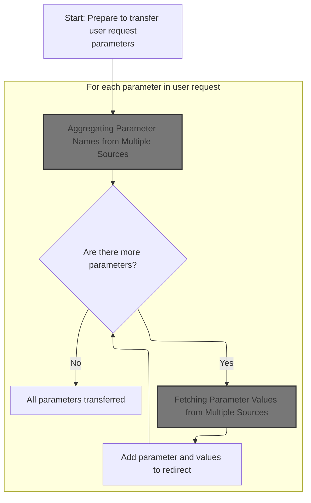
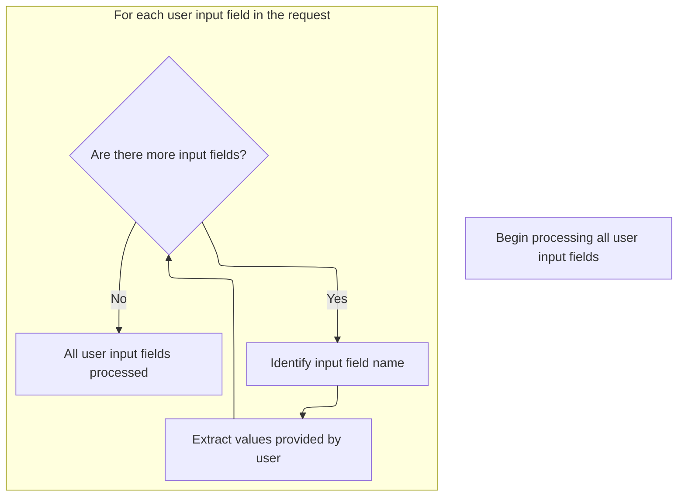
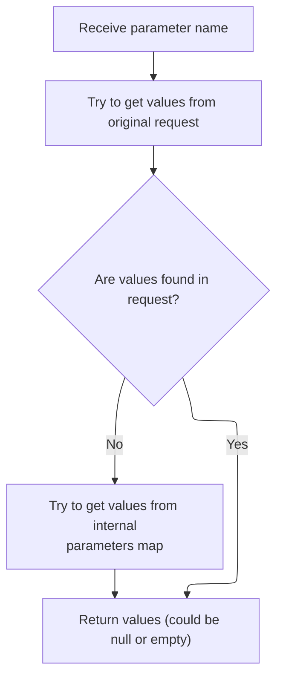

This document explains how user-submitted parameters from an HTTP request, including file uploads, are transferred into a redirect object. This enables the application to preserve user input during redirection.

# Collecting Request Parameters for Redirection



<SwmSnippet path="/core/src/main/java/org/apache/struts/util/RequestUtils.java" line="496">

---

In <SwmToken path="core/src/main/java/org/apache/struts/util/RequestUtils.java" pos="496:7:7" line-data="    public static void populate(ActionRedirect redirect, HttpServletRequest request) {">`populate`</SwmToken>, we start by grabbing all parameter names from the request. This includes both regular and multipart parameters, so we need to handle wrappers like <SwmToken path="core/src/main/java/org/apache/struts/util/RequestUtils.java" pos="39:10:10" line-data="import org.apache.struts.upload.MultipartRequestWrapper;">`MultipartRequestWrapper`</SwmToken> next to make sure we don't miss any parameters added by file uploads.

```java
    public static void populate(ActionRedirect redirect, HttpServletRequest request) {
        assert (redirect != null) : "redirect is required";
        assert (request != null) : "request is required";
        
        Enumeration e = request.getParameterNames();
```

---

</SwmSnippet>

## Aggregating Parameter Names from Multiple Sources

<SwmSnippet path="/core/src/main/java/org/apache/struts/upload/MultipartRequestWrapper.java" line="94">

---

In <SwmToken path="core/src/main/java/org/apache/struts/upload/MultipartRequestWrapper.java" pos="94:5:5" line-data="    public Enumeration getParameterNames() {">`getParameterNames`</SwmToken>, we start by pulling parameter names from the original request. Next, we need to check the context (via <SwmToken path="core/src/main/java/org/apache/struts/chain/contexts/ServletActionContext.java" pos="39:4:4" line-data="public class ServletActionContext extends WebActionContext {">`ServletActionContext`</SwmToken>) to access the underlying request, since the wrapper may add or override parameters.

```java
    public Enumeration getParameterNames() {
        Enumeration baseParams = getRequest().getParameterNames();
```

---

</SwmSnippet>

### Accessing the Underlying Servlet Request

<SwmSnippet path="/core/src/main/java/org/apache/struts/chain/contexts/ServletActionContext.java" line="94">

---

<SwmToken path="core/src/main/java/org/apache/struts/chain/contexts/ServletActionContext.java" pos="94:5:5" line-data="    public HttpServletRequest getRequest() {">`getRequest`</SwmToken> just fetches the <SwmToken path="core/src/main/java/org/apache/struts/chain/contexts/ServletActionContext.java" pos="94:3:3" line-data="    public HttpServletRequest getRequest() {">`HttpServletRequest`</SwmToken> from the current servlet context. We need to call <SwmToken path="core/src/main/java/org/apache/struts/chain/contexts/ServletActionContext.java" pos="95:3:3" line-data="        return servletWebContext().getRequest();">`servletWebContext`</SwmToken> next to get the actual context object holding the request.

```java
    public HttpServletRequest getRequest() {
        return servletWebContext().getRequest();
    }
```

---

</SwmSnippet>

<SwmSnippet path="/core/src/main/java/org/apache/struts/chain/contexts/ServletActionContext.java" line="67">

---

<SwmToken path="core/src/main/java/org/apache/struts/chain/contexts/ServletActionContext.java" pos="67:5:5" line-data="    protected ServletWebContext servletWebContext() {">`servletWebContext`</SwmToken> just casts the base context to <SwmToken path="core/src/main/java/org/apache/struts/chain/contexts/ServletActionContext.java" pos="67:3:3" line-data="    protected ServletWebContext servletWebContext() {">`ServletWebContext`</SwmToken>. If the context isn't what we expect, this will blow up at runtime.

```java
    protected ServletWebContext servletWebContext() {
        return (ServletWebContext) this.getBaseContext();
    }
```

---

</SwmSnippet>

### Building the Combined Parameter Name List

<SwmSnippet path="/core/src/main/java/org/apache/struts/upload/MultipartRequestWrapper.java" line="96">

---

Back in <SwmToken path="core/src/main/java/org/apache/struts/util/RequestUtils.java" pos="500:9:9" line-data="        Enumeration e = request.getParameterNames();">`getParameterNames`</SwmToken> (<SwmToken path="core/src/main/java/org/apache/struts/util/RequestUtils.java" pos="39:10:10" line-data="import org.apache.struts.upload.MultipartRequestWrapper;">`MultipartRequestWrapper`</SwmToken>), after getting the base parameter names from the servlet context, we add them to a Vector. This is just to collect all names before adding the wrapper's own parameters.

```java
        Vector list = new Vector();

        while (baseParams.hasMoreElements()) {
            list.add(baseParams.nextElement());
        }
```

---

</SwmSnippet>

<SwmSnippet path="/core/src/main/java/org/apache/struts/upload/MultipartRequestWrapper.java" line="102">

---

Finally, <SwmToken path="core/src/main/java/org/apache/struts/util/RequestUtils.java" pos="500:9:9" line-data="        Enumeration e = request.getParameterNames();">`getParameterNames`</SwmToken> (<SwmToken path="core/src/main/java/org/apache/struts/util/RequestUtils.java" pos="39:10:10" line-data="import org.apache.struts.upload.MultipartRequestWrapper;">`MultipartRequestWrapper`</SwmToken>) adds any extra parameter names from the wrapper's internal map. The returned Enumeration now covers both the original and any added/overridden parameters.

```java
        Collection multipartParams = parameters.keySet();
        Iterator iterator = multipartParams.iterator();

        while (iterator.hasNext()) {
            list.add(iterator.next());
        }
```

---

</SwmSnippet>

## Retrieving Parameter Values for Each Name



<SwmSnippet path="/core/src/main/java/org/apache/struts/util/RequestUtils.java" line="501">

---

Back in <SwmToken path="core/src/main/java/org/apache/struts/util/RequestUtils.java" pos="496:7:7" line-data="    public static void populate(ActionRedirect redirect, HttpServletRequest request) {">`populate`</SwmToken> (<SwmToken path="core/src/main/java/org/apache/struts/util/RequestUtils.java" pos="65:4:4" line-data="public class RequestUtils {">`RequestUtils`</SwmToken>), after getting all parameter names (including multipart), we loop through each and fetch their values. We call <SwmToken path="core/src/main/java/org/apache/struts/util/RequestUtils.java" pos="39:10:10" line-data="import org.apache.struts.upload.MultipartRequestWrapper;">`MultipartRequestWrapper`</SwmToken> again to make sure we get values from both the original request and any added by the wrapper.

```java
        while (e.hasMoreElements()) {
            String name = (String) e.nextElement();
            String[] values = request.getParameterValues(name);
```

---

</SwmSnippet>

## Fetching Parameter Values from Multiple Sources



<SwmSnippet path="/core/src/main/java/org/apache/struts/upload/MultipartRequestWrapper.java" line="118">

---

In <SwmToken path="core/src/main/java/org/apache/struts/upload/MultipartRequestWrapper.java" pos="118:7:7" line-data="    public String[] getParameterValues(String name) {">`getParameterValues`</SwmToken>, we first try to get values from the underlying request. If nothing is found, we check the wrapper's internal parameters map. Next, we call the servlet context again to access the base request if needed.

```java
    public String[] getParameterValues(String name) {
        String[] value = getRequest().getParameterValues(name);

```

---

</SwmSnippet>

<SwmSnippet path="/core/src/main/java/org/apache/struts/upload/MultipartRequestWrapper.java" line="121">

---

Back in <SwmToken path="core/src/main/java/org/apache/struts/util/RequestUtils.java" pos="503:11:11" line-data="            String[] values = request.getParameterValues(name);">`getParameterValues`</SwmToken> (<SwmToken path="core/src/main/java/org/apache/struts/util/RequestUtils.java" pos="39:10:10" line-data="import org.apache.struts.upload.MultipartRequestWrapper;">`MultipartRequestWrapper`</SwmToken>), after checking the servlet context, we fall back to the internal parameters map if needed. The function just returns whatever it finds, assuming it's a String\[\].

```java
        if (value == null) {
            value = (String[]) parameters.get(name);
        }

        return value;
    }
```

---

</SwmSnippet>

## Adding Parameters to the Redirect Object

<SwmSnippet path="/core/src/main/java/org/apache/struts/util/RequestUtils.java" line="504">

---

Finally, back in <SwmToken path="core/src/main/java/org/apache/struts/util/RequestUtils.java" pos="496:7:7" line-data="    public static void populate(ActionRedirect redirect, HttpServletRequest request) {">`populate`</SwmToken> (<SwmToken path="core/src/main/java/org/apache/struts/util/RequestUtils.java" pos="65:4:4" line-data="public class RequestUtils {">`RequestUtils`</SwmToken>), we add each parameter and its values to the <SwmToken path="core/src/main/java/org/apache/struts/util/RequestUtils.java" pos="496:9:9" line-data="    public static void populate(ActionRedirect redirect, HttpServletRequest request) {">`ActionRedirect`</SwmToken>. This pushes all collected parameters into the redirect object for use in the next step.

```java
            redirect.addParameter(name, values);
        }
    }
```

---

</SwmSnippet>

&nbsp;

*This is an auto-generated document by Swimm 🌊 and has not yet been verified by a human*

<SwmMeta version="3.0.0" repo-id="Z2l0aHViJTNBJTNBc3RydXRzMSUzQSUzQVN3aW1tLURlbW8=" repo-name="struts1"><sup>Powered by [Swimm](https://app.swimm.io/)</sup></SwmMeta>
