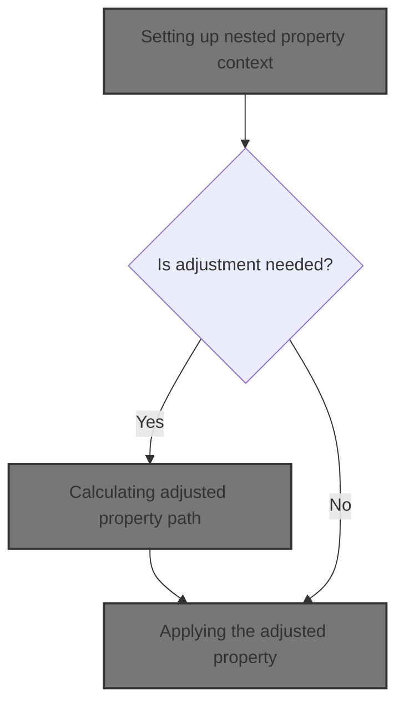

This document describes how tags in nested data structures are updated to reference the correct property path. This enables dynamic and accurate data binding for forms and UI components that work with nested data. The flow receives a tag and the current request context, determines if the property path needs adjustment, computes the correct path, and updates the tag.



# Where is this flow used?

This flow is used multiple times in the codebase as represented in the following diagram:

(Note - these are only some of the entry points of this flow)

```mermaid
graph TD;
      2a2f9513cbb02a07a418db6710bfd4000d7fe6d6588bf97ea3d57de50a8872e6(taglib/…/logic/NestedIterateTag.java::NestedIterateTag.doStartTag) --> b19d992fdd880149cdcce47b903a13c2e50663f2dd3b95cd63794022ff0cd409(taglib/…/nested/NestedPropertyHelper.java::NestedPropertyHelper.setNestedProperties)

2b2b21443b50fff2d167e05f9a396a8acffed93630620f6578e0d575ee4d457c(taglib/…/html/NestedOptionsTag.java::NestedOptionsTag.doStartTag) --> b19d992fdd880149cdcce47b903a13c2e50663f2dd3b95cd63794022ff0cd409(taglib/…/nested/NestedPropertyHelper.java::NestedPropertyHelper.setNestedProperties)

d100e787fbcc913ff09826fc31239fa750b41271b1662484f359847451b6d56b(taglib/…/html/NestedCheckboxTag.java::NestedCheckboxTag.doStartTag) --> b19d992fdd880149cdcce47b903a13c2e50663f2dd3b95cd63794022ff0cd409(taglib/…/nested/NestedPropertyHelper.java::NestedPropertyHelper.setNestedProperties)

da873aa218d9ebc7b71444dfe0ba6428ae7b0047f8d6ecce30de52cfd29c276a(taglib/…/html/NestedErrorsTag.java::NestedErrorsTag.doStartTag) --> b19d992fdd880149cdcce47b903a13c2e50663f2dd3b95cd63794022ff0cd409(taglib/…/nested/NestedPropertyHelper.java::NestedPropertyHelper.setNestedProperties)

bf0f0f5250c147b47b1bd98d548aaa7050617b448b699c046f0579ef8d2af1e6(taglib/…/html/NestedFileTag.java::NestedFileTag.doStartTag) --> b19d992fdd880149cdcce47b903a13c2e50663f2dd3b95cd63794022ff0cd409(taglib/…/nested/NestedPropertyHelper.java::NestedPropertyHelper.setNestedProperties)


classDef mainFlowStyle color:#000000,fill:#7CB9F4
classDef rootsStyle color:#000000,fill:#00FFF4
classDef Style1 color:#000000,fill:#00FFAA
classDef Style2 color:#000000,fill:#FFFF00
classDef Style3 color:#000000,fill:#AA7CB9

%% Swimm:
%% graph TD;
%%       2a2f9513cbb02a07a418db6710bfd4000d7fe6d6588bf97ea3d57de50a8872e6(<SwmPath>[taglib/…/logic/NestedIterateTag.java](taglib/src/main/java/org/apache/struts/taglib/nested/logic/NestedIterateTag.java)</SwmPath>::NestedIterateTag.doStartTag) --> b19d992fdd880149cdcce47b903a13c2e50663f2dd3b95cd63794022ff0cd409(<SwmPath>[taglib/…/nested/NestedPropertyHelper.java](taglib/src/main/java/org/apache/struts/taglib/nested/NestedPropertyHelper.java)</SwmPath>::NestedPropertyHelper.setNestedProperties)
%% 
%% 2b2b21443b50fff2d167e05f9a396a8acffed93630620f6578e0d575ee4d457c(<SwmPath>[taglib/…/html/NestedOptionsTag.java](taglib/src/main/java/org/apache/struts/taglib/nested/html/NestedOptionsTag.java)</SwmPath>::NestedOptionsTag.doStartTag) --> b19d992fdd880149cdcce47b903a13c2e50663f2dd3b95cd63794022ff0cd409(<SwmPath>[taglib/…/nested/NestedPropertyHelper.java](taglib/src/main/java/org/apache/struts/taglib/nested/NestedPropertyHelper.java)</SwmPath>::NestedPropertyHelper.setNestedProperties)
%% 
%% d100e787fbcc913ff09826fc31239fa750b41271b1662484f359847451b6d56b(<SwmPath>[taglib/…/html/NestedCheckboxTag.java](taglib/src/main/java/org/apache/struts/taglib/nested/html/NestedCheckboxTag.java)</SwmPath>::NestedCheckboxTag.doStartTag) --> b19d992fdd880149cdcce47b903a13c2e50663f2dd3b95cd63794022ff0cd409(<SwmPath>[taglib/…/nested/NestedPropertyHelper.java](taglib/src/main/java/org/apache/struts/taglib/nested/NestedPropertyHelper.java)</SwmPath>::NestedPropertyHelper.setNestedProperties)
%% 
%% da873aa218d9ebc7b71444dfe0ba6428ae7b0047f8d6ecce30de52cfd29c276a(<SwmPath>[taglib/…/html/NestedErrorsTag.java](taglib/src/main/java/org/apache/struts/taglib/nested/html/NestedErrorsTag.java)</SwmPath>::NestedErrorsTag.doStartTag) --> b19d992fdd880149cdcce47b903a13c2e50663f2dd3b95cd63794022ff0cd409(<SwmPath>[taglib/…/nested/NestedPropertyHelper.java](taglib/src/main/java/org/apache/struts/taglib/nested/NestedPropertyHelper.java)</SwmPath>::NestedPropertyHelper.setNestedProperties)
%% 
%% bf0f0f5250c147b47b1bd98d548aaa7050617b448b699c046f0579ef8d2af1e6(<SwmPath>[taglib/…/html/NestedFileTag.java](taglib/src/main/java/org/apache/struts/taglib/nested/html/NestedFileTag.java)</SwmPath>::NestedFileTag.doStartTag) --> b19d992fdd880149cdcce47b903a13c2e50663f2dd3b95cd63794022ff0cd409(<SwmPath>[taglib/…/nested/NestedPropertyHelper.java](taglib/src/main/java/org/apache/struts/taglib/nested/NestedPropertyHelper.java)</SwmPath>::NestedPropertyHelper.setNestedProperties)
%% 
%% 
%% classDef mainFlowStyle color:#000000,fill:#7CB9F4
%% classDef rootsStyle color:#000000,fill:#00FFF4
%% classDef Style1 color:#000000,fill:#00FFAA
%% classDef Style2 color:#000000,fill:#FFFF00
%% classDef Style3 color:#000000,fill:#AA7CB9
```



# Setting up nested property context

<SwmSnippet path="/taglib/src/main/java/org/apache/struts/taglib/nested/NestedPropertyHelper.java" line="175">

---

In <SwmToken path="taglib/src/main/java/org/apache/struts/taglib/nested/NestedPropertyHelper.java" pos="175:7:7" line-data="    public static void setNestedProperties(HttpServletRequest request,">`setNestedProperties`</SwmToken>, we check if the tag needs its property adjusted based on its name context. If adjustment is needed, we call <SwmToken path="taglib/src/main/java/org/apache/struts/taglib/nested/NestedPropertyHelper.java" pos="195:5:5" line-data="            property = getAdjustedProperty(request, property);">`getAdjustedProperty`</SwmToken> to recalculate the property path so it fits the current nesting. This sets up the tag to reference the correct property in the request.

```java
    public static void setNestedProperties(HttpServletRequest request,
        NestedPropertySupport tag) {
        boolean adjustProperty = true;

        /* if the tag implements NestedNameSupport, set the name for the tag also */
        if (tag instanceof NestedNameSupport) {
            NestedNameSupport nameTag = (NestedNameSupport) tag;

            if ((nameTag.getName() == null)
                || Constants.BEAN_KEY.equals(nameTag.getName())) {
                nameTag.setName(getCurrentName(request, (NestedNameSupport) tag));
            } else {
                adjustProperty = false;
            }
        }

        /* get and set the relative property, adjust if required */
        String property = tag.getProperty();

        if (adjustProperty) {
            property = getAdjustedProperty(request, property);
        }

```

---

</SwmSnippet>

## Calculating adjusted property path

<SwmSnippet path="/taglib/src/main/java/org/apache/struts/taglib/nested/NestedPropertyHelper.java" line="121">

---

<SwmToken path="taglib/src/main/java/org/apache/struts/taglib/nested/NestedPropertyHelper.java" pos="121:9:9" line-data="    public static final String getAdjustedProperty(HttpServletRequest request,">`getAdjustedProperty`</SwmToken> grabs the current parent property from the request and passes it, along with the tag's property, to <SwmToken path="taglib/src/main/java/org/apache/struts/taglib/nested/NestedPropertyHelper.java" pos="126:3:3" line-data="        return calculateRelativeProperty(property, parent);">`calculateRelativeProperty`</SwmToken>. This lets us compute the correct relative path for the tag's property based on its nesting.

```java
    public static final String getAdjustedProperty(HttpServletRequest request,
        String property) {
        // get the old one if any
        String parent = getCurrentProperty(request);

        return calculateRelativeProperty(property, parent);
    }
```

---

</SwmSnippet>

## Resolving relative property path

```mermaid
%%{init: {"flowchart": {"defaultRenderer": "elk"}} }%%
flowchart TD
    node1["Start: Resolve relative property path"] --> node2{"Is parent or property null?"}
    click node1 openCode "taglib/src/main/java/org/apache/struts/taglib/nested/NestedPropertyHelper.java:232:234"
    click node2 openCode "taglib/src/main/java/org/apache/struts/taglib/nested/NestedPropertyHelper.java:234:241"
    node2 -->|"Yes"| node3["Normalize to empty string"]
    click node3 openCode "taglib/src/main/java/org/apache/struts/taglib/nested/NestedPropertyHelper.java:235:240"
    node3 --> node4{"Is property a special reference to parent?"}
    click node4 openCode "taglib/src/main/java/org/apache/struts/taglib/nested/NestedPropertyHelper.java:244:246"
    node2 -->|"No"| node4
    node4 -->|"Yes"| node5["Return parent context"]
    click node5 openCode "taglib/src/main/java/org/apache/struts/taglib/nested/NestedPropertyHelper.java:245:246"
    node4 -->|"No"| node6{"Does stepping start from root or token count >= parent token count?"}
    click node6 openCode "taglib/src/main/java/org/apache/struts/taglib/nested/NestedPropertyHelper.java:264:279"
    node6 -->|"Yes"| node7["Return property from root"]
    click node7 openCode "taglib/src/main/java/org/apache/struts/taglib/nested/NestedPropertyHelper.java:266:278"
    node6 -->|"No"| node8["Construct property path"]
    click node8 openCode "taglib/src/main/java/org/apache/struts/taglib/nested/NestedPropertyHelper.java:281:297"
    subgraph loop1["Append parent tokens up to difference"]
        node8 --> node9["Append parent tokens"]
        click node9 openCode "taglib/src/main/java/org/apache/struts/taglib/nested/NestedPropertyHelper.java:285:288"
    end
    node9 --> node10{"Is trailing dot present?"}
    click node10 openCode "taglib/src/main/java/org/apache/struts/taglib/nested/NestedPropertyHelper.java:293:294"
    node10 -->|"Yes"| node11["Return path without trailing dot"]
    click node11 openCode "taglib/src/main/java/org/apache/struts/taglib/nested/NestedPropertyHelper.java:294:295"
    node10 -->|"No"| node12["Return constructed property path"]
    click node12 openCode "taglib/src/main/java/org/apache/struts/taglib/nested/NestedPropertyHelper.java:296:297"

classDef HeadingStyle fill:#777777,stroke:#333,stroke-width:2px;

%% Swimm:
%% %%{init: {"flowchart": {"defaultRenderer": "elk"}} }%%
%% flowchart TD
%%     node1["Start: Resolve relative property path"] --> node2{"Is parent or property null?"}
%%     click node1 openCode "<SwmPath>[taglib/…/nested/NestedPropertyHelper.java](taglib/src/main/java/org/apache/struts/taglib/nested/NestedPropertyHelper.java)</SwmPath>:232:234"
%%     click node2 openCode "<SwmPath>[taglib/…/nested/NestedPropertyHelper.java](taglib/src/main/java/org/apache/struts/taglib/nested/NestedPropertyHelper.java)</SwmPath>:234:241"
%%     node2 -->|"Yes"| node3["Normalize to empty string"]
%%     click node3 openCode "<SwmPath>[taglib/…/nested/NestedPropertyHelper.java](taglib/src/main/java/org/apache/struts/taglib/nested/NestedPropertyHelper.java)</SwmPath>:235:240"
%%     node3 --> node4{"Is property a special reference to parent?"}
%%     click node4 openCode "<SwmPath>[taglib/…/nested/NestedPropertyHelper.java](taglib/src/main/java/org/apache/struts/taglib/nested/NestedPropertyHelper.java)</SwmPath>:244:246"
%%     node2 -->|"No"| node4
%%     node4 -->|"Yes"| node5["Return parent context"]
%%     click node5 openCode "<SwmPath>[taglib/…/nested/NestedPropertyHelper.java](taglib/src/main/java/org/apache/struts/taglib/nested/NestedPropertyHelper.java)</SwmPath>:245:246"
%%     node4 -->|"No"| node6{"Does stepping start from root or token count >= parent token count?"}
%%     click node6 openCode "<SwmPath>[taglib/…/nested/NestedPropertyHelper.java](taglib/src/main/java/org/apache/struts/taglib/nested/NestedPropertyHelper.java)</SwmPath>:264:279"
%%     node6 -->|"Yes"| node7["Return property from root"]
%%     click node7 openCode "<SwmPath>[taglib/…/nested/NestedPropertyHelper.java](taglib/src/main/java/org/apache/struts/taglib/nested/NestedPropertyHelper.java)</SwmPath>:266:278"
%%     node6 -->|"No"| node8["Construct property path"]
%%     click node8 openCode "<SwmPath>[taglib/…/nested/NestedPropertyHelper.java](taglib/src/main/java/org/apache/struts/taglib/nested/NestedPropertyHelper.java)</SwmPath>:281:297"
%%     subgraph loop1["Append parent tokens up to difference"]
%%         node8 --> node9["Append parent tokens"]
%%         click node9 openCode "<SwmPath>[taglib/…/nested/NestedPropertyHelper.java](taglib/src/main/java/org/apache/struts/taglib/nested/NestedPropertyHelper.java)</SwmPath>:285:288"
%%     end
%%     node9 --> node10{"Is trailing dot present?"}
%%     click node10 openCode "<SwmPath>[taglib/…/nested/NestedPropertyHelper.java](taglib/src/main/java/org/apache/struts/taglib/nested/NestedPropertyHelper.java)</SwmPath>:293:294"
%%     node10 -->|"Yes"| node11["Return path without trailing dot"]
%%     click node11 openCode "<SwmPath>[taglib/…/nested/NestedPropertyHelper.java](taglib/src/main/java/org/apache/struts/taglib/nested/NestedPropertyHelper.java)</SwmPath>:294:295"
%%     node10 -->|"No"| node12["Return constructed property path"]
%%     click node12 openCode "<SwmPath>[taglib/…/nested/NestedPropertyHelper.java](taglib/src/main/java/org/apache/struts/taglib/nested/NestedPropertyHelper.java)</SwmPath>:296:297"
%% 
%% classDef HeadingStyle fill:#777777,stroke:#333,stroke-width:2px;
```



<SwmSnippet path="/taglib/src/main/java/org/apache/struts/taglib/nested/NestedPropertyHelper.java" line="232">

---

In <SwmToken path="taglib/src/main/java/org/apache/struts/taglib/nested/NestedPropertyHelper.java" pos="232:7:7" line-data="    private static String calculateRelativeProperty(String property,">`calculateRelativeProperty`</SwmToken>, we handle special property values ('./', 'this/') by returning the parent directly. Otherwise, we split the property and parent using their respective separators, then calculate the new property path based on their nesting and stepping tokens. This lets us resolve the correct relative property for the tag.

```java
    private static String calculateRelativeProperty(String property,
        String parent) {
        if (parent == null) {
            parent = "";
        }

        if (property == null) {
            property = "";
        }

        /* Special case... reference my parent's nested property.
        Otherwise impossible for things like indexed properties */
        if ("./".equals(property) || "this/".equals(property)) {
            return parent;
        }

        /* remove the stepping from the property */
        String stepping;

        /* isolate a parent reference */
        if (property.endsWith("/")) {
            stepping = property;
            property = "";
        } else {
            stepping = property.substring(0, property.lastIndexOf('/') + 1);

            /* isolate the property */
            property =
                property.substring(property.lastIndexOf('/') + 1,
                    property.length());
        }

        if (stepping.startsWith("/")) {
            /* return from root */
            return property;
        } else {
            /* tokenize the nested property */
            StringTokenizer proT = new StringTokenizer(parent, ".");
            int propCount = proT.countTokens();

            /* tokenize the stepping */
            StringTokenizer strT = new StringTokenizer(stepping, "/");
            int count = strT.countTokens();

            if (count >= propCount) {
                /* return from root */
                return property;
            } else {
                /* append the tokens up to the token difference */
                count = propCount - count;

                StringBuffer result = new StringBuffer();

                for (int i = 0; i < count; i++) {
                    result.append(proT.nextToken());
                    result.append('.');
                }
```

---

</SwmSnippet>

<SwmSnippet path="/taglib/src/main/java/org/apache/struts/taglib/nested/NestedPropertyHelper.java" line="290">

---

Finally, <SwmToken path="taglib/src/main/java/org/apache/struts/taglib/nested/NestedPropertyHelper.java" pos="126:3:3" line-data="        return calculateRelativeProperty(property, parent);">`calculateRelativeProperty`</SwmToken> returns the computed property path, either from root or relative to the parent, with any trailing dot stripped. This output is used by the tag to reference the correct nested property.

```java
                result.append(property);

                /* parent reference will have a dot on the end. Leave it off */
                if (result.charAt(result.length() - 1) == '.') {
                    return result.substring(0, result.length() - 1);
                } else {
                    return result.toString();
                }
            }
        }
    }
```

---

</SwmSnippet>

## Applying the adjusted property

<SwmSnippet path="/taglib/src/main/java/org/apache/struts/taglib/nested/NestedPropertyHelper.java" line="198">

---

Back in <SwmToken path="taglib/src/main/java/org/apache/struts/taglib/nested/NestedPropertyHelper.java" pos="175:7:7" line-data="    public static void setNestedProperties(HttpServletRequest request,">`setNestedProperties`</SwmToken>, we set the tag's property to the adjusted value returned from <SwmToken path="taglib/src/main/java/org/apache/struts/taglib/nested/NestedPropertyHelper.java" pos="121:9:9" line-data="    public static final String getAdjustedProperty(HttpServletRequest request,">`getAdjustedProperty`</SwmToken>. This lets the tag reference the right nested property for its operation.

```java
        tag.setProperty(property);
    }
```

---

</SwmSnippet>

&nbsp;

*This is an auto-generated document by Swimm 🌊 and has not yet been verified by a human*

<SwmMeta version="3.0.0" repo-id="Z2l0aHViJTNBJTNBc3RydXRzMSUzQSUzQVN3aW1tLURlbW8=" repo-name="struts1"><sup>Powered by [Swimm](https://app.swimm.io/)</sup></SwmMeta>
