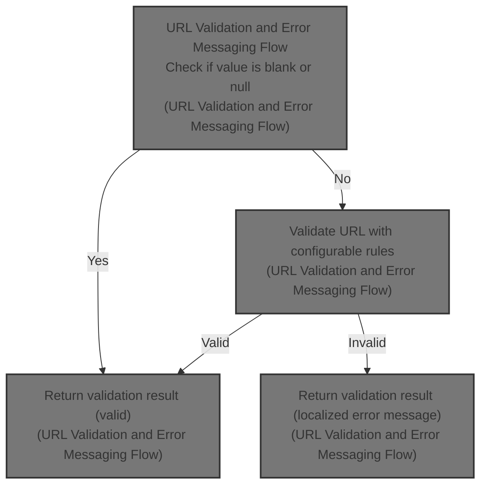

This document outlines how user-submitted URLs are validated based on configurable rules. Blank values are accepted, while other inputs are checked against the specified options. If validation fails, a localized error message is provided to the user.



# URL Validation and Error Messaging Flow

```mermaid
%%{init: {"flowchart": {"defaultRenderer": "elk"}} }%%
flowchart TD
    node1["Start URL validation"]
    click node1 openCode "core/src/main/java/org/apache/struts/validator/FieldChecks.java:1347:1349"
    node1 --> node2{"Is value blank or null?"}
    click node2 openCode "core/src/main/java/org/apache/struts/validator/FieldChecks.java:1359:1361"
    node2 -->|"Yes"| node3["Accept as valid"]
    click node3 openCode "core/src/main/java/org/apache/struts/validator/FieldChecks.java:1360:1361"
    node2 -->|"No"| node4["Determine validation rules: allow all schemes, double slashes, no fragments, allowed schemes"]
    click node4 openCode "core/src/main/java/org/apache/struts/validator/FieldChecks.java:1364:1390"
    node4 --> node5{"Are custom schemes specified?"}
    click node5 openCode "core/src/main/java/org/apache/struts/validator/FieldChecks.java:1386:1390"
    node5 -->|"Yes"| node6["Parse allowed schemes"]
    click node6 openCode "core/src/main/java/org/apache/struts/validator/FieldChecks.java:1403:1416"
    node6 --> node7["Validate value as URL with custom rules"]
    click node7 openCode "core/src/main/java/org/apache/struts/validator/FieldChecks.java:1418:1428"
    node5 -->|"No"| node8{"Are any custom options set?"}
    click node8 openCode "core/src/main/java/org/apache/struts/validator/FieldChecks.java:1392:1401"
    node8 -->|"Yes"| node7
    node8 -->|"No"| node9["Validate value as URL with default rules"]
    click node9 openCode "core/src/main/java/org/apache/struts/validator/FieldChecks.java:1393:1400"
    node7 --> node10{"Is value valid URL?"}
    click node10 openCode "core/src/main/java/org/apache/struts/validator/FieldChecks.java:1421:1428"
    node9 --> node10
    node10 -->|"Yes"| node11["Accept as valid"]
    click node11 openCode "core/src/main/java/org/apache/struts/validator/FieldChecks.java:1422:1423"
    node10 -->|"No"| node12["Record error and reject"]
    click node12 openCode "core/src/main/java/org/apache/struts/validator/FieldChecks.java:1424:1428"

    subgraph loop1["For each scheme in allowed schemes"]
      node6
    end

classDef HeadingStyle fill:#777777,stroke:#333,stroke-width:2px;

%% Swimm:
%% %%{init: {"flowchart": {"defaultRenderer": "elk"}} }%%
%% flowchart TD
%%     node1["Start URL validation"]
%%     click node1 openCode "<SwmPath>[core/…/validator/FieldChecks.java](core/src/main/java/org/apache/struts/validator/FieldChecks.java)</SwmPath>:1347:1349"
%%     node1 --> node2{"Is value blank or null?"}
%%     click node2 openCode "<SwmPath>[core/…/validator/FieldChecks.java](core/src/main/java/org/apache/struts/validator/FieldChecks.java)</SwmPath>:1359:1361"
%%     node2 -->|"Yes"| node3["Accept as valid"]
%%     click node3 openCode "<SwmPath>[core/…/validator/FieldChecks.java](core/src/main/java/org/apache/struts/validator/FieldChecks.java)</SwmPath>:1360:1361"
%%     node2 -->|"No"| node4["Determine validation rules: allow all schemes, double slashes, no fragments, allowed schemes"]
%%     click node4 openCode "<SwmPath>[core/…/validator/FieldChecks.java](core/src/main/java/org/apache/struts/validator/FieldChecks.java)</SwmPath>:1364:1390"
%%     node4 --> node5{"Are custom schemes specified?"}
%%     click node5 openCode "<SwmPath>[core/…/validator/FieldChecks.java](core/src/main/java/org/apache/struts/validator/FieldChecks.java)</SwmPath>:1386:1390"
%%     node5 -->|"Yes"| node6["Parse allowed schemes"]
%%     click node6 openCode "<SwmPath>[core/…/validator/FieldChecks.java](core/src/main/java/org/apache/struts/validator/FieldChecks.java)</SwmPath>:1403:1416"
%%     node6 --> node7["Validate value as URL with custom rules"]
%%     click node7 openCode "<SwmPath>[core/…/validator/FieldChecks.java](core/src/main/java/org/apache/struts/validator/FieldChecks.java)</SwmPath>:1418:1428"
%%     node5 -->|"No"| node8{"Are any custom options set?"}
%%     click node8 openCode "<SwmPath>[core/…/validator/FieldChecks.java](core/src/main/java/org/apache/struts/validator/FieldChecks.java)</SwmPath>:1392:1401"
%%     node8 -->|"Yes"| node7
%%     node8 -->|"No"| node9["Validate value as URL with default rules"]
%%     click node9 openCode "<SwmPath>[core/…/validator/FieldChecks.java](core/src/main/java/org/apache/struts/validator/FieldChecks.java)</SwmPath>:1393:1400"
%%     node7 --> node10{"Is value valid URL?"}
%%     click node10 openCode "<SwmPath>[core/…/validator/FieldChecks.java](core/src/main/java/org/apache/struts/validator/FieldChecks.java)</SwmPath>:1421:1428"
%%     node9 --> node10
%%     node10 -->|"Yes"| node11["Accept as valid"]
%%     click node11 openCode "<SwmPath>[core/…/validator/FieldChecks.java](core/src/main/java/org/apache/struts/validator/FieldChecks.java)</SwmPath>:1422:1423"
%%     node10 -->|"No"| node12["Record error and reject"]
%%     click node12 openCode "<SwmPath>[core/…/validator/FieldChecks.java](core/src/main/java/org/apache/struts/validator/FieldChecks.java)</SwmPath>:1424:1428"
%% 
%%     subgraph loop1["For each scheme in allowed schemes"]
%%       node6
%%     end
%% 
%% classDef HeadingStyle fill:#777777,stroke:#333,stroke-width:2px;
```



<SwmSnippet path="/core/src/main/java/org/apache/struts/validator/FieldChecks.java" line="1347">

---

In <SwmToken path="core/src/main/java/org/apache/struts/validator/FieldChecks.java" pos="1347:7:7" line-data="    public static boolean validateUrl(Object bean, ValidatorAction va,">`validateUrl`</SwmToken>, we grab the URL value from the bean and check if it's blank or null. If not, we pull validation options from resources—these control things like which URL schemes are allowed, whether two slashes are OK, and if fragments are forbidden. We combine these into a bitmask for <SwmToken path="core/src/main/java/org/apache/struts/validator/FieldChecks.java" pos="1368:11:11" line-data="        int options = allowallschemes ? UrlValidator.ALLOW_ALL_SCHEMES : 0;">`UrlValidator`</SwmToken>. If no options or schemes are set, we use <SwmToken path="core/src/main/java/org/apache/struts/validator/FieldChecks.java" pos="1359:4:4" line-data="        if (GenericValidator.isBlankOrNull(value)) {">`GenericValidator`</SwmToken> as a fallback. If validation fails, we call <SwmToken path="core/src/main/java/org/apache/struts/validator/FieldChecks.java" pos="1397:1:3" line-data="                    Resources.getActionMessage(validator, request, va, field));">`Resources.getActionMessage`</SwmToken> to add an error message, which is why we need to hit Resources next.

```java
    public static boolean validateUrl(Object bean, ValidatorAction va,
        Field field, ActionMessages errors, Validator validator,
        HttpServletRequest request) {
        String value = null;

        try {
            value = evaluateBean(bean, field);
        } catch (Exception e) {
            processFailure(errors, field, validator.getFormName(), "url", e);
            return false;
        }

        if (GenericValidator.isBlankOrNull(value)) {
            return true;
        }

        // Get the options and schemes Vars
        String allowallschemesVar =
            Resources.getVarValue("allowallschemes", field, validator, request,
                false);
        boolean allowallschemes = "true".equalsIgnoreCase(allowallschemesVar);
        int options = allowallschemes ? UrlValidator.ALLOW_ALL_SCHEMES : 0;

        String allow2slashesVar =
            Resources.getVarValue("allow2slashes", field, validator, request,
                false);

        if ("true".equalsIgnoreCase(allow2slashesVar)) {
            options += UrlValidator.ALLOW_2_SLASHES;
        }

        String nofragmentsVar =
            Resources.getVarValue("nofragments", field, validator, request,
                false);

        if ("true".equalsIgnoreCase(nofragmentsVar)) {
            options += UrlValidator.NO_FRAGMENTS;
        }

        String schemesVar =
            allowallschemes ? null
                            : Resources.getVarValue("schemes", field,
                validator, request, false);

        // No options or schemes - use GenericValidator as default
        if ((options == 0) && (schemesVar == null)) {
            if (GenericValidator.isUrl(value)) {
                return true;
            } else {
                errors.add(field.getKey(),
                    Resources.getActionMessage(validator, request, va, field));

                return false;
            }
        }

```

---

</SwmSnippet>

<SwmSnippet path="/core/src/main/java/org/apache/struts/validator/Resources.java" line="365">

---

<SwmToken path="core/src/main/java/org/apache/struts/validator/Resources.java" pos="365:7:7" line-data="    public static ActionMessage getActionMessage(Validator validator,">`getActionMessage`</SwmToken> figures out which error message to show by checking for a Msg in the Field. If it's not a resource, it uses that key. Otherwise, it builds the message using keys and bundles, resolves arguments for localization, and falls back to a generic string if nothing is found. This keeps error messaging flexible and localized.

```java
    public static ActionMessage getActionMessage(Validator validator,
        HttpServletRequest request, ValidatorAction va, Field field) {
        Msg msg = field.getMessage(va.getName());

        if ((msg != null) && !msg.isResource()) {
            return new ActionMessage(msg.getKey(), false);
        }

        String msgKey = null;
        String msgBundle = null;

        if (msg == null) {
            msgKey = va.getMsg();
        } else {
            msgKey = msg.getKey();
            msgBundle = msg.getBundle();
        }

        if ((msgKey == null) || (msgKey.length() == 0)) {
            return new ActionMessage("??? " + va.getName() + "."
                + field.getProperty() + " ???", false);
        }

        ServletContext application =
            (ServletContext) validator.getParameterValue(SERVLET_CONTEXT_PARAM);
        MessageResources messages =
            getMessageResources(application, request, msgBundle);
        Locale locale = RequestUtils.getUserLocale(request, null);

        Arg[] args = field.getArgs(va.getName());
        String[] argValues =
            getArgValues(application, request, messages, locale, args);

        ActionMessage actionMessage = null;

        if (msgBundle == null) {
            actionMessage = new ActionMessage(msgKey, argValues);
        } else {
            String message = messages.getMessage(locale, msgKey, argValues);

            actionMessage = new ActionMessage(message, false);
        }

        return actionMessage;
    }
```

---

</SwmSnippet>

<SwmSnippet path="/core/src/main/java/org/apache/struts/validator/FieldChecks.java" line="1403">

---

Back in <SwmToken path="core/src/main/java/org/apache/struts/validator/FieldChecks.java" pos="1347:7:7" line-data="    public static boolean validateUrl(Object bean, ValidatorAction va,">`validateUrl`</SwmToken>, after handling error messaging, we parse the allowed schemes string into an array if 'allowallschemes' is false. This is needed because <SwmToken path="core/src/main/java/org/apache/struts/validator/FieldChecks.java" pos="1368:11:11" line-data="        int options = allowallschemes ? UrlValidator.ALLOW_ALL_SCHEMES : 0;">`UrlValidator`</SwmToken> requires an array of schemes to restrict which URLs are valid. Next, we need to call <SwmToken path="core/src/main/java/org/apache/struts/validator/validwhen/ValidWhenLexer.java" pos="1:25:25" line-data="// $ANTLR 2.7.7 (20060906): &quot;ValidWhenParser.g&quot; -&gt; &quot;ValidWhenLexer.java&quot;$">`ValidWhenLexer`</SwmToken> to tokenize and process any input strings, which helps with parsing and validation logic.

```java
        // Parse comma delimited list of schemes into a String[]
        String[] schemes = null;

        if (schemesVar != null) {
            StringTokenizer st = new StringTokenizer(schemesVar, ",");

            schemes = new String[st.countTokens()];

            int i = 0;

            while (st.hasMoreTokens()) {
                schemes[i++] = st.nextToken().trim();
            }
        }

```

---

</SwmSnippet>

<SwmSnippet path="/core/src/main/java/org/apache/struts/validator/validwhen/ValidWhenLexer.java" line="75">

---

<SwmToken path="core/src/main/java/org/apache/struts/validator/validwhen/ValidWhenLexer.java" pos="75:4:4" line-data="public Token nextToken() throws TokenStreamException {">`nextToken`</SwmToken> in <SwmToken path="core/src/main/java/org/apache/struts/validator/validwhen/ValidWhenLexer.java" pos="1:25:25" line-data="// $ANTLR 2.7.7 (20060906): &quot;ValidWhenParser.g&quot; -&gt; &quot;ValidWhenLexer.java&quot;$">`ValidWhenLexer`</SwmToken> loops until it finds a valid token, skipping whitespace and handling multi-character operators with lookahead. It matches tokens for numbers, strings, brackets, and operators, then adjusts token types using a literals table before returning. This keeps tokenization accurate for validation logic.

```java
public Token nextToken() throws TokenStreamException {
	Token theRetToken=null;
tryAgain:
	for (;;) {
		Token _token = null;
		int _ttype = Token.INVALID_TYPE;
		resetText();
		try {   // for char stream error handling
			try {   // for lexical error handling
				switch ( LA(1)) {
				case '\t':  case '\n':  case '\r':  case ' ':
				{
					mWS(true);
					theRetToken=_returnToken;
					break;
				}
				case '-':  case '0':  case '1':  case '2':
				case '3':  case '4':  case '5':  case '6':
				case '7':  case '8':  case '9':
				{
					mDECIMAL_LITERAL(true);
					theRetToken=_returnToken;
					break;
				}
				case '"':  case '\'':
				{
					mSTRING_LITERAL(true);
					theRetToken=_returnToken;
					break;
				}
				case '[':
				{
					mLBRACKET(true);
					theRetToken=_returnToken;
					break;
				}
				case ']':
				{
					mRBRACKET(true);
					theRetToken=_returnToken;
					break;
				}
				case '(':
				{
					mLPAREN(true);
					theRetToken=_returnToken;
					break;
				}
				case ')':
				{
					mRPAREN(true);
					theRetToken=_returnToken;
					break;
				}
				case '*':
				{
					mTHIS(true);
					theRetToken=_returnToken;
					break;
				}
				case '.':  case '_':  case 'a':  case 'b':
				case 'c':  case 'd':  case 'e':  case 'f':
				case 'g':  case 'h':  case 'i':  case 'j':
				case 'k':  case 'l':  case 'm':  case 'n':
				case 'o':  case 'p':  case 'q':  case 'r':
				case 's':  case 't':  case 'u':  case 'v':
				case 'w':  case 'x':  case 'y':  case 'z':
				{
					mIDENTIFIER(true);
					theRetToken=_returnToken;
					break;
				}
				case '=':
				{
					mEQUALSIGN(true);
					theRetToken=_returnToken;
					break;
				}
				case '!':
				{
					mNOTEQUALSIGN(true);
					theRetToken=_returnToken;
					break;
				}
				default:
					if ((LA(1)=='<') && (LA(2)=='=')) {
						mLESSEQUALSIGN(true);
						theRetToken=_returnToken;
					}
					else if ((LA(1)=='>') && (LA(2)=='=')) {
						mGREATEREQUALSIGN(true);
						theRetToken=_returnToken;
					}
					else if ((LA(1)=='<') && (true)) {
						mLESSTHANSIGN(true);
						theRetToken=_returnToken;
					}
					else if ((LA(1)=='>') && (true)) {
						mGREATERTHANSIGN(true);
						theRetToken=_returnToken;
					}
				else {
					if (LA(1)==EOF_CHAR) {uponEOF(); _returnToken = makeToken(Token.EOF_TYPE);}
				else {throw new NoViableAltForCharException((char)LA(1), getFilename(), getLine(), getColumn());}
				}
				}
				if ( _returnToken==null ) continue tryAgain; // found SKIP token
				_ttype = _returnToken.getType();
				_ttype = testLiteralsTable(_ttype);
				_returnToken.setType(_ttype);
				return _returnToken;
			}
			catch (RecognitionException e) {
				throw new TokenStreamRecognitionException(e);
			}
		}
		catch (CharStreamException cse) {
			if ( cse instanceof CharStreamIOException ) {
				throw new TokenStreamIOException(((CharStreamIOException)cse).io);
			}
			else {
				throw new TokenStreamException(cse.getMessage());
			}
		}
	}
```

---

</SwmSnippet>

<SwmSnippet path="/core/src/main/java/org/apache/struts/validator/FieldChecks.java" line="1418">

---

After tokenizing and parsing, we create a <SwmToken path="core/src/main/java/org/apache/struts/validator/FieldChecks.java" pos="1418:5:5" line-data="        // Create UrlValidator and validate with options/schemes">`UrlValidator`</SwmToken> with the parsed schemes and options, then validate the URL. If it's valid, we're done. If not, we add an error message using <SwmToken path="core/src/main/java/org/apache/struts/validator/FieldChecks.java" pos="1425:1:3" line-data="                Resources.getActionMessage(validator, request, va, field));">`Resources.getActionMessage`</SwmToken>, so the user gets feedback on why their input failed validation.

```java
        // Create UrlValidator and validate with options/schemes
        UrlValidator urlValidator = new UrlValidator(schemes, options);

        if (urlValidator.isValid(value)) {
            return true;
        } else {
            errors.add(field.getKey(),
                Resources.getActionMessage(validator, request, va, field));

            return false;
        }
    }
```

---

</SwmSnippet>

&nbsp;

*This is an auto-generated document by Swimm 🌊 and has not yet been verified by a human*

<SwmMeta version="3.0.0" repo-id="Z2l0aHViJTNBJTNBc3RydXRzMSUzQSUzQVN3aW1tLURlbW8=" repo-name="struts1"><sup>Powered by [Swimm](https://app.swimm.io/)</sup></SwmMeta>
