This document describes how URL validation is performed for user input fields. Validation rules can be customized per field, allowing for flexible requirements. The flow checks if the value is blank, applies the configured validation logic, and provides a localized error message if the value is not valid.

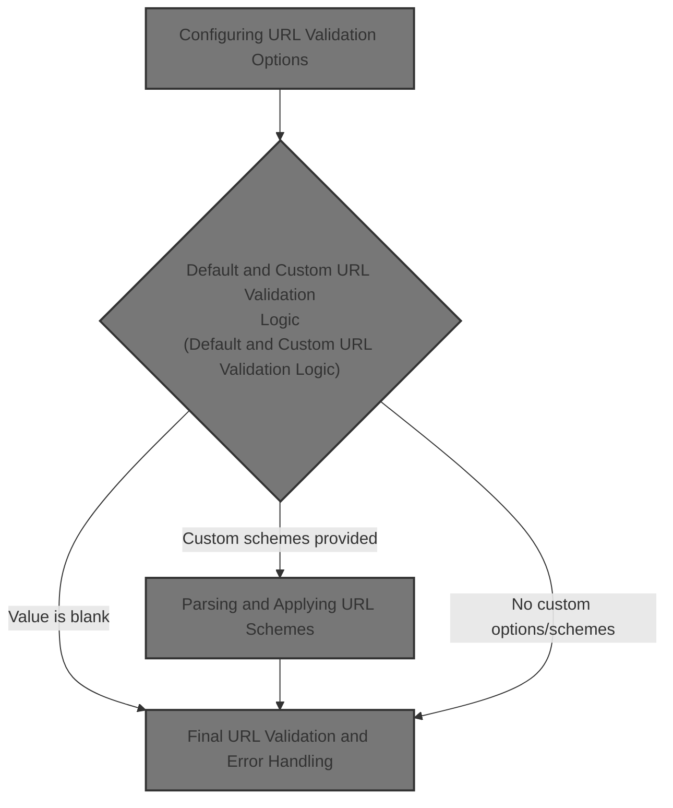
```mermaid
flowchart TD
  node1["Configuring URL Validation Options"]:::HeadingStyle
  click node1 goToHeading "Configuring URL Validation Options"
  node1 --> node2{"Default and Custom URL Validation
Logic
(Default and Custom URL Validation Logic)"}:::HeadingStyle
  click node2 goToHeading "Default and Custom URL Validation Logic"
  node2 -->|"Value is blank"| node4["Final URL Validation and Error Handling"]:::HeadingStyle
  click node4 goToHeading "Final URL Validation and Error Handling"
  node2 -->|"Custom schemes provided"| node3["Parsing and Applying URL Schemes"]:::HeadingStyle
  click node3 goToHeading "Parsing and Applying URL Schemes"
  node3 --> node4
  node2 -->|"No custom options/schemes"| node4
classDef HeadingStyle fill:#777777,stroke:#333,stroke-width:2px;

%% Swimm:
%% flowchart TD
%%   node1["Configuring URL Validation Options"]:::HeadingStyle
%%   click node1 goToHeading "Configuring URL Validation Options"
%%   node1 --> node2{"Default and Custom URL Validation
%% Logic
%% (Default and Custom URL Validation Logic)"}:::HeadingStyle
%%   click node2 goToHeading "Default and Custom URL Validation Logic"
%%   node2 -->|"Value is blank"| node4["Final URL Validation and Error Handling"]:::HeadingStyle
%%   click node4 goToHeading "Final URL Validation and Error Handling"
%%   node2 -->|"Custom schemes provided"| node3["Parsing and Applying URL Schemes"]:::HeadingStyle
%%   click node3 goToHeading "Parsing and Applying URL Schemes"
%%   node3 --> node4
%%   node2 -->|"No custom <SwmToken path="core/src/main/java/org/apache/struts/validator/FieldChecks.java" pos="1418:13:15" line-data="        // Create UrlValidator and validate with options/schemes">`options/schemes`</SwmToken>"| node4
%% classDef HeadingStyle fill:#777777,stroke:#333,stroke-width:2px;
```

# Configuring URL Validation Options

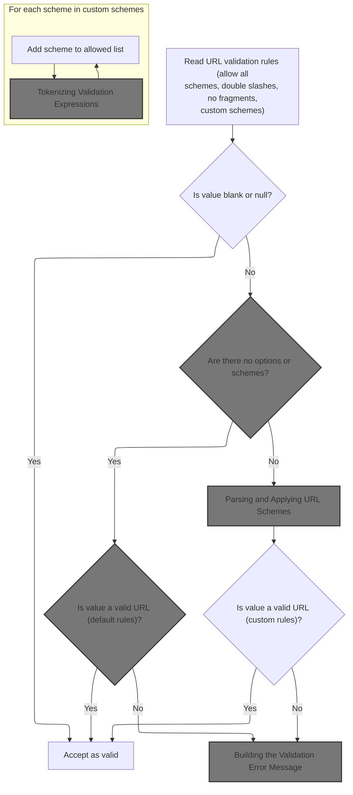
```mermaid
%%{init: {"flowchart": {"defaultRenderer": "elk"}} }%%
flowchart TD
  node1["Read URL validation rules (allow all
schemes, double slashes, no fragments,
custom schemes)"] --> node2{"Is value blank or null?"}
  click node1 openCode "core/src/main/java/org/apache/struts/validator/FieldChecks.java:1347:1389"
  node2 -->|"Yes"| node7["Accept as valid"]
  click node2 openCode "core/src/main/java/org/apache/struts/validator/FieldChecks.java:1359:1361"
  node2 -->|"No"| node3{"Are there no options or schemes?"}
  
  node3 -->|"Yes"| node4{"Is value a valid URL (default rules)?"}
  
  node4 -->|"Yes"| node7
  node4 -->|"No"| node5["Building the Validation Error Message"]
  
  node3 -->|"No"| node6["Parsing and Applying URL Schemes"]
  
  subgraph loop1["For each scheme in custom schemes"]
    node6a["Tokenizing Validation Expressions"]
    
    node6a --> node6b["Add scheme to allowed list"]
    click node6b openCode "core/src/main/java/org/apache/struts/validator/FieldChecks.java:1414:1415"
    node6b --> node6a
  end
  node6 --> node8{"Is value a valid URL (custom rules)?"}
  click node8 openCode "core/src/main/java/org/apache/struts/validator/FieldChecks.java:1421:1423"
  node8 -->|"Yes"| node7
  node8 -->|"No"| node5
classDef HeadingStyle fill:#777777,stroke:#333,stroke-width:2px;
click node3 goToHeading "Default and Custom URL Validation Logic"
node3:::HeadingStyle
click node4 goToHeading "Default and Custom URL Validation Logic"
node4:::HeadingStyle
click node5 goToHeading "Building the Validation Error Message"
node5:::HeadingStyle
click node6 goToHeading "Parsing and Applying URL Schemes"
node6:::HeadingStyle
click node6a goToHeading "Tokenizing Validation Expressions"
node6a:::HeadingStyle

%% Swimm:
%% %%{init: {"flowchart": {"defaultRenderer": "elk"}} }%%
%% flowchart TD
%%   node1["Read URL validation rules (allow all
%% schemes, double slashes, no fragments,
%% custom schemes)"] --> node2{"Is value blank or null?"}
%%   click node1 openCode "<SwmPath>[core/…/validator/FieldChecks.java](core/src/main/java/org/apache/struts/validator/FieldChecks.java)</SwmPath>:1347:1389"
%%   node2 -->|"Yes"| node7["Accept as valid"]
%%   click node2 openCode "<SwmPath>[core/…/validator/FieldChecks.java](core/src/main/java/org/apache/struts/validator/FieldChecks.java)</SwmPath>:1359:1361"
%%   node2 -->|"No"| node3{"Are there no options or schemes?"}
%%   
%%   node3 -->|"Yes"| node4{"Is value a valid URL (default rules)?"}
%%   
%%   node4 -->|"Yes"| node7
%%   node4 -->|"No"| node5["Building the Validation Error Message"]
%%   
%%   node3 -->|"No"| node6["Parsing and Applying URL Schemes"]
%%   
%%   subgraph loop1["For each scheme in custom schemes"]
%%     node6a["Tokenizing Validation Expressions"]
%%     
%%     node6a --> node6b["Add scheme to allowed list"]
%%     click node6b openCode "<SwmPath>[core/…/validator/FieldChecks.java](core/src/main/java/org/apache/struts/validator/FieldChecks.java)</SwmPath>:1414:1415"
%%     node6b --> node6a
%%   end
%%   node6 --> node8{"Is value a valid URL (custom rules)?"}
%%   click node8 openCode "<SwmPath>[core/…/validator/FieldChecks.java](core/src/main/java/org/apache/struts/validator/FieldChecks.java)</SwmPath>:1421:1423"
%%   node8 -->|"Yes"| node7
%%   node8 -->|"No"| node5
%% classDef HeadingStyle fill:#777777,stroke:#333,stroke-width:2px;
%% click node3 goToHeading "Default and Custom URL Validation Logic"
%% node3:::HeadingStyle
%% click node4 goToHeading "Default and Custom URL Validation Logic"
%% node4:::HeadingStyle
%% click node5 goToHeading "Building the Validation Error Message"
%% node5:::HeadingStyle
%% click node6 goToHeading "Parsing and Applying URL Schemes"
%% node6:::HeadingStyle
%% click node6a goToHeading "Tokenizing Validation Expressions"
%% node6a:::HeadingStyle
```

<SwmSnippet path="/core/src/main/java/org/apache/struts/validator/FieldChecks.java" line="1347">

---

In <SwmToken path="core/src/main/java/org/apache/struts/validator/FieldChecks.java" pos="1347:7:7" line-data="    public static boolean validateUrl(Object bean, ValidatorAction va,">`validateUrl`</SwmToken>, we grab the value to validate, bail out early if it's blank, then start pulling in URL validation options from resource variables. These options ('allowallschemes', <SwmToken path="core/src/main/java/org/apache/struts/validator/FieldChecks.java" pos="1371:6:6" line-data="            Resources.getVarValue(&quot;allow2slashes&quot;, field, validator, request,">`allow2slashes`</SwmToken>, 'nofragments', 'schemes') control how strict or flexible the URL check is. We need to call <SwmToken path="core/src/main/java/org/apache/struts/validator/FieldChecks.java" pos="1365:1:3" line-data="            Resources.getVarValue(&quot;allowallschemes&quot;, field, validator, request,">`Resources.getVarValue`</SwmToken> next to fetch these settings, since they're not passed as arguments but configured per field. This setup means the actual validation logic can change based on external config, not just code.

```java
    public static boolean validateUrl(Object bean, ValidatorAction va,
        Field field, ActionMessages errors, Validator validator,
        HttpServletRequest request) {
        String value = null;

        try {
            value = evaluateBean(bean, field);
        } catch (Exception e) {
            processFailure(errors, field, validator.getFormName(), "url", e);
            return false;
        }

        if (GenericValidator.isBlankOrNull(value)) {
            return true;
        }

        // Get the options and schemes Vars
        String allowallschemesVar =
            Resources.getVarValue("allowallschemes", field, validator, request,
                false);
        boolean allowallschemes = "true".equalsIgnoreCase(allowallschemesVar);
        int options = allowallschemes ? UrlValidator.ALLOW_ALL_SCHEMES : 0;

        String allow2slashesVar =
            Resources.getVarValue("allow2slashes", field, validator, request,
                false);

        if ("true".equalsIgnoreCase(allow2slashesVar)) {
            options += UrlValidator.ALLOW_2_SLASHES;
        }

        String nofragmentsVar =
            Resources.getVarValue("nofragments", field, validator, request,
                false);

        if ("true".equalsIgnoreCase(nofragmentsVar)) {
            options += UrlValidator.NO_FRAGMENTS;
        }

        String schemesVar =
            allowallschemes ? null
                            : Resources.getVarValue("schemes", field,
                validator, request, false);

```

---

</SwmSnippet>

## Fetching Field-Level Validation Settings

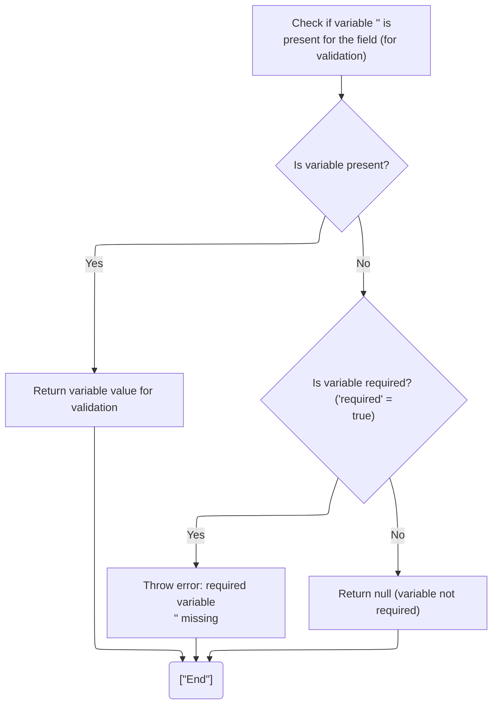
```mermaid
%%{init: {"flowchart": {"defaultRenderer": "elk"}} }%%
flowchart TD
    node1["Check if variable '<varName>' is
present for the field (for validation)"] --> node2{"Is variable present?"}
    click node1 openCode "core/src/main/java/org/apache/struts/validator/Resources.java:159:161"
    node2 -->|"Yes"| node3["Return variable value for validation"]
    click node2 openCode "core/src/main/java/org/apache/struts/validator/Resources.java:161:161"
    node2 -->|"No"| node4{"Is variable required? ('required' =
true)"}
    click node4 openCode "core/src/main/java/org/apache/struts/validator/Resources.java:164:164"
    node4 -->|"Yes"| node5["Throw error: required variable
'<varName>' missing"]
    click node5 openCode "core/src/main/java/org/apache/struts/validator/Resources.java:165:165"
    node4 -->|"No"| node6["Return null (variable not required)"]
    click node6 openCode "core/src/main/java/org/apache/struts/validator/Resources.java:172:172"
    node3 --> node7("[#quot;End#quot;]")
    node5 --> node7
    node6 --> node7
    click node7 openCode "core/src/main/java/org/apache/struts/validator/Resources.java:179:179"
classDef HeadingStyle fill:#777777,stroke:#333,stroke-width:2px;

%% Swimm:
%% %%{init: {"flowchart": {"defaultRenderer": "elk"}} }%%
%% flowchart TD
%%     node1["Check if variable '<<SwmToken path="core/src/main/java/org/apache/struts/validator/Resources.java" pos="157:11:11" line-data="    public static String getVarValue(String varName, Field field,">`varName`</SwmToken>>' is
%% present for the field (for validation)"] --> node2{"Is variable present?"}
%%     click node1 openCode "<SwmPath>[core/…/validator/Resources.java](core/src/main/java/org/apache/struts/validator/Resources.java)</SwmPath>:159:161"
%%     node2 -->|"Yes"| node3["Return variable value for validation"]
%%     click node2 openCode "<SwmPath>[core/…/validator/Resources.java](core/src/main/java/org/apache/struts/validator/Resources.java)</SwmPath>:161:161"
%%     node2 -->|"No"| node4{"Is variable required? ('required' =
%% true)"}
%%     click node4 openCode "<SwmPath>[core/…/validator/Resources.java](core/src/main/java/org/apache/struts/validator/Resources.java)</SwmPath>:164:164"
%%     node4 -->|"Yes"| node5["Throw error: required variable
%% '<<SwmToken path="core/src/main/java/org/apache/struts/validator/Resources.java" pos="157:11:11" line-data="    public static String getVarValue(String varName, Field field,">`varName`</SwmToken>>' missing"]
%%     click node5 openCode "<SwmPath>[core/…/validator/Resources.java](core/src/main/java/org/apache/struts/validator/Resources.java)</SwmPath>:165:165"
%%     node4 -->|"No"| node6["Return null (variable not required)"]
%%     click node6 openCode "<SwmPath>[core/…/validator/Resources.java](core/src/main/java/org/apache/struts/validator/Resources.java)</SwmPath>:172:172"
%%     node3 --> node7("[#quot;End#quot;]")
%%     node5 --> node7
%%     node6 --> node7
%%     click node7 openCode "<SwmPath>[core/…/validator/Resources.java](core/src/main/java/org/apache/struts/validator/Resources.java)</SwmPath>:179:179"
%% classDef HeadingStyle fill:#777777,stroke:#333,stroke-width:2px;
```

<SwmSnippet path="/core/src/main/java/org/apache/struts/validator/Resources.java" line="157">

---

In <SwmToken path="core/src/main/java/org/apache/struts/validator/Resources.java" pos="157:7:7" line-data="    public static String getVarValue(String varName, Field field,">`getVarValue`</SwmToken>, we try to fetch a Var from the field. If it's missing, we grab an error message using <SwmToken path="core/src/main/java/org/apache/struts/validator/Resources.java" pos="162:7:9" line-data="            String msg = sysmsgs.getMessage(&quot;variable.missing&quot;, varName);">`sysmsgs.getMessage`</SwmToken> (which means we need to call into <SwmToken path="core/src/main/java/org/apache/struts/util/PropertyMessageResources.java" pos="82:8:8" line-data=" * Configure &lt;code&gt;PropertyMessageResources&lt;/code&gt; to operate in this mode by">`PropertyMessageResources`</SwmToken> next). This lets us handle missing config in a way that's consistent with the rest of the framework's error handling.

```java
    public static String getVarValue(String varName, Field field,
        Validator validator, HttpServletRequest request, boolean required) {
        Var var = field.getVar(varName);

        if (var == null) {
            String msg = sysmsgs.getMessage("variable.missing", varName);

```

---

</SwmSnippet>

<SwmSnippet path="/core/src/main/java/org/apache/struts/util/PropertyMessageResources.java" line="227">

---

<SwmToken path="core/src/main/java/org/apache/struts/util/PropertyMessageResources.java" pos="227:5:5" line-data="    public String getMessage(Locale locale, String key) {">`getMessage`</SwmToken> looks up a message string using the locale and key, but the search order depends on the mode. It tries the requested locale, maybe the default locale, and finally the base properties. If nothing is found, it either returns null or a placeholder error string. This lets the framework adapt to different i18n strategies.

```java
    public String getMessage(Locale locale, String key) {
        if (log.isDebugEnabled()) {
            log.debug("getMessage(" + locale + "," + key + ")");
        }

        // Initialize variables we will require
        String localeKey = localeKey(locale);
        String originalKey = messageKey(localeKey, key);
        String message = null;

        // Search the specified Locale
        message = findMessage(locale, key, originalKey);
        if (message != null) {
            return message;
        }

        // JSTL Compatibility - JSTL doesn't use the default locale
        if (mode == MODE_JSTL) {

           // do nothing (i.e. don't use default Locale)

        // PropertyResourcesBundle - searches through the hierarchy
        // for the default Locale (e.g. first en_US then en)
        } else if (mode == MODE_RESOURCE_BUNDLE) {

            if (!defaultLocale.equals(locale)) {
                message = findMessage(defaultLocale, key, originalKey);
            }

        // Default (backwards) Compatibility - just searches the
        // specified Locale (e.g. just en_US)
        } else {

            if (!defaultLocale.equals(locale)) {
                localeKey = localeKey(defaultLocale);
                message = findMessage(localeKey, key, originalKey);
            }

        }
        if (message != null) {
            return message;
        }

        // Find the message in the default properties file
        message = findMessage("", key, originalKey);
        if (message != null) {
            return message;
        }

        // Return an appropriate error indication
        if (returnNull) {
            return (null);
        } else {
            return ("???" + messageKey(locale, key) + "???");
        }
    }
```

---

</SwmSnippet>

<SwmSnippet path="/core/src/main/java/org/apache/struts/validator/Resources.java" line="164">

---

Back in <SwmToken path="core/src/main/java/org/apache/struts/validator/Resources.java" pos="178:3:3" line-data="        return getVarValue(var, application, request, required);">`getVarValue`</SwmToken>, after getting the error message from <SwmToken path="core/src/main/java/org/apache/struts/util/PropertyMessageResources.java" pos="82:8:8" line-data=" * Configure &lt;code&gt;PropertyMessageResources&lt;/code&gt; to operate in this mode by">`PropertyMessageResources`</SwmToken>, we either throw if the variable is required, or just log and return null if not. This means missing config can be fatal or just a warning, depending on context.

```java
            if (required) {
                throw new IllegalArgumentException(msg);
            }

            if (log.isDebugEnabled()) {
                log.debug(field.getProperty() + ": " + msg);
            }

            return null;
        }

        ServletContext application =
            (ServletContext) validator.getParameterValue(SERVLET_CONTEXT_PARAM);

        return getVarValue(var, application, request, required);
    }
```

---

</SwmSnippet>

## Default and Custom URL Validation Logic

<SwmSnippet path="/core/src/main/java/org/apache/struts/validator/FieldChecks.java" line="1391">

---

Back in <SwmToken path="core/src/main/java/org/apache/struts/validator/FieldChecks.java" pos="1347:7:7" line-data="    public static boolean validateUrl(Object bean, ValidatorAction va,">`validateUrl`</SwmToken>, after pulling config from Resources, if there are no custom options or schemes, we just use the default <SwmToken path="core/src/main/java/org/apache/struts/validator/FieldChecks.java" pos="1391:15:15" line-data="        // No options or schemes - use GenericValidator as default">`GenericValidator`</SwmToken>. If that fails, we need to add an error message, so we call <SwmToken path="core/src/main/java/org/apache/struts/validator/FieldChecks.java" pos="1397:1:3" line-data="                    Resources.getActionMessage(validator, request, va, field));">`Resources.getActionMessage`</SwmToken> to get a localized error for the user.

```java
        // No options or schemes - use GenericValidator as default
        if ((options == 0) && (schemesVar == null)) {
            if (GenericValidator.isUrl(value)) {
                return true;
            } else {
                errors.add(field.getKey(),
                    Resources.getActionMessage(validator, request, va, field));

                return false;
            }
        }

```

---

</SwmSnippet>

## Building the Validation Error Message

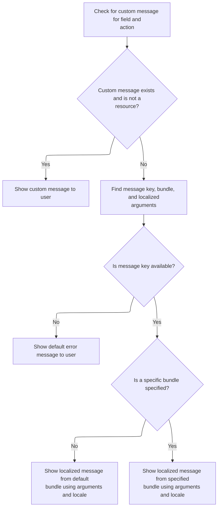
```mermaid
%%{init: {"flowchart": {"defaultRenderer": "elk"}} }%%
flowchart TD
  node1["Check for custom message for field and
action"]
  click node1 openCode "core/src/main/java/org/apache/struts/validator/Resources.java:367:369"
  node1 --> node2{"Custom message exists and is not a
resource?"}
  click node2 openCode "core/src/main/java/org/apache/struts/validator/Resources.java:369:371"
  node2 -->|"Yes"| node3["Show custom message to user"]
  click node3 openCode "core/src/main/java/org/apache/struts/validator/Resources.java:370:371"
  node2 -->|"No"| node4["Find message key, bundle, and localized
arguments"]
  click node4 openCode "core/src/main/java/org/apache/struts/validator/Resources.java:373:396"
  node4 --> node5{"Is message key available?"}
  click node5 openCode "core/src/main/java/org/apache/struts/validator/Resources.java:383:386"
  node5 -->|"No"| node6["Show default error message to user"]
  click node6 openCode "core/src/main/java/org/apache/struts/validator/Resources.java:384:386"
  node5 -->|"Yes"| node7{"Is a specific bundle specified?"}
  click node7 openCode "core/src/main/java/org/apache/struts/validator/Resources.java:400:406"
  node7 -->|"No"| node8["Show localized message from default
bundle using arguments and locale"]
  click node8 openCode "core/src/main/java/org/apache/struts/validator/Resources.java:401:402"
  node7 -->|"Yes"| node9["Show localized message from specified
bundle using arguments and locale"]
  click node9 openCode "core/src/main/java/org/apache/struts/validator/Resources.java:403:406"

classDef HeadingStyle fill:#777777,stroke:#333,stroke-width:2px;

%% Swimm:
%% %%{init: {"flowchart": {"defaultRenderer": "elk"}} }%%
%% flowchart TD
%%   node1["Check for custom message for field and
%% action"]
%%   click node1 openCode "<SwmPath>[core/…/validator/Resources.java](core/src/main/java/org/apache/struts/validator/Resources.java)</SwmPath>:367:369"
%%   node1 --> node2{"Custom message exists and is not a
%% resource?"}
%%   click node2 openCode "<SwmPath>[core/…/validator/Resources.java](core/src/main/java/org/apache/struts/validator/Resources.java)</SwmPath>:369:371"
%%   node2 -->|"Yes"| node3["Show custom message to user"]
%%   click node3 openCode "<SwmPath>[core/…/validator/Resources.java](core/src/main/java/org/apache/struts/validator/Resources.java)</SwmPath>:370:371"
%%   node2 -->|"No"| node4["Find message key, bundle, and localized
%% arguments"]
%%   click node4 openCode "<SwmPath>[core/…/validator/Resources.java](core/src/main/java/org/apache/struts/validator/Resources.java)</SwmPath>:373:396"
%%   node4 --> node5{"Is message key available?"}
%%   click node5 openCode "<SwmPath>[core/…/validator/Resources.java](core/src/main/java/org/apache/struts/validator/Resources.java)</SwmPath>:383:386"
%%   node5 -->|"No"| node6["Show default error message to user"]
%%   click node6 openCode "<SwmPath>[core/…/validator/Resources.java](core/src/main/java/org/apache/struts/validator/Resources.java)</SwmPath>:384:386"
%%   node5 -->|"Yes"| node7{"Is a specific bundle specified?"}
%%   click node7 openCode "<SwmPath>[core/…/validator/Resources.java](core/src/main/java/org/apache/struts/validator/Resources.java)</SwmPath>:400:406"
%%   node7 -->|"No"| node8["Show localized message from default
%% bundle using arguments and locale"]
%%   click node8 openCode "<SwmPath>[core/…/validator/Resources.java](core/src/main/java/org/apache/struts/validator/Resources.java)</SwmPath>:401:402"
%%   node7 -->|"Yes"| node9["Show localized message from specified
%% bundle using arguments and locale"]
%%   click node9 openCode "<SwmPath>[core/…/validator/Resources.java](core/src/main/java/org/apache/struts/validator/Resources.java)</SwmPath>:403:406"
%% 
%% classDef HeadingStyle fill:#777777,stroke:#333,stroke-width:2px;
```

<SwmSnippet path="/core/src/main/java/org/apache/struts/validator/Resources.java" line="365">

---

In <SwmToken path="core/src/main/java/org/apache/struts/validator/Resources.java" pos="365:7:7" line-data="    public static ActionMessage getActionMessage(Validator validator,">`getActionMessage`</SwmToken>, we figure out which message key and bundle to use for the error. If the field has a custom message, we use that; otherwise, we fall back to the action's default. Next, we need to fetch the right <SwmToken path="core/src/main/java/org/apache/struts/validator/Resources.java" pos="390:1:1" line-data="        MessageResources messages =">`MessageResources`</SwmToken> to actually look up the localized string.

```java
    public static ActionMessage getActionMessage(Validator validator,
        HttpServletRequest request, ValidatorAction va, Field field) {
        Msg msg = field.getMessage(va.getName());

        if ((msg != null) && !msg.isResource()) {
            return new ActionMessage(msg.getKey(), false);
        }

        String msgKey = null;
        String msgBundle = null;

        if (msg == null) {
            msgKey = va.getMsg();
        } else {
            msgKey = msg.getKey();
            msgBundle = msg.getBundle();
        }

        if ((msgKey == null) || (msgKey.length() == 0)) {
            return new ActionMessage("??? " + va.getName() + "."
                + field.getProperty() + " ???", false);
        }

        ServletContext application =
            (ServletContext) validator.getParameterValue(SERVLET_CONTEXT_PARAM);
        MessageResources messages =
            getMessageResources(application, request, msgBundle);
```

---

</SwmSnippet>

<SwmSnippet path="/core/src/main/java/org/apache/struts/validator/Resources.java" line="117">

---

<SwmToken path="core/src/main/java/org/apache/struts/validator/Resources.java" pos="117:7:7" line-data="    public static MessageResources getMessageResources(">`getMessageResources`</SwmToken> tries to find the right <SwmToken path="core/src/main/java/org/apache/struts/validator/Resources.java" pos="117:5:5" line-data="    public static MessageResources getMessageResources(">`MessageResources`</SwmToken> instance by checking the request, then the application with module prefix, then just the application. This fallback means we can support both global and module-specific message bundles.

```java
    public static MessageResources getMessageResources(
        ServletContext application, HttpServletRequest request, String bundle) {
        if (bundle == null) {
            bundle = Globals.MESSAGES_KEY;
        }

        MessageResources resources =
            (MessageResources) request.getAttribute(bundle);

        if (resources == null) {
            ModuleConfig moduleConfig =
                ModuleUtils.getInstance().getModuleConfig(request, application);

            resources =
                (MessageResources) application.getAttribute(bundle
                    + moduleConfig.getPrefix());
        }

        if (resources == null) {
            resources = (MessageResources) application.getAttribute(bundle);
        }

        if (resources == null) {
            throw new NullPointerException(
                "No message resources found for bundle: " + bundle);
        }

        return resources;
    }
```

---

</SwmSnippet>

<SwmSnippet path="/core/src/main/java/org/apache/struts/validator/Resources.java" line="392">

---

Back in <SwmToken path="core/src/main/java/org/apache/struts/validator/FieldChecks.java" pos="1397:3:3" line-data="                    Resources.getActionMessage(validator, request, va, field));">`getActionMessage`</SwmToken>, after getting <SwmToken path="core/src/main/java/org/apache/struts/validator/Resources.java" pos="117:5:5" line-data="    public static MessageResources getMessageResources(">`MessageResources`</SwmToken>, we grab the user's locale and the argument list for the message. Next, we need to resolve those arguments, which might be localized too.

```java
        Locale locale = RequestUtils.getUserLocale(request, null);

        Arg[] args = field.getArgs(va.getName());
```

---

</SwmSnippet>

<SwmSnippet path="/core/src/main/java/org/apache/struts/validator/Resources.java" line="420">

---

<SwmToken path="core/src/main/java/org/apache/struts/validator/Resources.java" pos="420:9:9" line-data="    public static String[] getArgs(String actionName,">`getArgs`</SwmToken> builds up to 4 argument strings for the message, localizing each one if it's marked as a resource. If an argument is missing, it's just skipped. This keeps the message formatting simple and predictable.

```java
    public static String[] getArgs(String actionName,
        MessageResources messages, Locale locale, Field field) {
        String[] argMessages = new String[4];

        Arg[] args =
            new Arg[] {
                field.getArg(actionName, 0), field.getArg(actionName, 1),
                field.getArg(actionName, 2), field.getArg(actionName, 3)
            };

        for (int i = 0; i < args.length; i++) {
            if (args[i] == null) {
                continue;
            }

            if (args[i].isResource()) {
                argMessages[i] = getMessage(messages, locale, args[i].getKey());
            } else {
                argMessages[i] = args[i].getKey();
            }
        }
```

---

</SwmSnippet>

<SwmSnippet path="/core/src/main/java/org/apache/struts/validator/Resources.java" line="395">

---

Back in <SwmToken path="core/src/main/java/org/apache/struts/validator/FieldChecks.java" pos="1397:3:3" line-data="                    Resources.getActionMessage(validator, request, va, field));">`getActionMessage`</SwmToken>, after getting the argument keys, we call <SwmToken path="core/src/main/java/org/apache/struts/validator/Resources.java" pos="396:1:1" line-data="            getArgValues(application, request, messages, locale, args);">`getArgValues`</SwmToken> to resolve those keys into actual strings, handling bundle overrides and localization as needed.

```java
        String[] argValues =
            getArgValues(application, request, messages, locale, args);

```

---

</SwmSnippet>

<SwmSnippet path="/core/src/main/java/org/apache/struts/validator/Resources.java" line="455">

---

<SwmToken path="core/src/main/java/org/apache/struts/validator/Resources.java" pos="455:9:9" line-data="    private static String[] getArgValues(ServletContext application,">`getArgValues`</SwmToken> loops through the Arg array, and for each resource argument, it checks if there's a bundle override and fetches the localized value from the right bundle. If it's not a resource, it just uses the raw key.

```java
    private static String[] getArgValues(ServletContext application,
        HttpServletRequest request, MessageResources defaultMessages,
        Locale locale, Arg[] args) {
        if ((args == null) || (args.length == 0)) {
            return null;
        }

        String[] values = new String[args.length];

        for (int i = 0; i < args.length; i++) {
            if (args[i] != null) {
                if (args[i].isResource()) {
                    MessageResources messages = defaultMessages;

                    if (args[i].getBundle() != null) {
                        messages =
                            getMessageResources(application, request,
                                args[i].getBundle());
                    }

                    values[i] = messages.getMessage(locale, args[i].getKey());
                } else {
                    values[i] = args[i].getKey();
                }
            }
        }

        return values;
    }
```

---

</SwmSnippet>

<SwmSnippet path="/core/src/main/java/org/apache/struts/validator/Resources.java" line="398">

---

Back in <SwmToken path="core/src/main/java/org/apache/struts/validator/FieldChecks.java" pos="1397:3:3" line-data="                    Resources.getActionMessage(validator, request, va, field));">`getActionMessage`</SwmToken>, after resolving argument values, we either build the <SwmToken path="core/src/main/java/org/apache/struts/validator/Resources.java" pos="398:1:1" line-data="        ActionMessage actionMessage = null;">`ActionMessage`</SwmToken> directly (if no bundle) or fetch the message string and wrap it. This is what gets returned to the validator for display.

```java
        ActionMessage actionMessage = null;

        if (msgBundle == null) {
            actionMessage = new ActionMessage(msgKey, argValues);
        } else {
            String message = messages.getMessage(locale, msgKey, argValues);

            actionMessage = new ActionMessage(message, false);
        }

        return actionMessage;
    }
```

---

</SwmSnippet>

## Parsing and Applying URL Schemes

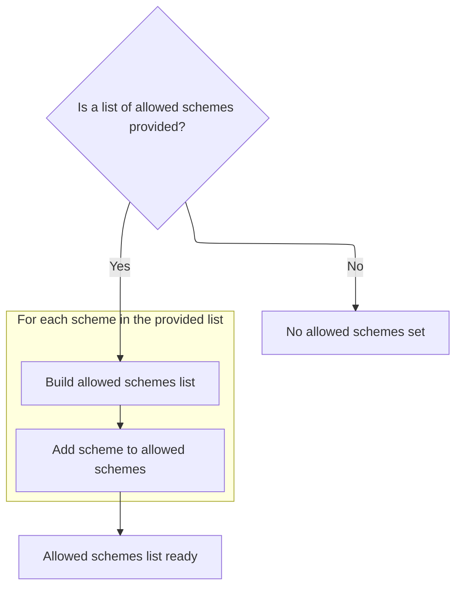
```mermaid
%%{init: {"flowchart": {"defaultRenderer": "elk"}} }%%
flowchart TD
    node1{"Is a list of allowed schemes provided?"}
    click node1 openCode "core/src/main/java/org/apache/struts/validator/FieldChecks.java:1406:1416"
    node1 -->|"Yes"| node2["Build allowed schemes list"]
    click node2 openCode "core/src/main/java/org/apache/struts/validator/FieldChecks.java:1407:1415"
    subgraph loop1["For each scheme in the provided list"]
      node2 --> node3["Add scheme to allowed schemes"]
      click node3 openCode "core/src/main/java/org/apache/struts/validator/FieldChecks.java:1413:1415"
    end
    node3 --> node4["Allowed schemes list ready"]
    click node4 openCode "core/src/main/java/org/apache/struts/validator/FieldChecks.java:1415:1416"
    node1 -->|"No"| node5["No allowed schemes set"]
    click node5 openCode "core/src/main/java/org/apache/struts/validator/FieldChecks.java:1416:1416"

classDef HeadingStyle fill:#777777,stroke:#333,stroke-width:2px;

%% Swimm:
%% %%{init: {"flowchart": {"defaultRenderer": "elk"}} }%%
%% flowchart TD
%%     node1{"Is a list of allowed schemes provided?"}
%%     click node1 openCode "<SwmPath>[core/…/validator/FieldChecks.java](core/src/main/java/org/apache/struts/validator/FieldChecks.java)</SwmPath>:1406:1416"
%%     node1 -->|"Yes"| node2["Build allowed schemes list"]
%%     click node2 openCode "<SwmPath>[core/…/validator/FieldChecks.java](core/src/main/java/org/apache/struts/validator/FieldChecks.java)</SwmPath>:1407:1415"
%%     subgraph loop1["For each scheme in the provided list"]
%%       node2 --> node3["Add scheme to allowed schemes"]
%%       click node3 openCode "<SwmPath>[core/…/validator/FieldChecks.java](core/src/main/java/org/apache/struts/validator/FieldChecks.java)</SwmPath>:1413:1415"
%%     end
%%     node3 --> node4["Allowed schemes list ready"]
%%     click node4 openCode "<SwmPath>[core/…/validator/FieldChecks.java](core/src/main/java/org/apache/struts/validator/FieldChecks.java)</SwmPath>:1415:1416"
%%     node1 -->|"No"| node5["No allowed schemes set"]
%%     click node5 openCode "<SwmPath>[core/…/validator/FieldChecks.java](core/src/main/java/org/apache/struts/validator/FieldChecks.java)</SwmPath>:1416:1416"
%% 
%% classDef HeadingStyle fill:#777777,stroke:#333,stroke-width:2px;
```

<SwmSnippet path="/core/src/main/java/org/apache/struts/validator/FieldChecks.java" line="1403">

---

Back in <SwmToken path="core/src/main/java/org/apache/struts/validator/FieldChecks.java" pos="1347:7:7" line-data="    public static boolean validateUrl(Object bean, ValidatorAction va,">`validateUrl`</SwmToken>, after getting all the config and error message logic, if a schemes string is set, we split it into an array using <SwmToken path="core/src/main/java/org/apache/struts/validator/FieldChecks.java" pos="1407:1:1" line-data="            StringTokenizer st = new StringTokenizer(schemesVar, &quot;,&quot;);">`StringTokenizer`</SwmToken> and trim each entry. This array is what gets passed to the <SwmToken path="core/src/main/java/org/apache/struts/validator/FieldChecks.java" pos="1368:11:11" line-data="        int options = allowallschemes ? UrlValidator.ALLOW_ALL_SCHEMES : 0;">`UrlValidator`</SwmToken> for scheme restriction.

```java
        // Parse comma delimited list of schemes into a String[]
        String[] schemes = null;

        if (schemesVar != null) {
            StringTokenizer st = new StringTokenizer(schemesVar, ",");

            schemes = new String[st.countTokens()];

            int i = 0;

            while (st.hasMoreTokens()) {
                schemes[i++] = st.nextToken().trim();
            }
        }

```

---

</SwmSnippet>

## Tokenizing Validation Expressions


```mermaid
%%{init: {"flowchart": {"defaultRenderer": "elk"}} }%%
flowchart TD
    subgraph loop1["Scan input until a valid token is found"]
      node1["Start scanning input"]
      click node1 openCode "core/src/main/java/org/apache/struts/validator/validwhen/ValidWhenLexer.java:75:84"
      node1 --> node2{"What is the next character type?"}
      click node2 openCode "core/src/main/java/org/apache/struts/validator/validwhen/ValidWhenLexer.java:84:159"
      node2 -- Whitespace --> node3["Skipping Whitespace in Expressions"]
      
      node2 -- Number --> node4["Parsing Numeric Literals"]
      
      node2 -- String --> node5["Parsing String Literals"]
      
      node2 -- Left bracket --> node6["Tokenizing Left Bracket"]
      
      node2 -- Right bracket --> node7["Tokenizing Right Bracket"]
      
      node2 -- Left parenthesis --> node8["Tokenizing Left Parenthesis"]
      
      node2 -- Right parenthesis --> node9["Tokenizing Right Parenthesis"]
      
      node2 -- 'this' keyword --> node10["Tokenizing Self-Reference"]
      
      node2 -- Identifier --> node11["Tokenizing Field and Function Names"]
      
      node2 -- '=' operator --> node12["Tokenizing Equality Operator"]
      
      node2 -- '!=' operator --> node13["Tokenizing Inequality Operator"]
      
      node2 -- '<=' operator --> node14["Tokenizing Less-Than-Or-Equal Operator"]
      
      node2 -- '>=' operator --> node15["Tokenizing Greater-Than-Or-Equal Operator"]
      
      node2 -- '<' operator --> node16["Tokenizing Less-Than Operator"]
      
      node2 -- '>' operator --> node17["Tokenizing Greater-Than Operator"]
      
      node2 -- End of input --> node18["Handle end of input"]
      click node18 openCode "core/src/main/java/org/apache/struts/validator/validwhen/ValidWhenLexer.java:177:178"
      node2 -- Unrecognized --> node19["Handle error"]
      click node19 openCode "core/src/main/java/org/apache/struts/validator/validwhen/ValidWhenLexer.java:178:179"
      node3 --> node20{"Is token to be skipped?"}
      node4 --> node20
      node5 --> node20
      node6 --> node20
      node7 --> node20
      node8 --> node20
      node9 --> node20
      node10 --> node20
      node11 --> node20
      node12 --> node20
      node13 --> node20
      node14 --> node20
      node15 --> node20
      node16 --> node20
      node17 --> node20
      node18 --> node20
      node19 --> node20
      click node20 openCode "core/src/main/java/org/apache/struts/validator/validwhen/ValidWhenLexer.java:181:182"
      node20 -- Yes --> node1
      node20 -- No --> node21["Adjust token type and check for literals"]
      click node21 openCode "core/src/main/java/org/apache/struts/validator/validwhen/ValidWhenLexer.java:182:184"
      node21 --> node22["Return recognized token"]
      click node22 openCode "core/src/main/java/org/apache/struts/validator/validwhen/ValidWhenLexer.java:185:185"
    end
classDef HeadingStyle fill:#777777,stroke:#333,stroke-width:2px;
click node3 goToHeading "Skipping Whitespace in Expressions"
node3:::HeadingStyle
click node4 goToHeading "Parsing Numeric Literals"
node4:::HeadingStyle
click node5 goToHeading "Parsing String Literals"
node5:::HeadingStyle
click node6 goToHeading "Tokenizing Left Bracket"
node6:::HeadingStyle
click node7 goToHeading "Tokenizing Right Bracket"
node7:::HeadingStyle
click node8 goToHeading "Tokenizing Left Parenthesis"
node8:::HeadingStyle
click node9 goToHeading "Tokenizing Right Parenthesis"
node9:::HeadingStyle
click node10 goToHeading "Tokenizing Self-Reference"
node10:::HeadingStyle
click node11 goToHeading "Tokenizing Field and Function Names"
node11:::HeadingStyle
click node12 goToHeading "Tokenizing Equality Operator"
node12:::HeadingStyle
click node13 goToHeading "Tokenizing Inequality Operator"
node13:::HeadingStyle
click node14 goToHeading "Tokenizing Less-Than-Or-Equal Operator"
node14:::HeadingStyle
click node15 goToHeading "Tokenizing Greater-Than-Or-Equal Operator"
node15:::HeadingStyle
click node16 goToHeading "Tokenizing Less-Than Operator"
node16:::HeadingStyle
click node17 goToHeading "Tokenizing Greater-Than Operator"
node17:::HeadingStyle

%% Swimm:
%% %%{init: {"flowchart": {"defaultRenderer": "elk"}} }%%
%% flowchart TD
%%     subgraph loop1["Scan input until a valid token is found"]
%%       node1["Start scanning input"]
%%       click node1 openCode "<SwmPath>[core/…/validwhen/ValidWhenLexer.java](core/src/main/java/org/apache/struts/validator/validwhen/ValidWhenLexer.java)</SwmPath>:75:84"
%%       node1 --> node2{"What is the next character type?"}
%%       click node2 openCode "<SwmPath>[core/…/validwhen/ValidWhenLexer.java](core/src/main/java/org/apache/struts/validator/validwhen/ValidWhenLexer.java)</SwmPath>:84:159"
%%       node2 -- Whitespace --> node3["Skipping Whitespace in Expressions"]
%%       
%%       node2 -- Number --> node4["Parsing Numeric Literals"]
%%       
%%       node2 -- String --> node5["Parsing String Literals"]
%%       
%%       node2 -- Left bracket --> node6["Tokenizing Left Bracket"]
%%       
%%       node2 -- Right bracket --> node7["Tokenizing Right Bracket"]
%%       
%%       node2 -- Left parenthesis --> node8["Tokenizing Left Parenthesis"]
%%       
%%       node2 -- Right parenthesis --> node9["Tokenizing Right Parenthesis"]
%%       
%%       node2 -- 'this' keyword --> node10["Tokenizing Self-Reference"]
%%       
%%       node2 -- Identifier --> node11["Tokenizing Field and Function Names"]
%%       
%%       node2 -- '=' operator --> node12["Tokenizing Equality Operator"]
%%       
%%       node2 -- '!=' operator --> node13["Tokenizing Inequality Operator"]
%%       
%%       node2 -- '<=' operator --> node14["Tokenizing Less-Than-Or-Equal Operator"]
%%       
%%       node2 -- '>=' operator --> node15["Tokenizing Greater-Than-Or-Equal Operator"]
%%       
%%       node2 -- '<' operator --> node16["Tokenizing Less-Than Operator"]
%%       
%%       node2 -- '>' operator --> node17["Tokenizing Greater-Than Operator"]
%%       
%%       node2 -- End of input --> node18["Handle end of input"]
%%       click node18 openCode "<SwmPath>[core/…/validwhen/ValidWhenLexer.java](core/src/main/java/org/apache/struts/validator/validwhen/ValidWhenLexer.java)</SwmPath>:177:178"
%%       node2 -- Unrecognized --> node19["Handle error"]
%%       click node19 openCode "<SwmPath>[core/…/validwhen/ValidWhenLexer.java](core/src/main/java/org/apache/struts/validator/validwhen/ValidWhenLexer.java)</SwmPath>:178:179"
%%       node3 --> node20{"Is token to be skipped?"}
%%       node4 --> node20
%%       node5 --> node20
%%       node6 --> node20
%%       node7 --> node20
%%       node8 --> node20
%%       node9 --> node20
%%       node10 --> node20
%%       node11 --> node20
%%       node12 --> node20
%%       node13 --> node20
%%       node14 --> node20
%%       node15 --> node20
%%       node16 --> node20
%%       node17 --> node20
%%       node18 --> node20
%%       node19 --> node20
%%       click node20 openCode "<SwmPath>[core/…/validwhen/ValidWhenLexer.java](core/src/main/java/org/apache/struts/validator/validwhen/ValidWhenLexer.java)</SwmPath>:181:182"
%%       node20 -- Yes --> node1
%%       node20 -- No --> node21["Adjust token type and check for literals"]
%%       click node21 openCode "<SwmPath>[core/…/validwhen/ValidWhenLexer.java](core/src/main/java/org/apache/struts/validator/validwhen/ValidWhenLexer.java)</SwmPath>:182:184"
%%       node21 --> node22["Return recognized token"]
%%       click node22 openCode "<SwmPath>[core/…/validwhen/ValidWhenLexer.java](core/src/main/java/org/apache/struts/validator/validwhen/ValidWhenLexer.java)</SwmPath>:185:185"
%%     end
%% classDef HeadingStyle fill:#777777,stroke:#333,stroke-width:2px;
%% click node3 goToHeading "Skipping Whitespace in Expressions"
%% node3:::HeadingStyle
%% click node4 goToHeading "Parsing Numeric Literals"
%% node4:::HeadingStyle
%% click node5 goToHeading "Parsing String Literals"
%% node5:::HeadingStyle
%% click node6 goToHeading "Tokenizing Left Bracket"
%% node6:::HeadingStyle
%% click node7 goToHeading "Tokenizing Right Bracket"
%% node7:::HeadingStyle
%% click node8 goToHeading "Tokenizing Left Parenthesis"
%% node8:::HeadingStyle
%% click node9 goToHeading "Tokenizing Right Parenthesis"
%% node9:::HeadingStyle
%% click node10 goToHeading "Tokenizing Self-Reference"
%% node10:::HeadingStyle
%% click node11 goToHeading "Tokenizing Field and Function Names"
%% node11:::HeadingStyle
%% click node12 goToHeading "Tokenizing Equality Operator"
%% node12:::HeadingStyle
%% click node13 goToHeading "Tokenizing Inequality Operator"
%% node13:::HeadingStyle
%% click node14 goToHeading "Tokenizing Less-Than-Or-Equal Operator"
%% node14:::HeadingStyle
%% click node15 goToHeading "Tokenizing Greater-Than-Or-Equal Operator"
%% node15:::HeadingStyle
%% click node16 goToHeading "Tokenizing Less-Than Operator"
%% node16:::HeadingStyle
%% click node17 goToHeading "Tokenizing Greater-Than Operator"
%% node17:::HeadingStyle
```

<SwmSnippet path="/core/src/main/java/org/apache/struts/validator/validwhen/ValidWhenLexer.java" line="75">

---

In <SwmToken path="core/src/main/java/org/apache/struts/validator/validwhen/ValidWhenLexer.java" pos="75:4:4" line-data="public Token nextToken() throws TokenStreamException {">`nextToken`</SwmToken>, we loop through the input, using a switch to decide which token method to call based on the next character. If it's whitespace, we call <SwmToken path="core/src/main/java/org/apache/struts/validator/validwhen/ValidWhenLexer.java" pos="87:1:1" line-data="					mWS(true);">`mWS`</SwmToken>; if it's a digit, we call <SwmToken path="core/src/main/java/org/apache/struts/validator/validwhen/ValidWhenLexer.java" pos="95:1:1" line-data="					mDECIMAL_LITERAL(true);">`mDECIMAL_LITERAL`</SwmToken>, and so on. This keeps the lexer flexible for different token types.

```java
public Token nextToken() throws TokenStreamException {
	Token theRetToken=null;
tryAgain:
	for (;;) {
		Token _token = null;
		int _ttype = Token.INVALID_TYPE;
		resetText();
		try {   // for char stream error handling
			try {   // for lexical error handling
				switch ( LA(1)) {
				case '\t':  case '\n':  case '\r':  case ' ':
				{
					mWS(true);
					theRetToken=_returnToken;
					break;
				}
				case '-':  case '0':  case '1':  case '2':
				case '3':  case '4':  case '5':  case '6':
```

---

</SwmSnippet>

### Skipping Whitespace in Expressions

See <SwmLink doc-title="Preparing Action Configurations from Paths">[Preparing Action Configurations from Paths](/.swm/preparing-action-configurations-from-paths.83x7oarx.sw.md)</SwmLink>

### Handling Numeric Tokens

<SwmSnippet path="/core/src/main/java/org/apache/struts/validator/validwhen/ValidWhenLexer.java" line="93">

---

Back in <SwmToken path="core/src/main/java/org/apache/struts/validator/FieldChecks.java" pos="1414:11:11" line-data="                schemes[i++] = st.nextToken().trim();">`nextToken`</SwmToken>, after skipping whitespace, if the next char is a digit, we call <SwmToken path="core/src/main/java/org/apache/struts/validator/validwhen/ValidWhenLexer.java" pos="95:1:1" line-data="					mDECIMAL_LITERAL(true);">`mDECIMAL_LITERAL`</SwmToken> to parse a number token. This keeps the token stream clean and predictable.

```java
				case '7':  case '8':  case '9':
				{
					mDECIMAL_LITERAL(true);
					theRetToken=_returnToken;
					break;
				}
```

---

</SwmSnippet>

### Parsing Numeric Literals

```mermaid
%%{init: {"flowchart": {"defaultRenderer": "elk"}} }%%
flowchart TD
  node1["Analyze input for numeric literal"]
  click node1 openCode "core/src/main/java/org/apache/struts/validator/validwhen/ValidWhenLexer.java:250:500"
  node1 --> node2{"Is input a decimal with fraction?"}
  click node2 openCode "core/src/main/java/org/apache/struts/validator/validwhen/ValidWhenLexer.java:256:305"
  node2 -->|"Yes"| subgraph loop1["Consume all digits for decimal with
fraction"]
    node3["Classify as decimal with fraction"]
    click node3 openCode "core/src/main/java/org/apache/struts/validator/validwhen/ValidWhenLexer.java:306:360"
  end
  node2 -->|"No"| node4{"Is input a hexadecimal literal?"}
  click node4 openCode "core/src/main/java/org/apache/struts/validator/validwhen/ValidWhenLexer.java:361:413"
  node4 -->|"Yes"| subgraph loop2["Consume all digits for hexadecimal"]
    node5["Classify as hexadecimal literal"]
    click node5 openCode "core/src/main/java/org/apache/struts/validator/validwhen/ValidWhenLexer.java:414:449"
  end
  node4 -->|"No"| node6{"Is input an octal literal?"}
  click node6 openCode "core/src/main/java/org/apache/struts/validator/validwhen/ValidWhenLexer.java:414:449"
  node6 -->|"Yes"| subgraph loop3["Consume all digits for octal"]
    node7["Classify as octal literal"]
    click node7 openCode "core/src/main/java/org/apache/struts/validator/validwhen/ValidWhenLexer.java:450:490"
  end
  node6 -->|"No"| subgraph loop4["Consume all digits for decimal integer"]
    node8["Classify as decimal integer"]
    click node8 openCode "core/src/main/java/org/apache/struts/validator/validwhen/ValidWhenLexer.java:450:490"
  end

classDef HeadingStyle fill:#777777,stroke:#333,stroke-width:2px;

%% Swimm:
%% %%{init: {"flowchart": {"defaultRenderer": "elk"}} }%%
%% flowchart TD
%%   node1["Analyze input for numeric literal"]
%%   click node1 openCode "<SwmPath>[core/…/validwhen/ValidWhenLexer.java](core/src/main/java/org/apache/struts/validator/validwhen/ValidWhenLexer.java)</SwmPath>:250:500"
%%   node1 --> node2{"Is input a decimal with fraction?"}
%%   click node2 openCode "<SwmPath>[core/…/validwhen/ValidWhenLexer.java](core/src/main/java/org/apache/struts/validator/validwhen/ValidWhenLexer.java)</SwmPath>:256:305"
%%   node2 -->|"Yes"| subgraph loop1["Consume all digits for decimal with
%% fraction"]
%%     node3["Classify as decimal with fraction"]
%%     click node3 openCode "<SwmPath>[core/…/validwhen/ValidWhenLexer.java](core/src/main/java/org/apache/struts/validator/validwhen/ValidWhenLexer.java)</SwmPath>:306:360"
%%   end
%%   node2 -->|"No"| node4{"Is input a hexadecimal literal?"}
%%   click node4 openCode "<SwmPath>[core/…/validwhen/ValidWhenLexer.java](core/src/main/java/org/apache/struts/validator/validwhen/ValidWhenLexer.java)</SwmPath>:361:413"
%%   node4 -->|"Yes"| subgraph loop2["Consume all digits for hexadecimal"]
%%     node5["Classify as hexadecimal literal"]
%%     click node5 openCode "<SwmPath>[core/…/validwhen/ValidWhenLexer.java](core/src/main/java/org/apache/struts/validator/validwhen/ValidWhenLexer.java)</SwmPath>:414:449"
%%   end
%%   node4 -->|"No"| node6{"Is input an octal literal?"}
%%   click node6 openCode "<SwmPath>[core/…/validwhen/ValidWhenLexer.java](core/src/main/java/org/apache/struts/validator/validwhen/ValidWhenLexer.java)</SwmPath>:414:449"
%%   node6 -->|"Yes"| subgraph loop3["Consume all digits for octal"]
%%     node7["Classify as octal literal"]
%%     click node7 openCode "<SwmPath>[core/…/validwhen/ValidWhenLexer.java](core/src/main/java/org/apache/struts/validator/validwhen/ValidWhenLexer.java)</SwmPath>:450:490"
%%   end
%%   node6 -->|"No"| subgraph loop4["Consume all digits for decimal integer"]
%%     node8["Classify as decimal integer"]
%%     click node8 openCode "<SwmPath>[core/…/validwhen/ValidWhenLexer.java](core/src/main/java/org/apache/struts/validator/validwhen/ValidWhenLexer.java)</SwmPath>:450:490"
%%   end
%% 
%% classDef HeadingStyle fill:#777777,stroke:#333,stroke-width:2px;
```

<SwmSnippet path="/core/src/main/java/org/apache/struts/validator/validwhen/ValidWhenLexer.java" line="250">

---

In <SwmToken path="core/src/main/java/org/apache/struts/validator/validwhen/ValidWhenLexer.java" pos="250:7:7" line-data="	public final void mDECIMAL_LITERAL(boolean _createToken) throws RecognitionException, CharStreamException, TokenStreamException {">`mDECIMAL_LITERAL`</SwmToken>, we use lookahead and backtracking to figure out if we're parsing a float, hex, octal, or decimal integer. The function sets the token type accordingly, so the parser can handle all the number formats used in validation expressions.

```java
	public final void mDECIMAL_LITERAL(boolean _createToken) throws RecognitionException, CharStreamException, TokenStreamException {
		int _ttype; Token _token=null; int _begin=text.length();
		_ttype = DECIMAL_LITERAL;
		int _saveIndex;
		
		boolean synPredMatched24 = false;
		if (((_tokenSet_0.member(LA(1))) && (_tokenSet_1.member(LA(2))))) {
			int _m24 = mark();
			synPredMatched24 = true;
			inputState.guessing++;
			try {
				{
				{
				switch ( LA(1)) {
				case '-':
				{
					match('-');
					break;
				}
				case '0':  case '1':  case '2':  case '3':
				case '4':  case '5':  case '6':  case '7':
				case '8':  case '9':
				{
					break;
				}
				default:
				{
					throw new NoViableAltForCharException((char)LA(1), getFilename(), getLine(), getColumn());
				}
				}
				}
				{
				int _cnt22=0;
				_loop22:
				do {
					if (((LA(1) >= '0' && LA(1) <= '9'))) {
						matchRange('0','9');
					}
					else {
						if ( _cnt22>=1 ) { break _loop22; } else {throw new NoViableAltForCharException((char)LA(1), getFilename(), getLine(), getColumn());}
					}
					
					_cnt22++;
				} while (true);
```

---

</SwmSnippet>

<SwmSnippet path="/core/src/main/java/org/apache/struts/validator/validwhen/ValidWhenLexer.java" line="296">

---

After matching the digits, we check for a dot to see if we're dealing with a float. If it's not there, the parser will backtrack and try to parse as hex, octal, or decimal integer instead.

```java
				match('.');
				}
				}
			}
			catch (RecognitionException pe) {
				synPredMatched24 = false;
			}
			rewind(_m24);
inputState.guessing--;
		}
		if ( synPredMatched24 ) {
			{
			{
			switch ( LA(1)) {
			case '-':
			{
				match('-');
				break;
			}
			case '0':  case '1':  case '2':  case '3':
			case '4':  case '5':  case '6':  case '7':
			case '8':  case '9':
			{
				break;
			}
			default:
			{
				throw new NoViableAltForCharException((char)LA(1), getFilename(), getLine(), getColumn());
			}
			}
			}
			{
			int _cnt28=0;
			_loop28:
			do {
				if (((LA(1) >= '0' && LA(1) <= '9'))) {
					matchRange('0','9');
				}
				else {
					if ( _cnt28>=1 ) { break _loop28; } else {throw new NoViableAltForCharException((char)LA(1), getFilename(), getLine(), getColumn());}
				}
				
				_cnt28++;
			} while (true);
```

---

</SwmSnippet>

<SwmSnippet path="/core/src/main/java/org/apache/struts/validator/validwhen/ValidWhenLexer.java" line="342">

---

After matching the dot, we loop to match at least one digit after it. If there aren't any, it's not a valid float and the parser will throw.

```java
			match('.');
			}
			{
			int _cnt31=0;
			_loop31:
			do {
				if (((LA(1) >= '0' && LA(1) <= '9'))) {
					matchRange('0','9');
				}
				else {
					if ( _cnt31>=1 ) { break _loop31; } else {throw new NoViableAltForCharException((char)LA(1), getFilename(), getLine(), getColumn());}
				}
				
				_cnt31++;
			} while (true);
```

---

</SwmSnippet>

<SwmSnippet path="/core/src/main/java/org/apache/struts/validator/validwhen/ValidWhenLexer.java" line="361">

---

If parsing as a float fails, we use lookahead to check for '0x' (hex), then '0' (octal), and finally regular decimal. The parser tries each format in order, backtracking as needed.

```java
			boolean synPredMatched38 = false;
			if (((LA(1)=='0') && (LA(2)=='x'))) {
				int _m38 = mark();
				synPredMatched38 = true;
				inputState.guessing++;
				try {
					{
					match('0');
					match('x');
					}
				}
				catch (RecognitionException pe) {
					synPredMatched38 = false;
				}
				rewind(_m38);
inputState.guessing--;
			}
			if ( synPredMatched38 ) {
				{
				match('0');
				match('x');
				{
				int _cnt41=0;
				_loop41:
				do {
					switch ( LA(1)) {
					case '0':  case '1':  case '2':  case '3':
					case '4':  case '5':  case '6':  case '7':
					case '8':  case '9':
					{
						matchRange('0','9');
						break;
					}
					case 'a':  case 'b':  case 'c':  case 'd':
					case 'e':  case 'f':
					{
						matchRange('a','f');
						break;
					}
					default:
					{
						if ( _cnt41>=1 ) { break _loop41; } else {throw new NoViableAltForCharException((char)LA(1), getFilename(), getLine(), getColumn());}
					}
					}
					_cnt41++;
				} while (true);
```

---

</SwmSnippet>

<SwmSnippet path="/core/src/main/java/org/apache/struts/validator/validwhen/ValidWhenLexer.java" line="409">

---

If we match '0x' and a sequence of hex digits, we set the token type to <SwmToken path="core/src/main/java/org/apache/struts/validator/validwhen/ValidWhenLexer.java" pos="410:5:5" line-data="					_ttype = HEX_INT_LITERAL;">`HEX_INT_LITERAL`</SwmToken>. If not, we move on to check for octal or decimal integer formats.

```java
				if ( inputState.guessing==0 ) {
					_ttype = HEX_INT_LITERAL;
				}
			}
			else {
				boolean synPredMatched33 = false;
				if (((LA(1)=='0') && (true))) {
					int _m33 = mark();
					synPredMatched33 = true;
					inputState.guessing++;
					try {
						{
						match('0');
						}
					}
					catch (RecognitionException pe) {
						synPredMatched33 = false;
					}
					rewind(_m33);
inputState.guessing--;
				}
				if ( synPredMatched33 ) {
					{
					match('0');
					{
					_loop36:
					do {
						if (((LA(1) >= '0' && LA(1) <= '7'))) {
							matchRange('0','7');
						}
						else {
							break _loop36;
						}
						
					} while (true);
```

---

</SwmSnippet>

<SwmSnippet path="/core/src/main/java/org/apache/struts/validator/validwhen/ValidWhenLexer.java" line="446">

---

If the input starts with '0', we try to parse an octal literal. If that doesn't fit, we check for a regular decimal integer. If none match, we throw.

```java
					if ( inputState.guessing==0 ) {
						_ttype = OCTAL_INT_LITERAL;
					}
				}
				else if ((_tokenSet_2.member(LA(1))) && (true)) {
					{
					{
					switch ( LA(1)) {
					case '-':
					{
						match('-');
						break;
					}
					case '1':  case '2':  case '3':  case '4':
					case '5':  case '6':  case '7':  case '8':
					case '9':
					{
						break;
					}
```

---

</SwmSnippet>

<SwmSnippet path="/core/src/main/java/org/apache/struts/validator/validwhen/ValidWhenLexer.java" line="465">

---

Back in <SwmToken path="core/src/main/java/org/apache/struts/validator/validwhen/ValidWhenLexer.java" pos="95:1:1" line-data="					mDECIMAL_LITERAL(true);">`mDECIMAL_LITERAL`</SwmToken>, if we get here, we're parsing a regular decimal integer. If the input doesn't match, we throw an error. Otherwise, we create the token and return.

```java
					default:
					{
						throw new NoViableAltForCharException((char)LA(1), getFilename(), getLine(), getColumn());
					}
					}
					}
					{
					matchRange('1','9');
					}
					{
					_loop46:
					do {
						if (((LA(1) >= '0' && LA(1) <= '9'))) {
							matchRange('0','9');
						}
						else {
							break _loop46;
						}
						
					} while (true);
```

---

</SwmSnippet>

<SwmSnippet path="/core/src/main/java/org/apache/struts/validator/validwhen/ValidWhenLexer.java" line="487">

---

After all the parsing logic, we create and return a token of the right type (decimal, hex, octal, or float). The parser downstream uses this to interpret the validation expression correctly.

```java
					if ( inputState.guessing==0 ) {
						_ttype = DEC_INT_LITERAL;
					}
				}
				else {
					throw new NoViableAltForCharException((char)LA(1), getFilename(), getLine(), getColumn());
				}
				}}
				if ( _createToken && _token==null && _ttype!=Token.SKIP ) {
					_token = makeToken(_ttype);
					_token.setText(new String(text.getBuffer(), _begin, text.length()-_begin));
				}
				_returnToken = _token;
			}
```

---

</SwmSnippet>

### Handling String Tokens

<SwmSnippet path="/core/src/main/java/org/apache/struts/validator/validwhen/ValidWhenLexer.java" line="99">

---

Back in <SwmToken path="core/src/main/java/org/apache/struts/validator/FieldChecks.java" pos="1414:11:11" line-data="                schemes[i++] = st.nextToken().trim();">`nextToken`</SwmToken>, after handling numbers, if the next char is a quote, we call <SwmToken path="core/src/main/java/org/apache/struts/validator/validwhen/ValidWhenLexer.java" pos="101:1:1" line-data="					mSTRING_LITERAL(true);">`mSTRING_LITERAL`</SwmToken> to parse a string token. This keeps the token stream ready for both numbers and strings.

```java
				case '"':  case '\'':
				{
					mSTRING_LITERAL(true);
					theRetToken=_returnToken;
					break;
				}
```

---

</SwmSnippet>

### Parsing String Literals


```mermaid
%%{init: {"flowchart": {"defaultRenderer": "elk"}} }%%
flowchart TD
    node1["Start string literal recognition"]
    click node1 openCode "core/src/main/java/org/apache/struts/validator/validwhen/ValidWhenLexer.java:502:503"
    node1 --> node2{"Does input start with single quote?"}
    click node2 openCode "core/src/main/java/org/apache/struts/validator/validwhen/ValidWhenLexer.java:507:508"
    node2 -->|"Yes"| node3["Read opening single quote"]
    click node3 openCode "core/src/main/java/org/apache/struts/validator/validwhen/ValidWhenLexer.java:511:511"
    node2 -->|"No"| node4{"Does input start with double quote?"}
    click node4 openCode "core/src/main/java/org/apache/struts/validator/validwhen/ValidWhenLexer.java:530:531"
    node4 -->|"Yes"| node5["Read opening double quote"]
    click node5 openCode "core/src/main/java/org/apache/struts/validator/validwhen/ValidWhenLexer.java:533:533"
    node4 -->|"No"| node10["No valid string literal, throw error"]
    click node10 openCode "core/src/main/java/org/apache/struts/validator/validwhen/ValidWhenLexer.java:554:555"
    
    subgraph loop1["For each character inside single quotes"]
        node3 --> node6{"Is next character not a single quote?"}
        click node6 openCode "core/src/main/java/org/apache/struts/validator/validwhen/ValidWhenLexer.java:516:517"
        node6 -->|"Yes"| node7["Read next character of string"]
        click node7 openCode "core/src/main/java/org/apache/struts/validator/validwhen/ValidWhenLexer.java:517:517"
        node7 --> node6
        node6 -->|"No"| node8["Read closing single quote"]
        click node8 openCode "core/src/main/java/org/apache/struts/validator/validwhen/ValidWhenLexer.java:526:526"
    end
    
    subgraph loop2["For each character inside double quotes"]
        node5 --> node11{"Is next character not a double quote?"}
        click node11 openCode "core/src/main/java/org/apache/struts/validator/validwhen/ValidWhenLexer.java:538:539"
        node11 -->|"Yes"| node12["Read next character of string"]
        click node12 openCode "core/src/main/java/org/apache/struts/validator/validwhen/ValidWhenLexer.java:539:539"
        node12 --> node11
        node11 -->|"No"| node13["Read closing double quote"]
        click node13 openCode "core/src/main/java/org/apache/struts/validator/validwhen/ValidWhenLexer.java:548:548"
    end
    node8 --> node9["Create string token"]
    click node9 openCode "core/src/main/java/org/apache/struts/validator/validwhen/ValidWhenLexer.java:557:561"
    node13 --> node9
classDef HeadingStyle fill:#777777,stroke:#333,stroke-width:2px;

%% Swimm:
%% %%{init: {"flowchart": {"defaultRenderer": "elk"}} }%%
%% flowchart TD
%%     node1["Start string literal recognition"]
%%     click node1 openCode "<SwmPath>[core/…/validwhen/ValidWhenLexer.java](core/src/main/java/org/apache/struts/validator/validwhen/ValidWhenLexer.java)</SwmPath>:502:503"
%%     node1 --> node2{"Does input start with single quote?"}
%%     click node2 openCode "<SwmPath>[core/…/validwhen/ValidWhenLexer.java](core/src/main/java/org/apache/struts/validator/validwhen/ValidWhenLexer.java)</SwmPath>:507:508"
%%     node2 -->|"Yes"| node3["Read opening single quote"]
%%     click node3 openCode "<SwmPath>[core/…/validwhen/ValidWhenLexer.java](core/src/main/java/org/apache/struts/validator/validwhen/ValidWhenLexer.java)</SwmPath>:511:511"
%%     node2 -->|"No"| node4{"Does input start with double quote?"}
%%     click node4 openCode "<SwmPath>[core/…/validwhen/ValidWhenLexer.java](core/src/main/java/org/apache/struts/validator/validwhen/ValidWhenLexer.java)</SwmPath>:530:531"
%%     node4 -->|"Yes"| node5["Read opening double quote"]
%%     click node5 openCode "<SwmPath>[core/…/validwhen/ValidWhenLexer.java](core/src/main/java/org/apache/struts/validator/validwhen/ValidWhenLexer.java)</SwmPath>:533:533"
%%     node4 -->|"No"| node10["No valid string literal, throw error"]
%%     click node10 openCode "<SwmPath>[core/…/validwhen/ValidWhenLexer.java](core/src/main/java/org/apache/struts/validator/validwhen/ValidWhenLexer.java)</SwmPath>:554:555"
%%     
%%     subgraph loop1["For each character inside single quotes"]
%%         node3 --> node6{"Is next character not a single quote?"}
%%         click node6 openCode "<SwmPath>[core/…/validwhen/ValidWhenLexer.java](core/src/main/java/org/apache/struts/validator/validwhen/ValidWhenLexer.java)</SwmPath>:516:517"
%%         node6 -->|"Yes"| node7["Read next character of string"]
%%         click node7 openCode "<SwmPath>[core/…/validwhen/ValidWhenLexer.java](core/src/main/java/org/apache/struts/validator/validwhen/ValidWhenLexer.java)</SwmPath>:517:517"
%%         node7 --> node6
%%         node6 -->|"No"| node8["Read closing single quote"]
%%         click node8 openCode "<SwmPath>[core/…/validwhen/ValidWhenLexer.java](core/src/main/java/org/apache/struts/validator/validwhen/ValidWhenLexer.java)</SwmPath>:526:526"
%%     end
%%     
%%     subgraph loop2["For each character inside double quotes"]
%%         node5 --> node11{"Is next character not a double quote?"}
%%         click node11 openCode "<SwmPath>[core/…/validwhen/ValidWhenLexer.java](core/src/main/java/org/apache/struts/validator/validwhen/ValidWhenLexer.java)</SwmPath>:538:539"
%%         node11 -->|"Yes"| node12["Read next character of string"]
%%         click node12 openCode "<SwmPath>[core/…/validwhen/ValidWhenLexer.java](core/src/main/java/org/apache/struts/validator/validwhen/ValidWhenLexer.java)</SwmPath>:539:539"
%%         node12 --> node11
%%         node11 -->|"No"| node13["Read closing double quote"]
%%         click node13 openCode "<SwmPath>[core/…/validwhen/ValidWhenLexer.java](core/src/main/java/org/apache/struts/validator/validwhen/ValidWhenLexer.java)</SwmPath>:548:548"
%%     end
%%     node8 --> node9["Create string token"]
%%     click node9 openCode "<SwmPath>[core/…/validwhen/ValidWhenLexer.java](core/src/main/java/org/apache/struts/validator/validwhen/ValidWhenLexer.java)</SwmPath>:557:561"
%%     node13 --> node9
%% classDef HeadingStyle fill:#777777,stroke:#333,stroke-width:2px;
```

<SwmSnippet path="/core/src/main/java/org/apache/struts/validator/validwhen/ValidWhenLexer.java" line="502">

---

In <SwmToken path="core/src/main/java/org/apache/struts/validator/validwhen/ValidWhenLexer.java" pos="502:7:7" line-data="	public final void mSTRING_LITERAL(boolean _createToken) throws RecognitionException, CharStreamException, TokenStreamException {">`mSTRING_LITERAL`</SwmToken>, we check if we're starting with a single or double quote, then match all valid characters (using the right token set) until we hit the closing quote. If the string is empty or malformed, we throw.

```java
	public final void mSTRING_LITERAL(boolean _createToken) throws RecognitionException, CharStreamException, TokenStreamException {
		int _ttype; Token _token=null; int _begin=text.length();
		_ttype = STRING_LITERAL;
		int _saveIndex;
		
		switch ( LA(1)) {
		case '\'':
		{
			{
			match('\'');
			{
			int _cnt50=0;
			_loop50:
			do {
				if ((_tokenSet_3.member(LA(1)))) {
					matchNot('\'');
				}
				else {
					if ( _cnt50>=1 ) { break _loop50; } else {throw new NoViableAltForCharException((char)LA(1), getFilename(), getLine(), getColumn());}
				}
				
				_cnt50++;
			} while (true);
```

---

</SwmSnippet>

<SwmSnippet path="/core/src/main/java/org/apache/struts/validator/validwhen/ValidWhenLexer.java" line="526">

---

After matching the inner string, we match the closing quote (single or double). If it's not there, it's a syntax error. This keeps string parsing strict.

```java
			match('\'');
			}
			break;
		}
		case '"':
		{
			{
			match('\"');
			{
			int _cnt53=0;
			_loop53:
			do {
				if ((_tokenSet_4.member(LA(1)))) {
					matchNot('\"');
				}
				else {
					if ( _cnt53>=1 ) { break _loop53; } else {throw new NoViableAltForCharException((char)LA(1), getFilename(), getLine(), getColumn());}
				}
				
				_cnt53++;
			} while (true);
```

---

</SwmSnippet>

<SwmSnippet path="/core/src/main/java/org/apache/struts/validator/validwhen/ValidWhenLexer.java" line="548">

---

After matching the closing quote, we create the token if needed. This is what the parser will use to build the validation expression tree. If <SwmToken path="core/src/main/java/org/apache/struts/validator/validwhen/ValidWhenLexer.java" pos="250:11:11" line-data="	public final void mDECIMAL_LITERAL(boolean _createToken) throws RecognitionException, CharStreamException, TokenStreamException {">`_createToken`</SwmToken> is false, we just move on.

```java
			match('\"');
			}
			break;
		}
		default:
		{
			throw new NoViableAltForCharException((char)LA(1), getFilename(), getLine(), getColumn());
		}
		}
```

---

</SwmSnippet>

<SwmSnippet path="/core/src/main/java/org/apache/struts/validator/validwhen/ValidWhenLexer.java" line="557">

---

Back in <SwmToken path="core/src/main/java/org/apache/struts/validator/validwhen/ValidWhenLexer.java" pos="101:1:1" line-data="					mSTRING_LITERAL(true);">`mSTRING_LITERAL`</SwmToken>, after creating the token, we set its text and return it (unless it's a SKIP token). This hands the string literal off to the parser for further processing.

```java
		if ( _createToken && _token==null && _ttype!=Token.SKIP ) {
			_token = makeToken(_ttype);
			_token.setText(new String(text.getBuffer(), _begin, text.length()-_begin));
		}
		_returnToken = _token;
	}
```

---

</SwmSnippet>

### Processing Bracket Tokens

<SwmSnippet path="/core/src/main/java/org/apache/struts/validator/validwhen/ValidWhenLexer.java" line="105">

---

Here, after parsing a string literal, ValidWhenLexer.nextToken checks for '\[' and calls <SwmToken path="core/src/main/java/org/apache/struts/validator/validwhen/ValidWhenLexer.java" pos="107:1:1" line-data="					mLBRACKET(true);">`mLBRACKET`</SwmToken> to tokenize it. This lets the parser handle expressions with array access or list indexing, so we need to call ValidWhenLexer.mLBRACKET next to keep parsing validwhen syntax.

```java
				case '[':
				{
					mLBRACKET(true);
					theRetToken=_returnToken;
					break;
				}
```

---

</SwmSnippet>

### Tokenizing Left Bracket

<SwmSnippet path="/core/src/main/java/org/apache/struts/validator/validwhen/ValidWhenLexer.java" line="564">

---

In <SwmToken path="core/src/main/java/org/apache/struts/validator/validwhen/ValidWhenLexer.java" pos="564:7:7" line-data="	public final void mLBRACKET(boolean _createToken) throws RecognitionException, CharStreamException, TokenStreamException {">`mLBRACKET`</SwmToken>, we match '\[' and set the token type so the parser knows it's dealing with a bracket. We need to call ActionConfigMatcher next because the parser might use config to resolve field references inside brackets.

```java
	public final void mLBRACKET(boolean _createToken) throws RecognitionException, CharStreamException, TokenStreamException {
		int _ttype; Token _token=null; int _begin=text.length();
		_ttype = LBRACKET;
		int _saveIndex;
		
		match('[');
```

---

</SwmSnippet>

<SwmSnippet path="/core/src/main/java/org/apache/struts/validator/validwhen/ValidWhenLexer.java" line="570">

---

After coming back from ActionConfigMatcher, <SwmToken path="core/src/main/java/org/apache/struts/validator/validwhen/ValidWhenLexer.java" pos="107:1:1" line-data="					mLBRACKET(true);">`mLBRACKET`</SwmToken> only creates the token if requested, and sets its text. This ensures the token stream reflects any config-driven field access rules.

```java
		if ( _createToken && _token==null && _ttype!=Token.SKIP ) {
			_token = makeToken(_ttype);
			_token.setText(new String(text.getBuffer(), _begin, text.length()-_begin));
		}
		_returnToken = _token;
	}
```

---

</SwmSnippet>

### Processing Right Bracket Tokens

<SwmSnippet path="/core/src/main/java/org/apache/struts/validator/validwhen/ValidWhenLexer.java" line="111">

---

Here, after handling '\[', ValidWhenLexer.nextToken checks for '\]' and calls <SwmToken path="core/src/main/java/org/apache/struts/validator/validwhen/ValidWhenLexer.java" pos="113:1:1" line-data="					mRBRACKET(true);">`mRBRACKET`</SwmToken> to tokenize it. This keeps the token stream consistent for array or list access, so we need to call ValidWhenLexer.mRBRACKET next.

```java
				case ']':
				{
					mRBRACKET(true);
					theRetToken=_returnToken;
					break;
				}
```

---

</SwmSnippet>

### Tokenizing Right Bracket

<SwmSnippet path="/core/src/main/java/org/apache/struts/validator/validwhen/ValidWhenLexer.java" line="577">

---

In <SwmToken path="core/src/main/java/org/apache/struts/validator/validwhen/ValidWhenLexer.java" pos="577:7:7" line-data="	public final void mRBRACKET(boolean _createToken) throws RecognitionException, CharStreamException, TokenStreamException {">`mRBRACKET`</SwmToken>, we match '\]' and set the token type so the parser knows it's closing an array or list access. We need to call ActionConfigMatcher next because config might affect which fields can be accessed this way.

```java
	public final void mRBRACKET(boolean _createToken) throws RecognitionException, CharStreamException, TokenStreamException {
		int _ttype; Token _token=null; int _begin=text.length();
		_ttype = RBRACKET;
		int _saveIndex;
		
		match(']');
```

---

</SwmSnippet>

<SwmSnippet path="/core/src/main/java/org/apache/struts/validator/validwhen/ValidWhenLexer.java" line="583">

---

After coming back from ActionConfigMatcher, <SwmToken path="core/src/main/java/org/apache/struts/validator/validwhen/ValidWhenLexer.java" pos="113:1:1" line-data="					mRBRACKET(true);">`mRBRACKET`</SwmToken> only creates the token if requested, and sets its text. This ensures the token stream reflects any config-driven field access rules.

```java
		if ( _createToken && _token==null && _ttype!=Token.SKIP ) {
			_token = makeToken(_ttype);
			_token.setText(new String(text.getBuffer(), _begin, text.length()-_begin));
		}
		_returnToken = _token;
	}
```

---

</SwmSnippet>

### Processing Parenthesis Tokens

<SwmSnippet path="/core/src/main/java/org/apache/struts/validator/validwhen/ValidWhenLexer.java" line="117">

---

Here, after handling brackets, ValidWhenLexer.nextToken checks for '(' and calls <SwmToken path="core/src/main/java/org/apache/struts/validator/validwhen/ValidWhenLexer.java" pos="119:1:1" line-data="					mLPAREN(true);">`mLPAREN`</SwmToken> to tokenize it. This lets the parser handle grouped expressions, so we need to call ValidWhenLexer.mLPAREN next.

```java
				case '(':
				{
					mLPAREN(true);
					theRetToken=_returnToken;
					break;
				}
```

---

</SwmSnippet>

### Tokenizing Left Parenthesis

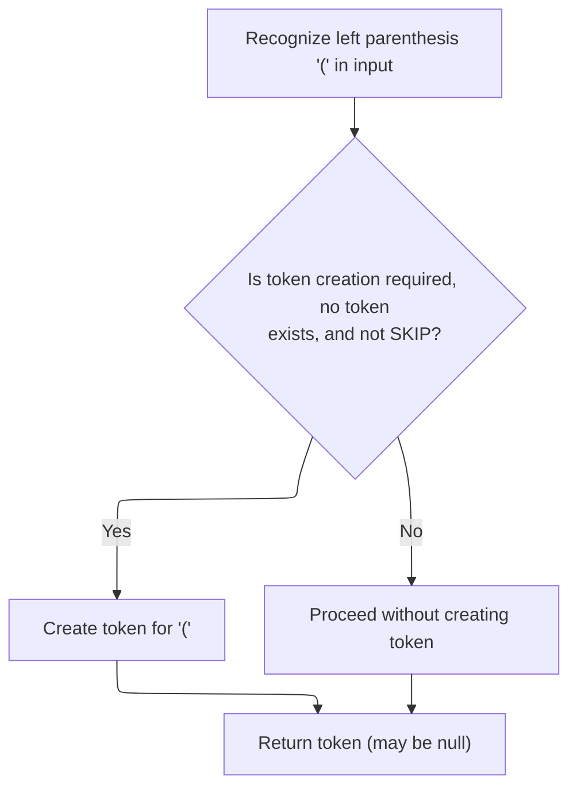
```mermaid
%%{init: {"flowchart": {"defaultRenderer": "elk"}} }%%
flowchart TD
    node1["Recognize left parenthesis '(' in input"]
    click node1 openCode "core/src/main/java/org/apache/struts/validator/validwhen/ValidWhenLexer.java:595:595"
    node1 --> node2{"Is token creation required, no token
exists, and not SKIP?"}
    click node2 openCode "core/src/main/java/org/apache/struts/validator/validwhen/ValidWhenLexer.java:596:599"
    node2 -->|"Yes"| node3["Create token for '('"]
    click node3 openCode "core/src/main/java/org/apache/struts/validator/validwhen/ValidWhenLexer.java:597:598"
    node2 -->|"No"| node4["Proceed without creating token"]
    click node4 openCode "core/src/main/java/org/apache/struts/validator/validwhen/ValidWhenLexer.java:599:599"
    node3 --> node5["Return token (may be null)"]
    node4 --> node5
    click node5 openCode "core/src/main/java/org/apache/struts/validator/validwhen/ValidWhenLexer.java:600:601"
classDef HeadingStyle fill:#777777,stroke:#333,stroke-width:2px;

%% Swimm:
%% %%{init: {"flowchart": {"defaultRenderer": "elk"}} }%%
%% flowchart TD
%%     node1["Recognize left parenthesis '(' in input"]
%%     click node1 openCode "<SwmPath>[core/…/validwhen/ValidWhenLexer.java](core/src/main/java/org/apache/struts/validator/validwhen/ValidWhenLexer.java)</SwmPath>:595:595"
%%     node1 --> node2{"Is token creation required, no token
%% exists, and not SKIP?"}
%%     click node2 openCode "<SwmPath>[core/…/validwhen/ValidWhenLexer.java](core/src/main/java/org/apache/struts/validator/validwhen/ValidWhenLexer.java)</SwmPath>:596:599"
%%     node2 -->|"Yes"| node3["Create token for '('"]
%%     click node3 openCode "<SwmPath>[core/…/validwhen/ValidWhenLexer.java](core/src/main/java/org/apache/struts/validator/validwhen/ValidWhenLexer.java)</SwmPath>:597:598"
%%     node2 -->|"No"| node4["Proceed without creating token"]
%%     click node4 openCode "<SwmPath>[core/…/validwhen/ValidWhenLexer.java](core/src/main/java/org/apache/struts/validator/validwhen/ValidWhenLexer.java)</SwmPath>:599:599"
%%     node3 --> node5["Return token (may be null)"]
%%     node4 --> node5
%%     click node5 openCode "<SwmPath>[core/…/validwhen/ValidWhenLexer.java](core/src/main/java/org/apache/struts/validator/validwhen/ValidWhenLexer.java)</SwmPath>:600:601"
%% classDef HeadingStyle fill:#777777,stroke:#333,stroke-width:2px;
```

<SwmSnippet path="/core/src/main/java/org/apache/struts/validator/validwhen/ValidWhenLexer.java" line="590">

---

In <SwmToken path="core/src/main/java/org/apache/struts/validator/validwhen/ValidWhenLexer.java" pos="590:7:7" line-data="	public final void mLPAREN(boolean _createToken) throws RecognitionException, CharStreamException, TokenStreamException {">`mLPAREN`</SwmToken>, we match '(' and set the token type so the parser knows it's starting a grouped expression. We need to call ActionConfigMatcher next because config might affect how grouping is interpreted.

```java
	public final void mLPAREN(boolean _createToken) throws RecognitionException, CharStreamException, TokenStreamException {
		int _ttype; Token _token=null; int _begin=text.length();
		_ttype = LPAREN;
		int _saveIndex;
		
		match('(');
```

---

</SwmSnippet>

<SwmSnippet path="/core/src/main/java/org/apache/struts/validator/validwhen/ValidWhenLexer.java" line="596">

---

After coming back from ActionConfigMatcher, <SwmToken path="core/src/main/java/org/apache/struts/validator/validwhen/ValidWhenLexer.java" pos="119:1:1" line-data="					mLPAREN(true);">`mLPAREN`</SwmToken> only creates the token if requested, and sets its text. This ensures the token stream reflects any config-driven grouping rules.

```java
		if ( _createToken && _token==null && _ttype!=Token.SKIP ) {
			_token = makeToken(_ttype);
			_token.setText(new String(text.getBuffer(), _begin, text.length()-_begin));
		}
		_returnToken = _token;
	}
```

---

</SwmSnippet>

### Processing Closing Parenthesis Tokens

<SwmSnippet path="/core/src/main/java/org/apache/struts/validator/validwhen/ValidWhenLexer.java" line="123">

---

Here, after handling '(', ValidWhenLexer.nextToken checks for ')' and calls <SwmToken path="core/src/main/java/org/apache/struts/validator/validwhen/ValidWhenLexer.java" pos="125:1:1" line-data="					mRPAREN(true);">`mRPAREN`</SwmToken> to tokenize it. This lets the parser handle the end of grouped expressions, so we need to call ValidWhenLexer.mRPAREN next.

```java
				case ')':
				{
					mRPAREN(true);
					theRetToken=_returnToken;
					break;
				}
```

---

</SwmSnippet>

### Tokenizing Right Parenthesis

<SwmSnippet path="/core/src/main/java/org/apache/struts/validator/validwhen/ValidWhenLexer.java" line="603">

---

In <SwmToken path="core/src/main/java/org/apache/struts/validator/validwhen/ValidWhenLexer.java" pos="603:7:7" line-data="	public final void mRPAREN(boolean _createToken) throws RecognitionException, CharStreamException, TokenStreamException {">`mRPAREN`</SwmToken>, we match ')' and set the token type so the parser knows it's closing a grouped expression. We need to call ActionConfigMatcher next because config might affect how grouping is interpreted.

```java
	public final void mRPAREN(boolean _createToken) throws RecognitionException, CharStreamException, TokenStreamException {
		int _ttype; Token _token=null; int _begin=text.length();
		_ttype = RPAREN;
		int _saveIndex;
		
		match(')');
```

---

</SwmSnippet>

<SwmSnippet path="/core/src/main/java/org/apache/struts/validator/validwhen/ValidWhenLexer.java" line="609">

---

After coming back from ActionConfigMatcher, <SwmToken path="core/src/main/java/org/apache/struts/validator/validwhen/ValidWhenLexer.java" pos="125:1:1" line-data="					mRPAREN(true);">`mRPAREN`</SwmToken> only creates the token if requested, and sets its text. This ensures the token stream reflects any config-driven grouping rules.

```java
		if ( _createToken && _token==null && _ttype!=Token.SKIP ) {
			_token = makeToken(_ttype);
			_token.setText(new String(text.getBuffer(), _begin, text.length()-_begin));
		}
		_returnToken = _token;
	}
```

---

</SwmSnippet>

### Processing Special and Identifier Tokens

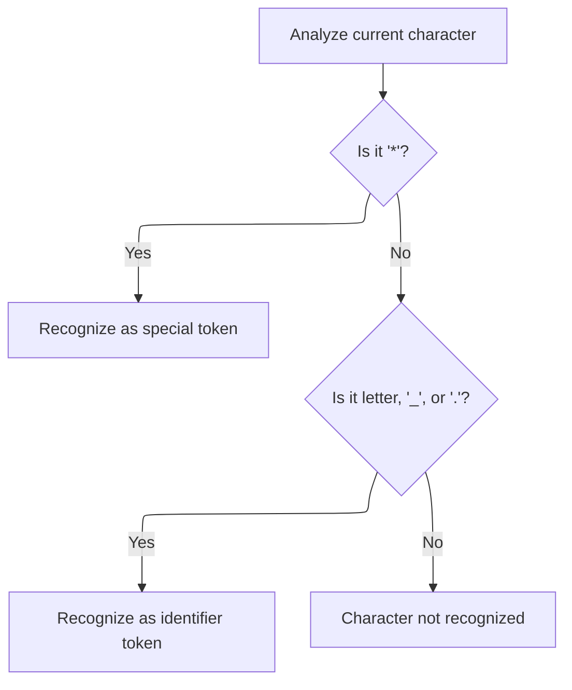
```mermaid
%%{init: {"flowchart": {"defaultRenderer": "elk"}} }%%
flowchart TD
    node1["Analyze current character"]
    click node1 openCode "core/src/main/java/org/apache/struts/validator/validwhen/ValidWhenLexer.java:129:140"
    node1 --> node2{"Is it '*'?"}
    click node2 openCode "core/src/main/java/org/apache/struts/validator/validwhen/ValidWhenLexer.java:129:134"
    node2 -->|"Yes"| node3["Recognize as special token"]
    click node3 openCode "core/src/main/java/org/apache/struts/validator/validwhen/ValidWhenLexer.java:131:134"
    node2 -->|"No"| node4{"Is it letter, '_', or '.'?"}
    click node4 openCode "core/src/main/java/org/apache/struts/validator/validwhen/ValidWhenLexer.java:135:140"
    node4 -->|"Yes"| node5["Recognize as identifier token"]
    click node5 openCode "core/src/main/java/org/apache/struts/validator/validwhen/ValidWhenLexer.java:135:140"
    node4 -->|"No"| node6["Character not recognized"]
    click node6 openCode "core/src/main/java/org/apache/struts/validator/validwhen/ValidWhenLexer.java:129:140"

classDef HeadingStyle fill:#777777,stroke:#333,stroke-width:2px;

%% Swimm:
%% %%{init: {"flowchart": {"defaultRenderer": "elk"}} }%%
%% flowchart TD
%%     node1["Analyze current character"]
%%     click node1 openCode "<SwmPath>[core/…/validwhen/ValidWhenLexer.java](core/src/main/java/org/apache/struts/validator/validwhen/ValidWhenLexer.java)</SwmPath>:129:140"
%%     node1 --> node2{"Is it '*'?"}
%%     click node2 openCode "<SwmPath>[core/…/validwhen/ValidWhenLexer.java](core/src/main/java/org/apache/struts/validator/validwhen/ValidWhenLexer.java)</SwmPath>:129:134"
%%     node2 -->|"Yes"| node3["Recognize as special token"]
%%     click node3 openCode "<SwmPath>[core/…/validwhen/ValidWhenLexer.java](core/src/main/java/org/apache/struts/validator/validwhen/ValidWhenLexer.java)</SwmPath>:131:134"
%%     node2 -->|"No"| node4{"Is it letter, '_', or '.'?"}
%%     click node4 openCode "<SwmPath>[core/…/validwhen/ValidWhenLexer.java](core/src/main/java/org/apache/struts/validator/validwhen/ValidWhenLexer.java)</SwmPath>:135:140"
%%     node4 -->|"Yes"| node5["Recognize as identifier token"]
%%     click node5 openCode "<SwmPath>[core/…/validwhen/ValidWhenLexer.java](core/src/main/java/org/apache/struts/validator/validwhen/ValidWhenLexer.java)</SwmPath>:135:140"
%%     node4 -->|"No"| node6["Character not recognized"]
%%     click node6 openCode "<SwmPath>[core/…/validwhen/ValidWhenLexer.java](core/src/main/java/org/apache/struts/validator/validwhen/ValidWhenLexer.java)</SwmPath>:129:140"
%% 
%% classDef HeadingStyle fill:#777777,stroke:#333,stroke-width:2px;
```

<SwmSnippet path="/core/src/main/java/org/apache/struts/validator/validwhen/ValidWhenLexer.java" line="129">

---

Here, after handling parentheses, ValidWhenLexer.nextToken checks for '\*' and calls <SwmToken path="core/src/main/java/org/apache/struts/validator/validwhen/ValidWhenLexer.java" pos="131:1:1" line-data="					mTHIS(true);">`mTHIS`</SwmToken> to tokenize '*this*'. This lets the parser handle self-references, so we need to call ValidWhenLexer.mTHIS next.

```java
				case '*':
				{
					mTHIS(true);
					theRetToken=_returnToken;
					break;
				}
				case '.':  case '_':  case 'a':  case 'b':
				case 'c':  case 'd':  case 'e':  case 'f':
				case 'g':  case 'h':  case 'i':  case 'j':
				case 'k':  case 'l':  case 'm':  case 'n':
				case 'o':  case 'p':  case 'q':  case 'r':
				case 's':  case 't':  case 'u':  case 'v':
```

---

</SwmSnippet>

### Tokenizing Self-Reference

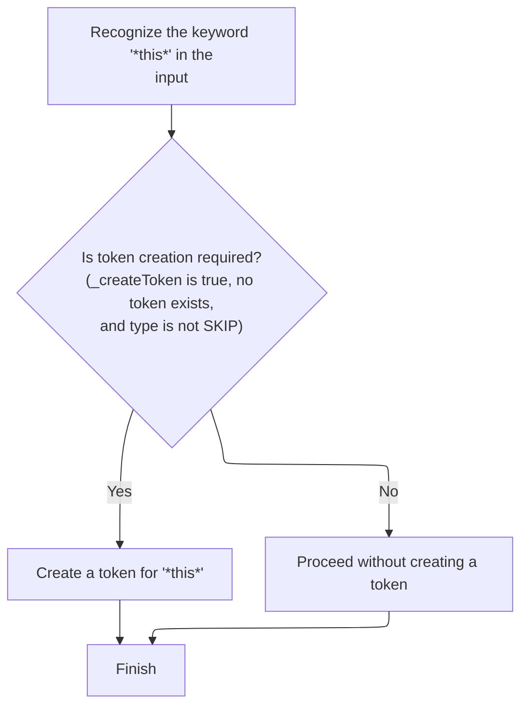
```mermaid
%%{init: {"flowchart": {"defaultRenderer": "elk"}} }%%
flowchart TD
  node1["Recognize the keyword '*this*' in the
input"]
  click node1 openCode "core/src/main/java/org/apache/struts/validator/validwhen/ValidWhenLexer.java:621:621"
  node1 --> node2{"Is token creation required?
(_createToken is true, no token exists,
and type is not SKIP)"}
  click node2 openCode "core/src/main/java/org/apache/struts/validator/validwhen/ValidWhenLexer.java:622:625"
  node2 -->|"Yes"| node3["Create a token for '*this*'"]
  click node3 openCode "core/src/main/java/org/apache/struts/validator/validwhen/ValidWhenLexer.java:623:624"
  node2 -->|"No"| node4["Proceed without creating a token"]
  click node4 openCode "core/src/main/java/org/apache/struts/validator/validwhen/ValidWhenLexer.java:625:625"
  node3 --> node5["Finish"]
  node4 --> node5["Finish"]
  click node5 openCode "core/src/main/java/org/apache/struts/validator/validwhen/ValidWhenLexer.java:626:627"
classDef HeadingStyle fill:#777777,stroke:#333,stroke-width:2px;

%% Swimm:
%% %%{init: {"flowchart": {"defaultRenderer": "elk"}} }%%
%% flowchart TD
%%   node1["Recognize the keyword '*this*' in the
%% input"]
%%   click node1 openCode "<SwmPath>[core/…/validwhen/ValidWhenLexer.java](core/src/main/java/org/apache/struts/validator/validwhen/ValidWhenLexer.java)</SwmPath>:621:621"
%%   node1 --> node2{"Is token creation required?
%% (<SwmToken path="core/src/main/java/org/apache/struts/validator/validwhen/ValidWhenLexer.java" pos="250:11:11" line-data="	public final void mDECIMAL_LITERAL(boolean _createToken) throws RecognitionException, CharStreamException, TokenStreamException {">`_createToken`</SwmToken> is true, no token exists,
%% and type is not SKIP)"}
%%   click node2 openCode "<SwmPath>[core/…/validwhen/ValidWhenLexer.java](core/src/main/java/org/apache/struts/validator/validwhen/ValidWhenLexer.java)</SwmPath>:622:625"
%%   node2 -->|"Yes"| node3["Create a token for '*this*'"]
%%   click node3 openCode "<SwmPath>[core/…/validwhen/ValidWhenLexer.java](core/src/main/java/org/apache/struts/validator/validwhen/ValidWhenLexer.java)</SwmPath>:623:624"
%%   node2 -->|"No"| node4["Proceed without creating a token"]
%%   click node4 openCode "<SwmPath>[core/…/validwhen/ValidWhenLexer.java](core/src/main/java/org/apache/struts/validator/validwhen/ValidWhenLexer.java)</SwmPath>:625:625"
%%   node3 --> node5["Finish"]
%%   node4 --> node5["Finish"]
%%   click node5 openCode "<SwmPath>[core/…/validwhen/ValidWhenLexer.java](core/src/main/java/org/apache/struts/validator/validwhen/ValidWhenLexer.java)</SwmPath>:626:627"
%% classDef HeadingStyle fill:#777777,stroke:#333,stroke-width:2px;
```

<SwmSnippet path="/core/src/main/java/org/apache/struts/validator/validwhen/ValidWhenLexer.java" line="616">

---

In <SwmToken path="core/src/main/java/org/apache/struts/validator/validwhen/ValidWhenLexer.java" pos="616:7:7" line-data="	public final void mTHIS(boolean _createToken) throws RecognitionException, CharStreamException, TokenStreamException {">`mTHIS`</SwmToken>, we match '*this*' and set the token type so the parser knows it's dealing with a self-reference. We need to call ActionConfigMatcher next because config might affect how self-references are resolved.

```java
	public final void mTHIS(boolean _createToken) throws RecognitionException, CharStreamException, TokenStreamException {
		int _ttype; Token _token=null; int _begin=text.length();
		_ttype = THIS;
		int _saveIndex;
		
		match("*this*");
```

---

</SwmSnippet>

<SwmSnippet path="/core/src/main/java/org/apache/struts/validator/validwhen/ValidWhenLexer.java" line="622">

---

After coming back from ActionConfigMatcher, <SwmToken path="core/src/main/java/org/apache/struts/validator/validwhen/ValidWhenLexer.java" pos="131:1:1" line-data="					mTHIS(true);">`mTHIS`</SwmToken> only creates the token if requested, and sets its text. This ensures the token stream reflects any config-driven self-reference rules.

```java
		if ( _createToken && _token==null && _ttype!=Token.SKIP ) {
			_token = makeToken(_ttype);
			_token.setText(new String(text.getBuffer(), _begin, text.length()-_begin));
		}
		_returnToken = _token;
	}
```

---

</SwmSnippet>

### Processing Identifiers

<SwmSnippet path="/core/src/main/java/org/apache/struts/validator/validwhen/ValidWhenLexer.java" line="141">

---

Here, after handling '*this*', ValidWhenLexer.nextToken checks for alphabetic characters and calls <SwmToken path="core/src/main/java/org/apache/struts/validator/validwhen/ValidWhenLexer.java" pos="143:1:1" line-data="					mIDENTIFIER(true);">`mIDENTIFIER`</SwmToken> to tokenize them. This lets the parser handle field and function references, so we need to call ValidWhenLexer.mIDENTIFIER next.

```java
				case 'w':  case 'x':  case 'y':  case 'z':
				{
					mIDENTIFIER(true);
					theRetToken=_returnToken;
					break;
				}
```

---

</SwmSnippet>

### Tokenizing Field and Function Names

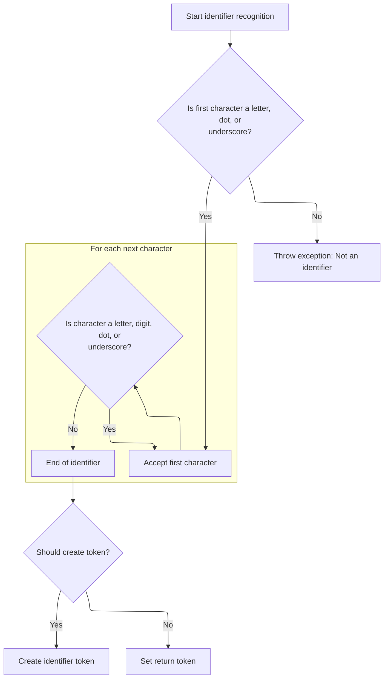
```mermaid
%%{init: {"flowchart": {"defaultRenderer": "elk"}} }%%
flowchart TD
  node1["Start identifier recognition"]
  click node1 openCode "core/src/main/java/org/apache/struts/validator/validwhen/ValidWhenLexer.java:629:634"
  node1 --> node2{"Is first character a letter, dot, or
underscore?"}
  click node2 openCode "core/src/main/java/org/apache/struts/validator/validwhen/ValidWhenLexer.java:635:662"
  node2 -->|"Yes"| node3["Accept first character"]
  click node3 openCode "core/src/main/java/org/apache/struts/validator/validwhen/ValidWhenLexer.java:643:646"
  node2 -->|"No"| node7["Throw exception: Not an identifier"]
  click node7 openCode "core/src/main/java/org/apache/struts/validator/validwhen/ValidWhenLexer.java:658:660"

  subgraph loop1["For each next character"]
    node3 --> node4{"Is character a letter, digit, dot, or
underscore?"}
    click node4 openCode "core/src/main/java/org/apache/struts/validator/validwhen/ValidWhenLexer.java:667:695"
    node4 -->|"Yes"| node3
    node4 -->|"No"| node5["End of identifier"]
    click node5 openCode "core/src/main/java/org/apache/struts/validator/validwhen/ValidWhenLexer.java:698:703"
  end

  node5 --> node6{"Should create token?"}
  click node6 openCode "core/src/main/java/org/apache/struts/validator/validwhen/ValidWhenLexer.java:704:707"
  node6 -->|"Yes"| node8["Create identifier token"]
  click node8 openCode "core/src/main/java/org/apache/struts/validator/validwhen/ValidWhenLexer.java:705:706"
  node6 -->|"No"| node9["Set return token"]
  click node9 openCode "core/src/main/java/org/apache/struts/validator/validwhen/ValidWhenLexer.java:708:709"

classDef HeadingStyle fill:#777777,stroke:#333,stroke-width:2px;

%% Swimm:
%% %%{init: {"flowchart": {"defaultRenderer": "elk"}} }%%
%% flowchart TD
%%   node1["Start identifier recognition"]
%%   click node1 openCode "<SwmPath>[core/…/validwhen/ValidWhenLexer.java](core/src/main/java/org/apache/struts/validator/validwhen/ValidWhenLexer.java)</SwmPath>:629:634"
%%   node1 --> node2{"Is first character a letter, dot, or
%% underscore?"}
%%   click node2 openCode "<SwmPath>[core/…/validwhen/ValidWhenLexer.java](core/src/main/java/org/apache/struts/validator/validwhen/ValidWhenLexer.java)</SwmPath>:635:662"
%%   node2 -->|"Yes"| node3["Accept first character"]
%%   click node3 openCode "<SwmPath>[core/…/validwhen/ValidWhenLexer.java](core/src/main/java/org/apache/struts/validator/validwhen/ValidWhenLexer.java)</SwmPath>:643:646"
%%   node2 -->|"No"| node7["Throw exception: Not an identifier"]
%%   click node7 openCode "<SwmPath>[core/…/validwhen/ValidWhenLexer.java](core/src/main/java/org/apache/struts/validator/validwhen/ValidWhenLexer.java)</SwmPath>:658:660"
%% 
%%   subgraph loop1["For each next character"]
%%     node3 --> node4{"Is character a letter, digit, dot, or
%% underscore?"}
%%     click node4 openCode "<SwmPath>[core/…/validwhen/ValidWhenLexer.java](core/src/main/java/org/apache/struts/validator/validwhen/ValidWhenLexer.java)</SwmPath>:667:695"
%%     node4 -->|"Yes"| node3
%%     node4 -->|"No"| node5["End of identifier"]
%%     click node5 openCode "<SwmPath>[core/…/validwhen/ValidWhenLexer.java](core/src/main/java/org/apache/struts/validator/validwhen/ValidWhenLexer.java)</SwmPath>:698:703"
%%   end
%% 
%%   node5 --> node6{"Should create token?"}
%%   click node6 openCode "<SwmPath>[core/…/validwhen/ValidWhenLexer.java](core/src/main/java/org/apache/struts/validator/validwhen/ValidWhenLexer.java)</SwmPath>:704:707"
%%   node6 -->|"Yes"| node8["Create identifier token"]
%%   click node8 openCode "<SwmPath>[core/…/validwhen/ValidWhenLexer.java](core/src/main/java/org/apache/struts/validator/validwhen/ValidWhenLexer.java)</SwmPath>:705:706"
%%   node6 -->|"No"| node9["Set return token"]
%%   click node9 openCode "<SwmPath>[core/…/validwhen/ValidWhenLexer.java](core/src/main/java/org/apache/struts/validator/validwhen/ValidWhenLexer.java)</SwmPath>:708:709"
%% 
%% classDef HeadingStyle fill:#777777,stroke:#333,stroke-width:2px;
```

<SwmSnippet path="/core/src/main/java/org/apache/struts/validator/validwhen/ValidWhenLexer.java" line="629">

---

In <SwmToken path="core/src/main/java/org/apache/struts/validator/validwhen/ValidWhenLexer.java" pos="629:7:7" line-data="	public final void mIDENTIFIER(boolean _createToken) throws RecognitionException, CharStreamException, TokenStreamException {">`mIDENTIFIER`</SwmToken>, we match alphabetic, numeric, dot, and underscore characters to build up field or function names. We need to call ActionConfigMatcher next because config might affect which identifiers are valid.

```java
	public final void mIDENTIFIER(boolean _createToken) throws RecognitionException, CharStreamException, TokenStreamException {
		int _ttype; Token _token=null; int _begin=text.length();
		_ttype = IDENTIFIER;
		int _saveIndex;
		
		{
		switch ( LA(1)) {
		case 'a':  case 'b':  case 'c':  case 'd':
		case 'e':  case 'f':  case 'g':  case 'h':
		case 'i':  case 'j':  case 'k':  case 'l':
		case 'm':  case 'n':  case 'o':  case 'p':
		case 'q':  case 'r':  case 's':  case 't':
		case 'u':  case 'v':  case 'w':  case 'x':
		case 'y':  case 'z':
		{
			matchRange('a','z');
			break;
		}
		case '.':
		{
			match('.');
			break;
		}
		case '_':
		{
			match('_');
			break;
		}
		default:
		{
			throw new NoViableAltForCharException((char)LA(1), getFilename(), getLine(), getColumn());
		}
		}
		}
		{
		int _cnt62=0;
		_loop62:
		do {
			switch ( LA(1)) {
			case 'a':  case 'b':  case 'c':  case 'd':
			case 'e':  case 'f':  case 'g':  case 'h':
			case 'i':  case 'j':  case 'k':  case 'l':
			case 'm':  case 'n':  case 'o':  case 'p':
			case 'q':  case 'r':  case 's':  case 't':
			case 'u':  case 'v':  case 'w':  case 'x':
			case 'y':  case 'z':
			{
				matchRange('a','z');
				break;
			}
			case '0':  case '1':  case '2':  case '3':
			case '4':  case '5':  case '6':  case '7':
			case '8':  case '9':
			{
				matchRange('0','9');
				break;
			}
			case '.':
			{
				match('.');
				break;
			}
			case '_':
			{
				match('_');
				break;
			}
			default:
			{
				if ( _cnt62>=1 ) { break _loop62; } else {throw new NoViableAltForCharException((char)LA(1), getFilename(), getLine(), getColumn());}
			}
			}
			_cnt62++;
		} while (true);
		}
```

---

</SwmSnippet>

<SwmSnippet path="/core/src/main/java/org/apache/struts/validator/validwhen/ValidWhenLexer.java" line="704">

---

After coming back from ActionConfigMatcher, <SwmToken path="core/src/main/java/org/apache/struts/validator/validwhen/ValidWhenLexer.java" pos="143:1:1" line-data="					mIDENTIFIER(true);">`mIDENTIFIER`</SwmToken> only creates the token if requested, and sets its text. This ensures the token stream reflects any config-driven identifier rules.

```java
		if ( _createToken && _token==null && _ttype!=Token.SKIP ) {
			_token = makeToken(_ttype);
			_token.setText(new String(text.getBuffer(), _begin, text.length()-_begin));
		}
		_returnToken = _token;
	}
```

---

</SwmSnippet>

### Processing Equality Tokens

<SwmSnippet path="/core/src/main/java/org/apache/struts/validator/validwhen/ValidWhenLexer.java" line="147">

---

Here, after handling identifiers, ValidWhenLexer.nextToken checks for '=' and calls <SwmToken path="core/src/main/java/org/apache/struts/validator/validwhen/ValidWhenLexer.java" pos="149:1:1" line-data="					mEQUALSIGN(true);">`mEQUALSIGN`</SwmToken> to tokenize '=='. This lets the parser handle comparison operations, so we need to call ValidWhenLexer.mEQUALSIGN next.

```java
				case '=':
				{
					mEQUALSIGN(true);
					theRetToken=_returnToken;
					break;
				}
```

---

</SwmSnippet>

### Tokenizing Equality Operator

<SwmSnippet path="/core/src/main/java/org/apache/struts/validator/validwhen/ValidWhenLexer.java" line="711">

---

In <SwmToken path="core/src/main/java/org/apache/struts/validator/validwhen/ValidWhenLexer.java" pos="711:7:7" line-data="	public final void mEQUALSIGN(boolean _createToken) throws RecognitionException, CharStreamException, TokenStreamException {">`mEQUALSIGN`</SwmToken>, we match '==' and set the token type so the parser knows it's dealing with a comparison. We need to call ActionConfigMatcher next because config might affect which comparisons are valid.

```java
	public final void mEQUALSIGN(boolean _createToken) throws RecognitionException, CharStreamException, TokenStreamException {
		int _ttype; Token _token=null; int _begin=text.length();
		_ttype = EQUALSIGN;
		int _saveIndex;
		
		match('=');
		match('=');
```

---

</SwmSnippet>

<SwmSnippet path="/core/src/main/java/org/apache/struts/validator/validwhen/ValidWhenLexer.java" line="718">

---

After coming back from ActionConfigMatcher, <SwmToken path="core/src/main/java/org/apache/struts/validator/validwhen/ValidWhenLexer.java" pos="149:1:1" line-data="					mEQUALSIGN(true);">`mEQUALSIGN`</SwmToken> only creates the token if requested, and sets its text. This ensures the token stream reflects any config-driven comparison rules.

```java
		if ( _createToken && _token==null && _ttype!=Token.SKIP ) {
			_token = makeToken(_ttype);
			_token.setText(new String(text.getBuffer(), _begin, text.length()-_begin));
		}
		_returnToken = _token;
	}
```

---

</SwmSnippet>

### Processing Inequality Tokens

<SwmSnippet path="/core/src/main/java/org/apache/struts/validator/validwhen/ValidWhenLexer.java" line="153">

---

Here, after handling equality, ValidWhenLexer.nextToken checks for '!' and calls <SwmToken path="core/src/main/java/org/apache/struts/validator/validwhen/ValidWhenLexer.java" pos="155:1:1" line-data="					mNOTEQUALSIGN(true);">`mNOTEQUALSIGN`</SwmToken> to tokenize '!='. This lets the parser handle inequality operations, so we need to call ValidWhenLexer.mNOTEQUALSIGN next.

```java
				case '!':
				{
					mNOTEQUALSIGN(true);
					theRetToken=_returnToken;
					break;
				}
```

---

</SwmSnippet>

### Tokenizing Inequality Operator

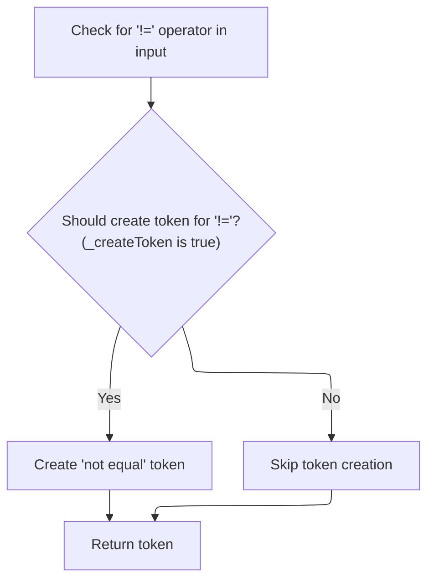
```mermaid
%%{init: {"flowchart": {"defaultRenderer": "elk"}} }%%
flowchart TD
  node1["Check for '!=' operator in input"]
  click node1 openCode "core/src/main/java/org/apache/struts/validator/validwhen/ValidWhenLexer.java:730:731"
  node1 --> node2{"Should create token for '!='?
(_createToken is true)"}
  click node2 openCode "core/src/main/java/org/apache/struts/validator/validwhen/ValidWhenLexer.java:732:735"
  node2 -->|"Yes"| node3["Create 'not equal' token"]
  click node3 openCode "core/src/main/java/org/apache/struts/validator/validwhen/ValidWhenLexer.java:733:734"
  node2 -->|"No"| node4["Skip token creation"]
  click node4 openCode "core/src/main/java/org/apache/struts/validator/validwhen/ValidWhenLexer.java:735:736"
  node3 --> node5["Return token"]
  click node5 openCode "core/src/main/java/org/apache/struts/validator/validwhen/ValidWhenLexer.java:736:737"
  node4 --> node5
classDef HeadingStyle fill:#777777,stroke:#333,stroke-width:2px;

%% Swimm:
%% %%{init: {"flowchart": {"defaultRenderer": "elk"}} }%%
%% flowchart TD
%%   node1["Check for '!=' operator in input"]
%%   click node1 openCode "<SwmPath>[core/…/validwhen/ValidWhenLexer.java](core/src/main/java/org/apache/struts/validator/validwhen/ValidWhenLexer.java)</SwmPath>:730:731"
%%   node1 --> node2{"Should create token for '!='?
%% (<SwmToken path="core/src/main/java/org/apache/struts/validator/validwhen/ValidWhenLexer.java" pos="250:11:11" line-data="	public final void mDECIMAL_LITERAL(boolean _createToken) throws RecognitionException, CharStreamException, TokenStreamException {">`_createToken`</SwmToken> is true)"}
%%   click node2 openCode "<SwmPath>[core/…/validwhen/ValidWhenLexer.java](core/src/main/java/org/apache/struts/validator/validwhen/ValidWhenLexer.java)</SwmPath>:732:735"
%%   node2 -->|"Yes"| node3["Create 'not equal' token"]
%%   click node3 openCode "<SwmPath>[core/…/validwhen/ValidWhenLexer.java](core/src/main/java/org/apache/struts/validator/validwhen/ValidWhenLexer.java)</SwmPath>:733:734"
%%   node2 -->|"No"| node4["Skip token creation"]
%%   click node4 openCode "<SwmPath>[core/…/validwhen/ValidWhenLexer.java](core/src/main/java/org/apache/struts/validator/validwhen/ValidWhenLexer.java)</SwmPath>:735:736"
%%   node3 --> node5["Return token"]
%%   click node5 openCode "<SwmPath>[core/…/validwhen/ValidWhenLexer.java](core/src/main/java/org/apache/struts/validator/validwhen/ValidWhenLexer.java)</SwmPath>:736:737"
%%   node4 --> node5
%% classDef HeadingStyle fill:#777777,stroke:#333,stroke-width:2px;
```

<SwmSnippet path="/core/src/main/java/org/apache/struts/validator/validwhen/ValidWhenLexer.java" line="725">

---

In <SwmToken path="core/src/main/java/org/apache/struts/validator/validwhen/ValidWhenLexer.java" pos="725:7:7" line-data="	public final void mNOTEQUALSIGN(boolean _createToken) throws RecognitionException, CharStreamException, TokenStreamException {">`mNOTEQUALSIGN`</SwmToken>, we match '!=' and set the token type so the parser knows it's dealing with an inequality comparison. We need to call ActionConfigMatcher next because config might affect which comparisons are valid.

```java
	public final void mNOTEQUALSIGN(boolean _createToken) throws RecognitionException, CharStreamException, TokenStreamException {
		int _ttype; Token _token=null; int _begin=text.length();
		_ttype = NOTEQUALSIGN;
		int _saveIndex;
		
		match('!');
		match('=');
```

---

</SwmSnippet>

<SwmSnippet path="/core/src/main/java/org/apache/struts/validator/validwhen/ValidWhenLexer.java" line="732">

---

After coming back from ActionConfigMatcher, <SwmToken path="core/src/main/java/org/apache/struts/validator/validwhen/ValidWhenLexer.java" pos="155:1:1" line-data="					mNOTEQUALSIGN(true);">`mNOTEQUALSIGN`</SwmToken> only creates the token if requested, and sets its text. This ensures the token stream reflects any config-driven comparison rules.

```java
		if ( _createToken && _token==null && _ttype!=Token.SKIP ) {
			_token = makeToken(_ttype);
			_token.setText(new String(text.getBuffer(), _begin, text.length()-_begin));
		}
		_returnToken = _token;
	}
```

---

</SwmSnippet>

### Handling Less-Than-Or-Equal Tokens

<SwmSnippet path="/core/src/main/java/org/apache/struts/validator/validwhen/ValidWhenLexer.java" line="159">

---

After coming back from ValidWhenLexer.mNOTEQUALSIGN, the code in ValidWhenLexer.nextToken checks if the next two characters are '<=' and, if so, calls ValidWhenLexer.mLESSEQUALSIGN. This step is needed to recognize the less-than-or-equal operator in the input, so the lexer can keep parsing comparison expressions correctly.

```java
				default:
					if ((LA(1)=='<') && (LA(2)=='=')) {
						mLESSEQUALSIGN(true);
```

---

</SwmSnippet>

### Tokenizing Less-Than-Or-Equal Operator

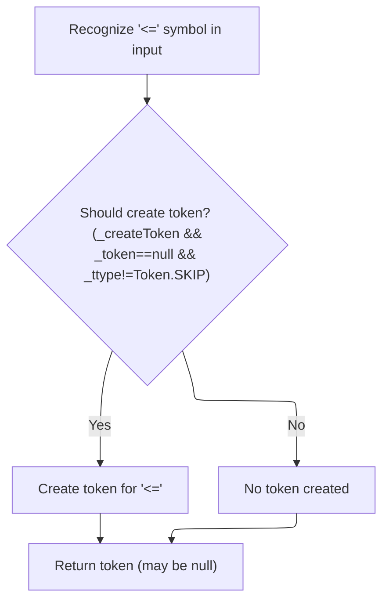
```mermaid
%%{init: {"flowchart": {"defaultRenderer": "elk"}} }%%
flowchart TD
    node1["Recognize '<=' symbol in input"]
    click node1 openCode "core/src/main/java/org/apache/struts/validator/validwhen/ValidWhenLexer.java:770:771"
    node1 --> node2{"Should create token? (_createToken &&
_token==null && _ttype!=Token.SKIP)"}
    click node2 openCode "core/src/main/java/org/apache/struts/validator/validwhen/ValidWhenLexer.java:772:775"
    node2 -->|"Yes"| node3["Create token for '<='"]
    click node3 openCode "core/src/main/java/org/apache/struts/validator/validwhen/ValidWhenLexer.java:773:774"
    node2 -->|"No"| node4["No token created"]
    click node4 openCode "core/src/main/java/org/apache/struts/validator/validwhen/ValidWhenLexer.java:772:775"
    node3 --> node5["Return token (may be null)"]
    node4 --> node5
    click node5 openCode "core/src/main/java/org/apache/struts/validator/validwhen/ValidWhenLexer.java:776:777"

classDef HeadingStyle fill:#777777,stroke:#333,stroke-width:2px;

%% Swimm:
%% %%{init: {"flowchart": {"defaultRenderer": "elk"}} }%%
%% flowchart TD
%%     node1["Recognize '<=' symbol in input"]
%%     click node1 openCode "<SwmPath>[core/…/validwhen/ValidWhenLexer.java](core/src/main/java/org/apache/struts/validator/validwhen/ValidWhenLexer.java)</SwmPath>:770:771"
%%     node1 --> node2{"Should create token? (<SwmToken path="core/src/main/java/org/apache/struts/validator/validwhen/ValidWhenLexer.java" pos="250:11:11" line-data="	public final void mDECIMAL_LITERAL(boolean _createToken) throws RecognitionException, CharStreamException, TokenStreamException {">`_createToken`</SwmToken> &&
%% _token==null && _ttype!=<SwmToken path="core/src/main/java/org/apache/struts/validator/validwhen/ValidWhenLexer.java" pos="495:17:19" line-data="				if ( _createToken &amp;&amp; _token==null &amp;&amp; _ttype!=Token.SKIP ) {">`Token.SKIP`</SwmToken>)"}
%%     click node2 openCode "<SwmPath>[core/…/validwhen/ValidWhenLexer.java](core/src/main/java/org/apache/struts/validator/validwhen/ValidWhenLexer.java)</SwmPath>:772:775"
%%     node2 -->|"Yes"| node3["Create token for '<='"]
%%     click node3 openCode "<SwmPath>[core/…/validwhen/ValidWhenLexer.java](core/src/main/java/org/apache/struts/validator/validwhen/ValidWhenLexer.java)</SwmPath>:773:774"
%%     node2 -->|"No"| node4["No token created"]
%%     click node4 openCode "<SwmPath>[core/…/validwhen/ValidWhenLexer.java](core/src/main/java/org/apache/struts/validator/validwhen/ValidWhenLexer.java)</SwmPath>:772:775"
%%     node3 --> node5["Return token (may be null)"]
%%     node4 --> node5
%%     click node5 openCode "<SwmPath>[core/…/validwhen/ValidWhenLexer.java](core/src/main/java/org/apache/struts/validator/validwhen/ValidWhenLexer.java)</SwmPath>:776:777"
%% 
%% classDef HeadingStyle fill:#777777,stroke:#333,stroke-width:2px;
```

<SwmSnippet path="/core/src/main/java/org/apache/struts/validator/validwhen/ValidWhenLexer.java" line="765">

---

In <SwmToken path="core/src/main/java/org/apache/struts/validator/validwhen/ValidWhenLexer.java" pos="765:7:7" line-data="	public final void mLESSEQUALSIGN(boolean _createToken) throws RecognitionException, CharStreamException, TokenStreamException {">`mLESSEQUALSIGN`</SwmToken>, we match the sequence '<=' and set up the token type. We need to call ActionConfigMatcher next in case there are config rules that affect how this operator is processed in validation expressions.

```java
	public final void mLESSEQUALSIGN(boolean _createToken) throws RecognitionException, CharStreamException, TokenStreamException {
		int _ttype; Token _token=null; int _begin=text.length();
		_ttype = LESSEQUALSIGN;
		int _saveIndex;
		
		match('<');
		match('=');
```

---

</SwmSnippet>

<SwmSnippet path="/core/src/main/java/org/apache/struts/validator/validwhen/ValidWhenLexer.java" line="772">

---

After coming back from ActionConfigMatcher, <SwmToken path="core/src/main/java/org/apache/struts/validator/validwhen/ValidWhenLexer.java" pos="161:1:1" line-data="						mLESSEQUALSIGN(true);">`mLESSEQUALSIGN`</SwmToken> finalizes the token if needed and sets its text. This ensures any config-driven changes are reflected in the token before it's returned to the lexer.

```java
		if ( _createToken && _token==null && _ttype!=Token.SKIP ) {
			_token = makeToken(_ttype);
			_token.setText(new String(text.getBuffer(), _begin, text.length()-_begin));
		}
		_returnToken = _token;
	}
```

---

</SwmSnippet>

### Handling Greater-Than-Or-Equal Tokens

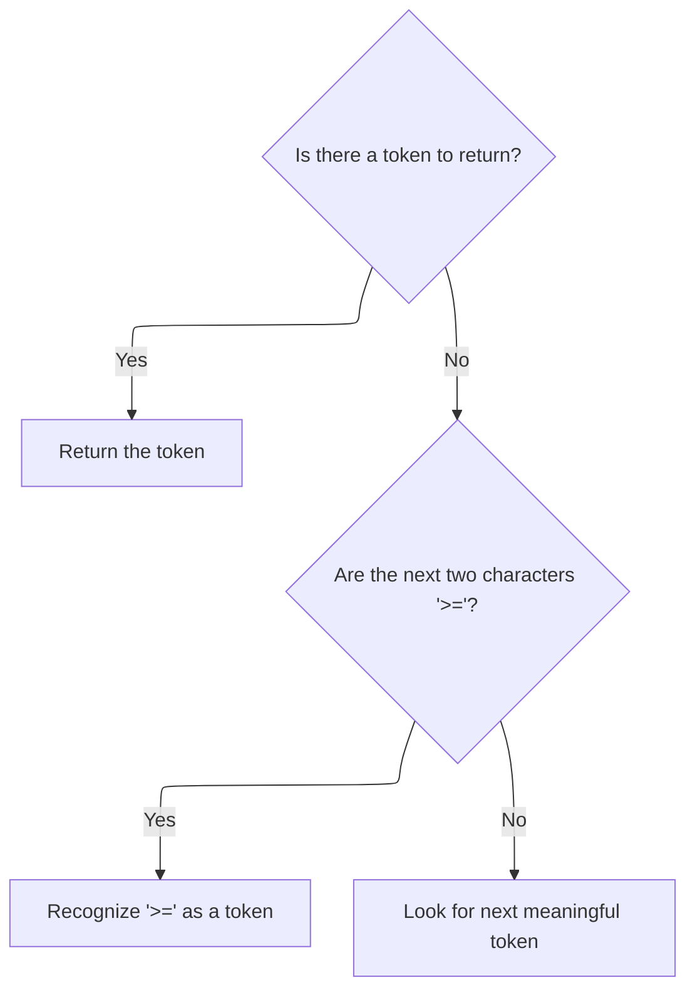
```mermaid
%%{init: {"flowchart": {"defaultRenderer": "elk"}} }%%
flowchart TD
    node1{"Is there a token to return?"}
    click node1 openCode "core/src/main/java/org/apache/struts/validator/validwhen/ValidWhenLexer.java:162:163"
    node1 -->|"Yes"| node2["Return the token"]
    click node2 openCode "core/src/main/java/org/apache/struts/validator/validwhen/ValidWhenLexer.java:162:163"
    node1 -->|"No"| node3{"Are the next two characters '>='?"}
    click node3 openCode "core/src/main/java/org/apache/struts/validator/validwhen/ValidWhenLexer.java:164:165"
    node3 -->|"Yes"| node4["Recognize '>=' as a token"]
    click node4 openCode "core/src/main/java/org/apache/struts/validator/validwhen/ValidWhenLexer.java:165:165"
    node3 -->|"No"| node5["Look for next meaningful token"]
    click node5 openCode "core/src/main/java/org/apache/struts/validator/validwhen/ValidWhenLexer.java:165:165"

classDef HeadingStyle fill:#777777,stroke:#333,stroke-width:2px;

%% Swimm:
%% %%{init: {"flowchart": {"defaultRenderer": "elk"}} }%%
%% flowchart TD
%%     node1{"Is there a token to return?"}
%%     click node1 openCode "<SwmPath>[core/…/validwhen/ValidWhenLexer.java](core/src/main/java/org/apache/struts/validator/validwhen/ValidWhenLexer.java)</SwmPath>:162:163"
%%     node1 -->|"Yes"| node2["Return the token"]
%%     click node2 openCode "<SwmPath>[core/…/validwhen/ValidWhenLexer.java](core/src/main/java/org/apache/struts/validator/validwhen/ValidWhenLexer.java)</SwmPath>:162:163"
%%     node1 -->|"No"| node3{"Are the next two characters '>='?"}
%%     click node3 openCode "<SwmPath>[core/…/validwhen/ValidWhenLexer.java](core/src/main/java/org/apache/struts/validator/validwhen/ValidWhenLexer.java)</SwmPath>:164:165"
%%     node3 -->|"Yes"| node4["Recognize '>=' as a token"]
%%     click node4 openCode "<SwmPath>[core/…/validwhen/ValidWhenLexer.java](core/src/main/java/org/apache/struts/validator/validwhen/ValidWhenLexer.java)</SwmPath>:165:165"
%%     node3 -->|"No"| node5["Look for next meaningful token"]
%%     click node5 openCode "<SwmPath>[core/…/validwhen/ValidWhenLexer.java](core/src/main/java/org/apache/struts/validator/validwhen/ValidWhenLexer.java)</SwmPath>:165:165"
%% 
%% classDef HeadingStyle fill:#777777,stroke:#333,stroke-width:2px;
```

<SwmSnippet path="/core/src/main/java/org/apache/struts/validator/validwhen/ValidWhenLexer.java" line="162">

---

After coming back from ValidWhenLexer.mLESSEQUALSIGN, <SwmToken path="core/src/main/java/org/apache/struts/validator/FieldChecks.java" pos="1414:11:11" line-data="                schemes[i++] = st.nextToken().trim();">`nextToken`</SwmToken> checks for '>=' and calls ValidWhenLexer.mGREATEREQUALSIGN if found. This keeps the lexer moving through all possible comparison operators in the input.

```java
						theRetToken=_returnToken;
					}
					else if ((LA(1)=='>') && (LA(2)=='=')) {
						mGREATEREQUALSIGN(true);
```

---

</SwmSnippet>

### Tokenizing Greater-Than-Or-Equal Operator

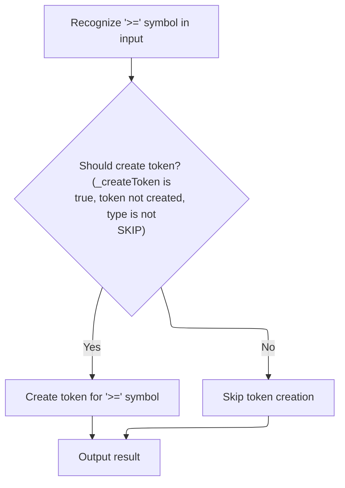
```mermaid
%%{init: {"flowchart": {"defaultRenderer": "elk"}} }%%
flowchart TD
    node1["Recognize '>=' symbol in input"]
    click node1 openCode "core/src/main/java/org/apache/struts/validator/validwhen/ValidWhenLexer.java:784:785"
    node1 --> node2{"Should create token? (_createToken is
true, token not created, type is not
SKIP)"}
    click node2 openCode "core/src/main/java/org/apache/struts/validator/validwhen/ValidWhenLexer.java:786:789"
    node2 -->|"Yes"| node3["Create token for '>=' symbol"]
    click node3 openCode "core/src/main/java/org/apache/struts/validator/validwhen/ValidWhenLexer.java:787:788"
    node2 -->|"No"| node4["Skip token creation"]
    click node4 openCode "core/src/main/java/org/apache/struts/validator/validwhen/ValidWhenLexer.java:786:789"
    node3 --> node5["Output result"]
    click node5 openCode "core/src/main/java/org/apache/struts/validator/validwhen/ValidWhenLexer.java:790:791"
    node4 --> node5
classDef HeadingStyle fill:#777777,stroke:#333,stroke-width:2px;

%% Swimm:
%% %%{init: {"flowchart": {"defaultRenderer": "elk"}} }%%
%% flowchart TD
%%     node1["Recognize '>=' symbol in input"]
%%     click node1 openCode "<SwmPath>[core/…/validwhen/ValidWhenLexer.java](core/src/main/java/org/apache/struts/validator/validwhen/ValidWhenLexer.java)</SwmPath>:784:785"
%%     node1 --> node2{"Should create token? (<SwmToken path="core/src/main/java/org/apache/struts/validator/validwhen/ValidWhenLexer.java" pos="250:11:11" line-data="	public final void mDECIMAL_LITERAL(boolean _createToken) throws RecognitionException, CharStreamException, TokenStreamException {">`_createToken`</SwmToken> is
%% true, token not created, type is not
%% SKIP)"}
%%     click node2 openCode "<SwmPath>[core/…/validwhen/ValidWhenLexer.java](core/src/main/java/org/apache/struts/validator/validwhen/ValidWhenLexer.java)</SwmPath>:786:789"
%%     node2 -->|"Yes"| node3["Create token for '>=' symbol"]
%%     click node3 openCode "<SwmPath>[core/…/validwhen/ValidWhenLexer.java](core/src/main/java/org/apache/struts/validator/validwhen/ValidWhenLexer.java)</SwmPath>:787:788"
%%     node2 -->|"No"| node4["Skip token creation"]
%%     click node4 openCode "<SwmPath>[core/…/validwhen/ValidWhenLexer.java](core/src/main/java/org/apache/struts/validator/validwhen/ValidWhenLexer.java)</SwmPath>:786:789"
%%     node3 --> node5["Output result"]
%%     click node5 openCode "<SwmPath>[core/…/validwhen/ValidWhenLexer.java](core/src/main/java/org/apache/struts/validator/validwhen/ValidWhenLexer.java)</SwmPath>:790:791"
%%     node4 --> node5
%% classDef HeadingStyle fill:#777777,stroke:#333,stroke-width:2px;
```

<SwmSnippet path="/core/src/main/java/org/apache/struts/validator/validwhen/ValidWhenLexer.java" line="779">

---

In <SwmToken path="core/src/main/java/org/apache/struts/validator/validwhen/ValidWhenLexer.java" pos="779:7:7" line-data="	public final void mGREATEREQUALSIGN(boolean _createToken) throws RecognitionException, CharStreamException, TokenStreamException {">`mGREATEREQUALSIGN`</SwmToken>, we match the sequence '>=' and set up the token type. We call ActionConfigMatcher next to check for any config rules that might affect how this operator is processed.

```java
	public final void mGREATEREQUALSIGN(boolean _createToken) throws RecognitionException, CharStreamException, TokenStreamException {
		int _ttype; Token _token=null; int _begin=text.length();
		_ttype = GREATEREQUALSIGN;
		int _saveIndex;
		
		match('>');
		match('=');
```

---

</SwmSnippet>

<SwmSnippet path="/core/src/main/java/org/apache/struts/validator/validwhen/ValidWhenLexer.java" line="786">

---

After coming back from ActionConfigMatcher, <SwmToken path="core/src/main/java/org/apache/struts/validator/validwhen/ValidWhenLexer.java" pos="165:1:1" line-data="						mGREATEREQUALSIGN(true);">`mGREATEREQUALSIGN`</SwmToken> finalizes the token if needed and sets its text. This way, any config-driven changes are reflected in the token before it's returned to the lexer.

```java
		if ( _createToken && _token==null && _ttype!=Token.SKIP ) {
			_token = makeToken(_ttype);
			_token.setText(new String(text.getBuffer(), _begin, text.length()-_begin));
		}
		_returnToken = _token;
	}
```

---

</SwmSnippet>

### Handling Less-Than and Greater-Than Tokens

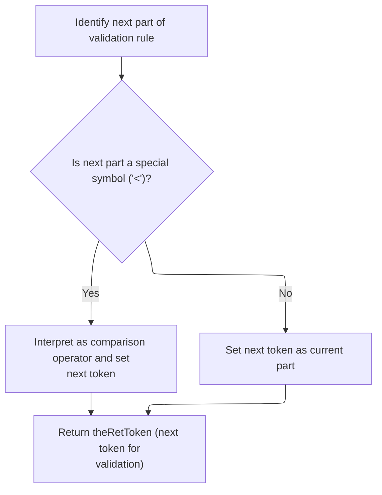
```mermaid
%%{init: {"flowchart": {"defaultRenderer": "elk"}} }%%
flowchart TD
    node1["Identify next part of validation rule"]
    click node1 openCode "core/src/main/java/org/apache/struts/validator/validwhen/ValidWhenLexer.java:166:169"
    node1 --> node2{"Is next part a special symbol ('<')?"}
    click node2 openCode "core/src/main/java/org/apache/struts/validator/validwhen/ValidWhenLexer.java:168:169"
    node2 -->|"Yes"| node3["Interpret as comparison operator and set
next token"]
    click node3 openCode "core/src/main/java/org/apache/struts/validator/validwhen/ValidWhenLexer.java:169:169"
    node2 -->|"No"| node4["Set next token as current part"]
    click node4 openCode "core/src/main/java/org/apache/struts/validator/validwhen/ValidWhenLexer.java:166:167"
    node3 --> node5["Return theRetToken (next token for
validation)"]
    click node5 openCode "core/src/main/java/org/apache/struts/validator/validwhen/ValidWhenLexer.java:166:169"
    node4 --> node5
classDef HeadingStyle fill:#777777,stroke:#333,stroke-width:2px;

%% Swimm:
%% %%{init: {"flowchart": {"defaultRenderer": "elk"}} }%%
%% flowchart TD
%%     node1["Identify next part of validation rule"]
%%     click node1 openCode "<SwmPath>[core/…/validwhen/ValidWhenLexer.java](core/src/main/java/org/apache/struts/validator/validwhen/ValidWhenLexer.java)</SwmPath>:166:169"
%%     node1 --> node2{"Is next part a special symbol ('<')?"}
%%     click node2 openCode "<SwmPath>[core/…/validwhen/ValidWhenLexer.java](core/src/main/java/org/apache/struts/validator/validwhen/ValidWhenLexer.java)</SwmPath>:168:169"
%%     node2 -->|"Yes"| node3["Interpret as comparison operator and set
%% next token"]
%%     click node3 openCode "<SwmPath>[core/…/validwhen/ValidWhenLexer.java](core/src/main/java/org/apache/struts/validator/validwhen/ValidWhenLexer.java)</SwmPath>:169:169"
%%     node2 -->|"No"| node4["Set next token as current part"]
%%     click node4 openCode "<SwmPath>[core/…/validwhen/ValidWhenLexer.java](core/src/main/java/org/apache/struts/validator/validwhen/ValidWhenLexer.java)</SwmPath>:166:167"
%%     node3 --> node5["Return <SwmToken path="core/src/main/java/org/apache/struts/validator/validwhen/ValidWhenLexer.java" pos="76:3:3" line-data="	Token theRetToken=null;">`theRetToken`</SwmToken> (next token for
%% validation)"]
%%     click node5 openCode "<SwmPath>[core/…/validwhen/ValidWhenLexer.java](core/src/main/java/org/apache/struts/validator/validwhen/ValidWhenLexer.java)</SwmPath>:166:169"
%%     node4 --> node5
%% classDef HeadingStyle fill:#777777,stroke:#333,stroke-width:2px;
```

<SwmSnippet path="/core/src/main/java/org/apache/struts/validator/validwhen/ValidWhenLexer.java" line="166">

---

After coming back from ValidWhenLexer.mGREATEREQUALSIGN, <SwmToken path="core/src/main/java/org/apache/struts/validator/FieldChecks.java" pos="1414:11:11" line-data="                schemes[i++] = st.nextToken().trim();">`nextToken`</SwmToken> checks for single '<' and '>' operators and calls the respective tokenizing methods. This ensures all comparison operators are recognized, even if they're not part of a multi-character sequence.

```java
						theRetToken=_returnToken;
					}
					else if ((LA(1)=='<') && (true)) {
						mLESSTHANSIGN(true);
```

---

</SwmSnippet>

### Tokenizing Less-Than Operator

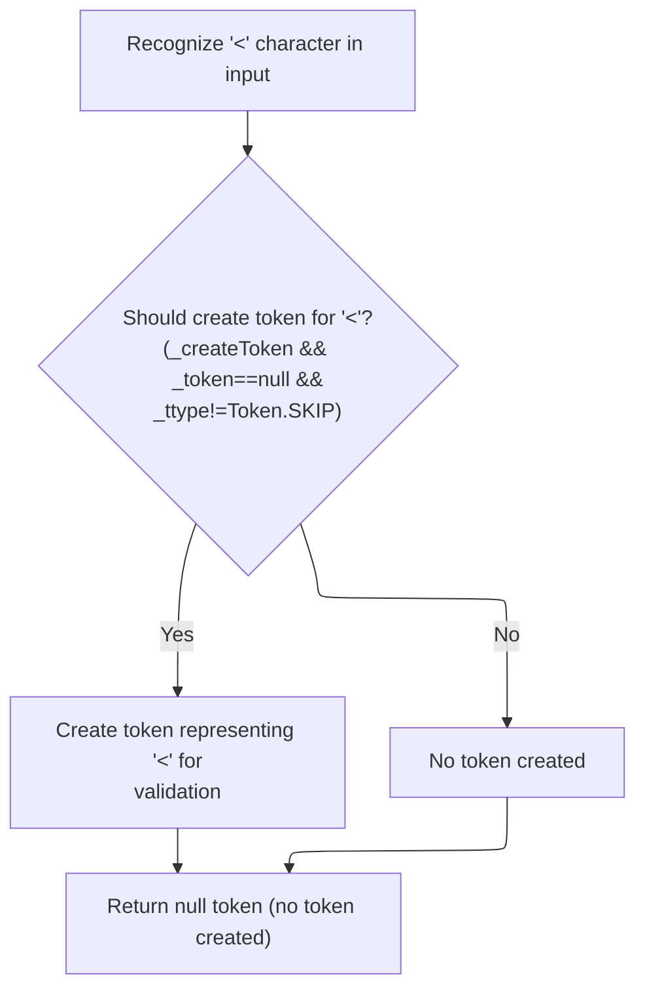
```mermaid
%%{init: {"flowchart": {"defaultRenderer": "elk"}} }%%
flowchart TD
  node1["Recognize '<' character in input"]
  click node1 openCode "core/src/main/java/org/apache/struts/validator/validwhen/ValidWhenLexer.java:744:744"
  node1 --> node2{"Should create token for '<'?
(_createToken && _token==null &&
_ttype!=Token.SKIP)"}
  click node2 openCode "core/src/main/java/org/apache/struts/validator/validwhen/ValidWhenLexer.java:745:745"
  node2 -->|"Yes"| node3["Create token representing '<' for
validation"]
  click node3 openCode "core/src/main/java/org/apache/struts/validator/validwhen/ValidWhenLexer.java:746:747"
  node2 -->|"No"| node4["No token created"]
  click node4 openCode "core/src/main/java/org/apache/struts/validator/validwhen/ValidWhenLexer.java:745:745"
  node3 --> node5["Return token (may be used in validation)"]
  node4 --> node5["Return null token (no token created)"]
  click node5 openCode "core/src/main/java/org/apache/struts/validator/validwhen/ValidWhenLexer.java:749:750"

classDef HeadingStyle fill:#777777,stroke:#333,stroke-width:2px;

%% Swimm:
%% %%{init: {"flowchart": {"defaultRenderer": "elk"}} }%%
%% flowchart TD
%%   node1["Recognize '<' character in input"]
%%   click node1 openCode "<SwmPath>[core/…/validwhen/ValidWhenLexer.java](core/src/main/java/org/apache/struts/validator/validwhen/ValidWhenLexer.java)</SwmPath>:744:744"
%%   node1 --> node2{"Should create token for '<'?
%% (<SwmToken path="core/src/main/java/org/apache/struts/validator/validwhen/ValidWhenLexer.java" pos="250:11:11" line-data="	public final void mDECIMAL_LITERAL(boolean _createToken) throws RecognitionException, CharStreamException, TokenStreamException {">`_createToken`</SwmToken> && _token==null &&
%% _ttype!=<SwmToken path="core/src/main/java/org/apache/struts/validator/validwhen/ValidWhenLexer.java" pos="495:17:19" line-data="				if ( _createToken &amp;&amp; _token==null &amp;&amp; _ttype!=Token.SKIP ) {">`Token.SKIP`</SwmToken>)"}
%%   click node2 openCode "<SwmPath>[core/…/validwhen/ValidWhenLexer.java](core/src/main/java/org/apache/struts/validator/validwhen/ValidWhenLexer.java)</SwmPath>:745:745"
%%   node2 -->|"Yes"| node3["Create token representing '<' for
%% validation"]
%%   click node3 openCode "<SwmPath>[core/…/validwhen/ValidWhenLexer.java](core/src/main/java/org/apache/struts/validator/validwhen/ValidWhenLexer.java)</SwmPath>:746:747"
%%   node2 -->|"No"| node4["No token created"]
%%   click node4 openCode "<SwmPath>[core/…/validwhen/ValidWhenLexer.java](core/src/main/java/org/apache/struts/validator/validwhen/ValidWhenLexer.java)</SwmPath>:745:745"
%%   node3 --> node5["Return token (may be used in validation)"]
%%   node4 --> node5["Return null token (no token created)"]
%%   click node5 openCode "<SwmPath>[core/…/validwhen/ValidWhenLexer.java](core/src/main/java/org/apache/struts/validator/validwhen/ValidWhenLexer.java)</SwmPath>:749:750"
%% 
%% classDef HeadingStyle fill:#777777,stroke:#333,stroke-width:2px;
```

<SwmSnippet path="/core/src/main/java/org/apache/struts/validator/validwhen/ValidWhenLexer.java" line="739">

---

In <SwmToken path="core/src/main/java/org/apache/struts/validator/validwhen/ValidWhenLexer.java" pos="739:7:7" line-data="	public final void mLESSTHANSIGN(boolean _createToken) throws RecognitionException, CharStreamException, TokenStreamException {">`mLESSTHANSIGN`</SwmToken>, we match a single '<' and set up the token type. We call ActionConfigMatcher next to check for any config rules that might affect how this operator is processed.

```java
	public final void mLESSTHANSIGN(boolean _createToken) throws RecognitionException, CharStreamException, TokenStreamException {
		int _ttype; Token _token=null; int _begin=text.length();
		_ttype = LESSTHANSIGN;
		int _saveIndex;
		
		match('<');
```

---

</SwmSnippet>

<SwmSnippet path="/core/src/main/java/org/apache/struts/validator/validwhen/ValidWhenLexer.java" line="745">

---

After coming back from ActionConfigMatcher, <SwmToken path="core/src/main/java/org/apache/struts/validator/validwhen/ValidWhenLexer.java" pos="169:1:1" line-data="						mLESSTHANSIGN(true);">`mLESSTHANSIGN`</SwmToken> finalizes the token if needed and sets its text. This way, any config-driven changes are reflected in the token before it's returned to the lexer.

```java
		if ( _createToken && _token==null && _ttype!=Token.SKIP ) {
			_token = makeToken(_ttype);
			_token.setText(new String(text.getBuffer(), _begin, text.length()-_begin));
		}
		_returnToken = _token;
	}
```

---

</SwmSnippet>

### Finalizing Comparison Tokens

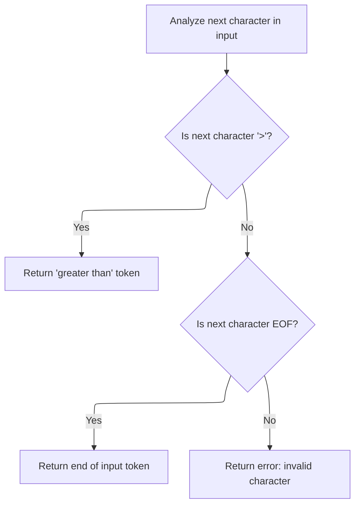
```mermaid
%%{init: {"flowchart": {"defaultRenderer": "elk"}} }%%
flowchart TD
  node1["Analyze next character in input"] --> node2{"Is next character '>'?"}
  click node1 openCode "core/src/main/java/org/apache/struts/validator/validwhen/ValidWhenLexer.java:170:172"
  node2 -->|"Yes"| node3["Return 'greater than' token"]
  click node2 openCode "core/src/main/java/org/apache/struts/validator/validwhen/ValidWhenLexer.java:172:175"
  click node3 openCode "core/src/main/java/org/apache/struts/validator/validwhen/ValidWhenLexer.java:173:174"
  node2 -->|"No"| node4{"Is next character EOF?"}
  click node4 openCode "core/src/main/java/org/apache/struts/validator/validwhen/ValidWhenLexer.java:176:178"
  node4 -->|"Yes"| node5["Return end of input token"]
  click node5 openCode "core/src/main/java/org/apache/struts/validator/validwhen/ValidWhenLexer.java:177:177"
  node4 -->|"No"| node6["Return error: invalid character"]
  click node6 openCode "core/src/main/java/org/apache/struts/validator/validwhen/ValidWhenLexer.java:178:178"

classDef HeadingStyle fill:#777777,stroke:#333,stroke-width:2px;

%% Swimm:
%% %%{init: {"flowchart": {"defaultRenderer": "elk"}} }%%
%% flowchart TD
%%   node1["Analyze next character in input"] --> node2{"Is next character '>'?"}
%%   click node1 openCode "<SwmPath>[core/…/validwhen/ValidWhenLexer.java](core/src/main/java/org/apache/struts/validator/validwhen/ValidWhenLexer.java)</SwmPath>:170:172"
%%   node2 -->|"Yes"| node3["Return 'greater than' token"]
%%   click node2 openCode "<SwmPath>[core/…/validwhen/ValidWhenLexer.java](core/src/main/java/org/apache/struts/validator/validwhen/ValidWhenLexer.java)</SwmPath>:172:175"
%%   click node3 openCode "<SwmPath>[core/…/validwhen/ValidWhenLexer.java](core/src/main/java/org/apache/struts/validator/validwhen/ValidWhenLexer.java)</SwmPath>:173:174"
%%   node2 -->|"No"| node4{"Is next character EOF?"}
%%   click node4 openCode "<SwmPath>[core/…/validwhen/ValidWhenLexer.java](core/src/main/java/org/apache/struts/validator/validwhen/ValidWhenLexer.java)</SwmPath>:176:178"
%%   node4 -->|"Yes"| node5["Return end of input token"]
%%   click node5 openCode "<SwmPath>[core/…/validwhen/ValidWhenLexer.java](core/src/main/java/org/apache/struts/validator/validwhen/ValidWhenLexer.java)</SwmPath>:177:177"
%%   node4 -->|"No"| node6["Return error: invalid character"]
%%   click node6 openCode "<SwmPath>[core/…/validwhen/ValidWhenLexer.java](core/src/main/java/org/apache/struts/validator/validwhen/ValidWhenLexer.java)</SwmPath>:178:178"
%% 
%% classDef HeadingStyle fill:#777777,stroke:#333,stroke-width:2px;
```

<SwmSnippet path="/core/src/main/java/org/apache/struts/validator/validwhen/ValidWhenLexer.java" line="170">

---

After coming back from ValidWhenLexer.mLESSTHANSIGN, <SwmToken path="core/src/main/java/org/apache/struts/validator/FieldChecks.java" pos="1414:11:11" line-data="                schemes[i++] = st.nextToken().trim();">`nextToken`</SwmToken> checks for a single '>' and calls <SwmToken path="core/src/main/java/org/apache/struts/validator/validwhen/ValidWhenLexer.java" pos="173:1:1" line-data="						mGREATERTHANSIGN(true);">`mGREATERTHANSIGN`</SwmToken> if found. This covers all comparison operators before handling end-of-file or errors.

```java
						theRetToken=_returnToken;
					}
					else if ((LA(1)=='>') && (true)) {
						mGREATERTHANSIGN(true);
						theRetToken=_returnToken;
					}
				else {
					if (LA(1)==EOF_CHAR) {uponEOF(); _returnToken = makeToken(Token.EOF_TYPE);}
				else {throw new NoViableAltForCharException((char)LA(1), getFilename(), getLine(), getColumn());}
				}
				}
```

---

</SwmSnippet>

### Tokenizing Greater-Than Operator

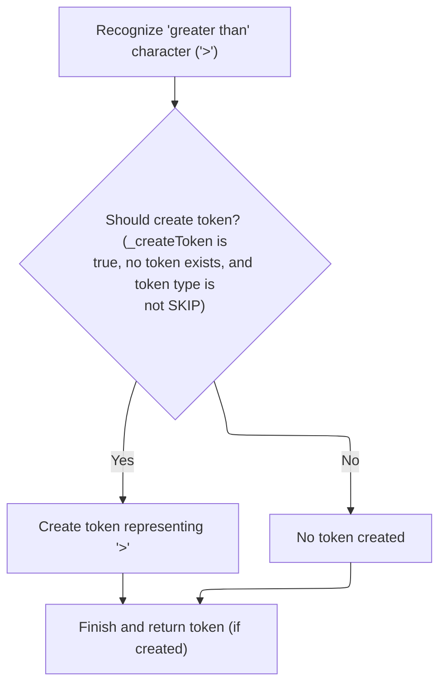
```mermaid
%%{init: {"flowchart": {"defaultRenderer": "elk"}} }%%
flowchart TD
  node1["Recognize 'greater than' character ('>')"]
  click node1 openCode "core/src/main/java/org/apache/struts/validator/validwhen/ValidWhenLexer.java:757:757"
  node1 --> node2{"Should create token? (_createToken is
true, no token exists, and token type is
not SKIP)"}
  click node2 openCode "core/src/main/java/org/apache/struts/validator/validwhen/ValidWhenLexer.java:758:761"
  node2 -->|"Yes"| node3["Create token representing '>'"]
  click node3 openCode "core/src/main/java/org/apache/struts/validator/validwhen/ValidWhenLexer.java:759:760"
  node2 -->|"No"| node4["No token created"]
  click node4 openCode "core/src/main/java/org/apache/struts/validator/validwhen/ValidWhenLexer.java:758:761"
  node3 --> node5["Finish and return token (if created)"]
  click node5 openCode "core/src/main/java/org/apache/struts/validator/validwhen/ValidWhenLexer.java:762:763"
  node4 --> node5
classDef HeadingStyle fill:#777777,stroke:#333,stroke-width:2px;

%% Swimm:
%% %%{init: {"flowchart": {"defaultRenderer": "elk"}} }%%
%% flowchart TD
%%   node1["Recognize 'greater than' character ('>')"]
%%   click node1 openCode "<SwmPath>[core/…/validwhen/ValidWhenLexer.java](core/src/main/java/org/apache/struts/validator/validwhen/ValidWhenLexer.java)</SwmPath>:757:757"
%%   node1 --> node2{"Should create token? (<SwmToken path="core/src/main/java/org/apache/struts/validator/validwhen/ValidWhenLexer.java" pos="250:11:11" line-data="	public final void mDECIMAL_LITERAL(boolean _createToken) throws RecognitionException, CharStreamException, TokenStreamException {">`_createToken`</SwmToken> is
%% true, no token exists, and token type is
%% not SKIP)"}
%%   click node2 openCode "<SwmPath>[core/…/validwhen/ValidWhenLexer.java](core/src/main/java/org/apache/struts/validator/validwhen/ValidWhenLexer.java)</SwmPath>:758:761"
%%   node2 -->|"Yes"| node3["Create token representing '>'"]
%%   click node3 openCode "<SwmPath>[core/…/validwhen/ValidWhenLexer.java](core/src/main/java/org/apache/struts/validator/validwhen/ValidWhenLexer.java)</SwmPath>:759:760"
%%   node2 -->|"No"| node4["No token created"]
%%   click node4 openCode "<SwmPath>[core/…/validwhen/ValidWhenLexer.java](core/src/main/java/org/apache/struts/validator/validwhen/ValidWhenLexer.java)</SwmPath>:758:761"
%%   node3 --> node5["Finish and return token (if created)"]
%%   click node5 openCode "<SwmPath>[core/…/validwhen/ValidWhenLexer.java](core/src/main/java/org/apache/struts/validator/validwhen/ValidWhenLexer.java)</SwmPath>:762:763"
%%   node4 --> node5
%% classDef HeadingStyle fill:#777777,stroke:#333,stroke-width:2px;
```

<SwmSnippet path="/core/src/main/java/org/apache/struts/validator/validwhen/ValidWhenLexer.java" line="752">

---

In <SwmToken path="core/src/main/java/org/apache/struts/validator/validwhen/ValidWhenLexer.java" pos="752:7:7" line-data="	public final void mGREATERTHANSIGN(boolean _createToken) throws RecognitionException, CharStreamException, TokenStreamException {">`mGREATERTHANSIGN`</SwmToken>, we match a single '>' and set up the token type. We call ActionConfigMatcher next to check for any config rules that might affect how this operator is processed.

```java
	public final void mGREATERTHANSIGN(boolean _createToken) throws RecognitionException, CharStreamException, TokenStreamException {
		int _ttype; Token _token=null; int _begin=text.length();
		_ttype = GREATERTHANSIGN;
		int _saveIndex;
		
		match('>');
```

---

</SwmSnippet>

<SwmSnippet path="/core/src/main/java/org/apache/struts/validator/validwhen/ValidWhenLexer.java" line="758">

---

After coming back from ActionConfigMatcher, <SwmToken path="core/src/main/java/org/apache/struts/validator/validwhen/ValidWhenLexer.java" pos="173:1:1" line-data="						mGREATERTHANSIGN(true);">`mGREATERTHANSIGN`</SwmToken> finalizes the token if needed and sets its text. This way, any config-driven changes are reflected in the token before it's returned to the lexer.

```java
		if ( _createToken && _token==null && _ttype!=Token.SKIP ) {
			_token = makeToken(_ttype);
			_token.setText(new String(text.getBuffer(), _begin, text.length()-_begin));
		}
		_returnToken = _token;
	}
```

---

</SwmSnippet>

### Returning the Final Token

<SwmSnippet path="/core/src/main/java/org/apache/struts/validator/validwhen/ValidWhenLexer.java" line="181">

---

After coming back from ValidWhenLexer.mGREATERTHANSIGN, <SwmToken path="core/src/main/java/org/apache/struts/validator/FieldChecks.java" pos="1414:11:11" line-data="                schemes[i++] = st.nextToken().trim();">`nextToken`</SwmToken> finalizes the token, checks for SKIP, updates the type, and returns it. The next step is to call CommandLinkComponent.getType, since the token type might affect how a JSF component resolves its properties.

```java
				if ( _returnToken==null ) continue tryAgain; // found SKIP token
				_ttype = _returnToken.getType();
				_ttype = testLiteralsTable(_ttype);
				_returnToken.setType(_ttype);
				return _returnToken;
			}
			catch (RecognitionException e) {
				throw new TokenStreamRecognitionException(e);
			}
		}
```

---

</SwmSnippet>

<SwmSnippet path="/faces/src/main/java/org/apache/struts/faces/component/CommandLinkComponent.java" line="434">

---

GetType() in <SwmToken path="faces/src/main/java/org/apache/struts/faces/component/CommandLinkComponent.java" pos="37:4:4" line-data="public class CommandLinkComponent extends UICommand {">`CommandLinkComponent`</SwmToken> first tries to resolve the 'type' property using JSF's <SwmToken path="faces/src/main/java/org/apache/struts/faces/component/CommandLinkComponent.java" pos="435:1:1" line-data="        ValueBinding vb = getValueBinding(&quot;type&quot;);">`ValueBinding`</SwmToken>. If a binding is present, it fetches the value dynamically; otherwise, it falls back to the local field. This lets the component support both static and dynamic property values, which is standard for JSF components.

```java
    public String getType() {
        ValueBinding vb = getValueBinding("type");
        if (vb != null) {
            return (String) vb.getValue(getFacesContext());
        } else {
            return type;
        }
    }
```

---

</SwmSnippet>

<SwmSnippet path="/core/src/main/java/org/apache/struts/validator/validwhen/ValidWhenLexer.java" line="191">

---

After coming back from CommandLinkComponent.getType, the end of ValidWhenLexer.nextToken wraps any parsing or IO exceptions and rethrows them as <SwmToken path="core/src/main/java/org/apache/struts/validator/validwhen/ValidWhenLexer.java" pos="48:4:4" line-data="import antlr.TokenStream;">`TokenStream`</SwmToken> exceptions. This lets the framework handle errors consistently and report them up the stack.

```java
		catch (CharStreamException cse) {
			if ( cse instanceof CharStreamIOException ) {
				throw new TokenStreamIOException(((CharStreamIOException)cse).io);
			}
			else {
				throw new TokenStreamException(cse.getMessage());
			}
		}
	}
}
```

---

</SwmSnippet>

## Final URL Validation and Error Handling

<SwmSnippet path="/core/src/main/java/org/apache/struts/validator/FieldChecks.java" line="1418">

---

After coming back from ValidWhenLexer.nextToken, FieldChecks.validateUrl creates a <SwmToken path="core/src/main/java/org/apache/struts/validator/FieldChecks.java" pos="1418:5:5" line-data="        // Create UrlValidator and validate with options/schemes">`UrlValidator`</SwmToken> with the configured options and schemes, validates the URL, and if it fails, adds a localized error message using <SwmToken path="core/src/main/java/org/apache/struts/validator/FieldChecks.java" pos="1425:1:3" line-data="                Resources.getActionMessage(validator, request, va, field));">`Resources.getActionMessage`</SwmToken>. This is where the user actually gets feedback if their input doesn't match the expected URL format.

```java
        // Create UrlValidator and validate with options/schemes
        UrlValidator urlValidator = new UrlValidator(schemes, options);

        if (urlValidator.isValid(value)) {
            return true;
        } else {
            errors.add(field.getKey(),
                Resources.getActionMessage(validator, request, va, field));

            return false;
        }
    }
```

---

</SwmSnippet>

&nbsp;

*This is an auto-generated document by Swimm 🌊 and has not yet been verified by a human*

<SwmMeta version="3.0.0" repo-id="Z2l0aHViJTNBJTNBc3RydXRzMSUzQSUzQVN3aW1tLURlbW8=" repo-name="struts1"><sup>Powered by [Swimm](https://app.swimm.io/)</sup></SwmMeta>
