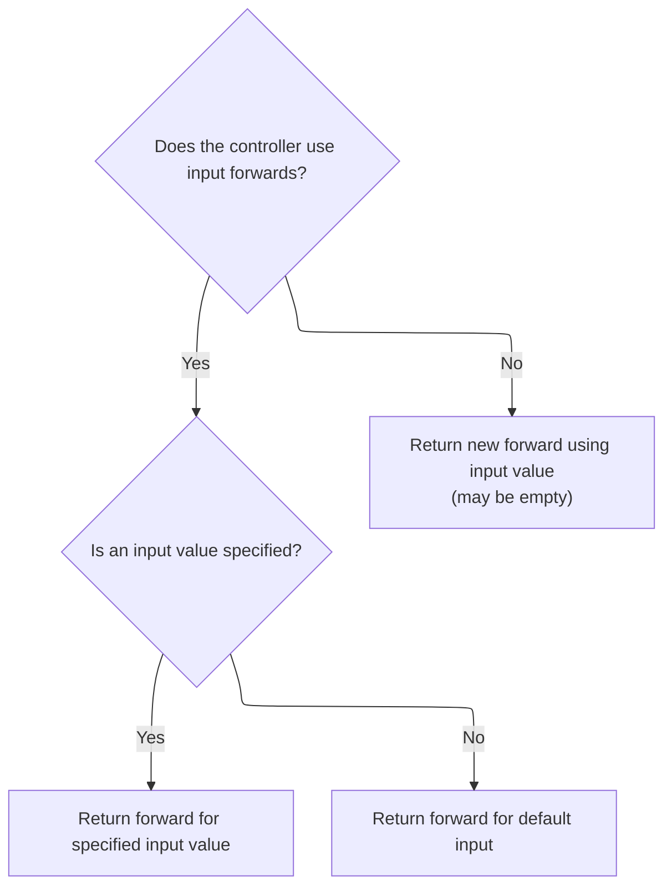
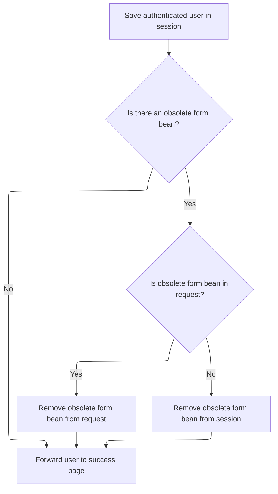

This document outlines the user authentication flow, from receiving login credentials to determining whether the user is granted access or prompted to try again. The process includes verifying credentials, managing session data, and forwarding the user to the appropriate page based on the outcome.

# Authenticating the User

<SwmSnippet path="/apps/faces-example1/src/main/java/org/apache/struts/webapp/example/LogonAction.java" line="79">

---

In <SwmToken path="apps/faces-example1/src/main/java/org/apache/struts/webapp/example/LogonAction.java" pos="79:5:5" line-data="    public ActionForward execute(ActionMapping mapping,">`execute`</SwmToken>, we grab the username and password from the form using <SwmToken path="apps/faces-example1/src/main/java/org/apache/struts/webapp/example/LogonAction.java" pos="91:1:1" line-data="            PropertyUtils.getSimpleProperty(form, &quot;username&quot;);">`PropertyUtils`</SwmToken>, assuming those properties exist. Then, we pull the <SwmToken path="apps/faces-example1/src/main/java/org/apache/struts/webapp/example/LogonAction.java" pos="94:1:1" line-data="    UserDatabase database = (UserDatabase)">`UserDatabase`</SwmToken> from the servlet context and prep for authentication. We need to call <SwmToken path="apps/faces-example1/src/main/java/org/apache/struts/webapp/example/LogonAction.java" pos="100:5:5" line-data="        user = getUser(database, username);">`getUser`</SwmToken> next to actually look up the user and handle any special cases (like forced exceptions for certain usernames) before checking the password.

```java
    public ActionForward execute(ActionMapping mapping,
                 ActionForm form,
                 HttpServletRequest request,
                 HttpServletResponse response)
    throws Exception {

    // Extract attributes we will need
    User user = null;

    // Validate the request parameters specified by the user
    ActionMessages errors = new ActionMessages();
    String username = (String)
            PropertyUtils.getSimpleProperty(form, "username");
        String password = (String)
            PropertyUtils.getSimpleProperty(form, "password");
    UserDatabase database = (UserDatabase)
      servlet.getServletContext().getAttribute(Constants.DATABASE_KEY);
    if (database == null)
            errors.add(ActionMessages.GLOBAL_MESSAGE,
                       new ActionMessage("error.database.missing"));
    else {
        user = getUser(database, username);
        if ((user != null) && !user.getPassword().equals(password))
        user = null;
        if (user == null)
                errors.add(ActionMessages.GLOBAL_MESSAGE,
                           new ActionMessage("error.password.mismatch"));
    }

```

---

</SwmSnippet>

<SwmSnippet path="/apps/faces-example1/src/main/java/org/apache/struts/webapp/example/LogonAction.java" line="148">

---

<SwmToken path="apps/faces-example1/src/main/java/org/apache/struts/webapp/example/LogonAction.java" pos="148:5:5" line-data="    public User getUser(UserDatabase database, String username)">`getUser`</SwmToken> checks for the special usernames 'arithmetic' and 'expired' to throw exceptions, otherwise it just fetches the user from the database. This means certain usernames are reserved for triggering specific behaviors in the login flow.

```java
    public User getUser(UserDatabase database, String username)
        throws ModuleException {

        // Force an ArithmeticException which can be handled explicitly
        if ("arithmetic".equals(username)) {
            throw new ArithmeticException();
        }

        // Force an application-specific exception which can be handled
        if ("expired".equals(username)) {
            throw new ExpiredPasswordException(username);
        }

        // Look up and return the specified user
        return (database.findUser(username));

    }
```

---

</SwmSnippet>

<SwmSnippet path="/apps/faces-example1/src/main/java/org/apache/struts/webapp/example/LogonAction.java" line="108">

---

Back in `LogonAction.execute`, after <SwmToken path="apps/faces-example1/src/main/java/org/apache/struts/webapp/example/LogonAction.java" pos="100:5:5" line-data="        user = getUser(database, username);">`getUser`</SwmToken> returns, we check for errors and, if any exist, save them and return <SwmToken path="apps/faces-example1/src/main/java/org/apache/struts/webapp/example/LogonAction.java" pos="111:4:8" line-data="            return (mapping.getInputForward());">`mapping.getInputForward()`</SwmToken>. This hands off control to the framework to decide which page to show next, based on configuration.

```java
    // Report any errors we have discovered back to the original form
    if (!errors.isEmpty()) {
        saveErrors(request, errors);
            return (mapping.getInputForward());
    }

```

---

</SwmSnippet>

## Resolving the Input Forward



<SwmSnippet path="/core/src/main/java/org/apache/struts/action/ActionMapping.java" line="139">

---

<SwmToken path="core/src/main/java/org/apache/struts/action/ActionMapping.java" pos="139:5:5" line-data="    public ActionForward getInputForward() {">`getInputForward`</SwmToken> figures out which page to send the user to by checking the module config. Depending on the inputForward flag, it either looks up a named forward or creates a new one with the input path. This keeps the logic flexible and config-driven.

```java
    public ActionForward getInputForward() {
        String input = getInput();
        if (getModuleConfig().getControllerConfig().getInputForward()) {
            if (input != null) {
                return findForward(input);
            }
            return findForward(Action.INPUT);
        }
        return (new ActionForward(input));
    }
```

---

</SwmSnippet>

<SwmSnippet path="/core/src/main/java/org/apache/struts/action/ActionMapping.java" line="70">

---

<SwmToken path="core/src/main/java/org/apache/struts/action/ActionMapping.java" pos="70:5:5" line-data="    public ActionForward findForward(String forwardName) {">`findForward`</SwmToken> tries to resolve the forward name first from the local config, then falls back to the module config. If nothing is found, it logs a warning and returns null. The result is always cast to <SwmToken path="core/src/main/java/org/apache/struts/action/ActionMapping.java" pos="70:3:3" line-data="    public ActionForward findForward(String forwardName) {">`ActionForward`</SwmToken>, assuming the configs are set up right.

```java
    public ActionForward findForward(String forwardName) {
        ForwardConfig config = findForwardConfig(forwardName);

        if (config == null) {
            config = getModuleConfig().findForwardConfig(forwardName);
        }

        // TODO: remove warning since findRequiredForward takes care of use case? 
        if (config == null) {
            if (log.isWarnEnabled()) {
                log.warn("Unable to find '" + forwardName + "' forward.");
            }
        }

        return ((ActionForward) config);
    }
```

---

</SwmSnippet>

## Completing the Login and Forwarding



<SwmSnippet path="/apps/faces-example1/src/main/java/org/apache/struts/webapp/example/LogonAction.java" line="114">

---

Finally, back in `LogonAction.execute`, after returning from <SwmToken path="apps/faces-example1/src/main/java/org/apache/struts/webapp/example/LogonAction.java" pos="79:7:7" line-data="    public ActionForward execute(ActionMapping mapping,">`ActionMapping`</SwmToken>, we save the user in the session, clean up the form bean if needed, and forward to the configured success page using <SwmToken path="apps/faces-example1/src/main/java/org/apache/struts/webapp/example/LogonAction.java" pos="131:4:6" line-data="    return (mapping.findForward(&quot;success&quot;));">`mapping.findForward`</SwmToken>("success").

```java
    // Save our logged-in user in the session
    HttpSession session = request.getSession();
    session.setAttribute(Constants.USER_KEY, user);
        if (log.isDebugEnabled()) {
            log.debug("LogonAction: User '" + user.getUsername() +
                      "' logged on in session " + session.getId());
        }

        // Remove the obsolete form bean
    if (mapping.getAttribute() != null) {
            if ("request".equals(mapping.getScope()))
                request.removeAttribute(mapping.getAttribute());
            else
                session.removeAttribute(mapping.getAttribute());
        }

    // Forward control to the specified success URI
    return (mapping.findForward("success"));

    }
```

---

</SwmSnippet>

&nbsp;

*This is an auto-generated document by Swimm 🌊 and has not yet been verified by a human*

<SwmMeta version="3.0.0" repo-id="Z2l0aHViJTNBJTNBc3RydXRzMSUzQSUzQVN3aW1tLURlbW8=" repo-name="struts1"><sup>Powered by [Swimm](https://app.swimm.io/)</sup></SwmMeta>
