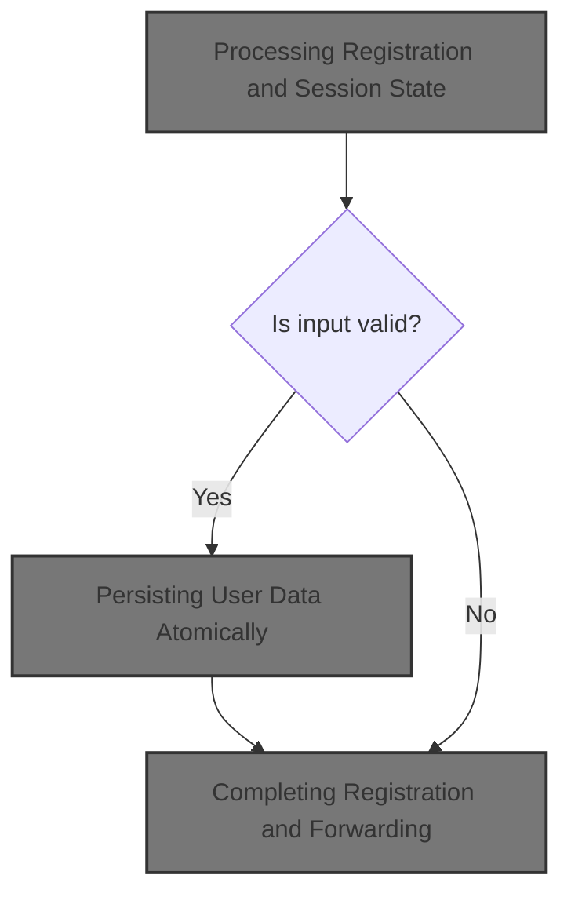
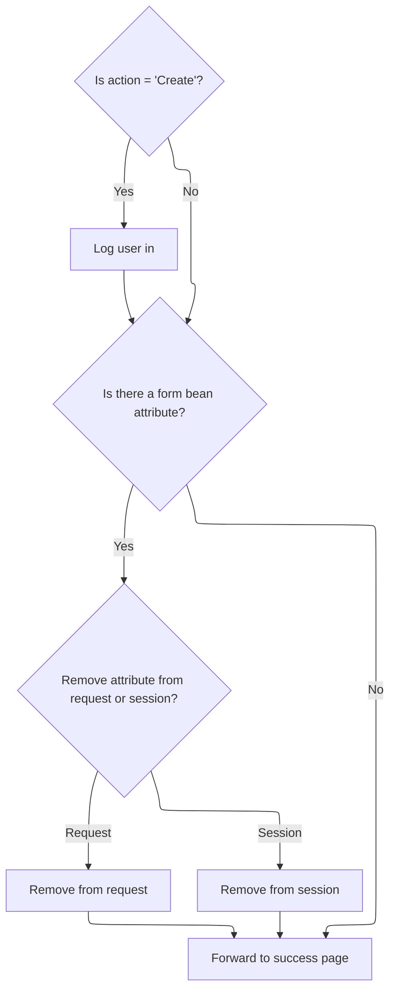

This document describes how user registration and profile updates are handled. User input is validated, profile data is saved atomically to maintain consistency, and the session is updated before forwarding the user to the next page.



# Processing Registration and Session State

<SwmSnippet path="/apps/faces-example2/src/main/java/org/apache/struts/webapp/example2/SaveRegistrationAction.java" line="82">

---

In `SaveRegistrationAction.execute`, we start by grabbing session and form data, checking the action type, and validating the transactional token and form fields. If validation fails, errors are saved and we return early. Otherwise, we prep for user creation or update. We need to call <SwmToken path="mailreader-dao/src/main/java/org/apache/struts/apps/mailreader/dao/impl/memory/MemoryUserDatabase.java" pos="51:4:4" line-data="public class MemoryUserDatabase implements UserDatabase {">`MemoryUserDatabase`</SwmToken> next to persist any changes to the user profile, since that's where the user data actually gets stored.

```java
    public ActionForward execute(ActionMapping mapping,
                 ActionForm form,
                 HttpServletRequest request,
                 HttpServletResponse response)
    throws Exception {

    // Extract attributes and parameters we will need
    HttpSession session = request.getSession();
    RegistrationForm regform = (RegistrationForm) form;
    String action = regform.getAction();
    if (action == null) {
        action = "Create";
        }
        UserDatabase database = (UserDatabase)
      servlet.getServletContext().getAttribute(Constants.DATABASE_KEY);
        if (log.isDebugEnabled()) {
            log.debug("SaveRegistrationAction:  Processing " + action +
                      " action");
        }

    // Is there a currently logged on user (unless creating)?
    User user = (User) session.getAttribute(Constants.USER_KEY);
    if (!"Create".equals(action) && (user == null)) {
            if (log.isTraceEnabled()) {
                log.trace(" User is not logged on in session "
                          + session.getId());
            }
        return (mapping.findForward("logon"));
        }

    // Was this transaction cancelled?
    if (isCancelled(request)) {
            if (log.isTraceEnabled()) {
                log.trace(" Transaction '" + action +
                          "' was cancelled");
            }
        session.removeAttribute(Constants.SUBSCRIPTION_KEY);
        return (mapping.findForward("failure"));
    }

        // Validate the transactional control token
    ActionErrors errors = new ActionErrors();
        if (log.isTraceEnabled()) {
            log.trace(" Checking transactional control token");
        }
        if (!isTokenValid(request)) {
            errors.add(ActionErrors.GLOBAL_MESSAGE,
                       new ActionMessage("error.transaction.token"));
        }
        resetToken(request);

    // Validate the request parameters specified by the user
        if (log.isTraceEnabled()) {
            log.trace(" Performing extra validations");
        }
    String value = null;
    value = regform.getUsername();
    if (("Create".equals(action)) &&
            (database.findUser(value) != null)) {
            errors.add("username",
                       new ActionMessage("error.username.unique",
                                       regform.getUsername()));
        }
    if ("Create".equals(action)) {
        value = regform.getPassword();
        if ((value == null) || (value.length() <1)) {
                errors.add("password",
                           new ActionMessage("error.password.required"));
            }
        value = regform.getPassword2();
        if ((value == null) || (value.length() < 1)) {
                errors.add("password2",
                           new ActionMessage("error.password2.required"));
            }
    }

    // Report any errors we have discovered back to the original form
    if (!errors.isEmpty()) {
        saveErrors(request, errors);
            saveToken(request);
            return (mapping.getInputForward());
    }

    // Update the user's persistent profile information
        try {
            if ("Create".equals(action)) {
                user = database.createUser(regform.getUsername());
            }
            String oldPassword = user.getPassword();
            PropertyUtils.copyProperties(user, regform);
            if ((regform.getPassword() == null) ||
                (regform.getPassword().length() < 1)) {
                user.setPassword(oldPassword);
            }
        } catch (InvocationTargetException e) {
            Throwable t = e.getTargetException();
            if (t == null) {
                t = e;
            }
            log.error("Registration.populate", t);
            throw new ServletException("Registration.populate", t);
        } catch (Throwable t) {
            log.error("Registration.populate", t);
            throw new ServletException("Subscription.populate", t);
        }

        try {
            database.save();
        } catch (Exception e) {
            log.error("Database save", e);
        }

```

---

</SwmSnippet>

## Persisting User Data Atomically

<SwmSnippet path="/mailreader-dao/src/main/java/org/apache/struts/apps/mailreader/dao/impl/memory/MemoryUserDatabase.java" line="225">

---

In `MemoryUserDatabase.save`, we start by writing out the XML prolog and <SwmToken path="mailreader-dao/src/main/java/org/apache/struts/apps/mailreader/dao/impl/memory/MemoryUserDatabase.java" pos="175:5:7" line-data="                (&quot;database/user/subscription&quot;,">`user/subscription`</SwmToken> data to a temp file, using <SwmToken path="apps/faces-example1/src/main/java/org/apache/struts/webapp/example/RegistrationBacking.java" pos="117:8:10" line-data="        forward(context, url.toString());">`toString()`</SwmToken> for XML formatting. This sets up the atomic write so we don't mess up the main file if something fails.

```java
    public void save() throws Exception {

        if (log.isDebugEnabled()) {
            log.debug("Saving database to '" + pathname + "'");
        }
        File fileNew = new File(pathnameNew);
        PrintWriter writer = null;

        try {

            // Configure our PrintWriter
            FileOutputStream fos = new FileOutputStream(fileNew);
            OutputStreamWriter osw = new OutputStreamWriter(fos);
            writer = new PrintWriter(osw);

            // Print the file prolog
            writer.println("<?xml version='1.0'?>");
            writer.println("<database>");

            // Print entries for each defined user and associated subscriptions
            User yusers[] = findUsers();
            for (int i = 0; i < yusers.length; i++) {
                writer.print("  ");
                writer.println(yusers[i]);
                Subscription subscriptions[] =
                    yusers[i].getSubscriptions();
                for (int j = 0; j < subscriptions.length; j++) {
                    writer.print("    ");
                    writer.println(subscriptions[j]);
                    writer.print("    ");
                    writer.println("</subscription>");
                }
                writer.print("  ");
                writer.println("</user>");
            }
```

---

</SwmSnippet>

<SwmSnippet path="/mailreader-dao/src/main/java/org/apache/struts/apps/mailreader/dao/impl/memory/MemoryUserDatabase.java" line="261">

---

Here we finish writing the XML epilog and check for print errors. If there's a problem, we clean up the temp file and throw an exception. We need to call <SwmToken path="mailreader-dao/src/main/java/org/apache/struts/apps/mailreader/dao/impl/memory/MemoryUserDatabase.java" pos="51:4:4" line-data="public class MemoryUserDatabase implements UserDatabase {">`MemoryUserDatabase`</SwmToken> again to handle file closure and cleanup, making sure the write is complete and consistent.

```java
            // Print the file epilog
            writer.println("</database>");

            // Check for errors that occurred while printing
            if (writer.checkError()) {
                writer.close();
```

---

</SwmSnippet>

### Finalizing Database Write

<SwmSnippet path="/mailreader-dao/src/main/java/org/apache/struts/apps/mailreader/dao/impl/memory/MemoryUserDatabase.java" line="102">

---

In <SwmToken path="mailreader-dao/src/main/java/org/apache/struts/apps/mailreader/dao/impl/memory/MemoryUserDatabase.java" pos="102:5:5" line-data="    public void close() throws Exception {">`close`</SwmToken>, we trigger another save to make sure any pending changes are written out. We need to call <SwmToken path="mailreader-dao/src/main/java/org/apache/struts/apps/mailreader/dao/impl/memory/MemoryUserDatabase.java" pos="51:4:4" line-data="public class MemoryUserDatabase implements UserDatabase {">`MemoryUserDatabase`</SwmToken> again to update the open state and wrap up the file operation cleanly.

```java
    public void close() throws Exception {

        save();
```

---

</SwmSnippet>

<SwmSnippet path="/mailreader-dao/src/main/java/org/apache/struts/apps/mailreader/dao/impl/memory/MemoryUserDatabase.java" line="105">

---

We just came back from `MemoryUserDatabase.close`, so now we mark the database as closed. This signals that no more writes are expected and the file is safe.

```java
        this.open = false;

    }
```

---

</SwmSnippet>

### Error Handling After Save

```mermaid
%%{init: {"flowchart": {"defaultRenderer": "elk"}} }%%
flowchart TD
    node1["Begin saving user database"] --> node2{"Was database written to temporary file successfully?"}
    click node1 openCode "mailreader-dao/src/main/java/org/apache/struts/apps/mailreader/dao/impl/memory/MemoryUserDatabase.java:267:304"
    node2 -->|"No"| node3["Delete temporary file and abort save"]
    click node2 openCode "mailreader-dao/src/main/java/org/apache/struts/apps/mailreader/dao/impl/memory/MemoryUserDatabase.java:267:270"
    click node3 openCode "mailreader-dao/src/main/java/org/apache/struts/apps/mailreader/dao/impl/memory/MemoryUserDatabase.java:267:270"
    node2 -->|"Yes"| node4{"Does main database file exist?"}
    click node4 openCode "mailreader-dao/src/main/java/org/apache/struts/apps/mailreader/dao/impl/memory/MemoryUserDatabase.java:286:294"
    node4 -->|"Yes"| node5["Delete backup file and rename main database to backup"]
    click node5 openCode "mailreader-dao/src/main/java/org/apache/struts/apps/mailreader/dao/impl/memory/MemoryUserDatabase.java:289:293"
    node4 -->|"No"| node6["Skip backup rename"]
    click node6 openCode "mailreader-dao/src/main/java/org/apache/struts/apps/mailreader/dao/impl/memory/MemoryUserDatabase.java:294:295"
    node5 --> node7{"Can temporary file be renamed to main database file?"}
    node6 --> node7
    click node7 openCode "mailreader-dao/src/main/java/org/apache/struts/apps/mailreader/dao/impl/memory/MemoryUserDatabase.java:295:301"
    node7 -->|"Yes"| node8["Delete backup file and finish save"]
    click node8 openCode "mailreader-dao/src/main/java/org/apache/struts/apps/mailreader/dao/impl/memory/MemoryUserDatabase.java:302:304"
    node7 -->|"No"| node9{"Does backup file exist?"}
    click node9 openCode "mailreader-dao/src/main/java/org/apache/struts/apps/mailreader/dao/impl/memory/MemoryUserDatabase.java:296:298"
    node9 -->|"Yes"| node10["Restore backup as main database file"]
    click node10 openCode "mailreader-dao/src/main/java/org/apache/struts/apps/mailreader/dao/impl/memory/MemoryUserDatabase.java:297:298"
    node9 -->|"No"| node11["Abort and report failure"]
    click node11 openCode "mailreader-dao/src/main/java/org/apache/struts/apps/mailreader/dao/impl/memory/MemoryUserDatabase.java:299:301"
    node10 --> node11
    node8 --> node12["Save operation complete"]
    click node12 openCode "mailreader-dao/src/main/java/org/apache/struts/apps/mailreader/dao/impl/memory/MemoryUserDatabase.java:304:304"
classDef HeadingStyle fill:#777777,stroke:#333,stroke-width:2px;

%% Swimm:
%% %%{init: {"flowchart": {"defaultRenderer": "elk"}} }%%
%% flowchart TD
%%     node1["Begin saving user database"] --> node2{"Was database written to temporary file successfully?"}
%%     click node1 openCode "<SwmPath>[mailreader-dao/…/memory/MemoryUserDatabase.java](mailreader-dao/src/main/java/org/apache/struts/apps/mailreader/dao/impl/memory/MemoryUserDatabase.java)</SwmPath>:267:304"
%%     node2 -->|"No"| node3["Delete temporary file and abort save"]
%%     click node2 openCode "<SwmPath>[mailreader-dao/…/memory/MemoryUserDatabase.java](mailreader-dao/src/main/java/org/apache/struts/apps/mailreader/dao/impl/memory/MemoryUserDatabase.java)</SwmPath>:267:270"
%%     click node3 openCode "<SwmPath>[mailreader-dao/…/memory/MemoryUserDatabase.java](mailreader-dao/src/main/java/org/apache/struts/apps/mailreader/dao/impl/memory/MemoryUserDatabase.java)</SwmPath>:267:270"
%%     node2 -->|"Yes"| node4{"Does main database file exist?"}
%%     click node4 openCode "<SwmPath>[mailreader-dao/…/memory/MemoryUserDatabase.java](mailreader-dao/src/main/java/org/apache/struts/apps/mailreader/dao/impl/memory/MemoryUserDatabase.java)</SwmPath>:286:294"
%%     node4 -->|"Yes"| node5["Delete backup file and rename main database to backup"]
%%     click node5 openCode "<SwmPath>[mailreader-dao/…/memory/MemoryUserDatabase.java](mailreader-dao/src/main/java/org/apache/struts/apps/mailreader/dao/impl/memory/MemoryUserDatabase.java)</SwmPath>:289:293"
%%     node4 -->|"No"| node6["Skip backup rename"]
%%     click node6 openCode "<SwmPath>[mailreader-dao/…/memory/MemoryUserDatabase.java](mailreader-dao/src/main/java/org/apache/struts/apps/mailreader/dao/impl/memory/MemoryUserDatabase.java)</SwmPath>:294:295"
%%     node5 --> node7{"Can temporary file be renamed to main database file?"}
%%     node6 --> node7
%%     click node7 openCode "<SwmPath>[mailreader-dao/…/memory/MemoryUserDatabase.java](mailreader-dao/src/main/java/org/apache/struts/apps/mailreader/dao/impl/memory/MemoryUserDatabase.java)</SwmPath>:295:301"
%%     node7 -->|"Yes"| node8["Delete backup file and finish save"]
%%     click node8 openCode "<SwmPath>[mailreader-dao/…/memory/MemoryUserDatabase.java](mailreader-dao/src/main/java/org/apache/struts/apps/mailreader/dao/impl/memory/MemoryUserDatabase.java)</SwmPath>:302:304"
%%     node7 -->|"No"| node9{"Does backup file exist?"}
%%     click node9 openCode "<SwmPath>[mailreader-dao/…/memory/MemoryUserDatabase.java](mailreader-dao/src/main/java/org/apache/struts/apps/mailreader/dao/impl/memory/MemoryUserDatabase.java)</SwmPath>:296:298"
%%     node9 -->|"Yes"| node10["Restore backup as main database file"]
%%     click node10 openCode "<SwmPath>[mailreader-dao/…/memory/MemoryUserDatabase.java](mailreader-dao/src/main/java/org/apache/struts/apps/mailreader/dao/impl/memory/MemoryUserDatabase.java)</SwmPath>:297:298"
%%     node9 -->|"No"| node11["Abort and report failure"]
%%     click node11 openCode "<SwmPath>[mailreader-dao/…/memory/MemoryUserDatabase.java](mailreader-dao/src/main/java/org/apache/struts/apps/mailreader/dao/impl/memory/MemoryUserDatabase.java)</SwmPath>:299:301"
%%     node10 --> node11
%%     node8 --> node12["Save operation complete"]
%%     click node12 openCode "<SwmPath>[mailreader-dao/…/memory/MemoryUserDatabase.java](mailreader-dao/src/main/java/org/apache/struts/apps/mailreader/dao/impl/memory/MemoryUserDatabase.java)</SwmPath>:304:304"
%% classDef HeadingStyle fill:#777777,stroke:#333,stroke-width:2px;
```



<SwmSnippet path="/mailreader-dao/src/main/java/org/apache/struts/apps/mailreader/dao/impl/memory/MemoryUserDatabase.java" line="267">

---

After returning from `MemoryUserDatabase.save`, if there's an error, we clean up the temp file and throw an exception. Next, we need to call <SwmToken path="apps/faces-example1/src/main/java/org/apache/struts/webapp/example/RegistrationBacking.java" pos="36:4:4" line-data="public class RegistrationBacking extends AbstractBacking {">`RegistrationBacking`</SwmToken> to handle any UI or navigation logic tied to the result of this operation.

```java
                fileNew.delete();
                throw new IOException
                    ("Saving database to '" + pathname + "'");
            }
```

---

</SwmSnippet>

<SwmSnippet path="/apps/faces-example1/src/main/java/org/apache/struts/webapp/example/RegistrationBacking.java" line="101">

---

<SwmToken path="apps/faces-example1/src/main/java/org/apache/struts/webapp/example/RegistrationBacking.java" pos="101:5:5" line-data="    public String delete() {">`delete`</SwmToken> builds a URL for deleting a subscription, grabs user and subscription info from session/request, appends them as query params, and forwards the request. Returning null means JSF doesn't change the navigation.

```java
    public String delete() {

        if (log.isDebugEnabled()) {
            log.debug("delete()");
        }
        FacesContext context = FacesContext.getCurrentInstance();
        StringBuffer url = subscription(context);
        url.append("?action=Delete");
        url.append("&username=");
        User user = (User)
            context.getExternalContext().getSessionMap().get("user");
        url.append(user.getUsername());
        url.append("&host=");
        Subscription subscription = (Subscription)
            context.getExternalContext().getRequestMap().get("subscription");
        url.append(subscription.getHost());
        forward(context, url.toString());
        return (null);

    }
```

---

</SwmSnippet>

<SwmSnippet path="/mailreader-dao/src/main/java/org/apache/struts/apps/mailreader/dao/impl/memory/MemoryUserDatabase.java" line="271">

---

After returning from `RegistrationBacking.delete`, we handle file closure and cleanup in `MemoryUserDatabase.save`, making sure resources are released and errors are handled. This keeps the database consistent after UI actions.

```java
            writer.close();
            writer = null;

        } catch (IOException e) {

            if (writer != null) {
                writer.close();
            }
```

---

</SwmSnippet>

<SwmSnippet path="/mailreader-dao/src/main/java/org/apache/struts/apps/mailreader/dao/impl/memory/MemoryUserDatabase.java" line="279">

---

After returning from `MemoryUserDatabase.save`, we finish up by renaming files to make the write atomic. If anything fails, we try to restore from backup. Next, <SwmToken path="apps/faces-example1/src/main/java/org/apache/struts/webapp/example/RegistrationBacking.java" pos="36:4:4" line-data="public class RegistrationBacking extends AbstractBacking {">`RegistrationBacking`</SwmToken> can react to the result, like updating UI or triggering further actions.

```java
            fileNew.delete();
            throw e;

        }


        // Perform the required renames to permanently save this file
        File fileOrig = new File(pathname);
        File fileOld = new File(pathnameOld);
        if (fileOrig.exists()) {
            fileOld.delete();
            if (!fileOrig.renameTo(fileOld)) {
                throw new IOException
                    ("Renaming '" + pathname + "' to '" + pathnameOld + "'");
            }
        }
        if (!fileNew.renameTo(fileOrig)) {
            if (fileOld.exists()) {
                fileOld.renameTo(fileOrig);
            }
            throw new IOException
                ("Renaming '" + pathnameNew + "' to '" + pathname + "'");
        }
        fileOld.delete();

    }
```

---

</SwmSnippet>

## Completing Registration and Forwarding



<SwmSnippet path="/apps/faces-example2/src/main/java/org/apache/struts/webapp/example2/SaveRegistrationAction.java" line="194">

---

After coming back from `MemoryUserDatabase.save`, `SaveRegistrationAction.execute` logs the user in if needed, cleans up the form bean, and forwards to the success page. The session now reflects the updated user state.

```java
        // Log the user in if appropriate
    if ("Create".equals(action)) {
        session.setAttribute(Constants.USER_KEY, user);
            if (log.isTraceEnabled()) {
                log.trace(" User '" + user.getUsername() +
                          "' logged on in session " + session.getId());
            }
    }

    // Remove the obsolete form bean
    if (mapping.getAttribute() != null) {
            if ("request".equals(mapping.getScope()))
                request.removeAttribute(mapping.getAttribute());
            else
                session.removeAttribute(mapping.getAttribute());
        }

    // Forward control to the specified success URI
        if (log.isTraceEnabled()) {
            log.trace(" Forwarding to success page");
        }
    return (mapping.findForward("success"));

    }
```

---

</SwmSnippet>

&nbsp;

*This is an auto-generated document by Swimm 🌊 and has not yet been verified by a human*

<SwmMeta version="3.0.0" repo-id="Z2l0aHViJTNBJTNBc3RydXRzMSUzQSUzQVN3aW1tLURlbW8=" repo-name="struts1"><sup>Powered by [Swimm](https://app.swimm.io/)</sup></SwmMeta>
