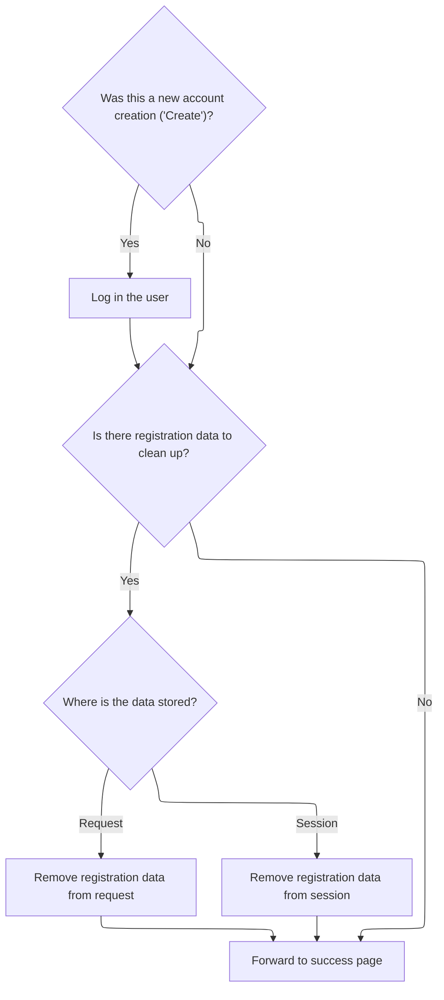

This document describes how users can register new accounts or update their profiles. After a user submits the registration or profile update form, the input is validated, the user account is created or updated, and the changes are saved to persistent storage. For new registrations, the user is logged in and temporary data is cleaned up.

# Handling Registration and Profile Updates

<SwmSnippet path="/apps/faces-example1/src/main/java/org/apache/struts/webapp/example/SaveRegistrationAction.java" line="84">

---

In `SaveRegistrationAction.execute`, we start by grabbing the session, casting the form to <SwmToken path="apps/faces-example1/src/main/java/org/apache/struts/webapp/example/SaveRegistrationAction.java" pos="92:1:1" line-data="    RegistrationForm regform = (RegistrationForm) form;">`RegistrationForm`</SwmToken> (assuming the config is correct), and figuring out what action the user is taking—defaulting to 'Create' if not set. It checks if the user is logged in for non-create actions, handles cancellation, validates the transaction token to prevent double submits, and does field validation (like unique username for 'Create'). If there are errors, it bails out early. Otherwise, it either creates or updates the user and then needs to persist the changes, which is why the next step is calling the <SwmToken path="mailreader-dao/src/main/java/org/apache/struts/apps/mailreader/dao/impl/memory/MemoryUserDatabase.java" pos="51:4:4" line-data="public class MemoryUserDatabase implements UserDatabase {">`MemoryUserDatabase`</SwmToken> implementation to actually save the user data.

```java
    public ActionForward execute(ActionMapping mapping,
                 ActionForm form,
                 HttpServletRequest request,
                 HttpServletResponse response)
    throws Exception {

    // Extract attributes and parameters we will need
    HttpSession session = request.getSession();
    RegistrationForm regform = (RegistrationForm) form;
    String action = regform.getAction();
    if (action == null) {
        action = "Create";
        }
        UserDatabase database = (UserDatabase)
      servlet.getServletContext().getAttribute(Constants.DATABASE_KEY);
        if (log.isDebugEnabled()) {
            log.debug("SaveRegistrationAction:  Processing " + action +
                      " action");
        }

    // Is there a currently logged on user (unless creating)?
    User user = (User) session.getAttribute(Constants.USER_KEY);
    if (!"Create".equals(action) && (user == null)) {
            if (log.isTraceEnabled()) {
                log.trace(" User is not logged on in session "
                          + session.getId());
            }
        return (mapping.findForward("logon"));
        }

    // Was this transaction cancelled?
    if (isCancelled(request)) {
            if (log.isTraceEnabled()) {
                log.trace(" Transaction '" + action +
                          "' was cancelled");
            }
        session.removeAttribute(Constants.SUBSCRIPTION_KEY);
        return (mapping.findForward("failure"));
    }

        // Validate the transactional control token
    ActionMessages errors = new ActionMessages();
        if (log.isTraceEnabled()) {
            log.trace(" Checking transactional control token");
        }
        if (!isTokenValid(request)) {
            errors.add(ActionMessages.GLOBAL_MESSAGE,
                       new ActionMessage("error.transaction.token"));
        }
        resetToken(request);

    // Validate the request parameters specified by the user
        if (log.isTraceEnabled()) {
            log.trace(" Performing extra validations");
        }
    String value = null;
    value = regform.getUsername();
    if (("Create".equals(action)) &&
            (database.findUser(value) != null)) {
            errors.add("username",
                       new ActionMessage("error.username.unique",
                                       regform.getUsername()));
        }
    if ("Create".equals(action)) {
        value = regform.getPassword();
        if ((value == null) || (value.length() <1)) {
                errors.add("password",
                           new ActionMessage("error.password.required"));
            }
        value = regform.getPassword2();
        if ((value == null) || (value.length() < 1)) {
                errors.add("password2",
                           new ActionMessage("error.password2.required"));
            }
    }

    // Report any errors we have discovered back to the original form
    if (!errors.isEmpty()) {
        saveErrors(request, errors);
            saveToken(request);
            return (mapping.getInputForward());
    }

    // Update the user's persistent profile information
        try {
            if ("Create".equals(action)) {
                user = database.createUser(regform.getUsername());
            }
            String oldPassword = user.getPassword();
            PropertyUtils.copyProperties(user, regform);
            if ((regform.getPassword() == null) ||
                (regform.getPassword().length() < 1)) {
                user.setPassword(oldPassword);
            }
        } catch (InvocationTargetException e) {
            Throwable t = e.getTargetException();
            if (t == null) {
                t = e;
            }
            log.error("Registration.populate", t);
            throw new ServletException("Registration.populate", t);
        } catch (Throwable t) {
            log.error("Registration.populate", t);
            throw new ServletException("Subscription.populate", t);
        }

        try {
            database.save();
        } catch (Exception e) {
            log.error("Database save", e);
        }

```

---

</SwmSnippet>

## Persisting User Data to Disk

<SwmSnippet path="/mailreader-dao/src/main/java/org/apache/struts/apps/mailreader/dao/impl/memory/MemoryUserDatabase.java" line="225">

---

In `MemoryUserDatabase.save`, we start the process of writing the entire user database (including all users and their subscriptions) to a new XML file. This ensures that the saved data is always a full snapshot, not just a diff or partial update.

```java
    public void save() throws Exception {

        if (log.isDebugEnabled()) {
            log.debug("Saving database to '" + pathname + "'");
        }
        File fileNew = new File(pathnameNew);
        PrintWriter writer = null;

        try {

            // Configure our PrintWriter
            FileOutputStream fos = new FileOutputStream(fileNew);
            OutputStreamWriter osw = new OutputStreamWriter(fos);
            writer = new PrintWriter(osw);

            // Print the file prolog
            writer.println("<?xml version='1.0'?>");
            writer.println("<database>");

            // Print entries for each defined user and associated subscriptions
            User yusers[] = findUsers();
            for (int i = 0; i < yusers.length; i++) {
                writer.print("  ");
                writer.println(yusers[i]);
                Subscription subscriptions[] =
                    yusers[i].getSubscriptions();
                for (int j = 0; j < subscriptions.length; j++) {
                    writer.print("    ");
                    writer.println(subscriptions[j]);
                    writer.print("    ");
                    writer.println("</subscription>");
                }
                writer.print("  ");
                writer.println("</user>");
            }
```

---

</SwmSnippet>

<SwmSnippet path="/mailreader-dao/src/main/java/org/apache/struts/apps/mailreader/dao/impl/memory/MemoryUserDatabase.java" line="261">

---

After dumping all users and subscriptions, the code writes the closing XML tag and checks for any write errors. If something went wrong, it cleans up the temp file and throws, making sure we don't leave a broken file around.

```java
            // Print the file epilog
            writer.println("</database>");

            // Check for errors that occurred while printing
            if (writer.checkError()) {
                writer.close();
```

---

</SwmSnippet>

### Finalizing Database Writes

<SwmSnippet path="/mailreader-dao/src/main/java/org/apache/struts/apps/mailreader/dao/impl/memory/MemoryUserDatabase.java" line="102">

---

In `MemoryUserDatabase.close`, it just calls save() to flush any changes before marking the database as closed. This guarantees all updates are persisted before the database is considered done.

```java
    public void close() throws Exception {

        save();
```

---

</SwmSnippet>

<SwmSnippet path="/mailreader-dao/src/main/java/org/apache/struts/apps/mailreader/dao/impl/memory/MemoryUserDatabase.java" line="105">

---

After returning from `MemoryUserDatabase.save`, the code just marks the database as closed by setting open to false. This prevents any further operations until it's explicitly reopened.

```java
        this.open = false;

    }
```

---

</SwmSnippet>

### Handling Save Errors and Cleanup

```mermaid
%%{init: {"flowchart": {"defaultRenderer": "elk"}} }%%
flowchart TD
  node1["Save user database to temporary file (pathnameNew)"]
  click node1 openCode "mailreader-dao/src/main/java/org/apache/struts/apps/mailreader/dao/impl/memory/MemoryUserDatabase.java:267:273"
  node1 --> node2{"Did save succeed?"}
  click node2 openCode "mailreader-dao/src/main/java/org/apache/struts/apps/mailreader/dao/impl/memory/MemoryUserDatabase.java:267:273"
  node2 -->|"No"| node3["Abort: Database not saved, temporary file deleted"]
  click node3 openCode "mailreader-dao/src/main/java/org/apache/struts/apps/mailreader/dao/impl/memory/MemoryUserDatabase.java:267:273"
  node2 -->|"Yes"| node4{"Does original database file (pathname) exist?"}
  click node4 openCode "mailreader-dao/src/main/java/org/apache/struts/apps/mailreader/dao/impl/memory/MemoryUserDatabase.java:288:294"
  node4 -->|"Yes"| node5["Backup original file (rename to pathnameOld)"]
  click node5 openCode "mailreader-dao/src/main/java/org/apache/struts/apps/mailreader/dao/impl/memory/MemoryUserDatabase.java:289:293"
  node5 --> node6{"Did backup succeed?"}
  click node6 openCode "mailreader-dao/src/main/java/org/apache/struts/apps/mailreader/dao/impl/memory/MemoryUserDatabase.java:290:293"
  node6 -->|"No"| node7["Abort: Could not backup original, database not saved"]
  click node7 openCode "mailreader-dao/src/main/java/org/apache/struts/apps/mailreader/dao/impl/memory/MemoryUserDatabase.java:291:293"
  node6 -->|"Yes"| node8["Replace original with new file (rename pathnameNew to pathname)"]
  click node8 openCode "mailreader-dao/src/main/java/org/apache/struts/apps/mailreader/dao/impl/memory/MemoryUserDatabase.java:295:301"
  node4 -->|"No"| node8
  node8 --> node9{"Did replacement succeed?"}
  click node9 openCode "mailreader-dao/src/main/java/org/apache/struts/apps/mailreader/dao/impl/memory/MemoryUserDatabase.java:295:301"
  node9 -->|"No"| node10["Restore backup if needed, abort save"]
  click node10 openCode "mailreader-dao/src/main/java/org/apache/struts/apps/mailreader/dao/impl/memory/MemoryUserDatabase.java:296:300"
  node9 -->|"Yes"| node11["Delete backup file (pathnameOld)"]
  click node11 openCode "mailreader-dao/src/main/java/org/apache/struts/apps/mailreader/dao/impl/memory/MemoryUserDatabase.java:302:302"

classDef HeadingStyle fill:#777777,stroke:#333,stroke-width:2px;

%% Swimm:
%% %%{init: {"flowchart": {"defaultRenderer": "elk"}} }%%
%% flowchart TD
%%   node1["Save user database to temporary file (<SwmToken path="mailreader-dao/src/main/java/org/apache/struts/apps/mailreader/dao/impl/memory/MemoryUserDatabase.java" pos="230:11:11" line-data="        File fileNew = new File(pathnameNew);">`pathnameNew`</SwmToken>)"]
%%   click node1 openCode "<SwmPath>[mailreader-dao/…/memory/MemoryUserDatabase.java](mailreader-dao/src/main/java/org/apache/struts/apps/mailreader/dao/impl/memory/MemoryUserDatabase.java)</SwmPath>:267:273"
%%   node1 --> node2{"Did save succeed?"}
%%   click node2 openCode "<SwmPath>[mailreader-dao/…/memory/MemoryUserDatabase.java](mailreader-dao/src/main/java/org/apache/struts/apps/mailreader/dao/impl/memory/MemoryUserDatabase.java)</SwmPath>:267:273"
%%   node2 -->|"No"| node3["Abort: Database not saved, temporary file deleted"]
%%   click node3 openCode "<SwmPath>[mailreader-dao/…/memory/MemoryUserDatabase.java](mailreader-dao/src/main/java/org/apache/struts/apps/mailreader/dao/impl/memory/MemoryUserDatabase.java)</SwmPath>:267:273"
%%   node2 -->|"Yes"| node4{"Does original database file (pathname) exist?"}
%%   click node4 openCode "<SwmPath>[mailreader-dao/…/memory/MemoryUserDatabase.java](mailreader-dao/src/main/java/org/apache/struts/apps/mailreader/dao/impl/memory/MemoryUserDatabase.java)</SwmPath>:288:294"
%%   node4 -->|"Yes"| node5["Backup original file (rename to <SwmToken path="mailreader-dao/src/main/java/org/apache/struts/apps/mailreader/dao/impl/memory/MemoryUserDatabase.java" pos="287:11:11" line-data="        File fileOld = new File(pathnameOld);">`pathnameOld`</SwmToken>)"]
%%   click node5 openCode "<SwmPath>[mailreader-dao/…/memory/MemoryUserDatabase.java](mailreader-dao/src/main/java/org/apache/struts/apps/mailreader/dao/impl/memory/MemoryUserDatabase.java)</SwmPath>:289:293"
%%   node5 --> node6{"Did backup succeed?"}
%%   click node6 openCode "<SwmPath>[mailreader-dao/…/memory/MemoryUserDatabase.java](mailreader-dao/src/main/java/org/apache/struts/apps/mailreader/dao/impl/memory/MemoryUserDatabase.java)</SwmPath>:290:293"
%%   node6 -->|"No"| node7["Abort: Could not backup original, database not saved"]
%%   click node7 openCode "<SwmPath>[mailreader-dao/…/memory/MemoryUserDatabase.java](mailreader-dao/src/main/java/org/apache/struts/apps/mailreader/dao/impl/memory/MemoryUserDatabase.java)</SwmPath>:291:293"
%%   node6 -->|"Yes"| node8["Replace original with new file (rename <SwmToken path="mailreader-dao/src/main/java/org/apache/struts/apps/mailreader/dao/impl/memory/MemoryUserDatabase.java" pos="230:11:11" line-data="        File fileNew = new File(pathnameNew);">`pathnameNew`</SwmToken> to pathname)"]
%%   click node8 openCode "<SwmPath>[mailreader-dao/…/memory/MemoryUserDatabase.java](mailreader-dao/src/main/java/org/apache/struts/apps/mailreader/dao/impl/memory/MemoryUserDatabase.java)</SwmPath>:295:301"
%%   node4 -->|"No"| node8
%%   node8 --> node9{"Did replacement succeed?"}
%%   click node9 openCode "<SwmPath>[mailreader-dao/…/memory/MemoryUserDatabase.java](mailreader-dao/src/main/java/org/apache/struts/apps/mailreader/dao/impl/memory/MemoryUserDatabase.java)</SwmPath>:295:301"
%%   node9 -->|"No"| node10["Restore backup if needed, abort save"]
%%   click node10 openCode "<SwmPath>[mailreader-dao/…/memory/MemoryUserDatabase.java](mailreader-dao/src/main/java/org/apache/struts/apps/mailreader/dao/impl/memory/MemoryUserDatabase.java)</SwmPath>:296:300"
%%   node9 -->|"Yes"| node11["Delete backup file (<SwmToken path="mailreader-dao/src/main/java/org/apache/struts/apps/mailreader/dao/impl/memory/MemoryUserDatabase.java" pos="287:11:11" line-data="        File fileOld = new File(pathnameOld);">`pathnameOld`</SwmToken>)"]
%%   click node11 openCode "<SwmPath>[mailreader-dao/…/memory/MemoryUserDatabase.java](mailreader-dao/src/main/java/org/apache/struts/apps/mailreader/dao/impl/memory/MemoryUserDatabase.java)</SwmPath>:302:302"
%% 
%% classDef HeadingStyle fill:#777777,stroke:#333,stroke-width:2px;
```



<SwmSnippet path="/mailreader-dao/src/main/java/org/apache/struts/apps/mailreader/dao/impl/memory/MemoryUserDatabase.java" line="267">

---

After returning from `MemoryUserDatabase.save`, if there was a write error, the code deletes the temp file and throws an exception. This cleanup step ensures we don't leave broken files around, and then the flow can move on to the next user-facing logic, like in <SwmToken path="apps/faces-example1/src/main/java/org/apache/struts/webapp/example/RegistrationBacking.java" pos="36:4:4" line-data="public class RegistrationBacking extends AbstractBacking {">`RegistrationBacking`</SwmToken>.

```java
                fileNew.delete();
                throw new IOException
                    ("Saving database to '" + pathname + "'");
            }
```

---

</SwmSnippet>

<SwmSnippet path="/apps/faces-example1/src/main/java/org/apache/struts/webapp/example/RegistrationBacking.java" line="101">

---

`RegistrationBacking.delete` builds a URL with delete action and <SwmToken path="mailreader-dao/src/main/java/org/apache/struts/apps/mailreader/dao/impl/memory/MemoryUserDatabase.java" pos="175:5:7" line-data="                (&quot;database/user/subscription&quot;,">`user/subscription`</SwmToken> info, then forwards the request to actually perform the delete. It doesn't return a navigation string—forwarding handles the flow, so null is returned.

```java
    public String delete() {

        if (log.isDebugEnabled()) {
            log.debug("delete()");
        }
        FacesContext context = FacesContext.getCurrentInstance();
        StringBuffer url = subscription(context);
        url.append("?action=Delete");
        url.append("&username=");
        User user = (User)
            context.getExternalContext().getSessionMap().get("user");
        url.append(user.getUsername());
        url.append("&host=");
        Subscription subscription = (Subscription)
            context.getExternalContext().getRequestMap().get("subscription");
        url.append(subscription.getHost());
        forward(context, url.toString());
        return (null);

    }
```

---

</SwmSnippet>

<SwmSnippet path="/mailreader-dao/src/main/java/org/apache/struts/apps/mailreader/dao/impl/memory/MemoryUserDatabase.java" line="271">

---

After returning from `RegistrationBacking.delete`, the flow continues by calling `MemoryUserDatabase.save` again to make sure the deletion is actually written to disk. This keeps the database in sync with the user's actions.

```java
            writer.close();
            writer = null;

        } catch (IOException e) {

            if (writer != null) {
                writer.close();
            }
```

---

</SwmSnippet>

<SwmSnippet path="/mailreader-dao/src/main/java/org/apache/struts/apps/mailreader/dao/impl/memory/MemoryUserDatabase.java" line="279">

---

After returning from `MemoryUserDatabase.save`, the code finalizes the save by renaming files so the new data replaces the old atomically. Once that's done, the flow can return to <SwmToken path="apps/faces-example1/src/main/java/org/apache/struts/webapp/example/RegistrationBacking.java" pos="36:4:4" line-data="public class RegistrationBacking extends AbstractBacking {">`RegistrationBacking`</SwmToken> for any further user interaction.

```java
            fileNew.delete();
            throw e;

        }


        // Perform the required renames to permanently save this file
        File fileOrig = new File(pathname);
        File fileOld = new File(pathnameOld);
        if (fileOrig.exists()) {
            fileOld.delete();
            if (!fileOrig.renameTo(fileOld)) {
                throw new IOException
                    ("Renaming '" + pathname + "' to '" + pathnameOld + "'");
            }
        }
        if (!fileNew.renameTo(fileOrig)) {
            if (fileOld.exists()) {
                fileOld.renameTo(fileOrig);
            }
            throw new IOException
                ("Renaming '" + pathnameNew + "' to '" + pathname + "'");
        }
        fileOld.delete();

    }
```

---

</SwmSnippet>

## Completing the Registration Flow



<SwmSnippet path="/apps/faces-example1/src/main/java/org/apache/struts/webapp/example/SaveRegistrationAction.java" line="196">

---

After returning from `MemoryUserDatabase.save`, `SaveRegistrationAction.execute` logs in the user if this was a new registration, cleans up the form bean, and forwards to the success page. This wraps up the registration or profile update process.

```java
        // Log the user in if appropriate
    if ("Create".equals(action)) {
        session.setAttribute(Constants.USER_KEY, user);
            if (log.isTraceEnabled()) {
                log.trace(" User '" + user.getUsername() +
                          "' logged on in session " + session.getId());
            }
    }

    // Remove the obsolete form bean
    if (mapping.getAttribute() != null) {
            if ("request".equals(mapping.getScope()))
                request.removeAttribute(mapping.getAttribute());
            else
                session.removeAttribute(mapping.getAttribute());
        }

    // Forward control to the specified success URI
        if (log.isTraceEnabled()) {
            log.trace(" Forwarding to success page");
        }
    return (mapping.findForward("success"));

    }
```

---

</SwmSnippet>

&nbsp;

*This is an auto-generated document by Swimm 🌊 and has not yet been verified by a human*

<SwmMeta version="3.0.0" repo-id="Z2l0aHViJTNBJTNBc3RydXRzMSUzQSUzQVN3aW1tLURlbW8=" repo-name="struts1"><sup>Powered by [Swimm](https://app.swimm.io/)</sup></SwmMeta>
