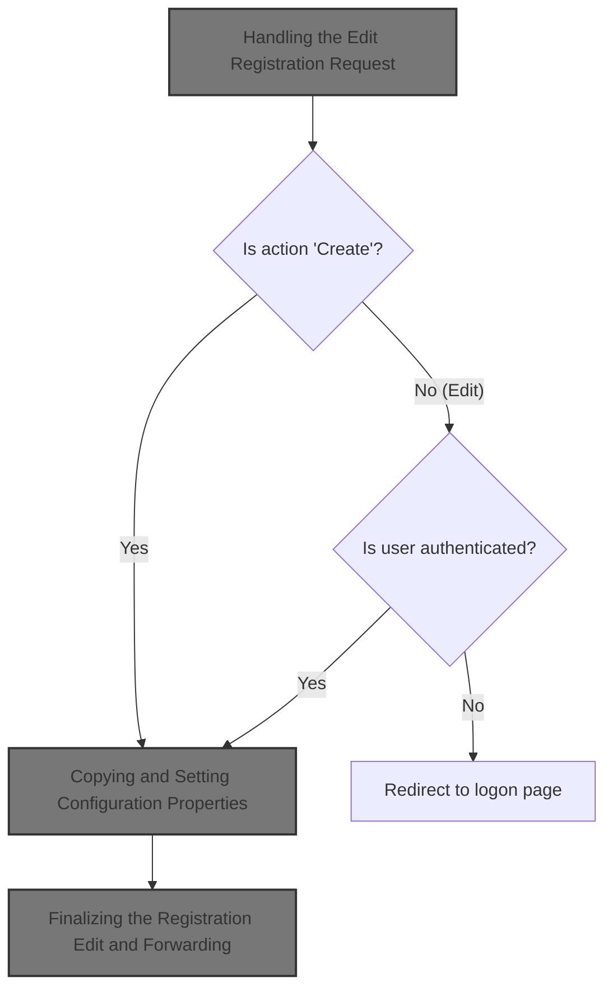
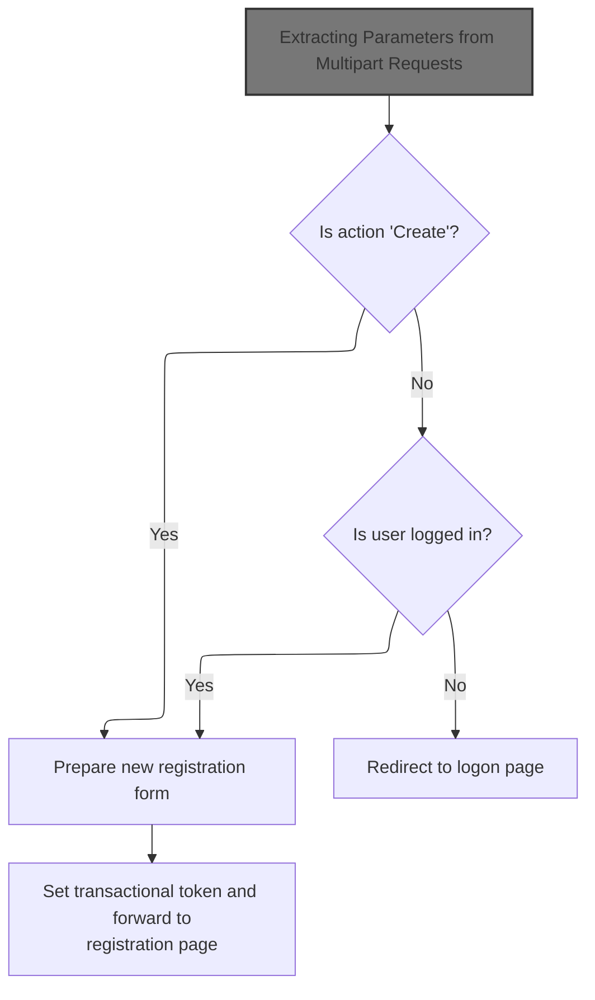
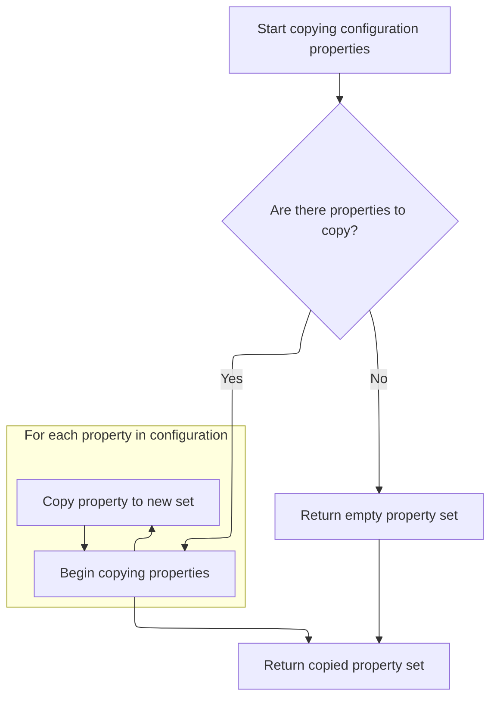
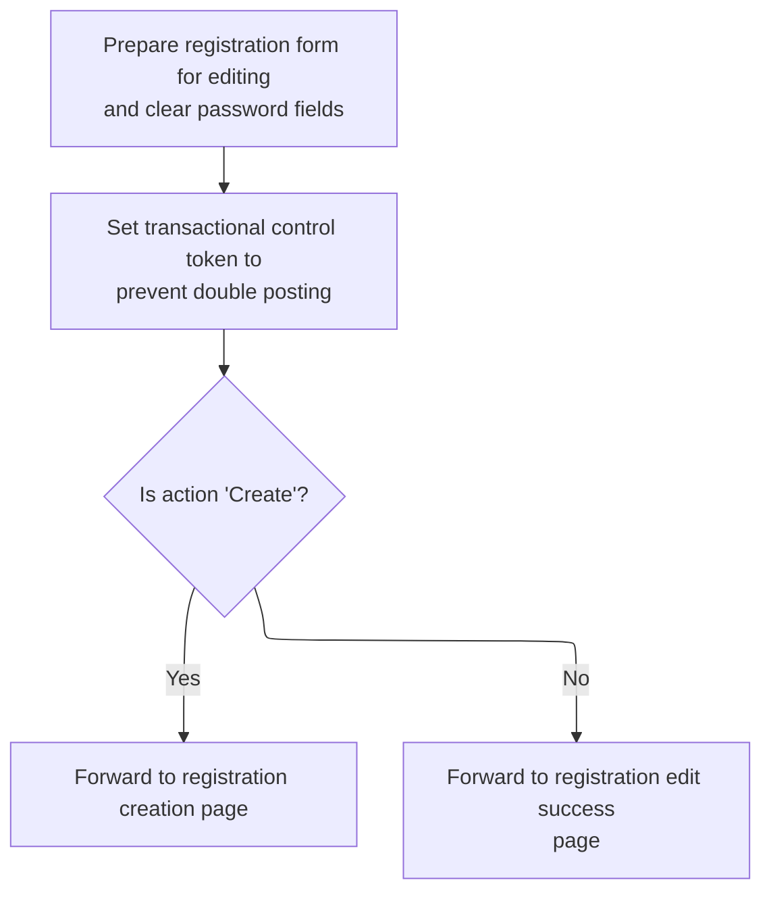

This document outlines the process for handling user registration creation and editing. When a user submits a registration request, the system determines the action, checks authentication if needed, prepares the registration form, and forwards the user to the appropriate page.



# Handling the Edit Registration Request



<SwmSnippet path="/apps/faces-example2/src/main/java/org/apache/struts/webapp/example2/EditRegistrationAction.java" line="80">

---

In <SwmToken path="apps/faces-example2/src/main/java/org/apache/struts/webapp/example2/EditRegistrationAction.java" pos="80:5:5" line-data="    public ActionForward execute(ActionMapping mapping,">`execute`</SwmToken>, we're grabbing the session and the 'action' parameter from the request. We need to call MultipartRequestWrapper.getParameter next because if the request is multipart (like a file upload), the standard <SwmToken path="apps/faces-example2/src/main/java/org/apache/struts/webapp/example2/EditRegistrationAction.java" pos="88:9:9" line-data="    String action = request.getParameter(&quot;action&quot;);">`getParameter`</SwmToken> won't work—so we need the wrapper to handle those cases.

```java
    public ActionForward execute(ActionMapping mapping,
                 ActionForm form,
                 HttpServletRequest request,
                 HttpServletResponse response)
    throws Exception {

    // Extract attributes we will need
    HttpSession session = request.getSession();
    String action = request.getParameter("action");
```

---

</SwmSnippet>

## Extracting Parameters from Multipart Requests

<SwmSnippet path="/core/src/main/java/org/apache/struts/upload/MultipartRequestWrapper.java" line="75">

---

In <SwmToken path="core/src/main/java/org/apache/struts/upload/MultipartRequestWrapper.java" pos="75:5:5" line-data="    public String getParameter(String name) {">`getParameter`</SwmToken>, we first try to get the parameter from the wrapped request. If that's null (which happens with multipart requests), we fallback to our own parameters map. Next, we need to call ServletActionContext.getRequest to access the underlying request object, since that's where the standard parameters would be if they're present.

```java
    public String getParameter(String name) {
        String value = getRequest().getParameter(name);

```

---

</SwmSnippet>

### Accessing the Underlying Servlet Request

<SwmSnippet path="/core/src/main/java/org/apache/struts/chain/contexts/ServletActionContext.java" line="94">

---

<SwmToken path="core/src/main/java/org/apache/struts/chain/contexts/ServletActionContext.java" pos="94:5:5" line-data="    public HttpServletRequest getRequest() {">`getRequest`</SwmToken> just calls <SwmToken path="core/src/main/java/org/apache/struts/chain/contexts/ServletActionContext.java" pos="95:3:5" line-data="        return servletWebContext().getRequest();">`servletWebContext()`</SwmToken><SwmToken path="core/src/main/java/org/apache/struts/chain/contexts/ServletActionContext.java" pos="95:6:9" line-data="        return servletWebContext().getRequest();">`.getRequest()`</SwmToken> to get the raw <SwmToken path="core/src/main/java/org/apache/struts/chain/contexts/ServletActionContext.java" pos="94:3:3" line-data="    public HttpServletRequest getRequest() {">`HttpServletRequest`</SwmToken>. We need to call <SwmToken path="core/src/main/java/org/apache/struts/chain/contexts/ServletActionContext.java" pos="95:3:3" line-data="        return servletWebContext().getRequest();">`servletWebContext`</SwmToken> next because that's where the actual request object lives, but this assumes the base context is always a <SwmToken path="core/src/main/java/org/apache/struts/chain/contexts/ServletActionContext.java" pos="67:3:3" line-data="    protected ServletWebContext servletWebContext() {">`ServletWebContext`</SwmToken>.

```java
    public HttpServletRequest getRequest() {
        return servletWebContext().getRequest();
    }
```

---

</SwmSnippet>

<SwmSnippet path="/core/src/main/java/org/apache/struts/chain/contexts/ServletActionContext.java" line="67">

---

<SwmToken path="core/src/main/java/org/apache/struts/chain/contexts/ServletActionContext.java" pos="67:5:5" line-data="    protected ServletWebContext servletWebContext() {">`servletWebContext`</SwmToken> just casts <SwmToken path="core/src/main/java/org/apache/struts/chain/contexts/ServletActionContext.java" pos="68:9:11" line-data="        return (ServletWebContext) this.getBaseContext();">`getBaseContext()`</SwmToken> to <SwmToken path="core/src/main/java/org/apache/struts/chain/contexts/ServletActionContext.java" pos="67:3:3" line-data="    protected ServletWebContext servletWebContext() {">`ServletWebContext`</SwmToken>. If <SwmToken path="core/src/main/java/org/apache/struts/chain/contexts/ServletActionContext.java" pos="68:9:11" line-data="        return (ServletWebContext) this.getBaseContext();">`getBaseContext()`</SwmToken> isn't the right type, this will throw a ClassCastException—there's no type check here.

```java
    protected ServletWebContext servletWebContext() {
        return (ServletWebContext) this.getBaseContext();
    }
```

---

</SwmSnippet>

### Fallback Parameter Lookup in Multipart Requests

<SwmSnippet path="/core/src/main/java/org/apache/struts/upload/MultipartRequestWrapper.java" line="78">

---

Back in MultipartRequestWrapper.getParameter, after trying <SwmToken path="core/src/main/java/org/apache/struts/upload/MultipartRequestWrapper.java" pos="76:7:9" line-data="        String value = getRequest().getParameter(name);">`getRequest()`</SwmToken><SwmToken path="apps/faces-example2/src/main/java/org/apache/struts/webapp/example2/EditRegistrationAction.java" pos="88:8:9" line-data="    String action = request.getParameter(&quot;action&quot;);">`.getParameter`</SwmToken> (which we just got from <SwmToken path="core/src/main/java/org/apache/struts/chain/contexts/ServletActionContext.java" pos="39:4:4" line-data="public class ServletActionContext extends WebActionContext {">`ServletActionContext`</SwmToken>), if that's still null, we look up the parameter in our own map. If we find a String array, we return the first value. This assumes the map always has String arrays and they're not empty—if not, things break.

```java
        if (value == null) {
            String[] mValue = (String[]) parameters.get(name);

            if ((mValue != null) && (mValue.length > 0)) {
                value = mValue[0];
            }
        }

        return value;
    }
```

---

</SwmSnippet>

## User Session and Action Handling

```mermaid
%%{init: {"flowchart": {"defaultRenderer": "elk"}} }%%
flowchart TD
    node1["Start registration action"]
    click node1 openCode "apps/faces-example2/src/main/java/org/apache/struts/webapp/example2/EditRegistrationAction.java:89:90"
    node1 --> node2{"Is action null?"}
    click node2 openCode "apps/faces-example2/src/main/java/org/apache/struts/webapp/example2/EditRegistrationAction.java:89:90"
    node2 -->|"Yes"| node3["Set action to 'Create'"]
    click node3 openCode "apps/faces-example2/src/main/java/org/apache/struts/webapp/example2/EditRegistrationAction.java:90:90"
    node2 -->|"No"| node4
    node3 --> node4{"Is action 'Create'?"}
    click node4 openCode "apps/faces-example2/src/main/java/org/apache/struts/webapp/example2/EditRegistrationAction.java:98:98"
    node2 -->|"No"| node4
    node4 -->|"No (Edit)"| node5{"Is user logged in?"}
    click node5 openCode "apps/faces-example2/src/main/java/org/apache/struts/webapp/example2/EditRegistrationAction.java:99:100"
    node5 -->|"No"| node6["Redirect to logon and end"]
    click node6 openCode "apps/faces-example2/src/main/java/org/apache/struts/webapp/example2/EditRegistrationAction.java:105:106"
    node5 -->|"Yes"| node7{"Is form null?"}
    click node7 openCode "apps/faces-example2/src/main/java/org/apache/struts/webapp/example2/EditRegistrationAction.java:110:115"
    node4 -->|"Yes (Create)"| node7
    node7 -->|"Yes"| node8["Create new registration form"]
    click node8 openCode "apps/faces-example2/src/main/java/org/apache/struts/webapp/example2/EditRegistrationAction.java:115:119"
    node7 -->|"No"| node9{"Is user present?"}
    click node9 openCode "apps/faces-example2/src/main/java/org/apache/struts/webapp/example2/EditRegistrationAction.java:122:127"
    node8 --> node9
    node9 -->|"Yes"| node10["Populate form from user"]
    click node10 openCode "apps/faces-example2/src/main/java/org/apache/struts/webapp/example2/EditRegistrationAction.java:127:127"
    node9 -->|"No"| node11["Form ready for editing/creation"]
    click node11 openCode "apps/faces-example2/src/main/java/org/apache/struts/webapp/example2/EditRegistrationAction.java:121:127"
    node10 --> node11
classDef HeadingStyle fill:#777777,stroke:#333,stroke-width:2px;

%% Swimm:
%% %%{init: {"flowchart": {"defaultRenderer": "elk"}} }%%
%% flowchart TD
%%     node1["Start registration action"]
%%     click node1 openCode "<SwmPath>[apps/…/example2/EditRegistrationAction.java](apps/faces-example2/src/main/java/org/apache/struts/webapp/example2/EditRegistrationAction.java)</SwmPath>:89:90"
%%     node1 --> node2{"Is action null?"}
%%     click node2 openCode "<SwmPath>[apps/…/example2/EditRegistrationAction.java](apps/faces-example2/src/main/java/org/apache/struts/webapp/example2/EditRegistrationAction.java)</SwmPath>:89:90"
%%     node2 -->|"Yes"| node3["Set action to 'Create'"]
%%     click node3 openCode "<SwmPath>[apps/…/example2/EditRegistrationAction.java](apps/faces-example2/src/main/java/org/apache/struts/webapp/example2/EditRegistrationAction.java)</SwmPath>:90:90"
%%     node2 -->|"No"| node4
%%     node3 --> node4{"Is action 'Create'?"}
%%     click node4 openCode "<SwmPath>[apps/…/example2/EditRegistrationAction.java](apps/faces-example2/src/main/java/org/apache/struts/webapp/example2/EditRegistrationAction.java)</SwmPath>:98:98"
%%     node2 -->|"No"| node4
%%     node4 -->|"No (Edit)"| node5{"Is user logged in?"}
%%     click node5 openCode "<SwmPath>[apps/…/example2/EditRegistrationAction.java](apps/faces-example2/src/main/java/org/apache/struts/webapp/example2/EditRegistrationAction.java)</SwmPath>:99:100"
%%     node5 -->|"No"| node6["Redirect to logon and end"]
%%     click node6 openCode "<SwmPath>[apps/…/example2/EditRegistrationAction.java](apps/faces-example2/src/main/java/org/apache/struts/webapp/example2/EditRegistrationAction.java)</SwmPath>:105:106"
%%     node5 -->|"Yes"| node7{"Is form null?"}
%%     click node7 openCode "<SwmPath>[apps/…/example2/EditRegistrationAction.java](apps/faces-example2/src/main/java/org/apache/struts/webapp/example2/EditRegistrationAction.java)</SwmPath>:110:115"
%%     node4 -->|"Yes (Create)"| node7
%%     node7 -->|"Yes"| node8["Create new registration form"]
%%     click node8 openCode "<SwmPath>[apps/…/example2/EditRegistrationAction.java](apps/faces-example2/src/main/java/org/apache/struts/webapp/example2/EditRegistrationAction.java)</SwmPath>:115:119"
%%     node7 -->|"No"| node9{"Is user present?"}
%%     click node9 openCode "<SwmPath>[apps/…/example2/EditRegistrationAction.java](apps/faces-example2/src/main/java/org/apache/struts/webapp/example2/EditRegistrationAction.java)</SwmPath>:122:127"
%%     node8 --> node9
%%     node9 -->|"Yes"| node10["Populate form from user"]
%%     click node10 openCode "<SwmPath>[apps/…/example2/EditRegistrationAction.java](apps/faces-example2/src/main/java/org/apache/struts/webapp/example2/EditRegistrationAction.java)</SwmPath>:127:127"
%%     node9 -->|"No"| node11["Form ready for editing/creation"]
%%     click node11 openCode "<SwmPath>[apps/…/example2/EditRegistrationAction.java](apps/faces-example2/src/main/java/org/apache/struts/webapp/example2/EditRegistrationAction.java)</SwmPath>:121:127"
%%     node10 --> node11
%% classDef HeadingStyle fill:#777777,stroke:#333,stroke-width:2px;
```



<SwmSnippet path="/apps/faces-example2/src/main/java/org/apache/struts/webapp/example2/EditRegistrationAction.java" line="89">

---

Back in EditRegistrationAction.execute, after getting the action parameter (possibly from <SwmToken path="core/src/main/java/org/apache/struts/upload/MultipartRequestWrapper.java" pos="38:4:4" line-data="public class MultipartRequestWrapper extends HttpServletRequestWrapper {">`MultipartRequestWrapper`</SwmToken>), we check if the action is missing and default to 'Create'. If the action isn't 'Create', we check for a logged-in user in the session. If there's no user, we need to call ActionMapping.findForward to redirect to the logon page.

```java
    if (action == null)
        action = "Create";
        if (log.isDebugEnabled()) {
            log.debug("EditRegistrationAction:  Processing " + action +
                        " action");
        }

    // Is there a currently logged on user?
    User user = null;
    if (!"Create".equals(action)) {
        user = (User) session.getAttribute(Constants.USER_KEY);
        if (user == null) {
                if (log.isDebugEnabled()) {
                    log.debug(" User is not logged on in session "
                              + session.getId());
                }
        return (mapping.findForward("logon"));
        }
    }

```

---

</SwmSnippet>

<SwmSnippet path="/core/src/main/java/org/apache/struts/action/ActionMapping.java" line="70">

---

<SwmToken path="core/src/main/java/org/apache/struts/action/ActionMapping.java" pos="70:5:5" line-data="    public ActionForward findForward(String forwardName) {">`findForward`</SwmToken> looks up a forward config by name, first locally, then in the module config. It casts the result to <SwmToken path="core/src/main/java/org/apache/struts/action/ActionMapping.java" pos="70:3:3" line-data="    public ActionForward findForward(String forwardName) {">`ActionForward`</SwmToken>, assuming that's always safe. If nothing is found, it logs a warning and returns null.

```java
    public ActionForward findForward(String forwardName) {
        ForwardConfig config = findForwardConfig(forwardName);

        if (config == null) {
            config = getModuleConfig().findForwardConfig(forwardName);
        }

        // TODO: remove warning since findRequiredForward takes care of use case? 
        if (config == null) {
            if (log.isWarnEnabled()) {
                log.warn("Unable to find '" + forwardName + "' forward.");
            }
        }

        return ((ActionForward) config);
    }
```

---

</SwmSnippet>

<SwmSnippet path="/apps/faces-example2/src/main/java/org/apache/struts/webapp/example2/EditRegistrationAction.java" line="109">

---

Back in EditRegistrationAction.execute, after possibly forwarding to logon, we set up the registration form. If the form is missing, we create it and store it in the right scope. If there's a user, we need to copy their properties into the form, which means calling BaseConfig.copyProperties next.

```java
    // Populate the user registration form
    if (form == null) {
            if (log.isTraceEnabled()) {
                log.trace(" Creating new RegistrationForm bean under key "
                          + mapping.getAttribute());
            }
        form = new RegistrationForm();
            if ("request".equals(mapping.getScope()))
                request.setAttribute(mapping.getAttribute(), form);
            else
                session.setAttribute(mapping.getAttribute(), form);
    }
    RegistrationForm regform = (RegistrationForm) form;
    if (user != null) {
            if (log.isTraceEnabled()) {
                log.trace(" Populating form from " + user);
            }
            try {
                PropertyUtils.copyProperties(regform, user);
```

---

</SwmSnippet>

## Copying and Setting Configuration Properties



<SwmSnippet path="/core/src/main/java/org/apache/struts/config/BaseConfig.java" line="155">

---

<SwmToken path="core/src/main/java/org/apache/struts/config/BaseConfig.java" pos="155:5:5" line-data="    protected Properties copyProperties() {">`copyProperties`</SwmToken> creates a new Properties object and copies all key-value pairs from the existing properties. We need to call <SwmToken path="core/src/main/java/org/apache/struts/config/BaseConfig.java" pos="163:3:3" line-data="            copy.setProperty(key, properties.getProperty(key));">`setProperty`</SwmToken> next to actually set each property in the new Properties object.

```java
    protected Properties copyProperties() {
        Properties copy = new Properties();

        Enumeration keys = properties.propertyNames();

        while (keys.hasMoreElements()) {
            String key = (String) keys.nextElement();

            copy.setProperty(key, properties.getProperty(key));
        }

        return copy;
    }
```

---

</SwmSnippet>

<SwmSnippet path="/core/src/main/java/org/apache/struts/config/BaseConfig.java" line="88">

---

<SwmToken path="core/src/main/java/org/apache/struts/config/BaseConfig.java" pos="88:5:5" line-data="    public void setProperty(String key, String value) {">`setProperty`</SwmToken> checks if the config is locked (<SwmToken path="core/src/main/java/org/apache/struts/config/BaseConfig.java" pos="89:1:1" line-data="        throwIfConfigured();">`throwIfConfigured`</SwmToken>), then sets the property using Properties.setProperty. No direct assignment—just the standard Java way.

```java
    public void setProperty(String key, String value) {
        throwIfConfigured();
        properties.setProperty(key, value);
    }
```

---

</SwmSnippet>

## Finalizing the Registration Edit and Forwarding



<SwmSnippet path="/apps/faces-example2/src/main/java/org/apache/struts/webapp/example2/EditRegistrationAction.java" line="128">

---

Back in EditRegistrationAction.execute, after copying properties, we set some fields on the form, handle exceptions, and save a token to prevent double posts. Finally, we forward to either the 'register' or 'success' page using ActionMapping.findForward.

```java
                regform.setAction(action);
                regform.setPassword(null);
                regform.setPassword2(null);
            } catch (InvocationTargetException e) {
                Throwable t = e.getTargetException();
                if (t == null)
                    t = e;
                log.error("RegistrationForm.populate", t);
                throw new ServletException("RegistrationForm.populate", t);
            } catch (Throwable t) {
                log.error("RegistrationForm.populate", t);
                throw new ServletException("RegistrationForm.populate", t);
            }
    }

        // Set a transactional control token to prevent double posting
        if (log.isTraceEnabled()) {
            log.trace(" Setting transactional control token");
        }
        saveToken(request);

    // Forward control to the edit user registration page
        if (log.isTraceEnabled()) {
            log.trace(" Forwarding to 'success' page");
        }
        if ("Create".equals(action)) {
            return (mapping.findForward("register"));
        } else {
            return (mapping.findForward("success"));
        }

    }
```

---

</SwmSnippet>

&nbsp;

*This is an auto-generated document by Swimm 🌊 and has not yet been verified by a human*

<SwmMeta version="3.0.0" repo-id="Z2l0aHViJTNBJTNBc3RydXRzMSUzQSUzQVN3aW1tLURlbW8=" repo-name="struts1"><sup>Powered by [Swimm](https://app.swimm.io/)</sup></SwmMeta>
