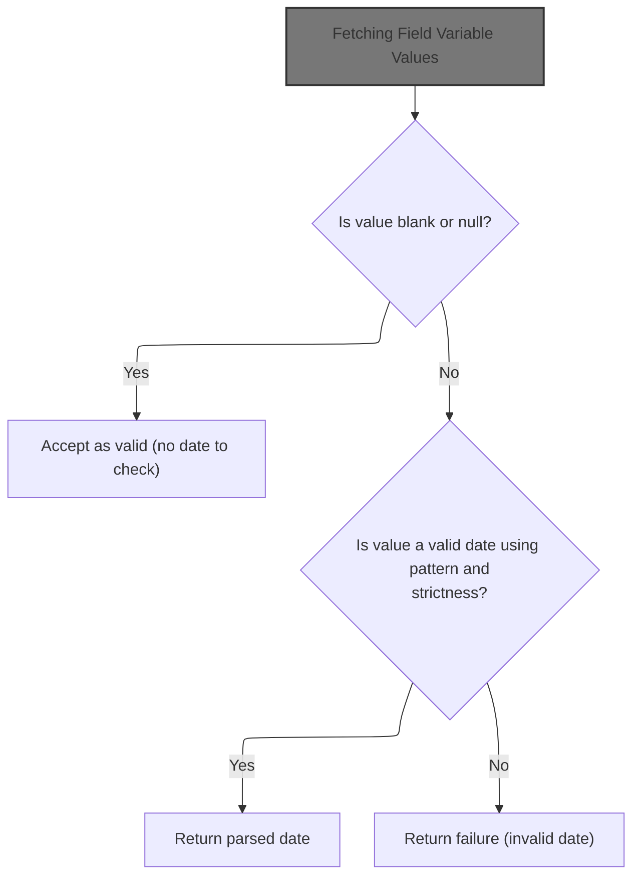
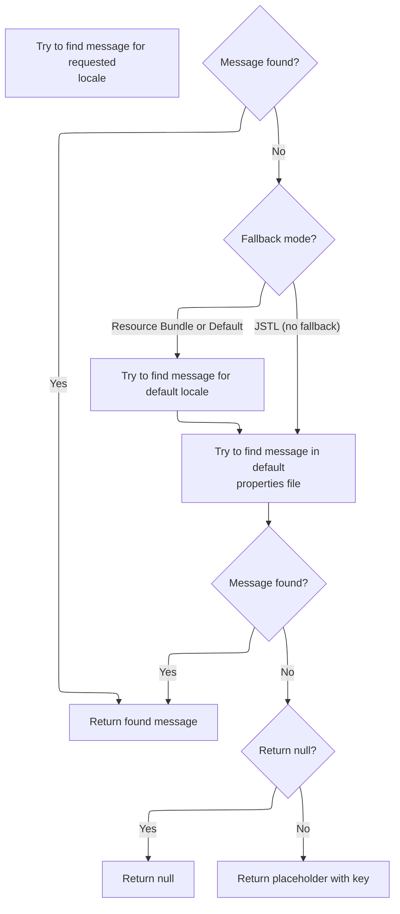
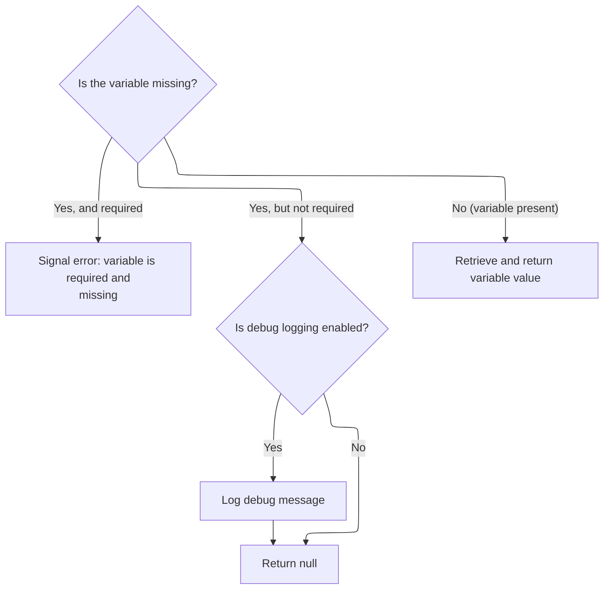
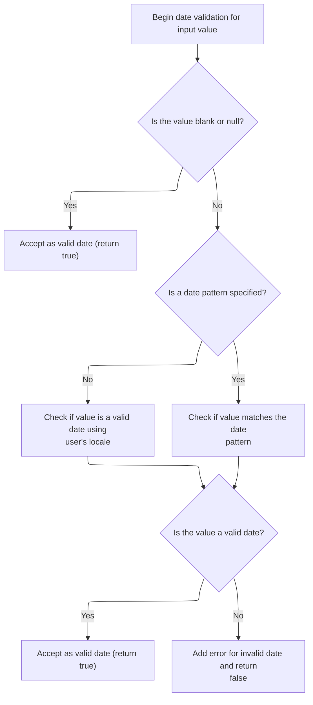
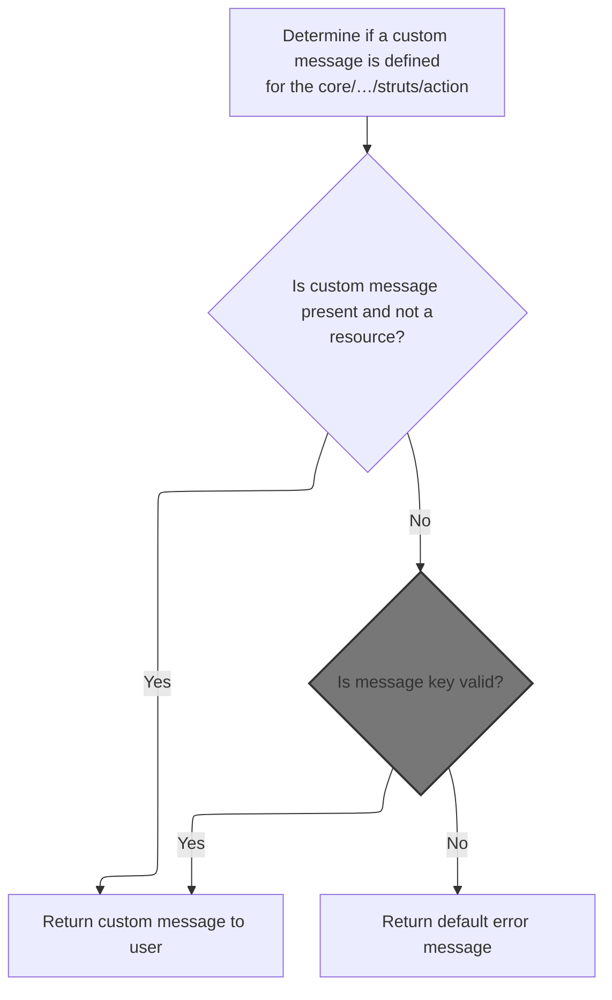
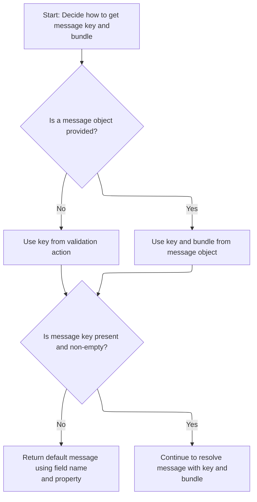
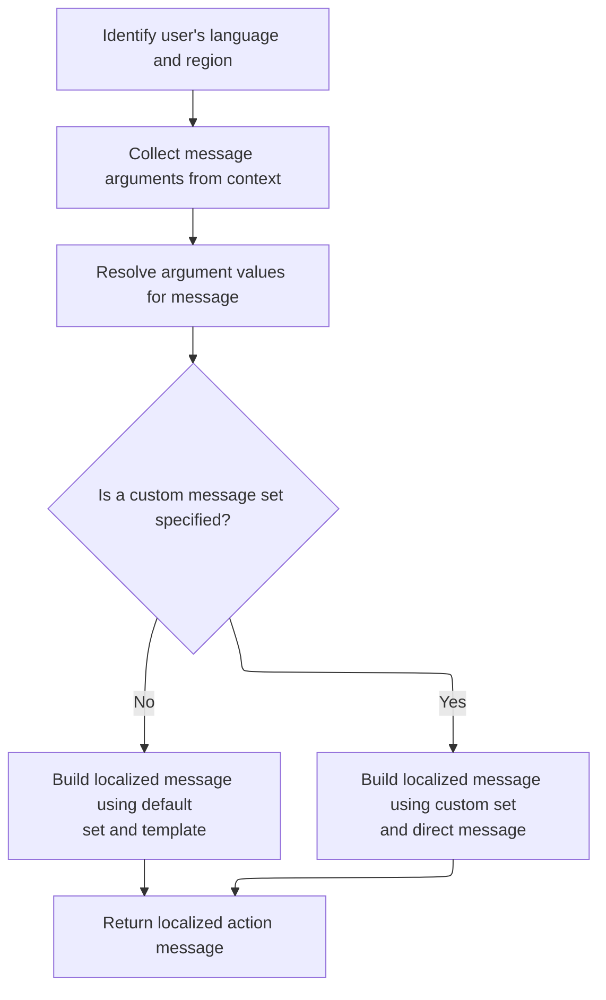

This document describes how a date input is validated based on field configuration and user locale. If the date is invalid, a localized error message is generated using message resources and dynamic arguments.

# Extracting and Validating Date Input



<SwmSnippet path="/core/src/main/java/org/apache/struts/validator/FieldChecks.java" line="854">

---

In <SwmToken path="core/src/main/java/org/apache/struts/validator/FieldChecks.java" pos="854:7:7" line-data="    public static Object validateDate(Object bean, ValidatorAction va,">`validateDate`</SwmToken>, we're grabbing the value from the bean and then pulling the date pattern from the field using <SwmToken path="core/src/main/java/org/apache/struts/validator/FieldChecks.java" pos="869:1:3" line-data="            Resources.getVarValue(&quot;datePattern&quot;, field, validator, request,">`Resources.getVarValue`</SwmToken>. If the pattern isn't found, we try a stricter one. Calling Resources lets us fetch these patterns dynamically, so validation adapts to field configuration.

```java
    public static Object validateDate(Object bean, ValidatorAction va,
        Field field, ActionMessages errors, Validator validator,
        HttpServletRequest request) {
        Object result = null;
        String value = null;

        try {
            value = evaluateBean(bean, field);
        } catch (Exception e) {
            processFailure(errors, field, validator.getFormName(), "date", e);
            return Boolean.FALSE;
        }

        boolean isStrict = false;
        String datePattern =
            Resources.getVarValue("datePattern", field, validator, request,
                false);

        if (GenericValidator.isBlankOrNull(datePattern)) {
            datePattern =
                Resources.getVarValue("datePatternStrict", field, validator,
                    request, false);

            if (!GenericValidator.isBlankOrNull(datePattern)) {
                isStrict = true;
            }
        }

```

---

</SwmSnippet>

## Fetching Field Variable Values

<SwmSnippet path="/core/src/main/java/org/apache/struts/validator/Resources.java" line="157">

---

In <SwmToken path="core/src/main/java/org/apache/struts/validator/Resources.java" pos="157:7:7" line-data="    public static String getVarValue(String varName, Field field,">`getVarValue`</SwmToken>, we're checking if the field variable exists. If it's missing, we grab a localized error message using <SwmToken path="core/src/main/java/org/apache/struts/validator/Resources.java" pos="162:7:9" line-data="            String msg = sysmsgs.getMessage(&quot;variable.missing&quot;, varName);">`sysmsgs.getMessage`</SwmToken>, which calls <SwmToken path="core/src/main/java/org/apache/struts/util/PropertyMessageResources.java" pos="82:8:8" line-data=" * Configure &lt;code&gt;PropertyMessageResources&lt;/code&gt; to operate in this mode by">`PropertyMessageResources`</SwmToken> next to look up the actual message string.

```java
    public static String getVarValue(String varName, Field field,
        Validator validator, HttpServletRequest request, boolean required) {
        Var var = field.getVar(varName);

        if (var == null) {
            String msg = sysmsgs.getMessage("variable.missing", varName);

```

---

</SwmSnippet>

### Retrieving Localized Messages with Fallbacks



<SwmSnippet path="/core/src/main/java/org/apache/struts/util/PropertyMessageResources.java" line="227">

---

<SwmToken path="core/src/main/java/org/apache/struts/util/PropertyMessageResources.java" pos="227:5:5" line-data="    public String getMessage(Locale locale, String key) {">`getMessage`</SwmToken> handles message lookup with locale fallback logic. It uses the mode variable to decide how to search: JSTL skips default locale fallback, RESOURCE_BUNDLE tries locale hierarchy, and default mode checks the specified and default locales. The helper methods build keys and do the actual lookup. If nothing is found, it returns a placeholder or null.

```java
    public String getMessage(Locale locale, String key) {
        if (log.isDebugEnabled()) {
            log.debug("getMessage(" + locale + "," + key + ")");
        }

        // Initialize variables we will require
        String localeKey = localeKey(locale);
        String originalKey = messageKey(localeKey, key);
        String message = null;

        // Search the specified Locale
        message = findMessage(locale, key, originalKey);
        if (message != null) {
            return message;
        }

        // JSTL Compatibility - JSTL doesn't use the default locale
        if (mode == MODE_JSTL) {

           // do nothing (i.e. don't use default Locale)

        // PropertyResourcesBundle - searches through the hierarchy
        // for the default Locale (e.g. first en_US then en)
        } else if (mode == MODE_RESOURCE_BUNDLE) {

            if (!defaultLocale.equals(locale)) {
                message = findMessage(defaultLocale, key, originalKey);
            }

        // Default (backwards) Compatibility - just searches the
        // specified Locale (e.g. just en_US)
        } else {

            if (!defaultLocale.equals(locale)) {
                localeKey = localeKey(defaultLocale);
                message = findMessage(localeKey, key, originalKey);
            }

        }
        if (message != null) {
            return message;
        }

        // Find the message in the default properties file
        message = findMessage("", key, originalKey);
        if (message != null) {
            return message;
        }

        // Return an appropriate error indication
        if (returnNull) {
            return (null);
        } else {
            return ("???" + messageKey(locale, key) + "???");
        }
    }
```

---

</SwmSnippet>

<SwmSnippet path="/core/src/main/java/org/apache/struts/util/PropertyMessageResources.java" line="393">

---

<SwmToken path="core/src/main/java/org/apache/struts/util/PropertyMessageResources.java" pos="393:5:5" line-data="    private String findMessage(Locale locale, String key, String originalKey) {">`findMessage`</SwmToken> tries to locate a message for a specific locale, and if it doesn't find one, it strips locale modifiers (like going from <SwmToken path="core/src/main/java/org/apache/struts/util/PropertyMessageResources.java" pos="249:19:19" line-data="        // for the default Locale (e.g. first en_US then en)">`en_US`</SwmToken> to 'en') and retries. This iterative fallback is standard for handling locale specificity.

```java
    private String findMessage(Locale locale, String key, String originalKey) {

        // Initialize variables we will require
        String localeKey = localeKey(locale);
        String messageKey = null;
        String message = null;
        int underscore = 0;

        // Loop from specific to general Locales looking for this message
        while (true) {
            message = findMessage(localeKey, key, originalKey);
            if (message != null) {
                break;
            }

            // Strip trailing modifiers to try a more general locale key
            underscore = localeKey.lastIndexOf("_");

            if (underscore < 0) {
                break;
            }

            localeKey = localeKey.substring(0, underscore);
        }
```

---

</SwmSnippet>

### Handling Missing Field Variables



<SwmSnippet path="/core/src/main/java/org/apache/struts/validator/Resources.java" line="164">

---

Back in <SwmToken path="core/src/main/java/org/apache/struts/validator/FieldChecks.java" pos="869:1:3" line-data="            Resources.getVarValue(&quot;datePattern&quot;, field, validator, request,">`Resources.getVarValue`</SwmToken>, after checking for the variable and fetching the error message from <SwmToken path="core/src/main/java/org/apache/struts/util/PropertyMessageResources.java" pos="82:8:8" line-data=" * Configure &lt;code&gt;PropertyMessageResources&lt;/code&gt; to operate in this mode by">`PropertyMessageResources`</SwmToken>, if it's not required, we just log and return null. Otherwise, we throw. If the variable exists, we call <SwmToken path="core/src/main/java/org/apache/struts/validator/Resources.java" pos="178:3:3" line-data="        return getVarValue(var, application, request, required);">`getVarValue`</SwmToken> again with more context to resolve its value.

```java
            if (required) {
                throw new IllegalArgumentException(msg);
            }

            if (log.isDebugEnabled()) {
                log.debug(field.getProperty() + ": " + msg);
            }

            return null;
        }

        ServletContext application =
            (ServletContext) validator.getParameterValue(SERVLET_CONTEXT_PARAM);

        return getVarValue(var, application, request, required);
    }
```

---

</SwmSnippet>

## Locale Selection and Blank Value Handling



<SwmSnippet path="/core/src/main/java/org/apache/struts/validator/FieldChecks.java" line="882">

---

Back in `FieldChecks.validateDate`, after getting the date pattern, we grab the user's locale using <SwmToken path="core/src/main/java/org/apache/struts/validator/FieldChecks.java" pos="882:7:7" line-data="        Locale locale = RequestUtils.getUserLocale(request, null);">`RequestUtils`</SwmToken>. This is needed so date parsing and messages are localized. If the value is blank, we just return TRUE and skip validation.

```java
        Locale locale = RequestUtils.getUserLocale(request, null);

        if (GenericValidator.isBlankOrNull(value)) {
            return Boolean.TRUE;
        }

```

---

</SwmSnippet>

<SwmSnippet path="/core/src/main/java/org/apache/struts/util/RequestUtils.java" line="299">

---

<SwmToken path="core/src/main/java/org/apache/struts/util/RequestUtils.java" pos="299:7:7" line-data="    public static Locale getUserLocale(HttpServletRequest request, String locale) {">`getUserLocale`</SwmToken> checks the session for a Locale using <SwmToken path="core/src/main/java/org/apache/struts/util/RequestUtils.java" pos="304:5:7" line-data="            locale = Globals.LOCALE_KEY;">`Globals.LOCALE_KEY`</SwmToken> if no key is given. If not found, it falls back to the request's locale (from <SwmToken path="core/src/main/java/org/apache/struts/util/RequestUtils.java" pos="313:11:13" line-data="            // Returns Locale based on Accept-Language header or the server default">`Accept-Language`</SwmToken> or server default). This lets us adapt to user preferences or browser settings.

```java
    public static Locale getUserLocale(HttpServletRequest request, String locale) {
        Locale userLocale = null;
        HttpSession session = request.getSession(false);

        if (locale == null) {
            locale = Globals.LOCALE_KEY;
        }

        // Only check session if sessions are enabled
        if (session != null) {
            userLocale = (Locale) session.getAttribute(locale);
        }

        if (userLocale == null) {
            // Returns Locale based on Accept-Language header or the server default
            userLocale = request.getLocale();
        }

        return userLocale;
    }
```

---

</SwmSnippet>

<SwmSnippet path="/core/src/main/java/org/apache/struts/validator/FieldChecks.java" line="888">

---

After getting the locale from <SwmToken path="core/src/main/java/org/apache/struts/validator/FieldChecks.java" pos="882:7:7" line-data="        Locale locale = RequestUtils.getUserLocale(request, null);">`RequestUtils`</SwmToken> in `FieldChecks.validateDate`, we try to parse the date using <SwmToken path="core/src/main/java/org/apache/struts/validator/FieldChecks.java" pos="890:5:5" line-data="                result = GenericTypeValidator.formatDate(value, locale);">`GenericTypeValidator`</SwmToken>. If parsing fails, we add an error message using <SwmToken path="core/src/main/java/org/apache/struts/validator/FieldChecks.java" pos="901:1:3" line-data="                Resources.getActionMessage(validator, request, va, field));">`Resources.getActionMessage`</SwmToken>, which is the next step to generate a user-facing error.

```java
        try {
            if (GenericValidator.isBlankOrNull(datePattern)) {
                result = GenericTypeValidator.formatDate(value, locale);
            } else {
                result =
                    GenericTypeValidator.formatDate(value, datePattern, isStrict);
            }
        } catch (Exception e) {
            log.error(e.getMessage(), e);
        }

        if (result == null) {
            errors.add(field.getKey(),
                Resources.getActionMessage(validator, request, va, field));
        }

        return (result == null) ? Boolean.FALSE : result;
    }
```

---

</SwmSnippet>

# Building Validation Error Messages



<SwmSnippet path="/core/src/main/java/org/apache/struts/validator/Resources.java" line="365">

---

In <SwmToken path="core/src/main/java/org/apache/struts/validator/Resources.java" pos="365:7:7" line-data="    public static ActionMessage getActionMessage(Validator validator,">`getActionMessage`</SwmToken>, we check if the message is a resource. If it is, we need to resolve it, so we call ConfigHelper.getMessage next to fetch the localized message string.

```java
    public static ActionMessage getActionMessage(Validator validator,
        HttpServletRequest request, ValidatorAction va, Field field) {
        Msg msg = field.getMessage(va.getName());

        if ((msg != null) && !msg.isResource()) {
            return new ActionMessage(msg.getKey(), false);
        }

```

---

</SwmSnippet>

## Resolving Message Strings from Configuration

<SwmSnippet path="/core/src/main/java/org/apache/struts/config/ConfigHelper.java" line="496">

---

In <SwmToken path="core/src/main/java/org/apache/struts/config/ConfigHelper.java" pos="496:5:5" line-data="    public String getMessage(String key) {">`getMessage`</SwmToken>, we grab the <SwmToken path="core/src/main/java/org/apache/struts/config/ConfigHelper.java" pos="497:1:1" line-data="        MessageResources resources = getMessageResources();">`MessageResources`</SwmToken> and then use <SwmToken path="core/src/main/java/org/apache/struts/config/ConfigHelper.java" pos="503:7:9" line-data="        return resources.getMessage(RequestUtils.getUserLocale(request, null),">`RequestUtils.getUserLocale`</SwmToken> to get the user's locale. This is needed so the message string is localized before returning it.

```java
    public String getMessage(String key) {
        MessageResources resources = getMessageResources();

        if (resources == null) {
            return null;
        }

        return resources.getMessage(RequestUtils.getUserLocale(request, null),
```

---

</SwmSnippet>

<SwmSnippet path="/core/src/main/java/org/apache/struts/config/ConfigHelper.java" line="503">

---

After getting the user's locale from <SwmToken path="core/src/main/java/org/apache/struts/config/ConfigHelper.java" pos="503:7:7" line-data="        return resources.getMessage(RequestUtils.getUserLocale(request, null),">`RequestUtils`</SwmToken> in `ConfigHelper.getMessage`, we call MessageResources.getMessage with the locale and key, then return the result to Resources so it can build the <SwmToken path="core/src/main/java/org/apache/struts/validator/Resources.java" pos="365:5:5" line-data="    public static ActionMessage getActionMessage(Validator validator,">`ActionMessage`</SwmToken>.

```java
        return resources.getMessage(RequestUtils.getUserLocale(request, null),
            key);
    }
```

---

</SwmSnippet>

<SwmSnippet path="/core/src/main/java/org/apache/struts/validator/Resources.java" line="249">

---

<SwmToken path="core/src/main/java/org/apache/struts/validator/Resources.java" pos="249:7:7" line-data="    public static String getMessage(HttpServletRequest request, String key) {">`getMessage`</SwmToken> in Resources grabs the <SwmToken path="core/src/main/java/org/apache/struts/validator/Resources.java" pos="250:1:1" line-data="        MessageResources messages = getMessageResources(request);">`MessageResources`</SwmToken> for the request, then calls <SwmToken path="core/src/main/java/org/apache/struts/validator/Resources.java" pos="252:8:10" line-data="        return getMessage(messages, RequestUtils.getUserLocale(request, null),">`RequestUtils.getUserLocale`</SwmToken> to get the user's locale before looking up the message string. This ensures the message is localized.

```java
    public static String getMessage(HttpServletRequest request, String key) {
        MessageResources messages = getMessageResources(request);

        return getMessage(messages, RequestUtils.getUserLocale(request, null),
            key);
    }
```

---

</SwmSnippet>

## Preparing Message Arguments and Bundles



<SwmSnippet path="/core/src/main/java/org/apache/struts/validator/Resources.java" line="373">

---

Back in <SwmToken path="core/src/main/java/org/apache/struts/validator/FieldChecks.java" pos="901:1:3" line-data="                Resources.getActionMessage(validator, request, va, field));">`Resources.getActionMessage`</SwmToken>, after resolving the message key and bundle, we call <SwmToken path="core/src/main/java/org/apache/struts/validator/Resources.java" pos="391:1:1" line-data="            getMessageResources(application, request, msgBundle);">`getMessageResources`</SwmToken> to fetch the right <SwmToken path="core/src/main/java/org/apache/struts/validator/Resources.java" pos="390:1:1" line-data="        MessageResources messages =">`MessageResources`</SwmToken> instance for the bundle and module. This is needed for accurate message retrieval.

```java
        String msgKey = null;
        String msgBundle = null;

        if (msg == null) {
            msgKey = va.getMsg();
        } else {
            msgKey = msg.getKey();
            msgBundle = msg.getBundle();
        }

        if ((msgKey == null) || (msgKey.length() == 0)) {
            return new ActionMessage("??? " + va.getName() + "."
                + field.getProperty() + " ???", false);
        }

        ServletContext application =
            (ServletContext) validator.getParameterValue(SERVLET_CONTEXT_PARAM);
        MessageResources messages =
            getMessageResources(application, request, msgBundle);
```

---

</SwmSnippet>

## Locating Message Resources by Bundle and Module

<SwmSnippet path="/core/src/main/java/org/apache/struts/validator/Resources.java" line="117">

---

<SwmToken path="core/src/main/java/org/apache/struts/validator/Resources.java" pos="117:7:7" line-data="    public static MessageResources getMessageResources(">`getMessageResources`</SwmToken> first tries to get <SwmToken path="core/src/main/java/org/apache/struts/validator/Resources.java" pos="117:5:5" line-data="    public static MessageResources getMessageResources(">`MessageResources`</SwmToken> from the request using the bundle key. If not found, it grabs the <SwmToken path="core/src/main/java/org/apache/struts/validator/Resources.java" pos="127:1:1" line-data="            ModuleConfig moduleConfig =">`ModuleConfig`</SwmToken> using <SwmToken path="core/src/main/java/org/apache/struts/validator/Resources.java" pos="128:1:1" line-data="                ModuleUtils.getInstance().getModuleConfig(request, application);">`ModuleUtils`</SwmToken>, then looks up the resource in the application context with the bundle and module prefix. If still missing, it falls back to just the bundle key. This covers different scopes and module setups.

```java
    public static MessageResources getMessageResources(
        ServletContext application, HttpServletRequest request, String bundle) {
        if (bundle == null) {
            bundle = Globals.MESSAGES_KEY;
        }

        MessageResources resources =
            (MessageResources) request.getAttribute(bundle);

        if (resources == null) {
            ModuleConfig moduleConfig =
                ModuleUtils.getInstance().getModuleConfig(request, application);

            resources =
                (MessageResources) application.getAttribute(bundle
                    + moduleConfig.getPrefix());
        }

```

---

</SwmSnippet>

### Resolving Module Configuration

<SwmSnippet path="/core/src/main/java/org/apache/struts/util/ModuleUtils.java" line="130">

---

<SwmToken path="core/src/main/java/org/apache/struts/util/ModuleUtils.java" pos="130:5:5" line-data="    public ModuleConfig getModuleConfig(HttpServletRequest request,">`getModuleConfig`</SwmToken> tries to get the <SwmToken path="core/src/main/java/org/apache/struts/util/ModuleUtils.java" pos="130:3:3" line-data="    public ModuleConfig getModuleConfig(HttpServletRequest request,">`ModuleConfig`</SwmToken> from the request. If it's not there, it falls back to the context with an empty string, then caches the result in the request under <SwmToken path="core/src/main/java/org/apache/struts/util/ModuleUtils.java" pos="136:5:7" line-data="            request.setAttribute(Globals.MODULE_KEY, moduleConfig);">`Globals.MODULE_KEY`</SwmToken>. This makes sure the config is available for later use.

```java
    public ModuleConfig getModuleConfig(HttpServletRequest request,
        ServletContext context) {
        ModuleConfig moduleConfig = this.getModuleConfig(request);

        if (moduleConfig == null) {
            moduleConfig = this.getModuleConfig("", context);
            request.setAttribute(Globals.MODULE_KEY, moduleConfig);
        }

        return moduleConfig;
    }
```

---

</SwmSnippet>

<SwmSnippet path="/core/src/main/java/org/apache/struts/util/ModuleUtils.java" line="89">

---

<SwmToken path="core/src/main/java/org/apache/struts/util/ModuleUtils.java" pos="89:5:5" line-data="    public ModuleConfig getModuleConfig(String prefix, ServletContext context) {">`getModuleConfig`</SwmToken> with a prefix checks if it's null or "/" and grabs the config from the context using <SwmToken path="core/src/main/java/org/apache/struts/util/ModuleUtils.java" pos="91:11:13" line-data="            return (ModuleConfig) context.getAttribute(Globals.MODULE_KEY);">`Globals.MODULE_KEY`</SwmToken>. Otherwise, it uses <SwmToken path="core/src/main/java/org/apache/struts/util/ModuleUtils.java" pos="91:11:13" line-data="            return (ModuleConfig) context.getAttribute(Globals.MODULE_KEY);">`Globals.MODULE_KEY`</SwmToken> plus the prefix. This lets us handle default and custom module configs.

```java
    public ModuleConfig getModuleConfig(String prefix, ServletContext context) {
        if ((prefix == null) || "/".equals(prefix)) {
            return (ModuleConfig) context.getAttribute(Globals.MODULE_KEY);
        } else {
            return (ModuleConfig) context.getAttribute(Globals.MODULE_KEY
                + prefix);
        }
    }
```

---

</SwmSnippet>

### Finalizing Message Resource Lookup

<SwmSnippet path="/core/src/main/java/org/apache/struts/validator/Resources.java" line="135">

---

After calling <SwmToken path="core/src/main/java/org/apache/struts/validator/Resources.java" pos="128:1:1" line-data="                ModuleUtils.getInstance().getModuleConfig(request, application);">`ModuleUtils`</SwmToken> in `Resources.getMessageResources`, if the resource isn't found in any scope, we throw a <SwmToken path="core/src/main/java/org/apache/struts/validator/Resources.java" pos="140:5:5" line-data="            throw new NullPointerException(">`NullPointerException`</SwmToken>. Otherwise, we return the resource for message lookup. This fallback logic covers different deployment setups.

```java
        if (resources == null) {
            resources = (MessageResources) application.getAttribute(bundle);
        }

        if (resources == null) {
            throw new NullPointerException(
                "No message resources found for bundle: " + bundle);
        }

        return resources;
    }
```

---

</SwmSnippet>

## Localizing Message Arguments



<SwmSnippet path="/core/src/main/java/org/apache/struts/validator/Resources.java" line="392">

---

After getting <SwmToken path="core/src/main/java/org/apache/struts/validator/Resources.java" pos="117:5:5" line-data="    public static MessageResources getMessageResources(">`MessageResources`</SwmToken> in <SwmToken path="core/src/main/java/org/apache/struts/validator/FieldChecks.java" pos="901:1:3" line-data="                Resources.getActionMessage(validator, request, va, field));">`Resources.getActionMessage`</SwmToken>, we call <SwmToken path="core/src/main/java/org/apache/struts/validator/Resources.java" pos="392:7:9" line-data="        Locale locale = RequestUtils.getUserLocale(request, null);">`RequestUtils.getUserLocale`</SwmToken> again to make sure argument messages are localized for the user.

```java
        Locale locale = RequestUtils.getUserLocale(request, null);

```

---

</SwmSnippet>

<SwmSnippet path="/core/src/main/java/org/apache/struts/validator/Resources.java" line="394">

---

After getting the locale in <SwmToken path="core/src/main/java/org/apache/struts/validator/FieldChecks.java" pos="901:1:3" line-data="                Resources.getActionMessage(validator, request, va, field));">`Resources.getActionMessage`</SwmToken>, we call <SwmToken path="core/src/main/java/org/apache/struts/validator/Resources.java" pos="394:11:11" line-data="        Arg[] args = field.getArgs(va.getName());">`getArgs`</SwmToken> to fetch and localize up to four argument values from the field for the error message.

```java
        Arg[] args = field.getArgs(va.getName());
```

---

</SwmSnippet>

<SwmSnippet path="/core/src/main/java/org/apache/struts/validator/Resources.java" line="420">

---

<SwmToken path="core/src/main/java/org/apache/struts/validator/Resources.java" pos="420:9:9" line-data="    public static String[] getArgs(String actionName,">`getArgs`</SwmToken> grabs up to four arguments from the field, checks if each is a resource, and localizes them if needed. The fixed size array and index logic are specific to this repo's design.

```java
    public static String[] getArgs(String actionName,
        MessageResources messages, Locale locale, Field field) {
        String[] argMessages = new String[4];

        Arg[] args =
            new Arg[] {
                field.getArg(actionName, 0), field.getArg(actionName, 1),
                field.getArg(actionName, 2), field.getArg(actionName, 3)
            };

        for (int i = 0; i < args.length; i++) {
            if (args[i] == null) {
                continue;
            }

            if (args[i].isResource()) {
                argMessages[i] = getMessage(messages, locale, args[i].getKey());
            } else {
                argMessages[i] = args[i].getKey();
            }
        }
```

---

</SwmSnippet>

<SwmSnippet path="/core/src/main/java/org/apache/struts/validator/Resources.java" line="395">

---

After getting argument keys in <SwmToken path="core/src/main/java/org/apache/struts/validator/FieldChecks.java" pos="901:1:3" line-data="                Resources.getActionMessage(validator, request, va, field));">`Resources.getActionMessage`</SwmToken>, we call <SwmToken path="core/src/main/java/org/apache/struts/validator/Resources.java" pos="396:1:1" line-data="            getArgValues(application, request, messages, locale, args);">`getArgValues`</SwmToken> to resolve their actual string values, handling bundles and localization for the final error message.

```java
        String[] argValues =
            getArgValues(application, request, messages, locale, args);

```

---

</SwmSnippet>

<SwmSnippet path="/core/src/main/java/org/apache/struts/validator/Resources.java" line="455">

---

<SwmToken path="core/src/main/java/org/apache/struts/validator/Resources.java" pos="455:9:9" line-data="    private static String[] getArgValues(ServletContext application,">`getArgValues`</SwmToken> loops through the arguments, checks if each is a resource, and fetches the localized value from the right bundle. If not, it just uses the key. This gives us the actual argument values for the error message.

```java
    private static String[] getArgValues(ServletContext application,
        HttpServletRequest request, MessageResources defaultMessages,
        Locale locale, Arg[] args) {
        if ((args == null) || (args.length == 0)) {
            return null;
        }

        String[] values = new String[args.length];

        for (int i = 0; i < args.length; i++) {
            if (args[i] != null) {
                if (args[i].isResource()) {
                    MessageResources messages = defaultMessages;

                    if (args[i].getBundle() != null) {
                        messages =
                            getMessageResources(application, request,
                                args[i].getBundle());
                    }

                    values[i] = messages.getMessage(locale, args[i].getKey());
                } else {
                    values[i] = args[i].getKey();
                }
            }
        }

        return values;
    }
```

---

</SwmSnippet>

<SwmSnippet path="/core/src/main/java/org/apache/struts/validator/Resources.java" line="398">

---

After resolving argument values in <SwmToken path="core/src/main/java/org/apache/struts/validator/FieldChecks.java" pos="901:1:3" line-data="                Resources.getActionMessage(validator, request, va, field));">`Resources.getActionMessage`</SwmToken>, we build the <SwmToken path="core/src/main/java/org/apache/struts/validator/Resources.java" pos="398:1:1" line-data="        ActionMessage actionMessage = null;">`ActionMessage`</SwmToken>. If <SwmToken path="core/src/main/java/org/apache/struts/validator/Resources.java" pos="400:4:4" line-data="        if (msgBundle == null) {">`msgBundle`</SwmToken> is null, we use the key and values directly. Otherwise, we fetch the message from the bundle and use it. This supports both default and custom bundles for error messages.

```java
        ActionMessage actionMessage = null;

        if (msgBundle == null) {
            actionMessage = new ActionMessage(msgKey, argValues);
        } else {
            String message = messages.getMessage(locale, msgKey, argValues);

            actionMessage = new ActionMessage(message, false);
        }

        return actionMessage;
    }
```

---

</SwmSnippet>

&nbsp;

*This is an auto-generated document by Swimm 🌊 and has not yet been verified by a human*

<SwmMeta version="3.0.0" repo-id="Z2l0aHViJTNBJTNBc3RydXRzMSUzQSUzQVN3aW1tLURlbW8=" repo-name="struts1"><sup>Powered by [Swimm](https://app.swimm.io/)</sup></SwmMeta>
