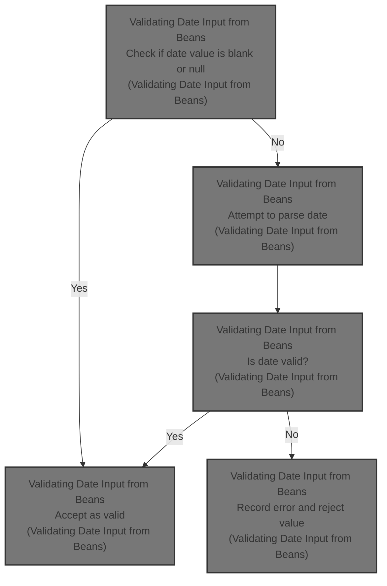
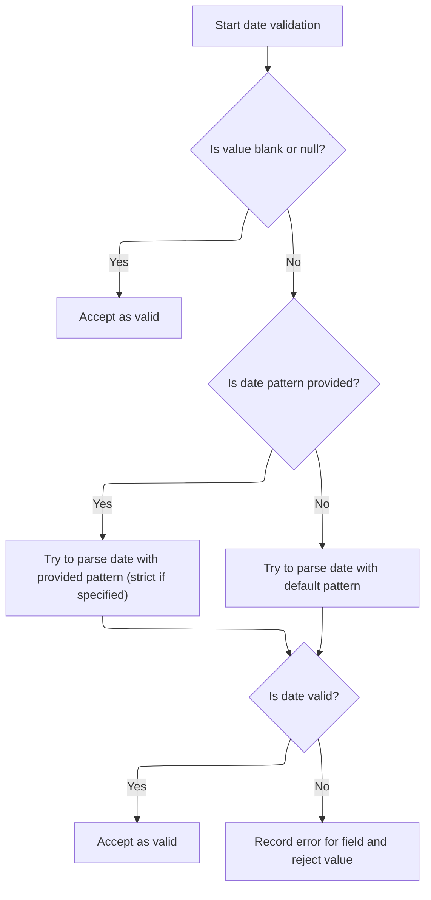

This document outlines the process for validating date input from beans. The flow checks if the provided date value is blank, and if not, attempts to parse it using the appropriate date pattern. Valid values are accepted, while invalid ones result in an error. This ensures that only properly formatted date values are processed.



# Validating Date Input from Beans



<SwmSnippet path="/core/src/main/java/org/apache/struts/validator/FieldChecks.java" line="854">

---

<SwmToken path="core/src/main/java/org/apache/struts/validator/FieldChecks.java" pos="854:7:7" line-data="    public static Object validateDate(Object bean, ValidatorAction va,">`validateDate`</SwmToken> kicks off the date validation by pulling the date string from the bean using the field definition. It checks for a date pattern in resources, falling back to a strict pattern if needed, and toggles strictness accordingly. If the input is blank, it exits early as valid. Otherwise, it parses the date using either a locale-based format or the specified pattern/strictness. If parsing fails, it logs an error and adds a message to the errors collection. The function returns false on failure or the parsed date object on success, so downstream code can use the parsed value directly.

```java
    public static Object validateDate(Object bean, ValidatorAction va,
        Field field, ActionMessages errors, Validator validator,
        HttpServletRequest request) {
        Object result = null;
        String value = null;

        try {
            value = evaluateBean(bean, field);
        } catch (Exception e) {
            processFailure(errors, field, validator.getFormName(), "date", e);
            return Boolean.FALSE;
        }

        boolean isStrict = false;
        String datePattern =
            Resources.getVarValue("datePattern", field, validator, request,
                false);

        if (GenericValidator.isBlankOrNull(datePattern)) {
            datePattern =
                Resources.getVarValue("datePatternStrict", field, validator,
                    request, false);

            if (!GenericValidator.isBlankOrNull(datePattern)) {
                isStrict = true;
            }
        }

        Locale locale = RequestUtils.getUserLocale(request, null);

        if (GenericValidator.isBlankOrNull(value)) {
            return Boolean.TRUE;
        }

        try {
            if (GenericValidator.isBlankOrNull(datePattern)) {
                result = GenericTypeValidator.formatDate(value, locale);
            } else {
                result =
                    GenericTypeValidator.formatDate(value, datePattern, isStrict);
            }
        } catch (Exception e) {
            log.error(e.getMessage(), e);
        }

        if (result == null) {
            errors.add(field.getKey(),
                Resources.getActionMessage(validator, request, va, field));
        }

        return (result == null) ? Boolean.FALSE : result;
    }
```

---

</SwmSnippet>

&nbsp;

*This is an auto-generated document by Swimm 🌊 and has not yet been verified by a human*

<SwmMeta version="3.0.0" repo-id="Z2l0aHViJTNBJTNBc3RydXRzMSUzQSUzQVN3aW1tLURlbW8=" repo-name="struts1"><sup>Powered by [Swimm](https://app.swimm.io/)</sup></SwmMeta>
