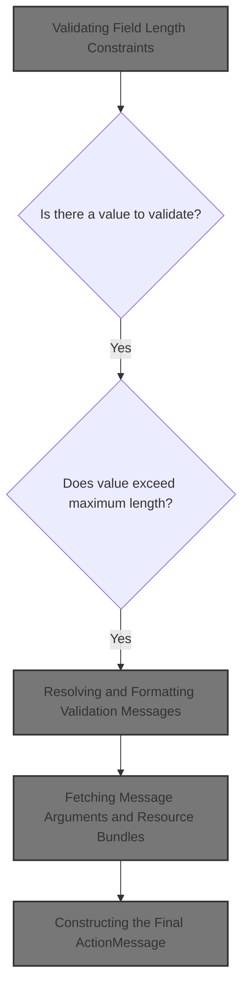
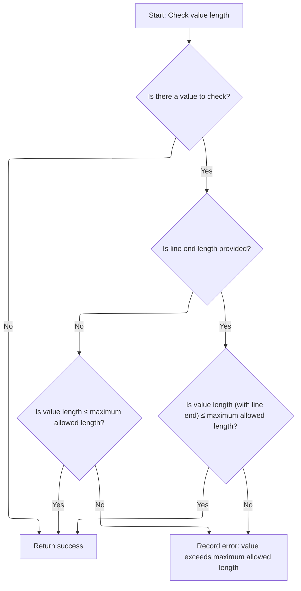
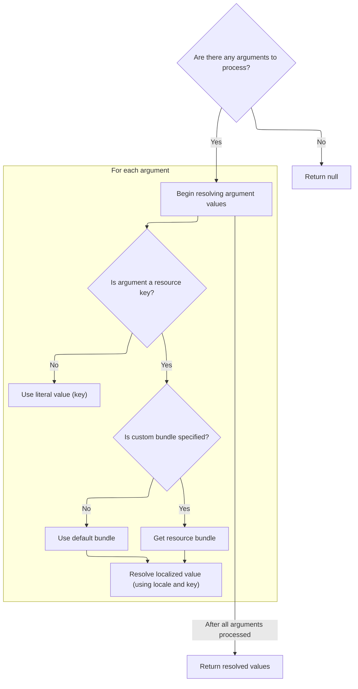

This document outlines how the system validates that a field value does not exceed its maximum allowed length. If the value is too long, a localized error message is generated and returned alongside the validation result.



# Validating Field Length Constraints



<SwmSnippet path="/core/src/main/java/org/apache/struts/validator/FieldChecks.java" line="1215">

---

<SwmToken path="core/src/main/java/org/apache/struts/validator/FieldChecks.java" pos="1215:7:7" line-data="    public static boolean validateMaxLength(Object bean, ValidatorAction va,">`validateMaxLength`</SwmToken> checks if a field value meets the max length requirement, using parameters pulled from Resources for flexibility. If the value is too long, it adds an error message using <SwmToken path="core/src/main/java/org/apache/struts/validator/FieldChecks.java" pos="1240:1:3" line-data="                        Resources.getActionMessage(validator, request, va, field));">`Resources.getActionMessage`</SwmToken>, which handles message formatting and localization. This is why we need to call Resources next—to resolve error messages and config values dynamically.

```java
    public static boolean validateMaxLength(Object bean, ValidatorAction va,
        Field field, ActionMessages errors, Validator validator,
        HttpServletRequest request) {
        String value = null;

        try {
            value = evaluateBean(bean, field);
            if (value != null) {
                String maxVar =
                    Resources.getVarValue("maxlength", field, validator,
                        request, true);
                int max = Integer.parseInt(maxVar);

                boolean isValid = false;
                String endLth = Resources.getVarValue("lineEndLength", field,
                    validator, request, false);
                if (GenericValidator.isBlankOrNull(endLth)) {
                    isValid = GenericValidator.maxLength(value, max);
                } else {
                    isValid = GenericValidator.maxLength(value, max,
                        Integer.parseInt(endLth));
                }

                if (!isValid) {
                    errors.add(field.getKey(),
                        Resources.getActionMessage(validator, request, va, field));

                    return false;
                }
            }
        } catch (Exception e) {
            processFailure(errors, field, validator.getFormName(), "maxlength", e);

            return false;
        }

        return true;
    }
```

---

</SwmSnippet>

# Resolving and Formatting Validation Messages

<SwmSnippet path="/core/src/main/java/org/apache/struts/validator/Resources.java" line="365">

---

In <SwmToken path="core/src/main/java/org/apache/struts/validator/Resources.java" pos="365:7:7" line-data="    public static ActionMessage getActionMessage(Validator validator,">`getActionMessage`</SwmToken>, we figure out which message key and bundle to use for the error, check if it's a resource, and handle localization. If the key is missing, we return a placeholder message. We need to call further into Resources to fetch argument values and message resources for proper formatting and localization.

```java
    public static ActionMessage getActionMessage(Validator validator,
        HttpServletRequest request, ValidatorAction va, Field field) {
        Msg msg = field.getMessage(va.getName());

        if ((msg != null) && !msg.isResource()) {
            return new ActionMessage(msg.getKey(), false);
        }

        String msgKey = null;
        String msgBundle = null;

        if (msg == null) {
            msgKey = va.getMsg();
        } else {
            msgKey = msg.getKey();
            msgBundle = msg.getBundle();
        }

        if ((msgKey == null) || (msgKey.length() == 0)) {
            return new ActionMessage("??? " + va.getName() + "."
                + field.getProperty() + " ???", false);
        }

        ServletContext application =
            (ServletContext) validator.getParameterValue(SERVLET_CONTEXT_PARAM);
        MessageResources messages =
            getMessageResources(application, request, msgBundle);
        Locale locale = RequestUtils.getUserLocale(request, null);

        Arg[] args = field.getArgs(va.getName());
        String[] argValues =
            getArgValues(application, request, messages, locale, args);

```

---

</SwmSnippet>

## Fetching Message Arguments and Resource Bundles



<SwmSnippet path="/core/src/main/java/org/apache/struts/validator/Resources.java" line="455">

---

<SwmToken path="core/src/main/java/org/apache/struts/validator/Resources.java" pos="455:9:9" line-data="    private static String[] getArgValues(ServletContext application,">`getArgValues`</SwmToken> loops through message arguments, fetching localized values from the right resource bundle for each one. If an argument specifies a bundle, we grab <SwmToken path="core/src/main/java/org/apache/struts/validator/Resources.java" pos="456:6:6" line-data="        HttpServletRequest request, MessageResources defaultMessages,">`MessageResources`</SwmToken> for it using <SwmToken path="core/src/main/java/org/apache/struts/validator/Resources.java" pos="471:1:1" line-data="                            getMessageResources(application, request,">`getMessageResources`</SwmToken>. This step ensures all message arguments are properly localized before formatting the final error message.

```java
    private static String[] getArgValues(ServletContext application,
        HttpServletRequest request, MessageResources defaultMessages,
        Locale locale, Arg[] args) {
        if ((args == null) || (args.length == 0)) {
            return null;
        }

        String[] values = new String[args.length];

        for (int i = 0; i < args.length; i++) {
            if (args[i] != null) {
                if (args[i].isResource()) {
                    MessageResources messages = defaultMessages;

                    if (args[i].getBundle() != null) {
                        messages =
                            getMessageResources(application, request,
                                args[i].getBundle());
                    }

                    values[i] = messages.getMessage(locale, args[i].getKey());
                } else {
                    values[i] = args[i].getKey();
                }
            }
        }

        return values;
    }
```

---

</SwmSnippet>

<SwmSnippet path="/core/src/main/java/org/apache/struts/validator/Resources.java" line="117">

---

<SwmToken path="core/src/main/java/org/apache/struts/validator/Resources.java" pos="117:7:7" line-data="    public static MessageResources getMessageResources(">`getMessageResources`</SwmToken> grabs the right <SwmToken path="core/src/main/java/org/apache/struts/validator/Resources.java" pos="117:5:5" line-data="    public static MessageResources getMessageResources(">`MessageResources`</SwmToken> by checking request attributes, then application attributes with module prefixes, and finally falls back to the global bundle. This lets Struts handle modular and global resource bundles, throwing if nothing is found.

```java
    public static MessageResources getMessageResources(
        ServletContext application, HttpServletRequest request, String bundle) {
        if (bundle == null) {
            bundle = Globals.MESSAGES_KEY;
        }

        MessageResources resources =
            (MessageResources) request.getAttribute(bundle);

        if (resources == null) {
            ModuleConfig moduleConfig =
                ModuleUtils.getInstance().getModuleConfig(request, application);

            resources =
                (MessageResources) application.getAttribute(bundle
                    + moduleConfig.getPrefix());
        }

        if (resources == null) {
            resources = (MessageResources) application.getAttribute(bundle);
        }

        if (resources == null) {
            throw new NullPointerException(
                "No message resources found for bundle: " + bundle);
        }

        return resources;
    }
```

---

</SwmSnippet>

## Constructing the Final <SwmToken path="core/src/main/java/org/apache/struts/validator/Resources.java" pos="365:5:5" line-data="    public static ActionMessage getActionMessage(Validator validator,">`ActionMessage`</SwmToken>

<SwmSnippet path="/core/src/main/java/org/apache/struts/validator/Resources.java" line="398">

---

Back in <SwmToken path="core/src/main/java/org/apache/struts/validator/FieldChecks.java" pos="1240:3:3" line-data="                        Resources.getActionMessage(validator, request, va, field));">`getActionMessage`</SwmToken>, after getting <SwmToken path="core/src/main/java/org/apache/struts/validator/Resources.java" pos="401:12:12" line-data="            actionMessage = new ActionMessage(msgKey, argValues);">`argValues`</SwmToken> from Resources, we either build an <SwmToken path="core/src/main/java/org/apache/struts/validator/Resources.java" pos="398:1:1" line-data="        ActionMessage actionMessage = null;">`ActionMessage`</SwmToken> with the key and args or fetch the localized message string if a bundle is set. This wraps up the message resolution and formatting, ready for display or logging.

```java
        ActionMessage actionMessage = null;

        if (msgBundle == null) {
            actionMessage = new ActionMessage(msgKey, argValues);
        } else {
            String message = messages.getMessage(locale, msgKey, argValues);

            actionMessage = new ActionMessage(message, false);
        }

        return actionMessage;
    }
```

---

</SwmSnippet>

&nbsp;

*This is an auto-generated document by Swimm 🌊 and has not yet been verified by a human*

<SwmMeta version="3.0.0" repo-id="Z2l0aHViJTNBJTNBc3RydXRzMSUzQSUzQVN3aW1tLURlbW8=" repo-name="struts1"><sup>Powered by [Swimm](https://app.swimm.io/)</sup></SwmMeta>
