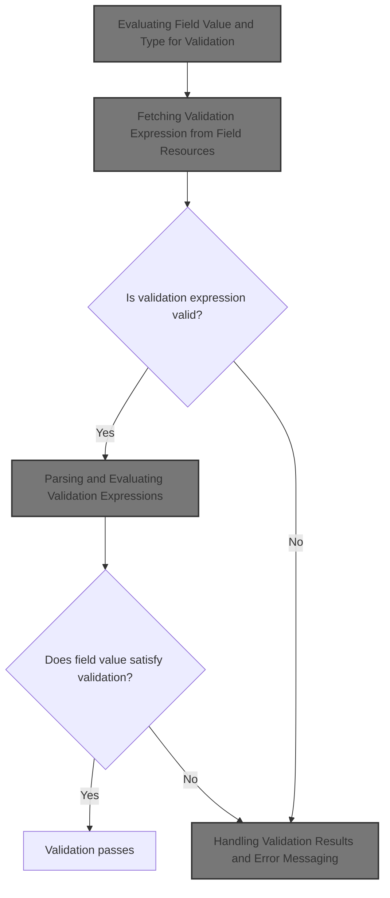
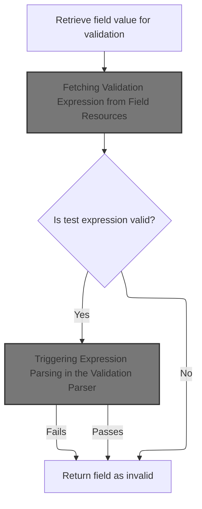
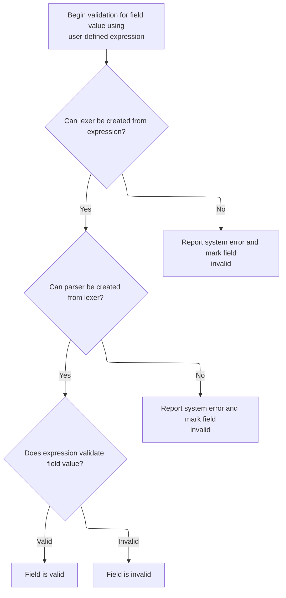
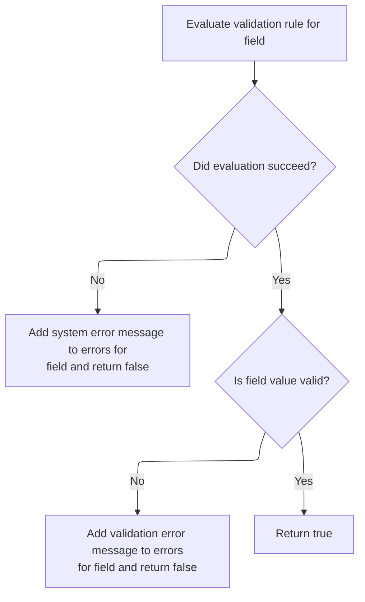
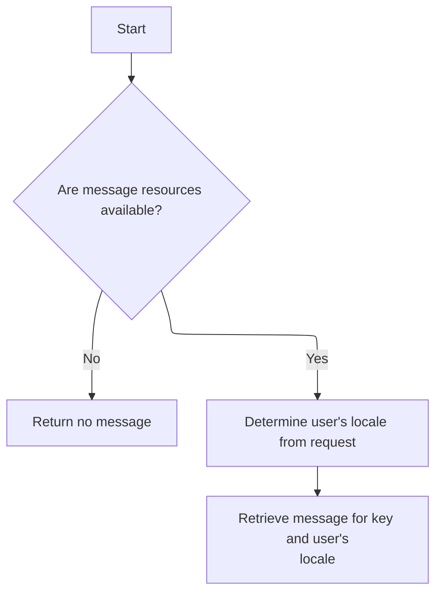
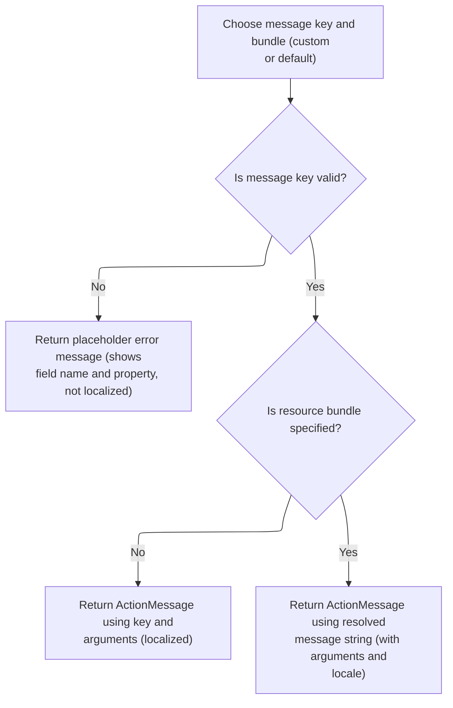

This document outlines how a form field's value is validated using a configurable expression. The process includes retrieving the field value, fetching and evaluating the validation rule, and generating a localized error message if validation fails.



# Evaluating Field Value and Type for Validation



<SwmSnippet path="/core/src/main/java/org/apache/struts/validator/validwhen/ValidWhen.java" line="79">

---

In <SwmToken path="core/src/main/java/org/apache/struts/validator/validwhen/ValidWhen.java" pos="79:7:7" line-data="    public static boolean validateValidWhen(Object bean, ValidatorAction va,">`validateValidWhen`</SwmToken>, we check if the field is indexed and, if so, pull out the index from the field key (like 'fieldName\[2\]'). This index is used later to make sure validation applies to the right element in a collection. After that, we check if the bean is a String, because if it is, we can use it directly; otherwise, we need to extract the value from the bean using a utility. That's why we call <SwmToken path="core/src/main/java/org/apache/struts/validator/validwhen/ValidWhen.java" pos="100:4:4" line-data="        if (isString(bean)) {">`isString`</SwmToken> next—to decide which path to take for getting the value.

```java
    public static boolean validateValidWhen(Object bean, ValidatorAction va,
        Field field, ActionMessages errors, Validator validator,
        HttpServletRequest request) {
        Object form = validator.getParameterValue(Validator.BEAN_PARAM);
        String value = null;
        boolean valid = false;
        int index = -1;

        if (field.isIndexed()) {
            String key = field.getKey();

            final int leftBracket = key.indexOf("[");
            final int rightBracket = key.indexOf("]");

            if ((leftBracket > -1) && (rightBracket > -1)) {
                index =
                    Integer.parseInt(key.substring(leftBracket + 1,
                        rightBracket));
            }
        }

        if (isString(bean)) {
```

---

</SwmSnippet>

<SwmSnippet path="/core/src/main/java/org/apache/struts/validator/validwhen/ValidWhen.java" line="60">

---

<SwmToken path="core/src/main/java/org/apache/struts/validator/validwhen/ValidWhen.java" pos="60:7:7" line-data="    private static boolean isString(Object obj) {">`isString`</SwmToken> checks if the input is a String, but also returns true for null. So, anything that's either a String or null passes this check, which means the rest of the validation logic will treat nulls as if they're Strings.

```java
    private static boolean isString(Object obj) {
        return (obj == null) ? true : String.class.isInstance(obj);
    }
```

---

</SwmSnippet>

<SwmSnippet path="/core/src/main/java/org/apache/struts/validator/validwhen/ValidWhen.java" line="101">

---

Back in <SwmToken path="core/src/main/java/org/apache/struts/validator/validwhen/ValidWhen.java" pos="79:7:7" line-data="    public static boolean validateValidWhen(Object bean, ValidatorAction va,">`validateValidWhen`</SwmToken>, after checking if the bean is a String, we either use it directly or call a utility to extract the property value as a String. This lets us handle both plain String values and beans with properties. That's why we call into <SwmToken path="core/src/main/java/org/apache/struts/validator/FieldChecks.java" pos="53:4:4" line-data="public class FieldChecks implements Serializable {">`FieldChecks`</SwmToken> next—to handle the property extraction logic.

```java
            value = (String) bean;
        } else {
            value = ValidatorUtils.getValueAsString(bean, field.getProperty());
        }

```

---

</SwmSnippet>

<SwmSnippet path="/core/src/main/java/org/apache/struts/validator/FieldChecks.java" line="87">

---

<SwmToken path="core/src/main/java/org/apache/struts/validator/FieldChecks.java" pos="87:7:7" line-data="    private static String getValueAsString(Object bean, String property) ">`getValueAsString`</SwmToken> pulls the property value from the bean and then decides how to turn it into a String: null stays null, empty arrays and collections become empty strings, and non-empty ones just use their default <SwmToken path="core/src/main/java/org/apache/struts/validator/FieldChecks.java" pos="96:23:23" line-data="            return ((String[]) value).length &gt; 0 ? value.toString() : &quot;&quot;;">`toString`</SwmToken> (which isn't the contents, just the object info). Everything else gets its <SwmToken path="core/src/main/java/org/apache/struts/validator/FieldChecks.java" pos="96:23:23" line-data="            return ((String[]) value).length &gt; 0 ? value.toString() : &quot;&quot;;">`toString`</SwmToken>.

```java
    private static String getValueAsString(Object bean, String property) 
            throws Exception {
        
        Object value = PropertyUtils.getProperty(bean, property);
        if (value == null) {
            return null;
        }

        if (value instanceof String[]) {
            return ((String[]) value).length > 0 ? value.toString() : "";

        } else if (value instanceof Collection) {
            return ((Collection) value).isEmpty() ? "" : value.toString();

        } else {
            return value.toString();
        }
    }
```

---

</SwmSnippet>

<SwmSnippet path="/core/src/main/java/org/apache/struts/validator/validwhen/ValidWhen.java" line="106">

---

After getting the value as a String, <SwmToken path="core/src/main/java/org/apache/struts/validator/validwhen/ValidWhen.java" pos="79:7:7" line-data="    public static boolean validateValidWhen(Object bean, ValidatorAction va,">`validateValidWhen`</SwmToken> grabs the 'test' expression from resources. This lets validation rules be defined in config instead of code, so you can change them without redeploying. If the resource is missing, it logs an error and adds a generic error message.

```java
        String test = null;

        try {
            test =
                Resources.getVarValue("test", field, validator, request, true);
        } catch (IllegalArgumentException ex) {
            String logErrorMsg =
                sysmsgs.getMessage("validation.failed", "validwhen",
                    field.getProperty(), validator.getFormName(), ex.toString());

            log.error(logErrorMsg);

            String userErrorMsg = sysmsgs.getMessage("system.error");

            errors.add(field.getKey(), new ActionMessage(userErrorMsg, false));

            return false;
        }

```

---

</SwmSnippet>

## Fetching Validation Expression from Field Resources

<SwmSnippet path="/core/src/main/java/org/apache/struts/validator/Resources.java" line="157">

---

In <SwmToken path="core/src/main/java/org/apache/struts/validator/Resources.java" pos="157:7:7" line-data="    public static String getVarValue(String varName, Field field,">`getVarValue`</SwmToken>, we grab the variable from the field and check if it's there. If it's missing and required, we throw an exception or log it. Next, we call into <SwmToken path="core/src/main/java/org/apache/struts/util/PropertyMessageResources.java" pos="82:8:8" line-data=" * Configure &lt;code&gt;PropertyMessageResources&lt;/code&gt; to operate in this mode by">`PropertyMessageResources`</SwmToken> to fetch the actual message string, which lets us handle localization and dynamic error messages.

```java
    public static String getVarValue(String varName, Field field,
        Validator validator, HttpServletRequest request, boolean required) {
        Var var = field.getVar(varName);

        if (var == null) {
            String msg = sysmsgs.getMessage("variable.missing", varName);

```

---

</SwmSnippet>

### Resolving Localized Messages with Fallbacks

```mermaid
%%{init: {"flowchart": {"defaultRenderer": "elk"}} }%%
flowchart TD
    node1["Request message for locale and key"] --> node2{"Is message found for requested locale?"}
    click node1 openCode "core/src/main/java/org/apache/struts/util/PropertyMessageResources.java:227:238"
    node2 -->|"Yes"| node3["Return found message"]
    click node2 openCode "core/src/main/java/org/apache/struts/util/PropertyMessageResources.java:239:241"
    click node3 openCode "core/src/main/java/org/apache/struts/util/PropertyMessageResources.java:239:241"
    node2 -->|"No"| node4{"Mode?"}
    click node4 openCode "core/src/main/java/org/apache/struts/util/PropertyMessageResources.java:244:265"
    node4 -->|"JSTL"| node5{"Is message found in default properties
file?"}
    node4 -->|"Resource Bundle"| node6{"Is message found for default locale?"}
    node6 -->|"Yes"| node7["Return found message"]
    click node6 openCode "core/src/main/java/org/apache/struts/util/PropertyMessageResources.java:252:254"
    click node7 openCode "core/src/main/java/org/apache/struts/util/PropertyMessageResources.java:252:254"
    node6 -->|"No"| node5
    node4 -->|"Default"| node8{"Is message found for default locale?"}
    node8 -->|"Yes"| node9["Return found message"]
    click node8 openCode "core/src/main/java/org/apache/struts/util/PropertyMessageResources.java:260:263"
    click node9 openCode "core/src/main/java/org/apache/struts/util/PropertyMessageResources.java:260:263"
    node8 -->|"No"| node5
    node5 -->|"Yes"| node10["Return found message"]
    click node5 openCode "core/src/main/java/org/apache/struts/util/PropertyMessageResources.java:271:273"
    click node10 openCode "core/src/main/java/org/apache/struts/util/PropertyMessageResources.java:271:273"
    node5 -->|"No"| node11{"Should return null?"}
    click node11 openCode "core/src/main/java/org/apache/struts/util/PropertyMessageResources.java:277:281"
    node11 -->|"Yes"| node12["Return null"]
    click node12 openCode "core/src/main/java/org/apache/struts/util/PropertyMessageResources.java:278:279"
    node11 -->|"No"| node13["Return placeholder message: #quot;???key???#quot;"]
    click node13 openCode "core/src/main/java/org/apache/struts/util/PropertyMessageResources.java:280:281"

classDef HeadingStyle fill:#777777,stroke:#333,stroke-width:2px;

%% Swimm:
%% %%{init: {"flowchart": {"defaultRenderer": "elk"}} }%%
%% flowchart TD
%%     node1["Request message for locale and key"] --> node2{"Is message found for requested locale?"}
%%     click node1 openCode "<SwmPath>[core/…/util/PropertyMessageResources.java](core/src/main/java/org/apache/struts/util/PropertyMessageResources.java)</SwmPath>:227:238"
%%     node2 -->|"Yes"| node3["Return found message"]
%%     click node2 openCode "<SwmPath>[core/…/util/PropertyMessageResources.java](core/src/main/java/org/apache/struts/util/PropertyMessageResources.java)</SwmPath>:239:241"
%%     click node3 openCode "<SwmPath>[core/…/util/PropertyMessageResources.java](core/src/main/java/org/apache/struts/util/PropertyMessageResources.java)</SwmPath>:239:241"
%%     node2 -->|"No"| node4{"Mode?"}
%%     click node4 openCode "<SwmPath>[core/…/util/PropertyMessageResources.java](core/src/main/java/org/apache/struts/util/PropertyMessageResources.java)</SwmPath>:244:265"
%%     node4 -->|"JSTL"| node5{"Is message found in default properties
%% file?"}
%%     node4 -->|"Resource Bundle"| node6{"Is message found for default locale?"}
%%     node6 -->|"Yes"| node7["Return found message"]
%%     click node6 openCode "<SwmPath>[core/…/util/PropertyMessageResources.java](core/src/main/java/org/apache/struts/util/PropertyMessageResources.java)</SwmPath>:252:254"
%%     click node7 openCode "<SwmPath>[core/…/util/PropertyMessageResources.java](core/src/main/java/org/apache/struts/util/PropertyMessageResources.java)</SwmPath>:252:254"
%%     node6 -->|"No"| node5
%%     node4 -->|"Default"| node8{"Is message found for default locale?"}
%%     node8 -->|"Yes"| node9["Return found message"]
%%     click node8 openCode "<SwmPath>[core/…/util/PropertyMessageResources.java](core/src/main/java/org/apache/struts/util/PropertyMessageResources.java)</SwmPath>:260:263"
%%     click node9 openCode "<SwmPath>[core/…/util/PropertyMessageResources.java](core/src/main/java/org/apache/struts/util/PropertyMessageResources.java)</SwmPath>:260:263"
%%     node8 -->|"No"| node5
%%     node5 -->|"Yes"| node10["Return found message"]
%%     click node5 openCode "<SwmPath>[core/…/util/PropertyMessageResources.java](core/src/main/java/org/apache/struts/util/PropertyMessageResources.java)</SwmPath>:271:273"
%%     click node10 openCode "<SwmPath>[core/…/util/PropertyMessageResources.java](core/src/main/java/org/apache/struts/util/PropertyMessageResources.java)</SwmPath>:271:273"
%%     node5 -->|"No"| node11{"Should return null?"}
%%     click node11 openCode "<SwmPath>[core/…/util/PropertyMessageResources.java](core/src/main/java/org/apache/struts/util/PropertyMessageResources.java)</SwmPath>:277:281"
%%     node11 -->|"Yes"| node12["Return null"]
%%     click node12 openCode "<SwmPath>[core/…/util/PropertyMessageResources.java](core/src/main/java/org/apache/struts/util/PropertyMessageResources.java)</SwmPath>:278:279"
%%     node11 -->|"No"| node13["Return placeholder message: #quot;???key???#quot;"]
%%     click node13 openCode "<SwmPath>[core/…/util/PropertyMessageResources.java](core/src/main/java/org/apache/struts/util/PropertyMessageResources.java)</SwmPath>:280:281"
%% 
%% classDef HeadingStyle fill:#777777,stroke:#333,stroke-width:2px;
```



<SwmSnippet path="/core/src/main/java/org/apache/struts/util/PropertyMessageResources.java" line="227">

---

<SwmToken path="core/src/main/java/org/apache/struts/util/PropertyMessageResources.java" pos="227:5:5" line-data="    public String getMessage(Locale locale, String key) {">`getMessage`</SwmToken> tries to find the message for the given locale and key, then falls back based on mode (JSTL, resource bundle, or default). If nothing is found, it returns a placeholder or null. This makes sure users get some kind of feedback even if localization is missing.

```java
    public String getMessage(Locale locale, String key) {
        if (log.isDebugEnabled()) {
            log.debug("getMessage(" + locale + "," + key + ")");
        }

        // Initialize variables we will require
        String localeKey = localeKey(locale);
        String originalKey = messageKey(localeKey, key);
        String message = null;

        // Search the specified Locale
        message = findMessage(locale, key, originalKey);
        if (message != null) {
            return message;
        }

        // JSTL Compatibility - JSTL doesn't use the default locale
        if (mode == MODE_JSTL) {

           // do nothing (i.e. don't use default Locale)

        // PropertyResourcesBundle - searches through the hierarchy
        // for the default Locale (e.g. first en_US then en)
        } else if (mode == MODE_RESOURCE_BUNDLE) {

            if (!defaultLocale.equals(locale)) {
                message = findMessage(defaultLocale, key, originalKey);
            }

        // Default (backwards) Compatibility - just searches the
        // specified Locale (e.g. just en_US)
        } else {

            if (!defaultLocale.equals(locale)) {
                localeKey = localeKey(defaultLocale);
                message = findMessage(localeKey, key, originalKey);
            }

        }
        if (message != null) {
            return message;
        }

        // Find the message in the default properties file
        message = findMessage("", key, originalKey);
        if (message != null) {
            return message;
        }

        // Return an appropriate error indication
        if (returnNull) {
            return (null);
        } else {
            return ("???" + messageKey(locale, key) + "???");
        }
    }
```

---

</SwmSnippet>

<SwmSnippet path="/core/src/main/java/org/apache/struts/util/PropertyMessageResources.java" line="393">

---

<SwmToken path="core/src/main/java/org/apache/struts/util/PropertyMessageResources.java" pos="393:5:5" line-data="    private String findMessage(Locale locale, String key, String originalKey) {">`findMessage`</SwmToken> keeps stripping parts off the locale key (like going from <SwmToken path="core/src/main/java/org/apache/struts/util/PropertyMessageResources.java" pos="249:19:19" line-data="        // for the default Locale (e.g. first en_US then en)">`en_US`</SwmToken> to 'en') until it finds a message or runs out of options. This way, users get a message even if their exact locale isn't covered.

```java
    private String findMessage(Locale locale, String key, String originalKey) {

        // Initialize variables we will require
        String localeKey = localeKey(locale);
        String messageKey = null;
        String message = null;
        int underscore = 0;

        // Loop from specific to general Locales looking for this message
        while (true) {
            message = findMessage(localeKey, key, originalKey);
            if (message != null) {
                break;
            }

            // Strip trailing modifiers to try a more general locale key
            underscore = localeKey.lastIndexOf("_");

            if (underscore < 0) {
                break;
            }

            localeKey = localeKey.substring(0, underscore);
        }
```

---

</SwmSnippet>

### Handling Missing Variables and Application Context

<SwmSnippet path="/core/src/main/java/org/apache/struts/validator/Resources.java" line="164">

---

After coming back from <SwmToken path="core/src/main/java/org/apache/struts/util/PropertyMessageResources.java" pos="82:8:8" line-data=" * Configure &lt;code&gt;PropertyMessageResources&lt;/code&gt; to operate in this mode by">`PropertyMessageResources`</SwmToken>, if the variable is missing and required, we throw an exception. If not, we log it and return null. Then we grab the application context and use it to fetch the actual variable value for validation.

```java
            if (required) {
                throw new IllegalArgumentException(msg);
            }

            if (log.isDebugEnabled()) {
                log.debug(field.getProperty() + ": " + msg);
            }

            return null;
        }

        ServletContext application =
            (ServletContext) validator.getParameterValue(SERVLET_CONTEXT_PARAM);

        return getVarValue(var, application, request, required);
    }
```

---

</SwmSnippet>

## Parsing and Evaluating Validation Expressions



<SwmSnippet path="/core/src/main/java/org/apache/struts/validator/validwhen/ValidWhen.java" line="125">

---

After grabbing the validation expression from resources, <SwmToken path="core/src/main/java/org/apache/struts/validator/validwhen/ValidWhen.java" pos="79:7:7" line-data="    public static boolean validateValidWhen(Object bean, ValidatorAction va,">`validateValidWhen`</SwmToken> spins up a lexer and parser to interpret it. If either fails, we log and bail out. We set the form, index, and value in the parser so it knows what to validate.

```java
        // Create the Lexer
        ValidWhenLexer lexer = null;

        try {
            lexer = new ValidWhenLexer(new StringReader(test));
        } catch (Exception ex) {
            String logErrorMsg =
                "ValidWhenLexer Error for field ' " + field.getKey() + "' - "
                + ex;

            log.error(logErrorMsg);

            String userErrorMsg = sysmsgs.getMessage("system.error");

            errors.add(field.getKey(), new ActionMessage(userErrorMsg, false));

            return false;
        }

        // Create the Parser
        ValidWhenParser parser = null;

        try {
            parser = new ValidWhenParser(lexer);
        } catch (Exception ex) {
            String logErrorMsg =
                "ValidWhenParser Error for field ' " + field.getKey() + "' - "
                + ex;

            log.error(logErrorMsg);

            String userErrorMsg = sysmsgs.getMessage("system.error");

            errors.add(field.getKey(), new ActionMessage(userErrorMsg, false));

            return false;
        }

        parser.setForm(form);
        parser.setIndex(index);
        parser.setValue(value);

        try {
            parser.expression();
```

---

</SwmSnippet>

## Triggering Expression Parsing in the Validation Parser

<SwmSnippet path="/core/src/main/java/org/apache/struts/validator/validwhen/ValidWhenParser.java" line="406">

---

In <SwmToken path="core/src/main/java/org/apache/struts/validator/validwhen/ValidWhenParser.java" pos="406:7:7" line-data="	public final void expression() throws RecognitionException, TokenStreamException {">`expression`</SwmToken>, we just call <SwmToken path="core/src/main/java/org/apache/struts/validator/validwhen/ValidWhenParser.java" pos="409:1:3" line-data="		expr();">`expr()`</SwmToken> to start parsing the validation expression. This keeps the entry point clean and hands off the heavy lifting to the next function.

```java
	public final void expression() throws RecognitionException, TokenStreamException {
		
		
		expr();
```

---

</SwmSnippet>

### Evaluating Parsed Validation Logic

See <SwmLink doc-title="Evaluating Parenthesized Validation Expressions">[Evaluating Parenthesized Validation Expressions](/.swm/evaluating-parenthesized-validation-expressions.z0nr3n5l.sw.md)</SwmLink>

### Completing Expression Parsing and Validation

<SwmSnippet path="/core/src/main/java/org/apache/struts/validator/validwhen/ValidWhenParser.java" line="410">

---

After <SwmToken path="core/src/main/java/org/apache/struts/validator/validwhen/ValidWhenParser.java" pos="409:1:3" line-data="		expr();">`expr()`</SwmToken> finishes, we match EOF to make sure the whole expression was parsed. If there's leftover stuff, that's an error. Next, we move on to ActionConfigMatcher to handle config matching for the result.

```java
		match(Token.EOF_TYPE);
	}
```

---

</SwmSnippet>

## Handling Validation Results and Error Messaging



<SwmSnippet path="/core/src/main/java/org/apache/struts/validator/validwhen/ValidWhen.java" line="169">

---

After the parser runs, <SwmToken path="core/src/main/java/org/apache/struts/validator/validwhen/ValidWhen.java" pos="79:7:7" line-data="    public static boolean validateValidWhen(Object bean, ValidatorAction va,">`validateValidWhen`</SwmToken> checks the result. If it's not valid, we call <SwmToken path="core/src/main/java/org/apache/struts/validator/validwhen/ValidWhen.java" pos="185:1:3" line-data="                Resources.getActionMessage(validator, request, va, field));">`Resources.getActionMessage`</SwmToken> to build the error message for the user, handling localization and formatting.

```java
            valid = parser.getResult();
        } catch (Exception ex) {
            String logErrorMsg =
                "ValidWhen Error for field ' " + field.getKey() + "' - " + ex;

            log.error(logErrorMsg);

            String userErrorMsg = sysmsgs.getMessage("system.error");

            errors.add(field.getKey(), new ActionMessage(userErrorMsg, false));

            return false;
        }

        if (!valid) {
            errors.add(field.getKey(),
                Resources.getActionMessage(validator, request, va, field));

            return false;
        }

        return true;
    }
```

---

</SwmSnippet>

# Building Localized Error Messages for Validation

<SwmSnippet path="/core/src/main/java/org/apache/struts/validator/Resources.java" line="365">

---

In <SwmToken path="core/src/main/java/org/apache/struts/validator/Resources.java" pos="365:7:7" line-data="    public static ActionMessage getActionMessage(Validator validator,">`getActionMessage`</SwmToken>, we grab the message key and bundle from the field and action. If the Msg isn't a resource, we use its key directly. Otherwise, we figure out which bundle and key to use, then call <SwmToken path="core/src/main/java/org/apache/struts/config/ConfigHelper.java" pos="56:4:4" line-data="public class ConfigHelper implements ConfigHelperInterface {">`ConfigHelper`</SwmToken> to fetch the localized message.

```java
    public static ActionMessage getActionMessage(Validator validator,
        HttpServletRequest request, ValidatorAction va, Field field) {
        Msg msg = field.getMessage(va.getName());

        if ((msg != null) && !msg.isResource()) {
            return new ActionMessage(msg.getKey(), false);
        }

```

---

</SwmSnippet>

## Retrieving Localized Messages from Config and Request



<SwmSnippet path="/core/src/main/java/org/apache/struts/config/ConfigHelper.java" line="496">

---

In <SwmToken path="core/src/main/java/org/apache/struts/config/ConfigHelper.java" pos="496:5:5" line-data="    public String getMessage(String key) {">`getMessage`</SwmToken>, we grab <SwmToken path="core/src/main/java/org/apache/struts/config/ConfigHelper.java" pos="497:1:1" line-data="        MessageResources resources = getMessageResources();">`MessageResources`</SwmToken> and then use <SwmToken path="core/src/main/java/org/apache/struts/config/ConfigHelper.java" pos="503:7:9" line-data="        return resources.getMessage(RequestUtils.getUserLocale(request, null),">`RequestUtils.getUserLocale`</SwmToken> to figure out which locale to use. This makes sure we fetch the message in the user's language.

```java
    public String getMessage(String key) {
        MessageResources resources = getMessageResources();

        if (resources == null) {
            return null;
        }

        return resources.getMessage(RequestUtils.getUserLocale(request, null),
```

---

</SwmSnippet>

<SwmSnippet path="/core/src/main/java/org/apache/struts/util/RequestUtils.java" line="299">

---

<SwmToken path="core/src/main/java/org/apache/struts/util/RequestUtils.java" pos="299:7:7" line-data="    public static Locale getUserLocale(HttpServletRequest request, String locale) {">`getUserLocale`</SwmToken> checks the session for a locale using <SwmToken path="core/src/main/java/org/apache/struts/util/RequestUtils.java" pos="304:5:7" line-data="            locale = Globals.LOCALE_KEY;">`Globals.LOCALE_KEY`</SwmToken>. If it's not there, it falls back to the request's locale, so users get messages in their preferred language unless they've set something custom in their session.

```java
    public static Locale getUserLocale(HttpServletRequest request, String locale) {
        Locale userLocale = null;
        HttpSession session = request.getSession(false);

        if (locale == null) {
            locale = Globals.LOCALE_KEY;
        }

        // Only check session if sessions are enabled
        if (session != null) {
            userLocale = (Locale) session.getAttribute(locale);
        }

        if (userLocale == null) {
            // Returns Locale based on Accept-Language header or the server default
            userLocale = request.getLocale();
        }

        return userLocale;
    }
```

---

</SwmSnippet>

<SwmSnippet path="/core/src/main/java/org/apache/struts/config/ConfigHelper.java" line="503">

---

After getting the locale from <SwmToken path="core/src/main/java/org/apache/struts/config/ConfigHelper.java" pos="503:7:7" line-data="        return resources.getMessage(RequestUtils.getUserLocale(request, null),">`RequestUtils`</SwmToken>, <SwmToken path="core/src/main/java/org/apache/struts/config/ConfigHelper.java" pos="56:4:4" line-data="public class ConfigHelper implements ConfigHelperInterface {">`ConfigHelper`</SwmToken> uses it to fetch the message from <SwmToken path="core/src/main/java/org/apache/struts/validator/Resources.java" pos="117:5:5" line-data="    public static MessageResources getMessageResources(">`MessageResources`</SwmToken>. Next, we call Resources to handle any extra formatting or argument substitution.

```java
        return resources.getMessage(RequestUtils.getUserLocale(request, null),
            key);
    }
```

---

</SwmSnippet>

<SwmSnippet path="/core/src/main/java/org/apache/struts/validator/Resources.java" line="249">

---

<SwmToken path="core/src/main/java/org/apache/struts/validator/Resources.java" pos="249:7:7" line-data="    public static String getMessage(HttpServletRequest request, String key) {">`getMessage`</SwmToken> grabs <SwmToken path="core/src/main/java/org/apache/struts/validator/Resources.java" pos="250:1:1" line-data="        MessageResources messages = getMessageResources(request);">`MessageResources`</SwmToken> and then calls <SwmToken path="core/src/main/java/org/apache/struts/validator/Resources.java" pos="252:8:10" line-data="        return getMessage(messages, RequestUtils.getUserLocale(request, null),">`RequestUtils.getUserLocale`</SwmToken> to figure out which locale to use. This makes sure the message is localized for the user.

```java
    public static String getMessage(HttpServletRequest request, String key) {
        MessageResources messages = getMessageResources(request);

        return getMessage(messages, RequestUtils.getUserLocale(request, null),
            key);
    }
```

---

</SwmSnippet>

## Preparing Arguments for Error Message Formatting



<SwmSnippet path="/core/src/main/java/org/apache/struts/validator/Resources.java" line="373">

---

After <SwmToken path="core/src/main/java/org/apache/struts/config/ConfigHelper.java" pos="56:4:4" line-data="public class ConfigHelper implements ConfigHelperInterface {">`ConfigHelper`</SwmToken> returns the message, Resources grabs the message key and bundle, then gets <SwmToken path="core/src/main/java/org/apache/struts/validator/Resources.java" pos="390:1:1" line-data="        MessageResources messages =">`MessageResources`</SwmToken> and prepares arguments for formatting. This all depends on Validator and Field being set up right.

```java
        String msgKey = null;
        String msgBundle = null;

        if (msg == null) {
            msgKey = va.getMsg();
        } else {
            msgKey = msg.getKey();
            msgBundle = msg.getBundle();
        }

        if ((msgKey == null) || (msgKey.length() == 0)) {
            return new ActionMessage("??? " + va.getName() + "."
                + field.getProperty() + " ???", false);
        }

        ServletContext application =
            (ServletContext) validator.getParameterValue(SERVLET_CONTEXT_PARAM);
        MessageResources messages =
            getMessageResources(application, request, msgBundle);
```

---

</SwmSnippet>

<SwmSnippet path="/core/src/main/java/org/apache/struts/validator/Resources.java" line="117">

---

<SwmToken path="core/src/main/java/org/apache/struts/validator/Resources.java" pos="117:7:7" line-data="    public static MessageResources getMessageResources(">`getMessageResources`</SwmToken> tries the request attribute, then the application attribute with module prefix, then just the bundle key. If nothing is found, it throws. This lets modules have their own bundles and supports fallback.

```java
    public static MessageResources getMessageResources(
        ServletContext application, HttpServletRequest request, String bundle) {
        if (bundle == null) {
            bundle = Globals.MESSAGES_KEY;
        }

        MessageResources resources =
            (MessageResources) request.getAttribute(bundle);

        if (resources == null) {
            ModuleConfig moduleConfig =
                ModuleUtils.getInstance().getModuleConfig(request, application);

            resources =
                (MessageResources) application.getAttribute(bundle
                    + moduleConfig.getPrefix());
        }

        if (resources == null) {
            resources = (MessageResources) application.getAttribute(bundle);
        }

        if (resources == null) {
            throw new NullPointerException(
                "No message resources found for bundle: " + bundle);
        }

        return resources;
    }
```

---

</SwmSnippet>

<SwmSnippet path="/core/src/main/java/org/apache/struts/validator/Resources.java" line="392">

---

After getting <SwmToken path="core/src/main/java/org/apache/struts/validator/Resources.java" pos="117:5:5" line-data="    public static MessageResources getMessageResources(">`MessageResources`</SwmToken>, Resources calls <SwmToken path="core/src/main/java/org/apache/struts/validator/Resources.java" pos="392:7:7" line-data="        Locale locale = RequestUtils.getUserLocale(request, null);">`RequestUtils`</SwmToken> to get the user's locale. This makes sure error messages are localized for whoever's using the app.

```java
        Locale locale = RequestUtils.getUserLocale(request, null);

```

---

</SwmSnippet>

<SwmSnippet path="/core/src/main/java/org/apache/struts/validator/Resources.java" line="394">

---

After getting the locale, Resources grabs the arguments for the error message. These are used to fill in placeholders so the message makes sense to the user.

```java
        Arg[] args = field.getArgs(va.getName());
```

---

</SwmSnippet>

<SwmSnippet path="/core/src/main/java/org/apache/struts/validator/Resources.java" line="420">

---

<SwmToken path="core/src/main/java/org/apache/struts/validator/Resources.java" pos="420:9:9" line-data="    public static String[] getArgs(String actionName,">`getArgs`</SwmToken> grabs up to four arguments from the field, checks if each is a resource, and localizes them if needed. If an Arg is missing, it skips it. Only four args are processed, so that's a fixed limit.

```java
    public static String[] getArgs(String actionName,
        MessageResources messages, Locale locale, Field field) {
        String[] argMessages = new String[4];

        Arg[] args =
            new Arg[] {
                field.getArg(actionName, 0), field.getArg(actionName, 1),
                field.getArg(actionName, 2), field.getArg(actionName, 3)
            };

        for (int i = 0; i < args.length; i++) {
            if (args[i] == null) {
                continue;
            }

            if (args[i].isResource()) {
                argMessages[i] = getMessage(messages, locale, args[i].getKey());
            } else {
                argMessages[i] = args[i].getKey();
            }
        }
```

---

</SwmSnippet>

<SwmSnippet path="/core/src/main/java/org/apache/struts/validator/Resources.java" line="395">

---

After getting the argument messages, Resources calls <SwmToken path="core/src/main/java/org/apache/struts/validator/Resources.java" pos="396:1:1" line-data="            getArgValues(application, request, messages, locale, args);">`getArgValues`</SwmToken> to resolve the actual values, including localization and bundle lookup. This makes sure the error message is formatted with the right values.

```java
        String[] argValues =
            getArgValues(application, request, messages, locale, args);

```

---

</SwmSnippet>

<SwmSnippet path="/core/src/main/java/org/apache/struts/validator/Resources.java" line="455">

---

<SwmToken path="core/src/main/java/org/apache/struts/validator/Resources.java" pos="455:9:9" line-data="    private static String[] getArgValues(ServletContext application,">`getArgValues`</SwmToken> checks if each argument needs to be localized from a specific bundle. If so, it grabs the right <SwmToken path="core/src/main/java/org/apache/struts/validator/Resources.java" pos="456:6:6" line-data="        HttpServletRequest request, MessageResources defaultMessages,">`MessageResources`</SwmToken> and fetches the value. Otherwise, it just uses the key. This lets error messages pull in values from different bundles.

```java
    private static String[] getArgValues(ServletContext application,
        HttpServletRequest request, MessageResources defaultMessages,
        Locale locale, Arg[] args) {
        if ((args == null) || (args.length == 0)) {
            return null;
        }

        String[] values = new String[args.length];

        for (int i = 0; i < args.length; i++) {
            if (args[i] != null) {
                if (args[i].isResource()) {
                    MessageResources messages = defaultMessages;

                    if (args[i].getBundle() != null) {
                        messages =
                            getMessageResources(application, request,
                                args[i].getBundle());
                    }

                    values[i] = messages.getMessage(locale, args[i].getKey());
                } else {
                    values[i] = args[i].getKey();
                }
            }
        }

        return values;
    }
```

---

</SwmSnippet>

<SwmSnippet path="/core/src/main/java/org/apache/struts/validator/Resources.java" line="398">

---

After getting argument values, Resources builds the <SwmToken path="core/src/main/java/org/apache/struts/validator/Resources.java" pos="398:1:1" line-data="        ActionMessage actionMessage = null;">`ActionMessage`</SwmToken>. If there's no bundle, it uses the key and values. If there is, it fetches the localized string and marks it as not a resource key. This changes how the message is handled in Struts.

```java
        ActionMessage actionMessage = null;

        if (msgBundle == null) {
            actionMessage = new ActionMessage(msgKey, argValues);
        } else {
            String message = messages.getMessage(locale, msgKey, argValues);

            actionMessage = new ActionMessage(message, false);
        }

        return actionMessage;
    }
```

---

</SwmSnippet>

&nbsp;

*This is an auto-generated document by Swimm 🌊 and has not yet been verified by a human*

<SwmMeta version="3.0.0" repo-id="Z2l0aHViJTNBJTNBc3RydXRzMSUzQSUzQVN3aW1tLURlbW8=" repo-name="struts1"><sup>Powered by [Swimm](https://app.swimm.io/)</sup></SwmMeta>
