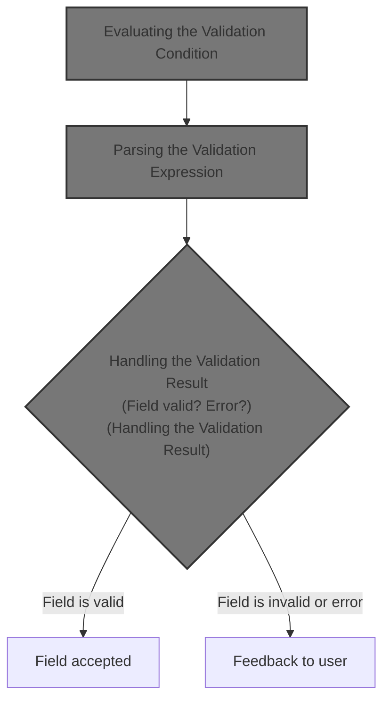
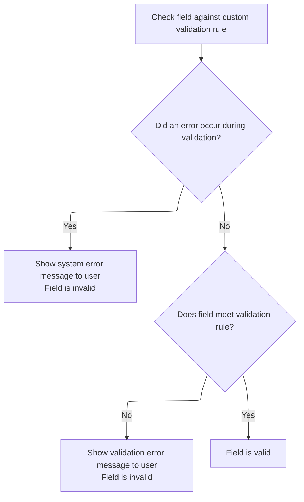

This document describes how a field value is validated against a custom rule, supporting dynamic validation in user forms. The flow receives a field value and a validation rule, checks if the value meets the rule, and provides feedback to the user if the field is invalid.



# Evaluating the Validation Condition

<SwmSnippet path="/core/src/main/java/org/apache/struts/validator/validwhen/ValidWhen.java" line="79">

---

In <SwmToken path="core/src/main/java/org/apache/struts/validator/validwhen/ValidWhen.java" pos="79:7:7" line-data="    public static boolean validateValidWhen(Object bean, ValidatorAction va,">`validateValidWhen`</SwmToken>, we start by checking if the field is indexed and, if so, extract the index from the field key (like 'property\[0\]'). This index is used later to handle lists or arrays of fields. Next, we grab the value to validate and fetch the 'test' expression, which is an external validation rule. We set up a lexer and parser for this expression, configuring them with the form, index, and value. Calling the parser next is necessary because it actually interprets and evaluates the validation rule, letting us support flexible, dynamic validation logic.

```java
    public static boolean validateValidWhen(Object bean, ValidatorAction va,
        Field field, ActionMessages errors, Validator validator,
        HttpServletRequest request) {
        Object form = validator.getParameterValue(Validator.BEAN_PARAM);
        String value = null;
        boolean valid = false;
        int index = -1;

        if (field.isIndexed()) {
            String key = field.getKey();

            final int leftBracket = key.indexOf("[");
            final int rightBracket = key.indexOf("]");

            if ((leftBracket > -1) && (rightBracket > -1)) {
                index =
                    Integer.parseInt(key.substring(leftBracket + 1,
                        rightBracket));
            }
        }

        if (isString(bean)) {
            value = (String) bean;
        } else {
            value = ValidatorUtils.getValueAsString(bean, field.getProperty());
        }

        String test = null;

        try {
            test =
                Resources.getVarValue("test", field, validator, request, true);
        } catch (IllegalArgumentException ex) {
            String logErrorMsg =
                sysmsgs.getMessage("validation.failed", "validwhen",
                    field.getProperty(), validator.getFormName(), ex.toString());

            log.error(logErrorMsg);

            String userErrorMsg = sysmsgs.getMessage("system.error");

            errors.add(field.getKey(), new ActionMessage(userErrorMsg, false));

            return false;
        }

        // Create the Lexer
        ValidWhenLexer lexer = null;

        try {
            lexer = new ValidWhenLexer(new StringReader(test));
        } catch (Exception ex) {
            String logErrorMsg =
                "ValidWhenLexer Error for field ' " + field.getKey() + "' - "
                + ex;

            log.error(logErrorMsg);

            String userErrorMsg = sysmsgs.getMessage("system.error");

            errors.add(field.getKey(), new ActionMessage(userErrorMsg, false));

            return false;
        }

        // Create the Parser
        ValidWhenParser parser = null;

        try {
            parser = new ValidWhenParser(lexer);
        } catch (Exception ex) {
            String logErrorMsg =
                "ValidWhenParser Error for field ' " + field.getKey() + "' - "
                + ex;

            log.error(logErrorMsg);

            String userErrorMsg = sysmsgs.getMessage("system.error");

            errors.add(field.getKey(), new ActionMessage(userErrorMsg, false));

            return false;
        }

        parser.setForm(form);
        parser.setIndex(index);
        parser.setValue(value);

        try {
            parser.expression();
```

---

</SwmSnippet>

## Parsing the Validation Expression

<SwmSnippet path="/core/src/main/java/org/apache/struts/validator/validwhen/ValidWhenParser.java" line="406">

---

In <SwmToken path="core/src/main/java/org/apache/struts/validator/validwhen/ValidWhenParser.java" pos="406:7:7" line-data="	public final void expression() throws RecognitionException, TokenStreamException {">`expression`</SwmToken>, we just delegate to <SwmToken path="core/src/main/java/org/apache/struts/validator/validwhen/ValidWhenParser.java" pos="409:1:3" line-data="		expr();">`expr()`</SwmToken>, which does the heavy lifting for parsing the validation condition. This step is needed to break down and process the validation rule we got earlier, so we can later evaluate if the field value meets the condition.

```java
	public final void expression() throws RecognitionException, TokenStreamException {
		
		
		expr();
```

---

</SwmSnippet>

### Evaluating the Parsed Condition

See <SwmLink doc-title="Parsing and Evaluating Parenthesized Expressions">[Parsing and Evaluating Parenthesized Expressions](/.swm/parsing-and-evaluating-parenthesized-expressions.hvljyjg5.sw.md)</SwmLink>

### Finishing Expression Parsing

<SwmSnippet path="/core/src/main/java/org/apache/struts/validator/validwhen/ValidWhenParser.java" line="410">

---

Back in `ValidWhenParser.expression`, after parsing the condition, we check for end-of-input (EOF). This makes sure the whole validation rule was processed and nothing extra is left, catching any syntax errors early.

```java
		match(Token.EOF_TYPE);
	}
```

---

</SwmSnippet>

## Handling the Validation Result



<SwmSnippet path="/core/src/main/java/org/apache/struts/validator/validwhen/ValidWhen.java" line="169">

---

Back in <SwmToken path="core/src/main/java/org/apache/struts/validator/validwhen/ValidWhen.java" pos="79:7:7" line-data="    public static boolean validateValidWhen(Object bean, ValidatorAction va,">`validateValidWhen`</SwmToken>, after running the parser and evaluating the expression, we grab the result. If the validation failed, we add an error message for the field and return false. Otherwise, we return true. This ties together the dynamic rule evaluation and error handling for the field.

```java
            valid = parser.getResult();
        } catch (Exception ex) {
            String logErrorMsg =
                "ValidWhen Error for field ' " + field.getKey() + "' - " + ex;

            log.error(logErrorMsg);

            String userErrorMsg = sysmsgs.getMessage("system.error");

            errors.add(field.getKey(), new ActionMessage(userErrorMsg, false));

            return false;
        }

        if (!valid) {
            errors.add(field.getKey(),
                Resources.getActionMessage(validator, request, va, field));

            return false;
        }

        return true;
    }
```

---

</SwmSnippet>

&nbsp;

*This is an auto-generated document by Swimm 🌊 and has not yet been verified by a human*

<SwmMeta version="3.0.0" repo-id="Z2l0aHViJTNBJTNBc3RydXRzMSUzQSUzQVN3aW1tLURlbW8=" repo-name="struts1"><sup>Powered by [Swimm](https://app.swimm.io/)</sup></SwmMeta>
