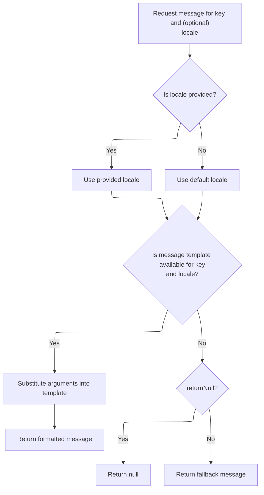
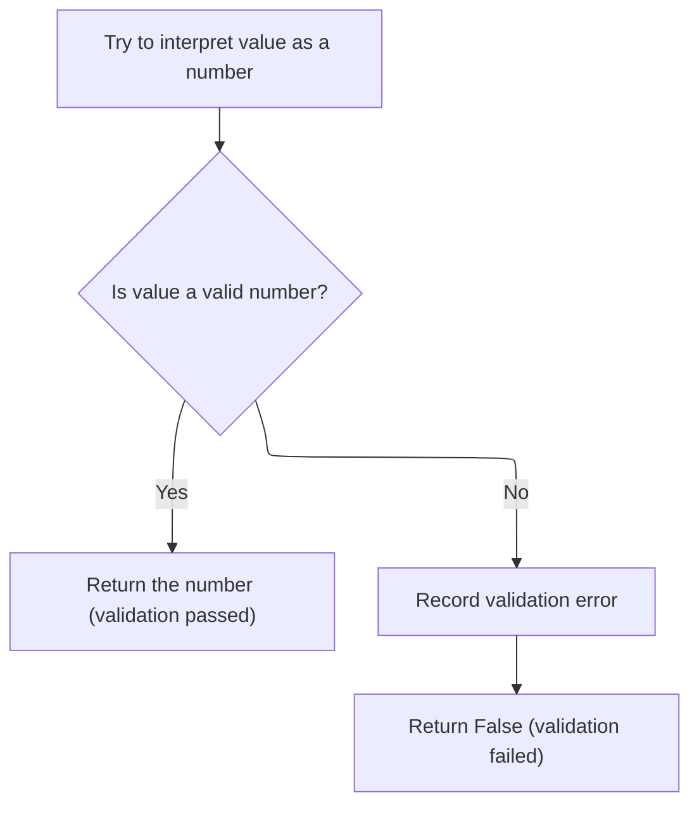
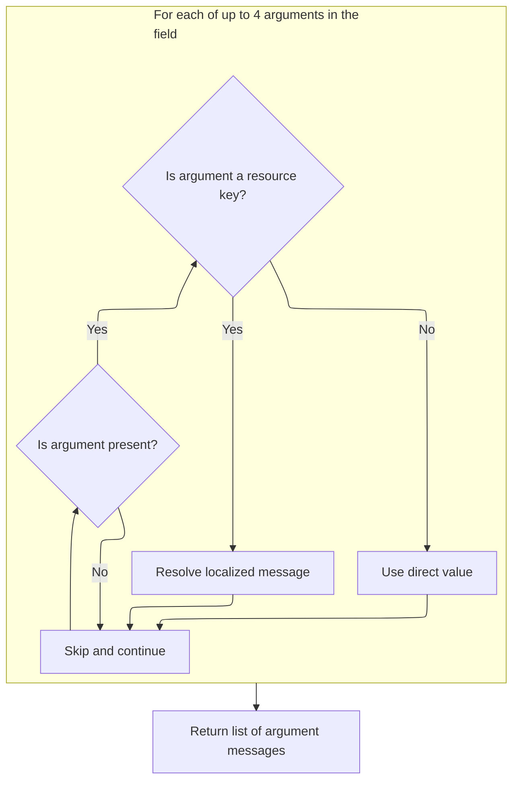
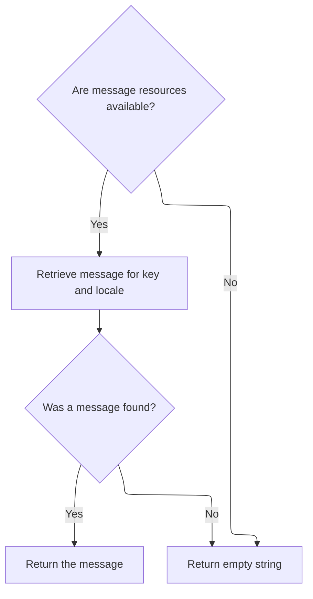
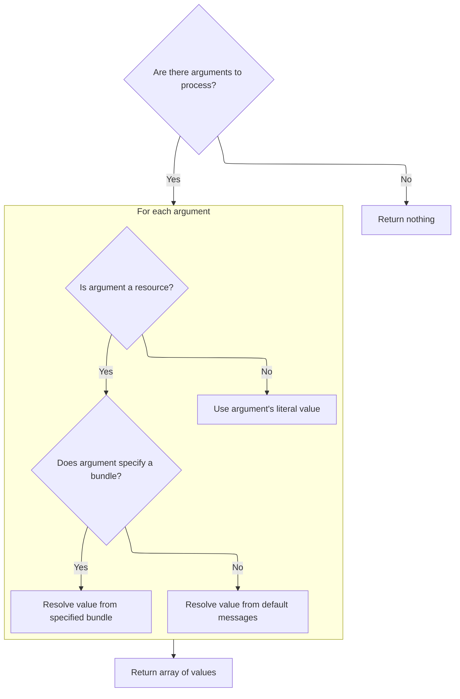
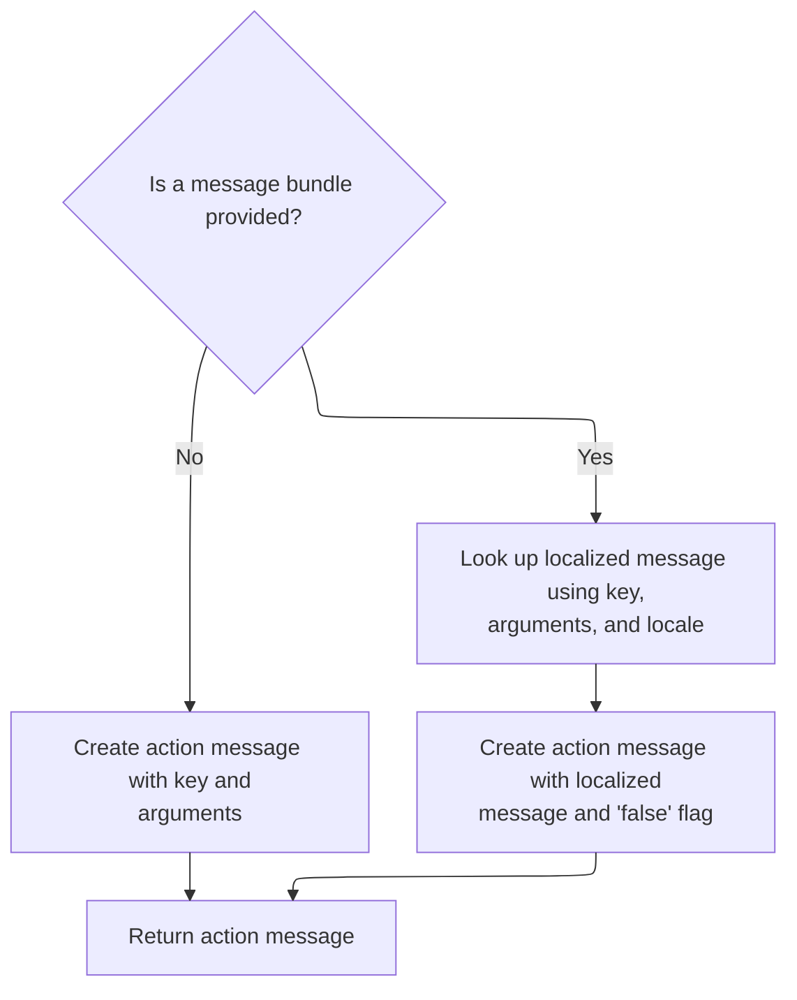

This document describes how the system validates user input for fields that require floating-point numbers. As part of the form validation process, the system checks if the provided value is a valid float and, if not, generates a localized error message for the user.

# Validating float input and handling errors

<SwmSnippet path="/core/src/main/java/org/apache/struts/validator/FieldChecks.java" line="674">

---

In <SwmToken path="core/src/main/java/org/apache/struts/validator/FieldChecks.java" pos="674:7:7" line-data="    public static Object validateFloat(Object bean, ValidatorAction va,">`validateFloat`</SwmToken>, we grab the value from the bean and field. If that blows up, we call <SwmToken path="core/src/main/java/org/apache/struts/validator/FieldChecks.java" pos="683:1:1" line-data="            processFailure(errors, field, validator.getFormName(), &quot;float&quot;, e);">`processFailure`</SwmToken> to log the error and add a user error message, then bail out with <SwmToken path="core/src/main/java/org/apache/struts/validator/FieldChecks.java" pos="684:3:5" line-data="            return Boolean.FALSE;">`Boolean.FALSE`</SwmToken>. This ensures any exception is handled and the user gets feedback.

```java
    public static Object validateFloat(Object bean, ValidatorAction va,
        Field field, ActionMessages errors, Validator validator,
        HttpServletRequest request) {
        Object result = null;
        String value = null;

        try {
            value = evaluateBean(bean, field);
        } catch (Exception e) {
            processFailure(errors, field, validator.getFormName(), "float", e);
            return Boolean.FALSE;
        }

        if (GenericValidator.isBlankOrNull(value)) {
            return Boolean.TRUE;
        }

```

---

</SwmSnippet>

## Logging validation failures and preparing error messages

<SwmSnippet path="/core/src/main/java/org/apache/struts/validator/FieldChecks.java" line="1434">

---

In <SwmToken path="core/src/main/java/org/apache/struts/validator/FieldChecks.java" pos="1434:7:7" line-data="    private static void processFailure(ActionMessages errors, Field field,">`processFailure`</SwmToken>, we build a log message using <SwmToken path="core/src/main/java/org/apache/struts/validator/FieldChecks.java" pos="1438:1:3" line-data="            sysmsgs.getMessage(&quot;validation.failed&quot;, validatorName,">`sysmsgs.getMessage`</SwmToken> with details about the validator, field, form, and exception, then log it. We need to call MessageResources.getMessage to get the formatted string for logging.

```java
    private static void processFailure(ActionMessages errors, Field field,
        String formName, String validatorName, Throwable t) {
        // Log the error
        String logErrorMsg =
            sysmsgs.getMessage("validation.failed", validatorName,
                field.getProperty(), formName, t.toString());

        log.error(logErrorMsg, t);

```

---

</SwmSnippet>

### Formatting log messages for validation errors

<SwmSnippet path="/core/src/main/java/org/apache/struts/util/MessageResources.java" line="355">

---

<SwmToken path="core/src/main/java/org/apache/struts/util/MessageResources.java" pos="355:5:5" line-data="    public String getMessage(Locale locale, String key, Object arg0,">`getMessage`</SwmToken> takes the locale, key, and three arguments, then calls the main <SwmToken path="core/src/main/java/org/apache/struts/util/MessageResources.java" pos="355:5:5" line-data="    public String getMessage(Locale locale, String key, Object arg0,">`getMessage`</SwmToken> method with those arguments as an array. This lets us format the log message with dynamic values.

```java
    public String getMessage(Locale locale, String key, Object arg0,
        Object arg1, Object arg2) {
        return this.getMessage(locale, key, new Object[] { arg0, arg1, arg2 });
    }
```

---

</SwmSnippet>

### Retrieving and formatting localized messages



<SwmSnippet path="/core/src/main/java/org/apache/struts/util/MessageResources.java" line="324">

---

<SwmToken path="core/src/main/java/org/apache/struts/util/MessageResources.java" pos="324:5:5" line-data="    public String getMessage(Locale locale, String key, Object arg0) {">`getMessage`</SwmToken> here is for messages with a single argument. It wraps the argument in an array and passes it to the main formatting logic, so we can reuse the same formatting infrastructure.

```java
    public String getMessage(Locale locale, String key, Object arg0) {
        return this.getMessage(locale, key, new Object[] { arg0 });
    }
```

---

</SwmSnippet>

<SwmSnippet path="/core/src/main/java/org/apache/struts/util/MessageResources.java" line="286">

---

<SwmToken path="core/src/main/java/org/apache/struts/util/MessageResources.java" pos="286:5:5" line-data="    public String getMessage(Locale locale, String key, Object[] args) {">`getMessage`</SwmToken> grabs the message template for the locale and key, caches the <SwmToken path="core/src/main/java/org/apache/struts/util/MessageResources.java" pos="287:5:5" line-data="        // Cache MessageFormat instances as they are accessed">`MessageFormat`</SwmToken> for performance, escapes the format string, and fills in the arguments. If the message is missing, it returns a placeholder or null, so missing keys are obvious.

```java
    public String getMessage(Locale locale, String key, Object[] args) {
        // Cache MessageFormat instances as they are accessed
        if (locale == null) {
            locale = defaultLocale;
        }

        MessageFormat format = null;
        String formatKey = messageKey(locale, key);

        synchronized (formats) {
            format = (MessageFormat) formats.get(formatKey);

            if (format == null) {
                String formatString = getMessage(locale, key);

                if (formatString == null) {
                    return returnNull ? null : ("???" + formatKey + "???");
                }

                format = new MessageFormat(escape(formatString));
                format.setLocale(locale);
                formats.put(formatKey, format);
            }
        }

        return format.format(args);
    }
```

---

</SwmSnippet>

### Adding user-facing error messages after logging

<SwmSnippet path="/core/src/main/java/org/apache/struts/validator/FieldChecks.java" line="1443">

---

Back in FieldChecks.processFailure, after logging, we grab a generic system error message from sysmsgs and add it to the errors for the user. We call MessageResources.getMessage again to get the localized string.

```java
        // Add general "system error" message to show to the user
        String userErrorMsg = sysmsgs.getMessage("system.error");

        errors.add(field.getKey(), new ActionMessage(userErrorMsg, false));
    }
```

---

</SwmSnippet>

<SwmSnippet path="/core/src/main/java/org/apache/struts/util/MessageResources.java" line="196">

---

<SwmToken path="core/src/main/java/org/apache/struts/util/MessageResources.java" pos="196:5:5" line-data="    public String getMessage(String key) {">`getMessage`</SwmToken> here is the shortcut for fetching a message by key, defaulting locale and argument to null. It's used for static messages like 'system error'.

```java
    public String getMessage(String key) {
        return this.getMessage((Locale) null, key, null);
    }
```

---

</SwmSnippet>

## Formatting and reporting float validation errors



<SwmSnippet path="/core/src/main/java/org/apache/struts/validator/FieldChecks.java" line="691">

---

After coming back from <SwmToken path="core/src/main/java/org/apache/struts/validator/FieldChecks.java" pos="683:1:1" line-data="            processFailure(errors, field, validator.getFormName(), &quot;float&quot;, e);">`processFailure`</SwmToken>, FieldChecks.validateFloat tries to parse the float. If that fails, we call <SwmToken path="core/src/main/java/org/apache/struts/validator/FieldChecks.java" pos="695:1:3" line-data="                Resources.getActionMessage(validator, request, va, field));">`Resources.getActionMessage`</SwmToken> to build the error message for the user and add it to errors.

```java
        result = GenericTypeValidator.formatFloat(value);

        if (result == null) {
            errors.add(field.getKey(),
                Resources.getActionMessage(validator, request, va, field));
        }

        return (result == null) ? Boolean.FALSE : result;
    }
```

---

</SwmSnippet>

# Building localized error messages for validation

```mermaid
%%{init: {"flowchart": {"defaultRenderer": "elk"}} }%%
flowchart TD
    node1{"Is there a custom message for this
field/rule and is it a literal?"}
    click node1 openCode "core/src/main/java/org/apache/struts/validator/Resources.java:367:371"
    node1 -->|"Yes"| node2["Return ActionMessage with custom literal"]
    click node2 openCode "core/src/main/java/org/apache/struts/validator/Resources.java:370:371"
    node1 -->|"No"| node3{"Is message key missing or empty?"}
    click node3 openCode "core/src/main/java/org/apache/struts/validator/Resources.java:383:386"
    node3 -->|"Yes"| node4["Return ActionMessage with error
placeholder"]
    click node4 openCode "core/src/main/java/org/apache/struts/validator/Resources.java:384:386"
    node3 -->|"No"| node5["Locating message resources for the current module"]
    
    node5 --> node6["Building argument arrays for error message templates"]
    
    node6 --> node7["Resolving localized values for error message arguments"]
    
    node7 --> node8{"Is a message bundle specified?"}
    click node8 openCode "core/src/main/java/org/apache/struts/validator/Resources.java:400:406"
    node8 -->|"No"| node9["Return ActionMessage with localized
message"]
    click node9 openCode "core/src/main/java/org/apache/struts/validator/Resources.java:401:402"
    node8 -->|"Yes"| node10["Fetching localized argument values for error messages"]
    

classDef HeadingStyle fill:#777777,stroke:#333,stroke-width:2px;
click node5 goToHeading "Locating message resources for the current module"
node5:::HeadingStyle
click node6 goToHeading "Building argument arrays for error message templates"
node6:::HeadingStyle
click node7 goToHeading "Resolving localized values for error message arguments"
node7:::HeadingStyle
click node10 goToHeading "Fetching localized argument values for error messages"
node10:::HeadingStyle

%% Swimm:
%% %%{init: {"flowchart": {"defaultRenderer": "elk"}} }%%
%% flowchart TD
%%     node1{"Is there a custom message for this
%% field/rule and is it a literal?"}
%%     click node1 openCode "<SwmPath>[core/…/validator/Resources.java](core/src/main/java/org/apache/struts/validator/Resources.java)</SwmPath>:367:371"
%%     node1 -->|"Yes"| node2["Return <SwmToken path="core/src/main/java/org/apache/struts/validator/FieldChecks.java" pos="1446:14:14" line-data="        errors.add(field.getKey(), new ActionMessage(userErrorMsg, false));">`ActionMessage`</SwmToken> with custom literal"]
%%     click node2 openCode "<SwmPath>[core/…/validator/Resources.java](core/src/main/java/org/apache/struts/validator/Resources.java)</SwmPath>:370:371"
%%     node1 -->|"No"| node3{"Is message key missing or empty?"}
%%     click node3 openCode "<SwmPath>[core/…/validator/Resources.java](core/src/main/java/org/apache/struts/validator/Resources.java)</SwmPath>:383:386"
%%     node3 -->|"Yes"| node4["Return <SwmToken path="core/src/main/java/org/apache/struts/validator/FieldChecks.java" pos="1446:14:14" line-data="        errors.add(field.getKey(), new ActionMessage(userErrorMsg, false));">`ActionMessage`</SwmToken> with error
%% placeholder"]
%%     click node4 openCode "<SwmPath>[core/…/validator/Resources.java](core/src/main/java/org/apache/struts/validator/Resources.java)</SwmPath>:384:386"
%%     node3 -->|"No"| node5["Locating message resources for the current module"]
%%     
%%     node5 --> node6["Building argument arrays for error message templates"]
%%     
%%     node6 --> node7["Resolving localized values for error message arguments"]
%%     
%%     node7 --> node8{"Is a message bundle specified?"}
%%     click node8 openCode "<SwmPath>[core/…/validator/Resources.java](core/src/main/java/org/apache/struts/validator/Resources.java)</SwmPath>:400:406"
%%     node8 -->|"No"| node9["Return <SwmToken path="core/src/main/java/org/apache/struts/validator/FieldChecks.java" pos="1446:14:14" line-data="        errors.add(field.getKey(), new ActionMessage(userErrorMsg, false));">`ActionMessage`</SwmToken> with localized
%% message"]
%%     click node9 openCode "<SwmPath>[core/…/validator/Resources.java](core/src/main/java/org/apache/struts/validator/Resources.java)</SwmPath>:401:402"
%%     node8 -->|"Yes"| node10["Fetching localized argument values for error messages"]
%%     
%% 
%% classDef HeadingStyle fill:#777777,stroke:#333,stroke-width:2px;
%% click node5 goToHeading "Locating message resources for the current module"
%% node5:::HeadingStyle
%% click node6 goToHeading "Building argument arrays for error message templates"
%% node6:::HeadingStyle
%% click node7 goToHeading "Resolving localized values for error message arguments"
%% node7:::HeadingStyle
%% click node10 goToHeading "Fetching localized argument values for error messages"
%% node10:::HeadingStyle
```



<SwmSnippet path="/core/src/main/java/org/apache/struts/validator/Resources.java" line="365">

---

In <SwmToken path="core/src/main/java/org/apache/struts/validator/Resources.java" pos="365:7:7" line-data="    public static ActionMessage getActionMessage(Validator validator,">`getActionMessage`</SwmToken>, we figure out which message key and bundle to use based on the field and validator action. If the message is a resource, we need to fetch the actual localized message, so we call <SwmToken path="core/src/main/java/org/apache/struts/validator/Resources.java" pos="391:1:1" line-data="            getMessageResources(application, request, msgBundle);">`getMessageResources`</SwmToken> next.

```java
    public static ActionMessage getActionMessage(Validator validator,
        HttpServletRequest request, ValidatorAction va, Field field) {
        Msg msg = field.getMessage(va.getName());

        if ((msg != null) && !msg.isResource()) {
            return new ActionMessage(msg.getKey(), false);
        }

        String msgKey = null;
        String msgBundle = null;

        if (msg == null) {
            msgKey = va.getMsg();
        } else {
            msgKey = msg.getKey();
            msgBundle = msg.getBundle();
        }

        if ((msgKey == null) || (msgKey.length() == 0)) {
            return new ActionMessage("??? " + va.getName() + "."
                + field.getProperty() + " ???", false);
        }

        ServletContext application =
            (ServletContext) validator.getParameterValue(SERVLET_CONTEXT_PARAM);
        MessageResources messages =
            getMessageResources(application, request, msgBundle);
```

---

</SwmSnippet>

## Locating message resources for the current module

```mermaid
%%{init: {"flowchart": {"defaultRenderer": "elk"}} }%%
flowchart TD
    node1["Start: Need message resources"] --> node2["Determine bundle name (provided or
default)"]
    click node1 openCode "core/src/main/java/org/apache/struts/validator/Resources.java:117:145"
    click node2 openCode "core/src/main/java/org/apache/struts/validator/Resources.java:119:121"
    node2 --> node3["Look for resources in request"]
    click node3 openCode "core/src/main/java/org/apache/struts/validator/Resources.java:123:124"
    node3 --> node4{"Resources found in request?"}
    click node4 openCode "core/src/main/java/org/apache/struts/validator/Resources.java:126:126"
    node4 -->|"Yes"| node8["Return resources"]
    node4 -->|"No"| node5["Look for module-specific resources in
application"]
    click node5 openCode "core/src/main/java/org/apache/struts/validator/Resources.java:127:133"
    node5 --> node6{"Resources found in application?"}
    click node6 openCode "core/src/main/java/org/apache/struts/validator/Resources.java:135:135"
    node6 -->|"Yes"| node8
    node6 -->|"No"| node7["Look for default resources in
application"]
    click node7 openCode "core/src/main/java/org/apache/struts/validator/Resources.java:136:136"
    node7 --> node9{"Resources found in application?"}
    click node9 openCode "core/src/main/java/org/apache/struts/validator/Resources.java:139:139"
    node9 -->|"Yes"| node8
    node9 -->|"No"| node10["Error: No resources found"]
    click node10 openCode "core/src/main/java/org/apache/struts/validator/Resources.java:140:142"
    node8["Return resources"]
    click node8 openCode "core/src/main/java/org/apache/struts/validator/Resources.java:144:145"
classDef HeadingStyle fill:#777777,stroke:#333,stroke-width:2px;

%% Swimm:
%% %%{init: {"flowchart": {"defaultRenderer": "elk"}} }%%
%% flowchart TD
%%     node1["Start: Need message resources"] --> node2["Determine bundle name (provided or
%% default)"]
%%     click node1 openCode "<SwmPath>[core/…/validator/Resources.java](core/src/main/java/org/apache/struts/validator/Resources.java)</SwmPath>:117:145"
%%     click node2 openCode "<SwmPath>[core/…/validator/Resources.java](core/src/main/java/org/apache/struts/validator/Resources.java)</SwmPath>:119:121"
%%     node2 --> node3["Look for resources in request"]
%%     click node3 openCode "<SwmPath>[core/…/validator/Resources.java](core/src/main/java/org/apache/struts/validator/Resources.java)</SwmPath>:123:124"
%%     node3 --> node4{"Resources found in request?"}
%%     click node4 openCode "<SwmPath>[core/…/validator/Resources.java](core/src/main/java/org/apache/struts/validator/Resources.java)</SwmPath>:126:126"
%%     node4 -->|"Yes"| node8["Return resources"]
%%     node4 -->|"No"| node5["Look for module-specific resources in
%% application"]
%%     click node5 openCode "<SwmPath>[core/…/validator/Resources.java](core/src/main/java/org/apache/struts/validator/Resources.java)</SwmPath>:127:133"
%%     node5 --> node6{"Resources found in application?"}
%%     click node6 openCode "<SwmPath>[core/…/validator/Resources.java](core/src/main/java/org/apache/struts/validator/Resources.java)</SwmPath>:135:135"
%%     node6 -->|"Yes"| node8
%%     node6 -->|"No"| node7["Look for default resources in
%% application"]
%%     click node7 openCode "<SwmPath>[core/…/validator/Resources.java](core/src/main/java/org/apache/struts/validator/Resources.java)</SwmPath>:136:136"
%%     node7 --> node9{"Resources found in application?"}
%%     click node9 openCode "<SwmPath>[core/…/validator/Resources.java](core/src/main/java/org/apache/struts/validator/Resources.java)</SwmPath>:139:139"
%%     node9 -->|"Yes"| node8
%%     node9 -->|"No"| node10["Error: No resources found"]
%%     click node10 openCode "<SwmPath>[core/…/validator/Resources.java](core/src/main/java/org/apache/struts/validator/Resources.java)</SwmPath>:140:142"
%%     node8["Return resources"]
%%     click node8 openCode "<SwmPath>[core/…/validator/Resources.java](core/src/main/java/org/apache/struts/validator/Resources.java)</SwmPath>:144:145"
%% classDef HeadingStyle fill:#777777,stroke:#333,stroke-width:2px;
```



<SwmSnippet path="/core/src/main/java/org/apache/struts/validator/Resources.java" line="117">

---

In <SwmToken path="core/src/main/java/org/apache/struts/validator/Resources.java" pos="117:7:7" line-data="    public static MessageResources getMessageResources(">`getMessageResources`</SwmToken>, we look for the resources in the request first. If not found, we call ModuleUtils.getModuleConfig to get the module prefix and check the application context for the right bundle.

```java
    public static MessageResources getMessageResources(
        ServletContext application, HttpServletRequest request, String bundle) {
        if (bundle == null) {
            bundle = Globals.MESSAGES_KEY;
        }

        MessageResources resources =
            (MessageResources) request.getAttribute(bundle);

        if (resources == null) {
            ModuleConfig moduleConfig =
                ModuleUtils.getInstance().getModuleConfig(request, application);

            resources =
                (MessageResources) application.getAttribute(bundle
                    + moduleConfig.getPrefix());
        }

```

---

</SwmSnippet>

<SwmSnippet path="/core/src/main/java/org/apache/struts/util/ModuleUtils.java" line="130">

---

GetModuleConfig first tries to get the config from the request. If that's missing, it falls back to using an empty string and the servlet context, and sets the result in the request. That fallback and side effect aren't obvious from the signature.

```java
    public ModuleConfig getModuleConfig(HttpServletRequest request,
        ServletContext context) {
        ModuleConfig moduleConfig = this.getModuleConfig(request);

        if (moduleConfig == null) {
            moduleConfig = this.getModuleConfig("", context);
            request.setAttribute(Globals.MODULE_KEY, moduleConfig);
        }

        return moduleConfig;
    }
```

---

</SwmSnippet>

<SwmSnippet path="/core/src/main/java/org/apache/struts/validator/Resources.java" line="135">

---

After coming back from <SwmToken path="core/src/main/java/org/apache/struts/validator/Resources.java" pos="128:1:1" line-data="                ModuleUtils.getInstance().getModuleConfig(request, application);">`ModuleUtils`</SwmToken>, if we still can't find the resources, we throw <SwmToken path="core/src/main/java/org/apache/struts/validator/Resources.java" pos="140:5:5" line-data="            throw new NullPointerException(">`NullPointerException`</SwmToken>. Otherwise, we return the resources for use in <SwmToken path="core/src/main/java/org/apache/struts/validator/FieldChecks.java" pos="695:3:3" line-data="                Resources.getActionMessage(validator, request, va, field));">`getActionMessage`</SwmToken>.

```java
        if (resources == null) {
            resources = (MessageResources) application.getAttribute(bundle);
        }

        if (resources == null) {
            throw new NullPointerException(
                "No message resources found for bundle: " + bundle);
        }

        return resources;
    }
```

---

</SwmSnippet>

## Determining locale and argument values for error messages

<SwmSnippet path="/core/src/main/java/org/apache/struts/validator/Resources.java" line="392">

---

After getting the resources, we grab the user's locale and call <SwmToken path="core/src/main/java/org/apache/struts/validator/Resources.java" pos="394:11:11" line-data="        Arg[] args = field.getArgs(va.getName());">`getArgs`</SwmToken> to build the argument array for the error message template.

```java
        Locale locale = RequestUtils.getUserLocale(request, null);

        Arg[] args = field.getArgs(va.getName());
```

---

</SwmSnippet>

## Building argument arrays for error message templates



<SwmSnippet path="/core/src/main/java/org/apache/struts/validator/Resources.java" line="420">

---

GetArgs builds a fixed-size array of four arguments, grabbing up to four Arg objects from the field. If an Arg is a resource, it fetches the localized message; otherwise, it just uses the key. The four-argument assumption is baked in.

```java
    public static String[] getArgs(String actionName,
        MessageResources messages, Locale locale, Field field) {
        String[] argMessages = new String[4];

        Arg[] args =
            new Arg[] {
                field.getArg(actionName, 0), field.getArg(actionName, 1),
                field.getArg(actionName, 2), field.getArg(actionName, 3)
            };

        for (int i = 0; i < args.length; i++) {
            if (args[i] == null) {
                continue;
            }

            if (args[i].isResource()) {
                argMessages[i] = getMessage(messages, locale, args[i].getKey());
            } else {
                argMessages[i] = args[i].getKey();
            }
        }

        return argMessages;
    }
```

---

</SwmSnippet>

## Fetching localized argument values for error messages



<SwmSnippet path="/core/src/main/java/org/apache/struts/validator/Resources.java" line="231">

---

GetMessage checks if messages is null, then calls <SwmToken path="core/src/main/java/org/apache/struts/validator/Resources.java" pos="236:5:7" line-data="            message = messages.getMessage(locale, key);">`messages.getMessage`</SwmToken> to fetch the localized string. If nothing is found, it returns an empty string.

```java
    public static String getMessage(MessageResources messages, Locale locale,
        String key) {
        String message = null;

        if (messages != null) {
            message = messages.getMessage(locale, key);
        }

        return (message == null) ? "" : message;
    }
```

---

</SwmSnippet>

<SwmSnippet path="/core/src/main/java/org/apache/struts/util/MessageResources.java" line="218">

---

GetMessage here is for messages with one argument, defaulting locale to null so it uses the default. It's a shortcut for simple cases.

```java
    public String getMessage(String key, Object arg0) {
        return this.getMessage((Locale) null, key, arg0);
    }
```

---

</SwmSnippet>

## Resolving argument values for error message templates

<SwmSnippet path="/core/src/main/java/org/apache/struts/validator/Resources.java" line="395">

---

After getting the args, we call <SwmToken path="core/src/main/java/org/apache/struts/validator/Resources.java" pos="396:1:1" line-data="            getArgValues(application, request, messages, locale, args);">`getArgValues`</SwmToken> to resolve the actual values for each argument, including localization and bundle lookup. This gives us the final values for the error message template.

```java
        String[] argValues =
            getArgValues(application, request, messages, locale, args);

```

---

</SwmSnippet>

## Resolving localized values for error message arguments



<SwmSnippet path="/core/src/main/java/org/apache/struts/validator/Resources.java" line="455">

---

In <SwmToken path="core/src/main/java/org/apache/struts/validator/Resources.java" pos="455:9:9" line-data="    private static String[] getArgValues(ServletContext application,">`getArgValues`</SwmToken>, for each argument, if it's a resource and has a bundle, we call <SwmToken path="core/src/main/java/org/apache/struts/validator/Resources.java" pos="471:1:1" line-data="                            getMessageResources(application, request,">`getMessageResources`</SwmToken> to fetch the right localized value. Otherwise, we use the default messages or just the key.

```java
    private static String[] getArgValues(ServletContext application,
        HttpServletRequest request, MessageResources defaultMessages,
        Locale locale, Arg[] args) {
        if ((args == null) || (args.length == 0)) {
            return null;
        }

        String[] values = new String[args.length];

        for (int i = 0; i < args.length; i++) {
            if (args[i] != null) {
                if (args[i].isResource()) {
                    MessageResources messages = defaultMessages;

                    if (args[i].getBundle() != null) {
                        messages =
                            getMessageResources(application, request,
                                args[i].getBundle());
                    }

```

---

</SwmSnippet>

<SwmSnippet path="/core/src/main/java/org/apache/struts/validator/Resources.java" line="475">

---

After resolving bundles, we call <SwmToken path="core/src/main/java/org/apache/struts/validator/Resources.java" pos="475:8:10" line-data="                    values[i] = messages.getMessage(locale, args[i].getKey());">`messages.getMessage`</SwmToken> for each argument to get the localized value, or just use the key if not a resource. Then we return the values array for use in the error message.

```java
                    values[i] = messages.getMessage(locale, args[i].getKey());
                } else {
                    values[i] = args[i].getKey();
                }
            }
        }

        return values;
    }
```

---

</SwmSnippet>

## Finalizing and returning the error message



<SwmSnippet path="/core/src/main/java/org/apache/struts/validator/Resources.java" line="398">

---

After resolving argument values, if <SwmToken path="core/src/main/java/org/apache/struts/validator/Resources.java" pos="400:4:4" line-data="        if (msgBundle == null) {">`msgBundle`</SwmToken> is null, we build the <SwmToken path="core/src/main/java/org/apache/struts/validator/Resources.java" pos="398:1:1" line-data="        ActionMessage actionMessage = null;">`ActionMessage`</SwmToken> with the key and values. If <SwmToken path="core/src/main/java/org/apache/struts/validator/Resources.java" pos="400:4:4" line-data="        if (msgBundle == null) {">`msgBundle`</SwmToken> is set, we fetch the localized message and use that for the <SwmToken path="core/src/main/java/org/apache/struts/validator/Resources.java" pos="398:1:1" line-data="        ActionMessage actionMessage = null;">`ActionMessage`</SwmToken>. Then we return it for use in validation errors.

```java
        ActionMessage actionMessage = null;

        if (msgBundle == null) {
            actionMessage = new ActionMessage(msgKey, argValues);
        } else {
            String message = messages.getMessage(locale, msgKey, argValues);

            actionMessage = new ActionMessage(message, false);
        }

        return actionMessage;
    }
```

---

</SwmSnippet>

&nbsp;

*This is an auto-generated document by Swimm 🌊 and has not yet been verified by a human*

<SwmMeta version="3.0.0" repo-id="Z2l0aHViJTNBJTNBc3RydXRzMSUzQSUzQVN3aW1tLURlbW8=" repo-name="struts1"><sup>Powered by [Swimm](https://app.swimm.io/)</sup></SwmMeta>
