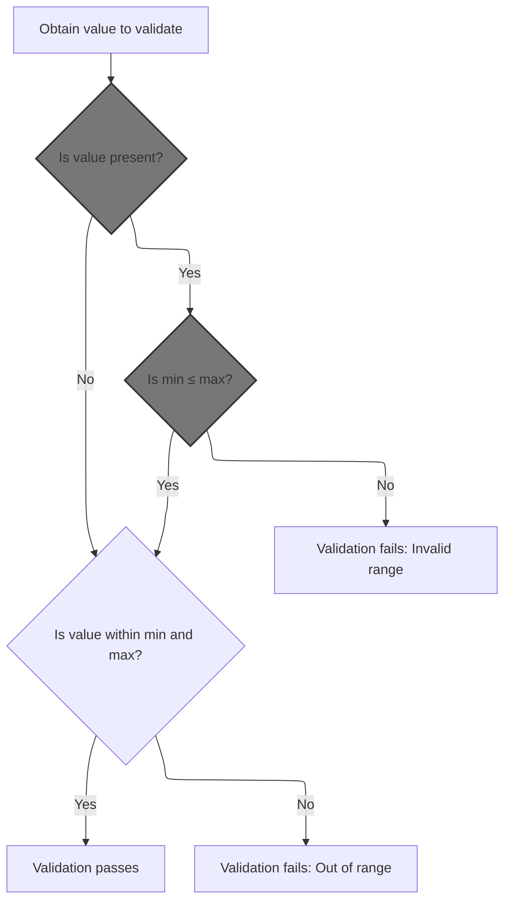
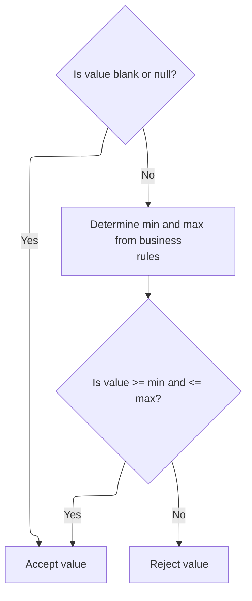
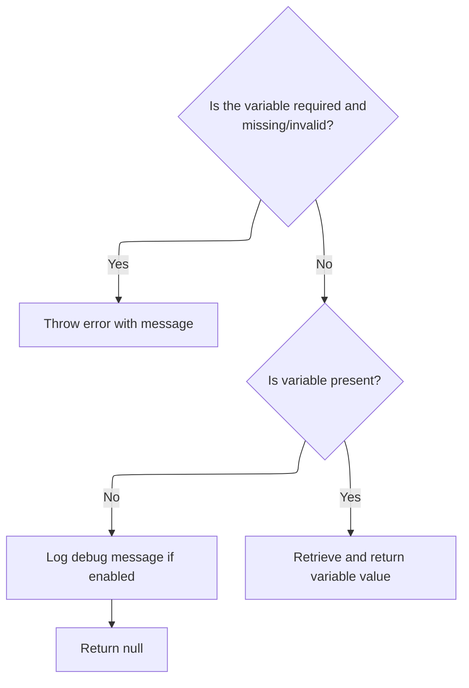
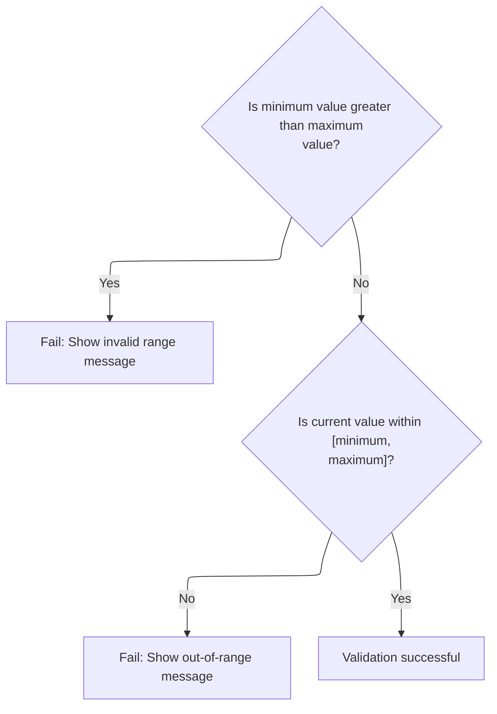
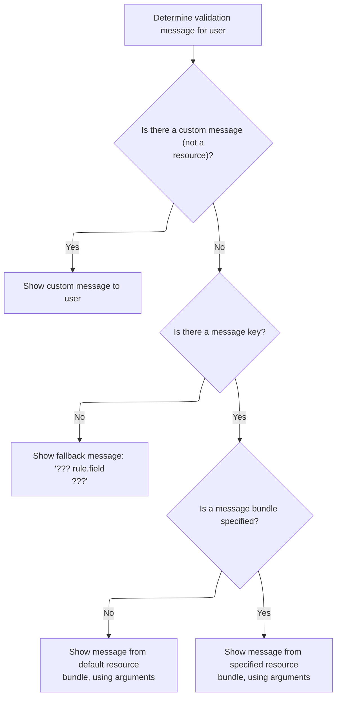

This document describes how the system validates that a user-provided value falls within a configurable floating-point range. The validation process checks if the value is present, determines the allowed boundaries, and ensures the value is within range. If the value is invalid, a localized message is generated to inform the user.

# Validating Float Range Inputs



<SwmSnippet path="/core/src/main/java/org/apache/struts/validator/FieldChecks.java" line="1082">

---

In <SwmToken path="core/src/main/java/org/apache/struts/validator/FieldChecks.java" pos="1082:7:7" line-data="    public static boolean validateFloatRange(Object bean, ValidatorAction va,">`validateFloatRange`</SwmToken>, we're grabbing the value to check from the bean, but since the bean could be a String or some other object, we call <SwmToken path="core/src/main/java/org/apache/struts/validator/FieldChecks.java" pos="1088:5:5" line-data="            value = evaluateBean(bean, field);">`evaluateBean`</SwmToken> to consistently extract the value as a String for validation.

```java
    public static boolean validateFloatRange(Object bean, ValidatorAction va,
        Field field, ActionMessages errors, Validator validator,
        HttpServletRequest request) {
        String value = null;

        try {
            value = evaluateBean(bean, field);
```

---

</SwmSnippet>

## Extracting Field Values as Strings

<SwmSnippet path="/core/src/main/java/org/apache/struts/validator/FieldChecks.java" line="389">

---

<SwmToken path="core/src/main/java/org/apache/struts/validator/FieldChecks.java" pos="389:7:7" line-data="    private static String evaluateBean(Object bean, Field field) throws Exception {">`evaluateBean`</SwmToken> checks if the bean is a String and returns it if so. Otherwise, it pulls out the property value using <SwmToken path="core/src/main/java/org/apache/struts/validator/FieldChecks.java" pos="395:5:5" line-data="            value = getValueAsString(bean, field.getProperty());">`getValueAsString`</SwmToken>, so we always end up with a String to work with.

```java
    private static String evaluateBean(Object bean, Field field) throws Exception {
        String value;

        if (isString(bean)) {
            value = (String) bean;
        } else {
            value = getValueAsString(bean, field.getProperty());
        }

        return value;
    }
```

---

</SwmSnippet>

<SwmSnippet path="/core/src/main/java/org/apache/struts/validator/FieldChecks.java" line="87">

---

<SwmToken path="core/src/main/java/org/apache/struts/validator/FieldChecks.java" pos="87:7:7" line-data="    private static String getValueAsString(Object bean, String property) ">`getValueAsString`</SwmToken> pulls the property value from the bean and handles nulls, arrays, and collections explicitly—returning null for missing values, empty string for empty arrays/collections, and <SwmToken path="core/src/main/java/org/apache/struts/validator/FieldChecks.java" pos="96:23:25" line-data="            return ((String[]) value).length &gt; 0 ? value.toString() : &quot;&quot;;">`toString()`</SwmToken> for everything else.

```java
    private static String getValueAsString(Object bean, String property) 
            throws Exception {
        
        Object value = PropertyUtils.getProperty(bean, property);
        if (value == null) {
            return null;
        }

        if (value instanceof String[]) {
            return ((String[]) value).length > 0 ? value.toString() : "";

        } else if (value instanceof Collection) {
            return ((Collection) value).isEmpty() ? "" : value.toString();

        } else {
            return value.toString();
        }
    }
```

---

</SwmSnippet>

## Fetching Range Boundaries



<SwmSnippet path="/core/src/main/java/org/apache/struts/validator/FieldChecks.java" line="1089">

---

Back in <SwmToken path="core/src/main/java/org/apache/struts/validator/FieldChecks.java" pos="1082:7:7" line-data="    public static boolean validateFloatRange(Object bean, ValidatorAction va,">`validateFloatRange`</SwmToken>, after getting the value, we check if it's not blank/null, then pull min and max from Resources. This lets us use configurable range limits instead of hardcoded ones.

```java
            if (!GenericValidator.isBlankOrNull(value)) {
                String minVar =
                    Resources.getVarValue("min", field, validator, request, true);
                String maxVar =
                    Resources.getVarValue("max", field, validator, request, true);
```

---

</SwmSnippet>

## Resolving Variable Values for Validation

<SwmSnippet path="/core/src/main/java/org/apache/struts/validator/Resources.java" line="157">

---

In <SwmToken path="core/src/main/java/org/apache/struts/validator/Resources.java" pos="157:7:7" line-data="    public static String getVarValue(String varName, Field field,">`getVarValue`</SwmToken>, we try to get the variable from the field. If it's missing, we grab a localized error message using <SwmToken path="core/src/main/java/org/apache/struts/validator/Resources.java" pos="162:7:9" line-data="            String msg = sysmsgs.getMessage(&quot;variable.missing&quot;, varName);">`sysmsgs.getMessage`</SwmToken> from <SwmToken path="core/src/main/java/org/apache/struts/util/PropertyMessageResources.java" pos="82:8:8" line-data=" * Configure &lt;code&gt;PropertyMessageResources&lt;/code&gt; to operate in this mode by">`PropertyMessageResources`</SwmToken> to handle the error cleanly.

```java
    public static String getVarValue(String varName, Field field,
        Validator validator, HttpServletRequest request, boolean required) {
        Var var = field.getVar(varName);

        if (var == null) {
            String msg = sysmsgs.getMessage("variable.missing", varName);

```

---

</SwmSnippet>

### Looking Up Localized Messages

```mermaid
%%{init: {"flowchart": {"defaultRenderer": "elk"}} }%%
flowchart TD
  node1["Request message for locale and key"]
  click node1 openCode "core/src/main/java/org/apache/struts/util/PropertyMessageResources.java:227:282"
  node2{"Message found for requested locale?"}
  click node2 openCode "core/src/main/java/org/apache/struts/util/PropertyMessageResources.java:238:241"
  node1 --> node2
  node2 -- Yes --> node8["Return message"]
  click node8 openCode "core/src/main/java/org/apache/struts/util/PropertyMessageResources.java:240:241"
  node2 -- No --> node3{"mode = JSTL?"}
  click node3 openCode "core/src/main/java/org/apache/struts/util/PropertyMessageResources.java:244:247"
  node3 -- Yes --> node6{"Message found in base properties?"}
  node3 -- No --> node4{"mode = ResourceBundle?"}
  click node4 openCode "core/src/main/java/org/apache/struts/util/PropertyMessageResources.java:250:265"
  node4 -- Yes |"ResourceBundle"|--> node5{"Message found for default locale?"}
  node4 -- No |"Default"|--> node11{"Message found for default locale (using
localeKey)?"}
  click node5 openCode "core/src/main/java/org/apache/struts/util/PropertyMessageResources.java:253:254"
  node5 -- Yes --> node8
  node5 -- No --> node6
  click node11 openCode "core/src/main/java/org/apache/struts/util/PropertyMessageResources.java:260:263"
  node11 -- Yes --> node8
  node11 -- No --> node6
  node6 -- Yes --> node8
  click node6 openCode "core/src/main/java/org/apache/struts/util/PropertyMessageResources.java:271:273"
  node6 -- No --> node7{"returnNull?"}
  click node7 openCode "core/src/main/java/org/apache/struts/util/PropertyMessageResources.java:277:281"
  node7 -- Yes --> node9["Return null"]
  click node9 openCode "core/src/main/java/org/apache/struts/util/PropertyMessageResources.java:278:278"
  node7 -- No --> node10["Return placeholder (???key???)"]
  click node10 openCode "core/src/main/java/org/apache/struts/util/PropertyMessageResources.java:279:281"
classDef HeadingStyle fill:#777777,stroke:#333,stroke-width:2px;

%% Swimm:
%% %%{init: {"flowchart": {"defaultRenderer": "elk"}} }%%
%% flowchart TD
%%   node1["Request message for locale and key"]
%%   click node1 openCode "<SwmPath>[core/…/util/PropertyMessageResources.java](core/src/main/java/org/apache/struts/util/PropertyMessageResources.java)</SwmPath>:227:282"
%%   node2{"Message found for requested locale?"}
%%   click node2 openCode "<SwmPath>[core/…/util/PropertyMessageResources.java](core/src/main/java/org/apache/struts/util/PropertyMessageResources.java)</SwmPath>:238:241"
%%   node1 --> node2
%%   node2 -- Yes --> node8["Return message"]
%%   click node8 openCode "<SwmPath>[core/…/util/PropertyMessageResources.java](core/src/main/java/org/apache/struts/util/PropertyMessageResources.java)</SwmPath>:240:241"
%%   node2 -- No --> node3{"mode = JSTL?"}
%%   click node3 openCode "<SwmPath>[core/…/util/PropertyMessageResources.java](core/src/main/java/org/apache/struts/util/PropertyMessageResources.java)</SwmPath>:244:247"
%%   node3 -- Yes --> node6{"Message found in base properties?"}
%%   node3 -- No --> node4{"mode = ResourceBundle?"}
%%   click node4 openCode "<SwmPath>[core/…/util/PropertyMessageResources.java](core/src/main/java/org/apache/struts/util/PropertyMessageResources.java)</SwmPath>:250:265"
%%   node4 -- Yes |"ResourceBundle"|--> node5{"Message found for default locale?"}
%%   node4 -- No |"Default"|--> node11{"Message found for default locale (using
%% <SwmToken path="core/src/main/java/org/apache/struts/util/PropertyMessageResources.java" pos="233:3:3" line-data="        String localeKey = localeKey(locale);">`localeKey`</SwmToken>)?"}
%%   click node5 openCode "<SwmPath>[core/…/util/PropertyMessageResources.java](core/src/main/java/org/apache/struts/util/PropertyMessageResources.java)</SwmPath>:253:254"
%%   node5 -- Yes --> node8
%%   node5 -- No --> node6
%%   click node11 openCode "<SwmPath>[core/…/util/PropertyMessageResources.java](core/src/main/java/org/apache/struts/util/PropertyMessageResources.java)</SwmPath>:260:263"
%%   node11 -- Yes --> node8
%%   node11 -- No --> node6
%%   node6 -- Yes --> node8
%%   click node6 openCode "<SwmPath>[core/…/util/PropertyMessageResources.java](core/src/main/java/org/apache/struts/util/PropertyMessageResources.java)</SwmPath>:271:273"
%%   node6 -- No --> node7{"<SwmToken path="core/src/main/java/org/apache/struts/util/PropertyMessageResources.java" pos="277:4:4" line-data="        if (returnNull) {">`returnNull`</SwmToken>?"}
%%   click node7 openCode "<SwmPath>[core/…/util/PropertyMessageResources.java](core/src/main/java/org/apache/struts/util/PropertyMessageResources.java)</SwmPath>:277:281"
%%   node7 -- Yes --> node9["Return null"]
%%   click node9 openCode "<SwmPath>[core/…/util/PropertyMessageResources.java](core/src/main/java/org/apache/struts/util/PropertyMessageResources.java)</SwmPath>:278:278"
%%   node7 -- No --> node10["Return placeholder (???key???)"]
%%   click node10 openCode "<SwmPath>[core/…/util/PropertyMessageResources.java](core/src/main/java/org/apache/struts/util/PropertyMessageResources.java)</SwmPath>:279:281"
%% classDef HeadingStyle fill:#777777,stroke:#333,stroke-width:2px;
```

<SwmSnippet path="/core/src/main/java/org/apache/struts/util/PropertyMessageResources.java" line="227">

---

<SwmToken path="core/src/main/java/org/apache/struts/util/PropertyMessageResources.java" pos="227:5:5" line-data="    public String getMessage(Locale locale, String key) {">`getMessage`</SwmToken> tries to find a localized message for the given key and locale, using different fallback strategies based on the mode. If nothing is found, it returns the key wrapped in '???' to flag missing messages.

```java
    public String getMessage(Locale locale, String key) {
        if (log.isDebugEnabled()) {
            log.debug("getMessage(" + locale + "," + key + ")");
        }

        // Initialize variables we will require
        String localeKey = localeKey(locale);
        String originalKey = messageKey(localeKey, key);
        String message = null;

        // Search the specified Locale
        message = findMessage(locale, key, originalKey);
        if (message != null) {
            return message;
        }

        // JSTL Compatibility - JSTL doesn't use the default locale
        if (mode == MODE_JSTL) {

           // do nothing (i.e. don't use default Locale)

        // PropertyResourcesBundle - searches through the hierarchy
        // for the default Locale (e.g. first en_US then en)
        } else if (mode == MODE_RESOURCE_BUNDLE) {

            if (!defaultLocale.equals(locale)) {
                message = findMessage(defaultLocale, key, originalKey);
            }

        // Default (backwards) Compatibility - just searches the
        // specified Locale (e.g. just en_US)
        } else {

            if (!defaultLocale.equals(locale)) {
                localeKey = localeKey(defaultLocale);
                message = findMessage(localeKey, key, originalKey);
            }

        }
        if (message != null) {
            return message;
        }

        // Find the message in the default properties file
        message = findMessage("", key, originalKey);
        if (message != null) {
            return message;
        }

        // Return an appropriate error indication
        if (returnNull) {
            return (null);
        } else {
            return ("???" + messageKey(locale, key) + "???");
        }
    }
```

---

</SwmSnippet>

<SwmSnippet path="/core/src/main/java/org/apache/struts/util/PropertyMessageResources.java" line="393">

---

<SwmToken path="core/src/main/java/org/apache/struts/util/PropertyMessageResources.java" pos="393:5:5" line-data="    private String findMessage(Locale locale, String key, String originalKey) {">`findMessage`</SwmToken> keeps stripping parts off the locale key (like going from <SwmToken path="core/src/main/java/org/apache/struts/util/PropertyMessageResources.java" pos="249:19:19" line-data="        // for the default Locale (e.g. first en_US then en)">`en_US`</SwmToken> to 'en') to look for a message at each level, stopping when it finds one or runs out of options.

```java
    private String findMessage(Locale locale, String key, String originalKey) {

        // Initialize variables we will require
        String localeKey = localeKey(locale);
        String messageKey = null;
        String message = null;
        int underscore = 0;

        // Loop from specific to general Locales looking for this message
        while (true) {
            message = findMessage(localeKey, key, originalKey);
            if (message != null) {
                break;
            }

            // Strip trailing modifiers to try a more general locale key
            underscore = localeKey.lastIndexOf("_");

            if (underscore < 0) {
                break;
            }

            localeKey = localeKey.substring(0, underscore);
        }
```

---

</SwmSnippet>

### Handling Missing or Found Variables



<SwmSnippet path="/core/src/main/java/org/apache/struts/validator/Resources.java" line="164">

---

After getting the error message from <SwmToken path="core/src/main/java/org/apache/struts/util/PropertyMessageResources.java" pos="82:8:8" line-data=" * Configure &lt;code&gt;PropertyMessageResources&lt;/code&gt; to operate in this mode by">`PropertyMessageResources`</SwmToken>, <SwmToken path="core/src/main/java/org/apache/struts/validator/FieldChecks.java" pos="1091:1:3" line-data="                    Resources.getVarValue(&quot;min&quot;, field, validator, request, true);">`Resources.getVarValue`</SwmToken> either throws if required, logs the issue, or just returns null, so the caller can handle missing variables as needed.

```java
            if (required) {
                throw new IllegalArgumentException(msg);
            }

            if (log.isDebugEnabled()) {
                log.debug(field.getProperty() + ": " + msg);
            }

            return null;
        }

        ServletContext application =
            (ServletContext) validator.getParameterValue(SERVLET_CONTEXT_PARAM);

        return getVarValue(var, application, request, required);
    }
```

---

</SwmSnippet>

## Parsing and Validating the Range



<SwmSnippet path="/core/src/main/java/org/apache/struts/validator/FieldChecks.java" line="1094">

---

After getting min and max from Resources, <SwmToken path="core/src/main/java/org/apache/struts/validator/FieldChecks.java" pos="1082:7:7" line-data="    public static boolean validateFloatRange(Object bean, ValidatorAction va,">`validateFloatRange`</SwmToken> parses them, checks the range, and if the value is out, calls <SwmToken path="core/src/main/java/org/apache/struts/validator/FieldChecks.java" pos="1105:1:3" line-data="                        Resources.getActionMessage(validator, request, va, field));">`Resources.getActionMessage`</SwmToken> to build a localized error message for the errors collection.

```java
                float floatValue = Float.parseFloat(value);
                float min = Float.parseFloat(minVar);
                float max = Float.parseFloat(maxVar);
    
                if (min > max) {
                    throw new IllegalArgumentException(sysmsgs.getMessage(
                            "invalid.range", minVar, maxVar));
                }
    
                if (!GenericValidator.isInRange(floatValue, min, max)) {
                    errors.add(field.getKey(),
                        Resources.getActionMessage(validator, request, va, field));
    
                    return false;
                }
            }
        } catch (Exception e) {
            processFailure(errors, field, validator.getFormName(), "floatRange", e);

            return false;
        }

        return true;
    }
```

---

</SwmSnippet>

# Building the Action Message



<SwmSnippet path="/core/src/main/java/org/apache/struts/validator/Resources.java" line="365">

---

In <SwmToken path="core/src/main/java/org/apache/struts/validator/Resources.java" pos="365:7:7" line-data="    public static ActionMessage getActionMessage(Validator validator,">`getActionMessage`</SwmToken>, we figure out the message key and bundle, then fetch <SwmToken path="core/src/main/java/org/apache/struts/validator/Resources.java" pos="390:1:1" line-data="        MessageResources messages =">`MessageResources`</SwmToken> so we can resolve the actual message text, possibly localized.

```java
    public static ActionMessage getActionMessage(Validator validator,
        HttpServletRequest request, ValidatorAction va, Field field) {
        Msg msg = field.getMessage(va.getName());

        if ((msg != null) && !msg.isResource()) {
            return new ActionMessage(msg.getKey(), false);
        }

        String msgKey = null;
        String msgBundle = null;

        if (msg == null) {
            msgKey = va.getMsg();
        } else {
            msgKey = msg.getKey();
            msgBundle = msg.getBundle();
        }

        if ((msgKey == null) || (msgKey.length() == 0)) {
            return new ActionMessage("??? " + va.getName() + "."
                + field.getProperty() + " ???", false);
        }

        ServletContext application =
            (ServletContext) validator.getParameterValue(SERVLET_CONTEXT_PARAM);
        MessageResources messages =
            getMessageResources(application, request, msgBundle);
```

---

</SwmSnippet>

<SwmSnippet path="/core/src/main/java/org/apache/struts/validator/Resources.java" line="117">

---

<SwmToken path="core/src/main/java/org/apache/struts/validator/Resources.java" pos="117:7:7" line-data="    public static MessageResources getMessageResources(">`getMessageResources`</SwmToken> tries to find <SwmToken path="core/src/main/java/org/apache/struts/validator/Resources.java" pos="117:5:5" line-data="    public static MessageResources getMessageResources(">`MessageResources`</SwmToken> in the request, then in the application with a module prefix, and finally just by bundle name. This supports modular setups and fallback if resources aren't found in one place.

```java
    public static MessageResources getMessageResources(
        ServletContext application, HttpServletRequest request, String bundle) {
        if (bundle == null) {
            bundle = Globals.MESSAGES_KEY;
        }

        MessageResources resources =
            (MessageResources) request.getAttribute(bundle);

        if (resources == null) {
            ModuleConfig moduleConfig =
                ModuleUtils.getInstance().getModuleConfig(request, application);

            resources =
                (MessageResources) application.getAttribute(bundle
                    + moduleConfig.getPrefix());
        }

        if (resources == null) {
            resources = (MessageResources) application.getAttribute(bundle);
        }

        if (resources == null) {
            throw new NullPointerException(
                "No message resources found for bundle: " + bundle);
        }

        return resources;
    }
```

---

</SwmSnippet>

<SwmSnippet path="/core/src/main/java/org/apache/struts/validator/Resources.java" line="392">

---

After getting <SwmToken path="core/src/main/java/org/apache/struts/validator/Resources.java" pos="117:5:5" line-data="    public static MessageResources getMessageResources(">`MessageResources`</SwmToken>, <SwmToken path="core/src/main/java/org/apache/struts/validator/FieldChecks.java" pos="1105:3:3" line-data="                        Resources.getActionMessage(validator, request, va, field));">`getActionMessage`</SwmToken> grabs the user's locale and then calls <SwmToken path="core/src/main/java/org/apache/struts/validator/Resources.java" pos="394:11:11" line-data="        Arg[] args = field.getArgs(va.getName());">`getArgs`</SwmToken> to fetch any arguments for the message, so the error can be localized and parameterized.

```java
        Locale locale = RequestUtils.getUserLocale(request, null);

        Arg[] args = field.getArgs(va.getName());
```

---

</SwmSnippet>

<SwmSnippet path="/core/src/main/java/org/apache/struts/validator/Resources.java" line="420">

---

<SwmToken path="core/src/main/java/org/apache/struts/validator/Resources.java" pos="420:9:9" line-data="    public static String[] getArgs(String actionName,">`getArgs`</SwmToken> builds up to 4 argument messages for the error, localizing each if needed. Only the first 4 are used, so anything extra is ignored.

```java
    public static String[] getArgs(String actionName,
        MessageResources messages, Locale locale, Field field) {
        String[] argMessages = new String[4];

        Arg[] args =
            new Arg[] {
                field.getArg(actionName, 0), field.getArg(actionName, 1),
                field.getArg(actionName, 2), field.getArg(actionName, 3)
            };

        for (int i = 0; i < args.length; i++) {
            if (args[i] == null) {
                continue;
            }

            if (args[i].isResource()) {
                argMessages[i] = getMessage(messages, locale, args[i].getKey());
            } else {
                argMessages[i] = args[i].getKey();
            }
        }
```

---

</SwmSnippet>

<SwmSnippet path="/core/src/main/java/org/apache/struts/validator/Resources.java" line="395">

---

After getting the argument keys, <SwmToken path="core/src/main/java/org/apache/struts/validator/FieldChecks.java" pos="1105:3:3" line-data="                        Resources.getActionMessage(validator, request, va, field));">`getActionMessage`</SwmToken> calls <SwmToken path="core/src/main/java/org/apache/struts/validator/Resources.java" pos="396:1:1" line-data="            getArgValues(application, request, messages, locale, args);">`getArgValues`</SwmToken> to resolve the actual localized values, handling bundles and resource lookups as needed.

```java
        String[] argValues =
            getArgValues(application, request, messages, locale, args);

```

---

</SwmSnippet>

<SwmSnippet path="/core/src/main/java/org/apache/struts/validator/Resources.java" line="455">

---

<SwmToken path="core/src/main/java/org/apache/struts/validator/Resources.java" pos="455:9:9" line-data="    private static String[] getArgValues(ServletContext application,">`getArgValues`</SwmToken> loops through the args, fetching localized messages for resource-based ones (using the right bundle if specified), and just using the key for direct values.

```java
    private static String[] getArgValues(ServletContext application,
        HttpServletRequest request, MessageResources defaultMessages,
        Locale locale, Arg[] args) {
        if ((args == null) || (args.length == 0)) {
            return null;
        }

        String[] values = new String[args.length];

        for (int i = 0; i < args.length; i++) {
            if (args[i] != null) {
                if (args[i].isResource()) {
                    MessageResources messages = defaultMessages;

                    if (args[i].getBundle() != null) {
                        messages =
                            getMessageResources(application, request,
                                args[i].getBundle());
                    }

                    values[i] = messages.getMessage(locale, args[i].getKey());
                } else {
                    values[i] = args[i].getKey();
                }
            }
        }

        return values;
    }
```

---

</SwmSnippet>

<SwmSnippet path="/core/src/main/java/org/apache/struts/validator/Resources.java" line="398">

---

After resolving <SwmToken path="core/src/main/java/org/apache/struts/validator/Resources.java" pos="401:12:12" line-data="            actionMessage = new ActionMessage(msgKey, argValues);">`argValues`</SwmToken>, <SwmToken path="core/src/main/java/org/apache/struts/validator/FieldChecks.java" pos="1105:3:3" line-data="                        Resources.getActionMessage(validator, request, va, field));">`getActionMessage`</SwmToken> either builds the <SwmToken path="core/src/main/java/org/apache/struts/validator/Resources.java" pos="398:1:1" line-data="        ActionMessage actionMessage = null;">`ActionMessage`</SwmToken> with the key and values, or with a fully resolved message string if a bundle is used, then returns it for error reporting.

```java
        ActionMessage actionMessage = null;

        if (msgBundle == null) {
            actionMessage = new ActionMessage(msgKey, argValues);
        } else {
            String message = messages.getMessage(locale, msgKey, argValues);

            actionMessage = new ActionMessage(message, false);
        }

        return actionMessage;
    }
```

---

</SwmSnippet>

&nbsp;

*This is an auto-generated document by Swimm 🌊 and has not yet been verified by a human*

<SwmMeta version="3.0.0" repo-id="Z2l0aHViJTNBJTNBc3RydXRzMSUzQSUzQVN3aW1tLURlbW8=" repo-name="struts1"><sup>Powered by [Swimm](https://app.swimm.io/)</sup></SwmMeta>
